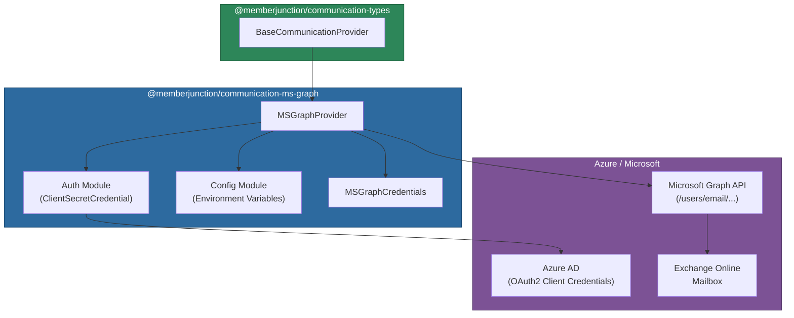

# @memberjunction/communication-ms-graph

Microsoft Graph (Office 365 / Exchange Online) provider for the MemberJunction Communication Framework. This provider enables full mailbox operations -- sending, receiving, searching, managing folders, attachments, drafts, and more -- through the Microsoft Graph API with Azure AD application authentication.

## Architecture



## Installation

```bash
npm install @memberjunction/communication-ms-graph
```

## Configuration

Set the following environment variables:

```env
AZURE_TENANT_ID=your-azure-tenant-id
AZURE_CLIENT_ID=your-azure-app-client-id
AZURE_CLIENT_SECRET=your-azure-app-client-secret
AZURE_ACCOUNT_EMAIL=mailbox@yourdomain.com
```

### Required Azure AD App Permissions (Application type)

| Permission | Operations |
|-----------|------------|
| `Mail.Send` | SendSingleMessage, ForwardMessage, ReplyToMessage |
| `Mail.Read` | GetMessages, GetSingleMessage, SearchMessages, ListFolders, ListAttachments, DownloadAttachment |
| `Mail.ReadWrite` | CreateDraft, DeleteMessage, MoveMessage, MarkAsRead, ArchiveMessage |
| `User.Read.All` | GetServiceAccount (user lookup, optional) |

## Supported Operations

This provider supports all 14 operations defined in `BaseCommunicationProvider`:

| Operation | Description |
|-----------|-------------|
| `SendSingleMessage` | Send email via Graph API |
| `GetMessages` | Retrieve messages with filtering and header extraction |
| `GetSingleMessage` | Retrieve a single message by ID |
| `ForwardMessage` | Forward email to new recipients |
| `ReplyToMessage` | Reply to an existing email thread |
| `CreateDraft` | Create a draft message in the mailbox |
| `DeleteMessage` | Move to Deleted Items or permanently delete |
| `MoveMessage` | Move message to a different mail folder |
| `ListFolders` | List mail folders with optional message counts |
| `MarkAsRead` | Mark messages as read or unread (batch) |
| `ArchiveMessage` | Move message to Archive folder |
| `SearchMessages` | Full-text search with KQL syntax and date filtering |
| `ListAttachments` | List attachments on a message |
| `DownloadAttachment` | Download attachment content as base64/Buffer |

## Usage

### Sending Email

```typescript
import { CommunicationEngine } from '@memberjunction/communication-engine';
import { Message } from '@memberjunction/communication-types';

const engine = CommunicationEngine.Instance;
await engine.Config(false, contextUser);

const message = new Message();
message.From = 'user@yourdomain.com';
message.To = 'recipient@example.com';
message.Subject = 'Hello from MS Graph';
message.HTMLBody = '<h1>Hello</h1><p>Sent via Microsoft Graph.</p>';
message.ContextData = { saveToSentItems: true };

const result = await engine.SendSingleMessage(
    'Microsoft Graph',
    'Standard Email',
    message
);
```

### Per-Request Credentials

Override credentials on a per-request basis for multi-tenant scenarios:

```typescript
import { MSGraphCredentials } from '@memberjunction/communication-ms-graph';

const result = await engine.SendSingleMessage(
    'Microsoft Graph',
    'Standard Email',
    message,
    undefined,
    false,
    {
        tenantId: 'customer-tenant-id',
        clientId: 'customer-app-id',
        clientSecret: 'customer-secret',
        accountEmail: 'user@customer.com'
    } as MSGraphCredentials
);
```

### Reading Messages

```typescript
const provider = engine.GetProvider('Microsoft Graph');

const result = await provider.GetMessages({
    NumMessages: 10,
    UnreadOnly: true,
    IncludeHeaders: true,
    ContextData: {
        ReturnAsPlainText: true,
        MarkAsRead: true
    }
});

result.Messages.forEach(msg => {
    console.log(`${msg.From}: ${msg.Subject}`);
    console.log(`Thread: ${msg.ThreadID}`);
});
```

### Searching Messages

MS Graph supports KQL (Keyword Query Language) for search:

```typescript
const result = await provider.SearchMessages({
    Query: 'invoice',
    FromDate: new Date('2025-01-01'),
    MaxResults: 25,
    FolderID: 'inbox-folder-id'
});
```

### Creating Drafts

```typescript
const result = await engine.CreateDraft(message, 'Microsoft Graph', contextUser);
if (result.Success) {
    console.log(`Draft ID: ${result.DraftID}`);
}
```

### Managing Folders

```typescript
// List top-level folders
const folders = await provider.ListFolders({ IncludeCounts: true });
folders.Folders.forEach(f => {
    console.log(`${f.Name}: ${f.MessageCount} total, ${f.UnreadCount} unread`);
});

// List subfolders
const subfolders = await provider.ListFolders({
    ParentFolderID: 'parent-folder-id',
    IncludeCounts: true
});

// Move a message
await provider.MoveMessage({
    MessageID: 'msg-id',
    DestinationFolderID: 'folder-id'
});

// Archive a message
await provider.ArchiveMessage({ MessageID: 'msg-id' });
```

### Downloading Attachments

```typescript
const attachments = await provider.ListAttachments({ MessageID: 'msg-id' });
for (const att of attachments.Attachments) {
    const download = await provider.DownloadAttachment({
        MessageID: 'msg-id',
        AttachmentID: att.ID
    });
    // download.Content is a Buffer
    // download.ContentBase64 is the raw base64 string
}
```

## Client Caching

The provider caches Microsoft Graph `Client` instances per credential set for performance. Environment credential clients are shared across all calls; per-request credential clients are cached by `tenantId:clientId`.

## System Folder Mapping

| Exchange Display Name | SystemFolderType |
|----------------------|-----------------|
| Inbox | `inbox` |
| Sent Items | `sent` |
| Drafts | `drafts` |
| Deleted Items | `trash` |
| Junk Email | `spam` |
| Archive | `archive` |
| Other folders | `other` |

## HTML to Text Conversion

When `ReturnAsPlainText` is set in `ContextData`, the provider uses the `html-to-text` library to convert HTML email bodies to plain text with 130-character word wrap.

## Dependencies

| Package | Purpose |
|---------|---------|
| `@memberjunction/communication-types` | Base provider class and type definitions |
| `@memberjunction/core` | Logging utilities |
| `@memberjunction/global` | RegisterClass decorator |
| `@microsoft/microsoft-graph-client` | Microsoft Graph SDK |
| `@azure/identity` | Azure AD ClientSecretCredential |
| `html-to-text` | HTML to plain text conversion |

## Development

```bash
npm run build    # Compile TypeScript
npm run clean    # Remove dist directory
```
