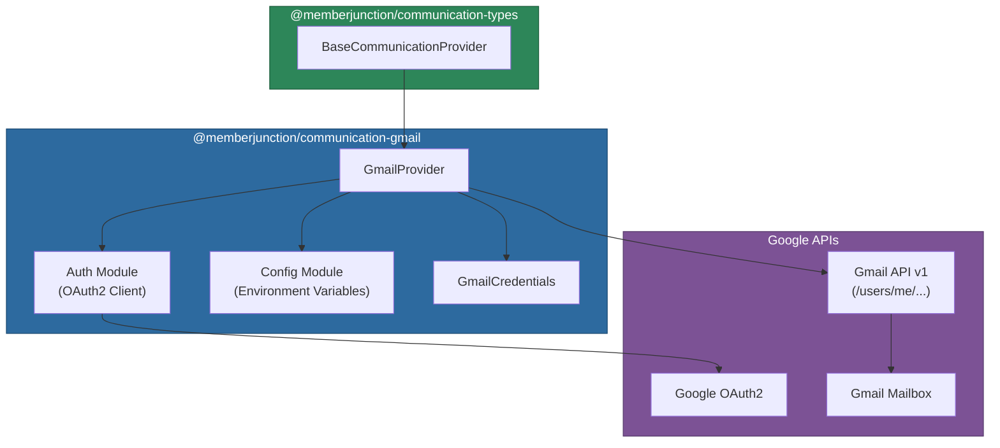

# @memberjunction/communication-gmail

Gmail / Google Workspace provider for the MemberJunction Communication Framework. This provider enables full mailbox operations -- sending, receiving, searching, managing labels, attachments, drafts, and more -- through the Gmail API with OAuth2 authentication.

## Architecture



## Installation

```bash
npm install @memberjunction/communication-gmail
```

## Configuration

Set the following environment variables:

```env
GMAIL_CLIENT_ID=your-oauth2-client-id
GMAIL_CLIENT_SECRET=your-oauth2-client-secret
GMAIL_REDIRECT_URI=your-redirect-uri
GMAIL_REFRESH_TOKEN=your-refresh-token
GMAIL_SERVICE_ACCOUNT_EMAIL=noreply@yourdomain.com   # optional default sender
```

### Required OAuth2 Scopes

- `https://www.googleapis.com/auth/gmail.send`
- `https://www.googleapis.com/auth/gmail.readonly`
- `https://www.googleapis.com/auth/gmail.modify`
- `https://www.googleapis.com/auth/gmail.compose`

### Obtaining OAuth2 Credentials

1. Go to the [Google Cloud Console](https://console.cloud.google.com/)
2. Create or select a project and enable the Gmail API
3. Create OAuth 2.0 Client ID credentials
4. Configure the OAuth consent screen
5. Use the OAuth2 flow to obtain a refresh token with the required scopes

## Supported Operations

This provider supports all 14 operations defined in `BaseCommunicationProvider`:

| Operation | Gmail Implementation |
|-----------|---------------------|
| `SendSingleMessage` | Send via `users.messages.send` |
| `GetMessages` | List and fetch with Gmail search query support |
| `GetSingleMessage` | Fetch single message by ID |
| `ForwardMessage` | Reconstruct and send as RFC 822 attachment |
| `ReplyToMessage` | Send in same thread via `threadId` |
| `CreateDraft` | Create via `users.drafts.create` |
| `DeleteMessage` | Trash or permanently delete |
| `MoveMessage` | Add/remove labels via `users.messages.modify` |
| `ListFolders` | List labels with optional message/unread counts |
| `MarkAsRead` | Add/remove UNREAD label (batch) |
| `ArchiveMessage` | Remove INBOX label |
| `SearchMessages` | Gmail query syntax with date filters |
| `ListAttachments` | Parse message parts recursively for attachments |
| `DownloadAttachment` | Download via `users.messages.attachments.get` |

## Usage

### Sending Email

```typescript
import { CommunicationEngine } from '@memberjunction/communication-engine';
import { Message } from '@memberjunction/communication-types';

const engine = CommunicationEngine.Instance;
await engine.Config(false, contextUser);

const message = new Message();
message.From = 'sender@gmail.com';
message.To = 'recipient@example.com';
message.Subject = 'Hello from Gmail';
message.HTMLBody = '<h1>Hello</h1>';
message.CCRecipients = ['cc@example.com'];

const result = await engine.SendSingleMessage('Gmail', 'Email', message);
```

### Per-Request Credentials

Override credentials for multi-user scenarios:

```typescript
import { GmailCredentials } from '@memberjunction/communication-gmail';

const result = await provider.SendSingleMessage(processedMessage, {
    clientId: 'other-client-id',
    clientSecret: 'other-secret',
    redirectUri: 'other-redirect',
    refreshToken: 'user-specific-refresh-token'
} as GmailCredentials);
```

### Retrieving Messages

```typescript
const provider = engine.GetProvider('Gmail');

const result = await provider.GetMessages({
    NumMessages: 10,
    UnreadOnly: true,
    ContextData: {
        query: 'from:important@example.com',  // Gmail search syntax
        MarkAsRead: true
    }
});

result.Messages.forEach(msg => {
    console.log(`${msg.From}: ${msg.Subject}`);
    console.log(`Thread: ${msg.ThreadID}`);
});
```

### Creating Drafts

```typescript
const result = await provider.CreateDraft({ Message: processedMessage });
if (result.Success) {
    console.log(`Draft ID: ${result.DraftID}`);
    // Draft appears in Gmail drafts folder
}
```

### Searching with Gmail Query Syntax

```typescript
const result = await provider.SearchMessages({
    Query: 'has:attachment',
    FromDate: new Date('2025-01-01'),
    ToDate: new Date('2025-06-01'),
    FolderID: 'INBOX',    // Gmail label ID
    MaxResults: 50
});
```

### Managing Labels (Folders)

```typescript
const folders = await provider.ListFolders({ IncludeCounts: true });
folders.Folders.forEach(f => {
    console.log(`${f.Name} (${f.ID}): ${f.MessageCount} messages`);
    console.log(`  System: ${f.IsSystemFolder}, Type: ${f.SystemFolderType}`);
});
```

### Downloading Attachments

```typescript
const attachments = await provider.ListAttachments({ MessageID: 'msg-id' });
for (const att of attachments.Attachments) {
    const download = await provider.DownloadAttachment({
        MessageID: 'msg-id',
        AttachmentID: att.ID
    });
    // download.Content is a Buffer
    // download.ContentBase64 is base64 string
    // download.Filename, download.ContentType available
}
```

## Gmail Label Mapping

Gmail uses labels instead of traditional folders. The provider maps system labels to standard folder types:

| Gmail Label | SystemFolderType |
|-------------|-----------------|
| `INBOX` | `inbox` |
| `SENT` | `sent` |
| `DRAFT` | `drafts` |
| `TRASH` | `trash` |
| `SPAM` | `spam` |
| User labels | `undefined` |

## Client Caching

The provider caches Gmail API client instances for performance. Environment credential clients are shared across all calls; per-request credential clients are cached by a key derived from `clientId` and `refreshToken`.

## Security Considerations

1. Store refresh tokens securely and never commit them to version control
2. Request only the minimum required OAuth2 scopes
3. Use secure methods to manage environment variables in production
4. Regularly rotate client secrets and monitor API usage

## Dependencies

| Package | Purpose |
|---------|---------|
| `@memberjunction/communication-types` | Base provider class and type definitions |
| `@memberjunction/core` | Logging utilities |
| `@memberjunction/global` | RegisterClass decorator |
| `googleapis` | Google APIs Node.js client |
| `dotenv` | Environment variable loading |
| `env-var` | Environment variable validation |

## Development

```bash
npm run build    # Compile TypeScript
npm run clean    # Remove dist directory
```
