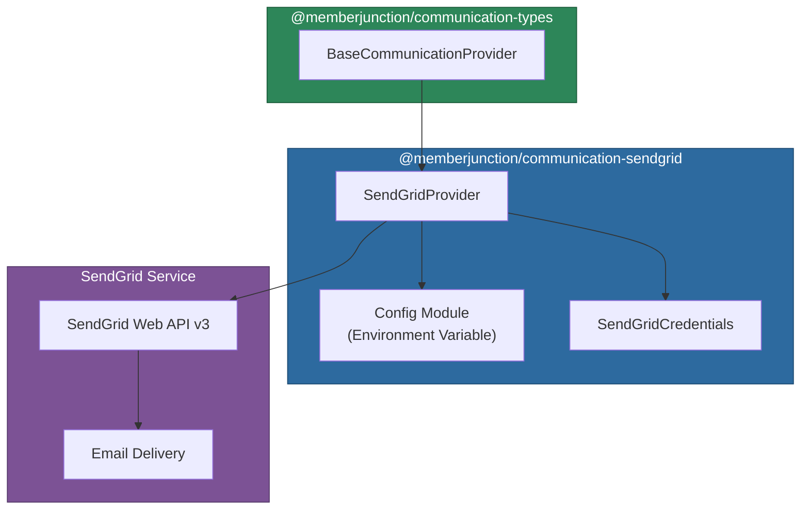

# @memberjunction/communication-sendgrid

SendGrid provider for the MemberJunction Communication Framework. This provider enables transactional email sending through the SendGrid API, with support for HTML and plain text content, CC/BCC recipients, scheduled delivery, and per-request credential overrides.

## Architecture



## Installation

```bash
npm install @memberjunction/communication-sendgrid
```

## Configuration

Set the following environment variable:

```env
COMMUNICATION_VENDOR_API_KEY__SENDGRID=SG.your-api-key-here
```

## Supported Operations

SendGrid is a send-only transactional email service. It does not provide mailbox access.

| Operation | Supported | Notes |
|-----------|-----------|-------|
| `SendSingleMessage` | Yes | Full email sending with HTML, text, CC/BCC, scheduling |
| `GetMessages` | No | No inbox access (throws error) |
| `ForwardMessage` | No | No mailbox operations (throws error) |
| `ReplyToMessage` | No | No mailbox operations (throws error) |
| `CreateDraft` | No | No mailbox access (returns error result) |
| Extended operations | No | No folder, search, or attachment operations |

## Usage

### Sending Email via CommunicationEngine

```typescript
import { CommunicationEngine } from '@memberjunction/communication-engine';
import { Message } from '@memberjunction/communication-types';

const engine = CommunicationEngine.Instance;
await engine.Config(false, contextUser);

const message = new Message();
message.From = 'noreply@example.com';
message.FromName = 'My Application';
message.To = 'recipient@example.com';
message.Subject = 'Order Confirmation';
message.HTMLBody = '<h1>Thank you for your order</h1>';
message.Body = 'Thank you for your order';
message.CCRecipients = ['accounting@example.com'];

const result = await engine.SendSingleMessage('SendGrid', 'Email', message);
if (result.Success) {
    console.log('Email sent successfully');
}
```

### Scheduled Sending

```typescript
const message = new Message();
message.From = 'noreply@example.com';
message.To = 'recipient@example.com';
message.Subject = 'Scheduled Report';
message.Body = 'Your weekly report is attached.';
message.SendAt = new Date('2025-12-01T09:00:00Z');

const result = await engine.SendSingleMessage('SendGrid', 'Email', message);
```

### Per-Request Credentials

Override the API key for multi-tenant or customer-specific sending:

```typescript
import { SendGridCredentials } from '@memberjunction/communication-sendgrid';

// Override API key
const result = await engine.SendSingleMessage(
    'SendGrid',
    'Email',
    message,
    undefined,
    false,
    { apiKey: 'SG.customer-specific-api-key' } as SendGridCredentials
);

// Disable environment fallback (require explicit key)
const result2 = await engine.SendSingleMessage(
    'SendGrid',
    'Email',
    message,
    undefined,
    false,
    {
        apiKey: 'SG.required-key',
        disableEnvironmentFallback: true
    } as SendGridCredentials
);
```

### Direct Provider Usage

```typescript
import { SendGridProvider } from '@memberjunction/communication-sendgrid';

const provider = new SendGridProvider();
const result = await provider.SendSingleMessage(processedMessage);
```

## Message Features

| Feature | Support |
|---------|---------|
| HTML body | Yes |
| Plain text body | Yes |
| CC recipients | Yes |
| BCC recipients | Yes |
| From name | Yes |
| Scheduled send (`SendAt`) | Yes (converted to Unix timestamp) |
| Subscription tracking | Disabled by default |

## SendGridCredentials

```typescript
interface SendGridCredentials extends ProviderCredentialsBase {
    /** SendGrid API key (typically starts with 'SG.') */
    apiKey?: string;
    /** If true, do not fall back to environment variables */
    disableEnvironmentFallback?: boolean;
}
```

## Dependencies

| Package | Purpose |
|---------|---------|
| `@memberjunction/communication-types` | Base provider class and type definitions |
| `@memberjunction/core` | Logging utilities (LogError, LogStatus) |
| `@memberjunction/global` | RegisterClass decorator |
| `@sendgrid/mail` | Official SendGrid Node.js client |
| `dotenv` | Environment variable loading |
| `env-var` | Environment variable validation |

## Development

```bash
npm run build    # Compile TypeScript
npm run clean    # Remove dist directory
```
