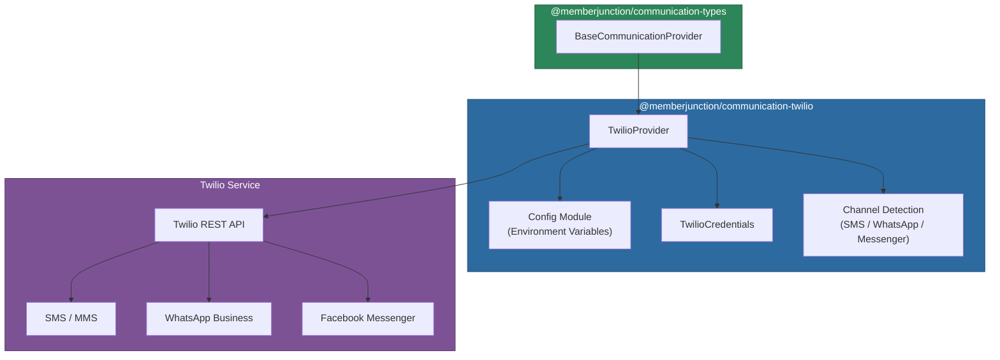
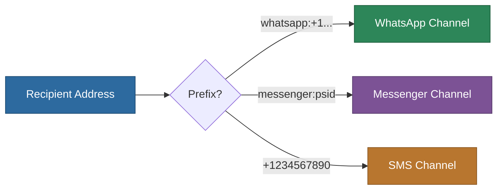

# @memberjunction/communication-twilio

Twilio provider for the MemberJunction Communication Framework. This provider enables messaging across multiple channels -- SMS, WhatsApp Business, and Facebook Messenger -- through the Twilio API. The channel is automatically detected based on recipient format.

## Architecture



## Installation

```bash
npm install @memberjunction/communication-twilio
```

## Configuration

Set the following environment variables:

```env
# Required
TWILIO_ACCOUNT_SID=your-account-sid
TWILIO_AUTH_TOKEN=your-auth-token
TWILIO_PHONE_NUMBER=+1234567890

# Optional (for additional channels)
TWILIO_WHATSAPP_NUMBER=+1234567890
TWILIO_FACEBOOK_PAGE_ID=your-page-id
```

## Channel Detection

The provider automatically selects the messaging channel based on the recipient format:



| Recipient Format | Channel | From Number Config |
|-----------------|---------|-------------------|
| `+1234567890` | SMS | `TWILIO_PHONE_NUMBER` |
| `whatsapp:+1234567890` | WhatsApp | `TWILIO_WHATSAPP_NUMBER` |
| `messenger:user_psid` | Facebook Messenger | `TWILIO_FACEBOOK_PAGE_ID` |

## Supported Operations

| Operation | Supported | Notes |
|-----------|-----------|-------|
| `SendSingleMessage` | Yes | Auto-detects channel, supports media URLs |
| `GetMessages` | Yes | Filter by from, to, dateSent |
| `ForwardMessage` | Yes | Reconstructs message body with forward prefix |
| `ReplyToMessage` | Yes | Fetches original, sends to original sender |
| `CreateDraft` | No | Messaging services have no draft concept |
| Extended operations | No | No folder, search, or attachment operations |

## Usage

### Sending SMS

```typescript
import { CommunicationEngine } from '@memberjunction/communication-engine';
import { Message } from '@memberjunction/communication-types';

const engine = CommunicationEngine.Instance;
await engine.Config(false, contextUser);

const message = new Message();
message.To = '+1234567890';
message.Body = 'Hello from MemberJunction!';

const result = await engine.SendSingleMessage('Twilio', 'Standard SMS', message);
```

### Sending WhatsApp Message

```typescript
const message = new Message();
message.To = 'whatsapp:+1234567890';
message.Body = 'Hello via WhatsApp!';

const result = await engine.SendSingleMessage('Twilio', 'Standard SMS', message);
```

### Sending Facebook Messenger Message

```typescript
const message = new Message();
message.To = 'messenger:user_psid';
message.Body = 'Hello via Messenger!';

const result = await engine.SendSingleMessage('Twilio', 'Standard SMS', message);
```

### Sending Media (MMS / WhatsApp)

```typescript
const message = new Message();
message.To = '+1234567890';
message.Body = 'Check out this image!';
message.ContextData = {
    mediaUrls: ['https://example.com/image.jpg']
};

const result = await engine.SendSingleMessage('Twilio', 'Standard SMS', message);
```

### Retrieving Messages

```typescript
const provider = engine.GetProvider('Twilio');

const result = await provider.GetMessages({
    NumMessages: 50,
    ContextData: {
        from: '+1234567890',
        to: '+0987654321',
        dateSent: new Date('2025-01-01')
    }
});

result.Messages.forEach(msg => {
    console.log(`${msg.From} -> ${msg.To}: ${msg.Body}`);
});
```

### Per-Request Credentials

```typescript
import { TwilioCredentials } from '@memberjunction/communication-twilio';

const result = await provider.SendSingleMessage(processedMessage, {
    accountSid: 'customer-sid',
    authToken: 'customer-token',
    phoneNumber: '+1987654321'
} as TwilioCredentials);
```

### Replying to a Message

```typescript
const result = await provider.ReplyToMessage({
    MessageID: 'original-twilio-message-sid',
    Message: processedReply
});
```

### Forwarding a Message

```typescript
const result = await provider.ForwardMessage({
    MessageID: 'message-sid-to-forward',
    ToRecipients: ['+1234567890', 'whatsapp:+0987654321'],
    Message: 'FYI - forwarding this message'
});
```

## TwilioCredentials

```typescript
interface TwilioCredentials extends ProviderCredentialsBase {
    accountSid?: string;
    authToken?: string;
    phoneNumber?: string;
    whatsappNumber?: string;
    facebookPageId?: string;
    disableEnvironmentFallback?: boolean;
}
```

## Client Caching

The provider caches Twilio client instances for performance. Environment credential clients are shared across all calls; per-request credential clients are cached by `accountSid`.

## Important Notes

- SMS/messaging channels use **plain text only** -- HTML content is not supported
- Message threading is simulated using Twilio Message SIDs (Twilio has no native thread concept)
- Forwarding reconstructs the message content with a "Forwarded message" prefix
- Media attachments are supported through the `mediaUrls` context data property
- All operations are asynchronous via the Twilio REST API

## Dependencies

| Package | Purpose |
|---------|---------|
| `@memberjunction/communication-types` | Base provider class and type definitions |
| `@memberjunction/core` | Logging utilities (LogError, LogStatus) |
| `@memberjunction/global` | RegisterClass decorator |
| `twilio` | Official Twilio SDK |
| `dotenv` | Environment variable loading |
| `env-var` | Environment variable validation |

## Development

```bash
npm run build    # Compile TypeScript
npm run clean    # Remove dist directory
```
