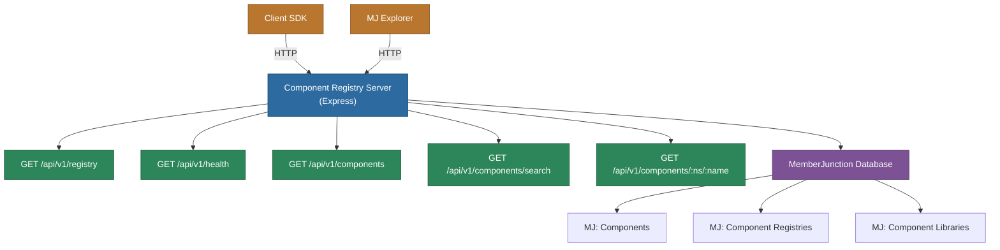

# @memberjunction/component-registry-server

REST API server for serving MemberJunction interactive components. Provides a standardized API for discovering, searching, and retrieving components and their specifications.

## Overview

The Component Registry Server provides a standardized REST API for discovering and retrieving MemberJunction interactive components. It implements the Component Registry API v1 specification, allowing any MemberJunction system to connect and consume components dynamically.



## Features

- **REST API v1**: Standardized endpoints for component discovery and retrieval
- **Extensible Architecture**: Base class design allows easy customization via inheritance
- **Authentication Support**: Override methods to implement custom authentication
- **Database Integration**: Uses MemberJunction's entity system for component storage
- **CORS Support**: Configurable cross-origin resource sharing
- **Component Versioning**: Automatic selection of latest component versions
- **Search Capabilities**: Full-text search across component names, titles, and descriptions

## Installation

```bash
npm install @memberjunction/component-registry-server
```

## Quick Start

### 1. Configure the Server

Add configuration to your `mj.config.cjs` file in the project root:

```javascript
module.exports = {
  // Database configuration
  dbHost: 'localhost',
  dbDatabase: 'MemberJunction',
  dbUsername: 'your-username',
  dbPassword: 'your-password',
  mjCoreSchema: '__mj',
  
  // Component Registry configuration
  componentRegistrySettings: {
    port: 3200,                    // Port to run the server on
    enableRegistry: true,           // Enable the registry server
    registryId: null,              // Optional: GUID of registry record
    requireAuth: false,            // Whether to require authentication
    corsOrigins: ['*']             // Allowed CORS origins
  }
};
```

### 2. Run the Server

```bash
# Using npm scripts
npm start

# Or directly via node
node dist/index.js
```

The server will start on the configured port (default: 3200) and be available at:
```
http://localhost:3200/api/v1
```

## API Endpoints

### Registry Information

**GET /api/v1/registry**
```json
{
  "name": "Local Component Registry",
  "description": "MemberJunction Component Registry",
  "version": "v1",
  "requiresAuth": false
}
```

### Health Check

**GET /api/v1/health**
```json
{
  "status": "healthy",
  "timestamp": "2024-01-01T00:00:00.000Z",
  "version": "v1",
  "componentCount": 42
}
```

### List Components

**GET /api/v1/components**
```json
{
  "components": [
    {
      "namespace": "@memberjunction/dashboards",
      "name": "revenue-tracker",
      "version": "1.0.0",
      "title": "Revenue Tracker Dashboard",
      "description": "Track revenue metrics over time",
      "type": "Dashboard",
      "status": "Published"
    }
  ],
  "total": 1
}
```

### Search Components

**GET /api/v1/components/search?q=revenue&type=Dashboard**
```json
{
  "results": [...],
  "total": 5,
  "query": "revenue"
}
```

### Get Component

**GET /api/v1/components/:namespace/:name**
```json
{
  "id": "550e8400-e29b-41d4-a716-446655440000",
  "namespace": "@memberjunction/dashboards",
  "name": "revenue-tracker",
  "version": "1.0.0",
  "specification": {
    "name": "revenue-tracker",
    "title": "Revenue Tracker Dashboard",
    "code": "// Component code here",
    "props": [...],
    "dataRequirements": [...]
  }
}
```

Optional version parameter:
**GET /api/v1/components/:namespace/:name?version=1.0.0**

## Extending the Server

The Component Registry Server is designed to be easily extended through inheritance. The base `ComponentRegistryAPIServer` class provides virtual methods that can be overridden to customize behavior.

### Custom Authentication

Create a subclass and override the `checkAPIKey` method:

```typescript
import { ComponentRegistryAPIServer } from '@memberjunction/component-registry-server';
import { Request } from 'express';

class MyAuthenticatedRegistryServer extends ComponentRegistryAPIServer {
  /**
   * Implement custom authentication logic
   */
  protected async checkAPIKey(req: Request): Promise<boolean> {
    // Check for API key in header
    const apiKey = req.headers['x-api-key'] as string;
    if (!apiKey) {
      return false;
    }
    
    // Validate against your auth provider
    return await this.validateWithAuthProvider(apiKey);
  }
  
  private async validateWithAuthProvider(apiKey: string): Promise<boolean> {
    // Your custom validation logic here
    // Could check database, external service, JWT, etc.
    return apiKey === process.env.VALID_API_KEY;
  }
}

// Start your custom server
const server = new MyAuthenticatedRegistryServer();
await server.initialize();
await server.start();
```

### Custom Component Filtering

Override the `getComponentFilter` method to control which components are served:

```typescript
class FilteredRegistryServer extends ComponentRegistryAPIServer {
  /**
   * Only serve components from specific registries
   */
  protected getComponentFilter(): string {
    // Serve local components and components from a specific registry
    return "(SourceRegistryID IS NULL OR SourceRegistryID = 'abc-123-def')";
  }
}
```

### Using Different Database Tables

Override the route handlers to pull components from different tables or entities:

```typescript
class CustomTableRegistryServer extends ComponentRegistryAPIServer {
  /**
   * Use a different entity/table for components
   * For example, using a "Custom Components" entity instead of "MJ: Components"
   */
  protected async listComponents(req: Request, res: Response): Promise<void> {
    try {
      const rv = new RunView();
      const result = await rv.RunView({
        EntityName: 'Custom Components',  // Your custom entity name
        ExtraFilter: "IsActive = 1 AND IsPublished = 1",
        OrderBy: 'CategoryName, ComponentName, Version DESC',
        ResultType: 'entity_object'
      });
      
      if (!result.Success) {
        res.status(500).json({ error: result.ErrorMessage });
        return;
      }
      
      // Map your custom fields to the API response format
      const components = (result.Results || []).map(c => ({
        namespace: c.CategoryName,     // Map your fields
        name: c.ComponentName,          // to the expected
        version: c.Version,             // API format
        title: c.DisplayName,
        description: c.Summary,
        type: c.ComponentType,
        status: c.PublishStatus
      }));
      
      res.json({ components, total: components.length });
    } catch (error) {
      res.status(500).json({ error: 'Failed to list components' });
    }
  }
  
  protected async getComponent(req: Request, res: Response): Promise<void> {
    const { namespace, name } = req.params;
    
    const rv = new RunView();
    const result = await rv.RunView({
      EntityName: 'Custom Components',
      ExtraFilter: `CategoryName = '${namespace}' AND ComponentName = '${name}'`,
      OrderBy: 'Version DESC',
      MaxRows: 1,
      ResultType: 'entity_object'
    });
    
    if (!result.Success || !result.Results?.length) {
      res.status(404).json({ error: 'Component not found' });
      return;
    }
    
    const component = result.Results[0];
    res.json({
      id: component.ID,
      namespace: component.CategoryName,
      name: component.ComponentName,
      version: component.Version,
      specification: JSON.parse(component.ComponentSpec)  // Your spec field
    });
  }
  
  // Override search to use your custom table
  protected async searchComponents(req: Request, res: Response): Promise<void> {
    const { q, type } = req.query;
    
    let filter = "IsActive = 1 AND IsPublished = 1";
    if (q) {
      filter += ` AND (ComponentName LIKE '%${q}%' OR DisplayName LIKE '%${q}%')`;
    }
    if (type) {
      filter += ` AND ComponentType = '${type}'`;
    }
    
    // ... rest of implementation
  }
}
```

### Custom Routes and Middleware

Add additional routes or modify middleware:

```typescript
class ExtendedRegistryServer extends ComponentRegistryAPIServer {
  /**
   * Add custom middleware
   */
  protected setupMiddleware(): void {
    // Call parent middleware setup
    super.setupMiddleware();
    
    // Add custom middleware
    this.app.use('/api/v1/admin', this.adminAuthMiddleware);
    
    // Add request logging
    this.app.use((req, res, next) => {
      console.log(`${req.method} ${req.path}`);
      next();
    });
  }
  
  /**
   * Add custom routes
   */
  protected setupRoutes(): void {
    // Call parent route setup
    super.setupRoutes();
    
    // Add admin routes
    this.app.post('/api/v1/admin/components', this.createComponent.bind(this));
    this.app.delete('/api/v1/admin/components/:id', this.deleteComponent.bind(this));
  }
  
  private async createComponent(req: Request, res: Response) {
    // Custom component creation logic
  }
  
  private async deleteComponent(req: Request, res: Response) {
    // Custom component deletion logic
  }
}
```

### Database Provider Customization

Override the database setup for different providers:

```typescript
class PostgresRegistryServer extends ComponentRegistryAPIServer {
  /**
   * Use PostgreSQL instead of SQL Server
   */
  protected async setupDatabase(): Promise<void> {
    // Your PostgreSQL setup logic
    const pgClient = new PostgreSQLClient(config);
    await pgClient.connect();
    
    // Setup MemberJunction with PostgreSQL provider
    await setupPostgreSQLClient(pgClient);
  }
}
```

## Advanced Usage

### Programmatic Usage

Use the server as a library in your application:

```typescript
import { ComponentRegistryAPIServer } from '@memberjunction/component-registry-server';

async function startMyApp() {
  // Create and configure server
  const registryServer = new ComponentRegistryAPIServer();
  
  // Initialize without starting
  await registryServer.initialize();
  
  // Access the Express app for integration
  const app = registryServer.app;
  
  // Add to existing Express app
  existingApp.use('/registry', app);
  
  // Or start standalone
  await registryServer.start();
}
```

### Multiple Registry Support

Run multiple registries on different ports:

```typescript
class MultiRegistryManager {
  private registries: Map<string, ComponentRegistryAPIServer> = new Map();
  
  async startRegistry(name: string, port: number, registryId: string) {
    const server = new ComponentRegistryAPIServer();
    
    // Override configuration
    componentRegistrySettings.port = port;
    componentRegistrySettings.registryId = registryId;
    
    await server.initialize();
    await server.start();
    
    this.registries.set(name, server);
  }
  
  async startAll() {
    await this.startRegistry('public', 3200, 'public-registry-id');
    await this.startRegistry('private', 3201, 'private-registry-id');
    await this.startRegistry('internal', 3202, 'internal-registry-id');
  }
}
```

## Configuration Reference

### componentRegistrySettings

| Property | Type | Default | Description |
|----------|------|---------|-------------|
| `port` | number | 3200 | Port number for the server |
| `enableRegistry` | boolean | false | Whether to enable the registry server |
| `registryId` | string \| null | null | Optional GUID of the registry record in MJ: Component Registries |
| `requireAuth` | boolean | false | Whether to require authentication for component endpoints |
| `corsOrigins` | string[] | ['*'] | Allowed CORS origins |

## Database Schema

The Component Registry Server uses the following MemberJunction entities:

- **MJ: Component Registries**: Registry metadata and configuration
- **MJ: Components**: Component definitions and specifications
- **MJ: Component Libraries**: External library dependencies
- **MJ: Component Dependencies**: Component-to-component dependencies

## Security Considerations

### Authentication

By default, the server runs without authentication. For production use:

1. Set `requireAuth: true` in configuration
2. Extend the server class and override `checkAPIKey()`
3. Implement your authentication strategy (Bearer tokens, API keys, JWT, etc.)

### CORS

Configure CORS origins appropriately for your environment:

```javascript
componentRegistrySettings: {
  corsOrigins: [
    'https://app.example.com',
    'https://admin.example.com'
  ]
}
```

### SQL Injection

The server uses parameterized queries via MemberJunction's RunView system. User input is escaped when building filters.

## Troubleshooting

### Server Won't Start

1. Check database connection settings in `mj.config.cjs`
2. Ensure the database is accessible
3. Verify `enableRegistry` is set to `true`
4. Check port availability

### Components Not Found

1. Verify components exist in the database
2. Check component `Status` is 'Published'
3. Ensure `SourceRegistryID` is NULL for local components
4. Review the component filter if using a custom implementation

### Authentication Issues

1. Verify `requireAuth` setting matches your expectations
2. Check your `checkAPIKey` implementation
3. Ensure auth headers are being sent correctly

## Contributing

Contributions are welcome! Please follow the MemberJunction contribution guidelines.

## License

ISC License - See LICENSE file for details

## Support

For issues and questions:
- GitHub Issues: [MemberJunction/MJ](https://github.com/MemberJunction/MJ/issues)
- Documentation: [docs.memberjunction.org](https://docs.memberjunction.org)