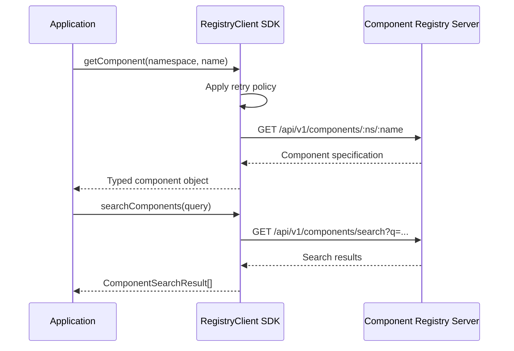

# @memberjunction/component-registry-client-sdk

TypeScript SDK for interacting with Component Registry servers. Provides a robust REST API client for fetching, searching, and managing interactive components from remote registries.

## Overview



## Features

- **Native Fetch** -- Uses native fetch API, no external HTTP dependencies
- **Retry Logic** -- Automatic retry with exponential backoff
- **Timeout Support** -- Configurable request timeouts
- **Type Safety** -- Full TypeScript support with comprehensive types
- **Component Management** -- Get, search, and resolve component dependencies
- **Authentication** -- Support for API key and Bearer token authentication
- **Registry Integration** -- Used by MJServer for external registry communication

## Installation

```bash
npm install @memberjunction/component-registry-client-sdk
```

## Usage

### Basic Setup

```typescript
import { ComponentRegistryClient } from '@memberjunction/component-registry-client-sdk';

const client = new ComponentRegistryClient({
    baseUrl: 'https://registry.example.com',
    apiKey: 'your-api-key',
    timeout: 30000
});
```

### Get a Component

```typescript
const component = await client.getComponent({
    registry: 'mj-central',
    namespace: 'core/ui',
    name: 'DataGrid',
    version: '1.0.0' // or 'latest'
});

console.log(component.name);
console.log(component.code);
```

### Search Components

```typescript
const results = await client.searchComponents({
    namespace: 'core/ui',
    query: 'dashboard',
    type: 'dashboard',
    tags: ['analytics', 'reporting'],
    limit: 20,
    offset: 0
});

console.log(`Found ${results.total} components`);
results.components.forEach(comp => {
    console.log(`- ${comp.name}: ${comp.description}`);
});
```

### Resolve Dependencies

```typescript
const dependencyTree = await client.resolveDependencies('component-123');

console.log(`Component has ${dependencyTree.totalCount} total dependencies`);
if (dependencyTree.circular) {
    console.warn('Circular dependency detected!');
}
```

## Configuration Options

```typescript
interface ComponentRegistryClientConfig {
    baseUrl: string;           // Registry server URL
    apiKey?: string;          // API key for authentication
    timeout?: number;         // Request timeout in ms (default: 30000)
    headers?: HeadersInit;    // Additional headers
    retryPolicy?: {
        maxRetries: number;       // Max retry attempts (default: 3)
        initialDelay: number;     // Initial delay in ms (default: 1000)
        maxDelay: number;         // Max delay in ms (default: 10000)
        backoffMultiplier: number; // Delay multiplier (default: 2)
    };
}
```

## Error Handling

The SDK provides typed errors with specific error codes:

```typescript
import { RegistryError, RegistryErrorCode } from '@memberjunction/component-registry-client-sdk';

try {
    const component = await client.getComponent({...});
} catch (error) {
    if (error instanceof RegistryError) {
        switch (error.code) {
            case RegistryErrorCode.COMPONENT_NOT_FOUND:
                console.log('Component not found');
                break;
            case RegistryErrorCode.AUTHENTICATION_FAILED:
                console.log('Invalid API key');
                break;
            case RegistryErrorCode.NETWORK_ERROR:
                console.log('Network issue:', error.details);
                break;
            default:
                console.error('Registry error:', error.message);
        }
    }
}
```

## Integration with MemberJunction

This SDK integrates seamlessly with the MemberJunction platform:

### GraphQL Integration

Use with the GraphQL data provider:

```typescript
import { GraphQLComponentRegistryClient } from '@memberjunction/graphql-dataprovider';

const graphQLClient = new GraphQLComponentRegistryClient(dataProvider);
const component = await graphQLClient.GetRegistryComponent({
    registryName: 'MJ',  // Registry name (globally unique)
    namespace: 'core/ui',
    name: 'DataGrid',
    version: 'latest'
});
```

### React Runtime Integration

Integrate with the React runtime:

```typescript
import { ComponentRegistryService } from '@memberjunction/react-runtime';

const registryService = ComponentRegistryService.getInstance(
    compiler,
    runtimeContext,
    debug,
    graphQLClient
);
```

## Architecture Overview

### Registry Communication Flow

1. **React Runtime** → Requests component with `registry` field in spec
2. **React Runtime** → Calls GraphQL API via `GraphQLComponentRegistryClient`
3. **MJServer** → Receives GraphQL request with registry name
4. **MJServer** → Creates `ComponentRegistryClient` on-demand
5. **MJServer** → Fetches component from external registry using API key
6. **External Registry** → Returns component specification
7. **MJServer** → Returns spec to React Runtime
8. **React Runtime** → Compiles and caches component

### Key Design Decisions

- **On-Demand Client Creation**: MJServer creates registry clients per-request, not pre-initialized
- **Registry Name Resolution**: Components reference registries by globally unique names, not IDs
- **API Key Management**: All API keys handled server-side in MJServer, never exposed to client
- **No Client-Side Caching**: This SDK doesn't cache responses; caching happens at higher layers

## API Reference

### `getComponent(params)`
Fetches a specific component from a registry.

### `searchComponents(params)`
Searches for components matching criteria.

### `resolveDependencies(componentId)`
Resolves the full dependency tree for a component.

### `getLatestVersion(registry, namespace, name)`
Gets the latest version of a component.

### `checkHealth()`
Checks if the registry server is healthy.

## License

MIT