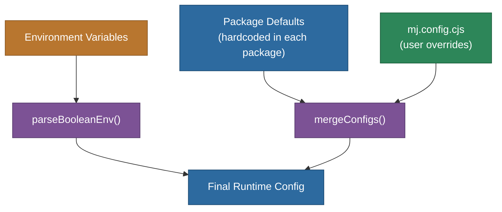
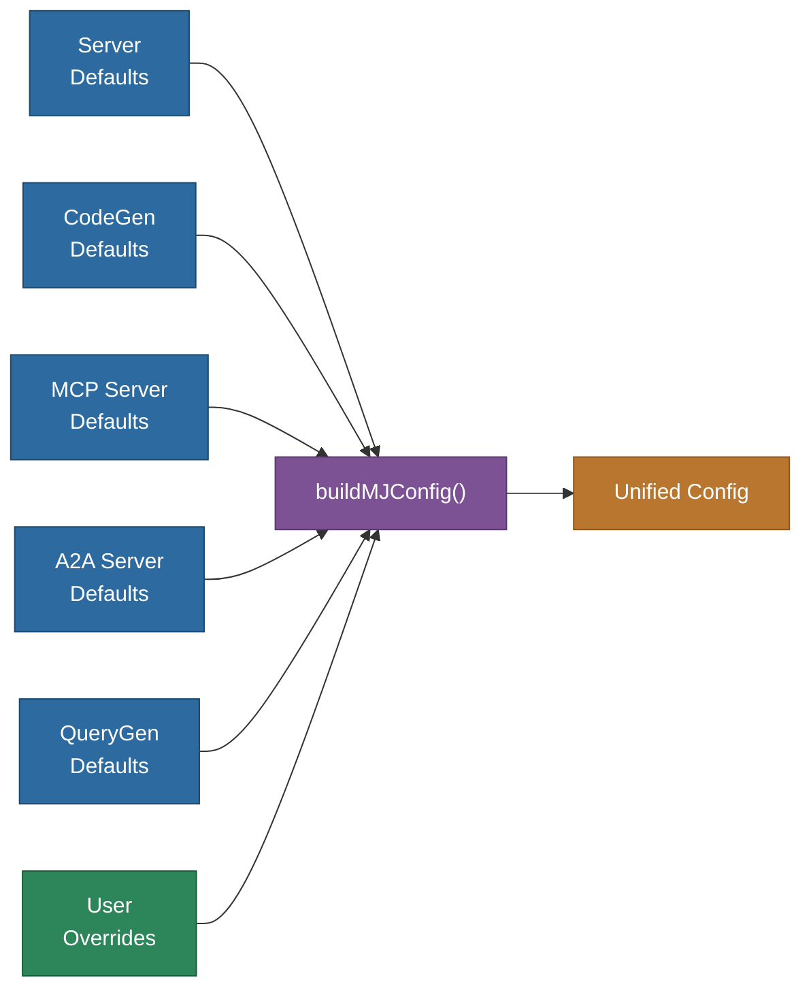
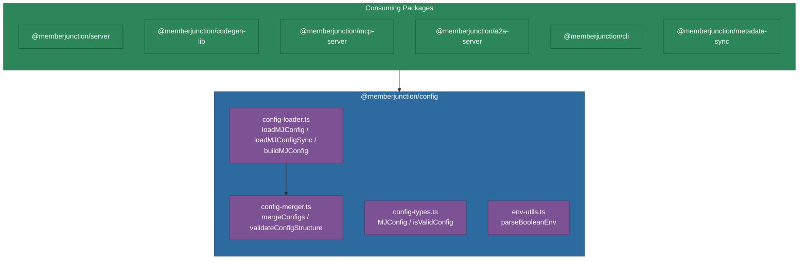

# @memberjunction/config

Central configuration loading and merging utilities for the MemberJunction framework. This package provides a standardized way for MJ packages to define default configurations, discover user override files, and merge them together with a deterministic precedence order.

## Overview

MemberJunction applications are configured through a layered system where each package defines its own defaults and users supply overrides through a shared `mj.config.cjs` file. This package provides the infrastructure that makes that layering work: config file discovery (via [cosmiconfig](https://github.com/cosmiconfig/cosmiconfig)), deep merge with customizable strategies, structure validation, and environment-variable parsing helpers.



## Installation

```bash
npm install @memberjunction/config
```

If you are working inside the MemberJunction monorepo, add the dependency to the consuming package's `package.json` and run `npm install` at the repository root.

## Configuration File Discovery

When `loadMJConfig()` is called it uses cosmiconfig to walk up the directory tree looking for the first matching file in the following order:

| Priority | File / Location | Format |
|----------|----------------|--------|
| 1 | `mj.config.cjs` | CommonJS |
| 2 | `mj.config.js` | ESM / CommonJS |
| 3 | `.mjrc` | JSON / YAML |
| 4 | `.mjrc.js` | ESM / CommonJS |
| 5 | `.mjrc.cjs` | CommonJS |
| 6 | `"mj"` key in `package.json` | JSON |

The recommended convention across MemberJunction is `mj.config.cjs` placed at the repository root.

## Usage

### Loading Configuration (Async)

The primary entry point. It discovers the user's config file, merges it with the package defaults, and returns the result along with metadata about what was loaded.

```typescript
import { loadMJConfig } from '@memberjunction/config';

interface MyPackageConfig {
  port: number;
  debug: boolean;
  database: {
    host: string;
    pool: { max: number; min: number };
  };
}

const MY_DEFAULTS: MyPackageConfig = {
  port: 4000,
  debug: false,
  database: {
    host: 'localhost',
    pool: { max: 50, min: 5 }
  }
};

const result = await loadMJConfig<MyPackageConfig>({
  defaultConfig: MY_DEFAULTS,
  verbose: true            // logs discovery / merge details
});

console.log(result.config);          // merged configuration object
console.log(result.hasUserConfig);   // true if mj.config.cjs was found
console.log(result.configFilePath);  // path to the discovered file
console.log(result.overriddenKeys);  // top-level keys the user changed
```

### Loading Configuration (Sync)

For cases where an async call is not possible (CommonJS bootstrap code, for example), `loadMJConfigSync` accepts an explicit file path instead of searching the directory tree.

```typescript
import { loadMJConfigSync } from '@memberjunction/config';

const config = loadMJConfigSync<MyPackageConfig>(
  '/absolute/path/to/mj.config.cjs',
  { defaultConfig: MY_DEFAULTS }
);
```

### Building a Multi-Package Configuration

`buildMJConfig` composes defaults from several MJ packages into a single configuration object before applying user overrides. This is typically called at application startup.

```typescript
import { buildMJConfig } from '@memberjunction/config';

const config = buildMJConfig(
  {
    server:    serverDefaults,
    codegen:   codegenDefaults,
    mcpServer: mcpDefaults,
    a2aServer: a2aDefaults,
    queryGen:  queryGenDefaults
  },
  userOverrides   // optional -- from mj.config.cjs
);
```



### Merging Configurations Directly

`mergeConfigs` performs a deep merge of two plain objects. It is used internally by the loader functions and is also exported for packages that need to merge configuration fragments on their own.

```typescript
import { mergeConfigs } from '@memberjunction/config';

const merged = mergeConfigs(defaults, overrides, {
  concatenateArrays: false,   // true to append arrays instead of replacing
  allowNullOverrides: false   // true to let null values clear defaults
});
```

#### Merge Rules

| Source Type | Behavior |
|-------------|----------|
| Primitive (string, number, boolean) | Override replaces default |
| Object | Deep recursive merge |
| Array | Override replaces default (or concatenates if `concatenateArrays: true`) |
| `null` / `undefined` in override | Ignored by default; replaces if `allowNullOverrides: true` |
| Key with `_append` suffix | Concatenates the array onto the matching base key |

The `_append` suffix is especially useful when a user wants to add items to a default array without wiping it out:

```javascript
// mj.config.cjs
module.exports = {
  // Instead of replacing excludeSchemas entirely, append to the defaults
  excludeSchemas_append: ['staging', 'archive']
};
```

### Validating Configuration Structure

`validateConfigStructure` checks a merged configuration object against a set of expected top-level keys and logs warnings for any unexpected entries. This helps catch typos and deprecated settings early.

```typescript
import { validateConfigStructure } from '@memberjunction/config';

const allowedKeys = new Set(['port', 'debug', 'database', 'logging']);
validateConfigStructure(config, allowedKeys);
// Warns: "Unexpected configuration keys found: databse"
```

### Parsing Boolean Environment Variables

`parseBooleanEnv` normalizes the many string representations of boolean values commonly found in environment variables into a strict `true` / `false`.

```typescript
import { parseBooleanEnv } from '@memberjunction/config';

const debugMode = parseBooleanEnv(process.env.MJ_DEBUG);
```

Truthy values (case-insensitive): `true`, `1`, `yes`, `y`, `on`, `t`.
Everything else -- including `undefined`, empty string, and `null` -- returns `false`.

## API Reference

### Functions

#### `loadMJConfig<T>(options?): Promise<LoadConfigResult<T>>`

Asynchronously discovers and loads an MJ configuration file, merges it with the provided defaults, and returns the result.

#### `loadMJConfigSync<T>(configPath, options?): T`

Synchronously loads a configuration file from an explicit path and merges it with defaults. Does not search the directory tree.

#### `buildMJConfig(packageDefaults, userConfigOverrides?): Record<string, unknown>`

Merges default configurations from multiple MJ packages into a single object, then applies optional user overrides.

#### `mergeConfigs<T>(defaults, overrides, options?): T`

Deep-merges two plain objects using customizable strategies for arrays, nulls, and the `_append` suffix convention.

#### `validateConfigStructure(config, allowedKeys): void`

Logs warnings for any top-level keys in `config` that are not present in `allowedKeys`.

#### `parseBooleanEnv(value): boolean`

Parses a string (typically from `process.env`) into a boolean using common truthy conventions.

#### `isValidConfig(value): value is MJConfig`

Type guard that checks whether a value is a non-null object suitable for use as a configuration.

### Interfaces

#### `LoadConfigOptions`

| Property | Type | Default | Description |
|----------|------|---------|-------------|
| `searchFrom` | `string` | `process.cwd()` | Directory to start searching for the config file |
| `requireConfigFile` | `boolean` | `false` | Throw if no config file is found |
| `mergeOptions` | `MergeOptions` | `{}` | Controls array and null merge behavior |
| `verbose` | `boolean` | `false` | Log discovery and merge details to console |
| `defaultConfig` | `Record<string, unknown>` | `{}` | Base configuration provided by the calling package |

#### `LoadConfigResult<T>`

| Property | Type | Description |
|----------|------|-------------|
| `config` | `T` | The final merged configuration |
| `configFilePath` | `string \| undefined` | Path to the discovered user config file |
| `hasUserConfig` | `boolean` | Whether a user config file was found |
| `overriddenKeys` | `string[]` | Top-level keys that differ from defaults |

#### `MergeOptions`

| Property | Type | Default | Description |
|----------|------|---------|-------------|
| `concatenateArrays` | `boolean` | `false` | Append override arrays to defaults instead of replacing |
| `allowNullOverrides` | `boolean` | `false` | Allow `null` in overrides to clear default values |

### Types

#### `MJConfig`

```typescript
type MJConfig = Record<string, unknown>;
```

Generic configuration type. Each consuming package defines its own specific configuration interface.

## Architecture



## Dependencies

| Package | Purpose |
|---------|---------|
| [cosmiconfig](https://github.com/cosmiconfig/cosmiconfig) | Configuration file discovery and loading |
| [lodash.mergewith](https://lodash.com/docs/#mergeWith) | Deep merge with custom merge strategy |
| [zod](https://zod.dev/) | Schema validation (available for consumers) |

## Related Packages

| Package | Relationship |
|---------|-------------|
| `@memberjunction/server` | Defines `MJServerConfig` defaults; uses `mergeConfigs` and `parseBooleanEnv` |
| `@memberjunction/codegen-lib` | Defines `CodeGenConfig` defaults; uses `mergeConfigs` and `parseBooleanEnv` |
| `@memberjunction/mcp-server` | Defines `MCPServerConfig` defaults; uses `mergeConfigs` |
| `@memberjunction/a2a-server` | Defines `A2AServerConfig` defaults; uses `mergeConfigs` |
| `@memberjunction/cli` | CLI tool config loading; uses `mergeConfigs` and `parseBooleanEnv` |
| `@memberjunction/metadata-sync` | Metadata sync config; uses `mergeConfigs` and `parseBooleanEnv` |
