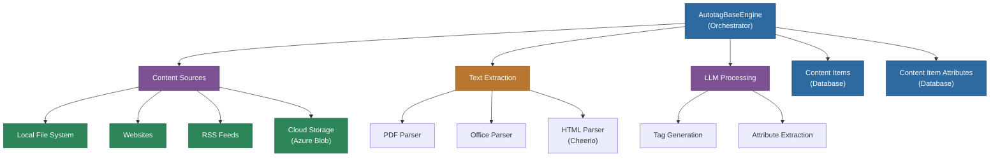
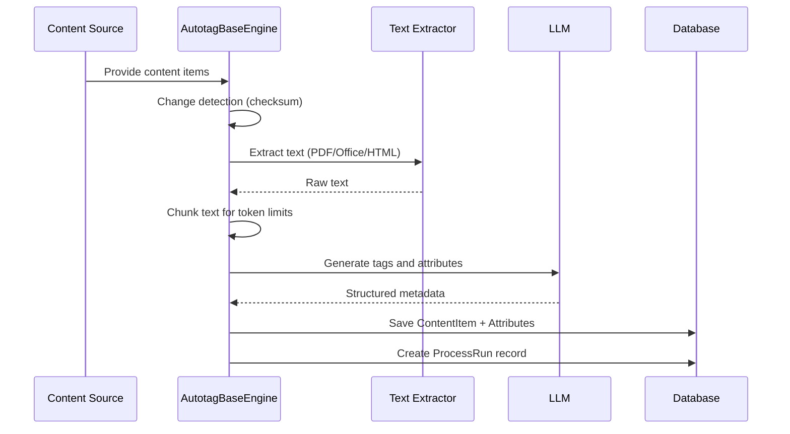

# @memberjunction/content-autotagging

AI-powered content ingestion and autotagging engine for MemberJunction. Scans content from multiple sources (local files, websites, RSS feeds, cloud storage), extracts text from documents, and uses LLMs to generate tags, summaries, and metadata attributes.

## Overview

The `@memberjunction/content-autotagging` package provides an extensible framework for ingesting content from diverse sources and leveraging AI models to extract meaningful tags, summaries, and metadata. Built on the MemberJunction platform, it helps organizations automatically organize and categorize their content.



## Installation

```bash
npm install @memberjunction/content-autotagging
```

## Content Processing Pipeline



## Content Sources

| Source | Class | Description |
|--------|-------|-------------|
| Local Files | `AutotagLocalFileSystem` | Scans local directories for documents |
| Websites | `AutotagWebsite` | Crawls web pages and extracts content |
| RSS Feeds | `AutotagRSSFeed` | Parses RSS/Atom feeds for articles |
| Azure Blob | `AutotagAzureBlob` | Processes files from Azure Blob Storage |

All sources extend `AutotagBase`, which provides the common interface for content discovery and ingestion.

## Supported File Formats

| Format | Library | Extensions |
|--------|---------|------------|
| PDF | `pdf-parse` | .pdf |
| Office Documents | `officeparser` | .docx, .xlsx, .pptx |
| HTML/Web Pages | `cheerio` | .html, .htm |
| Plain Text | Native | .txt, .md, .csv |

## Usage

### RSS Feed Processing

```typescript
import { AutotagRSSFeed } from '@memberjunction/content-autotagging';

const rssTagger = new AutotagRSSFeed();
await rssTagger.Autotag(contextUser);
```

### Website Content Processing

```typescript
import { AutotagWebsite } from '@memberjunction/content-autotagging';

const websiteTagger = new AutotagWebsite();
await websiteTagger.Autotag(contextUser);
```

### Local File System Processing

```typescript
import { AutotagLocalFileSystem } from '@memberjunction/content-autotagging';

const fileTagger = new AutotagLocalFileSystem();
await fileTagger.Autotag(contextUser);
```

### Azure Blob Storage Processing

```typescript
import { AutotagAzureBlob } from '@memberjunction/content-autotagging';

const blobTagger = new AutotagAzureBlob(
  process.env.AZURE_STORAGE_CONNECTION_STRING,
  'your-container-name'
);
await blobTagger.Authenticate();
await blobTagger.Autotag(contextUser);
```

### Direct Engine Usage

```typescript
import { AutotagBaseEngine } from '@memberjunction/content-autotagging';

const engine = AutotagBaseEngine.Instance;
await engine.ExtractTextAndProcessWithLLM(contentItems, contextUser);
```

## Creating a Custom Content Source

```typescript
import { AutotagBase } from '@memberjunction/content-autotagging';
import { RegisterClass } from '@memberjunction/global';

@RegisterClass(AutotagBase, 'AutotagCustomSource')
export class AutotagCustomSource extends AutotagBase {
  public async SetContentItemsToProcess(contentSources) {
    // Fetch and create content items from your custom source
    return contentItems;
  }

  public async Autotag(contextUser) {
    const contentSourceTypeID = await this.engine.setSubclassContentSourceType(
      'Custom Source', contextUser
    );
    const contentSources = await this.engine.getAllContentSources(
      contextUser, contentSourceTypeID
    );
    const contentItems = await this.SetContentItemsToProcess(contentSources);
    await this.engine.ExtractTextAndProcessWithLLM(contentItems, contextUser);
  }
}
```

## Database Entities

| Entity | Purpose |
|--------|---------|
| Content Sources | Configuration for each content source |
| Content Items | Individual pieces of content with extracted text |
| Content Item Tags | AI-generated tags |
| Content Item Attributes | Additional extracted metadata |
| Content Process Runs | Processing history and audit trail |
| Content Types | Content categorization definitions |
| Content Source Types | Source type definitions |
| Content File Types | Supported file format definitions |

## Dependencies

| Package | Purpose |
|---------|---------|
| `@memberjunction/core` | Entity system and metadata |
| `@memberjunction/global` | Class registration |
| `@memberjunction/core-entities` | Content entity types |
| `@memberjunction/ai` | LLM integration |
| `@memberjunction/aiengine` | AI Engine base class |
| `pdf-parse` | PDF text extraction |
| `officeparser` | Office document parsing |
| `cheerio` | HTML parsing |
| `axios` | HTTP requests for web content |
| `rss-parser` | RSS feed parsing |

## License

ISC
