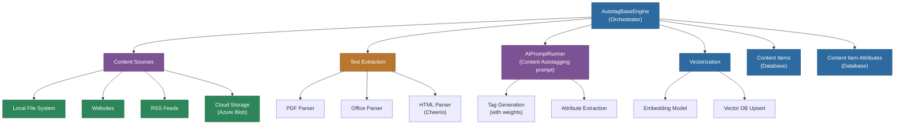

# @memberjunction/content-autotagging

AI-powered content ingestion, autotagging, and vectorization engine for MemberJunction. Scans content from multiple sources (local files, websites, RSS feeds, cloud storage), extracts text from documents, uses LLMs to generate weighted tags and metadata attributes, and vectorizes content for semantic search.

> **Read these guides first** if you're working on tag classification, taxonomy growth, or governance:
> - [Content Autotagging Guide](../../guides/CONTENT_AUTOTAGGING_GUIDE.md) — pipeline architecture, prompt structure, source-type providers
> - [Taxonomy & Tagging Guide](../../guides/TAXONOMY_TAGGING_GUIDE.md) — the tag taxonomy itself: 4+1-tier resolver, per-tag governance, scoping, the suggestion queue, Tag Health, and per-source configuration knobs

## Overview

The `@memberjunction/content-autotagging` package provides an extensible framework for ingesting content from diverse sources and leveraging AI models to extract meaningful tags, summaries, and metadata. Built on the MemberJunction platform, it helps organizations automatically organize and categorize their content. The engine uses the managed **"Content Autotagging"** AI prompt via `AIPromptRunner` (rather than direct `BaseLLM` calls), enabling prompt versioning, model routing, and centralized prompt management.


```mermaid
graph TD
    A["AutotagBaseEngine<br/>(Orchestrator)"] --> B["Content Sources"]
    B --> C["Local File System"]
    B --> D["Websites"]
    B --> E["RSS Feeds"]
    B --> F["Cloud Storage<br/>(Azure Blob)"]

    A --> G["Text Extraction"]
    G --> H["PDF Parser"]
    G --> I["Office Parser"]
    G --> J["HTML Parser<br/>(Cheerio)"]

    A --> K["AIPromptRunner<br/>(Content Autotagging prompt)"]
    K --> L["Tag Generation<br/>(with weights)"]
    K --> M["Attribute Extraction"]

    A --> V["Vectorization"]
    V --> W["Embedding Model"]
    V --> X["Vector DB Upsert"]

    A --> N["Content Items<br/>(Database)"]
    A --> O["Content Item Attributes<br/>(Database)"]

    style A fill:#2d6a9f,stroke:#1a4971,color:#fff
    style B fill:#7c5295,stroke:#563a6b,color:#fff
    style C fill:#2d8659,stroke:#1a5c3a,color:#fff
    style D fill:#2d8659,stroke:#1a5c3a,color:#fff
    style E fill:#2d8659,stroke:#1a5c3a,color:#fff
    style F fill:#2d8659,stroke:#1a5c3a,color:#fff
    style G fill:#b8762f,stroke:#8a5722,color:#fff
    style K fill:#7c5295,stroke:#563a6b,color:#fff
    style V fill:#2d6a9f,stroke:#1a4971,color:#fff
    style N fill:#2d6a9f,stroke:#1a4971,color:#fff
    style O fill:#2d6a9f,stroke:#1a4971,color:#fff
```

## Key Features

- **AIPromptRunner integration**: Uses the managed "Content Autotagging" prompt, enabling prompt versioning and model routing through MJ's prompt management system (no direct `BaseLLM` calls)
- **Tag weights**: Each generated tag includes a relevance weight (0.0--1.0) indicating how strongly the tag relates to the content
- **Streaming crawl → classify pipeline**: Content items flow into the LLM batcher as the crawler discovers them — total wall-clock is roughly `max(crawl, classify)` instead of `crawl + classify`. Backwards-compatible with array callers
- **Batch processing**: Configurable batch size (default: 20) with concurrent processing within each batch
- **Parallel tagging + vectorization**: Tagging and vectorization run in parallel for maximum throughput
- **Per-source/type embedding model selection**: Cascade resolution for embedding model and vector index -- source override, then content type default, then global fallback (first active vector index)
- **Real-time progress reporting**: `AutotagProgressCallback` provides per-item progress updates during processing
- **Graceful provider skip**: Providers skip gracefully when no content sources are configured for their type
- **Per-source run budgets**: `MaxItemsPerRun`, `MaxNewTagsPerRun`, `MaxTokensPerRun`, `MaxCostPerRun`, `MaxNewTagsPerItem` cap each run's resource use. When a cap trips, the run pauses gracefully — the next invocation picks up where it left off (change-detection skips already-processed items)
- **Content-stable change detection**: Hash is computed over extracted body text, not raw HTML, so incidental markup changes (timestamps, CSRF tokens, build hashes) don't trigger spurious re-classification. Single HTTP fetch derives both the hash and the page text
- **Website crawler defaults that work out of the box**: `MaxDepth=2`, recursive crawl enabled, conservative URL normalization (fragment-strip, trailing-slash collapse, query-param sort) so common URL variants dedupe correctly

## Installation

```bash
npm install @memberjunction/content-autotagging
```

## Content Processing Pipeline

```mermaid
sequenceDiagram
    participant Source as Content Source<br/>(crawler/streamer)
    participant Engine as AutotagBaseEngine
    participant Extract as Text Extractor
    participant Prompt as AIPromptRunner
    participant Vec as Embedding + VectorDB
    participant DB as Database

    loop For each discovered item (streaming)
        Source->>Source: Fetch URL/file (1 HTTP request)
        Source->>Source: Hash extracted body text
        Source->>DB: Lookup existing checksum (scoped to source)
        alt Unchanged
            Source-->>Source: Skip — no LLM cost
        else New / changed
            Source->>Engine: Yield ContentItem
        end
    end
    Engine->>Engine: Accumulate items into BatchSize chunks
    Engine->>Engine: Apply rate limit + budget gate
    Engine->>Extract: Extract text (PDF/Office/HTML)
    par Tagging
        Engine->>Prompt: Run "Content Autotagging" prompt
        Prompt-->>Engine: Tags (with weights) + Attributes
    and Vectorization
        Engine->>Vec: Embed text + upsert to vector DB
        Vec-->>Engine: Vectorization result
    end
    Engine->>DB: Save ContentItem + Tags + Attributes
    Engine->>Engine: Check RunBudget; pause if exhausted
    Engine->>DB: Create / update ProcessRun record (checkpoint)
```

The crawl and LLM stages run concurrently against a bounded buffer. The
LLM consumer starts processing as soon as the first batch fills — it does
not wait for every content source to finish crawling.

## Content Sources

| Source | Class | Description |
|--------|-------|-------------|
| Local Files | `AutotagLocalFileSystem` | Scans local directories for documents |
| Websites | `AutotagWebsite` | Crawls web pages and extracts content |
| RSS Feeds | `AutotagRSSFeed` | Parses RSS/Atom feeds for articles |
| Azure Blob | `AutotagAzureBlob` | Processes files from Azure Blob Storage |

All sources extend `AutotagBase`, which provides the common interface for content discovery and ingestion. Each source's `Autotag()` method accepts an optional `AutotagProgressCallback` for real-time progress reporting. Sources skip gracefully when no content sources of their type are configured in the database.

## Supported File Formats

| Format | Library | Extensions |
|--------|---------|------------|
| PDF | `pdf-parse` | .pdf |
| Office Documents | `officeparser` | .docx, .xlsx, .pptx |
| HTML/Web Pages | `cheerio` | .html, .htm |
| Plain Text | Native | .txt, .md, .csv |

## Tag Weights

The LLM prompt returns tags with relevance weights between 0.0 and 1.0 indicating how strongly each tag relates to the content. Both old-style (plain string array) and new-style (object with `tag` + `weight`) responses are supported:

```json
// New format (preferred) — returned by the "Content Autotagging" prompt
[
  { "tag": "machine learning", "weight": 0.95 },
  { "tag": "neural networks", "weight": 0.82 },
  { "tag": "data science", "weight": 0.70 }
]

// Legacy format — auto-normalized with weight 1.0
["machine learning", "neural networks", "data science"]
```

## Embedding Model and Vector Index Resolution

The engine resolves the embedding model and vector index for each content item using a three-level cascade:

1. **Content Source override**: If the source has `EmbeddingModelID` and `VectorIndexID` set, those are used
2. **Content Type default**: If the source has no override, the content type's defaults are used
3. **Global fallback**: If neither source nor type specifies, the first active vector index in the system is used

Items sharing the same (embeddingModel, vectorIndex) pair are grouped and processed together for efficient batching.

## Usage

### RSS Feed Processing

```typescript
import { AutotagRSSFeed } from '@memberjunction/content-autotagging';

const rssTagger = new AutotagRSSFeed();
await rssTagger.Autotag(contextUser, (processed, total, currentItem) => {
    console.log(`[${processed}/${total}] Processing: ${currentItem}`);
});
```

### Website Content Processing

```typescript
import { AutotagWebsite } from '@memberjunction/content-autotagging';

const websiteTagger = new AutotagWebsite();
await websiteTagger.Autotag(contextUser);
```

Per-source crawl knobs (see [Website Crawl Settings](#website-crawl-settings) below) are read from `ContentSourceParam` rows; per-source run-budget knobs (see [Run Budgets](#run-budgets) below) are read from the source's `Configuration` JSON with a `ContentSourceParam` override.

### Local File System Processing

```typescript
import { AutotagLocalFileSystem } from '@memberjunction/content-autotagging';

const fileTagger = new AutotagLocalFileSystem();
await fileTagger.Autotag(contextUser);
```

### Azure Blob Storage Processing

```typescript
import { AutotagAzureBlob } from '@memberjunction/content-autotagging';

const blobTagger = new AutotagAzureBlob(
  process.env.AZURE_STORAGE_CONNECTION_STRING,
  'your-container-name'
);
await blobTagger.Authenticate();
await blobTagger.Autotag(contextUser);
```

### Direct Engine Usage

```typescript
import { AutotagBaseEngine } from '@memberjunction/content-autotagging';

const engine = AutotagBaseEngine.Instance;

// Process content items with custom batch size
await engine.ExtractTextAndProcessWithLLM(contentItems, contextUser, batchSize);

// Vectorize content items (runs in parallel with tagging)
const result = await engine.VectorizeContentItems(contentItems, tagMap, contextUser, batchSize);
console.log(`Vectorized: ${result.vectorized}, Skipped: ${result.skipped}`);
```

## Creating a Custom Content Source

```typescript
import { AutotagBase, AutotagProgressCallback } from '@memberjunction/content-autotagging';
import { RegisterClass } from '@memberjunction/global';

@RegisterClass(AutotagBase, 'AutotagCustomSource')
export class AutotagCustomSource extends AutotagBase {
  public async SetContentItemsToProcess(contentSources) {
    // Fetch and create content items from your custom source
    return contentItems;
  }

  public async Autotag(contextUser, onProgress?: AutotagProgressCallback) {
    const contentSourceTypeID = await this.engine.setSubclassContentSourceType(
      'Custom Source', contextUser
    );
    const contentSources = await this.engine.getAllContentSources(
      contextUser, contentSourceTypeID
    );
    if (contentSources.length === 0) return; // Skip gracefully
    const contentItems = await this.SetContentItemsToProcess(contentSources);
    await this.engine.ExtractTextAndProcessWithLLM(contentItems, contextUser);
  }
}
```

## Website Crawl Settings

The `AutotagWebsite` provider reads its crawl behavior from two layered sources:

1. **Typed `Configuration.Website` sub-object** on the content source (canonical for new sources, set via the Content Source form's "Website Crawler Settings" section).
2. **`ContentSourceParam` rows** with matching keys (legacy storage / per-instance sharper override — wins over the typed sub-object when both are present).

Each knob has a sensible default so newly-created sources work without configuration; override only the ones you need.

| Key | Type | Default | Purpose |
|---|---|---|---|
| `MaxDepth` | integer | `2` | Recursion ceiling for in-domain links. `0` = just the start URL; `2` = root + section pages + their child content pages. Higher values combine multiplicatively with the per-page delay |
| `CrawlSitesInLowerLevelDomain` | boolean | `true` | When `true`, the recursive depth-aware crawler runs. Setting `false` disables it (single-page behavior) |
| `CrawlOtherSitesInTopLevelDomain` | boolean | `false` | When `true`, also adds sibling-path URLs found on the seed page (no recursion). Off by default to avoid accidental fan-out |
| `URLPattern` | regex string | `.*` | Only URLs matching this pattern are added to the visited set. Use to scope to e.g. `^https://example\.com/blog/.*` |
| `RootURL` | string | derived from start URL | URL prefix used for the in-domain check. When unset, derived as the parent directory of the seed URL |

**URL normalization (always on).** Before any visited-set check, URLs are normalized: fragments (`#section`) stripped, single trailing slash collapsed (except root `/`), query parameters sorted. Path case is preserved (RFC 3986). This catches the common variants (`/page` vs `/page/`, `?a=1&b=2` vs `?b=2&a=1`) without merging genuinely distinct case-sensitive paths.

**Change detection.** Each discovered URL is fetched once. The SHA-256 hash is computed over the **extracted body text** (not raw HTML), so incidental markup churn — server-rendered timestamps, CSRF tokens, build hashes, ad rotators — doesn't trigger spurious re-classification. The hash query is scoped to the current `ContentSourceID` so 404 boilerplate on one site can't silently skip a real page on another.

## Run Budgets

Every Autotag run can be capped along several axes. Caps are checked after each batch; when any cap exhausts, the run pauses gracefully via the existing `CancellationRequested` machinery. Next invocation picks up where it left off — the change-detection short-circuit (above) skips already-processed items, so re-crawl wastes only HTTP, not LLM cycles.

| Knob | Source | Counted by | Behavior when exhausted |
|---|---|---|---|
| `MaxItemsPerRun` | `ConfigurationObject` or `ContentSourceParam` | One per content item handed to the LLM (excludes items skipped by change-detection) | Pause; resume next run |
| `MaxNewTagsPerRun` | `ConfigurationObject` | One per auto-created tag | Pause; resume next run |
| `MaxNewTagsPerItem` | `ConfigurationObject` | Per item; resets each new ContentItem | Remaining tags for that item route to the suggestion queue with `Reason='MaxItemTagsExceeded'` instead of being created |
| `MaxTokensPerRun` | `ConfigurationObject` or `ContentSourceParam` | Cumulative prompt + completion tokens | Pause; resume next run |
| `MaxCostPerRun` | `ConfigurationObject` or `ContentSourceParam` | Cumulative USD | Pause; resume next run |

Priority order when several caps trip in the same batch: **items → tags → tokens → cost**. The items knob ranks first because it's the most user-intuitive ("do at most 100 today, do the rest tomorrow") and not tied to a specific model's pricing or tokenization.

`MaxItemsPerRun` / `MaxTokensPerRun` / `MaxCostPerRun` may also be overridden per-source-instance via a matching `ContentSourceParam` row; that override beats the `ConfigurationObject` default. Tag-related knobs come from `ConfigurationObject` only.

> **Note on resume granularity**: today the LLM phase's `LastProcessedOffset` cursor is array-indexed and works fully for callers that materialize an array (e.g. `AutotagEntity`). The streaming path relies on change-detection dedup for "functional resume" — pages already processed are skipped on re-crawl, so the work picks up correctly even though the HTTP discovery happens again. True crawl-side resume (persisted discovered-URL list) is a planned follow-up.

## Database Entities

| Entity | Purpose |
|--------|---------|
| Content Sources | Configuration for each content source (with optional EmbeddingModelID/VectorIndexID overrides) |
| Content Items | Individual pieces of content with extracted text |
| Content Item Tags | AI-generated tags with relevance weights (0.0--1.0) |
| Content Item Attributes | Additional extracted metadata |
| Content Process Runs | Processing history and audit trail |
| Content Types | Content categorization definitions (with default EmbeddingModelID/VectorIndexID) |
| Content Source Types | Source type definitions |
| Content File Types | Supported file format definitions |

## Dependencies

| Package | Purpose |
|---------|---------|
| `@memberjunction/core` | Entity system and metadata |
| `@memberjunction/global` | Class registration |
| `@memberjunction/core-entities` | Content entity types |
| `@memberjunction/ai` | Embedding model integration |
| `@memberjunction/aiengine` | AI Engine for prompt cache access |
| `@memberjunction/ai-prompts` | AIPromptRunner for managed prompt execution |
| `@memberjunction/ai-core-plus` | AIPromptParams types |
| `@memberjunction/ai-vectors` | TextChunker for content chunking |
| `@memberjunction/ai-vectordb` | VectorDBBase for vector storage |
| `pdf-parse` | PDF text extraction |
| `officeparser` | Office document parsing |
| `cheerio` | HTML parsing |
| `axios` | HTTP requests for web content |
| `rss-parser` | RSS feed parsing |

## License

ISC
