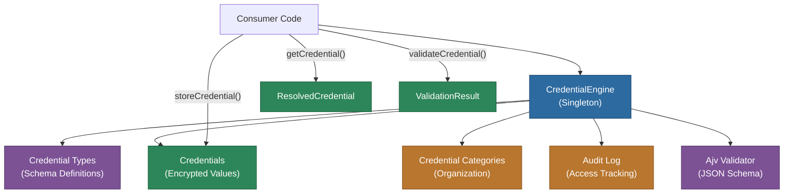
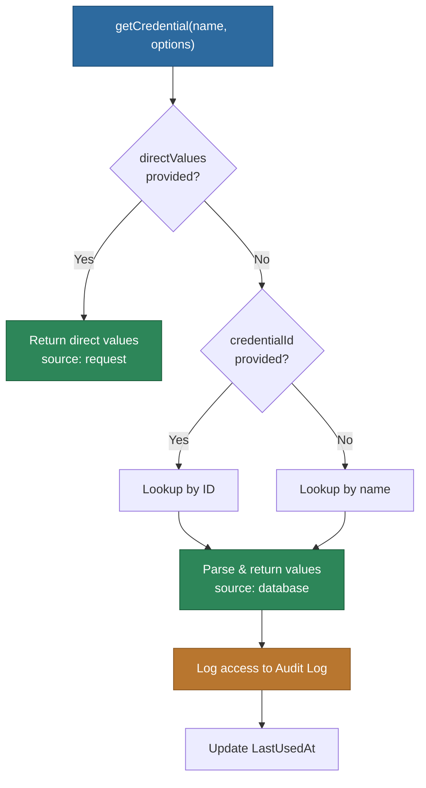

# @memberjunction/credentials

Secure credential management engine for MemberJunction. Provides centralized storage, retrieval, validation, and audit logging of credentials with automatic field-level encryption and JSON Schema validation.

## Overview

The `@memberjunction/credentials` package manages the full credential lifecycle: storing encrypted values, resolving credentials by name or ID, validating against JSON Schema constraints, and logging every access for audit compliance.



## Installation

```bash
npm install @memberjunction/credentials
```

## Quick Start

```typescript
import { CredentialEngine, APIKeyCredentialValues } from '@memberjunction/credentials';

// Initialize at application startup
await CredentialEngine.Instance.Config(false, contextUser);

// Retrieve a credential with typed values
const cred = await CredentialEngine.Instance.getCredential<APIKeyCredentialValues>(
  'OpenAI',
  { contextUser, subsystem: 'AIService' }
);

// Use the decrypted values
console.log(cred.values.apiKey); // Strongly typed as string
```

## Credential Resolution



Resolution priority:
1. **Direct values** -- `directValues` in options (bypasses database, useful for testing)
2. **By ID** -- `credentialId` in options (specific credential lookup)
3. **By name** -- The `credentialName` parameter (most common usage)

## Pre-defined Credential Types

| Type | Interface | Fields |
|------|-----------|--------|
| API Key | `APIKeyCredentialValues` | `apiKey` |
| API Key with Endpoint | `APIKeyWithEndpointCredentialValues` | `apiKey`, `endpoint` |
| OAuth2 Client Credentials | `OAuth2ClientCredentialValues` | `clientId`, `clientSecret`, `tokenUrl`, `scope` |
| Basic Auth | `BasicAuthCredentialValues` | `username`, `password` |
| Azure Service Principal | `AzureServicePrincipalCredentialValues` | `tenantId`, `clientId`, `clientSecret` |
| AWS IAM | `AWSIAMCredentialValues` | `accessKeyId`, `secretAccessKey`, `region` |
| Database Connection | `DatabaseConnectionCredentialValues` | `host`, `port`, `database`, `username`, `password` |
| Twilio | `TwilioCredentialValues` | `accountSid`, `authToken` |

## Storing Credentials

```typescript
const credential = await CredentialEngine.Instance.storeCredential(
  'API Key',                    // Credential type name
  'OpenAI Production',          // Credential name
  { apiKey: 'sk-...' },         // Values (encrypted on save)
  {
    isDefault: true,
    description: 'Production OpenAI API key',
    expiresAt: new Date('2025-12-31')
  },
  contextUser
);
```

## JSON Schema Validation

The engine validates credential values against the `FieldSchema` defined on each Credential Type using Ajv. Supported constraints include `required`, `const`, `enum`, `format`, `pattern`, `minLength`/`maxLength`, and `minimum`/`maximum`.

Default and const values are auto-populated before validation, and validation errors produce clear, human-readable messages.

## Audit Logging

Every credential operation (Decrypt, Create, Update, Validate) is logged to the Audit Logs entity with:
- User who performed the operation
- Subsystem that requested access
- Success or failure status
- Duration in milliseconds

## Security

- **Encryption at rest** -- The `Values` field uses MJ field-level encryption
- **Audit trail** -- All access logged including failed attempts
- **Access control** -- Entity-level permissions enforced via `contextUser`
- **Expiration support** -- `ExpiresAt` field enforces credential rotation

## Dependencies

| Package | Purpose |
|---------|---------|
| `@memberjunction/core` | Base engine, metadata, entity system |
| `@memberjunction/global` | Global state management |
| `@memberjunction/core-entities` | Credential entity types |
| `ajv` | JSON Schema validation |
| `ajv-formats` | Format validators (uri, email, date) |

## License

ISC
