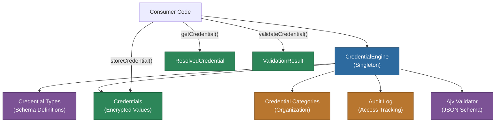
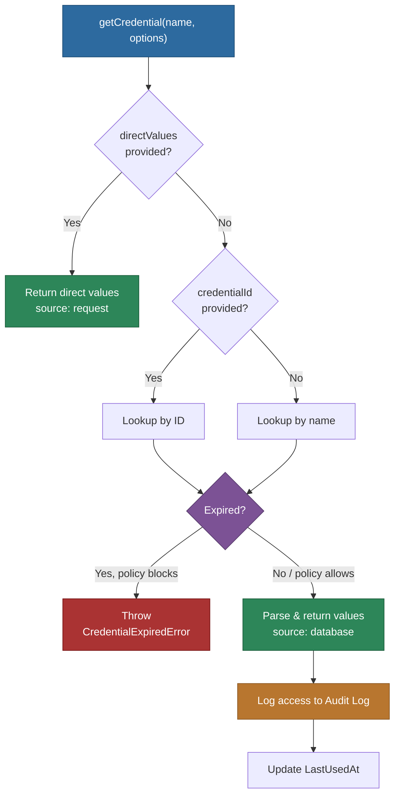

# @memberjunction/credentials

Secure credential management engine for MemberJunction. Provides centralized storage, retrieval, validation, and audit logging of credentials with automatic field-level encryption and JSON Schema validation.

## Overview

The `@memberjunction/credentials` package manages the full credential lifecycle: storing encrypted values, resolving credentials by name or ID, validating against JSON Schema constraints, and logging every access for audit compliance.


```mermaid
graph TD
    A["CredentialEngine<br/>(Singleton)"] --> B["Credential Types<br/>(Schema Definitions)"]
    A --> C["Credentials<br/>(Encrypted Values)"]
    A --> D["Credential Categories<br/>(Organization)"]
    A --> E["Audit Log<br/>(Access Tracking)"]
    A --> F["Ajv Validator<br/>(JSON Schema)"]

    G["Consumer Code"] --> A
    G -->|"getCredential()"| H["ResolvedCredential<T>"]
    G -->|"storeCredential()"| C
    G -->|"validateCredential()"| I["ValidationResult"]

    style A fill:#2d6a9f,stroke:#1a4971,color:#fff
    style B fill:#7c5295,stroke:#563a6b,color:#fff
    style C fill:#2d8659,stroke:#1a5c3a,color:#fff
    style D fill:#b8762f,stroke:#8a5722,color:#fff
    style E fill:#b8762f,stroke:#8a5722,color:#fff
    style F fill:#7c5295,stroke:#563a6b,color:#fff
    style H fill:#2d8659,stroke:#1a5c3a,color:#fff
    style I fill:#2d8659,stroke:#1a5c3a,color:#fff
```

## Installation

```bash
npm install @memberjunction/credentials
```

## Quick Start

```typescript
import { CredentialEngine, APIKeyCredentialValues } from '@memberjunction/credentials';

// Initialize at application startup
await CredentialEngine.Instance.Config(false, contextUser);

// Retrieve a credential with typed values
const cred = await CredentialEngine.Instance.getCredential<APIKeyCredentialValues>(
  'OpenAI',
  { contextUser, subsystem: 'AIService' }
);

// Use the decrypted values
console.log(cred.values.apiKey); // Strongly typed as string
```

## Credential Resolution


```mermaid
flowchart TD
    A["getCredential(name, options)"] --> B{directValues<br/>provided?}
    B -->|Yes| C["Return direct values<br/>source: request"]
    B -->|No| D{credentialId<br/>provided?}
    D -->|Yes| E["Lookup by ID"]
    D -->|No| F["Lookup by name"]
    E --> X{Expired?}
    F --> X
    X -->|"Yes, policy blocks"| Y["Throw<br/>CredentialExpiredError"]
    X -->|"No / policy allows"| G["Parse & return values<br/>source: database"]
    G --> H["Log access to Audit Log"]
    H --> I["Update LastUsedAt"]

    style A fill:#2d6a9f,stroke:#1a4971,color:#fff
    style C fill:#2d8659,stroke:#1a5c3a,color:#fff
    style G fill:#2d8659,stroke:#1a5c3a,color:#fff
    style H fill:#b8762f,stroke:#8a5722,color:#fff
    style X fill:#7c5295,stroke:#563a6b,color:#fff
    style Y fill:#a33,stroke:#711,color:#fff
```

Resolution priority:
1. **Direct values** -- `directValues` in options (bypasses database, useful for testing)
2. **By ID** -- `credentialId` in options (specific credential lookup)
3. **By name** -- The `credentialName` parameter (most common usage)

A match is then checked against its expiry before its values are decrypted -- see
[Expiration](#expiration).

## Expiration

A credential may carry an `ExpiresAt` timestamp. Leaving it null means the
credential never expires.

Expiry is evaluated **at resolution time**, not when the engine loads its cache.
The engine caches credential rows for the life of the process, so a credential
that lapses between two calls is caught on the second call rather than staying
live until the next refresh.

### States

| Status | Meaning | Usable? |
|---|---|---|
| `valid` | No expiry, or expiry beyond the warning window | Yes |
| `expiring-soon` | Expires within the warning window (default 30 days) | Yes, with a warning |
| `expired` | At or past `ExpiresAt` | Depends on policy -- see below |

The 30-day default warning window matches the window the Credentials dashboard
already uses for its "expiring soon" KPI, so the number an operator sees in the
UI and the point at which the engine starts warning are the same.

### Policy

```typescript
// Set once at application startup, before any credential is resolved.
CredentialEngine.Instance.ExpirationConfig = {
    policy: 'block',            // 'block' (default) | 'warn'
    warningWindowMs: 30 * 24 * 60 * 60 * 1000,
    graceMs: 0
};
```

- **`'block'`** (default) -- `getCredential()` throws `CredentialExpiredError`.
  This implements the documented contract of the `ExpiresAt` column, that an
  expired credential is treated as inactive.
- **`'warn'`** -- the credential is returned anyway, flagged as expired and
  logged loudly. An escape hatch for cleaning up stale expiry dates, not a safe
  steady state.
- **`graceMs`** -- a window after expiry during which `'block'` still lets the
  credential through, loudly. Use it where a hard cutoff at the expiry instant
  is riskier than a short, noisy overrun (an overnight batch job that would
  otherwise fail at midnight with nobody watching). Grace never changes the
  reported status: a credential inside grace still reports `expired`, so
  dashboards and audit logs tell the truth.

### Handling expiry as a caller

`getCredential()` distinguishes the two failure modes, so an operator is not
sent hunting for a record that exists and merely needs rotating:

```typescript
import { CredentialExpiredError, CredentialNotFoundError } from '@memberjunction/credentials';

try {
    const cred = await CredentialEngine.Instance.getCredential('OpenAI', { contextUser });

    // A successful resolve does not by itself imply a live credential -- under a
    // 'warn' policy or inside grace, an expired one still comes back.
    if (cred.expirationStatus === 'expiring-soon') {
        notifyOps(`OpenAI credential expires in ${cred.daysUntilExpiration} day(s)`);
    }
} catch (e) {
    if (e instanceof CredentialExpiredError) {
        // Configuration problem: retrying will not help. Surface it to an operator.
    } else if (e instanceof CredentialNotFoundError) {
        // Nothing matched the requested name or ID.
    }
}
```

Callers that keep their own credential lists should ask the engine rather than
comparing dates by hand, so they inherit the same window and grace period:

```typescript
const expiration = CredentialEngine.Instance.getExpirationStatus(credential);
if (!expiration.usable) {
    // skip this one and fall back to the next candidate
}
```

### Which lookups filter expired credentials

| Method | Expired credentials |
|---|---|
| `getCredential()` | Blocked per policy, with `CredentialExpiredError` |
| `getCredentialByName()` | Excluded |
| `getDefaultCredentialForType()` | Excluded |
| `getCredentialById()` | **Returned** -- addressing by primary key is an exact request, and rotation tooling must load an expired record in order to replace it |

Administration and rotation tooling that must read an expired credential can
also override the policy for a single call:

```typescript
await CredentialEngine.Instance.getCredential('OpenAI', {
    contextUser,
    expirationPolicy: 'warn'   // read the stale value in order to replace it
});
```

Every resolution records its `expirationStatus` in the audit log, so an auditor
can answer "was any credential used while expired?" -- which matters precisely
where such a use succeeds rather than failing loudly.

## Pre-defined Credential Types

| Type | Interface | Fields |
|------|-----------|--------|
| API Key | `APIKeyCredentialValues` | `apiKey` |
| API Key with Endpoint | `APIKeyWithEndpointCredentialValues` | `apiKey`, `endpoint` |
| OAuth2 Client Credentials | `OAuth2ClientCredentialValues` | `clientId`, `clientSecret`, `tokenUrl`, `scope` |
| Basic Auth | `BasicAuthCredentialValues` | `username`, `password` |
| Azure Service Principal | `AzureServicePrincipalCredentialValues` | `tenantId`, `clientId`, `clientSecret` |
| AWS IAM | `AWSIAMCredentialValues` | `accessKeyId`, `secretAccessKey`, `region` |
| Database Connection | `DatabaseConnectionCredentialValues` | `host`, `port`, `database`, `username`, `password` |
| Twilio | `TwilioCredentialValues` | `accountSid`, `authToken` |

## Storing Credentials

```typescript
const credential = await CredentialEngine.Instance.storeCredential(
  'API Key',                    // Credential type name
  'OpenAI Production',          // Credential name
  { apiKey: 'sk-...' },         // Values (encrypted on save)
  {
    isDefault: true,
    description: 'Production OpenAI API key',
    expiresAt: new Date('2025-12-31')
  },
  contextUser
);
```

## JSON Schema Validation

The engine validates credential values against the `FieldSchema` defined on each Credential Type using Ajv. Supported constraints include `required`, `const`, `enum`, `format`, `pattern`, `minLength`/`maxLength`, and `minimum`/`maximum`.

Default and const values are auto-populated before validation, and validation errors produce clear, human-readable messages.

## Audit Logging

Every credential operation (Decrypt, Create, Update, Validate) is logged to the Audit Logs entity with:
- User who performed the operation
- Subsystem that requested access
- Success or failure status
- Duration in milliseconds

## Security

- **Encryption at rest** -- The `Values` field uses MJ field-level encryption
- **Audit trail** -- All access logged including failed attempts
- **Access control** -- Entity-level permissions enforced via `contextUser`
- **Expiration support** -- `ExpiresAt` field enforces credential rotation

## Dependencies

| Package | Purpose |
|---------|---------|
| `@memberjunction/core` | Base engine, metadata, entity system |
| `@memberjunction/global` | Global state management |
| `@memberjunction/core-entities` | Credential entity types |
| `ajv` | JSON Schema validation |
| `ajv-formats` | Format validators (uri, email, date) |

## License

Business Source License 1.1 — see [LICENSE](../../../LICENSE) for details.
