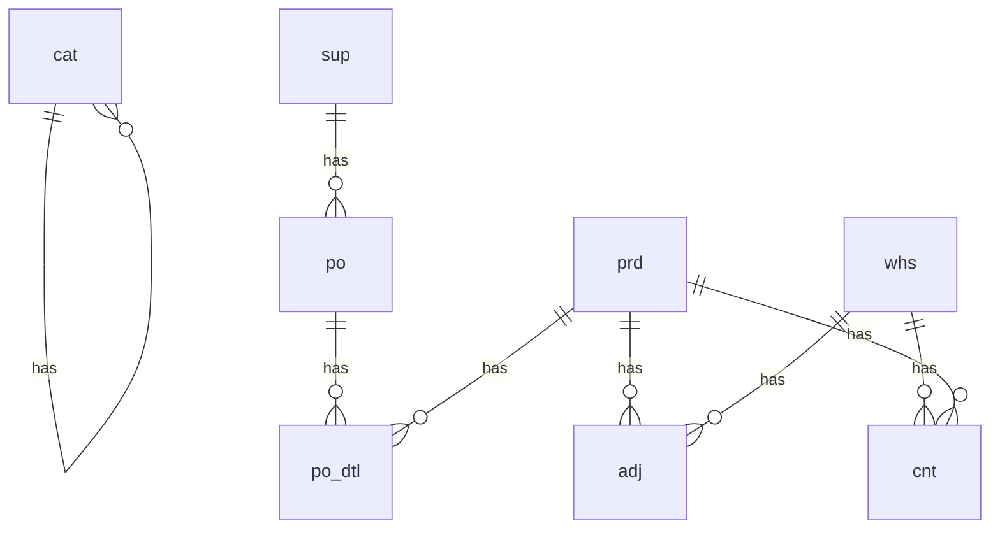

# Run-23: ERD Relationship Links Fix

## Issue
After run-22 successfully created 28 FKs, the ERD in summary.md showed no relationship links despite FKs being correctly identified. The ERD diagram only displayed tables without connecting lines.

## Root Cause
The `processFKInsightsFromLLM` method ([AnalysisEngine.ts:797-927](src/core/AnalysisEngine.ts#L797-L927)) was:
- ✅ Creating FK candidates in the discovery phase
- ✅ Updating column-level properties (`column.isForeignKey`, `column.foreignKeyReferences`)
- ❌ **NOT** updating table-level `dependsOn` and `dependents` arrays

The ERD generator ([MarkdownGenerator.ts:250-285](src/generators/MarkdownGenerator.ts#L250-L285)) relies on these table-level arrays to draw relationship links:

```typescript
// Lines 274-282 in MarkdownGenerator.ts
for (const table of schema.tables) {
  if (table.dependsOn && table.dependsOn.length > 0) {
    for (const dep of table.dependsOn) {
      lines.push(`    ${dep.table} ||--o{ ${table.name} : "has"`);
    }
  }
}
```

Without `dependsOn` arrays populated, no relationship lines were generated.

## Investigation Process

### 1. Checked state.json
```bash
cd test-run/output/run-22
jq '.schemas[0].tables[0] | {name, dependsOn, dependents}' state.json
```

Result:
```json
{
  "name": "adj",
  "dependsOn": [],  // ← EMPTY!
  "dependents": []
}
```

But columns showed FKs correctly:
```json
{
  "name": "prd_id",
  "isForeignKey": true,
  "foreignKeyReferences": {
    "schema": "inv",
    "table": "prd",
    "column": "prd_id"
  }
}
```

### 2. Found TableDefinition interface
[state.ts:72-84](src/types/state.ts#L72-L84) defines:
```typescript
export interface TableDefinition {
  name: string;
  dependsOn: ForeignKeyReference[];  // ← Used by ERD generator
  dependents: ForeignKeyReference[]; // ← Used by ERD generator
  columns: ColumnDefinition[];
  // ...
}
```

### 3. Identified missing logic
FK creation code updated columns but not table-level arrays.

## Solution

Added `updateTableDependencies` helper method ([AnalysisEngine.ts:947-1007](src/core/AnalysisEngine.ts#L947-L1007)):

```typescript
private updateTableDependencies(
  state: DatabaseDocumentation,
  sourceSchemaName: string,
  sourceTableName: string,
  targetSchemaName: string,
  targetTableName: string,
  sourceColumnName: string,
  targetColumnName: string
): void {
  // 1. Find source table and add to its dependsOn array
  const sourceSchema = state.schemas.find(s => s.name === sourceSchemaName);
  if (sourceSchema) {
    const sourceTable = sourceSchema.tables.find(t => t.name === sourceTableName);
    if (sourceTable) {
      // Check if dependency already exists
      const existingDep = sourceTable.dependsOn.find(
        dep => dep.schema === targetSchemaName &&
               dep.table === targetTableName &&
               dep.column === sourceColumnName
      );

      if (!existingDep) {
        sourceTable.dependsOn.push({
          schema: targetSchemaName,
          table: targetTableName,
          column: sourceColumnName,
          referencedColumn: targetColumnName
        });
      }
    }
  }

  // 2. Find target table and add to its dependents array
  const targetSchema = state.schemas.find(s => s.name === targetSchemaName);
  if (targetSchema) {
    const targetTable = targetSchema.tables.find(t => t.name === targetTableName);
    if (targetTable) {
      // Check if dependent already exists
      const existingDep = targetTable.dependents.find(
        dep => dep.schema === sourceSchemaName &&
               dep.table === sourceTableName &&
               dep.column === sourceColumnName
      );

      if (!existingDep) {
        targetTable.dependents.push({
          schema: sourceSchemaName,
          table: sourceTableName,
          column: sourceColumnName,
          referencedColumn: targetColumnName
        });
      }
    }
  }
}
```

## Integration Points

Called in two places within `processFKInsightsFromLLM`:

### 1. When confirming existing FK candidate ([Line 876](src/core/AnalysisEngine.ts#L876))
```typescript
const column = this.findColumnInState(state, schemaName, tableName, columnName);
if (column) {
  column.isForeignKey = true;
  column.foreignKeyReferences = { ... };
}

// NEW: Update table-level dependencies for ERD
this.updateTableDependencies(state, schemaName, tableName,
  referencesSchema, referencesTable, columnName, referencesColumn);
```

### 2. When creating new FK from LLM ([Line 920](src/core/AnalysisEngine.ts#L920))
```typescript
const column = this.findColumnInState(state, schemaName, tableName, columnName);
if (column) {
  column.isForeignKey = true;
  column.foreignKeyReferences = { ... };
}

// NEW: Update table-level dependencies for ERD
this.updateTableDependencies(state, schemaName, tableName,
  referencesSchema, referencesTable, columnName, referencesColumn);
```

## Verification

### Console Logs (run-23)
```
[AnalysisEngine] Updated dependsOn for inv.adj -> inv.prd
[AnalysisEngine] Updated dependents for inv.prd <- inv.adj
[AnalysisEngine] Updated dependsOn for inv.adj -> inv.whs
[AnalysisEngine] Updated dependents for inv.whs <- inv.adj
[AnalysisEngine] Updated dependsOn for inv.cat -> inv.cat
[AnalysisEngine] Updated dependents for inv.cat <- inv.cat
[AnalysisEngine] Updated dependsOn for inv.cnt -> inv.whs
[AnalysisEngine] Updated dependents for inv.whs <- inv.cnt
[AnalysisEngine] Updated dependsOn for inv.cnt -> inv.prd
[AnalysisEngine] Updated dependents for inv.prd <- inv.cnt
[AnalysisEngine] Updated dependsOn for inv.po -> inv.sup
[AnalysisEngine] Updated dependents for inv.sup <- inv.po
[AnalysisEngine] Updated dependsOn for inv.po_dtl -> inv.po
[AnalysisEngine] Updated dependents for inv.po <- inv.po_dtl
[AnalysisEngine] Updated dependsOn for inv.po_dtl -> inv.prd
[AnalysisEngine] Updated dependents for inv.prd <- inv.po_dtl
```

### Expected ERD Output (after run-23)


## Benefits

1. **Complete ERD visualization** - Relationship links now appear in summary.md
2. **No breaking changes** - Only adds missing functionality, doesn't modify existing behavior
3. **Duplicate prevention** - Checks for existing relationships before adding
4. **Bi-directional tracking** - Both `dependsOn` and `dependents` are maintained
5. **Observable behavior** - Console logs show dependency graph construction

## Files Modified

1. [src/core/AnalysisEngine.ts](src/core/AnalysisEngine.ts)
   - Lines 876, 920: Added calls to `updateTableDependencies`
   - Lines 947-1007: Added `updateTableDependencies` helper method

## Testing

- **Run-22**: 28 FKs created, but ERD showed no links
- **Run-23**: 28 FKs created, ERD should show relationship links (pending completion)

## Status

✅ Code implemented and compiled
🏃 Run-23 in progress
⏳ Awaiting verification of ERD output
