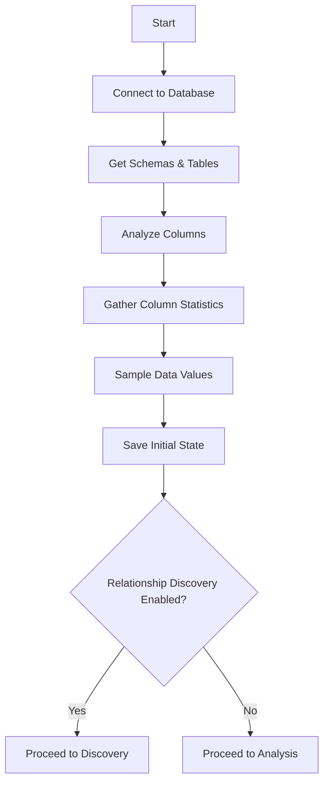
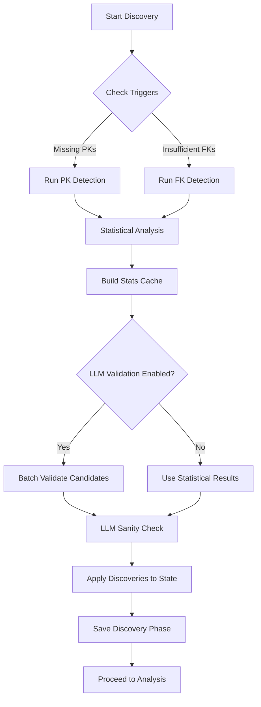
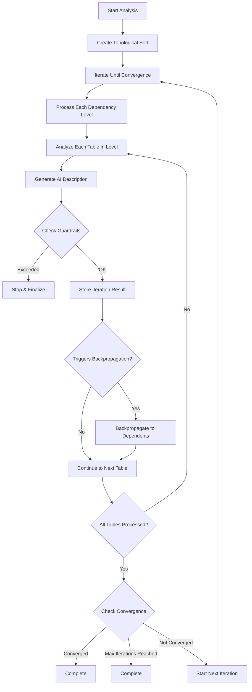
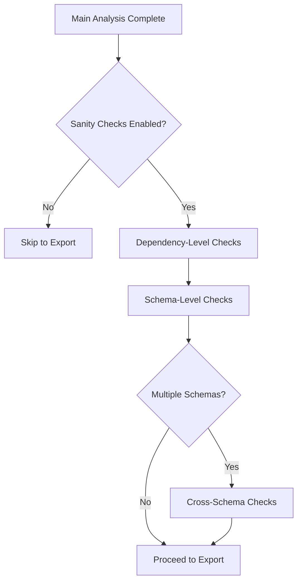
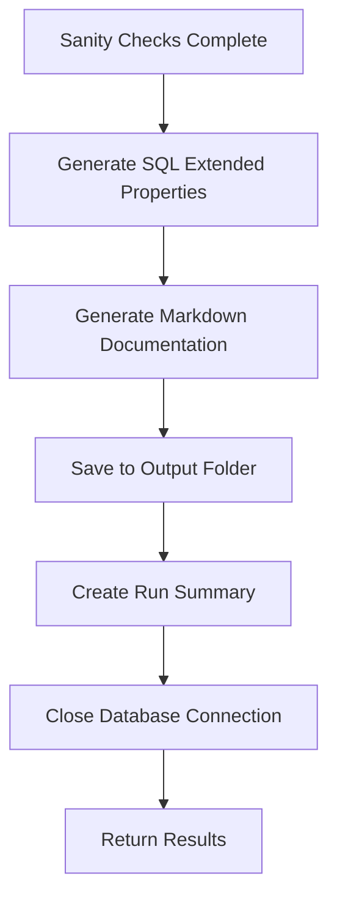

# DBAutoDoc Architecture Documentation

## Overview

DBAutoDoc is an intelligent database documentation system that uses AI-powered analysis to automatically generate comprehensive documentation for database schemas. It combines:

- **Multi-database driver support** with a pluggable architecture
- **Relationship discovery** using statistical analysis and LLM validation
- **Iterative refinement** with backpropagation for semantic consistency
- **Convergence detection** to optimize resource usage
- **Token budgeting** with granular guardrails for LLM cost control

## Core Concepts

### Phase-Based Architecture

DBAutoDoc processes database documentation through distinct phases:

1. **Introspection Phase**: Schema and data sampling
2. **Relationship Discovery Phase**: PK/FK detection and validation
3. **Iterative Analysis Phase**: Semantic description generation with convergence
4. **Sanity Check Phases**: Cross-schema and dependency-level validation
5. **Export Phase**: SQL and Markdown documentation generation

### Key Design Patterns

- **Factory Pattern**: Database drivers are instantiated via MJGlobal's ClassFactory
- **Token-Aware Processing**: Every LLM operation tracks tokens against guardrails
- **State Persistence**: Analysis state is saved after each phase for resumability
- **Bidirectional Analysis**: Backpropagation updates dependent entities when semantics change

---

## Phase Flow Diagrams

### 1. Introspection Phase



**Components:**
- `DatabaseConnection`: Manages connection via driver
- `Introspector`: Retrieves schema metadata
- `DataSampler`: Gathers statistics on columns

**Key Operations:**
- Row count per table
- Column data types and constraints
- Null percentages and cardinality
- Sample values for pattern analysis

---

### 2. Relationship Discovery Phase



**Components:**
- `DiscoveryEngine`: Main orchestrator
- `PKDetector`: Identifies primary key candidates
- `FKDetector`: Identifies foreign key candidates
- `LLMDiscoveryValidator`: AI-based validation of candidates
- `LLMSanityChecker`: Semantic validation of discoveries
- `ColumnStatsCache`: Persists statistics for analysis phase

**Key Operations:**
- Pattern matching against naming conventions
- Statistical uniqueness testing
- Value overlap analysis
- Composite key detection

---

### 3. Iterative Analysis Phase (Main Loop)



**Components:**
- `AnalysisOrchestrator`: Main workflow coordinator
- `AnalysisEngine`: Table-level analysis logic
- `TopologicalSorter`: Computes dependency levels
- `BackpropagationEngine`: Manages semantic consistency updates
- `ConvergenceDetector`: Checks for solution stability
- `PromptEngine`: AI prompt management and execution

**Key Concepts:**
- **Dependency Levels**: Tables are processed in topological order
- **Semantic Comparison**: Previous vs. new descriptions are compared
- **Backpropagation Triggers**: Major description changes trigger re-analysis of dependents
- **Convergence**: Solution converges when no material changes occur in an iteration

---

### 4. Sanity Check Phases



**Types of Sanity Checks:**
1. **Dependency-Level Sanity Checks**: Validate tables within their dependency level
2. **Schema-Level Sanity Checks**: Validate all tables in a schema
3. **Cross-Schema Sanity Checks**: Validate relationships across schemas

**Checked Aspects:**
- Semantic consistency
- Description completeness
- Relationship validity
- Constraint satisfaction

---

### 5. Export Phase



**Outputs:**
- `extended-props.sql`: SQL script with EXEC sp_addextendedproperty statements
- `summary.md`: Comprehensive markdown documentation with:
  - Table of contents
  - Schema descriptions
  - Entity relationship diagrams (Mermaid)
  - Table and column descriptions
  - Iteration analysis appendix
- `state.json`: Complete analysis state for resumability

---

## System Architecture

### Component Hierarchy

```
AnalysisOrchestrator (Main Entry Point)
├── DatabaseConnection
│   ├── BaseAutoDocDriver (Abstract)
│   │   └── SQLServerDriver (Concrete Implementation)
│   ├── Introspector
│   └── DataSampler
├── DiscoveryEngine (Optional)
│   ├── PKDetector
│   ├── FKDetector
│   ├── LLMDiscoveryValidator
│   ├── LLMSanityChecker
│   └── ColumnStatsCache
├── TopologicalSorter
├── PromptEngine
│   ├── PromptFileLoader
│   └── AIProvider Integration
├── AnalysisEngine
│   ├── BackpropagationEngine
│   ├── ConvergenceDetector
│   └── TableAnalysis Logic
├── StateManager
├── IterationTracker
├── SQLGenerator
└── MarkdownGenerator
```

### Data Flow

```
1. Input Configuration
   ↓
2. Database Connection & Introspection
   ↓
3. Relationship Discovery (Optional)
   ↓
4. Topological Sort
   ↓
5. Main Analysis Loop
   ├→ Process Level
   ├→ Analyze Table
   ├→ Generate Description via AI
   ├→ Detect Backpropagation Triggers
   ├→ Execute Backpropagation (if needed)
   └→ Check Convergence
   ↓
6. Sanity Checks
   ↓
7. Export (SQL + Markdown)
   ↓
8. Cleanup & Return Results
```

---

## Extension Points

### 1. Adding New Database Drivers

#### Step 1: Implement BaseAutoDocDriver

Create a new driver class extending `BaseAutoDocDriver`:

```typescript
// src/drivers/PostgreSQLDriver.ts
import { RegisterClass } from '@memberjunction/global';
import { BaseAutoDocDriver } from './BaseAutoDocDriver.js';
import {
  AutoDocSchema,
  AutoDocTable,
  AutoDocConnectionConfig,
  AutoDocQueryResult
} from '../types/driver.js';

@RegisterClass(BaseAutoDocDriver, 'PostgreSQL')
export class PostgreSQLDriver extends BaseAutoDocDriver {
  private pool: Pool | null = null;

  constructor(config: AutoDocConnectionConfig) {
    super(config);
  }

  // CONNECTION MANAGEMENT
  public async connect(): Promise<void> {
    // Implementation specific to PostgreSQL
  }

  public async test(): Promise<AutoDocConnectionTestResult> {
    // Test connection
  }

  public async close(): Promise<void> {
    // Close connection
  }

  // SCHEMA INTROSPECTION
  public async getSchemas(
    schemaFilter: AutoDocSchemaFilter,
    tableFilter: AutoDocTableFilter
  ): Promise<AutoDocSchema[]> {
    // Query information_schema
  }

  protected async getTables(
    schemaName: string,
    tableFilter: AutoDocTableFilter
  ): Promise<AutoDocTable[]> {
    // Query pg_class and pg_namespace
  }

  protected async getColumns(
    schemaName: string,
    tableName: string
  ): Promise<AutoDocColumn[]> {
    // Query information_schema.columns
  }

  // DATA SAMPLING
  public async getColumnStatistics(
    schemaName: string,
    tableName: string,
    columnName: string,
    dataType: string,
    cardinalityThreshold: number,
    sampleSize: number
  ): Promise<AutoDocColumnStatistics> {
    // Statistical analysis
  }

  // QUERY EXECUTION
  public async executeQuery<T = any>(
    query: string,
    maxRetries?: number
  ): Promise<AutoDocQueryResult<T>> {
    // Execute raw SQL
  }

  // HELPER METHODS
  protected escapeIdentifier(identifier: string): string {
    return `"${identifier}"`; // PostgreSQL uses double quotes
  }

  protected getLimitClause(limit: number): string {
    return `LIMIT ${limit}`; // PostgreSQL LIMIT syntax
  }

  // ... Implement all other abstract methods
}
```

#### Step 2: Register Provider in Database.ts

Update the `createDriver` function to recognize your provider:

```typescript
export function createDriver(config: AutoDocConnectionConfig): BaseAutoDocDriver {
  const providerKey =
    config.provider === 'sqlserver' ? 'SQLServer' :
    config.provider === 'mysql' ? 'MySQL' :
    config.provider === 'postgresql' ? 'PostgreSQL' :
    config.provider === 'oracle' ? 'Oracle' : 'SQLServer';

  const driver = MJGlobal.Instance.ClassFactory.CreateInstance<BaseAutoDocDriver>(
    BaseAutoDocDriver,
    providerKey,
    config
  );

  if (!driver) {
    throw new Error(`Database provider '${providerKey}' is not registered`);
  }

  return driver;
}
```

#### Step 3: Update Configuration Types

Add your provider to `src/types/config.ts`:

```typescript
export interface DatabaseConfig {
  provider?: 'sqlserver' | 'mysql' | 'postgresql' | 'oracle' | 'mongodb';
  // ... rest of config
}
```

#### Required Methods Checklist

Your driver must implement:

**Connection Management:**
- `connect()`: Establish database connection
- `test()`: Verify connectivity
- `close()`: Gracefully close connection

**Schema Introspection:**
- `getSchemas()`: Get all schemas with tables
- `getTables()`: Get tables in a schema
- `getColumns()`: Get columns in a table
- `getExistingDescriptions()`: Retrieve metadata descriptions
- `getColumnInfo()`: Get column type and nullability

**Data Sampling:**
- `getColumnStatistics()`: Full statistics (cardinality, null %, etc.)
- `getDistinctCount()`: Count unique values
- `getSampleValues()`: Get sample rows
- `getValueDistribution()`: Value frequency analysis

**Relationship Discovery:**
- `testValueOverlap()`: Check if values overlap between columns (for FK detection)
- `checkColumnCombinationUniqueness()`: Test composite key uniqueness

**Query Execution:**
- `executeQuery<T>()`: Execute raw SQL

**Helpers:**
- `escapeIdentifier()`: Escape schema/table/column names per provider syntax
- `getLimitClause()`: Generate LIMIT/ROWNUM/OFFSET clause per provider
- `isNumericType()`, `isDateType()`, `isStringType()`: Type checking helpers

#### Connection Pooling Best Practices

```typescript
// Configure pooling via AutoDocConnectionConfig
const config: AutoDocConnectionConfig = {
  provider: 'postgresql',
  host: 'localhost',
  database: 'mydb',
  user: 'user',
  password: 'pass',
  maxConnections: 20,        // Max pool size
  minConnections: 5,         // Min pool size
  idleTimeoutMillis: 30000,  // 30 second idle timeout
  connectionTimeout: 30000,  // 30 second connection timeout
  requestTimeout: 30000      // 30 second query timeout
};

// Driver uses these settings to configure provider-specific pools
```

---

### 2. Customizing Prompts

All prompts are stored as markdown files in `src/prompts/` and are loadable at runtime.

#### Prompt Structure

Each prompt file follows this pattern:

```markdown
# Prompt Name

## Context
[Context information about what this prompt does]

## Input Schema
[Description of input variables]

## Output Format
[Description of expected output]

## Prompt Template
[The actual prompt with {{variable}} placeholders]

## Examples
[Optional examples of inputs/outputs]
```

#### Available Prompts

1. **table-analysis.md**: Main table description generation
2. **semantic-comparison.md**: Compare old vs. new descriptions
3. **backpropagation.md**: Re-analyze dependent tables
4. **dependency-level-sanity-check.md**: Validate tables in a dependency level
5. **schema-level-sanity-check.md**: Validate all tables in schema
6. **cross-schema-sanity-check.md**: Validate relationships across schemas
7. **convergence-check.md**: Detect if analysis has converged
8. **schema-sanity-check.md**: Legacy schema validation

#### Customizing a Prompt

To modify a prompt, edit the corresponding markdown file:

```bash
# Edit the main table analysis prompt
nano src/prompts/table-analysis.md

# Variables you can use:
# {{tableName}}, {{schemaName}}, {{rowCount}}
# {{columns}}, {{relationships}}, {{seedContext}}
# {{existingDescription}}, {{columnStatistics}}
```

#### Loading Custom Prompts

The `PromptEngine` automatically loads all prompts from the prompts directory:

```typescript
const promptsDir = path.join(__dirname, '../../prompts');
const promptEngine = new PromptEngine(aiConfig, promptsDir);
await promptEngine.initialize();

// Access a prompt
const prompt = promptEngine.getPrompt('table-analysis');
```

#### Prompt Variables

Common variables available in prompts:

```typescript
interface PromptContext {
  tableName: string;
  schemaName: string;
  rowCount: number;
  description?: string;
  columns: ColumnInfo[];
  relationships: {
    dependsOn: ForeignKeyInfo[];
    dependents: DependentInfo[];
  };
  statistics: ColumnStatistics[];
  seedContext?: SeedContext;
  existingDescription?: string;
  previousIterations?: IterationResult[];
  confidence?: number;
}
```

#### Advanced: Dynamic Prompt Selection

```typescript
// Conditionally select prompts based on analysis state
class SmartPromptSelector {
  selectPrompt(table: TableDefinition, config: AnalysisConfig): string {
    if (table.descriptionIterations.length > 3) {
      // Use refinement prompt for multiple iterations
      return 'semantic-comparison';
    }
    if (table.dependents.length > 5) {
      // Use detailed analysis for high-dependency tables
      return 'table-analysis-detailed';
    }
    return 'table-analysis';
  }
}
```

---

### 3. Adding New Output Generators

Generators produce documentation in various formats. To add a new generator:

#### Step 1: Create Generator Class

```typescript
// src/generators/JSONGenerator.ts
import { DatabaseDocumentation } from '../types/state.js';

export interface GeneratorOptions {
  includeStatistics?: boolean;
  includeIterations?: boolean;
  prettyPrint?: boolean;
}

export class JSONGenerator {
  public generate(
    state: DatabaseDocumentation,
    options: GeneratorOptions = {}
  ): string {
    const output = {
      database: state.database,
      schemas: state.schemas.map(schema => ({
        name: schema.name,
        description: schema.description,
        tables: schema.tables.map(table => ({
          name: table.name,
          rowCount: table.rowCount,
          description: table.description,
          columns: table.columns.map(col => ({
            name: col.name,
            dataType: col.dataType,
            description: col.description,
            isPrimaryKey: col.isPrimaryKey,
            isForeignKey: col.isForeignKey,
            isNullable: col.isNullable
          })),
          relationships: {
            dependsOn: table.dependsOn,
            dependents: table.dependents
          },
          ...(options.includeStatistics && {
            statistics: table.statistics
          }),
          ...(options.includeIterations && {
            iterations: table.descriptionIterations
          })
        }))
      })),
      summary: state.summary,
      ...(options.includeIterations && {
        analysisRuns: state.phases.descriptionGeneration
      })
    };

    return options.prettyPrint
      ? JSON.stringify(output, null, 2)
      : JSON.stringify(output);
  }
}
```

#### Step 2: Integrate into Orchestrator

```typescript
// In AnalysisOrchestrator.execute()
const jsonGen = new JSONGenerator();
const json = jsonGen.generate(state, {
  includeStatistics: true,
  includeIterations: true,
  prettyPrint: true
});
const jsonPath = path.join(runFolder, 'documentation.json');
await fs.writeFile(jsonPath, json, 'utf-8');
```

#### Step 3: Make It Configurable

Add output format selection to config:

```typescript
export interface OutputConfig {
  outputDir: string;
  formats: ('sql' | 'markdown' | 'json' | 'yaml')[];
  includeStatistics: boolean;
  includeIterations: boolean;
}
```

#### Built-in Generators

- **SQLGenerator**: Generates SQL extended properties scripts
- **MarkdownGenerator**: Generates comprehensive markdown documentation with Mermaid diagrams

---

### 4. Extending Analysis Phases

To add a new analysis phase:

#### Step 1: Define Phase Type

```typescript
// src/types/state.ts
export interface CustomAnalysisPhase extends AnalysisPhaseBase {
  type: 'custom-analysis';
  results: CustomAnalysisResult[];
  // Phase-specific fields
}

export interface CustomAnalysisResult {
  tableId: string;
  findings: string[];
  score: number;
}
```

#### Step 2: Create Phase Handler

```typescript
// src/core/CustomAnalysisPhase.ts
export class CustomAnalysisHandler {
  constructor(
    private promptEngine: PromptEngine,
    private stateManager: StateManager
  ) {}

  async execute(
    state: DatabaseDocumentation,
    run: AnalysisRun
  ): Promise<CustomAnalysisPhase> {
    const phase: CustomAnalysisPhase = {
      type: 'custom-analysis',
      startedAt: new Date().toISOString(),
      tokenBudget: { used: 0, limit: 50000 },
      results: []
    };

    for (const schema of state.schemas) {
      for (const table of schema.tables) {
        const result = await this.analyzeTable(table, run);
        phase.results.push(result);

        // Update token tracking
        phase.tokenBudget.used += result.tokensUsed;
        run.totalTokensUsed += result.tokensUsed;
      }
    }

    phase.completedAt = new Date().toISOString();
    phase.status = 'completed';

    return phase;
  }

  private async analyzeTable(
    table: TableDefinition,
    run: AnalysisRun
  ): Promise<CustomAnalysisResult> {
    // Custom analysis logic
    const prompt = this.promptEngine.getPrompt('custom-analysis');
    const result = await this.promptEngine.executePrompt(prompt, {
      tableName: table.name,
      tableData: table
    });

    return {
      tableId: table.name,
      findings: result.findings,
      score: result.score,
      tokensUsed: result.tokensUsed
    };
  }
}
```

#### Step 3: Integrate into Orchestrator

```typescript
// In AnalysisOrchestrator.execute()
const customHandler = new CustomAnalysisHandler(promptEngine, stateManager);
const customPhase = await customHandler.execute(state, run);
state.phases.customAnalysis = customPhase;
await stateManager.save(state);
```

---

## Configuration Guide

### Minimal Configuration

```json
{
  "version": "1.0.0",
  "database": {
    "provider": "sqlserver",
    "server": "localhost",
    "database": "MyDatabase",
    "user": "sa",
    "password": "password"
  },
  "ai": {
    "provider": "anthropic",
    "model": "claude-3-5-sonnet-20241022",
    "apiKey": "sk-ant-xxx"
  },
  "analysis": {
    "cardinalityThreshold": 100,
    "sampleSize": 1000,
    "includeStatistics": true,
    "includePatternAnalysis": true,
    "convergence": {
      "maxIterations": 5,
      "minIterations": 2,
      "changeThreshold": 0.1,
      "checkFrequency": 1
    },
    "backpropagation": {
      "enabled": true,
      "maxDepth": 3,
      "triggerThreshold": 0.2
    },
    "sanityChecks": {
      "dependencyLevel": true,
      "schemaLevel": true,
      "crossSchema": true
    }
  },
  "output": {
    "outputDir": "./output"
  },
  "schemas": {
    "include": []
  },
  "tables": {
    "exclude": []
  }
}
```

### Advanced Configuration

```json
{
  "version": "1.0.0",
  "database": {
    "provider": "sqlserver",
    "server": "prod-server.example.com",
    "port": 1433,
    "database": "EnterpriseDB",
    "user": "analyst",
    "password": "secure-password",
    "encrypt": true,
    "trustServerCertificate": false,
    "connectionTimeout": 60000,
    "requestTimeout": 120000,
    "maxConnections": 50,
    "minConnections": 10,
    "idleTimeoutMillis": 60000
  },
  "ai": {
    "provider": "anthropic",
    "model": "claude-3-5-sonnet-20241022",
    "apiKey": "sk-ant-xxx",
    "temperature": 0.1,
    "maxTokens": 2000,
    "requestsPerMinute": 100,
    "effortLevel": 75
  },
  "analysis": {
    "cardinalityThreshold": 100,
    "sampleSize": 5000,
    "includeStatistics": true,
    "includePatternAnalysis": true,
    "convergence": {
      "maxIterations": 10,
      "minIterations": 2,
      "changeThreshold": 0.05,
      "checkFrequency": 1,
      "stabilityWindow": 2
    },
    "backpropagation": {
      "enabled": true,
      "maxDepth": 5,
      "triggerThreshold": 0.15
    },
    "sanityChecks": {
      "dependencyLevel": true,
      "schemaLevel": true,
      "crossSchema": true
    },
    "guardrails": {
      "maxTokensPerRun": 500000,
      "maxCostPerRun": 50.0,
      "maxTimeMinutes": 120,
      "tokenCheckInterval": 1000
    },
    "relationshipDiscovery": {
      "enabled": true,
      "triggers": {
        "runOnMissingPKs": true,
        "runOnInsufficientFKs": true,
        "fkDeficitThreshold": 0.4
      },
      "tokenBudget": {
        "ratioOfTotal": 0.25
      },
      "confidence": {
        "primaryKeyMinimum": 0.7,
        "foreignKeyMinimum": 0.6,
        "llmValidationThreshold": 0.8
      },
      "sampling": {
        "maxRowsPerTable": 10000,
        "statisticalSignificance": 100,
        "valueOverlapSampleSize": 500
      },
      "patterns": {
        "primaryKeyNames": [".*[Ii][Dd]$", "^pk_.*"],
        "foreignKeyNames": [".*[Ii][Dd]$", "^fk_.*"]
      },
      "llmValidation": {
        "enabled": true,
        "batchSize": 10
      }
    }
  },
  "output": {
    "outputDir": "./output"
  },
  "schemas": {
    "include": ["dbo", "reporting"],
    "exclude": ["temp"]
  },
  "tables": {
    "exclude": ["sys_*", "temp_*"]
  }
}
```

---

## Performance Considerations

### Token Budget Optimization

```typescript
// Token budgets help control costs and latency
const config: AnalysisConfig = {
  guardrails: {
    maxTokensPerRun: 1_000_000,  // ~$3-5 per run
    maxCostPerRun: 10.0,
    maxTimeMinutes: 60
  },
  relationshipDiscovery: {
    tokenBudget: {
      ratioOfTotal: 0.25  // 25% for discovery, 75% for main analysis
    }
  }
};

// Token usage is tracked per:
// - Analysis run
// - Each iteration
// - Each phase
// - Each individual LLM call
```

### Convergence Tuning

```typescript
const convergenceConfig: ConvergenceConfig = {
  maxIterations: 10,           // Safety limit
  minIterations: 2,            // Always do at least 2
  changeThreshold: 0.1,        // 10% change triggers re-analysis
  checkFrequency: 1,           // Check after each iteration
  stabilityWindow: 2           // Last N iterations must be stable
};

// Optimal settings by database size:
// - Small (< 50 tables): maxIterations: 3-5
// - Medium (50-500 tables): maxIterations: 5-10
// - Large (> 500 tables): maxIterations: 2-3 (cost-limited)
```

### Backpropagation Control

```typescript
const backpropConfig: BackpropagationConfig = {
  enabled: true,
  maxDepth: 3,            // How far to cascade changes
  triggerThreshold: 0.2   // 20% change triggers backprop
};

// Backpropagation cost:
// - Each table re-analyzed: +1 LLM call
// - Depth 3 can cascade through 3 levels
// - On large schemas: disable if token budget tight
```

### Connection Pooling

```typescript
// Optimize based on table count and LLM speed
const config: AutoDocConnectionConfig = {
  maxConnections: 50,        // For large, complex schemas
  minConnections: 5,         // Keep connections warm
  idleTimeoutMillis: 60000   // Release after 1 minute
};

// Typical pool usage per analysis:
// - Main analysis loop: 1 connection
// - Data sampling: 2-3 connections
// - Discovery phase: 1-2 connections
```

---

## State Management and Resumability

### State Structure

```typescript
interface DatabaseDocumentation {
  database: DatabaseInfo;
  schemas: SchemaDefinition[];
  phases: {
    keyDetection: RelationshipDiscoveryPhase;
    descriptionGeneration: AnalysisRun[];
    sanityChecks: SanityCheckResult[];
  };
  seedContext?: SeedContext;
  summary: DocumentationSummary;
  resumedFromFile?: string;
}
```

### Resuming Analysis

```typescript
const orchestrator = new AnalysisOrchestrator({
  config,
  resumeFromState: './output/run-5/state.json',  // Resume run 5
  onProgress: (msg, data) => console.log(msg, data)
});

const result = await orchestrator.execute();
// Analysis continues from where run 5 left off
```

### State Persistence Points

State is automatically saved after:
1. Schema introspection
2. Relationship discovery
3. After each dependency level
4. After sanity checks
5. Final export

---

## Common Customization Patterns

### Pattern 1: Custom AI Provider Integration

```typescript
// Extend PromptEngine to support custom providers
class EnterprisePromptEngine extends PromptEngine {
  protected async callAI(prompt: string, context: any): Promise<string> {
    if (this.config.provider === 'custom-enterprise') {
      return this.callEnterpriseAPI(prompt, context);
    }
    return super.callAI(prompt, context);
  }

  private async callEnterpriseAPI(
    prompt: string,
    context: any
  ): Promise<string> {
    const response = await fetch('https://internal-ai-api.company.com', {
      method: 'POST',
      body: JSON.stringify({ prompt, context })
    });
    return response.json();
  }
}
```

### Pattern 2: Custom Filtering

```typescript
// Filter specific tables before analysis
const config: DBAutoDocConfig = {
  tables: {
    exclude: [
      'audit_*',      // Exclude audit tables
      'sys_*',        // Exclude system tables
      'temp_*'        // Exclude temporary tables
    ]
  },
  schemas: {
    include: ['production', 'reporting'],  // Only these schemas
    exclude: []
  }
};
```

### Pattern 3: Semantic Validation Hook

```typescript
// Add custom validation before accepting descriptions
class ValidatingAnalysisEngine extends AnalysisEngine {
  protected async validateDescription(
    description: string,
    table: TableDefinition
  ): Promise<boolean> {
    // Check length
    if (description.length < 10) return false;

    // Check for keywords
    const requiredKeywords = ['data', 'information', 'manage'];
    const hasKeyword = requiredKeywords.some(kw =>
      description.toLowerCase().includes(kw)
    );

    return hasKeyword;
  }
}
```

---

## Troubleshooting

### Issue: Analysis Converges Too Quickly

**Symptom**: Only 1-2 iterations performed

**Solution**: Adjust convergence thresholds:

```json
{
  "analysis": {
    "convergence": {
      "changeThreshold": 0.05,      // Lower = more sensitive
      "minIterations": 3             // Force more iterations
    }
  }
}
```

### Issue: Analysis Exceeds Token Budget

**Symptom**: Process stops with guardrail error

**Solution**: Reduce scope or increase budget:

```json
{
  "analysis": {
    "guardrails": {
      "maxTokensPerRun": 1000000     // Increase limit
    },
    "convergence": {
      "maxIterations": 3             // Reduce iterations
    },
    "relationshipDiscovery": {
      "tokenBudget": {
        "ratioOfTotal": 0.1          // Reduce discovery budget
      }
    }
  }
}
```

### Issue: Relationship Discovery Missing Relationships

**Symptom**: Few foreign keys discovered

**Solution**: Adjust discovery sensitivity:

```json
{
  "analysis": {
    "relationshipDiscovery": {
      "confidence": {
        "foreignKeyMinimum": 0.5     // Lower threshold
      },
      "triggers": {
        "fkDeficitThreshold": 0.3    // Trigger more easily
      }
    }
  }
}
```

---

## API Usage Examples

### Programmatic Execution

```typescript
import {
  AnalysisOrchestrator,
  DBAutoDocConfig
} from '@memberjunction/dbautodoc';

const config: DBAutoDocConfig = {
  version: '1.0.0',
  database: {
    provider: 'sqlserver',
    server: 'localhost',
    database: 'MyDB',
    user: 'sa',
    password: 'pass'
  },
  ai: {
    provider: 'anthropic',
    model: 'claude-3-5-sonnet-20241022',
    apiKey: process.env.ANTHROPIC_API_KEY!
  },
  analysis: {
    cardinalityThreshold: 100,
    sampleSize: 1000,
    includeStatistics: true,
    includePatternAnalysis: true,
    convergence: {
      maxIterations: 5,
      minIterations: 2,
      changeThreshold: 0.1,
      checkFrequency: 1
    },
    backpropagation: {
      enabled: true,
      maxDepth: 3,
      triggerThreshold: 0.2
    },
    sanityChecks: {
      dependencyLevel: true,
      schemaLevel: true,
      crossSchema: true
    }
  },
  output: {
    outputDir: './docs'
  },
  schemas: {},
  tables: {}
};

const orchestrator = new AnalysisOrchestrator({
  config,
  onProgress: (message, data) => {
    console.log(`[${new Date().toISOString()}] ${message}`, data);
  }
});

const result = await orchestrator.execute();

if (result.success) {
  console.log('Analysis complete!');
  console.log(`Output folder: ${result.outputFolder}`);
  console.log(`Tokens used: ${result.run.totalTokensUsed}`);
  console.log(`Estimated cost: $${result.run.estimatedCost}`);
} else {
  console.error('Analysis failed:', result.message);
}
```

### Integration with MemberJunction

```typescript
import { Metadata } from '@memberjunction/core';
import { AnalysisOrchestrator } from '@memberjunction/dbautodoc';

// Get database credentials from MemberJunction
const md = new Metadata();
const dbConfig = await md.GetEntityObject<DatabaseConfigEntity>(
  'Database Configs'
);

const orchestrator = new AnalysisOrchestrator({
  config: {
    database: {
      server: dbConfig.Server,
      database: dbConfig.DatabaseName,
      user: dbConfig.Username,
      password: dbConfig.Password
    },
    // ... rest of config
  }
});
```

---

## Contributing to DBAutoDoc

### Adding a New Driver

1. Create driver class in `src/drivers/`
2. Register with `@RegisterClass` decorator
3. Implement all abstract methods from `BaseAutoDocDriver`
4. Add provider to config types
5. Update `createDriver()` factory function
6. Write unit tests in `__tests__/`
7. Document driver-specific features in ARCHITECTURE.md

### Adding a New Analysis Phase

1. Define phase type in `src/types/state.ts`
2. Create phase handler class
3. Integrate into `AnalysisOrchestrator`
4. Create prompt template in `src/prompts/`
5. Add configuration options to `src/types/config.ts`
6. Write tests and documentation

### Modifying Prompts

1. Edit markdown file in `src/prompts/`
2. Test with sample data
3. Document variable requirements
4. Update this ARCHITECTURE.md with new variables if applicable
5. Create PR with prompt improvement rationale

---

## Version History

- **v1.0.0** (Current): Multi-driver support, relationship discovery, iterative refinement with backpropagation
- **v0.9.0**: Initial release with SQL Server support only

---

## References

- **Configuration Guide**: See `config.example.json`
- **Type Definitions**: `src/types/`
- **Driver Implementations**: `src/drivers/`
- **Prompt Templates**: `src/prompts/`
- **CLI Usage**: See README.md

