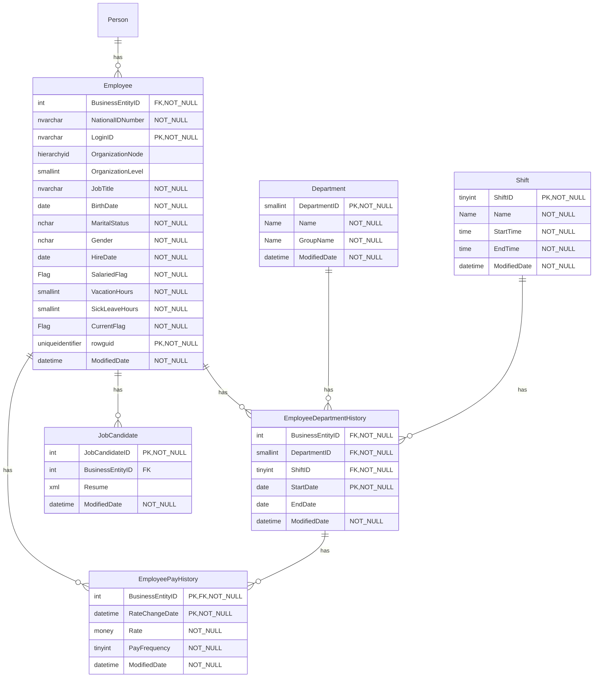
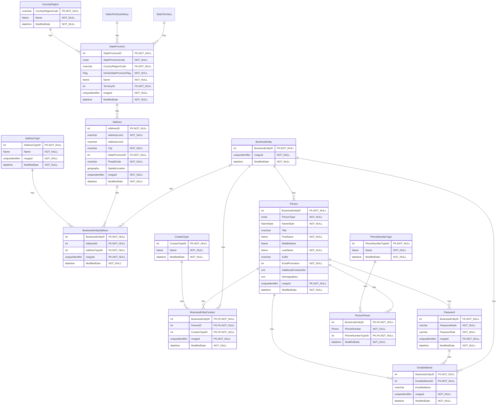
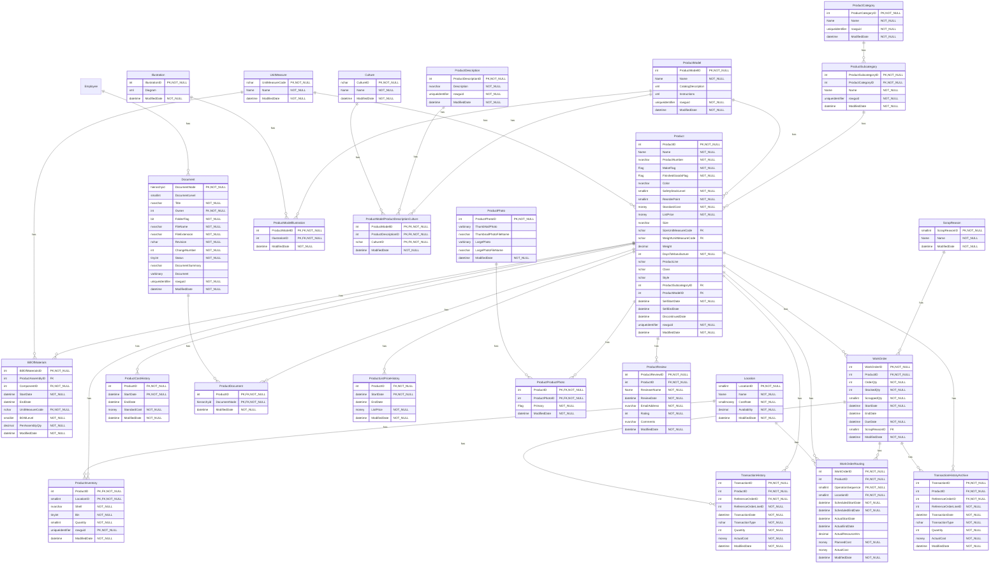
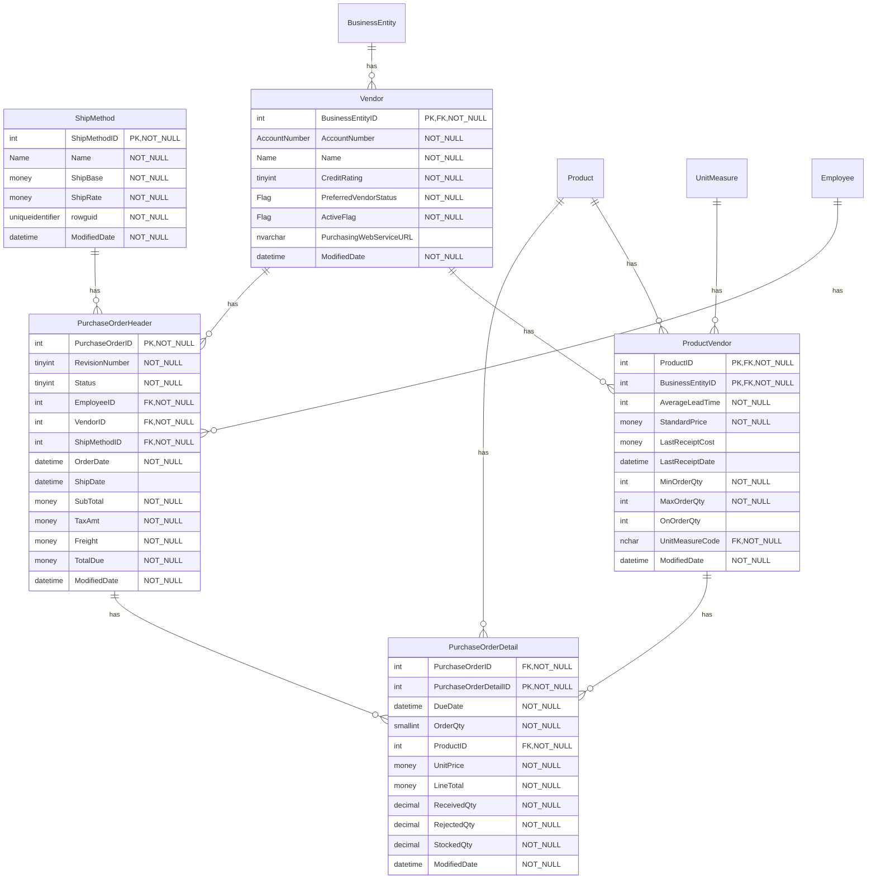
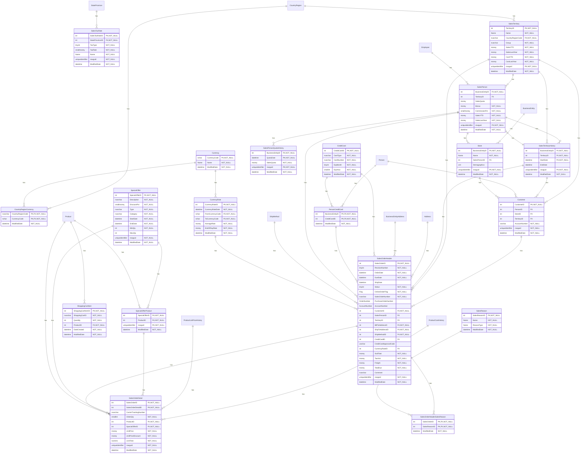

# Database Documentation: AW_Stripped

**Server**: sql-claude
**Generated**: 2026-03-21T18:13:19.640Z
**Total Iterations**: 2

## Analysis Summary

- **Status**: converged
- **Iterations**: 2
- **Tokens Used**: 3,157,458 (input: 2,993,829, output: 163,629)
- **Estimated Cost**: $0.00
- **AI Model**: gemini-3-flash-preview
- **AI Vendor**: gemini
- **Temperature**: 0.1
- **Convergence**: Reached maximum iteration limit (2)

## Table of Contents

### [dbo](#schema-dbo) (3 tables)
- [AWBuildVersion](#awbuildversion)
- [DatabaseLog](#databaselog)
- [ErrorLog](#errorlog)

### [HumanResources](#schema-humanresources) (6 tables)
- [Department](#department)
- [Employee](#employee)
- [EmployeeDepartmentHistory](#employeedepartmenthistory)
- [EmployeePayHistory](#employeepayhistory)
- [JobCandidate](#jobcandidate)
- [Shift](#shift)

### [Person](#schema-person) (13 tables)
- [Address](#address)
- [AddressType](#addresstype)
- [BusinessEntity](#businessentity)
- [BusinessEntityAddress](#businessentityaddress)
- [BusinessEntityContact](#businessentitycontact)
- [ContactType](#contacttype)
- [CountryRegion](#countryregion)
- [EmailAddress](#emailaddress)
- [Password](#password)
- [Person](#person)
- [PersonPhone](#personphone)
- [PhoneNumberType](#phonenumbertype)
- [StateProvince](#stateprovince)

### [Production](#schema-production) (25 tables)
- [BillOfMaterials](#billofmaterials)
- [Culture](#culture)
- [Document](#document)
- [Illustration](#illustration)
- [Location](#location)
- [Product](#product)
- [ProductCategory](#productcategory)
- [ProductCostHistory](#productcosthistory)
- [ProductDescription](#productdescription)
- [ProductDocument](#productdocument)
- [ProductInventory](#productinventory)
- [ProductListPriceHistory](#productlistpricehistory)
- [ProductModel](#productmodel)
- [ProductModelIllustration](#productmodelillustration)
- [ProductModelProductDescriptionCulture](#productmodelproductdescriptionculture)
- [ProductPhoto](#productphoto)
- [ProductProductPhoto](#productproductphoto)
- [ProductReview](#productreview)
- [ProductSubcategory](#productsubcategory)
- [ScrapReason](#scrapreason)
- [TransactionHistory](#transactionhistory)
- [TransactionHistoryArchive](#transactionhistoryarchive)
- [UnitMeasure](#unitmeasure)
- [WorkOrder](#workorder)
- [WorkOrderRouting](#workorderrouting)

### [Purchasing](#schema-purchasing) (5 tables)
- [ProductVendor](#productvendor)
- [PurchaseOrderDetail](#purchaseorderdetail)
- [PurchaseOrderHeader](#purchaseorderheader)
- [ShipMethod](#shipmethod)
- [Vendor](#vendor)

### [Sales](#schema-sales) (19 tables)
- [CountryRegionCurrency](#countryregioncurrency)
- [CreditCard](#creditcard)
- [Currency](#currency)
- [CurrencyRate](#currencyrate)
- [Customer](#customer)
- [PersonCreditCard](#personcreditcard)
- [SalesOrderDetail](#salesorderdetail)
- [SalesOrderHeader](#salesorderheader)
- [SalesOrderHeaderSalesReason](#salesorderheadersalesreason)
- [SalesPerson](#salesperson)
- [SalesPersonQuotaHistory](#salespersonquotahistory)
- [SalesReason](#salesreason)
- [SalesTaxRate](#salestaxrate)
- [SalesTerritory](#salesterritory)
- [SalesTerritoryHistory](#salesterritoryhistory)
- [ShoppingCartItem](#shoppingcartitem)
- [SpecialOffer](#specialoffer)
- [SpecialOfferProduct](#specialofferproduct)
- [Store](#store)


## Schema: dbo

### Entity Relationship Diagram

```mermaid
erDiagram
    AWBuildVersion {
        tinyint SystemInformationID "PK,NOT_NULL"
        nvarchar Database Version "NOT_NULL"
        datetime VersionDate "NOT_NULL"
        datetime ModifiedDate "NOT_NULL"
    }
    DatabaseLog {
        int DatabaseLogID "PK,NOT_NULL"
        datetime PostTime "NOT_NULL"
        sysname DatabaseUser "NOT_NULL"
        sysname Event "NOT_NULL"
        sysname Schema
        sysname Object
        nvarchar TSQL "NOT_NULL"
        xml XmlEvent "NOT_NULL"
    }
    ErrorLog {
        int ErrorLogID "NOT_NULL"
        datetime ErrorTime "NOT_NULL"
        sysname UserName "NOT_NULL"
        int ErrorNumber "NOT_NULL"
        int ErrorSeverity
        int ErrorState
        nvarchar ErrorProcedure
        int ErrorLine
        nvarchar ErrorMessage "NOT_NULL"
    }

```

### Tables

#### AWBuildVersion

A system metadata table that stores the current version and build information of the database schema. It typically contains a single row representing the state of the database deployment.

**Row Count**: 1
**Dependency Level**: 0

**Confidence**: 100%

**Columns**:

| Column | Type | Description |
|--------|------|-------------|
| SystemInformationID | tinyint (PK, NOT NULL) | A surrogate primary key used to uniquely identify the system information record. |
| Database Version | nvarchar (NOT NULL) | The specific version number or build identifier of the database schema. |
| VersionDate | datetime (NOT NULL) | The date and time when the current database version was released or deployed. |
| ModifiedDate | datetime (NOT NULL) | The date and time when the version record was last updated. |

#### DatabaseLog

A central audit log that records Data Definition Language (DDL) changes and database modifications. It captures details about schema changes, object creations, and administrative actions to provide a historical record of the database's structural evolution.

**Row Count**: 1596
**Dependency Level**: 0

**Confidence**: 100%

**Columns**:

| Column | Type | Description |
|--------|------|-------------|
| DatabaseLogID | int (PK, NOT NULL) | Unique identifier for each log entry. |
| PostTime | datetime (NOT NULL) | The date and time when the database change was executed. |
| DatabaseUser | sysname (NOT NULL) | The database user account that performed the action. |
| Event | sysname (NOT NULL) | The type of DDL event that triggered the log entry (e.g., CREATE_TABLE, ALTER_INDEX). |
| Schema | sysname | The database schema to which the affected object belongs. |
| Object | sysname | The name of the database object (table, view, procedure, etc.) that was created or modified. |
| TSQL | nvarchar (NOT NULL) | The exact Transact-SQL command that was executed. |
| XmlEvent | xml (NOT NULL) | The complete event data in XML format, providing detailed context about the environment and the change. |

#### ErrorLog

A central repository for logging database-related errors, typically populated by TRY...CATCH blocks within stored procedures or triggers to facilitate troubleshooting and auditing.

**Row Count**: 0
**Dependency Level**: 0

**Confidence**: 100%

**Columns**:

| Column | Type | Description |
|--------|------|-------------|
| ErrorLogID | int (NOT NULL) | Primary key for the error log entry |
| ErrorTime | datetime (NOT NULL) | The date and time when the error occurred |
| UserName | sysname (NOT NULL) | The database or application user who encountered the error |
| ErrorNumber | int (NOT NULL) | The specific SQL Server error number |
| ErrorSeverity | int | The severity level of the error (typically 0-25) |
| ErrorState | int | The state code of the error, used to identify the specific location in the code that raised the error |
| ErrorProcedure | nvarchar | The name of the stored procedure or trigger where the error occurred |
| ErrorLine | int | The line number within the procedure or trigger where the error was raised |
| ErrorMessage | nvarchar (NOT NULL) | The full text description of the error message |

## Schema: HumanResources

### Entity Relationship Diagram



### Tables

#### Department

A lookup table that defines the organizational departments within the company and categorizes them into broader functional groups.

**Row Count**: 16
**Dependency Level**: 0

**Confidence**: 100%

**Referenced By**:
- [HumanResources.EmployeeDepartmentHistory](#employeedepartmenthistory)

**Columns**:

| Column | Type | Description |
|--------|------|-------------|
| DepartmentID | smallint (PK, NOT NULL) | Primary key and unique identifier for each department. |
| Name | Name (NOT NULL) | The descriptive name of the specific department (e.g., 'Tool Design', 'Research and Development'). |
| GroupName | Name (NOT NULL) | A high-level categorization used to group multiple departments into major business divisions (e.g., 'Manufacturing', 'Sales and Marketing'). |
| ModifiedDate | datetime (NOT NULL) | The date and time the department record was last updated. |

#### Employee

Serves as the central registry for current employee data, representing individuals who have successfully transitioned from recruitment to active employment. It maintains a point-in-time snapshot of professional attributes, organizational hierarchy, and benefit balances, while notably excluding direct compensation data which is managed via time-series history for auditing purposes. It acts as the primary anchor for historical role changes, document ownership, and specialized operational responsibilities including procurement and a distinct subset of sales personnel.

**Row Count**: 290
**Dependency Level**: 0

**Confidence**: 100%

**Depends On**:
- [Person.Person](#person) (via BusinessEntityID)

**Referenced By**:
- [HumanResources.EmployeePayHistory](#employeepayhistory)
- [HumanResources.EmployeeDepartmentHistory](#employeedepartmenthistory)
- [HumanResources.JobCandidate](#jobcandidate)
- [Production.Document](#document)
- [Purchasing.PurchaseOrderHeader](#purchaseorderheader)
- [Sales.SalesPerson](#salesperson)

**Columns**:

| Column | Type | Description |
|--------|------|-------------|
| BusinessEntityID | int (FK, NOT NULL) | Primary identifier for the employee, linking directly to their record in the Person.Person table. |
| NationalIDNumber | nvarchar (NOT NULL) | A unique government-issued identification number for the employee (e.g., SSN). |
| LoginID | nvarchar (PK, NOT NULL) | The employee's network or domain login credentials. |
| OrganizationNode | hierarchyid | A hierarchyid value representing the employee's position within the company's reporting structure. |
| OrganizationLevel | smallint | The depth of the employee within the organizational hierarchy (e.g., 1 for executives, 4 for staff). |
| JobTitle | nvarchar (NOT NULL) | The official professional title of the employee. |
| BirthDate | date (NOT NULL) | The employee's date of birth, used for age verification and HR records. |
| MaritalStatus | nchar (NOT NULL) | The employee's marital status (M = Married, S = Single). |
| Gender | nchar (NOT NULL) | The employee's gender (M = Male, F = Female). |
| HireDate | date (NOT NULL) | The date the employee was officially hired by the company. |
| SalariedFlag | Flag (NOT NULL) | Indicates whether the employee is paid a fixed salary (true) or hourly wages (false). |
| VacationHours | smallint (NOT NULL) | The current balance of accrued vacation time available to the employee. |
| SickLeaveHours | smallint (NOT NULL) | The current balance of accrued sick leave available to the employee. |
| CurrentFlag | Flag (NOT NULL) | Indicates if the employee is currently active (true) or has left the company (false). |
| rowguid | uniqueidentifier (PK, NOT NULL) | Unique identifier used for database replication and synchronization. |
| ModifiedDate | datetime (NOT NULL) | The timestamp of the last time this record was updated. |

#### EmployeeDepartmentHistory

This table tracks the historical and current assignments of employees to specific departments and work shifts. It serves as a ledger for organizational movement, recording when an employee started and ended their tenure in a particular department and shift combination.

**Row Count**: 296
**Dependency Level**: 0

**Confidence**: 100%

**Depends On**:
- [HumanResources.Employee](#employee) (via BusinessEntityID)
- [HumanResources.Department](#department) (via DepartmentID)
- [HumanResources.Shift](#shift) (via ShiftID)

**Referenced By**:
- [HumanResources.EmployeePayHistory](#employeepayhistory)

**Columns**:

| Column | Type | Description |
|--------|------|-------------|
| BusinessEntityID | int (FK, NOT NULL) | Primary identifier for the employee, linking to the HumanResources.Employee table. |
| DepartmentID | smallint (FK, NOT NULL) | Identifier for the department the employee is or was assigned to. |
| ShiftID | tinyint (FK, NOT NULL) | Identifier for the specific work shift (e.g., Day, Evening, Night) assigned to the employee. |
| StartDate | date (PK, NOT NULL) | The date the employee began this specific department and shift assignment. |
| EndDate | date | The date the employee left this department or shift. A NULL value indicates the assignment is currently active. |
| ModifiedDate | datetime (NOT NULL) | The date and time the record was last updated. |

#### EmployeePayHistory

This table maintains a historical record of employee compensation changes. It tracks the specific pay rate, the date the rate took effect, and the frequency of payment for every employee, allowing the organization to audit salary progression over time.

**Row Count**: 316
**Dependency Level**: 1

**Confidence**: 100%

**Depends On**:
- [HumanResources.Employee](#employee) (via BusinessEntityID)
- [HumanResources.EmployeeDepartmentHistory](#employeedepartmenthistory) (via BusinessEntityID)

**Columns**:

| Column | Type | Description |
|--------|------|-------------|
| BusinessEntityID | int (PK, FK, NOT NULL) | Primary identifier for the employee, linking this record to their profile in the HumanResources.Employee table. |
| RateChangeDate | datetime (PK, NOT NULL) | The effective date of the pay rate change. |
| Rate | money (NOT NULL) | The salary or hourly wage amount assigned to the employee starting on the RateChangeDate. |
| PayFrequency | tinyint (NOT NULL) | A code indicating how often the employee is paid (e.g., 1 = Monthly, 2 = Bi-weekly). |
| ModifiedDate | datetime (NOT NULL) | The date and time the pay record was last updated in the system. |

#### JobCandidate

Stores resumes and application information for job seekers. It acts as a repository for candidate profiles, which can be linked to existing employee records if the candidate is an internal applicant or a successful hire.

**Row Count**: 13
**Dependency Level**: 0

**Confidence**: 100%

**Depends On**:
- [HumanResources.Employee](#employee) (via BusinessEntityID)

**Columns**:

| Column | Type | Description |
|--------|------|-------------|
| JobCandidateID | int (PK, NOT NULL) | Primary key for job candidate records |
| BusinessEntityID | int (FK) | Foreign key linking the candidate to an employee record in HumanResources.Employee |
| Resume | xml | Detailed resume information stored in a structured XML format, including work history, education, and contact details |
| ModifiedDate | datetime (NOT NULL) | The date and time the candidate record was last updated |

#### Shift

A lookup table that defines the standard work shifts within the organization, specifying the names and time boundaries (start and end times) for daily work periods.

**Row Count**: 3
**Dependency Level**: 0

**Confidence**: 100%

**Referenced By**:
- [HumanResources.EmployeeDepartmentHistory](#employeedepartmenthistory)

**Columns**:

| Column | Type | Description |
|--------|------|-------------|
| ShiftID | tinyint (PK, NOT NULL) | Primary key and unique identifier for a work shift. |
| Name | Name (NOT NULL) | The descriptive name of the shift (e.g., Day, Evening, Night). |
| StartTime | time (NOT NULL) | The time of day the work shift is scheduled to begin. |
| EndTime | time (NOT NULL) | The time of day the work shift is scheduled to end. |
| ModifiedDate | datetime (NOT NULL) | The date the shift record was last updated. |

## Schema: Person

### Entity Relationship Diagram



### Tables

#### Address

The Person.Address table serves as a centralized repository for physical address information within the database. It stores street-level details, city, postal codes, and geographic coordinates, providing a standardized way to associate locations with individuals, business entities, and sales orders.

**Row Count**: 19614
**Dependency Level**: 0

**Confidence**: 95%

**Depends On**:
- [Person.StateProvince](#stateprovince) (via StateProvinceID)

**Referenced By**:
- [Sales.SalesOrderHeader](#salesorderheader)
- [Sales.SalesOrderHeader](#salesorderheader)
- [Person.BusinessEntityAddress](#businessentityaddress)

**Columns**:

| Column | Type | Description |
|--------|------|-------------|
| AddressID | int (PK, NOT NULL) | Unique identifier and primary key for each address record. |
| AddressLine1 | nvarchar (NOT NULL) | The primary street address or P.O. Box information. |
| AddressLine2 | nvarchar | Additional address information such as apartment, suite, unit number, or department names. |
| City | nvarchar (NOT NULL) | The name of the city where the address is located. |
| StateProvinceID | int (FK, NOT NULL) | Foreign key linking the address to a specific state, province, or region defined in the Person.StateProvince table. |
| PostalCode | nvarchar (NOT NULL) | The postal or zip code for the address. |
| SpatialLocation | geography | Geographic coordinates (latitude and longitude) for the address, used for spatial mapping and proximity queries. |
| rowguid | uniqueidentifier (NOT NULL) | A unique identifier used for row-level tracking and synchronization, likely for database replication. |
| ModifiedDate | datetime (NOT NULL) | The date and time when the address record was last updated. |

#### AddressType

A foundational lookup table that defines the various categories or purposes of addresses within the system, such as Billing, Shipping, or Home. It is used to classify the relationship between business entities and their physical locations.

**Row Count**: 6
**Dependency Level**: 0

**Confidence**: 100%

**Referenced By**:
- [Person.BusinessEntityAddress](#businessentityaddress)

**Columns**:

| Column | Type | Description |
|--------|------|-------------|
| AddressTypeID | int (PK, NOT NULL) | Primary key and unique identifier for each address category. |
| Name | Name (NOT NULL) | The descriptive name of the address type (e.g., 'Shipping', 'Main Office'). |
| rowguid | uniqueidentifier (NOT NULL) | A globally unique identifier used for row-level tracking and database replication. |
| ModifiedDate | datetime (NOT NULL) | The date and time when the record was last updated. |

#### BusinessEntity

A foundational base table that implements a Table-per-Type inheritance pattern, providing a unique identity (BusinessEntityID) for all participants in the system, including individuals (People) and organizations (Vendors and Stores). It serves as a polymorphic root, centralizing shared associations such as physical addresses and contact persons across these diverse entity types.

**Row Count**: 20777
**Dependency Level**: 0

**Confidence**: 100%

**Referenced By**:
- [Person.EmailAddress](#emailaddress)
- [Person.BusinessEntityAddress](#businessentityaddress)
- [Person.BusinessEntityContact](#businessentitycontact)
- [Person.Person](#person)
- [Purchasing.Vendor](#vendor)
- [Sales.Store](#store)

**Columns**:

| Column | Type | Description |
|--------|------|-------------|
| BusinessEntityID | int (PK, NOT NULL) | The primary unique identifier for any business-related entity in the system. |
| rowguid | uniqueidentifier (NOT NULL) | A globally unique identifier used for tracking the row across different databases, typically for merge replication. |
| ModifiedDate | datetime (NOT NULL) | The date and time the record was last updated. |

#### BusinessEntityAddress

A junction table that associates business entities (such as individuals, stores, or vendors) with specific physical addresses and defines the purpose of that address (e.g., Home, Billing, Shipping).

**Row Count**: 19614
**Dependency Level**: 0

**Confidence**: 100%

**Depends On**:
- [Person.BusinessEntity](#businessentity) (via BusinessEntityID)
- [Person.Address](#address) (via AddressID)
- [Person.AddressType](#addresstype) (via AddressTypeID)

**Referenced By**:
- [Sales.SalesOrderHeader](#salesorderheader)
- [Sales.SalesOrderHeader](#salesorderheader)

**Columns**:

| Column | Type | Description |
|--------|------|-------------|
| BusinessEntityID | int (FK, NOT NULL) | Primary key and foreign key identifying the person, vendor, or store associated with the address. |
| AddressID | int (FK, NOT NULL) | Primary key and foreign key identifying the specific physical location from the Person.Address table. |
| AddressTypeID | int (FK, NOT NULL) | Primary key and foreign key identifying the category of the address (e.g., Home, Billing, Shipping, Office). |
| rowguid | uniqueidentifier (PK, NOT NULL) | Unique identifier used for row-level synchronization and tracking across distributed databases. |
| ModifiedDate | datetime (NOT NULL) | The date and time the record was last updated. |

#### BusinessEntityContact

A junction table that associates individuals (Person.Person) with business entities (Person.BusinessEntity), such as stores or vendors, and defines their specific contact roles (Person.ContactType).

**Row Count**: 909
**Dependency Level**: 0

**Confidence**: 100%

**Depends On**:
- [Person.BusinessEntity](#businessentity) (via BusinessEntityID)
- [Person.Person](#person) (via PersonID)
- [Person.ContactType](#contacttype) (via ContactTypeID)

**Columns**:

| Column | Type | Description |
|--------|------|-------------|
| BusinessEntityID | int (PK, FK, NOT NULL) | The unique identifier for the organization (such as a store or vendor) that the contact person is associated with. |
| PersonID | int (PK, FK, NOT NULL) | The unique identifier for the individual person who serves as the contact for the business entity. |
| ContactTypeID | int (PK, FK, NOT NULL) | The identifier for the specific role or job title the person holds at the business entity (e.g., 'Owner', 'Purchasing Manager'). |
| rowguid | uniqueidentifier (PK, NOT NULL) | ROWGUIDCOL number uniquely identifying the record, used for database replication. |
| ModifiedDate | datetime (NOT NULL) | The date and time the record was last updated. |

#### ContactType

A lookup table that defines a standardized list of professional roles or job titles (e.g., 'Sales Representative', 'Purchasing Manager') for individuals acting as contacts for business entities. While the table provides a comprehensive set of categories, usage patterns indicate that only a specific subset of these roles (7 out of 20) is actively associated with business entity contacts in the current system state.

**Row Count**: 20
**Dependency Level**: 0

**Confidence**: 100%

**Referenced By**:
- [Person.BusinessEntityContact](#businessentitycontact)

**Columns**:

| Column | Type | Description |
|--------|------|-------------|
| ContactTypeID | int (PK, NOT NULL) | Primary key and unique identifier for each contact type. |
| Name | Name (NOT NULL) | The descriptive name of the contact role or job title (e.g., 'Owner', 'Sales Agent'). |
| ModifiedDate | datetime (NOT NULL) | The date and time the record was last updated. |

#### CountryRegion

A master lookup table storing standardized ISO 3166-1 alpha-2 country codes and names. It serves as the top-level entity in the global geographic hierarchy, anchoring both administrative subdivisions (states and provinces) and organizational structures (sales territories). This central role facilitates standardized address management, currency mapping, and regional financial reporting by allowing countries to be subdivided into distinct logistical and commercial zones.

**Row Count**: 238
**Dependency Level**: 0

**Confidence**: 100%

**Referenced By**:
- [Sales.CountryRegionCurrency](#countryregioncurrency)
- [Sales.SalesTerritory](#salesterritory)
- [Person.StateProvince](#stateprovince)

**Columns**:

| Column | Type | Description |
|--------|------|-------------|
| CountryRegionCode | nvarchar (PK, NOT NULL) | A unique 2-character identifier for a country or region, typically following ISO 3166-1 alpha-2 standards. |
| Name | Name (NOT NULL) | The full, formal name of the country or region. |
| ModifiedDate | datetime (NOT NULL) | The date and time the record was last updated. |

#### EmailAddress

Stores email addresses for individuals identified in the Person.Person table. It allows for the association of one or more electronic mail contact points with a specific business entity (person).

**Row Count**: 19972
**Dependency Level**: 1

**Confidence**: 100%

**Depends On**:
- [Person.BusinessEntity](#businessentity) (via BusinessEntityID)
- [Person.Password](#password) (via BusinessEntityID)
- [Person.Person](#person) (via BusinessEntityID)

**Columns**:

| Column | Type | Description |
|--------|------|-------------|
| BusinessEntityID | int (FK, NOT NULL) | Primary identifier for the person or entity to whom the email address belongs; links to the Person.Person table. |
| EmailAddressID | int (PK, NOT NULL) | A unique surrogate primary key for each email address record. |
| EmailAddress | nvarchar | The actual electronic mail address string (e.g., user@adventure-works.com). |
| rowguid | uniqueidentifier (NOT NULL) | A unique identifier used for database replication and synchronization. |
| ModifiedDate | datetime (NOT NULL) | The date and time when the record was last updated. |

#### Password

Stores security credentials, specifically hashed passwords and their corresponding salts, for individuals defined in the Person.Person table. This table enables secure authentication by ensuring plain-text passwords are never stored in the database.

**Row Count**: 19972
**Dependency Level**: 0

**Confidence**: 100%

**Depends On**:
- [Person.Person](#person) (via BusinessEntityID)

**Referenced By**:
- [Person.EmailAddress](#emailaddress)

**Columns**:

| Column | Type | Description |
|--------|------|-------------|
| BusinessEntityID | int (FK, NOT NULL) | The unique identifier for the person, acting as both the primary key and a link to the Person.Person table. |
| PasswordHash | varchar (NOT NULL) | A cryptographically hashed version of the user's password, encoded in Base64. |
| PasswordSalt | varchar (NOT NULL) | A random string added to the password before hashing to protect against rainbow table attacks. |
| rowguid | uniqueidentifier (PK, NOT NULL) | A unique identifier used for row-level tracking and database replication. |
| ModifiedDate | datetime (NOT NULL) | The date and time when the password was last updated. |

#### Person

The central identity provider and unified directory for all individuals associated with the business, including employees, vendor contacts, and customers. It functions as a foundational 'base class' where generic Person records are 'promoted' to specialized transacting entities (via the Customer table) or organizational roles (via the Employee table). The table ensures a consistent identity across the system—often evidenced by universal corporate-style email assignments for nearly 20,000 records—and serves as the primary anchor for security credentials, corporate hierarchy, and financial associations via the BusinessEntityID.

**Row Count**: 19972
**Dependency Level**: 0

**Confidence**: 98%

**Depends On**:
- [Person.BusinessEntity](#businessentity) (via BusinessEntityID)

**Referenced By**:
- [HumanResources.Employee](#employee)
- [Person.BusinessEntityContact](#businessentitycontact)
- [Person.Password](#password)
- [Person.PersonPhone](#personphone)
- [Sales.PersonCreditCard](#personcreditcard)
- [Person.EmailAddress](#emailaddress)
- [Sales.Customer](#customer)

**Columns**:

| Column | Type | Description |
|--------|------|-------------|
| BusinessEntityID | int (FK, NOT NULL) | Primary key and foreign key to Person.BusinessEntity, uniquely identifying the person as a business entity. |
| PersonType | nchar (NOT NULL) | A code indicating the role of the person: IN (Individual Customer), SC (Store Contact), GC (General Contact), EM (Employee), VC (Vendor Contact), or SP (Sales Person). |
| NameStyle | NameStyle (NOT NULL) | Indicates the display format for the name: 0 for Western (First Last) and 1 for Eastern (Last First). |
| Title | nvarchar | A prefix or honorific for the person (e.g., Mr., Ms., Mrs.). |
| FirstName | Name (NOT NULL) | The individual's first or given name. |
| MiddleName | Name | The individual's middle name or initial. |
| LastName | Name (NOT NULL) | The individual's last name or surname. |
| Suffix | nvarchar | A name suffix such as Jr., Sr., or PhD. |
| EmailPromotion | int (NOT NULL) | Marketing preference code: 0 = No promotions, 1 = Promotions from AdventureWorks, 2 = Promotions from AdventureWorks and partners. |
| AdditionalContactInfo | xml | XML data containing additional contact details such as secondary phone numbers, pagers, and specific contact instructions. |
| Demographics | xml | XML data storing personal survey information including birth date, marital status, yearly income, education, and occupation. |
| rowguid | uniqueidentifier (PK, NOT NULL) | A unique identifier used for database replication and synchronization. |
| ModifiedDate | datetime (NOT NULL) | The date and time the record was last updated. |

#### PersonPhone

Stores telephone numbers associated with individuals (persons) in the database. It acts as a bridge between the central person records and their various contact numbers, categorizing each number by type (e.g., Cell, Home, Work).

**Row Count**: 19972
**Dependency Level**: 0

**Confidence**: 95%

**Depends On**:
- [Person.Person](#person) (via BusinessEntityID)
- [Person.PhoneNumberType](#phonenumbertype) (via PhoneNumberTypeID)

**Columns**:

| Column | Type | Description |
|--------|------|-------------|
| BusinessEntityID | int (PK, FK, NOT NULL) | Primary identifier for the person, acting as a foreign key to the Person.Person table. |
| PhoneNumber | Phone (NOT NULL) | The actual telephone number string, including area codes and international formatting where applicable. |
| PhoneNumberTypeID | int (PK, FK, NOT NULL) | A reference to the type of phone number (e.g., Cell, Home, Work). |
| ModifiedDate | datetime (NOT NULL) | The date and time when the phone number record was last updated. |

#### PhoneNumberType

A lookup table that defines the three standard categories for phone numbers used by the organization: Cell, Home, and Work. It provides the exhaustive set of labels for the Person.PersonPhone table.

**Row Count**: 3
**Dependency Level**: 0

**Confidence**: 100%

**Referenced By**:
- [Person.PersonPhone](#personphone)

**Columns**:

| Column | Type | Description |
|--------|------|-------------|
| PhoneNumberTypeID | int (PK, NOT NULL) | Primary key and unique identifier for each phone number type. |
| Name | Name (NOT NULL) | The descriptive name of the phone number category (e.g., Cell, Home, Work). |
| ModifiedDate | datetime (NOT NULL) | The date and time the record was last updated. |

#### StateProvince

The Person.StateProvince table serves as a geographical lookup for sub-national administrative divisions such as states, provinces, and regions. It maps these entities to their parent countries and assigns them to specific sales territories for organizational and tax purposes.

**Row Count**: 181
**Dependency Level**: 1

**Confidence**: 100%

**Depends On**:
- [Sales.SalesTerritory](#salesterritory) (via TerritoryID)
- [Sales.SalesTerritoryHistory](#salesterritoryhistory) (via TerritoryID)
- [Person.CountryRegion](#countryregion) (via CountryRegionCode)

**Referenced By**:
- [Person.Address](#address)
- [Sales.SalesTaxRate](#salestaxrate)

**Columns**:

| Column | Type | Description |
|--------|------|-------------|
| StateProvinceID | int (PK, NOT NULL) | Primary key for the StateProvince table. |
| StateProvinceCode | nchar (NOT NULL) | The ISO or postal abbreviation for the state or province (e.g., 'WA' for Washington). |
| CountryRegionCode | nvarchar (FK, NOT NULL) | Foreign key linking the state/province to a specific country in Person.CountryRegion. |
| IsOnlyStateProvinceFlag | Flag (NOT NULL) | A flag indicating whether this is the only state or province record for the associated country, or potentially used to distinguish primary administrative divisions. |
| Name | Name (NOT NULL) | The full descriptive name of the state or province. |
| TerritoryID | int (FK, NOT NULL) | Foreign key linking the state/province to a sales territory for sales reporting and management. |
| rowguid | uniqueidentifier (NOT NULL) | Unique identifier used for database replication and synchronization. |
| ModifiedDate | datetime (NOT NULL) | The date and time the record was last updated. |

## Schema: Production

### Entity Relationship Diagram



### Tables

#### BillOfMaterials

Stores the hierarchical structure of manufactured products, defining which components and sub-assemblies are required to create a parent product. It includes quantity requirements, unit measures, and effective date ranges for versioning product configurations.

**Row Count**: 2679
**Dependency Level**: 0

**Confidence**: 100%

**Depends On**:
- [Production.Product](#product) (via ProductAssemblyID)
- [Production.Product](#product) (via ComponentID)
- [Production.UnitMeasure](#unitmeasure) (via UnitMeasureCode)

**Columns**:

| Column | Type | Description |
|--------|------|-------------|
| BillOfMaterialsID | int (PK, NOT NULL) | Unique identifier for each Bill of Materials record. |
| ProductAssemblyID | int (FK) | The ID of the product that is being assembled (the parent item). Null values indicate the component is a top-level item or raw material not currently assigned to a specific assembly in this context. |
| ComponentID | int (FK, NOT NULL) | The ID of the product used as a constituent part of the assembly (the child item). |
| StartDate | datetime (NOT NULL) | The date when this specific component-to-assembly relationship became effective. |
| EndDate | datetime | The date when this component was no longer used in the assembly. If null, the component is currently active. |
| UnitMeasureCode | nchar (FK, NOT NULL) | The unit of measure (e.g., Each, Ounces, Inches) for the quantity of the component used. |
| BOMLevel | smallint (NOT NULL) | The depth level of the component within the product hierarchy (e.g., 0 for the main assembly, 1 for direct components, 2 for sub-components). |
| PerAssemblyQty | decimal (NOT NULL) | The quantity of the component required to produce a single unit of the parent assembly. |
| ModifiedDate | datetime (NOT NULL) | Timestamp of the last time the BOM record was updated. |

#### Culture

A lookup table that defines the specific languages and regions (cultures) supported for localized product information, such as product descriptions. The system is configured to support a specific set of locales: English, French, Arabic, Thai, Hebrew, and Traditional Chinese.

**Row Count**: 8
**Dependency Level**: 0

**Confidence**: 100%

**Referenced By**:
- [Production.ProductModelProductDescriptionCulture](#productmodelproductdescriptionculture)

**Columns**:

| Column | Type | Description |
|--------|------|-------------|
| CultureID | nchar (PK, NOT NULL) | The unique identifier for the culture, typically using a standard language code (e.g., 'en' for English). |
| Name | Name (NOT NULL) | The full display name of the language or culture. |
| ModifiedDate | datetime (NOT NULL) | The date and time the record was last updated. |

#### Document

Stores technical documentation, product manuals, and instructional guides organized in a hierarchical folder structure. It acts as a central repository for binary document files and their associated metadata used in the manufacturing and maintenance of products. The system is designed for high reusability, where a small set of standardized documents supports a significantly larger number of distinct product models and components.

**Row Count**: 13
**Dependency Level**: 0

**Confidence**: 98%

**Depends On**:
- [HumanResources.Employee](#employee) (via Owner)

**Referenced By**:
- [Production.ProductDocument](#productdocument)

**Columns**:

| Column | Type | Description |
|--------|------|-------------|
| DocumentNode | hierarchyid (PK, NOT NULL) | A hierarchyid value that defines the position of the document or folder within the organizational tree. |
| DocumentLevel | smallint | The depth level of the node within the hierarchy (e.g., 0 for root, 1 for top-level folders). |
| Title | nvarchar (NOT NULL) | The human-readable title of the document or folder. |
| Owner | int (FK, NOT NULL) | The employee responsible for the document, referencing the HumanResources.Employee table. |
| FolderFlag | bit (NOT NULL) | Indicates whether the entry is a folder (true) or a document file (false). |
| FileName | nvarchar (NOT NULL) | The full name of the file, including the extension if applicable. |
| FileExtension | nvarchar (NOT NULL) | The file type extension (e.g., .doc). |
| Revision | nchar (NOT NULL) | The version or revision number of the document for change tracking. |
| ChangeNumber | int (NOT NULL) | An incremental number tracking the specific change set or update applied to the document. |
| Status | tinyint (NOT NULL) | The current workflow state of the document (e.g., Draft, Approved, Obsolete). |
| DocumentSummary | nvarchar | A brief textual description or abstract of the document's contents. |
| Document | varbinary | The actual binary content of the document file. |
| rowguid | uniqueidentifier (NOT NULL) | Unique identifier used for row-level tracking and synchronization. |
| ModifiedDate | datetime (NOT NULL) | The date and time the document record was last updated. |

#### Illustration

Stores modular and reusable vector graphic illustrations in XML (XAML) format. These illustrations provide visual diagrams, assembly instructions, or component layouts that can be shared across multiple product models and manufacturing lines.

**Row Count**: 5
**Dependency Level**: 0

**Confidence**: 100%

**Referenced By**:
- [Production.ProductModelIllustration](#productmodelillustration)

**Columns**:

| Column | Type | Description |
|--------|------|-------------|
| IllustrationID | int (PK, NOT NULL) | Unique identifier for each illustration record. |
| Diagram | xml | Vector graphic data stored in XAML (XML) format, representing the actual illustration. |
| ModifiedDate | datetime (NOT NULL) | The date and time the illustration record was last updated. |

#### Location

A lookup table defining the physical areas and functional work centers (e.g., assembly lines, storage, specialized shops) within the manufacturing facility. It stores operational metadata, including hourly cost rates and capacity availability, which are used to calculate planned and actual costs in production routing and to track inventory across at least 14 distinct functional areas.

**Row Count**: 14
**Dependency Level**: 0

**Confidence**: 100%

**Referenced By**:
- [Production.ProductInventory](#productinventory)
- [Production.WorkOrderRouting](#workorderrouting)

**Columns**:

| Column | Type | Description |
|--------|------|-------------|
| LocationID | smallint (PK, NOT NULL) | Primary key and unique identifier for each manufacturing or storage location. |
| Name | Name (NOT NULL) | The descriptive name of the work center or storage area (e.g., 'Tool Crib', 'Paint Shop'). |
| CostRate | smallmoney (NOT NULL) | The standard hourly cost or overhead rate associated with performing work at this specific location. |
| Availability | decimal (NOT NULL) | The capacity or percentage of time that the location is available for production activities. |
| ModifiedDate | datetime (NOT NULL) | The date and time when the location record was last updated. |

#### Product

The Production.Product table serves as the central master catalog for all items within the organization, encompassing raw materials, sub-assembly components, and finished goods sold to customers. It stores comprehensive metadata including physical attributes (size, weight, color), financial data (cost, list price), manufacturing indicators, and inventory management thresholds.

**Row Count**: 504
**Dependency Level**: 2

**Confidence**: 100%

**Depends On**:
- [Production.ProductSubcategory](#productsubcategory) (via ProductSubcategoryID)
- [Production.ProductModel](#productmodel) (via ProductModelID)
- [Production.UnitMeasure](#unitmeasure) (via SizeUnitMeasureCode)
- [Production.UnitMeasure](#unitmeasure) (via WeightUnitMeasureCode)

**Referenced By**:
- [Production.BillOfMaterials](#billofmaterials)
- [Production.BillOfMaterials](#billofmaterials)
- [Production.ProductCostHistory](#productcosthistory)
- [Production.ProductDocument](#productdocument)
- [Production.ProductInventory](#productinventory)
- [Production.ProductListPriceHistory](#productlistpricehistory)
- [Production.ProductProductPhoto](#productproductphoto)
- [Production.ProductReview](#productreview)
- [Production.TransactionHistory](#transactionhistory)
- [Production.TransactionHistoryArchive](#transactionhistoryarchive)
- [Production.WorkOrderRouting](#workorderrouting)
- [Purchasing.ProductVendor](#productvendor)
- [Sales.ShoppingCartItem](#shoppingcartitem)
- [Sales.SpecialOfferProduct](#specialofferproduct)
- [Production.WorkOrder](#workorder)
- [Purchasing.PurchaseOrderDetail](#purchaseorderdetail)
- [Sales.SalesOrderDetail](#salesorderdetail)

**Columns**:

| Column | Type | Description |
|--------|------|-------------|
| ProductID | int (PK, NOT NULL) | Primary key and unique identifier for each product. |
| Name | Name (NOT NULL) | The display name of the product or component. |
| ProductNumber | nvarchar (NOT NULL) | Unique internal alphanumeric code (SKU) for product tracking. |
| MakeFlag | Flag (NOT NULL) | Indicates if the product is manufactured in-house (true) or purchased (false). |
| FinishedGoodsFlag | Flag (NOT NULL) | Indicates if the product is a saleable end-product (true) or a component/part (false). |
| Color | nvarchar | The visual color of the product. |
| SafetyStockLevel | smallint (NOT NULL) | The minimum inventory level that should be maintained at all times. |
| ReorderPoint | smallint (NOT NULL) | The inventory level at which a new purchase or production order should be triggered. |
| StandardCost | money (NOT NULL) | The standard cost to manufacture or acquire the product. |
| ListPrice | money (NOT NULL) | The suggested retail selling price. |
| Size | nvarchar | The physical size of the product (e.g., frame size, clothing size). |
| SizeUnitMeasureCode | nchar (FK) | The unit of measure for the Size column (e.g., CM). |
| WeightUnitMeasureCode | nchar (FK) | The unit of measure for the Weight column (e.g., LB, G). |
| Weight | decimal | The physical weight of the product. |
| DaysToManufacture | int (NOT NULL) | The number of days required to manufacture the product in-house. |
| ProductLine | nchar | Categorizes products into lines: R (Road), M (Mountain), T (Touring), or S (Standard). |
| Class | nchar | Quality or price class: H (High), M (Medium), or L (Low). |
| Style | nchar | Product style: W (Women's), M (Men's), or U (Universal). |
| ProductSubcategoryID | int (FK) | Link to the specific sub-classification of the product. |
| ProductModelID | int (FK) | Link to the high-level product model or design group. |
| SellStartDate | datetime (NOT NULL) | The date the product was first available for sale. |
| SellEndDate | datetime | The date the product was removed from the catalog. |
| DiscontinuedDate | datetime | The date the product was discontinued. |
| rowguid | uniqueidentifier (NOT NULL) | Unique identifier used for database replication. |
| ModifiedDate | datetime (NOT NULL) | Timestamp of the last record update. |

#### ProductCategory

A highly consolidated top-level lookup table that serves as the root of the product hierarchy. It defines the four primary classifications (Bikes, Components, Clothing, and Accessories) that encompass all 37 product subcategories, organizing the entire inventory into broad functional areas.

**Row Count**: 4
**Dependency Level**: 0

**Confidence**: 100%

**Referenced By**:
- [Production.ProductSubcategory](#productsubcategory)

**Columns**:

| Column | Type | Description |
|--------|------|-------------|
| ProductCategoryID | int (PK, NOT NULL) | The unique primary identifier for a high-level product category. |
| Name | Name (NOT NULL) | The descriptive name of the product category used for display and reporting. |
| rowguid | uniqueidentifier (NOT NULL) | A unique identifier used for database replication and synchronization across different environments. |
| ModifiedDate | datetime (NOT NULL) | The date and time when the category record was last updated. |

#### ProductCostHistory

This table, Production.ProductCostHistory, tracks the historical changes in the standard cost of products over time. It allows the business to maintain a record of what a product cost to manufacture or purchase during specific date ranges, which is essential for accurate financial reporting, inventory valuation, and margin analysis.

**Row Count**: 395
**Dependency Level**: 0

**Confidence**: 100%

**Depends On**:
- [Production.Product](#product) (via ProductID)

**Referenced By**:
- [Sales.SalesOrderDetail](#salesorderdetail)

**Columns**:

| Column | Type | Description |
|--------|------|-------------|
| ProductID | int (FK, NOT NULL) | The unique identifier for the product whose cost is being tracked. This is a foreign key referencing Production.Product. |
| StartDate | datetime (PK, NOT NULL) | The date on which the associated StandardCost became effective for the product. |
| EndDate | datetime | The date on which the associated StandardCost ceased to be effective. A NULL value indicates that this is the current active cost for the product. |
| StandardCost | money (NOT NULL) | The cost of the product during the specified date range (StartDate to EndDate). |
| ModifiedDate | datetime (NOT NULL) | The date and time the record was last updated. |

#### ProductDescription

Stores unique localized marketing and technical descriptions for products. Each entry provides a specific description for a product model in a particular language. Although the schema uses a junction table for mapping, the data indicates that descriptions are not shared; every record is purpose-built for a single product model and culture combination.

**Row Count**: 762
**Dependency Level**: 0

**Confidence**: 98%

**Referenced By**:
- [Production.ProductModelProductDescriptionCulture](#productmodelproductdescriptionculture)

**Columns**:

| Column | Type | Description |
|--------|------|-------------|
| ProductDescriptionID | int (PK, NOT NULL) | Unique identifier and primary key for each product description record. |
| Description | nvarchar (NOT NULL) | The actual text content describing a product's features, benefits, or specifications, stored in various languages. |
| rowguid | uniqueidentifier (NOT NULL) | A globally unique identifier used for row-level tracking and synchronization across databases. |
| ModifiedDate | datetime (NOT NULL) | The date and time when the description record was last updated. |

#### ProductDocument

A junction table that creates a many-to-many relationship between products and their associated technical documentation, such as manuals, specifications, or maintenance guides.

**Row Count**: 32
**Dependency Level**: 0

**Confidence**: 100%

**Depends On**:
- [Production.Product](#product) (via ProductID)
- [Production.Document](#document) (via DocumentNode)

**Columns**:

| Column | Type | Description |
|--------|------|-------------|
| ProductID | int (PK, FK, NOT NULL) | The unique identifier for a product being associated with a document. |
| DocumentNode | hierarchyid (PK, FK, NOT NULL) | The hierarchical identifier for a document in the document management system. |
| ModifiedDate | datetime (NOT NULL) | The date and time the association between the product and the document was last updated. |

#### ProductInventory

The Production.ProductInventory table tracks the real-time stock levels of products across various physical locations, such as warehouses and manufacturing work centers. It provides granular detail by specifying the exact shelf and bin where items are stored, facilitating precise inventory management and order fulfillment.

**Row Count**: 1069
**Dependency Level**: 0

**Confidence**: 100%

**Depends On**:
- [Production.Product](#product) (via ProductID)
- [Production.Location](#location) (via LocationID)

**Columns**:

| Column | Type | Description |
|--------|------|-------------|
| ProductID | int (PK, FK, NOT NULL) | The unique identifier of the product in stock. This links to the master product catalog. |
| LocationID | smallint (PK, FK, NOT NULL) | The identifier for the physical facility or work center (e.g., Warehouse, Paint Shop, Subassembly) where the inventory is held. |
| Shelf | nvarchar (NOT NULL) | The alphanumeric designation of the storage rack or shelf within a location. 'N/A' is used for items not stored on standard shelving. |
| Bin | tinyint (NOT NULL) | The specific container or compartment number on a shelf where the product is located. |
| Quantity | smallint (NOT NULL) | The current count of units available for the specific Product/Location/Shelf/Bin combination. |
| rowguid | uniqueidentifier (PK, NOT NULL) | A unique identifier used for global row identification and synchronization/replication. |
| ModifiedDate | datetime (NOT NULL) | The date and time when the inventory level or location details were last updated. |

#### ProductListPriceHistory

This table tracks the historical changes of product list prices over time. It functions as a temporal record, allowing the business to audit previous pricing tiers and determine the active list price for any given date by using the StartDate and EndDate range.

**Row Count**: 395
**Dependency Level**: 0

**Confidence**: 100%

**Depends On**:
- [Production.Product](#product) (via ProductID)

**Referenced By**:
- [Sales.SalesOrderDetail](#salesorderdetail)

**Columns**:

| Column | Type | Description |
|--------|------|-------------|
| ProductID | int (FK, NOT NULL) | The unique identifier for the product whose price is being tracked. This is a foreign key referencing the Production.Product table. |
| StartDate | datetime (PK, NOT NULL) | The date on which the specific list price became effective for the product. |
| EndDate | datetime | The date on which the specific list price ceased to be effective. A NULL value indicates that this is the current active price. |
| ListPrice | money (NOT NULL) | The official selling price of the product during the period defined by StartDate and EndDate. |
| ModifiedDate | datetime (NOT NULL) | The date and time when the record was last updated in the system. |

#### ProductModel

The Production.ProductModel table serves as the central hub for high-level product definitions, anchoring multi-lingual marketing collateral, technical illustrations, and manufacturing specifications. It groups specific product variants (SKUs) and stores structured XML for cataloging and assembly instructions. The table acts as a relational anchor for externalized visual assets (vector graphics) and localized descriptions, supporting a global consumer-facing product catalog of approximately 127 distinct models.

**Row Count**: 128
**Dependency Level**: 0

**Confidence**: 100%

**Referenced By**:
- [Production.Product](#product)
- [Production.ProductModelIllustration](#productmodelillustration)
- [Production.ProductModelProductDescriptionCulture](#productmodelproductdescriptionculture)

**Columns**:

| Column | Type | Description |
|--------|------|-------------|
| ProductModelID | int (PK, NOT NULL) | Primary key for the product model record. |
| Name | Name (NOT NULL) | The descriptive name of the product model used for branding and identification. |
| CatalogDescription | xml | Detailed product specifications, features, and marketing summaries stored in XML format for web catalogs. |
| Instructions | xml | Manufacturing and assembly instructions, including work center locations, labor hours, and specific tools required. |
| rowguid | uniqueidentifier (NOT NULL) | Unique identifier used for row-level tracking and synchronization across distributed databases. |
| ModifiedDate | datetime (NOT NULL) | The timestamp of the last update to the model information. |

#### ProductModelIllustration

A junction table that establishes a many-to-many relationship between product models and their corresponding illustrations. It allows multiple diagrams, assembly instructions, or visual layouts to be associated with a single product model, and enables the reuse of a single illustration across different models.

**Row Count**: 7
**Dependency Level**: 0

**Confidence**: 100%

**Depends On**:
- [Production.ProductModel](#productmodel) (via ProductModelID)
- [Production.Illustration](#illustration) (via IllustrationID)

**Columns**:

| Column | Type | Description |
|--------|------|-------------|
| ProductModelID | int (PK, FK, NOT NULL) | Primary key and foreign key referencing the product model. It identifies which high-level product definition the illustration belongs to. |
| IllustrationID | int (PK, FK, NOT NULL) | Primary key and foreign key referencing the specific illustration. It identifies the graphic or diagram being linked to the product model. |
| ModifiedDate | datetime (NOT NULL) | The timestamp indicating when the association between the product model and the illustration was last created or updated. |

#### ProductModelProductDescriptionCulture

A junction table that facilitates product localization by mapping product models to specific language-based descriptions. It decouples localized marketing text from the core product model, complementing the master XML catalog descriptions stored in the ProductModel table by providing discrete, culture-specific text entries for various regions.

**Row Count**: 762
**Dependency Level**: 0

**Confidence**: 100%

**Depends On**:
- [Production.ProductModel](#productmodel) (via ProductModelID)
- [Production.ProductDescription](#productdescription) (via ProductDescriptionID)
- [Production.Culture](#culture) (via CultureID)

**Columns**:

| Column | Type | Description |
|--------|------|-------------|
| ProductModelID | int (PK, FK, NOT NULL) | Foreign key identifying the specific product model. It groups various product variants under a single marketing umbrella. |
| ProductDescriptionID | int (PK, FK, NOT NULL) | Foreign key identifying the specific text description. Each ID points to a unique string of marketing or technical text. |
| CultureID | nchar (PK, FK, NOT NULL) | Foreign key identifying the language or region for the description (e.g., 'en' for English, 'fr' for French). |
| ModifiedDate | datetime (NOT NULL) | The date and time the mapping record was last updated. |

#### ProductPhoto

**Row Count**: 101
**Dependency Level**: 0

**Referenced By**:
- [Production.ProductProductPhoto](#productproductphoto)

**Columns**:

| Column | Type | Description |
|--------|------|-------------|
| ProductPhotoID | int (PK, NOT NULL) |  |
| ThumbNailPhoto | varbinary |  |
| ThumbnailPhotoFileName | nvarchar |  |
| LargePhoto | varbinary |  |
| LargePhotoFileName | nvarchar |  |
| ModifiedDate | datetime (NOT NULL) |  |

#### ProductProductPhoto

A junction table that creates a many-to-many relationship between products and their associated photographs. It specifically identifies which images are assigned to which products and designates which photo serves as the primary visual representation.

**Row Count**: 504
**Dependency Level**: 0

**Confidence**: 100%

**Depends On**:
- [Production.Product](#product) (via ProductID)
- [Production.ProductPhoto](#productphoto) (via ProductPhotoID)

**Columns**:

| Column | Type | Description |
|--------|------|-------------|
| ProductID | int (PK, FK, NOT NULL) | The unique identifier for a product, referencing the Production.Product table. |
| ProductPhotoID | int (PK, FK, NOT NULL) | The unique identifier for a specific photograph, referencing the Production.ProductPhoto table. |
| Primary | Flag (NOT NULL) | A boolean flag indicating whether the associated photo is the main image used for the product in catalogs or web displays. |
| ModifiedDate | datetime (NOT NULL) | The timestamp indicating when the product-photo association was last created or updated. |

#### ProductReview

Stores customer-submitted feedback, ratings, and detailed comments for specific products. This table facilitates a product review system, allowing the company to track customer satisfaction and provide social proof to potential buyers.

**Row Count**: 4
**Dependency Level**: 0

**Confidence**: 100%

**Depends On**:
- [Production.Product](#product) (via ProductID)

**Columns**:

| Column | Type | Description |
|--------|------|-------------|
| ProductReviewID | int (PK, NOT NULL) | Unique identifier and primary key for each individual product review. |
| ProductID | int (FK, NOT NULL) | Foreign key linking the review to a specific item in the Production.Product table. |
| ReviewerName | Name (NOT NULL) | The name of the individual who authored the review. |
| ReviewDate | datetime (NOT NULL) | The date and time when the review was originally submitted. |
| EmailAddress | nvarchar (NOT NULL) | The contact email address of the reviewer. |
| Rating | int (NOT NULL) | A numerical score (likely on a scale of 1-5) representing the reviewer's level of satisfaction. |
| Comments | nvarchar | The full text of the product review, containing detailed feedback and descriptions of the user's experience. |
| ModifiedDate | datetime (NOT NULL) | The date and time the review record was last updated. |

#### ProductSubcategory

This table defines specific sub-classifications for products, acting as a secondary level in the product hierarchy between broad categories and individual items. It organizes the company's 504 products into 37 distinct sub-groups, such as 'Road Bikes' or 'Handlebars', enabling granular inventory management and reporting across the entire product catalog.

**Row Count**: 37
**Dependency Level**: 1

**Confidence**: 100%

**Depends On**:
- [Production.ProductCategory](#productcategory) (via ProductCategoryID)

**Referenced By**:
- [Production.Product](#product)

**Columns**:

| Column | Type | Description |
|--------|------|-------------|
| ProductSubcategoryID | int (PK, NOT NULL) | The unique primary identifier for each product subcategory. |
| ProductCategoryID | int (FK, NOT NULL) | A reference to the parent category in Production.ProductCategory that this subcategory belongs to. |
| Name | Name (NOT NULL) | The display name of the subcategory used in catalogs and search filters. |
| rowguid | uniqueidentifier (NOT NULL) | A unique identifier used for tracking rows across different databases, likely for merge replication. |
| ModifiedDate | datetime (NOT NULL) | The date and time when the subcategory record was last updated. |

#### ScrapReason

A lookup table that defines standard reasons for scrapping products or components during the manufacturing process. It allows the production team to categorize and track the causes of material waste and quality failures within work orders. Usage patterns in related tables indicate that scrapping is a relatively rare event, with reasons recorded for only a small fraction of total production activities.

**Row Count**: 16
**Dependency Level**: 0

**Confidence**: 100%

**Referenced By**:
- [Production.WorkOrder](#workorder)

**Columns**:

| Column | Type | Description |
|--------|------|-------------|
| ScrapReasonID | smallint (PK, NOT NULL) | Primary key and unique identifier for a specific scrap reason. |
| Name | Name (NOT NULL) | The descriptive name of the scrap reason, detailing the specific mechanical failure, human error, or process deviation. |
| ModifiedDate | datetime (NOT NULL) | The date and time the scrap reason record was last updated. |

#### TransactionHistory

A central ledger recording all historical movements of products within the inventory system. It tracks stock changes resulting from sales, manufacturing (work orders), and purchasing activities, providing an audit trail for quantity and cost variances.

**Row Count**: 113443
**Dependency Level**: 0

**Confidence**: 95%

**Depends On**:
- [Production.Product](#product) (via ProductID)
- [Production.WorkOrder](#workorder) (via ReferenceOrderID)

**Columns**:

| Column | Type | Description |
|--------|------|-------------|
| TransactionID | int (PK, NOT NULL) | Unique identifier for each inventory transaction record |
| ProductID | int (FK, NOT NULL) | The specific product being moved or accounted for in this transaction |
| ReferenceOrderID | int (FK, NOT NULL) | The ID of the source document that triggered the transaction (e.g., a Work Order, Sales Order, or Purchase Order) |
| ReferenceOrderLineID | int (NOT NULL) | The specific line item within the source document (ReferenceOrderID) associated with this transaction |
| TransactionDate | datetime (NOT NULL) | The date and time the inventory movement occurred |
| TransactionType | nchar (NOT NULL) | Categorizes the source of the transaction: 'S' for Sales Order, 'W' for Work Order, and 'P' for Purchase Order |
| Quantity | int (NOT NULL) | The number of units involved in the transaction |
| ActualCost | money (NOT NULL) | The actual unit cost or total cost of the product at the time of the transaction |
| ModifiedDate | datetime (NOT NULL) | Timestamp of when the transaction record was last updated |

#### TransactionHistoryArchive

A central ledger that records all inventory movements and cost changes across the manufacturing, purchasing, and sales processes. It serves as a historical audit trail for every transaction that affects product stock levels or valuation.

**Row Count**: 89253
**Dependency Level**: 0

**Confidence**: 95%

**Depends On**:
- [Production.Product](#product) (via ProductID)
- [Production.WorkOrder](#workorder) (via ReferenceOrderID)

**Columns**:

| Column | Type | Description |
|--------|------|-------------|
| TransactionID | int (PK, NOT NULL) | Unique identifier for each inventory transaction record. |
| ProductID | int (FK, NOT NULL) | The specific item involved in the transaction, linking to the master product list. |
| ReferenceOrderID | int (FK, NOT NULL) | The source document ID that triggered this transaction (e.g., a Work Order, Sales Order, or Purchase Order). |
| ReferenceOrderLineID | int (NOT NULL) | The specific line item within the reference order, used when an order contains multiple products. |
| TransactionDate | datetime (NOT NULL) | The date and time when the inventory movement or financial event occurred. |
| TransactionType | nchar (NOT NULL) | A code indicating the source of the transaction: 'W' for WorkOrder (Production), 'S' for SalesOrder (Sales), and 'P' for PurchaseOrder (Purchasing). |
| Quantity | int (NOT NULL) | The number of units moved or processed in this transaction. |
| ActualCost | money (NOT NULL) | The unit cost or total financial value associated with the product at the time of the transaction. |
| ModifiedDate | datetime (NOT NULL) | The timestamp when the transaction record was last updated in the system. |

#### UnitMeasure

A foundational lookup table defining standardized units of measure for physical dimensions (e.g., 'CM', 'IN') and mass (e.g., 'LB', 'G', 'OZ') used across manufacturing, inventory, and purchasing. It supports multi-unit manufacturing requirements by distinguishing between consumption units (e.g., 'EA') and bulk procurement units (e.g., 'CTN', 'PAK', 'DZ').

**Row Count**: 38
**Dependency Level**: 0

**Confidence**: 100%

**Referenced By**:
- [Production.BillOfMaterials](#billofmaterials)
- [Purchasing.ProductVendor](#productvendor)
- [Production.Product](#product)
- [Production.Product](#product)

**Columns**:

| Column | Type | Description |
|--------|------|-------------|
| UnitMeasureCode | nchar (PK, NOT NULL) | A unique 3-character alphanumeric code representing a specific unit of measure. |
| Name | Name (NOT NULL) | The full descriptive name of the unit of measure. |
| ModifiedDate | datetime (NOT NULL) | The date and time the record was last updated. |

#### WorkOrder

The Production.WorkOrder table tracks the manufacturing process for products. It records the quantity of items to be produced, the actual quantity completed and stocked, and any items scrapped during production along with the reason for failure. It also manages the production schedule via start, end, and due dates.

**Row Count**: 72591
**Dependency Level**: 1

**Confidence**: 100%

**Depends On**:
- [Production.ScrapReason](#scrapreason) (via ScrapReasonID)
- [Production.Product](#product) (via ProductID)

**Referenced By**:
- [Production.TransactionHistory](#transactionhistory)
- [Production.TransactionHistoryArchive](#transactionhistoryarchive)
- [Production.WorkOrderRouting](#workorderrouting)

**Columns**:

| Column | Type | Description |
|--------|------|-------------|
| WorkOrderID | int (PK, NOT NULL) | Unique identifier and primary key for each work order. |
| ProductID | int (FK, NOT NULL) | Identifier for the product being manufactured, referencing the Production.Product table. |
| OrderQty | int (NOT NULL) | The total number of units requested to be produced in this work order. |
| StockedQty | int (NOT NULL) | The actual number of units successfully completed and moved into inventory. |
| ScrappedQty | smallint (NOT NULL) | The number of units that failed quality standards or were damaged during production. |
| StartDate | datetime (NOT NULL) | The date and time when work on the order actually began. |
| EndDate | datetime | The date and time when the work order was completed. |
| DueDate | datetime (NOT NULL) | The scheduled completion date for the work order. |
| ScrapReasonID | smallint (FK) | Reference to a standard reason why items were scrapped, if applicable. |
| ModifiedDate | datetime (NOT NULL) | The date and time the record was last updated. |

#### WorkOrderRouting

This table, Production.WorkOrderRouting, records the specific sequence of manufacturing steps (operations) required to complete a work order. It tracks the schedule, actual execution time, and costs associated with each operation at various work centers (locations) within the facility.

**Row Count**: 67131
**Dependency Level**: 0

**Confidence**: 100%

**Depends On**:
- [Production.WorkOrder](#workorder) (via WorkOrderID)
- [Production.Product](#product) (via ProductID)
- [Production.Location](#location) (via LocationID)

**Columns**:

| Column | Type | Description |
|--------|------|-------------|
| WorkOrderID | int (FK, NOT NULL) | Primary identifier for the work order this routing step belongs to. |
| ProductID | int (FK, NOT NULL) | Identifier for the product being manufactured. |
| OperationSequence | smallint (PK, NOT NULL) | The order in which the manufacturing steps must be performed (e.g., step 1, step 2). |
| LocationID | smallint (FK, NOT NULL) | The specific work center or functional area where the operation takes place. |
| ScheduledStartDate | datetime (NOT NULL) | The planned start date and time for this specific operation. |
| ScheduledEndDate | datetime (NOT NULL) | The planned completion date and time for this specific operation. |
| ActualStartDate | datetime | The date and time when the operation actually began. |
| ActualEndDate | datetime | The date and time when the operation was actually completed. |
| ActualResourceHrs | decimal | The number of labor or machine hours consumed during this operation. |
| PlannedCost | money (NOT NULL) | The estimated cost of labor and overhead for this operation. |
| ActualCost | money | The real cost incurred for labor and overhead during this operation. |
| ModifiedDate | datetime (NOT NULL) | The date the record was last updated. |

## Schema: Purchasing

### Entity Relationship Diagram



### Tables

#### ProductVendor

A junction table that manages the relationship between products and their approved suppliers (vendors). It stores procurement-specific metadata such as lead times, vendor-specific pricing, order quantity constraints, and tracking for the most recent transactions.

**Row Count**: 460
**Dependency Level**: 0

**Confidence**: 100%

**Depends On**:
- [Production.Product](#product) (via ProductID)
- [Purchasing.Vendor](#vendor) (via BusinessEntityID)
- [Production.UnitMeasure](#unitmeasure) (via UnitMeasureCode)

**Referenced By**:
- [Purchasing.PurchaseOrderDetail](#purchaseorderdetail)

**Columns**:

| Column | Type | Description |
|--------|------|-------------|
| ProductID | int (PK, FK, NOT NULL) | The unique identifier for a product, linking to the Production.Product table. |
| BusinessEntityID | int (PK, FK, NOT NULL) | The unique identifier for the vendor, linking to the Purchasing.Vendor table. |
| AverageLeadTime | int (NOT NULL) | The typical number of days required for the vendor to deliver the product after an order is placed. |
| StandardPrice | money (NOT NULL) | The current agreed-upon list price for the product when purchased from this specific vendor. |
| LastReceiptCost | money | The actual unit cost paid for the product during the most recent delivery. |
| LastReceiptDate | datetime | The date and time when the last shipment of this product was received from this vendor. |
| MinOrderQty | int (NOT NULL) | The minimum quantity that must be ordered from this vendor in a single purchase order. |
| MaxOrderQty | int (NOT NULL) | The maximum quantity that can be ordered from this vendor in a single purchase order. |
| OnOrderQty | int | The quantity of the product currently requested in open purchase orders that has not yet been received. |
| UnitMeasureCode | nchar (FK, NOT NULL) | The unit of measure (e.g., Case, Each, Carton) used when ordering this product from this vendor. |
| ModifiedDate | datetime (NOT NULL) | The date and time the record was last updated. |

#### PurchaseOrderDetail

Stores the individual line items for every purchase order, detailing the specific products requested, their costs, and the quantities received and rejected during the procurement process.

**Row Count**: 8845
**Dependency Level**: 1

**Confidence**: 100%

**Depends On**:
- [Purchasing.ProductVendor](#productvendor) (via ProductID)
- [Purchasing.PurchaseOrderHeader](#purchaseorderheader) (via PurchaseOrderID)
- [Production.Product](#product) (via ProductID)

**Columns**:

| Column | Type | Description |
|--------|------|-------------|
| PurchaseOrderID | int (FK, NOT NULL) | Foreign key to the parent purchase order header record. |
| PurchaseOrderDetailID | int (PK, NOT NULL) | Unique identifier for each line item within a purchase order. |
| DueDate | datetime (NOT NULL) | The date by which the vendor is expected to deliver the items for this specific line. |
| OrderQty | smallint (NOT NULL) | The quantity of the product originally ordered from the vendor. |
| ProductID | int (FK, NOT NULL) | Foreign key referencing the specific product being purchased. |
| UnitPrice | money (NOT NULL) | The cost per unit of the product as specified on the purchase order. |
| LineTotal | money (NOT NULL) | The calculated total cost for the line item (OrderQty * UnitPrice). |
| ReceivedQty | decimal (NOT NULL) | The actual quantity of items delivered by the vendor. |
| RejectedQty | decimal (NOT NULL) | The quantity of items that failed quality inspection or were incorrect and subsequently rejected. |
| StockedQty | decimal (NOT NULL) | The final quantity of items accepted and moved into inventory (usually ReceivedQty minus RejectedQty). |
| ModifiedDate | datetime (NOT NULL) | The date and time the record was last updated. |

#### PurchaseOrderHeader

Stores general purchase order information, acting as the header record for procurement transactions with vendors. It tracks the overall status, financial totals, and logistical details for each order placed by the company.

**Row Count**: 4012
**Dependency Level**: 0

**Confidence**: 100%

**Depends On**:
- [HumanResources.Employee](#employee) (via EmployeeID)
- [Purchasing.Vendor](#vendor) (via VendorID)
- [Purchasing.ShipMethod](#shipmethod) (via ShipMethodID)

**Referenced By**:
- [Purchasing.PurchaseOrderDetail](#purchaseorderdetail)

**Columns**:

| Column | Type | Description |
|--------|------|-------------|
| PurchaseOrderID | int (PK, NOT NULL) | Primary key and unique identifier for each purchase order. |
| RevisionNumber | tinyint (NOT NULL) | Incremental number tracking the version or number of times the purchase order has been modified. |
| Status | tinyint (NOT NULL) | The current lifecycle stage of the purchase order (e.g., 1 = Pending, 2 = Approved, 3 = Rejected, 4 = Complete). |
| EmployeeID | int (FK, NOT NULL) | The identifier of the employee (typically a purchasing agent) who created the order. |
| VendorID | int (FK, NOT NULL) | The identifier of the supplier from whom the goods are being purchased. |
| ShipMethodID | int (FK, NOT NULL) | The identifier for the shipping company and service level used for the order. |
| OrderDate | datetime (NOT NULL) | The date the purchase order was officially placed. |
| ShipDate | datetime | The date the vendor shipped the items; may be null if the order hasn't shipped. |
| SubTotal | money (NOT NULL) | The sum of all line items in the order before taxes and shipping costs. |
| TaxAmt | money (NOT NULL) | The total tax amount applied to the purchase order. |
| Freight | money (NOT NULL) | The shipping and handling costs associated with the order. |
| TotalDue | money (NOT NULL) | The final total cost of the order, calculated as SubTotal + TaxAmt + Freight. |
| ModifiedDate | datetime (NOT NULL) | The timestamp of the last time the purchase order record was updated. |

#### ShipMethod

A shared utility table that defines a unified logistics system for both inbound procurement and outbound sales. It stores shipping service names and their associated pricing models, including a base fee and a variable rate, providing a centralized configuration used across the Purchasing and Sales domains.

**Row Count**: 5
**Dependency Level**: 0

**Confidence**: 100%

**Referenced By**:
- [Purchasing.PurchaseOrderHeader](#purchaseorderheader)
- [Sales.SalesOrderHeader](#salesorderheader)

**Columns**:

| Column | Type | Description |
|--------|------|-------------|
| ShipMethodID | int (PK, NOT NULL) | Unique identifier and primary key for each shipping method. |
| Name | Name (NOT NULL) | The descriptive name of the shipping service or carrier method. |
| ShipBase | money (NOT NULL) | The fixed minimum charge or base fee applied to a shipment using this method. |
| ShipRate | money (NOT NULL) | The variable cost rate charged per unit (likely weight or volume) for the shipment. |
| rowguid | uniqueidentifier (NOT NULL) | A unique identifier used for database replication and row tracking. |
| ModifiedDate | datetime (NOT NULL) | The date and time the shipping method record was last updated. |

#### Vendor

Stores master data for the company's active supplier base. It extends the BusinessEntity model with vendor-level attributes such as credit ratings and preferred status, while delegating product-specific logistical constraints—such as lead times and order quantities—to related tables.

**Row Count**: 104
**Dependency Level**: 0

**Confidence**: 100%

**Depends On**:
- [Person.BusinessEntity](#businessentity) (via BusinessEntityID)

**Referenced By**:
- [Purchasing.ProductVendor](#productvendor)
- [Purchasing.PurchaseOrderHeader](#purchaseorderheader)

**Columns**:

| Column | Type | Description |
|--------|------|-------------|
| BusinessEntityID | int (PK, FK, NOT NULL) | Primary key and foreign key linking the vendor to the base Person.BusinessEntity table. |
| AccountNumber | AccountNumber (NOT NULL) | A unique code assigned to the vendor for accounting and tracking purposes. |
| Name | Name (NOT NULL) | The formal name of the vendor company. |
| CreditRating | tinyint (NOT NULL) | A numeric rating (1-5) indicating the vendor's creditworthiness or reliability. |
| PreferredVendorStatus | Flag (NOT NULL) | A boolean flag indicating if the vendor is a preferred source for purchasing. |
| ActiveFlag | Flag (NOT NULL) | Indicates whether the vendor is currently active and available for new purchase orders. |
| PurchasingWebServiceURL | nvarchar | The URL for the vendor's web service, likely used for automated electronic data interchange (EDI) or online ordering. |
| ModifiedDate | datetime (NOT NULL) | The date and time the vendor record was last updated. |

## Schema: Sales

### Entity Relationship Diagram



### Tables

#### CountryRegionCurrency

A junction table that maps countries and regions to their respective local currencies. It facilitates multi-currency support by defining which currency is standard for a specific geographic area.

**Row Count**: 109
**Dependency Level**: 0

**Confidence**: 100%

**Depends On**:
- [Person.CountryRegion](#countryregion) (via CountryRegionCode)
- [Sales.Currency](#currency) (via CurrencyCode)

**Columns**:

| Column | Type | Description |
|--------|------|-------------|
| CountryRegionCode | nvarchar (PK, FK, NOT NULL) | ISO standard code identifying the country or region, acting as a link to geographic metadata. |
| CurrencyCode | nchar (PK, FK, NOT NULL) | ISO standard three-letter code for the currency used in the associated country or region. |
| ModifiedDate | datetime (NOT NULL) | The date and time when the mapping record was last updated. |

#### CreditCard

Stores credit card details as independent payment entities, including card types, numbers, and expiration dates. It functions as a central repository of payment instruments that are linked to individuals via junction tables, allowing for flexible associations where multiple people can be authorized for the same card or one person can manage multiple cards.

**Row Count**: 19118
**Dependency Level**: 0

**Confidence**: 100%

**Referenced By**:
- [Sales.SalesOrderHeader](#salesorderheader)
- [Sales.PersonCreditCard](#personcreditcard)

**Columns**:

| Column | Type | Description |
|--------|------|-------------|
| CreditCardID | int (PK, NOT NULL) | Unique identifier for each credit card record |
| CardType | nvarchar (NOT NULL) | The brand or category of the credit card (e.g., Vista, SuperiorCard) |
| CardNumber | nvarchar (NOT NULL) | The unique credit card account number |
| ExpMonth | tinyint (NOT NULL) | The month the credit card expires (1-12) |
| ExpYear | smallint (NOT NULL) | The year the credit card expires |
| ModifiedDate | datetime (NOT NULL) | Timestamp of the last time the record was updated |

#### Currency

A master lookup table storing ISO-standard international currency codes and names. It serves as a foundational reference for global commerce, mapping currencies to nearly 100 countries and regions. It provides the basis for exchange rate tracking, specifically supporting financial operations where USD is utilized as the functional base currency for all rate calculations.

**Row Count**: 105
**Dependency Level**: 0

**Confidence**: 100%

**Referenced By**:
- [Sales.CountryRegionCurrency](#countryregioncurrency)
- [Sales.CurrencyRate](#currencyrate)
- [Sales.CurrencyRate](#currencyrate)

**Columns**:

| Column | Type | Description |
|--------|------|-------------|
| CurrencyCode | nchar (PK, NOT NULL) | The unique three-letter ISO code identifying the currency. |
| Name | Name (NOT NULL) | The full descriptive name of the currency. |
| ModifiedDate | datetime (NOT NULL) | The date and time the currency record was last updated. |

#### CurrencyRate

Stores historical daily exchange rates between a base currency and various foreign currencies to support international sales transactions. While it provides the necessary data for multi-currency reporting, the high null rate for CurrencyRateID in transaction tables indicates that a majority of the business is conducted in a single primary base currency, making this table an optional lookup for non-local orders.

**Row Count**: 13532
**Dependency Level**: 0

**Confidence**: 100%

**Depends On**:
- [Sales.Currency](#currency) (via FromCurrencyCode)
- [Sales.Currency](#currency) (via ToCurrencyCode)

**Referenced By**:
- [Sales.SalesOrderHeader](#salesorderheader)

**Columns**:

| Column | Type | Description |
|--------|------|-------------|
| CurrencyRateID | int (PK, NOT NULL) | Primary key for the currency rate record |
| CurrencyRateDate | datetime (NOT NULL) | The specific date for which the exchange rates are valid |
| FromCurrencyCode | nchar (FK, NOT NULL) | The source or base currency code (e.g., USD) |
| ToCurrencyCode | nchar (FK, NOT NULL) | The target or quote currency code being converted to |
| AverageRate | money (NOT NULL) | The average exchange rate for the day |
| EndOfDayRate | money (NOT NULL) | The final exchange rate at the close of the business day |
| ModifiedDate | datetime (NOT NULL) | Timestamp of when the record was last updated |

#### Customer

The Sales.Customer table serves as a central registry for all entities that purchase products, including individual consumers and retail stores. It functions as a bridge that links specific individuals (from Person.Person) or business entities (from Sales.Store) to a geographic Sales.SalesTerritory and assigns them a unique AccountNumber for tracking sales transactions.

**Row Count**: 19820
**Dependency Level**: 1

**Confidence**: 100%

**Depends On**:
- [Sales.SalesTerritory](#salesterritory) (via TerritoryID)
- [Sales.SalesTerritoryHistory](#salesterritoryhistory) (via TerritoryID)
- [Person.Person](#person) (via PersonID)
- [Sales.Store](#store) (via StoreID)

**Referenced By**:
- [Sales.SalesOrderHeader](#salesorderheader)

**Columns**:

| Column | Type | Description |
|--------|------|-------------|
| CustomerID | int (PK, NOT NULL) | Unique identifier and primary key for each customer record. |
| PersonID | int (FK) | Foreign key referencing the individual person associated with this customer account. This is populated for individual consumers (B2C). |
| StoreID | int (FK) | Foreign key referencing the store or business entity associated with this customer account. This is populated for retail or wholesale accounts (B2B). |
| TerritoryID | int (FK) | Foreign key linking the customer to a specific geographic sales region for tax, shipping, and sales performance tracking. |
| AccountNumber | varchar (NOT NULL) | A unique, human-readable business identifier for the customer account, typically used in billing and external communications. |
| rowguid | uniqueidentifier (NOT NULL) | ROWGUIDCOL used for uniquely identifying a row across multiple databases, primarily for merge replication. |
| ModifiedDate | datetime (NOT NULL) | The date and time the customer record was last updated. |

#### PersonCreditCard

A junction table that links individuals (Person.Person) to their credit cards (Sales.CreditCard). It serves as a mapping layer that allows a single person to manage multiple payment methods for use in the checkout and payment process.

**Row Count**: 19118
**Dependency Level**: 0

**Confidence**: 100%

**Depends On**:
- [Person.Person](#person) (via BusinessEntityID)
- [Sales.CreditCard](#creditcard) (via CreditCardID)

**Referenced By**:
- [Sales.SalesOrderHeader](#salesorderheader)

**Columns**:

| Column | Type | Description |
|--------|------|-------------|
| BusinessEntityID | int (PK, FK, NOT NULL) | Primary key and foreign key referencing the individual associated with the credit card. |
| CreditCardID | int (PK, FK, NOT NULL) | Primary key and foreign key referencing the specific credit card details. |
| ModifiedDate | datetime (NOT NULL) | The date and time the association between the person and the credit card was last updated. |

#### SalesOrderDetail

The Sales.SalesOrderDetail table stores the individual line items for every sales order in the system. It acts as a child table to Sales.SalesOrderHeader, breaking down a single order into its constituent products, quantities, and prices, while also tracking shipping information and promotional discounts applied to specific items.

**Row Count**: 121317
**Dependency Level**: 1

**Confidence**: 100%

**Depends On**:
- [Production.ProductCostHistory](#productcosthistory) (via ProductID)
- [Production.ProductListPriceHistory](#productlistpricehistory) (via ProductID)
- [Sales.SpecialOfferProduct](#specialofferproduct) (via ProductID)
- [Sales.SpecialOffer](#specialoffer) (via SpecialOfferID)
- [Sales.SpecialOfferProduct](#specialofferproduct) (via SpecialOfferID)
- [Sales.SalesOrderHeader](#salesorderheader) (via SalesOrderID)
- [Production.Product](#product) (via ProductID)

**Columns**:

| Column | Type | Description |
|--------|------|-------------|
| SalesOrderID | int (FK, NOT NULL) | The unique identifier of the parent sales order, linking this line item to the header record in Sales.SalesOrderHeader. |
| SalesOrderDetailID | int (PK, NOT NULL) | An individual incrementing identifier for each line item within the database. |
| CarrierTrackingNumber | nvarchar | The shipping tracking number provided by the logistics carrier. The ~50% null rate suggests this is only populated once an item has shipped or is only applicable to certain shipping methods. |
| OrderQty | smallint (NOT NULL) | The quantity of the specific product ordered in this line item. |
| ProductID | int (FK, NOT NULL) | The identifier of the product being purchased, referencing the Production.Product catalog. |
| SpecialOfferID | int (FK, NOT NULL) | The identifier for a specific promotion or discount applied to this product line item. |
| UnitPrice | money (NOT NULL) | The selling price per unit of the product at the time of the order. |
| UnitPriceDiscount | money (NOT NULL) | The discount amount or percentage applied to the UnitPrice, derived from the associated SpecialOfferID. |
| LineTotal | numeric (NOT NULL) | The calculated total for the line item, typically (UnitPrice * (1 - UnitPriceDiscount)) * OrderQty. |
| rowguid | uniqueidentifier (NOT NULL) | A unique identifier used for row-level synchronization across distributed databases. |
| ModifiedDate | datetime (NOT NULL) | The date and time when the line item record was last updated. |

#### SalesOrderHeader

The Sales.SalesOrderHeader table serves as the primary record for all customer sales transactions. It stores high-level order metadata including transaction dates, shipping details, payment information, and financial totals (tax, freight, and subtotal), while linking to specific customers, sales representatives, and geographic territories.

**Row Count**: 31465
**Dependency Level**: 2

**Confidence**: 95%

**Depends On**:
- [Sales.Customer](#customer) (via CustomerID)
- [Sales.SalesTerritory](#salesterritory) (via TerritoryID)
- [Sales.SalesTerritoryHistory](#salesterritoryhistory) (via TerritoryID)
- [Person.Address](#address) (via BillToAddressID)
- [Person.BusinessEntityAddress](#businessentityaddress) (via BillToAddressID)
- [Person.Address](#address) (via ShipToAddressID)
- [Person.BusinessEntityAddress](#businessentityaddress) (via ShipToAddressID)
- [Sales.CreditCard](#creditcard) (via CreditCardID)
- [Sales.PersonCreditCard](#personcreditcard) (via CreditCardID)
- [Sales.SalesPerson](#salesperson) (via SalesPersonID)
- [Purchasing.ShipMethod](#shipmethod) (via ShipMethodID)
- [Sales.CurrencyRate](#currencyrate) (via CurrencyRateID)

**Referenced By**:
- [Sales.SalesOrderHeaderSalesReason](#salesorderheadersalesreason)
- [Sales.SalesOrderDetail](#salesorderdetail)

**Columns**:

| Column | Type | Description |
|--------|------|-------------|
| SalesOrderID | int (PK, NOT NULL) | Primary key for the sales order header record. |
| RevisionNumber | tinyint (NOT NULL) | Incremental number tracking changes or updates made to the order record. |
| OrderDate | datetime (NOT NULL) | The date and time the order was placed by the customer. |
| DueDate | datetime (NOT NULL) | The date by which the order is expected to be delivered or completed. |
| ShipDate | datetime | The actual date the order was shipped to the customer. |
| Status | tinyint (NOT NULL) | The current processing state of the order (e.g., 5 likely represents 'Shipped' or 'Complete'). |
| OnlineOrderFlag | Flag (NOT NULL) | Indicates if the order was placed online (true) or through a sales person (false). |
| SalesOrderNumber | nvarchar (NOT NULL) | Unique human-readable identifier for the sales order, typically used for customer support and tracking. |
| PurchaseOrderNumber | OrderNumber | The customer's internal purchase order reference number, primarily used in B2B transactions. |
| AccountNumber | AccountNumber | The unique account reference number assigned to the customer. |
| CustomerID | int (FK, NOT NULL) | Foreign key linking the order to the Sales.Customer who placed it. |
| SalesPersonID | int (FK) | Foreign key linking the order to the Sales.SalesPerson responsible for the sale. |
| TerritoryID | int (FK) | Foreign key linking the order to the Sales.SalesTerritory where the sale occurred. |
| BillToAddressID | int (FK, NOT NULL) | Foreign key linking to the Person.Address where the invoice should be sent. |
| ShipToAddressID | int (FK, NOT NULL) | Foreign key linking to the Person.Address where the products should be delivered. |
| ShipMethodID | int (FK, NOT NULL) | Foreign key linking to the Purchasing.ShipMethod used to transport the order. |
| CreditCardID | int (FK) | Foreign key linking to the Sales.CreditCard used for payment. |
| CreditCardApprovalCode | varchar | The authorization code returned by the credit card processor for the transaction. |
| CurrencyRateID | int (FK) | Foreign key linking to the Sales.CurrencyRate used to convert the order total for international sales. |
| SubTotal | money (NOT NULL) | The sum of all line items in the order before taxes and shipping fees. |
| TaxAmt | money (NOT NULL) | The total tax amount calculated for the order. |
| Freight | money (NOT NULL) | The total shipping and handling cost for the order. |
| TotalDue | money (NOT NULL) | The final total amount the customer must pay (SubTotal + TaxAmt + Freight). |
| Comment | nvarchar | Optional notes or comments regarding the sales order. |
| rowguid | uniqueidentifier (NOT NULL) | Unique identifier used for database replication and synchronization. |
| ModifiedDate | datetime (NOT NULL) | The date and time the record was last updated. |

#### SalesOrderHeaderSalesReason

A junction table that associates sales orders with one or more reasons for the purchase. It enables many-to-many relationships between orders and standardized sales reasons, allowing the business to track the effectiveness of promotions, marketing, or other purchase drivers.

**Row Count**: 27647
**Dependency Level**: 0

**Confidence**: 100%

**Depends On**:
- [Sales.SalesOrderHeader](#salesorderheader) (via SalesOrderID)
- [Sales.SalesReason](#salesreason) (via SalesReasonID)

**Columns**:

| Column | Type | Description |
|--------|------|-------------|
| SalesOrderID | int (PK, FK, NOT NULL) | The unique identifier of the sales order. This is a foreign key linking to the header of the transaction. |
| SalesReasonID | int (PK, FK, NOT NULL) | The unique identifier of the reason for the sale (e.g., 'Price', 'Promotion', 'Review'). |
| ModifiedDate | datetime (NOT NULL) | The date and time the record was last updated. |

#### SalesPerson

The Sales.SalesPerson table stores performance metrics, compensation structures, and territory assignments for employees designated as sales representatives. It acts as a specialized extension of the HumanResources.Employee table, tracking financial targets (quotas), incentives (bonuses and commissions), and actual sales performance. While these representatives are assigned to specific geographic regions, they are involved in only a small fraction (approximately 12%) of total sales transactions, as the majority of orders are processed through automated or online channels without direct sales representative intervention.

**Row Count**: 17
**Dependency Level**: 1

**Confidence**: 98%

**Depends On**:
- [Sales.SalesTerritory](#salesterritory) (via TerritoryID)
- [Sales.SalesTerritoryHistory](#salesterritoryhistory) (via TerritoryID)
- [HumanResources.Employee](#employee) (via BusinessEntityID)

**Referenced By**:
- [Sales.SalesPersonQuotaHistory](#salespersonquotahistory)
- [Sales.SalesTerritoryHistory](#salesterritoryhistory)
- [Sales.Store](#store)
- [Sales.SalesOrderHeader](#salesorderheader)

**Columns**:

| Column | Type | Description |
|--------|------|-------------|
| BusinessEntityID | int (FK, NOT NULL) | Primary key and foreign key linking to the HumanResources.Employee table, identifying the specific employee who is a salesperson. |
| TerritoryID | int (FK) | Identifier for the geographic sales region currently assigned to the salesperson. |
| SalesQuota | money | The projected sales target or goal assigned to the salesperson for the current period. |
| Bonus | money (NOT NULL) | The amount of extra performance-based pay earned by the salesperson. |
| CommissionPct | smallmoney (NOT NULL) | The percentage rate used to calculate commission earned on sales made by this individual. |
| SalesYTD | money (NOT NULL) | The total cumulative sales amount generated by the salesperson in the current fiscal year to date. |
| SalesLastYear | money (NOT NULL) | The total sales amount generated by the salesperson in the previous fiscal year. |
| rowguid | uniqueidentifier (PK, NOT NULL) | Unique identifier used for database replication and synchronization. |
| ModifiedDate | datetime (NOT NULL) | The date and time the record was last updated. |

#### SalesPersonQuotaHistory

This table tracks the historical sales quotas assigned to sales representatives over time. It allows the organization to monitor how sales targets have evolved for each salesperson, typically on a quarterly basis, providing a longitudinal view of performance expectations.

**Row Count**: 163
**Dependency Level**: 0

**Confidence**: 100%

**Depends On**:
- [Sales.SalesPerson](#salesperson) (via BusinessEntityID)

**Columns**:

| Column | Type | Description |
|--------|------|-------------|
| BusinessEntityID | int (FK, NOT NULL) | The unique identifier for the salesperson, serving as a foreign key to the Sales.SalesPerson table. |
| QuotaDate | datetime (PK, NOT NULL) | The effective date or start date of the specific sales quota period. |
| SalesQuota | money (NOT NULL) | The projected sales target amount (in currency) assigned to the salesperson for the period. |
| rowguid | uniqueidentifier (PK, NOT NULL) | A unique identifier used for row-level tracking and synchronization, common in replicated environments. |
| ModifiedDate | datetime (NOT NULL) | The timestamp indicating when the quota record was last created or updated. |

#### SalesReason

A lookup table containing seven categories that define why a sales order was placed, such as marketing advertisements, promotions, or product quality. It serves as a master list for categorizing the drivers behind customer purchases and is actively used to tag tens of thousands of transactions across the sales system.

**Row Count**: 10
**Dependency Level**: 0

**Confidence**: 100%

**Referenced By**:
- [Sales.SalesOrderHeaderSalesReason](#salesorderheadersalesreason)

**Columns**:

| Column | Type | Description |
|--------|------|-------------|
| SalesReasonID | int (PK, NOT NULL) | Primary key and unique identifier for each sales reason. |
| Name | Name (NOT NULL) | The descriptive name of the sales reason, such as the specific advertisement medium or purchase driver. |
| ReasonType | Name (NOT NULL) | A high-level grouping for the sales reasons, used to aggregate data for reporting. |
| ModifiedDate | datetime (NOT NULL) | The date and time the record was last updated. |

#### SalesTaxRate

The Sales.SalesTaxRate table stores specific sales tax percentages and types associated with geographic regions (states and provinces). It is used by the sales system to calculate the appropriate tax amount for orders based on the customer's location.

**Row Count**: 29
**Dependency Level**: 0

**Confidence**: 100%

**Depends On**:
- [Person.StateProvince](#stateprovince) (via StateProvinceID)

**Columns**:

| Column | Type | Description |
|--------|------|-------------|
| SalesTaxRateID | int (PK, NOT NULL) | Primary key for the sales tax rate record. |
| StateProvinceID | int (FK, NOT NULL) | Foreign key identifying the state or province to which the tax rate applies. |
| TaxType | tinyint (NOT NULL) | A category code for the tax (e.g., 1 = State/Provincial, 2 = County/Local, 3 = Federal/GST). |
| TaxRate | smallmoney (NOT NULL) | The actual percentage rate used to calculate sales tax. |
| Name | Name (NOT NULL) | The descriptive name of the tax rate for display on invoices or reports. |
| rowguid | uniqueidentifier (NOT NULL) | ROWGUIDCOL number uniquely identifying the record, used for database replication. |
| ModifiedDate | datetime (NOT NULL) | The date and time the tax rate record was last updated. |

#### SalesTerritory

The Sales.SalesTerritory table defines geographical regions—granularly mapped to states and provinces—used to organize the sales force, track performance, and facilitate tax rate application. It categorizes territories into broad groups and countries, maintains year-to-date and historical financial figures, and serves as the primary organizational unit for assigning multiple salespersons to specific regions.

**Row Count**: 10
**Dependency Level**: 0

**Confidence**: 99%

**Depends On**:
- [Person.CountryRegion](#countryregion) (via CountryRegionCode)

**Referenced By**:
- [Person.StateProvince](#stateprovince)
- [Sales.Customer](#customer)
- [Sales.SalesOrderHeader](#salesorderheader)
- [Sales.SalesPerson](#salesperson)
- [Sales.SalesTerritoryHistory](#salesterritoryhistory)

**Columns**:

| Column | Type | Description |
|--------|------|-------------|
| TerritoryID | int (PK, NOT NULL) | Unique identifier for each sales territory. |
| Name | Name (NOT NULL) | The descriptive name of the sales territory (e.g., 'Northwest', 'Germany'). |
| CountryRegionCode | nvarchar (FK, NOT NULL) | ISO standard code for the country or region associated with the territory. |
| Group | nvarchar (NOT NULL) | A higher-level geographic grouping for the territories, such as 'North America' or 'Europe'. |
| SalesYTD | money (NOT NULL) | Total sales revenue generated within the territory for the current year to date. |
| SalesLastYear | money (NOT NULL) | Total sales revenue generated within the territory during the previous fiscal year. |
| CostYTD | money (NOT NULL) | Total costs incurred by the territory for the current year to date. |
| CostLastYear | money (NOT NULL) | Total costs incurred by the territory during the previous fiscal year. |
| rowguid | uniqueidentifier (PK, NOT NULL) | ROWGUIDCOL number uniquely identifying the record, used for database replication. |
| ModifiedDate | datetime (NOT NULL) | The date and time the record was last updated. |

#### SalesTerritoryHistory

The Sales.SalesTerritoryHistory table tracks the historical and current assignments of salespersons to specific sales territories over time. It allows the organization to maintain a record of which sales representative was responsible for which geographic region during specific date ranges.

**Row Count**: 17
**Dependency Level**: 0

**Confidence**: 100%

**Depends On**:
- [Sales.SalesPerson](#salesperson) (via BusinessEntityID)
- [Sales.SalesTerritory](#salesterritory) (via TerritoryID)

**Referenced By**:
- [Person.StateProvince](#stateprovince)
- [Sales.Customer](#customer)
- [Sales.SalesOrderHeader](#salesorderheader)
- [Sales.SalesPerson](#salesperson)

**Columns**:

| Column | Type | Description |
|--------|------|-------------|
| BusinessEntityID | int (FK, NOT NULL) | Primary key and foreign key identifying the salesperson. Part of the composite primary key. |
| TerritoryID | int (FK, NOT NULL) | Primary key and foreign key identifying the sales territory assigned to the salesperson. Part of the composite primary key. |
| StartDate | datetime (PK, NOT NULL) | The date the salesperson began their assignment in the specified territory. Part of the composite primary key. |
| EndDate | datetime | The date the salesperson's assignment in the territory ended. A NULL value typically indicates the assignment is currently active. |
| rowguid | uniqueidentifier (PK, NOT NULL) | Unique identifier used for row tracking and synchronization, likely for database replication. |
| ModifiedDate | datetime (NOT NULL) | The date and time the record was last updated. |

#### ShoppingCartItem

Stores individual product line items within a customer's active shopping cart before an order is finalized. It tracks the quantity of specific products and associates them with a unique cart identifier.

**Row Count**: 3
**Dependency Level**: 0

**Confidence**: 100%

**Depends On**:
- [Production.Product](#product) (via ProductID)

**Columns**:

| Column | Type | Description |
|--------|------|-------------|
| ShoppingCartItemID | int (PK, NOT NULL) | Primary key for the shopping cart item record. |
| ShoppingCartID | nvarchar (NOT NULL) | A unique identifier for the shopping cart session, often representing a customer ID or a temporary session token. |
| Quantity | int (NOT NULL) | The number of units of the specified product added to the cart. |
| ProductID | int (FK, NOT NULL) | Foreign key referencing the specific product being purchased. |
| DateCreated | datetime (NOT NULL) | The timestamp when the item was first added to the shopping cart. |
| ModifiedDate | datetime (NOT NULL) | The timestamp when the cart item (e.g., quantity) was last updated. |

#### SpecialOffer

Stores definitions for promotional discounts and volume-based pricing offers, including discount percentages, validity periods, and quantity requirements. These offers are designed to be mapped to specific products rather than applied globally, allowing for targeted marketing events and category-specific promotions.

**Row Count**: 16
**Dependency Level**: 0

**Confidence**: 100%

**Referenced By**:
- [Sales.SalesOrderDetail](#salesorderdetail)
- [Sales.SpecialOfferProduct](#specialofferproduct)

**Columns**:

| Column | Type | Description |
|--------|------|-------------|
| SpecialOfferID | int (PK, NOT NULL) | Primary key for the special offer record. |
| Description | nvarchar (NOT NULL) | A human-readable name or description of the promotion or discount tier. |
| DiscountPct | smallmoney (NOT NULL) | The percentage of discount applied to the product price, expressed as a decimal. |
| Type | nvarchar (NOT NULL) | The classification of the offer, such as volume-based, seasonal, or inventory-clearing. |
| Category | nvarchar (NOT NULL) | The target group for the offer, distinguishing between direct customers and resellers. |
| StartDate | datetime (NOT NULL) | The date and time when the promotional offer becomes active. |
| EndDate | datetime (NOT NULL) | The date and time when the promotional offer expires. |
| MinQty | int (NOT NULL) | The minimum quantity of items that must be purchased to qualify for the discount. |
| MaxQty | int | The maximum quantity of items allowed for the discount tier; NULL usually indicates no upper limit. |
| rowguid | uniqueidentifier (NOT NULL) | ROWGUIDCOL number uniquely identifying the record, used for database replication. |
| ModifiedDate | datetime (NOT NULL) | The date and time the record was last updated. |

#### SpecialOfferProduct

A junction table that creates a many-to-many relationship between products and special offers. It defines which specific products are eligible for promotional discounts, volume pricing, or seasonal offers, and serves as a strictly enforced validation mechanism to ensure only valid product-promotion combinations are applied to sales orders.

**Row Count**: 538
**Dependency Level**: 0

**Confidence**: 100%

**Depends On**:
- [Sales.SpecialOffer](#specialoffer) (via SpecialOfferID)
- [Production.Product](#product) (via ProductID)

**Referenced By**:
- [Sales.SalesOrderDetail](#salesorderdetail)
- [Sales.SalesOrderDetail](#salesorderdetail)

**Columns**:

| Column | Type | Description |
|--------|------|-------------|
| SpecialOfferID | int (FK, NOT NULL) | Primary key and foreign key referencing Sales.SpecialOffer. Identifies the specific promotion or discount program. |
| ProductID | int (FK, NOT NULL) | Primary key and foreign key referencing Production.Product. Identifies the specific item eligible for the associated special offer. |
| rowguid | uniqueidentifier (PK, NOT NULL) | Unique identifier used for database replication and synchronization. |
| ModifiedDate | datetime (NOT NULL) | The date and time the mapping between the product and the special offer was last updated. |

#### Store

Stores detailed information about the retail stores and wholesale outlets that purchase products from the company. This table defines the commercial (B2B) customer segment, which represents a small but specifically managed portion of the total customer base. It extends the base business entity identity with store-specific attributes, account management assignments, and operational demographics.

**Row Count**: 701
**Dependency Level**: 0

**Confidence**: 100%

**Depends On**:
- [Person.BusinessEntity](#businessentity) (via BusinessEntityID)
- [Sales.SalesPerson](#salesperson) (via SalesPersonID)

**Referenced By**:
- [Sales.Customer](#customer)

**Columns**:

| Column | Type | Description |
|--------|------|-------------|
| BusinessEntityID | int (FK, NOT NULL) | Primary key and foreign key linking to the base Person.BusinessEntity record, identifying the store as a unique legal entity. |
| Name | Name (NOT NULL) | The registered or trade name of the store or retail outlet. |
| SalesPersonID | int (FK) | The ID of the internal salesperson assigned to manage the relationship and sales for this specific store account. |
| Demographics | xml | XML-formatted data containing store survey results, including annual revenue, bank name, business type, year opened, specialty, and square footage. |
| rowguid | uniqueidentifier (PK, NOT NULL) | A globally unique identifier used for tracking the row across different database instances or for replication purposes. |
| ModifiedDate | datetime (NOT NULL) | The date and time the store record was last updated. |

---

## Appendix: Iteration Analysis

This section documents the iterative refinement process used to generate the database documentation, highlighting corrections and improvements discovered through backpropagation.

### Summary

- **Total Tables with Refinements**: 70
- **Total Columns with Refinements**: 480
- **Total Refinement Iterations**: 621
- **Refinements Triggered by Backpropagation**: 71

### Tables Refined Through Iteration

#### [AWBuildVersion](#awbuildversion)

**Iterations**: 2 | **Trigger**: refinement

**Iteration 1** (initial):

> Stores metadata regarding the current build version and release date of the AdventureWorks database. It serves as a single-row reference for tracking schema updates and ensuring compatibility between the database and the application layer.

*Reasoning*: The table contains a single row (Row Count: 1) with a specific version string ('15.0.4280.7') and associated timestamps. The column names 'Database Version' and 'VersionDate' explicitly indicate its role as a version tracking table. The name 'dbo.AWBuildVersion' from the provided table list confirms this purpose.

---

**Iteration 2** (refinement):

> A system metadata table that stores the current version and build information of the database schema. It typically contains a single row representing the state of the database deployment.

*Reasoning*: The table contains only one row with columns specifically named 'Database Version' and 'VersionDate'. The presence of a single record with a 'tinyint' primary key (value 1) is a common pattern for configuration or version-tracking tables where only one active state is relevant.


#### [DatabaseLog](#databaselog)

**Iterations**: 2 | **Trigger**: refinement

**Iteration 1** (initial):

> A system-level audit log that records Data Definition Language (DDL) changes within the database. It captures details about object creation, modification, and deletion, including the specific T-SQL commands executed and structured XML event data.

*Reasoning*: The table contains columns specifically designed for DDL auditing: 'Event' (storing actions like CREATE_TABLE, ALTER_TABLE), 'TSQL' (storing the raw SQL code), and 'XmlEvent' (storing SQL Server's EVENTDATA() output). The sample data shows it tracking the setup and modification of various AdventureWorks objects.

---

**Iteration 2** (refinement):

> A central audit log that records Data Definition Language (DDL) changes and database modifications. It captures details about schema changes, object creations, and administrative actions to provide a historical record of the database's structural evolution.

*Reasoning*: The table contains columns specifically designed for DDL auditing, such as 'Event' (storing actions like CREATE_TABLE and ALTER_TABLE), 'TSQL' (storing the actual code executed), and 'XmlEvent' (storing the structured EVENTDATA() from SQL Server). The sample data shows a history of schema setup and property assignments across various modules like Sales, Production, and HumanResources.


#### [ErrorLog](#errorlog)

**Iterations**: 2 | **Trigger**: refinement

**Iteration 1** (initial):

> A system utility table used to audit and track database-related errors. It captures detailed diagnostic information from TRY...CATCH blocks, including the specific error code, location in the code, and the user who encountered the issue.

*Reasoning*: The column names (ErrorNumber, ErrorSeverity, ErrorState, ErrorProcedure, ErrorLine, ErrorMessage) perfectly align with the standard SQL Server error handling functions (ERROR_NUMBER(), ERROR_MESSAGE(), etc.). The table name 'ErrorLog' and its lack of foreign key dependencies suggest it is a standalone logging mechanism used for administrative and troubleshooting purposes.

---

**Iteration 2** (refinement):

> A central repository for logging database-related errors, typically populated by TRY...CATCH blocks within stored procedures or triggers to facilitate troubleshooting and auditing.

*Reasoning*: The column names (ErrorNumber, ErrorSeverity, ErrorState, ErrorProcedure, ErrorLine, ErrorMessage) perfectly align with SQL Server's built-in error handling functions. The inclusion of ErrorTime and UserName confirms its purpose as an audit log for system-level or application-level exceptions.


#### [Department](#department)

**Iterations**: 2 | **Trigger**: refinement

**Iteration 1** (initial):

> A lookup table that defines the organizational departments within the company and categorizes them into broader functional groups.

*Reasoning*: The table contains a list of 16 distinct department names (e.g., Engineering, Finance, Sales) and maps them to higher-level functional categories via the GroupName column. The lack of outgoing foreign keys and the small, stable row count are characteristic of a foundational reference or lookup table in the Human Resources domain.

---

**Iteration 2** (refinement):

> A lookup table that defines the organizational departments within the company and categorizes them into broader functional groups.

*Reasoning*: The table contains a distinct list of department names (e.g., Engineering, Sales, Finance) and maps them to higher-level functional categories via the GroupName column. Its lack of outgoing foreign keys and its role as a reference for HumanResources.EmployeeDepartmentHistory identify it as a foundational master data table for the HR domain.


#### [Employee](#employee)

**Iterations**: 6 | **Trigger**: backpropagation

**Iteration 1** (initial):

> This table stores comprehensive information about employees within the organization, including their identification, job roles, demographic data, and employment benefits. It serves as the primary repository for human resources data and manages the organizational reporting structure.

*Reasoning*: The table contains specific HR-related columns such as JobTitle, HireDate, VacationHours, and SickLeaveHours. The use of BusinessEntityID as a primary key indicates it is a specialized extension of the Person.Person table. The presence of OrganizationNode (hierarchyid) and OrganizationLevel confirms its role in managing the company's internal hierarchy.

---

**Iteration 2** (backpropagation):

> This table serves as the central repository for employee data, managing the full lifecycle from job application to active employment. It stores identification, job roles, demographics, and benefits, while defining the organizational hierarchy. Beyond core HR functions, it acts as a foundational reference for cross-functional business processes, including technical documentation management and purchasing authorization.

*Reasoning*: The original description was accurate regarding HR data but lacked the broader context revealed by related tables. New insights clarify that the table facilitates the entire employee lifecycle by linking back to original job applications. Furthermore, it serves as a critical integration point for other business modules, specifically identifying personnel authorized for purchasing and technical documentation. The data also indicates the table tracks historical state changes (like transfers), though the workforce remains relatively stable.

---

**Iteration 3** (backpropagation):

> This table serves as the central repository for employee data, managing the full lifecycle from job application to active employment. It stores core identification, job roles, and demographics while defining the organizational hierarchy. The table acts as a static profile anchor, offloading historical compensation tracking to specialized history tables. Beyond core HR functions, it serves as a critical integration point for cross-functional modules, specifically identifying personnel for purchasing authorization, technical documentation management, and sales commission eligibility.

*Reasoning*: The new insights provide specific architectural and functional clarity that warrants a revision. First, the relationship with the compensation history table reveals that the Employee table is designed to store current/static profile data while offloading temporal financial data. Second, the link to the sales department clarifies a specific cross-functional role regarding commission eligibility, which adds more detail to the previously general 'cross-functional business processes' mention.

---

**Iteration 4** (refinement):

> Stores detailed information about individuals employed by the company, extending the core identity data found in the Person.Person table. It tracks professional attributes such as job titles, organizational hierarchy, network credentials, and benefit balances like vacation and sick leave.

*Reasoning*: The table contains specific employment-related columns (JobTitle, HireDate, VacationHours, LoginID) and uses BusinessEntityID as a primary key that links back to the Person.Person table, indicating a class-subclass (inheritance) relationship where this table provides the 'Employee' specialization of a 'Person'.

---

**Iteration 5** (backpropagation):

> Serves as the central registry for current employee data, representing individuals who have successfully transitioned from recruitment to active employment. It maintains a point-in-time snapshot of professional attributes, organizational hierarchy, and benefit balances, while acting as the primary anchor for historical role changes, document ownership, and specialized operational responsibilities such as procurement.

*Reasoning*: The original description was enhanced by insights revealing the table's role in the broader business lifecycle. Specifically, the comparison with historical records confirms this table is a 'current state' snapshot. The connection to JobCandidates defines its entry point in the HR workflow, while relationships with documentation and procurement tables clarify that employees in this table are not just HR entities but active participants in technical and financial operations.

---

**Iteration 6** (backpropagation):

> Serves as the central registry for current employee data, representing individuals who have successfully transitioned from recruitment to active employment. It maintains a point-in-time snapshot of professional attributes, organizational hierarchy, and benefit balances, while notably excluding direct compensation data which is managed via time-series history for auditing purposes. It acts as the primary anchor for historical role changes, document ownership, and specialized operational responsibilities including procurement and a distinct subset of sales personnel.

*Reasoning*: The new insights reveal a significant architectural distinction: the table intentionally excludes compensation data to support a historical auditing model elsewhere. Additionally, the insight regarding sales personnel allows for a more complete list of the 'specialized operational responsibilities' mentioned in the original description, moving beyond just procurement.


#### [EmployeeDepartmentHistory](#employeedepartmenthistory)

**Iterations**: 3 | **Trigger**: refinement

**Iteration 1** (initial):

> This table, HumanResources.EmployeeDepartmentHistory, tracks the historical and current assignments of employees to specific departments and work shifts. It serves as a temporal log to monitor organizational movement and scheduling changes over time.

*Reasoning*: The table contains foreign keys to employees (BusinessEntityID), departments (DepartmentID), and shifts (ShiftID), combined with StartDate and EndDate columns. The high percentage of nulls in the EndDate column (96.7%) indicates that most records represent current, ongoing assignments, while the non-null values represent historical transitions.

---

**Iteration 2** (backpropagation):

> This table, HumanResources.EmployeeDepartmentHistory, tracks the historical and current assignments of employees to specific departments and work shifts. It serves as a temporal log to monitor organizational movement and scheduling changes, providing a detailed record of both where an employee worked and the specific hours of the day they were active.

*Reasoning*: The new insight emphasizes that the inclusion of shifts adds a specific temporal dimension to the tracking, allowing the organization to monitor the specific hours of the day an employee worked. This clarifies the granularity of the 'scheduling changes' mentioned in the original description and highlights the table's utility in tracking employee activity periods beyond just departmental placement.

---

**Iteration 3** (refinement):

> This table tracks the historical and current assignments of employees to specific departments and work shifts. It serves as a ledger for organizational movement, recording when an employee started and ended their tenure in a particular department and shift combination.

*Reasoning*: The table structure combines foreign keys from HumanResources.Employee, HumanResources.Department, and HumanResources.Shift with StartDate and EndDate columns. The high percentage of nulls in EndDate (96.7%) indicates that most records represent current active assignments, while the non-null values represent historical transitions. The composite primary key including StartDate allows for tracking multiple assignments for the same employee over time.


#### [EmployeePayHistory](#employeepayhistory)

**Iterations**: 2 | **Trigger**: refinement

**Iteration 1** (initial):

> This table, HumanResources.EmployeePayHistory, records the historical changes in employee compensation. It tracks the specific pay rate, the date the rate became effective, and the frequency of payment for every employee in the organization, allowing for a complete audit trail of salary or wage adjustments over time.

*Reasoning*: The table contains columns such as 'Rate', 'RateChangeDate', and 'PayFrequency', which are characteristic of payroll systems. The 'BusinessEntityID' links these records to specific employees. The fact that there are more rows (316) than distinct 'BusinessEntityID' values (290) confirms it is a history table where individuals can have multiple pay records over time.

---

**Iteration 2** (refinement):

> This table maintains a historical record of employee compensation changes. It tracks the specific pay rate, the date the rate took effect, and the frequency of payment for every employee, allowing the organization to audit salary progression over time.

*Reasoning*: The table structure uses a composite primary key consisting of an employee identifier (BusinessEntityID) and a timestamp (RateChangeDate), which is a standard pattern for historical tracking. The presence of 'Rate' (money) and 'PayFrequency' columns directly relates to payroll administration.


#### [JobCandidate](#jobcandidate)

**Iterations**: 2 | **Trigger**: refinement

**Iteration 1** (initial):

> The HumanResources.JobCandidate table stores resumes and application information for individuals seeking employment. It acts as a repository for detailed professional profiles, often stored in a structured XML format to allow for complex querying of skills, education, and work history.

*Reasoning*: The table name and schema (HumanResources) strongly suggest recruitment. The presence of a 'Resume' column using the XML data type containing structured tags like <ns:Skills>, <ns:Employment>, and <ns:Education> confirms its purpose as a resume store. The JobCandidateID serves as a unique identifier for each applicant.

---

**Iteration 2** (refinement):

> Stores resumes and application information for job seekers. It acts as a repository for candidate profiles, which can be linked to existing employee records if the candidate is an internal applicant or a successful hire.

*Reasoning*: The table name 'JobCandidate' combined with the 'Resume' column containing structured XML data (education, employment history, skills) clearly indicates its purpose. The relationship to HumanResources.Employee suggests a workflow for converting candidates into employees.


#### [Shift](#shift)

**Iterations**: 2 | **Trigger**: refinement

**Iteration 1** (initial):

> A lookup table that defines the standard work shifts within the organization, including their names and time ranges.

*Reasoning*: The table contains a small, static set of records (3 rows) representing 'Day', 'Evening', and 'Night' shifts. The presence of StartTime and EndTime columns confirms it defines temporal work periods. It is referenced by HumanResources.EmployeeDepartmentHistory, indicating it is used to categorize employee work schedules.

---

**Iteration 2** (refinement):

> A lookup table that defines the standard work shifts within the organization, specifying the names and time boundaries (start and end times) for daily work periods.

*Reasoning*: The table contains a small, static set of records (3 rows) with names 'Day', 'Evening', and 'Night'. The presence of StartTime and EndTime columns with 8-hour intervals (07:00, 15:00, 23:00) confirms its role in defining work schedules. Its reference by HumanResources.EmployeeDepartmentHistory indicates it is used to track which shift an employee is assigned to.


#### [Address](#address)

**Iterations**: 2 | **Trigger**: refinement

**Iteration 1** (initial):

> Stores physical address information for individuals, business entities, and organizational locations. It serves as a centralized repository for street-level location data, including geographic coordinates, used across the system for shipping, billing, and contact purposes.

*Reasoning*: The table contains standard address components (AddressLine1, City, PostalCode) and a geography-based SpatialLocation column. It is situated in the 'Person' schema and is referenced by transactional tables like Sales.SalesOrderHeader, indicating its role as a foundational master data table for locations.

---

**Iteration 2** (refinement):

> The Person.Address table serves as a centralized repository for physical address information within the database. It stores street-level details, city, postal codes, and geographic coordinates, providing a standardized way to associate locations with individuals, business entities, and sales orders.

*Reasoning*: The table structure follows standard address formatting (Line1, Line2, City, PostalCode). The presence of a StateProvinceID foreign key links these addresses to broader geographic regions. The high row count and references from Sales.SalesOrderHeader and Person.BusinessEntityAddress indicate it is a core master data table used for shipping, billing, and contact management.


#### [AddressType](#addresstype)

**Iterations**: 2 | **Trigger**: refinement

**Iteration 1** (initial):

> A lookup table that defines standardized categories for addresses, such as 'Billing', 'Shipping', and 'Home'. It serves as a reference for other tables to classify the purpose of a specific address associated with a person or business entity.

*Reasoning*: The table contains a small, static set of unique names ('Billing', 'Home', 'Main Office', 'Archive', 'Shipping', 'Primary') which are classic examples of address classifications. The low row count (6), 100% uniqueness of the Name column, and the absence of outgoing foreign keys identify this as a foundational lookup/reference table. The naming convention and data align exactly with the Person.AddressType table in the AdventureWorks schema.

---

**Iteration 2** (refinement):

> A foundational lookup table that defines the various categories or purposes of addresses within the system, such as Billing, Shipping, or Home. It is used to classify the relationship between business entities and their physical locations.

*Reasoning*: The table contains a small, static set of unique names ('Billing', 'Shipping', 'Home', etc.) which are characteristic of a lookup or reference table. The 'AddressTypeID' is the primary key and it is referenced by Person.BusinessEntityAddress, indicating it provides metadata for address associations.


#### [BusinessEntity](#businessentity)

**Iterations**: 4 | **Trigger**: backpropagation

**Iteration 1** (initial):

> This table serves as the foundational identity registry for all entities in the database that represent a person, a store, or a vendor. It provides a centralized BusinessEntityID that acts as a base primary key for specialized tables such as Person.Person, Sales.Store, and Purchasing.Vendor, implementing a table-per-type inheritance pattern.

*Reasoning*: The table contains only a primary key (BusinessEntityID) and metadata columns (rowguid, ModifiedDate) without any descriptive attributes of its own. This structure, combined with the fact that it has no foreign keys but is referenced by other tables (like Person.EmailAddress), identifies it as a base identity table. The row count of 20,777 is consistent with the standard AdventureWorks dataset for the Person.BusinessEntity table.

---

**Iteration 2** (backpropagation):

> This table serves as the central identity registry and root anchor for all entities in the database, including individuals (staff and customers), retail stores, and external corporate vendors. It implements a table-per-type inheritance pattern, providing a base BusinessEntityID that is extended via 1-to-1 relationships in specialized tables such as Person.Person, Sales.Store, and Purchasing.Vendor. Beyond providing a unique identity, it functions as the primary join point for shared logistical attributes, specifically requiring nearly all entities to maintain at least one associated address and supporting multiple contact associations.

*Reasoning*: While the original description correctly identified the inheritance pattern, new insights from related tables (BusinessEntityAddress and BusinessEntityContact) reveal that this table acts as more than just a primary key generator. It is the functional hub for shared data across all entity types. The insights clarify that the table's scope explicitly includes external corporate vendors and that it serves as a mandatory anchor for address records, which was not captured in the initial metadata-only analysis.

---

**Iteration 3** (refinement):

> A foundational base table that provides a unique identity (BusinessEntityID) for all entities involved in business transactions, including people, vendors, and stores. It serves as the root of an inheritance hierarchy, allowing disparate entity types to share common associations like addresses and contacts.

*Reasoning*: The table contains no descriptive attributes (like names or types) and has no foreign key dependencies (Level 0), yet it is referenced by major tables across multiple schemas (Person, Purchasing, Sales). This structure is a classic 'Supertype' or 'Base' table pattern used to enforce global uniqueness for entity IDs across the entire database.

---

**Iteration 4** (backpropagation):

> A foundational base table that implements a Table-per-Type inheritance pattern, providing a unique identity (BusinessEntityID) for all participants in the system, including individuals (People) and organizations (Vendors and Stores). It serves as a polymorphic root, centralizing shared associations such as physical addresses and contact persons across these diverse entity types.

*Reasoning*: While the original description correctly identified the table's role, the new insights confirm the specific 'Table-per-Type' inheritance strategy through the Person, Vendor, and Store tables. Furthermore, the BusinessEntityAddress and BusinessEntityContact tables provide empirical evidence that this table functions as a polymorphic root for shared attributes, justifying its existence as a column-less identity provider for both individuals and corporate entities.


#### [BusinessEntityAddress](#businessentityaddress)

**Iterations**: 2 | **Trigger**: refinement

**Iteration 1** (initial):

> A junction table that associates business entities (such as persons, stores, or vendors) with specific physical addresses and defines the purpose of each address (e.g., Home, Billing, Shipping).

*Reasoning*: The table contains foreign keys linking BusinessEntityID, AddressID, and AddressTypeID. The naming convention and column structure are characteristic of a many-to-many relationship table in the AdventureWorks schema, specifically Person.BusinessEntityAddress. The row count and uniqueness patterns suggest it maps entities to their respective locations.

---

**Iteration 2** (refinement):

> A junction table that associates business entities (such as individuals, stores, or vendors) with specific physical addresses and defines the purpose of that address (e.g., Home, Billing, Shipping).

*Reasoning*: The table contains foreign keys to Person.BusinessEntity, Person.Address, and Person.AddressType, which is a classic many-to-many relationship pattern. The presence of AddressTypeID indicates that a single entity can have multiple addresses for different functional purposes.


#### [BusinessEntityContact](#businessentitycontact)

**Iterations**: 2 | **Trigger**: refinement

**Iteration 1** (initial):

> A junction table that links individuals (Person.Person) to business entities (Person.BusinessEntity) and defines their specific contact role (Person.ContactType). This allows organizations like stores or vendors to have multiple designated contacts for different purposes (e.g., owner, purchasing agent).

*Reasoning*: The table structure consists of three primary foreign keys (BusinessEntityID, PersonID, ContactTypeID) which are all marked as primary keys. The row count (909) and the distribution of BusinessEntityID (805) suggest that some entities have multiple contacts, while the ContactTypeID (7 values) indicates a set of predefined roles. This pattern is characteristic of a many-to-many relationship mapping people to entities with specific roles.

---

**Iteration 2** (refinement):

> A junction table that associates individuals (Person.Person) with business entities (Person.BusinessEntity), such as stores or vendors, and defines their specific contact roles (Person.ContactType).

*Reasoning*: The table structure is a classic bridge/junction table linking three distinct entities: a BusinessEntity (the organization), a Person (the individual), and a ContactType (the role). The column names and foreign key relationships to Person.BusinessEntity, Person.Person, and Person.ContactType clearly indicate its purpose as a registry for organizational contacts.


#### [ContactType](#contacttype)

**Iterations**: 3 | **Trigger**: backpropagation

**Iteration 1** (initial):

> A lookup table that defines the various roles or job titles for individuals who serve as contact points for business entities (such as vendors or stores). It categorizes the nature of the relationship between a person and an organization.

*Reasoning*: The table contains a small, static set of unique job titles (e.g., 'Sales Representative', 'Purchasing Manager') and is referenced by Person.BusinessEntityContact. The naming convention and lack of outgoing foreign keys identify it as a foundational reference/lookup table within the Person schema.

---

**Iteration 2** (refinement):

> A lookup table that defines the various roles or job titles (e.g., 'Sales Representative', 'Purchasing Manager') that a person can hold when acting as a contact for a business entity. It serves as a standardized list of contact categories used across the system.

*Reasoning*: The table contains a small, static set of 20 unique names representing professional roles. The lack of outgoing foreign keys and the uniform 'ModifiedDate' suggest it is a foundational reference (lookup) table. Its relationship as a parent to Person.BusinessEntityContact confirms it is used to categorize the relationship between individuals and organizations.

---

**Iteration 3** (backpropagation):

> A lookup table that defines a standardized list of professional roles or job titles (e.g., 'Sales Representative', 'Purchasing Manager') for individuals acting as contacts for business entities. While the table provides a comprehensive set of categories, usage patterns indicate that only a specific subset of these roles (7 out of 20) is actively associated with business entity contacts in the current system state.

*Reasoning*: The original description correctly identified the table's function as a foundational lookup for contact roles. However, the new insight from the referencing table (Person.BusinessEntityContact) reveals that only 7 distinct ContactTypeIDs are actually utilized. This suggests that while the table serves as a broad framework of potential roles, the current business operations or data imports only leverage a fraction of the available options. Adding this context clarifies the gap between the defined schema and its practical application.


#### [CountryRegion](#countryregion)

**Iterations**: 6 | **Trigger**: backpropagation

**Iteration 1** (initial):

> A master lookup table containing ISO-standard country and region codes and their corresponding names. It serves as a foundational geographical reference for addresses, sales territories, and currency mappings throughout the database.

*Reasoning*: The table contains 238 records, which closely matches the number of recognized countries and territories globally. The 'CountryRegionCode' column consists of unique 2-character strings (e.g., 'SK', 'GU', 'DK') consistent with ISO 3166-1 alpha-2 codes. The 'Name' column contains unique full country names. The lack of outgoing foreign keys and the high uniqueness of its identifiers confirm its role as a primary reference/lookup table.

---

**Iteration 2** (backpropagation):

> A master lookup table containing ISO-standard country and region codes and their corresponding names. Beyond providing geographical references for addresses, it serves as a core entity for financial localization, international sales logic, and the primary geographic foundation for defining sales territories and currency mappings.

*Reasoning*: While the original description correctly identified the table as a lookup for addresses and territories, new insights from related tables clarify its functional depth. Specifically, the table is not just a passive reference but a core driver for financial localization and international sales logic. The revision incorporates these specific business applications to provide a more comprehensive understanding of the table's role in the system.

---

**Iteration 3** (backpropagation):

> A master lookup table containing 2-character ISO-standard country and region codes and their corresponding names. It serves as the primary geographic foundation for the system, acting as the parent entity for state and province categorization. Beyond providing geographical references for addresses, it drives financial localization, international sales logic, sales territories, and currency mappings.

*Reasoning*: The new insight provides specific technical details that enhance the description: it identifies the primary key format as 2-character ISO codes and explicitly defines the table's role in categorizing state-level data. This clarifies the hierarchical relationship between country and state entities which was previously only implied.

---

**Iteration 4** (refinement):

> A master lookup table that stores standardized codes and names for countries and regions. It serves as a foundational geographic reference for the entire database, supporting address management, sales territory definitions, and currency mappings.

*Reasoning*: The table contains 238 rows, which corresponds closely to the number of globally recognized countries and territories. The primary key 'CountryRegionCode' uses 2-character strings consistent with ISO 3166-1 alpha-2 standards. Its position as a 'Level 0' dependency (referenced by Person.StateProvince and Sales.SalesTerritory but referencing no other tables) confirms its role as a core reference/lookup table.

---

**Iteration 5** (backpropagation):

> A master lookup table storing standardized ISO 3166-1 alpha-2 country codes and names. It serves as a central anchor for both logistical (address management) and financial (currency mapping) configurations. It also supports a one-to-many relationship with sales territories, allowing a single country to be subdivided into multiple distinct sales regions.

*Reasoning*: The new insights confirm the table's dual role in logistics and finance while clarifying the hierarchical relationship with the Sales.SalesTerritory table. The original description mentioned sales territory support, but the new insights specify that this is a one-to-many relationship where countries are subdivided, which is a key architectural detail for understanding how geographic data is aggregated in the sales module.

---

**Iteration 6** (backpropagation):

> A master lookup table storing standardized ISO 3166-1 alpha-2 country codes and names. It serves as the top-level entity in the global geographic hierarchy, anchoring both administrative subdivisions (states and provinces) and organizational structures (sales territories). This central role facilitates standardized address management, currency mapping, and regional financial reporting by allowing countries to be subdivided into distinct logistical and commercial zones.

*Reasoning*: The new insights clarify that the table is the root of a formal geographic hierarchy involving administrative subdivisions (State/Province), not just sales-specific regions. The description was updated to explicitly identify it as the top-level entity in this hierarchy, which better explains its relationship to the broader address system beyond just 'logistics'.


#### [EmailAddress](#emailaddress)

**Iterations**: 2 | **Trigger**: refinement

**Iteration 1** (initial):

> Stores email addresses associated with individuals or entities defined in the Person.BusinessEntity table. This table allows for the decoupling of contact information from core identity profiles, supporting a normalized data model where an entity can potentially have multiple points of contact.

*Reasoning*: The table name 'Person.EmailAddress' combined with columns like 'EmailAddress' (containing valid email strings) and 'BusinessEntityID' (linking to the central identity registry) clearly defines its purpose. The presence of a separate 'EmailAddressID' as a primary key, distinct from 'BusinessEntityID', suggests a one-to-many relationship capability, even though the current data shows a 1:1 ratio.

---

**Iteration 2** (refinement):

> Stores email addresses for individuals identified in the Person.Person table. It allows for the association of one or more electronic mail contact points with a specific business entity (person).

*Reasoning*: The table name (inferred as Person.EmailAddress), column names (EmailAddress, EmailAddressID), and the foreign key relationship to Person.Person clearly indicate its purpose. The 100% uniqueness of BusinessEntityID in the current dataset suggests a 1:1 relationship per record, but the use of a separate EmailAddressID as the primary key indicates a schema designed to support multiple email addresses per person.


#### [Password](#password)

**Iterations**: 2 | **Trigger**: refinement

**Iteration 1** (initial):

> Stores security credentials, specifically hashed passwords and their corresponding salts, for individuals identified in the Person.Person table. This table extends the person entity to provide authentication capabilities while keeping sensitive security data isolated from general profile information.

*Reasoning*: The table contains 'PasswordHash' and 'PasswordSalt' columns, which are standard for secure credential storage. The 'BusinessEntityID' column serves as a unique identifier that aligns with the primary key structure used across the Person and HumanResources schemas in this database. The 1:1 relationship (19,972 rows with 100% uniqueness in the ID) indicates it is an extension of the core Person entity.

---

**Iteration 2** (refinement):

> Stores security credentials, specifically hashed passwords and their corresponding salts, for individuals defined in the Person.Person table. This table enables secure authentication by ensuring plain-text passwords are never stored in the database.

*Reasoning*: The table contains 'PasswordHash' and 'PasswordSalt' columns, which are standard for secure credential storage. The 'BusinessEntityID' serves as both the Primary Key and a Foreign Key to Person.Person, establishing a 1-to-1 relationship where each person has one set of login credentials. The row count (19,972) matches the scale of the Person.Person table.


#### [Person](#person)

**Iterations**: 6 | **Trigger**: backpropagation

**Iteration 1** (initial):

> The central repository for all individuals associated with the business, including employees, customers, and vendor contacts. It stores core identity information such as names, contact preferences, and extended demographic data in XML format.

*Reasoning*: The table contains standard identity columns (FirstName, LastName, Title) and a 'PersonType' discriminator that categorizes individuals into roles like Employees (EM), Individual Customers (IN), and Sales Persons (SP). The presence of 'Demographics' and 'AdditionalContactInfo' XML columns indicates it serves as a master record for CRM and HR purposes.

---

**Iteration 2** (backpropagation):

> The central base table for all individuals in the system (employees, customers, and vendor contacts), serving as the root of a table-per-type inheritance hierarchy. It stores core identity information, contact preferences, and demographics while delegating specialized data—such as employee-specific details to HumanResources.Employee and sensitive authentication credentials to Person.Password—to maintain a security-conscious separation of concerns.

*Reasoning*: The original description was accurate regarding the table's content but lacked the architectural context revealed by the new insights. Specifically, the relationship with HumanResources.Employee confirms it acts as a formal base class in an inheritance model. The insight regarding Person.Password highlights a specific security design pattern (separation of profile data from credentials) that wasn't previously noted. Additionally, the high volume of associated phone records confirms its role as the primary operational anchor for contact management.

---

**Iteration 3** (backpropagation):

> The central base table for all individuals in the system, serving as the root of a table-per-type inheritance hierarchy for employees, vendor contacts, and primarily customers. It enforces a strict contactability requirement where every individual must have exactly one associated email address. While it stores core identity and demographic data, it functions predominantly as a consumer-facing repository, with the vast majority of records representing retail customers.

*Reasoning*: The new insights reveal two critical aspects: a mandatory 1:1 relationship with Person.EmailAddress, which establishes a business rule for contactability, and a significant data skew toward customers (over 19,000 records). This clarifies that while the table is architecturally generic, its operational reality is heavily customer-centric. The previous description lacked this emphasis on the specific business constraints and the primary data domain.

---

**Iteration 4** (refinement):

> The central repository for all individuals associated with the business, including employees, customers, and vendor contacts. It stores core identity information such as names, contact preferences, and detailed demographic data.

*Reasoning*: The table contains standard personal identification columns (FirstName, LastName, Title) and is linked to Person.BusinessEntity. The PersonType column categorizes individuals into roles like Employees (EM) or Individual Customers (IN). Furthermore, the Demographics and AdditionalContactInfo XML columns provide deep insights into individual profiles and non-standard contact methods.

---

**Iteration 5** (backpropagation):

> The central base entity and repository for all individuals associated with the business, including employees, customers, and vendor contacts. It serves as the primary anchor for the system's identity management, linking core personal data and demographics to security credentials for authentication, corporate hierarchy roles, and financial entities such as credit cards via a universal BusinessEntityID.

*Reasoning*: The original description was accurate but incomplete. New insights reveal that the table functions as a formal 'base class' for specialized roles (like Employees) and is the primary link for system authentication (security credentials). Furthermore, the connection to financial entities like credit cards and its role as a universal identifier across nearly 20,000 records highlights its importance as a foundational entity for both operational and security modules, rather than just a contact list.

---

**Iteration 6** (backpropagation):

> The central identity provider and unified directory for all individuals associated with the business, including employees, vendor contacts, and customers. It functions as a foundational 'base class' where generic Person records are 'promoted' to specialized transacting entities (via the Customer table) or organizational roles (via the Employee table). The table ensures a consistent identity across the system—often evidenced by universal corporate-style email assignments for nearly 20,000 records—and serves as the primary anchor for security credentials, corporate hierarchy, and financial associations via the BusinessEntityID.

*Reasoning*: The new insights clarify the specific architectural relationship between the Person table and the Sales module, revealing that a Person record acts as a prerequisite identity that is 'promoted' to a Customer once assigned an AccountNumber and Territory. Furthermore, the insight regarding universal corporate-style email addresses suggests the table is not just a contact list but a unified corporate directory, reinforcing its role as a centralized identity provider for both internal and external-facing roles.


#### [PersonPhone](#personphone)

**Iterations**: 2 | **Trigger**: refinement

**Iteration 1** (initial):

> Stores telephone numbers for individuals (Persons) within the organization. This table associates a specific person (BusinessEntity) with one or more phone numbers, categorized by their purpose (e.g., Cell, Home, Work).

*Reasoning*: The table contains BusinessEntityID, PhoneNumber, and PhoneNumberTypeID, which is the standard structure for the Person.PersonPhone table in the AdventureWorks database. The row count of 19,972 and the specific 'Phone' data type for the PhoneNumber column are strong indicators. The low cardinality of PhoneNumberTypeID (3 values) suggests a lookup relationship for phone categories.

---

**Iteration 2** (refinement):

> Stores telephone numbers associated with individuals (persons) in the database. It acts as a bridge between the central person records and their various contact numbers, categorizing each number by type (e.g., Cell, Home, Work).

*Reasoning*: The table contains BusinessEntityID (linking to Person.Person), PhoneNumber strings, and a PhoneNumberTypeID (linking to a lookup table). The column names and relationships are characteristic of a contact management system where individuals can have multiple phone numbers.


#### [PhoneNumberType](#phonenumbertype)

**Iterations**: 3 | **Trigger**: backpropagation

**Iteration 1** (initial):

> A lookup table that defines the standard categories for phone numbers, such as 'Cell', 'Home', and 'Work'. It serves as a reference for classifying phone numbers stored in the Person.PersonPhone table.

*Reasoning*: The table contains a small, static set of values ('Cell', 'Work', 'Home') and has no foreign key dependencies, which is characteristic of a foundational lookup table. The naming convention (PhoneNumberTypeID) and its relationship as a parent to Person.PersonPhone confirm its role in categorizing contact information.

---

**Iteration 2** (refinement):

> A lookup table that defines the categories of phone numbers used in the system, such as Cell, Home, and Work. It provides a standardized set of labels for the Person.PersonPhone table.

*Reasoning*: The table name, column names, and sample data ('Cell', 'Work', 'Home') explicitly identify this as a reference or lookup table for phone number classifications. The low row count (3) and 100% uniqueness in the Name column are characteristic of a foundational configuration table.

---

**Iteration 3** (backpropagation):

> A lookup table that defines the three standard categories for phone numbers used by the organization: Cell, Home, and Work. It provides the exhaustive set of labels for the Person.PersonPhone table.

*Reasoning*: The original description used 'such as' to list examples, but new insights from related tables confirm that these three categories represent the complete, standardized set used by the organization. The revision changes the description from illustrative to definitive to reflect this fixed scope.


#### [StateProvince](#stateprovince)

**Iterations**: 3 | **Trigger**: refinement

**Iteration 1** (initial):

> The Person.StateProvince table serves as a geographic lookup for administrative subdivisions (states, provinces, regions, etc.) within countries. It maps these subdivisions to their parent countries and assigns them to specific sales territories, providing a critical link between physical addresses and the organization's sales structure.

*Reasoning*: The table contains clear geographic identifiers such as 'StateProvinceCode', 'CountryRegionCode', and 'Name' (with values like 'Maine' and 'Florida'). The presence of 'TerritoryID' as a foreign key to Sales.SalesTerritory indicates its role in organizing sales operations by geography. The row count (181) and sample values (US, FR, CA) are consistent with a global state/province directory.

---

**Iteration 2** (backpropagation):

> The Person.StateProvince table serves as a central geographic and administrative directory for states, provinces, and regions. Beyond mapping subdivisions to countries and sales territories, it functions as a mandatory validation layer for physical addresses and acts as the primary anchor for financial compliance, serving as the entity against which tax jurisdictions and rates are defined.

*Reasoning*: The original description focused primarily on the geographic and sales territory mapping. The new insights reveal that the table plays a much more critical role in the system's business logic: it acts as a data integrity constraint for the address system and, crucially, serves as the foundation for the organization's taxation model. Integrating these points provides a more complete picture of the table's importance to both logistics and accounting.

---

**Iteration 3** (refinement):

> The Person.StateProvince table serves as a geographical lookup for sub-national administrative divisions such as states, provinces, and regions. It maps these entities to their parent countries and assigns them to specific sales territories for organizational and tax purposes.

*Reasoning*: The table contains standard geographical attributes like StateProvinceCode (e.g., 'OK', 'NH') and Name (e.g., 'Maine', 'Ontario'). It maintains foreign key relationships with Person.CountryRegion and Sales.SalesTerritory, and is referenced by Person.Address, confirming its role in the address hierarchy.


#### [BillOfMaterials](#billofmaterials)

**Iterations**: 2 | **Trigger**: refinement

**Iteration 1** (initial):

> Stores the hierarchical relationship between products and their constituent parts, defining the assembly structure (Bill of Materials) for manufactured items. It supports multi-level hierarchies and time-bound component validity.

*Reasoning*: The table name 'BillOfMaterials' and columns like 'ProductAssemblyID', 'ComponentID', and 'BOMLevel' clearly indicate a manufacturing assembly structure. The presence of 'StartDate' and 'EndDate' suggests versioning or effectivity dates for components, while 'PerAssemblyQty' defines the ratio of parts to the finished assembly.

---

**Iteration 2** (refinement):

> Stores the hierarchical structure of manufactured products, defining which components and sub-assemblies are required to create a parent product. It includes quantity requirements, unit measures, and effective date ranges for versioning product configurations.

*Reasoning*: The table name 'BillOfMaterials' combined with columns like 'ProductAssemblyID' and 'ComponentID' (both referencing Production.Product) clearly indicates a parent-child relationship used in manufacturing. The 'BOMLevel' column confirms a multi-level hierarchy, while 'PerAssemblyQty' and 'UnitMeasureCode' define the recipe for production.


#### [Culture](#culture)

**Iterations**: 3 | **Trigger**: backpropagation

**Iteration 1** (initial):

> A lookup table that defines the languages and cultures supported for localized product information. It maps standard culture codes to their descriptive names, enabling the database to store and retrieve content like product descriptions in multiple languages.

*Reasoning*: The table contains standard ISO-style language identifiers (e.g., 'en', 'fr', 'es') in the CultureID column and their corresponding full names in the Name column. The small row count (8) and 100% uniqueness in both ID and Name columns are characteristic of a foundational reference or lookup table used for internationalization.

---

**Iteration 2** (refinement):

> A lookup table that defines the different languages and regions (cultures) supported for localized product information, such as product descriptions.

*Reasoning*: The table contains standard ISO-style language codes (CultureID) like 'en', 'fr', and 'es', along with their corresponding full names. Its relationship as a parent to Production.ProductModelProductDescriptionCulture confirms its role in a localization framework for product-related content.

---

**Iteration 3** (backpropagation):

> A lookup table that defines the specific languages and regions (cultures) supported for localized product information, such as product descriptions. The system is configured to support a specific set of locales: English, French, Arabic, Thai, Hebrew, and Traditional Chinese.

*Reasoning*: The original description correctly identified the table's functional role, but the new insights provide the specific scope of the localization framework. By identifying the exact locales supported—including right-to-left languages (Arabic, Hebrew) and complex scripts (Thai, Traditional Chinese)—we can provide a more precise account of the system's internationalization capabilities. Additionally, the insights clarify that the previous mention of Spanish ('es') in the reasoning was an assumption, whereas the current list is verified by data relationships.


#### [Document](#document)

**Iterations**: 4 | **Trigger**: backpropagation

**Iteration 1** (initial):

> Stores technical documentation, assembly instructions, and maintenance guidelines for products. It utilizes a hierarchical structure to organize documents into a folder-like system, supporting version control and binary storage of the actual files.

*Reasoning*: The table contains columns specific to document management such as 'FileName', 'FileExtension', 'Revision', and 'FolderFlag'. The 'DocumentNode' column uses the 'hierarchyid' data type, which is a specialized SQL Server type for representing tree structures. The 'Document' column uses 'varbinary' and contains file headers for Microsoft Word documents. Sample values like 'Lubrication Maintenance' and 'Seat Assembly' indicate these are technical manuals for bicycle manufacturing.

---

**Iteration 2** (backpropagation):

> Stores technical documentation, assembly instructions, and maintenance guidelines for products. It utilizes a hierarchical structure to organize documents into a folder-like system, supporting version control and binary storage of files. The system is designed for document reuse, where a single document (such as a general safety manual or product line catalog) can be associated with multiple different products.

*Reasoning*: The original description correctly identified the table's function. However, the new insight regarding the cardinality of DocumentNode versus ProductID reveals that documents are not unique to individual products. Instead, the data model supports a many-to-many relationship where a single document is frequently mapped to multiple products, indicating that the documentation is often standardized across product lines rather than being product-specific.

---

**Iteration 3** (refinement):

> Stores technical documentation, product manuals, and instructional guides organized in a hierarchical folder structure. It acts as a central repository for binary document files and their associated metadata used in the manufacturing and maintenance of products.

*Reasoning*: The table contains columns specific to document management, such as 'FileName', 'FileExtension', and a 'Document' column of type varbinary which stores binary file data (confirmed by the .doc headers in sample values). The use of the 'hierarchyid' data type for 'DocumentNode' and the 'FolderFlag' bit indicates a tree-like organizational structure for these files. Sample titles like 'Seat Assembly' and 'Repair and Service Guidelines' link the content to product manufacturing and maintenance.

---

**Iteration 4** (backpropagation):

> Stores technical documentation, product manuals, and instructional guides organized in a hierarchical folder structure. It acts as a central repository for binary document files and their associated metadata used in the manufacturing and maintenance of products. The system is designed for high reusability, where a small set of standardized documents supports a significantly larger number of distinct product models and components.

*Reasoning*: The original description correctly identified the table's function and structure. The new insight regarding the low cardinality of DocumentNode relative to ProductID (6 vs 31) clarifies the operational usage: documents are not unique to individual products but are standardized resources shared across multiple product lines. This confirms the efficiency of the documentation management system and its role in supporting standardized manufacturing processes through a many-to-many relationship with products.


#### [Illustration](#illustration)

**Iterations**: 4 | **Trigger**: backpropagation

**Iteration 1** (initial):

> Stores technical illustrations and vector diagrams in XML format, primarily used to provide visual representations for product models, assembly instructions, or manufacturing processes.

*Reasoning*: The table contains a primary key 'IllustrationID' and an XML 'Diagram' column. The sample data in the 'Diagram' column explicitly identifies itself as XAML exported from Adobe Illustrator, containing vector paths, canvases, and gradients. This indicates the table serves as a central repository for graphical assets within the Production schema.

---

**Iteration 2** (backpropagation):

> Stores technical illustrations and vector diagrams in XML format. These are designed as modular assets that can be mapped to multiple product models, providing visual representations for assembly instructions or manufacturing processes.

*Reasoning*: The original description correctly identified the content and primary use. However, new insights reveal that these illustrations are modular and reusable across multiple product models. This indicates a many-to-many relationship structure rather than a simple one-to-one mapping, which is a significant functional detail for the table's role as a shared asset library within the production schema.

---

**Iteration 3** (refinement):

> Stores vector graphic illustrations in XML (XAML) format, which are used to provide visual diagrams, assembly instructions, or component layouts for product models.

*Reasoning*: The table contains an IllustrationID as a primary key and a Diagram column of type XML. The sample data in the Diagram column explicitly mentions 'Generated by Adobe Illustrator CS -> XAML Export' and contains vector path data (Viewbox, Canvas, Path). The relationship with Production.ProductModelIllustration confirms these graphics are associated with specific product models in the manufacturing process.

---

**Iteration 4** (backpropagation):

> Stores modular and reusable vector graphic illustrations in XML (XAML) format. These illustrations provide visual diagrams, assembly instructions, or component layouts that can be shared across multiple product models and manufacturing lines.

*Reasoning*: The new insights clarify that illustrations are designed as reusable, modular assets rather than being strictly unique to individual product models. While the original description correctly identified the format and general purpose, it did not capture the cross-functional utility of these graphics across different product lines, which is a significant aspect of how the manufacturing department utilizes this data.


#### [Location](#location)

**Iterations**: 4 | **Trigger**: backpropagation

**Iteration 1** (initial):

> This table serves as a master lookup for physical and logical locations within the manufacturing and warehouse facilities. It defines specific work centers (like 'Frame Welding' or 'Paint Shop') and storage areas, along with their associated operational costs and capacity constraints.

*Reasoning*: The column names 'CostRate' and 'Availability' combined with sample values like 'Paint Shop', 'Frame Welding', and 'Finished Goods Storage' clearly point to manufacturing work centers. The low row count (14) and 100% uniqueness in the 'Name' column indicate this is a foundational configuration table used to define production environments.

---

**Iteration 2** (backpropagation):

> This table serves as a master lookup for the 14 physical and logical locations used for inventory storage and manufacturing work centers. It defines specific areas such as 'Tool Crib' and 'Finished Goods Storage', as well as production work centers (e.g., IDs 10-60) that carry standardized hourly labor or resource rates used in production routing and costing.

*Reasoning*: New insights from related tables (specifically routing data) confirm that this table is used for both inventory tracking and production costing. The insights clarify that the 'CostRate' represents standardized hourly labor or resource rates for specific work centers (IDs 10, 20, 30, 40, 45, 50, 60), while other locations function primarily as specialized inventory storage areas like the 'Tool Crib'.

---

**Iteration 3** (refinement):

> A lookup table that defines the physical areas and functional work centers within the manufacturing facility, such as assembly lines, storage areas, and specialized shops. It stores operational metadata like hourly cost rates and capacity availability used for production planning and inventory tracking.

*Reasoning*: The table name 'Production.Location' and column names like 'CostRate' and 'Availability' strongly suggest a manufacturing context. The sample values for 'Name' (e.g., 'Frame Welding', 'Paint Shop', 'Finished Goods Storage') describe specific stages and areas in a production process. Furthermore, it is referenced by 'Production.ProductInventory' (tracking where items are stored) and 'Production.WorkOrderRouting' (tracking where manufacturing steps occur).

---

**Iteration 4** (backpropagation):

> A lookup table defining the physical areas and functional work centers (e.g., assembly lines, storage, specialized shops) within the manufacturing facility. It stores operational metadata, including hourly cost rates and capacity availability, which are used to calculate planned and actual costs in production routing and to track inventory across at least 14 distinct functional areas.

*Reasoning*: The new insights confirm the table's role as a source for financial calculations in the manufacturing process, specifically linking the 'CostRate' to 'PlannedCost' and 'ActualCost' in routing tables. The revision incorporates the specific terminology 'Work Centers' and clarifies the financial relationship between the location's cost rates and the routing costs. It also notes the scale of the facility (14+ areas) identified through related table analysis.


#### [Product](#product)

**Iterations**: 4 | **Trigger**: refinement

**Iteration 1** (initial):

> The central repository for all products sold or used in manufacturing by the company. It stores comprehensive metadata including physical attributes, pricing, inventory control parameters, and manufacturing flags for items ranging from finished bicycles to individual components like nuts and washers.

*Reasoning*: The table contains a mix of commercial data (ListPrice, SellStartDate), manufacturing data (MakeFlag, DaysToManufacture), and physical specifications (Weight, Color, Size). The sample values like 'Mountain-400-W Silver, 42' and 'Flat Washer 6' confirm it covers both end-products and sub-components. Its extensive list of dependent tables (SalesOrderDetail, WorkOrder, BillOfMaterials) identifies it as the core entity for the entire ERP system.

---

**Iteration 2** (backpropagation):

> The central repository for product SKUs (variants such as size and color) used across manufacturing, supply chain, and sales operations. It stores current snapshots of pricing, standard costs, and physical attributes, while delegating historical auditing to specialized history tables and shared manufacturing logic to Product Models. The catalog focuses on enthusiast-level cycling gear—ranging from complex assemblies like women-specific mountain bikes to raw components—and supports integrated business processes including multi-vendor sourcing, promotional marketing, and real-time sales tracking via shopping carts.

*Reasoning*: The original description was accurate but lacked critical architectural context revealed by related tables. Specifically, insights clarified that the Product table stores specific SKUs/variants while 'ProductModel' handles shared logic. It also revealed that 'ListPrice' and 'StandardCost' are current snapshots, with authoritative history and variance analysis managed in 'ProductListPriceHistory', 'ProductCostHistory', and 'TransactionHistory'. Additionally, the insights provided specific domain context (enthusiast cycling) and highlighted the table's role in transient sales processes like shopping carts and promotions, which were not previously noted.

---

**Iteration 3** (backpropagation):

> The central repository for product SKUs used across manufacturing, supply chain, and sales operations, distinguishing between items manufactured in-house and those sourced from external vendors. It stores current snapshots of pricing, standard costs, and physical attributes, while delegating historical auditing to specialized history tables and shared logic to Product Models. The catalog focuses on enthusiast-level cycling gear and supports integrated business processes including multi-vendor sourcing with formal quality control (tracking rejected vs. stocked quantities), in-house production via work orders for a specific subset of the catalog, and real-time sales tracking through shopping carts and promotional marketing.

*Reasoning*: The new insights provide critical operational distinctions that were missing. First, the discovery that only a subset of products appear in work orders clarifies the 'make vs. buy' logic inherent in the system, identifying the table's role in both internal manufacturing and external procurement. Second, the mention of quality control metrics (RejectedQty/StockedQty) in related procurement tables reveals that the product catalog is part of a sophisticated supply chain that includes formal inspection steps. These additions refine the 'manufacturing' and 'supply chain' aspects of the previous description with specific functional details.

---

**Iteration 4** (refinement):

> The Production.Product table serves as the central master catalog for all items within the organization, encompassing raw materials, sub-assembly components, and finished goods sold to customers. It stores comprehensive metadata including physical attributes (size, weight, color), financial data (cost, list price), manufacturing indicators, and inventory management thresholds.

*Reasoning*: The table contains a unique ProductID and ProductNumber for every row, along with descriptive names ranging from hardware (nuts, washers) to retail items (bikes, socks). The presence of 'MakeFlag' and 'FinishedGoodsFlag' indicates its role in distinguishing between manufactured parts and saleable products. It is the primary hub for the 'Production' schema, referenced by sales, purchasing, and inventory modules.


#### [ProductCategory](#productcategory)

**Iterations**: 3 | **Trigger**: backpropagation

**Iteration 1** (initial):

> A high-level lookup table that defines the primary classifications for products within the inventory. It serves as the root of the product hierarchy, grouping items into broad categories like Bikes, Components, Clothing, and Accessories.

*Reasoning*: The table name 'Production.ProductCategory' and its sample values ('Bikes', 'Clothing', etc.) clearly indicate its role as a top-level classification system. The relationship showing it is referenced by 'Production.ProductSubcategory' confirms it is the parent in a multi-level product hierarchy. The low row count (4) and 100% uniqueness in the 'Name' column are typical for a foundational lookup table.

---

**Iteration 2** (refinement):

> A top-level lookup table that defines the broadest classifications for products within the inventory. It serves as the root of the product hierarchy, grouping items into major functional areas like Bikes or Clothing.

*Reasoning*: The table contains a very small number of records (4) with broad, high-level names ('Bikes', 'Components', etc.). It has no foreign key dependencies but is referenced by Production.ProductSubcategory, indicating it is a foundational lookup table at the top of a hierarchical relationship.

---

**Iteration 3** (backpropagation):

> A highly consolidated top-level lookup table that serves as the root of the product hierarchy. It defines the four primary classifications (Bikes, Components, Clothing, and Accessories) that encompass all 37 product subcategories, organizing the entire inventory into broad functional areas.

*Reasoning*: Insights from the ProductSubcategory table confirm the exact scale of the hierarchy, showing that these 4 categories are the exclusive parents for all 37 subcategories. This confirms the table is a strictly enforced, highly consolidated root for the entire product catalog, rather than just a general lookup table.


#### [ProductCostHistory](#productcosthistory)

**Iterations**: 2 | **Trigger**: refinement

**Iteration 1** (initial):

> This table tracks the historical changes in the standard cost of products over time. It allows the business to maintain a record of what a product cost to produce or purchase during specific date ranges, which is essential for accurate inventory valuation and profit margin analysis.

*Reasoning*: The table contains ProductID, StartDate, EndDate, and StandardCost. The presence of StartDate and EndDate alongside a cost value is a classic pattern for a history/SCD (Slowly Changing Dimension) Type 2 table. The row count (395) exceeds the number of distinct ProductIDs (293), confirming that products have multiple cost records over different time periods.

---

**Iteration 2** (refinement):

> This table, Production.ProductCostHistory, tracks the historical changes in the standard cost of products over time. It allows the business to maintain a record of what a product cost to manufacture or purchase during specific date ranges, which is essential for accurate financial reporting, inventory valuation, and margin analysis.

*Reasoning*: The table structure follows a classic temporal history pattern: it contains a ProductID linked to the main product catalog, a StartDate and EndDate defining a validity period, and the specific attribute being tracked (StandardCost). The composite primary key of ProductID and StartDate confirms that a single product can have multiple cost entries over time.


#### [ProductDescription](#productdescription)

**Iterations**: 4 | **Trigger**: backpropagation

**Iteration 1** (initial):

> Stores localized product descriptions for items in the product catalog. This table acts as a central repository for marketing and technical text, supporting multi-language capabilities by separating the descriptive text from the product or model entities.

*Reasoning*: The table contains a 'Description' column with sample values in multiple languages (English, Arabic, Thai, French, Chinese, Hebrew). The naming convention 'ProductDescriptionID' and the high uniqueness of the 'Description' field suggest it is a lookup table for product-related text. The lack of outbound foreign keys and its 'dependency level 0' status indicate it is a foundational entity referenced by other tables like Production.ProductModelProductDescriptionCulture.

---

**Iteration 2** (backpropagation):

> Stores product descriptions in various languages as a central repository for marketing and technical text. The table is designed to be language-neutral, containing raw descriptive text that is only assigned a specific linguistic context (Culture) when associated through the Production.ProductModelProductDescriptionCulture mapping table.

*Reasoning*: The new insight clarifies the specific architectural role of this table. While the original description correctly identified its multi-language purpose, the insight reveals that the table itself is language-agnostic (it does not contain a CultureID). This distinguishes it as a 'blind' text store that relies entirely on a junction table to provide the necessary metadata to identify which language a specific description is written in.

---

**Iteration 3** (refinement):

> Stores localized marketing and technical descriptions for products. This table acts as a central repository for product-related text, which is then mapped to specific product models and languages through a junction table.

*Reasoning*: The table name 'ProductDescription' and the 'Description' column containing multilingual text (English, Arabic, Thai, French, Chinese, Hebrew) clearly indicate its role in storing product information for a global market. The relationship with 'Production.ProductModelProductDescriptionCulture' confirms that these descriptions are linked to product models based on specific cultural/language settings.

---

**Iteration 4** (backpropagation):

> Stores unique localized marketing and technical descriptions for products. Each entry provides a specific description for a product model in a particular language. Although the schema uses a junction table for mapping, the data indicates that descriptions are not shared; every record is purpose-built for a single product model and culture combination.

*Reasoning*: The original description characterized the table as a 'central repository,' which often implies a library of reusable strings. However, the new insight reveals that ProductDescriptionID is unique within the junction table (ProductModelProductDescriptionCulture). This clarifies that the relationship is effectively 1:1 in practice: each description is unique to one specific model and language, rather than being a shared asset reused across multiple products.


#### [ProductDocument](#productdocument)

**Iterations**: 2 | **Trigger**: refinement

**Iteration 1** (initial):

> A junction table that establishes a many-to-many relationship between products and their associated documentation, such as user manuals, technical specifications, or maintenance guides.

*Reasoning*: The table contains ProductID and DocumentNode. ProductID is a standard identifier for products, and DocumentNode (using the hierarchyid data type) is the primary identifier for the Production.Document table. The composite primary key and the presence of these two specific columns indicate this is a link table in the Production schema.

---

**Iteration 2** (refinement):

> A junction table that creates a many-to-many relationship between products and their associated technical documentation, such as manuals, specifications, or maintenance guides.

*Reasoning*: The table consists of two foreign keys: ProductID (referencing Production.Product) and DocumentNode (referencing Production.Document). This structure is a classic bridge/junction table pattern used to associate entities. The presence of 32 rows with 31 distinct ProductIDs and 6 distinct DocumentNodes indicates that while most products have one document, some documents are reused across multiple products.


#### [ProductInventory](#productinventory)

**Iterations**: 2 | **Trigger**: refinement

**Iteration 1** (initial):

> This table, identified as Production.ProductInventory, tracks the current stock levels of products across various physical locations within the organization. It provides granular detail on where items are stored by specifying the shelf and bin, and maintains a running total of available quantity for each product-location combination.

*Reasoning*: The table structure features a composite relationship between ProductID and LocationID, which is the standard pattern for inventory tracking. The presence of 'Shelf' and 'Bin' columns indicates physical warehouse management, while the 'Quantity' column tracks stock levels. The distinct value counts (432 products across 14 locations) and the sample values (e.g., Shelf 'G', Bin 3) align perfectly with the Production.ProductInventory table in the AdventureWorks dataset.

---

**Iteration 2** (refinement):

> The Production.ProductInventory table tracks the real-time stock levels of products across various physical locations, such as warehouses and manufacturing work centers. It provides granular detail by specifying the exact shelf and bin where items are stored, facilitating precise inventory management and order fulfillment.

*Reasoning*: The table contains ProductID and LocationID as foreign keys, combined with 'Shelf', 'Bin', and 'Quantity' columns. This structure is characteristic of an inventory ledger. The presence of 14 distinct LocationIDs and 432 distinct ProductIDs across 1069 rows indicates that products are distributed across multiple physical areas.


#### [ProductListPriceHistory](#productlistpricehistory)

**Iterations**: 2 | **Trigger**: refinement

**Iteration 1** (initial):

> This table stores the historical record of list price changes for products. It enables the tracking of price fluctuations over time by recording the effective start and end dates for each price point associated with a product.

*Reasoning*: The table contains 'ProductID', 'ListPrice', and temporal columns ('StartDate', 'EndDate'). The row count (395) exceeds the number of distinct ProductIDs (293), confirming that multiple price records exist for individual products over time. The schema and column structure are consistent with the standard Production.ProductListPriceHistory table in the AdventureWorks dataset.

---

**Iteration 2** (refinement):

> This table tracks the historical changes of product list prices over time. It functions as a temporal record, allowing the business to audit previous pricing tiers and determine the active list price for any given date by using the StartDate and EndDate range.

*Reasoning*: The table structure follows a classic historical tracking pattern (Slowly Changing Dimension Type 2). It contains a ProductID linked to the main Product table, a ListPrice, and a date range (StartDate/EndDate). The presence of NULL values in the EndDate column (48.8%) indicates records that are currently active, while the composite primary key of ProductID and StartDate allows for multiple price entries per product over different periods.


#### [ProductModel](#productmodel)

**Iterations**: 5 | **Trigger**: backpropagation

**Iteration 1** (initial):

> Stores high-level product model definitions that group specific product variants. It contains both customer-facing marketing descriptions (CatalogDescription) and internal manufacturing/assembly requirements (Instructions).

*Reasoning*: The table contains 'ProductModelID' as a primary key and unique model names like 'Mountain-400' and 'Road-450'. The presence of complex XML columns for catalog descriptions and manufacturing instructions indicates this is a central repository for model-level metadata used by both Sales (for catalogs) and Production (for assembly).

---

**Iteration 2** (backpropagation):

> Acts as the central repository for global product model definitions, managing localized marketing content for international markets (supporting at least six languages) and integrating with external visual illustrations. It bridges Sales and Production by housing both customer-facing catalog metadata and internal manufacturing requirements.

*Reasoning*: The original description correctly identified the table's role in grouping variants and storing metadata. However, new insights from related tables reveal that the 'CatalogDescription' is part of a sophisticated global marketing strategy involving multi-language support (Arabic, English, French, Hebrew, Thai, and Traditional Chinese) and independent visual asset management (illustrations). Incorporating these details clarifies the table's role in international commerce and technical documentation reuse.

---

**Iteration 3** (backpropagation):

> Acts as the central repository for global product model definitions, serving as a parent entity that groups multiple product variants—such as different sizes and colors—under a single marketing model. It manages localized content for international markets (supporting at least six languages), integrates with external visual illustrations, and bridges Sales and Production by housing both customer-facing catalog metadata and internal manufacturing requirements.

*Reasoning*: The new insight confirms the one-to-many relationship between product models and individual product SKUs. Explicitly stating that the table consolidates physical variations (size/color) into unified marketing models clarifies its architectural role in the product hierarchy, distinguishing the high-level model definition from the specific physical products sold.

---

**Iteration 4** (refinement):

> The Production.ProductModel table serves as a centralized repository for high-level product definitions, grouping specific product variants (SKUs) under a common model name. It stores both customer-facing marketing information (catalog descriptions) and internal manufacturing requirements (assembly instructions) using structured XML.

*Reasoning*: The table contains a ProductModelID as a primary key and a unique Name column representing product lines like 'Mountain-400' or 'Touring-3000'. The presence of two distinct XML columns—CatalogDescription (containing marketing summaries, warranty info, and specs) and Instructions (containing manufacturing steps, labor hours, and work center IDs)—indicates it is the source of truth for both sales collateral and production workflows. Its position as a level 0 dependency referenced by Production.Product confirms it is a foundational lookup table.

---

**Iteration 5** (backpropagation):

> The Production.ProductModel table serves as the central hub for high-level product definitions, anchoring multi-lingual marketing collateral, technical illustrations, and manufacturing specifications. It groups specific product variants (SKUs) and stores structured XML for cataloging and assembly instructions. The table acts as a relational anchor for externalized visual assets (vector graphics) and localized descriptions, supporting a global consumer-facing product catalog of approximately 127 distinct models.

*Reasoning*: The original description correctly identified the XML-based marketing and manufacturing roles but missed the table's role in managing multi-media and multi-lingual content. New insights clarify that the table supports rich visual documentation through externalized vector graphics (via Production.ProductModelIllustration) rather than internal storage. Furthermore, the requirement for localized descriptions for 127 distinct models identifies this table as the primary driver for international consumer-facing product lines, moving beyond simple 'lookup' functionality to a sophisticated content management anchor.


#### [ProductModelIllustration](#productmodelillustration)

**Iterations**: 2 | **Trigger**: refinement

**Iteration 1** (initial):

> A junction table that establishes a many-to-many relationship between product models and illustrations. It allows specific diagrams, drawings, or visual aids to be associated with one or more product models for documentation or assembly purposes.

*Reasoning*: The table contains two primary key columns, ProductModelID and IllustrationID, which is a classic pattern for a bridge/junction table. The column names correspond exactly to the Production.ProductModel and Production.Illustration tables found in the database schema. The low row count and specific ID values suggest it maps visual assets to product definitions.

---

**Iteration 2** (refinement):

> A junction table that establishes a many-to-many relationship between product models and their corresponding illustrations. It allows multiple diagrams, assembly instructions, or visual layouts to be associated with a single product model, and enables the reuse of a single illustration across different models.

*Reasoning*: The table structure consists of two foreign keys (ProductModelID and IllustrationID) that together form a composite primary key. The sample data shows that a single ProductModelID (e.g., 47 or 48) can be associated with multiple IllustrationIDs, and vice versa, which is the standard pattern for a bridge/junction table in a relational database.


#### [ProductModelProductDescriptionCulture](#productmodelproductdescriptionculture)

**Iterations**: 3 | **Trigger**: backpropagation

**Iteration 1** (initial):

> A junction table that maps product models to their corresponding descriptions in various languages (cultures). It facilitates the internationalization and localization of product information by allowing a single product model to have multiple translated descriptions.

*Reasoning*: The table contains a composite primary key consisting of ProductModelID, ProductDescriptionID, and CultureID. The presence of CultureID with values like 'en', 'fr', and 'zh-cht' strongly indicates a localization purpose. The row count (762) relative to the distinct ProductModelID count (127) suggests that each model has approximately 6 descriptions, matching the 6 distinct CultureID values.

---

**Iteration 2** (refinement):

> A junction table that maps product models to their localized descriptions based on specific languages or regions. It enables the database to store and retrieve product marketing text in multiple languages for the same product model.

*Reasoning*: The table contains a composite primary key consisting of three foreign keys: ProductModelID, ProductDescriptionID, and CultureID. This structure is a classic many-to-many-to-many relationship used for localization. The presence of CultureID (with values like 'en', 'fr', 'ar') confirms its role in managing multi-lingual content.

---

**Iteration 3** (backpropagation):

> A junction table that facilitates product localization by mapping product models to specific language-based descriptions. It decouples localized marketing text from the core product model, complementing the master XML catalog descriptions stored in the ProductModel table by providing discrete, culture-specific text entries for various regions.

*Reasoning*: The new insights clarify the architectural relationship between this table and the ProductModel table. While the original description correctly identified the localization aspect, the insights reveal that this table serves to decouple text from the model and acts as a localized counterpart to the master XML 'CatalogDescription'. Integrating this context provides a more complete picture of how product information is managed.


#### [ProductProductPhoto](#productproductphoto)

**Iterations**: 2 | **Trigger**: refinement

**Iteration 1** (initial):

> A junction table that associates products with their corresponding images. It facilitates a many-to-many relationship between products and photos, specifically identifying which image serves as the primary visual representation for a product in catalogs or e-commerce interfaces.

*Reasoning*: The table structure features a composite primary key consisting of ProductID and ProductPhotoID, which is the standard pattern for a many-to-many relationship (junction) table. The presence of a 'Primary' flag indicates that the table manages which photo is the default for a product. The row count (504) and the 100% uniqueness of ProductID suggest that every product in this dataset has exactly one primary photo assigned.

---

**Iteration 2** (refinement):

> A junction table that creates a many-to-many relationship between products and their associated photographs. It specifically identifies which images are assigned to which products and designates which photo serves as the primary visual representation.

*Reasoning*: The table contains foreign keys to both Production.Product and Production.ProductPhoto. The presence of a 'Primary' flag and the statistical distribution (504 products mapped to 42 distinct photos) indicates that this is a mapping table where multiple products can share the same image asset (such as a 'no image available' placeholder or a generic category icon).


#### [ProductReview](#productreview)

**Iterations**: 2 | **Trigger**: refinement

**Iteration 1** (initial):

> Stores customer feedback, ratings, and detailed comments for specific products. This table allows the business to track user satisfaction and gather qualitative data on product performance, such as durability, comfort, and usability.

*Reasoning*: The table contains columns typical of a feedback system: ProductID, ReviewerName, Rating, and Comments. The sample data in the Comments column explicitly mentions product names like 'Road-550-W' and 'Adventure Works Cycles', as well as specific product types like bikes, pedals, and socks. The presence of a Rating column (values 2, 4, 5) and an EmailAddress column further confirms its role as a user-generated review repository.

---

**Iteration 2** (refinement):

> Stores customer-submitted feedback, ratings, and detailed comments for specific products. This table facilitates a product review system, allowing the company to track customer satisfaction and provide social proof to potential buyers.

*Reasoning*: The table name 'Production.ProductReview' combined with columns like 'Rating', 'Comments', and 'ReviewerName' clearly indicates its purpose. The sample data contains long-form text describing experiences with bicycles, pedals, and socks, which are typical products in the Production.Product table.


#### [ProductSubcategory](#productsubcategory)

**Iterations**: 4 | **Trigger**: backpropagation

**Iteration 1** (initial):

> This table defines specific sub-classifications for products, acting as a secondary level in the product hierarchy between broad categories and individual items. It allows for more granular organization of inventory, such as distinguishing between 'Road Bikes' and 'Touring Bikes' within a 'Bikes' category.

*Reasoning*: The table contains a ProductSubcategoryID as a primary key and a ProductCategoryID as a foreign key, establishing a clear parent-child relationship with Production.ProductCategory. The sample values in the Name column (e.g., 'Road Bikes', 'Derailleurs', 'Socks') represent specific types of cycling goods that naturally group under broader headings like Bikes, Components, or Clothing.

---

**Iteration 2** (backpropagation):

> This table defines specific sub-classifications for products, acting as a secondary level in the product hierarchy between broad categories and individual items. It categorizes at least 37 distinct sub-groups, ranging from specific bike types to components (e.g., nuts and washers) and apparel (e.g., socks and shorts), allowing for granular inventory organization.

*Reasoning*: The new insights provide a specific count of subcategories (37) and confirm the inclusion of diverse items like components (nuts/washers) and apparel (socks/shorts). While the original description was accurate, the revision integrates these specific details to provide a more comprehensive overview of the table's scope and scale.

---

**Iteration 3** (refinement):

> This table defines specific sub-classifications for products, acting as a secondary level in the product hierarchy between broad categories and individual items. It allows for granular organization of inventory, such as distinguishing 'Road Bikes' from 'Mountain Bikes' within a general 'Bikes' category.

*Reasoning*: The table structure follows a classic hierarchical lookup pattern. It contains a primary key (ProductSubcategoryID), a foreign key to a parent category (ProductCategoryID), and descriptive names like 'Handlebars', 'Socks', and 'Road Bikes'. The row count (37) and the 100% uniqueness of the Name column indicate it is a master lookup table for product classification.

---

**Iteration 4** (backpropagation):

> This table defines specific sub-classifications for products, acting as a secondary level in the product hierarchy between broad categories and individual items. It organizes the company's 504 products into 37 distinct sub-groups, such as 'Road Bikes' or 'Handlebars', enabling granular inventory management and reporting across the entire product catalog.

*Reasoning*: The new insight provides a specific quantitative link to the Product table, confirming that these 37 subcategories are used to organize a total of 504 products. Integrating this information clarifies the scale and scope of the table's role within the database's product management system.


#### [ScrapReason](#scrapreason)

**Iterations**: 4 | **Trigger**: backpropagation

**Iteration 1** (initial):

> A lookup table that defines standard reasons for discarding (scrapping) products or components during the manufacturing process. It provides a categorized list of quality control failures and operational errors used for reporting and process improvement.

*Reasoning*: The table name 'ScrapReason' and the 'Name' column values (e.g., 'Drill size too large', 'Paint process failed', 'Thermoform temperature too high') explicitly describe manufacturing defects and process failures. Its small size (16 rows) and 100% uniqueness in the 'Name' column identify it as a standard reference/lookup table. The relationship where it is referenced by Production.WorkOrder confirms its role in tracking waste within the manufacturing workflow.

---

**Iteration 2** (backpropagation):

> A lookup table that defines standard reasons for discarding (scrapping) products or components. It is primarily used to categorize failures within the WorkOrder process, allowing for the quantification of waste via the ScrappedQty column in related work order records.

*Reasoning*: The new insights confirm the table's specific role within the WorkOrder process. While the original description was accurate, incorporating the specific relationship to the ScrappedQty column provides a clearer picture of how these reasons are used to quantify manufacturing failures and adds functional specificity to the description.

---

**Iteration 3** (refinement):

> A lookup table that defines standard reasons for scrapping products or components during the manufacturing process. It allows the production team to categorize and track the causes of material waste and quality failures within work orders.

*Reasoning*: The table name 'Production.ScrapReason' and the specific values in the 'Name' column (e.g., 'Thermoform temperature too high', 'Drill size too large', 'Paint process failed') explicitly describe manufacturing defects and process errors. The relationship where it is referenced by Production.WorkOrder confirms its role in logging quality issues during the production lifecycle.

---

**Iteration 4** (backpropagation):

> A lookup table that defines standard reasons for scrapping products or components during the manufacturing process. It allows the production team to categorize and track the causes of material waste and quality failures within work orders. Usage patterns in related tables indicate that scrapping is a relatively rare event, with reasons recorded for only a small fraction of total production activities.

*Reasoning*: The original description correctly identified the table's purpose, but the new insight regarding the 99% null rate in the referencing table (Production.WorkOrder) adds significant context about the operational frequency. This indicates that the table supports an exception-handling process for significant failures rather than a high-frequency routine task.


#### [TransactionHistory](#transactionhistory)

**Iterations**: 2 | **Trigger**: refinement

**Iteration 1** (initial):

> Stores a comprehensive history of all inventory-related transactions, acting as a centralized ledger for product movements. It records every instance a product is sold (Sales), manufactured (Work Orders), or purchased (Purchase Orders), allowing for precise tracking of stock levels and historical costs.

*Reasoning*: The table contains a unique TransactionID and a ProductID, combined with a TransactionType column containing values 'S', 'W', and 'P'. These values correspond to Sales, Work Orders, and Purchases, which are the three primary drivers of inventory change in the AdventureWorks ecosystem. The presence of Quantity and ActualCost further confirms its role as a financial and inventory audit trail.

---

**Iteration 2** (refinement):

> A central ledger recording all historical movements of products within the inventory system. It tracks stock changes resulting from sales, manufacturing (work orders), and purchasing activities, providing an audit trail for quantity and cost variances.

*Reasoning*: The table contains columns typical of an inventory transaction log: TransactionType (with values 'S' for Sales, 'W' for Work Order, and 'P' for Purchase), Quantity, and ActualCost. It links products (ProductID) to specific source documents (ReferenceOrderID), and the row count suggests a high-volume history table.


#### [TransactionHistoryArchive](#transactionhistoryarchive)

**Iterations**: 2 | **Trigger**: refinement

**Iteration 1** (initial):

> Stores the historical record of all inventory movements and transactions, including sales, purchases, and internal manufacturing work orders. It serves as a centralized ledger for tracking product quantities and actual costs over time.

*Reasoning*: The table contains a unique TransactionID and references ProductID. The TransactionType column (values 'S', 'W', 'P') identifies the source of the transaction as Sales, Work Orders, or Purchase Orders. The presence of Quantity and ActualCost columns, combined with a high row count and daily TransactionDate entries, confirms its role as an inventory and financial audit log.

---

**Iteration 2** (refinement):

> A central ledger that records all inventory movements and cost changes across the manufacturing, purchasing, and sales processes. It serves as a historical audit trail for every transaction that affects product stock levels or valuation.

*Reasoning*: The table contains a 'TransactionType' column with values 'S' (Sales), 'W' (Work Order), and 'P' (Purchase), indicating it consolidates data from multiple business modules. The presence of 'Quantity' and 'ActualCost' alongside 'ProductID' confirms its role in tracking inventory flow and financial impact. The high row count and chronological 'TransactionDate' suggest a high-volume logging table.


#### [UnitMeasure](#unitmeasure)

**Iterations**: 4 | **Trigger**: backpropagation

**Iteration 1** (initial):

> A foundational lookup table that defines standardized units of measure (e.g., weight, length, volume, and quantity) used throughout the manufacturing and inventory systems.

*Reasoning*: The table contains a set of unique codes (UnitMeasureCode) and their corresponding full names (Name) representing physical and logical units like 'CM' (Centimeter), 'BOX', and 'KG'. Its lack of foreign key dependencies and its role as a reference for Production.BillOfMaterials confirm its status as a master lookup table.

---

**Iteration 2** (refinement):

> A foundational lookup table that defines standardized units of measure (e.g., weight, length, volume, and quantity) used across manufacturing, inventory management, and purchasing processes.

*Reasoning*: The table contains short codes (UnitMeasureCode) and descriptive names (Name) for various physical and quantity measurements like 'CM', 'BOX', 'KG', and 'Piece'. Its lack of foreign keys and the fact that it is referenced by major entities like Production.Product and Purchasing.ProductVendor identify it as a core reference/lookup table.

---

**Iteration 3** (backpropagation):

> A foundational lookup table defining standardized units of measure used across manufacturing, inventory, and purchasing. It specifically supports manufacturing consumption through units like 'EA', 'OZ', and 'IN', while procurement processes utilize bulk units such as 'CTN', 'PAK', and 'DZ'.

*Reasoning*: Insights from related tables provided specific usage patterns that distinguish between manufacturing consumption and procurement contexts. Incorporating these examples clarifies how the table serves different business functions and provides more granular detail than the original general description.

---

**Iteration 4** (backpropagation):

> A foundational lookup table defining standardized units of measure for physical dimensions (e.g., 'CM', 'IN') and mass (e.g., 'LB', 'G', 'OZ') used across manufacturing, inventory, and purchasing. It supports multi-unit manufacturing requirements by distinguishing between consumption units (e.g., 'EA') and bulk procurement units (e.g., 'CTN', 'PAK', 'DZ').

*Reasoning*: The new insights explicitly identify the table's role in defining physical dimensions and mass, which adds a layer of technical detail to the previous process-oriented description. Integrating these categories (CM, LB, G) alongside the existing procurement and consumption contexts provides a more comprehensive definition of how the table supports multi-unit manufacturing.


#### [WorkOrder](#workorder)

**Iterations**: 3 | **Trigger**: refinement

**Iteration 1** (initial):

> The Production.WorkOrder table tracks the manufacturing process for specific products. It records the quantity of items ordered, the quantity successfully completed (stocked), and the quantity discarded (scrapped), along with the production timeline and reasons for any failures.

*Reasoning*: The table contains columns typical of a manufacturing execution system (MES), such as WorkOrderID, ProductID, and quantities for ordering, stocking, and scrapping. The presence of StartDate, EndDate, and DueDate indicates it manages the scheduling and execution of production tasks. The relationship with Production.ScrapReason confirms its role in quality control during manufacturing.

---

**Iteration 2** (backpropagation):

> The Production.WorkOrder table is the central hub for the manufacturing process, tracking the production of specific products from scheduling to completion. It records quantities ordered, stocked, and scrapped, while managing production timelines and quality control. The table serves as a primary driver for inventory transactions and acts as a cross-functional link between production, sales, and purchasing. Furthermore, work orders are not single events but are decomposed into detailed sequential operations (routings) that span multiple dates and locations.

*Reasoning*: The original description correctly identified the table's role in tracking manufacturing quantities and timelines. However, the new insights add two critical dimensions: the granularity of the work and its broader business context. Specifically, the insights reveal that work orders are decomposed into sequential routings (operations), which adds a layer of operational complexity not previously mentioned. Additionally, the table's role as a convergence point for inventory transactions across Sales and Purchasing domains elevates its status from a simple production log to a cross-functional reporting hub.

---

**Iteration 3** (refinement):

> The Production.WorkOrder table tracks the manufacturing process for products. It records the quantity of items to be produced, the actual quantity completed and stocked, and any items scrapped during production along with the reason for failure. It also manages the production schedule via start, end, and due dates.

*Reasoning*: The table name and columns like OrderQty, StockedQty, and ScrappedQty are standard manufacturing ERP terms. The presence of ScrapReasonID and dates for the production lifecycle (StartDate, EndDate, DueDate) confirms its role in tracking work-in-progress and completed manufacturing orders.


#### [WorkOrderRouting](#workorderrouting)

**Iterations**: 2 | **Trigger**: refinement

**Iteration 1** (initial):

> This table, likely Production.WorkOrderRouting, stores the detailed manufacturing steps (routing) required to complete a work order. It tracks the sequence of operations, the specific work center locations where they occur, and both the planned and actual timelines, labor hours, and costs for each step.

*Reasoning*: The table contains columns like WorkOrderID, ProductID, OperationSequence, and LocationID, which are characteristic of a manufacturing routing system. The presence of both 'Scheduled' and 'Actual' dates, along with 'ResourceHrs' and 'Cost' columns, indicates it is used for tracking production progress and variance analysis.

---

**Iteration 2** (refinement):

> This table, Production.WorkOrderRouting, records the specific sequence of manufacturing steps (operations) required to complete a work order. It tracks the schedule, actual execution time, and costs associated with each operation at various work centers (locations) within the facility.

*Reasoning*: The table contains a composite primary key consisting of WorkOrderID, ProductID, and OperationSequence, which is a classic pattern for detailing steps within a process. The presence of 'OperationSequence' (values 1-7) indicates a linear workflow. It links WorkOrders to specific Locations (work centers) and tracks both 'Scheduled' vs 'Actual' dates and 'Planned' vs 'Actual' costs, which are standard metrics for manufacturing execution systems (MES).


#### [ProductVendor](#productvendor)

**Iterations**: 3 | **Trigger**: refinement

**Iteration 1** (initial):

> This table, likely Purchasing.ProductVendor, serves as a cross-reference between products and the vendors who supply them. It stores procurement-specific data for each product-vendor relationship, including pricing, lead times, and order quantity constraints.

*Reasoning*: The composite primary key consisting of ProductID and BusinessEntityID indicates a many-to-many relationship between products and vendors. The inclusion of columns like AverageLeadTime, StandardPrice, and Min/MaxOrderQty confirms its role in managing supply chain and purchasing logistics.

---

**Iteration 2** (backpropagation):

> This table serves as the authoritative cross-reference between products and their approved vendors, managing procurement-specific data such as pricing, lead times, and order constraints. It functions as a critical validation layer for the purchasing workflow, as transaction tables like PurchaseOrderDetail rely on these mappings to ensure products are sourced from authorized suppliers rather than the general product catalog.

*Reasoning*: New insights from PurchaseOrderDetail reveal that this table is not merely a reference for logistics data, but a functional prerequisite for procurement transactions. The discovery that PurchaseOrderDetail validates ProductID against this table instead of the general Production.Product table indicates that ProductVendor acts as an 'Approved Vendor List.' A product must be formally mapped to a vendor here before it can be legally ordered, which is a significant business logic detail not captured in the original description.

---

**Iteration 3** (refinement):

> A junction table that manages the relationship between products and their approved suppliers (vendors). It stores procurement-specific metadata such as lead times, vendor-specific pricing, order quantity constraints, and tracking for the most recent transactions.

*Reasoning*: The table contains foreign keys to both Production.Product and Purchasing.Vendor, forming a many-to-many relationship. The presence of columns like AverageLeadTime, StandardPrice, and Min/MaxOrderQty indicates it is used by the purchasing department to manage supply chain logistics and vendor agreements.


#### [PurchaseOrderDetail](#purchaseorderdetail)

**Iterations**: 2 | **Trigger**: refinement

**Iteration 1** (initial):

> This table stores the individual line items for every purchase order sent to vendors. It tracks specific products ordered, their quantities, unit prices, and the status of the delivery (received vs. rejected).

*Reasoning*: The table contains a composite primary key involving PurchaseOrderID and PurchaseOrderDetailID, which is a standard pattern for order line items. The presence of columns like ReceivedQty, RejectedQty, and StockedQty indicates it is used for tracking the fulfillment and quality control of incoming inventory from vendors.

---

**Iteration 2** (refinement):

> Stores the individual line items for every purchase order, detailing the specific products requested, their costs, and the quantities received and rejected during the procurement process.

*Reasoning*: The table contains foreign keys to both the purchase order header and the product catalog. It includes transactional columns like OrderQty, UnitPrice, and LineTotal, as well as fulfillment tracking columns like ReceivedQty and RejectedQty, which are characteristic of a procurement detail table. The row count (8845) relative to the distinct PurchaseOrderIDs (4012) confirms a one-to-many relationship between headers and details.


#### [PurchaseOrderHeader](#purchaseorderheader)

**Iterations**: 4 | **Trigger**: refinement

**Iteration 1** (initial):

> Stores general purchase order summary information, including vendor details, employee responsibility, shipping methods, and financial totals. It serves as the header record for procurement transactions.

*Reasoning*: The table contains high-level transaction data such as PurchaseOrderID, VendorID, and EmployeeID, along with financial summaries (SubTotal, TaxAmt, Freight, TotalDue) and status tracking (Status, RevisionNumber). The naming convention and column set are characteristic of a Purchase Order Header table in an ERP system.

---

**Iteration 2** (backpropagation):

> Stores general purchase order summary information, including vendor details, employee responsibility, and financial totals. It links to shipping methods to specify logistics providers and calculate costs for inbound inventory, serving as the primary header record for procurement transactions.

*Reasoning*: The new insight clarifies the specific role of the shipping data within the purchase order. While the original description mentioned 'shipping methods', the insight reveals that this relationship is used to define logistics providers and calculate costs specifically for inbound inventory. Incorporating these details provides a more precise understanding of the table's function in the supply chain.

---

**Iteration 3** (backpropagation):

> Stores general purchase order summary information, including vendor relationships, order status, employee responsibility, and financial totals. It links to shipping methods to specify logistics providers and calculate costs for inbound inventory, serving as the primary header record for procurement transactions and lifecycle management.

*Reasoning*: The new insight explicitly identifies 'order status' and 'vendor relationships' as key management responsibilities of this table. While the previous description mentioned vendor details, adding 'order status' clarifies the table's role in tracking the procurement lifecycle, distinguishing its high-level management function from the granular inventory intake logic handled by related detail tables.

---

**Iteration 4** (refinement):

> Stores general purchase order information, acting as the header record for procurement transactions with vendors. It tracks the overall status, financial totals, and logistical details for each order placed by the company.

*Reasoning*: The table contains high-level order data (OrderDate, ShipDate, Status) and financial summaries (SubTotal, TaxAmt, Freight, TotalDue) that apply to an entire purchase. It links to specific vendors, employees (buyers), and shipping methods, and is referenced by a detail table (Purchasing.PurchaseOrderDetail), which is the standard header-detail pattern for order management.


#### [ShipMethod](#shipmethod)

**Iterations**: 5 | **Trigger**: backpropagation

**Iteration 1** (initial):

> A lookup table that defines the various shipping methods available for transporting goods, including their associated base costs and variable rates.

*Reasoning*: The table contains a small, static set of shipping options (e.g., 'EXPRESS', 'TRUCK GROUND') with associated financial columns ('ShipBase' and 'ShipRate'). Its lack of foreign key dependencies and its role as a reference for Purchasing.PurchaseOrderHeader identify it as a foundational configuration table.

---

**Iteration 2** (backpropagation):

> A lookup table defining the five standardized shipping methods used by the procurement department for all incoming orders, including their associated base costs and variable rates.

*Reasoning*: The new insight confirms the table's role as a static reference and provides specific business context: the exact number of methods (5) and their standardized application within the procurement department. This refines the original description by adding specific constraints and identifying the primary business owner (procurement).

---

**Iteration 3** (backpropagation):

> A lookup table defining the five standardized shipping methods used across the organization for both incoming procurement orders and outgoing customer deliveries, including their associated base costs and variable rates.

*Reasoning*: The original description focused exclusively on the procurement department and incoming orders. New insights from related tables reveal that the table is also utilized by the sales department for customer deliveries, with a specific preference for certain methods (IDs 1 and 5). This indicates the table serves as a centralized reference for shipping logistics across multiple business functions, rather than being limited to procurement.

---

**Iteration 4** (refinement):

> A lookup table that defines the various shipping methods available for both inbound procurement and outbound sales. It stores the names of shipping services and their associated pricing models, including a base fee and a variable rate.

*Reasoning*: The table contains specific shipping service names (e.g., 'ZY - EXPRESS', 'XRQ - TRUCK GROUND') and financial columns ('ShipBase', 'ShipRate') that define a cost structure. Its small row count (5) and the fact that it is referenced by both Purchasing.PurchaseOrderHeader and Sales.SalesOrderHeader indicate it is a foundational configuration table used across the supply chain.

---

**Iteration 5** (backpropagation):

> A shared utility table that defines a unified logistics system for both inbound procurement and outbound sales. It stores shipping service names and their associated pricing models, including a base fee and a variable rate, providing a centralized configuration used across the Purchasing and Sales domains.

*Reasoning*: The new insights provide a more formal architectural context, identifying the table as a 'shared utility' and part of a 'unified logistics system.' While the original description correctly identified its use in both procurement and sales, the revision incorporates this terminology to better reflect its role as a centralized configuration point for the entire organization's freight logic, rather than just a simple lookup table.


#### [Vendor](#vendor)

**Iterations**: 4 | **Trigger**: backpropagation

**Iteration 1** (initial):

> This table stores detailed information about vendors (suppliers) from whom the company purchases goods or services. It serves as a central registry for procurement, tracking vendor identity, creditworthiness, and status.

*Reasoning*: The table contains columns specific to procurement such as 'CreditRating', 'PreferredVendorStatus', and 'PurchasingWebServiceURL'. The sample names (e.g., 'Wide World Importers', 'Australia Bike Retailer') and the 'AccountNumber' format are characteristic of a supplier/vendor master list. Furthermore, it is referenced by 'Purchasing.PurchaseOrderHeader', confirming its role in the purchasing process.

---

**Iteration 2** (backpropagation):

> This table stores detailed information about vendors (suppliers) from whom the company purchases goods or services. It functions as an extension of a unified entity model (BusinessEntity), serving as a central registry for procurement that tracks identity, creditworthiness, and status for the company's 86 active suppliers.

*Reasoning*: The new insights reveal that the table is not a standalone registry but is integrated into a broader 'BusinessEntity' model. This is a significant architectural detail that explains how vendor data relates to other entities like persons or addresses. Additionally, the specific count of 86 vendors provides a clear sense of the scale of the company's procurement operations.

---

**Iteration 3** (refinement):

> Stores master data for vendors (suppliers) from whom the company purchases goods or services. It extends the core BusinessEntity model with procurement-specific attributes like credit ratings and preferred status.

*Reasoning*: The table name 'Vendor' within the 'Purchasing' schema, combined with columns like 'PreferredVendorStatus', 'CreditRating', and 'PurchasingWebServiceURL', clearly indicates its role in managing supplier relationships. The BusinessEntityID links it to the global entity system in the database.

---

**Iteration 4** (backpropagation):

> Stores master data for the company's active supplier base. It extends the BusinessEntity model with vendor-level attributes such as credit ratings and preferred status, while delegating product-specific logistical constraints—such as lead times and order quantities—to related tables.

*Reasoning*: Insights from related tables clarify the scope of this table within the procurement system. While it manages master data for all 86 active vendors, the discovery that logistical constraints are defined at the product level (likely in a ProductVendor junction table) reveals that this table is strictly for entity-level metadata rather than operational procurement logic. This distinction provides a more precise understanding of the table's role.


#### [CountryRegionCurrency](#countryregioncurrency)

**Iterations**: 2 | **Trigger**: refinement

**Iteration 1** (initial):

> This table (Sales.CountryRegionCurrency) serves as a bridge or mapping table that associates geographic countries and regions with the currencies they use. It facilitates international commerce by allowing the system to determine the appropriate currency for a given location.

*Reasoning*: The table contains a composite primary key consisting of CountryRegionCode (ISO 2-character country codes) and CurrencyCode (ISO 3-character currency codes). The row count (109) exceeds the number of distinct values in either column (96 and 97 respectively), which is characteristic of a many-to-many relationship where some countries may use multiple currencies or multiple countries share a single currency (like the Euro).

---

**Iteration 2** (refinement):

> A junction table that maps countries and regions to their respective local currencies. It facilitates multi-currency support by defining which currency is standard for a specific geographic area.

*Reasoning*: The table consists of two foreign keys referencing Person.CountryRegion and Sales.Currency, both of which are part of a composite primary key. This structure is characteristic of a many-to-many relationship table. The presence of 109 rows compared to 96 distinct country codes suggests that some countries may be associated with multiple currencies (e.g., historical transitions or dual-currency regions).


#### [CreditCard](#creditcard)

**Iterations**: 4 | **Trigger**: backpropagation

**Iteration 1** (initial):

> Stores credit card information for customers, including card numbers, types, and expiration dates. It serves as a central repository for payment instrument data used during the checkout process.

*Reasoning*: The table name 'Sales.CreditCard' and columns like 'CardNumber', 'ExpMonth', and 'ExpYear' are definitive indicators of its purpose. The 'CardType' column contains specific credit card brand names (Vista, SuperiorCard, etc.), and the relationship with 'Sales.SalesOrderHeader' confirms these cards are used to finalize sales transactions.

---

**Iteration 2** (backpropagation):

> Stores credit card information, including card numbers, types, and expiration dates. It serves as a central repository for payment instrument data that is maintained independently of specific user accounts, allowing for a normalized relationship between people and their payment methods during the checkout process.

*Reasoning*: The discovery of a mapping table indicates that credit card data is decoupled from individual user records. This architectural detail clarifies that the table is designed as a standalone entity to support a normalized relationship (likely many-to-many) between people and payment methods, rather than being a simple attribute of a customer account.

---

**Iteration 3** (refinement):

> Stores credit card information for customers, including card types, numbers, and expiration dates. It serves as a central repository for payment methods used in sales transactions.

*Reasoning*: The table contains explicit credit card attributes such as CardNumber, CardType, and expiration details (ExpMonth, ExpYear). Its primary key (CreditCardID) is referenced by Sales.SalesOrderHeader, indicating its role in the checkout process, and by Sales.PersonCreditCard, suggesting a link between individuals and their payment methods.

---

**Iteration 4** (backpropagation):

> Stores credit card details as independent payment entities, including card types, numbers, and expiration dates. It functions as a central repository of payment instruments that are linked to individuals via junction tables, allowing for flexible associations where multiple people can be authorized for the same card or one person can manage multiple cards.

*Reasoning*: The insight from the Sales.PersonCreditCard junction table reveals that credit card data is architecturally decoupled from personal identity. While the original description correctly identified the data stored, the new information clarifies that the table serves as a standalone registry of payment instruments rather than a direct attribute of a single customer, supporting complex many-to-many relationships.


#### [Currency](#currency)

**Iterations**: 4 | **Trigger**: backpropagation

**Iteration 1** (initial):

> A master lookup table that stores standard international currency information, including ISO currency codes and their corresponding full names. It serves as a foundational reference for financial transactions and regional currency mappings within the system.

*Reasoning*: The table contains standard 3-character ISO currency codes (e.g., USD, GBP, EUR) and their full names, which are 100% unique. The lack of foreign keys and its reference by Sales.CountryRegionCurrency identifies it as a base lookup table.

---

**Iteration 2** (backpropagation):

> A master lookup table storing standard international currency information, including ISO codes and full names. It supports both current and historical/legacy currencies (such as DEM and FRF) and is designed to be mapped to specific geographic regions to facilitate global financial tracking and reporting.

*Reasoning*: The original description was accurate but incomplete. New insights reveal that the table includes historical/legacy currencies, which is a critical detail for understanding its role in supporting legacy data or historical financial analysis. Furthermore, the insights clarify that these currency definitions are specifically intended for global geographic mapping rather than being used as isolated attributes.

---

**Iteration 3** (refinement):

> A master lookup table that stores international currency codes and their full names. It serves as a foundational reference for multi-currency sales transactions, regional currency mappings, and exchange rate tracking.

*Reasoning*: The table contains 105 unique 3-character codes (e.g., USD, EUR, GBP) which align with ISO 4217 currency standards. It is a 'Level 0' table (no foreign keys) and is referenced by Sales.CurrencyRate and Sales.CountryRegionCurrency, confirming its role as a primary reference for financial data.

---

**Iteration 4** (backpropagation):

> A master lookup table storing ISO-standard international currency codes and names. It serves as a foundational reference for global commerce, mapping currencies to nearly 100 countries and regions. It provides the basis for exchange rate tracking, specifically supporting financial operations where USD is utilized as the functional base currency for all rate calculations.

*Reasoning*: While the original description correctly identified the table's purpose, new insights from Sales.CountryRegionCurrency and Sales.CurrencyRate provide critical operational context. Specifically, the mapping to nearly 100 regions confirms the global scale of the implementation, and the identification of USD as the functional base currency clarifies how the table is used in exchange rate logic.


#### [CurrencyRate](#currencyrate)

**Iterations**: 3 | **Trigger**: backpropagation

**Iteration 1** (initial):

> Stores historical daily exchange rates between a base currency (USD) and various foreign currencies. It provides both average and closing rates to support multi-currency sales transactions and financial reporting.

*Reasoning*: The table name 'CurrencyRate' (from the provided list) and columns like 'FromCurrencyCode', 'ToCurrencyCode', 'AverageRate', and 'EndOfDayRate' clearly indicate a financial exchange rate tracking system. The data shows a 1:14 relationship between the base currency (USD) and target currencies like EUR, JPY, and GBP over a period of time (1097 distinct dates).

---

**Iteration 2** (refinement):

> Stores historical daily exchange rates between a base currency and various foreign currencies. This table allows the system to convert financial values for international sales transactions and reporting.

*Reasoning*: The table contains exchange rate data (AverageRate, EndOfDayRate) mapped to specific dates (CurrencyRateDate) and currency pairs (FromCurrencyCode, ToCurrencyCode). The foreign key relationships to Sales.Currency and the reference from Sales.SalesOrderHeader confirm its role in multi-currency sales processing.

---

**Iteration 3** (backpropagation):

> Stores historical daily exchange rates between a base currency and various foreign currencies to support international sales transactions. While it provides the necessary data for multi-currency reporting, the high null rate for CurrencyRateID in transaction tables indicates that a majority of the business is conducted in a single primary base currency, making this table an optional lookup for non-local orders.

*Reasoning*: The new insight regarding the 55% null rate for CurrencyRateID in related tables (specifically SalesOrderHeader) adds significant context to the table's operational role. It clarifies that the table is not used for every transaction, but rather serves as a supplemental lookup for the minority of sales that occur outside the primary base currency.


#### [Customer](#customer)

**Iterations**: 3 | **Trigger**: refinement

**Iteration 1** (initial):

> The Sales.Customer table serves as a central registry for all entities that purchase products from the company. It acts as a bridge that categorizes customers into two primary types: individual consumers (linked via PersonID) and retail stores/wholesale outlets (linked via StoreID). Each customer is assigned to a specific geographic sales territory and given a unique account number for tracking sales transactions.

*Reasoning*: The table structure contains identifiers for both individuals (PersonID) and businesses (StoreID), which is a common pattern for handling B2C and B2B customers in a single entity. The presence of TerritoryID and AccountNumber, along with the relationship to Sales.SalesOrderHeader, confirms its role in the sales pipeline.

---

**Iteration 2** (backpropagation):

> The Sales.Customer table is a central registry for all purchasing entities, distinguishing between individual consumers (linked via PersonID) and retail/wholesale stores (linked via StoreID). It facilitates a dual-channel sales model where individual buyers typically engage through online transactions, while store-based accounts utilize offline purchase orders. Each customer is mapped to a geographic sales territory and assigned a unique account number for transaction tracking.

*Reasoning*: The original description correctly identified the structural split between individuals and businesses. The new insights from related transaction data (SalesOrderHeader) provide a functional layer to this distinction: individual buyers (PersonID) are associated with online sales, while business entities (StoreID) represent offline, account-based buyers who utilize Purchase Order numbers. Integrating this clarifies the operational purpose of the table beyond just categorization.

---

**Iteration 3** (refinement):

> The Sales.Customer table serves as a central registry for all entities that purchase products, including individual consumers and retail stores. It functions as a bridge that links specific individuals (from Person.Person) or business entities (from Sales.Store) to a geographic Sales.SalesTerritory and assigns them a unique AccountNumber for tracking sales transactions.

*Reasoning*: The table contains CustomerID as a primary key and references both Person.Person and Sales.Store, which are the two main types of customers in the AdventureWorks ecosystem. The high null rate for StoreID (93.4%) compared to the low null rate for PersonID (3.5%) suggests the database primarily tracks individual consumers, while still supporting B2B relationships. The presence of TerritoryID and AccountNumber further confirms its role in sales operations.


#### [PersonCreditCard](#personcreditcard)

**Iterations**: 3 | **Trigger**: backpropagation

**Iteration 1** (initial):

> This table, Sales.PersonCreditCard, is a junction table that creates a many-to-many relationship between individuals (persons) and credit cards. It allows the system to track which credit cards are authorized for use by specific customers or entities, facilitating secure and organized payment processing during sales transactions.

*Reasoning*: The table contains two primary key columns, BusinessEntityID and CreditCardID, which are standard identifiers for people and credit cards in the AdventureWorks schema. The composite primary key structure is a classic pattern for a junction table. The 100% uniqueness of both columns across 19,118 rows suggests that in this specific dataset, there is a one-to-one mapping, but the schema is designed to support multiple cards per person or shared cards. The reference from Sales.SalesOrderHeader confirms its role in the checkout and payment workflow.

---

**Iteration 2** (refinement):

> A junction table that establishes a relationship between individuals (stored in Person.Person) and their credit cards (stored in Sales.CreditCard). It serves as a mapping layer to track which payment methods are associated with which business entities.

*Reasoning*: The table contains two primary foreign keys, BusinessEntityID and CreditCardID, which link to the Person and Sales schemas respectively. The 100% uniqueness of both columns across 19,118 rows indicates a one-to-one mapping in the current dataset, though the structure is designed as a many-to-many bridge table. The table is also referenced by Sales.SalesOrderHeader, confirming its role in the checkout/payment process.

---

**Iteration 3** (backpropagation):

> A junction table that links individuals (Person.Person) to their credit cards (Sales.CreditCard). It serves as a mapping layer that allows a single person to manage multiple payment methods for use in the checkout and payment process.

*Reasoning*: The new insight explicitly confirms the functional purpose of the table: allowing a single person to manage multiple credit cards. While the original analysis correctly identified the table as a junction, it noted that the current dataset showed a one-to-one mapping. The new insight clarifies the design intent (one-to-many/many-to-many), which is a more accurate reflection of the table's role in the system.


#### [SalesOrderDetail](#salesorderdetail)

**Iterations**: 3 | **Trigger**: refinement

**Iteration 1** (initial):

> This table stores the individual line items for every sales order in the system. It breaks down a general sales order into specific products, quantities, unit prices, and applied discounts, serving as the granular record for revenue and inventory depletion.

*Reasoning*: The table contains columns typical of an order-entry system (OrderQty, UnitPrice, LineTotal) and links a parent order (SalesOrderID) to specific products (ProductID). The high row count (121,317) relative to the number of unique SalesOrderIDs (31,465) confirms a one-to-many relationship between orders and line items.

---

**Iteration 2** (backpropagation):

> This table stores the individual line items for every sales order, detailing specific products, quantities, unit prices, and discounts. It links each item to a specific special offer (including standard 'No Discount' entries), enabling granular tracking of revenue, inventory depletion, and the impact of promotional campaigns on sales performance.

*Reasoning*: The original description correctly identified the table's role in recording line items and discounts. However, the new insight reveals that discounts are managed through a formal 'Special Offer' system rather than just manual price adjustments. Integrating this detail is important because it clarifies that the table serves as a bridge between sales transactions and marketing/promotional data, allowing for precise ROI analysis on offers.

---

**Iteration 3** (refinement):

> The Sales.SalesOrderDetail table stores the individual line items for every sales order in the system. It acts as a child table to Sales.SalesOrderHeader, breaking down a single order into its constituent products, quantities, and prices, while also tracking shipping information and promotional discounts applied to specific items.

*Reasoning*: The table contains a composite primary key structure (SalesOrderID and SalesOrderDetailID) typical of line-item tables. It includes transactional details such as OrderQty, UnitPrice, and LineTotal, and maintains foreign key relationships with products, sales orders, and special offers.


#### [SalesOrderHeader](#salesorderheader)

**Iterations**: 3 | **Trigger**: refinement

**Iteration 1** (initial):

> The Sales.SalesOrderHeader table serves as the primary record for all customer sales transactions, capturing high-level order details including dates, financial totals, shipping information, and payment metadata. It acts as a parent record for individual line items and links together customers, sales personnel, geographic territories, and logistics providers.

*Reasoning*: The table contains unique SalesOrderIDs and SalesOrderNumbers (prefixed with 'SO'), along with comprehensive financial columns (SubTotal, TaxAmt, Freight, TotalDue) and temporal data (OrderDate, ShipDate). The presence of CustomerID, SalesPersonID, and TerritoryID confirms its role as a central hub for sales transaction headers.

---

**Iteration 2** (backpropagation):

> The Sales.SalesOrderHeader table serves as the primary record for all customer sales transactions, capturing high-level order details including dates, financial totals, shipping information, and payment metadata. It acts as a parent record for individual line items and links together customers, sales personnel, geographic territories, and logistics providers. Additionally, it tracks specific credit card information for auditing and supports a many-to-many relationship with sales reasons, allowing transactions to be attributed to multiple business drivers or marketing sources simultaneously.

*Reasoning*: The original description was accurate regarding the 'who, what, and where' of the sales process but lacked the 'why.' The insight regarding the SalesOrderHeaderSalesReason junction table reveals that orders are not just simple transactions but can be linked to multiple business drivers, which is a significant functional detail. Furthermore, the insight regarding credit card tracking clarifies the specific nature of the 'payment metadata' mentioned previously, highlighting its role in auditing and financial tracking. These additions provide a more complete picture of the table's role in business intelligence and compliance.

---

**Iteration 3** (refinement):

> The Sales.SalesOrderHeader table serves as the primary record for all customer sales transactions. It stores high-level order metadata including transaction dates, shipping details, payment information, and financial totals (tax, freight, and subtotal), while linking to specific customers, sales representatives, and geographic territories.

*Reasoning*: The table contains unique SalesOrderIDs and SalesOrderNumbers, along with standard order lifecycle columns (OrderDate, ShipDate, DueDate). It includes financial aggregations (SubTotal, TotalDue) and references key entities like Sales.Customer, Sales.SalesPerson, and Sales.CreditCard. The presence of OnlineOrderFlag and PurchaseOrderNumber suggests it handles both direct-to-consumer and business-to-business sales channels.


#### [SalesOrderHeaderSalesReason](#salesorderheadersalesreason)

**Iterations**: 2 | **Trigger**: refinement

**Iteration 1** (initial):

> A junction table that facilitates a many-to-many relationship between sales orders and sales reasons. It allows the business to track one or more reasons (e.g., marketing promotions, price, or reviews) for every sales order placed.

*Reasoning*: The table structure consists of two primary key columns (SalesOrderID and SalesReasonID), which is the standard pattern for a bridge or junction table. The row count (27,647) is higher than the number of distinct SalesOrderID values (23,012), confirming that a single order can be associated with multiple reasons. The column names align perfectly with the Sales.SalesOrderHeader and Sales.SalesReason tables.

---

**Iteration 2** (refinement):

> A junction table that associates sales orders with one or more reasons for the purchase. It enables many-to-many relationships between orders and standardized sales reasons, allowing the business to track the effectiveness of promotions, marketing, or other purchase drivers.

*Reasoning*: The table functions as a classic bridge/junction table between Sales.SalesOrderHeader and Sales.SalesReason. The row count (27,647) is greater than the number of unique SalesOrderIDs (23,012), confirming that a single order can be linked to multiple reasons. Both ID columns are marked as primary keys and foreign keys, which is the standard pattern for a many-to-many relationship table.


#### [SalesPerson](#salesperson)

**Iterations**: 4 | **Trigger**: backpropagation

**Iteration 1** (initial):

> This table stores detailed performance metrics, compensation structures, and territory assignments for sales representatives. It acts as a specialized extension of the employee record, tracking financial targets (quotas), earnings (bonuses and commissions), and actual sales performance for both the current and previous years.

*Reasoning*: The table contains specific sales-related financial columns such as SalesQuota, CommissionPct, and SalesYTD. The primary key BusinessEntityID suggests it is a sub-entity of a person or employee, while the TerritoryID links it to geographic sales regions. The small row count (17) is consistent with a specialized sales force within a larger organization.

---

**Iteration 2** (backpropagation):

> This table stores the current performance metrics, compensation structures, and active territory assignments for sales representatives. It acts as a specialized extension of the employee record, tracking current financial targets (quotas), earnings (bonuses and commissions), and year-to-date vs. previous year sales performance. Additionally, it serves as the primary link for B2B relationship management, with each salesperson managing a portfolio of approximately 50-60 store accounts.

*Reasoning*: The original description was enhanced by three key insights: 1) The table represents a 'current' snapshot of quotas and territories, as historical changes are tracked in separate tables. 2) The quarterly nature of quota updates provides context on the organization's performance review cycle. 3) The relationship with the Store table clarifies the salesperson's role as a B2B account manager, providing a specific metric (50-60 stores per rep) for their operational scope.

---

**Iteration 3** (refinement):

> The Sales.SalesPerson table stores performance metrics, compensation structures, and territory assignments for employees designated as sales representatives. It acts as a specialized extension of the HumanResources.Employee table, tracking financial targets (quotas), incentives (bonuses and commissions), and actual sales performance for both the current and previous years.

*Reasoning*: The table contains columns specific to sales performance (SalesQuota, SalesYTD, CommissionPct) and links directly to HumanResources.Employee via BusinessEntityID. The 1:1 relationship with the Employee table (17 rows, 17 unique BusinessEntityIDs) indicates it is a sub-type or specialization table for sales staff. The presence of TerritoryID links these individuals to specific geographic regions defined in Sales.SalesTerritory.

---

**Iteration 4** (backpropagation):

> The Sales.SalesPerson table stores performance metrics, compensation structures, and territory assignments for employees designated as sales representatives. It acts as a specialized extension of the HumanResources.Employee table, tracking financial targets (quotas), incentives (bonuses and commissions), and actual sales performance. While these representatives are assigned to specific geographic regions, they are involved in only a small fraction (approximately 12%) of total sales transactions, as the majority of orders are processed through automated or online channels without direct sales representative intervention.

*Reasoning*: The original description correctly identified the table's function as a specialization of the Employee table for sales staff. However, the new insight from the SalesOrderHeader table—showing an 87.8% null rate for SalesPersonID—adds significant context to the table's business role. It clarifies that the sales force represented here handles a specific, non-automated subset of the business, whereas the original description might have implied they were responsible for all sales activity. Integrating this insight provides a more accurate picture of the table's operational scope within the sales ecosystem.


#### [SalesPersonQuotaHistory](#salespersonquotahistory)

**Iterations**: 2 | **Trigger**: refinement

**Iteration 1** (initial):

> Stores the historical sales performance targets (quotas) assigned to sales representatives over specific time periods. This table allows the business to track how sales goals for individual employees have evolved over time.

*Reasoning*: The table contains BusinessEntityID (identifying the person), QuotaDate (the time dimension), and SalesQuota (the financial target). The row count (163) significantly exceeds the number of unique BusinessEntityIDs (17), confirming it is a history table tracking multiple quota assignments per person over the 12 distinct dates provided.

---

**Iteration 2** (refinement):

> This table tracks the historical sales quotas assigned to sales representatives over time. It allows the organization to monitor how sales targets have evolved for each salesperson, typically on a quarterly basis, providing a longitudinal view of performance expectations.

*Reasoning*: The table contains a foreign key to Sales.SalesPerson (BusinessEntityID) and a QuotaDate, which together with the SalesQuota (money) column, indicates a time-series record of financial targets. The row count (163) compared to the number of distinct salespeople (17) confirms that multiple quotas are recorded for each individual over different dates.


#### [SalesReason](#salesreason)

**Iterations**: 4 | **Trigger**: backpropagation

**Iteration 1** (initial):

> A lookup table that defines various reasons why a sale might have occurred, such as marketing advertisements, promotions, or product quality. It serves as a standardized list of categories used to track the effectiveness of different sales drivers.

*Reasoning*: The table name 'SalesReason' and columns like 'ReasonType' and 'Name' containing values such as 'Television Advertisement', 'Price', and 'Review' indicate a classification system for sales attribution. The low row count (10) and lack of foreign key dependencies suggest it is a foundational lookup table. Its relationship to Sales.SalesOrderHeaderSalesReason indicates it is used to tag sales orders with one or more reasons.

---

**Iteration 2** (backpropagation):

> A lookup table that defines specific reasons for sales and groups them into a small, standardized set of high-level business categories. It allows for tracking sales attribution at both a granular level (e.g., specific advertisements) and an aggregate level (e.g., 'Price' or 'Promotion') based on seven distinct reason types.

*Reasoning*: The new insight clarifies the hierarchical structure of the table, specifically that the 'ReasonType' column serves as a high-level grouping mechanism for the individual sales reasons. Identifying that there are only 7 distinct types confirms that the table is designed for standardized aggregate reporting on business drivers, rather than just being a flat list of reasons.

---

**Iteration 3** (refinement):

> A lookup table that defines various reasons why a sales order might have been placed, such as marketing advertisements, promotions, or product quality. It serves as a master list for categorizing the drivers behind customer purchases.

*Reasoning*: The table contains a small, static set of unique names (e.g., 'Television Advertisement', 'Price', 'Review') and a 'ReasonType' category (Marketing, Promotion, Other). The lack of foreign keys and its reference by the junction table Sales.SalesOrderHeaderSalesReason indicates it is a foundational lookup table used for sales analytics.

---

**Iteration 4** (backpropagation):

> A lookup table containing seven categories that define why a sales order was placed, such as marketing advertisements, promotions, or product quality. It serves as a master list for categorizing the drivers behind customer purchases and is actively used to tag tens of thousands of transactions across the sales system.

*Reasoning*: The new insights provide specific quantitative details, confirming there are exactly seven categories and that they are applied to tens of thousands of real-world transactions. This confirms the table's role as a high-volume classification tool rather than just a static lookup list, justifying a more precise description of its scale and utility.


#### [SalesTaxRate](#salestaxrate)

**Iterations**: 2 | **Trigger**: refinement

**Iteration 1** (initial):

> The Sales.SalesTaxRate table stores specific tax rate percentages and types associated with geographic regions (states and provinces). It is used by the sales system to calculate the correct tax amount for orders based on the shipping or billing location.

*Reasoning*: The table name and columns like TaxRate, TaxType, and StateProvinceID clearly indicate its role in tax calculation. The sample data in the Name column (e.g., 'California State Sales Tax', 'Canadian GST') confirms it maps tax percentages to specific jurisdictions.

---

**Iteration 2** (refinement):

> The Sales.SalesTaxRate table stores specific sales tax percentages and types associated with geographic regions (states and provinces). It is used by the sales system to calculate the appropriate tax amount for orders based on the customer's location.

*Reasoning*: The table name (SalesTaxRate), column names (TaxRate, TaxType), and sample data (e.g., 'California State Sales Tax', 'Canadian GST') clearly indicate its role in tax calculation. The foreign key to Person.StateProvince confirms that tax rates are applied at the state/provincial level.


#### [SalesTerritory](#salesterritory)

**Iterations**: 6 | **Trigger**: backpropagation

**Iteration 1** (initial):

> The Sales.SalesTerritory table serves as a lookup and performance tracking table for geographical sales regions. It defines the organizational structure of sales territories (e.g., Northwest, Germany) and stores aggregate financial metrics such as year-to-date and previous year sales totals.

*Reasoning*: The table contains geographical identifiers (Name, CountryRegionCode, Group) and financial performance columns (SalesYTD, SalesLastYear). Its relationships with StateProvince, Customer, and SalesPerson indicate it is a central entity for organizing sales operations and reporting.

---

**Iteration 2** (backpropagation):

> The Sales.SalesTerritory table is the primary unit for geographic sales segmentation, serving as a core lookup entity for customers, sales orders, and personnel. It defines the organizational structure of sales regions and tracks aggregate financial performance, including year-to-date and previous year sales totals.

*Reasoning*: Insights from related tables confirm that this entity is central to the entire sales schema, linking customers and personnel to specific transactions (sales orders). While the original description identified it as a lookup and performance table, the new insights clarify its role as the foundational basis for all geographic reporting and operational segmentation across the sales module.

---

**Iteration 3** (backpropagation):

> The Sales.SalesTerritory table defines the high-level geographic segmentation of the sales organization, grouping multiple states or provinces into macro-regions. It serves as the primary mechanism for partitioning the entire customer base and assigning sales personnel, supporting a structure where multiple salespeople can be assigned to a single territory. Additionally, it tracks aggregate financial performance metrics, including year-to-date and previous year sales totals, for these 10 core regions.

*Reasoning*: The new insights provide critical details regarding the granularity and staffing logic of the territories. Specifically, they clarify that territories are macro-level entities (grouping multiple states) rather than granular locations, and they reveal a many-to-one staffing model where multiple salespeople manage a single territory. This refines the 'organizational structure' aspect of the original description with specific operational constraints.

---

**Iteration 4** (refinement):

> The Sales.SalesTerritory table defines geographical regions used by the sales department to organize and track sales performance. It categorizes territories into broad groups (e.g., North America, Europe) and links them to specific countries, while maintaining year-to-date and historical sales and cost figures for each region.

*Reasoning*: The table contains columns specifically for geographical naming (Name, Group), country association (CountryRegionCode), and financial tracking (SalesYTD, SalesLastYear). The relationships show it is a central hub for other sales-related entities like Sales.SalesPerson and Sales.Customer.

---

**Iteration 5** (backpropagation):

> The Sales.SalesTerritory table defines geographical regions used to organize the sales force and track sales performance. It categorizes territories into broad groups and countries, maintains year-to-date and historical financial figures, and serves as the primary organizational unit for assigning and managing salespersons across different regions.

*Reasoning*: The new insight clarifies that the table's role extends beyond simple geographical categorization and financial reporting; it is the functional anchor for sales force management. The insight specifically highlights that territories facilitate the assignment of multiple salespersons over time, which justifies emphasizing its role as an organizational unit for personnel in the description.

---

**Iteration 6** (backpropagation):

> The Sales.SalesTerritory table defines geographical regions—granularly mapped to states and provinces—used to organize the sales force, track performance, and facilitate tax rate application. It categorizes territories into broad groups and countries, maintains year-to-date and historical financial figures, and serves as the primary organizational unit for assigning multiple salespersons to specific regions.

*Reasoning*: The description was updated to include the specific granularity of the territories (state/province level) and their role in tax rate application via Sales.SalesTaxRate, which were not previously captured. These insights expand the table's purpose from purely sales management to include fiscal/taxation logic. It also explicitly notes that territories support multiple salesperson assignments, confirming the many-to-one relationship identified in the data.


#### [SalesTerritoryHistory](#salesterritoryhistory)

**Iterations**: 2 | **Trigger**: refinement

**Iteration 1** (initial):

> This table, Sales.SalesTerritoryHistory, records the historical and current assignments of sales representatives to specific sales territories. It allows the organization to track which salesperson was responsible for which region during specific time intervals, supporting historical sales performance analysis.

*Reasoning*: The table contains a combination of BusinessEntityID (representing a salesperson) and TerritoryID (representing a geographic region), along with StartDate and EndDate columns. This structure is characteristic of a temporal junction table used to track many-to-many relationships that change over time. The specific ID ranges (TerritoryID 1-10) and date ranges (2011-2013) align perfectly with the Sales.SalesTerritoryHistory table in the AdventureWorks dataset.

---

**Iteration 2** (refinement):

> The Sales.SalesTerritoryHistory table tracks the historical and current assignments of salespersons to specific sales territories over time. It allows the organization to maintain a record of which sales representative was responsible for which geographic region during specific date ranges.

*Reasoning*: The table structure is a classic junction/history pattern. It contains foreign keys to both Sales.SalesPerson and Sales.SalesTerritory, combined with StartDate and EndDate columns. This indicates a many-to-many relationship between people and territories that changes over time. The presence of only 17 rows suggests a small set of active and historical assignments for the sales force.


#### [ShoppingCartItem](#shoppingcartitem)

**Iterations**: 2 | **Trigger**: refinement

**Iteration 1** (initial):

> Stores individual line items within a customer's virtual shopping cart. It tracks the specific products selected, the quantities desired, and the timing of the cart activity before a formal sales order is created.

*Reasoning*: The table structure follows a classic 'Order Detail' or 'Line Item' pattern. The column names ShoppingCartItemID, ShoppingCartID, ProductID, and Quantity are definitive indicators of an e-commerce shopping cart implementation. The presence of DateCreated and ModifiedDate suggests the system tracks how long items remain in the cart.

---

**Iteration 2** (refinement):

> Stores individual product line items within a customer's active shopping cart before an order is finalized. It tracks the quantity of specific products and associates them with a unique cart identifier.

*Reasoning*: The table name 'Sales.ShoppingCartItem' combined with columns like 'Quantity', 'ProductID', and 'ShoppingCartID' clearly indicates a retail shopping cart function. The foreign key to Production.Product confirms it tracks items for sale.


#### [SpecialOffer](#specialoffer)

**Iterations**: 4 | **Trigger**: backpropagation

**Iteration 1** (initial):

> Stores definitions for promotional discounts, volume-based pricing, and seasonal sales incentives. It defines the criteria (dates, quantities, and target categories) and the discount percentage applied to products in sales transactions.

*Reasoning*: The table contains columns specifically related to marketing and sales promotions such as 'DiscountPct', 'MinQty', 'MaxQty', and 'Type' (e.g., 'Volume Discount', 'Seasonal Discount'). The 'Description' column provides clear examples of business promotions like 'Mountain Tire Sale' and 'Volume Discount 11 to 14'. Its relationship as a parent to Sales.SalesOrderDetail confirms it is used to calculate line-item pricing.

---

**Iteration 2** (backpropagation):

> Stores definitions for promotional discounts, volume-based pricing, and seasonal sales incentives. It defines the offer criteria, such as dates, quantities, and types, along with the discount percentage. Rather than being applied globally or solely by category, these offers are explicitly mapped to individual products via a junction table to control eligibility in sales transactions.

*Reasoning*: New insights from the related junction table (Sales.SpecialOfferProduct) clarify that the application of these offers is product-specific. The original description suggested a broader application (like categories), but the schema uses a many-to-many relationship to link offers to specific products, which is a crucial detail for understanding how discounts are triggered in the system.

---

**Iteration 3** (refinement):

> Stores definitions for promotional discounts and volume-based pricing offers. It defines the discount percentage, validity period, and quantity requirements for various sales promotions targeting different customer categories.

*Reasoning*: The table contains columns typical of a promotion management system, including 'DiscountPct', 'StartDate', 'EndDate', and quantity brackets ('MinQty', 'MaxQty'). The 'Description' and 'Type' columns explicitly list marketing events like 'Volume Discount', 'Clearance Sale', and 'Seasonal Discount'.

---

**Iteration 4** (backpropagation):

> Stores definitions for promotional discounts and volume-based pricing offers, including discount percentages, validity periods, and quantity requirements. These offers are designed to be mapped to specific products rather than applied globally, allowing for targeted marketing events and category-specific promotions.

*Reasoning*: The original description focused on the attributes of the offers themselves. The new insight clarifies the scope of these offers, revealing that they are not global settings but are intended for targeted application via product mapping. This adds a critical functional detail about how the table interacts with the rest of the sales schema.


#### [SpecialOfferProduct](#specialofferproduct)

**Iterations**: 4 | **Trigger**: backpropagation

**Iteration 1** (initial):

> A junction table that creates a many-to-many relationship between special offers (promotions/discounts) and products. It defines which products are eligible for specific sales offers.

*Reasoning*: The table contains SpecialOfferID and ProductID, which are both marked as primary keys, indicating a composite key structure typical of a junction table. The row count (538) exceeds the number of unique products (295) and unique offers (15), confirming that products can be associated with multiple offers and vice versa. The table is also referenced by Sales.SalesOrderDetail, which is standard for tracking which specific promotion was applied to a line item.

---

**Iteration 2** (backpropagation):

> A mandatory junction table that links products to special offers and serves as a validation bridge for all sales transactions. It defines which products are eligible for specific promotions and ensures that every line item sold is associated with a valid SpecialOfferID (including the default 'No Discount' offer), thereby enforcing centralized pricing and marketing logic.

*Reasoning*: While the original description correctly identified the table as a junction table, new insights reveal its critical role as a validation bridge. The discovery that every product sold must reference this table—even for standard, non-discounted sales—indicates that it is a mandatory constraint for the sales process rather than just an optional list of promotions. This clarifies that the table is the authoritative source for pricing integrity in the SalesOrderDetail table.

---

**Iteration 3** (refinement):

> A junction table that creates a many-to-many relationship between products and special offers. It defines which specific products are eligible for the promotional discounts, volume pricing, or seasonal offers defined in the Sales.SpecialOffer table.

*Reasoning*: The table contains foreign keys to both Production.Product and Sales.SpecialOffer. The row count (538) exceeds the number of distinct SpecialOfferIDs (15) and ProductIDs (295), indicating that multiple products can belong to one offer and one product can be subject to multiple offers over time. Furthermore, it is referenced by Sales.SalesOrderDetail, which ensures that only valid product-offer combinations are applied to sales transactions.

---

**Iteration 4** (backpropagation):

> A junction table that creates a many-to-many relationship between products and special offers. It defines which specific products are eligible for promotional discounts, volume pricing, or seasonal offers, and serves as a strictly enforced validation mechanism to ensure only valid product-promotion combinations are applied to sales orders.

*Reasoning*: The new insight confirms the functional importance of the table in the sales workflow. While the original description identified the relationship, the revision explicitly incorporates its role as a mandatory validation bridge for Sales.SalesOrderDetail, ensuring that only authorized product-offer combinations are recorded in transactions.


#### [Store](#store)

**Iterations**: 3 | **Trigger**: backpropagation

**Iteration 1** (initial):

> Stores detailed information about retail stores and resellers that purchase products from the company. It acts as a specialized extension of the business entity system, capturing store-specific names, assigned sales representatives, and rich demographic data such as annual revenue and business metrics.

*Reasoning*: The table contains 'BusinessEntityID' which aligns with the AdventureWorks person/entity model. The 'Name' column contains retail-oriented names like 'Family Cycle Store' and 'Lease-a-Bike Shop'. The 'Demographics' XML column explicitly references a 'StoreSurvey' schema containing business-specific attributes like 'AnnualSales', 'SquareFeet', and 'NumberEmployees'. The presence of 'SalesPersonID' indicates a B2B relationship where stores are managed by internal sales staff.

---

**Iteration 2** (refinement):

> Stores detailed information about the retail stores and wholesale outlets that purchase products from the company. This table extends the base business entity identity with store-specific attributes, account management assignments, and operational demographics.

*Reasoning*: The table contains a 'Demographics' column with XML data explicitly labeled as 'StoreSurvey', containing business-specific metrics like AnnualSales and SquareFeet. It links to Sales.SalesPerson, indicating these stores are managed accounts, and the 'Name' column contains business names like 'Demand Distributors' and 'Lease-a-Bike Shop'.

---

**Iteration 3** (backpropagation):

> Stores detailed information about the retail stores and wholesale outlets that purchase products from the company. This table defines the commercial (B2B) customer segment, which represents a small but specifically managed portion of the total customer base. It extends the base business entity identity with store-specific attributes, account management assignments, and operational demographics.

*Reasoning*: Insights from the Customer table show that only 6.6% of customers are linked to a Store, confirming that this table represents a specialized B2B segment of the business. This distinguishes these records from the much larger volume of individual consumers in the system and explains the necessity for dedicated SalesPerson assignments and detailed 'StoreSurvey' demographics for these specific accounts.


### Iteration Process Visualization

The following diagram illustrates the analysis workflow and highlights where corrections were made through backpropagation:

```mermaid
sequenceDiagram
    participant User
    participant Analyzer
    participant AI
    participant SemanticCheck

    User->>Analyzer: Start Analysis
    Analyzer->>AI: Analyze Schema

    AI->>Analyzer: Initial description for AWBuildVersion
    Analyzer->>AI: Refine description (iteration 2)
    AI->>Analyzer: Updated description
    AI->>Analyzer: Initial description for DatabaseLog
    Analyzer->>AI: Refine description (iteration 2)
    AI->>Analyzer: Updated description
    AI->>Analyzer: Initial description for ErrorLog
    Analyzer->>AI: Refine description (iteration 2)
    AI->>Analyzer: Updated description
    AI->>Analyzer: Initial description for Department
    Analyzer->>AI: Refine description (iteration 2)
    AI->>Analyzer: Updated description
    AI->>Analyzer: Initial description for Employee
    Note right of Analyzer: Backpropagation triggered
    Analyzer->>SemanticCheck: Compare iterations for Employee
    SemanticCheck->>Analyzer: Material change detected
    Analyzer->>AI: Refine description (iteration 2)
    AI->>Analyzer: Updated description
    rect rgb(255, 220, 100)
        Note over Analyzer: Employee refined via backprop
    end
    Note right of Analyzer: Backpropagation triggered
    Analyzer->>SemanticCheck: Compare iterations for Employee
    SemanticCheck->>Analyzer: Material change detected
    Analyzer->>AI: Refine description (iteration 3)
    AI->>Analyzer: Updated description
    rect rgb(255, 220, 100)
        Note over Analyzer: Employee refined via backprop
    end
    Analyzer->>AI: Refine description (iteration 4)
    AI->>Analyzer: Updated description
    Note right of Analyzer: Backpropagation triggered
    Analyzer->>SemanticCheck: Compare iterations for Employee
    SemanticCheck->>Analyzer: Material change detected
    Analyzer->>AI: Refine description (iteration 5)
    AI->>Analyzer: Updated description
    rect rgb(255, 220, 100)
        Note over Analyzer: Employee refined via backprop
    end
    Note right of Analyzer: Backpropagation triggered
    Analyzer->>SemanticCheck: Compare iterations for Employee
    SemanticCheck->>Analyzer: Material change detected
    Analyzer->>AI: Refine description (iteration 6)
    AI->>Analyzer: Updated description
    rect rgb(255, 220, 100)
        Note over Analyzer: Employee refined via backprop
    end
    AI->>Analyzer: Initial description for EmployeeDepartmentHistory
    Note right of Analyzer: Backpropagation triggered
    Analyzer->>SemanticCheck: Compare iterations for EmployeeDepartmentHistory
    SemanticCheck->>Analyzer: Material change detected
    Analyzer->>AI: Refine description (iteration 2)
    AI->>Analyzer: Updated description
    rect rgb(255, 220, 100)
        Note over Analyzer: EmployeeDepartmentHistory refined via backprop
    end
    Analyzer->>AI: Refine description (iteration 3)
    AI->>Analyzer: Updated description
    AI->>Analyzer: Initial description for EmployeePayHistory
    Analyzer->>AI: Refine description (iteration 2)
    AI->>Analyzer: Updated description
    AI->>Analyzer: Initial description for JobCandidate
    Analyzer->>AI: Refine description (iteration 2)
    AI->>Analyzer: Updated description
    AI->>Analyzer: Initial description for Shift
    Analyzer->>AI: Refine description (iteration 2)
    AI->>Analyzer: Updated description
    AI->>Analyzer: Initial description for Address
    Analyzer->>AI: Refine description (iteration 2)
    AI->>Analyzer: Updated description
    AI->>Analyzer: Initial description for AddressType
    Analyzer->>AI: Refine description (iteration 2)
    AI->>Analyzer: Updated description
    AI->>Analyzer: Initial description for BusinessEntity
    Note right of Analyzer: Backpropagation triggered
    Analyzer->>SemanticCheck: Compare iterations for BusinessEntity
    SemanticCheck->>Analyzer: Material change detected
    Analyzer->>AI: Refine description (iteration 2)
    AI->>Analyzer: Updated description
    rect rgb(255, 220, 100)
        Note over Analyzer: BusinessEntity refined via backprop
    end
    Analyzer->>AI: Refine description (iteration 3)
    AI->>Analyzer: Updated description
    Note right of Analyzer: Backpropagation triggered
    Analyzer->>SemanticCheck: Compare iterations for BusinessEntity
    SemanticCheck->>Analyzer: Material change detected
    Analyzer->>AI: Refine description (iteration 4)
    AI->>Analyzer: Updated description
    rect rgb(255, 220, 100)
        Note over Analyzer: BusinessEntity refined via backprop
    end
    AI->>Analyzer: Initial description for BusinessEntityAddress
    Analyzer->>AI: Refine description (iteration 2)
    AI->>Analyzer: Updated description
    AI->>Analyzer: Initial description for BusinessEntityContact
    Analyzer->>AI: Refine description (iteration 2)
    AI->>Analyzer: Updated description
    AI->>Analyzer: Initial description for ContactType
    Analyzer->>AI: Refine description (iteration 2)
    AI->>Analyzer: Updated description
    Note right of Analyzer: Backpropagation triggered
    Analyzer->>SemanticCheck: Compare iterations for ContactType
    SemanticCheck->>Analyzer: Material change detected
    Analyzer->>AI: Refine description (iteration 3)
    AI->>Analyzer: Updated description
    rect rgb(255, 220, 100)
        Note over Analyzer: ContactType refined via backprop
    end
    AI->>Analyzer: Initial description for CountryRegion
    Note right of Analyzer: Backpropagation triggered
    Analyzer->>SemanticCheck: Compare iterations for CountryRegion
    SemanticCheck->>Analyzer: Material change detected
    Analyzer->>AI: Refine description (iteration 2)
    AI->>Analyzer: Updated description
    rect rgb(255, 220, 100)
        Note over Analyzer: CountryRegion refined via backprop
    end
    Note right of Analyzer: Backpropagation triggered
    Analyzer->>SemanticCheck: Compare iterations for CountryRegion
    SemanticCheck->>Analyzer: Material change detected
    Analyzer->>AI: Refine description (iteration 3)
    AI->>Analyzer: Updated description
    rect rgb(255, 220, 100)
        Note over Analyzer: CountryRegion refined via backprop
    end
    Analyzer->>AI: Refine description (iteration 4)
    AI->>Analyzer: Updated description
    Note right of Analyzer: Backpropagation triggered
    Analyzer->>SemanticCheck: Compare iterations for CountryRegion
    SemanticCheck->>Analyzer: Material change detected
    Analyzer->>AI: Refine description (iteration 5)
    AI->>Analyzer: Updated description
    rect rgb(255, 220, 100)
        Note over Analyzer: CountryRegion refined via backprop
    end
    Note right of Analyzer: Backpropagation triggered
    Analyzer->>SemanticCheck: Compare iterations for CountryRegion
    SemanticCheck->>Analyzer: Material change detected
    Analyzer->>AI: Refine description (iteration 6)
    AI->>Analyzer: Updated description
    rect rgb(255, 220, 100)
        Note over Analyzer: CountryRegion refined via backprop
    end
    AI->>Analyzer: Initial description for EmailAddress
    Analyzer->>AI: Refine description (iteration 2)
    AI->>Analyzer: Updated description
    AI->>Analyzer: Initial description for Password
    Analyzer->>AI: Refine description (iteration 2)
    AI->>Analyzer: Updated description
    AI->>Analyzer: Initial description for Person
    Note right of Analyzer: Backpropagation triggered
    Analyzer->>SemanticCheck: Compare iterations for Person
    SemanticCheck->>Analyzer: Material change detected
    Analyzer->>AI: Refine description (iteration 2)
    AI->>Analyzer: Updated description
    rect rgb(255, 220, 100)
        Note over Analyzer: Person refined via backprop
    end
    Note right of Analyzer: Backpropagation triggered
    Analyzer->>SemanticCheck: Compare iterations for Person
    SemanticCheck->>Analyzer: Material change detected
    Analyzer->>AI: Refine description (iteration 3)
    AI->>Analyzer: Updated description
    rect rgb(255, 220, 100)
        Note over Analyzer: Person refined via backprop
    end
    Analyzer->>AI: Refine description (iteration 4)
    AI->>Analyzer: Updated description
    Note right of Analyzer: Backpropagation triggered
    Analyzer->>SemanticCheck: Compare iterations for Person
    SemanticCheck->>Analyzer: Material change detected
    Analyzer->>AI: Refine description (iteration 5)
    AI->>Analyzer: Updated description
    rect rgb(255, 220, 100)
        Note over Analyzer: Person refined via backprop
    end
    Note right of Analyzer: Backpropagation triggered
    Analyzer->>SemanticCheck: Compare iterations for Person
    SemanticCheck->>Analyzer: Material change detected
    Analyzer->>AI: Refine description (iteration 6)
    AI->>Analyzer: Updated description
    rect rgb(255, 220, 100)
        Note over Analyzer: Person refined via backprop
    end
    AI->>Analyzer: Initial description for PersonPhone
    Analyzer->>AI: Refine description (iteration 2)
    AI->>Analyzer: Updated description
    AI->>Analyzer: Initial description for PhoneNumberType
    Analyzer->>AI: Refine description (iteration 2)
    AI->>Analyzer: Updated description
    Note right of Analyzer: Backpropagation triggered
    Analyzer->>SemanticCheck: Compare iterations for PhoneNumberType
    SemanticCheck->>Analyzer: Material change detected
    Analyzer->>AI: Refine description (iteration 3)
    AI->>Analyzer: Updated description
    rect rgb(255, 220, 100)
        Note over Analyzer: PhoneNumberType refined via backprop
    end
    AI->>Analyzer: Initial description for StateProvince
    Note right of Analyzer: Backpropagation triggered
    Analyzer->>SemanticCheck: Compare iterations for StateProvince
    SemanticCheck->>Analyzer: Material change detected
    Analyzer->>AI: Refine description (iteration 2)
    AI->>Analyzer: Updated description
    rect rgb(255, 220, 100)
        Note over Analyzer: StateProvince refined via backprop
    end
    Analyzer->>AI: Refine description (iteration 3)
    AI->>Analyzer: Updated description
    AI->>Analyzer: Initial description for BillOfMaterials
    Analyzer->>AI: Refine description (iteration 2)
    AI->>Analyzer: Updated description
    AI->>Analyzer: Initial description for Culture
    Analyzer->>AI: Refine description (iteration 2)
    AI->>Analyzer: Updated description
    Note right of Analyzer: Backpropagation triggered
    Analyzer->>SemanticCheck: Compare iterations for Culture
    SemanticCheck->>Analyzer: Material change detected
    Analyzer->>AI: Refine description (iteration 3)
    AI->>Analyzer: Updated description
    rect rgb(255, 220, 100)
        Note over Analyzer: Culture refined via backprop
    end
    AI->>Analyzer: Initial description for Document
    Note right of Analyzer: Backpropagation triggered
    Analyzer->>SemanticCheck: Compare iterations for Document
    SemanticCheck->>Analyzer: Material change detected
    Analyzer->>AI: Refine description (iteration 2)
    AI->>Analyzer: Updated description
    rect rgb(255, 220, 100)
        Note over Analyzer: Document refined via backprop
    end
    Analyzer->>AI: Refine description (iteration 3)
    AI->>Analyzer: Updated description
    Note right of Analyzer: Backpropagation triggered
    Analyzer->>SemanticCheck: Compare iterations for Document
    SemanticCheck->>Analyzer: Material change detected
    Analyzer->>AI: Refine description (iteration 4)
    AI->>Analyzer: Updated description
    rect rgb(255, 220, 100)
        Note over Analyzer: Document refined via backprop
    end
    AI->>Analyzer: Initial description for Illustration
    Note right of Analyzer: Backpropagation triggered
    Analyzer->>SemanticCheck: Compare iterations for Illustration
    SemanticCheck->>Analyzer: Material change detected
    Analyzer->>AI: Refine description (iteration 2)
    AI->>Analyzer: Updated description
    rect rgb(255, 220, 100)
        Note over Analyzer: Illustration refined via backprop
    end
    Analyzer->>AI: Refine description (iteration 3)
    AI->>Analyzer: Updated description
    Note right of Analyzer: Backpropagation triggered
    Analyzer->>SemanticCheck: Compare iterations for Illustration
    SemanticCheck->>Analyzer: Material change detected
    Analyzer->>AI: Refine description (iteration 4)
    AI->>Analyzer: Updated description
    rect rgb(255, 220, 100)
        Note over Analyzer: Illustration refined via backprop
    end
    AI->>Analyzer: Initial description for Location
    Note right of Analyzer: Backpropagation triggered
    Analyzer->>SemanticCheck: Compare iterations for Location
    SemanticCheck->>Analyzer: Material change detected
    Analyzer->>AI: Refine description (iteration 2)
    AI->>Analyzer: Updated description
    rect rgb(255, 220, 100)
        Note over Analyzer: Location refined via backprop
    end
    Analyzer->>AI: Refine description (iteration 3)
    AI->>Analyzer: Updated description
    Note right of Analyzer: Backpropagation triggered
    Analyzer->>SemanticCheck: Compare iterations for Location
    SemanticCheck->>Analyzer: Material change detected
    Analyzer->>AI: Refine description (iteration 4)
    AI->>Analyzer: Updated description
    rect rgb(255, 220, 100)
        Note over Analyzer: Location refined via backprop
    end
    AI->>Analyzer: Initial description for Product
    Note right of Analyzer: Backpropagation triggered
    Analyzer->>SemanticCheck: Compare iterations for Product
    SemanticCheck->>Analyzer: Material change detected
    Analyzer->>AI: Refine description (iteration 2)
    AI->>Analyzer: Updated description
    rect rgb(255, 220, 100)
        Note over Analyzer: Product refined via backprop
    end
    Note right of Analyzer: Backpropagation triggered
    Analyzer->>SemanticCheck: Compare iterations for Product
    SemanticCheck->>Analyzer: Material change detected
    Analyzer->>AI: Refine description (iteration 3)
    AI->>Analyzer: Updated description
    rect rgb(255, 220, 100)
        Note over Analyzer: Product refined via backprop
    end
    Analyzer->>AI: Refine description (iteration 4)
    AI->>Analyzer: Updated description
    AI->>Analyzer: Initial description for ProductCategory
    Analyzer->>AI: Refine description (iteration 2)
    AI->>Analyzer: Updated description
    Note right of Analyzer: Backpropagation triggered
    Analyzer->>SemanticCheck: Compare iterations for ProductCategory
    SemanticCheck->>Analyzer: Material change detected
    Analyzer->>AI: Refine description (iteration 3)
    AI->>Analyzer: Updated description
    rect rgb(255, 220, 100)
        Note over Analyzer: ProductCategory refined via backprop
    end
    AI->>Analyzer: Initial description for ProductCostHistory
    Analyzer->>AI: Refine description (iteration 2)
    AI->>Analyzer: Updated description
    AI->>Analyzer: Initial description for ProductDescription
    Note right of Analyzer: Backpropagation triggered
    Analyzer->>SemanticCheck: Compare iterations for ProductDescription
    SemanticCheck->>Analyzer: Material change detected
    Analyzer->>AI: Refine description (iteration 2)
    AI->>Analyzer: Updated description
    rect rgb(255, 220, 100)
        Note over Analyzer: ProductDescription refined via backprop
    end
    Analyzer->>AI: Refine description (iteration 3)
    AI->>Analyzer: Updated description
    Note right of Analyzer: Backpropagation triggered
    Analyzer->>SemanticCheck: Compare iterations for ProductDescription
    SemanticCheck->>Analyzer: Material change detected
    Analyzer->>AI: Refine description (iteration 4)
    AI->>Analyzer: Updated description
    rect rgb(255, 220, 100)
        Note over Analyzer: ProductDescription refined via backprop
    end
    AI->>Analyzer: Initial description for ProductDocument
    Analyzer->>AI: Refine description (iteration 2)
    AI->>Analyzer: Updated description
    AI->>Analyzer: Initial description for ProductInventory
    Analyzer->>AI: Refine description (iteration 2)
    AI->>Analyzer: Updated description
    AI->>Analyzer: Initial description for ProductListPriceHistory
    Analyzer->>AI: Refine description (iteration 2)
    AI->>Analyzer: Updated description
    AI->>Analyzer: Initial description for ProductModel
    Note right of Analyzer: Backpropagation triggered
    Analyzer->>SemanticCheck: Compare iterations for ProductModel
    SemanticCheck->>Analyzer: Material change detected
    Analyzer->>AI: Refine description (iteration 2)
    AI->>Analyzer: Updated description
    rect rgb(255, 220, 100)
        Note over Analyzer: ProductModel refined via backprop
    end
    Note right of Analyzer: Backpropagation triggered
    Analyzer->>SemanticCheck: Compare iterations for ProductModel
    SemanticCheck->>Analyzer: Material change detected
    Analyzer->>AI: Refine description (iteration 3)
    AI->>Analyzer: Updated description
    rect rgb(255, 220, 100)
        Note over Analyzer: ProductModel refined via backprop
    end
    Analyzer->>AI: Refine description (iteration 4)
    AI->>Analyzer: Updated description
    Note right of Analyzer: Backpropagation triggered
    Analyzer->>SemanticCheck: Compare iterations for ProductModel
    SemanticCheck->>Analyzer: Material change detected
    Analyzer->>AI: Refine description (iteration 5)
    AI->>Analyzer: Updated description
    rect rgb(255, 220, 100)
        Note over Analyzer: ProductModel refined via backprop
    end
    AI->>Analyzer: Initial description for ProductModelIllustration
    Analyzer->>AI: Refine description (iteration 2)
    AI->>Analyzer: Updated description
    AI->>Analyzer: Initial description for ProductModelProductDescriptionCulture
    Analyzer->>AI: Refine description (iteration 2)
    AI->>Analyzer: Updated description
    Note right of Analyzer: Backpropagation triggered
    Analyzer->>SemanticCheck: Compare iterations for ProductModelProductDescriptionCulture
    SemanticCheck->>Analyzer: Material change detected
    Analyzer->>AI: Refine description (iteration 3)
    AI->>Analyzer: Updated description
    rect rgb(255, 220, 100)
        Note over Analyzer: ProductModelProductDescriptionCulture refined via backprop
    end
    AI->>Analyzer: Initial description for ProductProductPhoto
    Analyzer->>AI: Refine description (iteration 2)
    AI->>Analyzer: Updated description
    AI->>Analyzer: Initial description for ProductReview
    Analyzer->>AI: Refine description (iteration 2)
    AI->>Analyzer: Updated description
    AI->>Analyzer: Initial description for ProductSubcategory
    Note right of Analyzer: Backpropagation triggered
    Analyzer->>SemanticCheck: Compare iterations for ProductSubcategory
    SemanticCheck->>Analyzer: Material change detected
    Analyzer->>AI: Refine description (iteration 2)
    AI->>Analyzer: Updated description
    rect rgb(255, 220, 100)
        Note over Analyzer: ProductSubcategory refined via backprop
    end
    Analyzer->>AI: Refine description (iteration 3)
    AI->>Analyzer: Updated description
    Note right of Analyzer: Backpropagation triggered
    Analyzer->>SemanticCheck: Compare iterations for ProductSubcategory
    SemanticCheck->>Analyzer: Material change detected
    Analyzer->>AI: Refine description (iteration 4)
    AI->>Analyzer: Updated description
    rect rgb(255, 220, 100)
        Note over Analyzer: ProductSubcategory refined via backprop
    end
    AI->>Analyzer: Initial description for ScrapReason
    Note right of Analyzer: Backpropagation triggered
    Analyzer->>SemanticCheck: Compare iterations for ScrapReason
    SemanticCheck->>Analyzer: Material change detected
    Analyzer->>AI: Refine description (iteration 2)
    AI->>Analyzer: Updated description
    rect rgb(255, 220, 100)
        Note over Analyzer: ScrapReason refined via backprop
    end
    Analyzer->>AI: Refine description (iteration 3)
    AI->>Analyzer: Updated description
    Note right of Analyzer: Backpropagation triggered
    Analyzer->>SemanticCheck: Compare iterations for ScrapReason
    SemanticCheck->>Analyzer: Material change detected
    Analyzer->>AI: Refine description (iteration 4)
    AI->>Analyzer: Updated description
    rect rgb(255, 220, 100)
        Note over Analyzer: ScrapReason refined via backprop
    end
    AI->>Analyzer: Initial description for TransactionHistory
    Analyzer->>AI: Refine description (iteration 2)
    AI->>Analyzer: Updated description
    AI->>Analyzer: Initial description for TransactionHistoryArchive
    Analyzer->>AI: Refine description (iteration 2)
    AI->>Analyzer: Updated description
    AI->>Analyzer: Initial description for UnitMeasure
    Analyzer->>AI: Refine description (iteration 2)
    AI->>Analyzer: Updated description
    Note right of Analyzer: Backpropagation triggered
    Analyzer->>SemanticCheck: Compare iterations for UnitMeasure
    SemanticCheck->>Analyzer: Material change detected
    Analyzer->>AI: Refine description (iteration 3)
    AI->>Analyzer: Updated description
    rect rgb(255, 220, 100)
        Note over Analyzer: UnitMeasure refined via backprop
    end
    Note right of Analyzer: Backpropagation triggered
    Analyzer->>SemanticCheck: Compare iterations for UnitMeasure
    SemanticCheck->>Analyzer: Material change detected
    Analyzer->>AI: Refine description (iteration 4)
    AI->>Analyzer: Updated description
    rect rgb(255, 220, 100)
        Note over Analyzer: UnitMeasure refined via backprop
    end
    AI->>Analyzer: Initial description for WorkOrder
    Note right of Analyzer: Backpropagation triggered
    Analyzer->>SemanticCheck: Compare iterations for WorkOrder
    SemanticCheck->>Analyzer: Material change detected
    Analyzer->>AI: Refine description (iteration 2)
    AI->>Analyzer: Updated description
    rect rgb(255, 220, 100)
        Note over Analyzer: WorkOrder refined via backprop
    end
    Analyzer->>AI: Refine description (iteration 3)
    AI->>Analyzer: Updated description
    AI->>Analyzer: Initial description for WorkOrderRouting
    Analyzer->>AI: Refine description (iteration 2)
    AI->>Analyzer: Updated description
    AI->>Analyzer: Initial description for ProductVendor
    Note right of Analyzer: Backpropagation triggered
    Analyzer->>SemanticCheck: Compare iterations for ProductVendor
    SemanticCheck->>Analyzer: Material change detected
    Analyzer->>AI: Refine description (iteration 2)
    AI->>Analyzer: Updated description
    rect rgb(255, 220, 100)
        Note over Analyzer: ProductVendor refined via backprop
    end
    Analyzer->>AI: Refine description (iteration 3)
    AI->>Analyzer: Updated description
    AI->>Analyzer: Initial description for PurchaseOrderDetail
    Analyzer->>AI: Refine description (iteration 2)
    AI->>Analyzer: Updated description
    AI->>Analyzer: Initial description for PurchaseOrderHeader
    Note right of Analyzer: Backpropagation triggered
    Analyzer->>SemanticCheck: Compare iterations for PurchaseOrderHeader
    SemanticCheck->>Analyzer: Material change detected
    Analyzer->>AI: Refine description (iteration 2)
    AI->>Analyzer: Updated description
    rect rgb(255, 220, 100)
        Note over Analyzer: PurchaseOrderHeader refined via backprop
    end
    Note right of Analyzer: Backpropagation triggered
    Analyzer->>SemanticCheck: Compare iterations for PurchaseOrderHeader
    SemanticCheck->>Analyzer: Material change detected
    Analyzer->>AI: Refine description (iteration 3)
    AI->>Analyzer: Updated description
    rect rgb(255, 220, 100)
        Note over Analyzer: PurchaseOrderHeader refined via backprop
    end
    Analyzer->>AI: Refine description (iteration 4)
    AI->>Analyzer: Updated description
    AI->>Analyzer: Initial description for ShipMethod
    Note right of Analyzer: Backpropagation triggered
    Analyzer->>SemanticCheck: Compare iterations for ShipMethod
    SemanticCheck->>Analyzer: Material change detected
    Analyzer->>AI: Refine description (iteration 2)
    AI->>Analyzer: Updated description
    rect rgb(255, 220, 100)
        Note over Analyzer: ShipMethod refined via backprop
    end
    Note right of Analyzer: Backpropagation triggered
    Analyzer->>SemanticCheck: Compare iterations for ShipMethod
    SemanticCheck->>Analyzer: Material change detected
    Analyzer->>AI: Refine description (iteration 3)
    AI->>Analyzer: Updated description
    rect rgb(255, 220, 100)
        Note over Analyzer: ShipMethod refined via backprop
    end
    Analyzer->>AI: Refine description (iteration 4)
    AI->>Analyzer: Updated description
    Note right of Analyzer: Backpropagation triggered
    Analyzer->>SemanticCheck: Compare iterations for ShipMethod
    SemanticCheck->>Analyzer: Material change detected
    Analyzer->>AI: Refine description (iteration 5)
    AI->>Analyzer: Updated description
    rect rgb(255, 220, 100)
        Note over Analyzer: ShipMethod refined via backprop
    end
    AI->>Analyzer: Initial description for Vendor
    Note right of Analyzer: Backpropagation triggered
    Analyzer->>SemanticCheck: Compare iterations for Vendor
    SemanticCheck->>Analyzer: Material change detected
    Analyzer->>AI: Refine description (iteration 2)
    AI->>Analyzer: Updated description
    rect rgb(255, 220, 100)
        Note over Analyzer: Vendor refined via backprop
    end
    Analyzer->>AI: Refine description (iteration 3)
    AI->>Analyzer: Updated description
    Note right of Analyzer: Backpropagation triggered
    Analyzer->>SemanticCheck: Compare iterations for Vendor
    SemanticCheck->>Analyzer: Material change detected
    Analyzer->>AI: Refine description (iteration 4)
    AI->>Analyzer: Updated description
    rect rgb(255, 220, 100)
        Note over Analyzer: Vendor refined via backprop
    end
    AI->>Analyzer: Initial description for CountryRegionCurrency
    Analyzer->>AI: Refine description (iteration 2)
    AI->>Analyzer: Updated description
    AI->>Analyzer: Initial description for CreditCard
    Note right of Analyzer: Backpropagation triggered
    Analyzer->>SemanticCheck: Compare iterations for CreditCard
    SemanticCheck->>Analyzer: Material change detected
    Analyzer->>AI: Refine description (iteration 2)
    AI->>Analyzer: Updated description
    rect rgb(255, 220, 100)
        Note over Analyzer: CreditCard refined via backprop
    end
    Analyzer->>AI: Refine description (iteration 3)
    AI->>Analyzer: Updated description
    Note right of Analyzer: Backpropagation triggered
    Analyzer->>SemanticCheck: Compare iterations for CreditCard
    SemanticCheck->>Analyzer: Material change detected
    Analyzer->>AI: Refine description (iteration 4)
    AI->>Analyzer: Updated description
    rect rgb(255, 220, 100)
        Note over Analyzer: CreditCard refined via backprop
    end
    AI->>Analyzer: Initial description for Currency
    Note right of Analyzer: Backpropagation triggered
    Analyzer->>SemanticCheck: Compare iterations for Currency
    SemanticCheck->>Analyzer: Material change detected
    Analyzer->>AI: Refine description (iteration 2)
    AI->>Analyzer: Updated description
    rect rgb(255, 220, 100)
        Note over Analyzer: Currency refined via backprop
    end
    Analyzer->>AI: Refine description (iteration 3)
    AI->>Analyzer: Updated description
    Note right of Analyzer: Backpropagation triggered
    Analyzer->>SemanticCheck: Compare iterations for Currency
    SemanticCheck->>Analyzer: Material change detected
    Analyzer->>AI: Refine description (iteration 4)
    AI->>Analyzer: Updated description
    rect rgb(255, 220, 100)
        Note over Analyzer: Currency refined via backprop
    end
    AI->>Analyzer: Initial description for CurrencyRate
    Analyzer->>AI: Refine description (iteration 2)
    AI->>Analyzer: Updated description
    Note right of Analyzer: Backpropagation triggered
    Analyzer->>SemanticCheck: Compare iterations for CurrencyRate
    SemanticCheck->>Analyzer: Material change detected
    Analyzer->>AI: Refine description (iteration 3)
    AI->>Analyzer: Updated description
    rect rgb(255, 220, 100)
        Note over Analyzer: CurrencyRate refined via backprop
    end
    AI->>Analyzer: Initial description for Customer
    Note right of Analyzer: Backpropagation triggered
    Analyzer->>SemanticCheck: Compare iterations for Customer
    SemanticCheck->>Analyzer: Material change detected
    Analyzer->>AI: Refine description (iteration 2)
    AI->>Analyzer: Updated description
    rect rgb(255, 220, 100)
        Note over Analyzer: Customer refined via backprop
    end
    Analyzer->>AI: Refine description (iteration 3)
    AI->>Analyzer: Updated description
    AI->>Analyzer: Initial description for PersonCreditCard
    Analyzer->>AI: Refine description (iteration 2)
    AI->>Analyzer: Updated description
    Note right of Analyzer: Backpropagation triggered
    Analyzer->>SemanticCheck: Compare iterations for PersonCreditCard
    SemanticCheck->>Analyzer: Material change detected
    Analyzer->>AI: Refine description (iteration 3)
    AI->>Analyzer: Updated description
    rect rgb(255, 220, 100)
        Note over Analyzer: PersonCreditCard refined via backprop
    end
    AI->>Analyzer: Initial description for SalesOrderDetail
    Note right of Analyzer: Backpropagation triggered
    Analyzer->>SemanticCheck: Compare iterations for SalesOrderDetail
    SemanticCheck->>Analyzer: Material change detected
    Analyzer->>AI: Refine description (iteration 2)
    AI->>Analyzer: Updated description
    rect rgb(255, 220, 100)
        Note over Analyzer: SalesOrderDetail refined via backprop
    end
    Analyzer->>AI: Refine description (iteration 3)
    AI->>Analyzer: Updated description
    AI->>Analyzer: Initial description for SalesOrderHeader
    Note right of Analyzer: Backpropagation triggered
    Analyzer->>SemanticCheck: Compare iterations for SalesOrderHeader
    SemanticCheck->>Analyzer: Material change detected
    Analyzer->>AI: Refine description (iteration 2)
    AI->>Analyzer: Updated description
    rect rgb(255, 220, 100)
        Note over Analyzer: SalesOrderHeader refined via backprop
    end
    Analyzer->>AI: Refine description (iteration 3)
    AI->>Analyzer: Updated description
    AI->>Analyzer: Initial description for SalesOrderHeaderSalesReason
    Analyzer->>AI: Refine description (iteration 2)
    AI->>Analyzer: Updated description
    AI->>Analyzer: Initial description for SalesPerson
    Note right of Analyzer: Backpropagation triggered
    Analyzer->>SemanticCheck: Compare iterations for SalesPerson
    SemanticCheck->>Analyzer: Material change detected
    Analyzer->>AI: Refine description (iteration 2)
    AI->>Analyzer: Updated description
    rect rgb(255, 220, 100)
        Note over Analyzer: SalesPerson refined via backprop
    end
    Analyzer->>AI: Refine description (iteration 3)
    AI->>Analyzer: Updated description
    Note right of Analyzer: Backpropagation triggered
    Analyzer->>SemanticCheck: Compare iterations for SalesPerson
    SemanticCheck->>Analyzer: Material change detected
    Analyzer->>AI: Refine description (iteration 4)
    AI->>Analyzer: Updated description
    rect rgb(255, 220, 100)
        Note over Analyzer: SalesPerson refined via backprop
    end
    AI->>Analyzer: Initial description for SalesPersonQuotaHistory
    Analyzer->>AI: Refine description (iteration 2)
    AI->>Analyzer: Updated description
    AI->>Analyzer: Initial description for SalesReason
    Note right of Analyzer: Backpropagation triggered
    Analyzer->>SemanticCheck: Compare iterations for SalesReason
    SemanticCheck->>Analyzer: Material change detected
    Analyzer->>AI: Refine description (iteration 2)
    AI->>Analyzer: Updated description
    rect rgb(255, 220, 100)
        Note over Analyzer: SalesReason refined via backprop
    end
    Analyzer->>AI: Refine description (iteration 3)
    AI->>Analyzer: Updated description
    Note right of Analyzer: Backpropagation triggered
    Analyzer->>SemanticCheck: Compare iterations for SalesReason
    SemanticCheck->>Analyzer: Material change detected
    Analyzer->>AI: Refine description (iteration 4)
    AI->>Analyzer: Updated description
    rect rgb(255, 220, 100)
        Note over Analyzer: SalesReason refined via backprop
    end
    AI->>Analyzer: Initial description for SalesTaxRate
    Analyzer->>AI: Refine description (iteration 2)
    AI->>Analyzer: Updated description
    AI->>Analyzer: Initial description for SalesTerritory
    Note right of Analyzer: Backpropagation triggered
    Analyzer->>SemanticCheck: Compare iterations for SalesTerritory
    SemanticCheck->>Analyzer: Material change detected
    Analyzer->>AI: Refine description (iteration 2)
    AI->>Analyzer: Updated description
    rect rgb(255, 220, 100)
        Note over Analyzer: SalesTerritory refined via backprop
    end
    Note right of Analyzer: Backpropagation triggered
    Analyzer->>SemanticCheck: Compare iterations for SalesTerritory
    SemanticCheck->>Analyzer: Material change detected
    Analyzer->>AI: Refine description (iteration 3)
    AI->>Analyzer: Updated description
    rect rgb(255, 220, 100)
        Note over Analyzer: SalesTerritory refined via backprop
    end
    Analyzer->>AI: Refine description (iteration 4)
    AI->>Analyzer: Updated description
    Note right of Analyzer: Backpropagation triggered
    Analyzer->>SemanticCheck: Compare iterations for SalesTerritory
    SemanticCheck->>Analyzer: Material change detected
    Analyzer->>AI: Refine description (iteration 5)
    AI->>Analyzer: Updated description
    rect rgb(255, 220, 100)
        Note over Analyzer: SalesTerritory refined via backprop
    end
    Note right of Analyzer: Backpropagation triggered
    Analyzer->>SemanticCheck: Compare iterations for SalesTerritory
    SemanticCheck->>Analyzer: Material change detected
    Analyzer->>AI: Refine description (iteration 6)
    AI->>Analyzer: Updated description
    rect rgb(255, 220, 100)
        Note over Analyzer: SalesTerritory refined via backprop
    end
    AI->>Analyzer: Initial description for SalesTerritoryHistory
    Analyzer->>AI: Refine description (iteration 2)
    AI->>Analyzer: Updated description
    AI->>Analyzer: Initial description for ShoppingCartItem
    Analyzer->>AI: Refine description (iteration 2)
    AI->>Analyzer: Updated description
    AI->>Analyzer: Initial description for SpecialOffer
    Note right of Analyzer: Backpropagation triggered
    Analyzer->>SemanticCheck: Compare iterations for SpecialOffer
    SemanticCheck->>Analyzer: Material change detected
    Analyzer->>AI: Refine description (iteration 2)
    AI->>Analyzer: Updated description
    rect rgb(255, 220, 100)
        Note over Analyzer: SpecialOffer refined via backprop
    end
    Analyzer->>AI: Refine description (iteration 3)
    AI->>Analyzer: Updated description
    Note right of Analyzer: Backpropagation triggered
    Analyzer->>SemanticCheck: Compare iterations for SpecialOffer
    SemanticCheck->>Analyzer: Material change detected
    Analyzer->>AI: Refine description (iteration 4)
    AI->>Analyzer: Updated description
    rect rgb(255, 220, 100)
        Note over Analyzer: SpecialOffer refined via backprop
    end
    AI->>Analyzer: Initial description for SpecialOfferProduct
    Note right of Analyzer: Backpropagation triggered
    Analyzer->>SemanticCheck: Compare iterations for SpecialOfferProduct
    SemanticCheck->>Analyzer: Material change detected
    Analyzer->>AI: Refine description (iteration 2)
    AI->>Analyzer: Updated description
    rect rgb(255, 220, 100)
        Note over Analyzer: SpecialOfferProduct refined via backprop
    end
    Analyzer->>AI: Refine description (iteration 3)
    AI->>Analyzer: Updated description
    Note right of Analyzer: Backpropagation triggered
    Analyzer->>SemanticCheck: Compare iterations for SpecialOfferProduct
    SemanticCheck->>Analyzer: Material change detected
    Analyzer->>AI: Refine description (iteration 4)
    AI->>Analyzer: Updated description
    rect rgb(255, 220, 100)
        Note over Analyzer: SpecialOfferProduct refined via backprop
    end
    AI->>Analyzer: Initial description for Store
    Analyzer->>AI: Refine description (iteration 2)
    AI->>Analyzer: Updated description
    Note right of Analyzer: Backpropagation triggered
    Analyzer->>SemanticCheck: Compare iterations for Store
    SemanticCheck->>Analyzer: Material change detected
    Analyzer->>AI: Refine description (iteration 3)
    AI->>Analyzer: Updated description
    rect rgb(255, 220, 100)
        Note over Analyzer: Store refined via backprop
    end

    Analyzer->>User: Analysis Complete
    Note over User,AI: Tables refined: AWBuildVersion, DatabaseLog, ErrorLog, Department, Employee, EmployeeDepartmentHistory, EmployeePayHistory, JobCandidate, Shift, Address, AddressType, BusinessEntity, BusinessEntityAddress, BusinessEntityContact, ContactType, CountryRegion, EmailAddress, Password, Person, PersonPhone, PhoneNumberType, StateProvince, BillOfMaterials, Culture, Document, Illustration, Location, Product, ProductCategory, ProductCostHistory, ProductDescription, ProductDocument, ProductInventory, ProductListPriceHistory, ProductModel, ProductModelIllustration, ProductModelProductDescriptionCulture, ProductProductPhoto, ProductReview, ProductSubcategory, ScrapReason, TransactionHistory, TransactionHistoryArchive, UnitMeasure, WorkOrder, WorkOrderRouting, ProductVendor, PurchaseOrderDetail, PurchaseOrderHeader, ShipMethod, Vendor, CountryRegionCurrency, CreditCard, Currency, CurrencyRate, Customer, PersonCreditCard, SalesOrderDetail, SalesOrderHeader, SalesOrderHeaderSalesReason, SalesPerson, SalesPersonQuotaHistory, SalesReason, SalesTaxRate, SalesTerritory, SalesTerritoryHistory, ShoppingCartItem, SpecialOffer, SpecialOfferProduct, Store
```
