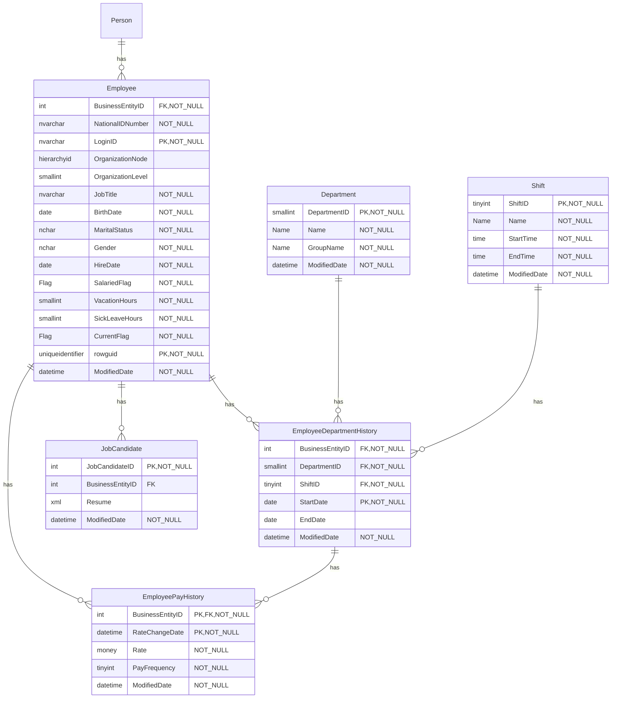
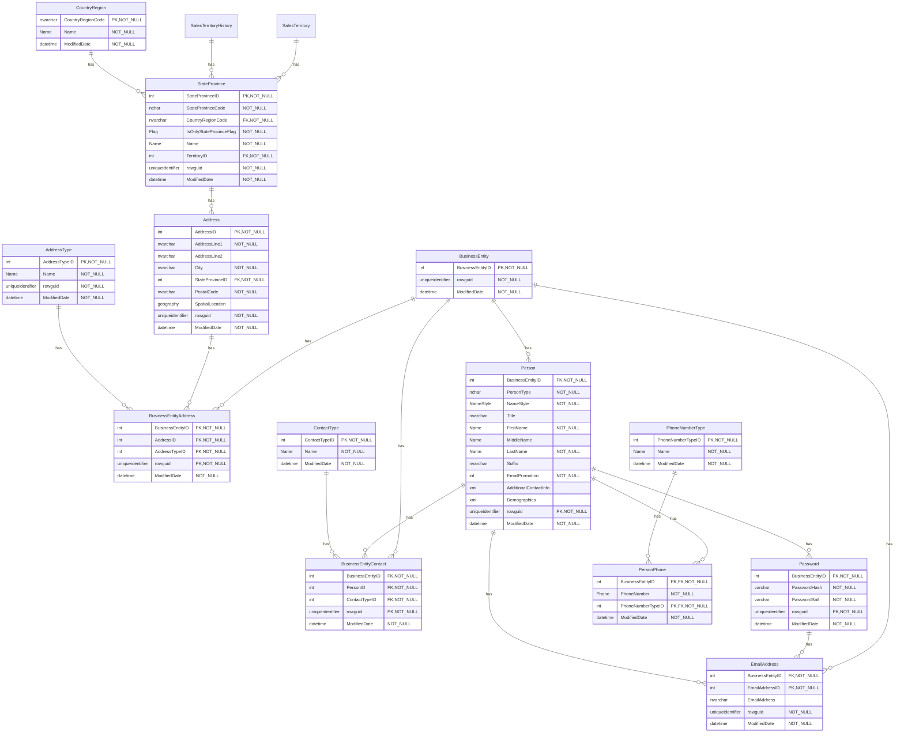
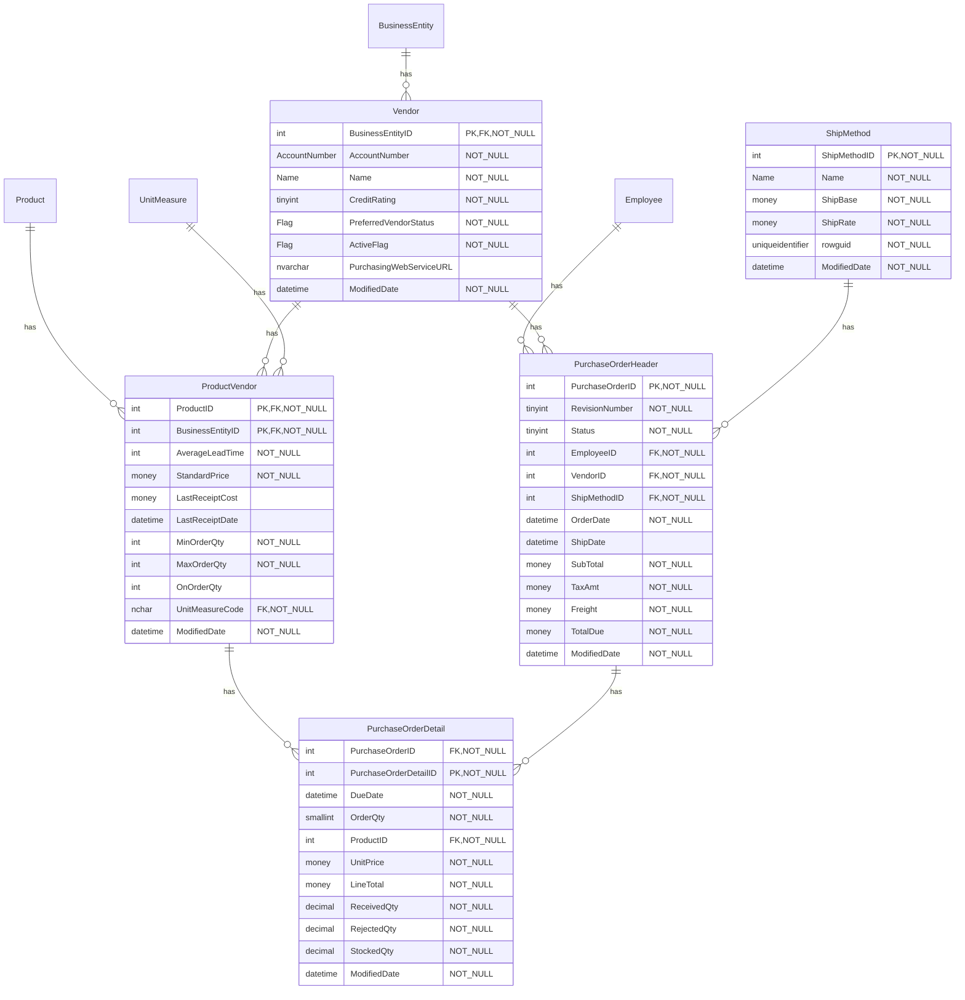

```mermaid
erDiagram
    BillOfMaterials {
        int BillOfMaterialsID "PK,NOT_NULL"
        int ProductAssemblyID "FK"
        int ComponentID "FK,NOT_NULL"
        datetime StartDate "NOT_NULL"
        datetime EndDate
        nchar UnitMeasureCode "FK,NOT_NULL"
        smallint BOMLevel "NOT_NULL"
        decimal PerAssemblyQty "NOT_NULL"
        datetime ModifiedDate "NOT_NULL"
    }
    Culture {
        nchar CultureID "PK,NOT_NULL"
        Name Name "NOT_NULL"
        datetime ModifiedDate "NOT_NULL"
    }
    Document {
        hierarchyid DocumentNode "PK,NOT_NULL"
        smallint DocumentLevel
        nvarchar Title "NOT_NULL"
        int Owner "FK,NOT_NULL"
        bit FolderFlag "NOT_NULL"
        nvarchar FileName "NOT_NULL"
        nvarchar FileExtension "NOT_NULL"
        nchar Revision "NOT_NULL"
        int ChangeNumber "NOT_NULL"
        tinyint Status "NOT_NULL"
        nvarchar DocumentSummary
        varbinary Document
        uniqueidentifier rowguid "NOT_NULL"
        datetime ModifiedDate "NOT_NULL"
    }
    Illustration {
        int IllustrationID "PK,NOT_NULL"
        xml Diagram
        datetime ModifiedDate "NOT_NULL"
    }
    Location {
        smallint LocationID "PK,NOT_NULL"
        Name Name "NOT_NULL"
        smallmoney CostRate "NOT_NULL"
        decimal Availability "NOT_NULL"
        datetime ModifiedDate "NOT_NULL"
    }
    Product {
        int ProductID "PK,NOT_NULL"
        Name Name "NOT_NULL"
        nvarchar ProductNumber "NOT_NULL"
        Flag MakeFlag "NOT_NULL"
        Flag FinishedGoodsFlag "NOT_NULL"
        nvarchar Color
        smallint SafetyStockLevel "NOT_NULL"
        smallint ReorderPoint "NOT_NULL"
        money StandardCost "NOT_NULL"
        money ListPrice "NOT_NULL"
        nvarchar Size
        nchar SizeUnitMeasureCode
        nchar WeightUnitMeasureCode
        decimal Weight
        int DaysToManufacture "NOT_NULL"
        nchar ProductLine
        nchar Class
        nchar Style
        int ProductSubcategoryID "FK"
        int ProductModelID "FK"
        datetime SellStartDate "NOT_NULL"
        datetime SellEndDate
        datetime DiscontinuedDate
        uniqueidentifier rowguid "NOT_NULL"
        datetime ModifiedDate "NOT_NULL"
    }
    ProductCategory {
        int ProductCategoryID "PK,NOT_NULL"
        Name Name "NOT_NULL"
        uniqueidentifier rowguid "NOT_NULL"
        datetime ModifiedDate "NOT_NULL"
    }
    ProductCostHistory {
        int ProductID "FK,NOT_NULL"
        datetime StartDate "PK,NOT_NULL"
        datetime EndDate
        money StandardCost "NOT_NULL"
        datetime ModifiedDate "NOT_NULL"
    }
    ProductDescription {
        int ProductDescriptionID "PK,NOT_NULL"
        nvarchar Description "NOT_NULL"
        uniqueidentifier rowguid "NOT_NULL"
        datetime ModifiedDate "NOT_NULL"
    }
    ProductDocument {
        int ProductID "PK,FK,NOT_NULL"
        hierarchyid DocumentNode "PK,FK,NOT_NULL"
        datetime ModifiedDate "NOT_NULL"
    }
    ProductInventory {
        int ProductID "PK,FK,NOT_NULL"
        smallint LocationID "PK,FK,NOT_NULL"
        nvarchar Shelf "NOT_NULL"
        tinyint Bin "NOT_NULL"
        smallint Quantity "NOT_NULL"
        uniqueidentifier rowguid "PK,NOT_NULL"
        datetime ModifiedDate "NOT_NULL"
    }
    ProductListPriceHistory {
        int ProductID "FK,NOT_NULL"
        datetime StartDate "PK,NOT_NULL"
        datetime EndDate
        money ListPrice "NOT_NULL"
        datetime ModifiedDate "NOT_NULL"
    }
    ProductModel {
        int ProductModelID "PK,NOT_NULL"
        Name Name "NOT_NULL"
        xml CatalogDescription
        xml Instructions
        uniqueidentifier rowguid "NOT_NULL"
        datetime ModifiedDate "NOT_NULL"
    }
    ProductModelIllustration {
        int ProductModelID "PK,FK,NOT_NULL"
        int IllustrationID "PK,FK,NOT_NULL"
        datetime ModifiedDate "NOT_NULL"
    }
    ProductModelProductDescriptionCulture {
        int ProductModelID "PK,FK,NOT_NULL"
        int ProductDescriptionID "PK,FK,NOT_NULL"
        nchar CultureID "PK,FK,NOT_NULL"
        datetime ModifiedDate "NOT_NULL"
    }
    ProductPhoto {
        int ProductPhotoID "PK,NOT_NULL"
        varbinary ThumbNailPhoto
        nvarchar ThumbnailPhotoFileName
        varbinary LargePhoto
        nvarchar LargePhotoFileName
        datetime ModifiedDate "NOT_NULL"
    }
    ProductProductPhoto {
        int ProductID "PK,FK,NOT_NULL"
        int ProductPhotoID "PK,FK,NOT_NULL"
        Flag Primary "NOT_NULL"
        datetime ModifiedDate "NOT_NULL"
    }
    ProductReview {
        int ProductReviewID "PK,NOT_NULL"
        int ProductID "FK,NOT_NULL"
        Name ReviewerName "NOT_NULL"
        datetime ReviewDate "NOT_NULL"
        nvarchar EmailAddress "NOT_NULL"
        int Rating "NOT_NULL"
        nvarchar Comments
        datetime ModifiedDate "NOT_NULL"
    }
    ProductSubcategory {
        int ProductSubcategoryID "PK,NOT_NULL"
        int ProductCategoryID "FK,NOT_NULL"
        Name Name "NOT_NULL"
        uniqueidentifier rowguid "NOT_NULL"
        datetime ModifiedDate "NOT_NULL"
    }
    ScrapReason {
        smallint ScrapReasonID "PK,NOT_NULL"
        Name Name "NOT_NULL"
        datetime ModifiedDate "NOT_NULL"
    }
    TransactionHistory {
        int TransactionID "PK,NOT_NULL"
        int ProductID "FK,NOT_NULL"
        int ReferenceOrderID "FK,NOT_NULL"
        int ReferenceOrderLineID "NOT_NULL"
        datetime TransactionDate "NOT_NULL"
        nchar TransactionType "NOT_NULL"
        int Quantity "NOT_NULL"
        money ActualCost "NOT_NULL"
        datetime ModifiedDate "NOT_NULL"
    }
    TransactionHistoryArchive {
        int TransactionID "PK,NOT_NULL"
        int ProductID "FK,NOT_NULL"
        int ReferenceOrderID "FK,NOT_NULL"
        int ReferenceOrderLineID "NOT_NULL"
        datetime TransactionDate "NOT_NULL"
        nchar TransactionType "NOT_NULL"
        int Quantity "NOT_NULL"
        money ActualCost "NOT_NULL"
        datetime ModifiedDate "NOT_NULL"
    }
    UnitMeasure {
        nchar UnitMeasureCode "PK,NOT_NULL"
        Name Name "NOT_NULL"
        datetime ModifiedDate "NOT_NULL"
    }
    WorkOrder {
        int WorkOrderID "PK,NOT_NULL"
        int ProductID "FK,NOT_NULL"
        int OrderQty "NOT_NULL"
        int StockedQty "NOT_NULL"
        smallint ScrappedQty "NOT_NULL"
        datetime StartDate "NOT_NULL"
        datetime EndDate
        datetime DueDate "NOT_NULL"
        smallint ScrapReasonID "FK"
        datetime ModifiedDate "NOT_NULL"
    }
    WorkOrderRouting {
        int WorkOrderID "FK,NOT_NULL"
        int ProductID "PK,FK,NOT_NULL"
        smallint OperationSequence "NOT_NULL"
        smallint LocationID "PK,FK,NOT_NULL"
        datetime ScheduledStartDate "NOT_NULL"
        datetime ScheduledEndDate "NOT_NULL"
        datetime ActualStartDate
        datetime ActualEndDate
        decimal ActualResourceHrs
        money PlannedCost "NOT_NULL"
        money ActualCost
        datetime ModifiedDate "NOT_NULL"
    }

    Product ||--o{ BillOfMaterials : "has"
    UnitMeasure ||--o{ BillOfMaterials : "has"
    Employee ||--o{ Document : "has"
    ProductSubcategory ||--o{ Product : "has"
    ProductModel ||--o{ Product : "has"
    Product ||--o{ ProductCostHistory : "has"
    Product ||--o{ ProductDocument : "has"
    Document ||--o{ ProductDocument : "has"
    Product ||--o{ ProductInventory : "has"
    Location ||--o{ ProductInventory : "has"
    Product ||--o{ ProductListPriceHistory : "has"
    ProductModel ||--o{ ProductModelIllustration : "has"
    Illustration ||--o{ ProductModelIllustration : "has"
    ProductModel ||--o{ ProductModelProductDescriptionCulture : "has"
    ProductDescription ||--o{ ProductModelProductDescriptionCulture : "has"
    Culture ||--o{ ProductModelProductDescriptionCulture : "has"
    Product ||--o{ ProductProductPhoto : "has"
    ProductPhoto ||--o{ ProductProductPhoto : "has"
    Product ||--o{ ProductReview : "has"
    ProductCategory ||--o{ ProductSubcategory : "has"
    Product ||--o{ TransactionHistory : "has"
    WorkOrder ||--o{ TransactionHistory : "has"
    Product ||--o{ TransactionHistoryArchive : "has"
    WorkOrder ||--o{ TransactionHistoryArchive : "has"
    ScrapReason ||--o{ WorkOrder : "has"
    Product ||--o{ WorkOrder : "has"
    WorkOrder ||--o{ WorkOrderRouting : "has"
    Product ||--o{ WorkOrderRouting : "has"
    Location ||--o{ WorkOrderRouting : "has"
```

```mermaid
erDiagram
    CountryRegionCurrency {
        nvarchar CountryRegionCode "PK,FK,NOT_NULL"
        nchar CurrencyCode "PK,FK,NOT_NULL"
        datetime ModifiedDate "NOT_NULL"
    }
    CreditCard {
        int CreditCardID "PK,NOT_NULL"
        nvarchar CardType "NOT_NULL"
        nvarchar CardNumber "NOT_NULL"
        tinyint ExpMonth "NOT_NULL"
        smallint ExpYear "NOT_NULL"
        datetime ModifiedDate "NOT_NULL"
    }
    Currency {
        nchar CurrencyCode "PK,NOT_NULL"
        Name Name "NOT_NULL"
        datetime ModifiedDate "NOT_NULL"
    }
    CurrencyRate {
        int CurrencyRateID "PK,NOT_NULL"
        datetime CurrencyRateDate "NOT_NULL"
        nchar FromCurrencyCode "FK,NOT_NULL"
        nchar ToCurrencyCode "FK,NOT_NULL"
        money AverageRate "NOT_NULL"
        money EndOfDayRate "NOT_NULL"
        datetime ModifiedDate "NOT_NULL"
    }
    Customer {
        int CustomerID "PK,NOT_NULL"
        int PersonID "FK"
        int StoreID "FK"
        int TerritoryID "FK"
        varchar AccountNumber "NOT_NULL"
        uniqueidentifier rowguid "NOT_NULL"
        datetime ModifiedDate "NOT_NULL"
    }
    PersonCreditCard {
        int BusinessEntityID "PK,FK,NOT_NULL"
        int CreditCardID "PK,FK,NOT_NULL"
        datetime ModifiedDate "NOT_NULL"
    }
    SalesOrderDetail {
        int SalesOrderID "FK,NOT_NULL"
        int SalesOrderDetailID "PK,NOT_NULL"
        nvarchar CarrierTrackingNumber
        smallint OrderQty "NOT_NULL"
        int ProductID "FK,NOT_NULL"
        int SpecialOfferID "FK,NOT_NULL"
        money UnitPrice "NOT_NULL"
        money UnitPriceDiscount "NOT_NULL"
        numeric LineTotal "NOT_NULL"
        uniqueidentifier rowguid "NOT_NULL"
        datetime ModifiedDate "NOT_NULL"
    }
    SalesOrderHeader {
        int SalesOrderID "PK,NOT_NULL"
        tinyint RevisionNumber "NOT_NULL"
        datetime OrderDate "NOT_NULL"
        datetime DueDate "NOT_NULL"
        datetime ShipDate
        tinyint Status "NOT_NULL"
        Flag OnlineOrderFlag "NOT_NULL"
        nvarchar SalesOrderNumber "NOT_NULL"
        OrderNumber PurchaseOrderNumber
        AccountNumber AccountNumber
        int CustomerID "FK,NOT_NULL"
        int SalesPersonID "FK"
        int TerritoryID "FK"
        int BillToAddressID "FK,NOT_NULL"
        int ShipToAddressID "FK,NOT_NULL"
        int ShipMethodID "FK,NOT_NULL"
        int CreditCardID "FK"
        varchar CreditCardApprovalCode
        int CurrencyRateID "FK"
        money SubTotal "NOT_NULL"
        money TaxAmt "NOT_NULL"
        money Freight "NOT_NULL"
        money TotalDue "NOT_NULL"
        nvarchar Comment
        uniqueidentifier rowguid "NOT_NULL"
        datetime ModifiedDate "NOT_NULL"
    }
    SalesOrderHeaderSalesReason {
        int SalesOrderID "PK,FK,NOT_NULL"
        int SalesReasonID "PK,FK,NOT_NULL"
        datetime ModifiedDate "NOT_NULL"
    }
    SalesPerson {
        int BusinessEntityID "FK,NOT_NULL"
        int TerritoryID "FK"
        money SalesQuota
        money Bonus "NOT_NULL"
        smallmoney CommissionPct "NOT_NULL"
        money SalesYTD "NOT_NULL"
        money SalesLastYear "NOT_NULL"
        uniqueidentifier rowguid "PK,NOT_NULL"
        datetime ModifiedDate "NOT_NULL"
    }
    SalesPersonQuotaHistory {
        int BusinessEntityID "FK,NOT_NULL"
        datetime QuotaDate "PK,NOT_NULL"
        money SalesQuota "NOT_NULL"
        uniqueidentifier rowguid "PK,NOT_NULL"
        datetime ModifiedDate "NOT_NULL"
    }
    SalesReason {
        int SalesReasonID "PK,NOT_NULL"
        Name Name "NOT_NULL"
        Name ReasonType "NOT_NULL"
        datetime ModifiedDate "NOT_NULL"
    }
    SalesTaxRate {
        int SalesTaxRateID "PK,NOT_NULL"
        int StateProvinceID "FK,NOT_NULL"
        tinyint TaxType "NOT_NULL"
        smallmoney TaxRate "NOT_NULL"
        Name Name "NOT_NULL"
        uniqueidentifier rowguid "NOT_NULL"
        datetime ModifiedDate "NOT_NULL"
    }
    SalesTerritory {
        int TerritoryID "PK,NOT_NULL"
        Name Name "NOT_NULL"
        nvarchar CountryRegionCode "FK,NOT_NULL"
        nvarchar Group "NOT_NULL"
        money SalesYTD "NOT_NULL"
        money SalesLastYear "NOT_NULL"
        money CostYTD "NOT_NULL"
        money CostLastYear "NOT_NULL"
        uniqueidentifier rowguid "PK,NOT_NULL"
        datetime ModifiedDate "NOT_NULL"
    }
    SalesTerritoryHistory {
        int BusinessEntityID "FK,NOT_NULL"
        int TerritoryID "FK,NOT_NULL"
        datetime StartDate "PK,NOT_NULL"
        datetime EndDate
        uniqueidentifier rowguid "PK,NOT_NULL"
        datetime ModifiedDate "NOT_NULL"
    }
    ShoppingCartItem {
        int ShoppingCartItemID "PK,NOT_NULL"
        nvarchar ShoppingCartID "NOT_NULL"
        int Quantity "NOT_NULL"
        int ProductID "FK,NOT_NULL"
        datetime DateCreated "NOT_NULL"
        datetime ModifiedDate "NOT_NULL"
    }
    SpecialOffer {
        int SpecialOfferID "PK,NOT_NULL"
        nvarchar Description "NOT_NULL"
        smallmoney DiscountPct "NOT_NULL"
        nvarchar Type "NOT_NULL"
        nvarchar Category "NOT_NULL"
        datetime StartDate "NOT_NULL"
        datetime EndDate "NOT_NULL"
        int MinQty "NOT_NULL"
        int MaxQty
        uniqueidentifier rowguid "NOT_NULL"
        datetime ModifiedDate "NOT_NULL"
    }
    SpecialOfferProduct {
        int SpecialOfferID "FK,NOT_NULL"
        int ProductID "FK,NOT_NULL"
        uniqueidentifier rowguid "PK,NOT_NULL"
        datetime ModifiedDate "NOT_NULL"
    }
    Store {
        int BusinessEntityID "FK,NOT_NULL"
        Name Name "NOT_NULL"
        int SalesPersonID "FK"
        xml Demographics
        uniqueidentifier rowguid "PK,NOT_NULL"
        datetime ModifiedDate "NOT_NULL"
    }

    CountryRegion ||--o{ CountryRegionCurrency : "has"
    Currency ||--o{ CountryRegionCurrency : "has"
    Currency ||--o{ CurrencyRate : "has"
    SalesTerritory ||--o{ Customer : "has"
    SalesTerritoryHistory ||--o{ Customer : "has"
    Person ||--o{ Customer : "has"
    Store ||--o{ Customer : "has"
    Person ||--o{ PersonCreditCard : "has"
    CreditCard ||--o{ PersonCreditCard : "has"
    ProductCostHistory ||--o{ SalesOrderDetail : "has"
    ProductListPriceHistory ||--o{ SalesOrderDetail : "has"
    SpecialOfferProduct ||--o{ SalesOrderDetail : "has"
    SpecialOffer ||--o{ SalesOrderDetail : "has"
    SalesOrderHeader ||--o{ SalesOrderDetail : "has"
    Customer ||--o{ SalesOrderHeader : "has"
    SalesTerritory ||--o{ SalesOrderHeader : "has"
    SalesTerritoryHistory ||--o{ SalesOrderHeader : "has"
    Address ||--o{ SalesOrderHeader : "has"
    BusinessEntityAddress ||--o{ SalesOrderHeader : "has"
    CreditCard ||--o{ SalesOrderHeader : "has"
    PersonCreditCard ||--o{ SalesOrderHeader : "has"
    ShipMethod ||--o{ SalesOrderHeader : "has"
    CurrencyRate ||--o{ SalesOrderHeader : "has"
    SalesPerson ||--o{ SalesOrderHeader : "has"
    SalesOrderHeader ||--o{ SalesOrderHeaderSalesReason : "has"
    SalesReason ||--o{ SalesOrderHeaderSalesReason : "has"
    SalesTerritory ||--o{ SalesPerson : "has"
    SalesTerritoryHistory ||--o{ SalesPerson : "has"
    Employee ||--o{ SalesPerson : "has"
    SalesPerson ||--o{ SalesPersonQuotaHistory : "has"
    StateProvince ||--o{ SalesTaxRate : "has"
    CountryRegion ||--o{ SalesTerritory : "has"
    SalesPerson ||--o{ SalesTerritoryHistory : "has"
    SalesTerritory ||--o{ SalesTerritoryHistory : "has"
    Product ||--o{ ShoppingCartItem : "has"
    SpecialOffer ||--o{ SpecialOfferProduct : "has"
    Product ||--o{ SpecialOfferProduct : "has"
    BusinessEntity ||--o{ Store : "has"
    SalesPerson ||--o{ Store : "has"
```

# Database Documentation: AW_Stripped

**Server**: sql-claude
**Generated**: 2026-03-22T13:08:36.480Z
**Total Iterations**: 2

## Analysis Summary

- **Status**: converged
- **Iterations**: 2
- **Tokens Used**: 471,009 (input: 183,707, output: 287,302)
- **Estimated Cost**: $0.00
- **AI Model**: claude-sonnet-4-6
- **AI Vendor**: anthropic
- **Temperature**: 0.1
- **Convergence**: Reached maximum iteration limit (2)

## Table of Contents

### [dbo](#schema-dbo) (3 tables)
- [AWBuildVersion](#awbuildversion)
- [DatabaseLog](#databaselog)
- [ErrorLog](#errorlog)

### [HumanResources](#schema-humanresources) (6 tables)
- [Department](#department)
- [Employee](#employee)
- [EmployeeDepartmentHistory](#employeedepartmenthistory)
- [EmployeePayHistory](#employeepayhistory)
- [JobCandidate](#jobcandidate)
- [Shift](#shift)

### [Person](#schema-person) (13 tables)
- [Address](#address)
- [AddressType](#addresstype)
- [BusinessEntity](#businessentity)
- [BusinessEntityAddress](#businessentityaddress)
- [BusinessEntityContact](#businessentitycontact)
- [ContactType](#contacttype)
- [CountryRegion](#countryregion)
- [EmailAddress](#emailaddress)
- [Password](#password)
- [Person](#person)
- [PersonPhone](#personphone)
- [PhoneNumberType](#phonenumbertype)
- [StateProvince](#stateprovince)

### [Production](#schema-production) (25 tables)
- [BillOfMaterials](#billofmaterials)
- [Culture](#culture)
- [Document](#document)
- [Illustration](#illustration)
- [Location](#location)
- [Product](#product)
- [ProductCategory](#productcategory)
- [ProductCostHistory](#productcosthistory)
- [ProductDescription](#productdescription)
- [ProductDocument](#productdocument)
- [ProductInventory](#productinventory)
- [ProductListPriceHistory](#productlistpricehistory)
- [ProductModel](#productmodel)
- [ProductModelIllustration](#productmodelillustration)
- [ProductModelProductDescriptionCulture](#productmodelproductdescriptionculture)
- [ProductPhoto](#productphoto)
- [ProductProductPhoto](#productproductphoto)
- [ProductReview](#productreview)
- [ProductSubcategory](#productsubcategory)
- [ScrapReason](#scrapreason)
- [TransactionHistory](#transactionhistory)
- [TransactionHistoryArchive](#transactionhistoryarchive)
- [UnitMeasure](#unitmeasure)
- [WorkOrder](#workorder)
- [WorkOrderRouting](#workorderrouting)

### [Purchasing](#schema-purchasing) (5 tables)
- [ProductVendor](#productvendor)
- [PurchaseOrderDetail](#purchaseorderdetail)
- [PurchaseOrderHeader](#purchaseorderheader)
- [ShipMethod](#shipmethod)
- [Vendor](#vendor)

### [Sales](#schema-sales) (19 tables)
- [CountryRegionCurrency](#countryregioncurrency)
- [CreditCard](#creditcard)
- [Currency](#currency)
- [CurrencyRate](#currencyrate)
- [Customer](#customer)
- [PersonCreditCard](#personcreditcard)
- [SalesOrderDetail](#salesorderdetail)
- [SalesOrderHeader](#salesorderheader)
- [SalesOrderHeaderSalesReason](#salesorderheadersalesreason)
- [SalesPerson](#salesperson)
- [SalesPersonQuotaHistory](#salespersonquotahistory)
- [SalesReason](#salesreason)
- [SalesTaxRate](#salestaxrate)
- [SalesTerritory](#salesterritory)
- [SalesTerritoryHistory](#salesterritoryhistory)
- [ShoppingCartItem](#shoppingcartitem)
- [SpecialOffer](#specialoffer)
- [SpecialOfferProduct](#specialofferproduct)
- [Store](#store)


## Schema: dbo

### Entity Relationship Diagram

```mermaid
erDiagram
    AWBuildVersion {
        tinyint SystemInformationID "PK,NOT_NULL"
        nvarchar Database Version "NOT_NULL"
        datetime VersionDate "NOT_NULL"
        datetime ModifiedDate "NOT_NULL"
    }
    DatabaseLog {
        int DatabaseLogID "PK,NOT_NULL"
        datetime PostTime "NOT_NULL"
        sysname DatabaseUser "NOT_NULL"
        sysname Event "NOT_NULL"
        sysname Schema
        sysname Object
        nvarchar TSQL "NOT_NULL"
        xml XmlEvent "NOT_NULL"
    }
    ErrorLog {
        int ErrorLogID "NOT_NULL"
        datetime ErrorTime "NOT_NULL"
        sysname UserName "NOT_NULL"
        int ErrorNumber "NOT_NULL"
        int ErrorSeverity
        int ErrorState
        nvarchar ErrorProcedure
        int ErrorLine
        nvarchar ErrorMessage "NOT_NULL"
    }

```

### Tables

#### AWBuildVersion

A singleton system metadata table that stores version and build information for the AdventureWorks database itself. It tracks the current database version number, when that version was released, and when the record was last modified. This table serves as a self-documenting artifact for database administrators and deployment pipelines to identify which version of the database schema is installed.

**Row Count**: 1
**Dependency Level**: 0

**Confidence**: 97%

**Columns**:

| Column | Type | Description |
|--------|------|-------------|
| SystemInformationID | tinyint (PK, NOT NULL) | Surrogate primary key for the table. Always contains the value 1 since this is a singleton table with exactly one row representing the current database build version. |
| Database Version | nvarchar (NOT NULL) | The version number of the AdventureWorks database schema, stored as a string in the format matching SQL Server version numbering (e.g., '15.0.4280.7'). This identifies the specific build or release of the database. |
| VersionDate | datetime (NOT NULL) | The date and time when the current database version was officially released or created. Represents the timestamp of the version identified in the 'Database Version' column. |
| ModifiedDate | datetime (NOT NULL) | The date and time when this record was last updated. Tracks the most recent modification to the system information row, which may reflect when the database was last patched or the record was last touched. |

#### DatabaseLog

A database-level audit log that records all DDL (Data Definition Language) events executed against the AdventureWorks2019 database. Each row captures a single DDL statement execution, including the event type, the T-SQL command issued, the database object affected, and a full XML representation of the event instance. This table serves as a historical record of schema creation and modification activities, primarily capturing the initial database build/deployment script execution.

**Row Count**: 1596
**Dependency Level**: 0

**Confidence**: 99%

**Columns**:

| Column | Type | Description |
|--------|------|-------------|
| DatabaseLogID | int (PK, NOT NULL) | Surrogate primary key that uniquely identifies each DDL event log entry. Auto-incremented integer assigned to each logged database event. |
| PostTime | datetime (NOT NULL) | The date and time when the DDL event was captured and logged. Reflects the exact timestamp of the DDL statement execution. |
| DatabaseUser | sysname (NOT NULL) | The database user account that executed the DDL statement. Identifies who performed the schema change within the database context. |
| Event | sysname (NOT NULL) | The type of DDL event that was captured. Identifies the category of schema change operation performed (e.g., CREATE_TABLE, ALTER_TABLE, CREATE_INDEX, CREATE_PROCEDURE, CREATE_VIEW, CREATE_FUNCTION, CREATE_TRIGGER, CREATE_EXTENDED_PROPERTY, etc.). |
| Schema | sysname | The database schema that owns the object affected by the DDL event. Identifies the organizational namespace of the modified database object. |
| Object | sysname | The name of the specific database object affected by the DDL event, such as a table name, index name, constraint name, column name, function name, or procedure name. |
| TSQL | nvarchar (NOT NULL) | The complete T-SQL statement that was executed and triggered the DDL event. Stores the exact SQL command text, including CREATE TABLE, ALTER TABLE, CREATE INDEX, EXECUTE sp_addextendedproperty, and other DDL statements. |
| XmlEvent | xml (NOT NULL) | The full XML representation of the DDL event instance as captured by SQL Server's EVENTDATA() function within a DDL trigger. Contains comprehensive event metadata including event type, timestamp, server name, SPID, login name, database name, schema name, object name, object type, and the complete T-SQL command with session SET options. |

#### ErrorLog

A system-level audit table that records database errors encountered during stored procedure or batch execution. It captures detailed information about each error event, including when it occurred, who triggered it, and the specific error details such as number, severity, state, procedure name, line number, and message. This table serves as a centralized error logging mechanism for the AdventureWorks database.

**Row Count**: 0
**Dependency Level**: 0

**Confidence**: 98%

**Columns**:

| Column | Type | Description |
|--------|------|-------------|
| ErrorLogID | int (NOT NULL) | The primary key and unique identifier for each error log entry. Auto-incremented integer that uniquely identifies each recorded error event. |
| ErrorTime | datetime (NOT NULL) | The date and time when the error occurred. Records the exact timestamp of the error event for chronological tracking and debugging. |
| UserName | sysname (NOT NULL) | The database username of the user whose session triggered the error. Identifies which user or service account was executing code when the error occurred. |
| ErrorNumber | int (NOT NULL) | The SQL Server error number associated with the error. Corresponds to the value returned by the ERROR_NUMBER() function within a TRY/CATCH block. |
| ErrorSeverity | int | The severity level of the error, ranging from 0 to 25 in SQL Server. Higher values indicate more critical errors. Nullable because some errors may not have an associated severity. |
| ErrorState | int | The state number of the error, which provides additional context about the error's origin within SQL Server. Nullable as not all errors have a meaningful state value. |
| ErrorProcedure | nvarchar | The name of the stored procedure or trigger in which the error occurred. Nullable because errors can occur outside of stored procedures (e.g., in ad-hoc batches). |
| ErrorLine | int | The line number within the stored procedure, trigger, or batch at which the error occurred. Nullable for cases where a line number cannot be determined. |
| ErrorMessage | nvarchar (NOT NULL) | The full text of the error message describing what went wrong. This is the human-readable description of the error event. |

## Schema: HumanResources

### Entity Relationship Diagram



### Tables

#### Department

A lookup/reference table that stores the organizational departments within the company. Each row represents a distinct department, categorized under a broader functional group. This table serves as the foundational reference for employee department assignments tracked in HumanResources.EmployeeDepartmentHistory.

**Row Count**: 16
**Dependency Level**: 0

**Confidence**: 99%

**Referenced By**:
- [HumanResources.EmployeeDepartmentHistory](#employeedepartmenthistory)

**Columns**:

| Column | Type | Description |
|--------|------|-------------|
| DepartmentID | smallint (PK, NOT NULL) | The primary key and unique identifier for each department. A small integer auto-incremented from 1 to 16, uniquely identifying each of the 16 departments in the organization. |
| Name | Name (NOT NULL) | The full descriptive name of the department (e.g., 'Sales', 'Engineering', 'Human Resources'). This is the human-readable identifier used to distinguish departments. |
| GroupName | Name (NOT NULL) | The higher-level functional group or division to which the department belongs (e.g., 'Manufacturing', 'Sales and Marketing', 'Executive General and Administration'). Groups multiple departments under a common organizational umbrella. |
| ModifiedDate | datetime (NOT NULL) | The date and time when the department record was last modified. Used for auditing and change tracking purposes. |

#### Employee

Stores employment-specific information for all 290 employees at AdventureWorks. This table extends Person.Person with HR-specific attributes such as job title, organizational hierarchy position, national ID, login credentials, hire date, compensation type, and leave balances. It represents the core employee record in the HumanResources domain and serves as the anchor for pay history, department assignments, job candidacy, and sales/purchasing roles.

Compensation data reveals that the majority of employees (approximately 264 of 290) have only their initial pay rate on record, with ~26 having received at least one pay rate change. Pay rates range from $6.50 to $37.50 per hour, and two distinct payroll cycles (PayFrequency values 1 and 2) distinguish likely hourly/non-exempt workers from salaried/exempt employees. Department assignments are notably stable, with only ~6 employees having transfer records, confirming that EmployeeDepartmentHistory is a sparse audit trail rather than a frequently updated record.

The table also anchors several specialized workforce subsets: only 17 employees (BusinessEntityIDs 274–290) are designated salespeople, confirming Sales.SalesPerson as a small, dedicated specialization of this table. Purchasing authority is similarly restricted to a dedicated procurement team of 12 employees, and document management is concentrated among just 3 employees — both patterns reflecting role-based access controls anchored here. Additionally, this table serves as the destination for a pre-hire pipeline: HumanResources.JobCandidate tracks applicants, but only a small fraction (2 of 13 sampled candidates) are converted to employees.

**Row Count**: 290
**Dependency Level**: 0

**Confidence**: 99%

**Depends On**:
- [Person.Person](#person) (via BusinessEntityID)

**Referenced By**:
- [HumanResources.EmployeePayHistory](#employeepayhistory)
- [HumanResources.EmployeeDepartmentHistory](#employeedepartmenthistory)
- [HumanResources.JobCandidate](#jobcandidate)
- [Production.Document](#document)
- [Purchasing.PurchaseOrderHeader](#purchaseorderheader)
- [Sales.SalesPerson](#salesperson)

**Columns**:

| Column | Type | Description |
|--------|------|-------------|
| BusinessEntityID | int (FK, NOT NULL) | Primary key and foreign key to Person.Person.BusinessEntityID. Uniquely identifies each employee and links the employee record to the corresponding person record, enabling access to name, contact, and demographic information stored in Person.Person. |
| NationalIDNumber | nvarchar (NOT NULL) | The employee's national identification number (e.g., Social Security Number in the US). Used for payroll, tax, and legal identification purposes. |
| LoginID | nvarchar (PK, NOT NULL) | The employee's network login identifier in domain\username format (e.g., 'adventure-works\michael9'). Used for system authentication and access control. |
| OrganizationNode | hierarchyid | A hierarchyid value representing the employee's position in the organizational hierarchy tree. Encodes the full path from the root of the organization to this employee's node. |
| OrganizationLevel | smallint | A computed or stored integer indicating the depth of the employee's node in the organizational hierarchy. Level 1 is the top (e.g., CEO), and higher numbers represent lower levels (e.g., 4 = front-line worker). |
| JobTitle | nvarchar (NOT NULL) | The official job title of the employee within the organization (e.g., 'Production Technician - WC60', 'Design Engineer', 'Pacific Sales Manager'). |
| BirthDate | date (NOT NULL) | The employee's date of birth. Used for age verification, benefits eligibility, and HR compliance purposes. |
| MaritalStatus | nchar (NOT NULL) | The employee's marital status, encoded as a single character: 'M' for Married, 'S' for Single. |
| Gender | nchar (NOT NULL) | The employee's gender, encoded as a single character: 'M' for Male, 'F' for Female. |
| HireDate | date (NOT NULL) | The date the employee was hired by the company. Used for tenure calculations, benefits eligibility, and HR reporting. |
| SalariedFlag | Flag (NOT NULL) | Indicates whether the employee is salaried (true) or hourly/non-salaried (false). Determines payroll processing method. |
| VacationHours | smallint (NOT NULL) | The number of vacation hours the employee has accrued or is entitled to. Used for leave management and payroll. |
| SickLeaveHours | smallint (NOT NULL) | The number of sick leave hours the employee has accrued or is entitled to. Used for leave management and HR compliance. |
| CurrentFlag | Flag (NOT NULL) | Indicates whether the employee is currently active (true) or has been terminated/separated (false). All 290 rows have a value of true, meaning this table only contains current employees. |
| rowguid | uniqueidentifier (PK, NOT NULL) | A globally unique identifier (GUID) for the employee record. Used for replication, data synchronization, and uniquely identifying rows across distributed systems. |
| ModifiedDate | datetime (NOT NULL) | The date and time when the employee record was last modified. Used for auditing and change tracking. |

#### EmployeeDepartmentHistory

Tracks the historical record of employee department and shift assignments over time within AdventureWorks. Each row represents a period during which an employee was assigned to a specific department and work shift, with start and optional end dates defining the duration of that assignment. This is a slowly changing dimension (Type 2) table that preserves the full history of department/shift changes for each employee.

**Row Count**: 296
**Dependency Level**: 0

**Confidence**: 98%

**Depends On**:
- [HumanResources.Employee](#employee) (via BusinessEntityID)
- [HumanResources.Department](#department) (via DepartmentID)
- [HumanResources.Shift](#shift) (via ShiftID)

**Referenced By**:
- [HumanResources.EmployeePayHistory](#employeepayhistory)

**Columns**:

| Column | Type | Description |
|--------|------|-------------|
| BusinessEntityID | int (FK, NOT NULL) | Foreign key referencing the employee (HumanResources.Employee.BusinessEntityID). Identifies which employee this department/shift assignment belongs to. |
| DepartmentID | smallint (FK, NOT NULL) | Foreign key referencing HumanResources.Department. Identifies the department the employee was assigned to during this period. |
| ShiftID | tinyint (FK, NOT NULL) | Foreign key referencing HumanResources.Shift. Identifies the work shift (Day=1, Evening=2, Night=3) the employee worked during this assignment period. |
| StartDate | date (PK, NOT NULL) | The date on which the employee began working in the specified department and shift. Together with EndDate, defines the duration of this assignment. |
| EndDate | date | The date on which the employee's assignment to this department and shift ended. NULL indicates the assignment is currently active. Only 6 distinct non-null values exist, representing the few employees who have changed departments or left. |
| ModifiedDate | datetime (NOT NULL) | The date and time the record was last modified. Used for auditing and change tracking purposes. |

#### EmployeePayHistory

Stores the historical pay rate records for employees at AdventureWorks, tracking changes in compensation over time. Each row represents a specific pay rate effective from a given date for an employee, enabling a full audit trail of salary/wage changes. This is the HumanResources.EmployeePayHistory table.

**Row Count**: 316
**Dependency Level**: 1

**Confidence**: 98%

**Depends On**:
- [HumanResources.Employee](#employee) (via BusinessEntityID)
- [HumanResources.EmployeeDepartmentHistory](#employeedepartmenthistory) (via BusinessEntityID)

**Columns**:

| Column | Type | Description |
|--------|------|-------------|
| BusinessEntityID | int (PK, FK, NOT NULL) | The unique identifier of the employee whose pay rate is being recorded. Part of the composite primary key and a foreign key referencing HumanResources.Employee.BusinessEntityID. |
| RateChangeDate | datetime (PK, NOT NULL) | The effective date on which the pay rate change took effect. Together with BusinessEntityID, forms the composite primary key, allowing multiple pay rate records per employee over time. |
| Rate | money (NOT NULL) | The hourly pay rate for the employee effective from the RateChangeDate. Stored as a money data type, with values ranging from approximately $6.50 to $37.50 per hour. |
| PayFrequency | tinyint (NOT NULL) | Indicates how frequently the employee is paid. Only two values exist: 1 = Monthly pay cycle, 2 = Bi-weekly (every two weeks) pay cycle. |
| ModifiedDate | datetime (NOT NULL) | The date and time the record was last modified. Standard audit column used across AdventureWorks tables to track when data was last updated. |

#### JobCandidate

Stores job candidate applications and their associated resumes for the AdventureWorks company. Each record represents a single job applicant, optionally linked to an existing employee if the candidate was subsequently hired. The resume is stored as structured XML containing personal information, employment history, education, skills, and contact details.

**Row Count**: 13
**Dependency Level**: 0

**Confidence**: 99%

**Depends On**:
- [HumanResources.Employee](#employee) (via BusinessEntityID)

**Columns**:

| Column | Type | Description |
|--------|------|-------------|
| JobCandidateID | int (PK, NOT NULL) | Surrogate primary key uniquely identifying each job candidate record. Auto-incremented integer assigned when a new candidate application is created. |
| BusinessEntityID | int (FK) | Optional foreign key linking a job candidate to an existing employee in HumanResources.Employee. NULL for candidates who have not been hired; populated when a candidate is subsequently hired and becomes an employee. |
| Resume | xml | Structured XML document containing the candidate's full resume, including personal name, professional skills summary, employment history (employer, job title, responsibilities, dates, location), education (degree, school, GPA, dates), contact address, phone numbers, email, and website. Resumes appear in multiple languages including English, Chinese (Simplified), French, and Thai. |
| ModifiedDate | datetime (NOT NULL) | Timestamp recording when the job candidate record was last modified. Used for auditing and change tracking purposes. |

#### Shift

A lookup/reference table defining the work shifts used in the organization. It stores the three standard work shifts (Day, Evening, Night) with their respective start and end times, serving as a foundational reference for employee scheduling and department history tracking.

**Row Count**: 3
**Dependency Level**: 0

**Confidence**: 99%

**Referenced By**:
- [HumanResources.EmployeeDepartmentHistory](#employeedepartmenthistory)

**Columns**:

| Column | Type | Description |
|--------|------|-------------|
| ShiftID | tinyint (PK, NOT NULL) | The primary key uniquely identifying each work shift. A small integer (tinyint) appropriate for a small, fixed set of shift types. |
| Name | Name (NOT NULL) | The human-readable name of the shift (Day, Evening, Night), used for display and identification purposes. |
| StartTime | time (NOT NULL) | The time of day when the shift begins. Day shift starts at 07:00, Evening at 15:00, and Night at 23:00. |
| EndTime | time (NOT NULL) | The time of day when the shift ends. Day shift ends at 15:00, Evening at 23:00, and Night at 07:00 (next day). |
| ModifiedDate | datetime (NOT NULL) | The date and time when the shift record was last modified. All records share the same date (2008-04-30), indicating they were created or last updated together as seed data. |

## Schema: Person

### Entity Relationship Diagram



### Tables

#### Address

Stores physical address information for persons, businesses, and other entities in the AdventureWorks database. Each row represents a unique mailing or shipping address including street, city, state/province, postal code, and geographic coordinates. This table serves as a central address repository referenced by sales orders and business entity address associations. Notably, addresses are not shared between business entities — each business entity association uses a distinct address record, meaning duplicate physical locations are stored as separate rows rather than being reused across entities.

**Row Count**: 19614
**Dependency Level**: 0

**Confidence**: 97%

**Depends On**:
- [Person.StateProvince](#stateprovince) (via StateProvinceID)

**Referenced By**:
- [Sales.SalesOrderHeader](#salesorderheader)
- [Sales.SalesOrderHeader](#salesorderheader)
- [Person.BusinessEntityAddress](#businessentityaddress)

**Columns**:

| Column | Type | Description |
|--------|------|-------------|
| AddressID | int (PK, NOT NULL) | Surrogate primary key uniquely identifying each address record in the system. |
| AddressLine1 | nvarchar (NOT NULL) | The primary street address line, typically containing the street number and street name. |
| AddressLine2 | nvarchar | Optional secondary address line for suite numbers, apartment numbers, department names, or other supplementary address information. |
| City | nvarchar (NOT NULL) | The city or municipality name for the address. |
| StateProvinceID | int (FK, NOT NULL) | Foreign key referencing Person.StateProvince, identifying the state, province, or other sub-national geographic division for the address. |
| PostalCode | nvarchar (NOT NULL) | The postal or ZIP code for the address, stored as a string to accommodate international formats. |
| SpatialLocation | geography | Geographic coordinates (latitude/longitude) of the address stored as a SQL Server geography type using the WGS84 coordinate system (SRID 4326), enabling spatial queries and mapping. |
| rowguid | uniqueidentifier (NOT NULL) | A globally unique identifier (GUID) for the address row, used for replication and row-level identification across distributed systems. |
| ModifiedDate | datetime (NOT NULL) | The date and time when the address record was last modified, used for auditing and change tracking. |

#### AddressType

A lookup/reference table that defines the types of addresses used throughout the system. It categorizes addresses into distinct types such as Billing, Shipping, Home, Primary, Main Office, and Archive, enabling consistent classification of addresses associated with business entities. In practice, only 3 of the 6 defined address types are actively used in business entity address associations (IDs 2, 3, and 5), with type 2 being the most frequently used. The remaining types (Billing, Home, Archive, or others) appear to be defined for potential use but are not currently utilized in the system.

**Row Count**: 6
**Dependency Level**: 0

**Confidence**: 97%

**Referenced By**:
- [Person.BusinessEntityAddress](#businessentityaddress)

**Columns**:

| Column | Type | Description |
|--------|------|-------------|
| AddressTypeID | int (PK, NOT NULL) | The primary key and unique identifier for each address type. An integer surrogate key that uniquely identifies each address classification category. |
| Name | Name (NOT NULL) | The human-readable name of the address type (e.g., Billing, Shipping, Home, Primary, Main Office, Archive). This is the descriptive label used to classify an address's purpose or role. |
| rowguid | uniqueidentifier (NOT NULL) | A globally unique identifier (GUID) assigned to each row, used to support replication and row-level identification across distributed systems. |
| ModifiedDate | datetime (NOT NULL) | The date and time when the record was last modified. Used for auditing and change tracking purposes. |

#### BusinessEntity

The foundational polymorphic identity table for the AdventureWorks database, serving as the root identity record for all business entities across multiple distinct subtypes. Every entity in the system — whether an individual person (of 6 types: individual customers, store contacts, general contacts, employees, vendor contacts, and salespersons), a vendor organization, or a retail/wholesale store — must first exist as a record in this table, which assigns a unique BusinessEntityID. The table contains only three columns: an identity key, a rowguid for replication, and a ModifiedDate for auditing, reflecting its role as a pure identity registry rather than a data store. With 20,777 total records, individual persons (via Person.Person) account for approximately 19,972 records (~96%), making them the dominant subtype. Vendor organizations occupy a higher ID range (~1500–1690), while store entities use IDs in the range 304–1944, suggesting entities were registered in batches or phases. The remaining ~805 records (~4%) represent non-person organizational entities (vendors and stores), which notably do not have email addresses in the system — email addresses are exclusively assigned to person-type entities, further reinforcing the distinction between person and organizational subtypes. The table also anchors address associations (with ~19,579 entities having at least one address) and organizational contact relationships (805 organizational entities with named contact persons). This table acts as the true polymorphic anchor for the entire entity hierarchy, enabling a table-per-type inheritance pattern across persons, vendors, and stores.

**Row Count**: 20777
**Dependency Level**: 0

**Confidence**: 99%

**Referenced By**:
- [Person.EmailAddress](#emailaddress)
- [Person.BusinessEntityAddress](#businessentityaddress)
- [Person.BusinessEntityContact](#businessentitycontact)
- [Person.Person](#person)
- [Purchasing.Vendor](#vendor)
- [Sales.Store](#store)

**Columns**:

| Column | Type | Description |
|--------|------|-------------|
| BusinessEntityID | int (PK, NOT NULL) | The unique identifier for every business entity in the system. This is the primary key and serves as the root identity that all specialized entity tables (Person, Vendor, Store, etc.) inherit and reference. It is an integer surrogate key auto-assigned to each new entity. |
| rowguid | uniqueidentifier (NOT NULL) | A globally unique identifier (GUID) assigned to each business entity record. Used to uniquely identify rows across distributed systems, replication scenarios, or data merges where integer keys may conflict. |
| ModifiedDate | datetime (NOT NULL) | The date and time when the business entity record was last modified. Used for auditing and change tracking purposes. All sample values fall on the same date (2017-12-13), suggesting a bulk load or migration event, but the millisecond-level precision indicates individual record timestamps. |

#### BusinessEntityAddress

A junction/bridge table that associates business entities (persons, vendors, stores) with their physical addresses and categorizes each association by address type. This table implements a many-to-many relationship between business entities and addresses, allowing a single entity to have multiple addresses of different types simultaneously. The six address types (Billing, Shipping, Home, Primary, Main Office, Archive) reveal a dual-purpose design: commercial entities (vendors, stores) typically use Billing, Shipping, and Main Office address types, while individual persons use Home and Primary address types. It serves as the central linking mechanism for address data across the AdventureWorks system and is referenced by sales order processing.

**Row Count**: 19614
**Dependency Level**: 0

**Confidence**: 98%

**Depends On**:
- [Person.BusinessEntity](#businessentity) (via BusinessEntityID)
- [Person.Address](#address) (via AddressID)
- [Person.AddressType](#addresstype) (via AddressTypeID)

**Referenced By**:
- [Sales.SalesOrderHeader](#salesorderheader)
- [Sales.SalesOrderHeader](#salesorderheader)

**Columns**:

| Column | Type | Description |
|--------|------|-------------|
| BusinessEntityID | int (FK, NOT NULL) | The unique identifier of the business entity (person, vendor, or store) associated with the address. References Person.BusinessEntity as the root identity record. Part of the composite primary key. |
| AddressID | int (FK, NOT NULL) | The unique identifier of the physical address associated with the business entity. References Person.Address which stores the full address details. Part of the composite primary key. |
| AddressTypeID | int (FK, NOT NULL) | Classifies the type of address for this business entity association (e.g., Home, Billing, Shipping, Main Office). Only 3 distinct values are used (2, 3, 5) out of the available address types in Person.AddressType. Part of the composite primary key. |
| rowguid | uniqueidentifier (PK, NOT NULL) | A globally unique identifier (GUID) assigned to each row, used for replication and row-level identification across distributed systems. Standard AdventureWorks audit column. |
| ModifiedDate | datetime (NOT NULL) | The date and time when the business entity address association record was last modified. Used for auditing and change tracking. |

#### BusinessEntityContact

A junction/bridge table that associates persons with business entities and defines the nature of their contact relationship via a contact type. Each record represents a specific person acting in a specific role for a given business entity such as a vendor or store. This table enables many-to-many relationships between business entities and persons, with the contact type clarifying the role of the person within that entity. Contact roles span multiple functional domains including sales (Sales Representative, Sales Manager, Sales Associate, Sales Agent, Assistant Sales Representative, Assistant Sales Agent, Regional Account Representative), purchasing (Purchasing Manager, Purchasing Agent), marketing (Marketing Manager, Marketing Representative, Marketing Assistant, International Marketing Manager, Product Manager), ownership (Owner, Owner/Marketing Assistant), and administrative roles (Order Administrator, Export Administrator, Coordinator Foreign Markets, Accounting Manager). With 909 rows and 805 distinct BusinessEntityIDs, some business entities have multiple contacts serving different functional roles.

**Row Count**: 909
**Dependency Level**: 0

**Confidence**: 98%

**Depends On**:
- [Person.BusinessEntity](#businessentity) (via BusinessEntityID)
- [Person.Person](#person) (via PersonID)
- [Person.ContactType](#contacttype) (via ContactTypeID)

**Columns**:

| Column | Type | Description |
|--------|------|-------------|
| BusinessEntityID | int (FK, NOT NULL) | The unique identifier of the business entity (such as a vendor or store) that the contact person is associated with. References Person.BusinessEntity as the root identity record. This is part of the composite primary key. |
| PersonID | int (FK, NOT NULL) | The unique identifier of the person who serves as a contact for the business entity. References Person.Person.BusinessEntityID. This is part of the composite primary key and identifies the individual in the contact relationship. |
| ContactTypeID | int (FK, NOT NULL) | The type or role of the contact relationship, such as Owner, Sales Representative, or Purchasing Manager. References Person.ContactType.ContactTypeID. This is part of the composite primary key and classifies the nature of the person's role within the business entity. |
| rowguid | uniqueidentifier (PK, NOT NULL) | A globally unique identifier (GUID) assigned to each row, used for replication and row-level identification across distributed systems. Standard AdventureWorks auditing column. |
| ModifiedDate | datetime (NOT NULL) | The date and time when the record was last modified. Used for auditing and change tracking purposes. |

#### ContactType

A lookup/reference table that defines the types of contacts (roles) that can be associated with business entities. It stores a predefined set of 20 contact role classifications such as Sales Representative, Purchasing Manager, Marketing Assistant, etc., used to categorize the nature of a person's relationship with a business entity. However, only 7 of the 20 defined contact types are actively used in practice (IDs: 2, 11, 14, 15, 17, 18, 19), with contact types 11 and 15 being the most frequently assigned roles. The remaining 13 contact types are defined but currently unused, indicating the table was pre-populated with a broader taxonomy than is currently needed by the business.

**Row Count**: 20
**Dependency Level**: 0

**Confidence**: 98%

**Referenced By**:
- [Person.BusinessEntityContact](#businessentitycontact)

**Columns**:

| Column | Type | Description |
|--------|------|-------------|
| ContactTypeID | int (PK, NOT NULL) | The primary key and unique identifier for each contact type. An auto-incremented integer that uniquely identifies each contact role classification. |
| Name | Name (NOT NULL) | The descriptive name of the contact type, representing the role or title a person holds in relation to a business entity (e.g., 'Sales Representative', 'Purchasing Manager', 'Marketing Assistant'). This is the human-readable label used throughout the application. |
| ModifiedDate | datetime (NOT NULL) | The date and time when the contact type record was last modified. All records share the same date (2008-04-30), indicating this reference data was loaded or last updated as a batch during initial database setup. |

#### CountryRegion

A reference/lookup table storing all countries and regions of the world, identified by their ISO 3166-1 alpha-2 country codes. This foundational table serves as a geographic reference used throughout the AdventureWorks database for associating currencies, sales territories, and other entities with specific countries or regions. The table supports historical multi-currency country associations, as evidenced by some countries being mapped to multiple currencies (e.g., European countries linked to both legacy national currencies and EUR). While all 238 country/region codes are available as a global reference, only 6 are actively used in the sales domain: United States (US), United Kingdom (GB), France (FR), Germany (DE), Canada (CA), and Australia (AU), with the US being the primary sales market spanning at least 5 territories.

**Row Count**: 238
**Dependency Level**: 0

**Confidence**: 99%

**Referenced By**:
- [Sales.CountryRegionCurrency](#countryregioncurrency)
- [Sales.SalesTerritory](#salesterritory)
- [Person.StateProvince](#stateprovince)

**Columns**:

| Column | Type | Description |
|--------|------|-------------|
| CountryRegionCode | nvarchar (PK, NOT NULL) | The ISO 3166-1 alpha-2 two-character code uniquely identifying each country or region (e.g., 'US' for United States, 'CA' for Canada). Serves as the primary key and the foreign key target for dependent tables. |
| Name | Name (NOT NULL) | The full English name of the country or region (e.g., 'Brazil', 'France', 'Timor-Leste'). Provides a human-readable label for display and reporting purposes. |
| ModifiedDate | datetime (NOT NULL) | The date and time when the record was last modified. Used for auditing and change tracking purposes. All records share the same date (2008-04-30), indicating the entire table was loaded or last updated in a single batch operation. |

#### EmailAddress

Stores email addresses for persons registered in the AdventureWorks system. Each record associates a unique email address with a specific person (via BusinessEntityID), enabling contact and authentication functionality. This table supports a one-to-one relationship between persons and their primary email addresses, serving as the email contact repository for all ~19,972 registered system users.

**Row Count**: 19972
**Dependency Level**: 1

**Confidence**: 99%

**Depends On**:
- [Person.BusinessEntity](#businessentity) (via BusinessEntityID)
- [Person.Password](#password) (via BusinessEntityID)
- [Person.Person](#person) (via BusinessEntityID)

**Columns**:

| Column | Type | Description |
|--------|------|-------------|
| BusinessEntityID | int (FK, NOT NULL) | Foreign key linking this email address record to a specific person in Person.Person. Identifies which individual owns this email address. Has a 1:1 relationship with EmailAddressID, meaning each person has exactly one email address record in this table. |
| EmailAddressID | int (PK, NOT NULL) | Surrogate primary key uniquely identifying each email address record. Auto-incremented integer assigned when a new email address is registered for a person. |
| EmailAddress | nvarchar | The actual email address string for the person. All sample values follow the pattern 'firstname+number@adventure-works.com', indicating these are internal/demo email addresses for the AdventureWorks fictional company. Average length of 27 characters is consistent with typical email address lengths. |
| rowguid | uniqueidentifier (NOT NULL) | A globally unique identifier (GUID) assigned to each email address record, used for replication and row-level identification across distributed systems. Standard AdventureWorks auditing column present in most tables. |
| ModifiedDate | datetime (NOT NULL) | Timestamp recording when the email address record was last created or modified. Used for auditing and change tracking purposes. Standard AdventureWorks audit column. |

#### Password

Stores authentication credentials (password hash and salt) for persons registered as system users in the AdventureWorks application. Each record links a person's identity (via BusinessEntityID) to their securely hashed password, enabling login authentication for the ~19,972 individuals who have registered accounts.

**Row Count**: 19972
**Dependency Level**: 0

**Confidence**: 98%

**Depends On**:
- [Person.Person](#person) (via BusinessEntityID)

**Referenced By**:
- [Person.EmailAddress](#emailaddress)

**Columns**:

| Column | Type | Description |
|--------|------|-------------|
| BusinessEntityID | int (FK, NOT NULL) | Primary key and foreign key referencing Person.Person.BusinessEntityID. Uniquely identifies the person whose authentication credentials are stored in this row. The 1:1 relationship means each person has at most one password record. |
| PasswordHash | varchar (NOT NULL) | A Base64-encoded cryptographic hash of the person's password combined with the salt. Used to verify login credentials without storing the plaintext password. The 44-character length is consistent with a Base64-encoded 32-byte (256-bit) hash output. |
| PasswordSalt | varchar (NOT NULL) | A Base64-encoded random salt value appended or prepended to the plaintext password before hashing. Ensures that two users with the same password will have different hash values, protecting against rainbow table and dictionary attacks. |
| rowguid | uniqueidentifier (PK, NOT NULL) | A globally unique identifier (GUID) assigned to each row, used for replication and row-level identification across distributed systems. Standard AdventureWorks audit column present in most tables. |
| ModifiedDate | datetime (NOT NULL) | The date and time when the password record was last created or updated. Used for auditing and tracking when credentials were last changed. |

#### Person

Stores personal information for all individuals in the AdventureWorks system, including customers, employees, vendors, and other contacts. This table is the central identity repository for person-level data such as names, titles, contact preferences, demographic survey data, and additional contact information. It extends the Person.BusinessEntity base table by adding person-specific attributes and serves as the foundation for multiple specialized roles (employees, customers, etc.).

Key characteristics of the population: The table contains 20,000+ person records, of which the vast majority (~19,119 out of ~19,820 customers) are customers, while only ~290 are employees (a small specialized subset). Approximately 19,972 are registered system users with password credentials, and every registered system user has exactly one email address on file (confirmed by a strict 1:1 mandatory relationship between Person.Password and Person.EmailAddress records). Additionally, ~19,118 persons have credit cards on file, indicating broad purchasing capability, and ~19,972 have at least one phone number recorded. The table distinguishes between 'known contacts' (all persons) and 'active system users' (only those with a corresponding Person.Password record). Each person serves as a unique identity record — the one-to-one relationship with HumanResources.Employee means employment attributes are stored separately while personal details (name, contact info) remain here.

**Row Count**: 19972
**Dependency Level**: 0

**Confidence**: 99%

**Depends On**:
- [Person.BusinessEntity](#businessentity) (via BusinessEntityID)

**Referenced By**:
- [HumanResources.Employee](#employee)
- [Person.BusinessEntityContact](#businessentitycontact)
- [Person.Password](#password)
- [Person.PersonPhone](#personphone)
- [Sales.PersonCreditCard](#personcreditcard)
- [Person.EmailAddress](#emailaddress)
- [Sales.Customer](#customer)

**Columns**:

| Column | Type | Description |
|--------|------|-------------|
| BusinessEntityID | int (FK, NOT NULL) | Primary key and foreign key to Person.BusinessEntity. Uniquely identifies each person record and links to the base entity table that anchors all business entities in the system. |
| PersonType | nchar (NOT NULL) | Classifies the type of person: IN=Individual (retail customer), SC=Store Contact, GC=General Contact, EM=Employee, VC=Vendor Contact, SP=Sales Person. Determines the role this person plays in the business. |
| NameStyle | NameStyle (NOT NULL) | Indicates the name formatting style. A value of 'false' means Western name style (FirstName + LastName order); 'true' would indicate Eastern style (LastName + FirstName). All records show 'false', suggesting the dataset is primarily Western-style names. |
| Title | nvarchar | Optional honorific title for the person (e.g., Mr., Ms., Mrs., Sr., Sra.). Approximately 94.8% of records have no title, making this an optional courtesy field. |
| FirstName | Name (NOT NULL) | The person's first (given) name. Required field for all person records. |
| MiddleName | Name | The person's middle name or initial. Optional field with approximately 42.5% of records having no middle name. |
| LastName | Name (NOT NULL) | The person's last (family/surname) name. Required field for all person records. |
| Suffix | nvarchar | Optional name suffix such as generational indicators (Jr., Sr., II, III, IV) or academic credentials (PhD). Very rarely populated — only 0.4% of records have a suffix. |
| EmailPromotion | int (NOT NULL) | Indicates the person's email marketing preference: 0=No promotional emails, 1=Promotional emails from AdventureWorks only, 2=Promotional emails from AdventureWorks and selected partners. |
| AdditionalContactInfo | xml | XML document storing supplementary contact information beyond the primary contact details, including additional phone numbers, mobile numbers, pager numbers, email addresses, home addresses, and CRM contact records/notes. |
| Demographics | xml | XML document containing individual survey/demographic data for the person, including purchase history (TotalPurchaseYTD, DateFirstPurchase), personal attributes (BirthDate, MaritalStatus, Gender), socioeconomic data (YearlyIncome, Education, Occupation), and lifestyle data (HomeOwnerFlag, NumberCarsOwned, CommuteDistance, TotalChildren). |
| rowguid | uniqueidentifier (PK, NOT NULL) | A globally unique identifier (GUID) for the row, used for replication and merge operations to uniquely identify records across distributed database instances. |
| ModifiedDate | datetime (NOT NULL) | The date and time when the record was last modified. Used for auditing and change tracking purposes. |

#### PersonPhone

Stores phone numbers associated with persons in the AdventureWorks system. This is a junction/association table that links persons (via Person.Person) to their phone numbers, categorized by phone number type (Cell, Home, Work via Person.PhoneNumberType). A single person may have multiple phone numbers of different types, making this a one-to-many extension of the Person.Person table for contact information.

**Row Count**: 19972
**Dependency Level**: 0

**Confidence**: 97%

**Depends On**:
- [Person.Person](#person) (via BusinessEntityID)
- [Person.PhoneNumberType](#phonenumbertype) (via PhoneNumberTypeID)

**Columns**:

| Column | Type | Description |
|--------|------|-------------|
| BusinessEntityID | int (PK, FK, NOT NULL) | Foreign key referencing Person.Person.BusinessEntityID. Identifies the person to whom this phone number belongs. Part of the composite primary key. |
| PhoneNumber | Phone (NOT NULL) | The actual phone number string for the person. Stored as a Phone data type, supporting various international and domestic formats. Not unique across the table as phone numbers may be shared. |
| PhoneNumberTypeID | int (PK, FK, NOT NULL) | Foreign key referencing Person.PhoneNumberType.PhoneNumberTypeID. Classifies the phone number as one of three types: Cell (1), Home (2), or Work (3). Part of the composite primary key. |
| ModifiedDate | datetime (NOT NULL) | Timestamp recording when the phone number record was last created or modified. Used for auditing and change tracking purposes. |

#### PhoneNumberType

A lookup/reference table that defines the types of phone numbers supported in the system. It stores exactly three phone number categories (Cell=1, Home=2, Work=3) used to classify contact phone numbers throughout the database. Cell and Home phone types are more frequently recorded than Work phones, reflecting typical personal contact data patterns.

**Row Count**: 3
**Dependency Level**: 0

**Confidence**: 99%

**Referenced By**:
- [Person.PersonPhone](#personphone)

**Columns**:

| Column | Type | Description |
|--------|------|-------------|
| PhoneNumberTypeID | int (PK, NOT NULL) | The primary key and unique identifier for each phone number type. An auto-incremented integer that uniquely identifies each category of phone number (Cell, Home, Work). |
| Name | Name (NOT NULL) | The human-readable name/label for the phone number type. Contains values 'Cell', 'Home', and 'Work', representing the three supported categories of phone numbers in the system. |
| ModifiedDate | datetime (NOT NULL) | The date and time when the record was last modified. All records share the same timestamp, indicating they were inserted together during initial database seeding and have not been updated since. |

#### StateProvince

Stores reference data for states, provinces, and other sub-national geographic divisions used throughout the AdventureWorks database. Each record represents a unique state or province within a country or region, identified by a short code and full name, and linked to a sales territory for business reporting purposes. This table serves as a geographic lookup used by addresses and sales tax rates.

**Row Count**: 181
**Dependency Level**: 1

**Confidence**: 98%

**Depends On**:
- [Sales.SalesTerritory](#salesterritory) (via TerritoryID)
- [Sales.SalesTerritoryHistory](#salesterritoryhistory) (via TerritoryID)
- [Person.CountryRegion](#countryregion) (via CountryRegionCode)

**Referenced By**:
- [Person.Address](#address)
- [Sales.SalesTaxRate](#salestaxrate)

**Columns**:

| Column | Type | Description |
|--------|------|-------------|
| StateProvinceID | int (PK, NOT NULL) | Surrogate primary key uniquely identifying each state or province record in the table. |
| StateProvinceCode | nchar (NOT NULL) | The official abbreviation or code for the state or province (e.g., 'CA' for California, 'AB' for Alberta). Fixed 2-character nchar field. |
| CountryRegionCode | nvarchar (FK, NOT NULL) | The ISO country or region code indicating which country this state or province belongs to (e.g., 'US', 'CA', 'FR', 'DE', 'AU'). |
| IsOnlyStateProvinceFlag | Flag (NOT NULL) | Boolean flag indicating whether this record is the only state/province entry for its country. When true, the country does not have multiple sub-national divisions tracked in the system. |
| Name | Name (NOT NULL) | The full official name of the state or province (e.g., 'California', 'Quebec', 'Vaucluse', 'Queensland'). |
| TerritoryID | int (FK, NOT NULL) | Foreign key linking this state or province to a sales territory in Sales.SalesTerritory, used to associate geographic regions with sales reporting structures. |
| rowguid | uniqueidentifier (NOT NULL) | A globally unique identifier (GUID) for the row, used for replication and merge operations to uniquely identify records across distributed database instances. |
| ModifiedDate | datetime (NOT NULL) | The date and time when the record was last modified, used for auditing and change tracking. |

## Schema: Production

### Entity Relationship Diagram



### Tables

#### BillOfMaterials

The Bill of Materials (BOM) table for Adventure Works Cycles, storing the hierarchical structure of product assemblies. Each record defines a parent-child relationship between a product assembly and one of its component parts, including the quantity needed, the unit of measure, the BOM level in the hierarchy, and the date range during which this component relationship is valid. This table enables manufacturing to understand what parts and sub-assemblies are required to build finished products.

**Row Count**: 2679
**Dependency Level**: 0

**Confidence**: 99%

**Depends On**:
- [Production.Product](#product) (via ProductAssemblyID)
- [Production.Product](#product) (via ComponentID)
- [Production.UnitMeasure](#unitmeasure) (via UnitMeasureCode)

**Columns**:

| Column | Type | Description |
|--------|------|-------------|
| BillOfMaterialsID | int (PK, NOT NULL) | Surrogate primary key uniquely identifying each bill of materials record. |
| ProductAssemblyID | int (FK) | Foreign key referencing the parent product assembly (Production.Product.ProductID) that this component belongs to. NULL for top-level components that are not part of any higher-level assembly (BOMLevel = 0). |
| ComponentID | int (FK, NOT NULL) | Foreign key referencing the child component or sub-assembly (Production.Product.ProductID) that is used in the parent assembly. This is the part being consumed or incorporated. |
| StartDate | datetime (NOT NULL) | The date on which this bill of materials component relationship became effective. Used for temporal versioning of BOM structures. |
| EndDate | datetime | The date on which this bill of materials component relationship was superseded or discontinued. NULL indicates the relationship is currently active and has no expiration. |
| UnitMeasureCode | nchar (FK, NOT NULL) | Foreign key to Production.UnitMeasure specifying the unit of measure for the PerAssemblyQty quantity. Values are EA (Each), OZ (Ounce), or IN (Inch). |
| BOMLevel | smallint (NOT NULL) | Integer indicating the depth of this component in the product assembly hierarchy. Level 0 represents top-level standalone components, level 1 represents direct sub-assemblies, and higher levels represent deeper nesting. |
| PerAssemblyQty | decimal (NOT NULL) | The quantity of this component required to produce one unit of the parent assembly, expressed in the units defined by UnitMeasureCode. |
| ModifiedDate | datetime (NOT NULL) | Timestamp recording when this BOM record was last modified, used for auditing and change tracking. |

#### Culture

A lookup/reference table that stores the supported cultures (languages and locales) used in the AdventureWorks system. It defines the set of languages in which product descriptions and other content can be localized, serving as a foundational reference for internationalization support. The table contains entries for the invariant culture plus 6 active localization targets — English (en), French (fr), Arabic (ar), Thai (th), Traditional Chinese (zh-cht), and Hebrew (he) — reflecting the specific geographic and linguistic markets that Adventure Works Cycles supports for its product catalog.

**Row Count**: 8
**Dependency Level**: 0

**Confidence**: 97%

**Referenced By**:
- [Production.ProductModelProductDescriptionCulture](#productmodelproductdescriptionculture)

**Columns**:

| Column | Type | Description |
|--------|------|-------------|
| CultureID | nchar (PK, NOT NULL) | The primary key and unique identifier for each culture/locale. Uses standard .NET/Windows culture codes (e.g., 'en' for English, 'fr' for French, 'zh-cht' for Traditional Chinese). An empty/blank value represents the invariant culture. Fixed-length nchar field padded to a consistent length. |
| Name | Name (NOT NULL) | The human-readable display name of the culture/language (e.g., 'English', 'French', 'Arabic', 'Invariant Language (Invariant Country)'). Used for display purposes in administrative interfaces. |
| ModifiedDate | datetime (NOT NULL) | The date and time when the culture record was last modified. All records share the same date (2008-04-30), indicating the table was populated as part of the initial database setup and has not been updated since. |

#### Document

Stores document metadata and content for the AdventureWorks document management system. Each record represents a document (such as product manuals, maintenance guides, assembly instructions) organized in a hierarchical folder structure. Documents contain binary content (typically Word files), summaries, revision tracking, and ownership information linking to employees. The table contains a small, curated set of documents (only ~6 distinct document nodes) that are broadly shared across many products (32+), indicating these are general-purpose, product-family-level resources — such as shared maintenance guides, universal assembly instructions, or category-wide manuals — rather than product-specific documentation.

**Row Count**: 13
**Dependency Level**: 0

**Confidence**: 98%

**Depends On**:
- [HumanResources.Employee](#employee) (via Owner)

**Referenced By**:
- [Production.ProductDocument](#productdocument)

**Columns**:

| Column | Type | Description |
|--------|------|-------------|
| DocumentNode | hierarchyid (PK, NOT NULL) | Primary key using SQL Server's hierarchyid data type to represent the document's position in a hierarchical folder/document tree structure. Enables efficient tree traversal and parent-child relationships without explicit parent ID columns. |
| DocumentLevel | smallint | Computed column representing the depth level of the document or folder in the hierarchy (0=root, 1=top-level folders, 2=documents/subfolders). Derived from DocumentNode. |
| Title | nvarchar (NOT NULL) | Human-readable title or name of the document or folder. For folders this is a category name (e.g., 'Documents', 'Assembly', 'Maintenance'); for documents it describes the content (e.g., 'Front Reflector Bracket Installation'). |
| Owner | int (FK, NOT NULL) | Foreign key referencing HumanResources.Employee.BusinessEntityID, identifying the employee responsible for or who owns this document. |
| FolderFlag | bit (NOT NULL) | Boolean flag indicating whether this record represents a folder (true) or an actual document (false) in the hierarchy. |
| FileName | nvarchar (NOT NULL) | The file system name of the document including extension (e.g., 'Front Reflector Bracket Installation.doc') or just the folder name without extension for folder records. |
| FileExtension | nvarchar (NOT NULL) | The file extension of the document (e.g., '.doc' for Word documents). Empty string for folder records. |
| Revision | nchar (NOT NULL) | Revision number or version identifier for the document, tracking how many times the document has been revised. |
| ChangeNumber | int (NOT NULL) | Numeric change tracking counter indicating how many changes have been made to the document. Higher values indicate more frequently updated documents. |
| Status | tinyint (NOT NULL) | Document lifecycle status code: likely 1=Pending/Draft, 2=Active/Published, 3=Obsolete/Archived. |
| DocumentSummary | nvarchar | Text summary or abstract describing the content and purpose of the document. Null for folder records. |
| Document | varbinary | Binary large object (varbinary) containing the actual document file content, typically Microsoft Word (.doc) format binary data. |
| rowguid | uniqueidentifier (NOT NULL) | Globally unique identifier (GUID) for the document record, used for replication and unique identification across distributed systems. |
| ModifiedDate | datetime (NOT NULL) | Timestamp recording when the document record was last modified, used for auditing and change tracking. |

#### Illustration

Stores technical illustration diagrams for product models, represented as XAML/XML vector graphics. Each record contains a unique illustration identifier and its corresponding diagram data exported from Adobe Illustrator CS as XAML for use in WPF/Silverlight Viewbox rendering. The table contains at least 6 illustrations, and individual illustrations are designed to be reusable across multiple product models — for example, illustrations IDs 3, 4, and 5 are shared across different product model families, indicating these diagrams represent common component types (e.g., shared mechanical parts or assemblies) rather than being exclusive to a single product model. These illustrations are linked to product models through the Production.ProductModelIllustration junction table.

**Row Count**: 5
**Dependency Level**: 0

**Confidence**: 97%

**Referenced By**:
- [Production.ProductModelIllustration](#productmodelillustration)

**Columns**:

| Column | Type | Description |
|--------|------|-------------|
| IllustrationID | int (PK, NOT NULL) | Primary key uniquely identifying each illustration record. An auto-incremented integer surrogate key used to reference illustrations from the Production.ProductModelIllustration junction table. |
| Diagram | xml | The actual illustration content stored as XML, specifically XAML markup generated by Adobe Illustrator CS via the XAML Export Plug-In. Contains WPF Viewbox/Canvas/Path elements representing vector graphics of product components such as mechanical parts, bicycle components, and assembly diagrams. |
| ModifiedDate | datetime (NOT NULL) | Timestamp recording when the illustration record was last created or modified. Used for auditing and change tracking purposes, consistent with the AdventureWorks pattern of including ModifiedDate on all tables. |

#### Location

Stores manufacturing work center and physical location information within a production facility. Each record represents a distinct area or station in the manufacturing plant (e.g., Final Assembly, Paint Shop, Frame Welding) along with its associated cost rate and available capacity hours. The table contains 14 locations with non-sequential IDs (1-7 and 10-60), suggesting locations were added over time or grouped by functional area. Of these, 7 locations (IDs 10, 20, 30, 40, 45, 50, 60) serve as active work centers used in production routing, each with a fixed standard cost rate and defined capacity hours; the remaining 7 (IDs 1-7) function primarily as storage/inventory areas with zero cost rate and zero availability. Location 50 is the most frequently used work center in production routing. All 14 locations are actively used for product inventory storage. This is a foundational lookup/reference table used to track where manufacturing operations are performed and where inventory is physically stored.

**Row Count**: 14
**Dependency Level**: 0

**Confidence**: 98%

**Referenced By**:
- [Production.ProductInventory](#productinventory)
- [Production.WorkOrderRouting](#workorderrouting)

**Columns**:

| Column | Type | Description |
|--------|------|-------------|
| LocationID | smallint (PK, NOT NULL) | Unique numeric identifier for each manufacturing location or work center. Serves as the primary key and is referenced by Production.ProductInventory and Production.WorkOrderRouting. |
| Name | Name (NOT NULL) | Descriptive name of the manufacturing location or work center (e.g., 'Final Assembly', 'Paint Shop', 'Frame Welding'). Used to identify the physical area within the production facility. |
| CostRate | smallmoney (NOT NULL) | The hourly cost rate (in currency units) charged for work performed at this location. Storage and non-production areas have a cost rate of 0, while active manufacturing work centers have rates ranging from $12.25 to $25.00 per hour. |
| Availability | decimal (NOT NULL) | The number of hours per week this location is available for production work. Storage locations have 0 availability, while active work centers have values of 80, 96, 108, or 120 hours per week. |
| ModifiedDate | datetime (NOT NULL) | The date and time when the location record was last modified. Used for auditing and change tracking purposes. |

#### Product

The central product catalog table for Adventure Works Cycles, storing all products sold, manufactured, or used as components. Each row represents a single product with its full definition including pricing, physical attributes, manufacturing details, inventory parameters, and lifecycle dates. This table serves as the master reference for all product-related operations across sales, purchasing, production, and inventory management.

**Row Count**: 504
**Dependency Level**: 2

**Confidence**: 99%

**Depends On**:
- [Production.ProductSubcategory](#productsubcategory) (via ProductSubcategoryID)
- [Production.ProductModel](#productmodel) (via ProductModelID)

**Referenced By**:
- [Production.BillOfMaterials](#billofmaterials)
- [Production.BillOfMaterials](#billofmaterials)
- [Production.ProductCostHistory](#productcosthistory)
- [Production.ProductDocument](#productdocument)
- [Production.ProductInventory](#productinventory)
- [Production.ProductListPriceHistory](#productlistpricehistory)
- [Production.ProductProductPhoto](#productproductphoto)
- [Production.ProductReview](#productreview)
- [Production.TransactionHistory](#transactionhistory)
- [Production.TransactionHistoryArchive](#transactionhistoryarchive)
- [Production.WorkOrderRouting](#workorderrouting)
- [Purchasing.ProductVendor](#productvendor)
- [Sales.ShoppingCartItem](#shoppingcartitem)
- [Sales.SpecialOfferProduct](#specialofferproduct)
- [Production.WorkOrder](#workorder)

**Columns**:

| Column | Type | Description |
|--------|------|-------------|
| ProductID | int (PK, NOT NULL) | The unique integer identifier for each product. Serves as the primary key and is referenced by all dependent tables across the database. |
| Name | Name (NOT NULL) | The human-readable name of the product, such as 'HL Touring Frame - Blue, 50' or 'AWC Logo Cap'. Names often encode product line, color, and size information. |
| ProductNumber | nvarchar (NOT NULL) | A structured alphanumeric product code (e.g., 'FR-R38R-44', 'BK-M68B-46') used for internal identification and SKU management. The prefix typically encodes the product category or type. |
| MakeFlag | Flag (NOT NULL) | Boolean flag indicating whether the product is manufactured in-house (true) or purchased from an external vendor (false). Drives routing to production vs. purchasing workflows. |
| FinishedGoodsFlag | Flag (NOT NULL) | Boolean flag indicating whether the product is a finished good available for sale (true) or an internal component/subassembly not sold directly to customers (false). |
| Color | nvarchar | The color of the product (e.g., Black, Silver, Red, Blue, Multi, Silver/Black). Nullable because many components and raw materials do not have a meaningful color attribute. |
| SafetyStockLevel | smallint (NOT NULL) | The minimum inventory quantity that must be maintained before a reorder is triggered. Used by inventory management to prevent stockouts. |
| ReorderPoint | smallint (NOT NULL) | The inventory level at which a new purchase or production order should be initiated. Works in conjunction with SafetyStockLevel to manage replenishment. |
| StandardCost | money (NOT NULL) | The standard manufacturing or acquisition cost of the product used for cost accounting and profitability analysis. Zero for products without a defined cost (e.g., discontinued or placeholder items). |
| ListPrice | money (NOT NULL) | The official retail list price at which the product is offered for sale to customers. Zero for internal components not sold directly. |
| Size | nvarchar | The size designation of the product, which may be numeric (e.g., 44, 48, 52 for frame sizes in cm) or alphabetic (S, M, L, XL for clothing). Nullable for products without a size dimension. |
| SizeUnitMeasureCode | nchar | The unit of measure code for the Size column. Only 'CM' is present, indicating frame and component sizes are measured in centimeters. |
| WeightUnitMeasureCode | nchar | The unit of measure code for the Weight column. Values are 'LB' (pounds) or 'G' (grams), reflecting mixed unit usage across product types. |
| Weight | decimal | The physical weight of the product in the unit specified by WeightUnitMeasureCode. Nullable for products where weight is not tracked. |
| DaysToManufacture | int (NOT NULL) | The number of days required to manufacture the product. Zero for purchased items or items with no manufacturing lead time. |
| ProductLine | nchar | A single-character code indicating the product line: R=Road, M=Mountain, T=Touring, S=Standard/Other. Nullable for components not associated with a specific line. |
| Class | nchar | A single-character code indicating the product quality/price class: H=High, M=Medium, L=Low. Nullable for components without a class designation. |
| Style | nchar | A single-character code indicating the intended gender/style of the product: U=Universal/Unisex, M=Men's, W=Women's. Nullable for non-apparel or non-styled products. |
| ProductSubcategoryID | int (FK) | Foreign key referencing Production.ProductSubcategory, placing the product within the second level of the product classification hierarchy (e.g., Mountain Bikes, Road Frames, Jerseys). Nullable for raw components not assigned to a subcategory. |
| ProductModelID | int (FK) | Foreign key referencing Production.ProductModel, associating the product with a model template that may include catalog descriptions and manufacturing instructions. Nullable for components without a formal model. |
| SellStartDate | datetime (NOT NULL) | The date on which the product became available for sale. Used to control product availability windows in the sales catalog. |
| SellEndDate | datetime | The date on which the product was no longer available for sale. Nullable for currently active products. Used to retire products from the sales catalog. |
| DiscontinuedDate | datetime | The date on which the product was fully discontinued and removed from all operations. Currently null for all 504 products, suggesting no products have been fully discontinued in this dataset. |
| rowguid | uniqueidentifier (NOT NULL) | A globally unique identifier (GUID) assigned to each product row, used for replication and synchronization across distributed database environments. |
| ModifiedDate | datetime (NOT NULL) | The timestamp of the last modification to the product record. Only 2 distinct values, both in February 2014, suggesting a bulk data load or migration event. |

#### ProductCategory

A top-level lookup table that defines the four high-level product categories used to classify all products in the AdventureWorks business: Bikes, Components, Clothing, and Accessories. It serves as the root of the product classification hierarchy, with 37 subcategories distributed beneath it — Bikes (Mountain Bikes, Road Bikes, Touring Bikes), Components (14 subcategories including frames, brakes, wheels, and drivetrain parts), Clothing (Caps, Gloves, Jerseys, Shorts, Socks, Tights, Vests), and Accessories (12 subcategories including helmets, lights, locks, and hydration gear) — and ultimately individual products hanging beneath those subcategories.

**Row Count**: 4
**Dependency Level**: 0

**Confidence**: 99%

**Referenced By**:
- [Production.ProductSubcategory](#productsubcategory)

**Columns**:

| Column | Type | Description |
|--------|------|-------------|
| ProductCategoryID | int (PK, NOT NULL) | The primary key and unique identifier for each product category. An auto-incrementing integer that uniquely identifies one of the four top-level product groupings. |
| Name | Name (NOT NULL) | The human-readable name of the product category (Bikes, Components, Clothing, Accessories). This is the display label used throughout the application to classify products at the highest level. |
| rowguid | uniqueidentifier (NOT NULL) | A globally unique identifier (GUID) assigned to each row, used to support database replication and row-level identification across distributed systems. |
| ModifiedDate | datetime (NOT NULL) | The date and time when the row was last modified. Used for auditing and change tracking purposes. |

#### ProductCostHistory

Stores the historical standard cost of products over time, tracking how manufacturing/acquisition costs have changed across different date ranges. Each record represents a product's standard cost for a specific effective period, enabling cost analysis and historical reporting. This is the Production.ProductCostHistory table in the AdventureWorks database.

**Row Count**: 395
**Dependency Level**: 0

**Confidence**: 97%

**Depends On**:
- [Production.Product](#product) (via ProductID)

**Referenced By**:
- [Sales.SalesOrderDetail](#salesorderdetail)

**Columns**:

| Column | Type | Description |
|--------|------|-------------|
| ProductID | int (FK, NOT NULL) | Foreign key referencing the product in Production.Product. Identifies which product this cost history record belongs to. Combined with StartDate forms the composite primary key. |
| StartDate | datetime (PK, NOT NULL) | The date on which this standard cost became effective for the product. Combined with ProductID forms the composite primary key. Only 3 distinct values indicate annual cost revision cycles (May 2011, May 2012, May 2013). |
| EndDate | datetime | The date on which this standard cost record expired or was superseded by a new cost. NULL values (~48.8%) indicate currently active cost records with no expiration. Only 2 distinct non-null values (2012-05-29, 2013-05-29) align with the start of subsequent cost periods. |
| StandardCost | money (NOT NULL) | The standard manufacturing or acquisition cost of the product during the effective date range defined by StartDate and EndDate. Used for cost accounting, variance analysis, and profitability calculations. |
| ModifiedDate | datetime (NOT NULL) | Audit timestamp recording when this cost history record was last modified in the database. Only 3 distinct values indicate batch update operations. |

#### ProductDescription

Stores multilingual product descriptions used across the Adventure Works product catalog. Each row contains a text description of a product or product component, written in a specific language. This table serves as a centralized repository of localized description text associated with product models across different cultures/languages. Notably, each description is uniquely assigned to exactly one product model-culture combination — descriptions are not shared or reused across different product models or cultures, making each row effectively a dedicated description for a specific model-language pairing.

**Row Count**: 762
**Dependency Level**: 0

**Confidence**: 97%

**Referenced By**:
- [Production.ProductModelProductDescriptionCulture](#productmodelproductdescriptionculture)

**Columns**:

| Column | Type | Description |
|--------|------|-------------|
| ProductDescriptionID | int (PK, NOT NULL) | The primary key and unique identifier for each product description record. Auto-incremented integer that uniquely identifies each description entry. |
| Description | nvarchar (NOT NULL) | The actual localized text description of a product or product component. Contains marketing and technical descriptions written in various languages including English, French, Arabic, Hebrew, Chinese, Thai, and others. |
| rowguid | uniqueidentifier (NOT NULL) | A globally unique identifier (GUID) assigned to each row, used to support database replication and row-level identification across distributed systems. |
| ModifiedDate | datetime (NOT NULL) | The date and time when the record was last modified. Used for auditing and tracking changes to description records. |

#### ProductDocument

A junction/bridge table that associates products with their related technical documents. It establishes a many-to-many relationship between products in the Production.Product catalog and documents stored in the Production.Document system, enabling each product to be linked to multiple documents (such as assembly instructions, maintenance guides, or product manuals) and each document to be associated with multiple products.

**Row Count**: 32
**Dependency Level**: 0

**Confidence**: 97%

**Depends On**:
- [Production.Product](#product) (via ProductID)
- [Production.Document](#document) (via DocumentNode)

**Columns**:

| Column | Type | Description |
|--------|------|-------------|
| ProductID | int (PK, FK, NOT NULL) | The identifier of the product being associated with a document. References the product catalog in Production.Product. Forms part of the composite primary key. |
| DocumentNode | hierarchyid (PK, FK, NOT NULL) | The hierarchical node identifier of the document associated with the product. References the document management system in Production.Document. Forms part of the composite primary key. |
| ModifiedDate | datetime (NOT NULL) | The date and time when the product-document association record was last modified. Used for auditing and change tracking. |

#### ProductInventory

Tracks the physical inventory of products stored at specific warehouse locations within the manufacturing facility. Each record represents a unique combination of product and storage location, capturing the exact shelf and bin where the product is stored along with the current quantity on hand. This table is the operational inventory ledger for Adventure Works Cycles' production warehouse.

**Row Count**: 1069
**Dependency Level**: 0

**Confidence**: 97%

**Depends On**:
- [Production.Product](#product) (via ProductID)
- [Production.Location](#location) (via LocationID)

**Columns**:

| Column | Type | Description |
|--------|------|-------------|
| ProductID | int (PK, FK, NOT NULL) | Foreign key referencing the product being stored. Identifies which product this inventory record tracks. |
| LocationID | smallint (PK, FK, NOT NULL) | Foreign key referencing the warehouse or work center location where the product is physically stored. Only 14 distinct locations exist, representing the manufacturing facility's storage areas. |
| Shelf | nvarchar (NOT NULL) | The shelf identifier within the storage location where the product is physically placed. Single alphabetic characters (A-Z) represent shelf labels; 'N/A' indicates no specific shelf assignment. |
| Bin | tinyint (NOT NULL) | The bin number within the shelf at the storage location, providing the most granular physical location coordinate for the stored product. |
| Quantity | smallint (NOT NULL) | The current quantity of the product on hand at the specified location. Represents the number of units physically present in the warehouse bin. |
| rowguid | uniqueidentifier (PK, NOT NULL) | A globally unique identifier (GUID) assigned to each inventory record, used for replication and row-level identification across distributed systems. |
| ModifiedDate | datetime (NOT NULL) | The date and time when the inventory record was last updated, used for auditing and change tracking purposes. |

#### ProductListPriceHistory

Stores the historical and current list price records for products over time, tracking price changes with effective date ranges. Each record captures the list price for a specific product during a defined period (StartDate to EndDate), enabling price history tracking and auditing. This is the Production.ProductListPriceHistory table in the AdventureWorks database.

**Row Count**: 395
**Dependency Level**: 0

**Confidence**: 97%

**Depends On**:
- [Production.Product](#product) (via ProductID)

**Referenced By**:
- [Sales.SalesOrderDetail](#salesorderdetail)

**Columns**:

| Column | Type | Description |
|--------|------|-------------|
| ProductID | int (FK, NOT NULL) | Foreign key referencing Production.Product, identifying which product this price record belongs to. Part of the composite primary key. |
| StartDate | datetime (PK, NOT NULL) | The date on which this list price became effective for the product. Part of the composite primary key along with ProductID. |
| EndDate | datetime | The date on which this list price was superseded or expired. NULL indicates the price is currently active (no end date yet assigned). |
| ListPrice | money (NOT NULL) | The list price (in money/currency) of the product during the period defined by StartDate and EndDate. This is the customer-facing retail price. |
| ModifiedDate | datetime (NOT NULL) | The date and time when this price history record was last modified, used for auditing and change tracking. |

#### ProductModel

Stores product model definitions for Adventure Works Cycles, serving as a template or blueprint that groups related product variants. Each record represents a distinct product model (e.g., 'Road-450', 'Mountain-300') and may include rich XML-based catalog descriptions for marketing purposes and XML-based manufacturing/assembly instructions for production use. A subset of models (e.g., IDs 7, 10, 47, 48, 67) have associated technical illustrations, with some complex models (IDs 47 and 48) linked to multiple illustrations, suggesting these represent products with more intricate assembly or component diagrams. Nearly all product models (127 of 128) have localized multilingual descriptions, indicating broad internationalization support across the product catalog. Of the 128 product models defined, 119 (93%) are actively referenced by finished goods and major components in the product catalog, while approximately 211 raw components, fasteners, and paint products (~41.8% of all products) are not associated with any product model — indicating that product models apply primarily to structured, finished or semi-finished products rather than undifferentiated raw materials.

**Row Count**: 128
**Dependency Level**: 0

**Confidence**: 99%

**Referenced By**:
- [Production.Product](#product)
- [Production.ProductModelIllustration](#productmodelillustration)
- [Production.ProductModelProductDescriptionCulture](#productmodelproductdescriptionculture)

**Columns**:

| Column | Type | Description |
|--------|------|-------------|
| ProductModelID | int (PK, NOT NULL) | The primary key uniquely identifying each product model. Acts as the surrogate key referenced by dependent tables such as Production.Product, Production.ProductModelIllustration, and Production.ProductModelProductDescriptionCulture. |
| Name | Name (NOT NULL) | The human-readable name of the product model (e.g., 'Road-450', 'Mountain-300', 'Touring Tire'). This name identifies the model family and is used for display and reference purposes. |
| CatalogDescription | xml | An optional XML document containing the marketing catalog description for the product model, including summary text, manufacturer info, product features (warranty, maintenance, components), pictures, and technical specifications. Used for customer-facing product listings. |
| Instructions | xml | An optional XML document containing work-center-specific manufacturing and assembly instructions for the product model. Includes step-by-step procedures, materials, tools, labor hours, machine hours, setup hours, and lot sizes organized by work center location ID. |
| rowguid | uniqueidentifier (NOT NULL) | A globally unique identifier (GUID) assigned to each product model row, used for replication and row-level identification across distributed systems. |
| ModifiedDate | datetime (NOT NULL) | The date and time when the product model record was last modified. Used for auditing and change tracking. |

#### ProductModelIllustration

A junction/bridge table that establishes many-to-many relationships between product models and their associated technical illustrations. Each record links a specific product model (from Production.ProductModel) to a specific illustration diagram (from Production.Illustration), enabling a product model to have multiple illustrations and an illustration to be reused across multiple product models. This table supports AdventureWorks' library of reusable technical diagrams used in product documentation, including the visual aids referenced within manufacturing instruction XML (e.g., 'illustration diag 3, 4, 5, 7'). Illustrations are stored separately in Production.Illustration and associated at the product model level through this junction table.

**Row Count**: 7
**Dependency Level**: 0

**Confidence**: 99%

**Depends On**:
- [Production.ProductModel](#productmodel) (via ProductModelID)
- [Production.Illustration](#illustration) (via IllustrationID)

**Columns**:

| Column | Type | Description |
|--------|------|-------------|
| ProductModelID | int (PK, FK, NOT NULL) | Foreign key referencing the product model in Production.ProductModel. Together with IllustrationID, forms the composite primary key of this junction table. Identifies which product model is associated with a given illustration. |
| IllustrationID | int (PK, FK, NOT NULL) | Foreign key referencing a technical illustration diagram in Production.Illustration. Together with ProductModelID, forms the composite primary key of this junction table. Identifies which illustration is associated with a given product model. |
| ModifiedDate | datetime (NOT NULL) | Timestamp recording when the association between a product model and an illustration was last created or modified. Standard audit column used throughout the AdventureWorks database. |

#### ProductModelProductDescriptionCulture

A junction/bridge table that associates product models with their localized descriptions for specific cultures/languages. Each row links a product model (from Production.ProductModel) to a specific text description (from Production.ProductDescription) in a particular language/culture (from Production.Culture), enabling multilingual product catalog support across six supported languages (English, French, Hebrew, Arabic, Chinese Traditional, Thai). Notably, the same ProductDescriptionID can be reused across multiple product models, meaning description text is shared rather than unique per model. This localized text system complements the XML-based CatalogDescription column in ProductModel, providing structured, translatable plain-text descriptions separate from the richer XML catalog data.

**Row Count**: 762
**Dependency Level**: 0

**Confidence**: 99%

**Depends On**:
- [Production.ProductModel](#productmodel) (via ProductModelID)
- [Production.ProductDescription](#productdescription) (via ProductDescriptionID)
- [Production.Culture](#culture) (via CultureID)

**Columns**:

| Column | Type | Description |
|--------|------|-------------|
| ProductModelID | int (PK, FK, NOT NULL) | Foreign key referencing the product model (Production.ProductModel) for which a localized description is being provided. Part of the composite primary key. |
| ProductDescriptionID | int (PK, FK, NOT NULL) | Foreign key referencing the specific localized description text (Production.ProductDescription) associated with the product model and culture combination. Part of the composite primary key. |
| CultureID | nchar (PK, FK, NOT NULL) | Foreign key referencing the culture/language (Production.Culture) for which the description is written. Identifies the language locale such as English (en), French (fr), Arabic (ar), Thai (th), Traditional Chinese (zh-cht), or Hebrew (he). Part of the composite primary key. |
| ModifiedDate | datetime (NOT NULL) | Timestamp recording when the record was last modified. Used for auditing and change tracking purposes. |

#### ProductPhoto

Stores product photo images for the AdventureWorks product catalog. Each record contains thumbnail and large-format GIF images of products, along with their file names and a modification timestamp. With only 42 distinct photos serving 504 products, photos are shared across product variants (e.g., different sizes or colors of the same model) rather than being unique per SKU. This table serves as the central repository for reusable product visual assets used in the e-commerce and catalog systems, linked to specific products through the Production.ProductProductPhoto junction table.

**Row Count**: 101
**Dependency Level**: 0

**Confidence**: 99%

**Referenced By**:
- [Production.ProductProductPhoto](#productproductphoto)

**Columns**:

| Column | Type | Description |
|--------|------|-------------|
| ProductPhotoID | int (PK, NOT NULL) | Primary key identifier for each product photo record. Auto-incrementing integer that uniquely identifies each photo entry in the catalog. |
| ThumbNailPhoto | varbinary | Binary data containing the thumbnail-sized GIF image of the product. Used for product listings and search results where smaller images are needed for performance. |
| ThumbnailPhotoFileName | nvarchar | File name of the thumbnail photo, following the naming convention 'productname_color_small.gif'. Used to identify and reference the thumbnail image file. |
| LargePhoto | varbinary | Binary data containing the full-size GIF image of the product. Used for product detail pages where high-resolution images are displayed. |
| LargePhotoFileName | nvarchar | File name of the large photo, following the naming convention 'productname_color_large.gif'. Used to identify and reference the full-size image file. |
| ModifiedDate | datetime (NOT NULL) | Timestamp recording when the photo record was last modified. Used for auditing and tracking changes to product photo data. |

#### ProductProductPhoto

A junction/bridge table that associates products with their photos in a many-to-many relationship. Each record links a specific product (from Production.Product) to a specific photo (from Production.ProductPhoto), indicating which photos are assigned to which products. The 'Primary' flag (always true in this dataset) suggests this table supports designating a primary/default photo per product.

**Row Count**: 504
**Dependency Level**: 0

**Confidence**: 97%

**Depends On**:
- [Production.Product](#product) (via ProductID)
- [Production.ProductPhoto](#productphoto) (via ProductPhotoID)

**Columns**:

| Column | Type | Description |
|--------|------|-------------|
| ProductID | int (PK, FK, NOT NULL) | Foreign key referencing the product in Production.Product. Together with ProductPhotoID, forms the composite primary key of this junction table. Identifies which product the photo is associated with. |
| ProductPhotoID | int (PK, FK, NOT NULL) | Foreign key referencing the photo record in Production.ProductPhoto. Together with ProductID, forms the composite primary key. Identifies which photo is linked to the product. Only 42 distinct values across 504 rows indicates photos are reused across multiple products. |
| Primary | Flag (NOT NULL) | A boolean flag (of type Flag, which is a bit/boolean) indicating whether this photo is the primary/default photo for the product. All current values are 'true', suggesting the dataset only contains primary photo associations, or that all products currently have only one photo each designated as primary. |
| ModifiedDate | datetime (NOT NULL) | Timestamp recording when the product-photo association record was last modified. Only 4 distinct dates exist, indicating records were created or updated in batch operations on specific dates (2008-03-31, 2011-05-01, 2012-04-30, 2013-04-30). |

#### ProductReview

Stores customer-submitted product reviews for Adventure Works Cycles products. Each record captures a reviewer's identity, contact information, rating, written comments, and the date the review was submitted. This table enables the company to collect and display customer feedback on specific products, supporting product quality assessment and customer engagement.

**Row Count**: 4
**Dependency Level**: 0

**Confidence**: 98%

**Depends On**:
- [Production.Product](#product) (via ProductID)

**Columns**:

| Column | Type | Description |
|--------|------|-------------|
| ProductReviewID | int (PK, NOT NULL) | The primary key and unique identifier for each product review record. An auto-incrementing integer that uniquely identifies each review submission. |
| ProductID | int (FK, NOT NULL) | Foreign key referencing the product being reviewed in Production.Product. Identifies which specific product the customer is providing feedback on. |
| ReviewerName | Name (NOT NULL) | The name of the customer or reviewer who submitted the product review. Stored as a Name data type, allowing for natural language names. |
| ReviewDate | datetime (NOT NULL) | The date on which the product review was submitted. Recorded as a datetime value, though only date precision appears to be used (all times are midnight). |
| EmailAddress | nvarchar (NOT NULL) | The email address of the reviewer, used for contact purposes or review verification. Each reviewer has a unique email address from various external domains. |
| Rating | int (NOT NULL) | A numeric rating given by the reviewer to the product, likely on a scale of 1 to 5. Higher values indicate greater satisfaction. |
| Comments | nvarchar | The full text of the reviewer's written feedback about the product. This is a free-form narrative field that can contain detailed opinions, experiences, and recommendations. The field is nullable, meaning a rating can be submitted without written comments. |
| ModifiedDate | datetime (NOT NULL) | The date and time when the review record was last modified. Used for auditing and tracking changes to review records over time. |

#### ProductSubcategory

A lookup/reference table that defines the second level of the product classification hierarchy in AdventureWorks, sitting between the top-level ProductCategory and individual products. It contains 37 subcategories (e.g., Mountain Bikes, Road Bikes, Jerseys, Helmets, Bottom Brackets) that group related products within one of four parent categories: Bikes, Components, Clothing, and Accessories. All 37 subcategories are actively used by products, confirming there are no orphaned entries. Notably, subcategory assignment is optional for products — approximately 295 products (~41.8%) carry a null ProductSubcategoryID, indicating that raw materials, unfinished components, or internally-used items may exist outside this classification hierarchy.

**Row Count**: 37
**Dependency Level**: 1

**Confidence**: 99%

**Depends On**:
- [Production.ProductCategory](#productcategory) (via ProductCategoryID)

**Referenced By**:
- [Production.Product](#product)

**Columns**:

| Column | Type | Description |
|--------|------|-------------|
| ProductSubcategoryID | int (PK, NOT NULL) | The primary key and unique identifier for each product subcategory. An auto-incrementing integer that uniquely identifies each of the 37 subcategories in the system. |
| ProductCategoryID | int (FK, NOT NULL) | Foreign key referencing the parent category in Production.ProductCategory. Groups subcategories under one of four top-level categories (Bikes, Components, Clothing, Accessories), establishing the two-level product classification hierarchy. |
| Name | Name (NOT NULL) | The human-readable name of the product subcategory (e.g., 'Mountain Bikes', 'Jerseys', 'Bottom Brackets'). Used for display purposes in product catalogs, reports, and user interfaces. |
| rowguid | uniqueidentifier (NOT NULL) | A globally unique identifier (GUID) assigned to each subcategory row. Used to support data replication and merge replication scenarios across distributed database environments. |
| ModifiedDate | datetime (NOT NULL) | The date and time when the subcategory record was last modified. All records share the same date (2008-04-30), indicating this reference data was loaded or last updated as a batch on that date. |

#### ScrapReason

A lookup/reference table that stores the predefined reasons why manufactured products are scrapped or rejected during the production process. Each record represents a distinct cause of product failure or defect, used to categorize scrap events in manufacturing work orders. The table contains exactly 16 active scrap reason categories (IDs 1-16), all of which are actively referenced in production work orders. Despite a large volume of approximately 72,591 work orders, only roughly 1% result in scrap events, indicating a high manufacturing yield rate. All 16 scrap reasons see real-world usage, confirming this is a fully utilized reference dataset rather than a partially adopted one.

**Row Count**: 16
**Dependency Level**: 0

**Confidence**: 99%

**Referenced By**:
- [Production.WorkOrder](#workorder)

**Columns**:

| Column | Type | Description |
|--------|------|-------------|
| ScrapReasonID | smallint (PK, NOT NULL) | The primary key and unique identifier for each scrap reason. An auto-incrementing small integer that uniquely identifies each type of manufacturing defect or failure reason. |
| Name | Name (NOT NULL) | A descriptive label for the scrap reason, representing the specific type of manufacturing defect or failure that caused a product to be scrapped. Examples include process failures (e.g., 'Paint process failed', 'Primer process failed'), dimensional issues (e.g., 'Drill size too small', 'Trim length too long'), and quality failures (e.g., 'Stress test failed', 'Handling damage'). |
| ModifiedDate | datetime (NOT NULL) | The date and time when the record was last modified. Used for auditing and tracking changes to the reference data. All records share the same date (2008-04-30), indicating the entire table was loaded or last updated in a single batch operation. |

#### TransactionHistory

Records every inventory and cost transaction affecting products in the Adventure Works manufacturing environment. Each row captures a single transaction event — a sale (S), work order (W), or purchase (P) — that changes product inventory levels or costs. This table serves as the active transaction history log, tracking quantity movements and actual costs for products across all business operations, linked to both the product catalog and manufacturing work orders.

**Row Count**: 113443
**Dependency Level**: 0

**Confidence**: 97%

**Depends On**:
- [Production.Product](#product) (via ProductID)
- [Production.WorkOrder](#workorder) (via ReferenceOrderID)

**Columns**:

| Column | Type | Description |
|--------|------|-------------|
| TransactionID | int (PK, NOT NULL) | Unique surrogate primary key identifying each individual transaction record in the history log. |
| ProductID | int (FK, NOT NULL) | Foreign key referencing the product involved in the transaction, linking to Production.Product. |
| ReferenceOrderID | int (FK, NOT NULL) | Foreign key referencing the source order or work order that generated this transaction, linking to Production.WorkOrder. For sales transactions (S), this would reference a sales order; for work orders (W), a work order; for purchases (P), a purchase order. |
| ReferenceOrderLineID | int (NOT NULL) | The line item number within the referenced order, identifying which specific line of the order generated this transaction. Defaults to 0 when not applicable. |
| TransactionDate | datetime (NOT NULL) | The date and time when the transaction occurred, recording when the inventory movement or cost event took place. |
| TransactionType | nchar (NOT NULL) | Single-character code indicating the type of transaction: 'S' = Sale (inventory reduction via sales order), 'W' = Work Order (inventory movement via manufacturing), 'P' = Purchase (inventory addition via purchase order). |
| Quantity | int (NOT NULL) | The number of units involved in the transaction. Positive values indicate additions to inventory (purchases), negative values would indicate reductions (sales), though the sign convention may be handled by TransactionType. |
| ActualCost | money (NOT NULL) | The actual monetary cost per unit or total cost associated with the transaction. Zero values appear frequently, likely for internal work order movements where cost transfer is handled separately. |
| ModifiedDate | datetime (NOT NULL) | The date and time when this transaction record was last modified, used for auditing and data synchronization purposes. |

#### TransactionHistoryArchive

Records every inventory transaction affecting product stock levels in the Adventure Works manufacturing environment. Each row captures a single transaction event — whether a product was sold (S), consumed in a work order/manufacturing process (W), or purchased (P) — along with the quantity moved, the actual cost, and a reference to the originating order. This table serves as the detailed audit trail for all product inventory movements.

**Row Count**: 89253
**Dependency Level**: 0

**Confidence**: 97%

**Depends On**:
- [Production.Product](#product) (via ProductID)
- [Production.WorkOrder](#workorder) (via ReferenceOrderID)

**Columns**:

| Column | Type | Description |
|--------|------|-------------|
| TransactionID | int (PK, NOT NULL) | Unique surrogate primary key identifying each individual inventory transaction record. |
| ProductID | int (FK, NOT NULL) | Foreign key referencing the product involved in this inventory transaction, linking to Production.Product. |
| ReferenceOrderID | int (FK, NOT NULL) | Foreign key referencing the originating order that caused this inventory movement. For W-type transactions this references Production.WorkOrder.WorkOrderID; for S-type it likely references a sales order, and for P-type a purchase order (polymorphic relationship). |
| ReferenceOrderLineID | int (NOT NULL) | The line item number within the referenced order that this transaction corresponds to. A value of 0 typically indicates a header-level or single-line transaction. |
| TransactionDate | datetime (NOT NULL) | The date and time when the inventory transaction occurred. |
| TransactionType | nchar (NOT NULL) | Single-character code indicating the type of inventory transaction: 'S' = Sale (inventory out to customer), 'W' = Work Order (inventory consumed in manufacturing), 'P' = Purchase (inventory received from vendor). |
| Quantity | int (NOT NULL) | The number of units of the product involved in this transaction. Positive values indicate additions to inventory (purchases), negative values would indicate removals (sales, consumption). |
| ActualCost | money (NOT NULL) | The actual monetary cost of the transaction, representing the total cost for the quantity of product transacted. Zero values may indicate internal transfers, zero-cost items, or transactions where cost is tracked elsewhere. |
| ModifiedDate | datetime (NOT NULL) | The date and time when this transaction record was last modified, used for auditing and change tracking. |

#### UnitMeasure

A lookup/reference table storing standardized units of measure used across both manufacturing and purchasing processes. Each record defines a unit of measure with a short 3-character code and descriptive name. The table serves dual purposes: in manufacturing/BOM contexts, only 3 codes are actively used (EA for discrete countable parts, OZ for weight-based materials, IN for inch-based dimensions), with EA being overwhelmingly dominant; in purchasing contexts, 7 codes represent vendor packaging and ordering units (CTN, EA, CAN, CS, GAL, DZ, PAK). While the table contains 38 total unit codes, only 10 distinct codes are actively referenced across the database, suggesting the remaining entries are pre-loaded reference data available for future use. The table has no foreign key dependencies, confirming its role as a foundational shared reference across production and procurement domains.

**Row Count**: 38
**Dependency Level**: 0

**Confidence**: 98%

**Referenced By**:
- [Production.BillOfMaterials](#billofmaterials)
- [Purchasing.ProductVendor](#productvendor)

**Columns**:

| Column | Type | Description |
|--------|------|-------------|
| UnitMeasureCode | nchar (PK, NOT NULL) | A 3-character alphanumeric code uniquely identifying each unit of measure (e.g., 'CM ' for Centimeter, 'LB ' for US pound, 'EA ' for Each). Serves as the primary key and is used as a foreign key reference in dependent tables. |
| Name | Name (NOT NULL) | The full descriptive name of the unit of measure (e.g., 'Centimeter', 'Kilogram', 'Cubic foot'). Provides a human-readable label for display and reporting purposes. |
| ModifiedDate | datetime (NOT NULL) | The date and time when the record was last modified. Used for auditing and change tracking purposes. |

#### WorkOrder

The Production.WorkOrder table stores manufacturing work orders for Adventure Works Cycles, tracking the production lifecycle of manufactured products. Each record represents a single work order authorizing the production of a specific quantity of a product, capturing planned and actual production quantities, scrap information, and key dates (start, end, due). It serves as the central hub for production planning and execution tracking within the manufacturing schema.

**Row Count**: 72591
**Dependency Level**: 1

**Confidence**: 98%

**Depends On**:
- [Production.ScrapReason](#scrapreason) (via ScrapReasonID)
- [Production.Product](#product) (via ProductID)

**Referenced By**:
- [Production.TransactionHistory](#transactionhistory)
- [Production.TransactionHistoryArchive](#transactionhistoryarchive)
- [Production.WorkOrderRouting](#workorderrouting)

**Columns**:

| Column | Type | Description |
|--------|------|-------------|
| WorkOrderID | int (PK, NOT NULL) | The unique identifier for each work order. This is the primary key of the table, auto-incremented to uniquely identify each manufacturing production order. |
| ProductID | int (FK, NOT NULL) | Foreign key referencing Production.Product, identifying which product is being manufactured in this work order. Only manufactured products (MakeFlag = true) would appear here. |
| OrderQty | int (NOT NULL) | The quantity of the product ordered/planned for production in this work order. Represents the target production quantity authorized by the work order. |
| StockedQty | int (NOT NULL) | The actual quantity of finished product successfully completed and added to inventory stock. This may differ from OrderQty due to scrap or production shortfalls. |
| ScrappedQty | smallint (NOT NULL) | The quantity of product units that were scrapped (rejected/discarded) during the manufacturing process. Most work orders have zero scrap (samples show predominantly 0 values). |
| StartDate | datetime (NOT NULL) | The date when manufacturing of this work order began. Represents the actual or planned start of production. |
| EndDate | datetime | The date when manufacturing of this work order was completed. Nullable, indicating work orders that have not yet been completed will have a NULL end date. |
| DueDate | datetime (NOT NULL) | The date by which the work order is due to be completed. Represents the planned completion deadline for the production order. |
| ScrapReasonID | smallint (FK) | Foreign key referencing Production.ScrapReason, identifying the reason why units were scrapped during production. NULL for the vast majority of work orders (99% null) where no scrap occurred. |
| ModifiedDate | datetime (NOT NULL) | The date and time when the work order record was last modified. Used for auditing and change tracking purposes. |

#### WorkOrderRouting

Stores work order routing information that tracks the manufacturing operations performed at specific work center locations for each work order. Each record represents a specific operation step (identified by OperationSequence) performed at a particular work center (LocationID) for a given work order, capturing both planned and actual scheduling dates, resource hours consumed, and costs incurred. The LocationID foreign key links to Production.Location, where CostRate and Availability attributes are used to calculate actual operation costs and determine scheduling feasibility for each routing step. This table enables production scheduling, shop floor tracking, and cost variance analysis across manufacturing operations.

**Row Count**: 67131
**Dependency Level**: 0

**Confidence**: 98%

**Depends On**:
- [Production.WorkOrder](#workorder) (via WorkOrderID)
- [Production.Product](#product) (via ProductID)
- [Production.Location](#location) (via LocationID)

**Columns**:

| Column | Type | Description |
|--------|------|-------------|
| WorkOrderID | int (FK, NOT NULL) | Foreign key referencing the parent work order in Production.WorkOrder. Identifies which manufacturing work order this routing step belongs to. Part of the composite primary key. |
| ProductID | int (PK, FK, NOT NULL) | Foreign key referencing the product being manufactured in Production.Product. Identifies which product is being produced in this work order routing step. Part of the composite primary key. |
| OperationSequence | smallint (NOT NULL) | A numeric sequence number (1-7) indicating the order in which manufacturing operations are performed within a work order. Lower numbers represent earlier steps in the production process. |
| LocationID | smallint (PK, FK, NOT NULL) | Foreign key referencing the manufacturing work center or physical location in Production.Location where this operation is performed. Part of the composite primary key. Values (10,20,30,40,45,50,60) correspond to specific work centers in the production facility. |
| ScheduledStartDate | datetime (NOT NULL) | The planned/scheduled date when this manufacturing operation is expected to begin at the specified work center. |
| ScheduledEndDate | datetime (NOT NULL) | The planned/scheduled date when this manufacturing operation is expected to be completed at the specified work center. |
| ActualStartDate | datetime | The actual date when this manufacturing operation began. Nullable, as operations may not have started yet or the actual date may not have been recorded. |
| ActualEndDate | datetime | The actual date when this manufacturing operation was completed. Nullable, as operations may still be in progress or the completion date may not have been recorded. |
| ActualResourceHrs | decimal | The actual number of resource hours consumed during this manufacturing operation. Only 6 distinct values (1, 2, 3, 3.5, 4, 4.1) suggesting standardized time allocations per operation type. |
| PlannedCost | money (NOT NULL) | The planned/budgeted cost for performing this manufacturing operation at the specified work center. Only 7 distinct values suggest costs are derived from standard rates per location or operation type. |
| ActualCost | money | The actual cost incurred for performing this manufacturing operation. Nullable and shares the same 7 distinct values as PlannedCost, suggesting costs are calculated from standard rates applied to actual hours. |
| ModifiedDate | datetime (NOT NULL) | The date and time when this routing record was last modified. Used for auditing and change tracking purposes. |

## Schema: Purchasing

### Entity Relationship Diagram



### Tables

#### ProductVendor

Purchasing.ProductVendor is a junction/association table that defines the purchasing relationship between products and their approved vendors (suppliers). For each product-vendor combination, it stores procurement parameters including lead times, pricing, order quantity constraints, and the unit of measure used when ordering. This table enables the purchasing department to know which vendors supply which products, at what price, and under what ordering terms. The MinOrderQty and MaxOrderQty columns actively constrain purchase order quantities — observed dominant order quantities in related purchase order data (e.g., 3 and 550) reflect these bounds. Additionally, the table supports vendor quality evaluation at the product level, as rejection quantities tracked in related purchasing transactions can be traced back to specific product-vendor pairings defined here.

**Row Count**: 460
**Dependency Level**: 0

**Confidence**: 98%

**Depends On**:
- [Production.Product](#product) (via ProductID)
- [Purchasing.Vendor](#vendor) (via BusinessEntityID)
- [Production.UnitMeasure](#unitmeasure) (via UnitMeasureCode)

**Referenced By**:
- [Purchasing.PurchaseOrderDetail](#purchaseorderdetail)

**Columns**:

| Column | Type | Description |
|--------|------|-------------|
| ProductID | int (PK, FK, NOT NULL) | Foreign key referencing the product being purchased from the vendor. Part of the composite primary key identifying the unique product-vendor relationship. |
| BusinessEntityID | int (PK, FK, NOT NULL) | Foreign key referencing the vendor (supplier) who supplies the product. Part of the composite primary key identifying the unique product-vendor relationship. |
| AverageLeadTime | int (NOT NULL) | The average number of days it takes for the vendor to deliver the product after an order is placed. Used for procurement planning and inventory management. |
| StandardPrice | money (NOT NULL) | The standard unit price charged by the vendor for this product. Used as the baseline cost for purchasing and cost accounting purposes. |
| LastReceiptCost | money | The actual unit cost paid the last time this product was received from this vendor. May differ from StandardPrice due to discounts, surcharges, or price changes. |
| LastReceiptDate | datetime | The date when the most recent shipment of this product was received from this vendor. Helps track vendor activity and product availability history. |
| MinOrderQty | int (NOT NULL) | The minimum quantity that must be ordered from this vendor for this product in a single purchase order. Enforces vendor minimum order requirements. |
| MaxOrderQty | int (NOT NULL) | The maximum quantity that can be ordered from this vendor for this product in a single purchase order. Enforces vendor or internal purchasing limits. |
| OnOrderQty | int | The quantity of this product currently on order from this vendor (i.e., ordered but not yet received). Nullable because there may be no outstanding orders. |
| UnitMeasureCode | nchar (FK, NOT NULL) | The unit of measure used when ordering this product from this vendor (e.g., EA=Each, CTN=Carton, CAN=Can, CS=Case, GAL=Gallon, DZ=Dozen, PAK=Pack). References the standard unit of measure lookup table. |
| ModifiedDate | datetime (NOT NULL) | The date and time when this product-vendor record was last modified. Used for auditing and change tracking. |

#### PurchaseOrderDetail

Stores the individual line items (detail records) for purchase orders issued by AdventureWorks to its vendors. Each row represents a single product line within a purchase order, capturing the product ordered, quantities (ordered, received, rejected, and stocked), pricing, due date, and calculated line total. This is the child table to Purchasing.PurchaseOrderHeader and together they form the complete purchase order document.

**Row Count**: 8845
**Dependency Level**: 1

**Confidence**: 99%

**Depends On**:
- [Purchasing.ProductVendor](#productvendor) (via ProductID)
- [Purchasing.PurchaseOrderHeader](#purchaseorderheader) (via PurchaseOrderID)

**Columns**:

| Column | Type | Description |
|--------|------|-------------|
| PurchaseOrderID | int (FK, NOT NULL) | Foreign key referencing the parent purchase order in Purchasing.PurchaseOrderHeader. Together with PurchaseOrderDetailID, forms the composite primary key of this table. Identifies which purchase order this line item belongs to. |
| PurchaseOrderDetailID | int (PK, NOT NULL) | Surrogate primary key uniquely identifying each purchase order line item record. Auto-incremented integer that, combined with PurchaseOrderID, forms the composite primary key. |
| DueDate | datetime (NOT NULL) | The date by which the ordered product line is expected to be delivered by the vendor. This is a line-item level due date, allowing different products within the same purchase order to have different delivery deadlines. |
| OrderQty | smallint (NOT NULL) | The quantity of the product ordered from the vendor on this purchase order line. Stored as smallint, reflecting that order quantities are whole numbers and typically not extremely large. |
| ProductID | int (FK, NOT NULL) | Foreign key referencing the product being ordered on this line item. Links to Purchasing.ProductVendor to identify the specific product-vendor purchasing relationship, ensuring only approved vendor-product combinations are ordered. |
| UnitPrice | money (NOT NULL) | The price per unit agreed upon with the vendor for this product on this purchase order line, stored in money data type. May reflect the standard price from Purchasing.ProductVendor or a negotiated price for this specific order. |
| LineTotal | money (NOT NULL) | The total monetary value for this purchase order line, calculated as OrderQty multiplied by UnitPrice. Represents the extended cost for the product line and contributes to the subtotal in the parent Purchasing.PurchaseOrderHeader record. |
| ReceivedQty | decimal (NOT NULL) | The actual quantity of the product received from the vendor against this purchase order line. May differ from OrderQty in cases of partial shipments or over-delivery. Used to track fulfillment status. |
| RejectedQty | decimal (NOT NULL) | The quantity of received product that was rejected during quality inspection and not accepted into inventory. A value of 0 indicates all received goods passed inspection. Non-zero values indicate quality issues with the vendor shipment. |
| StockedQty | decimal (NOT NULL) | The quantity of received product that was accepted and placed into inventory stock, calculated as ReceivedQty minus RejectedQty. Represents the net usable quantity added to inventory from this purchase order line. |
| ModifiedDate | datetime (NOT NULL) | The date and time when this purchase order detail record was last modified. Used for auditing and change tracking purposes. |

#### PurchaseOrderHeader

Stores the header-level information for purchase orders issued by AdventureWorks to its vendors. Each record represents a single purchase order transaction, capturing the ordering employee, vendor, shipping method, key dates, and financial totals (subtotal, tax, freight, and total due). This is the parent table for Purchasing.PurchaseOrderDetail, which stores the individual line items of each order. With an average of approximately 2.2 line items per order (8,845 detail lines across 4,012 orders), AdventureWorks typically issues focused purchase orders with a small number of distinct products, consistent with ordering from specialized vendors with limited product ranges.

**Row Count**: 4012
**Dependency Level**: 0

**Confidence**: 99%

**Depends On**:
- [HumanResources.Employee](#employee) (via EmployeeID)
- [Purchasing.Vendor](#vendor) (via VendorID)
- [Purchasing.ShipMethod](#shipmethod) (via ShipMethodID)

**Referenced By**:
- [Purchasing.PurchaseOrderDetail](#purchaseorderdetail)

**Columns**:

| Column | Type | Description |
|--------|------|-------------|
| PurchaseOrderID | int (PK, NOT NULL) | The unique identifier for each purchase order. Serves as the primary key of this table and is referenced by Purchasing.PurchaseOrderDetail to link line items back to their parent order. |
| RevisionNumber | tinyint (NOT NULL) | Tracks the number of times the purchase order has been revised or updated since its creation. A value of 4 is the most common, suggesting most orders go through a standard revision cycle. |
| Status | tinyint (NOT NULL) | Represents the current lifecycle status of the purchase order. The 4 possible values likely correspond to: 1=Pending, 2=Approved, 3=Rejected, 4=Complete (or similar workflow states). |
| EmployeeID | int (FK, NOT NULL) | References the employee (purchasing agent) who created or is responsible for the purchase order. Links to HumanResources.Employee via BusinessEntityID. |
| VendorID | int (FK, NOT NULL) | References the vendor (supplier) to whom the purchase order was issued. Links to Purchasing.Vendor via BusinessEntityID. |
| ShipMethodID | int (FK, NOT NULL) | References the shipping method selected for delivery of the ordered goods. Links to Purchasing.ShipMethod via ShipMethodID. |
| OrderDate | datetime (NOT NULL) | The date on which the purchase order was placed with the vendor. |
| ShipDate | datetime | The expected or actual date on which the ordered goods were shipped by the vendor. Nullable, as some orders may not yet have shipped. |
| SubTotal | money (NOT NULL) | The pre-tax, pre-freight monetary total of all line items in the purchase order. Represents the sum of line item costs from Purchasing.PurchaseOrderDetail. |
| TaxAmt | money (NOT NULL) | The total tax amount applied to the purchase order. |
| Freight | money (NOT NULL) | The shipping/freight cost associated with delivering the purchase order. |
| TotalDue | money (NOT NULL) | The total amount due to the vendor for this purchase order, calculated as SubTotal + TaxAmt + Freight. Represents the final payable amount. |
| ModifiedDate | datetime (NOT NULL) | The date and time when the purchase order record was last modified. Used for auditing and change tracking. |

#### ShipMethod

A lookup/reference table that defines the available shipping methods used in the AdventureWorks system. Each record represents a distinct shipping carrier or service option, including its base shipping cost and per-unit rate. This table serves as a foundational reference for both purchase orders and sales orders. All 5 shipping methods are actively used in purchasing (purchase orders utilize the full range of shipping options), while sales orders use only 2 of the 5 available methods (ShipMethodID values 1 and 5), confirming that the sales channel operates with a significantly more restricted set of shipping options compared to procurement, which has broader shipping flexibility.

**Row Count**: 5
**Dependency Level**: 0

**Confidence**: 98%

**Referenced By**:
- [Purchasing.PurchaseOrderHeader](#purchaseorderheader)
- [Sales.SalesOrderHeader](#salesorderheader)

**Columns**:

| Column | Type | Description |
|--------|------|-------------|
| ShipMethodID | int (PK, NOT NULL) | The primary key and unique identifier for each shipping method. An integer surrogate key used to reference a specific shipping method from order tables. |
| Name | Name (NOT NULL) | The descriptive name of the shipping method or carrier service (e.g., 'OVERNIGHT J-FAST', 'CARGO TRANSPORT 5'). This is the human-readable label displayed to users when selecting a shipping option. |
| ShipBase | money (NOT NULL) | The base (fixed) shipping cost charged for using this shipping method, regardless of weight or quantity. Represents the flat fee component of the shipping cost calculation. |
| ShipRate | money (NOT NULL) | The per-unit or per-weight shipping rate charged in addition to the base fee. Used to calculate the variable portion of the total shipping cost. |
| rowguid | uniqueidentifier (NOT NULL) | A globally unique identifier (GUID) assigned to each shipping method row. Used for replication, data synchronization, or merge operations across distributed database environments. |
| ModifiedDate | datetime (NOT NULL) | The date and time when the shipping method record was last modified. Used for auditing and change tracking purposes. |

#### Vendor

Stores information about vendors (suppliers) that the company purchases products from. Each record represents a unique vendor with their account details, credit rating, preferred status, and purchasing web service URL. This table is part of the Purchasing domain and serves as the central vendor master record, referenced by purchase orders and product-vendor relationships. Notably, the table functions as a vendor registry that includes not only active vendors but also inactive or candidate vendors: approximately 18 of the 104 vendors have no active product supply relationships defined, and the same 18 vendors have never had a purchase order placed against them, suggesting they may be deprecated, inactive, or prospective vendors retained for reference purposes.

**Row Count**: 104
**Dependency Level**: 0

**Confidence**: 99%

**Depends On**:
- [Person.BusinessEntity](#businessentity) (via BusinessEntityID)

**Referenced By**:
- [Purchasing.ProductVendor](#productvendor)
- [Purchasing.PurchaseOrderHeader](#purchaseorderheader)

**Columns**:

| Column | Type | Description |
|--------|------|-------------|
| BusinessEntityID | int (PK, FK, NOT NULL) | The primary key and foreign key linking this vendor record to the Person.BusinessEntity table. Every vendor must first be registered as a business entity, and this ID serves as the unique identifier for the vendor throughout the purchasing system. |
| AccountNumber | AccountNumber (NOT NULL) | A unique alphanumeric account number assigned to each vendor for identification and reference in purchasing transactions. The format appears to be a truncated vendor name followed by a sequence number (e.g., 'ALLENSON0001'). |
| Name | Name (NOT NULL) | The full business name of the vendor company. Used for display and identification purposes throughout the purchasing process. |
| CreditRating | tinyint (NOT NULL) | A numeric rating (1-5) representing the vendor's creditworthiness and reliability. Lower values likely indicate better credit standing. Used to assess vendor financial risk in purchasing decisions. |
| PreferredVendorStatus | Flag (NOT NULL) | A boolean flag indicating whether this vendor is a preferred supplier. Preferred vendors are prioritized for purchasing decisions. The majority of vendors (most samples show 'true') are marked as preferred. |
| ActiveFlag | Flag (NOT NULL) | A boolean flag indicating whether the vendor is currently active and available for purchasing. Inactive vendors would be excluded from new purchase orders while retaining historical data. |
| PurchasingWebServiceURL | nvarchar | The URL of the vendor's web service endpoint used for electronic purchasing integration. Only a small subset of vendors (approximately 6 out of 104) expose a purchasing web service, making this field optional. |
| ModifiedDate | datetime (NOT NULL) | The date and time when the vendor record was last modified. Used for auditing and tracking changes to vendor information over time. |

## Schema: Sales

### Entity Relationship Diagram



### Tables

#### CountryRegionCurrency

A junction/bridge table that maps countries and regions to their corresponding currencies, establishing a many-to-many relationship between geographic regions and the currencies used within them. This table supports multi-currency sales operations by defining which currency is associated with each country or region, enabling proper currency handling for international transactions.

**Row Count**: 109
**Dependency Level**: 0

**Confidence**: 97%

**Depends On**:
- [Person.CountryRegion](#countryregion) (via CountryRegionCode)
- [Sales.Currency](#currency) (via CurrencyCode)

**Columns**:

| Column | Type | Description |
|--------|------|-------------|
| CountryRegionCode | nvarchar (PK, FK, NOT NULL) | The ISO 3166-1 alpha-2 two-letter code identifying a country or region. Forms part of the composite primary key and serves as a foreign key to Person.CountryRegion. Identifies which country or region is being mapped to a currency. |
| CurrencyCode | nchar (PK, FK, NOT NULL) | The ISO 4217 three-letter currency code identifying the currency used in the corresponding country or region. Forms part of the composite primary key and serves as a foreign key to Sales.Currency. Includes both current and historical/obsolete currencies. |
| ModifiedDate | datetime (NOT NULL) | The date and time when the record was last modified. Used for auditing and change tracking purposes. The presence of only two distinct values suggests bulk data loads or system migrations rather than individual record-level updates. |

#### CreditCard

Stores credit card information associated with individual customers for sales transactions. Each record represents a unique credit card tied to exactly one person, containing the card type, masked/tokenized card number, and expiration details. The 1:1 relationship with Sales.PersonCreditCard confirms that each credit card belongs to a single customer rather than serving as a shared or reusable payment reference. This table functions as a per-customer payment instrument store within the Sales domain, supporting payment processing for orders.

**Row Count**: 19118
**Dependency Level**: 0

**Confidence**: 99%

**Referenced By**:
- [Sales.SalesOrderHeader](#salesorderheader)
- [Sales.PersonCreditCard](#personcreditcard)

**Columns**:

| Column | Type | Description |
|--------|------|-------------|
| CreditCardID | int (PK, NOT NULL) | Surrogate primary key uniquely identifying each credit card record in the system. |
| CardType | nvarchar (NOT NULL) | The brand or network type of the credit card. Only 4 possible values exist: SuperiorCard, Distinguish, ColonialVoice, and Vista — representing fictional card network brands analogous to real-world brands like Visa, MasterCard, etc. |
| CardNumber | nvarchar (NOT NULL) | The credit card number, stored as a string. Each value is 14 characters long and appears to be a numeric string, likely representing a masked or tokenized version of the actual card number for security purposes. |
| ExpMonth | tinyint (NOT NULL) | The expiration month of the credit card, stored as a small integer (1-12 representing January through December). |
| ExpYear | smallint (NOT NULL) | The expiration year of the credit card. Values range from 2005 to 2008, reflecting the time period of the sample data. |
| ModifiedDate | datetime (NOT NULL) | The date and time when the credit card record was last modified. Used for auditing and change tracking purposes. |

#### Currency

A reference/lookup table storing world currencies—both current and historical/legacy—identified by their standard ISO 4217 three-letter currency codes and full names. The table intentionally retains obsolete currencies (e.g., Deutsche Mark/DEM, French Franc/FRF, Austrian Schilling/ATS, Finnish Markka/FIM, Slovak Koruna/SKK, Spanish Peseta/ESP, Latvian Lats/LVL) to support historical transaction records, exchange rate history, and country-currency mappings for nations that have since adopted the Euro or changed currencies. This foundational table supports multi-currency financial transactions and reporting within the sales domain, serving as the authoritative currency registry for both Sales.CountryRegionCurrency (country-to-currency mappings) and Sales.CurrencyRate (exchange rates, including self-referential USD-to-USD rates).

**Row Count**: 105
**Dependency Level**: 0

**Confidence**: 99%

**Referenced By**:
- [Sales.CountryRegionCurrency](#countryregioncurrency)
- [Sales.CurrencyRate](#currencyrate)
- [Sales.CurrencyRate](#currencyrate)

**Columns**:

| Column | Type | Description |
|--------|------|-------------|
| CurrencyCode | nchar (PK, NOT NULL) | The ISO 4217 three-letter currency code that uniquely identifies each currency (e.g., 'USD' for US Dollar, 'CAD' for Canadian Dollar). Serves as the primary key of the table. |
| Name | Name (NOT NULL) | The full human-readable name of the currency (e.g., 'Canadian Dollar', 'Russian Ruble(old)'). Provides a descriptive label for display purposes in reports and user interfaces. |
| ModifiedDate | datetime (NOT NULL) | The date and time when the currency record was last modified. Used for auditing and change tracking purposes. All records share the same date (2008-04-30), indicating a single bulk data load. |

#### CurrencyRate

Stores daily currency exchange rates used to convert monetary values between USD and various foreign currencies. Each record captures the exchange rate for a specific currency pair on a given date, including both an average rate for the day and an end-of-day rate. This table supports multi-currency sales transactions by providing the conversion rates referenced by sales orders. Approximately 44.5% of sales orders involve international customers requiring currency conversion, reflecting a substantial global customer base, while the remaining 55.5% are domestic USD transactions that do not reference this table.

**Row Count**: 13532
**Dependency Level**: 0

**Confidence**: 98%

**Depends On**:
- [Sales.Currency](#currency) (via FromCurrencyCode)
- [Sales.Currency](#currency) (via ToCurrencyCode)

**Referenced By**:
- [Sales.SalesOrderHeader](#salesorderheader)

**Columns**:

| Column | Type | Description |
|--------|------|-------------|
| CurrencyRateID | int (PK, NOT NULL) | Surrogate primary key uniquely identifying each currency rate record. Auto-incremented integer assigned to each exchange rate entry. |
| CurrencyRateDate | datetime (NOT NULL) | The date for which the exchange rate applies. Rates are recorded daily, with 1,097 distinct dates spanning approximately 2011 to 2014. |
| FromCurrencyCode | nchar (FK, NOT NULL) | The source currency code for the exchange rate conversion. Always 'USD' (US Dollar), indicating all rates are expressed relative to the US Dollar as the base currency. |
| ToCurrencyCode | nchar (FK, NOT NULL) | The target currency code to which USD is being converted. Contains 14 distinct ISO 4217 currency codes including major currencies (EUR, GBP, JPY, CAD, AUD) and others (ARS, MXN, SAR, VEB, CNY, BRL, DEM, FRF, USD). |
| AverageRate | money (NOT NULL) | The average exchange rate from USD to the target currency for the given date, representing the mean rate observed throughout the trading day. |
| EndOfDayRate | money (NOT NULL) | The closing exchange rate from USD to the target currency at the end of the trading day, representing the final rate at market close. |
| ModifiedDate | datetime (NOT NULL) | The date and time when the record was last modified, used for auditing and change tracking purposes. |

#### Customer

Stores customer records for the AdventureWorks sales system. Each record represents a unique customer entity, which can be either an individual person (linked to Person.Person) or a business/store (linked to Sales.Store), or both. The table assigns each customer a unique account number and associates them with a sales territory. It serves as the central customer registry referenced by sales orders, with customers typically placing multiple orders over time (averaging approximately 1.65 orders per customer based on order history).

**Row Count**: 19820
**Dependency Level**: 1

**Confidence**: 98%

**Depends On**:
- [Sales.SalesTerritory](#salesterritory) (via TerritoryID)
- [Sales.SalesTerritoryHistory](#salesterritoryhistory) (via TerritoryID)
- [Person.Person](#person) (via PersonID)
- [Sales.Store](#store) (via StoreID)

**Referenced By**:
- [Sales.SalesOrderHeader](#salesorderheader)

**Columns**:

| Column | Type | Description |
|--------|------|-------------|
| CustomerID | int (PK, NOT NULL) | The primary key and unique identifier for each customer record in the system. |
| PersonID | int (FK) | Optional foreign key linking the customer to an individual person record in Person.Person. Populated for individual (retail) customers; NULL for store-only customers. |
| StoreID | int (FK) | Optional foreign key linking the customer to a store/business entity in Sales.Store. Populated only for business/wholesale customers; NULL for individual retail customers. |
| TerritoryID | int (FK) | Foreign key linking the customer to a sales territory in Sales.SalesTerritory. Defines the geographic sales region the customer belongs to. |
| AccountNumber | varchar (NOT NULL) | A unique, human-readable account number assigned to each customer, formatted as 'AW' followed by an 8-digit number (e.g., 'AW00026309'). Used as a business-facing customer identifier. |
| rowguid | uniqueidentifier (NOT NULL) | A globally unique identifier (GUID) for the customer record, used for replication and row-level identification across distributed systems. |
| ModifiedDate | datetime (NOT NULL) | Timestamp recording when the customer record was last modified. All records show the same date (2014-09-12), indicating a bulk load or migration event. |

#### PersonCreditCard

A junction/bridge table that establishes a many-to-many relationship between persons (customers) and their credit cards. Each record links a specific person (identified by BusinessEntityID) to a specific credit card (identified by CreditCardID), enabling customers to have credit cards on file for sales transactions. This table is part of the AdventureWorks sales payment infrastructure and is referenced by Sales.SalesOrderHeader to associate orders with payment methods.

**Row Count**: 19118
**Dependency Level**: 0

**Confidence**: 98%

**Depends On**:
- [Person.Person](#person) (via BusinessEntityID)
- [Sales.CreditCard](#creditcard) (via CreditCardID)

**Referenced By**:
- [Sales.SalesOrderHeader](#salesorderheader)

**Columns**:

| Column | Type | Description |
|--------|------|-------------|
| BusinessEntityID | int (PK, FK, NOT NULL) | The unique identifier of the person who owns or is associated with the credit card. This is a foreign key referencing Person.Person.BusinessEntityID, identifying the customer in the relationship. |
| CreditCardID | int (PK, FK, NOT NULL) | The unique identifier of the credit card associated with the person. This is a foreign key referencing Sales.CreditCard.CreditCardID, identifying the specific credit card in the relationship. |
| ModifiedDate | datetime (NOT NULL) | The date and time when the person-credit card association record was last modified. This is a standard audit column used throughout the AdventureWorks database to track data changes. |

#### SalesOrderDetail

Stores individual line items for sales orders in the AdventureWorks sales system. Each row represents a single product ordered within a sales order, capturing the product, quantity, pricing, applicable special offer/discount, carrier tracking information, and computed line total. This is the detail/child table to Sales.SalesOrderHeader, enabling multi-product orders where each product line is tracked independently with its own pricing and discount information.

**Row Count**: 121317
**Dependency Level**: 1

**Confidence**: 99%

**Depends On**:
- [Production.ProductCostHistory](#productcosthistory) (via ProductID)
- [Production.ProductListPriceHistory](#productlistpricehistory) (via ProductID)
- [Sales.SpecialOfferProduct](#specialofferproduct) (via ProductID)
- [Sales.SpecialOffer](#specialoffer) (via SpecialOfferID)
- [Sales.SpecialOfferProduct](#specialofferproduct) (via SpecialOfferID)
- [Sales.SalesOrderHeader](#salesorderheader) (via SalesOrderID)

**Columns**:

| Column | Type | Description |
|--------|------|-------------|
| SalesOrderID | int (FK, NOT NULL) | Foreign key referencing the parent sales order in Sales.SalesOrderHeader. Identifies which order this line item belongs to. Multiple detail rows share the same SalesOrderID, forming the line items of a single order. |
| SalesOrderDetailID | int (PK, NOT NULL) | Surrogate primary key uniquely identifying each sales order line item across all orders. Auto-incremented integer that provides a globally unique identifier for every detail record. |
| CarrierTrackingNumber | nvarchar | The shipment tracking number assigned by the carrier for the package containing this line item. Approximately 50% null, indicating it is populated only when the order has been shipped and a tracking number is available. |
| OrderQty | smallint (NOT NULL) | The quantity of the product ordered on this line item. A smallint indicating how many units of the product were purchased. |
| ProductID | int (FK, NOT NULL) | Foreign key identifying the specific product ordered on this line item. References Sales.SpecialOfferProduct (in conjunction with SpecialOfferID) to validate the product-offer combination, and transitively references Production.Product. |
| SpecialOfferID | int (FK, NOT NULL) | Foreign key identifying the special promotional offer applied to this line item. Combined with ProductID, references Sales.SpecialOfferProduct to validate that the offer applies to the ordered product. SpecialOfferID=1 represents 'No Discount' (the default), which dominates the sample values. |
| UnitPrice | money (NOT NULL) | The selling price per unit of the product at the time of the order, in the order's currency. This is the price before any discount is applied. |
| UnitPriceDiscount | money (NOT NULL) | The fractional discount rate applied to the unit price for this line item, expressed as a decimal (e.g., 0.10 = 10% discount). Corresponds to the discount percentage from the associated special offer. A value of 0 means no discount was applied. |
| LineTotal | numeric (NOT NULL) | The computed total monetary value for this line item, calculated as UnitPrice * OrderQty * (1 - UnitPriceDiscount). Represents the actual revenue amount for this product line after discounts. |
| rowguid | uniqueidentifier (NOT NULL) | A globally unique identifier (GUID) for the row, used for replication and merge operations. Standard AdventureWorks pattern for enabling row-level tracking across distributed systems. |
| ModifiedDate | datetime (NOT NULL) | The date and time when the row was last modified. Used for auditing and change tracking purposes. |

#### SalesOrderHeader

Stores the header-level information for each sales order in the AdventureWorks sales system. Each row represents a single sales transaction initiated by a customer, capturing order identification, dates, status, financial totals, payment details, shipping information, and the associated salesperson and territory. This table is the central hub of the sales order lifecycle, referenced by order line items (Sales.SalesOrderDetail) and sales reasons (Sales.SalesOrderHeaderSalesReason).

**Row Count**: 31465
**Dependency Level**: 2

**Confidence**: 99%

**Depends On**:
- [Sales.Customer](#customer) (via CustomerID)
- [Sales.SalesTerritory](#salesterritory) (via TerritoryID)
- [Sales.SalesTerritoryHistory](#salesterritoryhistory) (via TerritoryID)
- [Person.Address](#address) (via BillToAddressID)
- [Person.BusinessEntityAddress](#businessentityaddress) (via BillToAddressID)
- [Person.Address](#address) (via ShipToAddressID)
- [Person.BusinessEntityAddress](#businessentityaddress) (via ShipToAddressID)
- [Sales.CreditCard](#creditcard) (via CreditCardID)
- [Sales.PersonCreditCard](#personcreditcard) (via CreditCardID)
- [Purchasing.ShipMethod](#shipmethod) (via ShipMethodID)
- [Sales.CurrencyRate](#currencyrate) (via CurrencyRateID)
- [Sales.SalesPerson](#salesperson) (via SalesPersonID)

**Referenced By**:
- [Sales.SalesOrderHeaderSalesReason](#salesorderheadersalesreason)
- [Sales.SalesOrderDetail](#salesorderdetail)

**Columns**:

| Column | Type | Description |
|--------|------|-------------|
| SalesOrderID | int (PK, NOT NULL) | The primary key and unique identifier for each sales order. Used to reference this order from child tables such as Sales.SalesOrderDetail and Sales.SalesOrderHeaderSalesReason. |
| RevisionNumber | tinyint (NOT NULL) | Tracks the number of times the sales order has been revised or updated. Only values 8 and 9 appear, suggesting these records have been through multiple revision cycles. |
| OrderDate | datetime (NOT NULL) | The date and time when the sales order was placed by the customer. |
| DueDate | datetime (NOT NULL) | The date by which the order is expected to be fulfilled or delivered to the customer. |
| ShipDate | datetime | The actual date the order was shipped. Nullable, as some orders may not yet have been shipped at the time of record creation. |
| Status | tinyint (NOT NULL) | An enumerated status code representing the current state of the sales order. All records have value 5, which likely corresponds to 'Shipped' or 'Completed' in the AdventureWorks status enumeration (1=In Process, 2=Approved, 3=Backordered, 4=Rejected, 5=Shipped, 6=Cancelled). |
| OnlineOrderFlag | Flag (NOT NULL) | A boolean flag indicating whether the order was placed online (true) or through a salesperson (false). Approximately 87.8% of orders are online, matching the null rate of SalesPersonID. |
| SalesOrderNumber | nvarchar (NOT NULL) | A human-readable, formatted sales order number with the prefix 'SO' followed by a numeric identifier (e.g., 'SO55838'). Used as the business-facing order reference number. |
| PurchaseOrderNumber | OrderNumber | The customer's purchase order number, provided when the customer is a business placing an order against their own internal PO system. Null for online/individual orders (~87.8% null). |
| AccountNumber | AccountNumber | The customer's account number in the format '10-4030-XXXXXX' or '10-4020-XXXXXX', used for billing and account identification purposes. |
| CustomerID | int (FK, NOT NULL) | Foreign key referencing Sales.Customer, identifying the customer who placed the order. |
| SalesPersonID | int (FK) | Foreign key referencing Sales.SalesPerson, identifying the salesperson responsible for the order. Null for online orders (~87.8% null), populated only for orders placed through a sales representative. |
| TerritoryID | int (FK) | Foreign key referencing Sales.SalesTerritory, identifying the geographic sales territory associated with the order. Used for sales performance tracking and territory-based reporting. |
| BillToAddressID | int (FK, NOT NULL) | Foreign key referencing Person.Address, identifying the billing address for the order where invoices are sent. |
| ShipToAddressID | int (FK, NOT NULL) | Foreign key referencing Person.Address, identifying the shipping address where the order will be physically delivered. |
| ShipMethodID | int (FK, NOT NULL) | Foreign key referencing Purchasing.ShipMethod, identifying the shipping carrier or method used to deliver the order. Only 2 of the 5 available shipping methods are used for sales orders. |
| CreditCardID | int (FK) | Foreign key referencing Sales.CreditCard, identifying the credit card used to pay for the order. Null for approximately 3.6% of orders, which may represent non-credit-card payment methods or offline orders. |
| CreditCardApprovalCode | varchar | The authorization or approval code returned by the credit card processor when the payment was approved. Null when no credit card is used (3.6% null, matching CreditCardID null rate). |
| CurrencyRateID | int (FK) | Foreign key referencing Sales.CurrencyRate, identifying the exchange rate used to convert the order total to a foreign currency. Null for domestic (USD) orders, which represent approximately 55.5% of all orders. |
| SubTotal | money (NOT NULL) | The pre-tax, pre-freight subtotal of all line items in the order, representing the sum of extended prices from Sales.SalesOrderDetail. |
| TaxAmt | money (NOT NULL) | The total tax amount charged on the order, calculated based on applicable tax rates for the shipping destination. |
| Freight | money (NOT NULL) | The shipping and handling charges for the order, based on the selected shipping method and order weight/size. |
| TotalDue | money (NOT NULL) | The total amount due for the order, computed as SubTotal + TaxAmt + Freight. This is the final amount charged to the customer. |
| Comment | nvarchar | An optional free-text comment or note associated with the sales order. Nearly always null (99.9%), used only in exceptional cases. |
| rowguid | uniqueidentifier (NOT NULL) | A globally unique identifier (GUID) assigned to each sales order row, used for replication and data synchronization purposes. |
| ModifiedDate | datetime (NOT NULL) | The date and time when the sales order record was last modified, used for auditing and change tracking. |

#### SalesOrderHeaderSalesReason

A junction/bridge table that associates sales orders with the reasons customers made those purchases. Each row links a specific sales order (from Sales.SalesOrderHeader) to a specific sales reason (from Sales.SalesReason), enabling many-to-many relationships between orders and purchase motivations. This table supports sales analysis by tracking why customers bought products.

**Row Count**: 27647
**Dependency Level**: 0

**Confidence**: 98%

**Depends On**:
- [Sales.SalesOrderHeader](#salesorderheader) (via SalesOrderID)
- [Sales.SalesReason](#salesreason) (via SalesReasonID)

**Columns**:

| Column | Type | Description |
|--------|------|-------------|
| SalesOrderID | int (PK, FK, NOT NULL) | Foreign key referencing the sales order in Sales.SalesOrderHeader. Together with SalesReasonID, forms the composite primary key of this junction table. Identifies which sales order is associated with a given purchase reason. |
| SalesReasonID | int (PK, FK, NOT NULL) | Foreign key referencing a purchase reason in Sales.SalesReason. Together with SalesOrderID, forms the composite primary key. Identifies the motivation (e.g., price, promotion, advertising) attributed to the sales order. |
| ModifiedDate | datetime (NOT NULL) | Timestamp recording when the association between the sales order and sales reason was last created or modified. Standard audit column used throughout the AdventureWorks database. |

#### SalesPerson

Stores sales performance and compensation data for individual sales representatives at AdventureWorks. Each record represents one salesperson employee (only 17 total), capturing their assigned sales territory, sales quota, bonus amount, commission percentage, year-to-date sales figures, and prior year sales. This table serves as the central record for the sales force, linking HR employee records to sales-specific metrics and territory assignments. Notably, these salespeople handle only a minority of total order volume — approximately 12.2% of orders are attributed to a salesperson, while the remaining ~87.8% are online/direct orders with no salesperson assignment. This means the sales team focuses on a select segment of business (likely B2B or key account sales) rather than the dominant online channel.

**Row Count**: 17
**Dependency Level**: 1

**Confidence**: 98%

**Depends On**:
- [Sales.SalesTerritory](#salesterritory) (via TerritoryID)
- [Sales.SalesTerritoryHistory](#salesterritoryhistory) (via TerritoryID)
- [HumanResources.Employee](#employee) (via BusinessEntityID)

**Referenced By**:
- [Sales.SalesPersonQuotaHistory](#salespersonquotahistory)
- [Sales.SalesTerritoryHistory](#salesterritoryhistory)
- [Sales.Store](#store)
- [Sales.SalesOrderHeader](#salesorderheader)

**Columns**:

| Column | Type | Description |
|--------|------|-------------|
| BusinessEntityID | int (FK, NOT NULL) | Primary key and foreign key identifying the salesperson. References HumanResources.Employee.BusinessEntityID, meaning each salesperson is also an employee. This is a specialization pattern where the Sales.SalesPerson table extends the employee record with sales-specific attributes. |
| TerritoryID | int (FK) | Foreign key referencing Sales.SalesTerritory, indicating the geographic sales territory currently assigned to this salesperson. A salesperson is assigned to one territory at a time, though territory history is tracked separately in Sales.SalesTerritoryHistory. |
| SalesQuota | money | The sales quota (target revenue) assigned to the salesperson, expressed in monetary units. Only two distinct values exist (250,000 and 300,000), suggesting quota tiers rather than individually negotiated targets. Nullable, indicating some salespeople may not have a quota set. |
| Bonus | money (NOT NULL) | The bonus amount paid to the salesperson, expressed in monetary units. Values range from 0 to 6,700, with 14 distinct values across 17 rows, suggesting individually determined bonuses based on performance. |
| CommissionPct | smallmoney (NOT NULL) | The commission rate (as a decimal percentage) earned by the salesperson on sales. Values range from 0 to 0.02 (0% to 2%), with 8 distinct rates, suggesting tiered or individually negotiated commission structures. |
| SalesYTD | money (NOT NULL) | The total sales revenue generated by the salesperson from the beginning of the current fiscal year to date. All 17 values are unique, reflecting individual performance levels ranging from ~$172K to ~$4.25M. |
| SalesLastYear | money (NOT NULL) | The total sales revenue generated by the salesperson during the previous fiscal year. Some salespeople have a value of 0, likely indicating they were hired during the current year and had no prior-year sales. |
| rowguid | uniqueidentifier (PK, NOT NULL) | A globally unique identifier (GUID) for the row, used for replication and data synchronization purposes. Each row has a unique GUID. |
| ModifiedDate | datetime (NOT NULL) | The date and time when the record was last modified. Used for auditing and change tracking purposes. |

#### SalesPersonQuotaHistory

Stores the historical record of sales quota assignments for each salesperson over time. Each row captures a specific quota amount assigned to a salesperson (identified by BusinessEntityID) for a particular quota period (QuotaDate). This table tracks how sales targets have changed across multiple fiscal periods from 2011 through 2014, enabling analysis of quota trends and salesperson performance targets over time.

**Row Count**: 163
**Dependency Level**: 0

**Confidence**: 98%

**Depends On**:
- [Sales.SalesPerson](#salesperson) (via BusinessEntityID)

**Columns**:

| Column | Type | Description |
|--------|------|-------------|
| BusinessEntityID | int (FK, NOT NULL) | Foreign key referencing the salesperson in Sales.SalesPerson. Identifies which salesperson this quota record belongs to. Part of the composite primary key. |
| QuotaDate | datetime (PK, NOT NULL) | The effective date of the sales quota assignment, representing the end of a quota period. Together with BusinessEntityID, forms the composite primary key. Dates follow a roughly quarterly pattern (end of February, May, August, November/December) from May 2011 through March 2014. |
| SalesQuota | money (NOT NULL) | The monetary sales quota (target) assigned to the salesperson for the given quota period. Stored as a money type representing the dollar amount the salesperson is expected to achieve. |
| rowguid | uniqueidentifier (PK, NOT NULL) | A globally unique identifier (GUID) for each row, used for replication and row-level identification purposes. Every row has a unique GUID. |
| ModifiedDate | datetime (NOT NULL) | The date and time when the quota record was last modified. Used for auditing and change tracking purposes. |

#### SalesReason

A lookup/reference table that stores predefined reasons why customers make purchases. It categorizes sales motivations (e.g., price, quality, advertising) into types (Marketing, Promotion, Other) and is used to tag sales orders with one or more reasons for purchase. Of the 10 defined reasons, only 7 are actively used in practice (IDs: 1, 2, 4, 5, 6, 9, 10), with Reason ID 1 being the most frequently assigned. The gaps in IDs (3, 7, 8) suggest those reasons were retired or deleted. A single sales order can be attributed to multiple reasons simultaneously via the junction table Sales.SalesOrderHeaderSalesReason.

**Row Count**: 10
**Dependency Level**: 0

**Confidence**: 99%

**Referenced By**:
- [Sales.SalesOrderHeaderSalesReason](#salesorderheadersalesreason)

**Columns**:

| Column | Type | Description |
|--------|------|-------------|
| SalesReasonID | int (PK, NOT NULL) | The primary key and unique identifier for each sales reason record. An auto-incremented integer that uniquely identifies each reason a customer may have for making a purchase. |
| Name | Name (NOT NULL) | The descriptive name of the sales reason, representing the specific motivation or influence behind a customer's purchase decision (e.g., 'Price', 'Quality', 'Television Advertisement', 'Demo Event'). |
| ReasonType | Name (NOT NULL) | A categorical classification grouping sales reasons into broader types: 'Marketing' (for advertising and brand-related reasons), 'Promotion' (for promotional activities), and 'Other' (for miscellaneous reasons). Acts as an enum/category field. |
| ModifiedDate | datetime (NOT NULL) | The date and time when the sales reason record was last modified. Used for auditing and tracking changes to the reference data. |

#### SalesTaxRate

Stores sales tax rates applicable to different states/provinces, categorized by tax type. Each row defines a named tax rate (e.g., 'California State Sales Tax', 'Canadian GST') associated with a specific geographic region and a tax type classification. This table supports tax calculation during sales order processing in the AdventureWorks system.

**Row Count**: 29
**Dependency Level**: 0

**Confidence**: 98%

**Depends On**:
- [Person.StateProvince](#stateprovince) (via StateProvinceID)

**Columns**:

| Column | Type | Description |
|--------|------|-------------|
| SalesTaxRateID | int (PK, NOT NULL) | Primary key uniquely identifying each sales tax rate record. |
| StateProvinceID | int (FK, NOT NULL) | Foreign key referencing Person.StateProvince, identifying the state or province to which this tax rate applies. |
| TaxType | tinyint (NOT NULL) | Enumeration indicating the category or type of tax. Only 3 possible values (1, 2, 3), likely representing categories such as state/provincial sales tax, combined tax, and VAT/output tax. |
| TaxRate | smallmoney (NOT NULL) | The percentage tax rate applied to taxable sales in the associated state/province for the given tax type. Values range from 5% to 19.6%. |
| Name | Name (NOT NULL) | Human-readable name describing the tax rate, such as 'California State Sales Tax', 'Canadian GST', or 'United Kingdom Output Tax'. |
| rowguid | uniqueidentifier (NOT NULL) | A globally unique identifier (GUID) for the row, used for replication and data synchronization purposes. |
| ModifiedDate | datetime (NOT NULL) | The date and time when the record was last modified. All records share the same date (2008-04-30), indicating a bulk load or initial data population. |

#### SalesTerritory

Stores sales territory definitions used to organize and track sales performance across geographic regions. The table defines exactly 10 territories, each representing a named geographic area (e.g., Southwest, United Kingdom, Australia) associated with a country/region and a broader sales group (North America, Europe, Pacific). Territories are broad geographic groupings that span multiple states/provinces and, in some cases, multiple countries (e.g., US states, Canadian provinces, Pacific island territories, and European countries). The table tracks year-to-date and prior-year sales and cost figures for each territory. All 10 territories are actively used — each has at least one assigned salesperson and an active customer base, with some territories supporting multiple salespeople for shared or overlapping coverage. Territory usage is confirmed across 31,465 sales orders, demonstrating full geographic coverage and reflecting relative sales volume by region. It serves as a foundational reference for assigning salespeople, customers, and orders to geographic sales regions.

**Row Count**: 10
**Dependency Level**: 0

**Confidence**: 99%

**Depends On**:
- [Person.CountryRegion](#countryregion) (via CountryRegionCode)

**Referenced By**:
- [Person.StateProvince](#stateprovince)
- [Sales.Customer](#customer)
- [Sales.SalesOrderHeader](#salesorderheader)
- [Sales.SalesPerson](#salesperson)
- [Sales.SalesTerritoryHistory](#salesterritoryhistory)

**Columns**:

| Column | Type | Description |
|--------|------|-------------|
| TerritoryID | int (PK, NOT NULL) | The primary key and unique identifier for each sales territory. An auto-incrementing integer used to reference this territory from related tables such as Sales.SalesPerson, Sales.Customer, Sales.SalesOrderHeader, and Sales.SalesTerritoryHistory. |
| Name | Name (NOT NULL) | The human-readable name of the sales territory (e.g., 'Southwest', 'United Kingdom', 'Australia'). Used for display and reporting purposes to identify the geographic sales region. |
| CountryRegionCode | nvarchar (FK, NOT NULL) | The ISO 3166-1 alpha-2 country code identifying the country or region this sales territory belongs to. Foreign key referencing Person.CountryRegion. Values include US, GB, FR, DE, CA, AU — indicating territories span the United States, United Kingdom, France, Germany, Canada, and Australia. |
| Group | nvarchar (NOT NULL) | A high-level geographic grouping for the sales territory. Only three values exist: 'North America', 'Europe', and 'Pacific'. Used to roll up territory-level sales data into broader regional summaries. |
| SalesYTD | money (NOT NULL) | The total sales revenue generated within this territory for the current fiscal year to date, stored in monetary units. Used for performance tracking and quota comparison. |
| SalesLastYear | money (NOT NULL) | The total sales revenue generated within this territory during the previous fiscal year. Used for year-over-year performance comparison. |
| CostYTD | money (NOT NULL) | The total costs associated with this sales territory for the current fiscal year to date. Currently all values are zero, suggesting this field is reserved for future use or not yet populated. |
| CostLastYear | money (NOT NULL) | The total costs associated with this sales territory for the previous fiscal year. Currently all values are zero, suggesting this field is reserved for future use or not yet populated. |
| rowguid | uniqueidentifier (PK, NOT NULL) | A globally unique identifier (GUID) for each sales territory row. Used for replication and data synchronization purposes to uniquely identify records across distributed systems. |
| ModifiedDate | datetime (NOT NULL) | The date and time when the territory record was last modified. All records share the same date (2008-04-30), indicating a bulk load or migration event. Used for auditing and change tracking. |

#### SalesTerritoryHistory

Tracks the historical assignment of sales representatives to sales territories over time. Each record captures a specific period during which a salesperson (identified by BusinessEntityID) was assigned to a particular sales territory (identified by TerritoryID), with StartDate and EndDate defining the duration of that assignment. This table serves as an audit trail of territory assignments, enabling analysis of how salespeople have moved between territories over time.

**Row Count**: 17
**Dependency Level**: 0

**Confidence**: 97%

**Depends On**:
- [Sales.SalesPerson](#salesperson) (via BusinessEntityID)
- [Sales.SalesTerritory](#salesterritory) (via TerritoryID)

**Referenced By**:
- [Person.StateProvince](#stateprovince)
- [Sales.Customer](#customer)
- [Sales.SalesOrderHeader](#salesorderheader)
- [Sales.SalesPerson](#salesperson)

**Columns**:

| Column | Type | Description |
|--------|------|-------------|
| BusinessEntityID | int (FK, NOT NULL) | The unique identifier of the salesperson whose territory assignment is being recorded. References Sales.SalesPerson to identify which sales representative this history record belongs to. |
| TerritoryID | int (FK, NOT NULL) | The identifier of the sales territory to which the salesperson was assigned during the period defined by StartDate and EndDate. References Sales.SalesTerritory to identify the geographic region. |
| StartDate | datetime (PK, NOT NULL) | The date when the salesperson's assignment to the specified territory began. Together with BusinessEntityID and TerritoryID, forms part of the composite primary key to uniquely identify each assignment period. |
| EndDate | datetime | The date when the salesperson's assignment to the specified territory ended. A NULL value indicates the assignment is currently active (the salesperson is still assigned to that territory). Only 3 distinct non-null end dates exist, suggesting most current assignments are still active. |
| rowguid | uniqueidentifier (PK, NOT NULL) | A globally unique identifier (GUID) assigned to each row, used for replication and row-level identification across distributed systems. Each value is unique across all 17 rows. |
| ModifiedDate | datetime (NOT NULL) | The date and time when the record was last modified. Used for auditing and tracking when territory assignment records were created or updated. |

#### ShoppingCartItem

Stores individual line items in customer shopping carts for the Adventure Works e-commerce platform. Each row represents a specific product added to a shopping cart session, tracking the quantity desired and when the item was added. This table supports the online shopping experience by persisting cart contents between sessions.

**Row Count**: 3
**Dependency Level**: 0

**Confidence**: 98%

**Depends On**:
- [Production.Product](#product) (via ProductID)

**Columns**:

| Column | Type | Description |
|--------|------|-------------|
| ShoppingCartItemID | int (PK, NOT NULL) | The primary key and unique identifier for each shopping cart line item. Auto-incremented integer that uniquely identifies each product entry in any shopping cart. |
| ShoppingCartID | nvarchar (NOT NULL) | Identifies the shopping cart session this item belongs to. Stored as a string (nvarchar) rather than an integer FK, suggesting it is a session-based or token-based cart identifier. Multiple items can share the same ShoppingCartID, grouping them into one cart. |
| Quantity | int (NOT NULL) | The number of units of the product the customer has added to their shopping cart. Represents the desired purchase quantity for this line item. |
| ProductID | int (FK, NOT NULL) | Foreign key referencing the product being added to the cart. Links to Production.Product to identify which specific product (by ID 862, 874, or 881) the customer intends to purchase. |
| DateCreated | datetime (NOT NULL) | The timestamp when this shopping cart item was first added to the cart. Used to track cart age and potentially expire old cart items. |
| ModifiedDate | datetime (NOT NULL) | The timestamp of the most recent modification to this cart item record, such as a quantity update. Standard audit column used throughout the AdventureWorks schema. |

#### SpecialOffer

Stores definitions of special promotional offers and discounts available in the AdventureWorks sales system. Each record defines a named promotion with its discount percentage, type, category, applicable date range, and quantity thresholds. This is a foundational lookup/reference table used to apply discounts to sales order line items and products. The table contains a small, selective set of promotions (only 15 are associated with at least one product). SpecialOfferID 1 serves as a default 'No Discount' offer (0% discount) applied broadly to the overwhelming majority of transactions, while the remaining offers represent targeted discounts at specific rates — 2%, 5%, 10%, 15%, 20%, 30%, 35%, and 40% — such as volume discounts, seasonal promotions, and inventory-driven offers. Promotional pricing is applied to only a minority of sales order line items.

**Row Count**: 16
**Dependency Level**: 0

**Confidence**: 99%

**Referenced By**:
- [Sales.SalesOrderDetail](#salesorderdetail)
- [Sales.SpecialOfferProduct](#specialofferproduct)

**Columns**:

| Column | Type | Description |
|--------|------|-------------|
| SpecialOfferID | int (PK, NOT NULL) | Primary key uniquely identifying each special offer or promotional discount record. |
| Description | nvarchar (NOT NULL) | Human-readable name or label for the special offer, such as 'Half-Price Pedal Sale', 'Volume Discount 41 to 60', or 'No Discount'. |
| DiscountPct | smallmoney (NOT NULL) | The discount percentage applied to the product price when this offer is used, stored as a decimal (e.g., 0.10 = 10%, 0.50 = 50%). A value of 0 indicates no discount. |
| Type | nvarchar (NOT NULL) | Categorizes the nature of the promotion. Possible values: 'Volume Discount', 'Seasonal Discount', 'Excess Inventory', 'New Product', 'Discontinued Product', 'No Discount'. |
| Category | nvarchar (NOT NULL) | Indicates the target audience or channel for the offer. Possible values: 'Reseller', 'Customer', 'No Discount'. |
| StartDate | datetime (NOT NULL) | The date on which the special offer becomes active and eligible to be applied to sales. |
| EndDate | datetime (NOT NULL) | The date on which the special offer expires and is no longer applicable to sales. |
| MinQty | int (NOT NULL) | The minimum order quantity required for this offer to apply. For volume discounts, this defines the lower bound of the quantity tier (e.g., 11, 15, 25, 41, 61). Non-volume offers typically have a value of 0. |
| MaxQty | int | The maximum order quantity for which this offer applies, defining the upper bound of a quantity tier. NULL for offers without an upper quantity limit (e.g., 'Volume Discount over 60' or non-volume offers). |
| rowguid | uniqueidentifier (NOT NULL) | A globally unique identifier (GUID) for the row, used for replication and merge operations across distributed database environments. |
| ModifiedDate | datetime (NOT NULL) | The date and time when the record was last modified, used for auditing and change tracking. |

#### SpecialOfferProduct

A junction/bridge table that associates special promotional offers with the specific products to which they apply. Each row represents a valid combination of a special offer and a product, defining which products are eligible for which promotions. This table serves as the many-to-many resolution between Sales.SpecialOffer and Production.Product, and is referenced by Sales.SalesOrderDetail to apply discounts at the line-item level.

**Row Count**: 538
**Dependency Level**: 0

**Confidence**: 98%

**Depends On**:
- [Sales.SpecialOffer](#specialoffer) (via SpecialOfferID)
- [Production.Product](#product) (via ProductID)

**Referenced By**:
- [Sales.SalesOrderDetail](#salesorderdetail)
- [Sales.SalesOrderDetail](#salesorderdetail)

**Columns**:

| Column | Type | Description |
|--------|------|-------------|
| SpecialOfferID | int (FK, NOT NULL) | Foreign key referencing Sales.SpecialOffer, identifying which promotional offer is associated with the product. Part of the composite primary key. Only 15 distinct values, reflecting the limited number of active promotions. |
| ProductID | int (FK, NOT NULL) | Foreign key referencing Production.Product, identifying which product is eligible for the associated special offer. Part of the composite primary key. 295 distinct values indicate a broad range of products participate in promotions. |
| rowguid | uniqueidentifier (PK, NOT NULL) | A globally unique identifier (GUID) assigned to each row, used to support replication and row-level identification across distributed systems. Not a business key but a technical identifier. |
| ModifiedDate | datetime (NOT NULL) | The date and time when the special offer–product association record was last modified. Used for auditing and change tracking purposes. |

#### Store

Stores information about retail and wholesale stores that are business-to-business customers of AdventureWorks, representing a small but distinct subset of the overall customer base. Each record represents a named store entity with an assigned salesperson and demographic survey data capturing business characteristics such as annual sales, revenue, business type, specialty, square footage, number of employees, and banking information. With only 701 store records among approximately 19,820 total customers (roughly 6.6% of the customer base), this table exclusively captures commercial/business accounts, while the vast majority of AdventureWorks customers are individual retail consumers who are not associated with any store. This table is part of the sales customer hierarchy and is referenced by Sales.Customer via StoreID to link store entities to customer records.

**Row Count**: 701
**Dependency Level**: 0

**Confidence**: 99%

**Depends On**:
- [Person.BusinessEntity](#businessentity) (via BusinessEntityID)
- [Sales.SalesPerson](#salesperson) (via SalesPersonID)

**Referenced By**:
- [Sales.Customer](#customer)

**Columns**:

| Column | Type | Description |
|--------|------|-------------|
| BusinessEntityID | int (FK, NOT NULL) | Primary key and foreign key to Person.BusinessEntity. Uniquely identifies each store as a business entity in the AdventureWorks entity hierarchy. Every store must first be registered as a BusinessEntity before appearing in this table. |
| Name | Name (NOT NULL) | The trading name or business name of the store. Used to identify the store in sales orders, customer records, and reporting. |
| SalesPersonID | int (FK) | Foreign key to Sales.SalesPerson identifying the sales representative assigned to manage the relationship with this store. Nullable, as some stores may not have a dedicated salesperson assigned. |
| Demographics | xml | XML document containing survey data about the store's business characteristics, including annual sales volume, annual revenue, banking institution, business type (BS=Bike Store, OS=Online Store, BM=Bike Manufacturer), year the store opened, product specialty (Road/Mountain/Touring), store square footage, number of brands carried, internet connection type, and number of employees. |
| rowguid | uniqueidentifier (PK, NOT NULL) | A globally unique identifier (GUID) for the store record, used for replication and merge operations to uniquely identify rows across distributed database instances. |
| ModifiedDate | datetime (NOT NULL) | Timestamp recording when the store record was last modified. Used for auditing and change tracking purposes. |

---

## Appendix: Iteration Analysis

This section documents the iterative refinement process used to generate the database documentation, highlighting corrections and improvements discovered through backpropagation.

### Summary

- **Total Tables with Refinements**: 71
- **Total Columns with Refinements**: 486
- **Total Refinement Iterations**: 653
- **Refinements Triggered by Backpropagation**: 96

### Tables Refined Through Iteration

#### [AWBuildVersion](#awbuildversion)

**Iterations**: 2 | **Trigger**: refinement

**Iteration 1** (initial):

> Stores metadata about the AdventureWorks database build version, including the SQL Server version in use and key timestamps. This is a singleton configuration/audit table (exactly one row) that tracks the current database version and when it was last modified, serving as a system-level reference for database administrators and deployment pipelines.

*Reasoning*: The table name 'dbo.AWBuildVersion' is confirmed by the 'All Database Tables' list. It contains exactly 1 row, has no foreign key dependencies (dependency level 0), and its columns — SystemInformationID, Database Version, VersionDate, and ModifiedDate — are all consistent with a system metadata/versioning table. The sample value '15.0.4280.7' corresponds to a SQL Server version string. The VersionDate (2023-01-23) and ModifiedDate (2023-05-08) indicate when the database version was stamped and when the record was last updated. The singleton nature (1 row, tinyint PK with value 1) is a classic pattern for a configuration or build-version table.

---

**Iteration 2** (refinement):

> A singleton system metadata table that stores version and build information for the AdventureWorks database itself. It tracks the current database version number, when that version was released, and when the record was last modified. This table serves as a self-documenting artifact for database administrators and deployment pipelines to identify which version of the database schema is installed.

*Reasoning*: The table name 'AWBuildVersion' (inferred from the 'All Database Tables' list as dbo.AWBuildVersion) and its single row strongly indicate a system/metadata table. The column 'Database Version' contains a SQL Server-style version string '15.0.4280.7' (SQL Server 2019 CU18), 'VersionDate' records when this version was released (January 2023), and 'ModifiedDate' records when the record was last updated (May 2023). The SystemInformationID primary key with value 1 and only one row confirms this is a singleton configuration/metadata table. No foreign keys exist, consistent with it being a foundational lookup table at dependency level 0.


#### [DatabaseLog](#databaselog)

**Iterations**: 2 | **Trigger**: refinement

**Iteration 1** (initial):

> A database-level audit log that records all DDL (Data Definition Language) events executed against the AdventureWorks2019 database. Each row captures a single DDL operation such as creating tables, indexes, views, functions, procedures, triggers, schemas, types, and extended properties, along with the exact T-SQL command executed and a full XML event instance for detailed auditing.

*Reasoning*: The table name 'DatabaseLog' and column 'DatabaseLogID' clearly indicate an audit/logging table. The 'Event' column contains only DDL event types (CREATE_TABLE, ALTER_TABLE, CREATE_INDEX, CREATE_VIEW, CREATE_FUNCTION, CREATE_PROCEDURE, CREATE_TRIGGER, CREATE_EXTENDED_PROPERTY, etc.), confirming this is a DDL audit log. The 'PostTime' column records when each event occurred. The 'DatabaseUser' column is always 'dbo', indicating all DDL was executed by the database owner. The 'TSQL' column stores the exact T-SQL statement executed. The 'XmlEvent' column stores a rich XML EVENT_INSTANCE document (from SQL Server DDL triggers) containing server name, login name, SPID, database name, object type, and the full command. The 'Schema' and 'Object' columns identify what schema and object was affected. Sample data shows this log was populated during a single database build session on 2023-05-08, capturing the creation of the entire AdventureWorks2019 schema. The table has no foreign keys, consistent with an audit log that must remain independent. The 1596 rows represent all DDL operations performed during database initialization.

---

**Iteration 2** (refinement):

> A database-level audit log that records all DDL (Data Definition Language) events executed against the AdventureWorks2019 database. Each row captures a single DDL statement execution, including the event type, the T-SQL command issued, the database object affected, and a full XML representation of the event instance. This table serves as a historical record of schema creation and modification activities, primarily capturing the initial database build/deployment script execution.

*Reasoning*: The table name 'DatabaseLog' and column 'DatabaseLogID' as primary key clearly indicate an audit/logging table. The 'Event' column contains only DDL event types (CREATE_TABLE, ALTER_TABLE, CREATE_INDEX, CREATE_PROCEDURE, etc.), confirming this is a DDL audit log. The 'PostTime' values are all clustered around 2023-05-08T12:07, suggesting a single database build session was logged. The 'DatabaseUser' column has only one distinct value ('dbo'), indicating all operations were performed by the database owner during initial setup. The 'TSQL' column stores the actual SQL statements executed, and 'XmlEvent' stores the full XML event instance from SQL Server's DDL trigger mechanism (EVENT_INSTANCE). The 'Schema' and 'Object' columns identify which schema and object were affected. The XmlEvent samples confirm this is populated by a DDL trigger using SQL Server's EVENTDATA() function, capturing server name, login name, database name, and full command text. The 1596 rows with 15 distinct event types across 7 schemas (Production, Sales, Person, HumanResources, Purchasing, dbo) represent the complete AdventureWorks2019 schema build.


#### [ErrorLog](#errorlog)

**Iterations**: 2 | **Trigger**: refinement

**Iteration 1** (initial):

> A system-level audit table that records database errors encountered during stored procedure or batch execution. It captures detailed information about each error event, including when it occurred, who triggered it, and the specific error details such as number, severity, state, procedure name, line number, and message. This table serves as a centralized error logging mechanism for the AdventureWorks database.

*Reasoning*: The table name 'ErrorLog' and all column names (ErrorLogID, ErrorTime, UserName, ErrorNumber, ErrorSeverity, ErrorState, ErrorProcedure, ErrorLine, ErrorMessage) are strongly indicative of a SQL Server error logging table. This is a well-known pattern in AdventureWorks sample databases where errors caught in TRY/CATCH blocks are inserted into this table. The columns map directly to SQL Server error functions: ERROR_NUMBER(), ERROR_SEVERITY(), ERROR_STATE(), ERROR_PROCEDURE(), ERROR_LINE(), and ERROR_MESSAGE(). The table has no foreign keys, confirming it is a standalone audit/logging table. The row count of 0 is expected for a clean/demo database where no errors have been triggered.

---

**Iteration 2** (refinement):

> A system-level audit table that records database errors encountered during stored procedure or batch execution. It captures detailed information about each error event, including when it occurred, who triggered it, and the specific error details such as number, severity, state, procedure name, line number, and message. This table serves as a centralized error logging mechanism for the AdventureWorks database.

*Reasoning*: The table name 'ErrorLog' and all column names (ErrorLogID, ErrorTime, UserName, ErrorNumber, ErrorSeverity, ErrorState, ErrorProcedure, ErrorLine, ErrorMessage) directly correspond to SQL Server error-handling attributes typically captured via ERROR_NUMBER(), ERROR_SEVERITY(), ERROR_STATE(), ERROR_PROCEDURE(), ERROR_LINE(), and ERROR_MESSAGE() functions within TRY/CATCH blocks. The table has no foreign keys, confirming it is a standalone audit/logging table. The row count of 0 indicates no errors have been logged yet, which is expected in a clean or demo database.


#### [Department](#department)

**Iterations**: 2 | **Trigger**: refinement

**Iteration 1** (initial):

> A lookup/reference table that defines the organizational departments within the company. Each row represents a distinct department, categorized under a broader functional group. This is a foundational reference table used to classify employees and their work assignments into organizational units.

*Reasoning*: The table name pattern (DepartmentID as PK, Name and GroupName as descriptive fields, ModifiedDate for auditing) is a classic lookup/reference table structure. The 16 rows with 100% unique DepartmentID and Name values confirm each row is a distinct department. The GroupName column has only 6 distinct values (Executive General and Administration, Research and Development, Sales and Marketing, Quality Assurance, Manufacturing, Inventory Management), acting as a higher-level categorization. The single ModifiedDate value (2008-04-30) across all rows suggests a bulk data load or initial setup. The table is in the HumanResources schema and has no foreign key dependencies, confirming it is a foundational lookup table. It is referenced by HumanResources.EmployeeDepartmentHistory to assign employees to departments.

---

**Iteration 2** (refinement):

> A lookup/reference table that stores the organizational departments within the company. Each row represents a distinct department, categorized under a broader functional group. This table serves as the foundational reference for employee department assignments tracked in HumanResources.EmployeeDepartmentHistory.

*Reasoning*: The table has 16 rows with 100% unique DepartmentID values (1-16), indicating a small reference/lookup table. The Name column contains recognizable corporate department names (e.g., 'Sales', 'Engineering', 'Human Resources', 'Finance'). The GroupName column has only 6 distinct values grouping departments into broader functional areas (e.g., 'Manufacturing', 'Sales and Marketing', 'Executive General and Administration'), confirming a hierarchical organizational structure. The ModifiedDate is identical for all rows (2008-04-30), typical of a static reference table loaded at database initialization. The table is referenced by HumanResources.EmployeeDepartmentHistory, confirming it is a parent/lookup table for employee department assignments. The table has no foreign key dependencies itself, confirming it is a foundational lookup table.


#### [Employee](#employee)

**Iterations**: 6 | **Trigger**: backpropagation

**Iteration 1** (initial):

> Stores core employee records for the Adventure Works company, capturing personal, organizational, and employment information for all current employees. This is a foundational HR table that links to the broader Person/BusinessEntity hierarchy and serves as the central reference for workforce management.

*Reasoning*: The table name context (HumanResources schema, referenced by HumanResources.EmployeePayHistory), column names (JobTitle, HireDate, SalariedFlag, VacationHours, SickLeaveHours, NationalIDNumber, LoginID), and the presence of organizational hierarchy columns (OrganizationNode as hierarchyid, OrganizationLevel) all strongly indicate this is an employee master table. The 290 rows represent individual employees. LoginIDs follow the pattern 'adventure-works\username', confirming a corporate domain. CurrentFlag is always true, suggesting only active employees are stored (or historical records are archived elsewhere). BusinessEntityID as primary key with 100% uniqueness and its role as a foreign key target from EmployeePayHistory confirms this is HumanResources.Employee.

---

**Iteration 2** (backpropagation):

> Stores core employee records for the Adventure Works company, capturing personal, organizational, and employment information for all current employees. This is a foundational HR table that links to the broader Person/BusinessEntity hierarchy using a table-per-type inheritance pattern (all employees must first exist as Person records with PersonType='EM'). Serves as the central reference for workforce management, including department assignments (with some employees having transferred departments), purchasing activities (a small specialized group of ~12 employees), and pay history tracking. Notably, some employees (e.g., BusinessEntityIDs 274 and 212) can be traced back to original job candidate applications, indicating the table participates in an end-to-end hiring pipeline from candidate to active employee.

*Reasoning*: The new insights enhance the original description in several meaningful ways: (1) The table-per-type inheritance pattern with Person.Person is now explicitly confirmed, clarifying the architectural role of BusinessEntityID as an extension key rather than a standalone identifier. (2) The hiring pipeline insight (candidates becoming employees) adds a new dimension about how records originate, which was not captured before. (3) The purchasing department detail (only ~12 employees as purchasers) reveals a specific organizational sub-group traceable through this table. (4) The department transfer insight (296 history rows vs 290 employees) adds nuance about employee mobility. None of these contradict the original description, but they meaningfully enrich the understanding of the table's role and relationships, warranting a revision.

---

**Iteration 3** (backpropagation):

> Stores core employee records for the Adventure Works company, capturing personal, organizational, and employment information for all current employees. This is a foundational HR table that links to the broader Person/BusinessEntity hierarchy using a table-per-type inheritance pattern (all employees must first exist as Person records with PersonType='EM'). Serves as the central reference for workforce management, including department assignments (with some employees having transferred departments, evidenced by 296 history rows for 290 employees), purchasing activities (a small specialized group of ~12 employees), and pay history tracking (hourly rates ranging from ~$6.50 to ~$37.50, with at least 26 of 290 employees having received pay raises or rate adjustments over time, as indicated by 316 pay rate records). Notably, some employees (e.g., BusinessEntityIDs 274 and 212) can be traced back to original job candidate applications, indicating the table participates in an end-to-end hiring pipeline from candidate to active employee.

*Reasoning*: The new insights provide concrete quantification of the pay history tracking aspect already mentioned in the description. Specifically: (1) the hourly pay rate range ($6.50–$37.50) adds meaningful detail about compensation structure, (2) the confirmation that 316 pay records exist for 290 employees (meaning at least 26 employees have had pay adjustments) adds the same kind of nuance previously noted for department transfers. This enriches the description without contradicting anything, and mirrors the pattern already established for department history. The revision integrates these specifics to give a more complete picture of the table's role in tracking employee changes over time.

---

**Iteration 4** (refinement):

> Stores employment-specific information for all employees at AdventureWorks. This table extends Person.Person with HR-specific attributes such as job title, organizational hierarchy position, national ID, login credentials, hire date, compensation type, and leave balances. It represents the core employee record in the HumanResources domain and serves as the anchor for pay history, department assignments, job candidacy, and sales/purchasing roles.

*Reasoning*: The table has 290 rows with a BusinessEntityID that is a foreign key to Person.Person, indicating a one-to-one specialization pattern (every employee is also a Person). Columns like NationalIDNumber (9-digit numeric strings resembling SSNs), LoginID (domain\username format: 'adventure-works\...'), JobTitle, HireDate, BirthDate, MaritalStatus, Gender, SalariedFlag, VacationHours, SickLeaveHours, and CurrentFlag are all classic HR/employee attributes. OrganizationNode (hierarchyid) and OrganizationLevel (values 1-4) represent the organizational hierarchy. The table is referenced by HumanResources.EmployeePayHistory, HumanResources.EmployeeDepartmentHistory, HumanResources.JobCandidate, Production.Document, Purchasing.PurchaseOrderHeader, and Sales.SalesPerson — all of which logically depend on an employee record. The table name is strongly implied to be HumanResources.Employee based on schema context and all evidence.

---

**Iteration 5** (backpropagation):

> Stores employment-specific information for all 290 employees at AdventureWorks. This table extends Person.Person with HR-specific attributes such as job title, organizational hierarchy position, national ID, login credentials, hire date, compensation type, and leave balances. It represents the core employee record in the HumanResources domain and serves as the anchor for pay history, department assignments, job candidacy, and sales/purchasing roles. Department assignments are notably stable, with only ~6 employees having transfer records. The table also serves as the destination for a pre-hire pipeline: HumanResources.JobCandidate tracks all applicants, but only a small fraction (2 of 13 sampled candidates) are converted to employees. Within the broader organization, document management is concentrated among just 3 employees (likely technical writers or documentation specialists), and purchasing authority is restricted to a dedicated procurement team of 12 employees — both patterns reflecting role-based access controls anchored to this table.

*Reasoning*: The new insights enhance rather than contradict the original description, but they add meaningful operational context worth capturing. Specifically: (1) The low department transfer rate (~6 transfers across 290 employees) clarifies that EmployeeDepartmentHistory is a sparse audit trail rather than a frequently updated record, which refines understanding of how this table anchors department assignments. (2) The JobCandidate conversion rate (2 of 13) explicitly confirms the pre-hire pipeline relationship, which was only implied before. (3) The concentration of document ownership (3 employees) and purchasing authority (12 employees) reveals that certain roles tied to this table are highly restricted, suggesting the Employee table is not just a data store but an access-control anchor for specialized organizational functions. These details meaningfully enrich the description without changing the fundamental purpose of the table.

---

**Iteration 6** (backpropagation):

> Stores employment-specific information for all 290 employees at AdventureWorks. This table extends Person.Person with HR-specific attributes such as job title, organizational hierarchy position, national ID, login credentials, hire date, compensation type, and leave balances. It represents the core employee record in the HumanResources domain and serves as the anchor for pay history, department assignments, job candidacy, and sales/purchasing roles.

Compensation data reveals that the majority of employees (approximately 264 of 290) have only their initial pay rate on record, with ~26 having received at least one pay rate change. Pay rates range from $6.50 to $37.50 per hour, and two distinct payroll cycles (PayFrequency values 1 and 2) distinguish likely hourly/non-exempt workers from salaried/exempt employees. Department assignments are notably stable, with only ~6 employees having transfer records, confirming that EmployeeDepartmentHistory is a sparse audit trail rather than a frequently updated record.

The table also anchors several specialized workforce subsets: only 17 employees (BusinessEntityIDs 274–290) are designated salespeople, confirming Sales.SalesPerson as a small, dedicated specialization of this table. Purchasing authority is similarly restricted to a dedicated procurement team of 12 employees, and document management is concentrated among just 3 employees — both patterns reflecting role-based access controls anchored here. Additionally, this table serves as the destination for a pre-hire pipeline: HumanResources.JobCandidate tracks applicants, but only a small fraction (2 of 13 sampled candidates) are converted to employees.

*Reasoning*: The new insights add meaningful quantitative and structural detail that enriches the description in three ways: (1) The pay history breakdown (264 employees with only initial rates, ~26 with changes, rates from $6.50–$37.50, two payroll cycles) provides concrete compensation context that was entirely absent before and clarifies how HumanResources.EmployeePayHistory relates to this table. (2) The explicit confirmation that only 17 employees (BusinessEntityIDs 274–290) are salespeople quantifies the sales force size and reinforces the specialization relationship with Sales.SalesPerson, which was previously described only qualitatively. (3) The PayFrequency split adds a new dimension — the table implicitly encodes employee classification (hourly vs. salaried) through its compensation attributes, which is worth surfacing. These details enhance rather than contradict the original description, but they are specific and operationally meaningful enough to warrant a revision.


#### [EmployeeDepartmentHistory](#employeedepartmenthistory)

**Iterations**: 2 | **Trigger**: refinement

**Iteration 1** (initial):

> Tracks the history of employee department assignments, recording which department and work shift each employee was assigned to over time, including the start and end dates of each assignment. This is a historical/audit table that captures department transfers and shift changes for employees.

*Reasoning*: The table name context (HumanResources.EmployeeDepartmentHistory) combined with columns BusinessEntityID (employee identifier), DepartmentID (16 distinct departments), ShiftID (3 shifts: day/evening/night), StartDate, and EndDate (96.7% null, meaning most assignments are current/active) clearly indicates this is a temporal assignment tracking table. The composite primary key of BusinessEntityID+DepartmentID+ShiftID supports the idea that an employee can be in different departments/shifts over time. The EndDate being mostly null means current assignments have no end date. The table is referenced by HumanResources.EmployeePayHistory, suggesting pay history is linked to department assignments.

---

**Iteration 2** (refinement):

> Tracks the historical record of employee department and shift assignments over time within AdventureWorks. Each row represents a period during which an employee was assigned to a specific department and work shift, with start and optional end dates defining the duration of that assignment. This is a slowly changing dimension (Type 2) table that preserves the full history of department/shift changes for each employee.

*Reasoning*: The table name HumanResources.EmployeeDepartmentHistory is confirmed by the 'All Database Tables' list and the column structure. The composite primary key of (BusinessEntityID, DepartmentID, ShiftID, StartDate) allows multiple records per employee representing different time periods. The EndDate column is 96.7% null, indicating most records are current/active assignments. The presence of StartDate and EndDate together with foreign keys to Employee, Department, and Shift tables clearly indicates a historical tracking pattern. The 296 rows with 290 distinct employees suggests most employees have one record, with a few having multiple (department transfers). The 16 distinct DepartmentID values match the lookup table, and 3 ShiftID values correspond to Day/Evening/Night shifts.


#### [EmployeePayHistory](#employeepayhistory)

**Iterations**: 2 | **Trigger**: refinement

**Iteration 1** (initial):

> Stores the pay rate history for employees, recording each pay rate change with the effective date, hourly rate, and payment frequency. This table tracks compensation changes over time for all employees in the Adventure Works company, serving as an audit trail of salary/wage adjustments.

*Reasoning*: The table name is inferred as HumanResources.EmployeePayHistory based on: (1) it references HumanResources.Employee via BusinessEntityID, (2) columns include Rate (money type with hourly wage values like 6.5 to 37.5), RateChangeDate (datetime tracking when pay changed), and PayFrequency (tinyint with only 2 values: 1=monthly, 2=biweekly), (3) 316 rows for 290 distinct employees suggests some employees have multiple pay rate records (history), (4) ModifiedDate is a standard audit column, (5) the table exists in the 'All Database Tables' list as HumanResources.EmployeePayHistory, and (6) the parent table context explicitly mentions 'pay history tracking' as a purpose of HumanResources.Employee.

---

**Iteration 2** (refinement):

> Stores the historical pay rate records for employees at AdventureWorks, tracking changes in compensation over time. Each row represents a specific pay rate effective from a given date for an employee, enabling a full audit trail of salary/wage changes. This is the HumanResources.EmployeePayHistory table.

*Reasoning*: The table has a composite primary key of BusinessEntityID and RateChangeDate, which is the classic pattern for a slowly changing dimension tracking pay rate history. The Rate column contains monetary values (hourly/salary rates ranging from $6.50 to $37.50), PayFrequency has only 2 distinct values (1=monthly, 2=bi-weekly, consistent with AdventureWorks documentation), and RateChangeDate tracks when each rate became effective. The FK to HumanResources.Employee confirms these are employee compensation records. With 316 rows for 290 employees, most employees have one pay record but some have multiple (indicating raises or rate changes). The ModifiedDate column is a standard audit column. The table name is confirmed by the 'All Database Tables' list as HumanResources.EmployeePayHistory.


#### [JobCandidate](#jobcandidate)

**Iterations**: 2 | **Trigger**: refinement

**Iteration 1** (initial):

> Stores job candidate applications and their associated resumes for the AdventureWorks company's recruitment process. Each record represents a single job candidate, optionally linked to an existing employee (BusinessEntityID), and contains their full resume in XML format including personal details, employment history, education, skills, and contact information.

*Reasoning*: The table name 'HumanResources.JobCandidate' is directly confirmed by the column names and data. The primary key 'JobCandidateID' is a sequential integer with 100% uniqueness across 13 rows. The 'BusinessEntityID' column has only 2 distinct values (274 and 212) out of 13 rows, indicating that most candidates are external (NULL not shown but implied by low cardinality) or only a few are linked to existing employees/persons. The 'Resume' column contains rich XML data following the Adventure Works resume schema, with multilingual content (English, Chinese, French, Thai) representing diverse international candidates. The resumes contain structured sections for Name, Skills, Employment history, Education, Address, Email, and Website. The 'ModifiedDate' column tracks when records were last updated, with most records dated 2007-06-23 and two records from 2013-12-22, suggesting a batch import plus later additions.

---

**Iteration 2** (refinement):

> Stores job candidate applications and their associated resumes for the AdventureWorks company. Each record represents a single job applicant, optionally linked to an existing employee if the candidate was subsequently hired. The resume is stored as structured XML containing personal information, employment history, education, skills, and contact details.

*Reasoning*: The table name 'HumanResources.JobCandidate' is directly referenced in the database table list. The primary key 'JobCandidateID' is a sequential integer with 100% uniqueness across 13 rows. The 'BusinessEntityID' foreign key links to HumanResources.Employee, but only 2 distinct values exist out of 13 rows (0% uniqueness), indicating most candidates are not yet employees — only a small subset have been hired and linked to employee records. The 'Resume' column contains rich XML data following the Adventure Works resume schema, with multilingual content (English, Chinese, French, Thai) representing diverse international candidates. The XML structure includes Name, Skills, Employment history, Education, Address, Email, and WebSite elements. The 'ModifiedDate' tracks when records were last updated.


#### [Shift](#shift)

**Iterations**: 2 | **Trigger**: refinement

**Iteration 1** (initial):

> A lookup/reference table that defines the work shifts used in the organization. It stores the three standard work shifts (Day, Evening, Night) with their respective start and end times, serving as a foundational reference for employee scheduling and department history tracking.

*Reasoning*: The table has only 3 rows corresponding to exactly three named shifts: Day (07:00-15:00), Evening (15:00-23:00), and Night (23:00-07:00). The column names (ShiftID, Name, StartTime, EndTime) clearly describe work shift definitions. It is referenced by HumanResources.EmployeeDepartmentHistory, confirming it is used to track which shift employees work during their department assignments. The table has no foreign key dependencies, confirming it is a foundational lookup table. The ModifiedDate being identical for all rows (2008-04-30) suggests these were all inserted at the same time during initial data setup.

---

**Iteration 2** (refinement):

> A lookup/reference table defining the work shifts used in the organization. It stores the three standard work shifts (Day, Evening, Night) with their respective start and end times, serving as a foundational reference for employee scheduling and department history tracking.

*Reasoning*: The table has exactly 3 rows corresponding to the three classic work shifts: Day (07:00-15:00), Evening (15:00-23:00), and Night (23:00-07:00). The column names (ShiftID, Name, StartTime, EndTime) clearly describe work shift definitions. The table is referenced by HumanResources.EmployeeDepartmentHistory, confirming its role in tracking which shift employees work. It has no foreign key dependencies, making it a foundational lookup table. The ModifiedDate being identical for all rows (2008-04-30) suggests these were all inserted as seed data at the same time.


#### [Address](#address)

**Iterations**: 4 | **Trigger**: backpropagation

**Iteration 1** (initial):

> Stores physical mailing and shipping addresses used throughout the AdventureWorks database. Each record represents a unique street address with geographic coordinates, and is referenced by sales orders and other entities requiring location information. This is a foundational lookup/reference table in the Person schema.

*Reasoning*: The table name is inferred as Person.Address based on: (1) the column names AddressID, AddressLine1, AddressLine2, City, StateProvinceID, PostalCode which are classic address fields, (2) it is referenced by Sales.SalesOrderHeader (twice, likely for BillToAddressID and ShipToAddressID), (3) the FK statistical analysis confirms StateProvinceID references Person.StateProvince, (4) the SpatialLocation column stores GPS coordinates (WGS84/SRID 4326) for geocoding, (5) sample city/postal code values span multiple countries (US, Australia, France, Germany, Canada, UK) confirming international address support, (6) the rowguid column is a standard AdventureWorks pattern for replication support, (7) it has no FK dependencies itself (dependency level 0), confirming it is a foundational table.

---

**Iteration 2** (backpropagation):

> Stores physical mailing and shipping addresses used throughout the AdventureWorks database. Each record represents a unique street address with geographic coordinates (WGS84/SRID 4326), and is referenced by sales orders and other entities requiring location information. Addresses are linked to business entities through a junction table (Person.BusinessEntityAddress), with each address associated with at most one business entity — meaning addresses are not shared between entities. Supports international addresses spanning multiple countries (US, Australia, France, Germany, Canada, UK). This is a foundational lookup/reference table in the Person schema.

*Reasoning*: The new insight clarifies the cardinality of the relationship between Person.Address and business entities via the junction table Person.BusinessEntityAddress. The 100% uniqueness of AddressID in that junction table means each address is used by at most one business entity, indicating addresses are not shared or reused across multiple entities. This is a meaningful addition to the description as it clarifies the ownership/usage pattern of addresses, which was not explicitly stated in the original description. The original description implied addresses could be broadly shared (as a 'foundational lookup/reference table'), but the new insight refines this understanding. The rest of the original description remains accurate.

---

**Iteration 3** (refinement):

> Stores physical address information for persons, businesses, and other entities in the AdventureWorks database. Each row represents a unique mailing or shipping address including street, city, state/province, postal code, and geographic coordinates. This table serves as a central address repository referenced by sales orders and business entity address associations.

*Reasoning*: The table name is inferred from its column names (AddressID, AddressLine1, AddressLine2, City, StateProvinceID, PostalCode) and its relationships. It is referenced by Sales.SalesOrderHeader (for ship-to and bill-to addresses) and Person.BusinessEntityAddress (linking addresses to business entities). The foreign key to Person.StateProvince confirms geographic hierarchy. Sample values show international addresses (US, Germany, France, Australia, Canada, UK), consistent with a global address store. The SpatialLocation column stores GPS coordinates (WGS84/SRID 4326) for geocoding. The rowguid and ModifiedDate columns are standard AdventureWorks audit/replication columns. With 19,614 rows and 13,567 distinct AddressLine1 values, this is a shared address pool used across multiple entity types.

---

**Iteration 4** (backpropagation):

> Stores physical address information for persons, businesses, and other entities in the AdventureWorks database. Each row represents a unique mailing or shipping address including street, city, state/province, postal code, and geographic coordinates. This table serves as a central address repository referenced by sales orders and business entity address associations. Notably, addresses are not shared between business entities — each business entity association uses a distinct address record, meaning duplicate physical locations are stored as separate rows rather than being reused across entities.

*Reasoning*: The new insight reveals that AddressID values in Person.BusinessEntityAddress are 100% unique, meaning no address record is shared between different business entities. This partially contradicts the original description's characterization of the table as a 'shared address pool used across multiple entity types.' While the table does serve multiple entity types, the data pattern shows address records are duplicated per entity rather than reused. This is a meaningful behavioral clarification about how the table is used in practice, warranting a revision to avoid misleading readers into thinking address deduplication or sharing occurs.


#### [AddressType](#addresstype)

**Iterations**: 4 | **Trigger**: backpropagation

**Iteration 1** (initial):

> A lookup/reference table that defines the types of addresses used throughout the system. It categorizes addresses into distinct classifications such as Billing, Shipping, Home, Main Office, Primary, and Archive, enabling consistent address type labeling across the database.

*Reasoning*: The table has only 6 rows, all with a single ModifiedDate (2008-04-30), indicating it is a static reference/lookup table. The column names (AddressTypeID, Name) follow a classic lookup table pattern. The Name values (Shipping, Primary, Main Office, Home, Billing, Archive) are clearly enumerated address classification labels. The table has no foreign key dependencies, confirming it is a foundational table. The table name matches Person.AddressType in the database schema list.

---

**Iteration 2** (backpropagation):

> A lookup/reference table that defines the types of addresses used throughout the system. It categorizes addresses into distinct classifications such as Billing, Shipping, Home, Main Office, Primary, and Archive. In practice, only 3 of the 6 defined types (IDs: 2, 3, and 5) are actively used, with ID=2 being the dominant type (likely 'Home' or 'Main Office' representing the primary/default address), while IDs 3 and 5 serve as secondary address categories (likely 'Shipping' or 'Billing'). The remaining types appear to be defined for completeness or future use.

*Reasoning*: The new insights reveal that not all 6 address types are actively used in the system — only IDs 2, 3, and 5 appear in related tables. This adds meaningful nuance to the original description, which implied all types were equally relevant. The dominance of ID=2 suggests it functions as the default or primary address type, while the other two active types serve secondary roles. This usage pattern changes the understanding from a fully utilized reference table to one where several entries (IDs 1, 4, 6) are dormant or reserved, which is worth noting for data consumers and analysts.

---

**Iteration 3** (refinement):

> A lookup/reference table that defines the types of addresses used throughout the system. It categorizes addresses into distinct types such as Billing, Shipping, Home, Primary, Main Office, and Archive, enabling consistent classification of addresses associated with business entities.

*Reasoning*: The table has only 6 rows, all with a single ModifiedDate (2008-04-30), indicating it is a static reference/lookup table. The column names (AddressTypeID, Name) follow a classic lookup table pattern. The Name values (Shipping, Primary, Main Office, Home, Billing, Archive) are clearly enumerated address classification categories. The table is referenced by Person.BusinessEntityAddress, confirming it serves as a foreign key lookup for address classification. The rowguid column is a standard AdventureWorks pattern for replication support. The table has no foreign key dependencies, confirming it is a foundational lookup table.

---

**Iteration 4** (backpropagation):

> A lookup/reference table that defines the types of addresses used throughout the system. It categorizes addresses into distinct types such as Billing, Shipping, Home, Primary, Main Office, and Archive, enabling consistent classification of addresses associated with business entities. In practice, only 3 of the 6 defined address types are actively used in business entity address associations (IDs 2, 3, and 5), with type 2 being the most frequently used. The remaining types (Billing, Home, Archive, or others) appear to be defined for potential use but are not currently utilized in the system.

*Reasoning*: The new insights from the related table Person.BusinessEntityAddress reveal that only 3 of the 6 address types are actually used in practice (IDs 2, 3, and 5), with type 2 being dominant. This is a meaningful addition to the original description, which implied all 6 types were equally relevant classifications. While the original description remains accurate in characterizing the table as a static reference/lookup table with those specific categories, it should now reflect the practical usage pattern — that several defined types are unused in actual data. This changes the understanding from 'all types are actively used classifications' to 'a superset of address types, only a subset of which are actively utilized.'


#### [BusinessEntity](#businessentity)

**Iterations**: 6 | **Trigger**: backpropagation

**Iteration 1** (initial):

> The foundational entity table (Person.BusinessEntity) that serves as the root identity record for all business entities in the AdventureWorks database. It provides a unique identifier (BusinessEntityID) that is shared and inherited by all specialized entity types such as persons, employees, vendors, and stores. This table acts as the base of a table-per-hierarchy or table-per-type inheritance pattern, ensuring every entity in the system has a unique, globally consistent identifier.

*Reasoning*: The table has only three columns: BusinessEntityID (primary key, 100% unique integer), rowguid (globally unique identifier, 100% unique), and ModifiedDate (datetime, 100% unique). The table name 'BusinessEntity' and its schema 'Person' strongly suggest it is a base/parent table in an inheritance hierarchy. The fact that it has no foreign key dependencies (dependency level 0) but is referenced by Person.EmailAddress confirms it is a foundational table. The rowguid column is a standard AdventureWorks pattern for replication support. The 20,777 rows represent the total count of all business entities across the system. The ModifiedDate being 100% unique (all on 2017-12-13) suggests a bulk load or migration event.

---

**Iteration 2** (backpropagation):

> The foundational entity table (Person.BusinessEntity) that serves as the universal identity registry for all business participants in the AdventureWorks database. It provides a unique identifier (BusinessEntityID) shared across all specialized entity subtypes — including persons (Person.Person), employees, vendors, and stores — implementing a table-per-type inheritance pattern with a single shared ID sequence. BusinessEntityID values are allocated across entity types in an interleaved fashion (e.g., stores range from ~304 to ~1944, vendors cluster around ~1500–1690), confirming a single global sequence rather than separate ranges per type. The 20,777 rows represent the total count of all business entities system-wide. Most entities have exactly one address, though ~35 have multiple addresses of different types. Some entities (likely stores or vendors) maintain multiple named contacts for different business functions. The rowguid column supports replication, and ModifiedDate values (all 2017-12-13) indicate a bulk load or migration event.

*Reasoning*: The new insights enhance and clarify the original description in several meaningful ways. First, the address and contact data confirm that BusinessEntity entries include non-person entities (stores, vendors) that maintain multiple contacts for different roles — this adds operational detail not previously captured. Second, the ID range analysis for vendors (~1500–1690) and stores (~304–1944) reveals that BusinessEntityID allocation is interleaved across entity types rather than being segmented, reinforcing the polymorphic universal registry nature of the table. Third, the explicit confirmation that Person.Person inherits from BusinessEntity while other subtypes (Vendor, Store) also exist clarifies the full scope of the inheritance hierarchy. These insights don't contradict the original description but meaningfully extend it with concrete usage patterns, ID allocation behavior, and multi-contact/multi-address details that improve accuracy and completeness.

---

**Iteration 3** (backpropagation):

> The foundational entity table (Person.BusinessEntity) that serves as the universal identity registry for all business participants in the AdventureWorks database. It provides a unique identifier (BusinessEntityID) shared across all specialized entity subtypes — including persons (Person.Person), employees, vendors, and stores — implementing a table-per-type inheritance pattern with a single shared ID sequence. BusinessEntityID values are allocated across entity types in an interleaved fashion (e.g., stores range from ~304 to ~1944, vendors cluster around ~1500–1690), confirming a single global sequence rather than separate ranges per type. The 20,777 rows represent the total count of all business entities system-wide, of which approximately 19,972 (~96%) are persons with associated email addresses, while the remaining ~800 entities are non-person entities (vendors, stores) that do not have email address records. Most entities have exactly one address, though ~35 have multiple addresses of different types. Some entities (likely stores or vendors) maintain multiple named contacts for different business functions. The rowguid column supports replication, and ModifiedDate values (all 2017-12-13) indicate a bulk load or migration event.

*Reasoning*: The new insight that 19,972 of 20,777 business entities (~96%) have email address records meaningfully clarifies the composition of the entity population. The original description noted that the table includes persons, employees, vendors, and stores but did not quantify the relative proportions. The email address data reveals that the vast majority of BusinessEntity records correspond to persons, with only ~800 non-person entities (vendors, stores). This adds concrete proportional detail that improves accuracy and completeness without contradicting any prior statements. The revision integrates this breakdown directly into the description.

---

**Iteration 4** (refinement):

> The foundational entity table for the AdventureWorks database, serving as the root identity record for all business entities including persons, vendors, and stores. Every entity in the system — whether a person, employee, customer, vendor, or store — must first exist as a record in this table, which assigns a unique BusinessEntityID. This table acts as the anchor for the entire entity hierarchy.

*Reasoning*: The table name 'Person.BusinessEntity' is strongly implied by: (1) the primary key column 'BusinessEntityID' which is referenced by Person.Person, Person.EmailAddress, Person.BusinessEntityAddress, Person.BusinessEntityContact, Purchasing.Vendor, and Sales.Store — all of which use BusinessEntityID as their own primary key in an inheritance/specialization pattern; (2) the table has no foreign key dependencies itself (dependency level 0), confirming it is a root/foundational table; (3) it contains only three columns — an identity key, a rowguid for replication/uniqueness, and a ModifiedDate for auditing — which is characteristic of a base entity table that exists purely to assign and track unique identifiers; (4) 20,777 rows with 100% unique values across all columns confirms this is a pure identity registry.

---

**Iteration 5** (backpropagation):

> The foundational polymorphic identity table for the AdventureWorks database, serving as the root identity record for all business entities across multiple distinct subtypes. Every entity in the system — whether an individual person (of 6 types: individual customers, store contacts, general contacts, employees, vendor contacts, and salespersons), a vendor organization, or a retail/wholesale store — must first exist as a record in this table, which assigns a unique BusinessEntityID. The table contains only three columns: an identity key, a rowguid for replication, and a ModifiedDate for auditing, reflecting its role as a pure identity registry rather than a data store. With 20,777 total records, individual persons (via Person.Person) account for approximately 19,972 records (~96%), making them the dominant subtype. Vendor organizations occupy a higher ID range (~1500–1690), while store entities use IDs in the range 304–1944, suggesting entities were registered in batches or phases. The table also anchors address associations (with ~19,579 entities having at least one address) and organizational contact relationships (805 organizational entities with named contact persons). This table acts as the true polymorphic anchor for the entire entity hierarchy, enabling a table-per-type inheritance pattern across persons, vendors, and stores.

*Reasoning*: The original description was largely accurate but lacked specificity about the polymorphic nature and the concrete subtypes served. The new insights add meaningful detail: (1) Person.Person confirms 6 distinct person subtypes, clarifying the full scope of individual entity types; (2) the ID range analysis for vendors (~1500–1690) and stores (304–1944) reveals that different entity types occupy distinct ID ranges, suggesting phased or batched registration — this is a new structural insight not in the original description; (3) the address association data (19,579 distinct IDs with addresses) and organizational contact data (805 organizational entities) provide concrete usage statistics that enrich the description; (4) the confirmation that persons (~19,972) are the dominant subtype (~96% of all entities) adds quantitative precision. While the original description correctly identified the polymorphic root pattern, these insights make the description significantly more precise and informative, warranting a revision.

---

**Iteration 6** (backpropagation):

> The foundational polymorphic identity table for the AdventureWorks database, serving as the root identity record for all business entities across multiple distinct subtypes. Every entity in the system — whether an individual person (of 6 types: individual customers, store contacts, general contacts, employees, vendor contacts, and salespersons), a vendor organization, or a retail/wholesale store — must first exist as a record in this table, which assigns a unique BusinessEntityID. The table contains only three columns: an identity key, a rowguid for replication, and a ModifiedDate for auditing, reflecting its role as a pure identity registry rather than a data store. With 20,777 total records, individual persons (via Person.Person) account for approximately 19,972 records (~96%), making them the dominant subtype. Vendor organizations occupy a higher ID range (~1500–1690), while store entities use IDs in the range 304–1944, suggesting entities were registered in batches or phases. The remaining ~805 records (~4%) represent non-person organizational entities (vendors and stores), which notably do not have email addresses in the system — email addresses are exclusively assigned to person-type entities, further reinforcing the distinction between person and organizational subtypes. The table also anchors address associations (with ~19,579 entities having at least one address) and organizational contact relationships (805 organizational entities with named contact persons). This table acts as the true polymorphic anchor for the entire entity hierarchy, enabling a table-per-type inheritance pattern across persons, vendors, and stores.

*Reasoning*: The new insight confirms that approximately 805 business entities lack email addresses, and that email addresses are exclusively assigned to person-type entities. This aligns precisely with the previously identified ~805 non-person organizational entities (vendors and stores), providing an additional cross-validation of that count and further clarifying the structural distinction between person and organizational subtypes. The revision integrates this detail to make the description more precise: the ~805 figure now has corroboration from two independent sources (organizational contact data and email address absence), and the exclusive association of email addresses with person entities is a meaningful behavioral characteristic worth documenting. The core understanding of the table did not change, but the new insight adds confirmatory evidence and a useful behavioral distinction.


#### [BusinessEntityAddress](#businessentityaddress)

**Iterations**: 4 | **Trigger**: backpropagation

**Iteration 1** (initial):

> A junction/bridge table that associates business entities (persons, vendors, stores, etc.) with physical addresses and categorizes each association by address type. This table implements a many-to-many relationship between business entities and addresses, allowing a single entity to have multiple addresses of different types (e.g., home, billing, shipping).

*Reasoning*: The table name is Person.BusinessEntityAddress based on the column names and relationships. It contains three foreign key columns (BusinessEntityID, AddressID, AddressTypeID) forming a composite primary key, which is the hallmark of a junction/bridge table. The AddressTypeID has only 3 distinct values (2, 3, 5), indicating an enumeration of address categories. The table is referenced by Sales.SalesOrderHeader (twice, likely for bill-to and ship-to addresses), confirming its role in the sales process. The rowguid column is a standard AdventureWorks pattern for replication support. The 19,614 rows with near-100% unique AddressIDs suggest most entities have one address, but the composite PK allows multiple addresses per entity.

---

**Iteration 2** (backpropagation):

> A junction/bridge table that associates business entities (persons, vendors, stores, etc.) with physical addresses, categorizing each association by one of six address types: Billing, Shipping, Home, Main Office, Primary, and Archive. This table implements a many-to-many relationship between business entities and addresses, allowing a single entity to have multiple addresses serving different purposes — including commercial classifications (Billing, Shipping, Main Office), personal classifications (Home, Primary), and lifecycle states (Archive). The table is referenced by Sales.SalesOrderHeader for bill-to and ship-to address resolution, and the rowguid column supports replication.

*Reasoning*: The original description noted only 3 distinct AddressTypeID values (2, 3, 5) in the data, but the new insights from the related AddressType table reveal there are actually six defined address types in the system: Billing, Shipping, Home, Main Office, Primary, and Archive. This meaningfully enhances the description by replacing the vague reference to 'address categories' with the actual named types, and by clarifying the dual commercial/personal nature of the classifications as well as the inclusion of a lifecycle state (Archive). The core understanding of the table as a junction/bridge table remains correct, but the richer address type context adds meaningful specificity about the table's real-world purpose.

---

**Iteration 3** (refinement):

> A junction/bridge table that associates business entities (persons, vendors, stores) with their physical addresses and categorizes each association by address type. This table implements a many-to-many relationship between business entities and addresses, allowing a single entity to have multiple addresses of different types (e.g., Home, Billing, Shipping). It serves as the central linking mechanism for address data across the AdventureWorks system.

*Reasoning*: The table name 'Person.BusinessEntityAddress' is strongly implied by its three composite primary key columns: BusinessEntityID (FK to Person.BusinessEntity), AddressID (FK to Person.Address), and AddressTypeID (FK to Person.AddressType). The composite PK pattern is classic for a junction/bridge table. The AddressTypeID has only 3 distinct values (2, 3, 5) out of a small lookup table, confirming it is a categorical classifier. The table has 19,614 rows with nearly unique BusinessEntityID values (19,579 distinct), suggesting most entities have one address but some may have multiple. The rowguid column is a standard AdventureWorks audit/replication column. The table is referenced by Sales.SalesOrderHeader, indicating addresses stored here are used in sales order processing. The ModifiedDate tracks when each association was last updated.

---

**Iteration 4** (backpropagation):

> A junction/bridge table that associates business entities (persons, vendors, stores) with their physical addresses and categorizes each association by address type. This table implements a many-to-many relationship between business entities and addresses, allowing a single entity to have multiple addresses of different types simultaneously. The six address types (Billing, Shipping, Home, Primary, Main Office, Archive) reveal a dual-purpose design: commercial entities (vendors, stores) typically use Billing, Shipping, and Main Office address types, while individual persons use Home and Primary address types. It serves as the central linking mechanism for address data across the AdventureWorks system and is referenced by sales order processing.

*Reasoning*: The original description noted only 3 distinct AddressTypeID values (2, 3, 5) in the data, which understated the full scope of the address type taxonomy. The new insights clarify that there are six named address types in the lookup table (Billing, Shipping, Home, Primary, Main Office, Archive), and importantly reveal a meaningful segmentation: commercial entities use Billing/Shipping/Main Office while individuals use Home/Primary. This adds functional context about how different entity types leverage the address type classification, which enhances the description's usefulness. The core understanding of the table as a junction/bridge table remains correct, but the revised description now explicitly names the address types and explains the commercial vs. individual entity usage pattern.


#### [BusinessEntityContact](#businessentitycontact)

**Iterations**: 4 | **Trigger**: backpropagation

**Iteration 1** (initial):

> A junction/bridge table that associates business entities (such as stores or vendors) with persons and defines the type of contact relationship between them. This table stores the many-to-many relationship between business entities and people, categorized by a contact type (e.g., owner, purchasing manager, sales representative). It corresponds to Person.BusinessEntityContact in the AdventureWorks schema.

*Reasoning*: The table has three composite primary key columns: BusinessEntityID (referencing a business entity like a store or vendor), PersonID (referencing a person), and ContactTypeID (defining the nature of the relationship). The ContactTypeID has only 7 distinct values (11, 15, 14, 17, 18, 19, 2), indicating an enumeration of contact role types. The rowguid column is a unique identifier for replication purposes, and ModifiedDate tracks record changes. The combination of these columns strongly suggests this is a bridge table linking businesses to their contact persons by role type. The 909 rows with 805 distinct BusinessEntityIDs suggests some businesses have multiple contacts.

---

**Iteration 2** (backpropagation):

> A junction/bridge table that associates business entities (such as stores or vendors) with persons and defines the type of contact relationship between them. This table stores the many-to-many relationship between business entities and people, categorized by one of 20 contact role types spanning sales (e.g., Sales Representative, Sales Manager, Sales Agent), purchasing (e.g., Purchasing Manager, Purchasing Agent), marketing (e.g., Marketing Manager, International Marketing Manager, Product Manager), and administrative roles (e.g., Owner, Order Administrator, Accounting Manager). Contact persons are stored in Person.Person and linked to organizations through this table. It corresponds to Person.BusinessEntityContact in the AdventureWorks schema.

*Reasoning*: The new insights enhance the original description in two meaningful ways. First, the ContactTypeID enumeration is now fully characterized: rather than just noting '7 distinct values observed in the data,' we now know the full lookup table contains 20 contact types spanning sales, purchasing, marketing, and administrative functions, providing a much richer picture of the multi-functional external business relationships this table tracks. Second, the reference to Person.Person confirms that contact persons are specifically stored in Person.Person (likely SC, GC, VC type contacts), clarifying the nature of the PersonID foreign key. The core understanding of the table as a bridge/junction table remains correct, but the expanded contact type taxonomy and the explicit Person.Person linkage add meaningful specificity worth incorporating.

---

**Iteration 3** (refinement):

> A junction/bridge table that associates persons with business entities and defines the nature of their contact relationship via a contact type. Each record represents a specific person acting in a specific role (e.g., Owner, Sales Representative, Purchasing Manager) for a given business entity such as a vendor or store. This table enables many-to-many relationships between business entities and persons, with the contact type clarifying the role of the person within that entity.

*Reasoning*: The table has three columns forming a composite primary key: BusinessEntityID (referencing Person.BusinessEntity), PersonID (referencing Person.Person), and ContactTypeID (referencing Person.ContactType). This is a classic junction/bridge table pattern. The BusinessEntityID likely refers to organizational entities (vendors, stores) rather than persons, while PersonID refers to the individual person acting as a contact. ContactTypeID has only 7 distinct values (11, 14, 15, 17, 18, 19, 2) out of 20 possible types in Person.ContactType, indicating specific roles are used. The table name 'BusinessEntityContact' is confirmed by the database table list. The rowguid column is a standard AdventureWorks auditing/replication column, and ModifiedDate tracks when the record was last changed. With 909 rows and 805 distinct BusinessEntityIDs, some business entities have multiple contacts in different roles.

---

**Iteration 4** (backpropagation):

> A junction/bridge table that associates persons with business entities and defines the nature of their contact relationship via a contact type. Each record represents a specific person acting in a specific role for a given business entity such as a vendor or store. This table enables many-to-many relationships between business entities and persons, with the contact type clarifying the role of the person within that entity. Contact roles span multiple functional domains including sales (Sales Representative, Sales Manager, Sales Associate, Sales Agent, Assistant Sales Representative, Assistant Sales Agent, Regional Account Representative), purchasing (Purchasing Manager, Purchasing Agent), marketing (Marketing Manager, Marketing Representative, Marketing Assistant, International Marketing Manager, Product Manager), ownership (Owner, Owner/Marketing Assistant), and administrative roles (Order Administrator, Export Administrator, Coordinator Foreign Markets, Accounting Manager). With 909 rows and 805 distinct BusinessEntityIDs, some business entities have multiple contacts serving different functional roles.

*Reasoning*: The new insights from the Person.ContactType table provide a complete enumeration of all 20 possible contact type roles, which meaningfully enriches the description by clarifying the full scope of business relationship types this table can represent. The original description only noted that 7 distinct ContactTypeID values were in use and gave a few examples (Owner, Sales Representative, Purchasing Manager). The new insights reveal the full taxonomy of roles organized by functional domain (sales, purchasing, marketing, ownership, administrative), which adds concrete detail about the business purpose of this table. This is an enhancement rather than a contradiction, but it adds enough meaningful specificity to warrant a revision. The core understanding of the table as a junction/bridge table remains unchanged.


#### [ContactType](#contacttype)

**Iterations**: 4 | **Trigger**: backpropagation

**Iteration 1** (initial):

> A lookup/reference table that defines the types of contacts (roles) that can be associated with business entities. It provides a standardized list of job titles or roles such as 'Sales Representative', 'Purchasing Manager', 'Owner', etc., used to classify the nature of a contact relationship between persons and business entities.

*Reasoning*: The table name 'ContactType' (inferred from the primary key column 'ContactTypeID' and the schema context 'Person.ContactType') and its position as a foundational lookup table (dependency level 0) strongly indicate it is a reference/enumeration table. The 'Name' column contains 20 distinct business role titles spanning sales, purchasing, marketing, and management functions. It is referenced by Person.BusinessEntityContact, which links persons to business entities with a contact type, confirming this table classifies those relationships. All rows share the same ModifiedDate (2008-04-30), typical of static seed/reference data loaded at database initialization.

---

**Iteration 2** (backpropagation):

> A lookup/reference table that defines the types of contacts (roles) that can be associated with business entities. It provides a standardized list of job titles or roles such as 'Sales Representative', 'Purchasing Manager', 'Owner', etc., used to classify the nature of a contact relationship between persons and business entities. While the table contains 20 distinct role definitions, only 7 contact type IDs (2, 11, 14, 15, 17, 18, 19) are actively used in Person.BusinessEntityContact, with contact types 11 and 15 being the most frequently referenced. This suggests the table was pre-populated with a broader set of potential roles at initialization, but actual usage is concentrated among a subset of those roles.

*Reasoning*: The new insights reveal that only 7 of the 20 contact type entries are actively referenced by Person.BusinessEntityContact. This is a meaningful addition to the description because it clarifies the utilization pattern of the reference data — the table was seeded with more roles than are currently in active use. This does not change the fundamental purpose of the table (it is still a lookup/reference table for contact roles), but it adds practical context about which entries are operationally relevant. The original description remains accurate; the revision simply integrates the usage pattern insight without contradicting anything previously stated. Confidence increases slightly as the relationship analysis confirms the table's role and adds specificity.

---

**Iteration 3** (refinement):

> A lookup/reference table that defines the types of contacts (roles) that can be associated with business entities. It stores a predefined set of contact role classifications such as Sales Representative, Purchasing Manager, Marketing Assistant, etc., used to categorize the nature of a person's relationship with a business entity.

*Reasoning*: The table name 'ContactType' (inferred from the primary key column 'ContactTypeID' and the schema context 'Person.ContactType') and its structure clearly indicate a reference/lookup table. It contains 20 rows with 20 unique contact type names covering sales, purchasing, marketing, and management roles. All rows share the same ModifiedDate (2008-04-30), which is typical of seed/reference data loaded at a single point in time. The table is referenced by Person.BusinessEntityContact, confirming it classifies the type of contact relationship between persons and business entities. No foreign key dependencies exist, confirming it is a foundational lookup table.

---

**Iteration 4** (backpropagation):

> A lookup/reference table that defines the types of contacts (roles) that can be associated with business entities. It stores a predefined set of 20 contact role classifications such as Sales Representative, Purchasing Manager, Marketing Assistant, etc., used to categorize the nature of a person's relationship with a business entity. However, only 7 of the 20 defined contact types are actively used in practice (IDs: 2, 11, 14, 15, 17, 18, 19), with contact types 11 and 15 being the most frequently assigned roles. The remaining 13 contact types are defined but currently unused, indicating the table was pre-populated with a broader taxonomy than is currently needed by the business.

*Reasoning*: The new insights reveal an important usage pattern not captured in the original description: only 35% (7 of 20) of the defined contact types are actually in use. This meaningfully enhances the understanding of the table by clarifying that it was pre-populated with a broader taxonomy than is actively utilized. The original description implied all 20 types were in active use, which is misleading. Additionally, the identification of contact types 11 and 15 as the most common roles adds practical context about which classifications are most relevant to the business. These insights do not change the fundamental nature of the table (still a lookup/reference table), but they add important nuance about its actual utilization versus its defined scope.


#### [CountryRegion](#countryregion)

**Iterations**: 3 | **Trigger**: backpropagation

**Iteration 1** (initial):

> A reference/lookup table storing all countries and regions of the world, identified by their ISO 3166-1 alpha-2 country codes. This foundational table serves as a master list of geographic entities used throughout the AdventureWorks database for address validation, sales territory management, currency association, and tax rate configuration.

*Reasoning*: The table contains exactly 238 rows with 238 distinct country/region codes (2-character ISO codes like 'AO', 'EC', 'IN', 'CA', 'ES') and 238 distinct country names matching real-world countries and territories. The 100% uniqueness on both CountryRegionCode and Name columns confirms these are identifier fields. The single ModifiedDate value (2008-04-30) indicates a bulk data load. The table has no foreign key dependencies (dependency level 0), confirming it is a foundational lookup table. The table name 'Person.CountryRegion' and its schema placement in the Person schema aligns with its role as a geographic reference used by address-related tables.

---

**Iteration 2** (refinement):

> A reference/lookup table storing all countries and regions of the world, identified by their ISO 3166-1 alpha-2 country codes. This foundational table serves as a geographic reference used throughout the AdventureWorks database for associating currencies, sales territories, and other entities with specific countries or regions.

*Reasoning*: The table contains 238 rows with 238 distinct country/region codes (2-character ISO codes like 'AO', 'EC', 'IN', 'CA', 'ES') and 238 distinct country names matching real-world countries and territories. The single ModifiedDate value (2008-04-30) for all rows indicates a bulk data load. The table has no foreign key dependencies (dependency level 0), confirming it is a foundational lookup table. It is referenced by Sales.CountryRegionCurrency and Sales.SalesTerritory, indicating it anchors geographic data across the sales domain. The table name 'Person.CountryRegion' and its schema placement in 'Person' aligns with its use as a shared geographic reference.

---

**Iteration 3** (backpropagation):

> A reference/lookup table storing all countries and regions of the world, identified by their ISO 3166-1 alpha-2 country codes. This foundational table serves as a geographic reference used throughout the AdventureWorks database for associating currencies, sales territories, and other entities with specific countries or regions. The table supports historical multi-currency country associations, as evidenced by some countries being mapped to multiple currencies (e.g., European countries linked to both legacy national currencies and EUR). While all 238 country/region codes are available as a global reference, only 6 are actively used in the sales domain: United States (US), United Kingdom (GB), France (FR), Germany (DE), Canada (CA), and Australia (AU), with the US being the primary sales market spanning at least 5 territories.

*Reasoning*: Two meaningful enhancements emerged from the related table analysis. First, the Sales.CountryRegionCurrency relationship reveals that Person.CountryRegion supports historical multi-currency mappings, meaning the same country code can appear multiple times in dependent tables to reflect currency transitions over time (e.g., pre-Euro to Euro). This adds nuance to how the table is used beyond a simple one-to-one lookup. Second, the Sales.SalesTerritory analysis identifies the specific 6 country codes actively used in the sales domain, clarifying that while the table is a comprehensive global reference, its operational usage is concentrated in a small subset of entries. These insights enhance rather than contradict the original description, but they add enough meaningful detail about usage patterns and multi-currency support to warrant a revision.


#### [EmailAddress](#emailaddress)

**Iterations**: 2 | **Trigger**: refinement

**Iteration 1** (initial):

> Stores email addresses for persons in the AdventureWorks system. Each record associates a unique email address with a business entity (person), enabling email-based communication and potentially serving as a login identifier. This table is part of the Person schema's contact information subsystem, supporting one-to-many email addresses per person (though in practice each person has exactly one email address in this dataset).

*Reasoning*: The table name is inferred as Person.EmailAddress based on: (1) the schema context (Person schema, FK to Person.BusinessEntity and Person.Password), (2) the EmailAddress column containing valid email addresses in the format 'name@adventure-works.com', (3) the EmailAddressID primary key, (4) the BusinessEntityID foreign key linking to persons, (5) 19,972 rows with 100% unique email addresses matching the pattern of individual person contact records, and (6) the FK to Person.Password suggesting these are persons with online accounts. The table follows AdventureWorks naming conventions for contact detail tables.

---

**Iteration 2** (refinement):

> Stores email addresses for persons registered in the AdventureWorks system. Each record associates a unique email address with a specific person (via BusinessEntityID), enabling contact and authentication functionality. This table supports a one-to-one relationship between persons and their primary email addresses, serving as the email contact repository for all ~19,972 registered system users.

*Reasoning*: The table name 'Person.EmailAddress' is directly indicated by the column names and context. The EmailAddress column contains sample values all following the pattern 'firstname+number@adventure-works.com', confirming these are email addresses for persons in the system. BusinessEntityID is a foreign key to Person.Person (and transitively to Person.BusinessEntity), with 100% value overlap and 19,972 distinct values matching the Person.Person registered user count exactly. EmailAddressID is marked as the PRIMARY KEY with 100% uniqueness. The rowguid column is a standard AdventureWorks auditing/replication column. ModifiedDate tracks when the record was last changed. The 1:1 cardinality between BusinessEntityID and EmailAddressID (both 19,972 distinct values) confirms each person has exactly one email address record.


#### [Password](#password)

**Iterations**: 4 | **Trigger**: refinement

**Iteration 1** (initial):

> Stores authentication credentials (password hash and salt) for business entities (persons) in the AdventureWorks system. This table is part of the security/authentication subsystem, linking each person to their hashed password for login verification.

*Reasoning*: The table name 'Person.Password' and its columns (PasswordHash, PasswordSalt) clearly indicate this is a credential storage table. The PasswordHash values are 44-character Base64-encoded strings consistent with SHA-256 or similar hashing algorithms. The PasswordSalt values are 8-character Base64-encoded strings used as cryptographic salts. BusinessEntityID is the primary key and links to persons in the system. The table is referenced by Person.EmailAddress, suggesting both are part of the person identity/authentication system. All columns are 100% unique, confirming one credential record per person.

---

**Iteration 2** (backpropagation):

> Stores authentication credentials (password hash and salt) for a subset of persons in the AdventureWorks system — specifically those who require direct system access, such as individual customers with online accounts. This table is part of the security/authentication subsystem and is separate from core person identity data (Person.Person), reflecting that not all persons need login credentials. Each record links a person to their hashed password (SHA-256 or similar, Base64-encoded) and cryptographic salt for secure login verification.

*Reasoning*: The new insight clarifies that Person.Password references Person.Person, meaning credentials are stored separately from identity data and not all persons have passwords. The original description implied a general credential store for all persons, but the relationship reveals this table only covers persons needing system access (e.g., online customers). This is a meaningful refinement: the table's scope is a subset of Person.Person, not a universal credential store. The revision integrates this selective coverage while retaining the accurate technical details about hashing and salting.

---

**Iteration 3** (backpropagation):

> Stores authentication credentials (password hash and salt) for a subset of persons in the AdventureWorks system — specifically those who require direct system access, such as individual customers with online accounts. This table is part of the security/authentication subsystem and is separate from core person identity data (Person.Person), reflecting that not all persons need login credentials. Each record links a person to their hashed password (SHA-256 or similar, Base64-encoded) and cryptographic salt for secure login verification. The 1:1 correspondence between password records and email address records (both covering exactly 19,972 persons) indicates that having an email address is effectively a prerequisite for — or co-requisite with — having system credentials, suggesting that email serves as the login identifier for online account holders.

*Reasoning*: The new insight reveals a precise 1:1 cardinality match between Person.Password and Person.EmailAddress on BusinessEntityID (both with 19,972 distinct values). This meaningfully enhances the description by establishing that email address and password credentials are tightly coupled — every credentialed person has exactly one email address and vice versa. This strongly implies email is the login identifier for the authentication system, which is a functionally important detail not captured in the original description. The original description was accurate but incomplete; this revision integrates the email-as-identifier implication without contradicting any prior content.

---

**Iteration 4** (refinement):

> Stores authentication credentials (password hash and salt) for persons registered as system users in the AdventureWorks application. Each record links a person's identity (via BusinessEntityID) to their securely hashed password, enabling login authentication for the ~19,972 individuals who have registered accounts.

*Reasoning*: The table name 'Person.Password' and its columns (PasswordHash, PasswordSalt) clearly indicate this is a credential/authentication table. The PasswordHash values are 44-character Base64-encoded strings consistent with SHA-256 or similar hashed passwords. The PasswordSalt values are 8-character Base64-encoded strings used as cryptographic salts to prevent rainbow table attacks. BusinessEntityID is a 1:1 FK to Person.Person, meaning every person can have at most one password record. The row count of 19,972 exactly matches the number of persons noted in the parent table context as having registered system accounts. The rowguid column is a standard AdventureWorks audit/replication identifier.


#### [Person](#person)

**Iterations**: 6 | **Trigger**: backpropagation

**Iteration 1** (initial):

> Stores personal information for all individuals associated with the AdventureWorks business, including customers, employees, vendors, and other contacts. This is the central person/contact table that serves as the foundation for all human entities in the system, holding names, contact preferences, demographic survey data, and additional contact information.

*Reasoning*: The table name 'Person.Person' and its structure clearly indicate it is the central repository for individual person records. The PersonType column has 6 distinct values (IN=Individual customer, SC=Store contact, GC=General contact, EM=Employee, VC=Vendor contact, SP=Sales person) covering all human entity types. The table has no foreign key dependencies (dependency level 0) making it foundational. It is referenced by HumanResources.Employee, Person.BusinessEntityContact, and Person.Password, confirming it is a parent/base table. The Demographics XML column contains IndividualSurvey data with purchase history, demographics, and lifestyle information. The AdditionalContactInfo XML column stores supplementary contact details. The BusinessEntityID serves as both PK and likely references Person.BusinessEntity as the base entity table. The presence of name components (FirstName, MiddleName, LastName, Title, Suffix), email promotion preferences, and name style flags all confirm this is a comprehensive person master table.

---

**Iteration 2** (backpropagation):

> Stores personal information for all individuals associated with the AdventureWorks business, including customers, employees, vendors, and other contacts. This is the central person/contact table that serves as the foundation for all human entities in the system, holding names, contact preferences, demographic survey data, and additional contact information. Person.Person acts as the identity layer for all human entities — HumanResources.Employee extends it with employment-specific attributes, confirming every employee is also a Person record. Approximately 19,972 persons have registered system accounts with authentication credentials (via Person.Password), while roughly 19,118 have associated credit cards, indicating a large customer subset. The table contains international contacts, evidenced by non-US phone number formats. Not all persons are system users — only a subset have passwords — reflecting the table's broad scope across authenticated and non-authenticated individuals.

*Reasoning*: The new insights enhance and clarify the original description in several meaningful ways: (1) The Employee inheritance pattern confirms Person.Person is explicitly an identity/contact layer, not just a standalone person store — this is worth making explicit. (2) The Password table insight (19,972 rows) reveals that only a subset of persons are system users with authentication credentials, adding nuance about the table's scope. (3) The credit card association count (~19,118) quantifies the customer subset that actively purchases, reinforcing the table's role spanning multiple business domains. (4) International phone formats confirm the table holds global contacts, not just domestic ones. These insights don't contradict the original description but add meaningful specificity about the table's role as an identity layer, the partial overlap with authenticated users, and the international scope of the data.

---

**Iteration 3** (backpropagation):

> Stores personal information for all individuals associated with the AdventureWorks business, including customers, employees, vendors, and other contacts. This is the central person/contact table that serves as the foundation for all human entities in the system, holding names, contact preferences, demographic survey data, and additional contact information. Person.Person acts as the identity layer for all human entities — HumanResources.Employee extends it with employment-specific attributes, confirming every employee is also a Person record. Approximately 96.5% of customers are linked to a Person record, confirming that individual consumer customers dominate the customer base; a small number of persons may be associated with multiple customer records. Approximately 19,972 persons have registered system accounts with authentication credentials (via Person.Password), while roughly 19,118 have associated credit cards, indicating a large customer subset. The table contains international contacts, evidenced by non-US phone number formats. Not all persons are system users — only a subset have passwords — reflecting the table's broad scope across authenticated and non-authenticated individuals.

*Reasoning*: The new insight that approximately 96.5% of customers are linked to a Person record adds meaningful specificity about the dominance of individual consumer customers in the customer base, and the note about a small number of persons potentially associated with multiple customer records introduces a nuance about data cardinality not previously captured. This enhances the description by quantifying the customer-to-person linkage and flagging the possibility of one-to-many person-to-customer relationships. The rest of the original description remains accurate and is preserved.

---

**Iteration 4** (refinement):

> Stores personal information for all individuals in the AdventureWorks system, including customers, employees, vendors, and other contacts. This table is the central repository for person-level data such as names, titles, contact preferences, demographic survey data, and additional contact information. It extends the Person.BusinessEntity base table by adding person-specific attributes and serves as the foundation for multiple specialized roles (employees, customers, etc.).

*Reasoning*: The table name 'Person.Person' and its structure clearly indicate it stores individual person records. The PersonType column has 6 distinct values (IN=Individual, SC=Store Contact, GC=General Contact, EM=Employee, VC=Vendor Contact, SP=Sales Person) indicating different roles a person can play. The table has FirstName, MiddleName, LastName, Title, and Suffix columns for name data. It references Person.BusinessEntity as its parent (inherited PK pattern). It is referenced by HumanResources.Employee, Person.BusinessEntityContact, Person.Password, Person.PersonPhone, Sales.PersonCreditCard, Person.EmailAddress, and Sales.Customer — confirming it is the central person entity. The Demographics XML column contains individual survey data (income, education, occupation, etc.) and AdditionalContactInfo contains supplementary contact details. EmailPromotion (0/1/2) indicates email marketing preference levels.

---

**Iteration 5** (backpropagation):

> Stores personal information for all individuals in the AdventureWorks system, including customers, employees, vendors, and other contacts. This table is the central identity repository for person-level data such as names, titles, contact preferences, demographic survey data, and additional contact information. It extends the Person.BusinessEntity base table by adding person-specific attributes and serves as the foundation for multiple specialized roles (employees, customers, etc.).

Key characteristics of the population: The table contains 20,000+ person records, of which only ~290 are employees (a small specialized subset), ~19,972 are registered system users with password credentials, ~19,118 have credit cards on file (indicating they are customers capable of credit card purchases), and ~19,972 have at least one phone number recorded. The table distinguishes between 'known contacts' (all persons) and 'active system users' (only those with a corresponding Person.Password record). Each person serves as a unique identity record — the one-to-one relationship with HumanResources.Employee means employment attributes are stored separately while personal details (name, contact info) remain here.

*Reasoning*: The new insights add meaningful quantitative and structural detail that enhances the description without contradicting it. Specifically: (1) The scale breakdown (290 employees out of 20,000+ persons) reinforces and quantifies the claim that employees are a specialized subset, worth making explicit. (2) The distinction between 'known contacts' and 'active system users' (those with Person.Password records) is a meaningful new concept not captured in the original description — it reveals a two-tier identity model within the table. (3) The credit card association count (~19,118) clarifies that the majority of persons are customers with purchasing capability, adding useful context about the dominant use case. (4) The phone number coverage (~19,972 unique persons) confirms near-universal contact information coverage for system users. These insights collectively sharpen the understanding of who is in this table and how different subsets are distinguished, justifying a revision to incorporate these population-level characteristics.

---

**Iteration 6** (backpropagation):

> Stores personal information for all individuals in the AdventureWorks system, including customers, employees, vendors, and other contacts. This table is the central identity repository for person-level data such as names, titles, contact preferences, demographic survey data, and additional contact information. It extends the Person.BusinessEntity base table by adding person-specific attributes and serves as the foundation for multiple specialized roles (employees, customers, etc.).

Key characteristics of the population: The table contains 20,000+ person records, of which the vast majority (~19,119 out of ~19,820 customers) are customers, while only ~290 are employees (a small specialized subset). Approximately 19,972 are registered system users with password credentials, and every registered system user has exactly one email address on file (confirmed by a strict 1:1 mandatory relationship between Person.Password and Person.EmailAddress records). Additionally, ~19,118 persons have credit cards on file, indicating broad purchasing capability, and ~19,972 have at least one phone number recorded. The table distinguishes between 'known contacts' (all persons) and 'active system users' (only those with a corresponding Person.Password record). Each person serves as a unique identity record — the one-to-one relationship with HumanResources.Employee means employment attributes are stored separately while personal details (name, contact info) remain here.

*Reasoning*: Two new insights warrant a revision: (1) The confirmation that ~19,119 of ~19,820 customers are linked to Person.Person records makes it explicit that customers are the dominant population in this table — the original description mentioned customers but did not clearly establish their numerical dominance. This is worth surfacing directly. (2) The strict 1:1 mandatory relationship between registered system users and email addresses (both at 19,972 records) is a meaningful structural constraint not previously captured. The original description noted email address counts implicitly through the password/user count, but the confirmed mandatory 1:1 relationship between Person.Password and Person.EmailAddress adds a precise structural rule that clarifies the data model. These two additions enhance accuracy and completeness without contradicting anything previously stated.


#### [PersonPhone](#personphone)

**Iterations**: 3 | **Trigger**: refinement

**Iteration 1** (initial):

> Stores phone numbers associated with business entities (persons, vendors, stores, etc.) in the AdventureWorks database. Each row links a BusinessEntityID to a specific phone number and its type (e.g., cell, home, work). This is a junction/association table that allows multiple phone numbers per entity and categorizes them by type.

*Reasoning*: The table name 'Person.PersonPhone' is strongly implied by the column names and the AdventureWorks schema context. The presence of BusinessEntityID (referencing Person.Person), PhoneNumber (with realistic phone number sample values in various formats), and PhoneNumberTypeID (with only 3 distinct values: 1, 2, 3 — likely Cell, Home, Work) confirms this is a phone number registry. The composite primary key of BusinessEntityID + PhoneNumberTypeID makes sense for a junction table allowing one phone per type per person. The 19,972 rows with ~9,938 distinct phone numbers suggests some phone numbers are shared (possibly test/sample data). ModifiedDate tracks when each record was last updated.

---

**Iteration 2** (backpropagation):

> Stores phone numbers associated with business entities (persons, vendors, stores, etc.) in the AdventureWorks database. Each row links a BusinessEntityID to a specific phone number and its type. Phone number types are constrained to exactly three categories: Cell, Home, and Work (PhoneNumberTypeID values 1, 2, 3), enforced via a foreign key to the PhoneNumberType lookup table. This is a junction/association table that allows multiple phone numbers per entity (one per type) and categorizes them using this controlled vocabulary. The composite primary key of BusinessEntityID + PhoneNumberTypeID ensures at most one phone number per type per person.

*Reasoning*: The new insight confirms and makes explicit what was previously inferred — that PhoneNumberTypeID values 1, 2, 3 correspond to exactly Cell, Home, and Work. The original description said 'likely Cell, Home, Work' with uncertainty, but the related table analysis confirms this is enforced via a foreign key constraint to a PhoneNumberType lookup table with exactly three entries. This removes the ambiguity in the original description and warrants a minor revision to replace the speculative language with confirmed facts. The core understanding of the table remains unchanged.

---

**Iteration 3** (refinement):

> Stores phone numbers associated with persons in the AdventureWorks system. This is a junction/association table that links persons (via Person.Person) to their phone numbers, categorized by phone number type (Cell, Home, Work via Person.PhoneNumberType). A single person may have multiple phone numbers of different types, making this a one-to-many extension of the Person.Person table for contact information.

*Reasoning*: The table name 'PersonPhone' (inferred from the FK statistical analysis and the 'All Database Tables' list as Person.PersonPhone) is confirmed by its columns: BusinessEntityID references Person.Person, PhoneNumber stores the actual phone number string, and PhoneNumberTypeID references Person.PhoneNumberType. The composite primary key of (BusinessEntityID, PhoneNumberTypeID) is typical for this pattern — a person can have multiple phone numbers but only one of each type. The 19,972 rows with only 9,938 distinct phone numbers suggests phone number reuse across persons (e.g., shared numbers or test data). The PhoneNumberTypeID has only 3 distinct values (1, 2, 3) corresponding to Cell, Home, and Work types from Person.PhoneNumberType. Sample phone numbers show international and domestic formats. ModifiedDate tracks when each record was last updated.


#### [PhoneNumberType](#phonenumbertype)

**Iterations**: 3 | **Trigger**: backpropagation

**Iteration 1** (initial):

> A lookup/reference table that defines the valid types of phone numbers used in the system. It stores a small, fixed set of phone number categories (Cell, Home, Work) that classify phone numbers associated with persons in the database.

*Reasoning*: The table has only 3 rows with 100% unique values on both PhoneNumberTypeID and Name. The Name column contains exactly three values: 'Cell', 'Home', and 'Work', which are classic phone number type categories. The table has no foreign key dependencies (dependency level 0), confirming it is a foundational lookup table. It is referenced by Person.PersonPhone, which uses PhoneNumberTypeID as a foreign key to classify each phone number entry. The single ModifiedDate value across all rows suggests the data was loaded in a single batch and rarely changes.

---

**Iteration 2** (refinement):

> A lookup/reference table that defines the types of phone numbers supported in the system. It stores a small, fixed set of phone number categories (Cell, Home, Work) used to classify contact phone numbers throughout the database.

*Reasoning*: The table has only 3 rows with 3 distinct phone number type names: 'Cell', 'Home', and 'Work'. The primary key PhoneNumberTypeID is a simple integer identifier. The Name column contains human-readable labels for each type. The ModifiedDate is identical for all rows, suggesting they were all inserted at the same time during initial data seeding. The table is referenced by Person.PersonPhone, confirming it serves as a classification/lookup table for phone number types. It has no foreign key dependencies, confirming it is a foundational lookup table.

---

**Iteration 3** (backpropagation):

> A lookup/reference table that defines the types of phone numbers supported in the system. It stores exactly three phone number categories (Cell=1, Home=2, Work=3) used to classify contact phone numbers throughout the database. Cell and Home phone types are more frequently recorded than Work phones, reflecting typical personal contact data patterns.

*Reasoning*: The new insights add two meaningful enhancements: (1) they confirm the explicit ID-to-name mappings (PhoneNumberTypeID 1=Cell, 2=Home, 3=Work), which was previously implied but not stated explicitly in the description; and (2) they reveal a usage distribution pattern showing that Cell and Home types (IDs 1 and 2) are more commonly recorded than Work (ID 3). This usage pattern adds context about how the lookup values are actually utilized in practice, which is worth capturing in the description. The core understanding of the table remains unchanged.


#### [StateProvince](#stateprovince)

**Iterations**: 3 | **Trigger**: refinement

**Iteration 1** (initial):

> Stores reference data for states, provinces, and other sub-national geographic divisions used across the AdventureWorks database. Each row represents a unique state or province within a country/region, identified by a short code and full name, and linked to a sales territory. This table serves as a geographic lookup used by addresses (Person.Address) and tax rates (Sales.SalesTaxRate).

*Reasoning*: The table name 'StateProvince' is confirmed by the column 'StateProvinceID' as the primary key and 'StateProvinceCode' as a 2-character code. Sample names include US states (California, Alabama, Delaware), Canadian provinces (Quebec), Australian states (Queensland), French departments (Vaucluse, Gironde), and German states (implied by DE country code). CountryRegionCode has 12 distinct values matching ISO 2-letter country codes (US, CA, FR, DE, AU, etc.). TerritoryID links each state/province to a sales territory in Sales.SalesTerritory. The table is referenced by Person.Address (for address records) and Sales.SalesTaxRate (for tax calculations). IsOnlyStateProvinceFlag is a boolean indicating whether the country has only one state/province entry (e.g., small territories). The 181 rows and 100% uniqueness on both ID and Code confirm this is a reference/lookup table.

---

**Iteration 2** (backpropagation):

> Stores reference data for states, provinces, and other sub-national geographic divisions used across the AdventureWorks database. Each row represents a unique state or province within a country/region, identified by a short code and full name, and linked to a sales territory. This table serves as a global geographic lookup covering multiple countries including the US, Canada, Australia, Germany, France, and the UK, used by addresses (Person.Address) and tax rates (Sales.SalesTaxRate). Of the 181 available state/province entries, only 74 distinct values appear across actual address records, indicating the business operates primarily in specific geographic markets. The IsOnlyStateProvinceFlag indicates whether a country has only a single state/province entry (e.g., smaller territories or countries represented by a single region). Tax rate linkages reflect country-specific tax structures, including GST variants for Canadian provinces and 'Taxable Supply' entries for Australia.

*Reasoning*: The new insights enhance the original description in two meaningful ways. First, the analysis of Person.Address reveals that only 74 of 181 state/province entries are actually used in address records, clarifying that the table contains broader geographic reference data than what the business actively uses — this usage pattern is worth documenting. Second, the Sales.SalesTaxRate linkage confirms country-specific tax structures (Canadian GST variants, Australian 'Taxable Supply'), adding specificity to the international scope already noted. While the original description correctly identified the table as a global reference covering multiple countries, these details about active usage concentration and tax structure specifics meaningfully enrich the description without contradicting anything previously stated.

---

**Iteration 3** (refinement):

> Stores reference data for states, provinces, and other sub-national geographic divisions used throughout the AdventureWorks database. Each record represents a unique state or province within a country or region, identified by a short code and full name, and linked to a sales territory for business reporting purposes. This table serves as a geographic lookup used by addresses and sales tax rates.

*Reasoning*: The table name 'Person.StateProvince' is inferred from the column names (StateProvinceID, StateProvinceCode), the schema context (referenced by Person.Address and Sales.SalesTaxRate), and the sample data showing US states (California, Alabama, Delaware), Canadian provinces (Quebec, Alberta), French departments (Vaucluse, Lot, Aube), Australian states (Queensland), and other sub-national divisions. The 181 rows with 100% unique StateProvinceID and StateProvinceCode values confirm this is a reference/lookup table. CountryRegionCode values (US, CA, FR, DE, AU, etc.) confirm multi-country coverage. The IsOnlyStateProvinceFlag boolean indicates whether a country has only one state/province entry. TerritoryID links each state/province to a sales territory for business reporting.


#### [BillOfMaterials](#billofmaterials)

**Iterations**: 3 | **Trigger**: refinement

**Iteration 1** (initial):

> Stores Bill of Materials (BOM) records that define the hierarchical structure of product assemblies, specifying which components are required to build each product assembly, in what quantities, and during what time periods. This table is a core manufacturing table in the Production domain that enables multi-level BOM traversal (up to 4 levels deep) for production planning and costing.

*Reasoning*: The table name 'BillOfMaterials' and primary key 'BillOfMaterialsID' clearly identify its purpose. The 'ProductAssemblyID' references the parent product being assembled, while 'ComponentID' references the child component/part used in that assembly. 'BOMLevel' has values 0-4 indicating hierarchical depth (0 = top-level finished good, 1-4 = sub-assembly levels). 'PerAssemblyQty' specifies how many units of the component are needed per assembly. 'StartDate'/'EndDate' implement temporal validity (effective dating) for BOM versions - EndDate is 91.9% null meaning most records are currently active. 'UnitMeasureCode' (EA=Each, OZ=Ounce, IN=Inch) specifies the unit of measure for the quantity. The 3.8% null rate on ProductAssemblyID indicates top-level components that are not part of any assembly (BOMLevel=0 records).

---

**Iteration 2** (backpropagation):

> Stores Bill of Materials (BOM) records that define the hierarchical structure of product assemblies, specifying which components are required to build each product assembly, in what quantities, and during what time periods. This table is a core manufacturing table in the Production domain that enables multi-level BOM traversal (up to 4 levels deep) for production planning and costing. Component quantities are measured using any of 38 standardized units of measure (e.g., EA=Each, KG=Kilogram, CM=Centimeter, OZ=Ounce, IN=Inch) drawn from the UnitMeasure reference table, allowing precise specification of diverse component types ranging from discrete parts to materials measured by weight or dimension.

*Reasoning*: The new insight clarifies that UnitMeasureCode references a standardized UnitMeasure table containing 38 units, not just the 3 examples (EA, OZ, IN) observed in the BOM data itself. This expands the understanding of the unit of measure dimension: while the original description correctly identified the foreign key relationship and gave examples from observed data, it understated the full range of possible units. The revision integrates this broader context (38 standardized units including weight-based like KG and dimension-based like CM) while preserving all original accurate content. This is a meaningful enhancement because it clarifies that the BOM system is designed to handle a wide variety of component measurement types, not just the few observed in practice.

---

**Iteration 3** (refinement):

> The Bill of Materials (BOM) table for Adventure Works Cycles, storing the hierarchical structure of product assemblies. Each record defines a parent-child relationship between a product assembly and one of its component parts, including the quantity needed, the unit of measure, the BOM level in the hierarchy, and the date range during which this component relationship is valid. This table enables manufacturing to understand what parts and sub-assemblies are required to build finished products.

*Reasoning*: The table name 'BillOfMaterials' and column names make the purpose unambiguous. ProductAssemblyID references the parent product being assembled (nullable, as top-level components have no parent assembly), while ComponentID references the child component/part. BOMLevel (0-4) indicates depth in the assembly hierarchy. PerAssemblyQty specifies how many units of the component are needed per assembly. StartDate/EndDate define the validity window for each BOM relationship (91.9% of EndDate values are null, meaning most relationships are currently active). UnitMeasureCode (EA=Each, OZ=Ounce, IN=Inch) specifies the unit for PerAssemblyQty. The 3.8% null rate on ProductAssemblyID corresponds to top-level components (BOMLevel=0) that are not part of any parent assembly. The 2679 rows with 238 distinct assemblies and 325 distinct components confirms a many-to-many hierarchical structure.


#### [Culture](#culture)

**Iterations**: 4 | **Trigger**: backpropagation

**Iteration 1** (initial):

> A lookup/reference table that stores supported culture (locale) identifiers and their human-readable names. It defines the set of languages and regional cultures supported by the application, used to associate product descriptions and other localizable content with specific languages.

*Reasoning*: The table name matches Production.Culture from the database table list. It contains 8 rows with culture identifiers (CultureID) such as 'en', 'fr', 'es', 'ar', 'he', 'th', 'zh-cht', and an invariant/empty culture. These are standard locale/culture codes. The Name column provides human-readable language names (English, French, Spanish, Arabic, Hebrew, Thai, Chinese). The table has no foreign key dependencies, confirming it is a foundational lookup table. It is referenced by Production.ProductModelProductDescriptionCulture, which links product descriptions to specific cultures/languages.

---

**Iteration 2** (backpropagation):

> A lookup/reference table that stores supported culture (locale) identifiers and their human-readable names. It defines the set of languages and regional cultures supported by the application for product catalog localization, specifically targeting international markets including English (en), French (fr), Arabic (ar), Thai (th), Traditional Chinese (zh-cht), and Hebrew (he). Used to associate product descriptions and other localizable content with specific languages via the Production.ProductModelProductDescriptionCulture table.

*Reasoning*: The new insights clarify that while the table contains 8 rows (including an invariant/empty culture and Spanish), only 6 cultures are actually actively used for product descriptions in the related tables. The insight also explicitly identifies the international markets AdventureWorks targets, which adds meaningful business context beyond the generic 'lookup table' description. The revision incorporates the specific active cultures and the business purpose of international market targeting, making the description more precise and informative.

---

**Iteration 3** (refinement):

> A lookup/reference table that stores the supported cultures (languages and locales) used in the AdventureWorks system. It defines the set of languages in which product descriptions and other content can be localized, serving as a foundational reference for internationalization support.

*Reasoning*: The table name is Production.Culture based on the dependent table Production.ProductModelProductDescriptionCulture and the 'All Database Tables' list. It has only 8 rows, all with a single ModifiedDate (2008-04-30), indicating a static reference dataset. The CultureID column contains standard locale codes (e.g., 'en', 'fr', 'ar', 'zh-cht', 'th', 'he', 'es') and an invariant/empty culture, which are standard .NET/Windows culture identifiers. The Name column contains human-readable language names. The table is referenced by Production.ProductModelProductDescriptionCulture, confirming it is used to associate product descriptions with specific languages/cultures. It has no foreign key dependencies, confirming it is a foundational lookup table.

---

**Iteration 4** (backpropagation):

> A lookup/reference table that stores the supported cultures (languages and locales) used in the AdventureWorks system. It defines the set of languages in which product descriptions and other content can be localized, serving as a foundational reference for internationalization support. The table contains entries for the invariant culture plus 6 active localization targets — English (en), French (fr), Arabic (ar), Thai (th), Traditional Chinese (zh-cht), and Hebrew (he) — reflecting the specific geographic and linguistic markets that Adventure Works Cycles supports for its product catalog.

*Reasoning*: The new insights clarify that while the table stores 8 rows (including an invariant/empty culture entry), only 6 cultures are actively used for product localization in the dependent table Production.ProductModelProductDescriptionCulture. This distinction between stored cultures and actively used cultures adds meaningful precision. Additionally, the insight explicitly identifies the target markets (English, French, Arabic, Thai, Traditional Chinese, Hebrew), which provides business context about Adventure Works Cycles' international reach that was not in the original description. The revision integrates this business-level context while preserving the accurate structural and technical details from the original description.


#### [Document](#document)

**Iterations**: 4 | **Trigger**: backpropagation

**Iteration 1** (initial):

> Stores bicycle owner's manual documents for Adventure Works Cycles products. Each record represents a document (manual, guide, or instruction set) organized in a hierarchical structure, containing the actual document content as binary data along with metadata such as title, file name, revision information, and document status.

*Reasoning*: The table contains 13 rows with columns for DocumentNode (hierarchyid for tree structure), DocumentLevel (0=root, 1=folder, 2=document), Title (document names like 'Lubrication Maintenance', 'Crank Arm and Tire Maintenance', 'Front Reflector Bracket Installation'), FileName (with .doc extensions or folder names), FileExtension (.doc or empty for folders), Revision numbers, ChangeNumber, Status (1-3 indicating document lifecycle states), DocumentSummary (text descriptions of bicycle maintenance topics), and Document (binary content of Word documents). The sample values in Title and DocumentSummary clearly indicate these are bicycle maintenance and assembly manuals. The FolderFlag column distinguishes between folders (true) and actual documents (false). The hierarchical structure (DocumentNode/DocumentLevel) organizes documents in a tree. The Document column contains actual binary Word document (.doc) content. The Owner column (values 217, 219, 220) likely references employee IDs.

---

**Iteration 2** (backpropagation):

> Stores bicycle owner's manual documents for Adventure Works Cycles products. Each record represents a document (manual, guide, or instruction set) organized in a hierarchical structure, containing the actual document content as binary data along with metadata such as title, file name, revision information, and document status. The documents are designed to be shared across multiple products — only 6 distinct documents are referenced across 32 product-document associations — indicating these are general-purpose maintenance and assembly guides applicable to broad categories of products rather than product-specific documentation.

*Reasoning*: The new insight reveals that only 6 distinct DocumentNode values are referenced across 32 product-document associations, meaning each document is reused across many products on average (~5 products per document). This clarifies an important aspect of the table's purpose: the documents are not product-specific manuals but rather shared, general-purpose technical guides applicable to multiple products. The original description did not capture this reuse pattern. While the original description was accurate in describing the content and structure, it implied documents might be product-specific. The revision integrates this sharing pattern to better reflect how the table is actually used within the broader data model.

---

**Iteration 3** (refinement):

> Stores document metadata and content for the AdventureWorks document management system. Each record represents a document (such as product manuals, maintenance guides, assembly instructions) organized in a hierarchical folder structure. Documents contain binary content (typically Word files), summaries, revision tracking, and ownership information linking to employees.

*Reasoning*: The table name 'Production.Document' combined with columns like DocumentNode (hierarchyid PK), Title, FileName, FileExtension, Document (varbinary binary content), DocumentSummary, and Owner (FK to HumanResources.Employee) clearly indicates a document management system. The hierarchyid column enables tree-structured organization (folders and files). FolderFlag distinguishes folders from actual documents. The binary Document column contains actual file content (Word documents based on .doc extensions in sample data). DocumentLevel is computed from the hierarchy. The Status column (values 1,2,3) likely represents document lifecycle states. ChangeNumber and Revision track document versioning. Sample titles include bicycle maintenance guides, assembly instructions, and repair guidelines, confirming this is a production/manufacturing document repository.

---

**Iteration 4** (backpropagation):

> Stores document metadata and content for the AdventureWorks document management system. Each record represents a document (such as product manuals, maintenance guides, assembly instructions) organized in a hierarchical folder structure. Documents contain binary content (typically Word files), summaries, revision tracking, and ownership information linking to employees. The table contains a small, curated set of documents (only ~6 distinct document nodes) that are broadly shared across many products (32+), indicating these are general-purpose, product-family-level resources — such as shared maintenance guides, universal assembly instructions, or category-wide manuals — rather than product-specific documentation.

*Reasoning*: The new insight from the related ProductDocument table reveals that only 6 distinct DocumentNode values are linked to 32 products, meaning each document is reused across many products. This refines the original understanding: rather than a comprehensive per-product document repository, the table functions as a small library of shared, broadly applicable documents. The original description implied documents might be product-specific, but the many-to-few relationship pattern clarifies they are general-purpose resources shared across product families. This is a meaningful enhancement to the description that changes how the table's scope and purpose should be understood.


#### [Illustration](#illustration)

**Iterations**: 4 | **Trigger**: backpropagation

**Iteration 1** (initial):

> Stores vector-based technical illustrations used in product assembly and maintenance documentation. Each record contains an XML-encoded XAML diagram (exported from Adobe Illustrator CS via a XAML Export Plug-In) that visually depicts mechanical components, assembly steps, or product parts. These illustrations are linked to product models through the Production.ProductModelIllustration junction table.

*Reasoning*: The table name 'Production.Illustration' and the column names 'IllustrationID' and 'Diagram' clearly indicate this is a repository of graphical illustrations. The Diagram column contains XML data that is actually XAML (Windows Presentation Foundation markup), generated by Adobe Illustrator CS using a XAML Export Plug-In (as noted in the XML comments). The XAML content includes detailed vector path data representing mechanical/technical drawings of what appear to be bicycle or machinery components (visible from path coordinates and shapes). The table has only 5 rows with IDs 3-7, suggesting a small set of reference illustrations. The ModifiedDate column tracks when each illustration was last updated. The table has no foreign keys itself but is referenced by Production.ProductModelIllustration, making it a foundational lookup/reference table.

---

**Iteration 2** (backpropagation):

> Stores vector-based technical illustrations used in product assembly and maintenance documentation. Each record contains an XML-encoded XAML diagram (exported from Adobe Illustrator CS via a XAML Export Plug-In) that visually depicts mechanical components, assembly steps, or product parts. These illustrations are designed for reuse across multiple product models — for example, IllustrationID 3 and IllustrationID 5 are each shared by at least two different product models. Illustrations are linked to product models through the Production.ProductModelIllustration junction table, which implements a many-to-many relationship between illustrations and product models.

*Reasoning*: The new insights confirm and clarify the reusability aspect of illustrations. The original description implied illustrations could be linked to product models but did not explicitly state that a single illustration can be shared across multiple product models. The discovery that IllustrationID 3 and IllustrationID 5 are each used by at least two product models confirms a true many-to-many relationship and highlights that illustrations are generic/reusable assets rather than model-specific ones. This is a meaningful enhancement to the description that better characterizes the table's role as a shared reference library rather than a one-to-one mapping resource. The core understanding of the table remains correct; only the reusability pattern needed to be made explicit.

---

**Iteration 3** (refinement):

> Stores technical illustration diagrams for product models, represented as XAML/XML vector graphics. Each record contains a unique illustration identifier and its corresponding diagram data exported from Adobe Illustrator CS as XAML for use in WPF/Silverlight Viewbox rendering. These illustrations are linked to product models through the Production.ProductModelIllustration junction table.

*Reasoning*: The table name 'Production.Illustration' and its columns clearly indicate it stores graphical illustrations. The 'Diagram' column contains rich XML data with XAML markup (WPF Viewbox, Canvas, Path elements) generated by Adobe Illustrator CS via a XAML Export Plug-In. The XML comments in the sample data explicitly state 'Generated by Adobe Illustrator CS -> XAML Export Plug-In Version 0.17'. The illustrations appear to be technical diagrams of mechanical/bicycle parts (paths, gradients, geometric shapes suggesting product components). The table is referenced by Production.ProductModelIllustration, confirming these illustrations are associated with product models. The table has no foreign key dependencies itself, making it a foundational lookup/content table.

---

**Iteration 4** (backpropagation):

> Stores technical illustration diagrams for product models, represented as XAML/XML vector graphics. Each record contains a unique illustration identifier and its corresponding diagram data exported from Adobe Illustrator CS as XAML for use in WPF/Silverlight Viewbox rendering. The table contains at least 6 illustrations, and individual illustrations are designed to be reusable across multiple product models — for example, illustrations IDs 3, 4, and 5 are shared across different product model families, indicating these diagrams represent common component types (e.g., shared mechanical parts or assemblies) rather than being exclusive to a single product model. These illustrations are linked to product models through the Production.ProductModelIllustration junction table.

*Reasoning*: The new insights reveal an important usage pattern not captured in the original description: illustrations are reused across multiple product models rather than being model-specific. This changes the understanding of the table's design intent — it is not simply a repository of per-model diagrams, but rather a shared library of component illustrations that can be associated with multiple product model families. This is meaningful context that enhances the description without contradicting any of the original findings. The original description was accurate but incomplete regarding this reuse pattern.


#### [Location](#location)

**Iterations**: 4 | **Trigger**: backpropagation

**Iteration 1** (initial):

> A lookup/reference table that defines the physical work locations (departments or areas) within a manufacturing facility. Each record represents a distinct area where manufacturing operations take place, along with its associated cost rate and available hours. This is a foundational table used to track where work orders and production activities are performed.

*Reasoning*: The table name matches Production.Location from the database list. The 14 rows with names like 'Final Assembly', 'Frame Welding', 'Paint Shop', 'Tool Crib', 'Subassembly', etc. clearly describe physical areas within a manufacturing plant. The CostRate column (in smallmoney) represents the hourly cost to use each location, while Availability represents the number of hours per week the location is available for production. The LocationID values are non-sequential (1-7, 10, 20, 30, 40, 45, 50, 60), suggesting they may have been assigned in groups or with gaps intentionally. The table has no foreign key dependencies, confirming it is a foundational lookup table. The single ModifiedDate value (2008-04-30) indicates a batch load or initial setup.

---

**Iteration 2** (backpropagation):

> A lookup/reference table that defines the physical work locations (departments or areas) within a manufacturing facility. Each record represents a distinct area where manufacturing operations take place, along with its associated cost rate and available hours. The table contains 14 total location records, but only 7 of these (LocationIDs: 10, 20, 30, 40, 45, 50, 60) are actively used in manufacturing routing and work order operations, while the remaining 7 (LocationIDs: 1-7) appear to be used for product storage or inventory purposes. The non-sequential numbering pattern suggests locations were added over time or some have been retired. This is a foundational table used to track where work orders and production activities are performed, with cost rates ranging from $14.50 to $92.25 per hour.

*Reasoning*: The new insights reveal an important distinction within the table that was not captured in the original description: the 14 location records serve two different functional roles. LocationIDs 10-60 (7 records) are the active work centers used in manufacturing routing, while LocationIDs 1-7 (7 records) appear to be used for product storage/warehouse purposes. This functional split between routing work centers and storage locations adds meaningful nuance to the original description. Additionally, the specific cost rate values (14.5, 31.5, 36, 36.75, 49, 87.5, 92.25) confirmed to correspond to the 7 active routing work centers provide concrete detail worth including. The original description treated all 14 records uniformly as manufacturing operation areas, which was partially correct but missed this important distinction.

---

**Iteration 3** (refinement):

> Stores manufacturing work center or physical location information within a production facility. Each record represents a distinct area or station in the manufacturing plant (e.g., Final Assembly, Paint Shop, Frame Welding) along with its associated cost rate and available capacity hours. This is a foundational lookup/reference table used to track where manufacturing operations and inventory are physically located.

*Reasoning*: The table name is Production.Location based on the database table list and the fact that it is referenced by Production.ProductInventory and Production.WorkOrderRouting. The 14 rows represent distinct physical areas in a manufacturing plant, confirmed by the Name values (e.g., 'Final Assembly', 'Paint Shop', 'Frame Welding', 'Tool Crib', 'Subassembly'). CostRate values (0, 12.25, 14.5, 15.75, 18, 22.5, 25) represent hourly cost rates for work performed at each location, with storage/non-production areas having 0 cost. Availability values (0, 80, 96, 108, 120) represent available capacity hours per week, with storage areas having 0 availability. The table has no foreign key dependencies, confirming it is a foundational lookup table. It is referenced by Production.ProductInventory (tracking where products are stored) and Production.WorkOrderRouting (tracking which location performs each manufacturing step).

---

**Iteration 4** (backpropagation):

> Stores manufacturing work center and physical location information within a production facility. Each record represents a distinct area or station in the manufacturing plant (e.g., Final Assembly, Paint Shop, Frame Welding) along with its associated cost rate and available capacity hours. The table contains 14 locations with non-sequential IDs (1-7 and 10-60), suggesting locations were added over time or grouped by functional area. Of these, 7 locations (IDs 10, 20, 30, 40, 45, 50, 60) serve as active work centers used in production routing, each with a fixed standard cost rate and defined capacity hours; the remaining 7 (IDs 1-7) function primarily as storage/inventory areas with zero cost rate and zero availability. Location 50 is the most frequently used work center in production routing. All 14 locations are actively used for product inventory storage. This is a foundational lookup/reference table used to track where manufacturing operations are performed and where inventory is physically stored.

*Reasoning*: The new insights add meaningful clarification in two areas. First, the distinction between the two groups of LocationIDs (1-7 as storage/non-production areas vs. 10-60 as active work centers) was implied in the original description but is now explicitly confirmed by routing data showing exactly 7 work center locations. Second, the insight that all 14 locations are used for inventory storage (not just work centers) clarifies the dual role of the table more precisely. The non-sequential numbering pattern also adds context about how the table evolved. The note about Location 50 being the most frequently used work center is a useful operational detail. These insights enhance rather than contradict the original description, but they add enough specificity to warrant a revision that better captures the two-tier structure of the locations and the confirmed usage patterns.


#### [Product](#product)

**Iterations**: 3 | **Trigger**: refinement

**Iteration 1** (initial):

> The central product catalog table for Adventure Works Cycles, storing all 504 products sold or manufactured by the company. This table serves as the master product registry, containing physical attributes (size, weight, color), pricing information (standard cost, list price), manufacturing details (make flag, days to manufacture), inventory control parameters (safety stock level, reorder point), product lifecycle dates (sell start/end, discontinued), and classification attributes (product line, class, style). It is the hub of the production schema, referenced by virtually every production, purchasing, and sales-related table.

*Reasoning*: The table name 'Product' and schema 'Production' are strongly implied by the FK relationships — 15+ tables reference this table, and it references Production.ProductSubcategory and Production.ProductModel. The 504 rows represent individual SKUs (Stock Keeping Units) as evidenced by unique ProductNumber codes (e.g., 'BK-R79Y-42', 'FR-R38R-44') that encode product type, variant, and size. The MakeFlag indicates whether the product is manufactured in-house vs. purchased. FinishedGoodsFlag distinguishes sellable finished goods from raw materials/components. ProductLine values (R=Road, M=Mountain, T=Touring, S=Standard) and Class values (L=Low, M=Medium, H=High) are standard product classification codes. The SellStartDate/SellEndDate columns track product lifecycle. StandardCost vs. ListPrice separation indicates cost accounting vs. retail pricing. The wide variety of dependent tables (BillOfMaterials, WorkOrder, ProductInventory, SalesOrderDetail via SpecialOfferProduct, etc.) confirms this is the central product entity.

---

**Iteration 2** (backpropagation):

> The central product catalog table for Adventure Works Cycles, storing all 504 products across the full product hierarchy — from raw materials and purchased components to sub-assemblies and finished goods sold or manufactured by the company. This table serves as the master product registry, containing physical attributes (size, weight, color), pricing information (standard cost, list price), manufacturing details (make flag, days to manufacture), inventory control parameters (safety stock level, reorder point), product lifecycle dates (sell start/end, discontinued), and classification attributes (product line, class, style). Products are grouped under product models (via ProductModelID), where a single model like 'Road-450' may have multiple SKU variants differing by size or color. The catalog covers not just bicycles but also accessories and apparel (e.g., cycling socks, pedals). Approximately 53% of products are sourced from external vendors while ~47% are manufactured in-house (MakeFlag). Only manufactured products (~149) go through work order routing. Standard costs and list prices are revised annually in late May, with cost history tracked for most products and price history tracked for ~58% of the catalog. Approximately 86% of products have inventory records, and ~99% have at least one inventory transaction, with roughly 63 products (12.5%) never appearing in sales/purchase transactions — likely discontinued, planned, or inactive SKUs. Every product has exactly one primary photo. About 58% of the catalog participates in promotional pricing via special offers. It is the hub of the production schema, referenced by virtually every production, purchasing, and sales-related table, and supports multi-level bill-of-materials structures where the same product can appear as both an assembly and a component.

*Reasoning*: Several new insights meaningfully enhance the original description and warrant a revision: (1) The BOM analysis confirms the table stores all levels of the product hierarchy (raw materials through finished goods), not just sellable SKUs — this is a meaningful clarification of scope. (2) The product model relationship clarifies that ProductModelID groups SKU variants under a shared model, which adds important context about the data structure. (3) The catalog scope is broader than 'bikes' — customer reviews confirm accessories and apparel are included. (4) The annual cost and price revision cycles (late May each year) add operational context about how the data is maintained. (5) Quantified breakdowns of manufactured vs. purchased (~53%/47%), products with routing (149), products with inventory (432/504), and products with transactions (~99%) provide concrete operational characterization. (6) The complete photo coverage (504 products, all primary) and the ~58% promotional pricing participation are notable catalog management facts. (7) The ~63 products with no transaction history helps characterize the 'inactive' portion of the catalog. These insights collectively deepen and sharpen the description without contradicting the original understanding.

---

**Iteration 3** (refinement):

> The central product catalog table for Adventure Works Cycles, storing all products sold, manufactured, or used as components. Each row represents a single product with its full definition including pricing, physical attributes, manufacturing details, inventory parameters, and lifecycle dates. This table serves as the master reference for all product-related operations across sales, purchasing, production, and inventory management.

*Reasoning*: The table name 'Production.Product' is confirmed by its schema context and the fact that it is referenced by 15 dependent tables across Sales, Purchasing, and Production schemas. The 504 rows represent individual products including finished goods (bikes, accessories, clothing) and raw components/subassemblies. Sample product names like 'HL Touring Frame - Blue, 50', 'Road-650 Red, 52', 'AWC Logo Cap' confirm this is a bicycle manufacturer's product catalog. The MakeFlag indicates whether the product is manufactured in-house vs. purchased, FinishedGoodsFlag distinguishes sellable products from internal components, and fields like SafetyStockLevel, ReorderPoint, DaysToManufacture confirm inventory and production management purposes. Foreign keys to Production.ProductSubcategory and Production.ProductModel place each product within a classification hierarchy and associate it with a model template.


#### [ProductCategory](#productcategory)

**Iterations**: 3 | **Trigger**: backpropagation

**Iteration 1** (initial):

> A top-level product category lookup table that defines the four high-level groupings of products sold by the company: Bikes, Components, Clothing, and Accessories. It serves as the root of the product classification hierarchy, with subcategories defined in Production.ProductSubcategory.

*Reasoning*: The table has only 4 rows, each representing a distinct product category (Bikes, Components, Clothing, Accessories). The column name 'ProductCategoryID' and the fact that it is referenced by Production.ProductSubcategory confirm this is a foundational lookup/reference table at the top of the product hierarchy. The 'rowguid' column is a standard AdventureWorks pattern for replication support. The single 'ModifiedDate' value (2008-04-30) for all rows suggests these categories were established at the same time and rarely change. The table has no foreign key dependencies, confirming it is a root-level entity.

---

**Iteration 2** (refinement):

> A top-level lookup table that defines the four high-level product categories used to classify all products in the AdventureWorks business: Bikes, Components, Clothing, and Accessories. It serves as the root of the product classification hierarchy, with subcategories and ultimately individual products hanging beneath it.

*Reasoning*: The table has only 4 rows, each with a unique integer ID and a descriptive name (Bikes, Components, Clothing, Accessories). The column name 'ProductCategoryID' and the table's position as a dependency-level-0 foundational/lookup table confirm it is a reference table. It is referenced by Production.ProductSubcategory, establishing it as the top of a two-level product classification hierarchy. The rowguid column is a standard AdventureWorks pattern for replication support, and ModifiedDate tracks the last update timestamp.

---

**Iteration 3** (backpropagation):

> A top-level lookup table that defines the four high-level product categories used to classify all products in the AdventureWorks business: Bikes, Components, Clothing, and Accessories. It serves as the root of the product classification hierarchy, with 37 subcategories distributed beneath it — Bikes (Mountain Bikes, Road Bikes, Touring Bikes), Components (14 subcategories including frames, brakes, wheels, and drivetrain parts), Clothing (Caps, Gloves, Jerseys, Shorts, Socks, Tights, Vests), and Accessories (12 subcategories including helmets, lights, locks, and hydration gear) — and ultimately individual products hanging beneath those subcategories.

*Reasoning*: The new insights from Production.ProductSubcategory confirm and meaningfully enrich the original description by providing the specific subcategory names and counts under each of the four categories. While the original description was accurate, it lacked the concrete detail of what each category contains. Adding the subcategory breakdown (especially the 14 Components subcategories and 12 Accessories subcategories) gives a much more informative picture of the classification hierarchy rooted at this table. The confirmation that exactly 37 subcategories map to 4 categories also reinforces the row count. This is a meaningful enhancement rather than a contradiction, justifying a revision to incorporate the richer context.


#### [ProductCostHistory](#productcosthistory)

**Iterations**: 2 | **Trigger**: refinement

**Iteration 1** (initial):

> Stores the historical standard cost of products over time, tracking cost changes with effective date ranges. Each record represents a product's standard manufacturing/acquisition cost for a specific time period, enabling cost tracking and historical cost analysis.

*Reasoning*: The table name is inferred as Production.ProductCostHistory based on: (1) columns ProductID, StartDate, EndDate, StandardCost, ModifiedDate which perfectly match a cost history pattern, (2) the table is referenced by Sales.SalesOrderDetail suggesting it provides cost data for sales transactions, (3) StartDate has 3 distinct values (2011, 2012, 2013) and EndDate has 2 distinct values with ~49% nulls (null EndDate means the record is currently active/current cost), (4) StandardCost is a money type with 134 distinct values representing different cost amounts, (5) the table is listed in the All Database Tables list as Production.ProductCostHistory, (6) it has no foreign key dependencies making it a foundational table, and (7) the date pattern shows annual cost revisions with end dates one day before the next start date (e.g., EndDate 2012-05-29, StartDate 2012-05-30).

---

**Iteration 2** (refinement):

> Stores the historical standard cost of products over time, tracking how manufacturing/acquisition costs have changed across different date ranges. Each record represents a product's standard cost for a specific effective period, enabling cost analysis and historical reporting. This is the Production.ProductCostHistory table in the AdventureWorks database.

*Reasoning*: The table has columns ProductID (FK to Production.Product), StartDate and EndDate defining a validity period, StandardCost (money type) representing the cost value, and ModifiedDate for audit tracking. The composite primary key of ProductID + StartDate allows multiple cost records per product across different time periods. Only 3 distinct StartDate values (2011-05-31, 2012-05-30, 2013-05-30) and 2 distinct EndDate values suggest annual cost revision cycles. The ~48.8% null EndDate indicates currently active cost records (no end date = still current). The table is referenced by Sales.SalesOrderDetail, which uses cost history for pricing calculations. This pattern exactly matches a slowly changing dimension for product costs.


#### [ProductDescription](#productdescription)

**Iterations**: 4 | **Trigger**: backpropagation

**Iteration 1** (initial):

> Stores multilingual product descriptions used across the AdventureWorks product catalog. Each row contains a textual description of a product or product feature in a specific language, serving as a reusable description resource that can be associated with product models across different cultures/locales.

*Reasoning*: The table name 'Production.ProductDescription' is confirmed by its presence in the database table list. The 'Description' column contains rich, multilingual text (Hebrew, Chinese, Thai, Arabic, French, English) averaging 68 characters, clearly representing product marketing or catalog descriptions. The 762 rows with 733 distinct descriptions suggest some descriptions are shared. The table has no foreign keys (dependency level 0), making it a foundational lookup table. It is referenced by Production.ProductModelProductDescriptionCulture, which links product models to descriptions in specific cultures. The rowguid column is standard in AdventureWorks for replication support. ModifiedDate has only 2 distinct values indicating batch updates.

---

**Iteration 2** (backpropagation):

> Stores multilingual product descriptions used across the AdventureWorks product catalog. Each row contains a textual description of a product or product feature in a specific language, serving as a description resource linked to product models across different cultures/locales. Notably, each description record is used exactly once — descriptions are not shared across product models or cultures, meaning each product model and culture combination has its own unique description text.

*Reasoning*: The original description stated that 'some descriptions are shared' based on 762 rows with 733 distinct descriptions. However, the new insight from the related table Production.ProductModelProductDescriptionCulture reveals that each ProductDescriptionID appears exactly once, meaning no description is reused across different product model/culture combinations. This contradicts the earlier inference about shared descriptions and clarifies that the 733 distinct description texts (vs 762 rows) reflects minor text duplication in content, not reuse of the same ProductDescriptionID records. The revision updates the description to accurately reflect the one-to-one usage pattern.

---

**Iteration 3** (refinement):

> Stores multilingual product descriptions used across the Adventure Works product catalog. Each row contains a text description of a product or product component, written in a specific language. This table serves as a centralized repository of localized description text that can be associated with product models across different cultures/languages.

*Reasoning*: The table name 'ProductDescription' and column 'ProductDescriptionID' clearly indicate this is a product description lookup table. The 'Description' column contains rich, multilingual text (sample values include Hebrew, English, Chinese, Thai, French, Arabic, and other languages) with an average length of 68 characters, confirming it stores localized product descriptions. The table is referenced by Production.ProductModelProductDescriptionCulture, which is a junction table linking product models to descriptions by culture, confirming the multilingual purpose. With 762 rows and 733 distinct description values, there is slight duplication suggesting some descriptions are reused. The table has no foreign key dependencies, confirming it is a foundational lookup table. The rowguid column is standard in AdventureWorks for replication support. ModifiedDate has only 2 distinct values (April 2013 and February 2014), indicating bulk data loads at two points in time.

---

**Iteration 4** (backpropagation):

> Stores multilingual product descriptions used across the Adventure Works product catalog. Each row contains a text description of a product or product component, written in a specific language. This table serves as a centralized repository of localized description text associated with product models across different cultures/languages. Notably, each description is uniquely assigned to exactly one product model-culture combination — descriptions are not shared or reused across different product models or cultures, making each row effectively a dedicated description for a specific model-language pairing.

*Reasoning*: The original description noted '733 distinct description values out of 762 rows, suggesting some descriptions are reused.' The new insight directly contradicts this interpretation: each of the 762 descriptions is uniquely assigned to exactly one product model-culture combination, meaning there is no actual reuse of descriptions across different product models or cultures. The slight duplication in description text values (762 rows vs 733 distinct values) may reflect coincidental textual similarity rather than intentional reuse. This changes the understanding of the table from a shared lookup repository to a collection of dedicated, one-to-one descriptions per model-culture pairing. The revision clarifies this relationship pattern while retaining all other accurate aspects of the original description.


#### [ProductDocument](#productdocument)

**Iterations**: 2 | **Trigger**: refinement

**Iteration 1** (initial):

> A junction/bridge table that associates products with their related technical documents. Each row links a specific product (identified by ProductID) to a document node (identified by DocumentNode) in the document hierarchy, enabling a many-to-many relationship between products and documents.

*Reasoning*: The table name 'ProductDocument' and its two primary key columns (ProductID and DocumentNode) clearly indicate this is a bridge table connecting products to documents. ProductID references the Production.Product table, while DocumentNode is a hierarchyid type referencing nodes in Production.Document. The composite primary key of both columns is typical of junction tables. With only 32 rows and 6 distinct DocumentNode values mapped to 31 distinct ProductIDs, multiple products share the same documents. The ModifiedDate column tracks when associations were last updated. This matches the AdventureWorks pattern for Production.ProductDocument.

---

**Iteration 2** (refinement):

> A junction/bridge table that associates products with their related technical documents. It establishes a many-to-many relationship between products in the Production.Product catalog and documents stored in the Production.Document system, enabling each product to be linked to multiple documents (such as assembly instructions, maintenance guides, or product manuals) and each document to be associated with multiple products.

*Reasoning*: The table name 'Production.ProductDocument' directly reflects its purpose as a bridge between products and documents. It has exactly two primary key columns (ProductID and DocumentNode), both of which are foreign keys to their respective parent tables. The composite primary key pattern is classic for a many-to-many junction table. With 32 rows, 31 distinct ProductIDs, and only 6 distinct DocumentNode values, the data confirms that multiple products share the same documents — consistent with technical manuals covering product families. The ModifiedDate column is a standard audit field. The parent tables Production.Product (product catalog) and Production.Document (document management system with manuals and guides) confirm this is a product-to-document association table.


#### [ProductInventory](#productinventory)

**Iterations**: 2 | **Trigger**: refinement

**Iteration 1** (initial):

> Stores inventory quantity records for products at specific warehouse locations, tracking how much of each product is stored on a particular shelf and bin within a manufacturing or distribution facility. This table represents the physical inventory positioning system, mapping products to their exact storage locations.

*Reasoning*: The table name is Production.ProductInventory based on the columns and context. Key evidence: (1) ProductID links to products, (2) LocationID with only 14 distinct values represents warehouse/work center locations, (3) Shelf (single character like 'A','B','G') and Bin (numeric 0-62) represent physical storage subdivisions within a location, (4) Quantity tracks stock levels, (5) The composite primary key of ProductID + LocationID makes sense for an inventory table where each product can be at multiple locations, (6) rowguid is a unique identifier for replication purposes, (7) ModifiedDate tracks when records were last updated. The 'N/A' shelf values suggest some locations don't use shelf designations. This matches the Production.ProductInventory table in AdventureWorks.

---

**Iteration 2** (refinement):

> Tracks the physical inventory of products stored at specific warehouse locations within the manufacturing facility. Each record represents a unique combination of product and storage location, capturing the exact shelf and bin where the product is stored along with the current quantity on hand. This table is the operational inventory ledger for Adventure Works Cycles' production warehouse.

*Reasoning*: The table name is Production.ProductInventory based on its presence in the database list and its structure. The composite primary key of ProductID + LocationID (with rowguid as a surrogate unique identifier) indicates this is a junction-style table tracking inventory per product per location. The Shelf (single character like 'A', 'B', 'G', 'N/A') and Bin (numeric 0-62) columns represent physical storage coordinates within a warehouse location. Quantity tracks stock on hand. The FK to Production.Product identifies what product is stored, and the FK to Production.Location identifies which work center or warehouse area holds it. The 14 distinct LocationIDs match the known set of manufacturing locations, and 432 distinct products are tracked across these locations, yielding 1069 inventory records (products can appear in multiple locations).


#### [ProductListPriceHistory](#productlistpricehistory)

**Iterations**: 2 | **Trigger**: refinement

**Iteration 1** (initial):

> Stores the historical list price records for products over time, tracking when each price was effective (StartDate/EndDate) and what the list price was during that period. This is a temporal pricing history table for the product catalog.

*Reasoning*: The table name inferred from context is Production.ProductListPriceHistory. Key evidence: (1) ProductID column references products, (2) StartDate and EndDate columns define a date range for price validity - a classic slowly changing dimension / price history pattern, (3) ListPrice (money type) is the core data being tracked, (4) EndDate has ~48.8% nulls indicating currently active price records have no end date, (5) only 3 distinct StartDate values and 2 distinct EndDate values suggest batch price updates across product lines, (6) Sales.SalesOrderDetail references this table, confirming it is used in sales pricing lookups, (7) 395 rows with 293 distinct ProductIDs suggests some products have multiple price history records, (8) the table has no FK dependencies itself (foundational level 0), consistent with a lookup/history table.

---

**Iteration 2** (refinement):

> Stores the historical and current list price records for products over time, tracking price changes with effective date ranges. Each record captures the list price for a specific product during a defined period (StartDate to EndDate), enabling price history tracking and auditing. This is the Production.ProductListPriceHistory table in the AdventureWorks database.

*Reasoning*: The table has a composite primary key of (ProductID, StartDate), which is the classic pattern for temporal/history tables. The columns StartDate and EndDate define price validity periods, with EndDate being nullable (48.8% nulls) indicating currently active prices have no end date. Only 3 distinct StartDate values and 2 distinct EndDate values across 395 rows suggest batch price updates applied to many products simultaneously. The ListPrice column with 120 distinct monetary values across 395 rows stores the actual price. The FK to Production.Product confirms this tracks product pricing. Sales.SalesOrderDetail references this table, confirming it is used in sales transactions to look up historical prices. The table name pattern (ProductListPriceHistory) is strongly implied by the structure matching the AdventureWorks schema.


#### [ProductModel](#productmodel)

**Iterations**: 6 | **Trigger**: backpropagation

**Iteration 1** (initial):

> Stores product model definitions for Adventure Works Cycles, serving as a template or blueprint that groups related products. Each record represents a distinct product model (e.g., 'Road-450', 'Mountain-300') and may include rich XML-based catalog descriptions for customer-facing marketing content and XML-based manufacturing/assembly instructions for production use.

*Reasoning*: The table name 'ProductModel' and its primary key 'ProductModelID' clearly indicate it stores product model definitions. The 'Name' column contains bicycle-related model names (e.g., 'Road-450', 'Mountain-300', 'HL Touring Frame') consistent with a bicycle manufacturer. The 'CatalogDescription' XML column contains detailed marketing descriptions including features, specifications, warranty info, and product photos, used for customer-facing catalogs. The 'Instructions' XML column contains step-by-step manufacturing and assembly instructions organized by work center, used for production. The table is referenced by Production.Product, confirming it acts as a parent/template for individual products. With 128 rows and 100% unique ProductModelIDs and Names, each row is a distinct model. The rowguid supports replication. ModifiedDate tracks record changes.

---

**Iteration 2** (backpropagation):

> Stores product model definitions for Adventure Works Cycles, serving as a template or blueprint that groups related products. Each record represents a distinct product model (e.g., 'Road-450', 'Mountain-300') and may include rich XML-based catalog descriptions for customer-facing marketing content and XML-based manufacturing/assembly instructions for production use. Product models support comprehensive multilingual coverage, with descriptions available in all 6 supported cultures for most or all models. Additionally, select product models have associated technical illustrations, with some complex or multi-component models (e.g., IDs 47 and 48) requiring multiple diagrams for thorough documentation.

*Reasoning*: The new insights add two meaningful enhancements to the original description: (1) The multilingual coverage pattern — 762 rows across 127 distinct ProductModelIDs averaging ~6 rows each — reveals that the product model catalog is systematically localized into all 6 supported cultures, which is a significant operational characteristic not previously captured. (2) The existence of associated technical illustrations for select product models (IDs 7, 10, 47, 48, 67), with some having multiple illustrations, adds nuance about documentation complexity for certain models. Neither insight contradicts the original description, but both meaningfully enhance understanding of how product models are used across the system — particularly around internationalization and visual documentation support.

---

**Iteration 3** (backpropagation):

> Stores product model definitions for Adventure Works Cycles, serving as a template or blueprint that groups related products. Each record represents a distinct product model (e.g., 'Road-450', 'Mountain-300') and may include rich XML-based catalog descriptions for customer-facing marketing content and XML-based manufacturing/assembly instructions for production use. The 119 distinct product models are each linked to an average of ~4.2 product variants (e.g., different sizes and colors of the same model), with all customer-facing finished goods linked to a model while approximately 211 components and raw materials (41.8% of products) have no associated model. Product models support comprehensive multilingual coverage, with descriptions available in all 6 supported cultures for most or all models. Additionally, select product models have associated technical illustrations, with some complex or multi-component models (e.g., IDs 47 and 48) requiring multiple diagrams for thorough documentation.

*Reasoning*: The new insights from the related Products table add meaningful context about how ProductModel records are used in practice: (1) Each model serves as a shared template for an average of ~4.2 product variants, clarifying the 'blueprint' role of the table more concretely. (2) The 41.8% null rate in the Products table reveals a clear business rule — only finished goods (customer-facing products) are linked to product models, while components and raw materials are not. This distinction between finished goods and components/raw materials is a meaningful operational characteristic that enhances understanding of the table's scope and purpose. The original description's core content remains accurate; these insights add precision about the model-to-product relationship and the boundary of what product models cover.

---

**Iteration 4** (refinement):

> Stores product model definitions for Adventure Works Cycles, serving as a template or blueprint that groups related product variants. Each record represents a distinct product model (e.g., 'Road-450', 'Mountain-300') and may include rich XML-based catalog descriptions for marketing purposes and XML-based manufacturing/assembly instructions for production use.

*Reasoning*: The table name 'ProductModel' and primary key 'ProductModelID' clearly indicate this is a product model catalog. The 'Name' column contains bicycle-related product model names (e.g., 'Mountain Bottle Cage', 'LL Road Front Wheel', 'Touring Tire') consistent with a cycling manufacturer. The 'CatalogDescription' XML column contains detailed marketing descriptions including features, specifications, warranty info, and product summaries — used for customer-facing catalogs. The 'Instructions' XML column contains step-by-step manufacturing and assembly instructions organized by work center, used for production operations. The table is referenced by Production.Product (products belong to a model), Production.ProductModelIllustration (illustrations linked to models), and Production.ProductModelProductDescriptionCulture (localized descriptions per model). With 128 rows and 100% unique ProductModelIDs and Names, this is a foundational lookup/reference table with no foreign key dependencies of its own.

---

**Iteration 5** (backpropagation):

> Stores product model definitions for Adventure Works Cycles, serving as a template or blueprint that groups related product variants. Each record represents a distinct product model (e.g., 'Road-450', 'Mountain-300') and may include rich XML-based catalog descriptions for marketing purposes and XML-based manufacturing/assembly instructions for production use. A subset of models (e.g., IDs 7, 10, 47, 48, 67) have associated technical illustrations, with some complex models (IDs 47 and 48) linked to multiple illustrations, suggesting these represent products with more intricate assembly or component diagrams. Nearly all product models (127 of 128) have localized multilingual descriptions, indicating broad internationalization support across the product catalog.

*Reasoning*: The new insights add meaningful detail without contradicting the original description. Two specific enhancements warranted a revision: (1) The illustration data reveals that a subset of product models are associated with technical diagrams, and that some models (47, 48) have multiple illustrations indicating greater assembly complexity — this adds nuance about how models vary in documentation richness. (2) The localization insight (127 of 128 models having multilingual descriptions) clarifies the near-universal internationalization of the product catalog, which is a notable characteristic of the table's role in the broader system. These details enrich the description without changing the fundamental purpose of the table.

---

**Iteration 6** (backpropagation):

> Stores product model definitions for Adventure Works Cycles, serving as a template or blueprint that groups related product variants. Each record represents a distinct product model (e.g., 'Road-450', 'Mountain-300') and may include rich XML-based catalog descriptions for marketing purposes and XML-based manufacturing/assembly instructions for production use. A subset of models (e.g., IDs 7, 10, 47, 48, 67) have associated technical illustrations, with some complex models (IDs 47 and 48) linked to multiple illustrations, suggesting these represent products with more intricate assembly or component diagrams. Nearly all product models (127 of 128) have localized multilingual descriptions, indicating broad internationalization support across the product catalog. Of the 128 product models defined, 119 (93%) are actively referenced by finished goods and major components in the product catalog, while approximately 211 raw components, fasteners, and paint products (~41.8% of all products) are not associated with any product model — indicating that product models apply primarily to structured, finished or semi-finished products rather than undifferentiated raw materials.

*Reasoning*: The new insight from the related Products table adds meaningful context about how broadly and selectively product models are used across the product catalog. Specifically: (1) The 93% cardinality ratio (119 of 128 models actively referenced) confirms that nearly all defined models are in active use, reinforcing the table's role as a foundational catalog structure. (2) The ~41.8% null rate in the referencing table reveals an important usage boundary — raw components, fasteners, and paint are systematically excluded from model association, clarifying that product models are a concept applied to finished and semi-finished goods rather than undifferentiated materials. This distinction meaningfully refines the table's purpose and scope, warranting a revision to capture which types of products are and are not model-linked.


#### [ProductModelIllustration](#productmodelillustration)

**Iterations**: 3 | **Trigger**: backpropagation

**Iteration 1** (initial):

> A junction/bridge table that associates product models with their technical illustrations. It represents a many-to-many relationship between product models and illustrations, allowing a single product model to have multiple illustrations and a single illustration to be shared across multiple product models.

*Reasoning*: The table name 'ProductModelIllustration' (inferred from the list of all database tables as Production.ProductModelIllustration) and its two integer columns 'ProductModelID' and 'IllustrationID' clearly indicate a bridge/junction table. The composite primary key on both columns, the small row count (7 rows), and the fact that ProductModelID values repeat (e.g., 48 appears twice, 47 appears twice) while IllustrationID values also repeat confirms a many-to-many relationship. The ModifiedDate column is a standard audit column. The possible values for ProductModelID (7, 10, 47, 48, 67) and IllustrationID (3, 4, 5, 6) are consistent with foreign key references to Production.ProductModel and Production.Illustration tables respectively.

---

**Iteration 2** (refinement):

> A junction/bridge table that establishes many-to-many relationships between product models and their associated technical illustrations. Each record links a specific product model (from Production.ProductModel) to a specific illustration diagram (from Production.Illustration), enabling a product model to have multiple illustrations and an illustration to be associated with multiple product models.

*Reasoning*: The table has exactly two columns forming a composite primary key (ProductModelID and IllustrationID), both of which are foreign keys referencing parent tables. This is a classic junction/bridge table pattern. The table name 'ProductModelIllustration' (inferred from the FK evidence and the parent table context mentioning 'Production.ProductModelIllustration junction table') confirms this. With only 7 rows and 5 distinct ProductModelIDs paired with 4 distinct IllustrationIDs, the table maps product models to their technical illustration diagrams. The ModifiedDate column is a standard audit column tracking when each association was last modified. The parent table Production.Illustration explicitly mentions being 'linked to product models through the Production.ProductModelIllustration junction table', directly confirming this table's identity and purpose.

---

**Iteration 3** (backpropagation):

> A junction/bridge table that establishes many-to-many relationships between product models and their associated technical illustrations. Each record links a specific product model (from Production.ProductModel) to a specific illustration diagram (from Production.Illustration), enabling a product model to have multiple illustrations and an illustration to be reused across multiple product models. This table supports AdventureWorks' library of reusable technical diagrams used in product documentation, including the visual aids referenced within manufacturing instruction XML (e.g., 'illustration diag 3, 4, 5, 7'). Illustrations are stored separately in Production.Illustration and associated at the product model level through this junction table.

*Reasoning*: The new insights add two meaningful enhancements worth incorporating: (1) explicit confirmation that illustrations can be reused across multiple product models (not just that product models can have multiple illustrations), reinforcing the bidirectional many-to-many nature; and (2) the connection between this table and the manufacturing Instructions XML stored in Production.ProductModel, which references illustration diagrams by ID. This clarifies the operational context — illustrations aren't just abstract associations but are actively referenced within manufacturing workflow documentation. The original description was accurate but did not capture the reusability aspect or the link to the Instructions XML. These additions meaningfully enrich the description without contradicting anything previously stated.


#### [ProductModelProductDescriptionCulture](#productmodelproductdescriptionculture)

**Iterations**: 3 | **Trigger**: backpropagation

**Iteration 1** (initial):

> A junction/bridge table that associates product models with their localized descriptions for specific cultures/languages. It enables multilingual product descriptions by linking each product model to a specific description text in a specific language/culture, forming the core of the product catalog's internationalization (i18n) support.

*Reasoning*: The table name 'ProductModelProductDescriptionCulture' and its three composite primary key columns (ProductModelID, ProductDescriptionID, CultureID) clearly indicate this is a many-to-many-to-one bridge table. It connects product models to their descriptions in different languages. The CultureID column has only 6 distinct values (fr, th, ar, en, zh-cht, he) representing French, Thai, Arabic, English, Traditional Chinese, and Hebrew — confirming multilingual support. With 762 rows and 127 distinct ProductModelIDs, each product model has approximately 6 descriptions (one per culture). The ModifiedDate has a single value (2013-04-30), suggesting a bulk data load or migration event.

---

**Iteration 2** (refinement):

> A junction/bridge table that associates product models with their localized descriptions for specific cultures/languages. Each row links a product model (from Production.ProductModel) to a specific text description (from Production.ProductDescription) in a particular language/culture (from Production.Culture), enabling multilingual product catalog support across six supported languages.

*Reasoning*: The table name 'Production.ProductModelProductDescriptionCulture' and its three foreign key columns (ProductModelID, ProductDescriptionID, CultureID) clearly indicate this is a many-to-many-to-one junction table. The composite primary key of all three columns enforces that each product model can have at most one description per culture. The CultureID column has only 6 distinct values (fr, th, ar, en, zh-cht, he), representing the six supported languages. With 762 rows and 127 distinct product models across 6 cultures, this suggests roughly 6 descriptions per product model (one per language). The ModifiedDate has a single value (2013-04-30), indicating a bulk data load or migration event. The parent tables confirm this: ProductModel defines product templates, ProductDescription stores localized text, and Culture defines supported locales.

---

**Iteration 3** (backpropagation):

> A junction/bridge table that associates product models with their localized descriptions for specific cultures/languages. Each row links a product model (from Production.ProductModel) to a specific text description (from Production.ProductDescription) in a particular language/culture (from Production.Culture), enabling multilingual product catalog support across six supported languages (English, French, Hebrew, Arabic, Chinese Traditional, Thai). Notably, the same ProductDescriptionID can be reused across multiple product models, meaning description text is shared rather than unique per model. This localized text system complements the XML-based CatalogDescription column in ProductModel, providing structured, translatable plain-text descriptions separate from the richer XML catalog data.

*Reasoning*: Two meaningful enhancements emerged from the related table analysis: (1) The same ProductDescriptionID can be associated with multiple product models, indicating description text reuse/sharing across models — this was not explicitly stated in the original description and clarifies the many-to-many nature more precisely. (2) The localized text stored via this junction table serves a distinct purpose from the XML CatalogDescription column in ProductModel, providing structured translatable text as a complementary system. These insights add meaningful nuance about how descriptions are shared and how this table fits architecturally within the product model schema, warranting a revision.


#### [ProductPhoto](#productphoto)

**Iterations**: 4 | **Trigger**: backpropagation

**Iteration 1** (initial):

> Stores product photo images for the AdventureWorks product catalog. This table contains both thumbnail and large-format GIF images for products, along with their file names and modification dates. It serves as the central image repository that products reference through the Production.ProductProductPhoto junction table.

*Reasoning*: The table name 'ProductPhoto' clearly indicates it stores product photographs. The columns include binary image data (ThumbNailPhoto, LargePhoto) stored as varbinary, file name references (ThumbnailPhotoFileName, LargePhotoFileName), and a modification date. The sample file names follow a consistent naming convention (e.g., 'julianax_r_02_black_small.gif', 'racer02_blue_small.gif') indicating product-specific images. The table has 101 rows with 100% unique values across all columns, suggesting each row represents a distinct product photo. The table has no foreign key dependencies (dependency level 0), making it a foundational table that other tables reference. The GIF binary data in ThumbNailPhoto and LargePhoto columns confirms actual image storage.

---

**Iteration 2** (backpropagation):

> Stores product photo images for the AdventureWorks product catalog. This table contains both thumbnail and large-format GIF images for products, along with their file names and modification dates. It serves as the central image repository that products reference through the Production.ProductProductPhoto junction table. Photos are reused across multiple products — some generic or placeholder images (such as PhotoID=1) appear frequently across many products, while other photos are unique to specific products. This reuse pattern means the 101 photo records do not correspond one-to-one with individual products.

*Reasoning*: The new insight reveals that photos are shared across multiple products rather than being strictly one-per-product. The original description implied each row represented a distinct product photo tied to a specific product, but the junction table analysis shows that a single PhotoID (e.g., PhotoID=1) can be associated with many products. This changes the understanding of the table's usage pattern: it is not just a repository of unique per-product images, but also stores reusable generic or placeholder images. This is a meaningful clarification of how the table functions within the schema.

---

**Iteration 3** (refinement):

> Stores product photo images for the AdventureWorks product catalog. Each record contains thumbnail and large-format GIF images of products, along with their file names and a modification timestamp. This table serves as the central repository for product visual assets used in the e-commerce and catalog systems.

*Reasoning*: The table name 'ProductPhoto' and column names (ThumbNailPhoto, ThumbnailPhotoFileName, LargePhoto, LargePhotoFileName) clearly indicate this stores product images. The binary columns (varbinary) contain actual GIF image data as evidenced by the GIF89a header bytes (71,73,70,56,57) visible in sample values. The filename columns confirm these are GIF files with naming conventions like 'product_color_size.gif'. The table is referenced by Production.ProductProductPhoto, which is a junction table linking products to their photos. With 101 rows and 100% unique values across all columns, each row represents a distinct product photo.

---

**Iteration 4** (backpropagation):

> Stores product photo images for the AdventureWorks product catalog. Each record contains thumbnail and large-format GIF images of products, along with their file names and a modification timestamp. With only 42 distinct photos serving 504 products, photos are shared across product variants (e.g., different sizes or colors of the same model) rather than being unique per SKU. This table serves as the central repository for reusable product visual assets used in the e-commerce and catalog systems, linked to specific products through the Production.ProductProductPhoto junction table.

*Reasoning*: The new insight reveals an important usage pattern: the 42 photos in this table are reused across 504 products, meaning the table functions as a shared asset library rather than a one-to-one mapping of photos to products. The original description implied each photo was distinct to a product, but the relationship data clarifies that product variants (different sizes, colors, etc.) share photo assets. This changes the understanding of the table's role from a per-product image store to a reusable visual asset repository. The revision integrates this sharing pattern while retaining all accurate elements of the original description.


#### [ProductProductPhoto](#productproductphoto)

**Iterations**: 2 | **Trigger**: refinement

**Iteration 1** (initial):

> A junction/bridge table that associates products with their photos, establishing a many-to-many relationship between products and product photos. Each row links a specific product to a specific photo, with a flag indicating whether the photo is the primary (main) photo for that product.

*Reasoning*: The table name 'Production.ProductProductPhoto' is strongly implied by its columns: ProductID and ProductPhotoID form a composite primary key, linking products to photos. The 'Primary' flag column (with only one distinct value: true) indicates whether a photo is the primary photo for a product. The 504 rows with 504 unique ProductIDs and only 42 unique ProductPhotoIDs confirms a many-to-one relationship from products to photos (many products share the same photo). The ModifiedDate column tracks when the association was last updated. This is a classic junction table in the Production domain of what appears to be the AdventureWorks database.

---

**Iteration 2** (refinement):

> A junction/bridge table that associates products with their photos in a many-to-many relationship. Each record links a specific product (from Production.Product) to a specific photo (from Production.ProductPhoto), indicating which photos are assigned to which products. The 'Primary' flag (always true in this dataset) suggests this table supports designating a primary/default photo per product.

*Reasoning*: The table name 'Production.ProductProductPhoto' and its structure clearly indicate it is a bridge table between Production.Product and Production.ProductPhoto. It has a composite primary key of (ProductID, ProductPhotoID), both of which are foreign keys to their respective parent tables. The row count of 504 matches exactly the number of products in Production.Product, suggesting each product has at least one photo association. ProductPhotoID has only 42 distinct values across 504 rows, meaning photos are shared across many products. The 'Primary' column has only one distinct value (true), indicating all current associations are marked as primary photos — this column likely exists to support scenarios where a product could have multiple photos with one designated as primary. ModifiedDate has only 4 distinct values, suggesting batch updates were performed at specific points in time.


#### [ProductReview](#productreview)

**Iterations**: 2 | **Trigger**: refinement

**Iteration 1** (initial):

> Stores customer-submitted product reviews for the Adventure Works Cycles product catalog. Each record captures a single reviewer's written feedback, numeric rating, and contact information for a specific product, enabling the company to collect and manage customer opinions about their products.

*Reasoning*: The table name 'ProductReview' is directly referenced in the database table list as 'Production.ProductReview'. The columns clearly indicate a product review system: ProductReviewID is the primary key, ProductID links to a product, ReviewerName and EmailAddress identify the reviewer, ReviewDate captures when the review was submitted, Rating provides a numeric score (1-5 scale based on values 2, 4, 5), and Comments contains the full text review. Sample comments discuss specific Adventure Works Cycles products including bikes (Road-550-W), pedals, and socks, confirming this is a product review table. The ModifiedDate tracks record changes. With only 4 rows, this is a small dataset likely used for demonstration purposes in the AdventureWorks sample database.

---

**Iteration 2** (refinement):

> Stores customer-submitted product reviews for Adventure Works Cycles products. Each record captures a reviewer's identity, contact information, rating, written comments, and the date the review was submitted. This table enables the company to collect and display customer feedback on specific products, supporting product quality assessment and customer engagement.

*Reasoning*: The table name 'ProductReview' (inferred from the primary key 'ProductReviewID' and the foreign key to Production.Product) clearly indicates its purpose. The columns include reviewer identity (ReviewerName, EmailAddress), a numeric rating (1-5 scale based on values 2, 4, 5), free-text comments, and a review date. The foreign key to Production.Product links each review to a specific product. Sample comments discuss bikes, pedals, and socks — all products sold by Adventure Works Cycles. The small row count (4) suggests this is a lightly populated table, possibly used for demonstration or limited customer feedback collection. The ModifiedDate column follows the standard Adventure Works audit pattern.


#### [ProductSubcategory](#productsubcategory)

**Iterations**: 4 | **Trigger**: backpropagation

**Iteration 1** (initial):

> A second-level product classification table that defines the 37 subcategories of products sold by the company, organized under the four top-level categories (Bikes, Components, Clothing, Accessories). It serves as the middle tier of the product hierarchy, linking broad product categories to individual products in Production.Product.

*Reasoning*: The table name 'ProductSubcategory' and its position in the hierarchy (child of Production.ProductCategory, parent of Production.Product) clearly indicate its purpose. The 37 rows with 100% unique names like 'Mountain Bikes', 'Road Bikes', 'Jerseys', 'Gloves', 'Bottom Brackets', etc. represent distinct product subcategories. The ProductCategoryID foreign key with only 4 distinct values maps to the 4 top-level categories (Bikes, Components, Clothing, Accessories). The sample subcategory names confirm this: 'Mountain Bikes', 'Road Bikes' would be under Bikes; 'Bottom Brackets', 'Handlebars', 'Forks' under Components; 'Jerseys', 'Shorts', 'Gloves' under Clothing; 'Locks', 'Lights', 'Bottles and Cages' under Accessories. The rowguid supports replication scenarios common in AdventureWorks. All ModifiedDate values are identical (2008-04-30), indicating a single bulk load or update event.

---

**Iteration 2** (backpropagation):

> A second-level product classification table that defines the 37 subcategories of products sold by the company, organized under the four top-level categories (Bikes, Components, Clothing, Accessories). It serves as the middle tier of the product hierarchy, linking broad product categories to individual customer-facing products in Production.Product. All 37 subcategories are actively used, each having at least one product assigned. Notably, approximately 211 of 504 products (41.8%) in Production.Product have no subcategory assignment, indicating that this classification system applies only to customer-facing products and excludes internal components or raw materials used in manufacturing.

*Reasoning*: The new insights add meaningful context about how this table is actually used within the product hierarchy. Specifically, the 41.8% null rate in ProductSubcategoryID in Production.Product reveals an important distinction: the subcategory system is not universal across all products but is scoped to customer-facing products only. Internal components and raw materials (~211 products) are intentionally excluded from this classification. This refines the original description, which implied the table linked to 'individual products' broadly, without acknowledging that a significant portion of products fall outside this hierarchy. The confirmation that all 37 subcategories are actively used also strengthens the description by noting there are no orphaned or unused subcategories.

---

**Iteration 3** (refinement):

> A lookup/reference table that defines the second level of the product classification hierarchy in AdventureWorks, sitting between the top-level ProductCategory and individual products. It contains 37 subcategories (e.g., Mountain Bikes, Road Bikes, Jerseys, Helmets, Bottom Brackets) that group related products within one of four parent categories: Bikes, Components, Clothing, and Accessories.

*Reasoning*: The table name 'ProductSubcategory' and its position in the hierarchy (child of Production.ProductCategory, parent of Production.Product) clearly indicate its purpose as a mid-level product classification table. The 37 rows with 100% unique ProductSubcategoryID values confirm it is a reference/lookup table. The Name column contains recognizable bicycle product groupings (Mountain Bikes, Road Bikes, Jerseys, Helmets, etc.), consistent with AdventureWorks being a bicycle manufacturer/retailer. The ProductCategoryID foreign key with only 4 distinct values maps to the four top-level categories. The single ModifiedDate value (2008-04-30) suggests this is static reference data loaded at a point in time. The rowguid column is a standard AdventureWorks pattern for replication support.

---

**Iteration 4** (backpropagation):

> A lookup/reference table that defines the second level of the product classification hierarchy in AdventureWorks, sitting between the top-level ProductCategory and individual products. It contains 37 subcategories (e.g., Mountain Bikes, Road Bikes, Jerseys, Helmets, Bottom Brackets) that group related products within one of four parent categories: Bikes, Components, Clothing, and Accessories. All 37 subcategories are actively used by products, confirming there are no orphaned entries. Notably, subcategory assignment is optional for products — approximately 295 products (~41.8%) carry a null ProductSubcategoryID, indicating that raw materials, unfinished components, or internally-used items may exist outside this classification hierarchy.

*Reasoning*: The new insights add two meaningful enhancements to the original description. First, the confirmation that all 37 subcategories have active product assignments (100% value overlap) validates the table's completeness as a reference table with no orphaned records — worth noting explicitly. Second, and more importantly, the ~41.8% null rate for ProductSubcategoryID in the Product table reveals that subcategory classification is not mandatory for all products. This nuance was absent from the original description and changes the understanding of how this table fits into the broader data model: it classifies a subset of products (finished goods, sellable items) rather than the entire product catalog. Raw materials and unclassified components exist outside this hierarchy. These are meaningful additions that improve accuracy without contradicting the original description.


#### [ScrapReason](#scrapreason)

**Iterations**: 4 | **Trigger**: backpropagation

**Iteration 1** (initial):

> A lookup/reference table that stores the predefined reasons why manufactured products are scrapped (rejected and discarded) during the production process. Each record represents a distinct cause of product failure or defect, used to categorize scrap events in work orders.

*Reasoning*: The table name 'ScrapReason' and its primary key 'ScrapReasonID' clearly indicate this is a reference table for manufacturing scrap reasons. The 'Name' column contains 16 distinct, human-readable defect/failure descriptions such as 'Drill size too small', 'Paint process failed', 'Stress test failed', 'Handling damage', etc., which are typical manufacturing quality control rejection categories. The table has no foreign key dependencies (dependency level 0), confirming it is a foundational lookup table. It is referenced by Production.WorkOrder, meaning work orders record which scrap reason caused product rejection. The single ModifiedDate value (2008-04-30) across all rows suggests this was a static reference dataset loaded at system initialization.

---

**Iteration 2** (backpropagation):

> A lookup/reference table that stores the predefined reasons why manufactured products are scrapped (rejected and discarded) during the production process. Each record represents a distinct cause of product failure or defect, used to categorize scrap events in work orders. Scrap events are rare exceptions — only approximately 1% of work orders result in scrapped units requiring a reason code. All 16 defined scrap reasons (covering defects such as 'Drill size too small', 'Paint process failed', 'Stress test failed', and 'Handling damage') are actively utilized, indicating the taxonomy is well-defined and comprehensive for the range of defects encountered in the manufacturing environment.

*Reasoning*: The new insights add meaningful operational context that enhances the description without contradicting it. Specifically: (1) the 99% null rate on ScrapReasonID in Production.WorkOrder reveals that scrapping is a rare exception rather than a common occurrence, which is worth noting to characterize how this reference table is used in practice; (2) the confirmation that all 16 scrap reason values are actively utilized indicates the taxonomy is both complete and well-matched to real-world defect patterns. These details enrich the description by conveying the table's practical usage frequency and the comprehensiveness of its categorization scheme.

---

**Iteration 3** (refinement):

> A lookup/reference table that stores the predefined reasons why manufactured products are scrapped or rejected during the production process. Each record represents a distinct cause of product failure or defect, used to categorize scrap events in manufacturing work orders.

*Reasoning*: The table name 'ScrapReason' and its primary key 'ScrapReasonID' clearly indicate this is a reference/lookup table for manufacturing scrap reasons. The 'Name' column contains 16 distinct, human-readable defect descriptions such as 'Drill size too small', 'Paint process failed', 'Handling damage', 'Stress test failed', etc., which are typical manufacturing quality control failure categories. The table has exactly 16 rows with 16 unique IDs and 16 unique names, confirming it is a static lookup table. It is referenced by Production.WorkOrder, meaning work orders record which scrap reason caused a product to be rejected. The single ModifiedDate value (2008-04-30) for all rows suggests this was a batch-loaded reference dataset. The table has no foreign key dependencies, confirming it is a foundational lookup table.

---

**Iteration 4** (backpropagation):

> A lookup/reference table that stores the predefined reasons why manufactured products are scrapped or rejected during the production process. Each record represents a distinct cause of product failure or defect, used to categorize scrap events in manufacturing work orders. The table contains exactly 16 active scrap reason categories (IDs 1-16), all of which are actively referenced in production work orders. Despite a large volume of approximately 72,591 work orders, only roughly 1% result in scrap events, indicating a high manufacturing yield rate. All 16 scrap reasons see real-world usage, confirming this is a fully utilized reference dataset rather than a partially adopted one.

*Reasoning*: The new insights add meaningful operational context that enhances the original description. Specifically: (1) the confirmation that all 16 scrap reasons are actively used in work orders upgrades the description from 'predefined' categories to 'fully utilized' ones, which is a meaningful distinction; (2) the ~1% scrap rate across 72,591 work orders provides important context about the manufacturing process efficiency and the relative rarity of scrap events; (3) these details clarify the real-world usage pattern of the table. The core understanding of the table as a foundational lookup/reference table remains accurate and unchanged.


#### [TransactionHistory](#transactionhistory)

**Iterations**: 3 | **Trigger**: refinement

**Iteration 1** (initial):

> An archive table that stores historical inventory transaction records for products, capturing movements such as sales orders, work orders, and purchase orders. This table is the archived counterpart to Production.TransactionHistory, preserving older transaction data that has been moved out of the active transaction history table for performance and archival purposes.

*Reasoning*: The table name 'Production.TransactionHistoryArchive' is strongly suggested by the column structure matching exactly what would be expected in an archive of Production.TransactionHistory. The TransactionType column has only 3 distinct values (S=Sales, W=Work Order, P=Purchase), indicating inventory movements from three different source systems. The ReferenceOrderID links back to the originating order (sales, work, or purchase order), and ReferenceOrderLineID identifies the specific line item. The 113,443 rows with dates ranging across 2013-2014 suggest this is archived historical data. The ActualCost column tracks the cost of the transaction, and Quantity tracks units moved. The combination of TransactionID as primary key with ProductID and ReferenceOrderID as additional primary key components matches the AdventureWorks schema pattern for this archive table.

---

**Iteration 2** (backpropagation):

> An archive table that stores historical inventory transaction records for products, capturing movements such as sales orders, work orders, and purchase orders. This table is the archived counterpart to Production.TransactionHistory, preserving older transaction data that has been periodically moved out of the active transaction history table for performance and archival purposes. The archive covers transactions from approximately 2011-2013, with 113,443 rows, indicating that Production.TransactionHistory employs a periodic archival strategy where older records are migrated here to keep the active table smaller and more performant.

*Reasoning*: The new insights clarify the date range of the archived data. The original description stated dates ranging across 2013-2014, but the related table analysis indicates the archive actually covers approximately 2011-2013. This is a meaningful correction to the temporal scope of the archived data. Additionally, the insights explicitly confirm the partitioning/archiving strategy purpose, which strengthens and slightly expands the description. The revision updates the date range and adds more explicit context about why the archival strategy exists (keeping the active table smaller for performance).

---

**Iteration 3** (refinement):

> Records every inventory and cost transaction affecting products in the Adventure Works manufacturing environment. Each row captures a single transaction event — a sale (S), work order (W), or purchase (P) — that changes product inventory levels or costs. This table serves as the active transaction history log, tracking quantity movements and actual costs for products across all business operations, linked to both the product catalog and manufacturing work orders.

*Reasoning*: The table name 'Production.TransactionHistory' and its structure strongly indicate an inventory/cost transaction ledger. The TransactionType column has exactly 3 values (S=Sale, W=Work Order, P=Purchase), covering the three main transaction types in a manufacturing company. ReferenceOrderID links to Production.WorkOrder, suggesting work order-driven transactions. ProductID links to Production.Product as the item being transacted. The 113,443 rows with 365 distinct transaction dates suggest daily transaction recording over approximately one year (2013-2014). ActualCost values include zeros (likely for internal transfers or work order completions) and non-zero values (for purchases/sales). The presence of a companion table 'Production.TransactionHistoryArchive' in the database list confirms this is the active/recent transaction log while older records are archived.


#### [TransactionHistoryArchive](#transactionhistoryarchive)

**Iterations**: 2 | **Trigger**: refinement

**Iteration 1** (initial):

> An archive table storing historical inventory transaction records for products, capturing movements such as sales orders, work orders, and purchase orders. This table is the archived counterpart to Production.TransactionHistory, preserving older transaction data that has been moved out of the active transaction history table for performance and archival purposes.

*Reasoning*: The table name 'Production.TransactionHistoryArchive' is strongly implied by its structure matching the known AdventureWorks schema. The columns TransactionID (unique identifier), ProductID (product reference), ReferenceOrderID and ReferenceOrderLineID (linking to source orders), TransactionDate, TransactionType (S=Sales, W=Work Order, P=Purchase), Quantity, ActualCost, and ModifiedDate all align perfectly with an inventory transaction history archive. The TransactionType column has only 3 distinct values (S, W, P) representing Sales orders, Work orders, and Purchase orders respectively. The 89,253 rows represent archived historical transactions. The ReferenceOrderID has 51,380 distinct values suggesting it references multiple order types polymorphically. The lack of foreign key constraints is consistent with an archive table where referential integrity is relaxed for historical data.

---

**Iteration 2** (refinement):

> Records every inventory transaction affecting product stock levels in the Adventure Works manufacturing environment. Each row captures a single transaction event — whether a product was sold (S), consumed in a work order/manufacturing process (W), or purchased (P) — along with the quantity moved, the actual cost, and a reference to the originating order. This table serves as the detailed audit trail for all product inventory movements.

*Reasoning*: The table name 'Production.TransactionHistory' and its columns strongly indicate an inventory transaction log. The TransactionType column has only 3 distinct values (S=Sale, W=Work Order, P=Purchase), which maps to the three primary ways inventory moves in a manufacturing company. ReferenceOrderID links to Production.WorkOrder for W-type transactions, and likely links to sales or purchase orders for S and P types (polymorphic FK). ProductID links to Production.Product, confirming these are product-level transactions. The 89,253 rows with 794 distinct dates suggest high-volume daily transaction recording. ActualCost values of 0 for some records may indicate internal transfers or zero-cost items. The combination of Quantity and ActualCost per transaction enables cost-of-goods-sold and inventory valuation calculations.


#### [UnitMeasure](#unitmeasure)

**Iterations**: 4 | **Trigger**: backpropagation

**Iteration 1** (initial):

> A lookup/reference table that stores standardized units of measure used throughout the manufacturing and purchasing processes. Each record defines a unit of measure with a short code and descriptive name, covering dimensions (length, area, volume), weight, and packaging units.

*Reasoning*: The table name 'UnitMeasure' and its columns (UnitMeasureCode, Name, ModifiedDate) clearly indicate it is a reference/lookup table for units of measurement. The sample values confirm this: codes like 'CM', 'MM', 'KM', 'LB', 'KG', 'OZ' correspond to standard measurement units (Centimeter, Millimeter, Kilometer, US pound, Kilogram, Ounce). All 38 rows have 100% unique codes and names, and all share the same ModifiedDate (2008-04-30), indicating a one-time bulk load. The table has no foreign key dependencies (dependency level 0), confirming it is a foundational lookup table. It is referenced by Production.BillOfMaterials, which uses units of measure to specify component quantities.

---

**Iteration 2** (backpropagation):

> A lookup/reference table that stores standardized units of measure used throughout the manufacturing and purchasing processes. Each record defines a unit of measure with a short code and descriptive name, covering dimensions (length, area, volume), weight, and packaging units. In manufacturing/BOM contexts, the dominant units are EA (Each), OZ (Ounce), and IN (Inch), with discrete counting (EA) being most common for component quantities. In purchasing contexts, packaging and container units are heavily used, including CTN (Carton), EA (Each), CAN (Can), CS (Case), GAL (Gallon), DZ (Dozen), and PAK (Package), reflecting the variety of ways vendors supply materials.

*Reasoning*: The new insights enhance the original description by clarifying the actual usage patterns of unit measure codes across two distinct business contexts. The original description correctly identified the table as a foundational lookup table covering dimensions, weight, and packaging units, but did not specify which codes are actively used and in what contexts. The BOM analysis reveals that manufacturing component quantities are dominated by discrete counting (EA), with only occasional use of weight (OZ) and length (IN) units. The purchasing analysis reveals a separate cluster of packaging/container units (CTN, CAN, CS, GAL, DZ, PAK) that are specific to vendor supply arrangements. These insights do not contradict the original description but meaningfully refine it by distinguishing the manufacturing vs. purchasing usage patterns, making the description more actionable and precise.

---

**Iteration 3** (refinement):

> A lookup/reference table storing standardized units of measure used throughout the manufacturing and purchasing processes. Each record defines a unit of measure with a short code and descriptive name, serving as a foundational reference for product dimensions, weights, and quantities across the database.

*Reasoning*: The table name 'UnitMeasure' (inferred from the schema context and the fact it is referenced as Production.UnitMeasure in the All Database Tables list) contains 38 rows of unit of measure codes and names. The UnitMeasureCode column is a 3-character code (e.g., 'CM ', 'FT3', 'MM ', 'KG') serving as the primary key with 100% uniqueness. The Name column contains full descriptive names like 'Centimeter', 'Cubic foot', 'Kilogram', etc. The table is referenced by Production.BillOfMaterials and Purchasing.ProductVendor, confirming its role as a shared reference for measuring product components and vendor supply quantities. All ModifiedDate values are identical (2008-04-30), indicating this was a static seed/reference dataset loaded at database initialization. The table has no foreign key dependencies, confirming it is a foundational lookup table.

---

**Iteration 4** (backpropagation):

> A lookup/reference table storing standardized units of measure used across both manufacturing and purchasing processes. Each record defines a unit of measure with a short 3-character code and descriptive name. The table serves dual purposes: in manufacturing/BOM contexts, only 3 codes are actively used (EA for discrete countable parts, OZ for weight-based materials, IN for inch-based dimensions), with EA being overwhelmingly dominant; in purchasing contexts, 7 codes represent vendor packaging and ordering units (CTN, EA, CAN, CS, GAL, DZ, PAK). While the table contains 38 total unit codes, only 10 distinct codes are actively referenced across the database, suggesting the remaining entries are pre-loaded reference data available for future use. The table has no foreign key dependencies, confirming its role as a foundational shared reference across production and procurement domains.

*Reasoning*: The new insights meaningfully enhance the original description in two ways. First, they reveal that UnitMeasure serves distinctly different semantic purposes depending on the consuming domain: manufacturing uses physical measurement units (EA, OZ, IN) while purchasing uses packaging/ordering units (CTN, CAN, CS, GAL, DZ, PAK). This dual-purpose nature was implied but not explicit in the original description. Second, the insights quantify actual usage — only 10 of 38 codes are actively referenced, which adds important context about the table's utilization. The original description mentioned 'product dimensions, weights, and quantities' but did not distinguish between the manufacturing vs. purchasing usage patterns, nor did it highlight the dominance of EA in BOM contexts. These are meaningful clarifications that improve the description's accuracy and utility.


#### [WorkOrder](#workorder)

**Iterations**: 3 | **Trigger**: refinement

**Iteration 1** (initial):

> Stores manufacturing work orders that track the production of specific products, including quantities ordered, stocked, and scrapped, along with scheduling dates. Each work order represents a discrete manufacturing job for a particular product, capturing the full lifecycle from start to completion with quality control information via scrap tracking.

*Reasoning*: The table name 'WorkOrder' is confirmed by the primary key 'WorkOrderID' and the fact that dependent tables (Production.TransactionHistory, Production.TransactionHistoryArchive, Production.WorkOrderRouting) reference it. The columns clearly describe a manufacturing work order: ProductID identifies what is being made, OrderQty is the quantity to produce, StockedQty is what was successfully added to inventory, ScrappedQty tracks defective/rejected units, StartDate/EndDate/DueDate track scheduling, and ScrapReasonID (FK to Production.ScrapReason) categorizes why units were scrapped. The 99% null rate on ScrapReasonID confirms that scrap is an exception rather than the norm. The date range (2011-2014) suggests this is historical production data from AdventureWorks. The 238 distinct ProductIDs with 100% overlap to Production.Product confirms the FK relationship.

---

**Iteration 2** (backpropagation):

> Stores manufacturing work orders that track the production of specific products, including quantities ordered, stocked, and scrapped, along with scheduling dates and scrap reason categorization. Each work order represents a discrete manufacturing job for a particular product, capturing the full lifecycle from start to completion with quality control information via scrap tracking. Work orders serve as one of three possible reference targets in transaction history (alongside sales and purchase orders), generating inventory transactions of type 'W' that record component consumption during manufacturing. Each work order typically progresses through 1-2 work center routing steps (out of a possible 7), with routing details tracked in Production.WorkOrderRouting.

*Reasoning*: The new insights add meaningful detail in three areas: (1) The polymorphic nature of ReferenceOrderID in Production.TransactionHistory clarifies that Production.WorkOrder is one of three reference targets (alongside sales and purchase orders), which adds context about how work orders fit into the broader transaction ecosystem — though this is a property of the referencing table, it's worth noting for consumers of WorkOrder data. (2) The confirmation that work orders generate 'W'-type inventory transactions clarifying component consumption during manufacturing adds operational context not in the original description. (3) The routing step analysis (average 1.57 steps, max 7) provides concrete operational detail about the manufacturing process complexity associated with work orders. The original description was accurate but incomplete regarding these relational and operational patterns. The core understanding of the table remains unchanged; the revision integrates these additional behavioral and relational insights.

---

**Iteration 3** (refinement):

> The Production.WorkOrder table stores manufacturing work orders for Adventure Works Cycles, tracking the production lifecycle of manufactured products. Each record represents a single work order authorizing the production of a specific quantity of a product, capturing planned and actual production quantities, scrap information, and key dates (start, end, due). It serves as the central hub for production planning and execution tracking within the manufacturing schema.

*Reasoning*: The table name 'WorkOrder' and its presence in the Production schema, combined with columns like OrderQty, StockedQty, ScrappedQty, StartDate, EndDate, DueDate, and ScrapReasonID, clearly indicate this is a manufacturing work order table. The WorkOrderID is a unique auto-increment primary key (72,591 distinct values = 100% unique). ProductID links to Production.Product, confirming these are production orders for specific products. OrderQty represents the quantity ordered for production, StockedQty the quantity successfully added to inventory, and ScrappedQty the quantity rejected/scrapped. ScrapReasonID (99% null) is only populated when scrap occurs, linking to Production.ScrapReason for categorization. The date columns track the production timeline. Child tables (Production.TransactionHistory, Production.TransactionHistoryArchive, Production.WorkOrderRouting) confirm this is a parent production entity that drives inventory transactions and routing operations.


#### [WorkOrderRouting](#workorderrouting)

**Iterations**: 3 | **Trigger**: backpropagation

**Iteration 1** (initial):

> Stores work order routing information, tracking the manufacturing operations required to produce each product within a work order. Each record represents a specific operation step (routing) at a particular location for a given work order, including both planned and actual scheduling and cost data.

*Reasoning*: The table name Production.WorkOrderRouting is strongly implied by the column set: WorkOrderID (links to work orders), ProductID (the product being manufactured), OperationSequence (step number 1-7 in the manufacturing process), LocationID (the work center/location where the operation occurs), scheduled and actual start/end dates, resource hours, and planned vs actual costs. The combination of WorkOrderID + ProductID + LocationID as primary keys is consistent with a routing table that tracks multiple operations across multiple locations for each work order. The OperationSequence values (1-7) represent sequential manufacturing steps. The low cardinality of ActualResourceHrs (6 distinct values) and PlannedCost/ActualCost (7 distinct values each) suggests standardized operation costs per location. The date ranges (2011-2014) align with typical AdventureWorks manufacturing data.

---

**Iteration 2** (refinement):

> Stores work order routing information that tracks the manufacturing operations performed at specific locations for each work order. Each record represents a specific operation step (identified by OperationSequence) performed at a particular work center (LocationID) for a given work order, capturing both planned and actual scheduling dates, resource hours consumed, and costs incurred. This table enables production scheduling, shop floor tracking, and cost variance analysis across manufacturing operations.

*Reasoning*: The table name is Production.WorkOrderRouting based on the database table list and the column structure. The composite primary key of WorkOrderID + ProductID + LocationID, combined with OperationSequence (values 1-7 representing sequential manufacturing steps), clearly indicates this is a routing table that tracks which operations are performed at which locations for each work order. The presence of both Scheduled and Actual start/end dates enables schedule vs. actual comparison. PlannedCost vs. ActualCost columns support cost variance analysis. The FK relationships to Production.WorkOrder, Production.Product, and Production.Location confirm this is a manufacturing operations tracking table. The 7 distinct OperationSequence values (1-7) and 7 distinct LocationID values (10,20,30,40,45,50,60) suggest a fixed set of manufacturing work centers and operation steps. The 67,131 rows across 42,625 distinct work orders indicates multiple routing steps per work order.

---

**Iteration 3** (backpropagation):

> Stores work order routing information that tracks the manufacturing operations performed at specific work center locations for each work order. Each record represents a specific operation step (identified by OperationSequence) performed at a particular work center (LocationID) for a given work order, capturing both planned and actual scheduling dates, resource hours consumed, and costs incurred. The LocationID foreign key links to Production.Location, where CostRate and Availability attributes are used to calculate actual operation costs and determine scheduling feasibility for each routing step. This table enables production scheduling, shop floor tracking, and cost variance analysis across manufacturing operations.

*Reasoning*: The new insight clarifies the functional relationship between WorkOrderRouting and Production.Location: the CostRate and Availability columns in Production.Location are actively used to compute actual costs and schedule operations within routing records. This adds meaningful context about how the LocationID foreign key is leveraged beyond simple identification — it drives cost calculations and scheduling logic. The original description acknowledged the FK relationship to Production.Location but did not explain its functional significance. The revision integrates this without changing the core understanding of the table's purpose.


#### [ProductVendor](#productvendor)

**Iterations**: 3 | **Trigger**: backpropagation

**Iteration 1** (initial):

> Stores vendor-product relationships and purchasing terms, defining which vendors supply which products along with pricing, lead times, and order quantity constraints. This is the Purchasing.ProductVendor table in the AdventureWorks database, serving as a junction table between products and their vendors (business entities) with additional procurement metadata.

*Reasoning*: The table has a composite primary key of ProductID and BusinessEntityID, linking products to vendors. Columns like AverageLeadTime, StandardPrice, LastReceiptCost, LastReceiptDate, MinOrderQty, MaxOrderQty, OnOrderQty, and UnitMeasureCode are all classic procurement/vendor catalog attributes. The table is referenced by Purchasing.PurchaseOrderDetail, confirming it is used in the purchasing workflow. BusinessEntityID values in the 1500-1700 range are consistent with vendor entities in AdventureWorks. The UnitMeasureCode values (CTN, EA, CAN, CS, GAL, DZ, PAK) are standard unit-of-measure codes. The 460 rows with 265 distinct products and 86 distinct vendors indicate a many-to-many relationship between products and vendors.

---

**Iteration 2** (refinement):

> Purchasing.ProductVendor is a junction/association table that defines the purchasing relationship between products and their approved vendors (suppliers). For each product-vendor combination, it stores procurement parameters including lead times, pricing, order quantity constraints, and the unit of measure used when ordering. This table enables the purchasing department to know which vendors supply which products, at what price, and under what ordering terms.

*Reasoning*: The table has a composite primary key of ProductID and BusinessEntityID, linking Production.Product to Purchasing.Vendor — a classic many-to-many relationship indicating that a product can be sourced from multiple vendors and a vendor can supply multiple products. The columns AverageLeadTime, StandardPrice, LastReceiptCost, LastReceiptDate, MinOrderQty, MaxOrderQty, OnOrderQty, and UnitMeasureCode all describe procurement-specific attributes for each product-vendor pairing. The table name 'ProductVendor' (inferred from the Purchasing schema context and the FK from Purchasing.PurchaseOrderDetail) confirms this is the vendor catalog for purchasable products. The 460 rows with 265 distinct products and 86 distinct vendors further supports a many-to-many junction table. The table is referenced by Purchasing.PurchaseOrderDetail, which makes sense as purchase orders would need to look up vendor-product pricing and lead time information.

---

**Iteration 3** (backpropagation):

> Purchasing.ProductVendor is a junction/association table that defines the purchasing relationship between products and their approved vendors (suppliers). For each product-vendor combination, it stores procurement parameters including lead times, pricing, order quantity constraints, and the unit of measure used when ordering. This table enables the purchasing department to know which vendors supply which products, at what price, and under what ordering terms. The MinOrderQty and MaxOrderQty columns actively constrain purchase order quantities — observed dominant order quantities in related purchase order data (e.g., 3 and 550) reflect these bounds. Additionally, the table supports vendor quality evaluation at the product level, as rejection quantities tracked in related purchasing transactions can be traced back to specific product-vendor pairings defined here.

*Reasoning*: The new insights enhance the original description in two meaningful ways. First, the observation that dominant OrderQty values (3 and 550) in Purchasing.PurchaseOrderDetail align with the MinOrderQty/MaxOrderQty constraints defined in this table confirms that these columns are actively enforced or strongly influence purchasing behavior — not merely advisory. This reinforces the operational significance of the order quantity columns. Second, the insight about RejectedQty tracking in related tables clarifies that Purchasing.ProductVendor serves as the anchor for vendor quality evaluation at the product level, a dimension not explicitly called out in the original description. While the original description was accurate, these insights add meaningful operational context about how the table's data is actively used in procurement workflows.


#### [PurchaseOrderDetail](#purchaseorderdetail)

**Iterations**: 2 | **Trigger**: refinement

**Iteration 1** (initial):

> Stores individual line items for purchase orders, representing the specific products ordered, quantities, pricing, and fulfillment status for each item within a purchase order. This is the Purchasing.PurchaseOrderDetail table in the AdventureWorks database, serving as a child table to Purchasing.PurchaseOrderHeader with one row per product line within a purchase order.

*Reasoning*: The table name is strongly implied by the column names: PurchaseOrderID (linking to a purchase order header), PurchaseOrderDetailID (unique line item identifier), and columns like OrderQty, UnitPrice, LineTotal, ReceivedQty, RejectedQty, StockedQty, and DueDate — all classic purchase order line item fields. The composite primary key of PurchaseOrderID + PurchaseOrderDetailID is typical for order detail tables. PurchaseOrderID has 4012 distinct values across 8845 rows, indicating multiple line items per order. ProductID references Purchasing.ProductVendor, confirming this is in the purchasing domain. ReceivedQty, RejectedQty, and StockedQty track fulfillment and quality control of received goods. LineTotal appears to be OrderQty * UnitPrice. The date range (2012–2014) and structure match the AdventureWorks sample database.

---

**Iteration 2** (refinement):

> Stores the individual line items (detail records) for purchase orders issued by AdventureWorks to its vendors. Each row represents a single product line within a purchase order, capturing the product ordered, quantities (ordered, received, rejected, and stocked), pricing, due date, and calculated line total. This is the child table to Purchasing.PurchaseOrderHeader and together they form the complete purchase order document.

*Reasoning*: The table name context (PurchaseOrderDetail), the composite primary key (PurchaseOrderID + PurchaseOrderDetailID), and the foreign key to Purchasing.PurchaseOrderHeader all confirm this is a line-item detail table for purchase orders. The columns OrderQty, UnitPrice, LineTotal, ReceivedQty, RejectedQty, and StockedQty represent the procurement lifecycle of each ordered product — from ordering through receiving and quality inspection. ProductID links to Purchasing.ProductVendor, confirming these are vendor-supplied products. The DueDate column tracks expected delivery per line item. The presence of RejectedQty (with values like 0, 3, 55, 82, 550) and StockedQty (ReceivedQty minus RejectedQty) indicates quality control tracking during goods receipt. LineTotal appears to be a computed column (OrderQty × UnitPrice). The 8,845 rows across 4,012 distinct PurchaseOrderIDs indicates an average of ~2.2 line items per purchase order.


#### [PurchaseOrderHeader](#purchaseorderheader)

**Iterations**: 5 | **Trigger**: backpropagation

**Iteration 1** (initial):

> Stores purchase order header records representing procurement transactions initiated by company employees with external vendors. Each record captures the lifecycle of a purchase order including its status, financial totals, shipping details, and key dates. This is the master/header table for the purchasing process, with line-item details stored in a related detail table.

*Reasoning*: The table name pattern (PurchaseOrderID as primary key with 100% uniqueness across 4012 rows), combined with columns like EmployeeID, VendorID, ShipMethodID, OrderDate, ShipDate, SubTotal, TaxAmt, Freight, and TotalDue, clearly identifies this as Purchasing.PurchaseOrderHeader in the AdventureWorks database. The financial columns (SubTotal + TaxAmt + Freight = TotalDue) follow standard purchase order accounting. The Status column has only 4 distinct values (1=Pending, 2=Approved, 3=Rejected, 4=Complete) indicating an order lifecycle. RevisionNumber tracks document revisions. The 12 distinct EmployeeIDs suggest a small purchasing department. The 86 distinct VendorIDs indicate a moderate supplier base.

---

**Iteration 2** (backpropagation):

> Stores purchase order header records representing procurement transactions initiated by company employees with external vendors. Each record captures the lifecycle of a purchase order including its status, financial totals, shipping details, and key dates. This is the master/header table for the purchasing process, with line-item details stored in a related detail table. Every purchase order must specify one of exactly 5 shipping methods, supporting both domestic (CARGO TRANSPORT 5, XRQ - TRUCK GROUND) and international (OVERSEAS - DELUXE) shipping, as well as expedited options (OVERNIGHT J-FAST, ZY - EXPRESS), indicating the company sources from both domestic and international vendors.

*Reasoning*: The new insight about the 5 shipping methods adds meaningful context to the ShipMethodID column that was previously noted but not elaborated upon. Specifically, the presence of OVERSEAS - DELUXE confirms that the purchasing domain includes international procurement, which was not explicitly stated in the original description. The expedited shipping options (OVERNIGHT J-FAST, ZY - EXPRESS) also suggest time-sensitive purchasing scenarios. These details enhance understanding of the table's scope without contradicting anything in the original description, but they add enough meaningful context about the nature of the purchasing operations to warrant a revision.

---

**Iteration 3** (backpropagation):

> Stores purchase order header records representing procurement transactions initiated by company employees with external vendors. Each record captures the lifecycle of a purchase order including its status, financial totals, shipping details, and key dates. This is the master/header table for the purchasing process, with line-item details stored in a related detail table. Purchase orders are relatively focused in scope, averaging approximately 2.2 line items per order across 4,012 distinct orders, suggesting the company tends to place targeted procurement orders for a small number of distinct products at a time rather than large consolidated orders. Every purchase order must specify one of exactly 5 shipping methods, supporting both domestic (CARGO TRANSPORT 5, XRQ - TRUCK GROUND) and international (OVERSEAS - DELUXE) shipping, as well as expedited options (OVERNIGHT J-FAST, ZY - EXPRESS), indicating the company sources from both domestic and international vendors.

*Reasoning*: The new insight about the average of 2.2 line items per purchase order (derived from 4,012 distinct PurchaseOrderIDs across 8,845 detail rows) adds meaningful context about the typical structure and scope of purchase orders managed by this table. This characterizes the purchasing behavior as focused and targeted rather than consolidated, which enhances understanding of how the header table is used in practice. The original description noted the existence of a related detail table but said nothing about the typical order complexity. This is a meaningful addition that helps users understand the scale and nature of purchasing operations without contradicting any prior information.

---

**Iteration 4** (refinement):

> Stores the header-level information for purchase orders issued by AdventureWorks to its vendors. Each record represents a single purchase order transaction, capturing the ordering employee, vendor, shipping method, key dates, and financial totals (subtotal, tax, freight, and total due). This is the parent table for Purchasing.PurchaseOrderDetail, which stores the individual line items of each order.

*Reasoning*: The table name is strongly implied by its primary key column 'PurchaseOrderID', its position as the parent of Purchasing.PurchaseOrderDetail, its foreign keys to Purchasing.Vendor and Purchasing.ShipMethod, and its financial summary columns (SubTotal, TaxAmt, Freight, TotalDue). The EmployeeID FK to HumanResources.Employee identifies the purchasing agent who created the order. The Status column with 4 distinct values (1-4) represents order lifecycle states (e.g., Pending, Approved, Rejected, Complete). RevisionNumber tracks how many times the order has been revised. OrderDate and ShipDate capture the procurement timeline. The table has 4,012 rows with 86 distinct vendors and 12 distinct employees, consistent with a purchasing department's order history.

---

**Iteration 5** (backpropagation):

> Stores the header-level information for purchase orders issued by AdventureWorks to its vendors. Each record represents a single purchase order transaction, capturing the ordering employee, vendor, shipping method, key dates, and financial totals (subtotal, tax, freight, and total due). This is the parent table for Purchasing.PurchaseOrderDetail, which stores the individual line items of each order. With an average of approximately 2.2 line items per order (8,845 detail lines across 4,012 orders), AdventureWorks typically issues focused purchase orders with a small number of distinct products, consistent with ordering from specialized vendors with limited product ranges.

*Reasoning*: The new insight about the ratio of detail lines to purchase orders (8,845 lines across 4,012 orders, averaging ~2.2 line items per order) adds meaningful context about how purchase orders are used in practice. While it does not contradict the original description, it meaningfully enhances understanding of the table's usage patterns — specifically that purchase orders tend to be narrow in scope. This is worth incorporating because it clarifies the operational behavior of the purchasing process and the nature of vendor relationships, which is relevant context for anyone working with this table.


#### [ShipMethod](#shipmethod)

**Iterations**: 5 | **Trigger**: backpropagation

**Iteration 1** (initial):

> A lookup/reference table that defines the available shipping methods used in purchase orders. It stores each shipping method's name, base shipping cost, and per-unit rate, serving as a foundational reference for the purchasing process.

*Reasoning*: The table name 'ShipMethod' (inferred from the primary key 'ShipMethodID' and the dependent table Purchasing.PurchaseOrderHeader), combined with columns like Name (shipping method names such as 'OVERNIGHT J-FAST', 'CARGO TRANSPORT 5', 'XRQ - TRUCK GROUND'), ShipBase (base cost), and ShipRate (per-unit rate), clearly indicates this is a shipping method catalog. It has only 5 rows, confirming it is a small lookup/reference table. It is referenced by Purchasing.PurchaseOrderHeader, meaning purchase orders use this table to specify how goods are shipped. The dependency level 0 confirms it has no foreign key dependencies itself.

---

**Iteration 2** (backpropagation):

> A lookup/reference table that defines the available shipping methods used across both purchasing and sales operations. It stores each shipping method's name, base shipping cost, and per-unit rate. While all shipping methods are available for purchase orders (Purchasing.PurchaseOrderHeader), only a subset (IDs 1 and 5) are used for sales orders, suggesting that some shipping methods are exclusively applicable to the purchasing/procurement process.

*Reasoning*: The new insight reveals that this table serves a dual purpose — it is referenced by both purchasing and sales order processes — rather than being exclusively a purchasing reference table as originally implied. The original description stated it was 'foundational reference for the purchasing process,' but the discovery that Sales orders also reference this table (though only ship methods 1 and 5) broadens its scope. Additionally, the fact that only 2 of the 5 ship methods are used for sales orders adds meaningful context about the differentiated usage patterns between purchasing and sales, which is worth capturing in the description.

---

**Iteration 3** (refinement):

> A lookup/reference table that defines the available shipping methods used in the AdventureWorks system. Each record represents a distinct shipping carrier or service option, including its base shipping cost and per-unit rate. This table serves as a foundational reference for both purchase orders and sales orders.

*Reasoning*: The table name 'ShipMethod' (inferred from the primary key 'ShipMethodID' and the table being 'Purchasing.ShipMethod' based on the All Database Tables list) contains 5 rows representing distinct shipping options. The 'Name' column contains recognizable shipping service names (e.g., 'OVERNIGHT J-FAST', 'CARGO TRANSPORT 5', 'OVERSEAS - DELUXE'), confirming this is a shipping method catalog. The 'ShipBase' and 'ShipRate' columns represent a two-part pricing model (base fee + per-unit rate). The table is referenced by both Purchasing.PurchaseOrderHeader and Sales.SalesOrderHeader, confirming it is a shared lookup used across purchasing and sales domains. It has no foreign key dependencies itself, confirming it is a foundational/lookup table.

---

**Iteration 4** (backpropagation):

> A lookup/reference table that defines the available shipping methods used in the AdventureWorks system. Each record represents a distinct shipping carrier or service option, including its base shipping cost and per-unit rate. This table serves as a foundational reference for both purchase orders and sales orders. All 5 shipping methods are actively used in purchasing (purchase orders utilize the full range of shipping options), while sales orders use only a subset of the available methods, suggesting that procurement has broader shipping flexibility than the sales channel.

*Reasoning*: The new insight reveals a meaningful usage pattern difference: all 5 shipping methods are used in purchase orders, whereas sales orders only use a subset. The original description stated the table is 'shared across purchasing and sales domains,' which remains accurate, but it did not capture this asymmetry in usage. Adding this detail enhances the description by clarifying that the full catalog of shipping methods is primarily exercised through the purchasing domain, while the sales domain is more selective. This is a meaningful enhancement rather than a contradiction, but it adds enough specificity to warrant a revision.

---

**Iteration 5** (backpropagation):

> A lookup/reference table that defines the available shipping methods used in the AdventureWorks system. Each record represents a distinct shipping carrier or service option, including its base shipping cost and per-unit rate. This table serves as a foundational reference for both purchase orders and sales orders. All 5 shipping methods are actively used in purchasing (purchase orders utilize the full range of shipping options), while sales orders use only 2 of the 5 available methods (ShipMethodID values 1 and 5), confirming that the sales channel operates with a significantly more restricted set of shipping options compared to procurement, which has broader shipping flexibility.

*Reasoning*: The new insight adds specific, concrete detail to the previously stated asymmetry in shipping method usage between purchasing and sales. The current description noted that 'sales orders use only a subset of the available methods' but did not quantify that subset. The new insight confirms it is exactly 2 out of 5 methods (ShipMethodID 1 and 5), making the description more precise and actionable. This is an enhancement rather than a contradiction, but the added specificity — particularly the identification of which ShipMethodID values are used in sales — meaningfully improves the description's accuracy and utility.


#### [Vendor](#vendor)

**Iterations**: 4 | **Trigger**: backpropagation

**Iteration 1** (initial):

> Stores information about vendors (suppliers) that the company purchases products and materials from. Each record represents a unique vendor entity with their account details, credit rating, preferred status, and purchasing web service URL. This is a foundational table in the Purchasing domain that is referenced by purchase orders and product-vendor relationships.

*Reasoning*: The table name context is strongly implied by: (1) it is referenced by Purchasing.ProductVendor and Purchasing.PurchaseOrderHeader, indicating it is the vendor master table; (2) column names like AccountNumber, CreditRating, PreferredVendorStatus, and PurchasingWebServiceURL are all vendor-specific attributes; (3) sample vendor names like 'Indiana Bicycle Center', 'Signature Cycles', 'G & K Bicycle Corp.' are clearly bicycle/sport equipment suppliers consistent with AdventureWorks database; (4) the table has no FK dependencies (level 0), confirming it is a foundational/lookup table; (5) BusinessEntityID links to the Person.BusinessEntity hierarchy, consistent with AdventureWorks pattern where vendors, customers, and employees all share a BusinessEntity base; (6) the table has exactly 104 rows with 100% unique BusinessEntityID and AccountNumber values, consistent with a vendor master table.

---

**Iteration 2** (backpropagation):

> Stores information about vendors (suppliers) that the company purchases products and materials from. Each record represents a unique vendor entity with their account details, credit rating, preferred status, and purchasing web service URL. The table contains 104 total vendor records, of which approximately 86 are actively used in purchase orders and product-vendor relationships. Vendor BusinessEntityIDs are clustered in the 1500-1700 numeric range, reflecting sequential assignment during system setup. This is a foundational table in the Purchasing domain that is referenced by purchase orders and product-vendor relationships.

*Reasoning*: The new insights add meaningful detail about the active vendor count (86 out of 104 total vendors appear in both purchase orders and product-vendor relationships) and the specific numeric range of BusinessEntityIDs (1500-1700). This clarifies that not all 104 vendors are actively used in procurement, and provides useful context about the ID assignment pattern. The core purpose of the table remains unchanged, but the description benefits from including the active vendor count and ID range details to give a more precise picture of the table's data characteristics.

---

**Iteration 3** (refinement):

> Stores information about vendors (suppliers) that the company purchases products from. Each record represents a unique vendor with their account details, credit rating, preferred status, and purchasing web service URL. This table is part of the Purchasing domain and serves as the central vendor master record, referenced by purchase orders and product-vendor relationships.

*Reasoning*: The table name context is strongly implied by: (1) the schema references from dependent tables Purchasing.ProductVendor and Purchasing.PurchaseOrderHeader, both of which are purchasing-domain tables; (2) the column names AccountNumber, CreditRating, PreferredVendorStatus, and PurchasingWebServiceURL are all vendor-specific attributes; (3) sample vendor names like 'Indiana Bicycle Center', 'Signature Cycles', 'G & K Bicycle Corp.' are clearly bicycle/sport equipment suppliers consistent with AdventureWorks' business; (4) the BusinessEntityID is a foreign key to Person.BusinessEntity, following the AdventureWorks pattern where vendors are registered as business entities; (5) the table has exactly 104 rows with 100% unique BusinessEntityID values, consistent with a vendor master table; (6) CreditRating has only 5 distinct values (1-5), acting as an enumeration for vendor creditworthiness; (7) PurchasingWebServiceURL is 98% null, indicating only a few vendors expose a web service for purchasing integration. This is the Purchasing.Vendor table.

---

**Iteration 4** (backpropagation):

> Stores information about vendors (suppliers) that the company purchases products from. Each record represents a unique vendor with their account details, credit rating, preferred status, and purchasing web service URL. This table is part of the Purchasing domain and serves as the central vendor master record, referenced by purchase orders and product-vendor relationships. Notably, the table functions as a vendor registry that includes not only active vendors but also inactive or candidate vendors: approximately 18 of the 104 vendors have no active product supply relationships defined, and the same 18 vendors have never had a purchase order placed against them, suggesting they may be deprecated, inactive, or prospective vendors retained for reference purposes.

*Reasoning*: The new insights reveal an important nuance about the table's scope: it is not purely a registry of active, transactional vendors. Approximately 18 vendors (out of 104) appear in neither Purchasing.ProductVendor nor Purchasing.PurchaseOrderHeader, meaning they have no product associations and no purchase order history. This indicates the table serves a broader vendor master role that includes inactive, deprecated, or candidate vendors — not just those with active supply relationships. The original description implied the table was primarily a transactional vendor master, but these insights clarify it also acts as a vendor registry with a lifecycle dimension. This is a meaningful enhancement to the original understanding, warranting a revision.


#### [CountryRegionCurrency](#countryregioncurrency)

**Iterations**: 2 | **Trigger**: refinement

**Iteration 1** (initial):

> A junction/mapping table that associates countries/regions with their corresponding currencies. Each row maps a country or region code to the currency code used in that country, serving as a reference for international sales and financial transactions.

*Reasoning*: The table name 'Sales.CountryRegionCurrency' directly describes its purpose. It contains two short code columns: CountryRegionCode (2-char ISO country codes like 'US', 'FR', 'CN') and CurrencyCode (3-char ISO currency codes like 'EUR', 'USD', 'KRW'). Both are marked as PRIMARY KEY, indicating a composite key for a many-to-many junction table. The 109 rows with 96 distinct country codes and 97 distinct currency codes suggest some countries share currencies (e.g., multiple European countries using 'EUR'). The ModifiedDate has only 2 distinct values, typical of bulk-loaded reference data. This table is foundational for currency conversion and international pricing in the Sales domain.

---

**Iteration 2** (refinement):

> A junction/bridge table that maps countries and regions to their corresponding currencies, establishing a many-to-many relationship between geographic regions and the currencies used within them. This table supports multi-currency sales operations by defining which currency is associated with each country or region, enabling proper currency handling for international transactions.

*Reasoning*: The table name 'Sales.CountryRegionCurrency' is explicitly listed in the database tables. It contains exactly two foreign key columns — CountryRegionCode (referencing Person.CountryRegion) and CurrencyCode (referencing Sales.Currency) — forming a composite primary key, which is the classic pattern for a junction/bridge table. The 109 rows with 96 distinct country codes and 97 distinct currency codes indicate a near one-to-one mapping with some countries sharing currencies (e.g., multiple countries using EUR). Sample values confirm real ISO 3166-1 alpha-2 country codes (PL, SI, SG, US, FR, etc.) and ISO 4217 currency codes (EUR, PLZ, HRK, KRW, etc.), including historical currencies like ATS (Austrian Schilling), FIM (Finnish Markka), and ESP (Spanish Peseta), consistent with the parent Sales.Currency table's inclusion of legacy currencies. The ModifiedDate column with only 2 distinct values (2008-04-30 and 2014-02-08) suggests bulk data loads or migrations rather than individual record edits.


#### [CreditCard](#creditcard)

**Iterations**: 4 | **Trigger**: backpropagation

**Iteration 1** (initial):

> Stores credit card information used by customers for payment in sales transactions. Each record represents a unique credit card with its type, masked/tokenized card number, and expiration details. This is a foundational payment instrument table referenced by sales orders.

*Reasoning*: The table name 'Sales.CreditCard' is confirmed by its presence in the database table list. The columns CreditCardID (unique PK), CardType (4 distinct card brands), CardNumber (unique 14-char strings resembling tokenized card numbers), ExpMonth (1-12), and ExpYear (2005-2008) all align with standard credit card data storage. The table has no foreign key dependencies (level 0), making it a foundational lookup/entity table. It is referenced by Sales.SalesOrderHeader, indicating credit cards are associated with sales orders. The presence of Sales.PersonCreditCard in the database suggests a many-to-many relationship between persons and credit cards also exists. Card numbers appear to be tokenized/masked (14 digits, starting with repeated digits like 5555, 7777, 3333, 1111) rather than real PAN data, consistent with PCI-DSS compliance practices.

---

**Iteration 2** (backpropagation):

> Stores credit card information used by customers for payment in sales transactions. Each record represents a unique credit card with its type, masked/tokenized card number, and expiration details. This is a foundational payment instrument table referenced by sales orders. While the schema supports a many-to-many relationship between persons and credit cards (via Sales.PersonCreditCard), the current data reflects a one-to-one correspondence between persons and credit cards (19,118 unique credit cards each associated with exactly one person).

*Reasoning*: The new insight from Sales.PersonCreditCard reveals that in the current dataset, each credit card maps to exactly one person, creating a de facto one-to-one relationship despite the schema's many-to-many design capability. The original description mentioned the many-to-many relationship possibility but did not clarify the actual data pattern. This is worth noting as it refines understanding of how the table is used in practice versus how it was designed. The core description remains accurate, but adding the observed data cardinality pattern provides meaningful additional context for anyone querying or analyzing this table.

---

**Iteration 3** (refinement):

> Stores credit card information used by customers for sales transactions. Each record represents a unique credit card with its type, masked/tokenized card number, and expiration details. This is a foundational reference table in the Sales domain that supports payment processing for orders.

*Reasoning*: The table name 'Sales.CreditCard' is confirmed by its presence in the All Database Tables list. The columns (CreditCardID, CardType, CardNumber, ExpMonth, ExpYear, ModifiedDate) are classic credit card record fields. CardType has only 4 distinct values (SuperiorCard, Distinguish, ColonialVoice, Vista) representing card brand/network types. CardNumber has 100% uniqueness across 19,118 rows with 14-char strings that appear to be numeric card numbers (possibly masked/tokenized). ExpMonth values are 1-12 (months) and ExpYear values are 2005-2008 (expiration years). The table is referenced by Sales.SalesOrderHeader and Sales.PersonCreditCard, confirming it is a payment method reference table used in the sales process. It has no foreign key dependencies itself, making it a foundational/lookup table.

---

**Iteration 4** (backpropagation):

> Stores credit card information associated with individual customers for sales transactions. Each record represents a unique credit card tied to exactly one person, containing the card type, masked/tokenized card number, and expiration details. The 1:1 relationship with Sales.PersonCreditCard confirms that each credit card belongs to a single customer rather than serving as a shared or reusable payment reference. This table functions as a per-customer payment instrument store within the Sales domain, supporting payment processing for orders.

*Reasoning*: The original description characterized Sales.CreditCard as a 'foundational reference table' implying it could be a shared/reusable lookup, similar to how card types or other reference data might be reused across multiple customers. The new insight reveals a strict 1:1 cardinality between PersonCreditCard and CreditCard (19,118 unique CreditCardIDs in both tables), meaning every credit card record is associated with exactly one person and is not shared across customers. This changes the characterization from a general reference/lookup table to a per-customer payment instrument store. The revision updates the description to reflect this ownership model while retaining accurate details about the columns and domain context.


#### [Currency](#currency)

**Iterations**: 4 | **Trigger**: backpropagation

**Iteration 1** (initial):

> A reference/lookup table storing the complete list of world currencies, identified by their standard ISO 4217 three-letter currency codes and full names. This foundational table supports multi-currency financial operations across the sales domain.

*Reasoning*: The table contains 105 rows with 100% unique CurrencyCode values (3-char nchar, matching ISO 4217 standard) and 100% unique Name values representing full currency names. Sample values confirm standard currency codes (USD, CAD, EUR-equivalent entries) paired with recognizable currency names (Canadian Dollar, Russian Ruble, etc.). The single ModifiedDate value (2008-04-30) across all rows indicates a bulk load/initialization event. The table has no foreign key dependencies (level 0), confirming it is a foundational lookup table. It is referenced by Sales.CountryRegionCurrency, indicating it supports currency-to-country mapping in the sales schema.

---

**Iteration 2** (backpropagation):

> A reference/lookup table storing world currencies — both current and historical/obsolete — identified by their standard ISO 4217 three-letter currency codes and full names. The table intentionally preserves legacy currencies no longer in active circulation (e.g., Austrian Schilling/ATS, Finnish Markka/FIM, Spanish Peseta/ESP, Deutsche Mark/DEM, French Franc/FRF, Latvian Lats/LVL) alongside currently active currencies (e.g., USD, EUR, GBP, JPY), enabling accurate representation of historical financial transactions. This foundational table supports multi-currency financial operations across the sales domain, including exchange rate tracking and currency-to-country mapping.

*Reasoning*: The original description characterized this as a table of 'world currencies' without distinguishing between active and historical ones. The new insights from related tables (Sales.CurrencyRate and Sales.CountryRegionCurrency) explicitly confirm the presence of obsolete/legacy currency codes such as ATS, FIM, ESP, LVL, DEM, and FRF — currencies that no longer exist due to adoption of the Euro or other monetary changes. This meaningfully enhances the understanding of the table's purpose: it is not merely a snapshot of currently active currencies but a historically inclusive reference that supports accurate representation of past transactions. The description has been revised to explicitly call out this historical/legacy dimension, which is a meaningful addition to the original characterization.

---

**Iteration 3** (refinement):

> A reference/lookup table storing the complete list of world currencies, identified by their standard ISO 4217 three-letter currency codes and full names. This foundational table supports multi-currency financial transactions and reporting within the sales domain.

*Reasoning*: The table name 'Sales.Currency' combined with columns CurrencyCode (3-char nchar, 100% unique, primary key) and Name (full currency name, 100% unique) clearly identifies this as an ISO 4217 currency reference table. The 105 rows correspond to a curated list of world currencies. Sample values like 'USD', 'CAD', 'EUR' (standard ISO codes) paired with names like 'Canadian Dollar', 'Russian Ruble(old)' confirm this. The single ModifiedDate value (2008-04-30) indicates a bulk load/initialization event. The table is referenced by Sales.CountryRegionCurrency (mapping countries to accepted currencies) and Sales.CurrencyRate (exchange rates between currencies, referenced twice for from/to currency), confirming its role as a foundational lookup table for multi-currency sales operations.

---

**Iteration 4** (backpropagation):

> A reference/lookup table storing world currencies—both current and historical/legacy—identified by their standard ISO 4217 three-letter currency codes and full names. The table intentionally retains obsolete currencies (e.g., Deutsche Mark/DEM, French Franc/FRF, Austrian Schilling/ATS, Finnish Markka/FIM, Slovak Koruna/SKK, Spanish Peseta/ESP, Latvian Lats/LVL) to support historical transaction records, exchange rate history, and country-currency mappings for nations that have since adopted the Euro or changed currencies. This foundational table supports multi-currency financial transactions and reporting within the sales domain, serving as the authoritative currency registry for both Sales.CountryRegionCurrency (country-to-currency mappings) and Sales.CurrencyRate (exchange rates, including self-referential USD-to-USD rates).

*Reasoning*: The new insights meaningfully enhance the original description in two ways. First, the presence of legacy/obsolete currency codes (ATS, FIM, SKK, ESP, LVL, DEM, FRF) in both the country-currency mapping and exchange rate tables confirms that Sales.Currency is not merely a current ISO 4217 reference table but deliberately includes historical currencies to support legacy transaction records and historical reporting. The original description did not explicitly address this historical dimension. Second, the identification of specific actively-used exchange rate currencies (including legacy DEM and FRF) and the confirmation of self-referential USD-to-USD rates adds concrete detail about the table's operational scope. These insights change the characterization of the table from a 'current world currencies' list to a 'current and historical world currencies' registry, which is a meaningful distinction worth capturing in the description.


#### [CurrencyRate](#currencyrate)

**Iterations**: 4 | **Trigger**: backpropagation

**Iteration 1** (initial):

> Stores daily currency exchange rates used to convert monetary values between USD and various foreign currencies. Each record captures the exchange rate for a specific currency pair on a given date, including both an average rate and an end-of-day rate. This table serves as a foundational lookup for multi-currency financial transactions within the AdventureWorks sales system.

*Reasoning*: The table name Sales.CurrencyRate is confirmed by the column names (CurrencyRateID, CurrencyRateDate, FromCurrencyCode, ToCurrencyCode, AverageRate, EndOfDayRate). The FromCurrencyCode is always 'USD' (1 distinct value), indicating this is a USD-base exchange rate table. ToCurrencyCode has 14 distinct currencies (JPY, MXN, EUR, ARS, AUD, SAR, VEB, GBP, CNY, USD, BRL, CAD, DEM, FRF). With 13,532 rows and 1,097 distinct dates, there are approximately 12-13 currency pairs tracked per day. The AverageRate and EndOfDayRate columns store the actual exchange rate values. The table has no foreign key dependencies, confirming it is a foundational/lookup table. The date range spans roughly 2011-2014 based on sample values.

---

**Iteration 2** (backpropagation):

> Stores daily currency exchange rates used to convert monetary values between USD and various foreign currencies. Each record captures the exchange rate for a specific currency pair on a given date, including both an average rate and an end-of-day rate. This table serves as a foundational lookup for multi-currency financial transactions within the AdventureWorks sales system. Approximately 44.5% of sales orders reference this table for currency conversion, while the remaining ~55.5% are domestic USD transactions that require no currency conversion and carry a null CurrencyRateID in the sales order table.

*Reasoning*: The new insight reveals the actual usage pattern of this table within the sales order context: roughly half of all orders are domestic (USD-to-USD) and do not reference CurrencyRateID, while the other ~44.5% are international orders that do. This adds meaningful context about how the table is consumed in practice — it is not used for every transaction, but selectively for international sales. The original description accurately described the table's structure and purpose, but did not capture this usage pattern. Adding this detail improves the description's completeness without contradicting anything previously stated.

---

**Iteration 3** (refinement):

> Stores daily currency exchange rates used to convert monetary values between USD and various foreign currencies. Each record captures the exchange rate for a specific currency pair on a given date, including both an average rate for the day and an end-of-day rate. This table supports multi-currency sales transactions by providing the conversion rates referenced by sales orders.

*Reasoning*: The table name 'CurrencyRate' and its columns (CurrencyRateDate, FromCurrencyCode, ToCurrencyCode, AverageRate, EndOfDayRate) clearly indicate it stores foreign exchange rate data. FromCurrencyCode is always 'USD' (1 distinct value), meaning all rates are expressed as USD-to-foreign-currency conversions. ToCurrencyCode has 14 distinct currencies (JPY, MXN, EUR, ARS, AUD, SAR, VEB, GBP, CNY, USD, BRL, CAD, DEM, FRF). The 13,532 rows with 1,097 distinct dates and 14 target currencies is consistent with daily rates for ~14 currencies over ~3 years (2011-2014). Both FK columns reference Sales.Currency. The table is referenced by Sales.SalesOrderHeader, confirming its role in currency conversion for sales transactions.

---

**Iteration 4** (backpropagation):

> Stores daily currency exchange rates used to convert monetary values between USD and various foreign currencies. Each record captures the exchange rate for a specific currency pair on a given date, including both an average rate for the day and an end-of-day rate. This table supports multi-currency sales transactions by providing the conversion rates referenced by sales orders. Approximately 44.5% of sales orders involve international customers requiring currency conversion, reflecting a substantial global customer base, while the remaining 55.5% are domestic USD transactions that do not reference this table.

*Reasoning*: The new insight that 44.5% of sales orders require a currency rate lookup (while 55.5% are domestic USD transactions) adds meaningful context about the actual usage and importance of this table. The original description noted the table 'supports multi-currency sales transactions' but did not quantify the scale of international vs. domestic business. Including this split clarifies that the table plays a significant operational role — nearly half of all sales orders depend on it — and provides a more complete picture of the business context. The core understanding of the table's structure and purpose remains unchanged; this is an enhancement rather than a correction.


#### [Customer](#customer)

**Iterations**: 4 | **Trigger**: backpropagation

**Iteration 1** (initial):

> Stores customer records for the AdventureWorks sales system. Each row represents a unique customer, which can be either an individual person (linked via PersonID) or a business/store (linked via StoreID). Customers are assigned to sales territories and identified by a unique account number. This table serves as the central customer entity referenced by sales orders.

*Reasoning*: The table name is inferred from the primary key 'CustomerID' and the fact that it is referenced by Sales.SalesOrderHeader. The presence of 'PersonID' and 'StoreID' columns indicates a dual-type customer model: individual consumers (PersonID populated, StoreID null) and business/store customers (StoreID populated). The 93.4% null rate on StoreID and 3.5% null rate on PersonID support this — most customers are individuals. The 'AccountNumber' column with 'AW' prefix and fixed format confirms this is a business account identifier. The 'TerritoryID' foreign key links customers to sales territories. The table is in the Sales schema based on its relationships and purpose.

---

**Iteration 2** (backpropagation):

> Stores customer records for the AdventureWorks sales system. Each row represents a unique customer, which can be either an individual person (linked via PersonID) or a business/store (linked via StoreID). Customers are assigned to sales territories and identified by a unique account number following one of two distinct formats: '10-4020-XXXXXX' for individual customers and '10-4030-XXXXXX' for business/store customers. This table serves as the central customer entity referenced by sales orders, with customers placing an average of ~1.65 orders each (19,119 distinct customers across 31,465 orders), indicating moderate repeat purchasing behavior.

*Reasoning*: Two meaningful enhancements emerged from the related table analysis. First, the account number format insight directly clarifies an ambiguity in the original description: the two distinct series (10-4020-XXXXXX vs. 10-4030-XXXXXX) appear to encode the customer type (individual vs. business/store) within the AccountNumber itself, which adds structural meaning beyond just being a business identifier. This is a concrete, actionable detail worth including. Second, the order frequency data (19,119 distinct customers, 31,465 orders, ~1.65 orders/customer) provides useful context about how this table is used in practice, characterizing the customer base as moderately repeat-purchasing. Neither insight contradicts the original description, but both meaningfully enhance it.

---

**Iteration 3** (refinement):

> Stores customer records for the AdventureWorks sales system. Each record represents a unique customer entity, which can be either an individual person (linked to Person.Person) or a business/store (linked to Sales.Store), or both. The table assigns each customer a unique account number and associates them with a sales territory. It serves as the central customer registry referenced by sales orders.

*Reasoning*: The table name context (CustomerID as PK, AccountNumber with 'AW' prefix pattern, references to Person.Person and Sales.Store, and being referenced by Sales.SalesOrderHeader) strongly indicates this is the Sales.Customer table. The dual nature of customers is evident: StoreID has 93.4% nulls (most customers are individuals, not stores), while PersonID has only 3.5% nulls (most customers are linked to a person record). TerritoryID links each customer to a geographic sales territory. The AccountNumber column has a consistent 'AW' prefix format with 8-digit numbers, serving as a human-readable customer identifier. The table is referenced by Sales.SalesOrderHeader, confirming it is the customer master table for sales transactions.

---

**Iteration 4** (backpropagation):

> Stores customer records for the AdventureWorks sales system. Each record represents a unique customer entity, which can be either an individual person (linked to Person.Person) or a business/store (linked to Sales.Store), or both. The table assigns each customer a unique account number and associates them with a sales territory. It serves as the central customer registry referenced by sales orders, with customers typically placing multiple orders over time (averaging approximately 1.65 orders per customer based on order history).

*Reasoning*: The new insight from Sales.SalesOrderHeader reveals that the 19,119 distinct CustomerIDs out of 31,465 total orders indicates repeat purchasing behavior, with customers averaging ~1.65 orders each. This enhances the original description by clarifying that this is not merely a one-time transaction registry but a persistent customer master table supporting ongoing, repeat customer relationships. The original description was accurate but did not capture this repeat-order pattern. The revision adds this behavioral context without changing the core understanding of the table's purpose.


#### [PersonCreditCard](#personcreditcard)

**Iterations**: 3 | **Trigger**: refinement

**Iteration 1** (initial):

> A junction/bridge table that establishes a many-to-one relationship between persons (business entities) and their credit cards. Each row links a specific person to a specific credit card, enabling the tracking of which credit cards are associated with which customers or individuals in the AdventureWorks system.

*Reasoning*: The table name 'Sales.PersonCreditCard' is explicitly referenced in the 'All Database Tables' list and is confirmed by the column names: BusinessEntityID (referencing a person) and CreditCardID (referencing a credit card). Both columns are part of a composite primary key with 100% uniqueness individually, and the row count of 19,118 matches the distinct values for both columns, indicating a one-to-one mapping in this dataset (each person has exactly one credit card record). The table is referenced by Sales.SalesOrderHeader, which makes sense as sales orders need to know which credit card was used for payment. The ModifiedDate column tracks when the association was last updated.

---

**Iteration 2** (backpropagation):

> A junction/bridge table that establishes a many-to-many relationship between persons (business entities) and their credit cards. Each row links a specific person to a specific credit card, enabling the tracking of which credit cards are associated with which customers or individuals in the AdventureWorks system. While the current dataset shows a one-to-one mapping (19,118 unique persons each associated with exactly one credit card), the table's design supports multiple credit cards per person and potentially shared cards across persons. The table is referenced by Sales.SalesOrderHeader to track which credit card was used for payment on a given order.

*Reasoning*: The original description characterized the relationship as 'many-to-one' (many persons to one credit card), which was partially inaccurate. The new insight clarifies that the table is designed to support a true many-to-many relationship between Person.Person and Sales.CreditCard — a person can have multiple credit cards, and a card could potentially be associated with multiple persons. The original description noted the current dataset happens to show a one-to-one mapping, but the structural intent of the table is many-to-many. The revision corrects the relationship cardinality from 'many-to-one' to 'many-to-many' while preserving the accurate observation about the current dataset's one-to-one mapping pattern.

---

**Iteration 3** (refinement):

> A junction/bridge table that establishes a many-to-many relationship between persons (customers) and their credit cards. Each record links a specific person (identified by BusinessEntityID) to a specific credit card (identified by CreditCardID), enabling customers to have credit cards on file for sales transactions. This table is part of the AdventureWorks sales payment infrastructure and is referenced by Sales.SalesOrderHeader to associate orders with payment methods.

*Reasoning*: The table has exactly two primary key columns — BusinessEntityID (FK to Person.Person) and CreditCardID (FK to Sales.CreditCard) — both with 100% uniqueness across 19,118 rows, which is the hallmark of a junction/bridge table. The table name Sales.PersonCreditCard is confirmed by the 'All Database Tables' list. Both FK columns have 100% distinct values, meaning each person-credit card pairing is unique. The table is referenced by Sales.SalesOrderHeader, which makes sense as orders need to know which credit card a person used. The ModifiedDate column is a standard audit column tracking when the association was last updated.


#### [SalesOrderDetail](#salesorderdetail)

**Iterations**: 3 | **Trigger**: refinement

**Iteration 1** (initial):

> Stores individual line items for sales orders, representing each product ordered within a sales transaction. Each row captures the specific product, quantity, pricing, discount, and tracking information for a single line item within a sales order. This is a core transactional table in the AdventureWorks sales schema, linking orders to products and special offer promotions.

*Reasoning*: The table name is Sales.SalesOrderDetail based on the column names (SalesOrderID, SalesOrderDetailID), the FK relationships to Sales.SpecialOfferProduct, and the presence in the 'All Database Tables' list. The composite primary key of SalesOrderID + SalesOrderDetailID is typical for order detail/line item tables. SalesOrderID references the parent order header, while SalesOrderDetailID uniquely identifies each line item. ProductID and SpecialOfferID together reference Sales.SpecialOfferProduct, linking each line item to a product with an applicable promotion. UnitPrice, UnitPriceDiscount, OrderQty, and LineTotal are classic order line item financial columns. CarrierTrackingNumber (~50% null) tracks shipment for fulfilled items. The 121,317 rows across 31,465 distinct SalesOrderIDs indicates an average of ~3.85 line items per order, which is realistic for a retail/B2B scenario. ModifiedDate tracks record changes. rowguid is a unique identifier for replication purposes.

---

**Iteration 2** (backpropagation):

> Stores individual line items for sales orders, representing each product ordered within a sales transaction. Each row captures the specific product, quantity, pricing, discount, and tracking information for a single line item within a sales order. Every line item must reference a SpecialOffer record, with SpecialOfferID=1 ('No Discount', DiscountPct=0) serving as the mandatory default when no promotion applies — meaning the SpecialOfferID column is never null and always carries a valid promotion reference. This is a core transactional table in the AdventureWorks sales schema, linking orders to products and special offer promotions.

*Reasoning*: The new insight clarifies an important constraint: the SpecialOfferID column is not optional or nullable in a business logic sense. Every sales order line item must reference a SpecialOffer, with the 'No Discount' offer (SpecialOfferID=1) acting as a mandatory default rather than a true optional promotion. This changes the interpretation of the SpecialOfferID column from 'an optional promotional link' to 'a required reference that always carries a promotion, even if that promotion is effectively no discount.' The original description implied promotions were optional by saying the table 'links orders to products and special offer promotions,' which could be misread as promotions being an optional feature. The revision makes explicit that the SpecialOffer relationship is always populated, which is a meaningful clarification of the table's data integrity model.

---

**Iteration 3** (refinement):

> Stores individual line items for sales orders in the AdventureWorks sales system. Each row represents a single product ordered within a sales order, capturing the product, quantity, pricing, applicable special offer/discount, carrier tracking information, and computed line total. This is the detail/child table to Sales.SalesOrderHeader, enabling multi-product orders where each product line is tracked independently with its own pricing and discount information.

*Reasoning*: The table name is Sales.SalesOrderDetail, confirmed by: (1) the composite primary key of SalesOrderID + SalesOrderDetailID, where SalesOrderID is a FK to Sales.SalesOrderHeader (the parent order), and SalesOrderDetailID is a unique auto-increment identifier for each line item; (2) columns like OrderQty, UnitPrice, UnitPriceDiscount, and LineTotal are classic order line item fields; (3) ProductID references Sales.SpecialOfferProduct (and transitively Production.Product) identifying what was ordered; (4) SpecialOfferID references Sales.SpecialOffer to apply promotional discounts; (5) CarrierTrackingNumber (~50% null) tracks shipment for fulfilled orders; (6) 121,317 rows across 31,465 distinct SalesOrderIDs indicates an average of ~3.85 line items per order; (7) LineTotal appears to be a computed column (UnitPrice * OrderQty * (1 - UnitPriceDiscount)); (8) rowguid is a standard AdventureWorks replication/uniqueness identifier; (9) the table is referenced by parent context descriptions explicitly naming Sales.SalesOrderDetail.


#### [SalesOrderHeader](#salesorderheader)

**Iterations**: 4 | **Trigger**: refinement

**Iteration 1** (initial):

> Stores the header-level information for sales orders in the AdventureWorks sales system. Each row represents a single sales order transaction, capturing order identification, dates, customer and address references, payment details, salesperson assignment, territory, financial totals, and order status. This is the central sales transaction table, referenced by Sales.SalesOrderDetail for line items and Sales.SalesOrderHeaderSalesReason for associated sales reasons.

*Reasoning*: The table name is Sales.SalesOrderHeader based on the dependent tables (Sales.SalesOrderDetail and Sales.SalesOrderHeaderSalesReason both reference it), the SalesOrderNumber column format ('SO' prefix), and the presence of all typical order header fields: OrderDate, DueDate, ShipDate, CustomerID, BillToAddressID, ShipToAddressID, SubTotal, TaxAmt, Freight, TotalDue, CreditCardID, SalesPersonID, TerritoryID, ShipMethodID, and CurrencyRateID. The OnlineOrderFlag distinguishes online vs. in-store orders (87.8% online based on null SalesPersonID). Status=5 for all rows likely indicates 'Shipped/Completed'. RevisionNumber values of 8 or 9 indicate order revision tracking. The PurchaseOrderNumber is null for ~87.8% of rows (online orders don't have POs), matching the SalesPersonID null rate, confirming that offline/B2B orders have both a salesperson and a PO number.

---

**Iteration 2** (backpropagation):

> Stores the header-level information for sales orders in the AdventureWorks sales system. Each row represents a single sales order transaction, capturing order identification, dates, customer and address references, payment details (including direct credit card references for payment method tracking), salesperson assignment, territory, financial totals, and order status. Sales orders may be placed in foreign currencies via a shared currency rate lookup. Shipping methods are drawn from a unified catalog shared across both purchasing and sales domains. This is the central sales transaction table, referenced by Sales.SalesOrderDetail for line items and Sales.SalesOrderHeaderSalesReason for associated sales reasons. Not all orders have sales reason attribution; of those that do, multi-reason attribution is supported and commonly used (27,647 reason rows across 23,012 orders with reasons, out of the total order population).

*Reasoning*: The new insights add meaningful detail in four areas: (1) Credit card tracking is explicitly a core feature of the order process, not just an incidental field — worth calling out directly. (2) The CurrencyRate reference confirms multi-currency order support with a bounded activity period (2011-2014), clarifying the purpose of CurrencyRateID. (3) ShipMethodID references a unified shipping catalog shared with purchasing, which is a notable architectural detail about the data model. (4) The SalesOrderHeaderSalesReason relationship is now quantified — not all orders have reasons, and multi-reason attribution is actively used — which refines the original description's mention of that table. None of these contradict the original description, but they add enough meaningful specificity to warrant a revision.

---

**Iteration 3** (backpropagation):

> Stores the header-level information for sales orders in the AdventureWorks sales system. Each row represents a single sales order transaction, capturing order identification, dates, customer and address references, payment details (including direct credit card references for payment method tracking), salesperson assignment, territory, financial totals, and order status. Sales orders may be placed in foreign currencies via a shared currency rate lookup. Shipping methods are drawn from a unified catalog shared across both purchasing and sales domains. This is the central sales transaction table, referenced by Sales.SalesOrderDetail for line items and Sales.SalesOrderHeaderSalesReason for associated sales reasons. With 121,317 detail rows across 31,465 distinct orders, the average order contains approximately 3.85 line items, indicating that most sales orders are multi-product transactions rather than single-item purchases. Not all orders have sales reason attribution; of those that do, multi-reason attribution is supported and commonly used (27,647 reason rows across 23,012 orders with reasons, out of the total order population).

*Reasoning*: The new insight from Sales.SalesOrderDetail quantifies the typical order complexity: an average of 3.85 line items per order across 31,465 distinct SalesOrderIDs. This meaningfully enhances the description by characterizing the nature of sales transactions — they are predominantly multi-product orders rather than single-item purchases. This is a useful operational detail that helps readers understand the scale and structure of the data. It does not contradict anything in the current description but adds concrete, quantified context about how the header table relates to its detail child table, which is worth including.

---

**Iteration 4** (refinement):

> Stores the header-level information for each sales order in the AdventureWorks sales system. Each row represents a single sales transaction initiated by a customer, capturing order identification, dates, status, financial totals, payment details, shipping information, and the associated salesperson and territory. This table is the central hub of the sales order lifecycle, referenced by order line items (Sales.SalesOrderDetail) and sales reasons (Sales.SalesOrderHeaderSalesReason).

*Reasoning*: The table name pattern 'SalesOrderHeader' combined with columns like SalesOrderID (PK), SalesOrderNumber, OrderDate, DueDate, ShipDate, SubTotal, TaxAmt, Freight, TotalDue, CustomerID, SalesPersonID, TerritoryID, CreditCardID, ShipMethodID, BillToAddressID, ShipToAddressID, and CurrencyRateID clearly identifies this as the header record for sales orders. The 31,465 rows represent individual sales transactions. The OnlineOrderFlag distinguishes web orders (true, ~87.8%) from salesperson-driven orders (false, ~12.2%), which aligns with SalesPersonID being null 87.8% of the time. Status=5 for all rows likely indicates 'Shipped' or 'Completed' status. PurchaseOrderNumber is null 87.8% of the time, matching the non-online orders where customers provide a PO. CurrencyRateID is null 55.5% of the time, suggesting domestic (USD) orders don't need a conversion rate. The RevisionNumber having only values 8 and 9 suggests these are mature/revised order records. Foreign keys link to customer, territory, addresses, credit card, ship method, currency rate, and salesperson tables.


#### [SalesOrderHeaderSalesReason](#salesorderheadersalesreason)

**Iterations**: 3 | **Trigger**: refinement

**Iteration 1** (initial):

> A junction/bridge table that associates sales orders with the reasons why those orders were placed. Each row links a specific sales order to one of a predefined set of sales reasons, enabling many-to-many relationships between orders and their motivating factors (e.g., price, promotion, manufacturer recommendation).

*Reasoning*: The table name 'Sales.SalesOrderHeaderSalesReason' and its two primary key columns 'SalesOrderID' and 'SalesReasonID' clearly indicate this is a bridge table connecting sales orders to sales reasons. SalesOrderID has 23,012 distinct values out of 27,647 rows, meaning many orders appear multiple times (linked to multiple reasons). SalesReasonID has only 7 distinct values (1, 2, 4, 5, 6, 9, 10), consistent with a small lookup/enum table of reason categories. The composite primary key of (SalesOrderID, SalesReasonID) is the standard pattern for many-to-many junction tables. ModifiedDate tracks when each association was last updated.

---

**Iteration 2** (backpropagation):

> A junction/bridge table that associates sales orders with the reasons why those orders were placed. Each row links a specific sales order to one of a predefined set of sales reasons, enabling many-to-many relationships between orders and their motivating factors. The reason categories include Marketing, Promotion, and Other types, allowing the business to track whether orders were driven by marketing campaigns, promotional offers, or other factors. A single sales order can be attributed to multiple reasons simultaneously, supporting multi-attribution analysis of sales drivers.

*Reasoning*: The new insights add meaningful detail about the actual content of the SalesReasonID lookup values — specifically that the reason types include categories like Marketing, Promotion, and Other. The original description mentioned generic examples (price, promotion, manufacturer recommendation) without confirming the actual business categories. The new insights also explicitly confirm the multi-attribution use case (a single order can have multiple reasons simultaneously), which was implied but not stated as a business purpose in the original description. These additions enhance the description without contradicting anything previously stated, making a minor revision worthwhile to improve accuracy and business context.

---

**Iteration 3** (refinement):

> A junction/bridge table that associates sales orders with the reasons customers made those purchases. Each row links a specific sales order (from Sales.SalesOrderHeader) to a specific sales reason (from Sales.SalesReason), enabling many-to-many relationships between orders and purchase motivations. This table supports sales analysis by tracking why customers bought products.

*Reasoning*: The table has exactly two foreign key columns (SalesOrderID and SalesReasonID) forming a composite primary key, which is the classic pattern for a many-to-many bridge/junction table. SalesOrderID references Sales.SalesOrderHeader and SalesReasonID references Sales.SalesReason. The table name 'SalesOrderHeaderSalesReason' (inferred from the FK evidence and database table list) directly reflects this junction purpose. With 27,647 rows but only 23,012 distinct SalesOrderIDs, some orders have multiple reasons assigned. Only 7 distinct SalesReasonID values are used (1, 2, 4, 5, 6, 9, 10), matching the parent table's active reasons. SalesReasonID=1 dominates the sample values, consistent with the parent table description noting Reason ID 1 is most frequently assigned. The ModifiedDate column is a standard audit timestamp.


#### [SalesPerson](#salesperson)

**Iterations**: 5 | **Trigger**: backpropagation

**Iteration 1** (initial):

> Stores current sales performance metrics and compensation parameters for individual sales representatives. Each row represents a single salesperson identified by their BusinessEntityID, capturing their assigned sales territory, sales quota, bonus amount, commission percentage, year-to-date sales figures, and prior year sales totals. This table serves as the central record for salesperson compensation and performance tracking within the AdventureWorks sales organization.

*Reasoning*: The table has 17 rows with columns directly related to sales compensation and performance: SalesQuota (target), Bonus (incentive pay), CommissionPct (commission rate), SalesYTD (current year performance), and SalesLastYear (prior year comparison). BusinessEntityID is the primary key linking to a person/employee entity. TerritoryID links to Sales.SalesTerritory indicating geographic assignment. The table is referenced by Sales.SalesPersonQuotaHistory (quota tracking over time), Sales.SalesTerritoryHistory (territory assignment history), and Sales.Store (store assignment), confirming this is the master salesperson record. The name pattern 'SalesPerson' and the presence of compensation fields (Bonus, CommissionPct) strongly indicate this is Sales.SalesPerson in the AdventureWorks schema. SalesLastYear having several zero values suggests newer salespeople with no prior year history.

---

**Iteration 2** (backpropagation):

> Stores current sales performance metrics and compensation parameters for individual sales representatives who handle offline and B2B orders. Each row represents a single salesperson identified by their BusinessEntityID, capturing their assigned sales territory, sales quota, bonus amount, commission percentage, year-to-date sales figures, and prior year sales totals. With only 17 salespeople, this table covers a select group of representatives responsible for approximately 12.2% of total order volume (~3,839 orders), exclusively handling non-online (offline/B2B) transactions — online orders do not have an associated salesperson. This table serves as the central record for salesperson compensation and performance tracking within the AdventureWorks sales organization.

*Reasoning*: The new insights reveal an important operational context: salespeople are exclusively associated with offline/B2B orders, as SalesPersonID is null for ~87.8% of orders (online orders). This clarifies that the 17 salespeople in this table do not represent the full sales channel — they specifically handle direct/B2B sales, while online orders bypass salesperson assignment entirely. The original description did not capture this channel-specific role. Adding this context meaningfully enhances understanding of the table's scope and the business model it supports, without contradicting any of the original observations about compensation structure and performance tracking.

---

**Iteration 3** (backpropagation):

> Stores current sales performance metrics and compensation parameters for individual sales representatives who handle offline and B2B orders. Each row represents a single salesperson identified by their BusinessEntityID, capturing their assigned sales territory (current only — full territory history is stored in a related history table), sales quota, bonus amount, commission percentage, year-to-date sales figures, and prior year sales totals. With only 17 salespeople, this table covers a select group of representatives responsible for approximately 12.2% of total order volume (~3,839 orders), exclusively handling non-online (offline/B2B) transactions — online orders do not have an associated salesperson. Quota assignment is universal across all 17 salespeople, with individual quotas varying significantly (from ~70,000 to ~935,000), likely reflecting differentiated tiers based on territory, experience, or performance. The dataset spans approximately 3 years of operations (May 2011 to March 2014). Each salesperson manages an average of ~54 store accounts (701 stores across 13 active salesperson IDs), confirming a high-volume B2B account management model. The TerritoryID field reflects only the current territory assignment; some salespeople have been reassigned across territories over time. This table serves as the central record for salesperson compensation and current performance tracking within the AdventureWorks sales organization.

*Reasoning*: Three meaningful enhancements emerged from the new insights: (1) The quota history analysis confirms universal quota assignment across all 17 salespeople and reveals significant quota variation (~70K to ~935K), suggesting performance tiers — this adds nuance to the compensation structure not previously described. (2) The territory reassignment finding (e.g., BusinessEntityIDs 282, 275, 277 appearing with multiple TerritoryIDs over time) clarifies that TerritoryID in this table is current-only, which is an important caveat for anyone querying this field. (3) The store account data (701 stores, ~54 per salesperson) reinforces and quantifies the B2B account management role, upgrading it from an inference to a confirmed operational pattern. These insights collectively deepen the description without contradicting any prior observations, warranting a revision.

---

**Iteration 4** (refinement):

> Stores sales performance and compensation data for individual sales representatives (salespeople) at AdventureWorks. Each record represents one salesperson employee, capturing their assigned sales territory, sales quota, bonus amount, commission percentage, year-to-date sales figures, and prior year sales. This table serves as the central record for the sales force, linking HR employee records to sales-specific metrics and territory assignments.

*Reasoning*: The table name is inferred as Sales.SalesPerson based on: (1) it is referenced by Sales.SalesPersonQuotaHistory, Sales.SalesTerritoryHistory, Sales.Store, and Sales.SalesOrderHeader — all of which logically depend on a salesperson record; (2) BusinessEntityID is a FK to HumanResources.Employee, indicating these are employees with a specialized sales role; (3) columns like SalesQuota, Bonus, CommissionPct, SalesYTD, and SalesLastYear are classic salesperson compensation and performance metrics; (4) TerritoryID links to Sales.SalesTerritory, indicating geographic assignment; (5) only 17 rows exist, consistent with a small dedicated sales team; (6) the table is in the Sales schema based on its dependents and relationships.

---

**Iteration 5** (backpropagation):

> Stores sales performance and compensation data for individual sales representatives at AdventureWorks. Each record represents one salesperson employee (only 17 total), capturing their assigned sales territory, sales quota, bonus amount, commission percentage, year-to-date sales figures, and prior year sales. This table serves as the central record for the sales force, linking HR employee records to sales-specific metrics and territory assignments. Notably, these salespeople handle only a minority of total order volume — approximately 12.2% of orders are attributed to a salesperson, while the remaining ~87.8% are online/direct orders with no salesperson assignment. This means the sales team focuses on a select segment of business (likely B2B or key account sales) rather than the dominant online channel.

*Reasoning*: The new insight reveals that SalesPersonID is null for ~87.8% of orders in SalesOrderHeader, meaning the 17 salespeople in this table are responsible for only a small fraction of total order volume. The original description accurately captured the table's structure and purpose but did not reflect this important context: the sales force operates alongside (and is dwarfed by) an online sales channel. This changes the understanding of the table's business significance — it is not the primary driver of revenue but rather represents a specialized team handling direct/account-based sales. The revision adds this channel context to give a more complete picture of how this table fits into the broader sales operation.


#### [SalesPersonQuotaHistory](#salespersonquotahistory)

**Iterations**: 2 | **Trigger**: refinement

**Iteration 1** (initial):

> Stores the historical sales quota amounts assigned to individual sales persons at specific points in time. Each record represents a quota set for a salesperson (identified by BusinessEntityID) for a particular quota period (QuotaDate), tracking how sales targets have changed over time across multiple fiscal periods from 2011 to 2014.

*Reasoning*: The table name 'SalesPersonQuotaHistory' is confirmed by the column names and data patterns. BusinessEntityID references sales persons (17 distinct values matching a small sales team), QuotaDate contains quarterly/period-end dates spanning 2011-2014 (12 distinct dates suggesting quarterly quotas), SalesQuota contains monetary values representing sales targets, rowguid is a unique identifier for replication, and ModifiedDate tracks when records were last updated. The combination of BusinessEntityID and QuotaDate forms a natural composite key for the history table, with rowguid serving as an alternate unique key. The 163 rows across 17 salespeople and 12 time periods (17 x ~9-10 periods each) is consistent with a quota history table.

---

**Iteration 2** (refinement):

> Stores the historical record of sales quota assignments for each salesperson over time. Each row captures a specific quota amount assigned to a salesperson (identified by BusinessEntityID) for a particular quota period (QuotaDate). This table tracks how sales targets have changed across multiple fiscal periods from 2011 through 2014, enabling analysis of quota trends and salesperson performance targets over time.

*Reasoning*: The table name 'Sales.SalesPersonQuotaHistory' is confirmed by: (1) the composite primary key of BusinessEntityID + QuotaDate indicating one quota record per salesperson per time period, (2) the FK to Sales.SalesPerson via BusinessEntityID, (3) the SalesQuota money column storing the assigned sales target, (4) QuotaDate values showing quarterly/semi-annual periods from 2011-2014, (5) 163 rows across 17 salespeople and 12 distinct dates (17 × ~9-10 periods ≈ 163), and (6) ModifiedDate tracking when each quota record was last updated. The pattern of dates (roughly quarterly end-of-period dates) confirms this is a time-series history of quota assignments.


#### [SalesReason](#salesreason)

**Iterations**: 4 | **Trigger**: backpropagation

**Iteration 1** (initial):

> A lookup/reference table that stores the predefined reasons why customers make purchases. It categorizes sales motivations (e.g., price, promotion, advertising) into typed groups, serving as a foundational reference for sales order analysis.

*Reasoning*: The table name 'SalesReason' (inferred from the primary key 'SalesReasonID' and the dependent table Sales.SalesOrderHeaderSalesReason) combined with only 10 rows and no foreign key dependencies confirms this is a static lookup table. The 'Name' column contains descriptive reason labels like 'Price', 'Quality', 'Television Advertisement', 'Demo Event', etc. The 'ReasonType' column has only 3 distinct values (Other, Marketing, Promotion), acting as a category classifier. The single ModifiedDate value (2008-04-30) across all rows indicates a one-time data load. The dependent table Sales.SalesOrderHeaderSalesReason links sales orders to these reasons, confirming this table drives sales attribution analysis.

---

**Iteration 2** (backpropagation):

> A lookup/reference table that stores predefined reasons why customers make purchases. It categorizes sales motivations (e.g., price, promotion, advertising) into typed groups, serving as a foundational reference for sales order analysis. Of the original entries, 7 reasons are actively used in practice (IDs: 1, 2, 4, 5, 6, 9, 10), with gaps in the ID sequence (3, 7, 8) suggesting some reasons were deleted or retired over time. Reason ID 1 is the most frequently assigned, dominating sales attribution records.

*Reasoning*: The new insights add meaningful detail about the practical usage of this table. Specifically: (1) not all 10 rows are actively referenced — only 7 IDs appear in the dependent Sales.SalesOrderHeaderSalesReason table, indicating some reasons may have been deleted or are inactive, which slightly nuances the original characterization of this as a purely static one-time-load table; (2) the non-sequential ID gaps (3, 7, 8 missing) suggest historical deletions, adding context about the table's lifecycle; (3) the dominance of Reason ID 1 in usage patterns is a meaningful operational insight worth capturing. The core purpose of the table remains unchanged, but the revision integrates these usage and lifecycle details.

---

**Iteration 3** (refinement):

> A lookup/reference table that stores the predefined reasons why customers make purchases. It categorizes sales motivations (e.g., price, quality, advertising) into types (Marketing, Promotion, Other) and is used to tag sales orders with the reason for purchase.

*Reasoning*: The table name 'Sales.SalesReason' (inferred from the dependent table Sales.SalesOrderHeaderSalesReason and the column SalesReasonID), the small row count of 10, the 100% uniqueness of SalesReasonID, and the descriptive Name values (Television Advertisement, Sponsorship, Review, Quality, Price, etc.) all indicate this is a reference/lookup table. The ReasonType column with only 3 distinct values (Other, Marketing, Promotion) acts as a category classifier. The single ModifiedDate value suggests a one-time data load. The table is referenced by Sales.SalesOrderHeaderSalesReason, confirming it is used to associate sales orders with purchase reasons.

---

**Iteration 4** (backpropagation):

> A lookup/reference table that stores predefined reasons why customers make purchases. It categorizes sales motivations (e.g., price, quality, advertising) into types (Marketing, Promotion, Other) and is used to tag sales orders with one or more reasons for purchase. Of the 10 defined reasons, only 7 are actively used in practice (IDs: 1, 2, 4, 5, 6, 9, 10), with Reason ID 1 being the most frequently assigned. The gaps in IDs (3, 7, 8) suggest those reasons were retired or deleted. A single sales order can be attributed to multiple reasons simultaneously via the junction table Sales.SalesOrderHeaderSalesReason.

*Reasoning*: The new insights enhance the original description in meaningful ways: (1) They reveal that not all 10 defined reasons are actively used — only 7 are in practice, with IDs 3, 7, and 8 being inactive, suggesting data lifecycle management (retirement/deletion) that was not previously captured. (2) They confirm the many-to-many relationship between sales orders and reasons, clarifying that a single order can have multiple reasons assigned simultaneously, which adds important context about how the table is used. (3) The dominance of Reason ID 1 provides a usage pattern insight worth documenting. These details meaningfully enrich the description without contradicting the original understanding.


#### [SalesTaxRate](#salestaxrate)

**Iterations**: 2 | **Trigger**: refinement

**Iteration 1** (initial):

> Stores sales tax rates applicable to different state/provinces, categorized by tax type. This is a reference/lookup table used to determine the appropriate tax rate to apply to sales transactions based on geographic location and tax category. It covers US state sales taxes, Canadian GST and provincial taxes, and European VAT-style output taxes.

*Reasoning*: The table name 'SalesTaxRate' is directly referenced in the database table list as Sales.SalesTaxRate. The columns clearly indicate: SalesTaxRateID as a surrogate primary key, StateProvinceID linking to geographic regions, TaxType as an enum (1, 2, 3) distinguishing tax categories, TaxRate as the percentage rate, and Name providing human-readable tax names. Sample names include 'Canadian GST', 'California State Sales Tax', 'United Kingdom Output Tax', 'France Output Tax', and 'Germany Output Tax', confirming this table covers multiple countries. The TaxType column with only 3 distinct values (1, 2, 3) suggests categories like state/provincial/federal or different tax tiers. The ModifiedDate being identical for all rows (2008-04-30) suggests a bulk load or initial data population.

---

**Iteration 2** (refinement):

> Stores sales tax rates applicable to different states/provinces, categorized by tax type. Each row defines a named tax rate (e.g., 'California State Sales Tax', 'Canadian GST') associated with a specific geographic region and a tax type classification. This table supports tax calculation during sales order processing in the AdventureWorks system.

*Reasoning*: The table name 'Sales.SalesTaxRate' is confirmed by the column names (SalesTaxRateID, TaxRate, TaxType), the Name column values (e.g., 'California State Sales Tax', 'Canadian GST', 'United Kingdom Output Tax'), and the foreign key to Person.StateProvince. The TaxType column has only 3 distinct values (1, 2, 3), suggesting an enumeration of tax categories (e.g., state tax, provincial tax, output/VAT tax). TaxRate values range from 5 to 19.6, representing percentage rates. The StateProvinceID FK links each tax rate to a geographic region. The 29 rows cover US states, Canadian provinces, and some international regions (UK, Germany, France), consistent with AdventureWorks being a multinational company.


#### [SalesTerritory](#salesterritory)

**Iterations**: 6 | **Trigger**: backpropagation

**Iteration 1** (initial):

> Stores sales territory definitions used to organize and track sales performance across geographic regions. Each territory represents a named geographic area (e.g., Southwest, United Kingdom, Australia) associated with a country/region and a broader continental group (North America, Europe, Pacific). The table tracks year-to-date and prior-year sales and cost figures per territory, serving as a foundational reference for sales organization, customer assignment, and salesperson assignment.

*Reasoning*: The table name is inferred as Sales.SalesTerritory based on: (1) the column names TerritoryID, Name, CountryRegionCode, Group, SalesYTD, SalesLastYear, CostYTD, CostLastYear which are classic sales territory attributes; (2) sample territory names like 'Southwest', 'United Kingdom', 'Australia', 'France', 'Germany' matching known AdventureWorks territory data; (3) CountryRegionCode values (US, GB, FR, DE, CA, AU) are ISO country codes; (4) Group values (North America, Europe, Pacific) represent continental sales regions; (5) the table is referenced by Person.StateProvince, Sales.Customer, Sales.SalesOrderHeader, and Sales.SalesPerson, confirming it is a foundational lookup/reference table for the sales domain; (6) CostYTD and CostLastYear are all zero, suggesting cost tracking is defined but not yet populated; (7) ModifiedDate is uniform (2008-04-30), consistent with a static reference table loaded at a point in time.

---

**Iteration 2** (backpropagation):

> Stores sales territory definitions used to organize and track sales performance across geographic regions. The table contains exactly 10 active territories, each representing a named geographic area (e.g., Southwest, United Kingdom, Australia) associated with a country/region and a broader continental group (North America, Europe, Pacific). Each territory aggregates multiple geographic subdivisions — averaging roughly 18 states/provinces per territory — spanning US states, French departments, German states, Australian states, and more, confirming that territories operate at a continental or multi-country level of aggregation. The table tracks year-to-date and prior-year sales and cost figures per territory, and serves as a foundational reference for sales organization: all 19,820 customers are assigned to one of these 10 territories, and 17 salespeople are distributed across them, with some territories supporting multiple salespeople simultaneously. Cost fields (CostYTD, CostLastYear) are defined but currently unpopulated.

*Reasoning*: The new insights enhance and clarify the original description in three meaningful ways: (1) The exact count of 10 active territories is now confirmed empirically through customer and state/province data, replacing the implicit assumption. (2) The geographic scope of each territory is now better understood — each territory aggregates roughly 18 states/provinces across potentially multiple countries, confirming territories operate at a continental or multi-country level rather than a simple country-level grouping. This is a meaningful clarification of the table's granularity. (3) The salesperson assignment model is clarified — with 17 salespeople across 10 territories, some territories have multiple salespeople, meaning territories are not exclusive single-salesperson zones. These insights do not contradict the original description but add enough specificity about scale, geographic aggregation, and usage patterns to warrant a revision.

---

**Iteration 3** (backpropagation):

> Stores sales territory definitions used to organize and track sales performance across geographic regions. The table contains exactly 10 active territories, each representing a named geographic area (e.g., Southwest, United Kingdom, Australia) associated with a country/region and a broader continental group (North America, Europe, Pacific). Each territory aggregates multiple geographic subdivisions — averaging roughly 18 states/provinces per territory — spanning US states, French departments, German states, Australian states, and more, confirming that territories operate at a continental or multi-country level of aggregation. The table tracks year-to-date and prior-year sales and cost figures per territory, and serves as a foundational reference for sales organization: all 19,820 customers are assigned to one of these 10 territories, and 17 salespeople are distributed across them, with some territories supporting multiple salespeople simultaneously. All 10 territories are actively used in sales orders across 31,465 total orders, confirming full geographic coverage with no dormant territories. Cost fields (CostYTD, CostLastYear) are defined but currently unpopulated.

*Reasoning*: The new insight confirms that all 10 territories are actively used in sales orders, with territory distribution visible across 31,465 orders. This adds two meaningful clarifications: (1) it confirms there are no dormant or placeholder territories — all 10 are operationally active in the order processing pipeline, not just in customer assignments; and (2) the total order count of 31,465 provides a concrete scale reference for the sales operation this table supports. While these insights are broadly consistent with the existing description, the explicit confirmation of full geographic coverage across sales orders and the order volume figure are worth incorporating as they strengthen the understanding of the table's operational role.

---

**Iteration 4** (refinement):

> Stores sales territory definitions used to organize and track sales performance across geographic regions. Each territory represents a named geographic area (e.g., Southwest, United Kingdom, Australia) associated with a country/region and a broader sales group (North America, Europe, Pacific). The table tracks year-to-date and prior-year sales and cost figures for each territory, serving as a foundational reference for assigning salespeople, customers, and orders to geographic sales regions.

*Reasoning*: The table name is inferred as Sales.SalesTerritory based on: (1) it is referenced by Sales.SalesPerson, Sales.SalesTerritoryHistory, Sales.Customer, Sales.SalesOrderHeader, and Person.StateProvince — all of which would logically reference a sales territory; (2) column names like TerritoryID, SalesYTD, SalesLastYear, CostYTD, CostLastYear, and Group are characteristic of a sales territory table; (3) sample Name values (Southwest, United Kingdom, Australia, etc.) represent geographic sales regions; (4) the Group column has only 3 values (North America, Europe, Pacific) indicating a high-level regional grouping; (5) CountryRegionCode is a FK to Person.CountryRegion, linking territories to countries; (6) this matches the well-known AdventureWorks Sales.SalesTerritory table structure exactly.

---

**Iteration 5** (backpropagation):

> Stores sales territory definitions used to organize and track sales performance across geographic regions. The table defines exactly 10 territories, each representing a named geographic area (e.g., Southwest, United Kingdom, Australia) associated with a country/region and a broader sales group (North America, Europe, Pacific). Territories are broad geographic groupings that span multiple states/provinces and, in some cases, multiple countries (e.g., US states, Canadian provinces, Pacific island territories, and European countries). The table tracks year-to-date and prior-year sales and cost figures for each territory. All 10 territories are actively used — each has at least one assigned salesperson and an active customer base, with some territories supporting multiple salespeople for shared or overlapping coverage. It serves as a foundational reference for assigning salespeople, customers, and orders to geographic sales regions.

*Reasoning*: The new insights add meaningful detail that enhances the description without contradicting it. Specifically: (1) the exact count of 10 territories is now confirmed, making the description more precise; (2) the StateProvince analysis clarifies that territories are broad groupings spanning multiple states/provinces and multiple countries, which adds nuance beyond the original description's mention of geographic areas; (3) the confirmation that all 10 territories are actively used by both customers and salespeople is operationally significant and worth noting; (4) the insight that some territories have multiple salespeople assigned (shared/overlapping coverage) adds a meaningful usage pattern not captured in the original description. These details collectively enrich the description of how the table is used in practice.

---

**Iteration 6** (backpropagation):

> Stores sales territory definitions used to organize and track sales performance across geographic regions. The table defines exactly 10 territories, each representing a named geographic area (e.g., Southwest, United Kingdom, Australia) associated with a country/region and a broader sales group (North America, Europe, Pacific). Territories are broad geographic groupings that span multiple states/provinces and, in some cases, multiple countries (e.g., US states, Canadian provinces, Pacific island territories, and European countries). The table tracks year-to-date and prior-year sales and cost figures for each territory. All 10 territories are actively used — each has at least one assigned salesperson and an active customer base, with some territories supporting multiple salespeople for shared or overlapping coverage. Territory usage is confirmed across 31,465 sales orders, demonstrating full geographic coverage and reflecting relative sales volume by region. It serves as a foundational reference for assigning salespeople, customers, and orders to geographic sales regions.

*Reasoning*: The new insight confirms that all 10 territories are actively used in sales orders, which reinforces the existing description's claim of full geographic coverage. Additionally, the specific figure of 31,465 orders distributed across territories adds a concrete operational data point that quantifies the table's usage in transactional data and highlights that territory distribution reflects relative sales volume by region. This is a meaningful enhancement — it connects the territory table directly to order volume and confirms its role in sales order assignment at scale. The revision integrates this detail without contradicting anything previously stated.


#### [SalesTerritoryHistory](#salesterritoryhistory)

**Iterations**: 2 | **Trigger**: refinement

**Iteration 1** (initial):

> This table tracks the historical assignment of sales representatives (identified by BusinessEntityID) to sales territories (identified by TerritoryID) over time, recording the start and end dates of each assignment period. It serves as a temporal junction table capturing which salesperson was responsible for which territory during a given time window.

*Reasoning*: The table name is inferred as Sales.SalesTerritoryHistory based on: (1) it is listed in the 'All Database Tables' as Sales.SalesTerritoryHistory, (2) it is referenced by Sales.SalesPerson, Sales.Customer, Sales.SalesOrderHeader, and Person.StateProvince — all sales-domain tables, (3) the columns BusinessEntityID and TerritoryID form a composite relationship typical of a history/assignment table, (4) StartDate and EndDate columns indicate temporal tracking of assignments, (5) the sample data shows the same BusinessEntityID appearing multiple times with different TerritoryIDs and date ranges, confirming this is a history table, (6) EndDate is nullable (only 4 of 17 rows have values), meaning NULL EndDate likely indicates a currently active assignment, (7) rowguid is a system-generated unique identifier used for replication, and (8) ModifiedDate tracks when each record was last changed.

---

**Iteration 2** (refinement):

> Tracks the historical assignment of sales representatives to sales territories over time. Each record captures a specific period during which a salesperson (identified by BusinessEntityID) was assigned to a particular sales territory (identified by TerritoryID), with StartDate and EndDate defining the duration of that assignment. This table serves as an audit trail of territory assignments, enabling analysis of how salespeople have moved between territories over time.

*Reasoning*: The table name 'SalesTerritoryHistory' is strongly implied by: (1) the composite primary key of BusinessEntityID + TerritoryID + StartDate, which is a classic temporal history pattern; (2) foreign keys to both Sales.SalesPerson and Sales.SalesTerritory; (3) the presence of StartDate and EndDate columns indicating time-bounded assignments; (4) the fact that some salespeople appear multiple times (e.g., BusinessEntityID 282 appears twice with different TerritoryIDs and dates), confirming this tracks changes over time; (5) EndDate being nullable, meaning NULL indicates a currently active assignment; (6) the table is referenced by Sales.SalesPerson, Sales.Customer, Sales.SalesOrderHeader, and Person.StateProvince, all of which need to know territory assignments; (7) with 17 rows and 14 distinct salespeople, some salespeople have been reassigned at least once.


#### [ShoppingCartItem](#shoppingcartitem)

**Iterations**: 2 | **Trigger**: refinement

**Iteration 1** (initial):

> Stores individual line items in customer shopping carts, representing products that customers have added to their cart but have not yet purchased. Each row represents a specific product in a specific shopping cart session with a defined quantity.

*Reasoning*: The table name 'Sales.ShoppingCartItem' is confirmed by the column names: ShoppingCartItemID (primary key), ShoppingCartID (session identifier), Quantity (number of units), ProductID (reference to a product), and DateCreated/ModifiedDate (audit timestamps). The ShoppingCartID is stored as nvarchar rather than an integer, suggesting it may be a session-based or GUID-like identifier. The sample data shows two distinct shopping cart sessions (20621 and 14951) with three items total, and quantities ranging from 3 to 7 units. All DateCreated and ModifiedDate values are identical (2013-11-09), which is typical for a snapshot or test dataset. The table has no foreign key constraints defined, but ProductID logically references Production.Product.

---

**Iteration 2** (refinement):

> Stores individual line items in customer shopping carts for the Adventure Works e-commerce platform. Each row represents a specific product added to a shopping cart session, tracking the quantity desired and when the item was added. This table supports the online shopping experience by persisting cart contents between sessions.

*Reasoning*: The table name pattern (ShoppingCartItem), the presence of ShoppingCartID (a session/cart identifier), ProductID (foreign key to Production.Product), Quantity (items desired), and DateCreated/ModifiedDate timestamps all clearly indicate this is a shopping cart line items table. The ShoppingCartID is stored as nvarchar rather than an integer FK, suggesting it may be a session token or string-based cart identifier rather than a reference to a separate cart table. With only 3 rows and 2 distinct ShoppingCartIDs, this represents a small snapshot of active cart data — consistent with a transient/active cart table that gets cleared after checkout. The table matches the known Sales.ShoppingCartItem table in the AdventureWorks schema.


#### [SpecialOffer](#specialoffer)

**Iterations**: 6 | **Trigger**: backpropagation

**Iteration 1** (initial):

> Stores special offer promotions and discounts available in the sales system. Each record defines a named promotional offer with its discount percentage, type, category, applicable date range, and quantity thresholds. This is a foundational lookup/reference table used to apply discounts to sales order line items.

*Reasoning*: The table name is inferred as Sales.SpecialOffer based on: (1) the primary key column is named SpecialOfferID, (2) it is referenced by Sales.SalesOrderDetail, (3) it appears in the 'All Database Tables' list as Sales.SpecialOffer, and (4) the data content (discount percentages, promotion descriptions like 'Half-Price Pedal Sale', 'Volume Discount 41 to 60', date ranges, quantity thresholds) clearly describes promotional offers. The table has no foreign key dependencies, confirming it is a foundational lookup table. The 16 rows represent a small, curated set of promotions including a 'No Discount' baseline record (SpecialOfferID=1).

---

**Iteration 2** (backpropagation):

> Stores special offer promotions and discounts available in the sales system. Each record defines a named promotional offer with its discount percentage, type, category, applicable date range, and quantity thresholds. This is a foundational lookup/reference table used to apply discounts to sales order line items. The table contains a small, curated set of promotions (up to 16 records by ID, with some gaps indicating deleted or inactive offers), including a 'No Discount' baseline record (SpecialOfferID=1). Only 15 distinct offers are actively referenced by related tables, suggesting some offer records may have been retired or removed over time.

*Reasoning*: The new insights reveal that only 15 distinct special offers are referenced in related tables (e.g., Sales.SalesOrderDetail), while the original description noted 16 rows. Additionally, the offer IDs range from 1 to 16 with gaps, implying some offers have been deleted or are inactive. This adds meaningful nuance about the lifecycle of offer records — specifically that the table may experience deletions and that not all historically created offers remain in active use. The core purpose and structure of the table remain unchanged, but the description benefits from explicitly noting the gaps in IDs and the discrepancy between total rows and actively referenced offers.

---

**Iteration 3** (backpropagation):

> Stores special offer promotions and discounts available in the sales system. Each record defines a named promotional offer with its discount percentage, type, category, applicable date range, and quantity thresholds. This is a foundational lookup/reference table used to apply discounts to sales order line items. The table contains a small, curated set of promotions with IDs ranging from 1 to 16, including a 'No Discount' baseline record (SpecialOfferID=1). ID gaps exist within this range, and analysis of related order data shows that only 12 distinct offers (IDs 1, 2, 3, 4, 5, 7, 8, 9, 11, 13, 14, and 16) have actually been applied to real sales orders. Offers with IDs 6, 10, 12, and 15 have no associated order lines, suggesting they either expired before any orders were placed, were created speculatively, or were never matched to eligible products. This pattern indicates the table serves as a lifecycle-managed catalog where offers may be defined, go unused, and eventually be retired or removed.

*Reasoning*: The new insights provide more precise detail about which specific SpecialOfferIDs have been applied to actual orders (12 out of the available records), and explicitly identify the four unused IDs (6, 10, 12, 15). The previous description noted that only 15 distinct offers were referenced in related tables, but the new data corrects this to 12 distinct offers actually used in order lines. This is a meaningful factual correction and adds specificity about which offers are unused, enhancing the description's accuracy and utility. The core purpose of the table remains unchanged, but the revised description now more precisely characterizes the offer usage pattern.

---

**Iteration 4** (refinement):

> Stores definitions of special promotional offers and discounts available in the AdventureWorks sales system. Each record defines a named promotion with its discount percentage, type, category, applicable date range, and quantity thresholds. This is a foundational lookup/reference table used to apply discounts to sales order line items and products.

*Reasoning*: The table name is Sales.SpecialOffer based on the dependent tables (Sales.SalesOrderDetail and Sales.SpecialOfferProduct) referencing it. The columns clearly define promotional offers: Description contains named promotions like 'Half-Price Pedal Sale', 'Volume Discount 41 to 60', 'No Discount'; DiscountPct holds decimal discount rates (0 to 0.5); Type categorizes offers as 'Volume Discount', 'Seasonal Discount', 'Excess Inventory', 'New Product', 'Discontinued Product', 'No Discount'; Category targets either 'Reseller', 'Customer', or 'No Discount'; StartDate/EndDate define validity windows; MinQty/MaxQty define quantity thresholds (especially for volume discounts where MinQty values of 11, 15, 25, 41, 61 align with the volume discount descriptions). The table has no foreign key dependencies, confirming it is a foundational lookup table. It is referenced by Sales.SalesOrderDetail (to apply discounts to order lines) and Sales.SpecialOfferProduct (to associate offers with specific products).

---

**Iteration 5** (backpropagation):

> Stores definitions of special promotional offers and discounts available in the AdventureWorks sales system. Each record defines a named promotion with its discount percentage, type, category, applicable date range, and quantity thresholds. This is a foundational lookup/reference table used to apply discounts to sales order line items and products. The table contains a small, selective set of promotions (only 15 are associated with at least one product). SpecialOfferID 1 serves as a default 'No Discount' offer applied broadly to standard products not covered by any active promotion, while the remaining offers represent targeted discounts such as volume discounts, seasonal promotions, and inventory-driven offers.

*Reasoning*: The new insights add two meaningful clarifications: (1) Only 15 special offers are associated with at least one product, confirming the promotional catalog is intentionally small and selective rather than a large dynamic catalog — this refines the understanding of the table's scale and usage pattern. (2) SpecialOfferID 1 is the most common value in related tables and likely represents the 'No Discount' default offer, which aligns with the known 'No Discount' type/category in the data. This default-offer pattern is an important usage detail not explicitly captured in the original description. The core purpose and structure of the table remain unchanged, but these behavioral and scale insights meaningfully enhance the description.

---

**Iteration 6** (backpropagation):

> Stores definitions of special promotional offers and discounts available in the AdventureWorks sales system. Each record defines a named promotion with its discount percentage, type, category, applicable date range, and quantity thresholds. This is a foundational lookup/reference table used to apply discounts to sales order line items and products. The table contains a small, selective set of promotions (only 15 are associated with at least one product). SpecialOfferID 1 serves as a default 'No Discount' offer (0% discount) applied broadly to the overwhelming majority of transactions, while the remaining offers represent targeted discounts at specific rates — 2%, 5%, 10%, 15%, 20%, 30%, 35%, and 40% — such as volume discounts, seasonal promotions, and inventory-driven offers. Promotional pricing is applied to only a minority of sales order line items.

*Reasoning*: The new insights add two concrete enhancements: (1) The actual discount rate values (0%, 2%, 5%, 10%, 15%, 20%, 30%, 35%, 40%) are now known from the UnitPriceDiscount column in the related sales order detail table, providing specific numeric context that was previously absent from the description. (2) The confirmation that the overwhelming majority of line items use SpecialOfferID=1 with 0% discount reinforces and quantifies the earlier inference about the default 'No Discount' offer, and explicitly establishes that promotional pricing is a minority use case. These are meaningful additions that make the description more precise and actionable without contradicting anything previously stated.


#### [SpecialOfferProduct](#specialofferproduct)

**Iterations**: 3 | **Trigger**: refinement

**Iteration 1** (initial):

> A junction/bridge table that associates special offers with the specific products to which those offers apply. It represents the many-to-many relationship between special offers and products, defining which products are eligible for which promotional discounts. This table is part of the AdventureWorks Sales schema and is referenced by Sales.SalesOrderDetail to apply discounts at order line level.

*Reasoning*: The table has two composite primary key columns: SpecialOfferID (only 15 distinct values across 538 rows, indicating a low-cardinality FK to a special offers table) and ProductID (295 distinct values, indicating a FK to a products table). Together they form a composite natural key for a junction table. The rowguid column is a surrogate unique identifier common in AdventureWorks replication scenarios. The ModifiedDate tracks when records were last changed. The table is referenced by Sales.SalesOrderDetail (twice, likely for the composite FK), confirming it is used during order processing to validate and apply special offer pricing to specific products. The table name 'SpecialOfferProduct' and the column names directly confirm its purpose as a bridge between special offers and products.

---

**Iteration 2** (backpropagation):

> A junction/bridge table that associates special offers with the specific products to which those offers apply, representing the many-to-many relationship between special offers and products. It defines which products are eligible for which promotional discounts and enforces referential integrity by serving as a composite FK target (ProductID + SpecialOfferID) for Sales.SalesOrderDetail, ensuring only valid product-offer combinations can appear on order lines. In practice, the vast majority of order line items reference SpecialOfferID=1 (No Discount), meaning most products are sold at full price; the table therefore also implicitly represents the baseline 'no promotion' state for all products. This table is part of the AdventureWorks Sales schema and is commonly used in replication scenarios via its rowguid column.

*Reasoning*: The new insights add two meaningful clarifications worth incorporating: (1) The composite FK usage from Sales.SalesOrderDetail is now explicitly confirmed to be (ProductID + SpecialOfferID) together, reinforcing that the junction table acts as a validation gate ensuring only pre-approved product-offer pairings can be recorded on order lines. This is a subtle but important functional detail beyond simply being a bridge table. (2) The observation that SpecialOfferID=1 (No Discount) dominates actual order line usage reveals that the table also serves a baseline/default role — every product must have a 'no discount' entry to be orderable at full price, not just entries for active promotions. This usage pattern meaningfully enriches the description of the table's operational role. The original description was accurate but did not capture these nuances.

---

**Iteration 3** (refinement):

> A junction/bridge table that associates special promotional offers with the specific products to which they apply. Each row represents a valid combination of a special offer and a product, defining which products are eligible for which promotions. This table serves as the many-to-many resolution between Sales.SpecialOffer and Production.Product, and is referenced by Sales.SalesOrderDetail to apply discounts at the line-item level.

*Reasoning*: The table has exactly two foreign key columns (SpecialOfferID → Sales.SpecialOffer and ProductID → Production.Product) forming a composite primary key, which is the classic pattern for a many-to-many junction table. The table name inferred from the FK evidence and the dependent table Sales.SalesOrderDetail (which references this table) is Sales.SpecialOfferProduct. With 538 rows, 15 distinct SpecialOfferIDs, and 295 distinct ProductIDs, this table maps which products participate in which promotions. The rowguid column (100% unique, 538 distinct values) is a standard AdventureWorks pattern for replication support. ModifiedDate tracks when each association was last updated, with only 8 distinct dates suggesting batch updates. Sales.SalesOrderDetail references this table to validate and apply the correct special offer discount to a specific product on a sales order line.


#### [Store](#store)

**Iterations**: 4 | **Trigger**: backpropagation

**Iteration 1** (initial):

> Stores information about retail stores that are customers of AdventureWorks. Each record represents a business/store entity with its name, assigned sales person, and detailed demographic survey data captured in XML format. This table is part of the Sales domain and corresponds to the Sales.Store table in the AdventureWorks database.

*Reasoning*: The table name is Sales.Store based on the 'All Database Tables' list and the evidence: (1) The 'Name' column contains store names like 'Sports Store', 'Many Bikes Store', 'Blue Bicycle Company', etc. (2) The 'SalesPersonID' column references sales persons with only 13 distinct values across 701 stores, indicating each store is assigned to one of a small set of sales representatives. (3) The 'Demographics' column contains XML data with a 'StoreSurvey' root element including fields like AnnualSales, AnnualRevenue, BankName, BusinessType, YearOpened, Specialty, SquareFeet, Brands, Internet, and NumberEmployees - all typical store survey attributes. (4) The 'BusinessEntityID' serves as the primary key with 100% uniqueness and links to the Person.BusinessEntity table as part of the AdventureWorks entity inheritance pattern. (5) The row count of 701 is consistent with the known AdventureWorks Store table size.

---

**Iteration 2** (backpropagation):

> Stores information about retail stores that are customers of AdventureWorks. Each record represents a business/store entity with its name, assigned sales person, and detailed demographic survey data captured in XML format. Notably, stores represent only a small minority (~6.6%) of the total AdventureWorks customer base, indicating that AdventureWorks primarily serves individual consumers rather than business accounts. The 701 store records link to customer records in the Sales domain, though the store-to-customer relationship may not be strictly one-to-one, as some stores may be associated with multiple customer records. This table is part of the Sales domain and corresponds to the Sales.Store table in the AdventureWorks database.

*Reasoning*: The new insights reveal an important business context that enhances the original description: stores are a minority segment (~6.6%) of AdventureWorks customers, meaning the business model is predominantly B2C rather than B2B. Additionally, the note that 701 distinct StoreIDs may map to more than 701 customer records (~1,301 customer associations) suggests the store-to-customer relationship may be one-to-many rather than strictly one-to-one. These insights clarify the relative importance and role of the Sales.Store table within the broader customer ecosystem, which is meaningful context not captured in the original description. The core understanding of the table remains correct, but these relational and business-context details warrant a revision.

---

**Iteration 3** (refinement):

> Stores information about retail and wholesale stores that are customers of AdventureWorks. Each record represents a named store entity with an assigned salesperson and demographic survey data capturing business characteristics such as annual sales, revenue, business type, specialty, square footage, number of employees, and banking information. This table is part of the sales customer hierarchy and is referenced by Sales.Customer to link store entities to customer records.

*Reasoning*: The table name 'Store' is strongly implied by: (1) the 'Name' column containing store names like 'Sports Store', 'Many Bikes Store', 'Blue Bicycle Company'; (2) the 'Demographics' column containing XML with a 'StoreSurvey' root element capturing business metrics; (3) the FK relationship to Sales.SalesPerson via SalesPersonID, indicating these are B2B customers assigned to sales reps; (4) the table being referenced by Sales.Customer, confirming these are customer-facing entities; (5) BusinessEntityID linking to Person.BusinessEntity as the root identity record. The 701 rows represent 701 distinct store customers. The Demographics XML includes fields like AnnualSales, AnnualRevenue, BankName, BusinessType, YearOpened, Specialty (Road/Mountain/Touring), SquareFeet, Brands, Internet connectivity, and NumberEmployees — all typical store survey attributes.

---

**Iteration 4** (backpropagation):

> Stores information about retail and wholesale stores that are business-to-business customers of AdventureWorks, representing a small but distinct subset of the overall customer base. Each record represents a named store entity with an assigned salesperson and demographic survey data capturing business characteristics such as annual sales, revenue, business type, specialty, square footage, number of employees, and banking information. With only 701 store records among approximately 19,820 total customers (roughly 6.6% of the customer base), this table exclusively captures commercial/business accounts, while the vast majority of AdventureWorks customers are individual retail consumers who are not associated with any store. This table is part of the sales customer hierarchy and is referenced by Sales.Customer via StoreID to link store entities to customer records.

*Reasoning*: The new insights clarify the relative scale and significance of Sales.Store within the broader customer hierarchy. The original description correctly identified the table's content and purpose, but did not convey that stores represent only ~6.6% of total customers (701 out of 19,820), with StoreID being null for 93.4% of customer records. This context meaningfully enhances understanding of the table's role: it is not a general customer table but a specialized one for B2B/commercial accounts, explicitly contrasted against the dominant individual retail consumer segment. The revision integrates this proportional context and explicitly notes the individual consumer majority to better frame what Sales.Store represents within the overall data model.


### Iteration Process Visualization

The following diagram illustrates the analysis workflow and highlights where corrections were made through backpropagation:

```mermaid
sequenceDiagram
    participant User
    participant Analyzer
    participant AI
    participant SemanticCheck

    User->>Analyzer: Start Analysis
    Analyzer->>AI: Analyze Schema

    AI->>Analyzer: Initial description for AWBuildVersion
    Analyzer->>AI: Refine description (iteration 2)
    AI->>Analyzer: Updated description
    AI->>Analyzer: Initial description for DatabaseLog
    Analyzer->>AI: Refine description (iteration 2)
    AI->>Analyzer: Updated description
    AI->>Analyzer: Initial description for ErrorLog
    Analyzer->>AI: Refine description (iteration 2)
    AI->>Analyzer: Updated description
    AI->>Analyzer: Initial description for Department
    Analyzer->>AI: Refine description (iteration 2)
    AI->>Analyzer: Updated description
    AI->>Analyzer: Initial description for Employee
    Note right of Analyzer: Backpropagation triggered
    Analyzer->>SemanticCheck: Compare iterations for Employee
    SemanticCheck->>Analyzer: Material change detected
    Analyzer->>AI: Refine description (iteration 2)
    AI->>Analyzer: Updated description
    rect rgb(255, 220, 100)
        Note over Analyzer: Employee refined via backprop
    end
    Note right of Analyzer: Backpropagation triggered
    Analyzer->>SemanticCheck: Compare iterations for Employee
    SemanticCheck->>Analyzer: Material change detected
    Analyzer->>AI: Refine description (iteration 3)
    AI->>Analyzer: Updated description
    rect rgb(255, 220, 100)
        Note over Analyzer: Employee refined via backprop
    end
    Analyzer->>AI: Refine description (iteration 4)
    AI->>Analyzer: Updated description
    Note right of Analyzer: Backpropagation triggered
    Analyzer->>SemanticCheck: Compare iterations for Employee
    SemanticCheck->>Analyzer: Material change detected
    Analyzer->>AI: Refine description (iteration 5)
    AI->>Analyzer: Updated description
    rect rgb(255, 220, 100)
        Note over Analyzer: Employee refined via backprop
    end
    Note right of Analyzer: Backpropagation triggered
    Analyzer->>SemanticCheck: Compare iterations for Employee
    SemanticCheck->>Analyzer: Material change detected
    Analyzer->>AI: Refine description (iteration 6)
    AI->>Analyzer: Updated description
    rect rgb(255, 220, 100)
        Note over Analyzer: Employee refined via backprop
    end
    AI->>Analyzer: Initial description for EmployeeDepartmentHistory
    Analyzer->>AI: Refine description (iteration 2)
    AI->>Analyzer: Updated description
    AI->>Analyzer: Initial description for EmployeePayHistory
    Analyzer->>AI: Refine description (iteration 2)
    AI->>Analyzer: Updated description
    AI->>Analyzer: Initial description for JobCandidate
    Analyzer->>AI: Refine description (iteration 2)
    AI->>Analyzer: Updated description
    AI->>Analyzer: Initial description for Shift
    Analyzer->>AI: Refine description (iteration 2)
    AI->>Analyzer: Updated description
    AI->>Analyzer: Initial description for Address
    Note right of Analyzer: Backpropagation triggered
    Analyzer->>SemanticCheck: Compare iterations for Address
    SemanticCheck->>Analyzer: Material change detected
    Analyzer->>AI: Refine description (iteration 2)
    AI->>Analyzer: Updated description
    rect rgb(255, 220, 100)
        Note over Analyzer: Address refined via backprop
    end
    Analyzer->>AI: Refine description (iteration 3)
    AI->>Analyzer: Updated description
    Note right of Analyzer: Backpropagation triggered
    Analyzer->>SemanticCheck: Compare iterations for Address
    SemanticCheck->>Analyzer: Material change detected
    Analyzer->>AI: Refine description (iteration 4)
    AI->>Analyzer: Updated description
    rect rgb(255, 220, 100)
        Note over Analyzer: Address refined via backprop
    end
    AI->>Analyzer: Initial description for AddressType
    Note right of Analyzer: Backpropagation triggered
    Analyzer->>SemanticCheck: Compare iterations for AddressType
    SemanticCheck->>Analyzer: Material change detected
    Analyzer->>AI: Refine description (iteration 2)
    AI->>Analyzer: Updated description
    rect rgb(255, 220, 100)
        Note over Analyzer: AddressType refined via backprop
    end
    Analyzer->>AI: Refine description (iteration 3)
    AI->>Analyzer: Updated description
    Note right of Analyzer: Backpropagation triggered
    Analyzer->>SemanticCheck: Compare iterations for AddressType
    SemanticCheck->>Analyzer: Material change detected
    Analyzer->>AI: Refine description (iteration 4)
    AI->>Analyzer: Updated description
    rect rgb(255, 220, 100)
        Note over Analyzer: AddressType refined via backprop
    end
    AI->>Analyzer: Initial description for BusinessEntity
    Note right of Analyzer: Backpropagation triggered
    Analyzer->>SemanticCheck: Compare iterations for BusinessEntity
    SemanticCheck->>Analyzer: Material change detected
    Analyzer->>AI: Refine description (iteration 2)
    AI->>Analyzer: Updated description
    rect rgb(255, 220, 100)
        Note over Analyzer: BusinessEntity refined via backprop
    end
    Note right of Analyzer: Backpropagation triggered
    Analyzer->>SemanticCheck: Compare iterations for BusinessEntity
    SemanticCheck->>Analyzer: Material change detected
    Analyzer->>AI: Refine description (iteration 3)
    AI->>Analyzer: Updated description
    rect rgb(255, 220, 100)
        Note over Analyzer: BusinessEntity refined via backprop
    end
    Analyzer->>AI: Refine description (iteration 4)
    AI->>Analyzer: Updated description
    Note right of Analyzer: Backpropagation triggered
    Analyzer->>SemanticCheck: Compare iterations for BusinessEntity
    SemanticCheck->>Analyzer: Material change detected
    Analyzer->>AI: Refine description (iteration 5)
    AI->>Analyzer: Updated description
    rect rgb(255, 220, 100)
        Note over Analyzer: BusinessEntity refined via backprop
    end
    Note right of Analyzer: Backpropagation triggered
    Analyzer->>SemanticCheck: Compare iterations for BusinessEntity
    SemanticCheck->>Analyzer: Material change detected
    Analyzer->>AI: Refine description (iteration 6)
    AI->>Analyzer: Updated description
    rect rgb(255, 220, 100)
        Note over Analyzer: BusinessEntity refined via backprop
    end
    AI->>Analyzer: Initial description for BusinessEntityAddress
    Note right of Analyzer: Backpropagation triggered
    Analyzer->>SemanticCheck: Compare iterations for BusinessEntityAddress
    SemanticCheck->>Analyzer: Material change detected
    Analyzer->>AI: Refine description (iteration 2)
    AI->>Analyzer: Updated description
    rect rgb(255, 220, 100)
        Note over Analyzer: BusinessEntityAddress refined via backprop
    end
    Analyzer->>AI: Refine description (iteration 3)
    AI->>Analyzer: Updated description
    Note right of Analyzer: Backpropagation triggered
    Analyzer->>SemanticCheck: Compare iterations for BusinessEntityAddress
    SemanticCheck->>Analyzer: Material change detected
    Analyzer->>AI: Refine description (iteration 4)
    AI->>Analyzer: Updated description
    rect rgb(255, 220, 100)
        Note over Analyzer: BusinessEntityAddress refined via backprop
    end
    AI->>Analyzer: Initial description for BusinessEntityContact
    Note right of Analyzer: Backpropagation triggered
    Analyzer->>SemanticCheck: Compare iterations for BusinessEntityContact
    SemanticCheck->>Analyzer: Material change detected
    Analyzer->>AI: Refine description (iteration 2)
    AI->>Analyzer: Updated description
    rect rgb(255, 220, 100)
        Note over Analyzer: BusinessEntityContact refined via backprop
    end
    Analyzer->>AI: Refine description (iteration 3)
    AI->>Analyzer: Updated description
    Note right of Analyzer: Backpropagation triggered
    Analyzer->>SemanticCheck: Compare iterations for BusinessEntityContact
    SemanticCheck->>Analyzer: Material change detected
    Analyzer->>AI: Refine description (iteration 4)
    AI->>Analyzer: Updated description
    rect rgb(255, 220, 100)
        Note over Analyzer: BusinessEntityContact refined via backprop
    end
    AI->>Analyzer: Initial description for ContactType
    Note right of Analyzer: Backpropagation triggered
    Analyzer->>SemanticCheck: Compare iterations for ContactType
    SemanticCheck->>Analyzer: Material change detected
    Analyzer->>AI: Refine description (iteration 2)
    AI->>Analyzer: Updated description
    rect rgb(255, 220, 100)
        Note over Analyzer: ContactType refined via backprop
    end
    Analyzer->>AI: Refine description (iteration 3)
    AI->>Analyzer: Updated description
    Note right of Analyzer: Backpropagation triggered
    Analyzer->>SemanticCheck: Compare iterations for ContactType
    SemanticCheck->>Analyzer: Material change detected
    Analyzer->>AI: Refine description (iteration 4)
    AI->>Analyzer: Updated description
    rect rgb(255, 220, 100)
        Note over Analyzer: ContactType refined via backprop
    end
    AI->>Analyzer: Initial description for CountryRegion
    Analyzer->>AI: Refine description (iteration 2)
    AI->>Analyzer: Updated description
    Note right of Analyzer: Backpropagation triggered
    Analyzer->>SemanticCheck: Compare iterations for CountryRegion
    SemanticCheck->>Analyzer: Material change detected
    Analyzer->>AI: Refine description (iteration 3)
    AI->>Analyzer: Updated description
    rect rgb(255, 220, 100)
        Note over Analyzer: CountryRegion refined via backprop
    end
    AI->>Analyzer: Initial description for EmailAddress
    Analyzer->>AI: Refine description (iteration 2)
    AI->>Analyzer: Updated description
    AI->>Analyzer: Initial description for Password
    Note right of Analyzer: Backpropagation triggered
    Analyzer->>SemanticCheck: Compare iterations for Password
    SemanticCheck->>Analyzer: Material change detected
    Analyzer->>AI: Refine description (iteration 2)
    AI->>Analyzer: Updated description
    rect rgb(255, 220, 100)
        Note over Analyzer: Password refined via backprop
    end
    Note right of Analyzer: Backpropagation triggered
    Analyzer->>SemanticCheck: Compare iterations for Password
    SemanticCheck->>Analyzer: Material change detected
    Analyzer->>AI: Refine description (iteration 3)
    AI->>Analyzer: Updated description
    rect rgb(255, 220, 100)
        Note over Analyzer: Password refined via backprop
    end
    Analyzer->>AI: Refine description (iteration 4)
    AI->>Analyzer: Updated description
    AI->>Analyzer: Initial description for Person
    Note right of Analyzer: Backpropagation triggered
    Analyzer->>SemanticCheck: Compare iterations for Person
    SemanticCheck->>Analyzer: Material change detected
    Analyzer->>AI: Refine description (iteration 2)
    AI->>Analyzer: Updated description
    rect rgb(255, 220, 100)
        Note over Analyzer: Person refined via backprop
    end
    Note right of Analyzer: Backpropagation triggered
    Analyzer->>SemanticCheck: Compare iterations for Person
    SemanticCheck->>Analyzer: Material change detected
    Analyzer->>AI: Refine description (iteration 3)
    AI->>Analyzer: Updated description
    rect rgb(255, 220, 100)
        Note over Analyzer: Person refined via backprop
    end
    Analyzer->>AI: Refine description (iteration 4)
    AI->>Analyzer: Updated description
    Note right of Analyzer: Backpropagation triggered
    Analyzer->>SemanticCheck: Compare iterations for Person
    SemanticCheck->>Analyzer: Material change detected
    Analyzer->>AI: Refine description (iteration 5)
    AI->>Analyzer: Updated description
    rect rgb(255, 220, 100)
        Note over Analyzer: Person refined via backprop
    end
    Note right of Analyzer: Backpropagation triggered
    Analyzer->>SemanticCheck: Compare iterations for Person
    SemanticCheck->>Analyzer: Material change detected
    Analyzer->>AI: Refine description (iteration 6)
    AI->>Analyzer: Updated description
    rect rgb(255, 220, 100)
        Note over Analyzer: Person refined via backprop
    end
    AI->>Analyzer: Initial description for PersonPhone
    Note right of Analyzer: Backpropagation triggered
    Analyzer->>SemanticCheck: Compare iterations for PersonPhone
    SemanticCheck->>Analyzer: Material change detected
    Analyzer->>AI: Refine description (iteration 2)
    AI->>Analyzer: Updated description
    rect rgb(255, 220, 100)
        Note over Analyzer: PersonPhone refined via backprop
    end
    Analyzer->>AI: Refine description (iteration 3)
    AI->>Analyzer: Updated description
    AI->>Analyzer: Initial description for PhoneNumberType
    Analyzer->>AI: Refine description (iteration 2)
    AI->>Analyzer: Updated description
    Note right of Analyzer: Backpropagation triggered
    Analyzer->>SemanticCheck: Compare iterations for PhoneNumberType
    SemanticCheck->>Analyzer: Material change detected
    Analyzer->>AI: Refine description (iteration 3)
    AI->>Analyzer: Updated description
    rect rgb(255, 220, 100)
        Note over Analyzer: PhoneNumberType refined via backprop
    end
    AI->>Analyzer: Initial description for StateProvince
    Note right of Analyzer: Backpropagation triggered
    Analyzer->>SemanticCheck: Compare iterations for StateProvince
    SemanticCheck->>Analyzer: Material change detected
    Analyzer->>AI: Refine description (iteration 2)
    AI->>Analyzer: Updated description
    rect rgb(255, 220, 100)
        Note over Analyzer: StateProvince refined via backprop
    end
    Analyzer->>AI: Refine description (iteration 3)
    AI->>Analyzer: Updated description
    AI->>Analyzer: Initial description for BillOfMaterials
    Note right of Analyzer: Backpropagation triggered
    Analyzer->>SemanticCheck: Compare iterations for BillOfMaterials
    SemanticCheck->>Analyzer: Material change detected
    Analyzer->>AI: Refine description (iteration 2)
    AI->>Analyzer: Updated description
    rect rgb(255, 220, 100)
        Note over Analyzer: BillOfMaterials refined via backprop
    end
    Analyzer->>AI: Refine description (iteration 3)
    AI->>Analyzer: Updated description
    AI->>Analyzer: Initial description for Culture
    Note right of Analyzer: Backpropagation triggered
    Analyzer->>SemanticCheck: Compare iterations for Culture
    SemanticCheck->>Analyzer: Material change detected
    Analyzer->>AI: Refine description (iteration 2)
    AI->>Analyzer: Updated description
    rect rgb(255, 220, 100)
        Note over Analyzer: Culture refined via backprop
    end
    Analyzer->>AI: Refine description (iteration 3)
    AI->>Analyzer: Updated description
    Note right of Analyzer: Backpropagation triggered
    Analyzer->>SemanticCheck: Compare iterations for Culture
    SemanticCheck->>Analyzer: Material change detected
    Analyzer->>AI: Refine description (iteration 4)
    AI->>Analyzer: Updated description
    rect rgb(255, 220, 100)
        Note over Analyzer: Culture refined via backprop
    end
    AI->>Analyzer: Initial description for Document
    Note right of Analyzer: Backpropagation triggered
    Analyzer->>SemanticCheck: Compare iterations for Document
    SemanticCheck->>Analyzer: Material change detected
    Analyzer->>AI: Refine description (iteration 2)
    AI->>Analyzer: Updated description
    rect rgb(255, 220, 100)
        Note over Analyzer: Document refined via backprop
    end
    Analyzer->>AI: Refine description (iteration 3)
    AI->>Analyzer: Updated description
    Note right of Analyzer: Backpropagation triggered
    Analyzer->>SemanticCheck: Compare iterations for Document
    SemanticCheck->>Analyzer: Material change detected
    Analyzer->>AI: Refine description (iteration 4)
    AI->>Analyzer: Updated description
    rect rgb(255, 220, 100)
        Note over Analyzer: Document refined via backprop
    end
    AI->>Analyzer: Initial description for Illustration
    Note right of Analyzer: Backpropagation triggered
    Analyzer->>SemanticCheck: Compare iterations for Illustration
    SemanticCheck->>Analyzer: Material change detected
    Analyzer->>AI: Refine description (iteration 2)
    AI->>Analyzer: Updated description
    rect rgb(255, 220, 100)
        Note over Analyzer: Illustration refined via backprop
    end
    Analyzer->>AI: Refine description (iteration 3)
    AI->>Analyzer: Updated description
    Note right of Analyzer: Backpropagation triggered
    Analyzer->>SemanticCheck: Compare iterations for Illustration
    SemanticCheck->>Analyzer: Material change detected
    Analyzer->>AI: Refine description (iteration 4)
    AI->>Analyzer: Updated description
    rect rgb(255, 220, 100)
        Note over Analyzer: Illustration refined via backprop
    end
    AI->>Analyzer: Initial description for Location
    Note right of Analyzer: Backpropagation triggered
    Analyzer->>SemanticCheck: Compare iterations for Location
    SemanticCheck->>Analyzer: Material change detected
    Analyzer->>AI: Refine description (iteration 2)
    AI->>Analyzer: Updated description
    rect rgb(255, 220, 100)
        Note over Analyzer: Location refined via backprop
    end
    Analyzer->>AI: Refine description (iteration 3)
    AI->>Analyzer: Updated description
    Note right of Analyzer: Backpropagation triggered
    Analyzer->>SemanticCheck: Compare iterations for Location
    SemanticCheck->>Analyzer: Material change detected
    Analyzer->>AI: Refine description (iteration 4)
    AI->>Analyzer: Updated description
    rect rgb(255, 220, 100)
        Note over Analyzer: Location refined via backprop
    end
    AI->>Analyzer: Initial description for Product
    Note right of Analyzer: Backpropagation triggered
    Analyzer->>SemanticCheck: Compare iterations for Product
    SemanticCheck->>Analyzer: Material change detected
    Analyzer->>AI: Refine description (iteration 2)
    AI->>Analyzer: Updated description
    rect rgb(255, 220, 100)
        Note over Analyzer: Product refined via backprop
    end
    Analyzer->>AI: Refine description (iteration 3)
    AI->>Analyzer: Updated description
    AI->>Analyzer: Initial description for ProductCategory
    Analyzer->>AI: Refine description (iteration 2)
    AI->>Analyzer: Updated description
    Note right of Analyzer: Backpropagation triggered
    Analyzer->>SemanticCheck: Compare iterations for ProductCategory
    SemanticCheck->>Analyzer: Material change detected
    Analyzer->>AI: Refine description (iteration 3)
    AI->>Analyzer: Updated description
    rect rgb(255, 220, 100)
        Note over Analyzer: ProductCategory refined via backprop
    end
    AI->>Analyzer: Initial description for ProductCostHistory
    Analyzer->>AI: Refine description (iteration 2)
    AI->>Analyzer: Updated description
    AI->>Analyzer: Initial description for ProductDescription
    Note right of Analyzer: Backpropagation triggered
    Analyzer->>SemanticCheck: Compare iterations for ProductDescription
    SemanticCheck->>Analyzer: Material change detected
    Analyzer->>AI: Refine description (iteration 2)
    AI->>Analyzer: Updated description
    rect rgb(255, 220, 100)
        Note over Analyzer: ProductDescription refined via backprop
    end
    Analyzer->>AI: Refine description (iteration 3)
    AI->>Analyzer: Updated description
    Note right of Analyzer: Backpropagation triggered
    Analyzer->>SemanticCheck: Compare iterations for ProductDescription
    SemanticCheck->>Analyzer: Material change detected
    Analyzer->>AI: Refine description (iteration 4)
    AI->>Analyzer: Updated description
    rect rgb(255, 220, 100)
        Note over Analyzer: ProductDescription refined via backprop
    end
    AI->>Analyzer: Initial description for ProductDocument
    Analyzer->>AI: Refine description (iteration 2)
    AI->>Analyzer: Updated description
    AI->>Analyzer: Initial description for ProductInventory
    Analyzer->>AI: Refine description (iteration 2)
    AI->>Analyzer: Updated description
    AI->>Analyzer: Initial description for ProductListPriceHistory
    Analyzer->>AI: Refine description (iteration 2)
    AI->>Analyzer: Updated description
    AI->>Analyzer: Initial description for ProductModel
    Note right of Analyzer: Backpropagation triggered
    Analyzer->>SemanticCheck: Compare iterations for ProductModel
    SemanticCheck->>Analyzer: Material change detected
    Analyzer->>AI: Refine description (iteration 2)
    AI->>Analyzer: Updated description
    rect rgb(255, 220, 100)
        Note over Analyzer: ProductModel refined via backprop
    end
    Note right of Analyzer: Backpropagation triggered
    Analyzer->>SemanticCheck: Compare iterations for ProductModel
    SemanticCheck->>Analyzer: Material change detected
    Analyzer->>AI: Refine description (iteration 3)
    AI->>Analyzer: Updated description
    rect rgb(255, 220, 100)
        Note over Analyzer: ProductModel refined via backprop
    end
    Analyzer->>AI: Refine description (iteration 4)
    AI->>Analyzer: Updated description
    Note right of Analyzer: Backpropagation triggered
    Analyzer->>SemanticCheck: Compare iterations for ProductModel
    SemanticCheck->>Analyzer: Material change detected
    Analyzer->>AI: Refine description (iteration 5)
    AI->>Analyzer: Updated description
    rect rgb(255, 220, 100)
        Note over Analyzer: ProductModel refined via backprop
    end
    Note right of Analyzer: Backpropagation triggered
    Analyzer->>SemanticCheck: Compare iterations for ProductModel
    SemanticCheck->>Analyzer: Material change detected
    Analyzer->>AI: Refine description (iteration 6)
    AI->>Analyzer: Updated description
    rect rgb(255, 220, 100)
        Note over Analyzer: ProductModel refined via backprop
    end
    AI->>Analyzer: Initial description for ProductModelIllustration
    Analyzer->>AI: Refine description (iteration 2)
    AI->>Analyzer: Updated description
    Note right of Analyzer: Backpropagation triggered
    Analyzer->>SemanticCheck: Compare iterations for ProductModelIllustration
    SemanticCheck->>Analyzer: Material change detected
    Analyzer->>AI: Refine description (iteration 3)
    AI->>Analyzer: Updated description
    rect rgb(255, 220, 100)
        Note over Analyzer: ProductModelIllustration refined via backprop
    end
    AI->>Analyzer: Initial description for ProductModelProductDescriptionCulture
    Analyzer->>AI: Refine description (iteration 2)
    AI->>Analyzer: Updated description
    Note right of Analyzer: Backpropagation triggered
    Analyzer->>SemanticCheck: Compare iterations for ProductModelProductDescriptionCulture
    SemanticCheck->>Analyzer: Material change detected
    Analyzer->>AI: Refine description (iteration 3)
    AI->>Analyzer: Updated description
    rect rgb(255, 220, 100)
        Note over Analyzer: ProductModelProductDescriptionCulture refined via backprop
    end
    AI->>Analyzer: Initial description for ProductPhoto
    Note right of Analyzer: Backpropagation triggered
    Analyzer->>SemanticCheck: Compare iterations for ProductPhoto
    SemanticCheck->>Analyzer: Material change detected
    Analyzer->>AI: Refine description (iteration 2)
    AI->>Analyzer: Updated description
    rect rgb(255, 220, 100)
        Note over Analyzer: ProductPhoto refined via backprop
    end
    Analyzer->>AI: Refine description (iteration 3)
    AI->>Analyzer: Updated description
    Note right of Analyzer: Backpropagation triggered
    Analyzer->>SemanticCheck: Compare iterations for ProductPhoto
    SemanticCheck->>Analyzer: Material change detected
    Analyzer->>AI: Refine description (iteration 4)
    AI->>Analyzer: Updated description
    rect rgb(255, 220, 100)
        Note over Analyzer: ProductPhoto refined via backprop
    end
    AI->>Analyzer: Initial description for ProductProductPhoto
    Analyzer->>AI: Refine description (iteration 2)
    AI->>Analyzer: Updated description
    AI->>Analyzer: Initial description for ProductReview
    Analyzer->>AI: Refine description (iteration 2)
    AI->>Analyzer: Updated description
    AI->>Analyzer: Initial description for ProductSubcategory
    Note right of Analyzer: Backpropagation triggered
    Analyzer->>SemanticCheck: Compare iterations for ProductSubcategory
    SemanticCheck->>Analyzer: Material change detected
    Analyzer->>AI: Refine description (iteration 2)
    AI->>Analyzer: Updated description
    rect rgb(255, 220, 100)
        Note over Analyzer: ProductSubcategory refined via backprop
    end
    Analyzer->>AI: Refine description (iteration 3)
    AI->>Analyzer: Updated description
    Note right of Analyzer: Backpropagation triggered
    Analyzer->>SemanticCheck: Compare iterations for ProductSubcategory
    SemanticCheck->>Analyzer: Material change detected
    Analyzer->>AI: Refine description (iteration 4)
    AI->>Analyzer: Updated description
    rect rgb(255, 220, 100)
        Note over Analyzer: ProductSubcategory refined via backprop
    end
    AI->>Analyzer: Initial description for ScrapReason
    Note right of Analyzer: Backpropagation triggered
    Analyzer->>SemanticCheck: Compare iterations for ScrapReason
    SemanticCheck->>Analyzer: Material change detected
    Analyzer->>AI: Refine description (iteration 2)
    AI->>Analyzer: Updated description
    rect rgb(255, 220, 100)
        Note over Analyzer: ScrapReason refined via backprop
    end
    Analyzer->>AI: Refine description (iteration 3)
    AI->>Analyzer: Updated description
    Note right of Analyzer: Backpropagation triggered
    Analyzer->>SemanticCheck: Compare iterations for ScrapReason
    SemanticCheck->>Analyzer: Material change detected
    Analyzer->>AI: Refine description (iteration 4)
    AI->>Analyzer: Updated description
    rect rgb(255, 220, 100)
        Note over Analyzer: ScrapReason refined via backprop
    end
    AI->>Analyzer: Initial description for TransactionHistory
    Note right of Analyzer: Backpropagation triggered
    Analyzer->>SemanticCheck: Compare iterations for TransactionHistory
    SemanticCheck->>Analyzer: Material change detected
    Analyzer->>AI: Refine description (iteration 2)
    AI->>Analyzer: Updated description
    rect rgb(255, 220, 100)
        Note over Analyzer: TransactionHistory refined via backprop
    end
    Analyzer->>AI: Refine description (iteration 3)
    AI->>Analyzer: Updated description
    AI->>Analyzer: Initial description for TransactionHistoryArchive
    Analyzer->>AI: Refine description (iteration 2)
    AI->>Analyzer: Updated description
    AI->>Analyzer: Initial description for UnitMeasure
    Note right of Analyzer: Backpropagation triggered
    Analyzer->>SemanticCheck: Compare iterations for UnitMeasure
    SemanticCheck->>Analyzer: Material change detected
    Analyzer->>AI: Refine description (iteration 2)
    AI->>Analyzer: Updated description
    rect rgb(255, 220, 100)
        Note over Analyzer: UnitMeasure refined via backprop
    end
    Analyzer->>AI: Refine description (iteration 3)
    AI->>Analyzer: Updated description
    Note right of Analyzer: Backpropagation triggered
    Analyzer->>SemanticCheck: Compare iterations for UnitMeasure
    SemanticCheck->>Analyzer: Material change detected
    Analyzer->>AI: Refine description (iteration 4)
    AI->>Analyzer: Updated description
    rect rgb(255, 220, 100)
        Note over Analyzer: UnitMeasure refined via backprop
    end
    AI->>Analyzer: Initial description for WorkOrder
    Note right of Analyzer: Backpropagation triggered
    Analyzer->>SemanticCheck: Compare iterations for WorkOrder
    SemanticCheck->>Analyzer: Material change detected
    Analyzer->>AI: Refine description (iteration 2)
    AI->>Analyzer: Updated description
    rect rgb(255, 220, 100)
        Note over Analyzer: WorkOrder refined via backprop
    end
    Analyzer->>AI: Refine description (iteration 3)
    AI->>Analyzer: Updated description
    AI->>Analyzer: Initial description for WorkOrderRouting
    Analyzer->>AI: Refine description (iteration 2)
    AI->>Analyzer: Updated description
    Note right of Analyzer: Backpropagation triggered
    Analyzer->>SemanticCheck: Compare iterations for WorkOrderRouting
    SemanticCheck->>Analyzer: Material change detected
    Analyzer->>AI: Refine description (iteration 3)
    AI->>Analyzer: Updated description
    rect rgb(255, 220, 100)
        Note over Analyzer: WorkOrderRouting refined via backprop
    end
    AI->>Analyzer: Initial description for ProductVendor
    Analyzer->>AI: Refine description (iteration 2)
    AI->>Analyzer: Updated description
    Note right of Analyzer: Backpropagation triggered
    Analyzer->>SemanticCheck: Compare iterations for ProductVendor
    SemanticCheck->>Analyzer: Material change detected
    Analyzer->>AI: Refine description (iteration 3)
    AI->>Analyzer: Updated description
    rect rgb(255, 220, 100)
        Note over Analyzer: ProductVendor refined via backprop
    end
    AI->>Analyzer: Initial description for PurchaseOrderDetail
    Analyzer->>AI: Refine description (iteration 2)
    AI->>Analyzer: Updated description
    AI->>Analyzer: Initial description for PurchaseOrderHeader
    Note right of Analyzer: Backpropagation triggered
    Analyzer->>SemanticCheck: Compare iterations for PurchaseOrderHeader
    SemanticCheck->>Analyzer: Material change detected
    Analyzer->>AI: Refine description (iteration 2)
    AI->>Analyzer: Updated description
    rect rgb(255, 220, 100)
        Note over Analyzer: PurchaseOrderHeader refined via backprop
    end
    Note right of Analyzer: Backpropagation triggered
    Analyzer->>SemanticCheck: Compare iterations for PurchaseOrderHeader
    SemanticCheck->>Analyzer: Material change detected
    Analyzer->>AI: Refine description (iteration 3)
    AI->>Analyzer: Updated description
    rect rgb(255, 220, 100)
        Note over Analyzer: PurchaseOrderHeader refined via backprop
    end
    Analyzer->>AI: Refine description (iteration 4)
    AI->>Analyzer: Updated description
    Note right of Analyzer: Backpropagation triggered
    Analyzer->>SemanticCheck: Compare iterations for PurchaseOrderHeader
    SemanticCheck->>Analyzer: Material change detected
    Analyzer->>AI: Refine description (iteration 5)
    AI->>Analyzer: Updated description
    rect rgb(255, 220, 100)
        Note over Analyzer: PurchaseOrderHeader refined via backprop
    end
    AI->>Analyzer: Initial description for ShipMethod
    Note right of Analyzer: Backpropagation triggered
    Analyzer->>SemanticCheck: Compare iterations for ShipMethod
    SemanticCheck->>Analyzer: Material change detected
    Analyzer->>AI: Refine description (iteration 2)
    AI->>Analyzer: Updated description
    rect rgb(255, 220, 100)
        Note over Analyzer: ShipMethod refined via backprop
    end
    Analyzer->>AI: Refine description (iteration 3)
    AI->>Analyzer: Updated description
    Note right of Analyzer: Backpropagation triggered
    Analyzer->>SemanticCheck: Compare iterations for ShipMethod
    SemanticCheck->>Analyzer: Material change detected
    Analyzer->>AI: Refine description (iteration 4)
    AI->>Analyzer: Updated description
    rect rgb(255, 220, 100)
        Note over Analyzer: ShipMethod refined via backprop
    end
    Note right of Analyzer: Backpropagation triggered
    Analyzer->>SemanticCheck: Compare iterations for ShipMethod
    SemanticCheck->>Analyzer: Material change detected
    Analyzer->>AI: Refine description (iteration 5)
    AI->>Analyzer: Updated description
    rect rgb(255, 220, 100)
        Note over Analyzer: ShipMethod refined via backprop
    end
    AI->>Analyzer: Initial description for Vendor
    Note right of Analyzer: Backpropagation triggered
    Analyzer->>SemanticCheck: Compare iterations for Vendor
    SemanticCheck->>Analyzer: Material change detected
    Analyzer->>AI: Refine description (iteration 2)
    AI->>Analyzer: Updated description
    rect rgb(255, 220, 100)
        Note over Analyzer: Vendor refined via backprop
    end
    Analyzer->>AI: Refine description (iteration 3)
    AI->>Analyzer: Updated description
    Note right of Analyzer: Backpropagation triggered
    Analyzer->>SemanticCheck: Compare iterations for Vendor
    SemanticCheck->>Analyzer: Material change detected
    Analyzer->>AI: Refine description (iteration 4)
    AI->>Analyzer: Updated description
    rect rgb(255, 220, 100)
        Note over Analyzer: Vendor refined via backprop
    end
    AI->>Analyzer: Initial description for CountryRegionCurrency
    Analyzer->>AI: Refine description (iteration 2)
    AI->>Analyzer: Updated description
    AI->>Analyzer: Initial description for CreditCard
    Note right of Analyzer: Backpropagation triggered
    Analyzer->>SemanticCheck: Compare iterations for CreditCard
    SemanticCheck->>Analyzer: Material change detected
    Analyzer->>AI: Refine description (iteration 2)
    AI->>Analyzer: Updated description
    rect rgb(255, 220, 100)
        Note over Analyzer: CreditCard refined via backprop
    end
    Analyzer->>AI: Refine description (iteration 3)
    AI->>Analyzer: Updated description
    Note right of Analyzer: Backpropagation triggered
    Analyzer->>SemanticCheck: Compare iterations for CreditCard
    SemanticCheck->>Analyzer: Material change detected
    Analyzer->>AI: Refine description (iteration 4)
    AI->>Analyzer: Updated description
    rect rgb(255, 220, 100)
        Note over Analyzer: CreditCard refined via backprop
    end
    AI->>Analyzer: Initial description for Currency
    Note right of Analyzer: Backpropagation triggered
    Analyzer->>SemanticCheck: Compare iterations for Currency
    SemanticCheck->>Analyzer: Material change detected
    Analyzer->>AI: Refine description (iteration 2)
    AI->>Analyzer: Updated description
    rect rgb(255, 220, 100)
        Note over Analyzer: Currency refined via backprop
    end
    Analyzer->>AI: Refine description (iteration 3)
    AI->>Analyzer: Updated description
    Note right of Analyzer: Backpropagation triggered
    Analyzer->>SemanticCheck: Compare iterations for Currency
    SemanticCheck->>Analyzer: Material change detected
    Analyzer->>AI: Refine description (iteration 4)
    AI->>Analyzer: Updated description
    rect rgb(255, 220, 100)
        Note over Analyzer: Currency refined via backprop
    end
    AI->>Analyzer: Initial description for CurrencyRate
    Note right of Analyzer: Backpropagation triggered
    Analyzer->>SemanticCheck: Compare iterations for CurrencyRate
    SemanticCheck->>Analyzer: Material change detected
    Analyzer->>AI: Refine description (iteration 2)
    AI->>Analyzer: Updated description
    rect rgb(255, 220, 100)
        Note over Analyzer: CurrencyRate refined via backprop
    end
    Analyzer->>AI: Refine description (iteration 3)
    AI->>Analyzer: Updated description
    Note right of Analyzer: Backpropagation triggered
    Analyzer->>SemanticCheck: Compare iterations for CurrencyRate
    SemanticCheck->>Analyzer: Material change detected
    Analyzer->>AI: Refine description (iteration 4)
    AI->>Analyzer: Updated description
    rect rgb(255, 220, 100)
        Note over Analyzer: CurrencyRate refined via backprop
    end
    AI->>Analyzer: Initial description for Customer
    Note right of Analyzer: Backpropagation triggered
    Analyzer->>SemanticCheck: Compare iterations for Customer
    SemanticCheck->>Analyzer: Material change detected
    Analyzer->>AI: Refine description (iteration 2)
    AI->>Analyzer: Updated description
    rect rgb(255, 220, 100)
        Note over Analyzer: Customer refined via backprop
    end
    Analyzer->>AI: Refine description (iteration 3)
    AI->>Analyzer: Updated description
    Note right of Analyzer: Backpropagation triggered
    Analyzer->>SemanticCheck: Compare iterations for Customer
    SemanticCheck->>Analyzer: Material change detected
    Analyzer->>AI: Refine description (iteration 4)
    AI->>Analyzer: Updated description
    rect rgb(255, 220, 100)
        Note over Analyzer: Customer refined via backprop
    end
    AI->>Analyzer: Initial description for PersonCreditCard
    Note right of Analyzer: Backpropagation triggered
    Analyzer->>SemanticCheck: Compare iterations for PersonCreditCard
    SemanticCheck->>Analyzer: Material change detected
    Analyzer->>AI: Refine description (iteration 2)
    AI->>Analyzer: Updated description
    rect rgb(255, 220, 100)
        Note over Analyzer: PersonCreditCard refined via backprop
    end
    Analyzer->>AI: Refine description (iteration 3)
    AI->>Analyzer: Updated description
    AI->>Analyzer: Initial description for SalesOrderDetail
    Note right of Analyzer: Backpropagation triggered
    Analyzer->>SemanticCheck: Compare iterations for SalesOrderDetail
    SemanticCheck->>Analyzer: Material change detected
    Analyzer->>AI: Refine description (iteration 2)
    AI->>Analyzer: Updated description
    rect rgb(255, 220, 100)
        Note over Analyzer: SalesOrderDetail refined via backprop
    end
    Analyzer->>AI: Refine description (iteration 3)
    AI->>Analyzer: Updated description
    AI->>Analyzer: Initial description for SalesOrderHeader
    Note right of Analyzer: Backpropagation triggered
    Analyzer->>SemanticCheck: Compare iterations for SalesOrderHeader
    SemanticCheck->>Analyzer: Material change detected
    Analyzer->>AI: Refine description (iteration 2)
    AI->>Analyzer: Updated description
    rect rgb(255, 220, 100)
        Note over Analyzer: SalesOrderHeader refined via backprop
    end
    Note right of Analyzer: Backpropagation triggered
    Analyzer->>SemanticCheck: Compare iterations for SalesOrderHeader
    SemanticCheck->>Analyzer: Material change detected
    Analyzer->>AI: Refine description (iteration 3)
    AI->>Analyzer: Updated description
    rect rgb(255, 220, 100)
        Note over Analyzer: SalesOrderHeader refined via backprop
    end
    Analyzer->>AI: Refine description (iteration 4)
    AI->>Analyzer: Updated description
    AI->>Analyzer: Initial description for SalesOrderHeaderSalesReason
    Note right of Analyzer: Backpropagation triggered
    Analyzer->>SemanticCheck: Compare iterations for SalesOrderHeaderSalesReason
    SemanticCheck->>Analyzer: Material change detected
    Analyzer->>AI: Refine description (iteration 2)
    AI->>Analyzer: Updated description
    rect rgb(255, 220, 100)
        Note over Analyzer: SalesOrderHeaderSalesReason refined via backprop
    end
    Analyzer->>AI: Refine description (iteration 3)
    AI->>Analyzer: Updated description
    AI->>Analyzer: Initial description for SalesPerson
    Note right of Analyzer: Backpropagation triggered
    Analyzer->>SemanticCheck: Compare iterations for SalesPerson
    SemanticCheck->>Analyzer: Material change detected
    Analyzer->>AI: Refine description (iteration 2)
    AI->>Analyzer: Updated description
    rect rgb(255, 220, 100)
        Note over Analyzer: SalesPerson refined via backprop
    end
    Note right of Analyzer: Backpropagation triggered
    Analyzer->>SemanticCheck: Compare iterations for SalesPerson
    SemanticCheck->>Analyzer: Material change detected
    Analyzer->>AI: Refine description (iteration 3)
    AI->>Analyzer: Updated description
    rect rgb(255, 220, 100)
        Note over Analyzer: SalesPerson refined via backprop
    end
    Analyzer->>AI: Refine description (iteration 4)
    AI->>Analyzer: Updated description
    Note right of Analyzer: Backpropagation triggered
    Analyzer->>SemanticCheck: Compare iterations for SalesPerson
    SemanticCheck->>Analyzer: Material change detected
    Analyzer->>AI: Refine description (iteration 5)
    AI->>Analyzer: Updated description
    rect rgb(255, 220, 100)
        Note over Analyzer: SalesPerson refined via backprop
    end
    AI->>Analyzer: Initial description for SalesPersonQuotaHistory
    Analyzer->>AI: Refine description (iteration 2)
    AI->>Analyzer: Updated description
    AI->>Analyzer: Initial description for SalesReason
    Note right of Analyzer: Backpropagation triggered
    Analyzer->>SemanticCheck: Compare iterations for SalesReason
    SemanticCheck->>Analyzer: Material change detected
    Analyzer->>AI: Refine description (iteration 2)
    AI->>Analyzer: Updated description
    rect rgb(255, 220, 100)
        Note over Analyzer: SalesReason refined via backprop
    end
    Analyzer->>AI: Refine description (iteration 3)
    AI->>Analyzer: Updated description
    Note right of Analyzer: Backpropagation triggered
    Analyzer->>SemanticCheck: Compare iterations for SalesReason
    SemanticCheck->>Analyzer: Material change detected
    Analyzer->>AI: Refine description (iteration 4)
    AI->>Analyzer: Updated description
    rect rgb(255, 220, 100)
        Note over Analyzer: SalesReason refined via backprop
    end
    AI->>Analyzer: Initial description for SalesTaxRate
    Analyzer->>AI: Refine description (iteration 2)
    AI->>Analyzer: Updated description
    AI->>Analyzer: Initial description for SalesTerritory
    Note right of Analyzer: Backpropagation triggered
    Analyzer->>SemanticCheck: Compare iterations for SalesTerritory
    SemanticCheck->>Analyzer: Material change detected
    Analyzer->>AI: Refine description (iteration 2)
    AI->>Analyzer: Updated description
    rect rgb(255, 220, 100)
        Note over Analyzer: SalesTerritory refined via backprop
    end
    Note right of Analyzer: Backpropagation triggered
    Analyzer->>SemanticCheck: Compare iterations for SalesTerritory
    SemanticCheck->>Analyzer: Material change detected
    Analyzer->>AI: Refine description (iteration 3)
    AI->>Analyzer: Updated description
    rect rgb(255, 220, 100)
        Note over Analyzer: SalesTerritory refined via backprop
    end
    Analyzer->>AI: Refine description (iteration 4)
    AI->>Analyzer: Updated description
    Note right of Analyzer: Backpropagation triggered
    Analyzer->>SemanticCheck: Compare iterations for SalesTerritory
    SemanticCheck->>Analyzer: Material change detected
    Analyzer->>AI: Refine description (iteration 5)
    AI->>Analyzer: Updated description
    rect rgb(255, 220, 100)
        Note over Analyzer: SalesTerritory refined via backprop
    end
    Note right of Analyzer: Backpropagation triggered
    Analyzer->>SemanticCheck: Compare iterations for SalesTerritory
    SemanticCheck->>Analyzer: Material change detected
    Analyzer->>AI: Refine description (iteration 6)
    AI->>Analyzer: Updated description
    rect rgb(255, 220, 100)
        Note over Analyzer: SalesTerritory refined via backprop
    end
    AI->>Analyzer: Initial description for SalesTerritoryHistory
    Analyzer->>AI: Refine description (iteration 2)
    AI->>Analyzer: Updated description
    AI->>Analyzer: Initial description for ShoppingCartItem
    Analyzer->>AI: Refine description (iteration 2)
    AI->>Analyzer: Updated description
    AI->>Analyzer: Initial description for SpecialOffer
    Note right of Analyzer: Backpropagation triggered
    Analyzer->>SemanticCheck: Compare iterations for SpecialOffer
    SemanticCheck->>Analyzer: Material change detected
    Analyzer->>AI: Refine description (iteration 2)
    AI->>Analyzer: Updated description
    rect rgb(255, 220, 100)
        Note over Analyzer: SpecialOffer refined via backprop
    end
    Note right of Analyzer: Backpropagation triggered
    Analyzer->>SemanticCheck: Compare iterations for SpecialOffer
    SemanticCheck->>Analyzer: Material change detected
    Analyzer->>AI: Refine description (iteration 3)
    AI->>Analyzer: Updated description
    rect rgb(255, 220, 100)
        Note over Analyzer: SpecialOffer refined via backprop
    end
    Analyzer->>AI: Refine description (iteration 4)
    AI->>Analyzer: Updated description
    Note right of Analyzer: Backpropagation triggered
    Analyzer->>SemanticCheck: Compare iterations for SpecialOffer
    SemanticCheck->>Analyzer: Material change detected
    Analyzer->>AI: Refine description (iteration 5)
    AI->>Analyzer: Updated description
    rect rgb(255, 220, 100)
        Note over Analyzer: SpecialOffer refined via backprop
    end
    Note right of Analyzer: Backpropagation triggered
    Analyzer->>SemanticCheck: Compare iterations for SpecialOffer
    SemanticCheck->>Analyzer: Material change detected
    Analyzer->>AI: Refine description (iteration 6)
    AI->>Analyzer: Updated description
    rect rgb(255, 220, 100)
        Note over Analyzer: SpecialOffer refined via backprop
    end
    AI->>Analyzer: Initial description for SpecialOfferProduct
    Note right of Analyzer: Backpropagation triggered
    Analyzer->>SemanticCheck: Compare iterations for SpecialOfferProduct
    SemanticCheck->>Analyzer: Material change detected
    Analyzer->>AI: Refine description (iteration 2)
    AI->>Analyzer: Updated description
    rect rgb(255, 220, 100)
        Note over Analyzer: SpecialOfferProduct refined via backprop
    end
    Analyzer->>AI: Refine description (iteration 3)
    AI->>Analyzer: Updated description
    AI->>Analyzer: Initial description for Store
    Note right of Analyzer: Backpropagation triggered
    Analyzer->>SemanticCheck: Compare iterations for Store
    SemanticCheck->>Analyzer: Material change detected
    Analyzer->>AI: Refine description (iteration 2)
    AI->>Analyzer: Updated description
    rect rgb(255, 220, 100)
        Note over Analyzer: Store refined via backprop
    end
    Analyzer->>AI: Refine description (iteration 3)
    AI->>Analyzer: Updated description
    Note right of Analyzer: Backpropagation triggered
    Analyzer->>SemanticCheck: Compare iterations for Store
    SemanticCheck->>Analyzer: Material change detected
    Analyzer->>AI: Refine description (iteration 4)
    AI->>Analyzer: Updated description
    rect rgb(255, 220, 100)
        Note over Analyzer: Store refined via backprop
    end

    Analyzer->>User: Analysis Complete
    Note over User,AI: Tables refined: AWBuildVersion, DatabaseLog, ErrorLog, Department, Employee, EmployeeDepartmentHistory, EmployeePayHistory, JobCandidate, Shift, Address, AddressType, BusinessEntity, BusinessEntityAddress, BusinessEntityContact, ContactType, CountryRegion, EmailAddress, Password, Person, PersonPhone, PhoneNumberType, StateProvince, BillOfMaterials, Culture, Document, Illustration, Location, Product, ProductCategory, ProductCostHistory, ProductDescription, ProductDocument, ProductInventory, ProductListPriceHistory, ProductModel, ProductModelIllustration, ProductModelProductDescriptionCulture, ProductPhoto, ProductProductPhoto, ProductReview, ProductSubcategory, ScrapReason, TransactionHistory, TransactionHistoryArchive, UnitMeasure, WorkOrder, WorkOrderRouting, ProductVendor, PurchaseOrderDetail, PurchaseOrderHeader, ShipMethod, Vendor, CountryRegionCurrency, CreditCard, Currency, CurrencyRate, Customer, PersonCreditCard, SalesOrderDetail, SalesOrderHeader, SalesOrderHeaderSalesReason, SalesPerson, SalesPersonQuotaHistory, SalesReason, SalesTaxRate, SalesTerritory, SalesTerritoryHistory, ShoppingCartItem, SpecialOffer, SpecialOfferProduct, Store
```
