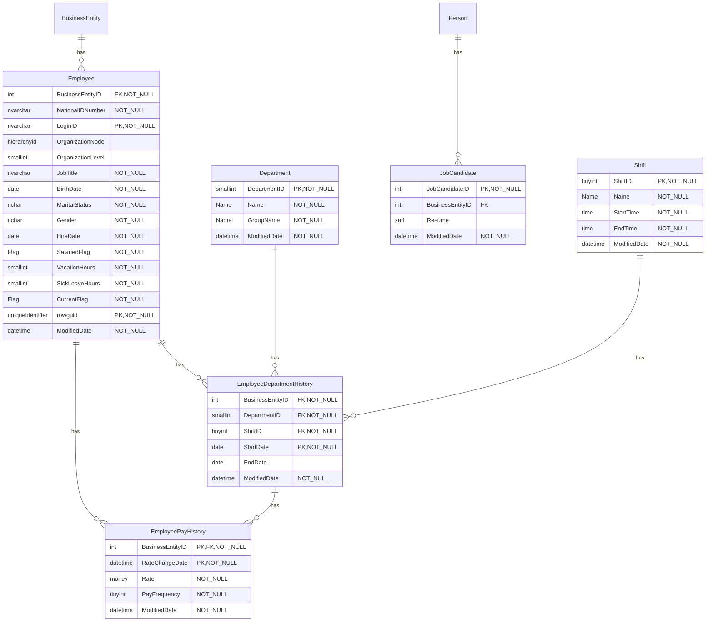
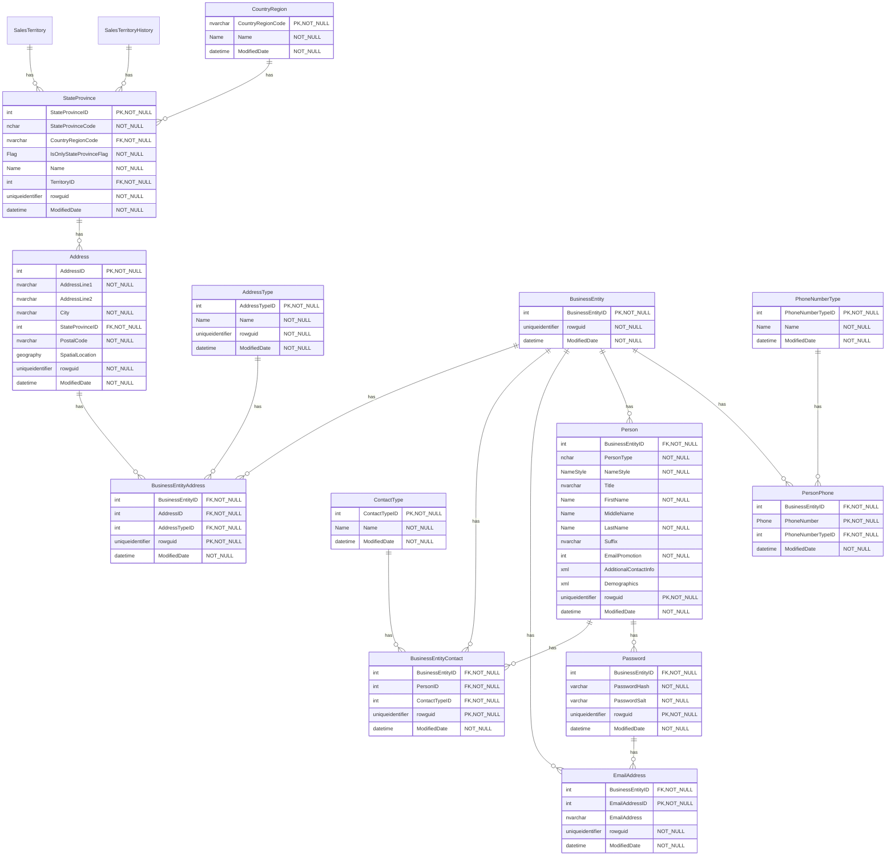
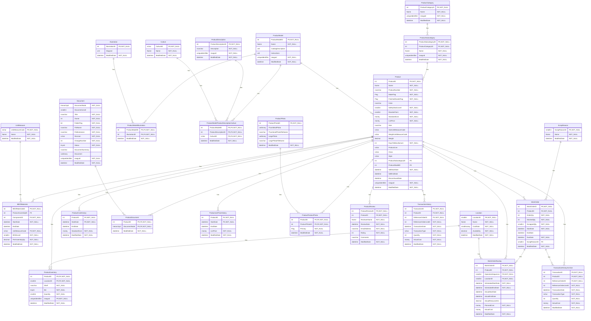
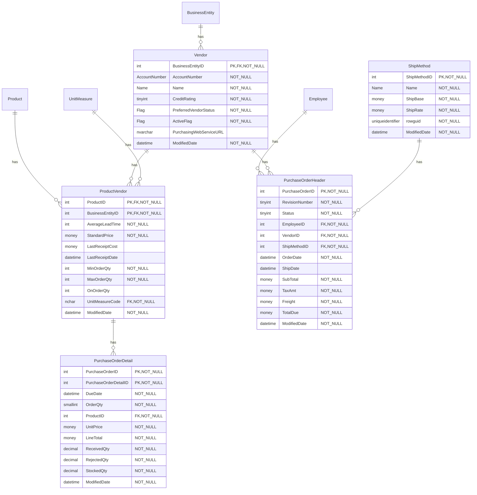
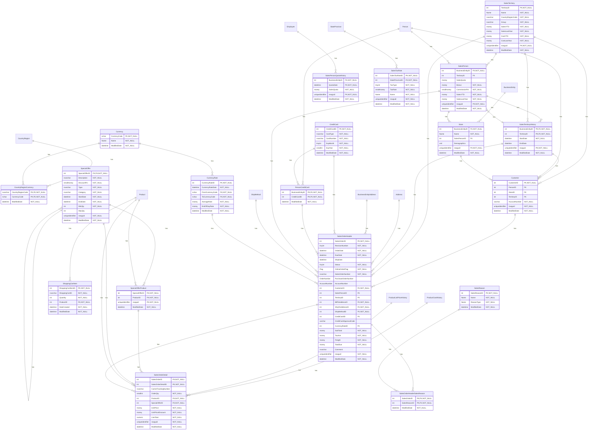

# Database Documentation: AW_Stripped

**Server**: sql-claude
**Generated**: 2026-03-22T13:08:36.917Z
**Total Iterations**: 2

## Analysis Summary

- **Status**: converged
- **Iterations**: 2
- **Tokens Used**: 951,512 (input: 778,180, output: 173,332)
- **Estimated Cost**: $0.00
- **AI Model**: gpt-5.4-mini-2026-03-17
- **AI Vendor**: openai
- **Temperature**: 0.1
- **Convergence**: Reached maximum iteration limit (2)

## Table of Contents

### [dbo](#schema-dbo) (3 tables)
- [AWBuildVersion](#awbuildversion)
- [DatabaseLog](#databaselog)
- [ErrorLog](#errorlog)

### [HumanResources](#schema-humanresources) (6 tables)
- [Department](#department)
- [Employee](#employee)
- [EmployeeDepartmentHistory](#employeedepartmenthistory)
- [EmployeePayHistory](#employeepayhistory)
- [JobCandidate](#jobcandidate)
- [Shift](#shift)

### [Person](#schema-person) (13 tables)
- [Address](#address)
- [AddressType](#addresstype)
- [BusinessEntity](#businessentity)
- [BusinessEntityAddress](#businessentityaddress)
- [BusinessEntityContact](#businessentitycontact)
- [ContactType](#contacttype)
- [CountryRegion](#countryregion)
- [EmailAddress](#emailaddress)
- [Password](#password)
- [Person](#person)
- [PersonPhone](#personphone)
- [PhoneNumberType](#phonenumbertype)
- [StateProvince](#stateprovince)

### [Production](#schema-production) (25 tables)
- [BillOfMaterials](#billofmaterials)
- [Culture](#culture)
- [Document](#document)
- [Illustration](#illustration)
- [Location](#location)
- [Product](#product)
- [ProductCategory](#productcategory)
- [ProductCostHistory](#productcosthistory)
- [ProductDescription](#productdescription)
- [ProductDocument](#productdocument)
- [ProductInventory](#productinventory)
- [ProductListPriceHistory](#productlistpricehistory)
- [ProductModel](#productmodel)
- [ProductModelIllustration](#productmodelillustration)
- [ProductModelProductDescriptionCulture](#productmodelproductdescriptionculture)
- [ProductPhoto](#productphoto)
- [ProductProductPhoto](#productproductphoto)
- [ProductReview](#productreview)
- [ProductSubcategory](#productsubcategory)
- [ScrapReason](#scrapreason)
- [TransactionHistory](#transactionhistory)
- [TransactionHistoryArchive](#transactionhistoryarchive)
- [UnitMeasure](#unitmeasure)
- [WorkOrder](#workorder)
- [WorkOrderRouting](#workorderrouting)

### [Purchasing](#schema-purchasing) (5 tables)
- [ProductVendor](#productvendor)
- [PurchaseOrderDetail](#purchaseorderdetail)
- [PurchaseOrderHeader](#purchaseorderheader)
- [ShipMethod](#shipmethod)
- [Vendor](#vendor)

### [Sales](#schema-sales) (19 tables)
- [CountryRegionCurrency](#countryregioncurrency)
- [CreditCard](#creditcard)
- [Currency](#currency)
- [CurrencyRate](#currencyrate)
- [Customer](#customer)
- [PersonCreditCard](#personcreditcard)
- [SalesOrderDetail](#salesorderdetail)
- [SalesOrderHeader](#salesorderheader)
- [SalesOrderHeaderSalesReason](#salesorderheadersalesreason)
- [SalesPerson](#salesperson)
- [SalesPersonQuotaHistory](#salespersonquotahistory)
- [SalesReason](#salesreason)
- [SalesTaxRate](#salestaxrate)
- [SalesTerritory](#salesterritory)
- [SalesTerritoryHistory](#salesterritoryhistory)
- [ShoppingCartItem](#shoppingcartitem)
- [SpecialOffer](#specialoffer)
- [SpecialOfferProduct](#specialofferproduct)
- [Store](#store)


## Schema: dbo

### Entity Relationship Diagram

```mermaid
erDiagram
    AWBuildVersion {
        tinyint SystemInformationID "PK,NOT_NULL"
        nvarchar Database Version "NOT_NULL"
        datetime VersionDate "NOT_NULL"
        datetime ModifiedDate "NOT_NULL"
    }
    DatabaseLog {
        int DatabaseLogID "PK,NOT_NULL"
        datetime PostTime "NOT_NULL"
        sysname DatabaseUser "NOT_NULL"
        sysname Event "NOT_NULL"
        sysname Schema
        sysname Object
        nvarchar TSQL "NOT_NULL"
        xml XmlEvent "NOT_NULL"
    }
    ErrorLog {
        int ErrorLogID "NOT_NULL"
        datetime ErrorTime "NOT_NULL"
        sysname UserName "NOT_NULL"
        int ErrorNumber "NOT_NULL"
        int ErrorSeverity
        int ErrorState
        nvarchar ErrorProcedure
        int ErrorLine
        nvarchar ErrorMessage "NOT_NULL"
    }

```

### Tables

#### AWBuildVersion

dbo.AWBuildVersion stores the installed AdventureWorks database build/version metadata, acting as a one-row system table that records which database release is loaded and when that version information was created or last modified.

**Row Count**: 1
**Dependency Level**: 0

**Confidence**: 99%

**Columns**:

| Column | Type | Description |
|--------|------|-------------|
| SystemInformationID | tinyint (PK, NOT NULL) | Unique identifier for the single system information record in dbo.AWBuildVersion; it exists to provide a stable primary key for the singleton row. |
| Database Version | nvarchar (NOT NULL) | The installed database build/version string for the AdventureWorks database. |
| VersionDate | datetime (NOT NULL) | The date and time associated with the recorded database version, likely when this build information was generated or released. |
| ModifiedDate | datetime (NOT NULL) | Timestamp indicating when the version record was last updated in the database. |

#### DatabaseLog

dbo.DatabaseLog stores an audit trail of database DDL and metadata changes captured as XML event records. It exists to record when schema objects such as tables, views, procedures, indexes, constraints, and extended properties were created or altered, along with the exact T-SQL used and contextual details about the event.

**Row Count**: 1596
**Dependency Level**: 0

**Confidence**: 99%

**Columns**:

| Column | Type | Description |
|--------|------|-------------|
| DatabaseLogID | int (PK, NOT NULL) | Primary identifier for each logged database event row. |
| PostTime | datetime (NOT NULL) | Timestamp when the database event was recorded or occurred. |
| DatabaseUser | sysname (NOT NULL) | Database principal under which the event was executed or logged. |
| Event | sysname (NOT NULL) | Type of database event that was captured, such as table creation, index creation, or extended property changes. |
| Schema | sysname | Schema containing the affected object. |
| Object | sysname | Name of the affected database object. |
| TSQL | nvarchar (NOT NULL) | Exact T-SQL statement associated with the logged event. |
| XmlEvent | xml (NOT NULL) | Structured XML representation of the event details. |

#### ErrorLog

dbo.ErrorLog stores application or database error events captured for troubleshooting and auditing. Each row records when an error occurred, which user encountered it, the error number and severity details, the procedure and line where it happened, and the full error message.

**Row Count**: 0
**Dependency Level**: 0

**Confidence**: 99%

**Columns**:

| Column | Type | Description |
|--------|------|-------------|
| ErrorLogID | int (NOT NULL) | Surrogate identifier for each logged error event, likely the primary key for uniquely identifying log entries. |
| ErrorTime | datetime (NOT NULL) | Date and time when the error was recorded. |
| UserName | sysname (NOT NULL) | Name of the user or login context associated with the error. |
| ErrorNumber | int (NOT NULL) | Numeric SQL Server error code or application error code. |
| ErrorSeverity | int | Severity level of the error. |
| ErrorState | int | State code associated with the error number. |
| ErrorProcedure | nvarchar | Stored procedure or routine where the error occurred. |
| ErrorLine | int | Line number within the procedure or batch where the error was raised. |
| ErrorMessage | nvarchar (NOT NULL) | Full descriptive text of the error. |

## Schema: HumanResources

### Entity Relationship Diagram



### Tables

#### Department

HumanResources.Department stores the master list of organizational departments used by the human resources and operations modules. It serves as a lookup/reference table for assigning employees to departments over time and for reporting departments by broader functional groupings. In addition to individual department names, it organizes departments into six higher-level business functions: Executive General and Administration, Research and Development, Sales and Marketing, Quality Assurance, Manufacturing, and Inventory Management.

**Row Count**: 16
**Dependency Level**: 0

**Confidence**: 99%

**Referenced By**:
- [HumanResources.EmployeeDepartmentHistory](#employeedepartmenthistory)

**Columns**:

| Column | Type | Description |
|--------|------|-------------|
| DepartmentID | smallint (PK, NOT NULL) | Unique identifier for each department record; serves as the stable key used by related tables to reference a department. |
| Name | Name (NOT NULL) | The department's human-readable name, such as Engineering, Sales, or Production. |
| GroupName | Name (NOT NULL) | A broader functional grouping for the department, used to categorize departments into business areas like Manufacturing or Sales and Marketing. |
| ModifiedDate | datetime (NOT NULL) | Timestamp indicating when the department record was last modified or seeded in the database. |

#### Employee

HumanResources.Employee stores the core employee master record for each person employed by the organization, combining identity, login, job, personal, and employment-status attributes. It represents employees as a specialization of the shared business entity model, and serves as the parent record for related employee history such as department/shift assignments, pay history, sales quota history, and purchasing-related activity. It exists to track who is employed, their role, hire details, leave balances, and their participation in organizational and operational processes.

**Row Count**: 290
**Dependency Level**: 0

**Confidence**: 99%

**Depends On**:
- [Person.BusinessEntity](#businessentity) (via BusinessEntityID)

**Referenced By**:
- [HumanResources.EmployeePayHistory](#employeepayhistory)
- [HumanResources.EmployeeDepartmentHistory](#employeedepartmenthistory)
- [Purchasing.PurchaseOrderHeader](#purchaseorderheader)
- [Sales.SalesPersonQuotaHistory](#salespersonquotahistory)

**Columns**:

| Column | Type | Description |
|--------|------|-------------|
| BusinessEntityID | int (FK, NOT NULL) | The employee's shared business entity identifier and the table's primary key; links each employee record to the base person/business entity record. |
| NationalIDNumber | nvarchar (NOT NULL) | Government-issued or internal national identification number used to uniquely identify the employee in HR records. |
| LoginID | nvarchar (PK, NOT NULL) | Windows/domain login used by the employee to authenticate to company systems. |
| OrganizationNode | hierarchyid | Hierarchy path node representing the employee's position in the organizational tree. |
| OrganizationLevel | smallint | Numeric depth of the employee within the organization hierarchy. |
| JobTitle | nvarchar (NOT NULL) | The employee's current job title or role. |
| BirthDate | date (NOT NULL) | The employee's date of birth. |
| MaritalStatus | nchar (NOT NULL) | Marital status code for the employee. |
| Gender | nchar (NOT NULL) | Gender code for the employee. |
| HireDate | date (NOT NULL) | The date the employee was hired. |
| SalariedFlag | Flag (NOT NULL) | Indicates whether the employee is salaried rather than hourly. |
| VacationHours | smallint (NOT NULL) | Current accrued vacation leave balance in hours. |
| SickLeaveHours | smallint (NOT NULL) | Current accrued sick leave balance in hours. |
| CurrentFlag | Flag (NOT NULL) | Indicates whether the employee record is currently active/current. |
| rowguid | uniqueidentifier (PK, NOT NULL) | System-generated unique row identifier used for replication and synchronization. |
| ModifiedDate | datetime (NOT NULL) | Timestamp of the last modification to the employee record. |

#### EmployeeDepartmentHistory

HumanResources.EmployeeDepartmentHistory stores the assignment history of employees to departments and shifts over time. It records when an employee started in a department/shift combination, whether that assignment has ended, and when the record was last modified. The table exists to track organizational placement history rather than just the current assignment.

**Row Count**: 296
**Dependency Level**: 0

**Confidence**: 99%

**Depends On**:
- [HumanResources.Employee](#employee) (via BusinessEntityID)
- [HumanResources.Department](#department) (via DepartmentID)
- [HumanResources.Shift](#shift) (via ShiftID)

**Referenced By**:
- [HumanResources.EmployeePayHistory](#employeepayhistory)

**Columns**:

| Column | Type | Description |
|--------|------|-------------|
| BusinessEntityID | int (FK, NOT NULL) | Identifies the employee whose department/shift assignment is being recorded. |
| DepartmentID | smallint (FK, NOT NULL) | Identifies the department the employee was assigned to during the recorded period. |
| ShiftID | tinyint (FK, NOT NULL) | Identifies the work shift associated with the employee's assignment. |
| StartDate | date (PK, NOT NULL) | The date the employee began the department/shift assignment. |
| EndDate | date | The date the employee's assignment ended, if it is no longer active. |
| ModifiedDate | datetime (NOT NULL) | Timestamp indicating when the history record was last updated. |

#### EmployeePayHistory

HumanResources.EmployeePayHistory stores the historical pay rate records for employees over time. It exists to track when an employee's compensation changed, what the new rate was, and how often that rate is paid, enabling payroll history and compensation auditing.

**Row Count**: 316
**Dependency Level**: 1

**Confidence**: 99%

**Depends On**:
- [HumanResources.Employee](#employee) (via BusinessEntityID)
- [HumanResources.EmployeeDepartmentHistory](#employeedepartmenthistory) (via BusinessEntityID)

**Columns**:

| Column | Type | Description |
|--------|------|-------------|
| BusinessEntityID | int (PK, FK, NOT NULL) | Identifies the employee whose pay history record this is. |
| RateChangeDate | datetime (PK, NOT NULL) | The date and time when this pay rate became effective. |
| Rate | money (NOT NULL) | The employee's pay rate at the time of the change. |
| PayFrequency | tinyint (NOT NULL) | Indicates how often the employee is paid. |
| ModifiedDate | datetime (NOT NULL) | Timestamp of the last modification to the row. |

#### JobCandidate

HumanResources.JobCandidate stores recruiting application records for people who have applied for jobs, including their resume content and the person record they are associated with. It exists to capture candidate-specific hiring data separate from the core person master record in Person.Person.

**Row Count**: 13
**Dependency Level**: 0

**Confidence**: 99%

**Depends On**:
- [Person.Person](#person) (via BusinessEntityID)

**Columns**:

| Column | Type | Description |
|--------|------|-------------|
| JobCandidateID | int (PK, NOT NULL) | Surrogate identifier for each job candidate record in HumanResources.JobCandidate. |
| BusinessEntityID | int (FK) | References the underlying person record for the candidate in Person.Person. |
| Resume | xml | XML-formatted resume document containing the candidate's name, skills, employment history, education, contact information, and related profile details. |
| ModifiedDate | datetime (NOT NULL) | Timestamp indicating when the job candidate record was last updated. |

#### Shift

HumanResources.Shift stores the standard work shift definitions used by the HR system, including shift name and its start/end times. It acts as a small lookup table that classifies employee department history records by shift schedule.

**Row Count**: 3
**Dependency Level**: 0

**Confidence**: 99%

**Referenced By**:
- [HumanResources.EmployeeDepartmentHistory](#employeedepartmenthistory)

**Columns**:

| Column | Type | Description |
|--------|------|-------------|
| ShiftID | tinyint (PK, NOT NULL) | Unique identifier for each shift definition. |
| Name | Name (NOT NULL) | Human-readable shift label such as Day, Evening, or Night. |
| StartTime | time (NOT NULL) | Clock time when the shift begins. |
| EndTime | time (NOT NULL) | Clock time when the shift ends. |
| ModifiedDate | datetime (NOT NULL) | Timestamp indicating when the shift record was last modified. |

## Schema: Person

### Entity Relationship Diagram



### Tables

#### Address

Person.Address stores postal and geographic address records used by people, businesses, and sales-related entities in the database. It acts as a shared address master so multiple records can reference the same standardized location information for shipping, billing, and contact purposes.

**Row Count**: 19614
**Dependency Level**: 0

**Confidence**: 99%

**Depends On**:
- [Person.StateProvince](#stateprovince) (via StateProvinceID)

**Referenced By**:
- [Sales.SalesOrderHeader](#salesorderheader)
- [Sales.SalesOrderHeader](#salesorderheader)
- [Person.BusinessEntityAddress](#businessentityaddress)

**Columns**:

| Column | Type | Description |
|--------|------|-------------|
| AddressID | int (PK, NOT NULL) | Surrogate identifier for each address record. |
| AddressLine1 | nvarchar (NOT NULL) | Primary street address line, such as house number, street name, or building address. |
| AddressLine2 | nvarchar | Optional secondary address information such as apartment, suite, department, or internal routing details. |
| City | nvarchar (NOT NULL) | City, town, or locality component of the address. |
| StateProvinceID | int (FK, NOT NULL) | Reference to the state, province, or similar administrative region for the address. |
| PostalCode | nvarchar (NOT NULL) | Postal or ZIP code associated with the address. |
| SpatialLocation | geography | Geographic point representation of the address, stored as a geography value for mapping and spatial queries. |
| rowguid | uniqueidentifier (NOT NULL) | Globally unique row identifier used for replication, synchronization, or system-level uniqueness. |
| ModifiedDate | datetime (NOT NULL) | Timestamp indicating when the address record was last updated. |

#### AddressType

Person.AddressType is a lookup table that defines the allowed categories for how an address is used in the system, such as Billing, Shipping, Home, Primary, Main Office, and Archive. It exists so related tables like Person.BusinessEntityAddress can classify each address with a standardized type instead of storing free-text labels. The live data currently in use appears to be a subset of the full lookup set, with only address type IDs 2, 3, and 5 actively referenced in related tables.

**Row Count**: 6
**Dependency Level**: 0

**Confidence**: 97%

**Referenced By**:
- [Person.BusinessEntityAddress](#businessentityaddress)

**Columns**:

| Column | Type | Description |
|--------|------|-------------|
| AddressTypeID | int (PK, NOT NULL) | Surrogate identifier for each address type record; serves as the primary key and is used by related tables to reference a specific address classification. |
| Name | Name (NOT NULL) | Human-readable label for the address type, such as Billing or Shipping. |
| rowguid | uniqueidentifier (NOT NULL) | Globally unique row identifier used for replication and system-level uniqueness tracking. |
| ModifiedDate | datetime (NOT NULL) | Timestamp indicating when the address type record was last updated. |

#### BusinessEntity

Person.BusinessEntity stores the shared supertype identity record for all business-related entities in the system, including people, employees, vendors, stores, and other addressable entities. It provides the common surrogate key and audit metadata that subtype tables such as Person.Person, HumanResources.Employee, Purchasing.Vendor, and Sales.Store extend with their own domain-specific attributes. It also serves as the parent identity anchor for contact-detail tables, allowing a single business entity to have multiple related email addresses and other contact records.

**Row Count**: 20777
**Dependency Level**: 0

**Confidence**: 99%

**Referenced By**:
- [Person.EmailAddress](#emailaddress)
- [HumanResources.Employee](#employee)
- [Person.BusinessEntityAddress](#businessentityaddress)
- [Person.BusinessEntityContact](#businessentitycontact)
- [Person.PersonPhone](#personphone)
- [Purchasing.Vendor](#vendor)
- [Sales.Store](#store)
- [Person.Person](#person)

**Columns**:

| Column | Type | Description |
|--------|------|-------------|
| BusinessEntityID | int (PK, NOT NULL) | Surrogate identifier for the business entity record; used as the shared key that child tables reference. |
| rowguid | uniqueidentifier (NOT NULL) | Globally unique row identifier used for replication or system-level uniqueness tracking. |
| ModifiedDate | datetime (NOT NULL) | Timestamp indicating when the business entity row was last updated. |

#### BusinessEntityAddress

Person.BusinessEntityAddress is a junction table that links business entities to postal addresses and classifies each link by address type (for example billing, shipping, or home). It exists to support multiple addresses per entity and multiple entities sharing the same address, while preserving the role of each address in the relationship.

**Row Count**: 19614
**Dependency Level**: 0

**Confidence**: 99%

**Depends On**:
- [Person.BusinessEntity](#businessentity) (via BusinessEntityID)
- [Person.Address](#address) (via AddressID)
- [Person.AddressType](#addresstype) (via AddressTypeID)

**Referenced By**:
- [Sales.SalesOrderHeader](#salesorderheader)
- [Sales.SalesOrderHeader](#salesorderheader)

**Columns**:

| Column | Type | Description |
|--------|------|-------------|
| BusinessEntityID | int (FK, NOT NULL) | Identifies the business entity associated with the address link. |
| AddressID | int (FK, NOT NULL) | Identifies the address being linked to the business entity. |
| AddressTypeID | int (FK, NOT NULL) | Indicates the role or usage type of the address for the entity, such as billing or shipping. |
| rowguid | uniqueidentifier (PK, NOT NULL) | Globally unique row identifier used for replication, synchronization, or stable row tracking. |
| ModifiedDate | datetime (NOT NULL) | Timestamp of the last update to the relationship record. |

#### BusinessEntityContact

Person.BusinessEntityContact stores the relationship between a business entity and a person, classified by contact role. It acts as a bridge table that records which person is associated with which business entity and what type of contact that person is for that entity (for example, sales, purchasing, or other business contact roles).

**Row Count**: 909
**Dependency Level**: 0

**Confidence**: 98%

**Depends On**:
- [Person.BusinessEntity](#businessentity) (via BusinessEntityID)
- [Person.Person](#person) (via PersonID)
- [Person.ContactType](#contacttype) (via ContactTypeID)

**Columns**:

| Column | Type | Description |
|--------|------|-------------|
| BusinessEntityID | int (FK, NOT NULL) | Identifies the business entity that the person is associated with in this contact relationship. |
| PersonID | int (FK, NOT NULL) | Identifies the person involved in the contact relationship; this is the row's primary identifier. |
| ContactTypeID | int (FK, NOT NULL) | Specifies the role or category of the contact relationship, such as the person's function for the business entity. |
| rowguid | uniqueidentifier (PK, NOT NULL) | A globally unique row identifier used for replication, synchronization, or stable row tracking. |
| ModifiedDate | datetime (NOT NULL) | The timestamp when the contact relationship row was last updated. |

#### ContactType

Person.ContactType is a lookup table that defines the standardized categories used to classify how a person or business entity is related to an organization, such as sales roles, purchasing roles, marketing roles, and accounting roles. It exists to provide consistent contact-role labels that can be assigned through Person.BusinessEntityContact.

**Row Count**: 20
**Dependency Level**: 0

**Confidence**: 99%

**Referenced By**:
- [Person.BusinessEntityContact](#businessentitycontact)

**Columns**:

| Column | Type | Description |
|--------|------|-------------|
| ContactTypeID | int (PK, NOT NULL) | Primary key identifier for each contact type category. |
| Name | Name (NOT NULL) | Human-readable label for the contact type, such as a job role or relationship category. |
| ModifiedDate | datetime (NOT NULL) | Timestamp indicating when the lookup row was last modified or seeded. |

#### CountryRegion

dbo.CountryRegion stores the master list of countries and regions used throughout the database as a foundational geographic lookup table. It provides standardized country/region codes and names so other tables can reference consistent location values for sales and address-related data.

**Row Count**: 238
**Dependency Level**: 0

**Confidence**: 99%

**Referenced By**:
- [Sales.CountryRegionCurrency](#countryregioncurrency)
- [Person.StateProvince](#stateprovince)

**Columns**:

| Column | Type | Description |
|--------|------|-------------|
| CountryRegionCode | nvarchar (PK, NOT NULL) | Two-character country or region code that uniquely identifies each geographic entry and serves as the table's primary key. |
| Name | Name (NOT NULL) | The full display name of the country or region. |
| ModifiedDate | datetime (NOT NULL) | The date the row was last modified or loaded into the database. |

#### EmailAddress

This table stores email address records for people in the system, linking each email address to a specific person/business entity. It exists to support one-to-many email contact information for individuals while keeping email data separate from the core person record.

**Row Count**: 19972
**Dependency Level**: 1

**Confidence**: 98%

**Depends On**:
- [Person.BusinessEntity](#businessentity) (via BusinessEntityID)
- [Person.Password](#password) (via BusinessEntityID)

**Columns**:

| Column | Type | Description |
|--------|------|-------------|
| BusinessEntityID | int (FK, NOT NULL) | Identifies the person/business entity that owns this email address record. |
| EmailAddressID | int (PK, NOT NULL) | Surrogate primary key for the email address record. |
| EmailAddress | nvarchar | The actual email address string associated with the person/business entity. |
| rowguid | uniqueidentifier (NOT NULL) | Globally unique row identifier used for replication or synchronization. |
| ModifiedDate | datetime (NOT NULL) | Timestamp indicating when the email address record was last updated. |

#### Password

This table stores authentication credentials for people in the system, linking each Person.Person record to a password hash and salt used for login verification. It exists to separate sensitive security data from the core person profile while supporting user authentication for individuals who have application accounts.

**Row Count**: 19972
**Dependency Level**: 0

**Confidence**: 99%

**Depends On**:
- [Person.Person](#person) (via BusinessEntityID)

**Referenced By**:
- [Person.EmailAddress](#emailaddress)

**Columns**:

| Column | Type | Description |
|--------|------|-------------|
| BusinessEntityID | int (FK, NOT NULL) | Identifier of the person whose authentication credentials are stored in this row; also serves as the table's primary key. |
| PasswordHash | varchar (NOT NULL) | Hashed password value used to verify a user's login credentials without storing the plaintext password. |
| PasswordSalt | varchar (NOT NULL) | Random salt used when hashing the password to protect against precomputed hash attacks and ensure hash uniqueness. |
| rowguid | uniqueidentifier (PK, NOT NULL) | Globally unique row identifier used for replication, synchronization, or system-level uniqueness tracking. |
| ModifiedDate | datetime (NOT NULL) | Timestamp indicating when the password record was last updated. |

#### Person

Person.Person stores master person records for the Adventure Works database, representing individuals such as customers, employees, sales contacts, job candidates, vendors, and other people associated with the business. It serves as the canonical person-level hub for human entities across the model, anchoring related contact, demographic, security, recruiting, sales, and customer data, including individual customer records, role-based contact assignments, login credentials, and stored payment instruments. It also functions as the shared identity foundation for related person/employee extensions such as Sales.SalesPerson.

**Row Count**: 19972
**Dependency Level**: 0

**Confidence**: 99%

**Depends On**:
- [Person.BusinessEntity](#businessentity) (via BusinessEntityID)

**Referenced By**:
- [HumanResources.JobCandidate](#jobcandidate)
- [Person.BusinessEntityContact](#businessentitycontact)
- [Person.Password](#password)
- [Sales.PersonCreditCard](#personcreditcard)
- [Sales.Customer](#customer)
- [Sales.SalesPerson](#salesperson)

**Columns**:

| Column | Type | Description |
|--------|------|-------------|
| BusinessEntityID | int (FK, NOT NULL) | Unique identifier for the person record; serves as the row's primary key and links this person to related business entity-based tables. |
| PersonType | nchar (NOT NULL) | Code indicating what kind of person this record represents, such as individual, employee, sales contact, vendor contact, or store contact. |
| NameStyle | NameStyle (NOT NULL) | Flag indicating whether the person's name should be displayed in a special style or format. |
| Title | nvarchar | Honorific or salutation such as Mr., Ms., Mrs., Sr., or Sra. |
| FirstName | Name (NOT NULL) | Person's given name. |
| MiddleName | Name | Person's middle name or middle initial, when available. |
| LastName | Name (NOT NULL) | Person's family name or surname. |
| Suffix | nvarchar | Name suffix such as Jr., Sr., II, III, IV, or PhD. |
| EmailPromotion | int (NOT NULL) | Preference or status code controlling email marketing promotion level for the person. |
| AdditionalContactInfo | xml | XML payload containing extra contact methods, notes, and contact history for the person. |
| Demographics | xml | XML payload containing survey and demographic attributes for the person, such as income, education, occupation, and household details. |
| rowguid | uniqueidentifier (PK, NOT NULL) | Globally unique row identifier used for replication or synchronization scenarios. |
| ModifiedDate | datetime (NOT NULL) | Timestamp of the last update to the person record. |

#### PersonPhone

Person.PersonPhone stores phone numbers associated with business entities that represent people, along with the type of each phone number. It exists to support a one-to-many style contact model where a person can have multiple phone numbers and each number is classified as home, work, cell, or another standardized type.

**Row Count**: 19972
**Dependency Level**: 0

**Confidence**: 99%

**Depends On**:
- [Person.BusinessEntity](#businessentity) (via BusinessEntityID)
- [Person.PhoneNumberType](#phonenumbertype) (via PhoneNumberTypeID)

**Columns**:

| Column | Type | Description |
|--------|------|-------------|
| BusinessEntityID | int (FK, NOT NULL) | Identifies the person/business entity that owns the phone number record. |
| PhoneNumber | Phone (PK, NOT NULL) | The actual phone number stored for the entity. |
| PhoneNumberTypeID | int (FK, NOT NULL) | Classifies the phone number by type, such as home, work, or cell. |
| ModifiedDate | datetime (NOT NULL) | Timestamp indicating when the phone record was last updated. |

#### PhoneNumberType

A lookup table that defines the allowed phone number types used by people in the system, such as Home, Cell, and Work. It exists to standardize phone type classification and support consistent references from person phone records.

**Row Count**: 3
**Dependency Level**: 0

**Confidence**: 99%

**Referenced By**:
- [Person.PersonPhone](#personphone)

**Columns**:

| Column | Type | Description |
|--------|------|-------------|
| PhoneNumberTypeID | int (PK, NOT NULL) | Surrogate identifier for each phone number type. It uniquely identifies the lookup value used by related phone records. |
| Name | Name (NOT NULL) | Human-readable label for the phone type, such as Home, Cell, or Work. |
| ModifiedDate | datetime (NOT NULL) | Timestamp indicating when the lookup row was last modified. |

#### StateProvince

Person.StateProvince stores the master list of states, provinces, and similar subnational regions used for addresses, tax rates, and sales territory mapping. It provides standardized geographic codes and names, links each region to a country/region, and assigns the region to a sales territory for reporting and operational classification.

**Row Count**: 181
**Dependency Level**: 1

**Confidence**: 98%

**Depends On**:
- [Sales.SalesTerritory](#salesterritory) (via TerritoryID)
- [Sales.SalesTerritoryHistory](#salesterritoryhistory) (via TerritoryID)
- [Person.CountryRegion](#countryregion) (via CountryRegionCode)

**Referenced By**:
- [Person.Address](#address)
- [Sales.SalesTaxRate](#salestaxrate)

**Columns**:

| Column | Type | Description |
|--------|------|-------------|
| StateProvinceID | int (PK, NOT NULL) | Surrogate primary key for each state/province record. |
| StateProvinceCode | nchar (NOT NULL) | Short standardized code for the state/province, such as a postal abbreviation or local administrative code. |
| CountryRegionCode | nvarchar (FK, NOT NULL) | Code of the country or region that contains this state/province. |
| IsOnlyStateProvinceFlag | Flag (NOT NULL) | Indicates whether this record represents the only state/province-level subdivision for its country/region. |
| Name | Name (NOT NULL) | Human-readable name of the state, province, department, or equivalent administrative region. |
| TerritoryID | int (FK, NOT NULL) | Sales territory assignment for this geographic region. |
| rowguid | uniqueidentifier (NOT NULL) | Globally unique row identifier used for replication and synchronization. |
| ModifiedDate | datetime (NOT NULL) | Timestamp indicating when the row was last modified. |

## Schema: Production

### Entity Relationship Diagram



### Tables

#### BillOfMaterials

Production.BillOfMaterials stores the bill of materials for manufactured products, defining which component products are required to assemble a parent product, in what quantity, and during what effective date range. It supports product structure, versioning, and manufacturing planning in the Adventure Works production process.

**Row Count**: 2679
**Dependency Level**: 0

**Confidence**: 99%

**Depends On**:
- [Production.Product](#product) (via ProductAssemblyID)
- [Production.Product](#product) (via ComponentID)
- [Production.UnitMeasure](#unitmeasure) (via UnitMeasureCode)

**Columns**:

| Column | Type | Description |
|--------|------|-------------|
| BillOfMaterialsID | int (PK, NOT NULL) | Surrogate primary key for each bill of materials record. |
| ProductAssemblyID | int (FK) | The parent product being assembled. |
| ComponentID | int (FK, NOT NULL) | The component product required in the assembly. |
| StartDate | datetime (NOT NULL) | The date this bill of materials relationship becomes effective. |
| EndDate | datetime | The date this bill of materials relationship stops being effective, if applicable. |
| UnitMeasureCode | nchar (FK, NOT NULL) | The unit of measure used for the component quantity. |
| BOMLevel | smallint (NOT NULL) | The level of the component within the assembly hierarchy. |
| PerAssemblyQty | decimal (NOT NULL) | The quantity of the component required per one assembly unit. |
| ModifiedDate | datetime (NOT NULL) | The last date the BOM record was updated. |

#### Culture

Production.Culture is a small lookup table that stores the set of supported language/culture codes and their human-readable names. It exists to standardize localization values used elsewhere in the database, especially for linking product descriptions to a specific language/culture in Production.ProductModelProductDescriptionCulture.

**Row Count**: 8
**Dependency Level**: 0

**Confidence**: 99%

**Referenced By**:
- [Production.ProductModelProductDescriptionCulture](#productmodelproductdescriptionculture)

**Columns**:

| Column | Type | Description |
|--------|------|-------------|
| CultureID | nchar (PK, NOT NULL) | The culture/language code used as the unique identifier for each supported culture entry. |
| Name | Name (NOT NULL) | The human-readable name of the culture or language. |
| ModifiedDate | datetime (NOT NULL) | The date the culture record was last modified or seeded into the database. |

#### Document

**Row Count**: 13
**Dependency Level**: 0

**Referenced By**:
- [Production.ProductDocument](#productdocument)

**Columns**:

| Column | Type | Description |
|--------|------|-------------|
| DocumentNode | hierarchyid (NOT NULL) |  |
| DocumentLevel | smallint |  |
| Title | nvarchar (NOT NULL) |  |
| Owner | int (NOT NULL) |  |
| FolderFlag | bit (NOT NULL) |  |
| FileName | nvarchar (NOT NULL) |  |
| FileExtension | nvarchar (NOT NULL) |  |
| Revision | nchar (NOT NULL) |  |
| ChangeNumber | int (NOT NULL) |  |
| Status | tinyint (NOT NULL) |  |
| DocumentSummary | nvarchar |  |
| Document | varbinary |  |
| rowguid | uniqueidentifier (NOT NULL) |  |
| ModifiedDate | datetime (NOT NULL) |  |

#### Illustration

Production.Illustration stores reusable illustration assets used to visually document products, likely as vector artwork or diagrams. It exists so product models can be linked to one or more technical drawings/images without duplicating the artwork across products.

**Row Count**: 5
**Dependency Level**: 0

**Confidence**: 98%

**Referenced By**:
- [Production.ProductModelIllustration](#productmodelillustration)

**Columns**:

| Column | Type | Description |
|--------|------|-------------|
| IllustrationID | int (PK, NOT NULL) | Unique identifier for each illustration asset in Production.Illustration. |
| Diagram | xml | XML/XAML representation of the illustration artwork itself, storing the vector drawing or diagram content. |
| ModifiedDate | datetime (NOT NULL) | Timestamp indicating when the illustration record was last updated. |

#### Location

Production.Location stores the manufacturing locations or work centers used in the production process, along with their standard cost rate and available capacity. It acts as a lookup/reference table for where inventory is stored or where work is performed, and is used by production and inventory routing tables to track operations and stock by location.

**Row Count**: 14
**Dependency Level**: 0

**Confidence**: 99%

**Referenced By**:
- [Production.ProductInventory](#productinventory)
- [Production.WorkOrderRouting](#workorderrouting)

**Columns**:

| Column | Type | Description |
|--------|------|-------------|
| LocationID | smallint (PK, NOT NULL) | Primary identifier for each production location or work center. |
| Name | Name (NOT NULL) | Human-readable name of the location, such as a shop area, storage area, or production station. |
| CostRate | smallmoney (NOT NULL) | Standard cost associated with using the location, likely a per-hour or per-unit operating cost. |
| Availability | decimal (NOT NULL) | Available capacity for the location, likely measured in hours, units, or another production-capacity metric. |
| ModifiedDate | datetime (NOT NULL) | Timestamp indicating when the location record was last updated. |

#### Product

Production.Product stores the master catalog of sellable and manufacturable products in the Adventure Works database, including bikes, components, clothing, and accessories. It acts as the central product entity that other production, purchasing, and sales tables reference for inventory, pricing, bills of materials, work orders, reviews, and order lines.

**Row Count**: 504
**Dependency Level**: 2

**Confidence**: 99%

**Depends On**:
- [Production.ProductSubcategory](#productsubcategory) (via ProductSubcategoryID)
- [Production.ProductModel](#productmodel) (via ProductModelID)

**Referenced By**:
- [Production.BillOfMaterials](#billofmaterials)
- [Production.BillOfMaterials](#billofmaterials)
- [Production.ProductCostHistory](#productcosthistory)
- [Production.ProductDocument](#productdocument)
- [Production.ProductInventory](#productinventory)
- [Production.ProductListPriceHistory](#productlistpricehistory)
- [Production.ProductProductPhoto](#productproductphoto)
- [Production.ProductReview](#productreview)
- [Production.TransactionHistory](#transactionhistory)
- [Production.TransactionHistoryArchive](#transactionhistoryarchive)
- [Production.WorkOrderRouting](#workorderrouting)
- [Purchasing.ProductVendor](#productvendor)
- [Sales.ShoppingCartItem](#shoppingcartitem)
- [Sales.SpecialOfferProduct](#specialofferproduct)
- [Production.WorkOrder](#workorder)
- [Sales.SalesOrderDetail](#salesorderdetail)

**Columns**:

| Column | Type | Description |
|--------|------|-------------|
| ProductID | int (PK, NOT NULL) | Surrogate primary key for each product record. |
| Name | Name (NOT NULL) | Human-readable product name used in catalog, reporting, and user interfaces. |
| ProductNumber | nvarchar (NOT NULL) | Business-facing product code or SKU-like identifier. |
| MakeFlag | Flag (NOT NULL) | Indicates whether the product is manufactured in-house. |
| FinishedGoodsFlag | Flag (NOT NULL) | Indicates whether the item is a sellable finished good. |
| Color | nvarchar | Optional product color attribute. |
| SafetyStockLevel | smallint (NOT NULL) | Minimum inventory threshold used to avoid stockouts. |
| ReorderPoint | smallint (NOT NULL) | Inventory level at which replenishment should be triggered. |
| StandardCost | money (NOT NULL) | Standard manufacturing or acquisition cost of the product. |
| ListPrice | money (NOT NULL) | Catalog selling price for the product. |
| Size | nvarchar | Optional size or dimension value for the product. |
| SizeUnitMeasureCode | nchar | Unit of measure for the Size value. |
| WeightUnitMeasureCode | nchar | Unit of measure for the Weight value. |
| Weight | decimal | Optional product weight used for shipping, manufacturing, or material planning. |
| DaysToManufacture | int (NOT NULL) | Estimated number of days required to manufacture the product. |
| ProductLine | nchar | High-level product line classification. |
| Class | nchar | Product class or quality tier. |
| Style | nchar | Product style or gender/style classification. |
| ProductSubcategoryID | int (FK) | Foreign key to the product subcategory classification. |
| ProductModelID | int (FK) | Foreign key to the product model definition. |
| SellStartDate | datetime (NOT NULL) | Date the product became available for sale. |
| SellEndDate | datetime | Date the product stopped being sold, if discontinued. |
| DiscontinuedDate | datetime | Date the product was discontinued. |
| rowguid | uniqueidentifier (NOT NULL) | Globally unique row identifier used for replication and synchronization. |
| ModifiedDate | datetime (NOT NULL) | Timestamp of the last update to the product record. |

#### ProductCategory

Production.ProductCategory stores the top-level product categories used to classify products in the manufacturing/catalog hierarchy. It exists as a lookup table so subcategories and products can be organized under broad groups such as Bikes, Components, Clothing, and Accessories.

**Row Count**: 4
**Dependency Level**: 0

**Confidence**: 99%

**Referenced By**:
- [Production.ProductSubcategory](#productsubcategory)

**Columns**:

| Column | Type | Description |
|--------|------|-------------|
| ProductCategoryID | int (PK, NOT NULL) | Surrogate identifier for each product category; uniquely identifies the category record and is used by child tables such as Production.ProductSubcategory. |
| Name | Name (NOT NULL) | Human-readable category name used to label the top-level product grouping, such as Bikes or Accessories. |
| rowguid | uniqueidentifier (NOT NULL) | Globally unique row identifier used for replication/integration and to uniquely track the row across systems. |
| ModifiedDate | datetime (NOT NULL) | Timestamp indicating when the category row was last updated. |

#### ProductCostHistory

This table stores product standard cost history by effective date, linking each product in Production.Product to the standard cost that applies during a specific time period. It exists to preserve historical cost changes for manufacturing and reporting, and to support downstream sales and order-detail calculations that need the correct cost at a given date.

**Row Count**: 395
**Dependency Level**: 0

**Confidence**: 98%

**Depends On**:
- [Production.Product](#product) (via ProductID)

**Referenced By**:
- [Sales.SalesOrderDetail](#salesorderdetail)

**Columns**:

| Column | Type | Description |
|--------|------|-------------|
| ProductID | int (FK, NOT NULL) | Identifies the product whose standard cost is being tracked. It links each history row to a specific item in Production.Product. |
| StartDate | datetime (PK, NOT NULL) | The date on which this standard cost version becomes effective. |
| EndDate | datetime | The date on which this standard cost version stops being effective. Null likely indicates the current or open-ended record. |
| StandardCost | money (NOT NULL) | The standard manufacturing cost for the product during the effective period defined by StartDate and EndDate. |
| ModifiedDate | datetime (NOT NULL) | The date the row was last updated in the database. |

#### ProductDescription

Production.ProductDescription stores multilingual marketing and technical descriptions for products. It exists to hold reusable description text that can be linked to product models through the bridge table Production.ProductModelProductDescriptionCulture, allowing the same product model to have descriptions in different cultures/languages.

**Row Count**: 762
**Dependency Level**: 0

**Confidence**: 99%

**Referenced By**:
- [Production.ProductModelProductDescriptionCulture](#productmodelproductdescriptionculture)

**Columns**:

| Column | Type | Description |
|--------|------|-------------|
| ProductDescriptionID | int (PK, NOT NULL) | Surrogate identifier for each product description record. |
| Description | nvarchar (NOT NULL) | The actual descriptive text for a product, used for marketing or catalog presentation in one or more languages. |
| rowguid | uniqueidentifier (NOT NULL) | Globally unique row identifier used for replication or synchronization purposes. |
| ModifiedDate | datetime (NOT NULL) | Timestamp indicating when the description record was last changed. |

#### ProductDocument

A junction table that links products to the technical documents that describe or support them. It exists to record which Production.Product items are associated with which Production.Document records, likely for product specifications, drawings, manuals, or other supporting documentation.

**Row Count**: 32
**Dependency Level**: 0

**Confidence**: 99%

**Depends On**:
- [Production.Product](#product) (via ProductID)
- [Production.Document](#document) (via DocumentNode)

**Columns**:

| Column | Type | Description |
|--------|------|-------------|
| ProductID | int (PK, FK, NOT NULL) | Identifies the product associated with a document. This is the product side of the product-document relationship and links each row to a specific Production.Product record. |
| DocumentNode | hierarchyid (PK, FK, NOT NULL) | Identifies the document associated with a product, using the hierarchical key from Production.Document. This links the row to a specific document record in the document tree. |
| ModifiedDate | datetime (NOT NULL) | The date and time when the product-document association was last modified. |

#### ProductInventory

This table stores current inventory quantities for specific products at specific production locations, including the shelf and bin where each product is stored. It exists to support warehouse and manufacturing inventory tracking by showing how much of each product is on hand at each location.

**Row Count**: 1069
**Dependency Level**: 0

**Confidence**: 99%

**Depends On**:
- [Production.Product](#product) (via ProductID)
- [Production.Location](#location) (via LocationID)

**Columns**:

| Column | Type | Description |
|--------|------|-------------|
| ProductID | int (PK, FK, NOT NULL) | Identifies the product whose inventory is being tracked at a location. |
| LocationID | smallint (PK, FK, NOT NULL) | Identifies the production or warehouse location where the product is stored. |
| Shelf | nvarchar (NOT NULL) | Shelf or aisle code indicating the storage shelf position within the location. |
| Bin | tinyint (NOT NULL) | Numeric bin or compartment identifier within the shelf/location. |
| Quantity | smallint (NOT NULL) | The number of units of the product currently on hand at the specified location. |
| rowguid | uniqueidentifier (PK, NOT NULL) | Globally unique row identifier used for replication or synchronization. |
| ModifiedDate | datetime (NOT NULL) | Timestamp indicating when the inventory record was last updated. |

#### ProductListPriceHistory

This table stores historical product list price records for products in Production.Product, capturing when a given list price became effective and when it ended. It exists to preserve price history over time so sales, reporting, and auditing processes can determine the correct list price for a product at a specific date.

**Row Count**: 395
**Dependency Level**: 0

**Confidence**: 98%

**Depends On**:
- [Production.Product](#product) (via ProductID)

**Referenced By**:
- [Sales.SalesOrderDetail](#salesorderdetail)

**Columns**:

| Column | Type | Description |
|--------|------|-------------|
| ProductID | int (FK, NOT NULL) | Identifies the product whose list price history is being recorded. |
| StartDate | datetime (PK, NOT NULL) | The date on which this list price became effective. |
| EndDate | datetime | The date on which this list price stopped being effective, if the price was superseded. |
| ListPrice | money (NOT NULL) | The product's list price during the effective period defined by StartDate and EndDate. |
| ModifiedDate | datetime (NOT NULL) | The timestamp when the history row was last updated. |

#### ProductModel

Production.ProductModel stores the master definitions for product models in the Adventure Works catalog, including the model name, rich XML catalog description, manufacturing instructions, and metadata used to relate each model to products, illustrations, and localized descriptions. It serves as the parent template for product variants, where multiple Product rows can share the same ProductModelID while differing by attributes such as size or color. It also supports a many-to-many relationship with illustrations and can be associated with multiple localized product descriptions for multilingual catalog content.

**Row Count**: 128
**Dependency Level**: 0

**Confidence**: 99%

**Referenced By**:
- [Production.Product](#product)
- [Production.ProductModelIllustration](#productmodelillustration)
- [Production.ProductModelProductDescriptionCulture](#productmodelproductdescriptionculture)

**Columns**:

| Column | Type | Description |
|--------|------|-------------|
| ProductModelID | int (PK, NOT NULL) | Unique identifier for each product model. |
| Name | Name (NOT NULL) | Human-readable product model name used in the catalog and related descriptions. |
| CatalogDescription | xml | XML catalog content describing the product model's marketing summary, manufacturer info, features, and specifications. |
| Instructions | xml | XML manufacturing and assembly instructions for the product model. |
| rowguid | uniqueidentifier (NOT NULL) | Globally unique row identifier used for replication or synchronization purposes. |
| ModifiedDate | datetime (NOT NULL) | Timestamp indicating when the product model record was last updated. |

#### ProductModelIllustration

A junction table that links Production.ProductModel records to Production.Illustration records, indicating which technical illustrations are associated with each product model. It exists to support a many-to-many relationship between product models and reusable illustration assets.

**Row Count**: 7
**Dependency Level**: 0

**Confidence**: 99%

**Depends On**:
- [Production.ProductModel](#productmodel) (via ProductModelID)
- [Production.Illustration](#illustration) (via IllustrationID)

**Columns**:

| Column | Type | Description |
|--------|------|-------------|
| ProductModelID | int (PK, FK, NOT NULL) | Identifies the product model being linked to an illustration. |
| IllustrationID | int (PK, FK, NOT NULL) | Identifies the illustration associated with the product model. |
| ModifiedDate | datetime (NOT NULL) | Timestamp indicating when the association row was last modified. |

#### ProductModelProductDescriptionCulture

A bridge table that links product models to localized product descriptions by culture. It exists to assign the correct marketing/technical description text to each product model in each supported language.

**Row Count**: 762
**Dependency Level**: 0

**Confidence**: 99%

**Depends On**:
- [Production.ProductModel](#productmodel) (via ProductModelID)
- [Production.ProductDescription](#productdescription) (via ProductDescriptionID)
- [Production.Culture](#culture) (via CultureID)

**Columns**:

| Column | Type | Description |
|--------|------|-------------|
| ProductModelID | int (PK, FK, NOT NULL) | Identifies the product model that this localized description applies to. |
| ProductDescriptionID | int (PK, FK, NOT NULL) | Identifies the reusable description text linked to the product model. |
| CultureID | nchar (PK, FK, NOT NULL) | Specifies the language/culture for the description text. |
| ModifiedDate | datetime (NOT NULL) | Audit timestamp indicating when the row was last modified. |

#### ProductPhoto

**Row Count**: 101
**Dependency Level**: 0

**Referenced By**:
- [Production.ProductProductPhoto](#productproductphoto)

**Columns**:

| Column | Type | Description |
|--------|------|-------------|
| ProductPhotoID | int (PK, NOT NULL) |  |
| ThumbNailPhoto | varbinary |  |
| ThumbnailPhotoFileName | nvarchar |  |
| LargePhoto | varbinary |  |
| LargePhotoFileName | nvarchar |  |
| ModifiedDate | datetime (NOT NULL) |  |

#### ProductProductPhoto

Production.ProductProductPhoto is a junction table that links products to product photos and marks which photo is the primary image for a given product. It exists to support a many-to-many relationship between Production.Product and Production.ProductPhoto, while also storing the primary-photo flag used for catalog display or merchandising.

**Row Count**: 504
**Dependency Level**: 0

**Confidence**: 99%

**Depends On**:
- [Production.Product](#product) (via ProductID)
- [Production.ProductPhoto](#productphoto) (via ProductPhotoID)

**Columns**:

| Column | Type | Description |
|--------|------|-------------|
| ProductID | int (PK, FK, NOT NULL) | Identifies the product being associated with a photo. |
| ProductPhotoID | int (PK, FK, NOT NULL) | Identifies the photo linked to the product. |
| Primary | Flag (NOT NULL) | Indicates whether this photo is the primary image for the product. |
| ModifiedDate | datetime (NOT NULL) | Records when the product-photo association was last modified. |

#### ProductReview

Production.ProductReview stores customer-written reviews for products in the Adventure Works catalog, including who wrote the review, when it was written, the rating given, contact email, and the review text. It exists to capture post-purchase product feedback and support product quality analysis and merchandising decisions.

**Row Count**: 4
**Dependency Level**: 0

**Confidence**: 99%

**Depends On**:
- [Production.Product](#product) (via ProductID)

**Columns**:

| Column | Type | Description |
|--------|------|-------------|
| ProductReviewID | int (PK, NOT NULL) | Unique identifier for each product review record. |
| ProductID | int (FK, NOT NULL) | Identifies the product being reviewed. |
| ReviewerName | Name (NOT NULL) | Name of the person who wrote the review. |
| ReviewDate | datetime (NOT NULL) | Date and time the review was submitted. |
| EmailAddress | nvarchar (NOT NULL) | Email contact for the reviewer. |
| Rating | int (NOT NULL) | Numeric score assigned by the reviewer, likely on a star scale. |
| Comments | nvarchar | Free-text review content describing the reviewer's opinion and experience with the product. |
| ModifiedDate | datetime (NOT NULL) | Timestamp indicating when the review row was last updated. |

#### ProductSubcategory

Production.ProductSubcategory stores the lookup values for product subcategories within the product catalog hierarchy. It exists to classify individual products under broader product categories such as Bikes, Components, Clothing, and Accessories, enabling consistent product organization, filtering, and reporting.

**Row Count**: 37
**Dependency Level**: 1

**Confidence**: 99%

**Depends On**:
- [Production.ProductCategory](#productcategory) (via ProductCategoryID)

**Referenced By**:
- [Production.Product](#product)

**Columns**:

| Column | Type | Description |
|--------|------|-------------|
| ProductSubcategoryID | int (PK, NOT NULL) | Primary identifier for each product subcategory. |
| ProductCategoryID | int (FK, NOT NULL) | Identifies the parent product category that this subcategory belongs to. |
| Name | Name (NOT NULL) | Human-readable name of the product subcategory. |
| rowguid | uniqueidentifier (NOT NULL) | Globally unique row identifier used for replication or system-level identity tracking. |
| ModifiedDate | datetime (NOT NULL) | Timestamp indicating when the subcategory record was last modified. |

#### ScrapReason

Production.ScrapReason stores the standardized list of reasons why manufactured items are scrapped during production. It serves as a lookup table for classifying scrap events consistently on work orders, supporting reporting, quality analysis, and manufacturing process improvement. Scrap reasons are used selectively and are optional on work orders, indicating that scrap is an exception condition rather than a required outcome for every production run.

**Row Count**: 16
**Dependency Level**: 0

**Confidence**: 99%

**Referenced By**:
- [Production.WorkOrder](#workorder)

**Columns**:

| Column | Type | Description |
|--------|------|-------------|
| ScrapReasonID | smallint (PK, NOT NULL) | Primary identifier for each scrap reason code. |
| Name | Name (NOT NULL) | Human-readable description of the scrap reason. |
| ModifiedDate | datetime (NOT NULL) | Date the scrap reason record was last modified or seeded into the database. |

#### TransactionHistory

This table stores product transaction history records for inventory movements and cost tracking in the Adventure Works manufacturing/sales system. Each row represents a dated transaction for a specific product, capturing the transaction type, quantity moved, the related source order or work order reference, and the actual cost associated with that movement.

**Row Count**: 113443
**Dependency Level**: 0

**Confidence**: 98%

**Depends On**:
- [Production.Product](#product) (via ProductID)

**Columns**:

| Column | Type | Description |
|--------|------|-------------|
| TransactionID | int (PK, NOT NULL) | Unique identifier for each transaction record in the ledger. |
| ProductID | int (FK, NOT NULL) | Identifies the product affected by the transaction. |
| ReferenceOrderID | int (PK, NOT NULL) | Identifier of the source document or order that generated the transaction. |
| ReferenceOrderLineID | int (NOT NULL) | Line number or line identifier within the referenced source order. |
| TransactionDate | datetime (NOT NULL) | Date the product transaction occurred. |
| TransactionType | nchar (NOT NULL) | Code indicating the business process that created the transaction, such as sales, work order, or purchase. |
| Quantity | int (NOT NULL) | Number of units affected by the transaction. |
| ActualCost | money (NOT NULL) | Actual cost recorded for the transaction. |
| ModifiedDate | datetime (NOT NULL) | Timestamp when the transaction row was last updated. |

#### TransactionHistoryArchive

Production.TransactionHistory stores the inventory transaction ledger for products, capturing each stock movement or cost-affecting event tied to a product and, when applicable, the originating work order. It exists to support manufacturing and inventory costing by recording quantities, transaction types, dates, and actual costs for product-related transactions.

**Row Count**: 89253
**Dependency Level**: 0

**Confidence**: 98%

**Depends On**:
- [Production.Product](#product) (via ProductID)
- [Production.WorkOrder](#workorder) (via ReferenceOrderID)

**Columns**:

| Column | Type | Description |
|--------|------|-------------|
| TransactionID | int (PK, NOT NULL) | Unique identifier for each transaction history record. |
| ProductID | int (FK, NOT NULL) | Identifies the product affected by the transaction. |
| ReferenceOrderID | int (FK, NOT NULL) | Identifier of the originating order or work order associated with the transaction. |
| ReferenceOrderLineID | int (NOT NULL) | Line-level reference within the originating order or work order. |
| TransactionDate | datetime (NOT NULL) | Date and time when the transaction occurred. |
| TransactionType | nchar (NOT NULL) | Code indicating the type of inventory transaction. |
| Quantity | int (NOT NULL) | Number of units affected by the transaction. |
| ActualCost | money (NOT NULL) | Actual cost associated with the transaction. |
| ModifiedDate | datetime (NOT NULL) | Date and time the transaction record was last updated. |

#### UnitMeasure

Production.UnitMeasure stores the standardized unit-of-measure codes used across manufacturing, inventory, and purchasing to describe quantities, component usage, and vendor packaging. It functions as a shared lookup table for measurement and packaging units such as EA, OZ, IN, CTN, and PAK, allowing other tables to consistently reference how items are measured or supplied.

**Row Count**: 38
**Dependency Level**: 0

**Confidence**: 99%

**Referenced By**:
- [Production.BillOfMaterials](#billofmaterials)
- [Purchasing.ProductVendor](#productvendor)

**Columns**:

| Column | Type | Description |
|--------|------|-------------|
| UnitMeasureCode | nchar (PK, NOT NULL) | Short code that uniquely identifies a unit of measure, such as KG, OZ, EA, or L. It serves as the primary key and compact reference value used by related tables. |
| Name | Name (NOT NULL) | The descriptive name of the unit of measure, such as Kilogram, Ounces, Each, or Gallon. This provides a readable label for the code. |
| ModifiedDate | datetime (NOT NULL) | Timestamp indicating when the unit measure record was last updated. |

#### WorkOrder

Production.WorkOrder stores manufacturing work orders for products, including the planned quantity, actual stocked quantity, scrap quantity, schedule dates, and optional scrap reason. It exists to track the lifecycle and outcome of production jobs for individual products in the manufacturing process.

**Row Count**: 72591
**Dependency Level**: 1

**Confidence**: 99%

**Depends On**:
- [Production.ScrapReason](#scrapreason) (via ScrapReasonID)
- [Production.Product](#product) (via ProductID)

**Referenced By**:
- [Production.TransactionHistoryArchive](#transactionhistoryarchive)
- [Production.WorkOrderRouting](#workorderrouting)

**Columns**:

| Column | Type | Description |
|--------|------|-------------|
| WorkOrderID | int (PK, NOT NULL) | Unique identifier for each work order record. |
| ProductID | int (FK, NOT NULL) | Identifier of the product being manufactured on this work order. |
| OrderQty | int (NOT NULL) | Planned quantity to produce for the work order. |
| StockedQty | int (NOT NULL) | Quantity successfully completed and moved into stock. |
| ScrappedQty | smallint (NOT NULL) | Quantity lost to scrap during the work order. |
| StartDate | datetime (NOT NULL) | Date the work order began. |
| EndDate | datetime | Date the work order finished or was closed. |
| DueDate | datetime (NOT NULL) | Target completion date for the work order. |
| ScrapReasonID | smallint (FK) | Optional reason code explaining why units were scrapped. |
| ModifiedDate | datetime (NOT NULL) | Timestamp of the last update to the work order record. |

#### WorkOrderRouting

Production.WorkOrderRouting stores the routing steps for each manufacturing work order, tracking which product operation is performed at which production location, when it is scheduled and actually executed, and the planned versus actual labor/cost outcomes for that routing step.

**Row Count**: 67131
**Dependency Level**: 0

**Confidence**: 99%

**Depends On**:
- [Production.WorkOrder](#workorder) (via WorkOrderID)
- [Production.Product](#product) (via ProductID)
- [Production.Location](#location) (via LocationID)

**Columns**:

| Column | Type | Description |
|--------|------|-------------|
| WorkOrderID | int (FK, NOT NULL) | Identifies the manufacturing work order this routing step belongs to. |
| ProductID | int (FK, NOT NULL) | Identifies the product being manufactured for this routing step. |
| OperationSequence | smallint (PK, NOT NULL) | The sequence number of the operation within the work order routing. |
| LocationID | smallint (FK, NOT NULL) | The production location or work center where the operation is performed. |
| ScheduledStartDate | datetime (NOT NULL) | The planned date when the routing operation is scheduled to begin. |
| ScheduledEndDate | datetime (NOT NULL) | The planned date when the routing operation is scheduled to finish. |
| ActualStartDate | datetime | The actual date when work on the routing operation began. |
| ActualEndDate | datetime | The actual date when work on the routing operation finished. |
| ActualResourceHrs | decimal | The actual labor or machine hours consumed by the routing operation. |
| PlannedCost | money (NOT NULL) | The expected cost for performing the routing operation. |
| ActualCost | money | The realized cost incurred for performing the routing operation. |
| ModifiedDate | datetime (NOT NULL) | The last date and time this routing record was updated. |

## Schema: Purchasing

### Entity Relationship Diagram



### Tables

#### ProductVendor

This table stores vendor-specific purchasing terms for individual products, linking each product to a supplier with negotiated lead times, pricing, order quantity limits, and unit-of-measure information. It exists to support procurement planning and purchase order generation by defining how a given vendor supplies a given product.

**Row Count**: 460
**Dependency Level**: 0

**Confidence**: 99%

**Depends On**:
- [Production.Product](#product) (via ProductID)
- [Purchasing.Vendor](#vendor) (via BusinessEntityID)
- [Production.UnitMeasure](#unitmeasure) (via UnitMeasureCode)

**Referenced By**:
- [Purchasing.PurchaseOrderDetail](#purchaseorderdetail)

**Columns**:

| Column | Type | Description |
|--------|------|-------------|
| ProductID | int (PK, FK, NOT NULL) | Identifies the product being sourced from a vendor. |
| BusinessEntityID | int (PK, FK, NOT NULL) | Identifies the vendor supplying the product. |
| AverageLeadTime | int (NOT NULL) | Typical number of days the vendor needs to deliver the product after ordering. |
| StandardPrice | money (NOT NULL) | Standard negotiated purchase price for the product from this vendor. |
| LastReceiptCost | money | Unit cost recorded on the most recent receipt from this vendor for this product. |
| LastReceiptDate | datetime | Date when the product was last received from the vendor. |
| MinOrderQty | int (NOT NULL) | Minimum quantity that can be ordered from this vendor for the product. |
| MaxOrderQty | int (NOT NULL) | Maximum quantity that can be ordered from this vendor for the product. |
| OnOrderQty | int | Quantity of the product currently on order from this vendor. |
| UnitMeasureCode | nchar (FK, NOT NULL) | Unit of measure used when ordering or packaging the product from the vendor. |
| ModifiedDate | datetime (NOT NULL) | Timestamp of the last update to this vendor-product purchasing record. |

#### PurchaseOrderDetail

Purchasing.PurchaseOrderDetail stores the line-item details for each purchase order, including which product was ordered, the quantity and unit price, expected due date, and receiving/inspection outcomes. It exists to support procurement execution, tracking each ordered product from order placement through receipt, rejection, and stocking.

**Row Count**: 8845
**Dependency Level**: 1

**Confidence**: 99%

**Depends On**:
- [Purchasing.ProductVendor](#productvendor) (via ProductID)

**Columns**:

| Column | Type | Description |
|--------|------|-------------|
| PurchaseOrderID | int (PK, NOT NULL) | Identifies the purchase order header that this line item belongs to. |
| PurchaseOrderDetailID | int (PK, NOT NULL) | Unique identifier for each purchase order line item. |
| DueDate | datetime (NOT NULL) | The expected date by which the ordered product should be received. |
| OrderQty | smallint (NOT NULL) | The quantity of product ordered on this purchase order line. |
| ProductID | int (FK, NOT NULL) | The product being purchased on this line item. |
| UnitPrice | money (NOT NULL) | The agreed purchase price per unit for the product on this line. |
| LineTotal | money (NOT NULL) | The total monetary amount for the line item, typically derived from quantity and unit price. |
| ReceivedQty | decimal (NOT NULL) | The quantity actually received from the supplier for this line item. |
| RejectedQty | decimal (NOT NULL) | The quantity received but rejected during inspection or quality control. |
| StockedQty | decimal (NOT NULL) | The quantity accepted and moved into inventory stock. |
| ModifiedDate | datetime (NOT NULL) | Timestamp of the last update to the purchase order detail record. |

#### PurchaseOrderHeader

Purchasing.PurchaseOrderHeader stores the header-level records for purchase orders placed with vendors. It represents each purchase order as a business document, capturing who created it, which supplier and shipping method were used, when it was ordered and shipped, and the financial totals for the order.

**Row Count**: 4012
**Dependency Level**: 0

**Confidence**: 99%

**Depends On**:
- [HumanResources.Employee](#employee) (via EmployeeID)
- [Purchasing.Vendor](#vendor) (via VendorID)
- [Purchasing.ShipMethod](#shipmethod) (via ShipMethodID)

**Columns**:

| Column | Type | Description |
|--------|------|-------------|
| PurchaseOrderID | int (PK, NOT NULL) | Unique identifier for each purchase order header record. |
| RevisionNumber | tinyint (NOT NULL) | Tracks the revision/version of the purchase order document. |
| Status | tinyint (NOT NULL) | Indicates the current workflow state of the purchase order. |
| EmployeeID | int (FK, NOT NULL) | References the employee responsible for creating, approving, or managing the purchase order. |
| VendorID | int (FK, NOT NULL) | References the supplier/vendor from whom the goods or services are being purchased. |
| ShipMethodID | int (FK, NOT NULL) | References the shipping method used for the purchase order. |
| OrderDate | datetime (NOT NULL) | Date the purchase order was placed. |
| ShipDate | datetime | Date the purchase order was shipped or fulfilled. |
| SubTotal | money (NOT NULL) | Pre-tax, pre-freight monetary total for the purchase order. |
| TaxAmt | money (NOT NULL) | Tax amount applied to the purchase order. |
| Freight | money (NOT NULL) | Shipping or freight charge for the purchase order. |
| TotalDue | money (NOT NULL) | Final amount due for the purchase order, including subtotal, tax, and freight. |
| ModifiedDate | datetime (NOT NULL) | Timestamp of the last update to the purchase order record. |

#### ShipMethod

Purchasing.ShipMethod stores the available shipping methods used for purchase orders and sales orders, including each method's name and pricing parameters. It acts as a lookup/reference table so order headers can record which shipping option was chosen and calculate shipping charges.

**Row Count**: 5
**Dependency Level**: 0

**Confidence**: 99%

**Referenced By**:
- [Purchasing.PurchaseOrderHeader](#purchaseorderheader)
- [Sales.SalesOrderHeader](#salesorderheader)

**Columns**:

| Column | Type | Description |
|--------|------|-------------|
| ShipMethodID | int (PK, NOT NULL) | Primary identifier for each shipping method. |
| Name | Name (NOT NULL) | The display name or code for the shipping method. |
| ShipBase | money (NOT NULL) | Base shipping charge applied for this method. |
| ShipRate | money (NOT NULL) | Additional shipping rate used in cost calculation. |
| rowguid | uniqueidentifier (NOT NULL) | Globally unique row identifier used for replication or synchronization. |
| ModifiedDate | datetime (NOT NULL) | Timestamp of the last modification to the shipping method record. |

#### Vendor

This table stores vendor master records for suppliers that the purchasing system can buy from. It captures each vendor's business identity, account code, display name, credit rating, preferred/active status, and optional purchasing website, allowing purchasing documents and product sourcing rules to reference a consistent supplier record.

**Row Count**: 104
**Dependency Level**: 0

**Confidence**: 99%

**Depends On**:
- [Person.BusinessEntity](#businessentity) (via BusinessEntityID)

**Referenced By**:
- [Purchasing.ProductVendor](#productvendor)
- [Purchasing.PurchaseOrderHeader](#purchaseorderheader)

**Columns**:

| Column | Type | Description |
|--------|------|-------------|
| BusinessEntityID | int (PK, FK, NOT NULL) | Primary identifier for the vendor record; also links the vendor to its shared business entity identity in Person.BusinessEntity. |
| AccountNumber | AccountNumber (NOT NULL) | Vendor account code used internally to identify the supplier in purchasing processes and reports. |
| Name | Name (NOT NULL) | The vendor's display name or legal/doing-business-as name. |
| CreditRating | tinyint (NOT NULL) | Numeric rating used to classify the vendor's creditworthiness or purchasing risk. |
| PreferredVendorStatus | Flag (NOT NULL) | Indicates whether this supplier is marked as a preferred vendor for purchasing decisions. |
| ActiveFlag | Flag (NOT NULL) | Indicates whether the vendor is currently active and available for use in purchasing. |
| PurchasingWebServiceURL | nvarchar | Optional URL for the vendor's purchasing or ordering web service endpoint. |
| ModifiedDate | datetime (NOT NULL) | Timestamp of the last update to the vendor record. |

## Schema: Sales

### Entity Relationship Diagram



### Tables

#### CountryRegionCurrency

Sales.CountryRegionCurrency is a bridge/lookup table that maps each country or region to its associated currency. It exists to standardize regional currency assignments so sales and geography-related processes can consistently determine which currency is used in a given country/region.

**Row Count**: 109
**Dependency Level**: 0

**Confidence**: 99%

**Depends On**:
- [Person.CountryRegion](#countryregion) (via CountryRegionCode)
- [Sales.Currency](#currency) (via CurrencyCode)

**Columns**:

| Column | Type | Description |
|--------|------|-------------|
| CountryRegionCode | nvarchar (PK, FK, NOT NULL) | The country or region code for the geographic entity being mapped to a currency. |
| CurrencyCode | nchar (PK, FK, NOT NULL) | The currency code associated with the country or region. |
| ModifiedDate | datetime (NOT NULL) | The timestamp when the country-region to currency mapping row was last modified. |

#### CreditCard

Sales.CreditCard stores credit card payment instrument details used by customers for sales transactions, including the card type, masked/encoded card number, expiration month and year, and audit metadata. It exists so sales orders and person-to-card associations can reference a reusable credit card record rather than duplicating payment details across transactions.

**Row Count**: 19118
**Dependency Level**: 0

**Confidence**: 99%

**Referenced By**:
- [Sales.SalesOrderHeader](#salesorderheader)
- [Sales.PersonCreditCard](#personcreditcard)

**Columns**:

| Column | Type | Description |
|--------|------|-------------|
| CreditCardID | int (PK, NOT NULL) | Surrogate identifier for each credit card record. |
| CardType | nvarchar (NOT NULL) | The type or brand/category of the credit card. |
| CardNumber | nvarchar (NOT NULL) | The stored credit card number or tokenized card identifier. |
| ExpMonth | tinyint (NOT NULL) | Expiration month of the credit card. |
| ExpYear | smallint (NOT NULL) | Expiration year of the credit card. |
| ModifiedDate | datetime (NOT NULL) | Timestamp indicating when the credit card record was last modified. |

#### Currency

This table stores the master list of supported currencies and their ISO-style currency codes for the sales schema. It serves as a lookup/reference table used to assign currencies to countries and regions through Sales.CountryRegionCurrency, and it also acts as the base currency list referenced by Sales.CurrencyRate for historical exchange-rate records between currencies.

**Row Count**: 105
**Dependency Level**: 0

**Confidence**: 99%

**Referenced By**:
- [Sales.CountryRegionCurrency](#countryregioncurrency)
- [Sales.CurrencyRate](#currencyrate)
- [Sales.CurrencyRate](#currencyrate)

**Columns**:

| Column | Type | Description |
|--------|------|-------------|
| CurrencyCode | nchar (PK, NOT NULL) | The unique 3-character currency code used to identify each currency record. |
| Name | Name (NOT NULL) | The display name of the currency, such as 'US Dollar' or 'Polish Zloty'. |
| ModifiedDate | datetime (NOT NULL) | The date the currency reference row was last modified or loaded into the database. |

#### CurrencyRate

Sales.CurrencyRate stores daily exchange-rate quotes used to convert sales amounts from a base currency (USD) into other currencies. It exists to support order pricing, reporting, and currency conversion for sales transactions across multiple currencies.

**Row Count**: 13532
**Dependency Level**: 0

**Confidence**: 99%

**Depends On**:
- [Sales.Currency](#currency) (via FromCurrencyCode)
- [Sales.Currency](#currency) (via ToCurrencyCode)

**Referenced By**:
- [Sales.SalesOrderHeader](#salesorderheader)

**Columns**:

| Column | Type | Description |
|--------|------|-------------|
| CurrencyRateID | int (PK, NOT NULL) | Surrogate primary key for each currency-rate record. |
| CurrencyRateDate | datetime (NOT NULL) | The date on which the exchange rate applies or was recorded. |
| FromCurrencyCode | nchar (FK, NOT NULL) | The source currency for the exchange rate, used as the base currency in the conversion. |
| ToCurrencyCode | nchar (FK, NOT NULL) | The target currency being quoted against the base currency. |
| AverageRate | money (NOT NULL) | The average exchange rate for the date, likely used for reporting or average conversion calculations. |
| EndOfDayRate | money (NOT NULL) | The exchange rate at the end of the day, likely used for closing valuation or transactional conversion. |
| ModifiedDate | datetime (NOT NULL) | Timestamp indicating when the row was last inserted or updated. |

#### Customer

Sales.Customer stores customer account records for Adventure Works, linking each customer to either an individual person or a retail store and assigning the customer to a sales territory. It exists as the central customer master table used by sales orders and customer-related reporting.

**Row Count**: 19820
**Dependency Level**: 1

**Confidence**: 99%

**Depends On**:
- [Sales.SalesTerritory](#salesterritory) (via TerritoryID)
- [Sales.SalesTerritoryHistory](#salesterritoryhistory) (via TerritoryID)
- [Person.Person](#person) (via PersonID)
- [Sales.Store](#store) (via StoreID)

**Referenced By**:
- [Sales.SalesOrderHeader](#salesorderheader)

**Columns**:

| Column | Type | Description |
|--------|------|-------------|
| CustomerID | int (PK, NOT NULL) | Surrogate primary key for each customer record. |
| PersonID | int (FK) | Optional link to the individual person who is the customer. |
| StoreID | int (FK) | Optional link to the retail store account that is the customer. |
| TerritoryID | int (FK) | Sales territory assigned to the customer for regional sales management and reporting. |
| AccountNumber | varchar (NOT NULL) | Business account code used to identify the customer in a human-readable format. |
| rowguid | uniqueidentifier (NOT NULL) | Globally unique row identifier used for replication and synchronization. |
| ModifiedDate | datetime (NOT NULL) | Timestamp indicating when the customer record was last modified. |

#### PersonCreditCard

A junction table that links people to the credit cards they have on file, storing the association between a person record and a reusable credit card record. It exists so sales and customer-related processes can reference which credit card belongs to which person without duplicating card details.

**Row Count**: 19118
**Dependency Level**: 0

**Confidence**: 98%

**Depends On**:
- [Person.Person](#person) (via BusinessEntityID)
- [Sales.CreditCard](#creditcard) (via CreditCardID)

**Referenced By**:
- [Sales.SalesOrderHeader](#salesorderheader)

**Columns**:

| Column | Type | Description |
|--------|------|-------------|
| BusinessEntityID | int (PK, FK, NOT NULL) | Identifies the person associated with the credit card. |
| CreditCardID | int (PK, FK, NOT NULL) | Identifies the credit card linked to the person. |
| ModifiedDate | datetime (NOT NULL) | Audit timestamp showing when the association row was last updated. |

#### SalesOrderDetail

Sales.SalesOrderDetail stores the individual line items for each sales order, capturing which product was sold, in what quantity, at what unit price and discount, and the resulting line total. It exists to support order fulfillment, invoicing, revenue reporting, and historical pricing/discount analysis at the item level.

**Row Count**: 121317
**Dependency Level**: 1

**Confidence**: 99%

**Depends On**:
- [Production.ProductCostHistory](#productcosthistory) (via ProductID)
- [Production.ProductListPriceHistory](#productlistpricehistory) (via ProductID)
- [Sales.SpecialOfferProduct](#specialofferproduct) (via ProductID)
- [Sales.SpecialOffer](#specialoffer) (via SpecialOfferID)
- [Sales.SpecialOfferProduct](#specialofferproduct) (via SpecialOfferID)
- [Production.Product](#product) (via ProductID)
- [Sales.SalesOrderHeader](#salesorderheader) (via SalesOrderID)

**Columns**:

| Column | Type | Description |
|--------|------|-------------|
| SalesOrderID | int (FK, NOT NULL) | Identifies the sales order header that this line item belongs to. |
| SalesOrderDetailID | int (PK, NOT NULL) | Unique identifier for each sales order line item. |
| CarrierTrackingNumber | nvarchar | Optional shipping carrier tracking number associated with the line item or shipment fulfillment. |
| OrderQty | smallint (NOT NULL) | Quantity of the product ordered on this line item. |
| ProductID | int (FK, NOT NULL) | Identifies the product sold on this order line. |
| SpecialOfferID | int (FK, NOT NULL) | Identifies the special offer or promotion applied to this line item. |
| UnitPrice | money (NOT NULL) | Per-unit selling price recorded for the product on this order line. |
| UnitPriceDiscount | money (NOT NULL) | Discount amount or discount rate applied per unit on this line item. |
| LineTotal | numeric (NOT NULL) | Extended total for the line item after quantity and discount are applied. |
| rowguid | uniqueidentifier (NOT NULL) | Globally unique row identifier used for replication and synchronization. |
| ModifiedDate | datetime (NOT NULL) | Timestamp indicating when the row was last modified. |

#### SalesOrderHeader

Sales.SalesOrderHeader stores one row per sales order header in the Adventure Works sales system. It captures the order's lifecycle dates, customer and territory assignment, shipping and billing addresses, payment and currency information, and order-level financial totals used to manage and report on completed sales transactions.

**Row Count**: 31465
**Dependency Level**: 2

**Confidence**: 99%

**Depends On**:
- [Sales.Customer](#customer) (via CustomerID)
- [Sales.SalesTerritory](#salesterritory) (via TerritoryID)
- [Sales.SalesTerritoryHistory](#salesterritoryhistory) (via TerritoryID)
- [Person.Address](#address) (via BillToAddressID)
- [Person.BusinessEntityAddress](#businessentityaddress) (via BillToAddressID)
- [Person.Address](#address) (via ShipToAddressID)
- [Person.BusinessEntityAddress](#businessentityaddress) (via ShipToAddressID)
- [Sales.CreditCard](#creditcard) (via CreditCardID)
- [Sales.PersonCreditCard](#personcreditcard) (via CreditCardID)
- [Sales.SalesPerson](#salesperson) (via SalesPersonID)
- [Purchasing.ShipMethod](#shipmethod) (via ShipMethodID)
- [Sales.CurrencyRate](#currencyrate) (via CurrencyRateID)

**Referenced By**:
- [Sales.SalesOrderHeaderSalesReason](#salesorderheadersalesreason)
- [Sales.SalesOrderDetail](#salesorderdetail)

**Columns**:

| Column | Type | Description |
|--------|------|-------------|
| SalesOrderID | int (PK, NOT NULL) | Unique identifier for each sales order header record. |
| RevisionNumber | tinyint (NOT NULL) | Revision/version number for the order header, used to track changes to the order record. |
| OrderDate | datetime (NOT NULL) | Date the sales order was created. |
| DueDate | datetime (NOT NULL) | Date the order is expected to be fulfilled or paid by. |
| ShipDate | datetime | Date the order was shipped. |
| Status | tinyint (NOT NULL) | Order status code indicating the current processing state of the sales order. |
| OnlineOrderFlag | Flag (NOT NULL) | Indicates whether the order was placed online. |
| SalesOrderNumber | nvarchar (NOT NULL) | Human-readable business order number for the sales order. |
| PurchaseOrderNumber | OrderNumber | Customer-provided purchase order number associated with the sales order, when applicable. |
| AccountNumber | AccountNumber | Customer account number used for the order. |
| CustomerID | int (FK, NOT NULL) | Identifier of the customer who placed the order. |
| SalesPersonID | int (FK) | Identifier of the salesperson responsible for the order, when assigned. |
| TerritoryID | int (FK) | Sales territory associated with the order. |
| BillToAddressID | int (FK, NOT NULL) | Address used for billing the order. |
| ShipToAddressID | int (FK, NOT NULL) | Address where the order should be shipped. |
| ShipMethodID | int (FK, NOT NULL) | Shipping method selected for the order. |
| CreditCardID | int (FK) | Credit card used to pay for the order, if payment was made by card. |
| CreditCardApprovalCode | varchar | Authorization or approval code returned by the payment processor for the credit card transaction. |
| CurrencyRateID | int (FK) | Exchange-rate record used when the order was placed in a non-base currency. |
| SubTotal | money (NOT NULL) | Order subtotal before tax and freight. |
| TaxAmt | money (NOT NULL) | Tax amount charged on the order. |
| Freight | money (NOT NULL) | Shipping/freight charge for the order. |
| TotalDue | money (NOT NULL) | Final amount due for the order, including subtotal, tax, and freight. |
| Comment | nvarchar | Optional free-text comment or note about the order. |
| rowguid | uniqueidentifier (NOT NULL) | Globally unique row identifier used for replication or synchronization. |
| ModifiedDate | datetime (NOT NULL) | Timestamp of the last modification to the order header record. |

#### SalesOrderHeaderSalesReason

This table is a junction/bridge table that links sales orders in Sales.SalesOrderHeader to the reasons recorded in Sales.SalesReason. It exists to support a many-to-many relationship, allowing a single sales order to have multiple reasons and a single reason to apply to many orders.

**Row Count**: 27647
**Dependency Level**: 0

**Confidence**: 99%

**Depends On**:
- [Sales.SalesOrderHeader](#salesorderheader) (via SalesOrderID)
- [Sales.SalesReason](#salesreason) (via SalesReasonID)

**Columns**:

| Column | Type | Description |
|--------|------|-------------|
| SalesOrderID | int (PK, FK, NOT NULL) | Identifies the sales order that this reason is associated with. |
| SalesReasonID | int (PK, FK, NOT NULL) | Identifies the standardized reason for the sales order. |
| ModifiedDate | datetime (NOT NULL) | Timestamp indicating when the order-reason association row was last modified. |

#### SalesPerson

Sales.SalesPerson stores salesperson-specific compensation, quota, performance, and territory assignment data for employees who sell products. It exists to track how each salesperson is paid and measured, and to support sales reporting, commission calculations, and territory-based management.

**Row Count**: 17
**Dependency Level**: 1

**Confidence**: 99%

**Depends On**:
- [Sales.SalesTerritory](#salesterritory) (via TerritoryID)
- [Sales.SalesTerritoryHistory](#salesterritoryhistory) (via TerritoryID)
- [Person.Person](#person) (via BusinessEntityID)

**Referenced By**:
- [Sales.SalesTerritoryHistory](#salesterritoryhistory)
- [Sales.Store](#store)
- [Sales.SalesOrderHeader](#salesorderheader)

**Columns**:

| Column | Type | Description |
|--------|------|-------------|
| BusinessEntityID | int (FK, NOT NULL) | Identifier for the salesperson record, inherited from the underlying person/employee entity and used as the row's primary key. |
| TerritoryID | int (FK) | Sales territory assigned to the salesperson for regional responsibility and reporting. |
| SalesQuota | money | Target sales amount assigned to the salesperson for a period. |
| Bonus | money (NOT NULL) | Fixed bonus amount paid to the salesperson. |
| CommissionPct | smallmoney (NOT NULL) | Commission rate used to calculate variable pay from sales. |
| SalesYTD | money (NOT NULL) | Year-to-date sales amount attributed to the salesperson. |
| SalesLastYear | money (NOT NULL) | Sales amount attributed to the salesperson for the previous year. |
| rowguid | uniqueidentifier (PK, NOT NULL) | Globally unique row identifier used for replication and synchronization. |
| ModifiedDate | datetime (NOT NULL) | Timestamp of the last update to the salesperson record. |

#### SalesPersonQuotaHistory

This table stores historical sales quota assignments for employees, recording the quota amount each salesperson or sales employee was expected to achieve at specific quarter-end dates. It exists to track quota targets over time for performance management and sales planning.

**Row Count**: 163
**Dependency Level**: 0

**Confidence**: 98%

**Depends On**:
- [HumanResources.Employee](#employee) (via BusinessEntityID)

**Columns**:

| Column | Type | Description |
|--------|------|-------------|
| BusinessEntityID | int (FK, NOT NULL) | Identifies the employee whose sales quota is being recorded. |
| QuotaDate | datetime (PK, NOT NULL) | The date the quota record applies to, likely the end of a fiscal quarter or quota period. |
| SalesQuota | money (NOT NULL) | The monetary sales target assigned to the employee for the quota period. |
| rowguid | uniqueidentifier (PK, NOT NULL) | A globally unique row identifier used for replication and row-level identity. |
| ModifiedDate | datetime (NOT NULL) | Timestamp indicating when the quota record was last updated. |

#### SalesReason

Sales.SalesReason stores the standardized reasons why customers placed sales orders, such as promotions, marketing campaigns, pricing, product quality, or other influences. It exists as a lookup table so sales orders can be linked to one or more consistent reason categories through Sales.SalesOrderHeaderSalesReason.

**Row Count**: 10
**Dependency Level**: 0

**Confidence**: 99%

**Referenced By**:
- [Sales.SalesOrderHeaderSalesReason](#salesorderheadersalesreason)

**Columns**:

| Column | Type | Description |
|--------|------|-------------|
| SalesReasonID | int (PK, NOT NULL) | Unique identifier for each sales reason. |
| Name | Name (NOT NULL) | The specific sales reason label shown to users or used in reporting, such as promotion, price, quality, or advertisement. |
| ReasonType | Name (NOT NULL) | Broad category grouping for the sales reason, such as Marketing, Promotion, or Other. |
| ModifiedDate | datetime (NOT NULL) | Timestamp indicating when the sales reason record was last modified. |

#### SalesTaxRate

Sales.SalesTaxRate stores tax rate definitions applied to specific states or provinces, including the tax type, percentage rate, and a descriptive name. It exists to support sales tax calculation and jurisdiction-specific tax configuration in the sales domain.

**Row Count**: 29
**Dependency Level**: 0

**Confidence**: 99%

**Depends On**:
- [Person.StateProvince](#stateprovince) (via StateProvinceID)

**Columns**:

| Column | Type | Description |
|--------|------|-------------|
| SalesTaxRateID | int (PK, NOT NULL) | Surrogate primary key for each sales tax rate record. |
| StateProvinceID | int (FK, NOT NULL) | References the state or province to which this tax rate applies. |
| TaxType | tinyint (NOT NULL) | Categorizes the kind of tax rate being stored, such as a state sales tax, output tax, or taxable supply tax. |
| TaxRate | smallmoney (NOT NULL) | The tax percentage or rate applied for the jurisdiction and tax type. |
| Name | Name (NOT NULL) | Human-readable label for the tax rate definition. |
| rowguid | uniqueidentifier (NOT NULL) | Globally unique identifier used for replication and row-level uniqueness. |
| ModifiedDate | datetime (NOT NULL) | Timestamp indicating when the tax rate row was last modified. |

#### SalesTerritory

Sales.SalesTerritory stores the geographic sales territories used to classify customers, salespeople, and sales activity by region. It functions as both a foundational lookup/dimension table for reporting and a real operational assignment entity for sales management and regional planning, with territory names, country/region codes, regional grouping, and year-to-date sales performance metrics. The table is referenced throughout the sales and geography model and is actively used to assign both customers and individual salespeople to a small, fixed set of managed geographic regions, indicating that territories are business-managed entities rather than just static reporting categories.

**Row Count**: 10
**Dependency Level**: 0

**Confidence**: 99%

**Referenced By**:
- [Person.StateProvince](#stateprovince)
- [Sales.Customer](#customer)
- [Sales.SalesOrderHeader](#salesorderheader)
- [Sales.SalesPerson](#salesperson)
- [Sales.SalesTerritoryHistory](#salesterritoryhistory)

**Columns**:

| Column | Type | Description |
|--------|------|-------------|
| TerritoryID | int (PK, NOT NULL) | Unique identifier for each sales territory. |
| Name | Name (NOT NULL) | Human-readable territory name, such as a region or country-based sales area. |
| CountryRegionCode | nvarchar (NOT NULL) | Two-letter country/region code associated with the territory. |
| Group | nvarchar (NOT NULL) | Higher-level geographic grouping used for reporting and territory classification. |
| SalesYTD | money (NOT NULL) | Sales generated by the territory year-to-date. |
| SalesLastYear | money (NOT NULL) | Sales generated by the territory in the previous year. |
| CostYTD | money (NOT NULL) | Year-to-date cost associated with the territory. |
| CostLastYear | money (NOT NULL) | Cost associated with the territory in the previous year. |
| rowguid | uniqueidentifier (PK, NOT NULL) | Globally unique row identifier used for replication or synchronization. |
| ModifiedDate | datetime (NOT NULL) | Timestamp indicating when the territory row was last modified. |

#### SalesTerritoryHistory

A bridge/history table that records which Sales.SalesPerson is assigned to which Sales.SalesTerritory over time, including the start and end dates of each assignment and a row-level GUID for replication/tracking. It exists to support territory assignment history and time-based sales reporting.

**Row Count**: 17
**Dependency Level**: 0

**Confidence**: 98%

**Depends On**:
- [Sales.SalesPerson](#salesperson) (via BusinessEntityID)
- [Sales.SalesTerritory](#salesterritory) (via TerritoryID)

**Referenced By**:
- [Person.StateProvince](#stateprovince)
- [Sales.Customer](#customer)
- [Sales.SalesOrderHeader](#salesorderheader)
- [Sales.SalesPerson](#salesperson)

**Columns**:

| Column | Type | Description |
|--------|------|-------------|
| BusinessEntityID | int (PK, FK, NOT NULL) | Identifies the salesperson whose territory assignment is being recorded. |
| TerritoryID | int (PK, FK, NOT NULL) | Identifies the sales territory assigned to the salesperson. |
| StartDate | datetime (NOT NULL) | The date the salesperson-territory assignment became effective. |
| EndDate | datetime | The date the salesperson-territory assignment ended, or null if the assignment is current. |
| rowguid | uniqueidentifier (PK, NOT NULL) | A globally unique row identifier used for replication, synchronization, or stable row tracking. |
| ModifiedDate | datetime (NOT NULL) | The timestamp when the assignment record was last modified. |

#### ShoppingCartItem

Sales.ShoppingCartItem stores the line items currently placed in a shopping cart, linking a cart identifier to specific products and quantities. It exists to support the e-commerce/cart workflow by tracking which products a shopper intends to purchase before checkout, along with creation and modification timestamps.

**Row Count**: 3
**Dependency Level**: 0

**Confidence**: 98%

**Depends On**:
- [Production.Product](#product) (via ProductID)

**Columns**:

| Column | Type | Description |
|--------|------|-------------|
| ShoppingCartItemID | int (PK, NOT NULL) | Surrogate primary key for each shopping cart line item row. |
| ShoppingCartID | nvarchar (NOT NULL) | Identifier for the shopping cart that this item belongs to. |
| Quantity | int (NOT NULL) | Number of units of the product currently in the cart item. |
| ProductID | int (FK, NOT NULL) | Reference to the product being added to the cart. |
| DateCreated | datetime (NOT NULL) | Timestamp when the cart item was first created. |
| ModifiedDate | datetime (NOT NULL) | Timestamp when the cart item was last updated. |

#### SpecialOffer

Sales.SpecialOfferProduct is a bridge table that assigns promotional offers to specific products. It exists to model which products participate in which special offers, enabling the sales system to apply discounts and promotions to eligible items during order pricing.

**Row Count**: 16
**Dependency Level**: 0

**Confidence**: 91%

**Depends On**:
- [Sales.SpecialOffer](#specialoffer) (via SpecialOfferID)

**Referenced By**:
- [Sales.SalesOrderDetail](#salesorderdetail)
- [Sales.SpecialOffer](#specialoffer)
- [Sales.SpecialOfferProduct](#specialofferproduct)

**Columns**:

| Column | Type | Description |
|--------|------|-------------|
| SpecialOfferID | int (PK, FK, NOT NULL) | Identifier of the special offer applied in this row; also the table's primary key in the provided data and a foreign key to Sales.SpecialOffer.SpecialOfferID. |
| Description | nvarchar (NOT NULL) | Human-readable name or label for the special offer, such as a promotion or discount campaign. |
| DiscountPct | smallmoney (NOT NULL) | Discount percentage applied by the offer. |
| Type | nvarchar (NOT NULL) | Classification of the offer, such as volume discount, seasonal discount, excess inventory, new product, discontinued product, or no discount. |
| Category | nvarchar (NOT NULL) | Audience or applicability category for the offer, such as reseller, customer, or no discount. |
| StartDate | datetime (NOT NULL) | Date when the offer becomes active. |
| EndDate | datetime (NOT NULL) | Date when the offer expires or stops being valid. |
| MinQty | int (NOT NULL) | Minimum quantity required for the offer to apply. |
| MaxQty | int | Maximum quantity allowed for the offer tier, when applicable. |
| rowguid | uniqueidentifier (NOT NULL) | Globally unique row identifier used for replication or synchronization. |
| ModifiedDate | datetime (NOT NULL) | Timestamp of the last modification to the row. |

#### SpecialOfferProduct

Sales.SpecialOfferProduct is a bridge table that maps products to the special offers or promotions they participate in. It exists to support many-to-many promotion assignment so the sales system can determine which Production.Product items are eligible for a given Sales.SpecialOffer when pricing orders and applying discounts.

**Row Count**: 538
**Dependency Level**: 0

**Confidence**: 99%

**Depends On**:
- [Sales.SpecialOffer](#specialoffer) (via SpecialOfferID)
- [Production.Product](#product) (via ProductID)

**Referenced By**:
- [Sales.SalesOrderDetail](#salesorderdetail)
- [Sales.SalesOrderDetail](#salesorderdetail)

**Columns**:

| Column | Type | Description |
|--------|------|-------------|
| SpecialOfferID | int (FK, NOT NULL) | Identifies the special offer or promotion applied to the product. This links each row to a specific Sales.SpecialOffer record and is part of the table's composite business key. |
| ProductID | int (FK, NOT NULL) | Identifies the product participating in the special offer. This links the row to a specific Production.Product record and is the other half of the junction relationship. |
| rowguid | uniqueidentifier (PK, NOT NULL) | A globally unique row identifier used by the Adventure Works schema for replication, synchronization, or stable row identity. |
| ModifiedDate | datetime (NOT NULL) | The date and time the row was last changed. |

#### Store

Sales.Store stores retail store accounts that Adventure Works sells to, including the store's business identity, assigned salesperson, and a demographics survey used for customer profiling and sales analysis.

**Row Count**: 701
**Dependency Level**: 0

**Confidence**: 98%

**Depends On**:
- [Person.BusinessEntity](#businessentity) (via BusinessEntityID)
- [Sales.SalesPerson](#salesperson) (via SalesPersonID)

**Referenced By**:
- [Sales.Customer](#customer)

**Columns**:

| Column | Type | Description |
|--------|------|-------------|
| BusinessEntityID | int (FK, NOT NULL) | Unique identifier for the store's business entity record; this is the store's surrogate key and inherited identity in the shared entity model. |
| Name | Name (NOT NULL) | The store's business name as used in sales and customer records. |
| SalesPersonID | int (FK) | Identifier of the salesperson responsible for managing this store account. |
| Demographics | xml | XML payload containing survey-based store profile attributes such as sales volume, revenue, banking relationship, business type, specialty, size, internet connectivity, and employee count. |
| rowguid | uniqueidentifier (PK, NOT NULL) | Globally unique row identifier used for replication and synchronization. |
| ModifiedDate | datetime (NOT NULL) | Timestamp indicating when the store record was last modified. |

---

## Appendix: Iteration Analysis

This section documents the iterative refinement process used to generate the database documentation, highlighting corrections and improvements discovered through backpropagation.

### Summary

- **Total Tables with Refinements**: 69
- **Total Columns with Refinements**: 466
- **Total Refinement Iterations**: 569
- **Refinements Triggered by Backpropagation**: 34

### Tables Refined Through Iteration

#### [AWBuildVersion](#awbuildversion)

**Iterations**: 2 | **Trigger**: refinement

**Iteration 1** (initial):

> dbo.AWBuildVersion stores the installed AdventureWorks database build/version metadata for the database instance. It exists as a single-row system information table so administrators can quickly identify the exact database build and when that build information was recorded or last modified.

*Reasoning*: The table has only 1 row and no foreign keys, which strongly indicates a singleton metadata table rather than a transactional entity. The columns are all system/version oriented: SystemInformationID is a tinyint with the only value 1, acting as a fixed identifier for the single record; Database Version contains a build string (15.0.4280.7), which is clearly a software/database version number; VersionDate and ModifiedDate are timestamps that likely record when the version information was created and last updated. The absence of relationships and the presence of a single fixed row are consistent with a foundational database build information table.

---

**Iteration 2** (refinement):

> dbo.AWBuildVersion stores the installed AdventureWorks database build/version metadata, acting as a one-row system table that records which database release is loaded and when that version information was created or last modified.

*Reasoning*: The table has exactly one row and no foreign keys, which strongly indicates a singleton metadata table rather than a transactional entity. The column names are highly diagnostic: 'Database Version' contains a version string (15.0.4280.7), 'VersionDate' is a datetime associated with the version record, and 'ModifiedDate' is a standard audit timestamp. The primary key 'SystemInformationID' has a single possible value of 1, confirming this is a fixed system-information record. This pattern matches a build/version tracking table used to identify the database release and support maintenance operations.


#### [DatabaseLog](#databaselog)

**Iterations**: 2 | **Trigger**: refinement

**Iteration 1** (initial):

> dbo.DatabaseLog stores an audit trail of database DDL and metadata changes, capturing when schema objects were created or altered, who executed the change, the exact T-SQL command, and the XML event payload for each logged event. It exists to support change tracking, troubleshooting, and historical review of database modifications.

*Reasoning*: The table name strongly indicates logging, and the columns match SQL Server event/audit capture patterns: DatabaseLogID is a unique surrogate key; PostTime records the timestamp of the event; DatabaseUser is always dbo, suggesting the database principal under which the event was recorded; Event contains DDL event types such as CREATE_TABLE, ALTER_TABLE, CREATE_INDEX, CREATE_VIEW, CREATE_PROCEDURE, and CREATE_EXTENDED_PROPERTY; Schema and Object identify the affected database object; TSQL stores the exact command text that caused the event; XmlEvent contains a structured EVENT_INSTANCE payload with fields like EventType, PostTime, SPID, ServerName, LoginName, DatabaseName, SchemaName, ObjectName, ObjectType, and the command text. The sample values show schema changes and extended property additions across AdventureWorks-style schemas (Production, Sales, Person, HumanResources, Purchasing), confirming this is a database change log rather than business transaction data. The row count and 100% unique DatabaseLogID values are consistent with one row per logged event.

---

**Iteration 2** (refinement):

> dbo.DatabaseLog stores an audit trail of database DDL and metadata changes captured as XML event records. It exists to record when schema objects such as tables, views, procedures, indexes, constraints, and extended properties were created or altered, along with the exact T-SQL used and contextual details about the event.

*Reasoning*: The table name strongly suggests logging, and the columns confirm it: DatabaseLogID is a unique surrogate key, PostTime records when the event occurred, DatabaseUser is the login context (always dbo here), Event contains DDL event types such as CREATE_TABLE, ALTER_TABLE, CREATE_INDEX, CREATE_VIEW, CREATE_PROCEDURE, and CREATE_EXTENDED_PROPERTY, and Object plus Schema identify the affected database object. TSQL stores the full command text that caused the event, and XmlEvent stores a structured XML payload with fields like EventType, PostTime, SPID, ServerName, LoginName, DatabaseName, SchemaName, ObjectName, ObjectType, and the command text. The sample values show this is specifically capturing schema changes in AdventureWorks2019, including object creation and extended property additions. The row count and 100% unique DatabaseLogID/TSQL/XmlEvent values are consistent with one row per logged event.


#### [ErrorLog](#errorlog)

**Iterations**: 2 | **Trigger**: refinement

**Iteration 1** (initial):

> dbo.ErrorLog stores application or database error events captured during execution, including when the error occurred, which user encountered it, the SQL error details, and the full error message. It exists to support troubleshooting, auditing, and operational monitoring of failures.

*Reasoning*: The column set is strongly indicative of an error/audit log: ErrorTime records the timestamp of the event, UserName identifies the affected user context, ErrorNumber/ErrorSeverity/ErrorState/ErrorProcedure/ErrorLine match standard SQL Server error metadata, and ErrorMessage stores the human-readable exception text. The table has no foreign keys and a dependency level of 0, which is consistent with a standalone logging table rather than a transactional business entity. The presence of an integer ErrorLogID suggests a surrogate identifier for each logged error entry.

---

**Iteration 2** (refinement):

> dbo.ErrorLog stores application or database error events captured for troubleshooting and auditing. Each row records when an error occurred, which user encountered it, the error number and severity details, the procedure and line where it happened, and the full error message.

*Reasoning*: The column set is characteristic of an error/audit log: ErrorTime captures the timestamp of the failure, UserName identifies the affected user context, ErrorNumber/ErrorSeverity/ErrorState/ErrorProcedure/ErrorLine match standard SQL Server error metadata, and ErrorMessage stores the human-readable exception text. The table has no foreign keys and a dependency level of 0, which is consistent with a standalone logging table rather than a business entity table. The row count is 0 in the provided metadata, so uniqueness and distribution cannot be validated from data, but the schema strongly indicates a diagnostic log purpose.


#### [Department](#department)

**Iterations**: 3 | **Trigger**: backpropagation

**Iteration 1** (initial):

> HumanResources.Department stores the master list of organizational departments used by the HR and operational reporting areas of the database. It exists to define each department’s identity, human-readable name, broader functional group, and last modification timestamp so employees and department history records can reference a consistent department catalog.

*Reasoning*: The table has exactly 16 rows and 16 unique DepartmentID values, which strongly indicates a small lookup/master table rather than a transactional table. The Name column contains department names such as Engineering, Sales, Production, and Human Resources, matching a corporate department dimension. GroupName has only 6 distinct values like Manufacturing, Research and Development, and Sales and Marketing, suggesting a higher-level classification or rollup category for departments. ModifiedDate is the same for all rows (2008-04-30), which is typical of seed/reference data loaded once. The table is foundational with no foreign keys, and its contents align closely with the known AdventureWorks HumanResources.Department entity.

---

**Iteration 2** (refinement):

> HumanResources.Department stores the master list of organizational departments used by the human resources and operations modules. It exists as a lookup/reference table so employees can be assigned to departments and departments can be grouped into broader functional areas such as Manufacturing, Sales and Marketing, or Research and Development.

*Reasoning*: The table has only 16 rows, one for each department, and every DepartmentID value is unique and non-null, indicating a small reference/master table rather than transactional data. The Name column contains well-known department names such as Engineering, Sales, Production, and Human Resources, which clearly identify organizational units. GroupName has only 6 distinct values and clusters departments into higher-level business functions, showing the table is used for classification/reporting as well as assignment. The table is referenced by HumanResources.EmployeeDepartmentHistory, confirming it is the canonical department lookup used to track employee department membership over time. ModifiedDate is a shared audit column typical of AdventureWorks reference tables.

---

**Iteration 3** (backpropagation):

> HumanResources.Department stores the master list of organizational departments used by the human resources and operations modules. It serves as a lookup/reference table for assigning employees to departments over time and for reporting departments by broader functional groupings. In addition to individual department names, it organizes departments into six higher-level business functions: Executive General and Administration, Research and Development, Sales and Marketing, Quality Assurance, Manufacturing, and Inventory Management.

*Reasoning*: The new insights do not contradict the original understanding, but they clarify an important aspect of the table's role: it is not only a flat department lookup, but also a classification structure for reporting by functional area. The discovery of six functional groupings shows that GroupName is a meaningful business dimension, not just a generic attribute. The note that department membership is tracked historically also reinforces that the table is used as a stable organizational reference for employee assignment changes over time. Because these insights add specificity to how the table is used, a revision is warranted.


#### [Employee](#employee)

**Iterations**: 5 | **Trigger**: backpropagation

**Iteration 1** (initial):

> HumanResources.Employee stores the core employment record for each person who works for the company, including identity, login, organizational placement, job title, hire and personal details, and leave balances. It exists as the central HR master table for active employees and is referenced by payroll and other HR history tables.

*Reasoning*: The table has 290 rows and one row per employee-like entity, with BusinessEntityID as a unique identifier and LoginID/NationalIDNumber as unique employee identifiers. Columns such as JobTitle, BirthDate, MaritalStatus, Gender, HireDate, SalariedFlag, VacationHours, SickLeaveHours, and CurrentFlag are classic HR/employee attributes. OrganizationNode and OrganizationLevel indicate a reporting hierarchy within the company, which is consistent with an employee org chart. The table is referenced by HumanResources.EmployeePayHistory, confirming it is a parent/master employee table. The presence of rowguid and ModifiedDate also matches AdventureWorks-style operational master data tables.

---

**Iteration 2** (backpropagation):

> HumanResources.Employee stores the core employment record for each person who works for the company, including identity, login, organizational placement, job title, hire and personal details, leave balances, and employee status. It serves as the central HR master table for employees and is referenced by payroll and other HR history tables. Related tables show that it also participates in effective-dated history for department/shift assignments and can be associated with sales quota history, indicating that some employees are tracked in role-specific histories beyond the base HR record. Employees may also be involved in procurement activities through purchase order processing.

*Reasoning*: The original description was broadly correct, but the new related-table insights add important context about how this table is used. The department/shift history insight clarifies that the table is not just a static employee master; it supports effective-dated assignment history through related tables, which reinforces its role as the anchor for time-based HR changes. The sales quota history insight shows that the same employee record can be linked to role-specific business functions, especially sales, so the table is not limited to generic HR attributes. The purchase order insight further broadens its operational use by showing employees can act in procurement workflows. These additions do not contradict the original understanding, but they do refine it by emphasizing that HumanResources.Employee is the central person/employee entity used across multiple time-based and functional domains.

---

**Iteration 3** (backpropagation):

> HumanResources.Employee stores the core employment record for each person who works for the company, including identity, login, organizational placement, job title, hire and personal details, leave balances, and employee status. It serves as the central HR master table for employees and is referenced by payroll and other HR history tables. Related tables show that it also participates in effective-dated history for department/shift assignments and payroll compensation, indicating that the base employee record anchors multiple time-based HR histories rather than storing all employment changes directly. Employees may also be involved in sales quota history and procurement workflows such as purchase order processing.

*Reasoning*: The new insight does not change the fundamental role of HumanResources.Employee, but it does add an important clarification: compensation is tracked in a separate effective-dated payroll history table, so this table is not the place where salary/compensation history is stored. That refines the understanding of the table as a stable employee master record that anchors multiple related history tables, including payroll compensation history, department/shift assignment history, and other role-specific business processes. Because this adds a meaningful structural distinction about how employee compensation is modeled, a revision is warranted.

---

**Iteration 4** (refinement):

> HumanResources.Employee stores the core employment record for each employee in the organization, combining identity, login, job, personal, and employment-status attributes. It exists to track who is employed, their role, hire details, leave balances, and organizational placement within the company.

*Reasoning*: The table has 290 rows and one row per employee-like entity, with BusinessEntityID as a unique identifier that also references Person.BusinessEntity, indicating this is a subtype table attached to a shared business entity record. The presence of NationalIDNumber, LoginID, JobTitle, BirthDate, MaritalStatus, Gender, HireDate, SalariedFlag, VacationHours, SickLeaveHours, and CurrentFlag strongly matches an HR employee master table. OrganizationNode and OrganizationLevel indicate a reporting hierarchy within the company. The sample JobTitle values include roles such as Production Technician, Accountant, Recruiter, and Sales-related titles, confirming this is an employee roster rather than a department or payroll history table. CurrentFlag is always true in the sample, suggesting the table represents current employee records, while related tables like HumanResources.EmployeePayHistory and HumanResources.EmployeeDepartmentHistory store time-varying details.

---

**Iteration 5** (backpropagation):

> HumanResources.Employee stores the core employee master record for each person employed by the organization, combining identity, login, job, personal, and employment-status attributes. It represents employees as a specialization of the shared business entity model, and serves as the parent record for related employee history such as department/shift assignments, pay history, sales quota history, and purchasing-related activity. It exists to track who is employed, their role, hire details, leave balances, and their participation in organizational and operational processes.

*Reasoning*: The original description was broadly correct, but the related-table analysis adds important scope. The new insights show that Employee is not only a current HR roster with a single organizational placement; it is a parent entity for multiple time-varying and operational child tables. In particular, employees can have multiple department/shift assignments over time, so the table should be understood as the stable employee master rather than a single-current-placement record. The table is also a specialization of the shared BusinessEntity model, which clarifies its role in the broader entity lifecycle. Finally, the references from purchasing and sales quota history show that employees participate in business operations beyond HR, so the description should explicitly mention those downstream uses.


#### [EmployeeDepartmentHistory](#employeedepartmenthistory)

**Iterations**: 2 | **Trigger**: refinement

**Iteration 1** (initial):

> HumanResources.EmployeeDepartmentHistory stores the assignment history of employees to departments and shifts, including when each assignment started and ended. It exists to track organizational placement over time, supporting historical reporting and payroll/HR processes.

*Reasoning*: The table has a composite primary key made up of BusinessEntityID, DepartmentID, ShiftID, and StartDate, which strongly indicates a history/junction table rather than a standalone entity. The presence of StartDate and mostly-null EndDate shows temporal tracking of assignments. DepartmentID has only 16 possible values, matching a department lookup, and ShiftID has only 3 values, matching shift categories. The table is referenced by HumanResources.EmployeePayHistory, which suggests pay history is tied to an employee's department/shift assignment context. The row count is small and the data is highly structured, consistent with a normalized HR history table in the AdventureWorks schema.

---

**Iteration 2** (refinement):

> HumanResources.EmployeeDepartmentHistory stores the assignment history of employees to departments and shifts over time. It records when an employee started in a department/shift combination, whether that assignment has ended, and when the record was last modified. The table exists to track organizational placement history rather than just the current assignment.

*Reasoning*: The table has three strong foreign keys to HumanResources.Employee, HumanResources.Department, and HumanResources.Shift, which matches a history/junction table for employee placement. The composite key pattern across BusinessEntityID, DepartmentID, ShiftID, and StartDate indicates each row represents a specific employee assignment period. StartDate is always present and has many distinct values, consistent with the beginning of a historical assignment. EndDate is mostly null (96.7%), which suggests most rows represent current assignments while a smaller subset records completed assignments. The presence of ModifiedDate is typical for audit/history tables. The row count (296) is small and the department and shift columns have low cardinality, reinforcing that this table captures employee movement across a limited set of departments and shifts over time.


#### [EmployeePayHistory](#employeepayhistory)

**Iterations**: 2 | **Trigger**: refinement

**Iteration 1** (initial):

> HumanResources.EmployeePayHistory stores the pay rate history for employees, recording when each pay rate became effective, the rate amount, and how often the employee is paid. It exists to support payroll processing and historical compensation tracking over time.

*Reasoning*: The table has 316 rows and is centered on BusinessEntityID, which links to HumanResources.Employee and HumanResources.EmployeeDepartmentHistory, indicating one row per employee pay-history event. RateChangeDate is a datetime and appears to be an effective date, which is typical for history tables. Rate is a money value with multiple distinct amounts, showing compensation levels over time. PayFrequency has only two values (1 and 2), strongly suggesting an enum for pay cadence such as weekly/biweekly or similar payroll frequency. The combination of employee identifier, effective date, rate, and pay frequency matches a classic employee compensation history table. ModifiedDate is a standard audit column used throughout the AdventureWorks HR tables.

---

**Iteration 2** (refinement):

> HumanResources.EmployeePayHistory stores the historical pay rate records for employees over time. It exists to track when an employee's compensation changed, what the new rate was, and how often that rate is paid, enabling payroll history and compensation auditing.

*Reasoning*: The table has a composite primary key of BusinessEntityID and RateChangeDate, which strongly indicates a time-series history table keyed by employee and effective date. BusinessEntityID is a required foreign key to HumanResources.Employee and also aligns with HumanResources.EmployeeDepartmentHistory, showing this row belongs to an employee and is part of employee lifecycle history. Rate is a money value, which fits compensation. PayFrequency has only two possible values (1, 2), suggesting a payroll cadence enum such as hourly/biweekly or similar pay-period classification. The small row count relative to employees and the presence of many distinct rate-change dates indicate multiple pay history entries per employee rather than one current salary record. ModifiedDate is a standard audit column used throughout AdventureWorks tables.


#### [JobCandidate](#jobcandidate)

**Iterations**: 2 | **Trigger**: refinement

**Iteration 1** (initial):

> HumanResources.JobCandidate stores job applicant records, including a candidate identifier, an optional link to the related person record, the applicant's resume in XML format, and the last modification timestamp. It exists to capture candidate-submitted resume data for recruiting and hiring workflows.

*Reasoning*: The table name strongly indicates recruiting data, and the columns confirm it: JobCandidateID is a unique identifier for each applicant record, BusinessEntityID links some candidates to a person/business entity record, and Resume is an XML document containing rich resume content such as name, skills, employment history, education, addresses, email, and website. The sample XML values show real resume structures in multiple languages, which is characteristic of an applicant tracking table. ModifiedDate is a standard audit column showing when the record was last updated. The row count is small (13), consistent with a sample/demo dataset. There are no child relationships, suggesting this is a foundational entity in the HR domain.

---

**Iteration 2** (refinement):

> HumanResources.JobCandidate stores recruiting application records for people who have applied for jobs, including their resume content and the person record they are associated with. It exists to capture candidate-specific hiring data separate from the core person master record in Person.Person.

*Reasoning*: The table name strongly indicates a recruiting/hiring function, and the columns confirm it: JobCandidateID is a unique identifier for each candidate record, BusinessEntityID links the candidate to a person in Person.Person, and Resume is an XML document containing rich resume data such as name, skills, employment history, education, contact details, and websites. The sample XML values show full resume structures in multiple languages, which is characteristic of applicant tracking data. The very small row count (13) is consistent with a sample Adventure Works recruiting dataset. ModifiedDate is a standard audit column used to track when the candidate record was last changed.


#### [Shift](#shift)

**Iterations**: 2 | **Trigger**: refinement

**Iteration 1** (initial):

> HumanResources.Shift stores the standard work shift definitions used by the HR system, including shift name and its start/end times. It acts as a small lookup table so employee department history records can reference a consistent shift schedule.

*Reasoning*: The table has only 3 rows and 3 unique ShiftID values, indicating a fixed reference/lookup set rather than transactional data. The Name column contains the categorical values Day, Evening, and Night, which clearly represent shift types. StartTime and EndTime are time-only fields with values aligned to those three shifts, showing the table defines daily working periods. The ModifiedDate column is a shared audit field common in AdventureWorks-style tables. The only dependent table listed is HumanResources.EmployeeDepartmentHistory, which strongly suggests employees are assigned to one of these predefined shifts over time.

---

**Iteration 2** (refinement):

> HumanResources.Shift stores the standard work shift definitions used by the HR system, including shift name and its start/end times. It acts as a small lookup table that classifies employee department history records by shift schedule.

*Reasoning*: The table has only 3 rows and 3 distinct ShiftID values, indicating a fixed reference/lookup set rather than transactional data. The Name column contains the values Day, Evening, and Night, which are classic shift categories. StartTime and EndTime are time-only fields with values corresponding to those three shifts, showing the table defines daily work periods. The table is referenced by HumanResources.EmployeeDepartmentHistory, which confirms it is used to assign employees to shifts over time. ModifiedDate is a standard audit column present in AdventureWorks reference tables, likely tracking when the shift definition was last updated.


#### [Address](#address)

**Iterations**: 2 | **Trigger**: refinement

**Iteration 1** (initial):

> Person.Address stores postal and geospatial address records used to standardize and reuse physical location information across the database, especially for linking people, customers, employees, and sales-related entities to a single address entity.

*Reasoning*: The table name and columns strongly indicate a master address lookup/entity table. It contains typical address attributes such as AddressLine1, AddressLine2, City, StateProvinceID, and PostalCode, plus a geography SpatialLocation point for mapping. AddressID is a unique integer primary key with 100% uniqueness across 19,614 rows, which fits a surrogate key for a foundational reference table. The presence of rowguid and ModifiedDate matches the AdventureWorks pattern for core entities. The table is referenced by Sales.SalesOrderHeader, showing it is used in transactional sales records as a reusable address source. StateProvinceID has strong statistical evidence of referencing Person.StateProvince.StateProvinceID, which aligns with the address being normalized to a state/province lookup. Sample values include real-world street addresses and international postal formats, confirming it stores physical mailing addresses rather than abstract codes.

---

**Iteration 2** (refinement):

> Person.Address stores postal and geographic address records used by people, businesses, and sales-related entities in the database. It acts as a shared address master so multiple records can reference the same standardized location information for shipping, billing, and contact purposes.

*Reasoning*: The table has a classic address-master structure: street lines, city, state/province, postal code, and an optional spatial geography point. The primary key AddressID is 100% unique and non-null, indicating a surrogate identifier for each address record. StateProvinceID is a strong foreign key to Person.StateProvince, which fits the role of normalizing regional data. The presence of rowguid and ModifiedDate matches AdventureWorks-style master data tables. Sample values show real-world postal addresses across multiple countries and regions (e.g., London, Bonn, Miami, EC1R 0DU, V2M1P1), confirming this is a generalized address repository rather than a single-country table. The table is referenced by Sales.SalesOrderHeader and Person.BusinessEntityAddress, showing it supports both sales transactions and entity-to-address relationships.


#### [AddressType](#addresstype)

**Iterations**: 4 | **Trigger**: backpropagation

**Iteration 1** (initial):

> Person.AddressType is a lookup table that defines the allowed categories for postal addresses used elsewhere in the database, such as billing, shipping, home, and office addresses. It exists to standardize address classification and support consistent labeling of addresses across people, customers, and business entities.

*Reasoning*: The table has only 6 rows and 6 distinct AddressTypeID values, indicating a small reference/enum table rather than transactional data. The Name column contains category-like values such as Shipping, Primary, Main Office, Home, Billing, and Archive, which clearly describe address usage types. The presence of rowguid and a uniform ModifiedDate is consistent with AdventureWorks-style lookup tables. There are no foreign keys, which also fits a foundational classification table. The table name itself, Person.AddressType, strongly suggests it is the canonical list of address type labels used by address-related tables.

---

**Iteration 2** (backpropagation):

> Person.AddressType is a small controlled lookup table that defines the allowed address roles used across the database, including both operational categories such as Shipping, Billing, and Main Office, and personal/organizational categories such as Home, Primary, and Archive. It standardizes address classification so related tables can consistently label and interpret address usage across people, customers, and business entities.

*Reasoning*: The new insights do not contradict the original understanding, but they broaden it. The original description emphasized postal and customer-oriented address labels, while the related-table analysis shows the table is used more broadly across multiple address contexts, not just shipping or billing. The low-cardinality AddressTypeID values further confirm it functions as a controlled lookup/enum table for address roles. Because the scope is wider than originally described, a revision is warranted to reflect that it standardizes address classifications across operational and personal/organizational uses.

---

**Iteration 3** (refinement):

> Person.AddressType is a lookup table that defines the allowed categories for how an address is used in the system, such as Billing, Shipping, Home, Primary, Main Office, and Archive. It exists so related tables like Person.BusinessEntityAddress can classify each address with a standardized type instead of storing free-text labels.

*Reasoning*: The table is very small (6 rows) and fully unique by AddressTypeID, which is typical of a reference/lookup table. The Name column contains a small fixed set of category-like values: Shipping, Primary, Main Office, Home, Billing, and Archive, strongly indicating address classification rather than transactional data. The table is referenced by Person.BusinessEntityAddress, which confirms it is used to label address relationships for business entities. The presence of rowguid and ModifiedDate matches the AdventureWorks pattern for master/lookup tables.

---

**Iteration 4** (backpropagation):

> Person.AddressType is a lookup table that defines the allowed categories for how an address is used in the system, such as Billing, Shipping, Home, Primary, Main Office, and Archive. It exists so related tables like Person.BusinessEntityAddress can classify each address with a standardized type instead of storing free-text labels. The live data currently in use appears to be a subset of the full lookup set, with only address type IDs 2, 3, and 5 actively referenced in related tables.

*Reasoning*: The new insight does not change the table’s purpose, but it does refine how the table is used in practice. My original description correctly identified Person.AddressType as a small reference/lookup table for address-role categories. The related-table analysis adds that only a subset of the defined values is currently in live use (IDs 2, 3, and 5). That is meaningful because it clarifies that while the table contains a broader controlled vocabulary, operational data is presently using only some of those categories. This is a refinement rather than a contradiction, so a revision is appropriate to capture actual usage patterns.


#### [BusinessEntity](#businessentity)

**Iterations**: 5 | **Trigger**: backpropagation

**Iteration 1** (initial):

> Person.BusinessEntity stores the master identity record for any business entity in the system, acting as a shared parent table for people, employees, customers, vendors, and other entity types that need a common identifier and audit metadata.

*Reasoning*: The table has exactly one high-cardinality identifier column, BusinessEntityID, which is 100% unique and not null, strongly indicating a surrogate primary key for a base entity table. The presence of rowguid and ModifiedDate matches the standard AdventureWorks pattern for core entity tables that support replication/auditing. The table is referenced by Person.EmailAddress and HumanResources.Employee, which shows it serves as a foundational parent record for specialized entity tables rather than storing domain-specific attributes itself. The row count of 20,777 suggests it contains all business entities in the database, not just one subtype.

---

**Iteration 2** (backpropagation):

> Person.BusinessEntity stores the shared supertype identity record for all business entities in the system, including people, employees, vendors, stores, and other entity types. It provides the common BusinessEntityID key and audit metadata that specialized tables such as Person.Person, HumanResources.Employee, Purchasing.Vendor, and contact-related tables use to attach subtype-specific attributes and relationships.

*Reasoning*: The new insights do not contradict the original understanding, but they significantly broaden and clarify it. The original description correctly identified BusinessEntity as a master identity record, but the related-table analysis shows it is not just a parent for people and employees: it is a true shared supertype used across multiple entity categories, including vendors, stores, and contact-related records such as email addresses, phone entries, and addresses. This means the table's role is more general than a person-centric base table. Revising the description is necessary to reflect that BusinessEntity is the common identity backbone for all business entities, with subtype-specific data stored in related tables.

---

**Iteration 3** (refinement):

> Person.BusinessEntity stores the core identity record for any business-related entity in the system, acting as the shared parent row for people, employees, vendors, stores, and other entities that need a common identifier and audit metadata. It exists to provide a single surrogate key that other domain tables can reference consistently.

*Reasoning*: The table has exactly one obvious identifier column, BusinessEntityID, which is 100% unique and non-null across 20,777 rows, strongly indicating a primary key. The table is referenced by multiple specialized tables including Person.EmailAddress, HumanResources.Employee, Person.BusinessEntityAddress, Person.BusinessEntityContact, Person.PersonPhone, Purchasing.Vendor, and Sales.Store, which is characteristic of a foundational parent entity table. The presence of rowguid and ModifiedDate matches the common AdventureWorks pattern for base tables that support replication/auditing. The row count and lack of other descriptive attributes suggest this table is not storing business facts itself, but rather serving as a shared anchor for related entity records.

---

**Iteration 4** (backpropagation):

> Person.BusinessEntity stores the shared supertype identity record for all business-related entities in the system, including people, employees, vendors, stores, and other addressable entities. It provides the common surrogate key and audit metadata that subtype tables such as Person.Person, HumanResources.Employee, Purchasing.Vendor, and Sales.Store extend with their own domain-specific attributes.

*Reasoning*: The new insights do not contradict the original understanding, but they clarify the table's role more precisely. Originally, the table was described as a generic parent row for people, employees, vendors, stores, and other entities. The related-table analysis confirms this is not just a generic parent for people-related records, but a true shared supertype used across multiple domains: HumanResources.Employee shows employee data is stored in a subtype table, Person.Person confirms the human subtype pattern, and Purchasing.Vendor and Sales.Store show the same identity backbone is reused for vendors and stores. The address, contact, and phone relationship tables further confirm that BusinessEntity is the common anchor for addressable/contactable entities rather than a person-only base table. So the revision is necessary only to sharpen the description from a general parent identity table to a shared supertype identity record spanning multiple business domains.

---

**Iteration 5** (backpropagation):

> Person.BusinessEntity stores the shared supertype identity record for all business-related entities in the system, including people, employees, vendors, stores, and other addressable entities. It provides the common surrogate key and audit metadata that subtype tables such as Person.Person, HumanResources.Employee, Purchasing.Vendor, and Sales.Store extend with their own domain-specific attributes. It also serves as the parent identity anchor for contact-detail tables, allowing a single business entity to have multiple related email addresses and other contact records.

*Reasoning*: The new insight does not contradict the existing understanding, but it adds an important functional role that was not explicitly captured before: BusinessEntity is the parent identity table for contact details, including multiple email addresses per business entity. This clarifies that the table is not only a shared supertype across person, employee, vendor, and store domains, but also the central anchor for one-to-many contact information relationships. Because this expands the table's described usage and relationship pattern, a revision is warranted.


#### [BusinessEntityAddress](#businessentityaddress)

**Iterations**: 2 | **Trigger**: refinement

**Iteration 1** (initial):

> Person.BusinessEntityAddress is a junction table that stores the addresses associated with business entities, along with the type of address relationship (for example, billing, shipping, or home). It exists to support a many-to-many relationship between people/organizations and addresses, while also capturing when the association was last modified.

*Reasoning*: The table has 19,614 rows and three low-cardinality identifier columns plus a GUID and modified timestamp, which is characteristic of a bridge/association table. The presence of BusinessEntityID and AddressID strongly indicates a link between a business entity and a physical address. AddressTypeID has only three distinct values (2, 3, 5), suggesting an address-role classification such as home, shipping, or billing rather than a free-form attribute. The table is referenced by Sales.SalesOrderHeader, which fits the idea that sales orders need to resolve customer-related addresses. The rowguid and ModifiedDate columns match the common AdventureWorks pattern for tables that track row identity and synchronization/audit metadata.

---

**Iteration 2** (refinement):

> Person.BusinessEntityAddress is a junction table that links business entities to postal addresses and classifies each link by address type (for example billing, shipping, or home). It exists to support multiple addresses per entity and multiple entities sharing the same address, while preserving the role of each address in the relationship.

*Reasoning*: The table has three foreign keys: BusinessEntityID to Person.BusinessEntity, AddressID to Person.Address, and AddressTypeID to Person.AddressType. This is the classic structure of an associative/bridge table between an entity master and an address master, with an additional lookup to categorize the address usage. The row count (19,614) and the near-unique combination of BusinessEntityID and AddressID suggest many-to-many linkage records rather than standalone entities. AddressTypeID has only 3 distinct values (2, 3, 5), which strongly indicates a small controlled set of address-role categories. The presence of rowguid and ModifiedDate matches the AdventureWorks pattern for auditable relationship tables. The table is also referenced by Sales.SalesOrderHeader, which is consistent with sales orders needing entity-address context such as billing or shipping addresses.


#### [BusinessEntityContact](#businessentitycontact)

**Iterations**: 2 | **Trigger**: refinement

**Iteration 1** (initial):

> This table stores the assignment of contact types to people/business entities, acting as a junction/association table that classifies how a person or business entity relates to the organization (for example, customer, vendor, employee, or other contact roles). It exists to support many-to-many style contact categorization and to track when those classifications were last modified.

*Reasoning*: The table has 909 rows and consists almost entirely of identifier columns plus a modified timestamp, which is characteristic of a relationship/junction table rather than a standalone business entity. The presence of BusinessEntityID and PersonID strongly suggests linkage to the core party/person model in the AdventureWorks-style schema. ContactTypeID has only 7 distinct values (11, 15, 14, 17, 18, 19, 2), indicating a small controlled set of contact classifications. The rowguid and ModifiedDate columns are typical metadata columns used across AdventureWorks tables. The fact that BusinessEntityID is not unique across all rows (805 distinct values over 909 rows) while PersonID is unique per row suggests multiple contact-type assignments can exist for the same business entity/person combination, reinforcing the interpretation of a contact classification bridge table. No explicit foreign keys are listed, but the column names align with Person.BusinessEntity, Person.Person, and Person.ContactType.

---

**Iteration 2** (refinement):

> Person.BusinessEntityContact stores the relationship between a business entity and a person, classified by contact role. It acts as a bridge table that records which person is associated with which business entity and what type of contact that person is for that entity (for example, sales, purchasing, or other business contact roles).

*Reasoning*: The table has three relationship-oriented columns: BusinessEntityID, PersonID, and ContactTypeID, all NOT NULL and all foreign keys to core master/lookup tables. The presence of two entity identifiers plus a contact-type classifier strongly indicates a junction/association table rather than a standalone entity. Row count (909) is modest and all rows are unique by PersonID and rowguid, consistent with one contact assignment per person-contact record. ContactTypeID has only 7 distinct values, which fits a controlled role/category lookup. The parent context confirms that Person.BusinessEntity is the shared identity parent, Person.Person stores individual people, and Person.ContactType is the role taxonomy. This table therefore captures contact-role assignments between people and business entities.


#### [ContactType](#contacttype)

**Iterations**: 2 | **Trigger**: refinement

**Iteration 1** (initial):

> Person.ContactType is a lookup table that stores the standardized categories of contact roles used to classify relationships between people and business entities, such as sales, purchasing, marketing, and accounting roles. It exists to provide a controlled vocabulary for Person.BusinessEntityContact so contacts can be tagged consistently across the database.

*Reasoning*: The table has only 20 rows and 20 distinct ContactTypeID values, indicating a small reference/lookup set rather than transactional data. The Name column contains role-like labels such as Sales Representative, Purchasing Manager, Marketing Assistant, and Accounting Manager, which clearly describe contact classifications. The table is referenced by Person.BusinessEntityContact, confirming it is used to categorize contacts associated with business entities. ModifiedDate is a uniform audit column typical of AdventureWorks lookup tables. The absence of other attributes and the one-to-many dependency pattern strongly support a foundational contact-type enumeration table.

---

**Iteration 2** (refinement):

> Person.ContactType is a lookup table that defines the standardized categories used to classify how a person or business entity is related to an organization, such as sales roles, purchasing roles, marketing roles, and accounting roles. It exists to provide consistent contact-role labels that can be assigned through Person.BusinessEntityContact.

*Reasoning*: The table has only 20 rows and 20 unique ContactTypeID values, indicating a small reference/lookup dataset rather than transactional data. The Name column contains role-like labels such as Sales Representative, Purchasing Manager, Marketing Assistant, and Accounting Manager, which strongly suggests this table stores contact or relationship classifications. The table is referenced by Person.BusinessEntityContact, confirming it is used to categorize contacts linked to business entities. ModifiedDate is constant across all rows, which is typical for a seeded static lookup table in AdventureWorks-style schemas.


#### [CountryRegion](#countryregion)

**Iterations**: 2 | **Trigger**: refinement

**Iteration 1** (initial):

> This table stores the list of countries and regions recognized by the system, using a two-character country/region code and a human-readable name. It exists as a foundational lookup/reference table for geographic classification and for linking other business entities to a country or region.

*Reasoning*: The table has exactly 238 rows, which matches a global country/region reference set. The columns are `CountryRegionCode` (nvarchar, 2 characters, 100% unique, NOT NULL), `Name` (a country/region name, 100% unique, NOT NULL), and `ModifiedDate` (constant across all rows, suggesting a bulk-loaded reference dataset). Sample values such as "US", "CA", "PK", and names like "Ukraine", "Dominican Republic", and "Gambia, The" clearly indicate country/region master data. The table has no foreign keys and is therefore a root lookup table. In the AdventureWorks schema, this aligns with a geographic reference entity used by address and territory-related tables.

---

**Iteration 2** (refinement):

> dbo.CountryRegion stores the master list of countries and regions used throughout the database as a foundational geographic lookup table. It provides standardized country/region codes and names so other tables can reference consistent location values for sales and address-related data.

*Reasoning*: The table has 238 rows and 238 distinct CountryRegionCode values, indicating one row per country/region. The CountryRegionCode column is a short 2-character code and is the primary key, which matches a standardized country/region identifier. The Name column contains human-readable country/region names such as 'Ukraine', 'Dominican Republic', and 'Gambia, The', confirming the table is a geographic reference list. ModifiedDate is a common audit column in AdventureWorks-style lookup tables and is constant across all rows, suggesting a bulk-loaded or versioned reference dataset. The table is referenced by Sales.CountryRegionCurrency and Person.StateProvince, which fits a parent geographic lookup used by sales territory/currency mapping and state/province definitions.


#### [EmailAddress](#emailaddress)

**Iterations**: 2 | **Trigger**: refinement

**Iteration 1** (initial):

> This table stores email address records for people in the system, linking each email address to a specific person/business entity. It appears to act as the email contact repository used by the person/contact model, with one row per email address and audit metadata for tracking changes.

*Reasoning*: The table has 19,972 rows and every row is unique by EmailAddressID, which strongly indicates a surrogate primary key. EmailAddress values are also 100% unique and follow a clear email format (e.g., name-number@adventure-works.com), showing the table stores contact email data rather than transactional data. BusinessEntityID is a required foreign key with 100% overlap to Person.BusinessEntity and also matches Person.Password, indicating the email belongs to a person/business entity record in the Adventure Works person model. The presence of rowguid and ModifiedDate is consistent with Adventure Works master-data tables that track replication and audit metadata. Overall, the table is best understood as the email-address child table for person entities.

---

**Iteration 2** (refinement):

> This table stores email address records for people in the system, linking each email address to a specific person/business entity. It exists to support one-to-many email contact information for individuals while keeping email data separate from the core person record.

*Reasoning*: The table has 19,972 rows and every row is uniquely identified by EmailAddressID, which is marked as the primary key. BusinessEntityID is a required foreign key to Person.BusinessEntity and also appears to reference Person.Password, indicating this table is part of the person/account model. The EmailAddress values are all unique and follow a clear email format using the adventure-works.com domain (for example, xavier6@adventure-works.com), which strongly indicates stored contact email addresses rather than arbitrary text. The presence of rowguid and ModifiedDate matches the Adventure Works pattern for entity tables with replication/audit metadata. The fact that BusinessEntityID is not unique while EmailAddressID is unique suggests a person can have multiple email addresses, with this table acting as a child/contact-detail table for Person.BusinessEntity.


#### [Password](#password)

**Iterations**: 2 | **Trigger**: refinement

**Iteration 1** (initial):

> Person.Password stores the password credentials for people in the system, including a salted password hash used for authentication. It exists to support secure login for person-based accounts linked to Person records.

*Reasoning*: The table has one row per person credential record, with 19,972 rows and a 100% unique BusinessEntityID, indicating a one-to-one relationship with a person entity. The presence of PasswordHash and PasswordSalt strongly indicates authentication storage rather than business data. The hash values are fixed-length Base64-like strings, and the salt values are short encoded strings, both consistent with password security storage. The table is referenced by Person.EmailAddress, which suggests it is part of the person/account identity model in the Person schema. The rowguid and ModifiedDate columns match the common AdventureWorks pattern for entity tracking and replication metadata.

---

**Iteration 2** (refinement):

> This table stores authentication credentials for people in the system, linking each Person.Person record to a password hash and salt used for login verification. It exists to separate sensitive security data from the core person profile while supporting user authentication for individuals who have application accounts.

*Reasoning*: The table has exactly one row per Person.Person.BusinessEntityID, and BusinessEntityID is both the primary key and a foreign key to Person.Person.BusinessEntityID, indicating a one-to-one extension of the person master record. The presence of PasswordHash and PasswordSalt strongly indicates credential storage rather than general person attributes. Both credential columns are unique per row and non-null, which is consistent with per-user authentication data. The row count (19,972) matches the number of distinct BusinessEntityID values, reinforcing that each person with an account has one corresponding password record. The referenced-by relationship from Person.EmailAddress suggests this table is part of the person/contact/authentication cluster in the Adventure Works schema.


#### [Person](#person)

**Iterations**: 5 | **Trigger**: backpropagation

**Iteration 1** (initial):

> Person master table storing one row per individual or related business entity contact in the Adventure Works database. It holds core identity, name, demographic, and contact-preference information used across HR, sales, and customer/contact management processes.

*Reasoning*: The table has 19,972 rows and a 100% unique BusinessEntityID primary key, indicating one record per entity/person. The PersonType column has only six coded values (IN, SC, GC, EM, VC, SP), which strongly suggests a role/classification enum for different kinds of people or business entities. Name fields (FirstName, MiddleName, LastName, Title, Suffix, NameStyle) clearly indicate a person-name master record. The xml columns AdditionalContactInfo and Demographics contain rich contact and survey data, including phone numbers, email addresses, addresses, purchase history, birth date, income, education, occupation, and household attributes, which is characteristic of a customer/person profile table. The table is referenced by HumanResources.JobCandidate, Person.BusinessEntityContact, and Person.Password, showing it acts as a foundational parent entity for people-related records. The presence of rowguid and ModifiedDate is consistent with Adventure Works master tables. Overall, this is the central person/entity table used to store identity and demographic details for individuals and related contacts.

---

**Iteration 2** (backpropagation):

> Person master table storing one row per individual or related business entity contact in the Adventure Works database. It holds core identity, name, demographic, contact-preference, authentication-related, and customer-profile information used across HR, sales, recruiting, and customer/contact management processes.

*Reasoning*: The original description was broadly correct, but the new related-table insights add two meaningful clarifications. First, the reference from HumanResources.JobCandidate confirms Person.Person is part of a shared person model that also supports recruiting/candidate records, so the table is not only a customer/contact master but also a canonical identity record used by HR workflows. Second, the associated password record for every person account shows the table participates in authentication-capable entities, so it supports login-related identities rather than just passive contact data. Third, the link to customer payment-method storage indicates some rows represent customers with saved credit cards, reinforcing that the table spans multiple business roles beyond general identity/contact management. These insights do not overturn the original understanding, but they do broaden and sharpen it enough to warrant a revision.

---

**Iteration 3** (refinement):

> Person.Person stores master person records for the Adventure Works database, representing individuals such as customers, employees, sales contacts, and other people associated with the business. It exists as the central identity table for human entities and supports related contact, demographic, security, and sales data.

*Reasoning*: The table has 19,972 rows and a unique BusinessEntityID for every row, indicating one person record per business entity. PersonType has only six coded values (IN, SC, GC, EM, VC, SP), which strongly suggests a role/classification field for different kinds of people such as individual customer, sales contact, employee, vendor contact, etc. The presence of NameStyle, Title, FirstName, MiddleName, LastName, and Suffix clearly identifies this as a person-name master table. AdditionalContactInfo and Demographics are XML columns containing contact details and survey-style demographic data, reinforcing that this table stores rich person profile information rather than transactional data. ModifiedDate is a standard audit column. The table is referenced by HumanResources.JobCandidate, Person.BusinessEntityContact, Person.Password, Sales.PersonCreditCard, and Sales.Customer, which confirms it is a foundational person identity table used across HR, security, and sales domains. The row count and 100% unique BusinessEntityID also indicate it is the primary person identifier and likely inherits from the broader Person.BusinessEntity entity model.

---

**Iteration 4** (backpropagation):

> Person.Person stores master person records for the Adventure Works database, representing individuals such as customers, employees, sales contacts, job candidates, vendors, and other people associated with the business. It serves as the central identity table for human entities and anchors related contact, demographic, security, recruiting, and sales data, including role-based contact assignments, login credentials, and stored payment instruments.

*Reasoning*: The new related-table insights do not contradict the original understanding, but they do broaden and sharpen it. The original description correctly identified Person.Person as the central person identity table with contact, demographic, security, and sales support. The additional findings show that its role is even wider: it is also the master identity reference for recruiting/job candidate data, it participates in contact-role assignments through business entity relationships, it extends into security via password records, and it anchors customer payment instruments through related credit card data. These relationships clarify that Person.Person is not just a general person/contact master table, but the canonical person-level hub used across recruiting, role management, authentication, and payment-related customer data. Because this meaningfully expands the table’s functional scope, a revision is warranted.

---

**Iteration 5** (backpropagation):

> Person.Person stores master person records for the Adventure Works database, representing individuals such as customers, employees, sales contacts, job candidates, vendors, and other people associated with the business. It serves as the canonical person-level hub for human entities across the model, anchoring related contact, demographic, security, recruiting, sales, and customer data, including individual customer records, role-based contact assignments, login credentials, and stored payment instruments. It also functions as the shared identity foundation for related person/employee extensions such as Sales.SalesPerson.

*Reasoning*: The new related-table insights do not overturn the existing understanding, but they do sharpen it in two important ways. First, Sales.Customer confirms that Person.Person is not merely a general contact master; it is specifically the individual-customer master within the sales model. Second, the shared BusinessEntityID pattern and the relationship to Sales.SalesPerson show that Person.Person is the base identity record for person/employee extensions rather than a standalone record used only for contacts. This means the table’s role is broader and more canonical than the prior description implied: it is the central person identity hub that underlies customer, employee, and sales-person specializations. Because these insights clarify the table’s function and relationships, a revision is warranted.


#### [PersonPhone](#personphone)

**Iterations**: 2 | **Trigger**: refinement

**Iteration 1** (initial):

> This table stores phone numbers associated with business entities, along with the type of phone number and the last modified date. It functions as a contact-detail table that allows a single business entity to have multiple phone numbers categorized by type.

*Reasoning*: The presence of BusinessEntityID strongly indicates linkage to the core person/business entity model in the Person schema. PhoneNumber is a formatted phone string, and PhoneNumberTypeID has only 3 distinct values (1, 2, 3), which is typical of a small lookup/enumeration such as home/work/cell. The table has 19,972 rows and BusinessEntityID is 100% unique, suggesting each row represents one phone-number record rather than one entity. ModifiedDate is a standard audit column used throughout the AdventureWorks-style schema. The table has no additional descriptive attributes, which is consistent with a junction/detail table for contact methods.

---

**Iteration 2** (refinement):

> Person.PersonPhone stores phone numbers associated with business entities that represent people, along with the type of each phone number. It exists to support a one-to-many style contact model where a person can have multiple phone numbers and each number is classified as home, work, cell, or another standardized type.

*Reasoning*: The table has 19,972 rows and is centered on BusinessEntityID, which links to Person.BusinessEntity and indicates the record belongs to a person-like business entity. The presence of PhoneNumber and PhoneNumberTypeID strongly suggests a contact/phone detail table. PhoneNumber values follow standard phone formats and are not unique across the table, which is consistent with shared or repeated numbers across entities. PhoneNumberTypeID has only 3 distinct values, matching a small lookup/enum table such as home/work/cell. The composite primary key pattern across BusinessEntityID, PhoneNumber, and PhoneNumberTypeID indicates this is a junction/detail table allowing multiple phone entries per entity. ModifiedDate is typical audit metadata used throughout the AdventureWorks-style schema.


#### [PhoneNumberType](#phonenumbertype)

**Iterations**: 2 | **Trigger**: refinement

**Iteration 1** (initial):

> A lookup table that defines the allowed phone number types used by people in the system, such as Home, Cell, and Work. It exists to standardize phone type classification and support consistent references from person phone records.

*Reasoning*: The table has only 3 rows and 3 distinct values in the Name column: Home, Cell, and Work, which strongly indicates a small enumeration/lookup table rather than transactional data. PhoneNumberTypeID is a unique integer primary key, and ModifiedDate is a standard audit column seen in many AdventureWorks lookup tables. The table is referenced by Person.PersonPhone, confirming it is used to categorize phone numbers for people. The values and naming clearly indicate a phone-type reference list.

---

**Iteration 2** (refinement):

> A lookup table that defines the allowed phone number types used by people in the system, such as Home, Cell, and Work. It exists to standardize phone type classification and support consistent references from person phone records.

*Reasoning*: The table has only 3 rows and 3 distinct values in the Name column: Home, Cell, and Work, which strongly indicates a small enumeration/lookup table rather than transactional data. PhoneNumberTypeID is a unique integer primary key, and the table is referenced by Person.PersonPhone, showing it is used to categorize phone numbers attached to people. The ModifiedDate column is a standard audit field common in AdventureWorks-style lookup tables. The combination of a tiny row count, fully unique ID, and category-like names makes the purpose clear: it stores phone type codes for reuse by related person phone records.


#### [StateProvince](#stateprovince)

**Iterations**: 2 | **Trigger**: refinement

**Iteration 1** (initial):

> Person.StateProvince stores the master list of states, provinces, and similar administrative regions used for addresses, tax rates, and sales territory assignment. It provides a geographic lookup layer that standardizes regional names and codes by country/region.

*Reasoning*: The table has 181 rows and every major descriptive column is unique, which is consistent with a reference/lookup table for geographic regions rather than transactional data. Column names strongly indicate administrative geography: StateProvinceID, StateProvinceCode, CountryRegionCode, Name, and IsOnlyStateProvinceFlag. Sample values include U.S. states and Canadian/French provinces such as Iowa, British Columbia, Utah, and Savoie, confirming the entity type. CountryRegionCode has only 12 distinct values (FR, US, CA, DE, AU, VI, PW, MP, MH, GB, FM, AS), showing each region belongs to a country/region. TerritoryID is a foreign key to sales territory tables, indicating regions are grouped for sales reporting. The table is referenced by Person.Address and Sales.SalesTaxRate, which fits a geographic master table used for address normalization and tax jurisdiction mapping. The rowguid and ModifiedDate columns are typical AdventureWorks metadata columns for replication/auditing.

---

**Iteration 2** (refinement):

> Person.StateProvince stores the master list of states, provinces, and similar subnational regions used for addresses, tax rates, and sales territory mapping. It provides standardized geographic codes and names, links each region to a country/region, and assigns the region to a sales territory for reporting and operational classification.

*Reasoning*: The table has 181 rows and every major identifier-like column is unique, which is consistent with a geographic lookup/dimension table. Column names strongly indicate administrative regions: StateProvinceID, StateProvinceCode, Name, CountryRegionCode, and IsOnlyStateProvinceFlag. Sample values include U.S. states (Iowa, Utah, Michigan, Massachusetts), Canadian provinces (British Columbia, Alberta, Prince Edward Island), French departments (Savoie, Rhône, Marne), and other regional codes, showing this table stores subnational geographic entities across multiple countries. CountryRegionCode is a foreign key to Person.CountryRegion, confirming each region belongs to a country/region. TerritoryID links to Sales.SalesTerritory, showing regions are grouped for sales management/reporting. The table is also referenced by Person.Address and Sales.SalesTaxRate, which fits a canonical geographic reference table used for address validation and tax jurisdiction assignment. The presence of rowguid and ModifiedDate is typical of AdventureWorks reference tables and replication/audit metadata.


#### [BillOfMaterials](#billofmaterials)

**Iterations**: 2 | **Trigger**: refinement

**Iteration 1** (initial):

> Production.BillOfMaterials stores the bill of materials for manufactured products, defining which component products are used to assemble a parent product, in what quantity, at what BOM level, and during what effective date range. It exists to support product structure management, manufacturing planning, and versioned component usage over time.

*Reasoning*: The column set strongly matches a manufacturing BOM table: ProductAssemblyID identifies the finished or sub-assembly product, ComponentID identifies the part used in that assembly, PerAssemblyQty gives the quantity required, BOMLevel indicates hierarchy depth, and StartDate/EndDate define effective dating for version control. UnitMeasureCode values such as EA, OZ, and IN indicate the unit in which component quantities are measured. The table has 2679 rows and a unique BillOfMaterialsID primary key, while ProductAssemblyID is nullable for some rows, consistent with top-level products or root assemblies. The low-cardinality BOMLevel values (0-4) and date ranges clustered in 2010 suggest a structured, versioned manufacturing BOM dataset rather than transactional data. The table name itself and the presence of component/assembly semantics align directly with Production.BillOfMaterials in the AdventureWorks schema.

---

**Iteration 2** (refinement):

> Production.BillOfMaterials stores the bill of materials for manufactured products, defining which component products are required to assemble a parent product, in what quantity, and during what effective date range. It supports product structure, versioning, and manufacturing planning in the Adventure Works production process.

*Reasoning*: The table has two product foreign keys, ProductAssemblyID and ComponentID, both referencing Production.Product.ProductID, which strongly indicates a parent-child product structure. UnitMeasureCode references Production.UnitMeasure.UnitMeasureCode, showing quantities are tracked with standardized units. The presence of BOMLevel and PerAssemblyQty is characteristic of a bill of materials or assembly hierarchy. StartDate and EndDate indicate effective dating, suggesting the same product relationship can change over time. The row count (2679) and high uniqueness of BillOfMaterialsID indicate a surrogate row identifier for each BOM record rather than a simple lookup. Low-cardinality values for UnitMeasureCode (EA, OZ, IN) and BOMLevel (0-4) further support a manufacturing structure table rather than a transactional table.


#### [Culture](#culture)

**Iterations**: 2 | **Trigger**: refinement

**Iteration 1** (initial):

> Production.Culture is a lookup table that stores the set of supported language/culture codes used by the product catalog, along with their human-readable culture names. It exists to standardize localization references for translated product descriptions and other culture-specific content.

*Reasoning*: The table has only 8 rows and 8 distinct CultureID values, indicating a small reference/lookup set rather than transactional data. The CultureID values are culture codes such as zh-cht, th, he, fr, es, en, ar, and an invariant blank code, which strongly suggests localization/language identifiers. The Name column contains matching language names like Chinese, Thai, Hebrew, French, Spanish, English, Arabic, and Invariant Language (Invariant Country), confirming that this table maps culture codes to display names. The table has no foreign keys and is a foundational lookup table. In the AdventureWorks schema, this aligns with the role of Production.Culture as the parent reference for culture-specific product description mappings.

---

**Iteration 2** (refinement):

> Production.Culture is a small lookup table that stores the set of supported language/culture codes and their human-readable names. It exists to standardize localization values used elsewhere in the database, especially for linking product descriptions to a specific language/culture in Production.ProductModelProductDescriptionCulture.

*Reasoning*: The table has only 8 rows and all values in CultureID are unique, which is typical of a reference/lookup table rather than a transactional entity. The CultureID values are short culture codes such as zh-cht, th, he, fr, es, en, and ar, and the Name column contains matching language labels like Chinese, Thai, Hebrew, French, English, and Arabic. This strongly indicates a localization/culture catalog. The table is referenced by Production.ProductModelProductDescriptionCulture, confirming it is used to classify product descriptions by culture/language. The ModifiedDate column is present for audit/history tracking, but all rows share the same date, consistent with a seeded lookup table.


#### [Illustration](#illustration)

**Iterations**: 2 | **Trigger**: refinement

**Iteration 1** (initial):

> This table stores illustration assets used by the product catalog, most likely as XAML/XML vector drawings for diagrams or artwork associated with products and product models. It exists to keep reusable illustration content separate from product records so the database can reference and render technical drawings or marketing graphics without duplicating the image data.

*Reasoning*: The table has only 5 rows and a single integer primary key-like identifier, which is typical for a small lookup/asset table. The Diagram column is XML and contains large XAML export content from Adobe Illustrator, clearly indicating stored vector illustration markup rather than business transaction data. The presence of IllustrationID as the unique identifier and ModifiedDate as an audit timestamp matches the pattern of a master data/asset table. The content strongly aligns with the AdventureWorks Production.Illustration entity, which is used to store illustration diagrams that can be linked to product models through bridge tables such as Production.ProductModelIllustration. No foreign keys are present, so this is a foundational table rather than a dependent transactional table.

---

**Iteration 2** (refinement):

> Production.Illustration stores reusable illustration assets used to visually document products, likely as vector artwork or diagrams. It exists so product models can be linked to one or more technical drawings/images without duplicating the artwork across products.

*Reasoning*: The table has only 5 rows and a single identifier column plus a large XML payload, which strongly suggests a lookup/asset table rather than transactional data. The Diagram column contains Adobe Illustrator CS to XAML export content, indicating the stored value is a rendered illustration or diagram asset. The table is referenced by Production.ProductModelIllustration, which is a classic bridge table pattern showing that illustrations are associated with product models. The presence of ModifiedDate is consistent with metadata for maintained content assets. The row count being very small also fits a catalog of reusable illustrations rather than per-transaction records.


#### [Location](#location)

**Iterations**: 3 | **Trigger**: refinement

**Iteration 1** (initial):

> Production.Location stores the set of manufacturing and storage locations used by the production process, such as assembly, welding, paint, storage, and tool crib areas. It exists as a foundational lookup table so other production tables can reference where inventory is stored or where work is performed.

*Reasoning*: The table has only 14 rows and a single unique identifier column, which is typical of a small lookup/master table. The Name values are clearly operational areas in a factory or warehouse: Final Assembly, Frame Welding, Paint Shop, Tool Crib, Finished Goods Storage, and similar. CostRate and Availability indicate each location has a standard cost rate and available capacity/space, which fits a manufacturing location master rather than transactional data. The ModifiedDate is constant across all rows, suggesting a one-time seed/load typical of reference data. The table has no foreign keys, reinforcing that it is a parent lookup table used by other production entities.

---

**Iteration 2** (backpropagation):

> Production.Location stores the set of manufacturing and storage locations used by the production process, including work centers and warehouse-style storage areas with shelf/bin positions. It functions as a foundational lookup table so other production tables can reference where inventory is stored or where work is performed, and it likely supports repeated use across routing steps and inventory movement within a small, fixed set of locations.

*Reasoning*: The new insights do not overturn the original interpretation, but they do refine it. Previously, the table was described mainly as a list of factory/warehouse areas such as assembly, welding, paint, and storage. The related-table analysis adds that these locations represent physical storage sites with multiple shelf/bin positions, which makes the table more specifically a warehouse-style location master rather than only a generic list of production areas. The insight that the limited LocationID values are reused across routing steps also clarifies that the table serves both as a set of work centers and as a repeated reference for production routing and inventory handling. Because this adds meaningful operational detail and narrows the table’s role, a revision is warranted.

---

**Iteration 3** (refinement):

> Production.Location stores the manufacturing locations or work centers used in the production process, along with their standard cost rate and available capacity. It acts as a lookup/reference table for where inventory is stored or where work is performed, and is used by production and inventory routing tables to track operations and stock by location.

*Reasoning*: The table has only 14 rows and a single unique identifier column, which is typical of a small reference/master table. The Name values are clearly production-area labels such as 'Final Assembly', 'Frame Welding', 'Paint Shop', 'Tool Crib', and 'Finished Goods Storage', indicating physical or logical locations within a manufacturing plant. CostRate and Availability are operational attributes that fit a location/work-center model: CostRate likely represents the hourly or per-unit cost of using the location, while Availability represents capacity or available hours/units. The table is referenced by Production.ProductInventory and Production.WorkOrderRouting, which strongly supports that it defines locations used for inventory placement and routing of work orders. The ModifiedDate is a standard audit column common in AdventureWorks reference tables.


#### [Product](#product)

**Iterations**: 3 | **Trigger**: refinement

**Iteration 1** (initial):

> Production.Product stores the master catalog of sellable and manufacturable products in Adventure Works Cycles. It combines product identity, merchandising attributes, physical characteristics, pricing, lifecycle dates, and classification links so the database can support sales, inventory, manufacturing, and product history processes.

*Reasoning*: The table has 504 rows and 504 unique ProductID values, indicating one row per product. The Name and ProductNumber columns are also unique, which is consistent with a product master rather than transactional data. Sample names such as "Road-150 Red, 44", "HL Mountain Frame - Silver, 48", and "Water Bottle - 30 oz." show a mix of bikes, components, apparel, and accessories. Low-cardinality columns like MakeFlag, FinishedGoodsFlag, ProductLine, Class, Style, Color, and size/weight unit codes indicate product attributes and categorization. StandardCost and ListPrice show pricing/cost master data, while SafetyStockLevel, ReorderPoint, DaysToManufacture, Weight, and Size describe operational and physical properties. The presence of SellStartDate, SellEndDate, and DiscontinuedDate indicates product lifecycle tracking. Foreign keys to Production.ProductSubcategory and Production.ProductModel confirm that this table is the central product entity used by many downstream tables such as Production.BillOfMaterials, Production.ProductInventory, Sales.SalesOrderDetail, and Purchasing.ProductVendor.

---

**Iteration 2** (backpropagation):

> Production.Product stores the master catalog of sellable and manufacturable products in Adventure Works Cycles. It combines product identity, merchandising attributes, physical characteristics, pricing, lifecycle dates, and classification links so the database can support sales, inventory, manufacturing, procurement, and product history processes. It also serves as the anchor for related structures such as bill of materials, product cost and price history, inventory and transaction tracking, vendor sourcing, product documentation, product images, customer reviews, shopping cart selections, and promotional eligibility.

*Reasoning*: The original description was accurate, but the related-table analysis adds important scope that changes the understanding from a general product master to a broader operational hub. The new insights show that Production.Product is not only a catalog of sellable/manufacturable items, but also participates in assembly/component relationships, time-variant cost and price history, inventory-location tracking, documentation linkage, product images, customer reviews, shopping cart workflows, promotional pricing, and vendor sourcing agreements. These are meaningful extensions of its role and clarify that the table is the central product anchor across sales, manufacturing, procurement, and customer-facing processes, not just a static master catalog.

---

**Iteration 3** (refinement):

> Production.Product stores the master catalog of sellable and manufacturable products in the Adventure Works database, including bikes, components, clothing, and accessories. It acts as the central product entity that other production, purchasing, and sales tables reference for inventory, pricing, bills of materials, work orders, reviews, and order lines.

*Reasoning*: This table has 504 rows and a unique ProductID primary key, indicating one row per product. The sample Name values include finished goods and components such as bikes, jerseys, nuts, washers, frames, and seats, showing it is a product master rather than a transaction table. ProductNumber is a unique business code, while MakeFlag and FinishedGoodsFlag distinguish manufactured vs. purchased/finished items. Low-cardinality attributes such as Color, Size, ProductLine, Class, and Style indicate product classification and variant metadata. StandardCost and ListPrice show costing and selling price, and DaysToManufacture plus weight/measure columns support manufacturing and logistics. The table references Production.ProductSubcategory and Production.ProductModel, confirming it is a child of catalog classification tables. It is also heavily referenced by operational tables like Production.BillOfMaterials, Production.ProductCostHistory, Production.ProductInventory, Sales.SalesOrderDetail, and Purchasing.ProductVendor, which is consistent with a central product dimension/master table.


#### [ProductCategory](#productcategory)

**Iterations**: 2 | **Trigger**: refinement

**Iteration 1** (initial):

> Production.ProductCategory stores the top-level product categories used to classify products in the manufacturing/catalog hierarchy, such as Bikes, Components, Clothing, and Accessories. It exists as a lookup table so that subcategories and products can be organized and filtered consistently across the production and sales systems.

*Reasoning*: The table has only 4 rows and 4 distinct category names: Bikes, Components, Clothing, and Accessories, which strongly indicates a small lookup/enumeration table rather than transactional data. The presence of Production.ProductSubcategory as a dependent table shows this is a parent classification table in the product hierarchy. The columns are a simple surrogate key (ProductCategoryID), a human-readable category name, a rowguid for replication/uniqueness, and a ModifiedDate audit column, matching the pattern of AdventureWorks master data tables. The values clearly represent broad product groupings used to categorize the product catalog.

---

**Iteration 2** (refinement):

> Production.ProductCategory stores the top-level product categories used to classify products in the manufacturing/catalog hierarchy. It exists as a lookup table so subcategories and products can be organized under broad groups such as Bikes, Components, Clothing, and Accessories.

*Reasoning*: The table has only 4 rows and 4 distinct category names, which strongly indicates a small reference/lookup table rather than transactional data. The Name values are the canonical AdventureWorks product groupings: Bikes, Components, Clothing, and Accessories. The table is referenced by Production.ProductSubcategory, showing it serves as the parent level in the product classification hierarchy. The presence of ProductCategoryID as a unique integer primary key, along with rowguid and ModifiedDate, matches the standard AdventureWorks dimension/lookup table pattern.


#### [ProductCostHistory](#productcosthistory)

**Iterations**: 2 | **Trigger**: refinement

**Iteration 1** (initial):

> Production.ProductCostHistory stores the historical standard cost of products over time, allowing the database to track when a product's cost became effective and when that cost record ended. It exists to support cost history analysis, pricing/margin calculations, and auditing of product cost changes.

*Reasoning*: The table has a ProductID key and date range columns StartDate and EndDate, which strongly indicates time-bounded history records for a product attribute. The presence of StandardCost as a money value confirms the attribute being historized is product cost. The table is referenced by Sales.SalesOrderDetail, which is consistent with sales and costing logic needing product cost history. The three distinct StartDate values and two EndDate values align with annual cost snapshots (2011, 2012, 2013), and the nullable EndDate suggests the current active cost record may not yet have an end date. The table is foundational and has no foreign key dependencies listed, but its structure clearly matches a slowly changing history table for product costs.

---

**Iteration 2** (refinement):

> This table stores product standard cost history by effective date, linking each product in Production.Product to the standard cost that applies during a specific time period. It exists to preserve historical cost changes for manufacturing and reporting, and to support downstream sales and order-detail calculations that need the correct cost at a given date.

*Reasoning*: The table is centered on ProductID, which is a foreign key to Production.Product.ProductID and is also part of the primary key, indicating one row per product per effective date. The presence of StartDate and EndDate strongly suggests a temporal history table rather than a current-state master table. StandardCost is a money value, which matches a cost history purpose. The row count (395) and the fact that ProductID is not unique by itself but is unique in combination with StartDate fit a slowly changing history pattern. The table is referenced by Sales.SalesOrderDetail, which is consistent with sales/order processes needing product cost history for pricing, margin, or reporting. The limited distinct dates in StartDate and EndDate indicate discrete cost revision periods rather than arbitrary transaction timestamps.


#### [ProductDescription](#productdescription)

**Iterations**: 2 | **Trigger**: refinement

**Iteration 1** (initial):

> Production.ProductDescription stores multilingual marketing and technical descriptions for products, primarily bicycles and related accessories, so that the same product model can be presented in different languages and cultures.

*Reasoning*: The table has 762 rows and only four columns, centered on a unique identifier plus a free-text Description field. The sample Description values are clearly product marketing copy in many languages (Hebrew, Arabic, French, Thai, Chinese, etc.) and repeatedly describe bicycle components and features such as wheels, frames, shifting performance, handlebars, pedals, and suspension. This strongly indicates a lookup/content table for product descriptions rather than transactional data. The presence of rowguid and ModifiedDate matches the common AdventureWorks pattern for master data tables. The table is also likely linked to product model/culture mapping through Production.ProductModelProductDescriptionCulture, which is the typical place where these descriptions are consumed.

---

**Iteration 2** (refinement):

> Production.ProductDescription stores multilingual marketing and technical descriptions for products. It exists to hold reusable description text that can be linked to product models through the bridge table Production.ProductModelProductDescriptionCulture, allowing the same product model to have descriptions in different cultures/languages.

*Reasoning*: The table has a very small, lookup-like structure with 762 rows and only four columns. ProductDescriptionID is a unique integer identifier for each description record, while Description is a required nvarchar text field containing human-readable product copy. The sample values clearly describe bicycle-related products and components (for example, wheel, frame, shifting performance, handlebars, fenders), and the text appears in multiple languages, indicating localization support. rowguid is a uniqueidentifier typical of AdventureWorks tables for replication/global uniqueness. ModifiedDate is a standard audit column with mostly one date and a few later updates, consistent with a master reference table. The only dependent table listed is Production.ProductModelProductDescriptionCulture, which strongly indicates this table stores description text that is associated with product models and cultures rather than transactional data.


#### [ProductDocument](#productdocument)

**Iterations**: 2 | **Trigger**: refinement

**Iteration 1** (initial):

> This table stores the association between products and technical documents in the production domain. It acts as a junction table linking each product to one or more documents, likely to support product specifications, drawings, manuals, or other documentation tied to a product.

*Reasoning*: The table has only 32 rows and contains a ProductID plus a hierarchyid DocumentNode, which strongly suggests a many-to-many relationship between products and documents. The presence of ProductID aligns with Production.Product, while DocumentNode matches the hierarchical key used by Production.Document in AdventureWorks-style schemas. The composite primary key on ProductID and DocumentNode is typical for a bridge table. The table has no additional descriptive attributes beyond ModifiedDate, which is common for relationship tables that track linkage metadata. The low row count also fits a sparse association table rather than a master entity table.

---

**Iteration 2** (refinement):

> A junction table that links products to the technical documents that describe or support them. It exists to record which Production.Product items are associated with which Production.Document records, likely for product specifications, drawings, manuals, or other supporting documentation.

*Reasoning*: The table has exactly two foreign-key-like identifier columns, ProductID and DocumentNode, both marked as part of the primary key and both referencing master tables in the Production schema. This is a classic many-to-many bridge pattern: Production.Product stores sellable/manufacturable items, while Production.Document stores hierarchical document records. The presence of only these two relationship columns plus ModifiedDate strongly suggests the table's purpose is association tracking rather than storing independent business attributes. The row count is small (32), consistent with a sparse link table. DocumentNode is a hierarchyid, matching the hierarchical structure of Production.Document, and ProductID is an int matching Production.Product.ProductID. ModifiedDate indicates when the association row was last updated.


#### [ProductInventory](#productinventory)

**Iterations**: 2 | **Trigger**: refinement

**Iteration 1** (initial):

> This table stores current inventory quantities for products at specific warehouse or storage locations, including the exact shelf/bin position where each product is stored. It exists to support inventory tracking and warehouse picking/putaway operations in the Production domain.

*Reasoning*: The combination of ProductID, LocationID, Shelf, Bin, and Quantity strongly matches a product inventory-by-location table. ProductID and LocationID form a natural composite key for a product-at-location record, while Shelf and Bin describe physical storage placement within a warehouse. Quantity is the on-hand amount stored at that location. The small set of LocationID values suggests a fixed set of warehouse locations, and Shelf values like E, F, W, J, etc. plus Bin numbers indicate aisle/shelf/bin style storage coordinates. The presence of rowguid and ModifiedDate is consistent with AdventureWorks-style operational tables that track row identity and last modification time. There are no foreign key dependencies listed, but ProductID and LocationID clearly correspond to Production.Product and Production.Location.

---

**Iteration 2** (refinement):

> This table stores current inventory quantities for specific products at specific production locations, including the shelf and bin where each product is stored. It exists to support warehouse and manufacturing inventory tracking by showing how much of each product is on hand at each location.

*Reasoning*: The table has a composite key made up of ProductID and LocationID, both of which are required and reference master data in Production.Product and Production.Location. The presence of Shelf, Bin, and Quantity strongly indicates a stock-on-hand or inventory-by-location table rather than a transactional table. Sample Shelf values such as 'N/A', 'E', 'F', 'W', and single-character codes, along with Bin as a small numeric storage position, fit warehouse storage placement. Quantity is a smallint with many distinct values, consistent with inventory counts. The row count (1069) and 432 distinct products across 14 locations suggest a many-to-many inventory distribution table. rowguid is a unique row identifier typical of Adventure Works tables, and ModifiedDate indicates record maintenance history.


#### [ProductListPriceHistory](#productlistpricehistory)

**Iterations**: 2 | **Trigger**: refinement

**Iteration 1** (initial):

> Production.ProductListPriceHistory stores the historical list price of products over time, allowing the database to track when a product's standard selling price became effective and when it ended. It exists to support price history, auditing, and time-based reporting for products in the sales and production domains.

*Reasoning*: The table has one row per product price period, with ProductID as the identifier and date range columns StartDate and EndDate indicating validity intervals. The presence of ListPrice as a money value strongly suggests this is a price history table rather than a current-state product table. The dependent relationship from Sales.SalesOrderDetail indicates sales transactions can reference product pricing context, which is consistent with a historical pricing table. The small number of distinct StartDate and EndDate values clustered around annual dates (2011, 2012, 2013) suggests periodic price updates captured over time. ModifiedDate supports auditing of when the history record itself was last changed.

---

**Iteration 2** (refinement):

> This table stores historical product list price records for products in Production.Product, capturing when a given list price became effective and when it ended. It exists to preserve price history over time so sales, reporting, and auditing processes can determine the correct list price for a product at a specific date.

*Reasoning*: The table is a classic temporal history table: it has ProductID as a foreign key to Production.Product, plus StartDate and EndDate that define an effective date range. ListPrice is the tracked business attribute, and ModifiedDate records when the history row was last changed. The row count (395) and the presence of only a few distinct StartDate/EndDate/ModifiedDate values suggest periodic snapshots or price changes rather than transactional detail. The table is referenced by Sales.SalesOrderDetail, which is consistent with sales needing historical product pricing. The combination of ProductID + StartDate as the primary key strongly matches a product price history design.


#### [ProductModel](#productmodel)

**Iterations**: 6 | **Trigger**: backpropagation

**Iteration 1** (initial):

> Production.ProductModel stores the master catalog of product model definitions for Adventure Works Cycles, including each model's name, rich XML catalog description, manufacturing instructions, and metadata used to group individual products under a shared model.

*Reasoning*: The table has 128 rows and 128 unique ProductModelID values, indicating one row per product model. The Name column contains model names such as 'Mountain-400-W', 'Road-150', and 'Touring-1000', which are clearly product model identifiers rather than individual sellable SKUs. The CatalogDescription and Instructions columns are XML and contain detailed product marketing copy and manufacturing steps, respectively, strongly suggesting this is a model-level catalog/engineering table. The table is referenced by Production.Product, which implies products belong to a product model. The presence of rowguid and ModifiedDate matches Adventure Works' standard master-data tables.

---

**Iteration 2** (backpropagation):

> Production.ProductModel stores the master catalog of product model definitions for Adventure Works Cycles, including each model's name, XML-based catalog description, XML manufacturing instructions, and related metadata used to group individual products under a shared model. The model also serves as a hub for associated visual illustration assets and localized descriptions, which are stored in related tables rather than directly on the model record.

*Reasoning*: The original description was broadly correct, but the new related-table insights clarify that Production.ProductModel is not just a text-and-metadata master table. It also participates in a richer documentation structure: product models can have multiple linked illustrations, indicating support for technical diagrams or artwork, and multiple localized descriptions, indicating that narrative content is normalized into separate child tables instead of being stored only on the model row. This does not change the table's core purpose, but it does expand the understanding of how the model catalog is used and why the XML description/instructions fields are only part of a larger documentation system.

---

**Iteration 3** (backpropagation):

> Production.ProductModel stores the master catalog of product model definitions for Adventure Works Cycles, including each model's name, XML-based catalog description, XML manufacturing instructions, and related metadata used to group individual products under a shared model. It functions as a shared design/master entity for multiple product variants, where many products can reference the same model while differing by attributes such as size or color. The model also serves as a hub for associated visual illustration assets and localized descriptions, which are stored in related tables rather than directly on the model record.

*Reasoning*: The new related-table insight clarifies an important usage pattern: Production.ProductModel is not only a descriptive master record, but also the parent/shared definition for multiple product variants. This meaningfully expands the table's role from a catalog/documentation hub to a true product-modeling entity that normalizes common design information across many sellable products. The original description was still correct, but it did not explicitly capture this parent-child relationship and the fact that the same model can be reused by multiple products with variant attributes. Adding that context improves accuracy without changing the core interpretation.

---

**Iteration 4** (refinement):

> Production.ProductModel stores the master definitions for product models in the Adventure Works catalog, including the model name, rich XML catalog description, manufacturing instructions, and metadata used to relate each model to products, illustrations, and localized descriptions.

*Reasoning*: The table has 128 rows and a 1:1 unique ProductModelID primary identifier, which strongly indicates one row per product model. The Name column contains model names such as 'Mountain-400-W', 'Touring-1000', and 'Mountain 100', confirming this is a product model catalog rather than individual sellable products. CatalogDescription and Instructions are XML columns with large structured content describing product features and manufacturing steps, which is characteristic of a product model master/definition table. The table is referenced by Production.Product, Production.ProductModelIllustration, and Production.ProductModelProductDescriptionCulture, showing it acts as a parent entity for products, illustrations, and localized descriptions. ModifiedDate is a standard audit column. The rowguid uniqueidentifier is a surrogate row identifier commonly used in Adventure Works tables.

---

**Iteration 5** (backpropagation):

> Production.ProductModel stores the master definitions for product models in the Adventure Works catalog, including the model name, rich XML catalog description, manufacturing instructions, and metadata used to relate each model to products, illustrations, and localized descriptions. It serves as the parent entity for product variants, supports a many-to-many relationship with illustrations, and can be associated with multiple localized product descriptions for multilingual catalog content.

*Reasoning*: The new insights do not contradict the original description, but they clarify the table’s role in the schema. In addition to being a product model master table, Production.ProductModel is confirmed as the central parent entity for related product rows, illustration links, and localized description records. The many-to-many relationship with Production.ProductModelIllustration and the association with multiple localized descriptions add important context about how the table is used to organize reusable technical drawings and multilingual marketing content. Because these relationships expand the understanding of the table’s functional role, a revision is warranted.

---

**Iteration 6** (backpropagation):

> Production.ProductModel stores the master definitions for product models in the Adventure Works catalog, including the model name, rich XML catalog description, manufacturing instructions, and metadata used to relate each model to products, illustrations, and localized descriptions. It serves as the parent template for product variants, where multiple Product rows can share the same ProductModelID while differing by attributes such as size or color. It also supports a many-to-many relationship with illustrations and can be associated with multiple localized product descriptions for multilingual catalog content.

*Reasoning*: The new insight confirms and sharpens the table’s role as a higher-level template rather than just a catalog master record. Specifically, it clarifies that ProductModel is the parent entity for multiple Product variants, with shared ProductModelID values across products that differ by attributes like size or color. This does not contradict the current description, but it adds an important functional detail about how the table organizes product variants in the schema. Because this parent-template relationship is central to understanding how ProductModel is used, a revision is warranted.


#### [ProductModelIllustration](#productmodelillustration)

**Iterations**: 3 | **Trigger**: refinement

**Iteration 1** (initial):

> A junction table that links production product models to production illustrations, indicating which illustration images or diagrams are associated with each product model. It exists to support many-to-many relationships between product models and their visual documentation.

*Reasoning*: The table has only two business key columns, ProductModelID and IllustrationID, both marked NOT NULL and both showing high uniqueness across the small row set, which is characteristic of a bridge/junction table. The name strongly matches the known AdventureWorks pattern Production.ProductModelIllustration, whose purpose is to associate product models with illustrations. The presence of ModifiedDate is typical of AdventureWorks association tables for auditing changes. The sample values are integer IDs that align with identifiers in Production.ProductModel and Production.Illustration. No additional descriptive attributes are present, reinforcing that this table only stores relationships between two parent entities.

---

**Iteration 2** (backpropagation):

> A junction table that links production product models to reusable production illustrations, indicating which illustration images or diagrams are associated with each product model. It supports a many-to-many relationship and acts as the bridge through which product models reference shared illustration assets rather than storing image data directly on the product model rows.

*Reasoning*: The original description was broadly correct about this being a bridge table between ProductModel and Illustration. The new insight clarifies the usage pattern: the illustrations are a reusable repository of visual assets, and this table is the association layer that lets product models reference those shared illustrations. That adds an important nuance to the table’s role and rules out any interpretation that it stores image content itself or that illustrations are embedded per product model. The revision is therefore necessary to reflect the clarified parent/child relationship and the reusable asset model.

---

**Iteration 3** (refinement):

> A junction table that links Production.ProductModel records to Production.Illustration records, indicating which technical illustrations are associated with each product model. It exists to support a many-to-many relationship between product models and reusable illustration assets.

*Reasoning*: The table has only two business key columns, ProductModelID and IllustrationID, both non-null and both marked as primary key columns, which is characteristic of a bridge/junction table. Each column is also a foreign key to Production.ProductModel and Production.Illustration respectively, confirming that the table connects those two parent entities. The row count is very small (7), and the distinct values are limited, consistent with a mapping table rather than a standalone entity. The parent context explains that Production.ProductModel stores product model definitions and Production.Illustration stores reusable visual documentation assets, so this table likely records which illustrations belong to which product models. ModifiedDate is a standard audit column used across Adventure Works tables to track last update time.


#### [ProductModelProductDescriptionCulture](#productmodelproductdescriptionculture)

**Iterations**: 2 | **Trigger**: refinement

**Iteration 1** (initial):

> A bridge table that links product models to product descriptions in specific cultures, storing the localized description assigned to each product model. It exists to support multilingual product catalog content by associating a product model with a description text and language/culture code.

*Reasoning*: The table has 762 rows and a composite primary key made up of ProductModelID, ProductDescriptionID, and CultureID, which is characteristic of a junction/association table. The presence of CultureID with only six possible values (fr, th, ar, en, zh-cht, he) strongly indicates language/localization support. ProductModelID has 127 distinct values, suggesting many descriptions per model across cultures. ProductDescriptionID is unique per row, implying each row points to a specific description record. The table has no foreign key dependencies listed, but the column names align directly with the known tables Production.ProductModel, Production.ProductDescription, and Production.Culture, indicating it stores the mapping between those entities. ModifiedDate is a standard audit column used in AdventureWorks-style tables to track last update time.

---

**Iteration 2** (refinement):

> A bridge table that links product models to localized product descriptions by culture. It exists to assign the correct marketing/technical description text to each product model in each supported language.

*Reasoning*: The table has 762 rows and consists almost entirely of three foreign-key-like identifier columns: ProductModelID, ProductDescriptionID, and CultureID. This strongly indicates a many-to-many association table with localization context. The referenced parent tables confirm the business meaning: Production.ProductModel holds the master product model definitions, Production.ProductDescription stores reusable description text, and Production.Culture stores supported language/culture codes. The CultureID values are low-cardinality and match known culture codes (fr, th, ar, en, zh-cht, he), which is typical for localization. The combination of ProductModelID and CultureID aligns with the known Adventure Works pattern where each product model can have descriptions in multiple languages. ModifiedDate is a standard audit column used across Adventure Works tables. The row count of 762 also fits a bridge table populated by model-description-culture combinations rather than a master entity table.


#### [ProductProductPhoto](#productproductphoto)

**Iterations**: 2 | **Trigger**: refinement

**Iteration 1** (initial):

> A junction table that links products to product photos and marks which photo is the primary image for each product. It exists to support a many-to-many relationship between products and photos while identifying the default display photo for a product.

*Reasoning*: The table has 504 rows and a composite primary key made up of ProductID and ProductPhotoID, which is typical of a bridge table. The column names strongly indicate a relationship between Production.Product and Production.ProductPhoto. The presence of a boolean Primary flag suggests the table stores an association plus a designation of the main photo for a product. The ModifiedDate column is a standard audit field in AdventureWorks-style tables. The fact that ProductPhotoID has only 42 distinct values while ProductID is unique across all rows suggests many products can share the same photo, reinforcing a product-photo mapping table rather than a standalone entity table.

---

**Iteration 2** (refinement):

> Production.ProductProductPhoto is a junction table that links products to product photos and marks which photo is the primary image for a given product. It exists to support a many-to-many relationship between Production.Product and Production.ProductPhoto, while also storing the primary-photo flag used for catalog display or merchandising.

*Reasoning*: The table has exactly two identifier columns, ProductID and ProductPhotoID, both non-null and both marked as primary key columns, which is characteristic of a bridge/junction table. It references Production.Product.ProductID and Production.ProductPhoto.ProductPhotoID, confirming it connects products to photos. The row count of 504 and the fact that ProductID is unique across all rows while ProductPhotoID repeats across many rows indicate each row represents one product-to-photo assignment, not a standalone entity. The Primary column is a boolean flag with only the value true, suggesting this table records the primary association for each linked product-photo pair. ModifiedDate is a standard audit column used in Adventure Works tables to track when the association was last changed. The parent context for Production.Product indicates this table extends the product catalog with image metadata for merchandising and presentation.


#### [ProductReview](#productreview)

**Iterations**: 2 | **Trigger**: refinement

**Iteration 1** (initial):

> Production.ProductReview stores customer-written reviews for products, including who reviewed the product, when the review was submitted, the star rating, and the written comment. It exists to capture product feedback and support product quality/marketing analysis in the sales and production domain.

*Reasoning*: The column names and sample data strongly indicate a product review table. ProductReviewID is a unique identifier and primary key. ProductID links each review to a specific product, with values matching Production.Product identifiers. ReviewerName, EmailAddress, ReviewDate, Rating, and Comments are exactly the fields expected for a review/comment system. The comments are long natural-language product evaluations mentioning Adventure Works Cycles products such as the Road-550-W, pedals, and socks, confirming this is review content rather than transactional data. The table has no foreign key metadata shown, but ProductID is clearly a likely foreign key to Production.Product based on naming and domain. The table is small in the sample, but the structure is consistent with a foundational review entity.

---

**Iteration 2** (refinement):

> Production.ProductReview stores customer-written reviews for products in the Adventure Works catalog, including who wrote the review, when it was written, the rating given, contact email, and the review text. It exists to capture post-purchase product feedback and support product quality analysis and merchandising decisions.

*Reasoning*: The table name and columns strongly indicate a product feedback/review entity. ProductID is a foreign key to Production.Product.ProductID, tying each review to a specific catalog item. ReviewerName, EmailAddress, ReviewDate, Rating, and Comments are exactly the attributes expected for a review record. The comments contain long natural-language product opinions, and the ratings are low-cardinality integers (2, 4, 5), consistent with a star-style review score. The small row count is consistent with a sample or limited review dataset, but the structure clearly matches a product review table. ProductReviewID is unique for every row and serves as the row identifier.


#### [ProductSubcategory](#productsubcategory)

**Iterations**: 2 | **Trigger**: refinement

**Iteration 1** (initial):

> Production.ProductSubcategory stores the lookup list of product subcategories used to classify products beneath the broader product categories in the manufacturing catalog hierarchy. It exists to organize products consistently for browsing, reporting, and filtering, and is the parent classification table for Production.Product.

*Reasoning*: The table has only 37 rows, each with a unique ProductSubcategoryID and unique Name, which is characteristic of a reference/lookup table rather than a transactional table. The presence of ProductCategoryID as a foreign key to Production.ProductCategory shows each subcategory belongs to one of the four top-level product categories (values 1, 2, 3, 4), matching a product hierarchy. Sample names such as 'Touring Frames', 'Mountain Frames', 'Bottom Brackets', 'Brakes', 'Pedals', 'Helmets', 'Road Bikes', and 'Touring Bikes' clearly represent product groupings rather than individual sellable items. The table is referenced by Production.Product, confirming it is used to classify products. The constant ModifiedDate of 2008-04-30 suggests a static seed/reference dataset typical of master data.

---

**Iteration 2** (refinement):

> Production.ProductSubcategory stores the lookup values for product subcategories within the product catalog hierarchy. It exists to classify individual products under broader product categories such as Bikes, Components, Clothing, and Accessories, enabling consistent product organization, filtering, and reporting.

*Reasoning*: The table has only 37 rows and each ProductSubcategoryID is unique, indicating a small reference/lookup entity rather than transactional data. The presence of ProductCategoryID as a foreign key to Production.ProductCategory shows each subcategory belongs to one top-level category. The Name column contains business-facing labels such as 'Touring Frames', 'Mountain Frames', 'Bottom Brackets', 'Brakes', 'Pedals', 'Helmets', and 'Road Bikes', which clearly represent product subcategory names in a retail/manufacturing catalog. The table is referenced by Production.Product, confirming it is used as a classification layer for products. rowguid is a standard unique row identifier, and ModifiedDate indicates metadata tracking rather than business facts. The sample values and the one-to-many relationship from Production.ProductCategory to Production.ProductSubcategory strongly indicate this table is a catalog hierarchy lookup for subcategories.


#### [ScrapReason](#scrapreason)

**Iterations**: 3 | **Trigger**: backpropagation

**Iteration 1** (initial):

> Production.ScrapReason stores the standardized list of reasons why manufactured items are scrapped during production. It exists as a lookup table so work orders can record a consistent scrap reason code instead of free-text descriptions.

*Reasoning*: The table has only 16 rows and all values in ScrapReasonID and Name are unique, which is typical of a small reference/lookup table. The Name values are clearly categorical manufacturing defect or process-failure reasons such as 'Wheel misaligned', 'Paint process failed', 'Drill size too small', and 'Handling damage'. The table is referenced by Production.WorkOrder, indicating work orders can associate a scrap reason with rejected or wasted production output. ModifiedDate is a standard audit column present in many AdventureWorks lookup tables and indicates when the reason record was last updated.

---

**Iteration 2** (refinement):

> Production.ScrapReason stores the standardized list of reasons why manufactured items are scrapped during production. It exists as a lookup table so work orders can classify scrap events consistently for reporting, quality analysis, and manufacturing process improvement.

*Reasoning*: The table has only 16 rows and all values in ScrapReasonID are unique, indicating a small reference/lookup entity rather than transactional data. The Name column contains a fixed set of manufacturing defect or failure categories such as 'Wheel misaligned', 'Paint process failed', 'Drill size too small', and 'Handling damage', which strongly indicates scrap classification. The table is referenced by Production.WorkOrder, showing it is used to annotate production work orders with a reason for scrap. ModifiedDate is present as a standard audit column, and the identical date across all rows suggests a one-time seed/load date typical of static reference data.

---

**Iteration 3** (backpropagation):

> Production.ScrapReason stores the standardized list of reasons why manufactured items are scrapped during production. It serves as a lookup table for classifying scrap events consistently on work orders, supporting reporting, quality analysis, and manufacturing process improvement. Scrap reasons are used selectively and are optional on work orders, indicating that scrap is an exception condition rather than a required outcome for every production run.

*Reasoning*: The new related-table insight does not change the table’s core purpose, but it does refine how it is used. Previously, the description correctly identified ScrapReason as a lookup/reference table for scrap classification. The added information that scrap reasons are optional on work orders clarifies that this table is not part of a mandatory workflow for every production run; instead, it is only applied when a scrap event occurs. That nuance is worth incorporating because it better reflects the table’s role as an exception-oriented classification list rather than a universally populated production attribute.


#### [TransactionHistory](#transactionhistory)

**Iterations**: 2 | **Trigger**: refinement

**Iteration 1** (initial):

> Production.TransactionHistory stores inventory transaction records for products, capturing stock movements, quantities, costs, dates, and the source order or work order that generated each transaction. It exists to support inventory auditing, cost tracking, and traceability of product movements across sales, purchasing, and production processes.

*Reasoning*: The column set strongly matches an inventory ledger: ProductID, TransactionDate, TransactionType, Quantity, and ActualCost are classic transaction-history attributes. The presence of ReferenceOrderID and ReferenceOrderLineID indicates each row can be traced back to an originating order or work order line. TransactionType has only three values (S, W, P), which is consistent with a small transaction category code set such as Sale, Work Order, and Purchase/Production-related movement. The table is large (113,443 rows) and every TransactionID is unique, indicating a fact-like event table rather than a master entity. The date range appears daily across 365 distinct dates, reinforcing that this is a time-based operational history table. The table also aligns closely with the known AdventureWorks-style Production.TransactionHistory pattern.

---

**Iteration 2** (refinement):

> This table stores product transaction history records for inventory movements and cost tracking in the Adventure Works manufacturing/sales system. Each row represents a dated transaction for a specific product, capturing the transaction type, quantity moved, the related source order or work order reference, and the actual cost associated with that movement.

*Reasoning*: The structure strongly matches a transaction ledger rather than an order header/detail table: it has one row per product transaction, a date, quantity, cost, and a transaction type code. The presence of ProductID as a foreign key to Production.Product indicates the table is product-centric. TransactionType has only three values (S, W, P), which is consistent with a small business-process code set such as Sales, Work Order, and Purchase. ReferenceOrderID and ReferenceOrderLineID suggest each transaction is tied back to an originating document line, while ActualCost records the cost impact of the transaction. The row count is large (113,443), TransactionID is fully unique, and dates span 365 distinct values, all of which fit a transactional history table. The parent context for Production.Product confirms this table is part of product, inventory, and manufacturing processes.


#### [TransactionHistoryArchive](#transactionhistoryarchive)

**Iterations**: 2 | **Trigger**: refinement

**Iteration 1** (initial):

> Production.TransactionHistory stores a detailed ledger of inventory-related transactions for products, capturing when stock movements occurred, what product and source order they were tied to, the transaction type, quantity, and cost impact. It exists to support inventory auditing, cost tracking, and traceability of product movements across sales, work, and purchase processes.

*Reasoning*: The table has 89,253 rows and a highly transactional shape: a unique TransactionID per row, a ProductID, a date, quantity, and actual cost. The TransactionType column has only three values (S, W, P), which strongly suggests a small business-process enum such as Sale, Work order, and Purchase. ReferenceOrderID and ReferenceOrderLineID indicate linkage back to an originating order or work document, while ActualCost and Quantity indicate inventory valuation and movement magnitude. The presence of ProductID and the table name align closely with the known AdventureWorks-style Production.TransactionHistory table, which records product inventory transactions rather than customer-facing sales. The lack of foreign key metadata in the provided evidence means relationships are inferred from naming and domain conventions, with ProductID most likely referencing Production.Product and ReferenceOrderID likely being polymorphic across order/work tables depending on TransactionType.

---

**Iteration 2** (refinement):

> Production.TransactionHistory stores the inventory transaction ledger for products, capturing each stock movement or cost-affecting event tied to a product and, when applicable, the originating work order. It exists to support manufacturing and inventory costing by recording quantities, transaction types, dates, and actual costs for product-related transactions.

*Reasoning*: The table has 89,253 rows and a surrogate-style primary key TransactionID with 100% uniqueness, indicating one record per transaction event. ProductID is a required foreign key to Production.Product, showing every row is about a specific product. ReferenceOrderID points to Production.WorkOrder, which strongly suggests many rows are generated from manufacturing work orders. TransactionType has only three values (S, W, P), indicating a small transaction classification code set; in Adventure Works this aligns with inventory transaction categories such as sale, work order, and purchase. Quantity and ActualCost are operational measures typical of inventory movement and costing. TransactionDate and ModifiedDate are both required and have 794 distinct dates, consistent with time-stamped ledger entries. The presence of ActualCost with many zero values and some non-zero values suggests cost is only populated for certain transaction types or transaction states. Overall, the structure matches a transaction history/audit table for product inventory and manufacturing activity.


#### [UnitMeasure](#unitmeasure)

**Iterations**: 4 | **Trigger**: backpropagation

**Iteration 1** (initial):

> Production.UnitMeasure stores the standard units of measure used throughout the manufacturing and inventory system, such as weight, volume, length, area, count, and temperature. It exists as a small lookup table so other production tables can consistently reference measurement codes when defining product quantities, bill of materials, and related operational data.

*Reasoning*: The table has only 38 rows and all 38 UnitMeasureCode values are unique, which strongly indicates a lookup/reference table rather than a transactional entity. The column names are highly descriptive: UnitMeasureCode is a short code (2 characters on average) and Name is a human-readable label such as Ounces, Milliliter, Cubic meter, Dozen, Kilogram, Each, and Celsius. These sample values clearly represent measurement units across different dimensions. ModifiedDate is a standard audit column present in many AdventureWorks tables. The only dependent table listed is Production.BillOfMaterials, which fits the expected use of unit measures for component quantities and product definitions. There are no foreign keys, consistent with a foundational lookup table.

---

**Iteration 2** (backpropagation):

> Production.UnitMeasure is a small controlled lookup table of standard measurement units used across manufacturing, inventory, and purchasing processes. It provides consistent unit codes and names for quantities such as each, ounces, and inches, allowing production, bill of materials, and procurement records to reference standardized units when recording product and component measurements.

*Reasoning*: The new insights do not contradict the original interpretation, but they do sharpen it. The fact that only EA, OZ, and IN appear in related tables shows this is not just a general catalog of many possible measurement types; it is a tightly controlled vocabulary actually used by downstream manufacturing and purchasing records. That confirms the table’s role as a shared reference for standardized quantity measurement across operational domains, including procurement. The original description was broadly correct, but it should be revised to emphasize the limited, actively used code set and its use in purchasing as well as production.

---

**Iteration 3** (refinement):

> Production.UnitMeasure stores the standard units of measure used throughout the manufacturing and purchasing parts of the database, such as kilograms, ounces, liters, meters, and eaches. It exists as a small lookup table so other tables can consistently reference measurement codes when defining product quantities, bill of materials usage, and vendor packaging units.

*Reasoning*: The table has only 38 rows and all 38 UnitMeasureCode values are unique, which is characteristic of a lookup/reference table rather than a transactional entity. The column names strongly indicate a unit-of-measure catalog: UnitMeasureCode is a short code key, Name contains human-readable unit names, and ModifiedDate is a standard audit column. Sample values such as "OZ ", "KG ", "L  ", "EA ", "MM ", "GAL", and "C  " clearly represent measurement units and packaging/count units. The table is referenced by Production.BillOfMaterials and Purchasing.ProductVendor, which fits the role of a shared unit master used to describe component quantities and vendor-supplied units. The absence of foreign keys and the 100% unique code column further support that this is a foundational lookup table.

---

**Iteration 4** (backpropagation):

> Production.UnitMeasure stores the standardized unit-of-measure codes used across manufacturing, inventory, and purchasing to describe quantities, component usage, and vendor packaging. It functions as a shared lookup table for measurement and packaging units such as EA, OZ, IN, CTN, and PAK, allowing other tables to consistently reference how items are measured or supplied.

*Reasoning*: The new insights do not change the table’s core identity as a lookup/reference table, but they do broaden and clarify its usage. The original description emphasized manufacturing and purchasing parts of the database, which remains correct. However, the related-table analysis shows that the table is used not only for manufacturing definitions like component quantities, but also in purchasing agreements and vendor packaging contexts. The mention of packaging-oriented codes such as CTN and PAK adds an important nuance: the table is not limited to pure measurement units, but also includes commercial/package units used in procurement and supplier relationships. Because this expands the functional scope and examples of usage, a revision is warranted.


#### [WorkOrder](#workorder)

**Iterations**: 3 | **Trigger**: refinement

**Iteration 1** (initial):

> Production.WorkOrder stores manufacturing work orders for producing specific products, including planned quantity, actual stocked quantity, scrap quantity, scheduling dates, and optional scrap reason tracking. It exists to manage and track the lifecycle and outcomes of production jobs in the manufacturing process.

*Reasoning*: The table has a single highly unique identifier, WorkOrderID, and contains operational production fields such as ProductID, OrderQty, StockedQty, ScrappedQty, StartDate, EndDate, DueDate, and ModifiedDate. This combination strongly matches a manufacturing work order header rather than a transactional inventory or sales table. The presence of ScrapReasonID as an optional foreign key to Production.ScrapReason indicates that some work orders record why material was scrapped. The row count is large (72,591), consistent with a historical operational table. The dependent tables Production.TransactionHistoryArchive and Production.WorkOrderRouting further support that Production.WorkOrder is a parent/header table for detailed routing and inventory history records.

---

**Iteration 2** (backpropagation):

> Production.WorkOrder stores manufacturing work orders for producing specific products, including planned quantity, actual stocked quantity, scrap quantity, scheduling dates, and optional scrap reason tracking. It serves as the parent/header record for production execution, driving detailed routing/operation records and related transaction history entries that track manufacturing progress and inventory effects.

*Reasoning*: The new insights do not contradict the original interpretation, but they clarify the table’s role in the broader manufacturing process. The ScrapReasonID insight confirms standardized scrap tracking, which fits the existing description. More importantly, the related tables show that WorkOrder is not only a header for quantities and dates, but also the source record for downstream routing/operation detail and transaction history. That means the description should explicitly emphasize its role as a parent work order record that drives execution and ledger activity, not just a standalone operational summary table.

---

**Iteration 3** (refinement):

> Production.WorkOrder stores manufacturing work orders for products, including the planned quantity, actual stocked quantity, scrap quantity, schedule dates, and optional scrap reason. It exists to track the lifecycle and outcome of production jobs for individual products in the manufacturing process.

*Reasoning*: The table has one row per work order, evidenced by WorkOrderID being the primary key and 100% unique across 72,591 rows. The presence of ProductID, OrderQty, StockedQty, ScrappedQty, StartDate, EndDate, DueDate, and ModifiedDate strongly indicates a production execution record rather than a master data table. ProductID links each work order to a specific product in Production.Product, while ScrapReasonID optionally classifies why a work order was scrapped, matching the 99% null rate and the lookup nature of Production.ScrapReason. The date columns show scheduling and completion timing for manufacturing jobs. The quantities indicate planned versus produced versus scrapped output, which is characteristic of work order tracking in a manufacturing system.


#### [WorkOrderRouting](#workorderrouting)

**Iterations**: 2 | **Trigger**: refinement

**Iteration 1** (initial):

> Production.WorkOrderRouting stores the routing steps for manufacturing work orders, showing which production location performs each operation, when it is scheduled and actually started/ended, and the planned versus actual labor/cost for each step. It exists to track the execution of a work order through the shop floor routing process.

*Reasoning*: The column set matches a manufacturing routing/operations table: WorkOrderID and ProductID identify the work order and product being produced, OperationSequence indicates the ordered step number, and LocationID points to a production location. ScheduledStartDate/ScheduledEndDate and ActualStartDate/ActualEndDate show planned versus real execution timing. ActualResourceHrs, PlannedCost, and ActualCost are operational performance measures typical of routing records. The low-cardinality OperationSequence values (1-7) and LocationID values (10, 20, 30, 40, 45, 50, 60) suggest repeated process steps across a small set of work centers/locations. The table is large (67,131 rows) and has no dependent tables, consistent with a transactional detail table. The presence of WorkOrderID and ProductID aligns strongly with Production.WorkOrder and Production.Product as the business entities being routed.

---

**Iteration 2** (refinement):

> Production.WorkOrderRouting stores the routing steps for each manufacturing work order, tracking which product operation is performed at which production location, when it is scheduled and actually executed, and the planned versus actual labor/cost outcomes for that routing step.

*Reasoning*: The table is a classic manufacturing routing/operation detail table. Its composite key is made up of WorkOrderID, ProductID, OperationSequence, and LocationID, which together identify a specific step in a work order's routing. The presence of ScheduledStartDate, ScheduledEndDate, ActualStartDate, ActualEndDate, ActualResourceHrs, PlannedCost, ActualCost, and ModifiedDate strongly indicates production execution tracking rather than master data. The low-cardinality OperationSequence values (1-7) and LocationID values (10, 20, 30, 40, 45, 50, 60) suggest predefined routing steps and work centers. The foreign keys to Production.WorkOrder, Production.Product, and Production.Location confirm that this table links a work order to a product and the location where each operation occurs. The row count and uniqueness patterns indicate many routing steps across many work orders, with dates and costs varying by step.


#### [ProductVendor](#productvendor)

**Iterations**: 2 | **Trigger**: refinement

**Iteration 1** (initial):

> Purchasing.ProductVendor stores vendor-specific purchasing terms for products, including which vendor supplies a product, lead time, pricing, order quantity constraints, and recent receipt information. It exists to support procurement and purchase order processing by defining how each product can be bought from each vendor.

*Reasoning*: The table has 460 rows and is a classic bridge/detail table between products and vendors: ProductID and BusinessEntityID are both marked as primary key columns and are highly unique, indicating a composite key over product-vendor pairs. The presence of AverageLeadTime, StandardPrice, LastReceiptCost, LastReceiptDate, MinOrderQty, MaxOrderQty, OnOrderQty, and UnitMeasureCode strongly indicates vendor purchasing terms rather than general product or vendor master data. The referenced dependent table Purchasing.PurchaseOrderDetail confirms this table is used during purchasing transactions. Low-cardinality quantity fields (e.g., MinOrderQty values like 1, 20, 100, 5000; MaxOrderQty values like 5, 100, 1000, 5000, 10000) suggest contractual ordering constraints. UnitMeasureCode values such as CTN, EA, CAN, CS, GAL, DZ, PAK indicate the purchasing unit for the vendor-product relationship. LastReceiptCost and LastReceiptDate show the most recent procurement history for that vendor-product combination. ModifiedDate indicates maintenance/audit tracking.

---

**Iteration 2** (refinement):

> This table stores vendor-specific purchasing terms for individual products, linking each product to a supplier with negotiated lead times, pricing, order quantity limits, and unit-of-measure information. It exists to support procurement planning and purchase order generation by defining how a given vendor supplies a given product.

*Reasoning*: The table is a classic product-vendor junction/association table: it contains both Production.Product.ProductID and Purchasing.Vendor.BusinessEntityID as required key columns, and it is referenced by Purchasing.PurchaseOrderDetail, which indicates it provides sourcing data used during purchasing. The presence of AverageLeadTime, StandardPrice, LastReceiptCost, LastReceiptDate, MinOrderQty, MaxOrderQty, OnOrderQty, and UnitMeasureCode strongly suggests vendor-specific supply terms rather than general product or vendor master data. Low-cardinality quantity fields (e.g., MinOrderQty and MaxOrderQty) and the unit code values (CTN, EA, CAN, CS, GAL, DZ, PAK) match packaging/order constraints. The row count (460) and the fact that ProductID and BusinessEntityID together are unique indicate one record per product-vendor relationship. The table therefore represents purchasing agreements or vendor catalog entries for products.


#### [PurchaseOrderDetail](#purchaseorderdetail)

**Iterations**: 2 | **Trigger**: refinement

**Iteration 1** (initial):

> Purchasing.PurchaseOrderDetail stores the line-item details for each purchase order, including which product was ordered, how much was ordered, the expected due date, pricing, and receipt/inspection quantities. It exists to support procurement tracking at the item level within purchase orders.

*Reasoning*: The table has 8,845 rows and is centered on PurchaseOrderID and PurchaseOrderDetailID, which strongly indicates a purchase order line-item table rather than a header table. The presence of ProductID as a foreign key to Purchasing.ProductVendor shows each row is tied to a specific product-vendor purchasing arrangement. Quantity and fulfillment columns such as OrderQty, ReceivedQty, RejectedQty, and StockedQty indicate this table tracks the lifecycle of ordered goods from ordering through receiving and stocking. UnitPrice and LineTotal capture financial details for each line item. DueDate and ModifiedDate are typical operational dates for procurement scheduling and auditing. The sample values show repeated quantities like 3, 60, 550, and 468, consistent with ordered quantities, while RejectedQty is usually 0, suggesting inspection outcomes. Overall, the structure matches a purchase order detail/line-item table in a purchasing domain.

---

**Iteration 2** (refinement):

> Purchasing.PurchaseOrderDetail stores the line-item details for each purchase order, including which product was ordered, the quantity and unit price, expected due date, and receiving/inspection outcomes. It exists to support procurement execution, tracking each ordered product from order placement through receipt, rejection, and stocking.

*Reasoning*: The table has 8,845 rows and is clearly transactional/detail-oriented. The presence of PurchaseOrderID and PurchaseOrderDetailID indicates a purchase order header/detail structure, with PurchaseOrderDetailID uniquely identifying each line and PurchaseOrderID linking multiple lines to a single order. ProductID is a strong foreign key to Purchasing.ProductVendor, which fits the procurement context because that parent table defines vendor-specific purchasing terms for products. The remaining columns describe the lifecycle of a purchased line item: DueDate for expected delivery, OrderQty for ordered amount, UnitPrice and LineTotal for pricing, and ReceivedQty, RejectedQty, and StockedQty for receiving and inventory put-away results. The sample values show quantities like 3, 60, 550 and rejected quantities often 0, which is consistent with purchase order fulfillment and inspection. ModifiedDate is a standard audit/timestamp column. Overall, the schema and column semantics align with a purchase order detail/line-item table in a purchasing module.


#### [PurchaseOrderHeader](#purchaseorderheader)

**Iterations**: 2 | **Trigger**: refinement

**Iteration 1** (initial):

> Purchasing.PurchaseOrderHeader stores one row per purchase order header in the procurement process, capturing who placed the order, which vendor and shipping method were used, the order and ship dates, financial totals, and the current order status. It exists to track the lifecycle and accounting summary of purchase orders before the line-item details in Purchasing.PurchaseOrderDetail.

*Reasoning*: The table has 4,012 rows and a single highly unique identifier column, PurchaseOrderID, which strongly indicates a header-level transactional entity. The presence of VendorID, EmployeeID, and ShipMethodID matches a purchasing workflow where an employee creates a purchase order to a vendor and selects a shipping method. OrderDate, ShipDate, ModifiedDate, and financial summary fields SubTotal, TaxAmt, Freight, and TotalDue are classic purchase order header attributes. Low-cardinality Status values (1, 2, 3, 4) and RevisionNumber values suggest order state tracking and revisions over time. The table is clearly part of the Purchasing domain and aligns with a parent/header table for detailed purchase order lines in Purchasing.PurchaseOrderDetail.

---

**Iteration 2** (refinement):

> Purchasing.PurchaseOrderHeader stores the header-level records for purchase orders placed with vendors. It represents each purchase order as a business document, capturing who created it, which supplier and shipping method were used, when it was ordered and shipped, and the financial totals for the order.

*Reasoning*: The table has 4,012 rows and a single unique identifier column, PurchaseOrderID, which strongly indicates a purchase order header entity. The presence of VendorID, EmployeeID, and ShipMethodID foreign keys matches a purchasing workflow: an employee creates or manages the order, a vendor fulfills it, and a ship method is assigned. OrderDate, ShipDate, ModifiedDate, and status/revision fields are typical document lifecycle attributes for an order header. Monetary columns SubTotal, TaxAmt, Freight, and TotalDue indicate this table stores order-level financial totals rather than line items. The low-cardinality Status and RevisionNumber columns suggest workflow state and document revision tracking. The sample dates and amounts are consistent with purchase order records, and the table is clearly the parent of purchase order details in the purchasing domain.


#### [ShipMethod](#shipmethod)

**Iterations**: 2 | **Trigger**: refinement

**Iteration 1** (initial):

> Purchasing.ShipMethod stores the available shipping methods used for purchasing and order fulfillment, including each method's display name and its base and per-rate shipping charges. It acts as a lookup/reference table so purchase orders can be assigned a shipping option and cost structure.

*Reasoning*: The table has only 5 rows and all non-null columns, which is typical of a small lookup table. ShipMethodID is a unique integer primary key with values 1-5, indicating a controlled list of shipping methods. Name contains human-readable shipping method labels such as 'OVERNIGHT J-FAST', 'ZY - EXPRESS', and 'XRQ - TRUCK GROUND', clearly describing shipping service levels. ShipBase and ShipRate are money fields, which strongly suggests pricing rules for shipping charges. The table is referenced by Purchasing.PurchaseOrderHeader, confirming it is used to assign shipping methods to purchase orders. The presence of rowguid and ModifiedDate matches the AdventureWorks pattern for reference/master data tables.

---

**Iteration 2** (refinement):

> Purchasing.ShipMethod stores the available shipping methods used for purchase orders and sales orders, including each method's name and pricing parameters. It acts as a lookup/reference table so order headers can record which shipping option was chosen and calculate shipping charges.

*Reasoning*: The table has only 5 rows and no foreign keys, which is typical of a foundational lookup table. The columns ShipMethodID, Name, ShipBase, and ShipRate strongly indicate shipping configuration data: a unique identifier, a human-readable shipping method label, and two money fields that likely define a base shipping charge plus a per-unit or incremental rate. Sample names such as 'OVERNIGHT J-FAST', 'XRQ - TRUCK GROUND', 'ZY - EXPRESS', 'OVERSEAS - DELUXE', and 'CARGO TRANSPORT 5' clearly describe shipping services. The table is referenced by Purchasing.PurchaseOrderHeader and Sales.SalesOrderHeader, confirming it is used by both purchasing and sales processes to store the selected shipping method for orders. The rowguid and ModifiedDate columns are consistent with AdventureWorks-style reference tables and auditing metadata.


#### [Vendor](#vendor)

**Iterations**: 3 | **Trigger**: refinement

**Iteration 1** (initial):

> This table stores vendor master records for suppliers that the purchasing system can buy from. It captures each vendor's business identity, purchasing eligibility, credit standing, preferred status, optional purchasing website, and last modification date so purchasing processes can evaluate and reference approved suppliers.

*Reasoning*: The row count is small (104) and every row has a unique BusinessEntityID and AccountNumber, which is consistent with a master data table rather than a transactional table. The sample Name values are clearly company/vendor names such as "GMA Ski & Bike", "Northwind Traders", and "Proseware, Inc.", indicating supplier organizations. CreditRating has only five values, suggesting a vendor rating/approval scale. PreferredVendorStatus and ActiveFlag are boolean flags that fit supplier management. PurchasingWebServiceURL is mostly null but contains company websites, reinforcing that this table stores vendor contact/procurement metadata. The table is referenced by Purchasing.ProductVendor and Purchasing.PurchaseOrderHeader, which is exactly what a vendor master would support. The BusinessEntityID column strongly matches Person.BusinessEntityContact.BusinessEntityID statistically, and in this schema the vendor entity is a specialization of the shared business entity model, so the row likely inherits its identifier from Person.BusinessEntity.

---

**Iteration 2** (backpropagation):

> This table stores vendor master records for suppliers that the purchasing system can buy from. It captures each vendor's business identity, purchasing eligibility, credit standing, preferred status, optional purchasing website, and last modification date, and it also serves as the supplier master used in product-specific purchasing agreements and purchase orders, including lead times, pricing, and order limits for vendor-product relationships.

*Reasoning*: The new related-table insights do not contradict the original interpretation, but they do expand it in an important way. Previously, the table was described primarily as a vendor master/reference table. The new evidence shows vendors are also central to product-specific purchasing agreements with lead times, pricing, and order limits, and that many purchase orders link back to vendors. This means the table is not just passive supplier metadata; it is the core supplier entity that supports procurement transactions and vendor-product purchasing rules. The revision is necessary to reflect that broader operational role while preserving the original master-data interpretation.

---

**Iteration 3** (refinement):

> This table stores vendor master records for suppliers that the purchasing system can buy from. It captures each vendor's business identity, account code, display name, credit rating, preferred/active status, and optional purchasing website, allowing purchasing documents and product sourcing rules to reference a consistent supplier record.

*Reasoning*: The table has 104 rows and every row is uniquely identified by BusinessEntityID, which is also a foreign key to Person.BusinessEntity, indicating this is a specialized business entity subtype. The presence of vendor-oriented attributes such as CreditRating, PreferredVendorStatus, ActiveFlag, and PurchasingWebServiceURL strongly indicates supplier management rather than customer or employee data. The table is referenced by Purchasing.ProductVendor and Purchasing.PurchaseOrderHeader, which are purchasing-domain tables that depend on vendor records. Sample names like "Northwind Traders", "American Bicycles and Wheels", and "Proseware, Inc." are clearly company/vendor names. The AccountNumber values are vendor-style codes such as "ILLINOIS0001" and "SIGNATUR0001", reinforcing that this is a vendor master table. The low-cardinality CreditRating values (1, 2, 3, 4, 5) and boolean status flags suggest operational classification fields used by procurement workflows.


#### [CountryRegionCurrency](#countryregioncurrency)

**Iterations**: 2 | **Trigger**: refinement

**Iteration 1** (initial):

> A lookup/bridge table that maps sales territories or country/region codes to the currencies used in those regions. It exists to support currency selection and regional sales/financial logic, likely indicating which currencies are valid or commonly associated with each country/region.

*Reasoning*: The table has a very small row count (109) and no foreign keys, which is typical of a foundational reference table. The composite primary key is made of CountryRegionCode (nvarchar(2)) and CurrencyCode (nchar(3)), both short code-like fields with near-total uniqueness, strongly suggesting a many-to-many mapping between geographic regions and currencies. The sample values are ISO-like country/region codes (e.g., US, DK, IE, TH) and currency codes (e.g., EUR, USD-like codes, KWD, VND, SAR), which aligns with a region-currency association table. The presence of ModifiedDate is consistent with AdventureWorks-style reference data maintenance metadata.

---

**Iteration 2** (refinement):

> Sales.CountryRegionCurrency is a bridge/lookup table that maps each country or region to its associated currency. It exists to standardize regional currency assignments so sales and geography-related processes can consistently determine which currency is used in a given country/region.

*Reasoning*: The table has only 109 rows and exactly two business key columns, CountryRegionCode and CurrencyCode, both marked NOT NULL and both identified as primary key columns, which strongly indicates a many-to-many mapping table rather than a transactional entity. CountryRegionCode is a 2-character code referencing Person.CountryRegion.CountryRegionCode, matching country/region ISO-style codes. CurrencyCode is a 3-character code referencing Sales.Currency.CurrencyCode, matching currency codes. The combination of these two foreign keys is typical of a country-to-currency association table. ModifiedDate is a standard audit column used throughout the database to track when the mapping row was last updated. The sample values show country codes like US, DK, IE and currency codes like EUR, KWD, VND, reinforcing the geographic-to-currency mapping purpose.


#### [CreditCard](#creditcard)

**Iterations**: 2 | **Trigger**: refinement

**Iteration 1** (initial):

> Sales.CreditCard stores credit card payment instruments associated with customers and used by sales orders. It exists to keep reusable card details such as card type, masked/encoded card number, and expiration information so orders can reference a saved payment method.

*Reasoning*: The table is clearly a sales-domain lookup/entity table because it is referenced by Sales.SalesOrderHeader, indicating orders can be tied to a stored card. The columns are exactly the kind of attributes needed for payment cards: CardType has only four categorical values (SuperiorCard, Distinguish, ColonialVoice, Vista), CardNumber is a unique string of payment-card-like digits, and ExpMonth/ExpYear store expiration data. CreditCardID is a unique surrogate identifier for each card record, and ModifiedDate is a standard audit column common in AdventureWorks-style tables. The high row count and 100% uniqueness of CreditCardID and CardNumber suggest one row per stored card rather than transactional history.

---

**Iteration 2** (refinement):

> Sales.CreditCard stores credit card payment instrument details used by customers for sales transactions, including the card type, masked/encoded card number, expiration month and year, and audit metadata. It exists so sales orders and person-to-card associations can reference a reusable credit card record rather than duplicating payment details across transactions.

*Reasoning*: The table is clearly a sales-domain payment lookup/entity because it is referenced by Sales.SalesOrderHeader and Sales.PersonCreditCard. The columns describe standard credit card attributes: CardType has only four categorical values (SuperiorCard, Distinguish, ColonialVoice, Vista), indicating a controlled card-brand/type enumeration; CardNumber is a unique 14-character string per row, consistent with a stored card number or token; ExpMonth and ExpYear are expiration fields with values in the expected ranges; ModifiedDate is an audit timestamp. CreditCardID is a unique integer identifier for each card record. The row count (19,118) and 100% uniqueness of CreditCardID and CardNumber indicate one row per credit card. This table is foundational in the Sales schema because other tables store relationships to it rather than repeating card details.


#### [Currency](#currency)

**Iterations**: 3 | **Trigger**: backpropagation

**Iteration 1** (initial):

> A lookup table of world currencies, storing each currency's ISO-style code, human-readable name, and last modified date. It exists to provide a standardized reference list for sales and regional currency-related records, especially for linking countries/regions to their currencies.

*Reasoning*: The table has 105 rows and exactly 105 distinct CurrencyCode values, indicating one row per currency. CurrencyCode is a 3-character nchar field with values like USD, PLN, RUB, and IEP, which strongly matches standard currency codes. Name contains corresponding currency names such as 'US Dollar', 'Polish Zloty(old)', and 'Portuguese Escudo', confirming the table is a currency reference/lookup. ModifiedDate is constant across all rows (2008-04-30), which is typical of a seeded static reference table rather than transactional data. The only dependent table listed is Sales.CountryRegionCurrency, suggesting this table is used to map countries/regions to currencies in the sales domain.

---

**Iteration 2** (refinement):

> This table stores the list of world currencies and their ISO-style currency codes, serving as a lookup/reference table for sales and regional currency data. It exists so other tables, especially Sales.CountryRegionCurrency, can consistently reference a currency by code rather than repeating free-text currency names.

*Reasoning*: The table has 105 rows and exactly 105 distinct CurrencyCode values, indicating a unique code per row. CurrencyCode is a 3-character nchar primary key, which strongly matches standard currency codes. The Name column contains human-readable currency names such as 'Kwanza', 'Portuguese Escudo', 'Costa Rican Colon', 'Czech Koruna', and 'USD', confirming the table is a currency reference list. ModifiedDate is the same for all rows (2008-04-30), which is typical of a static seed/lookup table in the AdventureWorks-style schema. The only dependent table listed is Sales.CountryRegionCurrency, which suggests this table is used to map countries/regions to supported currencies.

---

**Iteration 3** (backpropagation):

> This table stores the master list of supported currencies and their ISO-style currency codes for the sales schema. It serves as a lookup/reference table used to assign currencies to countries and regions through Sales.CountryRegionCurrency, and it also acts as the base currency list referenced by Sales.CurrencyRate for historical exchange-rate records between currencies.

*Reasoning*: The original description was accurate about the table being a currency lookup/reference table, but the new related-table insights clarify two important roles that should be reflected explicitly. First, Sales.CountryRegionCurrency shows the table is used for regional currency assignment, not just as a generic list of currencies. Second, the presence of FromCurrencyCode and ToCurrencyCode in Sales.CurrencyRate indicates this table is the master currency table for exchange-rate relationships as well. These insights do not contradict the original understanding, but they broaden and sharpen the table’s functional meaning, so a revision is warranted.


#### [CurrencyRate](#currencyrate)

**Iterations**: 2 | **Trigger**: refinement

**Iteration 1** (initial):

> Sales.CurrencyRate stores daily exchange-rate information used to convert amounts from USD into other currencies for sales transactions and reporting. It captures both an average rate and an end-of-day rate for each currency pair on each date, supporting historical currency conversion in the sales domain.

*Reasoning*: The table has 13,532 rows and a primary identifier CurrencyRateID with 100% uniqueness, indicating one record per rate entry. CurrencyRateDate has 1,097 distinct dates, which is consistent with daily rate snapshots over multiple years. FromCurrencyCode is always USD, showing this table is specifically about converting from the base currency USD to other currencies. ToCurrencyCode has 14 distinct values including JPY, MXN, EUR, GBP, CAD, AUD, CNY, BRL, and legacy currencies like DEM and FRF, which strongly suggests foreign exchange rates. AverageRate and EndOfDayRate are money values and represent two common exchange-rate measures for the same date/currency pair. ModifiedDate indicates audit/update timing. The table name Sales.CurrencyRate and the presence of currency codes align directly with sales currency conversion needs. There are no foreign key dependencies listed, but the code columns likely correspond conceptually to Sales.Currency.

---

**Iteration 2** (refinement):

> Sales.CurrencyRate stores daily exchange-rate quotes used to convert sales amounts from a base currency (USD) into other currencies. It exists to support order pricing, reporting, and currency conversion for sales transactions across multiple currencies.

*Reasoning*: The table has 13,532 rows and is clearly a rate history table: CurrencyRateDate is a datetime with 1,097 distinct values, which is consistent with daily observations over roughly three years. FromCurrencyCode is always USD, indicating the table stores exchange rates from a single base currency to many target currencies. ToCurrencyCode has 14 distinct values including JPY, MXN, EUR, GBP, CAD, AUD, CNY, BRL, ARS, SAR, VEB, USD, DEM, and FRF, which are all currency codes. AverageRate and EndOfDayRate are money values, matching exchange-rate measures. Sales.SalesOrderHeader depends on this table, which strongly indicates it is used to price or convert sales orders. CurrencyRateID is a unique surrogate identifier for each rate record, and ModifiedDate is a standard audit column.


#### [Customer](#customer)

**Iterations**: 2 | **Trigger**: refinement

**Iteration 1** (initial):

> Sales.Customer stores customer master records for the sales system, linking each customer account to either a person or a store and assigning it to a sales territory. It exists to provide the customer identity and account context used by sales orders and territory-based reporting.

*Reasoning*: The table has 19,820 rows and a single-column primary key, CustomerID, with 100% uniqueness and no nulls, which strongly indicates a master entity table. The presence of PersonID and StoreID suggests a customer can be represented either by an individual person or by a store account, matching the AdventureWorks sales model. AccountNumber is unique for every row and follows the AW######## format, indicating a business account identifier. TerritoryID is a foreign key to Sales.SalesTerritory and is also linked to Sales.SalesTerritoryHistory, showing that each customer is assigned to a sales territory for segmentation and reporting. rowguid is a uniqueidentifier used for replication/integration identity, and ModifiedDate is a standard audit timestamp. The high null rate on StoreID (93.4%) and low null rate on PersonID (3.5%) imply most customers are person-based, with a smaller subset of store-based customers. The fact that Sales.SalesOrderHeader references this table confirms it is the customer dimension used by order transactions.

---

**Iteration 2** (refinement):

> Sales.Customer stores customer account records for Adventure Works, linking each customer to either an individual person or a retail store and assigning the customer to a sales territory. It exists as the central customer master table used by sales orders and customer-related reporting.

*Reasoning*: The table has 19,820 rows and a single-row identity-like primary key CustomerID with 100% uniqueness, indicating one record per customer account. The presence of PersonID and StoreID shows two customer types: individual customers tied to Person.Person and store customers tied to Sales.Store. StoreID is null for most rows (93.4%), which strongly suggests most customers are people rather than stores. TerritoryID has only 10 distinct values, matching a sales territory classification used for regional assignment and reporting. AccountNumber is unique for every row and follows a consistent code pattern (e.g., AW00021438), indicating a business-facing customer account number rather than a surrogate key. rowguid is a unique replication/tracking identifier, and ModifiedDate is a uniform audit timestamp. The table is referenced by Sales.SalesOrderHeader, confirming it is the master customer entity used in order processing.


#### [PersonCreditCard](#personcreditcard)

**Iterations**: 2 | **Trigger**: refinement

**Iteration 1** (initial):

> This table stores the association between a person/business entity and a credit card used in sales transactions. It acts as a bridge linking a customer identity to one or more saved credit cards, allowing the sales system to record which card belongs to which customer and to reference that card from order headers.

*Reasoning*: The table has 19,118 rows and exactly two identifier-like columns, BusinessEntityID and CreditCardID, both marked NOT NULL and both 100% unique, which strongly suggests a junction/association table rather than a master entity table. The table is referenced by Sales.SalesOrderHeader, indicating it is used in the sales ordering process. The presence of ModifiedDate is typical of AdventureWorks association tables that track when the relationship was last updated. The combination of a person/business entity identifier with a credit card identifier fits the known pattern of customer payment-method storage. Because the table has no other descriptive attributes, its purpose is most likely to map customers to credit cards.

---

**Iteration 2** (refinement):

> A junction table that links people to the credit cards they have on file, storing the association between a person record and a reusable credit card record. It exists so sales and customer-related processes can reference which credit card belongs to which person without duplicating card details.

*Reasoning*: The table has exactly two business key-like columns, BusinessEntityID and CreditCardID, both NOT NULL and both 100% unique across 19,118 rows, which strongly suggests a one-to-one association record per person-card pairing rather than transactional history. BusinessEntityID references Person.Person.BusinessEntityID, indicating the row is tied to a specific person identity. CreditCardID references Sales.CreditCard.CreditCardID, indicating the payment instrument is stored separately and reused. The table is also referenced by Sales.SalesOrderHeader, which fits the idea that sales orders may look up a customer's saved card through this association. ModifiedDate is a standard audit column used throughout Adventure Works tables to track last change time. Overall, the structure matches a bridge/association table between people and credit cards.


#### [SalesOrderDetail](#salesorderdetail)

**Iterations**: 2 | **Trigger**: refinement

**Iteration 1** (initial):

> Sales.SalesOrderDetail stores the individual line items for customer sales orders, capturing which product was sold on each order, the quantity, pricing, discount applied, and extended line total. It exists to support order fulfillment, invoicing, revenue calculation, and detailed sales analysis at the item level.

*Reasoning*: The table has 121,317 rows and is clearly a transactional detail table. The presence of SalesOrderID and SalesOrderDetailID, along with OrderQty, ProductID, UnitPrice, UnitPriceDiscount, and LineTotal, matches a classic sales order line-item structure. CarrierTrackingNumber is optional and about half null, which fits shipment tracking being available only after fulfillment. The ProductID and SpecialOfferID columns strongly indicate each line item is tied to a specific product and promotional offer. The numeric money fields and computed-looking LineTotal support its role in recording the financial details of each sold item. The rowguid and ModifiedDate columns are typical audit/replication metadata in AdventureWorks-style tables.

---

**Iteration 2** (refinement):

> Sales.SalesOrderDetail stores the individual line items for each sales order, capturing which product was sold, in what quantity, at what unit price and discount, and the resulting line total. It exists to support order fulfillment, invoicing, revenue reporting, and historical pricing/discount analysis at the item level.

*Reasoning*: The table has 121,317 rows and a classic order-line structure: SalesOrderID links each row to a header in Sales.SalesOrderHeader, while ProductID and SpecialOfferID identify the sold item and promotion applied. OrderQty, UnitPrice, UnitPriceDiscount, and LineTotal are transactional pricing fields that together describe the economics of each line item. CarrierTrackingNumber is optional and likely populated after shipment, which fits a sales detail record that may later be associated with shipping information. rowguid is a unique row identifier typical of Adventure Works transactional tables, and ModifiedDate indicates record maintenance history. The presence of foreign keys to Sales.SalesOrderHeader, Production.Product, Sales.SpecialOffer, and Sales.SpecialOfferProduct strongly indicates this is the detail/line-item table for sales orders.


#### [SalesOrderHeader](#salesorderheader)

**Iterations**: 4 | **Trigger**: refinement

**Iteration 1** (initial):

> Sales.SalesOrderHeader stores one row per sales order header, capturing the customer, order dates, shipping and billing details, payment information, territory assignment, and financial totals for each order. It exists as the master record for sales transactions, with line items and sales reasons hanging off it in related tables.

*Reasoning*: The table has 31,465 rows and a primary key SalesOrderID with 100% uniqueness, which is consistent with an order header identifier. The column set matches a classic order header: OrderDate, DueDate, ShipDate, Status, OnlineOrderFlag, SalesOrderNumber, PurchaseOrderNumber, AccountNumber, CustomerID, SalesPersonID, TerritoryID, BillToAddressID, ShipToAddressID, ShipMethodID, CreditCardID, CreditCardApprovalCode, CurrencyRateID, SubTotal, TaxAmt, Freight, TotalDue, Comment, rowguid, and ModifiedDate. The presence of financial totals and shipping/billing references indicates this is the top-level sales transaction record rather than a detail table. Strong foreign key evidence links CustomerID to Sales.Customer, TerritoryID to Sales.SalesTerritory and Sales.SalesTerritoryHistory, address IDs to Person.Address and Person.BusinessEntityAddress, CreditCardID to Sales.CreditCard and Sales.PersonCreditCard, and likely ShipMethodID to Purchasing.ShipMethod. The sample values show order numbers like SO70664 and dates spanning multiple years, reinforcing that this is an operational sales order header table. The dependent tables Sales.SalesOrderDetail and Sales.SalesOrderHeaderSalesReason further confirm it is the parent order entity.

---

**Iteration 2** (backpropagation):

> Sales.SalesOrderHeader stores one row per sales order header, capturing the customer, order dates, shipping and billing context, payment information, territory assignment, currency-rate context, and financial totals for each order. It serves as the master record for sales transactions, with line items and sales reasons hanging off it in related tables. Shipping and billing addresses are resolved through entity-address associations rather than stored as raw address data, and payment cards and exchange rates are normalized through related reference tables.

*Reasoning*: The original description was broadly correct, but the new related-table insights add important clarification about how several attributes are modeled. In particular, the table does not store address details directly; instead, it depends on entity-address associations for billing and shipping context. The insights also confirm that ShipMethodID, CreditCardID, and CurrencyRateID are normalized references to shared catalogs/lookup tables, and that the table participates in a many-to-many relationship with sales reasons. These do not change the table’s core purpose as an order header, but they refine the understanding of how shipping, payment, and currency are represented and how the table participates in downstream relationships. Because these details materially improve the semantic description, a revision is warranted.

---

**Iteration 3** (backpropagation):

> Sales.SalesOrderHeader stores one row per sales order header, capturing the canonical customer for the transaction, order dates, shipping and billing context, payment information, territory assignment, currency-rate context, and financial totals for each order. It serves as the master record for sales transactions, with line items and sales reasons hanging off it in related tables. Shipping and billing addresses are resolved through entity-address associations rather than stored as raw address data, and payment cards and exchange rates are normalized through related reference tables. The table is the parent of detailed order lines, so order-level customer and total context is separated from item-level transaction detail.

*Reasoning*: The new insights do not change the table's core purpose, but they do clarify its role in the sales model. Specifically, they confirm that Sales.Customer is the canonical customer dimension for order transactions, which strengthens the interpretation that the customer reference in Sales.SalesOrderHeader is a normalized link to the customer entity rather than a standalone customer store. They also confirm that Sales.SalesOrderHeader is the one-to-many parent of order detail lines, reinforcing that this table holds order-level context and totals while item-level facts live in child tables. Because these insights materially sharpen the understanding of how customer and line-item relationships are modeled, a revision is warranted.

---

**Iteration 4** (refinement):

> Sales.SalesOrderHeader stores one row per sales order header in the Adventure Works sales system. It captures the order's lifecycle dates, customer and territory assignment, shipping and billing addresses, payment and currency information, and order-level financial totals used to manage and report on completed sales transactions.

*Reasoning*: The table has 31,465 rows and a single highly unique identifier, SalesOrderID, which strongly indicates an order header entity. The presence of OrderDate, DueDate, ShipDate, Status, OnlineOrderFlag, SubTotal, TaxAmt, Freight, and TotalDue matches a transactional order summary rather than line-item detail. SalesOrderNumber values like 'SO70664' are formatted as business order numbers. CustomerID, SalesPersonID, TerritoryID, BillToAddressID, ShipToAddressID, ShipMethodID, CreditCardID, and CurrencyRateID all point to standard sales-order dependencies in the Adventure Works sales model. The high null rate for PurchaseOrderNumber, SalesPersonID, CreditCardID, and CurrencyRateID suggests optional fields depending on order channel or payment/currency context. Comment is almost entirely null, implying an infrequently used free-text note field. The table is also referenced by Sales.SalesOrderDetail and Sales.SalesOrderHeaderSalesReason, which is consistent with a parent order header table.


#### [SalesOrderHeaderSalesReason](#salesorderheadersalesreason)

**Iterations**: 2 | **Trigger**: refinement

**Iteration 1** (initial):

> A junction table that links sales orders to the reasons associated with them. It exists to support a many-to-many relationship between sales orders and sales reasons, allowing a single order to have multiple reasons and a single reason to apply to many orders.

*Reasoning*: The table has exactly two identifier-like columns, SalesOrderID and SalesReasonID, both marked NOT NULL and together forming a composite primary key pattern typical of a bridge table. The row count (27,647) is larger than the distinct SalesOrderID count (23,012), indicating some orders appear multiple times, which fits a many-to-many association. SalesReasonID has only 7 distinct values, strongly suggesting a small lookup/category table rather than a standalone entity. The presence of ModifiedDate is consistent with AdventureWorks-style association tables that track when the relationship row was last changed. Based on the column names and cardinality, this is most likely the Sales.SalesOrderHeaderSalesReason table linking sales orders to reasons from Sales.SalesReason.

---

**Iteration 2** (refinement):

> This table is a junction/bridge table that links sales orders in Sales.SalesOrderHeader to the reasons recorded in Sales.SalesReason. It exists to support a many-to-many relationship, allowing a single sales order to have multiple reasons and a single reason to apply to many orders.

*Reasoning*: The table has exactly two business key columns, SalesOrderID and SalesReasonID, both non-null and both identified as foreign keys to Sales.SalesOrderHeader and Sales.SalesReason respectively. This is the classic structure of a bridge table. The row count (27,647) is much larger than the distinct SalesOrderID count (23,012), which indicates some orders appear multiple times with different reasons. SalesReasonID has only 7 distinct values, matching a small lookup/reference table of standardized reason categories. ModifiedDate is a typical audit column used to track when the association row was last changed. The parent context confirms that Sales.SalesOrderHeader stores order headers and Sales.SalesReason stores standardized reasons, making this table the association between them.


#### [SalesPerson](#salesperson)

**Iterations**: 3 | **Trigger**: refinement

**Iteration 1** (initial):

> Sales.SalesPerson stores the compensation, quota, territory assignment, and sales performance metrics for individual salespeople. It exists to support sales management, commission calculation, quota tracking, and territory-based performance reporting for members of the sales organization.

*Reasoning*: The table has 17 rows, matching a small set of individual salespeople rather than transactions. BusinessEntityID is unique and non-null, indicating one row per person and strongly suggesting it is the inherited identifier for a salesperson entity. The presence of SalesQuota, Bonus, CommissionPct, SalesYTD, and SalesLastYear is characteristic of salesperson compensation and performance tracking. TerritoryID links to Sales.SalesTerritory and Sales.SalesTerritoryHistory, showing each salesperson is assigned to a sales territory. The low-cardinality SalesQuota values (250000 and 300000) and CommissionPct values (0 to 0.02) indicate configured compensation plans. SalesYTD and SalesLastYear are aggregate performance measures, not line-item sales records. The rowguid and ModifiedDate columns are typical metadata fields in AdventureWorks entity tables.

---

**Iteration 2** (backpropagation):

> Sales.SalesPerson stores compensation, quota, territory assignment, and sales performance metrics for individual salespeople, and also serves as the core salesperson entity used for territory history and store account assignment relationships. It supports sales management, commission calculation, quota tracking, territory-based performance reporting, and linking salespeople to store accounts within the sales organization.

*Reasoning*: The original description was accurate about compensation and performance tracking, but the new relationship insights add an important organizational role. Sales.SalesPerson is not only a metrics/compensation table; it is also the central salesperson entity referenced by territory assignment history, showing that territory membership can change over time rather than being a single static assignment. In addition, the presence of SalesPersonID in related tables indicates that salespeople are directly associated with store accounts, meaning the table participates in account-management relationships as well as internal sales reporting. These relationships broaden the table's purpose from tracking salesperson compensation/performance to also modeling salesperson-to-territory and salesperson-to-store associations.

---

**Iteration 3** (refinement):

> Sales.SalesPerson stores salesperson-specific compensation, quota, performance, and territory assignment data for employees who sell products. It exists to track how each salesperson is paid and measured, and to support sales reporting, commission calculations, and territory-based management.

*Reasoning*: The table has one row per salesperson-like entity, identified by BusinessEntityID, which is unique for all 17 rows and is also the primary key. The presence of SalesQuota, Bonus, CommissionPct, SalesYTD, and SalesLastYear strongly indicates a salesperson compensation/performance table rather than a generic employee table. TerritoryID links each salesperson to Sales.SalesTerritory, showing regional assignment. The small set of quota values (250000, 300000) and commission percentages (0 to 0.02) are characteristic of sales compensation rules. SalesYTD and SalesLastYear are performance metrics used for ranking and reporting. The table is also referenced by Sales.SalesTerritoryHistory, Sales.Store, and Sales.SalesOrderHeader, which is consistent with salesperson assignment and order attribution in the sales domain.


#### [SalesPersonQuotaHistory](#salespersonquotahistory)

**Iterations**: 2 | **Trigger**: refinement

**Iteration 1** (initial):

> This table stores historical sales quota assignments for salespeople, recording the quota amount assigned to each employee on specific quota dates. It exists to track target sales performance over time for compensation, forecasting, and performance management.

*Reasoning*: The table has only 163 rows and contains BusinessEntityID, QuotaDate, SalesQuota, rowguid, and ModifiedDate. The combination of BusinessEntityID and QuotaDate strongly suggests a time-series history table for individual salespeople. SalesQuota is a money value with many unique amounts, consistent with assigned quota targets rather than transactional sales. The date values occur at regular quarter-end or period-end intervals (for example, Feb 28/29, May 30/31, Aug 30/31, Nov 30), which is typical of quota snapshots. The presence of rowguid and ModifiedDate matches AdventureWorks-style history tables. The BusinessEntityID values align with employee/person identifiers used elsewhere in the Sales domain, and the table name pattern matches a sales quota history entity.

---

**Iteration 2** (refinement):

> This table stores historical sales quota assignments for employees, recording the quota amount each salesperson or sales employee was expected to achieve at specific quarter-end dates. It exists to track quota targets over time for performance management and sales planning.

*Reasoning*: The table has a composite primary key made up of BusinessEntityID and QuotaDate, which strongly suggests a time-series history table keyed by employee and effective date. BusinessEntityID is a required foreign key to HumanResources.Employee.BusinessEntityID, indicating each row belongs to an employee. The SalesQuota money column contains large monetary target values, which fits sales quota amounts. QuotaDate values occur at regular quarter-end dates (for example, Feb 28/29, May 30/31, Aug 30/31, Nov 30, and one Mar 1 adjustment), showing periodic quota snapshots rather than transactional sales data. ModifiedDate is a standard audit column used across AdventureWorks tables to track when the row was last changed. The small number of distinct BusinessEntityID values relative to row count and the repeated dates across employees further support a historical quota history table rather than a master data table.


#### [SalesReason](#salesreason)

**Iterations**: 2 | **Trigger**: refinement

**Iteration 1** (initial):

> Sales.SalesReason stores the standardized reasons why customers placed sales orders, such as marketing campaigns, promotions, pricing, quality, or other influences. It exists as a lookup/reference table so sales orders can be linked to one or more consistent reason categories through Sales.SalesOrderHeaderSalesReason.

*Reasoning*: The table is very small (10 rows) with a unique integer SalesReasonID primary key and a Name column containing business-facing reason labels like 'On Promotion', 'Magazine Advertisement', 'Demo Event', 'Price', and 'Quality'. The ReasonType column groups these reasons into only three categories: Marketing, Promotion, and Other, which strongly indicates a controlled lookup taxonomy rather than transactional data. The table is referenced by Sales.SalesOrderHeaderSalesReason, confirming it is used to classify sales orders by reason in a many-to-many relationship. The ModifiedDate is uniform across all rows, consistent with a seeded/static reference table.

---

**Iteration 2** (refinement):

> Sales.SalesReason stores the standardized reasons why customers placed sales orders, such as promotions, marketing campaigns, pricing, product quality, or other influences. It exists as a lookup table so sales orders can be linked to one or more consistent reason categories through Sales.SalesOrderHeaderSalesReason.

*Reasoning*: The table has only 10 rows and all columns are fully populated, which is typical of a small reference/lookup table. SalesReasonID is a unique integer primary key with 10 distinct values. Name contains human-readable reason labels such as 'On Promotion', 'Price', 'Quality', 'Demo Event', and 'Television Advertisement', clearly describing purchase drivers. ReasonType has only three distinct values (Marketing, Promotion, Other), indicating a higher-level categorization of the reason names. The table is referenced by Sales.SalesOrderHeaderSalesReason, which strongly suggests it is used to classify sales orders by reason in a many-to-many relationship. ModifiedDate is a standard audit column common in AdventureWorks-style reference tables.


#### [SalesTaxRate](#salestaxrate)

**Iterations**: 2 | **Trigger**: refinement

**Iteration 1** (initial):

> Sales.SalesTaxRate stores the tax-rate definitions used for sales transactions, mapping a state/province and tax type to a named tax rate. It acts as a lookup/configuration table for applying the correct sales tax, VAT/GST, or similar output tax rules during order processing.

*Reasoning*: The table is small (29 rows) and fully populated with identifier-like columns plus descriptive tax metadata, which is typical of a reference table. The presence of SalesTaxRateID as a unique primary key, StateProvinceID, TaxType, TaxRate, Name, rowguid, and a uniform ModifiedDate strongly suggests a master data table rather than a transactional one. The Name values clearly describe tax jurisdictions and tax categories such as 'California State Sales Tax', 'United Kingdom Output Tax', 'Canadian GST', and combined Canadian provincial tax entries, indicating the table defines tax rules by geography and tax category. TaxType has only three values (1, 2, 3), implying a small enumeration of tax categories. StateProvinceID has strong overlap with Person.StateProvince.StateProvinceID, indicating each tax rate is associated with a specific state/province record. The rowguid and ModifiedDate columns are consistent with AdventureWorks-style reference tables that support replication and auditing.

---

**Iteration 2** (refinement):

> Sales.SalesTaxRate stores tax rate definitions applied to specific states or provinces, including the tax type, percentage rate, and a descriptive name. It exists to support sales tax calculation and jurisdiction-specific tax configuration in the sales domain.

*Reasoning*: The table name strongly indicates sales tax configuration, and the columns confirm it: StateProvinceID links each rate to a geographic jurisdiction in Person.StateProvince, TaxRate stores the percentage as smallmoney, and TaxType is a low-cardinality tinyint that likely distinguishes tax categories such as state, federal/output, or special supply tax. The Name column contains jurisdiction-specific labels like 'California State Sales Tax', 'United Kingdom Output Tax', and 'Canadian GST + Ontario Provincial Tax', which clearly describe tax rules rather than transactional data. The table is very small (29 rows), consistent with a reference/configuration table. SalesTaxRateID is unique for every row and functions as the row identifier. ModifiedDate is a standard audit column, and rowguid is a replication/uniqueness identifier common in AdventureWorks-style tables.


#### [SalesTerritory](#salesterritory)

**Iterations**: 6 | **Trigger**: backpropagation

**Iteration 1** (initial):

> Sales.SalesTerritory stores the geographic sales territories used to organize customers, salespeople, and sales performance reporting. It acts as a lookup/reference table for regional sales segmentation, including territory names, country/region codes, territory groupings, and year-to-date versus prior-year sales metrics.

*Reasoning*: The table has only 10 rows and a small, fixed set of territory names such as United Kingdom, Southwest, Southeast, Northwest, Northeast, Germany, France, Central, Canada, and Australia, which strongly indicates a territory dimension/lookup table. The presence of CountryRegionCode values like US, GB, FR, DE, CA, and AU and the Group column values North America, Europe, and Pacific show that territories are organized by geography and macro-region. SalesYTD and SalesLastYear are monetary measures, suggesting the table is also used for sales reporting and performance comparison by territory. CostYTD and CostLastYear are always 0, implying these fields exist for schema consistency or future use but are not populated in this dataset. The table is referenced by Person.StateProvince, Sales.Customer, Sales.SalesOrderHeader, and Sales.SalesPerson, confirming it is a foundational sales geography table used throughout the database.

---

**Iteration 2** (backpropagation):

> Sales.SalesTerritory stores the geographic sales territories used to organize customers, salespeople, and sales performance reporting. It functions as a territory dimension/lookup table for regional sales segmentation, including territory names, country/region codes, territory groupings, and year-to-date versus prior-year sales metrics. Related-table analysis shows that territory assignment is applied at the state/province level and is a core attribute of customers as well as salespeople, so the table supports territory-based assignment and reporting across both customer and salesperson data, not just aggregate regional reporting.

*Reasoning*: The original description was already accurate, but the new relationship insights add an important clarification about how the table is used. The TerritoryID linkage to Person.StateProvince indicates territories are tied to state/province-level geographic boundaries, which means the table is not only a high-level regional lookup but also part of the geographic assignment model. In addition, Sales.Customer confirms territory is a core customer attribute, and Sales.SalesPerson shows territories are actively assigned to individual salespeople. These findings do not contradict the original interpretation; they refine it by showing that Sales.SalesTerritory supports operational territory assignment and reporting across customers and salespeople, with a small controlled set of territories used for sales management.

---

**Iteration 3** (backpropagation):

> Sales.SalesTerritory stores the geographic sales territories used to organize customers, salespeople, and sales performance reporting. It functions as a territory dimension/lookup table for regional sales segmentation, including territory names, country/region codes, territory groupings, and year-to-date versus prior-year sales metrics. Related-table analysis shows that territory assignment is applied at the state/province level and is a core attribute of customers as well as salespeople. The new relationship insight also shows that SalesTerritory is used directly on orders, meaning it is not only a reporting and assignment dimension but also an operational attribute captured in transactional sales data for order-level territory assignment.

*Reasoning*: The new insight changes the understanding of how broadly and operationally the table is used. Previously, the description correctly identified Sales.SalesTerritory as a lookup/dimension for regional reporting and assignment across customers and salespeople. However, the fact that orders carry a territory ID directly shows the table is also embedded in transactional order processing, not just in downstream reporting or master-data assignment. This is a meaningful expansion of purpose: SalesTerritory participates in operational order attribution, so the description should explicitly mention order-level usage to reflect its role in transactional sales data.

---

**Iteration 4** (refinement):

> Sales.SalesTerritory stores the geographic sales territories used to classify customers, salespeople, and sales activity by region. It acts as a foundational lookup table for reporting and territory-based sales assignment, with territory names, country/region codes, regional grouping, and year-to-date sales performance metrics.

*Reasoning*: The table has only 10 rows and a small, fixed set of territory names such as United Kingdom, Southwest, Southeast, Northwest, Northeast, Germany, France, Central, Canada, and Australia, which strongly indicates a reference/lookup dimension rather than a transactional table. The presence of CountryRegionCode values like US, GB, FR, DE, CA, and AU and a broader Group classification of North America, Europe, and Pacific shows it is used to organize territories geographically. SalesYTD and SalesLastYear are monetary summary measures, consistent with a sales territory dimension that stores performance aggregates. CostYTD and CostLastYear are always 0, suggesting these fields are present for schema compatibility or future use but are not actively populated in this dataset. The table is referenced by Person.StateProvince, Sales.Customer, Sales.SalesOrderHeader, Sales.SalesPerson, and Sales.SalesTerritoryHistory, confirming it is a parent lookup table used throughout the sales and geography model. TerritoryID is unique and likely the primary key, while rowguid is also unique and serves as a surrogate identifier. ModifiedDate is a standard audit column.

---

**Iteration 5** (backpropagation):

> Sales.SalesTerritory stores the geographic sales territories used to classify customers, salespeople, and sales activity by region. It functions as both a foundational lookup/dimension table for reporting and a real operational assignment entity for sales management, with territory names, country/region codes, regional grouping, and year-to-date sales performance metrics. The table is referenced throughout the sales and geography model and is also used as an assignment target for salespeople, indicating that territories are actively managed business entities rather than just static reporting categories.

*Reasoning*: The new insight does not contradict the original description, but it does meaningfully expand it. Previously, the table was characterized primarily as a lookup/reporting dimension. The related-table analysis clarifies that Sales.SalesTerritory is also used operationally as an assignment target for salespeople, which means it is not merely a passive reference table. This changes the understanding of its role from "lookup for reporting and territory-based sales assignment" to a more explicit business entity that supports both reporting and operational sales management. The revision is necessary to reflect that dual purpose more accurately.

---

**Iteration 6** (backpropagation):

> Sales.SalesTerritory stores the geographic sales territories used to classify customers, salespeople, and sales activity by region. It functions as both a foundational lookup/dimension table for reporting and a real operational assignment entity for sales management and regional planning, with territory names, country/region codes, regional grouping, and year-to-date sales performance metrics. The table is referenced throughout the sales and geography model and is actively used to assign both customers and individual salespeople to a small, fixed set of managed geographic regions, indicating that territories are business-managed entities rather than just static reporting categories.

*Reasoning*: The new related-table insights do not contradict the prior description, but they clarify and strengthen the operational role of Sales.SalesTerritory. Previously, the table was described as a lookup/reporting dimension with some assignment usage. The new analysis shows that territory assignment extends beyond customers and salespeople to administrative regional geography, and that TerritoryID values are low-cardinality and constrained to a small fixed set of managed regions. This means the table is not merely a passive classification list; it is a deliberate regional planning and assignment layer used in active sales management. The revision is necessary to explicitly capture that broader operational purpose and the fact that territories are managed geographic regions, not just reporting buckets.


#### [SalesTerritoryHistory](#salesterritoryhistory)

**Iterations**: 3 | **Trigger**: refinement

**Iteration 1** (initial):

> This table stores the history of sales territory assignments for people in the sales organization, linking a business entity to a sales territory with effective start and end dates. It exists to track when a salesperson was assigned to a territory and when that assignment ended, supporting historical reporting and territory-based sales analysis.

*Reasoning*: The table has a composite primary key of BusinessEntityID and TerritoryID, which strongly suggests a many-to-many relationship between a person/entity and a sales territory. The presence of StartDate and EndDate indicates this is a temporal history table rather than a current-state lookup. The row count is small and the dates cluster around month-end values, consistent with assignment periods. The table is referenced by Sales.SalesPerson, which fits the pattern of a salesperson-to-territory history table in the AdventureWorks schema. The BusinessEntityID column links to the person/business entity identity used across the database, while TerritoryID links to a sales territory. The rowguid and ModifiedDate columns are standard AdventureWorks metadata columns used for replication/auditing.

---

**Iteration 2** (backpropagation):

> This table stores the history of sales territory assignments for business entities in the sales organization, linking a person or salesperson to a sales territory with effective start and end dates. It is used to track when a salesperson was assigned to a territory and when that assignment ended, supporting historical reporting, territory-based sales analysis, and time-aware analysis of related geography and customer assignment data.

*Reasoning*: The original description was already correct about the table being a temporal history of salesperson-to-territory assignments. The new insights do not change that core meaning, but they do expand its analytical scope: TerritoryID is also relevant to state/province geography and customer assignment analysis, so this table should be understood as part of broader territory-based historical analysis, not only salesperson assignment history. The fact that the same TerritoryID values appear in current salesperson records and this history table further confirms that territory relationships are managed over time and should be considered when analyzing related entities. This is a refinement rather than a contradiction, so a revision is warranted to reflect the broader downstream usage.

---

**Iteration 3** (refinement):

> A bridge/history table that records which Sales.SalesPerson is assigned to which Sales.SalesTerritory over time, including the start and end dates of each assignment and a row-level GUID for replication/tracking. It exists to support territory assignment history and time-based sales reporting.

*Reasoning*: The table has a classic many-to-many/history structure: BusinessEntityID and TerritoryID are both NOT NULL and jointly identify rows, while StartDate and EndDate indicate a time-bounded assignment period. The foreign keys point to Sales.SalesPerson and Sales.SalesTerritory, matching the business concept of a salesperson being assigned to a territory. The small row count (17) and repeated dates suggest a limited set of assignment history records rather than master data. rowguid is a uniqueidentifier commonly used in AdventureWorks tables for replication or global row identification, and ModifiedDate tracks last update time. The dependent tables (Person.StateProvince, Sales.Customer, Sales.SalesOrderHeader, Sales.SalesPerson) indicate this table is used as a source of territory context for other sales-related entities.


#### [ShoppingCartItem](#shoppingcartitem)

**Iterations**: 2 | **Trigger**: refinement

**Iteration 1** (initial):

> Sales.ShoppingCartItem stores the line items currently associated with a shopping cart: which product was added, how many units were selected, and when the cart item record was created or last modified. It exists to support the shopping cart workflow in the sales process before items are converted into an order.

*Reasoning*: The table name strongly indicates cart contents, and the columns match a classic cart-line structure: ShoppingCartID groups multiple items into one cart, ProductID identifies the product being added, and Quantity stores the number of units. The presence of DateCreated and ModifiedDate suggests operational tracking for cart activity. The very small row count and the fact that ShoppingCartID repeats across rows indicate multiple items per cart. The table is in the Sales domain and has no detected foreign key metadata in the provided evidence, but the column names strongly imply relationships to Sales.Customer or session/cart records conceptually and to Production.Product for the product being purchased. Because the table is listed as Sales.ShoppingCartItem in the allowed table list, it is clearly part of the sales shopping-cart subsystem.

---

**Iteration 2** (refinement):

> Sales.ShoppingCartItem stores the line items currently placed in a shopping cart, linking a cart identifier to specific products and quantities. It exists to support the e-commerce/cart workflow by tracking which products a shopper intends to purchase before checkout, along with creation and modification timestamps.

*Reasoning*: The table name directly indicates a shopping cart item entity in the Sales domain. The columns show a classic cart-line structure: ShoppingCartID groups multiple rows into one cart, ProductID identifies the product being added, and Quantity stores how many units are in the cart. ProductID is a foreign key to Production.Product, confirming each row represents a product selection. ShoppingCartItemID is a unique integer primary key with 100% uniqueness, which is typical for a surrogate row identifier. DateCreated and ModifiedDate are identical across the sample rows, suggesting audit timestamps for when the cart item was created and last updated. The very small row count and repeated ShoppingCartID values indicate multiple items can belong to the same cart, consistent with a cart-item detail table.


#### [SpecialOffer](#specialoffer)

**Iterations**: 3 | **Trigger**: refinement

**Iteration 1** (initial):

> Sales.SpecialOffer stores the catalog of promotional discounts and pricing offers that can be applied to products in the sales process. It defines each offer's description, discount percentage, offer type/category, quantity thresholds, and active date range so the sales system can determine when and how a promotion applies.

*Reasoning*: The table has only 16 rows and every SpecialOfferID is unique, indicating a small lookup/master table of predefined offers. The Description values are clearly promotion names such as 'Volume Discount over 60', 'Mountain-500 Silver Clearance Sale', and 'No Discount'. DiscountPct contains discount rates from 0 to 0.5, which matches promotional pricing. MinQty and MaxQty define quantity breakpoints, strongly suggesting volume-based discounts. Type values such as 'Volume Discount', 'Seasonal Discount', 'Excess Inventory', 'New Product', 'Discontinued Product', and 'No Discount' classify the business reason for the offer. Category values distinguish applicability to 'Reseller', 'Customer', or 'No Discount'. StartDate and EndDate show validity windows for each offer. The table is referenced by Sales.SalesOrderDetail, which is consistent with order line items applying a special offer during sales transactions. The presence of rowguid and ModifiedDate also matches a standard SQL Server business entity table pattern.

---

**Iteration 2** (backpropagation):

> Sales.SpecialOffer stores reusable promotional discount and pricing offer definitions that can be assigned to multiple products through a bridge table. It defines each offer's description, discount percentage, offer type/category, quantity thresholds, and active date range so the sales system can determine when and how a promotion applies across eligible products and order lines.

*Reasoning*: The new insight clarifies the table's role in the data model: it is not merely a standalone promotion catalog, but a reusable offer master that is linked to multiple products via a bridge table. This does not contradict the original description, but it meaningfully expands it by showing that offers are defined once and applied to many products rather than being tied to a single product. That relationship is important for understanding how promotions are managed and reused in the sales process, so the description should be revised to reflect the many-to-many applicability.

---

**Iteration 3** (refinement):

> Sales.SpecialOfferProduct is a bridge table that assigns promotional offers to specific products. It exists to model which products participate in which special offers, enabling the sales system to apply discounts and promotions to eligible items during order pricing.

*Reasoning*: The table has only 16 rows and a composite-like structure centered on SpecialOfferID, which is a NOT NULL primary key and foreign key to Sales.SpecialOffer.SpecialOfferID. The table is referenced by Sales.SalesOrderDetail and Sales.SpecialOfferProduct, which is consistent with a junction table used to connect offers to products. The parent table context for Sales.SpecialOffer describes reusable promotion definitions with discount percentages, types, categories, quantity thresholds, and active date ranges; this child table likely maps those offers to products. The presence of rowguid and ModifiedDate matches AdventureWorks-style bridge tables. Although ProductID is not shown in the provided column list, the table name and dependent relationship strongly indicate this table is the offer-to-product association table.


#### [SpecialOfferProduct](#specialofferproduct)

**Iterations**: 2 | **Trigger**: refinement

**Iteration 1** (initial):

> A junction table that links products to special offers, defining which discounted promotions apply to which products. It exists to support many-to-many relationships between Sales.SpecialOffer and Production.Product in the sales catalog.

*Reasoning*: The table has 538 rows and only two business key columns, SpecialOfferID and ProductID, both marked NOT NULL and both appearing as primary key columns, which is characteristic of a bridge/junction table. The referenced-by relationship from Sales.SalesOrderDetail strongly suggests this table is used to determine the special offer associated with a sold product line. The low distinct count for SpecialOfferID (15 values) versus the much larger distinct count for ProductID (295 values) fits a mapping table where a small set of promotions applies across many products. The presence of rowguid and ModifiedDate matches the AdventureWorks pattern for tables that track row identity and last modification metadata.

---

**Iteration 2** (refinement):

> Sales.SpecialOfferProduct is a bridge table that maps products to the special offers or promotions they participate in. It exists to support many-to-many promotion assignment so the sales system can determine which Production.Product items are eligible for a given Sales.SpecialOffer when pricing orders and applying discounts.

*Reasoning*: The table has exactly two business foreign keys, SpecialOfferID and ProductID, both marked NOT NULL and both referenced by downstream Sales.SalesOrderDetail, which is consistent with a junction table used to resolve promotional eligibility at order time. The row count (538) is modest and the key columns show many repeated combinations of offers and products, which fits a relationship table rather than a master entity. The parent context explicitly states that Sales.SpecialOfferProduct assigns promotional offers to specific products. The presence of rowguid and ModifiedDate matches Adventure Works operational tables, where rowguid is a surrogate uniqueidentifier and ModifiedDate tracks row-level maintenance history.


#### [Store](#store)

**Iterations**: 2 | **Trigger**: refinement

**Iteration 1** (initial):

> Sales.Store stores retail store customer accounts in the sales domain, including the store's business identity, assigned salesperson, and optional demographic survey data used for sales analysis and account management.

*Reasoning*: The table has 701 rows and is centered on store-like business names such as "Primary Bike Distributors", "Finer Cycle Shop", and "Mass Market Bikes", which strongly indicates retail store customers rather than individual people. The presence of SalesPersonID suggests each store is assigned to a salesperson in the sales organization. The Demographics XML contains a StoreSurvey structure with fields like AnnualSales, AnnualRevenue, BankName, BusinessType, YearOpened, Specialty, SquareFeet, Brands, Internet, and NumberEmployees, which is clearly store profiling data. BusinessEntityID is unique for every row and matches the pattern used by the Adventure Works Person.BusinessEntity hierarchy, indicating this table is a specialized business entity record. rowguid is a standard uniqueidentifier surrogate used for replication/row tracking, and ModifiedDate is a common audit column. Overall, the evidence points to a store customer master table used to support sales territory/account management and store segmentation.

---

**Iteration 2** (refinement):

> Sales.Store stores retail store accounts that Adventure Works sells to, including the store's business identity, assigned salesperson, and a demographics survey used for customer profiling and sales analysis.

*Reasoning*: The table has 701 rows and is centered on store-like customer entities rather than individual people. The Name column contains business names such as "Primary Bike Distributors", "Progressive Sports", and "Designer Department Stores", which strongly indicates retail or reseller organizations. The Demographics column is XML with a StoreSurvey structure containing business attributes like AnnualSales, AnnualRevenue, BankName, BusinessType, YearOpened, Specialty, SquareFeet, Brands, Internet, and NumberEmployees, showing the table is used to capture store profile data for segmentation and reporting. BusinessEntityID is the primary identifier and also a foreign key to Person.BusinessEntity, indicating each store is a business entity in the shared entity model. SalesPersonID links to Sales.SalesPerson, showing each store is assigned a salesperson. The table is also referenced by Sales.Customer, which implies customers can be individual store accounts. The presence of a single ModifiedDate value across all rows suggests a bulk-loaded or snapshot-style dataset rather than transactional history.


### Iteration Process Visualization

The following diagram illustrates the analysis workflow and highlights where corrections were made through backpropagation:

```mermaid
sequenceDiagram
    participant User
    participant Analyzer
    participant AI
    participant SemanticCheck

    User->>Analyzer: Start Analysis
    Analyzer->>AI: Analyze Schema

    AI->>Analyzer: Initial description for AWBuildVersion
    Analyzer->>AI: Refine description (iteration 2)
    AI->>Analyzer: Updated description
    AI->>Analyzer: Initial description for DatabaseLog
    Analyzer->>AI: Refine description (iteration 2)
    AI->>Analyzer: Updated description
    AI->>Analyzer: Initial description for ErrorLog
    Analyzer->>AI: Refine description (iteration 2)
    AI->>Analyzer: Updated description
    AI->>Analyzer: Initial description for Department
    Analyzer->>AI: Refine description (iteration 2)
    AI->>Analyzer: Updated description
    Note right of Analyzer: Backpropagation triggered
    Analyzer->>SemanticCheck: Compare iterations for Department
    SemanticCheck->>Analyzer: Material change detected
    Analyzer->>AI: Refine description (iteration 3)
    AI->>Analyzer: Updated description
    rect rgb(255, 220, 100)
        Note over Analyzer: Department refined via backprop
    end
    AI->>Analyzer: Initial description for Employee
    Note right of Analyzer: Backpropagation triggered
    Analyzer->>SemanticCheck: Compare iterations for Employee
    SemanticCheck->>Analyzer: Material change detected
    Analyzer->>AI: Refine description (iteration 2)
    AI->>Analyzer: Updated description
    rect rgb(255, 220, 100)
        Note over Analyzer: Employee refined via backprop
    end
    Note right of Analyzer: Backpropagation triggered
    Analyzer->>SemanticCheck: Compare iterations for Employee
    SemanticCheck->>Analyzer: Material change detected
    Analyzer->>AI: Refine description (iteration 3)
    AI->>Analyzer: Updated description
    rect rgb(255, 220, 100)
        Note over Analyzer: Employee refined via backprop
    end
    Analyzer->>AI: Refine description (iteration 4)
    AI->>Analyzer: Updated description
    Note right of Analyzer: Backpropagation triggered
    Analyzer->>SemanticCheck: Compare iterations for Employee
    SemanticCheck->>Analyzer: Material change detected
    Analyzer->>AI: Refine description (iteration 5)
    AI->>Analyzer: Updated description
    rect rgb(255, 220, 100)
        Note over Analyzer: Employee refined via backprop
    end
    AI->>Analyzer: Initial description for EmployeeDepartmentHistory
    Analyzer->>AI: Refine description (iteration 2)
    AI->>Analyzer: Updated description
    AI->>Analyzer: Initial description for EmployeePayHistory
    Analyzer->>AI: Refine description (iteration 2)
    AI->>Analyzer: Updated description
    AI->>Analyzer: Initial description for JobCandidate
    Analyzer->>AI: Refine description (iteration 2)
    AI->>Analyzer: Updated description
    AI->>Analyzer: Initial description for Shift
    Analyzer->>AI: Refine description (iteration 2)
    AI->>Analyzer: Updated description
    AI->>Analyzer: Initial description for Address
    Analyzer->>AI: Refine description (iteration 2)
    AI->>Analyzer: Updated description
    AI->>Analyzer: Initial description for AddressType
    Note right of Analyzer: Backpropagation triggered
    Analyzer->>SemanticCheck: Compare iterations for AddressType
    SemanticCheck->>Analyzer: Material change detected
    Analyzer->>AI: Refine description (iteration 2)
    AI->>Analyzer: Updated description
    rect rgb(255, 220, 100)
        Note over Analyzer: AddressType refined via backprop
    end
    Analyzer->>AI: Refine description (iteration 3)
    AI->>Analyzer: Updated description
    Note right of Analyzer: Backpropagation triggered
    Analyzer->>SemanticCheck: Compare iterations for AddressType
    SemanticCheck->>Analyzer: Material change detected
    Analyzer->>AI: Refine description (iteration 4)
    AI->>Analyzer: Updated description
    rect rgb(255, 220, 100)
        Note over Analyzer: AddressType refined via backprop
    end
    AI->>Analyzer: Initial description for BusinessEntity
    Note right of Analyzer: Backpropagation triggered
    Analyzer->>SemanticCheck: Compare iterations for BusinessEntity
    SemanticCheck->>Analyzer: Material change detected
    Analyzer->>AI: Refine description (iteration 2)
    AI->>Analyzer: Updated description
    rect rgb(255, 220, 100)
        Note over Analyzer: BusinessEntity refined via backprop
    end
    Analyzer->>AI: Refine description (iteration 3)
    AI->>Analyzer: Updated description
    Note right of Analyzer: Backpropagation triggered
    Analyzer->>SemanticCheck: Compare iterations for BusinessEntity
    SemanticCheck->>Analyzer: Material change detected
    Analyzer->>AI: Refine description (iteration 4)
    AI->>Analyzer: Updated description
    rect rgb(255, 220, 100)
        Note over Analyzer: BusinessEntity refined via backprop
    end
    Note right of Analyzer: Backpropagation triggered
    Analyzer->>SemanticCheck: Compare iterations for BusinessEntity
    SemanticCheck->>Analyzer: Material change detected
    Analyzer->>AI: Refine description (iteration 5)
    AI->>Analyzer: Updated description
    rect rgb(255, 220, 100)
        Note over Analyzer: BusinessEntity refined via backprop
    end
    AI->>Analyzer: Initial description for BusinessEntityAddress
    Analyzer->>AI: Refine description (iteration 2)
    AI->>Analyzer: Updated description
    AI->>Analyzer: Initial description for BusinessEntityContact
    Analyzer->>AI: Refine description (iteration 2)
    AI->>Analyzer: Updated description
    AI->>Analyzer: Initial description for ContactType
    Analyzer->>AI: Refine description (iteration 2)
    AI->>Analyzer: Updated description
    AI->>Analyzer: Initial description for CountryRegion
    Analyzer->>AI: Refine description (iteration 2)
    AI->>Analyzer: Updated description
    AI->>Analyzer: Initial description for EmailAddress
    Analyzer->>AI: Refine description (iteration 2)
    AI->>Analyzer: Updated description
    AI->>Analyzer: Initial description for Password
    Analyzer->>AI: Refine description (iteration 2)
    AI->>Analyzer: Updated description
    AI->>Analyzer: Initial description for Person
    Note right of Analyzer: Backpropagation triggered
    Analyzer->>SemanticCheck: Compare iterations for Person
    SemanticCheck->>Analyzer: Material change detected
    Analyzer->>AI: Refine description (iteration 2)
    AI->>Analyzer: Updated description
    rect rgb(255, 220, 100)
        Note over Analyzer: Person refined via backprop
    end
    Analyzer->>AI: Refine description (iteration 3)
    AI->>Analyzer: Updated description
    Note right of Analyzer: Backpropagation triggered
    Analyzer->>SemanticCheck: Compare iterations for Person
    SemanticCheck->>Analyzer: Material change detected
    Analyzer->>AI: Refine description (iteration 4)
    AI->>Analyzer: Updated description
    rect rgb(255, 220, 100)
        Note over Analyzer: Person refined via backprop
    end
    Note right of Analyzer: Backpropagation triggered
    Analyzer->>SemanticCheck: Compare iterations for Person
    SemanticCheck->>Analyzer: Material change detected
    Analyzer->>AI: Refine description (iteration 5)
    AI->>Analyzer: Updated description
    rect rgb(255, 220, 100)
        Note over Analyzer: Person refined via backprop
    end
    AI->>Analyzer: Initial description for PersonPhone
    Analyzer->>AI: Refine description (iteration 2)
    AI->>Analyzer: Updated description
    AI->>Analyzer: Initial description for PhoneNumberType
    Analyzer->>AI: Refine description (iteration 2)
    AI->>Analyzer: Updated description
    AI->>Analyzer: Initial description for StateProvince
    Analyzer->>AI: Refine description (iteration 2)
    AI->>Analyzer: Updated description
    AI->>Analyzer: Initial description for BillOfMaterials
    Analyzer->>AI: Refine description (iteration 2)
    AI->>Analyzer: Updated description
    AI->>Analyzer: Initial description for Culture
    Analyzer->>AI: Refine description (iteration 2)
    AI->>Analyzer: Updated description
    AI->>Analyzer: Initial description for Illustration
    Analyzer->>AI: Refine description (iteration 2)
    AI->>Analyzer: Updated description
    AI->>Analyzer: Initial description for Location
    Note right of Analyzer: Backpropagation triggered
    Analyzer->>SemanticCheck: Compare iterations for Location
    SemanticCheck->>Analyzer: Material change detected
    Analyzer->>AI: Refine description (iteration 2)
    AI->>Analyzer: Updated description
    rect rgb(255, 220, 100)
        Note over Analyzer: Location refined via backprop
    end
    Analyzer->>AI: Refine description (iteration 3)
    AI->>Analyzer: Updated description
    AI->>Analyzer: Initial description for Product
    Note right of Analyzer: Backpropagation triggered
    Analyzer->>SemanticCheck: Compare iterations for Product
    SemanticCheck->>Analyzer: Material change detected
    Analyzer->>AI: Refine description (iteration 2)
    AI->>Analyzer: Updated description
    rect rgb(255, 220, 100)
        Note over Analyzer: Product refined via backprop
    end
    Analyzer->>AI: Refine description (iteration 3)
    AI->>Analyzer: Updated description
    AI->>Analyzer: Initial description for ProductCategory
    Analyzer->>AI: Refine description (iteration 2)
    AI->>Analyzer: Updated description
    AI->>Analyzer: Initial description for ProductCostHistory
    Analyzer->>AI: Refine description (iteration 2)
    AI->>Analyzer: Updated description
    AI->>Analyzer: Initial description for ProductDescription
    Analyzer->>AI: Refine description (iteration 2)
    AI->>Analyzer: Updated description
    AI->>Analyzer: Initial description for ProductDocument
    Analyzer->>AI: Refine description (iteration 2)
    AI->>Analyzer: Updated description
    AI->>Analyzer: Initial description for ProductInventory
    Analyzer->>AI: Refine description (iteration 2)
    AI->>Analyzer: Updated description
    AI->>Analyzer: Initial description for ProductListPriceHistory
    Analyzer->>AI: Refine description (iteration 2)
    AI->>Analyzer: Updated description
    AI->>Analyzer: Initial description for ProductModel
    Note right of Analyzer: Backpropagation triggered
    Analyzer->>SemanticCheck: Compare iterations for ProductModel
    SemanticCheck->>Analyzer: Material change detected
    Analyzer->>AI: Refine description (iteration 2)
    AI->>Analyzer: Updated description
    rect rgb(255, 220, 100)
        Note over Analyzer: ProductModel refined via backprop
    end
    Note right of Analyzer: Backpropagation triggered
    Analyzer->>SemanticCheck: Compare iterations for ProductModel
    SemanticCheck->>Analyzer: Material change detected
    Analyzer->>AI: Refine description (iteration 3)
    AI->>Analyzer: Updated description
    rect rgb(255, 220, 100)
        Note over Analyzer: ProductModel refined via backprop
    end
    Analyzer->>AI: Refine description (iteration 4)
    AI->>Analyzer: Updated description
    Note right of Analyzer: Backpropagation triggered
    Analyzer->>SemanticCheck: Compare iterations for ProductModel
    SemanticCheck->>Analyzer: Material change detected
    Analyzer->>AI: Refine description (iteration 5)
    AI->>Analyzer: Updated description
    rect rgb(255, 220, 100)
        Note over Analyzer: ProductModel refined via backprop
    end
    Note right of Analyzer: Backpropagation triggered
    Analyzer->>SemanticCheck: Compare iterations for ProductModel
    SemanticCheck->>Analyzer: Material change detected
    Analyzer->>AI: Refine description (iteration 6)
    AI->>Analyzer: Updated description
    rect rgb(255, 220, 100)
        Note over Analyzer: ProductModel refined via backprop
    end
    AI->>Analyzer: Initial description for ProductModelIllustration
    Note right of Analyzer: Backpropagation triggered
    Analyzer->>SemanticCheck: Compare iterations for ProductModelIllustration
    SemanticCheck->>Analyzer: Material change detected
    Analyzer->>AI: Refine description (iteration 2)
    AI->>Analyzer: Updated description
    rect rgb(255, 220, 100)
        Note over Analyzer: ProductModelIllustration refined via backprop
    end
    Analyzer->>AI: Refine description (iteration 3)
    AI->>Analyzer: Updated description
    AI->>Analyzer: Initial description for ProductModelProductDescriptionCulture
    Analyzer->>AI: Refine description (iteration 2)
    AI->>Analyzer: Updated description
    AI->>Analyzer: Initial description for ProductProductPhoto
    Analyzer->>AI: Refine description (iteration 2)
    AI->>Analyzer: Updated description
    AI->>Analyzer: Initial description for ProductReview
    Analyzer->>AI: Refine description (iteration 2)
    AI->>Analyzer: Updated description
    AI->>Analyzer: Initial description for ProductSubcategory
    Analyzer->>AI: Refine description (iteration 2)
    AI->>Analyzer: Updated description
    AI->>Analyzer: Initial description for ScrapReason
    Analyzer->>AI: Refine description (iteration 2)
    AI->>Analyzer: Updated description
    Note right of Analyzer: Backpropagation triggered
    Analyzer->>SemanticCheck: Compare iterations for ScrapReason
    SemanticCheck->>Analyzer: Material change detected
    Analyzer->>AI: Refine description (iteration 3)
    AI->>Analyzer: Updated description
    rect rgb(255, 220, 100)
        Note over Analyzer: ScrapReason refined via backprop
    end
    AI->>Analyzer: Initial description for TransactionHistory
    Analyzer->>AI: Refine description (iteration 2)
    AI->>Analyzer: Updated description
    AI->>Analyzer: Initial description for TransactionHistoryArchive
    Analyzer->>AI: Refine description (iteration 2)
    AI->>Analyzer: Updated description
    AI->>Analyzer: Initial description for UnitMeasure
    Note right of Analyzer: Backpropagation triggered
    Analyzer->>SemanticCheck: Compare iterations for UnitMeasure
    SemanticCheck->>Analyzer: Material change detected
    Analyzer->>AI: Refine description (iteration 2)
    AI->>Analyzer: Updated description
    rect rgb(255, 220, 100)
        Note over Analyzer: UnitMeasure refined via backprop
    end
    Analyzer->>AI: Refine description (iteration 3)
    AI->>Analyzer: Updated description
    Note right of Analyzer: Backpropagation triggered
    Analyzer->>SemanticCheck: Compare iterations for UnitMeasure
    SemanticCheck->>Analyzer: Material change detected
    Analyzer->>AI: Refine description (iteration 4)
    AI->>Analyzer: Updated description
    rect rgb(255, 220, 100)
        Note over Analyzer: UnitMeasure refined via backprop
    end
    AI->>Analyzer: Initial description for WorkOrder
    Note right of Analyzer: Backpropagation triggered
    Analyzer->>SemanticCheck: Compare iterations for WorkOrder
    SemanticCheck->>Analyzer: Material change detected
    Analyzer->>AI: Refine description (iteration 2)
    AI->>Analyzer: Updated description
    rect rgb(255, 220, 100)
        Note over Analyzer: WorkOrder refined via backprop
    end
    Analyzer->>AI: Refine description (iteration 3)
    AI->>Analyzer: Updated description
    AI->>Analyzer: Initial description for WorkOrderRouting
    Analyzer->>AI: Refine description (iteration 2)
    AI->>Analyzer: Updated description
    AI->>Analyzer: Initial description for ProductVendor
    Analyzer->>AI: Refine description (iteration 2)
    AI->>Analyzer: Updated description
    AI->>Analyzer: Initial description for PurchaseOrderDetail
    Analyzer->>AI: Refine description (iteration 2)
    AI->>Analyzer: Updated description
    AI->>Analyzer: Initial description for PurchaseOrderHeader
    Analyzer->>AI: Refine description (iteration 2)
    AI->>Analyzer: Updated description
    AI->>Analyzer: Initial description for ShipMethod
    Analyzer->>AI: Refine description (iteration 2)
    AI->>Analyzer: Updated description
    AI->>Analyzer: Initial description for Vendor
    Note right of Analyzer: Backpropagation triggered
    Analyzer->>SemanticCheck: Compare iterations for Vendor
    SemanticCheck->>Analyzer: Material change detected
    Analyzer->>AI: Refine description (iteration 2)
    AI->>Analyzer: Updated description
    rect rgb(255, 220, 100)
        Note over Analyzer: Vendor refined via backprop
    end
    Analyzer->>AI: Refine description (iteration 3)
    AI->>Analyzer: Updated description
    AI->>Analyzer: Initial description for CountryRegionCurrency
    Analyzer->>AI: Refine description (iteration 2)
    AI->>Analyzer: Updated description
    AI->>Analyzer: Initial description for CreditCard
    Analyzer->>AI: Refine description (iteration 2)
    AI->>Analyzer: Updated description
    AI->>Analyzer: Initial description for Currency
    Analyzer->>AI: Refine description (iteration 2)
    AI->>Analyzer: Updated description
    Note right of Analyzer: Backpropagation triggered
    Analyzer->>SemanticCheck: Compare iterations for Currency
    SemanticCheck->>Analyzer: Material change detected
    Analyzer->>AI: Refine description (iteration 3)
    AI->>Analyzer: Updated description
    rect rgb(255, 220, 100)
        Note over Analyzer: Currency refined via backprop
    end
    AI->>Analyzer: Initial description for CurrencyRate
    Analyzer->>AI: Refine description (iteration 2)
    AI->>Analyzer: Updated description
    AI->>Analyzer: Initial description for Customer
    Analyzer->>AI: Refine description (iteration 2)
    AI->>Analyzer: Updated description
    AI->>Analyzer: Initial description for PersonCreditCard
    Analyzer->>AI: Refine description (iteration 2)
    AI->>Analyzer: Updated description
    AI->>Analyzer: Initial description for SalesOrderDetail
    Analyzer->>AI: Refine description (iteration 2)
    AI->>Analyzer: Updated description
    AI->>Analyzer: Initial description for SalesOrderHeader
    Note right of Analyzer: Backpropagation triggered
    Analyzer->>SemanticCheck: Compare iterations for SalesOrderHeader
    SemanticCheck->>Analyzer: Material change detected
    Analyzer->>AI: Refine description (iteration 2)
    AI->>Analyzer: Updated description
    rect rgb(255, 220, 100)
        Note over Analyzer: SalesOrderHeader refined via backprop
    end
    Note right of Analyzer: Backpropagation triggered
    Analyzer->>SemanticCheck: Compare iterations for SalesOrderHeader
    SemanticCheck->>Analyzer: Material change detected
    Analyzer->>AI: Refine description (iteration 3)
    AI->>Analyzer: Updated description
    rect rgb(255, 220, 100)
        Note over Analyzer: SalesOrderHeader refined via backprop
    end
    Analyzer->>AI: Refine description (iteration 4)
    AI->>Analyzer: Updated description
    AI->>Analyzer: Initial description for SalesOrderHeaderSalesReason
    Analyzer->>AI: Refine description (iteration 2)
    AI->>Analyzer: Updated description
    AI->>Analyzer: Initial description for SalesPerson
    Note right of Analyzer: Backpropagation triggered
    Analyzer->>SemanticCheck: Compare iterations for SalesPerson
    SemanticCheck->>Analyzer: Material change detected
    Analyzer->>AI: Refine description (iteration 2)
    AI->>Analyzer: Updated description
    rect rgb(255, 220, 100)
        Note over Analyzer: SalesPerson refined via backprop
    end
    Analyzer->>AI: Refine description (iteration 3)
    AI->>Analyzer: Updated description
    AI->>Analyzer: Initial description for SalesPersonQuotaHistory
    Analyzer->>AI: Refine description (iteration 2)
    AI->>Analyzer: Updated description
    AI->>Analyzer: Initial description for SalesReason
    Analyzer->>AI: Refine description (iteration 2)
    AI->>Analyzer: Updated description
    AI->>Analyzer: Initial description for SalesTaxRate
    Analyzer->>AI: Refine description (iteration 2)
    AI->>Analyzer: Updated description
    AI->>Analyzer: Initial description for SalesTerritory
    Note right of Analyzer: Backpropagation triggered
    Analyzer->>SemanticCheck: Compare iterations for SalesTerritory
    SemanticCheck->>Analyzer: Material change detected
    Analyzer->>AI: Refine description (iteration 2)
    AI->>Analyzer: Updated description
    rect rgb(255, 220, 100)
        Note over Analyzer: SalesTerritory refined via backprop
    end
    Note right of Analyzer: Backpropagation triggered
    Analyzer->>SemanticCheck: Compare iterations for SalesTerritory
    SemanticCheck->>Analyzer: Material change detected
    Analyzer->>AI: Refine description (iteration 3)
    AI->>Analyzer: Updated description
    rect rgb(255, 220, 100)
        Note over Analyzer: SalesTerritory refined via backprop
    end
    Analyzer->>AI: Refine description (iteration 4)
    AI->>Analyzer: Updated description
    Note right of Analyzer: Backpropagation triggered
    Analyzer->>SemanticCheck: Compare iterations for SalesTerritory
    SemanticCheck->>Analyzer: Material change detected
    Analyzer->>AI: Refine description (iteration 5)
    AI->>Analyzer: Updated description
    rect rgb(255, 220, 100)
        Note over Analyzer: SalesTerritory refined via backprop
    end
    Note right of Analyzer: Backpropagation triggered
    Analyzer->>SemanticCheck: Compare iterations for SalesTerritory
    SemanticCheck->>Analyzer: Material change detected
    Analyzer->>AI: Refine description (iteration 6)
    AI->>Analyzer: Updated description
    rect rgb(255, 220, 100)
        Note over Analyzer: SalesTerritory refined via backprop
    end
    AI->>Analyzer: Initial description for SalesTerritoryHistory
    Note right of Analyzer: Backpropagation triggered
    Analyzer->>SemanticCheck: Compare iterations for SalesTerritoryHistory
    SemanticCheck->>Analyzer: Material change detected
    Analyzer->>AI: Refine description (iteration 2)
    AI->>Analyzer: Updated description
    rect rgb(255, 220, 100)
        Note over Analyzer: SalesTerritoryHistory refined via backprop
    end
    Analyzer->>AI: Refine description (iteration 3)
    AI->>Analyzer: Updated description
    AI->>Analyzer: Initial description for ShoppingCartItem
    Analyzer->>AI: Refine description (iteration 2)
    AI->>Analyzer: Updated description
    AI->>Analyzer: Initial description for SpecialOffer
    Note right of Analyzer: Backpropagation triggered
    Analyzer->>SemanticCheck: Compare iterations for SpecialOffer
    SemanticCheck->>Analyzer: Material change detected
    Analyzer->>AI: Refine description (iteration 2)
    AI->>Analyzer: Updated description
    rect rgb(255, 220, 100)
        Note over Analyzer: SpecialOffer refined via backprop
    end
    Analyzer->>AI: Refine description (iteration 3)
    AI->>Analyzer: Updated description
    AI->>Analyzer: Initial description for SpecialOfferProduct
    Analyzer->>AI: Refine description (iteration 2)
    AI->>Analyzer: Updated description
    AI->>Analyzer: Initial description for Store
    Analyzer->>AI: Refine description (iteration 2)
    AI->>Analyzer: Updated description

    Analyzer->>User: Analysis Complete
    Note over User,AI: Tables refined: AWBuildVersion, DatabaseLog, ErrorLog, Department, Employee, EmployeeDepartmentHistory, EmployeePayHistory, JobCandidate, Shift, Address, AddressType, BusinessEntity, BusinessEntityAddress, BusinessEntityContact, ContactType, CountryRegion, EmailAddress, Password, Person, PersonPhone, PhoneNumberType, StateProvince, BillOfMaterials, Culture, Illustration, Location, Product, ProductCategory, ProductCostHistory, ProductDescription, ProductDocument, ProductInventory, ProductListPriceHistory, ProductModel, ProductModelIllustration, ProductModelProductDescriptionCulture, ProductProductPhoto, ProductReview, ProductSubcategory, ScrapReason, TransactionHistory, TransactionHistoryArchive, UnitMeasure, WorkOrder, WorkOrderRouting, ProductVendor, PurchaseOrderDetail, PurchaseOrderHeader, ShipMethod, Vendor, CountryRegionCurrency, CreditCard, Currency, CurrencyRate, Customer, PersonCreditCard, SalesOrderDetail, SalesOrderHeader, SalesOrderHeaderSalesReason, SalesPerson, SalesPersonQuotaHistory, SalesReason, SalesTaxRate, SalesTerritory, SalesTerritoryHistory, ShoppingCartItem, SpecialOffer, SpecialOfferProduct, Store
```
