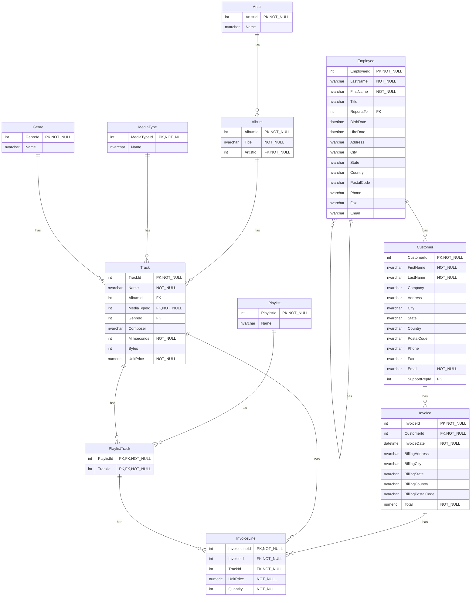

# Database Documentation: Chinook

**Server**: sql-claude
**Generated**: 2026-03-22T13:08:28.148Z
**Total Iterations**: 2

## Analysis Summary

- **Status**: converged
- **Iterations**: 2
- **Tokens Used**: 98,385 (input: 76,004, output: 22,381)
- **Estimated Cost**: $0.00
- **AI Model**: gemini-3-flash-preview
- **AI Vendor**: gemini
- **Temperature**: 0.1
- **Convergence**: Reached maximum iteration limit (2)

## Table of Contents

### [dbo](#schema-dbo) (11 tables)
- [Album](#album)
- [Artist](#artist)
- [Customer](#customer)
- [Employee](#employee)
- [Genre](#genre)
- [Invoice](#invoice)
- [InvoiceLine](#invoiceline)
- [MediaType](#mediatype)
- [Playlist](#playlist)
- [PlaylistTrack](#playlisttrack)
- [Track](#track)

## Schema: dbo

### Entity Relationship Diagram

### Tables

#### Album

Stores metadata for music albums, acting as a logical container that groups tracks under a specific title and primary artist entity. While it organizes the library hierarchy, it does not enforce uniform authorship, as individual track composers are maintained independently within the Track table.

**Row Count**: 347
**Dependency Level**: 1

**Confidence**: 100%

**Depends On**:
- [dbo.Artist](#artist) (via ArtistId)

**Referenced By**:
- [dbo.Track](#track)

**Columns**:

| Column | Type | Description |
|--------|------|-------------|
| AlbumId | int (PK, NOT NULL) | The unique primary identifier for each album record. |
| Title | nvarchar (NOT NULL) | The name of the album as it appears in the media library. |
| ArtistId | int (FK, NOT NULL) | A reference to the artist or band responsible for the album. |

#### Artist

A foundational lookup table that stores the names of musical artists, bands, classical composers, and television series soundtracks, representing the diverse range of creators and source entities within the multi-genre media library.

**Row Count**: 275
**Dependency Level**: 0

**Confidence**: 100%

**Referenced By**:
- [dbo.Album](#album)

**Columns**:

| Column | Type | Description |
|--------|------|-------------|
| ArtistId | int (PK, NOT NULL) | The unique primary identifier for each artist or musical group. |
| Name | nvarchar | The display name of the artist, band, or ensemble. |

#### Customer

The dbo.Customer table stores current profile and contact information for a global base of individual and corporate clients across at least 24 countries. It serves as a central CRM hub, linking customers to assigned support staff and providing the master identity for billing and invoicing. While this table maintains the active customer profile, historical billing details are preserved within individual invoice records to ensure transactional accuracy even if the customer's primary contact information changes.

**Row Count**: 59
**Dependency Level**: 0

**Confidence**: 100%

**Depends On**:
- [dbo.Employee](#employee) (via SupportRepId)

**Referenced By**:
- [dbo.Invoice](#invoice)

**Columns**:

| Column | Type | Description |
|--------|------|-------------|
| CustomerId | int (PK, NOT NULL) | Unique identifier for each customer record. |
| FirstName | nvarchar (NOT NULL) | The given name of the customer. |
| LastName | nvarchar (NOT NULL) | The surname or family name of the customer. |
| Company | nvarchar | The business or organization the customer is affiliated with, if applicable. |
| Address | nvarchar | The street address for billing or shipping. |
| City | nvarchar | The city where the customer is located. |
| State | nvarchar | The state, province, or region of the customer's address. |
| Country | nvarchar | The country of residence for the customer. |
| PostalCode | nvarchar | The alphanumeric code used for mail sorting and delivery. |
| Phone | nvarchar | The primary telephone contact number for the customer. |
| Fax | nvarchar | The facsimile number for the customer. |
| Email | nvarchar (NOT NULL) | The primary electronic mail address used for communication and potentially account login. |
| SupportRepId | int (FK) | Reference to the internal employee assigned to manage this customer's account or provide support. |

#### Employee

The dbo.Employee table serves as the primary repository for personnel records within the Chinook organization, managing a small, flat team of 8 staff members. It defines the internal organizational hierarchy—led by a General Manager (Andrew Adams)—and identifies specific employees who function as Support Representatives, serving as the primary point of contact for the company's customer base.

**Row Count**: 8
**Dependency Level**: 0

**Confidence**: 100%

**Depends On**:
- [dbo.Employee](#employee) (via ReportsTo)

**Referenced By**:
- [dbo.Customer](#customer)
- [dbo.Employee](#employee)

**Columns**:

| Column | Type | Description |
|--------|------|-------------|
| EmployeeId | int (PK, NOT NULL) | A unique internal identifier assigned to each employee. |
| LastName | nvarchar (NOT NULL) | The legal surname of the employee. |
| FirstName | nvarchar (NOT NULL) | The legal given name of the employee. |
| Title | nvarchar | The official job title or role of the employee within the company (e.g., General Manager, Sales Support Agent). |
| ReportsTo | int (FK) | The EmployeeId of the individual's direct supervisor or manager, establishing the organizational chart. |
| BirthDate | datetime | The employee's date of birth, used for HR records and age verification. |
| HireDate | datetime | The date the employee officially joined the organization. |
| Address | nvarchar | The street address of the employee's residence. |
| City | nvarchar | The city where the employee resides (e.g., Calgary, Edmonton). |
| State | nvarchar | The province or state of residence. |
| Country | nvarchar | The country of residence. |
| PostalCode | nvarchar | The alphanumeric postal code for the employee's address. |
| Phone | nvarchar | The primary telephone contact number for the employee. |
| Fax | nvarchar | The facsimile number for the employee. |
| Email | nvarchar | The corporate email address for the employee, typically following a 'firstname@chinookcorp.com' pattern. |

#### Genre

A lookup table that defines the various musical and media genres available in the database, such as Rock, Jazz, and TV Shows.

**Row Count**: 25
**Dependency Level**: 0

**Confidence**: 100%

**Referenced By**:
- [dbo.Track](#track)

**Columns**:

| Column | Type | Description |
|--------|------|-------------|
| GenreId | int (PK, NOT NULL) | The unique primary identifier for each genre record. |
| Name | nvarchar | The descriptive name of the music or media genre. |

#### Invoice

The dbo.Invoice table serves as the header-level record for sales transactions, specifically for digital music tracks. It captures essential metadata for each purchase, including the customer, transaction date, total monetary value, and billing address. On average, each transaction consists of approximately 5.4 tracks.

**Row Count**: 412
**Dependency Level**: 1

**Confidence**: 100%

**Depends On**:
- [dbo.Customer](#customer) (via CustomerId)

**Referenced By**:
- [dbo.InvoiceLine](#invoiceline)

**Columns**:

| Column | Type | Description |
|--------|------|-------------|
| InvoiceId | int (PK, NOT NULL) | The unique identifier for each invoice record. |
| CustomerId | int (FK, NOT NULL) | A reference to the customer who placed the order. |
| InvoiceDate | datetime (NOT NULL) | The date and time when the invoice was generated. |
| BillingAddress | nvarchar | The street address where the invoice was sent or associated with the payment method. |
| BillingCity | nvarchar | The city associated with the billing address. |
| BillingState | nvarchar | The state or province associated with the billing address. |
| BillingCountry | nvarchar | The country associated with the billing address. |
| BillingPostalCode | nvarchar | The postal or zip code for the billing address. |
| Total | numeric (NOT NULL) | The total monetary amount of the invoice, including all line items and taxes. |

#### InvoiceLine

The dbo.InvoiceLine table functions as a line-item detail table that breaks down each sales transaction into its individual components. It records the specific tracks purchased, the price at which they were sold, and the quantity for each item within a larger invoice.

**Row Count**: 2240
**Dependency Level**: 3

**Confidence**: 100%

**Depends On**:
- [dbo.Invoice](#invoice) (via InvoiceId)
- [dbo.Track](#track) (via TrackId)
- [dbo.PlaylistTrack](#playlisttrack) (via TrackId)

**Columns**:

| Column | Type | Description |
|--------|------|-------------|
| InvoiceLineId | int (PK, NOT NULL) | A unique surrogate primary key for each individual line item in the database. |
| InvoiceId | int (FK, NOT NULL) | A foreign key linking the line item to its parent transaction record in the dbo.Invoice table. |
| TrackId | int (FK, NOT NULL) | A foreign key identifying the specific digital media item (song, video, etc.) being purchased. |
| UnitPrice | numeric (NOT NULL) | The cost per unit of the track at the time of the transaction. |
| Quantity | int (NOT NULL) | The number of units of the specific track purchased in this line item. |

#### MediaType

A lookup table that defines the various digital file formats for tracks in the music library. These media types categorize content into audio and video formats, which directly correlate with different pricing tiers (typically $0.99 for audio and $1.99 for video) in the associated Track table.

**Row Count**: 5
**Dependency Level**: 0

**Confidence**: 100%

**Referenced By**:
- [dbo.Track](#track)

**Columns**:

| Column | Type | Description |
|--------|------|-------------|
| MediaTypeId | int (PK, NOT NULL) | The unique primary identifier for a specific media format. |
| Name | nvarchar | The descriptive name of the media format, indicating the codec or container type (e.g., MPEG, AAC) and whether it is protected by DRM. |

#### Playlist

A foundational lookup table defining the 14 primary organizational containers for the media library. It categorizes tracks into logical groups such as media types (Movies, TV Shows), genres (90’s Music, Heavy Metal Classic), or curated collections (Classical 101), serving as the top-level structure for media organization.

**Row Count**: 18
**Dependency Level**: 0

**Confidence**: 100%

**Referenced By**:
- [dbo.PlaylistTrack](#playlisttrack)

**Columns**:

| Column | Type | Description |
|--------|------|-------------|
| PlaylistId | int (PK, NOT NULL) | The unique primary identifier for each playlist. |
| Name | nvarchar | The descriptive name of the playlist used for display and categorization. |

#### PlaylistTrack

A junction table that facilitates a many-to-many relationship between playlists and tracks, allowing individual media items to be organized into multiple curated collections or categories.

**Row Count**: 8715
**Dependency Level**: 0

**Confidence**: 100%

**Depends On**:
- [dbo.Playlist](#playlist) (via PlaylistId)
- [dbo.Track](#track) (via TrackId)

**Referenced By**:
- [dbo.InvoiceLine](#invoiceline)

**Columns**:

| Column | Type | Description |
|--------|------|-------------|
| PlaylistId | int (PK, FK, NOT NULL) | The unique identifier for a playlist; part of the composite primary key. |
| TrackId | int (PK, FK, NOT NULL) | The unique identifier for a specific media track; part of the composite primary key. |

#### Track

The dbo.Track table serves as the central repository for individual media items (songs, videos, or episodes) within the digital store. It stores descriptive metadata, technical specifications, and pricing information—primarily following a tiered structure of 0.99 or 1.99—for each track, while linking to albums, genres, and media formats.

**Row Count**: 3503
**Dependency Level**: 2

**Confidence**: 100%

**Depends On**:
- [dbo.Album](#album) (via AlbumId)
- [dbo.MediaType](#mediatype) (via MediaTypeId)
- [dbo.Genre](#genre) (via GenreId)

**Referenced By**:
- [dbo.InvoiceLine](#invoiceline)
- [dbo.PlaylistTrack](#playlisttrack)

**Columns**:

| Column | Type | Description |
|--------|------|-------------|
| TrackId | int (PK, NOT NULL) | Unique identifier for each media track. |
| Name | nvarchar (NOT NULL) | The title of the song, video, or media track. |
| AlbumId | int (FK) | Reference to the album that contains this track. |
| MediaTypeId | int (FK, NOT NULL) | Identifier for the digital format of the track (e.g., MPEG, AAC). |
| GenreId | int (FK) | Identifier for the musical or content category (e.g., Rock, Jazz). |
| Composer | nvarchar | The individual or group credited with writing the track. |
| Milliseconds | int (NOT NULL) | The total playback duration of the track in milliseconds. |
| Bytes | int | The storage size of the digital file in bytes. |
| UnitPrice | numeric (NOT NULL) | The cost to purchase the individual track. |

---

## Appendix: Iteration Analysis

This section documents the iterative refinement process used to generate the database documentation, highlighting corrections and improvements discovered through backpropagation.

### Summary

- **Total Tables with Refinements**: 11
- **Total Columns with Refinements**: 64
- **Total Refinement Iterations**: 90
- **Refinements Triggered by Backpropagation**: 15

### Tables Refined Through Iteration

#### [Album](#album)

**Iterations**: 4 | **Trigger**: backpropagation

**Iteration 1** (initial):

> Stores metadata for music albums and media collections, serving as a middle layer in the hierarchy between artists and individual tracks.

*Reasoning*: The table name, column names (AlbumId, Title, ArtistId), and sample values (e.g., 'Led Zeppelin I', 'Are You Experienced?') are characteristic of a music library database. The relationships show it groups tracks under a specific artist.

---

**Iteration 2** (backpropagation):

> Stores metadata for music albums and media collections, serving as a middle layer in the hierarchy between artists and individual tracks. The table manages 347 distinct albums, which collectively group 3,503 tracks (averaging approximately 10 tracks per album).

*Reasoning*: The new insights from the Track table provide specific quantitative data that confirms the hierarchical relationship between albums and tracks. Including the album count (347) and the track distribution (approx. 10 per album) enhances the description by defining the scale and usage patterns of the table.

---

**Iteration 3** (refinement):

> Stores metadata for music albums, acting as a bridge between artists and their individual tracks. It organizes the media library by grouping songs under a specific title and artist entity.

*Reasoning*: The table name 'Album' and columns 'Title' and 'ArtistId' are standard for music databases. Sample values like 'Led Zeppelin I' and 'Bach: Goldberg Variations' confirm it stores musical album titles. The relationship to dbo.Artist and dbo.Track establishes a clear hierarchy: Artist -> Album -> Track.

---

**Iteration 4** (backpropagation):

> Stores metadata for music albums, acting as a logical container that groups tracks under a specific title and primary artist entity. While it organizes the library hierarchy, it does not enforce uniform authorship, as individual track composers are maintained independently within the Track table.

*Reasoning*: Insights from the Track table clarify that the Album table's relationship to an Artist represents the primary performer or collection entity, rather than a strict authorship constraint. Distinguishing between the album-level artist and the track-level composer provides a more precise understanding of the database's music metadata hierarchy.

#### [Artist](#artist)

**Iterations**: 4 | **Trigger**: backpropagation

**Iteration 1** (initial):

> A foundational lookup table that stores a master list of musical artists, bands, and performers within the media library.

*Reasoning*: The table name and sample values (e.g., 'Led Zeppelin', 'U2', 'Berliner Philharmoniker') clearly identify the entities as musical performers. The 100% uniqueness of both the ID and Name columns across 275 rows suggests a clean, normalized registry. Its position as a dependency-free table (level 0) that is referenced by dbo.Album confirms it is a top-level entity in the database schema.

---

**Iteration 2** (backpropagation):

> A foundational lookup table that stores a master list of artists, bands, and media creators. While primarily containing musical performers, the table also includes entities associated with other media formats, such as TV series titles or production entities.

*Reasoning*: The original description focused exclusively on musical performers. New insights from the related Album table reveal that the Artist table also includes entries for TV series (e.g., 'LOST'). This indicates the table serves as a broader registry for any entity or title responsible for a media collection, rather than being strictly limited to musicians.

---

**Iteration 3** (refinement):

> A foundational lookup table that stores the names of musical artists, bands, and performers within the media library.

*Reasoning*: The table contains a unique identifier (ArtistId) and a corresponding name (Name). The sample data consists of well-known musical entities like 'Led Zeppelin', 'U2', and 'Berliner Philharmoniker'. The table is referenced by dbo.Album, establishing a one-to-many relationship between artists and their discography.

---

**Iteration 4** (backpropagation):

> A foundational lookup table that stores the names of musical artists, bands, classical composers, and television series soundtracks, representing the diverse range of creators and source entities within the multi-genre media library.

*Reasoning*: Analysis of related tables confirms that the 'Artist' table is more inclusive than initially described, containing not only traditional musical performers but also classical composers and television series titles (e.g., LOST). This clarifies that the table functions as a high-level metadata container for various types of content sources across multiple genres, rather than being limited to standard musical performers.

#### [Customer](#customer)

**Iterations**: 4 | **Trigger**: backpropagation

**Iteration 1** (initial):

> The dbo.Customer table stores comprehensive profile and contact information for individuals who purchase media from the store. It serves as a central repository for customer identity, geographic location, and relationship management by linking each customer to a specific support representative.

*Reasoning*: The table contains standard PII (Personally Identifiable Information) such as names, addresses, and contact details. The presence of a SupportRepId suggests a business model where customers are assigned to staff members, and the relationship with dbo.Invoice confirms its role in the sales process. The sample values for 'Company' (e.g., Apple, Google, Microsoft) suggest a B2C or B2B customer base in a professional context.

---

**Iteration 2** (backpropagation):

> The dbo.Customer table stores comprehensive profile and contact information for a highly international customer base, spanning 24 different countries. It serves as a central repository for customer identity, global geographic location, and relationship management by linking each customer to a specific support representative. The table supports both B2C and B2B interactions, as indicated by the presence of major corporate entities and diverse postal code formats.

*Reasoning*: The new insights from related tables (specifically Invoice) reveal that the customer base is significantly more diverse than a standard local or regional list, encompassing 24 different countries. This international scale is a key characteristic of the table's data that was not explicitly captured in the original description. The revision incorporates this global scope while maintaining the original focus on PII and support relationships.

---

**Iteration 3** (refinement):

> The dbo.Customer table stores comprehensive profile and contact information for individuals and organizations that purchase products or services. It serves as a central hub for CRM (Customer Relationship Management), linking customers to specific internal support staff and acting as the primary entity for billing and invoicing records.

*Reasoning*: The table contains standard identity fields (FirstName, LastName), contact details (Email, Phone, Fax), and geographic data (Address, City, Country). The presence of a Company column suggests a mix of B2B and B2C clients. The SupportRepId foreign key indicates a structured account management or support model where customers are assigned to specific employees. Furthermore, the table is referenced by dbo.Invoice, confirming its role in the sales process.

---

**Iteration 4** (backpropagation):

> The dbo.Customer table stores current profile and contact information for a global base of individual and corporate clients across at least 24 countries. It serves as a central CRM hub, linking customers to assigned support staff and providing the master identity for billing and invoicing. While this table maintains the active customer profile, historical billing details are preserved within individual invoice records to ensure transactional accuracy even if the customer's primary contact information changes.

*Reasoning*: The original description was enhanced to reflect the global scale of the customer base identified in the Invoice records. More importantly, the insight regarding historical billing tracking clarifies the relationship between the Customer and Invoice tables: the Customer table represents the 'current' profile, while the Invoice table snapshots billing data at the time of sale. This distinction is vital for understanding how the system handles data integrity and address changes over time.

#### [Employee](#employee)

**Iterations**: 4 | **Trigger**: backpropagation

**Iteration 1** (initial):

> The dbo.Employee table serves as a central repository for personnel information within the organization. It stores comprehensive details for each staff member, including their professional roles, contact information, geographic location, and the internal reporting hierarchy.

*Reasoning*: The table contains standard HR attributes such as EmployeeId, FirstName, LastName, BirthDate, and HireDate. The presence of a 'ReportsTo' column containing values that match 'EmployeeId' indicates a self-referencing organizational hierarchy. Job titles like 'Sales Manager' and 'IT Staff' further confirm its role in managing workforce data.

---

**Iteration 2** (backpropagation):

> The dbo.Employee table serves as a central repository for personnel information, storing comprehensive details for each staff member including their professional roles, contact information, and reporting hierarchy. In addition to general workforce management, the table identifies specific employees who act as primary support representatives for the organization's customers.

*Reasoning*: The new insights confirm the table's role in HR management but add a specific functional context: it acts as the source for customer support assignments. The link to the Customer table via specific Employee IDs (3, 4, and 5) demonstrates that the table is integrated into the sales and support workflow, rather than being used solely for internal administration.

---

**Iteration 3** (refinement):

> The dbo.Employee table serves as the primary repository for personnel records within the Chinook organization. It stores comprehensive identity, professional, and contact information for all staff members, while also defining the internal organizational hierarchy through a self-referencing reporting structure.

*Reasoning*: The table contains standard HR attributes such as names, job titles, hire dates, and birth dates. The presence of a 'ReportsTo' column referencing 'EmployeeId' confirms a management hierarchy. Furthermore, the email domain '@chinookcorp.com' and job titles like 'Sales Support Agent' and 'IT Manager' align with a corporate staff directory.

---

**Iteration 4** (backpropagation):

> The dbo.Employee table serves as the primary repository for personnel records within the Chinook organization, managing a small, flat team of 8 staff members. It defines the internal organizational hierarchy—led by a General Manager (Andrew Adams)—and identifies specific employees who function as Support Representatives, serving as the primary point of contact for the company's customer base.

*Reasoning*: While the original description correctly identified the table's HR and hierarchical functions, new insights provide critical context regarding the organization's scale and operational focus. Specifically, the discovery that only a subset of employees (IDs 3, 4, and 5) act as Support Representatives reveals a key functional link between the employee table and customer management. Furthermore, the insights clarify the specific leadership structure, identifying the General Manager as the head of a relatively small, 8-person team.

#### [Genre](#genre)

**Iterations**: 2 | **Trigger**: refinement

**Iteration 1** (initial):

> A foundational lookup table that defines the various musical and media genres used to categorize tracks within the database.

*Reasoning*: The table contains a unique identifier (GenreId) and a corresponding descriptive name (Name). The sample values like 'Heavy Metal', 'Jazz', and 'Classical' are classic examples of music genres. The fact that it is referenced by dbo.Track and has no foreign keys of its own confirms its role as a primary classification/lookup table.

---

**Iteration 2** (refinement):

> A lookup table that defines the various musical and media genres available in the database, such as Rock, Jazz, and TV Shows.

*Reasoning*: The table contains a list of music and media categories (e.g., 'Heavy Metal', 'Jazz', 'TV Shows') and serves as a foundational reference table (Level 0 dependency) for the dbo.Track table. The naming convention and 1:1 relationship between IDs and names are characteristic of a metadata lookup table.

#### [Invoice](#invoice)

**Iterations**: 4 | **Trigger**: backpropagation

**Iteration 1** (initial):

> The dbo.Invoice table serves as a sales transaction header, recording the high-level details of a purchase made by a customer. It captures the date of the transaction, the total monetary value, and the specific billing address used for the order.

*Reasoning*: The table name 'Invoice' combined with columns like 'Total', 'InvoiceDate', and 'BillingAddress' clearly indicates a sales record. The 1:N relationship with dbo.InvoiceLine (referenced by) and the N:1 relationship with dbo.Customer (references) confirms its role as the header in a standard header-detail sales schema.

---

**Iteration 2** (backpropagation):

> The dbo.Invoice table serves as a sales transaction header, recording the high-level details of a purchase made by a customer, including the transaction date, total monetary value, and billing address. Analysis of related line items reveals that the table typically captures small bundles or EP-length selections, with an average of approximately 5.4 tracks per invoice, rather than single-track purchases or large bulk orders.

*Reasoning*: The original description correctly identified the table's functional role, but the new insights from the InvoiceLine table provide a specific usage pattern that characterizes the nature of the sales. Incorporating the fact that invoices typically represent small bundles (averaging ~5.4 tracks) adds meaningful business context to the 'sales transaction' definition, clarifying the scale of the transactions recorded.

---

**Iteration 3** (refinement):

> The dbo.Invoice table serves as the header-level record for sales transactions. It captures the essential metadata for each purchase, including the customer involved, the transaction date, the total monetary value, and the specific billing address used for the order.

*Reasoning*: The table name 'Invoice' combined with columns like 'Total', 'InvoiceDate', and 'BillingAddress' clearly indicates a sales transaction entity. The 1-to-many relationship with dbo.InvoiceLine (implied by the 'Referenced by' section) confirms this is the parent record for individual line items in a shopping cart or billing system.

---

**Iteration 4** (backpropagation):

> The dbo.Invoice table serves as the header-level record for sales transactions, specifically for digital music tracks. It captures essential metadata for each purchase, including the customer, transaction date, total monetary value, and billing address. On average, each transaction consists of approximately 5.4 tracks.

*Reasoning*: The new insight identifies the specific product type (tracks) being sold, which refines the table's purpose from a general sales header to a media-specific transaction record. It also quantifies the relationship with the InvoiceLine table, confirming its role as a parent record for multiple items.

#### [InvoiceLine](#invoiceline)

**Iterations**: 2 | **Trigger**: refinement

**Iteration 1** (initial):

> The dbo.InvoiceLine table serves as the line-item detail for sales transactions. It records the specific tracks purchased within each invoice, capturing the price and quantity for every individual item in a customer's order.

*Reasoning*: The table structure follows a classic order-detail pattern: it contains a foreign key to a header table (dbo.Invoice), a foreign key to a product table (dbo.Track), and transactional attributes like UnitPrice and Quantity. The naming convention 'InvoiceLine' and the 1:N relationship with dbo.Invoice confirm its role as a child table detailing the contents of a purchase.

---

**Iteration 2** (refinement):

> The dbo.InvoiceLine table functions as a line-item detail table that breaks down each sales transaction into its individual components. It records the specific tracks purchased, the price at which they were sold, and the quantity for each item within a larger invoice.

*Reasoning*: The table structure follows a classic order-detail pattern: it contains a primary key (InvoiceLineId), a foreign key to a header table (InvoiceId), a foreign key to a product table (TrackId), and transactional attributes like UnitPrice and Quantity. The row count (2240) relative to the distinct InvoiceId count (412) indicates that each invoice typically contains multiple line items.

#### [MediaType](#mediatype)

**Iterations**: 3 | **Trigger**: backpropagation

**Iteration 1** (initial):

> A lookup table that defines the various digital file formats (audio and video) available for tracks in the database. It serves as a categorization entity to distinguish between different encoding standards and DRM statuses.

*Reasoning*: The table name 'MediaType' combined with the 'Name' column values (e.g., 'MPEG audio file', 'Protected AAC audio file') clearly indicates its purpose as a reference for file formats. The low row count (5) and 100% uniqueness in both columns suggest it is a static lookup table used to normalize media format data across the dbo.Track table.

---

**Iteration 2** (refinement):

> A lookup table that defines the various digital file formats (media types) available for the tracks in the music library, such as MPEG audio or AAC video.

*Reasoning*: The table name 'MediaType' combined with the sample values in the 'Name' column (e.g., 'MPEG audio file', 'AAC audio file') clearly indicates this is a reference table for file formats. The low row count (5) and the fact that it is referenced by dbo.Track further confirm its role as a foundational category table.

---

**Iteration 3** (backpropagation):

> A lookup table that defines the various digital file formats for tracks in the music library. These media types categorize content into audio and video formats, which directly correlate with different pricing tiers (typically $0.99 for audio and $1.99 for video) in the associated Track table.

*Reasoning*: The original description correctly identified the table's technical purpose. However, new insights from the child 'Track' table clarify that these media types are not just technical metadata but also serve a business function by distinguishing between audio and video content, which is reflected in distinct price points. Integrating this information provides a more complete understanding of the table's role in the database's business logic.

#### [Playlist](#playlist)

**Iterations**: 3 | **Trigger**: backpropagation

**Iteration 1** (initial):

> A lookup table that defines the names and unique identifiers for various media playlists within the system.

*Reasoning*: The table contains a primary key 'PlaylistId' and a 'Name' column with values such as 'Music', '90’s Music', and 'TV Shows', which are characteristic of media organization. The absence of foreign keys and the low row count suggest it is a foundational lookup table used to categorize tracks.

---

**Iteration 2** (refinement):

> A lookup table that defines various media playlists, categorizing tracks into logical groups such as media types (Movies, TV Shows), genres (90’s Music, Heavy Metal Classic), or curated collections (Classical 101).

*Reasoning*: The table name 'Playlist' and the sample values in the 'Name' column (e.g., 'Music', 'Movies', '90’s Music') clearly indicate a system for organizing media. The lack of foreign keys and the fact that it is referenced by dbo.PlaylistTrack suggests it is a foundational entity in a media management database.

---

**Iteration 3** (backpropagation):

> A foundational lookup table defining the 14 primary organizational containers for the media library. It categorizes tracks into logical groups such as media types (Movies, TV Shows), genres (90’s Music, Heavy Metal Classic), or curated collections (Classical 101), serving as the top-level structure for media organization.

*Reasoning*: The new insight provides a specific count (14) and clarifies that these playlists are not merely supplemental lists but the 'primary organizational containers' for the system. This adds structural context that was missing from the original description, identifying the table as the top-level hierarchy for the media library.

#### [PlaylistTrack](#playlisttrack)

**Iterations**: 2 | **Trigger**: refinement

**Iteration 1** (initial):

> A junction table (bridge table) that facilitates a many-to-many relationship between playlists and tracks. It allows a single playlist to contain multiple tracks and a single track to be included in multiple different playlists.

*Reasoning*: The table contains two columns, PlaylistId and TrackId, which correspond to the primary keys of the dbo.Playlist and dbo.Track tables. The composite primary key structure and the high row count (8715) relative to the distinct values of PlaylistId (14) and TrackId (3503) are characteristic of a many-to-many relationship mapping.

---

**Iteration 2** (refinement):

> A junction table that facilitates a many-to-many relationship between playlists and tracks, allowing individual media items to be organized into multiple curated collections or categories.

*Reasoning*: The table contains two primary columns, PlaylistId and TrackId, both of which are foreign keys to other tables (dbo.Playlist and dbo.Track). The row count (8,715) is significantly higher than the number of distinct PlaylistIds (14) and TrackIds (3,503), which is the classic signature of a bridge/junction table used to model many-to-many relationships.

#### [Track](#track)

**Iterations**: 5 | **Trigger**: backpropagation

**Iteration 1** (initial):

> The dbo.Track table serves as the central repository for individual media items (songs, videos, or episodes) within a digital media store. It captures essential metadata including titles, creators, technical specifications (duration and file size), and commercial pricing, while linking each item to its respective album, genre, and file format.

*Reasoning*: The table name 'Track' combined with columns like 'Composer', 'Milliseconds', and 'Bytes' strongly indicates a music or media library. The presence of 'UnitPrice' and relationships to 'InvoiceLine' confirm its role in a commercial retail context. The sample values (e.g., 'Everlong', 'Enter Sandman') are well-known song titles.

---

**Iteration 2** (backpropagation):

> The dbo.Track table serves as the central repository for individual media items (songs, videos, or episodes) within a digital media store. It captures essential metadata including titles, creators, technical specifications (duration and file size), and links each item to its respective album, genre, and file format. Commercially, the store utilizes a dual-tier pricing model, categorizing tracks into standard (0.99) and premium (1.99) price points.

*Reasoning*: The new insights provide specific clarity on the 'UnitPrice' column, revealing a structured two-tier pricing strategy (0.99 and 1.99) rather than just general commercial pricing. Incorporating this detail enhances the description by defining the specific business logic applied to the media items.

---

**Iteration 3** (backpropagation):

> The dbo.Track table serves as the central repository for 3,503 individual media items (songs, videos, or episodes) within a digital media store. It captures essential metadata including titles, creators, technical specifications (duration and file size), and links each item to its respective album, genre, and file format. Commercially, the store utilizes a dual-tier pricing model (0.99 and 1.99). Beyond its core attributes, the table is highly integrated into the store's curation system, with tracks appearing in an average of 2.5 different playlists, indicating a robust many-to-many relationship with user or system-generated collections.

*Reasoning*: The new insights provide the specific scale of the catalog (3,503 tracks) and highlight the significant role tracks play within the playlist ecosystem. Incorporating the average of 2.5 playlist associations per track clarifies how the media items are utilized and organized within the broader application, moving beyond just metadata to include usage patterns and curation frequency.

---

**Iteration 4** (refinement):

> The dbo.Track table serves as the central repository for individual media items (songs, videos, or episodes) within the digital store. It stores descriptive metadata, technical specifications, and pricing information for each track, while linking to albums, genres, and media formats.

*Reasoning*: The table contains specific attributes of digital media such as 'Milliseconds' (duration), 'Bytes' (file size), and 'Composer'. The foreign key relationships to dbo.Album, dbo.Genre, and dbo.MediaType, combined with sample values like 'Everlong' and 'Enter Sandman', clearly identify this as a music/media track catalog. The presence of 'UnitPrice' and references from dbo.InvoiceLine indicate these tracks are commercial products.

---

**Iteration 5** (backpropagation):

> The dbo.Track table serves as the central repository for individual media items (songs, videos, or episodes) within the digital store. It stores descriptive metadata, technical specifications, and pricing information—primarily following a tiered structure of 0.99 or 1.99—for each track, while linking to albums, genres, and media formats.

*Reasoning*: The original description correctly identified the table's purpose and the presence of pricing data. The new insight provides specific details about the store's commercial model, revealing that tracks follow a standardized tiered pricing structure. Integrating this detail provides a more complete understanding of the table's role in the store's business logic and how media assets are valued.

### Iteration Process Visualization

The following diagram illustrates the analysis workflow and highlights where corrections were made through backpropagation:

```mermaid
sequenceDiagram
    participant User
    participant Analyzer
    participant AI
    participant SemanticCheck

    User->>Analyzer: Start Analysis
    Analyzer->>AI: Analyze Schema

    AI->>Analyzer: Initial description for Album
    Note right of Analyzer: Backpropagation triggered
    Analyzer->>SemanticCheck: Compare iterations for Album
    SemanticCheck->>Analyzer: Material change detected
    Analyzer->>AI: Refine description (iteration 2)
    AI->>Analyzer: Updated description
    rect rgb(255, 220, 100)
        Note over Analyzer: Album refined via backprop
    end
    Analyzer->>AI: Refine description (iteration 3)
    AI->>Analyzer: Updated description
    Note right of Analyzer: Backpropagation triggered
    Analyzer->>SemanticCheck: Compare iterations for Album
    SemanticCheck->>Analyzer: Material change detected
    Analyzer->>AI: Refine description (iteration 4)
    AI->>Analyzer: Updated description
    rect rgb(255, 220, 100)
        Note over Analyzer: Album refined via backprop
    end
    AI->>Analyzer: Initial description for Artist
    Note right of Analyzer: Backpropagation triggered
    Analyzer->>SemanticCheck: Compare iterations for Artist
    SemanticCheck->>Analyzer: Material change detected
    Analyzer->>AI: Refine description (iteration 2)
    AI->>Analyzer: Updated description
    rect rgb(255, 220, 100)
        Note over Analyzer: Artist refined via backprop
    end
    Analyzer->>AI: Refine description (iteration 3)
    AI->>Analyzer: Updated description
    Note right of Analyzer: Backpropagation triggered
    Analyzer->>SemanticCheck: Compare iterations for Artist
    SemanticCheck->>Analyzer: Material change detected
    Analyzer->>AI: Refine description (iteration 4)
    AI->>Analyzer: Updated description
    rect rgb(255, 220, 100)
        Note over Analyzer: Artist refined via backprop
    end
    AI->>Analyzer: Initial description for Customer
    Note right of Analyzer: Backpropagation triggered
    Analyzer->>SemanticCheck: Compare iterations for Customer
    SemanticCheck->>Analyzer: Material change detected
    Analyzer->>AI: Refine description (iteration 2)
    AI->>Analyzer: Updated description
    rect rgb(255, 220, 100)
        Note over Analyzer: Customer refined via backprop
    end
    Analyzer->>AI: Refine description (iteration 3)
    AI->>Analyzer: Updated description
    Note right of Analyzer: Backpropagation triggered
    Analyzer->>SemanticCheck: Compare iterations for Customer
    SemanticCheck->>Analyzer: Material change detected
    Analyzer->>AI: Refine description (iteration 4)
    AI->>Analyzer: Updated description
    rect rgb(255, 220, 100)
        Note over Analyzer: Customer refined via backprop
    end
    AI->>Analyzer: Initial description for Employee
    Note right of Analyzer: Backpropagation triggered
    Analyzer->>SemanticCheck: Compare iterations for Employee
    SemanticCheck->>Analyzer: Material change detected
    Analyzer->>AI: Refine description (iteration 2)
    AI->>Analyzer: Updated description
    rect rgb(255, 220, 100)
        Note over Analyzer: Employee refined via backprop
    end
    Analyzer->>AI: Refine description (iteration 3)
    AI->>Analyzer: Updated description
    Note right of Analyzer: Backpropagation triggered
    Analyzer->>SemanticCheck: Compare iterations for Employee
    SemanticCheck->>Analyzer: Material change detected
    Analyzer->>AI: Refine description (iteration 4)
    AI->>Analyzer: Updated description
    rect rgb(255, 220, 100)
        Note over Analyzer: Employee refined via backprop
    end
    AI->>Analyzer: Initial description for Genre
    Analyzer->>AI: Refine description (iteration 2)
    AI->>Analyzer: Updated description
    AI->>Analyzer: Initial description for Invoice
    Note right of Analyzer: Backpropagation triggered
    Analyzer->>SemanticCheck: Compare iterations for Invoice
    SemanticCheck->>Analyzer: Material change detected
    Analyzer->>AI: Refine description (iteration 2)
    AI->>Analyzer: Updated description
    rect rgb(255, 220, 100)
        Note over Analyzer: Invoice refined via backprop
    end
    Analyzer->>AI: Refine description (iteration 3)
    AI->>Analyzer: Updated description
    Note right of Analyzer: Backpropagation triggered
    Analyzer->>SemanticCheck: Compare iterations for Invoice
    SemanticCheck->>Analyzer: Material change detected
    Analyzer->>AI: Refine description (iteration 4)
    AI->>Analyzer: Updated description
    rect rgb(255, 220, 100)
        Note over Analyzer: Invoice refined via backprop
    end
    AI->>Analyzer: Initial description for InvoiceLine
    Analyzer->>AI: Refine description (iteration 2)
    AI->>Analyzer: Updated description
    AI->>Analyzer: Initial description for MediaType
    Analyzer->>AI: Refine description (iteration 2)
    AI->>Analyzer: Updated description
    Note right of Analyzer: Backpropagation triggered
    Analyzer->>SemanticCheck: Compare iterations for MediaType
    SemanticCheck->>Analyzer: Material change detected
    Analyzer->>AI: Refine description (iteration 3)
    AI->>Analyzer: Updated description
    rect rgb(255, 220, 100)
        Note over Analyzer: MediaType refined via backprop
    end
    AI->>Analyzer: Initial description for Playlist
    Analyzer->>AI: Refine description (iteration 2)
    AI->>Analyzer: Updated description
    Note right of Analyzer: Backpropagation triggered
    Analyzer->>SemanticCheck: Compare iterations for Playlist
    SemanticCheck->>Analyzer: Material change detected
    Analyzer->>AI: Refine description (iteration 3)
    AI->>Analyzer: Updated description
    rect rgb(255, 220, 100)
        Note over Analyzer: Playlist refined via backprop
    end
    AI->>Analyzer: Initial description for PlaylistTrack
    Analyzer->>AI: Refine description (iteration 2)
    AI->>Analyzer: Updated description
    AI->>Analyzer: Initial description for Track
    Note right of Analyzer: Backpropagation triggered
    Analyzer->>SemanticCheck: Compare iterations for Track
    SemanticCheck->>Analyzer: Material change detected
    Analyzer->>AI: Refine description (iteration 2)
    AI->>Analyzer: Updated description
    rect rgb(255, 220, 100)
        Note over Analyzer: Track refined via backprop
    end
    Note right of Analyzer: Backpropagation triggered
    Analyzer->>SemanticCheck: Compare iterations for Track
    SemanticCheck->>Analyzer: Material change detected
    Analyzer->>AI: Refine description (iteration 3)
    AI->>Analyzer: Updated description
    rect rgb(255, 220, 100)
        Note over Analyzer: Track refined via backprop
    end
    Analyzer->>AI: Refine description (iteration 4)
    AI->>Analyzer: Updated description
    Note right of Analyzer: Backpropagation triggered
    Analyzer->>SemanticCheck: Compare iterations for Track
    SemanticCheck->>Analyzer: Material change detected
    Analyzer->>AI: Refine description (iteration 5)
    AI->>Analyzer: Updated description
    rect rgb(255, 220, 100)
        Note over Analyzer: Track refined via backprop
    end

    Analyzer->>User: Analysis Complete
    Note over User,AI: Tables refined: Album, Artist, Customer, Employee, Genre, Invoice, InvoiceLine, MediaType, Playlist, PlaylistTrack, Track
```

