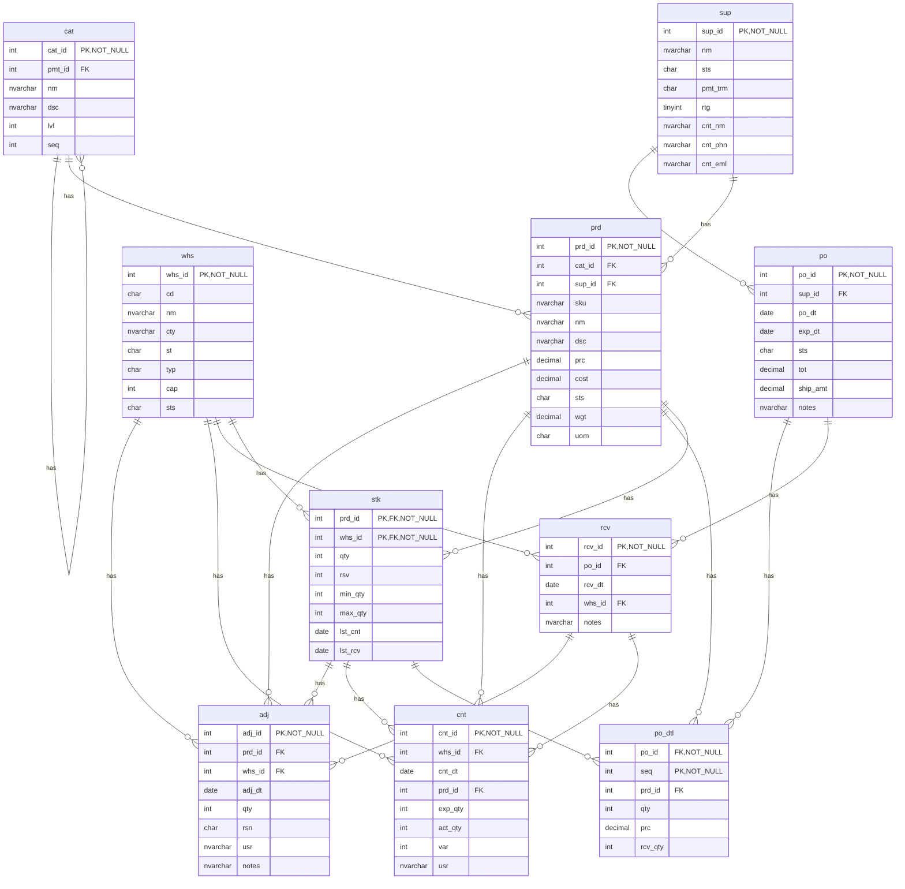
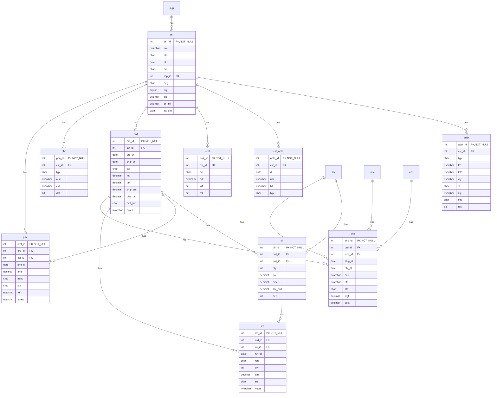

# Database Documentation: LousyDB

**Server**: sql-claude
**Generated**: 2026-03-22T13:08:27.382Z
**Total Iterations**: 2

## Analysis Summary

- **Status**: converged
- **Iterations**: 2
- **Tokens Used**: 213,637 (input: 162,128, output: 51,509)
- **Estimated Cost**: $0.00
- **AI Model**: gemini-3-flash-preview
- **AI Vendor**: gemini
- **Temperature**: 0.1
- **Convergence**: Reached maximum iteration limit (2)

## Database Context

**Purpose**: Legacy business database with cryptic table/column names, no constraints, and intentional data quality issues

**Industry**: General Business / Legacy System

**Business Domains**: Sales, Inventory, Order Management, Purchasing

## Table of Contents

### [inv](#schema-inv) (10 tables)
- [adj](#adj)
- [cat](#cat)
- [cnt](#cnt)
- [po](#po)
- [po_dtl](#po-dtl)
- [prd](#prd)
- [rcv](#rcv)
- [stk](#stk)
- [sup](#sup)
- [whs](#whs)

### [sales](#schema-sales) (10 tables)
- [addr](#addr)
- [cst](#cst)
- [cst_note](#cst-note)
- [eml](#eml)
- [oli](#oli)
- [ord](#ord)
- [phn](#phn)
- [pmt](#pmt)
- [rtn](#rtn)
- [shp](#shp)

## Schema: inv

### Entity Relationship Diagram

### Tables

#### adj

The inv.adj table records manual or system-generated inventory adjustments used to reconcile physical stock with the digital ledger. It tracks changes in product quantities due to non-standard events such as damage, expiration, theft (shrinkage), or administrative corrections.

**Row Count**: 300
**Dependency Level**: 1

**Confidence**: 98%

**Depends On**:
- [inv.stk](#stk) (via prd_id)
- [inv.rcv](#rcv) (via whs_id)
- [inv.stk](#stk) (via whs_id)
- [inv.whs](#whs) (via whs_id)
- [inv.prd](#prd) (via prd_id)

**Columns**:

| Column | Type | Description |
|--------|------|-------------|
| adj_id | int (PK, NOT NULL) | Unique identifier for each inventory adjustment transaction |
| prd_id | int (FK) | Reference to the specific product being adjusted |
| whs_id | int (FK) | Reference to the warehouse location where the adjustment occurred |
| adj_dt | date | The date and time when the adjustment was recorded |
| qty | int | The numerical change in stock level; negative values indicate stock removal, while positive values indicate stock additions |
| rsn | char | A short category code for the adjustment reason (e.g., STL for Steal/Shrinkage, EXP for Expired, DAM for Damaged, COR for Correction) |
| usr | nvarchar | The name of the employee or system user who performed the adjustment |
| notes | nvarchar | A descriptive explanation of the adjustment reason code |

#### cat

Stores a hierarchical product categorization system used to organize inventory items into at least 11 distinct groups, covering domains such as office furniture, computer hardware, and stationery. While the schema supports multi-level nesting via a self-referencing structure, it is currently utilized as a shallow two-level hierarchy (Parent/Child) to group products into broad departments and specific sub-categories.

**Row Count**: 20
**Dependency Level**: 0

**Confidence**: 100%

**Depends On**:
- [inv.cat](#cat) (via prnt_id)

**Referenced By**:
- [inv.prd](#prd)
- [inv.cat](#cat)

**Columns**:

| Column | Type | Description |
|--------|------|-------------|
| cat_id | int (PK, NOT NULL) | Unique identifier for each product category |
| prnt_id | int (FK) | Reference to the parent category ID, establishing a hierarchy |
| nm | nvarchar | The short display name of the category (e.g., 'Printers', 'Furniture') |
| dsc | nvarchar | A detailed description of the types of products included in the category |
| lvl | int | The depth level of the category in the hierarchy (1 for top-level, 2 for sub-categories) |
| seq | int | The display or sort order of the category within its hierarchy level |

#### cnt

Stores the results of physical inventory counts (cycle counts) performed at specific warehouses. It records the discrepancy between the system's expected stock levels and the actual physical quantities found during an audit.

**Row Count**: 250
**Dependency Level**: 1

**Confidence**: 95%

**Depends On**:
- [inv.rcv](#rcv) (via whs_id)
- [inv.stk](#stk) (via whs_id)
- [inv.whs](#whs) (via whs_id)
- [inv.stk](#stk) (via prd_id)
- [inv.prd](#prd) (via prd_id)

**Columns**:

| Column | Type | Description |
|--------|------|-------------|
| cnt_id | int (PK, NOT NULL) | Unique identifier for each inventory count record |
| whs_id | int (FK) | Identifier for the warehouse where the physical count was conducted |
| cnt_dt | date | The date the physical inventory count was performed |
| prd_id | int (FK) | Identifier for the specific product being audited |
| exp_qty | int | The theoretical stock quantity expected by the system at the time of the count |
| act_qty | int | The actual physical quantity counted by the staff member |
| var | int | The numerical difference (variance) between the actual and expected quantities |
| usr | nvarchar | The name of the employee or system user who performed the count |

#### po

Stores purchase order header information, representing formal requests sent to suppliers for goods or services. It tracks the overall order lifecycle, including dates, total costs, shipping fees, and fulfillment status.

**Row Count**: 150
**Dependency Level**: 1

**Confidence**: 95%

**Depends On**:
- [inv.sup](#sup) (via sup_id)

**Referenced By**:
- [inv.rcv](#rcv)
- [inv.po_dtl](#po-dtl)

**Columns**:

| Column | Type | Description |
|--------|------|-------------|
| po_id | int (PK, NOT NULL) | The unique primary identifier for each purchase order. |
| sup_id | int (FK) | Foreign key referencing the supplier (inv.sup) from whom the goods are being ordered. |
| po_dt | date | The date the purchase order was created or issued. |
| exp_dt | date | The expected delivery date or expiration date for the purchase order. |
| sts | char | The current lifecycle status of the purchase order (e.g., 'A' for Approved, 'P' for Pending, 'R' for Received, 'S' for Shipped, 'X' for Cancelled). |
| tot | decimal | The total monetary value of the purchase order, excluding or including shipping depending on business logic. |
| ship_amt | decimal | The cost associated with shipping the order; appears to use a flat rate (150) or zero. |
| notes | nvarchar | Optional free-text field for special instructions or comments regarding the order. |

#### po_dtl

The inv.po_dtl table stores the line-item details for purchase orders. It acts as a bridge between purchase order headers (inv.po) and products (inv.prd), specifying the quantity of each product ordered, the agreed price, and tracking the quantity actually received.

**Row Count**: 750
**Dependency Level**: 1

**Confidence**: 100%

**Depends On**:
- [inv.stk](#stk) (via prd_id)
- [inv.po](#po) (via po_id)
- [inv.prd](#prd) (via prd_id)

**Columns**:

| Column | Type | Description |
|--------|------|-------------|
| po_id | int (FK, NOT NULL) | Foreign key identifying the parent purchase order header in inv.po. |
| seq | int (PK, NOT NULL) | The sequence or line-item number for the product within a specific purchase order. |
| prd_id | int (FK) | Foreign key identifying the specific product being ordered, referencing the product master. |
| qty | int | The quantity of the product originally requested or ordered from the supplier. |
| prc | decimal | The unit price or cost of the product for this specific purchase order line. |
| rcv_qty | int | The actual quantity of the product that has been delivered and processed into inventory. |

#### prd

The central product master table (inv.prd) that stores detailed information for all items in the inventory catalog, including identification, pricing, physical attributes, and categorization.

**Row Count**: 177
**Dependency Level**: 1

**Confidence**: 100%

**Depends On**:
- [inv.sup](#sup) (via sup_id)
- [inv.cat](#cat) (via cat_id)

**Referenced By**:
- [inv.stk](#stk)
- [inv.adj](#adj)
- [inv.cnt](#cnt)
- [inv.po_dtl](#po-dtl)

**Columns**:

| Column | Type | Description |
|--------|------|-------------|
| prd_id | int (PK, NOT NULL) | Unique internal identifier for each product record |
| cat_id | int (FK) | Reference to the product category (e.g., Furniture, Electronics) |
| sup_id | int (FK) | Reference to the primary supplier or vendor for the product |
| sku | nvarchar | Stock Keeping Unit; a unique alphanumeric code used for inventory tracking |
| nm | nvarchar | The display name of the product |
| dsc | nvarchar | A brief text description of the product's features or specifications |
| prc | decimal | The retail or selling price of the product |
| cost | decimal | The wholesale cost or acquisition price paid to the supplier |
| sts | char | The current lifecycle status of the product (e.g., Active, Discontinued, Obsolete) |
| wgt | decimal | The physical weight of the product, likely in pounds or kilograms |
| uom | char | Unit of Measure; defines how the product is packaged or sold |

#### rcv

Stores header-level records for inventory receiving transactions. This table documents the arrival of goods from suppliers (linked via purchase orders) into specific warehouse locations, capturing the date of receipt and any relevant processing notes.

**Row Count**: 120
**Dependency Level**: 0

**Confidence**: 100%

**Depends On**:
- [inv.po](#po) (via po_id)
- [inv.whs](#whs) (via whs_id)

**Referenced By**:
- [inv.adj](#adj)
- [inv.cnt](#cnt)
- [sales.shp](#shp)

**Columns**:

| Column | Type | Description |
|--------|------|-------------|
| rcv_id | int (PK, NOT NULL) | Unique identifier for each receiving transaction record |
| po_id | int (FK) | Reference to the purchase order associated with the incoming shipment |
| rcv_dt | date | The date the goods were physically received at the facility |
| whs_id | int (FK) | The specific warehouse or distribution center where the goods were delivered |
| notes | nvarchar | Internal comments regarding the shipment status, such as discrepancies or backorder information |

#### stk

The inv.stk table serves as the central inventory ledger, tracking real-time stock levels, reservations, and replenishment thresholds for every product across all physical warehouse locations. It functions as the authoritative source for expected stock levels during physical counts and is the primary table updated by variance adjustments following inventory audits.

**Row Count**: 1120
**Dependency Level**: 0

**Confidence**: 98%

**Depends On**:
- [inv.prd](#prd) (via prd_id)
- [inv.whs](#whs) (via whs_id)

**Referenced By**:
- [inv.adj](#adj)
- [inv.adj](#adj)
- [inv.cnt](#cnt)
- [inv.cnt](#cnt)
- [inv.po_dtl](#po-dtl)
- [sales.oli](#oli)
- [sales.shp](#shp)

**Columns**:

| Column | Type | Description |
|--------|------|-------------|
| prd_id | int (PK, FK, NOT NULL) | Foreign key identifying the specific product being tracked. |
| whs_id | int (PK, FK, NOT NULL) | Foreign key identifying the physical warehouse or distribution center where the stock is located. |
| qty | int | The current physical quantity of the product available at this specific warehouse. |
| rsv | int | The quantity of stock currently reserved or committed to open sales orders but not yet shipped. |
| min_qty | int | The minimum stock threshold or safety stock level used to trigger reordering processes. |
| max_qty | int | The maximum capacity or target stock level for this product at this location. |
| lst_cnt | date | The date of the last physical inventory count or audit performed for this item at this location. |
| lst_rcv | date | The date when stock for this product was last received into this warehouse from a supplier or transfer. |

#### sup

A master data table storing information about external business partners, including both product vendors/suppliers and commission-based sales representatives or agents. It maintains contact details, account status, payment terms, and performance ratings to support procurement workflows and customer account management.

**Row Count**: 25
**Dependency Level**: 0

**Confidence**: 95%

**Referenced By**:
- [inv.po](#po)
- [inv.prd](#prd)
- [sales.cst](#cst)

**Columns**:

| Column | Type | Description |
|--------|------|-------------|
| sup_id | int (PK, NOT NULL) | Unique identifier for each supplier |
| nm | nvarchar | The legal or trade name of the supplier company |
| sts | char | The current operational status of the supplier account (e.g., Active, Terminated, Suspended, Inactive) |
| pmt_trm | char | Standard payment terms agreed upon with the supplier |
| rtg | tinyint | A numerical performance or quality rating assigned to the supplier |
| cnt_nm | nvarchar | The name of the primary contact person at the supplier company |
| cnt_phn | nvarchar | The phone number for the primary contact person |
| cnt_eml | nvarchar | The email address for the primary contact person |

#### whs

A foundational lookup table defining the 8 active physical warehouse locations within a distributed supply chain. It stores master data including geographic details, storage capacity, and operational status for all nodes currently managing the complete inventory lifecycle, from receipt and storage to outbound fulfillment.

**Row Count**: 8
**Dependency Level**: 0

**Confidence**: 100%

**Referenced By**:
- [inv.adj](#adj)
- [inv.cnt](#cnt)
- [sales.shp](#shp)
- [inv.rcv](#rcv)
- [inv.stk](#stk)

**Columns**:

| Column | Type | Description |
|--------|------|-------------|
| whs_id | int (PK, NOT NULL) | Unique surrogate primary key for each warehouse facility |
| cd | char | Short mnemonic code for the warehouse, typically using 3-letter airport codes |
| nm | nvarchar | The full descriptive name of the warehouse facility |
| cty | nvarchar | The city where the warehouse is physically located |
| st | char | The two-character state abbreviation for the warehouse location |
| typ | char | Classification code for the warehouse type (e.g., Regional, Main, Distribution) |
| cap | int | The storage capacity of the warehouse, likely measured in square feet or units |
| sts | char | The current operational status of the warehouse (e.g., Active, Maintenance) |

## Schema: sales

### Entity Relationship Diagram

### Tables

#### addr

Stores physical address information for customers, supporting multiple address types (Shipping, Billing, Office) per customer and identifying primary/default locations.

**Row Count**: 800
**Dependency Level**: 2

**Confidence**: 95%

**Depends On**:
- [sales.cst](#cst) (via cst_id)

**Columns**:

| Column | Type | Description |
|--------|------|-------------|
| addr_id | int (PK, NOT NULL) | The unique primary identifier for each address record. |
| cst_id | int (FK) | Foreign key linking the address to a specific customer in the sales.cst table. |
| typ | char | The category or purpose of the address (e.g., Shipping, Billing, Office). |
| ln1 | nvarchar | The primary street address line. |
| ln2 | nvarchar | Secondary address information such as suite, apartment, or unit numbers. |
| cty | nvarchar | The city where the address is located. |
| st | char | The two-character state abbreviation. |
| zip | nvarchar | The postal or ZIP code. |
| ctry | char | The country code for the address. |
| dflt | bit | A boolean flag indicating if this is the primary/default address for the customer. |

#### cst

The central master data table for customers, serving as the hub for a normalized contact architecture including multiple addresses, emails, and phone numbers. It manages customer identity, market segmentation, and financial standing, specifically supporting a balance-forward accounting model where credit-based invoicing (e.g., N30, N45) is complemented by the ability to apply payments as general account credits independent of specific orders.

**Row Count**: 500
**Dependency Level**: 1

**Confidence**: 99%

**Depends On**:
- [inv.sup](#sup) (via rep_id)

**Referenced By**:
- [sales.addr](#addr)
- [sales.eml](#eml)
- [sales.ord](#ord)
- [sales.phn](#phn)
- [sales.pmt](#pmt)
- [sales.cst_note](#cst-note)

**Columns**:

| Column | Type | Description |
|--------|------|-------------|
| cst_id | int (PK, NOT NULL) | Unique identifier for each customer record |
| nm | nvarchar | The full name of the customer or business entity |
| sts | char | The current status of the customer account (e.g., Active, Suspended, Inactive, Terminated) |
| dt | date | The date the customer record was created or the account was opened |
| src | char | The acquisition source or lead channel for the customer (e.g., Website, Store, Referral, Phone) |
| rep_id | int (FK) | The identifier of the sales representative or account manager assigned to the customer |
| seg | char | Market segment classification (e.g., Wholesale, Retail, Enterprise) |
| rtg | tinyint | Internal customer rating or tier (1 to 5 scale) |
| bal | decimal | The current outstanding balance on the customer's account |
| cr_lmt | decimal | The maximum credit limit allowed for the customer |
| lst_ord | date | The date of the most recent order placed by the customer |

#### cst_note

A log of customer interactions and administrative notes. This table tracks various touchpoints such as meetings, emails, and phone calls, providing a history of engagement and status updates for each client in the sales system.

**Row Count**: 450
**Dependency Level**: 0

**Confidence**: 95%

**Depends On**:
- [sales.cst](#cst) (via cst_id)

**Columns**:

| Column | Type | Description |
|--------|------|-------------|
| note_id | int (PK, NOT NULL) | A unique surrogate identifier for each note entry. |
| cst_id | int (FK) | The identifier for the customer associated with the note, linking to sales.cst. |
| dt | date | The date the note was created or the interaction occurred. |
| usr | nvarchar | The name of the staff member or system user who recorded the note. |
| txt | nvarchar | The detailed content of the note, describing the nature of the customer interaction (e.g., bulk pricing discussions, payment follow-ups). |
| typ | char | A category code for the interaction type: M (Meeting), E (Email), O (Order/Other), and C (Correspondence/Collections). |

#### eml

Stores email contact information for customers, allowing for multiple email addresses per customer with classification, verification status, and primary contact designation.

**Row Count**: 550
**Dependency Level**: 2

**Confidence**: 100%

**Depends On**:
- [sales.cst](#cst) (via cst_id)

**Columns**:

| Column | Type | Description |
|--------|------|-------------|
| eml_id | int (PK, NOT NULL) | Primary key for the email record |
| cst_id | int (FK) | Foreign key referencing the customer who owns this email address |
| typ | char | The category or type of email address (e.g., Work, Personal, Other) |
| adr | nvarchar | The actual email address string |
| vrf | bit | Indicates whether the email address has been verified (e.g., via a confirmation link) |
| dflt | bit | Indicates if this is the primary or default email address for the customer |

#### oli

This table stores the individual line items for sales orders. It acts as a detail table for sales.ord, breaking down each order into specific products, quantities, and prices. It serves as the bridge between the sales transaction and the inventory stock.

**Row Count**: 6998
**Dependency Level**: 3

**Confidence**: 95%

**Depends On**:
- [sales.ord](#ord) (via ord_id)
- [inv.stk](#stk) (via prd_id)

**Referenced By**:
- [sales.rtn](#rtn)

**Columns**:

| Column | Type | Description |
|--------|------|-------------|
| oli_id | int (PK, NOT NULL) | The unique primary identifier for each individual line item in an order. |
| ord_id | int (FK) | The identifier of the parent sales order this line item belongs to. |
| prd_id | int (FK) | The identifier of the specific product or stock item being purchased. |
| qty | int | The quantity of the product ordered in this specific line item. |
| prc | decimal | The unit price or gross price for the line item before discounts and taxes. |
| disc | decimal | The discount amount applied to this specific line item. |
| tax_amt | decimal | The calculated tax amount for this specific line item. |
| seq | int | The sequence or line number of the item within the specific order (e.g., Item 1, Item 2). |

#### ord

Stores header-level information for sales orders, serving as the central record for the transaction lifecycle. It manages financial totals, taxes, and payment terms, supporting multiple payment transactions (e.g., attempts or refunds) per order. The table follows a strict 1:1 fulfillment model where each order corresponds to exactly one shipment, and typically aggregates a small number of line items (averaging 3-4).

**Row Count**: 2000
**Dependency Level**: 2

**Confidence**: 99%

**Depends On**:
- [sales.cst](#cst) (via cst_id)

**Referenced By**:
- [sales.oli](#oli)
- [sales.pmt](#pmt)
- [sales.shp](#shp)
- [sales.rtn](#rtn)

**Columns**:

| Column | Type | Description |
|--------|------|-------------|
| ord_id | int (PK, NOT NULL) | The unique primary identifier for each sales order. |
| cst_id | int (FK) | Foreign key referencing the customer who placed the order. |
| ord_dt | date | The date the order was originally placed by the customer. |
| ship_dt | date | The date the order was dispatched to the customer. Contains nulls for orders not yet shipped or cancelled. |
| sts | char | The current status of the order (e.g., P=Pending, S=Shipped, D=Delivered, C=Complete, X=Cancelled). |
| tot | decimal | The total monetary value of the order. |
| tax | decimal | The amount of tax calculated for the order. |
| ship_amt | decimal | The shipping fee charged to the customer (e.g., 0 for free, 15 or 25 for paid tiers). |
| disc_pct | decimal | The percentage discount applied to the order total. |
| pmt_trm | char | The agreed-upon payment terms for the order (e.g., COD=Cash on Delivery, N30=Net 30 days). |
| notes | nvarchar | Internal or customer-facing notes regarding the order, often used for special handling instructions. |

#### phn

Stores contact phone numbers associated with customers, supporting multiple phone types per customer and identifying a primary contact number.

**Row Count**: 600
**Dependency Level**: 2

**Confidence**: 100%

**Depends On**:
- [sales.cst](#cst) (via cst_id)

**Columns**:

| Column | Type | Description |
|--------|------|-------------|
| phn_id | int (PK, NOT NULL) | The unique primary identifier for each phone record. |
| cst_id | int (FK) | The identifier of the customer to whom the phone number belongs. |
| typ | char | The category or type of phone number (e.g., W=Work, M=Mobile, H=Home, F=Fax). |
| num | nvarchar | The actual phone number string, stored in various formats. |
| ext | nvarchar | The telephone extension, typically used for work or office numbers. |
| dflt | bit | A boolean flag indicating if this is the primary or default phone number for the customer. |

#### pmt

This table, sales.pmt, functions as a ledger for customer payment transactions. It records the financial amounts received, the payment methods used, and the status of each transaction, linking them to specific customers and, where applicable, specific sales orders.

**Row Count**: 2200
**Dependency Level**: 3

**Confidence**: 100%

**Depends On**:
- [sales.cst](#cst) (via cst_id)
- [sales.ord](#ord) (via ord_id)

**Columns**:

| Column | Type | Description |
|--------|------|-------------|
| pmt_id | int (PK, NOT NULL) | The unique primary identifier for each payment transaction record. |
| ord_id | int (FK) | A reference to the specific sales order that this payment is intended to satisfy. The 10% null rate suggests that some payments are unallocated or represent general account credits. |
| cst_id | int (FK) | The identifier of the customer who made the payment. |
| pmt_dt | date | The date on which the payment was received or processed. |
| amt | decimal | The monetary value of the payment transaction. |
| mthd | char | The medium used for the payment. Codes likely represent: CC (Credit Card), CA (Cash), CK (Check), and WR (Wire Transfer). |
| sts | char | The current processing state of the payment. Likely codes: A (Applied/Approved), F (Failed), P (Pending), R (Refunded/Rejected). |
| ref | nvarchar | A unique reference string or transaction number, likely used for auditing or external reconciliation (e.g., bank transaction ID). |
| notes | nvarchar | Supplemental information about the payment, specifically used to flag transactions that are applied as account credits rather than direct order payments. |

#### rtn

The sales.rtn table functions as a return management system, tracking customer returns for specific products purchased. It records the reason for the return, the quantity and monetary value being refunded, the processing status, and links each return back to the original order and specific line item.

**Row Count**: 150
**Dependency Level**: 0

**Confidence**: 95%

**Depends On**:
- [sales.ord](#ord) (via ord_id)
- [sales.oli](#oli) (via oli_id)

**Columns**:

| Column | Type | Description |
|--------|------|-------------|
| rtn_id | int (PK, NOT NULL) | The unique primary identifier for each return record. |
| ord_id | int (FK) | Foreign key referencing the original sales order associated with the return. |
| oli_id | int (FK) | Foreign key referencing the specific line item within an order that is being returned. |
| rtn_dt | date | The date the return was initiated or processed. |
| rsn | char | A short code representing the reason for the return (e.g., WRG, DOA, DMG, CHG). |
| qty | int | The number of units of the specific line item being returned. |
| amt | decimal | The monetary value or refund amount associated with the return. |
| sts | char | The current processing status of the return (e.g., Approved, Rejected, Pending, Completed). |
| notes | nvarchar | A text description explaining the reason for the return in detail. |

#### shp

The sales.shp table functions as the shipment tracking and logistics ledger for the sales domain. It records the fulfillment details for every sales.ord, including the originating warehouse, carrier selection, tracking information, and the physical characteristics of the package (weight and cost).

**Row Count**: 1500
**Dependency Level**: 3

**Confidence**: 95%

**Depends On**:
- [inv.rcv](#rcv) (via whs_id)
- [inv.stk](#stk) (via whs_id)
- [inv.whs](#whs) (via whs_id)
- [sales.ord](#ord) (via ord_id)

**Columns**:

| Column | Type | Description |
|--------|------|-------------|
| shp_id | int (PK, NOT NULL) | The unique primary identifier for a shipment record. |
| ord_id | int (FK) | The identifier of the sales order being fulfilled by this shipment. |
| whs_id | int (FK) | The identifier of the warehouse from which the goods were dispatched. |
| ship_dt | date | The date the shipment left the warehouse. |
| dlv_dt | date | The date the shipment was confirmed as delivered to the customer. |
| carr | nvarchar | The logistics provider or service level used for the shipment (e.g., FedEx, UPS, DHL, USPS). |
| trk | nvarchar | The unique tracking number provided by the carrier for shipment monitoring. |
| sts | char | The current status of the shipment (e.g., 'D' for Delivered, 'S' for Shipped, 'P' for Pending, 'N' for New). |
| wgt | decimal | The physical weight of the shipment, likely used for calculating shipping costs. |
| cost | decimal | The monetary cost incurred for the shipping service. |

---

## Appendix: Iteration Analysis

This section documents the iterative refinement process used to generate the database documentation, highlighting corrections and improvements discovered through backpropagation.

### Summary

- **Total Tables with Refinements**: 20
- **Total Columns with Refinements**: 154
- **Total Refinement Iterations**: 194
- **Refinements Triggered by Backpropagation**: 21

### Tables Refined Through Iteration

#### [adj](#adj)

**Iterations**: 2 | **Trigger**: refinement

**Iteration 1** (initial):

> The inv.adj table functions as an inventory adjustment log, recording manual or system-generated changes to stock levels that occur outside of standard procurement or sales processes. It tracks stock increases or decreases due to damage, expiration, theft (shrinkage), or administrative corrections.

*Reasoning*: The table name 'inv.adj' (inferred from schema and column prefixes) and columns like 'qty' (containing both positive and negative integers), 'rsn' (reason codes like DAM, EXP, STL, COR), and 'notes' clearly indicate stock adjustment activities. The presence of 'whs_id' and 'prd_id' links these adjustments to specific locations and items.

---

**Iteration 2** (refinement):

> The inv.adj table records manual or system-generated inventory adjustments used to reconcile physical stock with the digital ledger. It tracks changes in product quantities due to non-standard events such as damage, expiration, theft (shrinkage), or administrative corrections.

*Reasoning*: The table name 'adj' combined with columns like 'qty' (containing positive and negative values), 'rsn' (reasons like DAM, EXP, STL), and 'notes' clearly indicates an inventory adjustment log. It links specific products (prd_id) to warehouses (whs_id) and identifies the personnel (usr) responsible for the change.

#### [cat](#cat)

**Iterations**: 5 | **Trigger**: backpropagation

**Iteration 1** (initial):

> Stores a hierarchical product categorization system used to organize inventory items into logical groups and sub-groups (e.g., Furniture > Chairs).

*Reasoning*: The table name 'cat' is a common abbreviation for 'Category'. The presence of 'prnt_id' (Parent ID) and 'lvl' (Level) columns indicates a self-referencing hierarchical structure. Sample values like 'Printers', 'Furniture', and 'Supplies' are standard product categories in an inventory system. The relationship to inv.prd confirms its role in classifying products.

---

**Iteration 2** (backpropagation):

> Stores a product categorization system used to organize inventory items into broad groups. While the table structure supports a multi-level hierarchy (via parent IDs and levels), the current implementation uses a shallow classification system with a limited number of distinct categories covering general areas like office furniture and electronics.

*Reasoning*: The original description correctly identified the hierarchical structure based on the schema. However, new insights from related tables clarify the actual usage pattern: the hierarchy is shallow or flat, with only 11 categories serving 177 products. This indicates the system is used for broad grouping rather than deep, granular sub-categorization.

---

**Iteration 3** (refinement):

> Stores a hierarchical product categorization system used to organize inventory items. It supports a two-level structure (Parent/Child) to group products into broad departments like 'Furniture' and specific sub-categories like 'Chairs' or 'Desks'.

*Reasoning*: The table name 'inv.cat' (Inventory Categories) combined with the self-referencing 'prnt_id' column and the 'lvl' (level) column indicates a standard adjacency list hierarchy. Sample values like 'Furniture' (Level 1) and 'Chairs' (Level 2) confirm this classification purpose.

---

**Iteration 4** (backpropagation):

> Stores a hierarchical product categorization system used to organize inventory items. While the schema supports multi-level nesting via a self-referencing structure, it is currently utilized as a shallow two-level hierarchy (Parent/Child) to group products into broad departments like 'Furniture' and specific sub-categories like 'Chairs' or 'Desks'.

*Reasoning*: The original description correctly identified the 2-level structure but did not explicitly state that the schema itself is capable of deeper nesting. The new insight clarifies that the table uses a standard adjacency list model that allows for more complex hierarchies, even though current usage is limited to two levels. The description is updated to reflect this distinction between schema capability and current implementation.

---

**Iteration 5** (backpropagation):

> Stores a hierarchical product categorization system used to organize inventory items into at least 11 distinct groups, covering domains such as office furniture, computer hardware, and stationery. While the schema supports multi-level nesting via a self-referencing structure, it is currently utilized as a shallow two-level hierarchy (Parent/Child) to group products into broad departments and specific sub-categories.

*Reasoning*: The new insights provide specific details about the scope and content of the categorization system, identifying at least 11 distinct groups and expanding the known product domains to include computer hardware and stationery. This adds concrete business context to the previously generic description.

#### [cnt](#cnt)

**Iterations**: 2 | **Trigger**: refinement

**Iteration 1** (initial):

> Stores inventory cycle count and physical stock-take records used to reconcile system-recorded stock levels with actual physical inventory.

*Reasoning*: The table name 'cnt' (short for count) within the 'inv' (inventory) schema, combined with columns for expected quantity (exp_qty), actual quantity (act_qty), and variance (var), strongly indicates an inventory auditing or cycle counting process. The presence of a user column (usr) suggests tracking who performed the physical count.

---

**Iteration 2** (refinement):

> Stores the results of physical inventory counts (cycle counts) performed at specific warehouses. It records the discrepancy between the system's expected stock levels and the actual physical quantities found during an audit.

*Reasoning*: The table name 'cnt' (count) combined with columns 'exp_qty' (expected quantity), 'act_qty' (actual quantity), and 'var' (variance) strongly indicates an inventory reconciliation or stock-taking process. The presence of 'whs_id' and 'prd_id' links these counts to specific locations and items, while 'usr' identifies the personnel performing the audit.

#### [po](#po)

**Iterations**: 3 | **Trigger**: refinement

**Iteration 1** (initial):

> Stores purchase order header information, representing formal requests sent to suppliers for goods or services. It tracks the order lifecycle from creation to fulfillment or cancellation.

*Reasoning*: The table name 'inv.po' and columns like 'po_id', 'sup_id' (Supplier ID), and 'po_dt' (PO Date) strongly indicate a Purchase Order entity. The relationship with 'inv.sup' (Suppliers) and 'inv.rcv' (Receivings) confirms its role in the procurement process.

---

**Iteration 2** (backpropagation):

> Stores purchase order header information representing formal requests to suppliers. The table is structured to support a streamlined procurement model where each purchase order typically corresponds to a single primary receiving event, facilitating a one-to-one relationship between the order and its fulfillment record.

*Reasoning*: The new insight regarding the 1:1 cardinality between 'po_id' and 'rcv_id' suggests a specific operational constraint or design pattern. While the table remains a PO header, this relationship indicates that the system likely does not support (or commonly use) partial shipments or multiple receipts against a single PO. This clarifies the 'fulfillment' part of the original description, moving from a general lifecycle to a specific one-to-one fulfillment model.

---

**Iteration 3** (refinement):

> Stores purchase order header information, representing formal requests sent to suppliers for goods or services. It tracks the overall order lifecycle, including dates, total costs, shipping fees, and fulfillment status.

*Reasoning*: The table name 'po' and column prefixes 'po_' strongly indicate Purchase Orders. It links to a supplier table (inv.sup) and is referenced by order details (inv.po_dtl) and receiving records (inv.rcv), which is the standard architecture for a procurement system. Columns like 'tot' (total), 'ship_amt' (shipping amount), and 'sts' (status) confirm its role as a financial and logistical header record.

#### [po_dtl](#po-dtl)

**Iterations**: 2 | **Trigger**: refinement

**Iteration 1** (initial):

> This table (inv.po_dtl) stores the line-item details for purchase orders. It tracks specific products ordered, their quantities, agreed prices, and the actual quantities received from suppliers.

*Reasoning*: The column names (po_id, prd_id, qty, prc, rcv_qty) and the relationship to inv.stk strongly indicate a purchase order detail table. The presence of 'seq' suggests a line-item sequence within a header-detail relationship, and 'rcv_qty' is a standard field for tracking procurement fulfillment.

---

**Iteration 2** (refinement):

> The inv.po_dtl table stores the line-item details for purchase orders. It acts as a bridge between purchase order headers (inv.po) and products (inv.prd), specifying the quantity of each product ordered, the agreed price, and tracking the quantity actually received.

*Reasoning*: The table structure follows a classic 'Header-Detail' pattern. The composite primary key (po_id, seq) is typical for line items where 'seq' represents the line number. The presence of 'qty' (ordered) alongside 'rcv_qty' (received) indicates a procurement tracking process. Foreign keys to inv.po and inv.prd/inv.stk confirm its role in the purchasing and inventory domain.

#### [prd](#prd)

**Iterations**: 2 | **Trigger**: refinement

**Iteration 1** (initial):

> The central product master table (inv.prd) that defines all items managed within the inventory system, including their identification, categorization, pricing, and physical attributes.

*Reasoning*: The table contains core product attributes such as SKU, name (nm), description (dsc), price (prc), and cost. It serves as a hub in the 'inv' schema, referencing categories and suppliers while being referenced by stock (inv.stk), purchase orders (inv.po_dtl), and inventory adjustments (inv.adj).

---

**Iteration 2** (refinement):

> The central product master table (inv.prd) that stores detailed information for all items in the inventory catalog, including identification, pricing, physical attributes, and categorization.

*Reasoning*: The table name 'prd' combined with columns like 'sku' (Stock Keeping Unit), 'nm' (Name), 'dsc' (Description), 'prc' (Price), and 'cost' clearly identifies this as a product catalog. The sample data contains specific office supplies and furniture (e.g., 'AmazonBasics Office Chair', 'HP EliteBook 840 Laptop'), and it serves as a hub for inventory-related tables like stock levels (inv.stk) and purchase orders (inv.po_dtl).

#### [rcv](#rcv)

**Iterations**: 2 | **Trigger**: refinement

**Iteration 1** (initial):

> This table, inv.rcv, records the receipt of inventory items into warehouses. It serves as a transaction log for when goods ordered via a purchase order (inv.po) are physically received at a specific warehouse location (inv.whs).

*Reasoning*: The table name 'rcv' is a common abbreviation for 'Receiving'. The presence of 'po_id' and 'whs_id' suggests a link between Purchase Orders and Warehouses. The 'rcv_dt' column tracks the timing of these events, and the sample note 'Partial shipment received - balance on backorder' is a standard logistics status used during the receiving process.

---

**Iteration 2** (refinement):

> Stores header-level records for inventory receiving transactions. This table documents the arrival of goods from suppliers (linked via purchase orders) into specific warehouse locations, capturing the date of receipt and any relevant processing notes.

*Reasoning*: The table name 'rcv' is a common abbreviation for 'Receive'. It contains foreign keys to 'inv.po' (Purchase Orders) and 'inv.whs' (Warehouses), and a date column 'rcv_dt'. The sample notes explicitly mention 'Partial shipment received', confirming its role in the procurement and inbound logistics process.

#### [stk](#stk)

**Iterations**: 5 | **Trigger**: backpropagation

**Iteration 1** (initial):

> The inv.stk table serves as the central inventory ledger, tracking real-time stock levels, reservations, and replenishment thresholds for products across multiple warehouse locations.

*Reasoning*: The table uses a composite primary key of prd_id and whs_id, indicating it manages the relationship between products and warehouses. The presence of columns like qty (quantity), rsv (reserved), min_qty, and max_qty are standard for inventory management systems to track on-hand stock, committed stock for orders, and reorder points. The date columns lst_cnt and lst_rcv track maintenance activities like physical counts and stock receipts.

---

**Iteration 2** (backpropagation):

> The inv.stk table is the authoritative inventory master ledger, maintaining real-time stock levels, reservations, and replenishment thresholds per product and warehouse. It serves as the source of truth for physical count expectations, is dynamically updated via stock adjustments, and acts as the primary target for replenishment activities driven by the purchasing process.

*Reasoning*: The new insights confirm the table's role as the central hub for inventory state. Specifically, the relationship with inv.adj and purchasing processes clarifies how stock levels are maintained, while the link to count events establishes it as the baseline for inventory accuracy audits. The revision integrates these operational dependencies to provide a more comprehensive view of the table's function within the broader system.

---

**Iteration 3** (backpropagation):

> The inv.stk table is the authoritative inventory master ledger, maintaining real-time stock levels, reservations, and replenishment thresholds per product and warehouse. It serves as the primary point of fulfillment for sales transactions, tracking availability at the warehouse or instance level rather than just the product level. It also acts as the source of truth for physical count expectations, is dynamically updated via stock adjustments, and serves as the target for replenishment activities.

*Reasoning*: The new insight reveals that sales transactions link directly to inv.stk rather than a generic product master. This indicates that the table is not just a back-office ledger for replenishment and audits, but a critical operational component in the sales fulfillment workflow. The description was updated to reflect its role in tracking sales against specific warehouse availability.

---

**Iteration 4** (refinement):

> The inv.stk table serves as the central inventory ledger, tracking real-time stock levels, reservations, and replenishment thresholds for every product across all physical warehouse locations.

*Reasoning*: The table uses a composite primary key of prd_id and whs_id, indicating it tracks items at a location-specific level. The presence of columns like qty (quantity), rsv (reserved), min_qty, and max_qty are standard for inventory management systems to handle stock-on-hand, committed stock, and reorder points. The date columns lst_cnt and lst_rcv track operational activities like physical audits and stock replenishment.

---

**Iteration 5** (backpropagation):

> The inv.stk table serves as the central inventory ledger, tracking real-time stock levels, reservations, and replenishment thresholds for every product across all physical warehouse locations. It functions as the authoritative source for expected stock levels during physical counts and is the primary table updated by variance adjustments following inventory audits.

*Reasoning*: New insights from related tables clarify the operational workflow between the inventory ledger and the audit process. Specifically, inv.stk provides the 'expected quantity' (exp_qty) used as a baseline for physical counts, and its stock levels are subsequently adjusted based on the 'variance' (var) calculated in those audit tables. This confirms the table's role as the master record for stock accuracy and explains the mechanism behind the 'lst_cnt' and 'qty' updates.

#### [sup](#sup)

**Iterations**: 2 | **Trigger**: backpropagation

**Iteration 1** (initial):

> A master data table storing information about vendors and suppliers that provide products or services to the business. It maintains contact details, account status, payment terms, and performance ratings.

*Reasoning*: The table name 'inv.sup' (Supplier) and columns like 'sup_id', 'nm' (Name), 'pmt_trm' (Payment Terms), and 'rtg' (Rating) are standard for vendor management. Sample values like 'National Supply Partners' and 'Global Electronics Inc' confirm these are business entities. The presence of contact information (name, phone, email) and status codes (A, T, S, I) further supports its role as a foundational lookup table for purchasing and inventory operations.

---

**Iteration 2** (backpropagation):

> A master data table storing information about external business partners, including both product vendors/suppliers and commission-based sales representatives or agents. It maintains contact details, account status, payment terms, and performance ratings to support procurement workflows and customer account management.

*Reasoning*: The original description focused exclusively on the procurement/supply side. New insights reveal that the table serves a dual purpose, also housing external sales representatives or commission-based agents who manage customer accounts. This indicates the table is a broader 'External Entity' or 'Business Partner' master rather than just a supplier list. The revision incorporates this sales-side functionality while retaining the confirmed supplier/procurement role.

#### [whs](#whs)

**Iterations**: 6 | **Trigger**: backpropagation

**Iteration 1** (initial):

> A master lookup table containing details for physical warehouse locations and distribution centers. It serves as a foundational entity for tracking inventory levels, shipments, and stock adjustments across different geographic regions.

*Reasoning*: The table name 'whs' and column 'whs_id' strongly suggest 'Warehouse'. The data contains city names (Seattle, New York), state codes (WA, NY), and facility names like 'Seattle Regional Warehouse'. The 'cd' column uses IATA-style airport codes (LAX, SEA, ATL) which is a common convention for logistics hubs. The table is referenced by multiple inventory and sales tables, confirming its role as a central reference for location-based data.

---

**Iteration 2** (backpropagation):

> A master lookup table containing details for physical warehouse locations and distribution centers. It serves as a foundational entity for tracking inventory levels, shipments, and stock adjustments across the 8 distinct locations subject to formal inventory audits.

*Reasoning*: The new insights confirm the table's role and provide specific operational details, identifying that the system manages exactly 8 locations which are specifically designated for inventory audits. This adds a layer of business process context (auditing) to the existing functional description.

---

**Iteration 3** (backpropagation):

> A master lookup table containing details for physical warehouse locations and distribution centers. It serves as a foundational entity for tracking inventory levels, stock adjustments, and outbound fulfillment operations across the 8 distinct locations subject to formal inventory audits.

*Reasoning*: The new insight confirms that all 8 warehouses are actively participating in outbound fulfillment. While the previous description mentioned 'shipments', this update explicitly links all 8 locations to active fulfillment operations, clarifying that none of the audited locations are restricted to long-term storage or inactive status.

---

**Iteration 4** (refinement):

> A foundational lookup table that stores master data for physical warehouse locations, including their geographic details, storage capacity, and operational status.

*Reasoning*: The table name 'inv.whs' and columns like 'whs_id', 'cty' (city), 'st' (state), and 'cap' (capacity) strongly indicate a warehouse master list. Sample values like 'Seattle Regional Warehouse' and airport codes (SEA, LAX) confirm these are physical distribution hubs. The table is a root entity (dependency level 0) referenced by multiple inventory and sales tables.

---

**Iteration 5** (backpropagation):

> A foundational lookup table defining the 8 active physical warehouse locations within a distributed supply chain. It stores master data including geographic details, storage capacity, and operational status for all nodes currently receiving and stocking inventory.

*Reasoning*: While the original description correctly identified the table's purpose, new insights provide specific operational context: the system is limited to 8 distinct locations, all of which are active and participate in a distributed supply chain. This clarifies that the table represents the entire active footprint of the distribution network rather than a broader or partially inactive list.

---

**Iteration 6** (backpropagation):

> A foundational lookup table defining the 8 active physical warehouse locations within a distributed supply chain. It stores master data including geographic details, storage capacity, and operational status for all nodes currently managing the complete inventory lifecycle, from receipt and storage to outbound fulfillment.

*Reasoning*: New insights from related tables confirm that all 8 warehouses are actively utilized for outbound fulfillment. This allows for a more precise description of the table's scope, clarifying that these locations are not just for storage or inbound processing, but are fully operational fulfillment centers within the supply chain.

#### [addr](#addr)

**Iterations**: 2 | **Trigger**: refinement

**Iteration 1** (initial):

> Stores multiple physical addresses associated with customers, supporting different address types such as billing, shipping, and office locations.

*Reasoning*: The table name 'addr' and column names like 'ln1' (Line 1), 'cty' (City), 'st' (State), and 'zip' are standard conventions for address data. The presence of 'cst_id' as a foreign key to sales.cst indicates these addresses belong to customers. The 'typ' column with values S, O, B and the 'dflt' bit flag suggest a system that manages multiple addresses per customer (e.g., Shipping, Billing, Other) with a designated primary address.

---

**Iteration 2** (refinement):

> Stores physical address information for customers, supporting multiple address types (Shipping, Billing, Office) per customer and identifying primary/default locations.

*Reasoning*: The table name 'addr' and column names like 'ln1' (Line 1), 'cty' (City), 'st' (State), and 'zip' are standard conventions for address data. The foreign key 'cst_id' links these addresses to the 'sales.cst' (Customer) table. The 'typ' column with values S, O, and B indicates address categorization, while the 'dflt' bit column manages primary address selection.

#### [cst](#cst)

**Iterations**: 7 | **Trigger**: backpropagation

**Iteration 1** (initial):

> The central master table for customer data (sales.cst), storing identity, segmentation, financial status, and account management details for both individual and corporate clients.

*Reasoning*: The table name 'cst' and column 'cst_id' strongly suggest 'Customer'. The presence of company-like names (e.g., 'Hill Corp') and individual names in the 'nm' column, combined with financial attributes like 'bal' (balance) and 'cr_lmt' (credit limit), confirms this is a customer master table. It is also the primary parent for other sales-related tables like sales.addr, sales.ord, and sales.pmt.

---

**Iteration 2** (backpropagation):

> The central master table for customer data (sales.cst), serving as a highly normalized header for both individual and corporate clients. It stores core identity and financial status—including balances, credit limits, and B2B-specific payment terms (e.g., N30, N60)—while delegating all contact information (emails, phone numbers) and logistical/billing locations to specialized child tables.

*Reasoning*: The original description was accurate regarding the table's purpose but lacked critical architectural context revealed by its relationships. Insights from child tables (sales.addr, sales.eml, sales.phn) clarify that sales.cst is strictly normalized and does not store contact or address data directly. Additionally, the specific mention of credit terms (N30, N45, N60) confirms a sophisticated B2B financial model that was only hypothesized in the original analysis.

---

**Iteration 3** (backpropagation):

> The central master table for customer data (sales.cst), serving as a highly normalized header for both individual and corporate clients. It stores core identity and financial status—including credit limits, B2B-specific payment terms (e.g., N30, N60), and a dynamic running balance or credit ledger that is updated by transactional events such as credit applications. All contact information and logistical/billing locations are delegated to specialized child tables.

*Reasoning*: The new insight confirms that the 'balances' mentioned in the previous description are part of a dynamic credit ledger system. Specifically, the mention of 'Account credit applied' in related tables indicates that sales.cst serves as the primary record for tracking real-time financial adjustments, reinforcing its role as a functional financial sub-ledger rather than just a static profile table.

---

**Iteration 4** (backpropagation):

> The central master table for customer data (sales.cst), serving as a highly normalized header for both individual and corporate clients. It stores core identity and financial status—including credit limits, B2B-specific payment terms (e.g., N30, N60), and a dynamic running balance or credit ledger. Beyond static data, it acts as the anchor for complex B2B lifecycle management, including contract negotiations, bulk pricing agreements, and active credit/collection workflows. All contact information and logistical/billing locations are delegated to specialized child tables.

*Reasoning*: The new insights from interaction notes clarify that the table supports active B2B relationship management. While the previous description focused on the financial ledger aspect, the new data highlights its role in contract negotiations, bulk pricing discussions, and the operational side of credit/collection management. This expands the table's scope from a data repository to a functional hub for business lifecycle events.

---

**Iteration 5** (refinement):

> The master data table for customers, storing identity, account status, acquisition source, market segmentation, and financial standing information.

*Reasoning*: The table name 'cst' (Customer) within the 'sales' schema, combined with columns like 'nm' (Name), 'bal' (Balance), 'cr_lmt' (Credit Limit), and 'lst_ord' (Last Order), clearly identifies this as a customer master table. Relationships from 'sales.addr', 'sales.eml', and 'sales.phn' further confirm its role as the central hub for customer-related entities.

---

**Iteration 6** (backpropagation):

> The central master data table for customers, serving as the hub for a normalized contact architecture including multiple addresses, emails, and phone numbers. It manages customer identity, market segmentation, and financial standing, specifically supporting a credit-based invoicing model with defined payment terms and credit limits.

*Reasoning*: Insights from related tables confirm that contact information (addresses, emails, and phone numbers) is normalized into one-to-many child tables rather than stored directly in the master record. Additionally, the discovery of specific payment terms (N30, N45) at the order level clarifies that the table supports a credit-based business model, which adds significant detail to the 'financial standing' component of the original description.

---

**Iteration 7** (backpropagation):

> The central master data table for customers, serving as the hub for a normalized contact architecture including multiple addresses, emails, and phone numbers. It manages customer identity, market segmentation, and financial standing, specifically supporting a balance-forward accounting model where credit-based invoicing (e.g., N30, N45) is complemented by the ability to apply payments as general account credits independent of specific orders.

*Reasoning*: The new insight clarifies the specific accounting logic used by the system. While the previous description identified a credit-based model, the discovery of 'Account credit applied' functionality indicates a balance-forward system. This means the table serves as the primary anchor for account-level financial balances and unallocated credits, rather than just tracking per-order payment terms.

#### [cst_note](#cst-note)

**Iterations**: 2 | **Trigger**: refinement

**Iteration 1** (initial):

> The sales.cst_note table serves as a Customer Relationship Management (CRM) log, recording specific interactions between company personnel and customers. It tracks the date of contact, the employee involved, the category of communication, and a summary of the discussion or outcome.

*Reasoning*: The table name 'cst_note' (Customer Note) and the presence of 'cst_id' suggest a relationship with the customer table. Columns like 'dt' (date), 'usr' (user/employee), 'txt' (textual content), and 'typ' (type) are characteristic of an interaction log or audit trail. The sample values in 'txt' explicitly describe business interactions like meetings, emails, and order status updates.

---

**Iteration 2** (refinement):

> A log of customer interactions and administrative notes. This table tracks various touchpoints such as meetings, emails, and phone calls, providing a history of engagement and status updates for each client in the sales system.

*Reasoning*: The table name 'sales.cst_note' and the foreign key to 'sales.cst' establish the customer context. The columns 'dt' (date), 'usr' (user), and 'txt' (text) are standard for activity logging. The 'typ' column uses codes (M, E, O, C) that correspond directly to the interaction types described in the 'txt' column (Meeting, Email, Order status, Correspondence). The 100% uniqueness of cst_id in this 450-row sample suggests that the table currently stores exactly one note per customer, potentially representing the most recent or primary interaction.

#### [eml](#eml)

**Iterations**: 2 | **Trigger**: refinement

**Iteration 1** (initial):

> Stores email contact information for customers, allowing for multiple email addresses per customer record with categorization and verification tracking.

*Reasoning*: The table name 'eml' and column 'adr' containing email strings (e.g., 'samuel.chavez438@company.com') clearly identify this as an email storage table. The foreign key 'cst_id' links these addresses to the 'sales.cst' table. The row count (550) being higher than the unique 'cst_id' count (500) confirms a one-to-many relationship where customers can have multiple email addresses.

---

**Iteration 2** (refinement):

> Stores email contact information for customers, allowing for multiple email addresses per customer with classification, verification status, and primary contact designation.

*Reasoning*: The table name 'eml' and column 'adr' containing email strings clearly indicate its purpose. The 'cst_id' foreign key links these addresses to the 'sales.cst' table. The row count (550) being higher than the distinct 'cst_id' count (500) confirms a one-to-many relationship where customers can have multiple email records.

#### [oli](#oli)

**Iterations**: 3 | **Trigger**: refinement

**Iteration 1** (initial):

> The sales.oli table stores order line items, representing the detailed breakdown of products within a sales order. It captures specific transaction data for each item, including quantity, unit price, discounts, and taxes, serving as the link between order headers and inventory.

*Reasoning*: The table name 'oli' is a common abbreviation for 'Order Line Item'. The presence of 'ord_id' (linking to order headers) and 'prd_id' (linking to inventory/products) confirms its role as a detail table. Columns like 'qty', 'prc' (price), 'disc' (discount), and 'seq' (sequence) are standard for line-item records. The 'seq' column (values 1-6) indicates the position of items within an order, and the row count relative to 'ord_id' cardinality suggests an average of ~3.5 items per order.

---

**Iteration 2** (backpropagation):

> The sales.oli table stores order line items, representing the detailed breakdown of products within a sales order. It captures specific transaction data for each item, including quantity, unit price, discounts, and taxes. As the granular unit of transaction, it serves as the primary reference for both initial sales and subsequent reversals, acting as the link between order headers, inventory, and return processing.

*Reasoning*: The new insight reveals that returns are tracked at the line-item level rather than the order level. This confirms that sales.oli is the foundational record for the entire lifecycle of a product transaction, including post-sale activities like returns. Updating the description to include its role in reversals provides a more complete picture of its functional importance in the schema.

---

**Iteration 3** (refinement):

> This table stores the individual line items for sales orders. It acts as a detail table for sales.ord, breaking down each order into specific products, quantities, and prices. It serves as the bridge between the sales transaction and the inventory stock.

*Reasoning*: The table name 'oli' likely stands for 'Order Line Item'. It contains a foreign key to sales.ord (the order header) and inv.stk (the product/inventory source). The presence of columns like qty (quantity), prc (price), disc (discount), and seq (sequence number) is characteristic of a line-item detail table. The row count (6998) being significantly higher than the distinct ord_id count (2000) confirms a one-to-many relationship between orders and these items.

#### [ord](#ord)

**Iterations**: 5 | **Trigger**: backpropagation

**Iteration 1** (initial):

> The sales.ord table serves as the header-level repository for sales orders, capturing the primary transaction details between the business and its customers. It stores essential metadata including order dates, shipping dates, financial totals (tax, shipping, and discounts), payment terms, and the current lifecycle status of each order.

*Reasoning*: The table name 'ord' (short for Order) combined with columns like 'ord_dt' (Order Date), 'tot' (Total), and 'sts' (Status) strongly indicates a sales order header. The 1:N relationship with 'sales.oli' (Order Line Items) and 'sales.pmt' (Payments) confirms its role as the central entity in the sales transaction workflow. The presence of payment terms (N30, N60) and shipping amounts suggests a standard B2B or retail order management system.

---

**Iteration 2** (backpropagation):

> The sales.ord table serves as the header-level repository for sales orders, capturing primary transaction details including order/shipping dates, financial totals, payment terms, and lifecycle status. It functions as the central entity for order-based revenue, though it is not the exclusive source of financial transactions in the system. Operationally, the table reflects a simplified fulfillment model where orders are fulfilled as complete units (1:1 shipment ratio) and typically consist of a small volume of line items (1-6).

*Reasoning*: The new insights provide critical operational context that refines the original description. Specifically, the 1:1 relationship with shipments reveals a 'complete-order' fulfillment strategy rather than split-shipping. The insight regarding null ord_id values in related tables (likely payments or credits) clarifies that while sales.ord is the primary order repository, it does not capture all financial inflows. Finally, the line item frequency (1-6 items) provides a clearer picture of the typical transaction scale.

---

**Iteration 3** (backpropagation):

> The sales.ord table serves as the header-level repository for sales orders, capturing primary transaction details including order/shipping dates, financial totals, payment terms, and lifecycle status. It functions as the central entity for order-based revenue and anchors a simplified operational lifecycle characterized by 1:1 ratios for both shipments and returns. This suggests a 'complete-order' processing model where orders are fulfilled as single units and post-purchase reversals are typically handled as a single event per order. Transactions are generally small-scale, typically consisting of 1-6 line items.

*Reasoning*: The new insight regarding post-purchase reversals adds a critical dimension to the order lifecycle. The 1:1 ratio of returns to orders, combined with the previously identified 1:1 shipment ratio, confirms a highly streamlined operational model where orders are treated as atomic units for both fulfillment and reversals. This clarifies that the system likely does not support partial returns or split shipments as standard practice, providing a more complete picture of the table's role in the business process.

---

**Iteration 4** (refinement):

> Stores the header-level information for sales orders, representing a transaction between the business and a customer. It tracks the order lifecycle from placement to shipping, including financial totals, tax, discounts, and payment terms.

*Reasoning*: The table name 'ord' and columns like 'ord_id', 'ord_dt' (order date), and 'ship_dt' (ship date) clearly indicate an order management purpose. The presence of financial columns ('tot', 'tax', 'ship_amt') and status codes ('sts') confirms it acts as the central record for sales transactions. It links customers ('cst_id') to downstream processes like line items ('sales.oli'), payments ('sales.pmt'), and shipments ('sales.shp').

---

**Iteration 5** (backpropagation):

> Stores header-level information for sales orders, serving as the central record for the transaction lifecycle. It manages financial totals, taxes, and payment terms, supporting multiple payment transactions (e.g., attempts or refunds) per order. The table follows a strict 1:1 fulfillment model where each order corresponds to exactly one shipment, and typically aggregates a small number of line items (averaging 3-4).

*Reasoning*: Insights from related tables have clarified specific business rules that were previously unknown. The 1:1 cardinality with 'sales.shp' is a significant finding, confirming that the business model does not support partial or split shipments. Additionally, the payment-to-order ratio (2200:1800) clarifies that the order header must support a 1:N relationship with payment attempts or refunds. These details provide a more precise understanding of the order lifecycle and fulfillment constraints than the original general description.

#### [phn](#phn)

**Iterations**: 2 | **Trigger**: refinement

**Iteration 1** (initial):

> Stores multiple contact phone numbers for customers, categorized by type (Work, Mobile, Home, Fax), with support for extensions and a primary contact designation.

*Reasoning*: The table name 'phn' and column names like 'num' (phone number), 'ext' (extension), and 'typ' (type) strongly indicate phone contact data. The foreign key to sales.cst links these numbers to specific customers. The row count (600) relative to unique customer IDs (500) confirms a one-to-many relationship where customers can have multiple contact numbers.

---

**Iteration 2** (refinement):

> Stores contact phone numbers associated with customers, supporting multiple phone types per customer and identifying a primary contact number.

*Reasoning*: The table name 'phn' is a common abbreviation for 'phone'. The columns 'num' (number), 'ext' (extension), and 'typ' (type) are standard for contact information. The 'typ' values (W, M, H, F) correspond to Work, Mobile, Home, and Fax. The foreign key to sales.cst links these numbers to specific customers.

#### [pmt](#pmt)

**Iterations**: 2 | **Trigger**: refinement

**Iteration 1** (initial):

> The sales.pmt table functions as a financial ledger for customer payments and account credits. It records individual transaction details, including the amount, payment method, and processing status, while linking these payments to specific customers and, optionally, to sales orders.

*Reasoning*: The table name 'pmt' is a common abbreviation for 'payment'. The presence of 'amt' (amount), 'pmt_dt' (payment date), and 'mthd' (method) columns with values like 'CC' (Credit Card) and 'CA' (Cash) strongly indicates financial transactions. The relationships to sales.cst and sales.ord confirm its role in the sales cycle.

---

**Iteration 2** (refinement):

> This table, sales.pmt, functions as a ledger for customer payment transactions. It records the financial amounts received, the payment methods used, and the status of each transaction, linking them to specific customers and, where applicable, specific sales orders.

*Reasoning*: The table name 'pmt' is a standard abbreviation for 'payment'. The presence of columns like 'amt' (amount), 'mthd' (method), 'sts' (status), and 'pmt_dt' (payment date) are definitive indicators of financial transaction tracking. Furthermore, foreign keys to sales.cst and sales.ord establish the relationship between the payer (customer) and the obligation (order).

#### [rtn](#rtn)

**Iterations**: 2 | **Trigger**: refinement

**Iteration 1** (initial):

> This table tracks product returns (RMAs) initiated by customers. It links specific line items from sales orders to return requests, documenting the reason for the return, the quantity involved, the refund amount, and the current processing status.

*Reasoning*: The table name 'sales.rtn' and column prefix 'rtn_' indicate 'Return'. The presence of 'ord_id' and 'oli_id' links the records to the sales order and order line item tables. The 'rsn' (reason) and 'notes' columns contain explicit return-related data such as 'Product defective on arrival' and 'Wrong item was shipped'.

---

**Iteration 2** (refinement):

> The sales.rtn table functions as a return management system, tracking customer returns for specific products purchased. It records the reason for the return, the quantity and monetary value being refunded, the processing status, and links each return back to the original order and specific line item.

*Reasoning*: The table name prefix 'rtn' combined with columns like 'rsn' (reason), 'qty' (quantity), 'amt' (amount), and 'rtn_dt' (return date) strongly indicates a returns processing table. The presence of foreign keys to sales.ord and sales.oli confirms it tracks returns at both the order and line-item level. The 'rsn' and 'notes' columns provide categorical and descriptive data regarding why items were sent back (e.g., DMG for Damaged, DOA for Defective on Arrival).

#### [shp](#shp)

**Iterations**: 2 | **Trigger**: refinement

**Iteration 1** (initial):

> The sales.shp table functions as a logistics and fulfillment ledger, tracking the outbound shipment of goods for sales orders. It records the transition of an order from a specific warehouse to the customer, capturing carrier details, tracking information, shipping costs, and delivery milestones.

*Reasoning*: The table name (shp), column names (ship_dt, dlv_dt, carr, trk), and foreign keys to sales.ord and inv.whs clearly indicate a shipping/logistics purpose. The presence of tracking numbers, carrier names (FedEx, UPS, etc.), and weight/cost data confirms it tracks physical distribution.

---

**Iteration 2** (refinement):

> The sales.shp table functions as the shipment tracking and logistics ledger for the sales domain. It records the fulfillment details for every sales.ord, including the originating warehouse, carrier selection, tracking information, and the physical characteristics of the package (weight and cost).

*Reasoning*: The table name 'shp' (shipment) combined with columns like 'carr' (carrier), 'trk' (tracking), and 'ship_dt' (ship date) clearly indicates a logistics focus. The 1:1 relationship with sales.ord (based on 100% uniqueness of ord_id) suggests that in this system, each order is fulfilled as a single shipment. The presence of whs_id links the sales fulfillment process back to the inventory management domain.

### Iteration Process Visualization

The following diagram illustrates the analysis workflow and highlights where corrections were made through backpropagation:

```mermaid
sequenceDiagram
    participant User
    participant Analyzer
    participant AI
    participant SemanticCheck

    User->>Analyzer: Start Analysis
    Analyzer->>AI: Analyze Schema

    AI->>Analyzer: Initial description for adj
    Analyzer->>AI: Refine description (iteration 2)
    AI->>Analyzer: Updated description
    AI->>Analyzer: Initial description for cat
    Note right of Analyzer: Backpropagation triggered
    Analyzer->>SemanticCheck: Compare iterations for cat
    SemanticCheck->>Analyzer: Material change detected
    Analyzer->>AI: Refine description (iteration 2)
    AI->>Analyzer: Updated description
    rect rgb(255, 220, 100)
        Note over Analyzer: cat refined via backprop
    end
    Analyzer->>AI: Refine description (iteration 3)
    AI->>Analyzer: Updated description
    Note right of Analyzer: Backpropagation triggered
    Analyzer->>SemanticCheck: Compare iterations for cat
    SemanticCheck->>Analyzer: Material change detected
    Analyzer->>AI: Refine description (iteration 4)
    AI->>Analyzer: Updated description
    rect rgb(255, 220, 100)
        Note over Analyzer: cat refined via backprop
    end
    Note right of Analyzer: Backpropagation triggered
    Analyzer->>SemanticCheck: Compare iterations for cat
    SemanticCheck->>Analyzer: Material change detected
    Analyzer->>AI: Refine description (iteration 5)
    AI->>Analyzer: Updated description
    rect rgb(255, 220, 100)
        Note over Analyzer: cat refined via backprop
    end
    AI->>Analyzer: Initial description for cnt
    Analyzer->>AI: Refine description (iteration 2)
    AI->>Analyzer: Updated description
    AI->>Analyzer: Initial description for po
    Note right of Analyzer: Backpropagation triggered
    Analyzer->>SemanticCheck: Compare iterations for po
    SemanticCheck->>Analyzer: Material change detected
    Analyzer->>AI: Refine description (iteration 2)
    AI->>Analyzer: Updated description
    rect rgb(255, 220, 100)
        Note over Analyzer: po refined via backprop
    end
    Analyzer->>AI: Refine description (iteration 3)
    AI->>Analyzer: Updated description
    AI->>Analyzer: Initial description for po_dtl
    Analyzer->>AI: Refine description (iteration 2)
    AI->>Analyzer: Updated description
    AI->>Analyzer: Initial description for prd
    Analyzer->>AI: Refine description (iteration 2)
    AI->>Analyzer: Updated description
    AI->>Analyzer: Initial description for rcv
    Analyzer->>AI: Refine description (iteration 2)
    AI->>Analyzer: Updated description
    AI->>Analyzer: Initial description for stk
    Note right of Analyzer: Backpropagation triggered
    Analyzer->>SemanticCheck: Compare iterations for stk
    SemanticCheck->>Analyzer: Material change detected
    Analyzer->>AI: Refine description (iteration 2)
    AI->>Analyzer: Updated description
    rect rgb(255, 220, 100)
        Note over Analyzer: stk refined via backprop
    end
    Note right of Analyzer: Backpropagation triggered
    Analyzer->>SemanticCheck: Compare iterations for stk
    SemanticCheck->>Analyzer: Material change detected
    Analyzer->>AI: Refine description (iteration 3)
    AI->>Analyzer: Updated description
    rect rgb(255, 220, 100)
        Note over Analyzer: stk refined via backprop
    end
    Analyzer->>AI: Refine description (iteration 4)
    AI->>Analyzer: Updated description
    Note right of Analyzer: Backpropagation triggered
    Analyzer->>SemanticCheck: Compare iterations for stk
    SemanticCheck->>Analyzer: Material change detected
    Analyzer->>AI: Refine description (iteration 5)
    AI->>Analyzer: Updated description
    rect rgb(255, 220, 100)
        Note over Analyzer: stk refined via backprop
    end
    AI->>Analyzer: Initial description for sup
    Note right of Analyzer: Backpropagation triggered
    Analyzer->>SemanticCheck: Compare iterations for sup
    SemanticCheck->>Analyzer: Material change detected
    Analyzer->>AI: Refine description (iteration 2)
    AI->>Analyzer: Updated description
    rect rgb(255, 220, 100)
        Note over Analyzer: sup refined via backprop
    end
    AI->>Analyzer: Initial description for whs
    Note right of Analyzer: Backpropagation triggered
    Analyzer->>SemanticCheck: Compare iterations for whs
    SemanticCheck->>Analyzer: Material change detected
    Analyzer->>AI: Refine description (iteration 2)
    AI->>Analyzer: Updated description
    rect rgb(255, 220, 100)
        Note over Analyzer: whs refined via backprop
    end
    Note right of Analyzer: Backpropagation triggered
    Analyzer->>SemanticCheck: Compare iterations for whs
    SemanticCheck->>Analyzer: Material change detected
    Analyzer->>AI: Refine description (iteration 3)
    AI->>Analyzer: Updated description
    rect rgb(255, 220, 100)
        Note over Analyzer: whs refined via backprop
    end
    Analyzer->>AI: Refine description (iteration 4)
    AI->>Analyzer: Updated description
    Note right of Analyzer: Backpropagation triggered
    Analyzer->>SemanticCheck: Compare iterations for whs
    SemanticCheck->>Analyzer: Material change detected
    Analyzer->>AI: Refine description (iteration 5)
    AI->>Analyzer: Updated description
    rect rgb(255, 220, 100)
        Note over Analyzer: whs refined via backprop
    end
    Note right of Analyzer: Backpropagation triggered
    Analyzer->>SemanticCheck: Compare iterations for whs
    SemanticCheck->>Analyzer: Material change detected
    Analyzer->>AI: Refine description (iteration 6)
    AI->>Analyzer: Updated description
    rect rgb(255, 220, 100)
        Note over Analyzer: whs refined via backprop
    end
    AI->>Analyzer: Initial description for addr
    Analyzer->>AI: Refine description (iteration 2)
    AI->>Analyzer: Updated description
    AI->>Analyzer: Initial description for cst
    Note right of Analyzer: Backpropagation triggered
    Analyzer->>SemanticCheck: Compare iterations for cst
    SemanticCheck->>Analyzer: Material change detected
    Analyzer->>AI: Refine description (iteration 2)
    AI->>Analyzer: Updated description
    rect rgb(255, 220, 100)
        Note over Analyzer: cst refined via backprop
    end
    Note right of Analyzer: Backpropagation triggered
    Analyzer->>SemanticCheck: Compare iterations for cst
    SemanticCheck->>Analyzer: Material change detected
    Analyzer->>AI: Refine description (iteration 3)
    AI->>Analyzer: Updated description
    rect rgb(255, 220, 100)
        Note over Analyzer: cst refined via backprop
    end
    Note right of Analyzer: Backpropagation triggered
    Analyzer->>SemanticCheck: Compare iterations for cst
    SemanticCheck->>Analyzer: Material change detected
    Analyzer->>AI: Refine description (iteration 4)
    AI->>Analyzer: Updated description
    rect rgb(255, 220, 100)
        Note over Analyzer: cst refined via backprop
    end
    Analyzer->>AI: Refine description (iteration 5)
    AI->>Analyzer: Updated description
    Note right of Analyzer: Backpropagation triggered
    Analyzer->>SemanticCheck: Compare iterations for cst
    SemanticCheck->>Analyzer: Material change detected
    Analyzer->>AI: Refine description (iteration 6)
    AI->>Analyzer: Updated description
    rect rgb(255, 220, 100)
        Note over Analyzer: cst refined via backprop
    end
    Note right of Analyzer: Backpropagation triggered
    Analyzer->>SemanticCheck: Compare iterations for cst
    SemanticCheck->>Analyzer: Material change detected
    Analyzer->>AI: Refine description (iteration 7)
    AI->>Analyzer: Updated description
    rect rgb(255, 220, 100)
        Note over Analyzer: cst refined via backprop
    end
    AI->>Analyzer: Initial description for cst_note
    Analyzer->>AI: Refine description (iteration 2)
    AI->>Analyzer: Updated description
    AI->>Analyzer: Initial description for eml
    Analyzer->>AI: Refine description (iteration 2)
    AI->>Analyzer: Updated description
    AI->>Analyzer: Initial description for oli
    Note right of Analyzer: Backpropagation triggered
    Analyzer->>SemanticCheck: Compare iterations for oli
    SemanticCheck->>Analyzer: Material change detected
    Analyzer->>AI: Refine description (iteration 2)
    AI->>Analyzer: Updated description
    rect rgb(255, 220, 100)
        Note over Analyzer: oli refined via backprop
    end
    Analyzer->>AI: Refine description (iteration 3)
    AI->>Analyzer: Updated description
    AI->>Analyzer: Initial description for ord
    Note right of Analyzer: Backpropagation triggered
    Analyzer->>SemanticCheck: Compare iterations for ord
    SemanticCheck->>Analyzer: Material change detected
    Analyzer->>AI: Refine description (iteration 2)
    AI->>Analyzer: Updated description
    rect rgb(255, 220, 100)
        Note over Analyzer: ord refined via backprop
    end
    Note right of Analyzer: Backpropagation triggered
    Analyzer->>SemanticCheck: Compare iterations for ord
    SemanticCheck->>Analyzer: Material change detected
    Analyzer->>AI: Refine description (iteration 3)
    AI->>Analyzer: Updated description
    rect rgb(255, 220, 100)
        Note over Analyzer: ord refined via backprop
    end
    Analyzer->>AI: Refine description (iteration 4)
    AI->>Analyzer: Updated description
    Note right of Analyzer: Backpropagation triggered
    Analyzer->>SemanticCheck: Compare iterations for ord
    SemanticCheck->>Analyzer: Material change detected
    Analyzer->>AI: Refine description (iteration 5)
    AI->>Analyzer: Updated description
    rect rgb(255, 220, 100)
        Note over Analyzer: ord refined via backprop
    end
    AI->>Analyzer: Initial description for phn
    Analyzer->>AI: Refine description (iteration 2)
    AI->>Analyzer: Updated description
    AI->>Analyzer: Initial description for pmt
    Analyzer->>AI: Refine description (iteration 2)
    AI->>Analyzer: Updated description
    AI->>Analyzer: Initial description for rtn
    Analyzer->>AI: Refine description (iteration 2)
    AI->>Analyzer: Updated description
    AI->>Analyzer: Initial description for shp
    Analyzer->>AI: Refine description (iteration 2)
    AI->>Analyzer: Updated description

    Analyzer->>User: Analysis Complete
    Note over User,AI: Tables refined: adj, cat, cnt, po, po_dtl, prd, rcv, stk, sup, whs, addr, cst, cst_note, eml, oli, ord, phn, pmt, rtn, shp
```

