# Database Documentation: Northwind

**Server**: sql-claude
**Generated**: 2026-03-22T13:08:27.773Z
**Total Iterations**: 2

## Analysis Summary

- **Status**: converged
- **Iterations**: 2
- **Tokens Used**: 114,129 (input: 86,555, output: 27,574)
- **Estimated Cost**: $0.00
- **AI Model**: gemini-3-flash-preview
- **AI Vendor**: gemini
- **Temperature**: 0.1
- **Convergence**: Reached maximum iteration limit (2)

## Table of Contents

### [dbo](#schema-dbo) (13 tables)
- [Categories](#categories)
- [CustomerCustomerDemo](#customercustomerdemo)
- [CustomerDemographics](#customerdemographics)
- [Customers](#customers)
- [Employees](#employees)
- [EmployeeTerritories](#employeeterritories)
- [Order Details](#order-details)
- [Orders](#orders)
- [Products](#products)
- [Region](#region)
- [Shippers](#shippers)
- [Suppliers](#suppliers)
- [Territories](#territories)


## Schema: dbo

### Entity Relationship Diagram

```mermaid
erDiagram
    Categories {
        int CategoryID "NOT_NULL"
        nvarchar CategoryName "NOT_NULL"
        ntext Description
        image Picture
    }
    CustomerCustomerDemo {
        nchar CustomerID "PK,FK,NOT_NULL"
        nchar CustomerTypeID "PK,FK,NOT_NULL"
    }
    CustomerDemographics {
        nchar CustomerTypeID "NOT_NULL"
        ntext CustomerDesc
    }
    Customers {
        nchar CustomerID "PK,NOT_NULL"
        nvarchar CompanyName "NOT_NULL"
        nvarchar ContactName
        nvarchar ContactTitle
        nvarchar Address
        nvarchar City
        nvarchar Region
        nvarchar PostalCode
        nvarchar Country
        nvarchar Phone
        nvarchar Fax
    }
    Employees {
        int EmployeeID "NOT_NULL"
        nvarchar LastName "NOT_NULL"
        nvarchar FirstName "NOT_NULL"
        nvarchar Title
        nvarchar TitleOfCourtesy
        datetime BirthDate
        datetime HireDate
        nvarchar Address
        nvarchar City
        nvarchar Region
        nvarchar PostalCode
        nvarchar Country
        nvarchar HomePhone
        nvarchar Extension
        image Photo
        ntext Notes
        int ReportsTo "FK"
        nvarchar PhotoPath
    }
    EmployeeTerritories {
        int EmployeeID "PK,FK,NOT_NULL"
        nvarchar TerritoryID "PK,FK,NOT_NULL"
    }
    Order Details {
        int OrderID "PK,FK,NOT_NULL"
        int ProductID "PK,FK,NOT_NULL"
        money UnitPrice "NOT_NULL"
        smallint Quantity "NOT_NULL"
        real Discount "NOT_NULL"
    }
    Orders {
        int OrderID "PK,NOT_NULL"
        nchar CustomerID "FK"
        int EmployeeID "FK"
        datetime OrderDate
        datetime RequiredDate
        datetime ShippedDate
        int ShipVia "FK"
        money Freight
        nvarchar ShipName
        nvarchar ShipAddress
        nvarchar ShipCity
        nvarchar ShipRegion
        nvarchar ShipPostalCode
        nvarchar ShipCountry
    }
    Products {
        int ProductID "PK,NOT_NULL"
        nvarchar ProductName "NOT_NULL"
        int SupplierID "FK"
        int CategoryID "FK"
        nvarchar QuantityPerUnit
        money UnitPrice
        smallint UnitsInStock
        smallint UnitsOnOrder
        smallint ReorderLevel
        bit Discontinued "NOT_NULL"
    }
    Region {
        int RegionID "PK,NOT_NULL"
        nchar RegionDescription "NOT_NULL"
    }
    Shippers {
        int ShipperID "PK,NOT_NULL"
        nvarchar CompanyName "NOT_NULL"
        nvarchar Phone
    }
    Suppliers {
        int SupplierID "PK,NOT_NULL"
        nvarchar CompanyName "NOT_NULL"
        nvarchar ContactName
        nvarchar ContactTitle
        nvarchar Address
        nvarchar City
        nvarchar Region
        nvarchar PostalCode
        nvarchar Country
        nvarchar Phone
        nvarchar Fax
        ntext HomePage
    }
    Territories {
        nvarchar TerritoryID "PK,NOT_NULL"
        nchar TerritoryDescription "NOT_NULL"
        int RegionID "PK,FK,NOT_NULL"
    }

    Customers ||--o{ CustomerCustomerDemo : "has"
    CustomerDemographics ||--o{ CustomerCustomerDemo : "has"
    Employees ||--o{ Employees : "has"
    Employees ||--o{ EmployeeTerritories : "has"
    Territories ||--o{ EmployeeTerritories : "has"
    Orders ||--o{ Order Details : "has"
    Products ||--o{ Order Details : "has"
    Customers ||--o{ Orders : "has"
    Employees ||--o{ Orders : "has"
    Shippers ||--o{ Orders : "has"
    Suppliers ||--o{ Products : "has"
    Categories ||--o{ Products : "has"
    Region ||--o{ Territories : "has"
```

### Tables

#### Categories

A foundational lookup table defining the 8 distinct business segments used to classify the company's 77-item product line. It provides descriptive metadata and visual representation for these high-level inventory groupings.

**Row Count**: 0
**Dependency Level**: 0

**Confidence**: 100%

**Referenced By**:
- [dbo.Products](#products)

**Columns**:

| Column | Type | Description |
|--------|------|-------------|
| CategoryID | int (NOT NULL) | The unique primary identifier for each product category. |
| CategoryName | nvarchar (NOT NULL) | The short, descriptive name of the category (e.g., 'Beverages', 'Seafood'). |
| Description | ntext | A detailed explanation of the types of products included within the category. |
| Picture | image | A binary image file representing the category visually, often used for UI/UX in catalogs. |

#### CustomerCustomerDemo

A junction table that facilitates a many-to-many relationship between customers and demographic classifications. It allows individual customers to be associated with multiple demographic segments for advanced marketing and reporting purposes.

**Row Count**: 0
**Dependency Level**: 0

**Confidence**: 100%

**Depends On**:
- [dbo.Customers](#customers) (via CustomerID)
- [dbo.CustomerDemographics](#customerdemographics) (via CustomerTypeID)

**Columns**:

| Column | Type | Description |
|--------|------|-------------|
| CustomerID | nchar (PK, FK, NOT NULL) | The unique identifier of the customer being associated with a demographic type. |
| CustomerTypeID | nchar (PK, FK, NOT NULL) | The unique identifier of the demographic category assigned to the customer. |

#### CustomerDemographics

A lookup table that defines demographic categories used to segment the customer base. These classifications are specifically designed to be mapped to entities in the dbo.Customers table through a many-to-many relationship.

**Row Count**: 0
**Dependency Level**: 0

**Confidence**: 98%

**Referenced By**:
- [dbo.CustomerCustomerDemo](#customercustomerdemo)

**Columns**:

| Column | Type | Description |
|--------|------|-------------|
| CustomerTypeID | nchar (NOT NULL) | The primary unique identifier for a specific customer demographic category. |
| CustomerDesc | ntext | A detailed explanation or name of the demographic category. |

#### Customers

The dbo.Customers table serves as a master directory for business entities, storing comprehensive profile information, contact details, and location data. It functions as a central hub for a sophisticated CRM system, supporting multi-dimensional demographic segmentation through junction tables and providing the primary entity for transactional behavior analysis, with 89 unique customers currently linked to order history.

**Row Count**: 91
**Dependency Level**: 0

**Confidence**: 100%

**Referenced By**:
- [dbo.CustomerCustomerDemo](#customercustomerdemo)
- [dbo.Orders](#orders)

**Columns**:

| Column | Type | Description |
|--------|------|-------------|
| CustomerID | nchar (PK, NOT NULL) | A unique 5-character alphanumeric code used as the primary identifier for each customer. |
| CompanyName | nvarchar (NOT NULL) | The full legal name of the customer's business entity. |
| ContactName | nvarchar | The name of the primary person responsible for account interactions at the customer's company. |
| ContactTitle | nvarchar | The job title or role of the primary contact person (e.g., Owner, Sales Manager). |
| Address | nvarchar | The street-level address for the customer's primary place of business. |
| City | nvarchar | The city where the customer is located. |
| Region | nvarchar | The state, province, or region of the customer's location. |
| PostalCode | nvarchar | The postal or ZIP code for the customer's address. |
| Country | nvarchar | The country where the customer is based. |
| Phone | nvarchar | The primary telephone number for the customer. |
| Fax | nvarchar | The facsimile number for the customer. |

#### Employees

Stores comprehensive employee profiles and manages a recursive, tree-based organizational hierarchy. While serving as a general personnel registry, the table specifically identifies a small, specialized subset of nine employees who are authorized to manage territories and process sales orders.

**Row Count**: 0
**Dependency Level**: 0

**Confidence**: 100%

**Depends On**:
- [dbo.Employees](#employees) (via ReportsTo)

**Referenced By**:
- [dbo.Employees](#employees)
- [dbo.EmployeeTerritories](#employeeterritories)
- [dbo.Orders](#orders)

**Columns**:

| Column | Type | Description |
|--------|------|-------------|
| EmployeeID | int (NOT NULL) | Unique identifier for each employee |
| LastName | nvarchar (NOT NULL) | The employee's family name |
| FirstName | nvarchar (NOT NULL) | The employee's given name |
| Title | nvarchar | The employee's professional job title (e.g., Sales Representative) |
| TitleOfCourtesy | nvarchar | Formal prefix used for addressing the employee (e.g., Mr., Ms., Dr.) |
| BirthDate | datetime | The employee's date of birth |
| HireDate | datetime | The date the employee was officially hired |
| Address | nvarchar | Street address of the employee's residence |
| City | nvarchar | City of the employee's residence |
| Region | nvarchar | State, province, or region of the employee's residence |
| PostalCode | nvarchar | ZIP or postal code for the employee's address |
| Country | nvarchar | Country of the employee's residence |
| HomePhone | nvarchar | The employee's primary home telephone number |
| Extension | nvarchar | Internal office phone extension |
| Photo | image | Binary image data of the employee's portrait |
| Notes | ntext | General biographical information or professional remarks |
| ReportsTo | int (FK) | Identifier of the employee's direct manager |
| PhotoPath | nvarchar | File system path or URL to the employee's photo |

#### EmployeeTerritories

A junction table that maps employees to specific geographic sales territories. It establishes a many-to-many relationship between the sales staff and the regions they are responsible for managing.

**Row Count**: 49
**Dependency Level**: 0

**Confidence**: 100%

**Depends On**:
- [dbo.Employees](#employees) (via EmployeeID)
- [dbo.Territories](#territories) (via TerritoryID)

**Columns**:

| Column | Type | Description |
|--------|------|-------------|
| EmployeeID | int (PK, FK, NOT NULL) | The unique identifier of the employee assigned to a specific territory. |
| TerritoryID | nvarchar (PK, FK, NOT NULL) | The unique identifier (typically a ZIP code) of the geographic territory assigned to the employee. |

#### Order Details

This table, dbo.Order Details, serves as a line-item registry for sales transactions. It breaks down each order into its constituent products, recording the specific price, quantity, and discount applied to each item at the time of sale.

**Row Count**: 2155
**Dependency Level**: 0

**Confidence**: 100%

**Depends On**:
- [dbo.Orders](#orders) (via OrderID)
- [dbo.Products](#products) (via ProductID)

**Columns**:

| Column | Type | Description |
|--------|------|-------------|
| OrderID | int (PK, FK, NOT NULL) | A foreign key referencing the parent order header; identifies which transaction this line item belongs to. |
| ProductID | int (PK, FK, NOT NULL) | A foreign key referencing the product catalog; identifies the specific item being sold. |
| UnitPrice | money (NOT NULL) | The actual selling price per unit for the product in this specific order, which may differ from the current list price in dbo.Products. |
| Quantity | smallint (NOT NULL) | The number of units of the product included in the order line item. |
| Discount | real (NOT NULL) | The percentage discount applied to the line item, expressed as a decimal between 0 and 1. |

#### Orders

The dbo.Orders table serves as the primary header for sales transactions, capturing high-level metadata for every order placed. It records the customer involved, the employee responsible for the sale, key fulfillment dates (order, required, and shipped), the logistics provider used, and detailed shipping destination information.

**Row Count**: 830
**Dependency Level**: 0

**Confidence**: 100%

**Depends On**:
- [dbo.Customers](#customers) (via CustomerID)
- [dbo.Employees](#employees) (via EmployeeID)
- [dbo.Shippers](#shippers) (via ShipVia)

**Referenced By**:
- [dbo.Order Details](#order-details)

**Columns**:

| Column | Type | Description |
|--------|------|-------------|
| OrderID | int (PK, NOT NULL) | Unique identifier for each sales order. |
| CustomerID | nchar (FK) | Reference to the customer who placed the order. |
| EmployeeID | int (FK) | Reference to the employee (sales representative) who processed the order. |
| OrderDate | datetime | The date and time the order was originally placed by the customer. |
| RequiredDate | datetime | The target date by which the customer expects to receive the order. |
| ShippedDate | datetime | The date the order was handed over to the shipping carrier. |
| ShipVia | int (FK) | Reference to the shipping company or carrier used to deliver the order. |
| Freight | money | The shipping and handling cost charged for the order. |
| ShipName | nvarchar | The name of the recipient or company at the delivery destination. |
| ShipAddress | nvarchar | The street address where the order is to be delivered. |
| ShipCity | nvarchar | The city of the delivery destination. |
| ShipRegion | nvarchar | The state, province, or region of the delivery destination. |
| ShipPostalCode | nvarchar | The postal or ZIP code for the delivery destination. |
| ShipCountry | nvarchar | The country of the delivery destination. |

#### Products

The dbo.Products table serves as the central catalog for all items sold by the business. It maintains detailed information about product names, packaging, pricing, and real-time inventory levels, while linking each item to its respective vendor and category classification.

**Row Count**: 77
**Dependency Level**: 0

**Confidence**: 100%

**Depends On**:
- [dbo.Suppliers](#suppliers) (via SupplierID)
- [dbo.Categories](#categories) (via CategoryID)

**Referenced By**:
- [dbo.Order Details](#order-details)

**Columns**:

| Column | Type | Description |
|--------|------|-------------|
| ProductID | int (PK, NOT NULL) | A unique identifier for each product in the catalog. |
| ProductName | nvarchar (NOT NULL) | The descriptive name of the product as it appears to customers and in reports. |
| SupplierID | int (FK) | A reference to the external vendor that provides the product. |
| CategoryID | int (FK) | A reference to the logical grouping or department the product belongs to. |
| QuantityPerUnit | nvarchar | Describes the packaging size, weight, or volume of a single unit of the product. |
| UnitPrice | money | The current selling price per unit of the product. |
| UnitsInStock | smallint | The current quantity of the product available in the warehouse. |
| UnitsOnOrder | smallint | The quantity of the product currently requested from suppliers but not yet received. |
| ReorderLevel | smallint | The minimum inventory threshold at which a new order should be placed with the supplier. |
| Discontinued | bit (NOT NULL) | A flag indicating whether the product is still actively sold or has been retired. |

#### Region

A foundational lookup table that defines the primary geographical regions (Eastern, Western, Northern, Southern) used by the organization. It serves as the top tier of the geographic sales structure, acting as a high-level container for grouping multiple specific territories.

**Row Count**: 4
**Dependency Level**: 0

**Confidence**: 100%

**Referenced By**:
- [dbo.Territories](#territories)

**Columns**:

| Column | Type | Description |
|--------|------|-------------|
| RegionID | int (PK, NOT NULL) | The unique primary identifier for a geographical region. |
| RegionDescription | nchar (NOT NULL) | The text label for the region (e.g., Northern, Southern, Eastern, Western). |

#### Shippers

A lookup table that stores information about the shipping companies (carriers) used by the organization. The organization employs a highly consolidated logistics strategy, relying on exactly three specific providers to fulfill all 830 recorded orders.

**Row Count**: 3
**Dependency Level**: 0

**Confidence**: 100%

**Referenced By**:
- [dbo.Orders](#orders)

**Columns**:

| Column | Type | Description |
|--------|------|-------------|
| ShipperID | int (PK, NOT NULL) | The unique primary identifier for each shipping company. |
| CompanyName | nvarchar (NOT NULL) | The legal or trade name of the shipping carrier. |
| Phone | nvarchar | The primary contact phone number for the shipping company. |

#### Suppliers

A master lookup table containing detailed information about the 29 external vendors and organizations that supply the company's product range. It serves as the foundation for a diverse supply chain where individual suppliers may provide multiple products to the inventory.

**Row Count**: 29
**Dependency Level**: 0

**Confidence**: 100%

**Referenced By**:
- [dbo.Products](#products)

**Columns**:

| Column | Type | Description |
|--------|------|-------------|
| SupplierID | int (PK, NOT NULL) | Unique identifier for each supplier |
| CompanyName | nvarchar (NOT NULL) | The legal name of the supplier business |
| ContactName | nvarchar | The name of the primary contact person at the supplier company |
| ContactTitle | nvarchar | The professional role or job title of the contact person |
| Address | nvarchar | The street address of the supplier's office |
| City | nvarchar | The city where the supplier is located |
| Region | nvarchar | The state, province, or region of the supplier |
| PostalCode | nvarchar | The postal or ZIP code for the supplier's address |
| Country | nvarchar | The country where the supplier is based |
| Phone | nvarchar | The primary telephone number for the supplier |
| Fax | nvarchar | The fax number for the supplier |
| HomePage | ntext | The URL or link to the supplier's official website |

#### Territories

This table defines specific geographical sales territories, typically identified by zip codes and city names, and assigns them to broader organizational regions. It serves as a lookup for sales operations where each territory is exclusively assigned to a single employee, ensuring distinct geographical ownership for the sales force.

**Row Count**: 53
**Dependency Level**: 0

**Confidence**: 100%

**Depends On**:
- [dbo.Region](#region) (via RegionID)

**Referenced By**:
- [dbo.EmployeeTerritories](#employeeterritories)

**Columns**:

| Column | Type | Description |
|--------|------|-------------|
| TerritoryID | nvarchar (PK, NOT NULL) | A unique identifier for each territory, formatted as a 5-digit string resembling a US Zip Code. |
| TerritoryDescription | nchar (NOT NULL) | The name of the territory, usually representing a city or specific locale. |
| RegionID | int (PK, FK, NOT NULL) | A reference to the broader geographical region (e.g., Eastern, Western) that this territory belongs to. |

---

## Appendix: Iteration Analysis

This section documents the iterative refinement process used to generate the database documentation, highlighting corrections and improvements discovered through backpropagation.

### Summary

- **Total Tables with Refinements**: 13
- **Total Columns with Refinements**: 88
- **Total Refinement Iterations**: 114
- **Refinements Triggered by Backpropagation**: 13

### Tables Refined Through Iteration

#### [Categories](#categories)

**Iterations**: 4 | **Trigger**: backpropagation

**Iteration 1** (initial):

> A foundational lookup table that defines product categories used to classify and group items within the inventory system.

*Reasoning*: The table name 'Categories' combined with columns like 'CategoryName' and 'Description' strongly indicates a classification system. The presence of a 'Picture' column suggests these categories are used for front-end display in a catalog or e-commerce interface. The lack of foreign key dependencies confirms its role as a primary lookup table.

---

**Iteration 2** (backpropagation):

> A foundational lookup table that defines the eight distinct product categories used to classify and group items within the inventory system.

*Reasoning*: The new insight provides the exact cardinality of the category system. Incorporating the fact that there are exactly eight classifications provides a more precise understanding of the table's scope and the fixed nature of the product taxonomy.

---

**Iteration 3** (refinement):

> A foundational lookup table used to classify and group products into logical business segments. It provides descriptive metadata and visual representation for product categories.

*Reasoning*: The table name 'Categories' and its columns (CategoryName, Description, Picture) are characteristic of a classification system. The relationship showing it is referenced by dbo.Products confirms its role as a parent lookup table for inventory organization.

---

**Iteration 4** (backpropagation):

> A foundational lookup table defining the 8 distinct business segments used to classify the company's 77-item product line. It provides descriptive metadata and visual representation for these high-level inventory groupings.

*Reasoning*: The new insight provides specific cardinality (8 categories) and context regarding the total product count (77), which clarifies the scope and granularity of the classification system. Integrating these metrics provides a more precise understanding of the table's role in the inventory hierarchy as a stable, high-level taxonomy.


#### [CustomerCustomerDemo](#customercustomerdemo)

**Iterations**: 2 | **Trigger**: refinement

**Iteration 1** (initial):

> A junction table that facilitates a many-to-many relationship between customers and demographic classifications. It allows individual customers to be associated with multiple demographic profiles for segmentation and marketing purposes.

*Reasoning*: The table structure consists of a composite primary key using CustomerID and CustomerTypeID. These column names correspond exactly to the primary keys of dbo.Customers and dbo.CustomerDemographics, which is the standard design pattern for a bridge or junction table in the Northwind database schema.

---

**Iteration 2** (refinement):

> A junction table that facilitates a many-to-many relationship between customers and demographic classifications. It allows individual customers to be associated with multiple demographic segments for advanced marketing and reporting purposes.

*Reasoning*: The table structure consists exclusively of two columns, both of which are foreign keys referencing other tables (dbo.Customers and dbo.CustomerDemographics) and together form a composite primary key. This is the standard design pattern for a bridge or junction table representing a many-to-many relationship.


#### [CustomerDemographics](#customerdemographics)

**Iterations**: 3 | **Trigger**: backpropagation

**Iteration 1** (initial):

> A lookup table that defines various demographic categories or classifications for customers. It serves as a master list of demographic types that can be assigned to customers for segmentation and marketing purposes.

*Reasoning*: The table name dbo.CustomerDemographics, combined with columns like CustomerTypeID and CustomerDesc, strongly indicates a classification or lookup table. The relationship with dbo.CustomerCustomerDemo (a junction table) suggests a many-to-many relationship between customers and these demographic definitions. Its dependency level of 0 identifies it as a foundational reference table.

---

**Iteration 2** (refinement):

> A lookup table that defines various customer demographic categories or types used to segment the customer base.

*Reasoning*: The table contains a unique identifier (CustomerTypeID) and a descriptive field (CustomerDesc). Its relationship as a parent to dbo.CustomerCustomerDemo indicates it serves as a master list of demographic classifications that can be assigned to customers in a many-to-many relationship.

---

**Iteration 3** (backpropagation):

> A lookup table that defines demographic categories used to segment the customer base. These classifications are specifically designed to be mapped to entities in the dbo.Customers table through a many-to-many relationship.

*Reasoning*: The new insights explicitly confirm that these demographic categories are intended for the dbo.Customers table. While the original description correctly identified the table's purpose, incorporating the specific target entity (dbo.Customers) provides a more complete and precise definition of the table's role within the schema.


#### [Customers](#customers)

**Iterations**: 4 | **Trigger**: backpropagation

**Iteration 1** (initial):

> The dbo.Customers table serves as a master directory for all business entities that purchase products or services. It stores essential profile information including company names, primary contact individuals, their professional titles, and comprehensive global contact and location details.

*Reasoning*: The table structure follows a classic CRM (Customer Relationship Management) pattern. The presence of 'CompanyName', 'ContactName', and 'ContactTitle' alongside detailed geographic columns (City, Region, Country) and communication fields (Phone, Fax) confirms its role as a customer master table. The 5-character string format for 'CustomerID' (e.g., 'ALFKI', 'ANATR') is a distinctive identifier style used in the Northwind dataset.

---

**Iteration 2** (backpropagation):

> The dbo.Customers table serves as a master directory for business entities that purchase products or services. It stores profile information including company names, primary contacts, and global location details. The system supports multi-faceted categorization, allowing customers to be associated with multiple demographic segments simultaneously, and currently tracks 89 unique entities with active order history.

*Reasoning*: The original description was accurate but incomplete. New insights from related tables (likely CustomerCustomerDemo) reveal that the schema supports a many-to-many relationship for demographic segmentation, which is a more sophisticated classification method than a simple flat directory. Additionally, the insight regarding 89 unique customers with orders confirms the table's operational role and provides a specific metric for active records within the system.

---

**Iteration 3** (refinement):

> The dbo.Customers table serves as a master directory for all business entities that purchase products or services. It stores comprehensive profile information including company names, primary contact individuals, their professional titles, and detailed global contact and location data.

*Reasoning*: The table structure follows a classic Master Data Management pattern for CRM. The presence of 'CompanyName', 'ContactName', and 'ContactTitle' combined with a unique 'CustomerID' indicates it is a primary entity table. The 100% uniqueness of 'CustomerID' and 'CompanyName' suggests it identifies unique business clients. Furthermore, it is referenced by dbo.Orders, establishing a one-to-many relationship between customers and their purchase history.

---

**Iteration 4** (backpropagation):

> The dbo.Customers table serves as a master directory for business entities, storing comprehensive profile information, contact details, and location data. It functions as a central hub for a sophisticated CRM system, supporting multi-dimensional demographic segmentation through junction tables and providing the primary entity for transactional behavior analysis, with 89 unique customers currently linked to order history.

*Reasoning*: The original description correctly identified the table as a master directory, but new insights reveal a more complex architectural role. The existence of a junction table for demographics indicates that customers are categorized using a many-to-many relationship rather than simple attributes. Additionally, the specific metrics regarding order frequency (830 orders across 89 customers) clarify the table's role as the foundation for behavioral analytics and sales reporting.


#### [Employees](#employees)

**Iterations**: 4 | **Trigger**: backpropagation

**Iteration 1** (initial):

> Stores comprehensive personal and professional profiles for company staff, including contact details, employment history, and organizational reporting structure.

*Reasoning*: The column names (EmployeeID, HireDate, ReportsTo, Title) and data types (datetime for dates, image for photos) are characteristic of a Human Resources or Personnel management system. The specific schema matches the standard 'Employees' table found in the Northwind sample database.

---

**Iteration 2** (backpropagation):

> Stores comprehensive profiles for company staff, specifically focusing on sales personnel. It manages a multi-level organizational hierarchy through recursive reporting and tracks employees responsible for processing sales orders and managing geographic territories.

*Reasoning*: While the original description correctly identified the table as a personnel management system, new insights from related tables clarify the specific functional role of these employees. The connection to territories and sales orders indicates that these staff members are primarily sales representatives. The confirmation of the recursive 'ReportsTo' relationship explicitly defines the internal management hierarchy.

---

**Iteration 3** (refinement):

> Stores comprehensive personal and professional profiles for company employees, managing organizational hierarchy and providing the foundation for tracking sales performance and territory assignments.

*Reasoning*: The column set (names, titles, contact info, hire dates) is characteristic of an HR or staff table. The self-referencing 'ReportsTo' column and the relationships with 'dbo.Orders' and 'dbo.EmployeeTerritories' confirm its role as a central entity for both personnel management and sales operations.

---

**Iteration 4** (backpropagation):

> Stores comprehensive employee profiles and manages a recursive, tree-based organizational hierarchy. While serving as a general personnel registry, the table specifically identifies a small, specialized subset of nine employees who are authorized to manage territories and process sales orders.

*Reasoning*: The new insights confirm the recursive nature of the 'ReportsTo' relationship and provide critical context regarding the scale of sales operations. Quantifying that only nine employees are active in sales and territory management refines the understanding of the table from a general staff list to a specialized entity where a specific subset of the workforce drives the company's commercial activities.


#### [EmployeeTerritories](#employeeterritories)

**Iterations**: 2 | **Trigger**: refinement

**Iteration 1** (initial):

> A junction table that establishes a many-to-many relationship between employees and the geographic territories they are assigned to manage. It serves as a bridge between the dbo.Employees and dbo.Territories tables.

*Reasoning*: The table contains two columns, EmployeeID and TerritoryID, both of which are marked as part of a composite primary key. This is a classic junction table pattern. The column names match the primary keys of the dbo.Employees and dbo.Territories tables. The row count (49) and the number of distinct EmployeeIDs (9) suggest that each employee is responsible for multiple territories.

---

**Iteration 2** (refinement):

> A junction table that maps employees to specific geographic sales territories. It establishes a many-to-many relationship between the sales staff and the regions they are responsible for managing.

*Reasoning*: The table consists entirely of two foreign key columns (EmployeeID and TerritoryID) that together form a composite primary key. The row count (49) matches the number of distinct TerritoryID values, and there are 9 distinct EmployeeID values, which is characteristic of a bridge table linking personnel to geographic areas.


#### [Order Details](#order-details)

**Iterations**: 2 | **Trigger**: refinement

**Iteration 1** (initial):

> This table, likely dbo.Order Details, serves as a junction table that stores line-item information for sales orders. It captures the specific products included in each order, along with the price, quantity, and discount applied at the time of the transaction.

*Reasoning*: The table structure is a classic many-to-many resolution between Orders and Products. The composite primary key (OrderID, ProductID) ensures that a product is listed only once per order. The presence of UnitPrice, Quantity, and Discount columns is characteristic of a sales transaction detail table.

---

**Iteration 2** (refinement):

> This table, dbo.Order Details, serves as a line-item registry for sales transactions. It breaks down each order into its constituent products, recording the specific price, quantity, and discount applied to each item at the time of sale.

*Reasoning*: The table functions as a junction table between dbo.Orders and dbo.Products. The presence of UnitPrice, Quantity, and Discount columns alongside a composite primary key of OrderID and ProductID is the standard schema for order line items. The row count (2155) relative to the unique OrderIDs (830) confirms a one-to-many relationship between orders and their details.


#### [Orders](#orders)

**Iterations**: 3 | **Trigger**: refinement

**Iteration 1** (initial):

> Stores the header-level information for sales orders, including customer identification, the employee responsible for the sale, key dates (order, required, shipped), and detailed shipping logistics.

*Reasoning*: The column names (OrderID, CustomerID, ShipVia) and the relationship to dbo.Order Details strongly identify this as the central Orders table. The high uniqueness of OrderID (830/830) confirms it as the primary key, while other IDs link to lookup tables for customers, employees, and shippers.

---

**Iteration 2** (backpropagation):

> Stores the header-level information for sales orders, including customer identification, the employee responsible for the sale, key dates (order, required, shipped), and detailed shipping logistics. The table contains 830 unique orders, which typically consist of approximately 2.6 line items each as defined in the related order details.

*Reasoning*: The new insights provide a specific quantitative metric regarding the relationship between this header table and its child table (Order Details). Adding the average of 2.6 line items per order clarifies the data density and usage patterns of the sales system.

---

**Iteration 3** (refinement):

> The dbo.Orders table serves as the primary header for sales transactions, capturing high-level metadata for every order placed. It records the customer involved, the employee responsible for the sale, key fulfillment dates (order, required, and shipped), the logistics provider used, and detailed shipping destination information.

*Reasoning*: The table structure follows a classic 'Order Header' pattern. It contains a unique OrderID as the primary key and links to Customers, Employees, and Shippers. The presence of shipping logistics columns (Freight, ShipVia, ShipAddress) and date-based milestones (OrderDate, ShippedDate) confirms its role in tracking the lifecycle of a sales transaction.


#### [Products](#products)

**Iterations**: 2 | **Trigger**: refinement

**Iteration 1** (initial):

> This table, identified as dbo.Products, serves as a central catalog for all items sold by the organization. It maintains detailed information about product specifications, pricing, inventory levels, and procurement sources, acting as a foundational reference for sales and inventory management processes.

*Reasoning*: The table contains specific product names (e.g., 'Tofu', 'Ipoh Coffee'), pricing information (UnitPrice), and inventory metrics (UnitsInStock, ReorderLevel). The presence of SupplierID and CategoryID indicates it links products to their sources and classifications. The relationship with dbo.Order Details confirms its role in the sales pipeline.

---

**Iteration 2** (refinement):

> The dbo.Products table serves as the central catalog for all items sold by the business. It maintains detailed information about product names, packaging, pricing, and real-time inventory levels, while linking each item to its respective vendor and category classification.

*Reasoning*: The table name 'Products' (inferred from ProductID/ProductName), combined with columns like UnitPrice, UnitsInStock, and ReorderLevel, clearly indicates an inventory management and sales catalog. The sample data containing food items (e.g., 'Grandma's Boysenberry Spread', 'Tofu') confirms it stores physical goods. Relationships to Suppliers and Categories further solidify its role as a core entity in a trading or retail database.


#### [Region](#region)

**Iterations**: 3 | **Trigger**: backpropagation

**Iteration 1** (initial):

> A foundational lookup table that defines the primary geographical regions (Eastern, Western, Northern, Southern) used to categorize sales territories and organizational operations.

*Reasoning*: The table name 'Region', the small row count (4), and the specific values in 'RegionDescription' (Eastern, Western, Northern, Southern) indicate a high-level geographical classification system. The lack of foreign key dependencies confirms its role as a root-level lookup table in the database schema.

---

**Iteration 2** (refinement):

> A foundational lookup table that defines the primary geographical regions (Eastern, Western, Northern, Southern) used by the organization. It serves as the top level of a geographical hierarchy, providing a categorical grouping for more specific territories.

*Reasoning*: The table name 'dbo.Region', the small row count (4), and the specific sample values ('Eastern', 'Western', etc.) are characteristic of a static lookup table. Its lack of foreign key dependencies and the fact that it is referenced by dbo.Territories confirms its role as a top-level entity in a geographical data model.

---

**Iteration 3** (backpropagation):

> A foundational lookup table that defines the primary geographical regions (Eastern, Western, Northern, Southern) used by the organization. It serves as the top tier of the geographic sales structure, acting as a high-level container for grouping multiple specific territories.

*Reasoning*: Insights from related tables confirm the table's role as the root of the geographical hierarchy and specifically identify its function within the organization's sales structure. The revision incorporates this business context to provide a more precise definition of its role in the data model.


#### [Shippers](#shippers)

**Iterations**: 3 | **Trigger**: backpropagation

**Iteration 1** (initial):

> A lookup table that stores information about the shipping companies (carriers) used by the organization to deliver orders to customers.

*Reasoning*: The table name 'ShipperID' combined with sample values like 'Federal Shipping' and 'United Package' clearly identifies the entities as shipping providers. The small row count (3) and lack of foreign key dependencies indicate it is a foundational lookup table used to categorize shipping methods in the dbo.Orders table.

---

**Iteration 2** (refinement):

> A lookup table that stores information about the shipping companies (carriers) used by the organization to deliver orders to customers.

*Reasoning*: The table name 'Shippers' (inferred from ShipperID and the provided table list) and column names like CompanyName and Phone, combined with sample values like 'Federal Shipping' and 'Speedy Express', clearly indicate a registry of logistics providers. The fact that it is referenced by dbo.Orders suggests it defines the available shipping methods for sales transactions.

---

**Iteration 3** (backpropagation):

> A lookup table that stores information about the shipping companies (carriers) used by the organization. The organization employs a highly consolidated logistics strategy, relying on exactly three specific providers to fulfill all 830 recorded orders.

*Reasoning*: While the original description correctly identified the table's function, the new insights from the Orders table reveal a specific usage pattern: a highly consolidated logistics model. Incorporating the fact that only three providers handle the entire order volume provides a more complete understanding of the table's role as a small, static set of strategic partners rather than a broad registry of carriers.


#### [Suppliers](#suppliers)

**Iterations**: 3 | **Trigger**: backpropagation

**Iteration 1** (initial):

> A foundational lookup table that stores comprehensive contact and location information for external vendors and organizations that supply products to the business.

*Reasoning*: The table contains business entities (CompanyName), specific points of contact (ContactName, ContactTitle), and full geographic details (Address, City, Country). The 'SupplierID' serves as a unique identifier, and the table is referenced by dbo.Products, establishing a one-to-many relationship between suppliers and the goods they provide.

---

**Iteration 2** (refinement):

> A master lookup table containing detailed information about the external vendors and organizations that supply products to the company.

*Reasoning*: The table name 'Suppliers' combined with columns like 'CompanyName', 'ContactName', and geographic data (City, Country) clearly indicates a vendor management purpose. The fact that 'dbo.Products' references this table confirms its role as a source for product procurement data.

---

**Iteration 3** (backpropagation):

> A master lookup table containing detailed information about the 29 external vendors and organizations that supply the company's product range. It serves as the foundation for a diverse supply chain where individual suppliers may provide multiple products to the inventory.

*Reasoning*: The new insights confirm the original assessment while adding specific scale (29 unique suppliers) and clarifying the relationship between suppliers and the product range. Integrating the fact that suppliers often provide multiple products enhances the description of the table's role in procurement and inventory management.


#### [Territories](#territories)

**Iterations**: 4 | **Trigger**: backpropagation

**Iteration 1** (initial):

> This table defines specific geographic sales or service territories, mapping them to broader administrative regions. It serves as a lookup for organizing business operations by location.

*Reasoning*: The table name 'Territories' (inferred from the list) and columns like TerritoryID, TerritoryDescription, and RegionID clearly indicate a geographic hierarchy. The sample values for TerritoryID resemble US ZIP codes, while TerritoryDescription contains city names. The relationship with dbo.EmployeeTerritories suggests these areas are used for personnel assignment.

---

**Iteration 2** (backpropagation):

> This table defines specific geographic sales or service territories, identified by 5-character alphanumeric strings (ZIP codes), and maps them to broader administrative regions. It contains at least 49 distinct territories and serves as a lookup for organizing business operations and personnel assignments by location.

*Reasoning*: The new insights confirm the specific data format of the TerritoryID (5-character alphanumeric strings) and verify that they are indeed ZIP codes. It also provides the scale of the table (at least 49 records). The description is updated to move from 'resembling' ZIP codes to explicitly defining the ID format and including the known volume of territories.

---

**Iteration 3** (refinement):

> This table defines specific geographical sales territories, typically identified by zip codes and city names, and assigns them to broader organizational regions. It serves as a bridge between high-level regions and specific employee assignments.

*Reasoning*: The table contains TerritoryID values that resemble US Zip Codes and TerritoryDescription values that are city names. It has a direct foreign key relationship to dbo.Region, indicating a geographical hierarchy. The row count (53) and the relationship to dbo.EmployeeTerritories suggest it is a lookup table for sales operations.

---

**Iteration 4** (backpropagation):

> This table defines specific geographical sales territories, typically identified by zip codes and city names, and assigns them to broader organizational regions. It serves as a lookup for sales operations where each territory is exclusively assigned to a single employee, ensuring distinct geographical ownership for the sales force.

*Reasoning*: New insights from the dbo.EmployeeTerritories mapping table clarify that territories are assigned to employees on a strictly 1:1 basis. The 100% uniqueness of TerritoryID in the mapping table indicates that territories are not shared among employees, which is a key operational detail that refines the original 'bridge' description. Additionally, the insight clarifies that there are 49 territories currently in use and assigned.


### Iteration Process Visualization

The following diagram illustrates the analysis workflow and highlights where corrections were made through backpropagation:

```mermaid
sequenceDiagram
    participant User
    participant Analyzer
    participant AI
    participant SemanticCheck

    User->>Analyzer: Start Analysis
    Analyzer->>AI: Analyze Schema

    AI->>Analyzer: Initial description for Categories
    Note right of Analyzer: Backpropagation triggered
    Analyzer->>SemanticCheck: Compare iterations for Categories
    SemanticCheck->>Analyzer: Material change detected
    Analyzer->>AI: Refine description (iteration 2)
    AI->>Analyzer: Updated description
    rect rgb(255, 220, 100)
        Note over Analyzer: Categories refined via backprop
    end
    Analyzer->>AI: Refine description (iteration 3)
    AI->>Analyzer: Updated description
    Note right of Analyzer: Backpropagation triggered
    Analyzer->>SemanticCheck: Compare iterations for Categories
    SemanticCheck->>Analyzer: Material change detected
    Analyzer->>AI: Refine description (iteration 4)
    AI->>Analyzer: Updated description
    rect rgb(255, 220, 100)
        Note over Analyzer: Categories refined via backprop
    end
    AI->>Analyzer: Initial description for CustomerCustomerDemo
    Analyzer->>AI: Refine description (iteration 2)
    AI->>Analyzer: Updated description
    AI->>Analyzer: Initial description for CustomerDemographics
    Analyzer->>AI: Refine description (iteration 2)
    AI->>Analyzer: Updated description
    Note right of Analyzer: Backpropagation triggered
    Analyzer->>SemanticCheck: Compare iterations for CustomerDemographics
    SemanticCheck->>Analyzer: Material change detected
    Analyzer->>AI: Refine description (iteration 3)
    AI->>Analyzer: Updated description
    rect rgb(255, 220, 100)
        Note over Analyzer: CustomerDemographics refined via backprop
    end
    AI->>Analyzer: Initial description for Customers
    Note right of Analyzer: Backpropagation triggered
    Analyzer->>SemanticCheck: Compare iterations for Customers
    SemanticCheck->>Analyzer: Material change detected
    Analyzer->>AI: Refine description (iteration 2)
    AI->>Analyzer: Updated description
    rect rgb(255, 220, 100)
        Note over Analyzer: Customers refined via backprop
    end
    Analyzer->>AI: Refine description (iteration 3)
    AI->>Analyzer: Updated description
    Note right of Analyzer: Backpropagation triggered
    Analyzer->>SemanticCheck: Compare iterations for Customers
    SemanticCheck->>Analyzer: Material change detected
    Analyzer->>AI: Refine description (iteration 4)
    AI->>Analyzer: Updated description
    rect rgb(255, 220, 100)
        Note over Analyzer: Customers refined via backprop
    end
    AI->>Analyzer: Initial description for Employees
    Note right of Analyzer: Backpropagation triggered
    Analyzer->>SemanticCheck: Compare iterations for Employees
    SemanticCheck->>Analyzer: Material change detected
    Analyzer->>AI: Refine description (iteration 2)
    AI->>Analyzer: Updated description
    rect rgb(255, 220, 100)
        Note over Analyzer: Employees refined via backprop
    end
    Analyzer->>AI: Refine description (iteration 3)
    AI->>Analyzer: Updated description
    Note right of Analyzer: Backpropagation triggered
    Analyzer->>SemanticCheck: Compare iterations for Employees
    SemanticCheck->>Analyzer: Material change detected
    Analyzer->>AI: Refine description (iteration 4)
    AI->>Analyzer: Updated description
    rect rgb(255, 220, 100)
        Note over Analyzer: Employees refined via backprop
    end
    AI->>Analyzer: Initial description for EmployeeTerritories
    Analyzer->>AI: Refine description (iteration 2)
    AI->>Analyzer: Updated description
    AI->>Analyzer: Initial description for Order Details
    Analyzer->>AI: Refine description (iteration 2)
    AI->>Analyzer: Updated description
    AI->>Analyzer: Initial description for Orders
    Note right of Analyzer: Backpropagation triggered
    Analyzer->>SemanticCheck: Compare iterations for Orders
    SemanticCheck->>Analyzer: Material change detected
    Analyzer->>AI: Refine description (iteration 2)
    AI->>Analyzer: Updated description
    rect rgb(255, 220, 100)
        Note over Analyzer: Orders refined via backprop
    end
    Analyzer->>AI: Refine description (iteration 3)
    AI->>Analyzer: Updated description
    AI->>Analyzer: Initial description for Products
    Analyzer->>AI: Refine description (iteration 2)
    AI->>Analyzer: Updated description
    AI->>Analyzer: Initial description for Region
    Analyzer->>AI: Refine description (iteration 2)
    AI->>Analyzer: Updated description
    Note right of Analyzer: Backpropagation triggered
    Analyzer->>SemanticCheck: Compare iterations for Region
    SemanticCheck->>Analyzer: Material change detected
    Analyzer->>AI: Refine description (iteration 3)
    AI->>Analyzer: Updated description
    rect rgb(255, 220, 100)
        Note over Analyzer: Region refined via backprop
    end
    AI->>Analyzer: Initial description for Shippers
    Analyzer->>AI: Refine description (iteration 2)
    AI->>Analyzer: Updated description
    Note right of Analyzer: Backpropagation triggered
    Analyzer->>SemanticCheck: Compare iterations for Shippers
    SemanticCheck->>Analyzer: Material change detected
    Analyzer->>AI: Refine description (iteration 3)
    AI->>Analyzer: Updated description
    rect rgb(255, 220, 100)
        Note over Analyzer: Shippers refined via backprop
    end
    AI->>Analyzer: Initial description for Suppliers
    Analyzer->>AI: Refine description (iteration 2)
    AI->>Analyzer: Updated description
    Note right of Analyzer: Backpropagation triggered
    Analyzer->>SemanticCheck: Compare iterations for Suppliers
    SemanticCheck->>Analyzer: Material change detected
    Analyzer->>AI: Refine description (iteration 3)
    AI->>Analyzer: Updated description
    rect rgb(255, 220, 100)
        Note over Analyzer: Suppliers refined via backprop
    end
    AI->>Analyzer: Initial description for Territories
    Note right of Analyzer: Backpropagation triggered
    Analyzer->>SemanticCheck: Compare iterations for Territories
    SemanticCheck->>Analyzer: Material change detected
    Analyzer->>AI: Refine description (iteration 2)
    AI->>Analyzer: Updated description
    rect rgb(255, 220, 100)
        Note over Analyzer: Territories refined via backprop
    end
    Analyzer->>AI: Refine description (iteration 3)
    AI->>Analyzer: Updated description
    Note right of Analyzer: Backpropagation triggered
    Analyzer->>SemanticCheck: Compare iterations for Territories
    SemanticCheck->>Analyzer: Material change detected
    Analyzer->>AI: Refine description (iteration 4)
    AI->>Analyzer: Updated description
    rect rgb(255, 220, 100)
        Note over Analyzer: Territories refined via backprop
    end

    Analyzer->>User: Analysis Complete
    Note over User,AI: Tables refined: Categories, CustomerCustomerDemo, CustomerDemographics, Customers, Employees, EmployeeTerritories, Order Details, Orders, Products, Region, Shippers, Suppliers, Territories
```


