# Database Documentation: AssociationDB

**Server**: localhost
**Generated**: 2025-11-08T16:57:05.360Z
**Total Iterations**: 13

## Analysis Summary

- **Status**: in_progress
- **Iterations**: 12
- **Tokens Used**: 1,326,438
- **Estimated Cost**: $0.00
- **AI Model**: openai/gpt-oss-120b
- **AI Vendor**: GroqLLM
- **Temperature**: 0.1

## Schemas

- [AssociationDemo](#schema-associationdemo) (26 tables)

## Schema: AssociationDemo

### Entity Relationship Diagram

```mermaid
erDiagram
    BoardMember {
        uniqueidentifier ID "PK,NOT_NULL"
        uniqueidentifier BoardPositionID "FK,NOT_NULL"
        uniqueidentifier MemberID "FK,NOT_NULL"
        date StartDate "NOT_NULL"
        date EndDate
        bit IsActive "NOT_NULL"
        date ElectionDate
    }
    BoardPosition {
        uniqueidentifier ID "PK,NOT_NULL"
        nvarchar PositionTitle "NOT_NULL"
        int PositionOrder "NOT_NULL"
        nvarchar Description
        int TermLengthYears
        bit IsOfficer "NOT_NULL"
        bit IsActive "NOT_NULL"
    }
    Campaign {
        uniqueidentifier ID "PK,NOT_NULL"
        nvarchar Name "NOT_NULL"
        nvarchar CampaignType "NOT_NULL"
        nvarchar Status "NOT_NULL"
        date StartDate
        date EndDate
        decimal Budget
        decimal ActualCost
        nvarchar TargetAudience
        nvarchar Goals
        nvarchar Description
    }
    CampaignMember {
        uniqueidentifier ID "PK,NOT_NULL"
        uniqueidentifier CampaignID "FK,NOT_NULL"
        uniqueidentifier MemberID "FK,NOT_NULL"
        uniqueidentifier SegmentID "FK"
        datetime AddedDate "NOT_NULL"
        nvarchar Status "NOT_NULL"
        datetime ResponseDate
        decimal ConversionValue
    }
    Certificate {
        uniqueidentifier ID "PK,NOT_NULL"
        uniqueidentifier EnrollmentID "FK,NOT_NULL"
        nvarchar CertificateNumber "NOT_NULL"
        date IssuedDate "NOT_NULL"
        date ExpirationDate
        nvarchar CertificatePDFURL
        nvarchar VerificationCode
    }
    Chapter {
        uniqueidentifier ID "PK,NOT_NULL"
        nvarchar Name "NOT_NULL"
        nvarchar ChapterType "NOT_NULL"
        nvarchar Region
        nvarchar City
        nvarchar State
        nvarchar Country
        date FoundedDate
        nvarchar Description
        nvarchar Website
        nvarchar Email
        bit IsActive "NOT_NULL"
        nvarchar MeetingFrequency
        int MemberCount
    }
    ChapterMembership {
        uniqueidentifier ID "PK,NOT_NULL"
        uniqueidentifier ChapterID "FK,NOT_NULL"
        uniqueidentifier MemberID "FK,NOT_NULL"
        date JoinDate "NOT_NULL"
        nvarchar Status "NOT_NULL"
        nvarchar Role
    }
    ChapterOfficer {
        uniqueidentifier ID "PK,NOT_NULL"
        uniqueidentifier ChapterID "FK,NOT_NULL"
        uniqueidentifier MemberID "FK,NOT_NULL"
        nvarchar Position "NOT_NULL"
        date StartDate "NOT_NULL"
        date EndDate
        bit IsActive "NOT_NULL"
    }
    Committee {
        uniqueidentifier ID "PK,NOT_NULL"
        nvarchar Name "NOT_NULL"
        nvarchar CommitteeType "NOT_NULL"
        nvarchar Purpose
        nvarchar MeetingFrequency
        bit IsActive "NOT_NULL"
        date FormedDate
        date DisbandedDate
        uniqueidentifier ChairMemberID "FK"
        int MaxMembers
    }
    CommitteeMembership {
        uniqueidentifier ID "PK,NOT_NULL"
        uniqueidentifier CommitteeID "FK,NOT_NULL"
        uniqueidentifier MemberID "FK,NOT_NULL"
        nvarchar Role "NOT_NULL"
        date StartDate "NOT_NULL"
        date EndDate
        bit IsActive "NOT_NULL"
        nvarchar AppointedBy
    }
    Course {
        uniqueidentifier ID "PK,NOT_NULL"
        nvarchar Code "NOT_NULL"
        nvarchar Title "NOT_NULL"
        nvarchar Description
        nvarchar Category
        nvarchar Level "NOT_NULL"
        decimal DurationHours
        decimal CEUCredits
        decimal Price
        decimal MemberPrice
        bit IsActive "NOT_NULL"
        date PublishedDate
        nvarchar InstructorName
        uniqueidentifier PrerequisiteCourseID "FK"
        nvarchar ThumbnailURL
        nvarchar LearningObjectives
    }
    EmailClick {
        uniqueidentifier ID "PK,NOT_NULL"
        uniqueidentifier EmailSendID "FK,NOT_NULL"
        datetime ClickDate "NOT_NULL"
        nvarchar URL "NOT_NULL"
        nvarchar LinkName
        nvarchar IPAddress
        nvarchar UserAgent
    }
    EmailSend {
        uniqueidentifier ID "PK,NOT_NULL"
        uniqueidentifier TemplateID "FK"
        uniqueidentifier CampaignID "FK"
        uniqueidentifier MemberID "FK,NOT_NULL"
        nvarchar Subject
        datetime SentDate "NOT_NULL"
        datetime DeliveredDate
        datetime OpenedDate
        int OpenCount
        datetime ClickedDate
        int ClickCount
        datetime BouncedDate
        nvarchar BounceType
        nvarchar BounceReason
        datetime UnsubscribedDate
        datetime SpamReportedDate
        nvarchar Status "NOT_NULL"
        nvarchar ExternalMessageID
    }
    EmailTemplate {
        uniqueidentifier ID "PK,NOT_NULL"
        nvarchar Name "NOT_NULL"
        nvarchar Subject
        nvarchar FromName
        nvarchar FromEmail
        nvarchar ReplyToEmail
        nvarchar HtmlBody
        nvarchar TextBody
        nvarchar Category
        bit IsActive "NOT_NULL"
        nvarchar PreviewText
        nvarchar Tags
    }
    Enrollment {
        uniqueidentifier ID "PK,NOT_NULL"
        uniqueidentifier CourseID "FK,NOT_NULL"
        uniqueidentifier MemberID "FK,NOT_NULL"
        datetime EnrollmentDate "NOT_NULL"
        datetime StartDate
        datetime CompletionDate
        datetime ExpirationDate
        nvarchar Status "NOT_NULL"
        int ProgressPercentage
        datetime LastAccessedDate
        int TimeSpentMinutes
        decimal FinalScore
        decimal PassingScore
        bit Passed
        uniqueidentifier InvoiceID
    }
    Event {
        uniqueidentifier ID "PK,NOT_NULL"
        nvarchar Name "NOT_NULL"
        nvarchar EventType "NOT_NULL"
        datetime StartDate "NOT_NULL"
        datetime EndDate "NOT_NULL"
        nvarchar Timezone
        nvarchar Location
        bit IsVirtual "NOT_NULL"
        nvarchar VirtualPlatform
        nvarchar MeetingURL
        uniqueidentifier ChapterID
        int Capacity
        datetime RegistrationOpenDate
        datetime RegistrationCloseDate
        decimal RegistrationFee
        decimal MemberPrice
        decimal NonMemberPrice
        decimal CEUCredits
        nvarchar Description
        nvarchar Status "NOT_NULL"
    }
    EventRegistration {
        uniqueidentifier ID "PK,NOT_NULL"
        uniqueidentifier EventID "FK,NOT_NULL"
        uniqueidentifier MemberID "FK,NOT_NULL"
        datetime RegistrationDate "NOT_NULL"
        nvarchar RegistrationType
        nvarchar Status "NOT_NULL"
        datetime CheckInTime
        uniqueidentifier InvoiceID
        bit CEUAwarded "NOT_NULL"
        datetime CEUAwardedDate
        datetime CancellationDate
        nvarchar CancellationReason
    }
    EventSession {
        uniqueidentifier ID "PK,NOT_NULL"
        uniqueidentifier EventID "FK,NOT_NULL"
        nvarchar Name "NOT_NULL"
        nvarchar Description
        datetime StartTime "NOT_NULL"
        datetime EndTime "NOT_NULL"
        nvarchar Room
        nvarchar SpeakerName
        nvarchar SessionType
        int Capacity
        decimal CEUCredits
    }
    Invoice {
        uniqueidentifier ID "PK,NOT_NULL"
        nvarchar InvoiceNumber "NOT_NULL"
        uniqueidentifier MemberID "FK,NOT_NULL"
        date InvoiceDate "NOT_NULL"
        date DueDate "NOT_NULL"
        decimal SubTotal "NOT_NULL"
        decimal Tax
        decimal Discount
        decimal Total "NOT_NULL"
        decimal AmountPaid
        decimal Balance "NOT_NULL"
        nvarchar Status "NOT_NULL"
        nvarchar Notes
        nvarchar PaymentTerms
    }
    InvoiceLineItem {
        uniqueidentifier ID "PK,NOT_NULL"
        uniqueidentifier InvoiceID "FK,NOT_NULL"
        nvarchar Description "NOT_NULL"
        nvarchar ItemType "NOT_NULL"
        int Quantity
        decimal UnitPrice "NOT_NULL"
        decimal Amount "NOT_NULL"
        decimal TaxAmount
        nvarchar RelatedEntityType
        uniqueidentifier RelatedEntityID
    }
    Member {
        uniqueidentifier ID "PK,NOT_NULL"
        nvarchar Email "NOT_NULL"
        nvarchar FirstName "NOT_NULL"
        nvarchar LastName "NOT_NULL"
        nvarchar Title
        uniqueidentifier OrganizationID "FK"
        nvarchar Industry
        nvarchar JobFunction
        int YearsInProfession
        date JoinDate "NOT_NULL"
        nvarchar LinkedInURL
        nvarchar Bio
        nvarchar PreferredLanguage
        nvarchar Timezone
        nvarchar Phone
        nvarchar Mobile
        nvarchar City
        nvarchar State
        nvarchar Country
        nvarchar PostalCode
        int EngagementScore
        datetime LastActivityDate
        nvarchar ProfilePhotoURL
    }
    Membership {
        uniqueidentifier ID "PK,NOT_NULL"
        uniqueidentifier MemberID "FK,NOT_NULL"
        uniqueidentifier MembershipTypeID "FK,NOT_NULL"
        nvarchar Status "NOT_NULL"
        date StartDate "NOT_NULL"
        date EndDate "NOT_NULL"
        date RenewalDate
        bit AutoRenew "NOT_NULL"
        date CancellationDate
        nvarchar CancellationReason
    }
    MembershipType {
        uniqueidentifier ID "PK,NOT_NULL"
        nvarchar Name "NOT_NULL"
        nvarchar Description
        decimal AnnualDues "NOT_NULL"
        int RenewalPeriodMonths "NOT_NULL"
        bit IsActive "NOT_NULL"
        bit AllowAutoRenew "NOT_NULL"
        bit RequiresApproval "NOT_NULL"
        nvarchar Benefits
        int DisplayOrder
    }
    Organization {
        uniqueidentifier ID "PK,NOT_NULL"
        nvarchar Name "NOT_NULL"
        nvarchar Industry
        int EmployeeCount
        decimal AnnualRevenue
        decimal MarketCapitalization
        nvarchar TickerSymbol
        nvarchar Exchange
        nvarchar Website
        nvarchar Description
        int YearFounded
        nvarchar City
        nvarchar State
        nvarchar Country
        nvarchar PostalCode
        nvarchar Phone
        nvarchar LogoURL
    }
    Payment {
        uniqueidentifier ID "PK,NOT_NULL"
        uniqueidentifier InvoiceID "FK,NOT_NULL"
        datetime PaymentDate "NOT_NULL"
        decimal Amount "NOT_NULL"
        nvarchar PaymentMethod "NOT_NULL"
        nvarchar TransactionID
        nvarchar Status "NOT_NULL"
        datetime ProcessedDate
        nvarchar FailureReason
        nvarchar Notes
    }
    Segment {
        uniqueidentifier ID "PK,NOT_NULL"
        nvarchar Name "NOT_NULL"
        nvarchar Description
        nvarchar SegmentType
        nvarchar FilterCriteria
        int MemberCount
        datetime LastCalculatedDate
        bit IsActive "NOT_NULL"
    }

    Member ||--o{ BoardMember : "has"
    BoardPosition ||--o{ BoardMember : "has"
    Campaign ||--o{ CampaignMember : "has"
    Segment ||--o{ CampaignMember : "has"
    Member ||--o{ CampaignMember : "has"
    Enrollment ||--o{ Certificate : "has"
    Chapter ||--o{ ChapterMembership : "has"
    Member ||--o{ ChapterMembership : "has"
    Chapter ||--o{ ChapterOfficer : "has"
    Member ||--o{ ChapterOfficer : "has"
    Member ||--o{ Committee : "has"
    Committee ||--o{ CommitteeMembership : "has"
    Member ||--o{ CommitteeMembership : "has"
    Course ||--o{ Course : "has"
    EmailSend ||--o{ EmailClick : "has"
    Campaign ||--o{ EmailSend : "has"
    EmailTemplate ||--o{ EmailSend : "has"
    Member ||--o{ EmailSend : "has"
    Member ||--o{ Enrollment : "has"
    Course ||--o{ Enrollment : "has"
    Member ||--o{ EventRegistration : "has"
    Event ||--o{ EventRegistration : "has"
    Event ||--o{ EventSession : "has"
    Member ||--o{ Invoice : "has"
    Invoice ||--o{ InvoiceLineItem : "has"
    Organization ||--o{ Member : "has"
    MembershipType ||--o{ Membership : "has"
    Member ||--o{ Membership : "has"
    Invoice ||--o{ Payment : "has"
```

### Tables

#### BoardMember

Stores the assignment of association members to specific board positions, including term start and end dates, election date and active status.

**Row Count**: 27
**Dependency Level**: 2

**Confidence**: 96%

**Depends On**:
- AssociationDemo.Member (via MemberID)
- AssociationDemo.BoardPosition (via BoardPositionID)

**Columns**:

| Column | Type | Description |
|--------|------|-------------|
| ID | uniqueidentifier (PK, NOT NULL) | Primary key uniquely identifying each board‑membership record. |
| BoardPositionID | uniqueidentifier (FK, NOT NULL) | Foreign key to the BoardPosition table identifying the specific board role assigned. |
| MemberID | uniqueidentifier (FK, NOT NULL) | Foreign key to the Member table identifying the member who holds the board role. |
| StartDate | date (NOT NULL) | Date when the member's term in the board position begins. |
| EndDate | date | Date when the member's term ends; null when the term is ongoing or not yet ended. |
| IsActive | bit (NOT NULL) | Boolean flag indicating whether the board assignment is currently active. |
| ElectionDate | date | Date on which the member was elected to the board position. |

#### BoardPosition

Stores the defined board positions for an organization, including title, display order, term length, officer status and active flag. It serves as a lookup for assigning members to specific board roles.

**Row Count**: 9
**Dependency Level**: 0

**Confidence**: 96%

**Referenced By**:
- AssociationDemo.BoardMember

**Columns**:

| Column | Type | Description |
|--------|------|-------------|
| ID | uniqueidentifier (PK, NOT NULL) | Unique identifier (GUID) for each board position record. |
| PositionTitle | nvarchar (NOT NULL) | Human‑readable name of the board position (e.g., President, Director at Large #3). |
| PositionOrder | int (NOT NULL) | Numeric order used for sorting or hierarchy of positions, with 1 being highest priority. |
| Description | nvarchar | Optional free‑text description of the role; currently unused (all NULL). |
| TermLengthYears | int | Length of the term for the position in years (commonly 2 or 3). |
| IsOfficer | bit (NOT NULL) | Flag indicating whether the position is an officer (executive) role rather than a director at large. |
| IsActive | bit (NOT NULL) | Indicates if the position is currently active; all rows are true. |

#### Campaign

Stores details of marketing campaigns, including identifiers, names, type, status, schedule, budget, and description. It serves as the central entity for campaign planning and tracks member‑level engagement stages via related tables, but email send records are not currently linked to campaigns (CampaignID is null).

**Row Count**: 5
**Dependency Level**: 0

**Confidence**: 97%

**Referenced By**:
- AssociationDemo.CampaignMember
- AssociationDemo.EmailSend

**Columns**:

| Column | Type | Description |
|--------|------|-------------|
| ID | uniqueidentifier (PK, NOT NULL) | Unique identifier for each campaign record. |
| Name | nvarchar (NOT NULL) | Human‑readable title of the campaign. |
| CampaignType | nvarchar (NOT NULL) | Category of the campaign (e.g., Member Engagement, Course Launch). |
| Status | nvarchar (NOT NULL) | Current lifecycle state of the campaign (Active, Completed, etc.). |
| StartDate | date | Date the campaign is scheduled to begin. |
| EndDate | date | Date the campaign is scheduled to end. |
| Budget | decimal | Planned monetary allocation for the campaign. |
| ActualCost | decimal | Actual amount spent; currently null for all rows. |
| TargetAudience | nvarchar | Intended audience segment for the campaign; currently unspecified. |
| Goals | nvarchar | Specific objectives the campaign aims to achieve; currently unspecified. |
| Description | nvarchar | Brief narrative explaining the purpose or content of the campaign. |

#### CampaignMember

Stores the association between a marketing campaign, a member, and optionally a segment, recording when the member was added to the campaign and the current engagement status (Targeted, Sent, Responded, Converted, Opted Out) along with response date and any monetary conversion value.

**Row Count**: 0
**Dependency Level**: 2

**Confidence**: 92%

**Depends On**:
- AssociationDemo.Campaign (via CampaignID)
- AssociationDemo.Segment (via SegmentID)
- AssociationDemo.Member (via MemberID)

**Columns**:

| Column | Type | Description |
|--------|------|-------------|
| ID | uniqueidentifier (PK, NOT NULL) | Surrogate primary key for each campaign‑member record |
| CampaignID | uniqueidentifier (FK, NOT NULL) | Identifier of the campaign to which the member is linked |
| MemberID | uniqueidentifier (FK, NOT NULL) | Identifier of the member participating in the campaign |
| SegmentID | uniqueidentifier (FK) | Optional identifier of the segment used for targeting the member in the campaign |
| AddedDate | datetime (NOT NULL) | Timestamp when the member was added to the campaign (or when the record was created) |
| Status | nvarchar (NOT NULL) | Current engagement state of the member within the campaign (Targeted, Sent, Responded, Converted, Opted Out) |
| ResponseDate | datetime | Date the member responded to the campaign (e.g., opened, clicked, replied) |
| ConversionValue | decimal | Monetary value attributed to a conversion event for the member |

#### Certificate

Stores digital certificates issued to members for completed course enrollments, including a unique certificate number, issue and optional expiration dates, a link to the PDF file, and a verification code for authenticity verification.

**Row Count**: 326
**Dependency Level**: 4

**Confidence**: 96%

**Depends On**:
- AssociationDemo.Enrollment (via EnrollmentID)

**Columns**:

| Column | Type | Description |
|--------|------|-------------|
| ID | uniqueidentifier (PK, NOT NULL) | Primary key GUID uniquely identifying each certificate record. |
| EnrollmentID | uniqueidentifier (FK, NOT NULL) | Foreign key linking the certificate to the specific enrollment for which it was issued. |
| CertificateNumber | nvarchar (NOT NULL) | Human‑readable, unique certificate identifier used for reference and display. |
| IssuedDate | date (NOT NULL) | Date the certificate was generated and made available to the member. |
| ExpirationDate | date | Optional date after which the certificate is no longer considered valid. |
| CertificatePDFURL | nvarchar | URL pointing to the stored PDF version of the certificate document. |
| VerificationCode | nvarchar | Unique code used to verify the authenticity of the certificate, often presented to third parties. |

#### Chapter

Stores information about the various chapters of a professional technology association, including their identity, name, type, geographic location, founding date, description, activity status, meeting cadence and (future) member count.

**Row Count**: 15
**Dependency Level**: 0

**Confidence**: 96%

**Referenced By**:
- AssociationDemo.ChapterMembership
- AssociationDemo.ChapterOfficer

**Columns**:

| Column | Type | Description |
|--------|------|-------------|
| ID | uniqueidentifier (PK, NOT NULL) | Unique identifier for each chapter record |
| Name | nvarchar (NOT NULL) | Official name of the chapter |
| ChapterType | nvarchar (NOT NULL) | Category of the chapter: Geographic or Special Interest |
| Region | nvarchar | Broad region classification (e.g., National, Northeast, Canada) |
| City | nvarchar | City where the chapter is based (optional) |
| State | nvarchar | State or province abbreviation for the chapter location (optional) |
| Country | nvarchar | Country of the chapter, defaulting to United States |
| FoundedDate | date | Date the chapter was established |
| Description | nvarchar | Brief textual description of the chapter's focus or audience |
| Website | nvarchar | URL of the chapter’s website (currently missing) |
| Email | nvarchar | Contact email for the chapter (currently missing) |
| IsActive | bit (NOT NULL) | Indicates whether the chapter is currently active |
| MeetingFrequency | nvarchar | How often the chapter meets (Monthly or Quarterly) |
| MemberCount | int | Number of members in the chapter (currently unknown) |

#### ChapterMembership

Stores the association between individual members and association chapters, recording when a member joined a chapter, their active/inactive status, and their role within the chapter (currently always 'Member'). This linking table enables tracking of chapter memberships over time.

**Row Count**: 613
**Dependency Level**: 2

**Confidence**: 96%

**Depends On**:
- AssociationDemo.Chapter (via ChapterID)
- AssociationDemo.Member (via MemberID)

**Columns**:

| Column | Type | Description |
|--------|------|-------------|
| ID | uniqueidentifier (PK, NOT NULL) | Surrogate primary key for each membership record, uniquely identifying the link between a member and a chapter. |
| ChapterID | uniqueidentifier (FK, NOT NULL) | Foreign key to the Chapter table, indicating which chapter the member is associated with. |
| MemberID | uniqueidentifier (FK, NOT NULL) | Foreign key to the Member table, identifying the member who belongs to the chapter. |
| JoinDate | date (NOT NULL) | The date the member joined the chapter, used to track membership tenure. |
| Status | nvarchar (NOT NULL) | Current membership status within the chapter; either 'Active' or 'Inactive'. |
| Role | nvarchar | Role of the member within the chapter; currently only 'Member' is stored, suggesting other roles are handled elsewhere or not used. |

#### ChapterOfficer

Stores the association between a member and a chapter that defines the member's leadership role (e.g., President, Vice President, Secretary) within that chapter, including the tenure dates and active status.

**Row Count**: 45
**Dependency Level**: 2

**Confidence**: 96%

**Depends On**:
- AssociationDemo.Chapter (via ChapterID)
- AssociationDemo.Member (via MemberID)

**Columns**:

| Column | Type | Description |
|--------|------|-------------|
| ID | uniqueidentifier (PK, NOT NULL) | Primary key for each leadership assignment record |
| ChapterID | uniqueidentifier (FK, NOT NULL) | Reference to the chapter where the member holds a position. |
| MemberID | uniqueidentifier (FK, NOT NULL) | Reference to the member who occupies the position. |
| Position | nvarchar (NOT NULL) | The leadership role held by the member within the chapter (e.g., President, Vice President, Secretary). |
| StartDate | date (NOT NULL) | Date when the member began serving in the specified position. |
| EndDate | date | Date when the member's term ended; null when the term is ongoing or not yet recorded. |
| IsActive | bit (NOT NULL) | Flag indicating whether the assignment is currently active (true by default). |

#### Committee

Stores details of the association's committees, including identifiers, names, type (standing, ad hoc, task force), purpose, meeting cadence, active status, formation and disband dates, and the maximum allowed members. Leadership roles such as Chair and Vice Chair are not stored in a dedicated column but are represented in the CommitteeMembership linking table via Role values, linking members to committees.

**Row Count**: 12
**Dependency Level**: 2

**Confidence**: 98%

**Depends On**:
- AssociationDemo.Member (via ChairMemberID)

**Referenced By**:
- AssociationDemo.CommitteeMembership

**Columns**:

| Column | Type | Description |
|--------|------|-------------|
| ID | uniqueidentifier (PK, NOT NULL) | Unique identifier for each committee record. |
| Name | nvarchar (NOT NULL) | Descriptive title of the committee or project. |
| CommitteeType | nvarchar (NOT NULL) | Categorizes the committee as Standing, Ad Hoc, or Task Force. |
| Purpose | nvarchar | Narrative statement of the committee's mission or responsibility. |
| MeetingFrequency | nvarchar | How often the committee meets (Monthly, Quarterly, Bi‑Weekly). |
| IsActive | bit (NOT NULL) | Flag indicating whether the committee is currently active. |
| FormedDate | date | Date the committee was officially created. |
| DisbandedDate | date | Date the committee was dissolved, if applicable. |
| ChairMemberID | uniqueidentifier (FK) | Reference to the Member who serves as the committee chair. |
| MaxMembers | int | Maximum number of members allowed in the committee. |

#### CommitteeMembership

Stores the assignments of members to committees, capturing which member serves on which committee, their role (Chair, Vice Chair, Member), the start date of the assignment and optional end date. It enables tracking of committee composition and leadership over time.

**Row Count**: 96
**Dependency Level**: 3

**Confidence**: 97%

**Depends On**:
- AssociationDemo.Committee (via CommitteeID)
- AssociationDemo.Member (via MemberID)

**Columns**:

| Column | Type | Description |
|--------|------|-------------|
| ID | uniqueidentifier (PK, NOT NULL) | Surrogate primary key for each committee‑member assignment record |
| CommitteeID | uniqueidentifier (FK, NOT NULL) | Identifier of the committee to which the member is assigned |
| MemberID | uniqueidentifier (FK, NOT NULL) | Identifier of the member who holds the assignment |
| Role | nvarchar (NOT NULL) | The role the member holds on the committee (Member, Chair, Vice Chair) |
| StartDate | date (NOT NULL) | Date the member began serving on the committee |
| EndDate | date | Date the member's service on the committee ended (null if still active) |
| IsActive | bit (NOT NULL) | Flag indicating the assignment is currently active |
| AppointedBy | nvarchar | Optional reference to who appointed the member to the committee (currently unused) |

#### Course

Stores the catalog of training courses offered by the organization, including identifiers, codes, titles, detailed descriptions, categorization, difficulty level, duration, CEU credits, pricing (regular and member), activation status, publication date, instructor, prerequisite linkage, and placeholders for media and learning objectives.

**Row Count**: 60
**Dependency Level**: 4

**Confidence**: 96%

**Depends On**:
- AssociationDemo.Course (via PrerequisiteCourseID)

**Referenced By**:
- AssociationDemo.Course
- AssociationDemo.Enrollment

**Columns**:

| Column | Type | Description |
|--------|------|-------------|
| ID | uniqueidentifier (PK, NOT NULL) | Unique identifier for each course record |
| Code | nvarchar (NOT NULL) | Human‑readable short code used to reference the course |
| Title | nvarchar (NOT NULL) | Full name of the course |
| Description | nvarchar | Brief narrative explaining the course content |
| Category | nvarchar | Broad business domain of the course (e.g., Security, Cloud) |
| Level | nvarchar (NOT NULL) | Difficulty level of the course (Beginner, Intermediate, Advanced) |
| DurationHours | decimal | Total instructional time in hours |
| CEUCredits | decimal | Continuing Education Units awarded upon completion |
| Price | decimal | Standard purchase price for non‑members |
| MemberPrice | decimal | Discounted price for members/subscribers |
| IsActive | bit (NOT NULL) | Flag indicating whether the course is currently offered |
| PublishedDate | date | Date the course was made publicly available |
| InstructorName | nvarchar | Name of the primary instructor delivering the course |
| PrerequisiteCourseID | uniqueidentifier (FK) | Reference to another course that must be completed first |
| ThumbnailURL | nvarchar | Link to an image representing the course |
| LearningObjectives | nvarchar | Detailed list of skills or outcomes the learner will achieve |

#### EmailClick

Stores a record for each individual link click generated from a sent email, capturing when the click occurred, which email it belongs to, and details of the clicked link.

**Row Count**: 1
**Dependency Level**: 3

**Confidence**: 96%

**Depends On**:
- AssociationDemo.EmailSend (via EmailSendID)

**Columns**:

| Column | Type | Description |
|--------|------|-------------|
| ID | uniqueidentifier (PK, NOT NULL) | Unique identifier for the click event record |
| EmailSendID | uniqueidentifier (FK, NOT NULL) | Reference to the EmailSend record that generated the email containing the clicked link |
| ClickDate | datetime (NOT NULL) | Date and time when the link was clicked |
| URL | nvarchar (NOT NULL) | The full URL that was clicked by the recipient |
| LinkName | nvarchar | Human‑readable name of the link as it appeared in the email |
| IPAddress | nvarchar | IP address of the user who clicked the link (currently not captured) |
| UserAgent | nvarchar | Browser user‑agent string of the clicking device (currently not captured) |

#### EmailSend

Stores a record of each email sent to a member, including the template used, send/delivery timestamps, open and click tracking, bounce information, and current status. It links members, email templates, and optionally campaigns, and serves as the parent record for a separate click‑tracking table that logs each individual link click, enabling detailed per‑link engagement analytics.

**Row Count**: 1400
**Dependency Level**: 2

**Confidence**: 97%

**Depends On**:
- AssociationDemo.Campaign (via CampaignID)
- AssociationDemo.EmailTemplate (via TemplateID)
- AssociationDemo.Member (via MemberID)

**Referenced By**:
- AssociationDemo.EmailClick

**Columns**:

| Column | Type | Description |
|--------|------|-------------|
| ID | uniqueidentifier (PK, NOT NULL) | Unique identifier for each email send record. |
| TemplateID | uniqueidentifier (FK) | Reference to the email template used for this send. |
| CampaignID | uniqueidentifier (FK) | Optional link to the marketing campaign that triggered the send. |
| MemberID | uniqueidentifier (FK, NOT NULL) | Reference to the member (recipient) of the email. |
| Subject | nvarchar | Subject line of the email that was sent. |
| SentDate | datetime (NOT NULL) | Timestamp when the email was queued/sent. |
| DeliveredDate | datetime | Timestamp when the email was successfully delivered to the recipient's server. |
| OpenedDate | datetime | Timestamp of the first open event recorded for the email. |
| OpenCount | int | Number of times the email was opened. |
| ClickedDate | datetime | Timestamp of the first click on a link within the email. |
| ClickCount | int | Number of link clicks recorded for the email. |
| BouncedDate | datetime | Timestamp when a bounce was recorded. |
| BounceType | nvarchar | Category of bounce (hard, soft, etc.). |
| BounceReason | nvarchar | Detailed reason for the bounce. |
| UnsubscribedDate | datetime | Timestamp when the recipient unsubscribed via this email. |
| SpamReportedDate | datetime | Timestamp when the email was reported as spam. |
| Status | nvarchar (NOT NULL) | Current processing state of the email (e.g., Sent, Delivered, Opened, Clicked, Bounced). |
| ExternalMessageID | nvarchar | Identifier assigned by the external email service provider. |

#### EmailTemplate

Stores predefined email templates used by the association to send automated communications such as welcome messages, renewal reminders, newsletters, and event invitations.

**Row Count**: 5
**Dependency Level**: 0

**Confidence**: 97%

**Referenced By**:
- AssociationDemo.EmailSend

**Columns**:

| Column | Type | Description |
|--------|------|-------------|
| ID | uniqueidentifier (PK, NOT NULL) | Primary key uniquely identifying each email template. |
| Name | nvarchar (NOT NULL) | Human‑readable name of the template (e.g., "Welcome Email - New Members"). |
| Subject | nvarchar | Default subject line used when the template is sent. |
| FromName | nvarchar | Display name of the sender shown in the email header. |
| FromEmail | nvarchar | Email address used as the sender for the template. |
| ReplyToEmail | nvarchar | Optional reply‑to address; currently null for all rows. |
| HtmlBody | nvarchar | HTML version of the email body; not populated in the sample. |
| TextBody | nvarchar | Plain‑text version of the email body; not populated in the sample. |
| Category | nvarchar | Enum indicating the type of communication (Renewal, Welcome, Newsletter, Event). |
| IsActive | bit (NOT NULL) | Flag indicating whether the template is currently usable. |
| PreviewText | nvarchar | Short preview snippet shown in email clients before opening. |
| Tags | nvarchar | Optional tagging field for additional classification; currently empty. |

#### Enrollment

Stores each member's enrollment and progress in a specific course, tracking enrollment, start and completion dates, status, progress percentage, final score, pass flag, and related metadata. It has a one‑to‑one relationship with the Certificate table, where a certificate row is generated when the enrollment reaches a completed/passed status.

**Row Count**: 900
**Dependency Level**: 4

**Confidence**: 97%

**Depends On**:
- AssociationDemo.Member (via MemberID)
- AssociationDemo.Course (via CourseID)

**Referenced By**:
- AssociationDemo.Certificate

**Columns**:

| Column | Type | Description |
|--------|------|-------------|
| ID | uniqueidentifier (PK, NOT NULL) | Primary key uniquely identifying each enrollment record. |
| CourseID | uniqueidentifier (FK, NOT NULL) | Foreign key to the Course table identifying which course the member is enrolled in. |
| MemberID | uniqueidentifier (FK, NOT NULL) | Foreign key to the Member table identifying the participant. |
| EnrollmentDate | datetime (NOT NULL) | Date the member officially enrolled in the course. |
| StartDate | datetime | Date the member began the course; may be null if not yet started. |
| CompletionDate | datetime | Date the member completed the course; null for ongoing or incomplete enrollments. |
| ExpirationDate | datetime | Planned expiration of the enrollment or certification; currently unused (all null). |
| Status | nvarchar (NOT NULL) | Current state of the enrollment (Enrolled, In Progress, Completed, etc.). |
| ProgressPercentage | int | Numeric progress of the course from 0 to 100 percent. |
| LastAccessedDate | datetime | Timestamp of the last time the member accessed the course material; currently unused. |
| TimeSpentMinutes | int | Total minutes the member has spent on the course; currently always 0. |
| FinalScore | decimal | Numeric score achieved on the course assessment, if applicable. |
| PassingScore | decimal | Minimum score required to pass the course (fixed at 70). |
| Passed | bit | Boolean flag indicating whether the member met or exceeded the passing score. |
| InvoiceID | uniqueidentifier | Reference to an invoice for paid courses; currently null for all rows. |

#### Event

Stores detailed information about industry events such as conferences, workshops, webinars and meetings related to cheese production, marketing and regulation. Each row represents a single scheduled event with its timing, location (physical or virtual), capacity, registration windows, pricing, CEU credits and current status. Events are further broken down into multiple sessions (via the related EventSession table), each with its own speaker, capacity, and CEU credit allocation, reflecting a multi‑session conference or training structure.

**Row Count**: 21
**Dependency Level**: 0

**Confidence**: 99%

**Referenced By**:
- AssociationDemo.EventRegistration
- AssociationDemo.EventSession

**Columns**:

| Column | Type | Description |
|--------|------|-------------|
| ID | uniqueidentifier (PK, NOT NULL) | Primary key uniquely identifying each event record |
| Name | nvarchar (NOT NULL) | Descriptive title of the event |
| EventType | nvarchar (NOT NULL) | Category of the event (Webinar, Conference, Workshop) |
| StartDate | datetime (NOT NULL) | Date and time when the event begins |
| EndDate | datetime (NOT NULL) | Date and time when the event ends |
| Timezone | nvarchar | IANA time‑zone identifier for the event's scheduled time |
| Location | nvarchar | Physical venue or indication that the event is virtual |
| IsVirtual | bit (NOT NULL) | Boolean flag indicating if the event is held online |
| VirtualPlatform | nvarchar | Name of the online platform used when IsVirtual is true (Zoom or Teams) |
| MeetingURL | nvarchar | Link to join the virtual meeting when applicable |
| ChapterID | uniqueidentifier | Optional reference to a regional chapter organizing the event (currently null for all rows) |
| Capacity | int | Maximum number of participants allowed for the event |
| RegistrationOpenDate | datetime | Date when attendees can start registering for the event |
| RegistrationCloseDate | datetime | Date when registration ends |
| RegistrationFee | decimal | Overall fee for registration (currently null for all rows) |
| MemberPrice | decimal | Price for members to attend the event |
| NonMemberPrice | decimal | Price for non‑members to attend the event |
| CEUCredits | decimal | Continuing Education Units awarded for attending the event |
| Description | nvarchar | Long textual summary of the event content and objectives |
| Status | nvarchar (NOT NULL) | Current lifecycle state of the event (Draft, Published, Registration Open, Completed, etc.) |

#### EventRegistration

Stores each member's registration and attendance details for association events, linking a member to a specific event with registration metadata, status, check‑in time, and CEU award information.

**Row Count**: 5567
**Dependency Level**: 2

**Confidence**: 96%

**Depends On**:
- AssociationDemo.Member (via MemberID)
- AssociationDemo.Event (via EventID)

**Columns**:

| Column | Type | Description |
|--------|------|-------------|
| ID | uniqueidentifier (PK, NOT NULL) | Unique identifier for each registration record |
| EventID | uniqueidentifier (FK, NOT NULL) | Reference to the event being registered for |
| MemberID | uniqueidentifier (FK, NOT NULL) | Reference to the member who registered |
| RegistrationDate | datetime (NOT NULL) | Date the member registered for the event |
| RegistrationType | nvarchar | Type of registration pricing tier |
| Status | nvarchar (NOT NULL) | Current status of the registration/attendance |
| CheckInTime | datetime | Timestamp when the member actually checked in to the event |
| InvoiceID | uniqueidentifier | Link to the invoice generated for the registration (currently unused) |
| CEUAwarded | bit (NOT NULL) | Indicates whether Continuing Education Units were awarded |
| CEUAwardedDate | datetime | Date when CEU credit was awarded |
| CancellationDate | datetime | Date the registration was cancelled, if applicable |
| CancellationReason | nvarchar | Reason provided for cancellation |

#### EventSession

Stores individual sessions or program items that belong to a larger event, capturing details such as session name, description, schedule, location, speaker, type, capacity and CEU credits.

**Row Count**: 0
**Dependency Level**: 1

**Confidence**: 96%

**Depends On**:
- AssociationDemo.Event (via EventID)

**Columns**:

| Column | Type | Description |
|--------|------|-------------|
| ID | uniqueidentifier (PK, NOT NULL) | Unique identifier for the session record |
| EventID | uniqueidentifier (FK, NOT NULL) | Reference to the parent event to which the session belongs |
| Name | nvarchar (NOT NULL) | Title or name of the session |
| Description | nvarchar | Detailed description of the session content |
| StartTime | datetime (NOT NULL) | Scheduled start date and time of the session |
| EndTime | datetime (NOT NULL) | Scheduled end date and time of the session |
| Room | nvarchar | Physical or virtual location where the session is held |
| SpeakerName | nvarchar | Name of the person presenting or leading the session |
| SessionType | nvarchar | Category or format of the session (e.g., workshop, keynote, panel) |
| Capacity | int | Maximum number of attendees allowed for the session |
| CEUCredits | decimal | Continuing Education Units awarded for attending the session |

#### Invoice

Stores invoice header records for association members, containing identifiers, dates, aggregated monetary totals, payment status, and a reference to the member. Detailed charges are stored in separate line‑item rows, and payments can be recorded in multiple records per invoice, supporting installment or multiple‑attempt payment models.

**Row Count**: 6364
**Dependency Level**: 2

**Confidence**: 97%

**Depends On**:
- AssociationDemo.Member (via MemberID)

**Referenced By**:
- AssociationDemo.InvoiceLineItem
- AssociationDemo.Payment

**Columns**:

| Column | Type | Description |
|--------|------|-------------|
| ID | uniqueidentifier (PK, NOT NULL) | Primary key GUID uniquely identifying each invoice record. |
| InvoiceNumber | nvarchar (NOT NULL) | Human‑readable invoice code, unique per invoice, used for external reference. |
| MemberID | uniqueidentifier (FK, NOT NULL) | Foreign key linking the invoice to the member (customer) who is billed. |
| InvoiceDate | date (NOT NULL) | Date the invoice was created or issued. |
| DueDate | date (NOT NULL) | Date by which payment is expected. |
| SubTotal | decimal (NOT NULL) | Sum of line‑item amounts before tax and discounts. |
| Tax | decimal | Tax amount applied to the subtotal. |
| Discount | decimal | Discount applied to the invoice; currently always zero. |
| Total | decimal (NOT NULL) | Final amount due (SubTotal + Tax – Discount). |
| AmountPaid | decimal | Amount that has been paid toward the invoice. |
| Balance | decimal (NOT NULL) | Remaining amount owed (Total – AmountPaid). |
| Status | nvarchar (NOT NULL) | Current state of the invoice (e.g., Paid, Sent, Overdue). |
| Notes | nvarchar | Optional free‑form text for additional invoice comments. |
| PaymentTerms | nvarchar | Text describing payment terms (e.g., Net 30); currently unused. |

#### InvoiceLineItem

This table stores the line‑item details for each invoice issued by the association. Each row represents a single charge (e.g., membership dues, event registration, course enrollment, donation, merchandise) linked to an invoice, including pricing, tax, and a reference to the related business entity (event, membership, or course).

**Row Count**: 5973
**Dependency Level**: 3

**Confidence**: 96%

**Depends On**:
- AssociationDemo.Invoice (via InvoiceID)

**Columns**:

| Column | Type | Description |
|--------|------|-------------|
| ID | uniqueidentifier (PK, NOT NULL) | Surrogate primary key for the line‑item record, generated sequentially to ensure uniqueness and ordering. |
| InvoiceID | uniqueidentifier (FK, NOT NULL) | Foreign key linking the line item to its parent invoice record. |
| Description | nvarchar (NOT NULL) | Human‑readable text describing the charge (e.g., event name, membership type). |
| ItemType | nvarchar (NOT NULL) | Categorical type of the charge, limited to a predefined list (Event Registration, Membership Dues, Course Enrollment, etc.). |
| Quantity | int | Number of units for the charge; always 1 for these services. |
| UnitPrice | decimal (NOT NULL) | Price per single unit before tax. |
| Amount | decimal (NOT NULL) | Total line amount (Quantity × UnitPrice); matches UnitPrice because Quantity is 1. |
| TaxAmount | decimal | Tax applied to the line item; defaults to 0 when not applicable. |
| RelatedEntityType | nvarchar | Type of the business entity the line item is associated with (Event, Membership, or Course). |
| RelatedEntityID | uniqueidentifier | Identifier of the specific event, membership record, or course that generated the charge. |

#### Member

The Member table stores individual member or contact records for the association, capturing personal details (name, email, title, job function, industry, location), professional attributes (years in profession, organization affiliation, LinkedIn profile), engagement metadata (join date, engagement score, last activity) and contact information. It serves as the central entity linking people to organizations, multiple membership records, billing/invoice data, and various association roles such as board members, chairs, campaign participants, and chapter memberships.

**Row Count**: 2000
**Dependency Level**: 1

**Confidence**: 97%

**Depends On**:
- AssociationDemo.Organization (via OrganizationID)

**Referenced By**:
- AssociationDemo.BoardMember
- AssociationDemo.CampaignMember
- AssociationDemo.ChapterMembership
- AssociationDemo.ChapterOfficer
- AssociationDemo.Committee
- AssociationDemo.CommitteeMembership
- AssociationDemo.EmailSend
- AssociationDemo.Enrollment
- AssociationDemo.EventRegistration
- AssociationDemo.Invoice
- AssociationDemo.Membership

**Columns**:

| Column | Type | Description |
|--------|------|-------------|
| ID | uniqueidentifier (PK, NOT NULL) | Primary key GUID uniquely identifying each member record |
| Email | nvarchar (NOT NULL) | Primary email address of the contact, used for communication and as a unique login/identifier. |
| FirstName | nvarchar (NOT NULL) | Given name of the contact. |
| LastName | nvarchar (NOT NULL) | Family name of the contact. |
| Title | nvarchar | Job title or role of the contact within their organization. |
| OrganizationID | uniqueidentifier (FK) | Foreign key linking the contact to the organization they belong to. |
| Industry | nvarchar | Industry sector of the contact's organization or professional focus. |
| JobFunction | nvarchar | Broad functional area of the contact's work (e.g., Engineering, Executive). |
| YearsInProfession | int | Number of years the contact has worked in their profession. |
| JoinDate | date (NOT NULL) | Date the contact was added to the system or joined the association. |
| LinkedInURL | nvarchar | URL to the contact's LinkedIn profile, used for enrichment and verification. |
| Bio | nvarchar | Free‑form biography or description of the contact. |
| PreferredLanguage | nvarchar | Locale/language preference for communications. |
| Timezone | nvarchar | Time zone of the contact for scheduling purposes. |
| Phone | nvarchar | Primary landline or office phone number. |
| Mobile | nvarchar | Mobile phone number of the contact. |
| City | nvarchar | City part of the contact's address. |
| State | nvarchar | State, province, or region of the contact's address. |
| Country | nvarchar | Country of the contact, defaulting to United States. |
| PostalCode | nvarchar | Postal/ZIP code for the contact's address. |
| EngagementScore | int | Numeric score representing the contact's engagement level; currently unused. |
| LastActivityDate | datetime | Timestamp of the most recent activity performed by or on the contact. |
| ProfilePhotoURL | nvarchar | Link to the contact's profile picture. |

#### Membership

This table stores individual membership records linking a member to a specific membership tier. Each row represents a subscription period for a member, including its status, start/end dates, renewal information, and auto‑renew settings.

**Row Count**: 2137
**Dependency Level**: 2

**Confidence**: 96%

**Depends On**:
- AssociationDemo.MembershipType (via MembershipTypeID)
- AssociationDemo.Member (via MemberID)

**Columns**:

| Column | Type | Description |
|--------|------|-------------|
| ID | uniqueidentifier (PK, NOT NULL) | Surrogate primary key uniquely identifying each membership record. |
| MemberID | uniqueidentifier (FK, NOT NULL) | Foreign key to the Member table identifying the person who holds this membership. |
| MembershipTypeID | uniqueidentifier (FK, NOT NULL) | Foreign key to MembershipType defining which tier (e.g., standard, premium) the record represents. |
| Status | nvarchar (NOT NULL) | Current state of the membership (Active, Lapsed, Cancelled). |
| StartDate | date (NOT NULL) | Date the membership became effective. |
| EndDate | date (NOT NULL) | Date the membership is scheduled to end or actually ended. |
| RenewalDate | date | Date the membership was (or will be) renewed; null for non‑renewed or auto‑renewed records. |
| AutoRenew | bit (NOT NULL) | Flag indicating whether the membership should automatically renew at the end of the term. |
| CancellationDate | date | Date the membership was cancelled, if applicable. |
| CancellationReason | nvarchar | Text explaining why a membership was cancelled, if applicable. |

#### MembershipType

This table defines the various membership tiers offered by the organization, including their names, descriptions, annual dues, renewal periods, activation status, auto‑renewal and approval settings, associated benefits, and display order for UI presentation.

**Row Count**: 8
**Dependency Level**: 0

**Confidence**: 96%

**Referenced By**:
- AssociationDemo.Membership

**Columns**:

| Column | Type | Description |
|--------|------|-------------|
| ID | uniqueidentifier (PK, NOT NULL) | Unique identifier for the membership type (primary key). |
| Name | nvarchar (NOT NULL) | Short label of the membership tier (e.g., Student, Corporate). |
| Description | nvarchar | Longer textual explanation of what the tier entails. |
| AnnualDues | decimal (NOT NULL) | Yearly fee associated with the tier (0 for free/lifetime). |
| RenewalPeriodMonths | int (NOT NULL) | Number of months a membership is valid before renewal; 12 for annual, 1200 for lifetime. |
| IsActive | bit (NOT NULL) | Indicates whether the tier is currently offered (always true in sample). |
| AllowAutoRenew | bit (NOT NULL) | Specifies if members of this tier can be auto‑renewed. |
| RequiresApproval | bit (NOT NULL) | Whether enrollment in this tier needs manual approval. |
| Benefits | nvarchar | Detailed list of benefits granted to members of this tier. |
| DisplayOrder | int | Ordering index for presenting tiers in UI lists. |

#### Organization

A reference table that stores detailed information about companies or organizations, including identifiers, names, industry classification, size metrics, financial data, public market identifiers, contact details, and descriptive attributes. It serves as a foundational lookup for other entities (e.g., members of an association) that need to associate with a specific company. The catalog is relatively small (only a handful of distinct organizations) and many members are either independent individuals or belong to organizations not captured in this table, indicating a mixed individual‑and‑corporate membership model.

**Row Count**: 200
**Dependency Level**: 0

**Confidence**: 97%

**Referenced By**:
- AssociationDemo.Member

**Columns**:

| Column | Type | Description |
|--------|------|-------------|
| ID | uniqueidentifier (PK, NOT NULL) | Primary key uniquely identifying each company record. |
| Name | nvarchar (NOT NULL) | Legal or trade name of the company. |
| Industry | nvarchar | Broad business sector or industry classification of the company. |
| EmployeeCount | int | Total number of employees working for the company. |
| AnnualRevenue | decimal | Fiscal year revenue reported by the company (currency unspecified). |
| MarketCapitalization | decimal | Total market value of the company's outstanding shares (only for publicly traded firms). |
| TickerSymbol | nvarchar | Stock ticker symbol used on a securities exchange. |
| Exchange | nvarchar | Securities exchange where the company's stock is listed (e.g., NYSE, NASDAQ). |
| Website | nvarchar | Primary public website URL for the company. |
| Description | nvarchar | Brief textual description of the company's business or focus. |
| YearFounded | int | Calendar year the company was established. |
| City | nvarchar | City where the company's headquarters or primary address is located. |
| State | nvarchar | Two‑letter state or province code for the company's address. |
| Country | nvarchar | Country of the company's primary location; defaults to United States. |
| PostalCode | nvarchar | Postal or ZIP code for the company's address (currently not populated). |
| Phone | nvarchar | Primary contact telephone number for the company. |
| LogoURL | nvarchar | URL to the company's logo image (currently not populated). |

#### Payment

Stores individual payment transactions made against invoices, capturing when the payment occurred, how much was paid, the method used, processing details, and outcome status.

**Row Count**: 6327
**Dependency Level**: 3

**Confidence**: 96%

**Depends On**:
- AssociationDemo.Invoice (via InvoiceID)

**Columns**:

| Column | Type | Description |
|--------|------|-------------|
| ID | uniqueidentifier (PK, NOT NULL) | Unique identifier for each payment record |
| InvoiceID | uniqueidentifier (FK, NOT NULL) | Reference to the invoice that this payment is applied to |
| PaymentDate | datetime (NOT NULL) | Date the customer initiated the payment |
| Amount | decimal (NOT NULL) | Monetary amount of the payment |
| PaymentMethod | nvarchar (NOT NULL) | Channel used to make the payment (e.g., Stripe, Credit Card, ACH, PayPal) |
| TransactionID | nvarchar | External transaction identifier returned by the payment processor |
| Status | nvarchar (NOT NULL) | Current outcome of the payment attempt (Completed, Failed, etc.) |
| ProcessedDate | datetime | Timestamp when the payment was processed in the system |
| FailureReason | nvarchar | Reason for a failed payment, if applicable |
| Notes | nvarchar | Optional free‑form comments about the payment |

#### Segment

Stores definitions of member segments used for targeting and reporting, including a unique ID, segment name, description, category (SegmentType), optional filter criteria, member count, last calculation timestamp, and active flag.

**Row Count**: 10
**Dependency Level**: 0

**Confidence**: 96%

**Referenced By**:
- AssociationDemo.CampaignMember

**Columns**:

| Column | Type | Description |
|--------|------|-------------|
| ID | uniqueidentifier (PK, NOT NULL) | Primary key GUID that uniquely identifies each segment definition. |
| Name | nvarchar (NOT NULL) | Human‑readable name of the segment (e.g., 'Technology Industry', 'Active Members'). |
| Description | nvarchar | Longer text explaining the criteria or purpose of the segment. |
| SegmentType | nvarchar | Category or taxonomy of the segment (e.g., Geography, Industry, Membership Status). |
| FilterCriteria | nvarchar | Placeholder for a filter expression that defines the segment programmatically; currently null. |
| MemberCount | int | Number of members currently belonging to the segment; currently zero as counts are not yet calculated. |
| LastCalculatedDate | datetime | Timestamp of the last time MemberCount was refreshed; currently null. |
| IsActive | bit (NOT NULL) | Flag indicating whether the segment is active and can be used in campaigns. |
