# Database Documentation: AssociationDB

**Server**: localhost
**Generated**: 2025-11-08T17:22:17.061Z
**Total Iterations**: 50

## Analysis Summary

- **Status**: converged
- **Iterations**: 50
- **Tokens Used**: 101,677
- **Estimated Cost**: $0.00
- **AI Model**: openai/gpt-oss-120b
- **AI Vendor**: GroqLLM
- **Temperature**: 0.1
- **Convergence**: Reached maximum iteration limit (50)

## Table of Contents

### [AssociationDemo](#schema-associationdemo) (26 tables)
- [BoardMember](#boardmember)
- [BoardPosition](#boardposition)
- [Campaign](#campaign)
- [CampaignMember](#campaignmember)
- [Certificate](#certificate)
- [Chapter](#chapter)
- [ChapterMembership](#chaptermembership)
- [ChapterOfficer](#chapterofficer)
- [Committee](#committee)
- [CommitteeMembership](#committeemembership)
- [Course](#course)
- [EmailClick](#emailclick)
- [EmailSend](#emailsend)
- [EmailTemplate](#emailtemplate)
- [Enrollment](#enrollment)
- [Event](#event)
- [EventRegistration](#eventregistration)
- [EventSession](#eventsession)
- [Invoice](#invoice)
- [InvoiceLineItem](#invoicelineitem)
- [Member](#member)
- [Membership](#membership)
- [MembershipType](#membershiptype)
- [Organization](#organization)
- [Payment](#payment)
- [Segment](#segment)

## Schema: AssociationDemo

### Entity Relationship Diagram

```mermaid
erDiagram
    BoardMember {
        uniqueidentifier ID "PK,NOT_NULL"
        uniqueidentifier BoardPositionID "FK,NOT_NULL"
        uniqueidentifier MemberID "FK,NOT_NULL"
        date StartDate "NOT_NULL"
        date EndDate
        bit IsActive "NOT_NULL"
        date ElectionDate
    }
    BoardPosition {
        uniqueidentifier ID "PK,NOT_NULL"
        nvarchar PositionTitle "NOT_NULL"
        int PositionOrder "NOT_NULL"
        nvarchar Description
        int TermLengthYears
        bit IsOfficer "NOT_NULL"
        bit IsActive "NOT_NULL"
    }
    Campaign {
        uniqueidentifier ID "PK,NOT_NULL"
        nvarchar Name "NOT_NULL"
        nvarchar CampaignType "NOT_NULL"
        nvarchar Status "NOT_NULL"
        date StartDate
        date EndDate
        decimal Budget
        decimal ActualCost
        nvarchar TargetAudience
        nvarchar Goals
        nvarchar Description
    }
    CampaignMember {
        uniqueidentifier ID "PK,NOT_NULL"
        uniqueidentifier CampaignID "FK,NOT_NULL"
        uniqueidentifier MemberID "FK,NOT_NULL"
        uniqueidentifier SegmentID "FK"
        datetime AddedDate "NOT_NULL"
        nvarchar Status "NOT_NULL"
        datetime ResponseDate
        decimal ConversionValue
    }
    Certificate {
        uniqueidentifier ID "PK,NOT_NULL"
        uniqueidentifier EnrollmentID "FK,NOT_NULL"
        nvarchar CertificateNumber "NOT_NULL"
        date IssuedDate "NOT_NULL"
        date ExpirationDate
        nvarchar CertificatePDFURL
        nvarchar VerificationCode
    }
    Chapter {
        uniqueidentifier ID "PK,NOT_NULL"
        nvarchar Name "NOT_NULL"
        nvarchar ChapterType "NOT_NULL"
        nvarchar Region
        nvarchar City
        nvarchar State
        nvarchar Country
        date FoundedDate
        nvarchar Description
        nvarchar Website
        nvarchar Email
        bit IsActive "NOT_NULL"
        nvarchar MeetingFrequency
        int MemberCount
    }
    ChapterMembership {
        uniqueidentifier ID "PK,NOT_NULL"
        uniqueidentifier ChapterID "FK,NOT_NULL"
        uniqueidentifier MemberID "FK,NOT_NULL"
        date JoinDate "NOT_NULL"
        nvarchar Status "NOT_NULL"
        nvarchar Role
    }
    ChapterOfficer {
        uniqueidentifier ID "PK,NOT_NULL"
        uniqueidentifier ChapterID "FK,NOT_NULL"
        uniqueidentifier MemberID "FK,NOT_NULL"
        nvarchar Position "NOT_NULL"
        date StartDate "NOT_NULL"
        date EndDate
        bit IsActive "NOT_NULL"
    }
    Committee {
        uniqueidentifier ID "PK,NOT_NULL"
        nvarchar Name "NOT_NULL"
        nvarchar CommitteeType "NOT_NULL"
        nvarchar Purpose
        nvarchar MeetingFrequency
        bit IsActive "NOT_NULL"
        date FormedDate
        date DisbandedDate
        uniqueidentifier ChairMemberID "FK"
        int MaxMembers
    }
    CommitteeMembership {
        uniqueidentifier ID "PK,NOT_NULL"
        uniqueidentifier CommitteeID "FK,NOT_NULL"
        uniqueidentifier MemberID "FK,NOT_NULL"
        nvarchar Role "NOT_NULL"
        date StartDate "NOT_NULL"
        date EndDate
        bit IsActive "NOT_NULL"
        nvarchar AppointedBy
    }
    Course {
        uniqueidentifier ID "PK,NOT_NULL"
        nvarchar Code "NOT_NULL"
        nvarchar Title "NOT_NULL"
        nvarchar Description
        nvarchar Category
        nvarchar Level "NOT_NULL"
        decimal DurationHours
        decimal CEUCredits
        decimal Price
        decimal MemberPrice
        bit IsActive "NOT_NULL"
        date PublishedDate
        nvarchar InstructorName
        uniqueidentifier PrerequisiteCourseID "FK"
        nvarchar ThumbnailURL
        nvarchar LearningObjectives
    }
    EmailClick {
        uniqueidentifier ID "PK,NOT_NULL"
        uniqueidentifier EmailSendID "FK,NOT_NULL"
        datetime ClickDate "NOT_NULL"
        nvarchar URL "NOT_NULL"
        nvarchar LinkName
        nvarchar IPAddress
        nvarchar UserAgent
    }
    EmailSend {
        uniqueidentifier ID "PK,NOT_NULL"
        uniqueidentifier TemplateID "FK"
        uniqueidentifier CampaignID "FK"
        uniqueidentifier MemberID "FK,NOT_NULL"
        nvarchar Subject
        datetime SentDate "NOT_NULL"
        datetime DeliveredDate
        datetime OpenedDate
        int OpenCount
        datetime ClickedDate
        int ClickCount
        datetime BouncedDate
        nvarchar BounceType
        nvarchar BounceReason
        datetime UnsubscribedDate
        datetime SpamReportedDate
        nvarchar Status "NOT_NULL"
        nvarchar ExternalMessageID
    }
    EmailTemplate {
        uniqueidentifier ID "PK,NOT_NULL"
        nvarchar Name "NOT_NULL"
        nvarchar Subject
        nvarchar FromName
        nvarchar FromEmail
        nvarchar ReplyToEmail
        nvarchar HtmlBody
        nvarchar TextBody
        nvarchar Category
        bit IsActive "NOT_NULL"
        nvarchar PreviewText
        nvarchar Tags
    }
    Enrollment {
        uniqueidentifier ID "PK,NOT_NULL"
        uniqueidentifier CourseID "FK,NOT_NULL"
        uniqueidentifier MemberID "FK,NOT_NULL"
        datetime EnrollmentDate "NOT_NULL"
        datetime StartDate
        datetime CompletionDate
        datetime ExpirationDate
        nvarchar Status "NOT_NULL"
        int ProgressPercentage
        datetime LastAccessedDate
        int TimeSpentMinutes
        decimal FinalScore
        decimal PassingScore
        bit Passed
        uniqueidentifier InvoiceID
    }
    Event {
        uniqueidentifier ID "PK,NOT_NULL"
        nvarchar Name "NOT_NULL"
        nvarchar EventType "NOT_NULL"
        datetime StartDate "NOT_NULL"
        datetime EndDate "NOT_NULL"
        nvarchar Timezone
        nvarchar Location
        bit IsVirtual "NOT_NULL"
        nvarchar VirtualPlatform
        nvarchar MeetingURL
        uniqueidentifier ChapterID
        int Capacity
        datetime RegistrationOpenDate
        datetime RegistrationCloseDate
        decimal RegistrationFee
        decimal MemberPrice
        decimal NonMemberPrice
        decimal CEUCredits
        nvarchar Description
        nvarchar Status "NOT_NULL"
    }
    EventRegistration {
        uniqueidentifier ID "PK,NOT_NULL"
        uniqueidentifier EventID "FK,NOT_NULL"
        uniqueidentifier MemberID "FK,NOT_NULL"
        datetime RegistrationDate "NOT_NULL"
        nvarchar RegistrationType
        nvarchar Status "NOT_NULL"
        datetime CheckInTime
        uniqueidentifier InvoiceID
        bit CEUAwarded "NOT_NULL"
        datetime CEUAwardedDate
        datetime CancellationDate
        nvarchar CancellationReason
    }
    EventSession {
        uniqueidentifier ID "PK,NOT_NULL"
        uniqueidentifier EventID "FK,NOT_NULL"
        nvarchar Name "NOT_NULL"
        nvarchar Description
        datetime StartTime "NOT_NULL"
        datetime EndTime "NOT_NULL"
        nvarchar Room
        nvarchar SpeakerName
        nvarchar SessionType
        int Capacity
        decimal CEUCredits
    }
    Invoice {
        uniqueidentifier ID "PK,NOT_NULL"
        nvarchar InvoiceNumber "NOT_NULL"
        uniqueidentifier MemberID "FK,NOT_NULL"
        date InvoiceDate "NOT_NULL"
        date DueDate "NOT_NULL"
        decimal SubTotal "NOT_NULL"
        decimal Tax
        decimal Discount
        decimal Total "NOT_NULL"
        decimal AmountPaid
        decimal Balance "NOT_NULL"
        nvarchar Status "NOT_NULL"
        nvarchar Notes
        nvarchar PaymentTerms
    }
    InvoiceLineItem {
        uniqueidentifier ID "PK,NOT_NULL"
        uniqueidentifier InvoiceID "FK,NOT_NULL"
        nvarchar Description "NOT_NULL"
        nvarchar ItemType "NOT_NULL"
        int Quantity
        decimal UnitPrice "NOT_NULL"
        decimal Amount "NOT_NULL"
        decimal TaxAmount
        nvarchar RelatedEntityType
        uniqueidentifier RelatedEntityID
    }
    Member {
        uniqueidentifier ID "PK,NOT_NULL"
        nvarchar Email "NOT_NULL"
        nvarchar FirstName "NOT_NULL"
        nvarchar LastName "NOT_NULL"
        nvarchar Title
        uniqueidentifier OrganizationID "FK"
        nvarchar Industry
        nvarchar JobFunction
        int YearsInProfession
        date JoinDate "NOT_NULL"
        nvarchar LinkedInURL
        nvarchar Bio
        nvarchar PreferredLanguage
        nvarchar Timezone
        nvarchar Phone
        nvarchar Mobile
        nvarchar City
        nvarchar State
        nvarchar Country
        nvarchar PostalCode
        int EngagementScore
        datetime LastActivityDate
        nvarchar ProfilePhotoURL
    }
    Membership {
        uniqueidentifier ID "PK,NOT_NULL"
        uniqueidentifier MemberID "FK,NOT_NULL"
        uniqueidentifier MembershipTypeID "FK,NOT_NULL"
        nvarchar Status "NOT_NULL"
        date StartDate "NOT_NULL"
        date EndDate "NOT_NULL"
        date RenewalDate
        bit AutoRenew "NOT_NULL"
        date CancellationDate
        nvarchar CancellationReason
    }
    MembershipType {
        uniqueidentifier ID "PK,NOT_NULL"
        nvarchar Name "NOT_NULL"
        nvarchar Description
        decimal AnnualDues "NOT_NULL"
        int RenewalPeriodMonths "NOT_NULL"
        bit IsActive "NOT_NULL"
        bit AllowAutoRenew "NOT_NULL"
        bit RequiresApproval "NOT_NULL"
        nvarchar Benefits
        int DisplayOrder
    }
    Organization {
        uniqueidentifier ID "PK,NOT_NULL"
        nvarchar Name "NOT_NULL"
        nvarchar Industry
        int EmployeeCount
        decimal AnnualRevenue
        decimal MarketCapitalization
        nvarchar TickerSymbol
        nvarchar Exchange
        nvarchar Website
        nvarchar Description
        int YearFounded
        nvarchar City
        nvarchar State
        nvarchar Country
        nvarchar PostalCode
        nvarchar Phone
        nvarchar LogoURL
    }
    Payment {
        uniqueidentifier ID "PK,NOT_NULL"
        uniqueidentifier InvoiceID "FK,NOT_NULL"
        datetime PaymentDate "NOT_NULL"
        decimal Amount "NOT_NULL"
        nvarchar PaymentMethod "NOT_NULL"
        nvarchar TransactionID
        nvarchar Status "NOT_NULL"
        datetime ProcessedDate
        nvarchar FailureReason
        nvarchar Notes
    }
    Segment {
        uniqueidentifier ID "PK,NOT_NULL"
        nvarchar Name "NOT_NULL"
        nvarchar Description
        nvarchar SegmentType
        nvarchar FilterCriteria
        int MemberCount
        datetime LastCalculatedDate
        bit IsActive "NOT_NULL"
    }

    Member ||--o{ BoardMember : "has"
    BoardPosition ||--o{ BoardMember : "has"
    Campaign ||--o{ CampaignMember : "has"
    Segment ||--o{ CampaignMember : "has"
    Member ||--o{ CampaignMember : "has"
    Enrollment ||--o{ Certificate : "has"
    Chapter ||--o{ ChapterMembership : "has"
    Member ||--o{ ChapterMembership : "has"
    Chapter ||--o{ ChapterOfficer : "has"
    Member ||--o{ ChapterOfficer : "has"
    Member ||--o{ Committee : "has"
    Committee ||--o{ CommitteeMembership : "has"
    Member ||--o{ CommitteeMembership : "has"
    Course ||--o{ Course : "has"
    EmailSend ||--o{ EmailClick : "has"
    Campaign ||--o{ EmailSend : "has"
    EmailTemplate ||--o{ EmailSend : "has"
    Member ||--o{ EmailSend : "has"
    Member ||--o{ Enrollment : "has"
    Course ||--o{ Enrollment : "has"
    Member ||--o{ EventRegistration : "has"
    Event ||--o{ EventRegistration : "has"
    Event ||--o{ EventSession : "has"
    Member ||--o{ Invoice : "has"
    Invoice ||--o{ InvoiceLineItem : "has"
    Organization ||--o{ Member : "has"
    MembershipType ||--o{ Membership : "has"
    Member ||--o{ Membership : "has"
    Invoice ||--o{ Payment : "has"
```

### Tables

#### BoardMember

Stores the assignment of members to specific board positions within an association, including the term start and end dates, election date and whether the assignment is currently active.

**Row Count**: 27
**Dependency Level**: 2

**Confidence**: 96%

**Depends On**:
- [AssociationDemo.Member](#member) (via MemberID)
- [AssociationDemo.BoardPosition](#boardposition) (via BoardPositionID)

**Columns**:

| Column | Type | Description |
|--------|------|-------------|
| ID | uniqueidentifier (PK, NOT NULL) | Unique identifier for each board‑member assignment record. |
| BoardPositionID | uniqueidentifier (FK, NOT NULL) | Reference to the specific board role (e.g., President, Treasurer) the member holds. |
| MemberID | uniqueidentifier (FK, NOT NULL) | Reference to the member who occupies the board position. |
| StartDate | date (NOT NULL) | Date when the member’s term in the board position began. |
| EndDate | date | Date when the member’s term in the board position ended (null if still serving). |
| IsActive | bit (NOT NULL) | Flag indicating whether the board assignment is currently active. |
| ElectionDate | date | Date on which the member was elected to the board position. |

#### BoardPosition

Stores the predefined board positions for an organization, including titles, display order, term length, and flags indicating officer status and active status. It serves as a lookup for assigning members to specific board roles.

**Row Count**: 9
**Dependency Level**: 0

**Confidence**: 96%

**Referenced By**:
- [AssociationDemo.BoardMember](#boardmember)

**Columns**:

| Column | Type | Description |
|--------|------|-------------|
| ID | uniqueidentifier (PK, NOT NULL) | Unique identifier for each board position record. |
| PositionTitle | nvarchar (NOT NULL) | The official title of the board position (e.g., President, Treasurer, Director at Large #3). |
| PositionOrder | int (NOT NULL) | Numeric order used to sort or rank positions, with 1 being highest priority. |
| Description | nvarchar | Optional free‑text description of the position; currently unused (all NULL). |
| TermLengthYears | int | Length of the term for the position in years (commonly 2 or 3). |
| IsOfficer | bit (NOT NULL) | Flag indicating whether the position is an officer role (true) or a non‑officer director (false). |
| IsActive | bit (NOT NULL) | Indicates if the position is currently active in the organization (always true in current data). |

#### Campaign

Stores the definition and planning details of marketing campaigns, including identifiers, names, types, status, schedule, budget, and descriptive information. It also serves as the parent entity for revenue attribution, as child tables track per‑member ConversionValue tied to a campaign. While it can link members and email sends to specific campaigns, the linkage is optional—many email sends have a null CampaignID, indicating they are not always associated with a campaign.

**Row Count**: 5
**Dependency Level**: 0

**Confidence**: 97%

**Referenced By**:
- [AssociationDemo.CampaignMember](#campaignmember)
- [AssociationDemo.EmailSend](#emailsend)

**Columns**:

| Column | Type | Description |
|--------|------|-------------|
| ID | uniqueidentifier (PK, NOT NULL) | Unique identifier for each campaign record. |
| Name | nvarchar (NOT NULL) | Human‑readable title of the campaign. |
| CampaignType | nvarchar (NOT NULL) | Category of the campaign (e.g., Member Engagement, Membership Renewal, Event Promotion, Course Launch). |
| Status | nvarchar (NOT NULL) | Current lifecycle state of the campaign (e.g., Active, Completed). |
| StartDate | date | Planned start date of the campaign. |
| EndDate | date | Planned end date of the campaign. |
| Budget | decimal | Allocated monetary budget for the campaign. |
| ActualCost | decimal | Actual amount spent; currently null for all rows, indicating costs not yet recorded. |
| TargetAudience | nvarchar | Intended audience segment for the campaign; optional and currently null. |
| Goals | nvarchar | Specific objectives or KPIs for the campaign; optional and currently null. |
| Description | nvarchar | Detailed textual description of the campaign purpose and content. |

#### CampaignMember

Tracks the interaction of individual members with specific marketing campaigns and segments, recording when they were added, their current status (e.g., Targeted, Sent, Responded, Converted, Opted Out), response dates and any monetary conversion value associated with the interaction.

**Row Count**: 0
**Dependency Level**: 2

**Confidence**: 92%

**Depends On**:
- [AssociationDemo.Campaign](#campaign) (via CampaignID)
- [AssociationDemo.Segment](#segment) (via SegmentID)
- [AssociationDemo.Member](#member) (via MemberID)

**Columns**:

| Column | Type | Description |
|--------|------|-------------|
| ID | uniqueidentifier (PK, NOT NULL) | Unique identifier for each campaign‑member‑segment record. |
| CampaignID | uniqueidentifier (FK, NOT NULL) | Reference to the campaign to which the member interaction belongs. |
| MemberID | uniqueidentifier (FK, NOT NULL) | Reference to the member (contact/lead) involved in the campaign. |
| SegmentID | uniqueidentifier (FK) | Optional reference to the audience segment used for targeting within the campaign. |
| AddedDate | datetime (NOT NULL) | Timestamp when the member was added to the campaign/segment. |
| Status | nvarchar (NOT NULL) | Current state of the member in the campaign lifecycle (Targeted, Sent, Responded, Converted, Opted Out). |
| ResponseDate | datetime | Date when the member responded or took the next action (e.g., opened, clicked, converted). |
| ConversionValue | decimal | Monetary value attributed to the member's conversion, if any. |

#### Certificate

Stores digital certificates issued to individuals or entities for a specific enrollment, including identification numbers, issue/expiration dates, PDF location, and a verification code.

**Row Count**: 326
**Dependency Level**: 4

**Confidence**: 96%

**Depends On**:
- [AssociationDemo.Enrollment](#enrollment) (via EnrollmentID)

**Columns**:

| Column | Type | Description |
|--------|------|-------------|
| ID | uniqueidentifier (PK, NOT NULL) | Primary key GUID uniquely identifying each certificate record. |
| EnrollmentID | uniqueidentifier (FK, NOT NULL) | Foreign key to the Enrollment table, indicating which enrollment the certificate belongs to. |
| CertificateNumber | nvarchar (NOT NULL) | Human‑readable, unique certificate identifier (e.g., "CERT-2025-000156"). |
| IssuedDate | date (NOT NULL) | Date the certificate was issued to the enrollee. |
| ExpirationDate | date | Optional date when the certificate expires; null for non‑expiring certificates. |
| CertificatePDFURL | nvarchar | URL pointing to the stored PDF version of the certificate. |
| VerificationCode | nvarchar | Unique code used to verify the authenticity of the certificate online. |

#### Chapter

Stores the definition and core attributes of each organizational chapter within a professional association, including its identity, name, type, geographic location, founding date, description, activity status, meeting cadence and member count.

**Row Count**: 15
**Dependency Level**: 0

**Confidence**: 96%

**Referenced By**:
- [AssociationDemo.ChapterMembership](#chaptermembership)
- [AssociationDemo.ChapterOfficer](#chapterofficer)

**Columns**:

| Column | Type | Description |
|--------|------|-------------|
| ID | uniqueidentifier (PK, NOT NULL) | Primary key GUID that uniquely identifies each chapter record. |
| Name | nvarchar (NOT NULL) | Human‑readable name of the chapter, often including the focus area or location. |
| ChapterType | nvarchar (NOT NULL) | Categorizes the chapter as either Geographic or Special Interest (or Industry per constraint). |
| Region | nvarchar | Broad region classification for the chapter (e.g., National, Northeast, Canada). |
| City | nvarchar | City where the chapter is based, when applicable. |
| State | nvarchar | State or province abbreviation for the chapter's location. |
| Country | nvarchar | Country of the chapter, defaulting to United States; includes Canada for Canadian chapters. |
| FoundedDate | date | Date the chapter was officially established. |
| Description | nvarchar | Brief narrative describing the chapter's focus or community. |
| Website | nvarchar | URL of the chapter's website (currently missing). |
| Email | nvarchar | Contact email address for the chapter (currently missing). |
| IsActive | bit (NOT NULL) | Flag indicating whether the chapter is currently active. |
| MeetingFrequency | nvarchar | How often the chapter meets, either Monthly or Quarterly. |
| MemberCount | int | Number of members in the chapter (currently not populated). |

#### ChapterMembership

Stores the association between members and chapters, recording each member's enrollment in a specific chapter, when they joined, and their active/inactive status.

**Row Count**: 613
**Dependency Level**: 2

**Confidence**: 96%

**Depends On**:
- [AssociationDemo.Chapter](#chapter) (via ChapterID)
- [AssociationDemo.Member](#member) (via MemberID)

**Columns**:

| Column | Type | Description |
|--------|------|-------------|
| ID | uniqueidentifier (PK, NOT NULL) | Unique identifier for each membership record (row). |
| ChapterID | uniqueidentifier (FK, NOT NULL) | Reference to the Chapter the member belongs to. |
| MemberID | uniqueidentifier (FK, NOT NULL) | Reference to the Member who is part of the chapter. |
| JoinDate | date (NOT NULL) | Date the member joined the chapter. |
| Status | nvarchar (NOT NULL) | Indicates whether the membership is currently Active or Inactive. |
| Role | nvarchar | Role of the member within the chapter; currently only 'Member'. |

#### ChapterOfficer

Stores the assignment of members to leadership positions within each association chapter, recording which member holds which role (President, Vice President, Secretary), the start date of the term, optional end date, and whether the assignment is currently active.

**Row Count**: 45
**Dependency Level**: 2

**Confidence**: 96%

**Depends On**:
- [AssociationDemo.Chapter](#chapter) (via ChapterID)
- [AssociationDemo.Member](#member) (via MemberID)

**Columns**:

| Column | Type | Description |
|--------|------|-------------|
| ID | uniqueidentifier (PK, NOT NULL) | Surrogate primary key for each officer assignment record |
| ChapterID | uniqueidentifier (FK, NOT NULL) | Foreign key referencing the Chapter the officer serves in |
| MemberID | uniqueidentifier (FK, NOT NULL) | Foreign key referencing the Member who holds the position |
| Position | nvarchar (NOT NULL) | The role held by the member within the chapter (e.g., President, Vice President, Secretary) |
| StartDate | date (NOT NULL) | Date the member began serving in the position |
| EndDate | date | Date the member's term ended; null when the term is ongoing |
| IsActive | bit (NOT NULL) | Flag indicating whether the assignment is currently active (default true) |

#### Committee

Stores details of association committees and task forces, including a unique identifier, name, type (standing, ad hoc, task force), purpose, meeting frequency, active status, formation and disbandment dates, maximum allowed members, and a reference to the chair member. Committee leadership (Chair, Vice Chair) is also represented in the related CommitteeMembership table via role designations, providing a flexible way to track leadership assignments.

**Row Count**: 12
**Dependency Level**: 2

**Confidence**: 96%

**Depends On**:
- [AssociationDemo.Member](#member) (via ChairMemberID)

**Referenced By**:
- [AssociationDemo.CommitteeMembership](#committeemembership)

**Columns**:

| Column | Type | Description |
|--------|------|-------------|
| ID | uniqueidentifier (PK, NOT NULL) | Primary key GUID that uniquely identifies each committee record. |
| Name | nvarchar (NOT NULL) | Descriptive title of the committee or project (e.g., "Technology Committee"). |
| CommitteeType | nvarchar (NOT NULL) | Categorizes the committee as Standing, Ad Hoc, or Task Force. |
| Purpose | nvarchar | Brief statement of the committee's mission or responsibility. |
| MeetingFrequency | nvarchar | How often the committee meets (Monthly, Quarterly, Bi-Weekly). |
| IsActive | bit (NOT NULL) | Flag indicating whether the committee is currently active (true). |
| FormedDate | date | Date the committee was established. |
| DisbandedDate | date | Date the committee was dissolved, if applicable; null for active committees. |
| ChairMemberID | uniqueidentifier (FK) | Reference to the Member who serves as the chair of the committee. |
| MaxMembers | int | Maximum number of members allowed in the committee. |

#### CommitteeMembership

This table records the membership of individuals in association committees, capturing which member belongs to which committee, their role (e.g., Chair, Vice Chair, Member), the period of service and whether the assignment is currently active.

**Row Count**: 96
**Dependency Level**: 3

**Confidence**: 96%

**Depends On**:
- [AssociationDemo.Committee](#committee) (via CommitteeID)
- [AssociationDemo.Member](#member) (via MemberID)

**Columns**:

| Column | Type | Description |
|--------|------|-------------|
| ID | uniqueidentifier (PK, NOT NULL) | Surrogate primary key for each committee‑member assignment record. |
| CommitteeID | uniqueidentifier (FK, NOT NULL) | Identifier of the committee to which the member is assigned. |
| MemberID | uniqueidentifier (FK, NOT NULL) | Identifier of the member who holds the assignment. |
| Role | nvarchar (NOT NULL) | The function the member performs on the committee (Member, Chair, Vice Chair). |
| StartDate | date (NOT NULL) | Date the member’s term on the committee began. |
| EndDate | date | Date the member’s term ended; null for all rows indicating active or open‑ended assignments. |
| IsActive | bit (NOT NULL) | Flag indicating whether the assignment is currently active (always true in sample). |
| AppointedBy | nvarchar | Name or identifier of the person who appointed the member; currently unused (all null). |

#### Course

Stores detailed information about training courses offered, including identifiers, codes, titles, descriptions, categorization, difficulty level, duration, CEU credits, pricing, availability, publication date, instructor, and optional prerequisite relationships.

**Row Count**: 60
**Dependency Level**: 4

**Confidence**: 96%

**Depends On**:
- [AssociationDemo.Course](#course) (via PrerequisiteCourseID)

**Referenced By**:
- [AssociationDemo.Course](#course)
- [AssociationDemo.Enrollment](#enrollment)

**Columns**:

| Column | Type | Description |
|--------|------|-------------|
| ID | uniqueidentifier (PK, NOT NULL) | Primary key GUID uniquely identifying each course record |
| Code | nvarchar (NOT NULL) | Unique alphanumeric code used to reference the course (e.g., "SEC-204") |
| Title | nvarchar (NOT NULL) | Human‑readable name of the course |
| Description | nvarchar | Brief textual overview of the course content |
| Category | nvarchar | Broad subject area classification (e.g., Data Science, Security) |
| Level | nvarchar (NOT NULL) | Difficulty or target audience level (Beginner, Intermediate, Advanced) |
| DurationHours | decimal | Total instructional time in hours |
| CEUCredits | decimal | Continuing Education Units awarded upon completion |
| Price | decimal | Standard purchase price for the course (non‑member) |
| MemberPrice | decimal | Discounted price for members or subscribers |
| IsActive | bit (NOT NULL) | Flag indicating whether the course is currently offered |
| PublishedDate | date | Date the course was first made available to learners |
| InstructorName | nvarchar | Name of the primary instructor or presenter for the course |
| PrerequisiteCourseID | uniqueidentifier (FK) | Optional reference to another course that must be completed first |
| ThumbnailURL | nvarchar | Link to an image representing the course (currently not populated) |
| LearningObjectives | nvarchar | Detailed learning outcomes for the course (currently not populated) |

#### EmailClick

Stores a log of individual link click events generated from emails sent through the system, capturing when a recipient clicked a specific URL, which email send it belongs to, and optional client details.

**Row Count**: 1
**Dependency Level**: 3

**Confidence**: 96%

**Depends On**:
- [AssociationDemo.EmailSend](#emailsend) (via EmailSendID)

**Columns**:

| Column | Type | Description |
|--------|------|-------------|
| ID | uniqueidentifier (PK, NOT NULL) | Primary key uniquely identifying each click record |
| EmailSendID | uniqueidentifier (FK, NOT NULL) | Foreign key to the EmailSend record that generated the email containing the clicked link |
| ClickDate | datetime (NOT NULL) | Timestamp when the recipient clicked the link |
| URL | nvarchar (NOT NULL) | The full URL that was clicked by the recipient |
| LinkName | nvarchar | Human‑readable name of the link as defined in the email template |
| IPAddress | nvarchar | IP address of the client at click time (optional) |
| UserAgent | nvarchar | Browser user‑agent string of the client (optional) |

#### EmailSend

Stores a log of each email sent to a member, capturing which email template was used, the associated campaign (if any), timestamps for sending, delivery, opens and clicks, interaction counts, bounce and unsubscribe information, and the current status of the email. Each EmailSend record serves as a parent to a dedicated click‑tracking table that records individual link clicks, enabling detailed campaign analytics beyond aggregate click counts.

**Row Count**: 1400
**Dependency Level**: 2

**Confidence**: 97%

**Depends On**:
- [AssociationDemo.Campaign](#campaign) (via CampaignID)
- [AssociationDemo.EmailTemplate](#emailtemplate) (via TemplateID)
- [AssociationDemo.Member](#member) (via MemberID)

**Referenced By**:
- [AssociationDemo.EmailClick](#emailclick)

**Columns**:

| Column | Type | Description |
|--------|------|-------------|
| ID | uniqueidentifier (PK, NOT NULL) | Unique identifier for each email send record. |
| TemplateID | uniqueidentifier (FK) | Reference to the email template used for this send. |
| CampaignID | uniqueidentifier (FK) | Optional reference to the marketing campaign that triggered the email. |
| MemberID | uniqueidentifier (FK, NOT NULL) | Reference to the member (recipient) of the email. |
| Subject | nvarchar | Subject line of the email that was sent. |
| SentDate | datetime (NOT NULL) | Date and time when the email was queued/sent. |
| DeliveredDate | datetime | Timestamp when the email was successfully delivered to the recipient's mailbox. |
| OpenedDate | datetime | Timestamp of the first time the recipient opened the email. |
| OpenCount | int | Number of times the email was opened. |
| ClickedDate | datetime | Timestamp of the first click on a link within the email. |
| ClickCount | int | Number of link clicks recorded for the email. |
| BouncedDate | datetime | Timestamp when the email bounced back. |
| BounceType | nvarchar | Category of bounce (hard, soft, etc.). |
| BounceReason | nvarchar | Detailed reason for the bounce. |
| UnsubscribedDate | datetime | Timestamp when the recipient unsubscribed via this email. |
| SpamReportedDate | datetime | Timestamp when the email was reported as spam. |
| Status | nvarchar (NOT NULL) | Current processing state of the email (e.g., Sent, Delivered, Opened, Clicked, Bounced). |
| ExternalMessageID | nvarchar | Identifier assigned by the external email service provider. |

#### EmailTemplate

Stores predefined email templates used by the association for automated communications such as welcome messages, renewal reminders, newsletters, and event invitations.

**Row Count**: 5
**Dependency Level**: 0

**Confidence**: 97%

**Referenced By**:
- [AssociationDemo.EmailSend](#emailsend)

**Columns**:

| Column | Type | Description |
|--------|------|-------------|
| ID | uniqueidentifier (PK, NOT NULL) | Primary key GUID that uniquely identifies each email template. |
| Name | nvarchar (NOT NULL) | Human‑readable name of the template (e.g., "Welcome Email - New Members"). |
| Subject | nvarchar | Default subject line for the email when the template is used. |
| FromName | nvarchar | Display name shown as the sender of the email. |
| FromEmail | nvarchar | Email address used as the sender address for the template. |
| ReplyToEmail | nvarchar | Optional reply‑to address; currently null for all rows. |
| HtmlBody | nvarchar | HTML version of the email body; currently empty/null placeholders. |
| TextBody | nvarchar | Plain‑text version of the email body; currently empty/null placeholders. |
| Category | nvarchar | Broad classification of the template (Renewal, Welcome, Newsletter, Event). |
| IsActive | bit (NOT NULL) | Flag indicating whether the template is active and can be used for sending. |
| PreviewText | nvarchar | Short preview snippet shown in email clients before opening the message. |
| Tags | nvarchar | Optional free‑form tags for additional categorisation; currently null. |

#### Enrollment

**Row Count**: 900
**Dependency Level**: 4

**Depends On**:
- [AssociationDemo.Member](#member) (via MemberID)
- [AssociationDemo.Course](#course) (via CourseID)

**Referenced By**:
- [AssociationDemo.Certificate](#certificate)

**Columns**:

| Column | Type | Description |
|--------|------|-------------|
| ID | uniqueidentifier (PK, NOT NULL) |  |
| CourseID | uniqueidentifier (FK, NOT NULL) |  |
| MemberID | uniqueidentifier (FK, NOT NULL) |  |
| EnrollmentDate | datetime (NOT NULL) |  |
| StartDate | datetime |  |
| CompletionDate | datetime |  |
| ExpirationDate | datetime |  |
| Status | nvarchar (NOT NULL) |  |
| ProgressPercentage | int |  |
| LastAccessedDate | datetime |  |
| TimeSpentMinutes | int |  |
| FinalScore | decimal |  |
| PassingScore | decimal |  |
| Passed | bit |  |
| InvoiceID | uniqueidentifier |  |

#### Event

Stores detailed information about industry events, conferences, workshops, webinars and chapter meetings related to artisan cheese. Each event serves as a master record that can comprise multiple scheduled sessions with individual speakers, session‑specific capacities, and CEU credits, supporting multi‑track conference or workshop structures. The table includes scheduling, location, virtual access, overall event capacity, registration periods, pricing, and current status.

**Row Count**: 21
**Dependency Level**: 0

**Confidence**: 97%

**Referenced By**:
- [AssociationDemo.EventRegistration](#eventregistration)
- [AssociationDemo.EventSession](#eventsession)

**Columns**:

| Column | Type | Description |
|--------|------|-------------|
| ID | uniqueidentifier (PK, NOT NULL) | Primary key uniquely identifying each event record |
| Name | nvarchar (NOT NULL) | Descriptive title of the event |
| EventType | nvarchar (NOT NULL) | Category of the event (Conference, Workshop, Webinar) |
| StartDate | datetime (NOT NULL) | Date and time when the event begins |
| EndDate | datetime (NOT NULL) | Date and time when the event ends |
| Timezone | nvarchar | IANA timezone identifier for the event's local time |
| Location | nvarchar | Physical venue or indication of virtual attendance |
| IsVirtual | bit (NOT NULL) | Flag indicating whether the event is held online |
| VirtualPlatform | nvarchar | Online platform used when IsVirtual is true (Zoom or Teams) |
| MeetingURL | nvarchar | Link to join the virtual event |
| ChapterID | uniqueidentifier | Optional foreign key to a Chapter entity (currently all null) |
| Capacity | int | Maximum number of attendees allowed |
| RegistrationOpenDate | datetime | Date when registration opens for the event |
| RegistrationCloseDate | datetime | Date when registration closes for the event |
| RegistrationFee | decimal | Overall fee for registering (currently null for all rows) |
| MemberPrice | decimal | Price for members to attend the event |
| NonMemberPrice | decimal | Price for non‑members to attend the event |
| CEUCredits | decimal | Continuing Education Units awarded for attending |
| Description | nvarchar | Long textual summary of the event content and objectives |
| Status | nvarchar (NOT NULL) | Current lifecycle state of the event (Draft, Published, Registration Open, Completed, etc.) |

#### EventRegistration

This table records each member's registration and attendance for association events, linking a member to a specific event and tracking registration details, status, check‑in, invoicing, CEU awards and cancellations.

**Row Count**: 5567
**Dependency Level**: 2

**Confidence**: 96%

**Depends On**:
- [AssociationDemo.Member](#member) (via MemberID)
- [AssociationDemo.Event](#event) (via EventID)

**Columns**:

| Column | Type | Description |
|--------|------|-------------|
| ID | uniqueidentifier (PK, NOT NULL) | Primary key for the registration record, uniquely identifying each row. |
| EventID | uniqueidentifier (FK, NOT NULL) | Foreign key to the Event table identifying the event for which the member registered. |
| MemberID | uniqueidentifier (FK, NOT NULL) | Foreign key to the Member table identifying the member who registered for the event. |
| RegistrationDate | datetime (NOT NULL) | Date the member signed up for the event. |
| RegistrationType | nvarchar | Category of registration, such as 'Standard' or 'Early Bird'. |
| Status | nvarchar (NOT NULL) | Current state of the registration (e.g., Registered, Attended, No Show). |
| CheckInTime | datetime | Timestamp when the member actually checked in to the event, if applicable. |
| InvoiceID | uniqueidentifier | Reference to an invoice record for paid registrations; currently null for all rows. |
| CEUAwarded | bit (NOT NULL) | Flag indicating whether the member earned Continuing Education Units for this event. |
| CEUAwardedDate | datetime | Date the CEU credit was awarded; null when CEUAwarded is false. |
| CancellationDate | datetime | Date the registration was cancelled, if applicable. |
| CancellationReason | nvarchar | Text explaining why a registration was cancelled. |

#### EventSession

Stores detailed information about individual sessions or program items that belong to a larger event, including title, description, schedule, location, speaker, type, capacity and CEU credits.

**Row Count**: 0
**Dependency Level**: 1

**Confidence**: 96%

**Depends On**:
- [AssociationDemo.Event](#event) (via EventID)

**Columns**:

| Column | Type | Description |
|--------|------|-------------|
| ID | uniqueidentifier (PK, NOT NULL) | Unique identifier for the session record |
| EventID | uniqueidentifier (FK, NOT NULL) | Reference to the parent event to which this session belongs |
| Name | nvarchar (NOT NULL) | Title or name of the session |
| Description | nvarchar | Longer textual description of the session content |
| StartTime | datetime (NOT NULL) | Scheduled start date and time of the session |
| EndTime | datetime (NOT NULL) | Scheduled end date and time of the session |
| Room | nvarchar | Physical or virtual location where the session takes place |
| SpeakerName | nvarchar | Name of the person presenting or leading the session |
| SessionType | nvarchar | Category of the session (e.g., workshop, lecture, panel) |
| Capacity | int | Maximum number of attendees allowed for the session |
| CEUCredits | decimal | Continuing Education Units awarded for attending the session |

#### Invoice

Represents a consolidated invoice for a member, aggregating line‑item charges from events, memberships, and courses. It stores billing amounts, dates, status, and links to a single payment record, with a foreign key to the member and a RelatedEntity reference for the various service types.

**Row Count**: 6364
**Dependency Level**: 2

**Confidence**: 97%

**Depends On**:
- [AssociationDemo.Member](#member) (via MemberID)

**Referenced By**:
- [AssociationDemo.InvoiceLineItem](#invoicelineitem)
- [AssociationDemo.Payment](#payment)

**Columns**:

| Column | Type | Description |
|--------|------|-------------|
| ID | uniqueidentifier (PK, NOT NULL) | Primary key uniquely identifying each invoice record. |
| InvoiceNumber | nvarchar (NOT NULL) | Human‑readable, sequential invoice code used for reference and communication with the member. |
| MemberID | uniqueidentifier (FK, NOT NULL) | Foreign key to the Member table identifying the customer to whom the invoice is addressed. |
| InvoiceDate | date (NOT NULL) | Date the invoice was created or issued. |
| DueDate | date (NOT NULL) | Date by which payment is expected, usually a set period after InvoiceDate. |
| SubTotal | decimal (NOT NULL) | Sum of line‑item amounts before tax and discounts. |
| Tax | decimal | Tax amount applied to the SubTotal. |
| Discount | decimal | Discount applied to the invoice; currently always zero. |
| Total | decimal (NOT NULL) | Final amount due after adding Tax and subtracting Discount from SubTotal. |
| AmountPaid | decimal | Total amount the member has already paid toward this invoice. |
| Balance | decimal (NOT NULL) | Remaining amount owed (Total minus AmountPaid). |
| Status | nvarchar (NOT NULL) | Current lifecycle state of the invoice (Paid, Sent, Overdue, etc.). |
| Notes | nvarchar | Optional free‑form text for additional information about the invoice. |
| PaymentTerms | nvarchar | Text describing the payment terms (e.g., Net 30), currently unused. |

#### InvoiceLineItem

Stores individual line items for each invoice, capturing what was sold or billed (event registrations, membership dues, course enrollments, etc.), the pricing, tax, and a link to the underlying entity (event, membership, or course).

**Row Count**: 5973
**Dependency Level**: 3

**Confidence**: 96%

**Depends On**:
- [AssociationDemo.Invoice](#invoice) (via InvoiceID)

**Columns**:

| Column | Type | Description |
|--------|------|-------------|
| ID | uniqueidentifier (PK, NOT NULL) | Unique identifier for the line‑item record. |
| InvoiceID | uniqueidentifier (FK, NOT NULL) | Identifier of the parent invoice to which this line belongs. |
| Description | nvarchar (NOT NULL) | Human‑readable text describing the billed item (e.g., event name, membership type). |
| ItemType | nvarchar (NOT NULL) | Category of the billed item; limited to a set of enums such as Event Registration, Membership Dues, Course Enrollment, Other, Donation, Merchandise. |
| Quantity | int | Number of units billed; always 1 in this dataset. |
| UnitPrice | decimal (NOT NULL) | Price per single unit before tax. |
| Amount | decimal (NOT NULL) | Total price for the line (UnitPrice × Quantity). |
| TaxAmount | decimal | Tax applied to this line item. |
| RelatedEntityType | nvarchar | Type of the underlying business entity the line refers to (Event, Membership, or Course). |
| RelatedEntityID | uniqueidentifier | Identifier of the specific event, membership, or course record linked to this line item. |

#### Member

Stores individual contact/person records representing members or leads associated with organizations, while also tracking governance roles (e.g., committee chairs, board positions) and serving as the primary customer entity for billing through its relationship to the Invoice table.

**Row Count**: 2000
**Dependency Level**: 1

**Confidence**: 96%

**Depends On**:
- [AssociationDemo.Organization](#organization) (via OrganizationID)

**Referenced By**:
- [AssociationDemo.BoardMember](#boardmember)
- [AssociationDemo.CampaignMember](#campaignmember)
- [AssociationDemo.ChapterMembership](#chaptermembership)
- [AssociationDemo.ChapterOfficer](#chapterofficer)
- [AssociationDemo.Committee](#committee)
- [AssociationDemo.CommitteeMembership](#committeemembership)
- [AssociationDemo.EmailSend](#emailsend)
- [AssociationDemo.Enrollment](#enrollment)
- [AssociationDemo.EventRegistration](#eventregistration)
- [AssociationDemo.Invoice](#invoice)
- [AssociationDemo.Membership](#membership)

**Columns**:

| Column | Type | Description |
|--------|------|-------------|
| ID | uniqueidentifier (PK, NOT NULL) | Primary key GUID uniquely identifying each person record. |
| Email | nvarchar (NOT NULL) | Person's email address, used as a unique contact identifier. |
| FirstName | nvarchar (NOT NULL) | Given name of the person. |
| LastName | nvarchar (NOT NULL) | Family name of the person. |
| Title | nvarchar | Professional title or role within the organization. |
| OrganizationID | uniqueidentifier (FK) | Foreign key linking the person to their employer or affiliated organization. |
| Industry | nvarchar | Industry sector of the person's organization or professional focus. |
| JobFunction | nvarchar | Broad functional area of the person's work (e.g., Engineering, QA, Product). |
| YearsInProfession | int | Number of years the person has worked in their profession. |
| JoinDate | date (NOT NULL) | Date the person was added to the system or joined the association. |
| LinkedInURL | nvarchar | URL to the person's LinkedIn profile, when available. |
| Bio | nvarchar | Free‑form biography or description of the person (currently empty). |
| PreferredLanguage | nvarchar | Language locale preferred by the person, default 'en-US'. |
| Timezone | nvarchar | Time zone identifier for the person (currently missing). |
| Phone | nvarchar | Primary phone number for the person, when provided. |
| Mobile | nvarchar | Mobile phone number (currently missing). |
| City | nvarchar | City of residence or work location. |
| State | nvarchar | State or province abbreviation for the person. |
| Country | nvarchar | Country of residence, default 'United States'. |
| PostalCode | nvarchar | Postal/ZIP code (currently missing). |
| EngagementScore | int | Numeric score representing the person's engagement level (currently always 0). |
| LastActivityDate | datetime | Timestamp of the person's most recent activity (currently missing). |
| ProfilePhotoURL | nvarchar | URL to the person's profile picture (currently missing). |

#### Membership

Stores each member's enrollment record for a specific membership tier, tracking the period of coverage, status, renewal settings, and any cancellation details.

**Row Count**: 2137
**Dependency Level**: 2

**Confidence**: 94%

**Depends On**:
- [AssociationDemo.MembershipType](#membershiptype) (via MembershipTypeID)
- [AssociationDemo.Member](#member) (via MemberID)

**Columns**:

| Column | Type | Description |
|--------|------|-------------|
| ID | uniqueidentifier (PK, NOT NULL) | Surrogate primary key for the membership enrollment record |
| MemberID | uniqueidentifier (FK, NOT NULL) | Reference to the member who holds this membership |
| MembershipTypeID | uniqueidentifier (FK, NOT NULL) | Reference to the tier/plan of the membership |
| Status | nvarchar (NOT NULL) | Current lifecycle state of the membership (Active, Lapsed, Cancelled) |
| StartDate | date (NOT NULL) | Date the membership became effective |
| EndDate | date (NOT NULL) | Date the membership is scheduled to end or expired |
| RenewalDate | date | Date the membership is set to renew (if applicable) |
| AutoRenew | bit (NOT NULL) | Flag indicating whether the membership should renew automatically |
| CancellationDate | date | Date the membership was cancelled, if any |
| CancellationReason | nvarchar | Text explaining why the membership was cancelled |

#### MembershipType

Stores the definitions of membership tiers for an organization, including the tier name, description, annual dues, renewal period, activation status, auto‑renewal and approval settings, associated benefits, and display order for UI presentation.

**Row Count**: 8
**Dependency Level**: 0

**Confidence**: 96%

**Referenced By**:
- [AssociationDemo.Membership](#membership)

**Columns**:

| Column | Type | Description |
|--------|------|-------------|
| ID | uniqueidentifier (PK, NOT NULL) | Primary key uniquely identifying each membership tier. |
| Name | nvarchar (NOT NULL) | Human‑readable name of the membership tier (e.g., Student, Corporate). |
| Description | nvarchar | Longer textual description of what the tier offers and its eligibility criteria. |
| AnnualDues | decimal (NOT NULL) | Yearly fee associated with the tier; 0 indicates a complimentary tier. |
| RenewalPeriodMonths | int (NOT NULL) | Number of months a membership is valid before renewal; typical value is 12 months, with a special 1200‑month (100‑year) option for lifetime tiers. |
| IsActive | bit (NOT NULL) | Flag indicating whether the tier is currently offered. |
| AllowAutoRenew | bit (NOT NULL) | Indicates if members of this tier may have their membership automatically renewed. |
| RequiresApproval | bit (NOT NULL) | Specifies whether enrollment in this tier needs manual approval. |
| Benefits | nvarchar | Detailed list of benefits granted to members of this tier. |
| DisplayOrder | int | Numeric order used to sort tiers in UI lists. |

#### Organization

Stores master records for client organizations that function as tenant/parent entities in a multi‑tenant system. It captures identifying information, financial metrics, industry classification, and contact details, and serves as the parent for individual members and related transactions.

**Row Count**: 200
**Dependency Level**: 0

**Confidence**: 96%

**Referenced By**:
- [AssociationDemo.Member](#member)

**Columns**:

| Column | Type | Description |
|--------|------|-------------|
| ID | uniqueidentifier (PK, NOT NULL) | Primary key GUID uniquely identifying each company record. |
| Name | nvarchar (NOT NULL) | Legal or trade name of the company. |
| Industry | nvarchar | Broad sector classification of the company (e.g., Dairy Farming, Cloud Consulting). |
| EmployeeCount | int | Total number of employees working for the company. |
| AnnualRevenue | decimal | Fiscal year revenue reported by the company, in monetary units. |
| MarketCapitalization | decimal | Total market value of the company's outstanding shares, when publicly traded. |
| TickerSymbol | nvarchar | Stock ticker used on a public exchange to identify the company's shares. |
| Exchange | nvarchar | Stock exchange where the company's shares are listed (NYSE or NASDAQ). |
| Website | nvarchar | Public-facing website URL for the company. |
| Description | nvarchar | Brief textual description of the company's business activities. |
| YearFounded | int | Calendar year the company was established. |
| City | nvarchar | City where the company's headquarters or primary office is located. |
| State | nvarchar | State or province abbreviation for the company's primary location. |
| Country | nvarchar | Country of the company's primary location; defaults to United States. |
| PostalCode | nvarchar | Postal/ZIP code for the company's address (currently not populated). |
| Phone | nvarchar | Primary contact telephone number for the company. |
| LogoURL | nvarchar | URL to the company's logo image (currently not populated). |

#### Payment

Stores individual payment transactions linked to invoices, capturing when a payment was made, how much, the method used, processing status, and related metadata.

**Row Count**: 6327
**Dependency Level**: 3

**Confidence**: 96%

**Depends On**:
- [AssociationDemo.Invoice](#invoice) (via InvoiceID)

**Columns**:

| Column | Type | Description |
|--------|------|-------------|
| ID | uniqueidentifier (PK, NOT NULL) | Unique identifier for the payment record, generated sequentially. |
| InvoiceID | uniqueidentifier (FK, NOT NULL) | Reference to the invoice being paid. |
| PaymentDate | datetime (NOT NULL) | Date the payment was initiated or received. |
| Amount | decimal (NOT NULL) | Monetary amount of the payment. |
| PaymentMethod | nvarchar (NOT NULL) | Channel used to process the payment (e.g., Credit Card, Stripe, ACH, PayPal). |
| TransactionID | nvarchar | External transaction reference from the payment processor. |
| Status | nvarchar (NOT NULL) | Current outcome of the payment attempt (Completed or Failed). |
| ProcessedDate | datetime | Timestamp when the payment was processed in the system. |
| FailureReason | nvarchar | Reason for a failed payment, if applicable. |
| Notes | nvarchar | Optional free‑form comments about the payment. |

#### Segment

This table stores predefined member segments (or audience groups) used for targeting in campaigns and communications. Each row defines a segment with a unique ID, name, description, type, optional filter logic, member count, calculation timestamp, and an active flag.

**Row Count**: 10
**Dependency Level**: 0

**Confidence**: 93%

**Referenced By**:
- [AssociationDemo.CampaignMember](#campaignmember)

**Columns**:

| Column | Type | Description |
|--------|------|-------------|
| ID | uniqueidentifier (PK, NOT NULL) | Primary‑key GUID that uniquely identifies each segment definition. |
| Name | nvarchar (NOT NULL) | Human‑readable name of the segment (e.g., "Technology Industry"). |
| Description | nvarchar | Longer textual description of the segment’s criteria or purpose. |
| SegmentType | nvarchar | Category or taxonomy of the segment (e.g., Industry, Geography, Membership Status). |
| FilterCriteria | nvarchar | Stored filter expression or query that defines the segment membership; currently null for all rows. |
| MemberCount | int | Number of members currently belonging to the segment; presently zero because the segment has not been calculated. |
| LastCalculatedDate | datetime | Timestamp of the last time the segment’s membership was computed; null indicates no calculation performed yet. |
| IsActive | bit (NOT NULL) | Flag indicating whether the segment is active and can be used in campaigns. |

---

## Appendix: Iteration Analysis

This section documents the iterative refinement process used to generate the database documentation, highlighting corrections and improvements discovered through backpropagation.

### Summary

- **Total Tables with Refinements**: 7
- **Total Columns with Refinements**: 0
- **Total Refinement Iterations**: 7
- **Refinements Triggered by Backpropagation**: 7

### Tables Refined Through Iteration

#### [Campaign](#campaign)

**Iterations**: 2 | **Trigger**: backpropagation

**Iteration 1** (initial):

> Stores the definition and planning details of marketing campaigns, including identifiers, names, types, status, schedule, budget, and descriptive information. Serves as a central entity for linking members and email sends to specific campaigns.

*Reasoning*: The table contains columns typical for a campaign management system: ID (GUID primary key), Name, CampaignType (enum of marketing activities), Status, StartDate/EndDate, Budget, and Description. Sample values such as "Cybersecurity Month Campaign" and "Annual Conference Promotion" confirm a marketing focus. Relationships show it is referenced by CampaignMember and EmailSend, indicating it is the parent entity for campaign participation and communications.

---

**Iteration 2** (backpropagation):

> Stores the definition and planning details of marketing campaigns, including identifiers, names, types, status, schedule, budget, and descriptive information. It also serves as the parent entity for revenue attribution, as child tables track per‑member ConversionValue tied to a campaign. While it can link members and email sends to specific campaigns, the linkage is optional—many email sends have a null CampaignID, indicating they are not always associated with a campaign.

*Reasoning*: The new insight that child tables contain a ConversionValue column adds a revenue‑attribution purpose to the Campaign table, which was not reflected in the original description. Additionally, the observation that CampaignID is frequently NULL in EmailSend records shows that campaign linkage is optional, refining the earlier statement that the table is a central linking point. These nuances enhance the accuracy of the description, so a revision is warranted.

#### [Committee](#committee)

**Iterations**: 2 | **Trigger**: backpropagation

**Iteration 1** (initial):

> Stores details of association committees and task forces, including their unique identifier, name, type (standing, ad hoc, task force), purpose, meeting frequency, active status, formation and disbandment dates, chair member reference, and maximum allowed members.

*Reasoning*: Column names such as Name, CommitteeType, Purpose, MeetingFrequency, IsActive, FormedDate, DisbandedDate, ChairMemberID and MaxMembers directly describe committee attributes. Sample values (e.g., "Technology Committee", "Standing", "Monthly") confirm this. The primary key ID is a GUID with 100% uniqueness. The foreign key ChairMemberID points to the Member table, indicating a member can be the chair of a committee. The table is referenced by CommitteeMembership, showing it is the parent for membership records. All evidence points to a governance/committee catalog for an association.

---

**Iteration 2** (backpropagation):

> Stores details of association committees and task forces, including a unique identifier, name, type (standing, ad hoc, task force), purpose, meeting frequency, active status, formation and disbandment dates, maximum allowed members, and a reference to the chair member. Committee leadership (Chair, Vice Chair) is also represented in the related CommitteeMembership table via role designations, providing a flexible way to track leadership assignments.

*Reasoning*: The new insight confirms the presence of ChairMemberID but also reveals that leadership roles are captured in the child CommitteeMembership table (e.g., Role = 'Chair' or 'Vice Chair'). This adds nuance to how chair information is stored and suggests the description should note that leadership can be tracked both via the ChairMemberID column and via membership roles. The revision incorporates this additional relationship without contradicting the original understanding.

#### [EmailSend](#emailsend)

**Iterations**: 2 | **Trigger**: backpropagation

**Iteration 1** (initial):

> Stores a log of each email sent to a member, capturing which email template was used, the associated campaign (if any), timestamps for sending, delivery, opens and clicks, interaction counts, bounce and unsubscribe information, and the current status of the email.

*Reasoning*: The table contains an ID primary key, foreign keys to EmailTemplate, Campaign, and Member, and columns such as Subject, SentDate, DeliveredDate, OpenedDate, ClickedDate, OpenCount, ClickCount, BouncedDate, UnsubscribedDate, SpamReportedDate, and Status. Sample values show typical email subjects (newsletter, renewal reminder, event invitation) and timestamps spanning a year, indicating tracking of email communications. The Status column enumerates values like Delivered, Opened, Clicked, Bounced, confirming a tracking purpose. The high uniqueness of ID and MemberID, low cardinality of TemplateID and Subject, and the presence of interaction counts further support this interpretation.

---

**Iteration 2** (backpropagation):

> Stores a log of each email sent to a member, capturing which email template was used, the associated campaign (if any), timestamps for sending, delivery, opens and clicks, interaction counts, bounce and unsubscribe information, and the current status of the email. Each EmailSend record serves as a parent to a dedicated click‑tracking table that records individual link clicks, enabling detailed campaign analytics beyond aggregate click counts.

*Reasoning*: The new insight about a separate click‑tracking table shows that EmailSend is not only tracking aggregate click counts but also linking to detailed per‑link interaction records. This expands the table's role to being a parent entity for granular click analytics, which was not reflected in the original description, so the description was revised to incorporate this relationship.

#### [Event](#event)

**Iterations**: 2 | **Trigger**: backpropagation

**Iteration 1** (initial):

> Stores detailed information about industry events, conferences, workshops, webinars and chapter meetings related to artisan cheese, including scheduling, location, virtual access, capacity, registration periods, pricing, CEU credits and current status.

*Reasoning*: Column names such as Name, EventType, StartDate, EndDate, Location, IsVirtual, VirtualPlatform and MeetingURL directly describe event attributes. Sample values (e.g., "Joint Conference on Artisan Cheese Economics", "Conference", dates spanning 2024‑2026, locations like "Chicago Culinary Center, Chicago, IL" and virtual platforms "Zoom") confirm the table records scheduled events. The presence of registration dates, capacity, pricing (MemberPrice, NonMemberPrice) and CEUCredits indicates the events are professional development offerings. No foreign keys point to this table, but dependent tables (EventRegistration, EventSession) reference it, typical for an Event master table.

---

**Iteration 2** (backpropagation):

> Stores detailed information about industry events, conferences, workshops, webinars and chapter meetings related to artisan cheese. Each event serves as a master record that can comprise multiple scheduled sessions with individual speakers, session‑specific capacities, and CEU credits, supporting multi‑track conference or workshop structures. The table includes scheduling, location, virtual access, overall event capacity, registration periods, pricing, and current status.

*Reasoning*: The discovery of an EventSession table shows that events are not single‑session offerings but are built from multiple sessions with their own speakers, capacities, and CEU allocations. This adds a layer of granularity to the event model that was not reflected in the original description, so the description was updated to note the multi‑session, multi‑track nature of events while retaining the original attributes.

#### [Invoice](#invoice)

**Iterations**: 2 | **Trigger**: backpropagation

**Iteration 1** (initial):

> Stores individual invoices issued to members, capturing billing amounts, dates, payment status and related financial details.

*Reasoning*: The table contains an InvoiceNumber (unique), dates (InvoiceDate, DueDate), monetary fields (SubTotal, Tax, Discount, Total, AmountPaid, Balance), a Status enum (Paid, Sent, Overdue) and a foreign key MemberID linking to the Member table. Sample values like "INV-2021-000459" and monetary ranges typical of billing confirm it records invoices.

---

**Iteration 2** (backpropagation):

> Represents a consolidated invoice for a member, aggregating line‑item charges from events, memberships, and courses. It stores billing amounts, dates, status, and links to a single payment record, with a foreign key to the member and a RelatedEntity reference for the various service types.

*Reasoning*: The new insights reveal that an invoice can include multiple line‑item types (events, memberships, courses) via a RelatedEntity reference, indicating it serves as a consolidated bill across diverse services—information not captured in the original description. Additionally, the one‑to‑one relationship with a payment record (unique InvoiceID in the Payment table) clarifies that each invoice is tied to a single payment entry, refining the understanding of its payment handling. These details enhance and modify the original description, warranting a revision.

#### [Member](#member)

**Iterations**: 2 | **Trigger**: backpropagation

**Iteration 1** (initial):

> Stores individual contact/person records representing members or leads associated with organizations, capturing personal, professional, and contact details for use in CRM/association management.

*Reasoning*: Column names like FirstName, LastName, Email, Title, OrganizationID (FK to Organization), Industry, JobFunction, YearsInProfession, JoinDate, LinkedInURL, Phone, City, State, Country indicate a person entity. High uniqueness of ID and Email confirms each row is a distinct individual. The foreign key to Organization and many dependent tables (BoardMember, CampaignMember, etc.) show this table is a central person/member record.

---

**Iteration 2** (backpropagation):

> Stores individual contact/person records representing members or leads associated with organizations, while also tracking governance roles (e.g., committee chairs, board positions) and serving as the primary customer entity for billing through its relationship to the Invoice table.

*Reasoning*: The new insights reveal that the Member table is used to record leadership positions and hierarchical structures within the association, and that it functions as the billing customer via foreign keys from the Invoice table. These aspects extend the original description, which only mentioned basic contact and professional details, so the description must be updated to reflect governance responsibilities and billing usage.

#### [Organization](#organization)

**Iterations**: 2 | **Trigger**: backpropagation

**Iteration 1** (initial):

> Stores master records for companies or organizations, capturing their identifying information, financial metrics, industry classification, and contact details. Serves as a reference entity for other tables (e.g., members) that need to associate people or transactions with a specific company.

*Reasoning*: The presence of a GUID primary key (ID) with 100% uniqueness, a unique Name, and fields such as Industry, EmployeeCount, AnnualRevenue, MarketCapitalization, TickerSymbol, and Exchange clearly describe corporate entities. Sample values (e.g., "Cheese Transport Logistics", ticker symbols like MSFT, exchanges NYSE/NASDAQ) reinforce this. High‑cardinality columns (Name, Website, Phone) provide contact data, while low‑cardinality columns (Industry, State, Country) act as categorical attributes. The table is referenced by AssociationDemo.Member, indicating other entities link back to these companies.

---

**Iteration 2** (backpropagation):

> Stores master records for client organizations that function as tenant/parent entities in a multi‑tenant system. It captures identifying information, financial metrics, industry classification, and contact details, and serves as the parent for individual members and related transactions.

*Reasoning*: The new insight shows that Organization is used as the tenant/parent entity for individuals, indicating a multi‑tenant design and a limited set of client organizations. This adds a specific usage context that was not explicit in the original description, so the description is updated to reflect the tenant/parent role while retaining the original details about company attributes and reference usage.

### Iteration Process Visualization

The following diagram illustrates the analysis workflow and highlights where corrections were made through backpropagation:

```mermaid
sequenceDiagram
    participant User
    participant Analyzer
    participant AI
    participant SemanticCheck

    User->>Analyzer: Start Analysis
    Analyzer->>AI: Analyze Schema

    AI->>Analyzer: Initial description for BoardMember
    AI->>Analyzer: Initial description for BoardPosition
    AI->>Analyzer: Initial description for Campaign
    Note right of Analyzer: Backpropagation triggered
    Analyzer->>SemanticCheck: Compare iterations for Campaign
    SemanticCheck->>Analyzer: Material change detected
    Analyzer->>AI: Refine description (iteration 2)
    AI->>Analyzer: Updated description
    rect rgb(255, 220, 100)
        Note over Analyzer: Campaign refined via backprop
    end
    AI->>Analyzer: Initial description for CampaignMember
    AI->>Analyzer: Initial description for Certificate
    AI->>Analyzer: Initial description for Chapter
    AI->>Analyzer: Initial description for ChapterMembership
    AI->>Analyzer: Initial description for ChapterOfficer
    AI->>Analyzer: Initial description for Committee
    Note right of Analyzer: Backpropagation triggered
    Analyzer->>SemanticCheck: Compare iterations for Committee
    SemanticCheck->>Analyzer: Material change detected
    Analyzer->>AI: Refine description (iteration 2)
    AI->>Analyzer: Updated description
    rect rgb(255, 220, 100)
        Note over Analyzer: Committee refined via backprop
    end
    AI->>Analyzer: Initial description for CommitteeMembership
    AI->>Analyzer: Initial description for Course
    AI->>Analyzer: Initial description for EmailClick
    AI->>Analyzer: Initial description for EmailSend
    Note right of Analyzer: Backpropagation triggered
    Analyzer->>SemanticCheck: Compare iterations for EmailSend
    SemanticCheck->>Analyzer: Material change detected
    Analyzer->>AI: Refine description (iteration 2)
    AI->>Analyzer: Updated description
    rect rgb(255, 220, 100)
        Note over Analyzer: EmailSend refined via backprop
    end
    AI->>Analyzer: Initial description for EmailTemplate
    AI->>Analyzer: Initial description for Event
    Note right of Analyzer: Backpropagation triggered
    Analyzer->>SemanticCheck: Compare iterations for Event
    SemanticCheck->>Analyzer: Material change detected
    Analyzer->>AI: Refine description (iteration 2)
    AI->>Analyzer: Updated description
    rect rgb(255, 220, 100)
        Note over Analyzer: Event refined via backprop
    end
    AI->>Analyzer: Initial description for EventRegistration
    AI->>Analyzer: Initial description for EventSession
    AI->>Analyzer: Initial description for Invoice
    Note right of Analyzer: Backpropagation triggered
    Analyzer->>SemanticCheck: Compare iterations for Invoice
    SemanticCheck->>Analyzer: Material change detected
    Analyzer->>AI: Refine description (iteration 2)
    AI->>Analyzer: Updated description
    rect rgb(255, 220, 100)
        Note over Analyzer: Invoice refined via backprop
    end
    AI->>Analyzer: Initial description for InvoiceLineItem
    AI->>Analyzer: Initial description for Member
    Note right of Analyzer: Backpropagation triggered
    Analyzer->>SemanticCheck: Compare iterations for Member
    SemanticCheck->>Analyzer: Material change detected
    Analyzer->>AI: Refine description (iteration 2)
    AI->>Analyzer: Updated description
    rect rgb(255, 220, 100)
        Note over Analyzer: Member refined via backprop
    end
    AI->>Analyzer: Initial description for Membership
    AI->>Analyzer: Initial description for MembershipType
    AI->>Analyzer: Initial description for Organization
    Note right of Analyzer: Backpropagation triggered
    Analyzer->>SemanticCheck: Compare iterations for Organization
    SemanticCheck->>Analyzer: Material change detected
    Analyzer->>AI: Refine description (iteration 2)
    AI->>Analyzer: Updated description
    rect rgb(255, 220, 100)
        Note over Analyzer: Organization refined via backprop
    end
    AI->>Analyzer: Initial description for Payment
    AI->>Analyzer: Initial description for Segment

    Analyzer->>User: Analysis Complete
    Note over User,AI: Tables refined: Campaign, Committee, EmailSend, Event, Invoice, Member, Organization
```

