```mermaid
erDiagram
    addr {
        int addr_id "PK,NOT_NULL"
        int cst_id "PK"
        char typ
        nvarchar ln1
        nvarchar ln2 "PK"
        nvarchar cty
        char st
        nvarchar zip
        char ctry
        bit dflt
    }
    cst {
        int cst_id "PK,NOT_NULL"
        nvarchar nm
        char sts
        date dt
        char src
        int rep_id "PK"
        char seg
        tinyint rtg "PK"
        decimal bal
        decimal cr_lmt
        date lst_ord "PK"
    }
    cst_note {
        int note_id "PK,NOT_NULL"
        int cst_id "PK"
        date dt
        nvarchar usr
        nvarchar txt
        char typ
    }
    eml {
        int eml_id "PK,NOT_NULL"
        int cst_id "PK"
        char typ
        nvarchar adr
        bit vrf
        bit dflt
    }
    oli {
        int oli_id "PK,NOT_NULL"
        int ord_id "PK"
        int prd_id "PK"
        int qty "PK"
        decimal prc
        decimal disc
        decimal tax_amt
        int seq "PK"
    }
    ord {
        int ord_id "PK,NOT_NULL"
        int cst_id "PK"
        date ord_dt
        date ship_dt "PK"
        char sts
        decimal tot
        decimal tax
        decimal ship_amt
        decimal disc_pct
        char pmt_trm
        nvarchar notes
    }
    phn {
        int phn_id "PK,NOT_NULL"
        int cst_id "PK"
        char typ
        nvarchar num
        nvarchar ext "PK"
        bit dflt
    }
    pmt {
        int pmt_id "PK,NOT_NULL"
        int ord_id "PK"
        int cst_id "PK"
        date pmt_dt
        decimal amt
        char mthd
        char sts
        nvarchar ref
        nvarchar notes
    }
    rtn {
        int rtn_id "PK,NOT_NULL"
        int ord_id "PK"
        int oli_id "PK"
        date rtn_dt
        char rsn
        int qty "PK"
        decimal amt
        char sts
        nvarchar notes
    }
    shp {
        int shp_id "PK,NOT_NULL"
        int ord_id "PK"
        int whs_id "PK"
        date ship_dt
        date dlv_dt "PK"
        nvarchar carr
        nvarchar trk
        char sts
        decimal wgt
        decimal cost
    }

```

# Database Documentation: LousyDB

**Server**: localhost
**Generated**: 2025-11-09T00:21:15.278Z
**Total Iterations**: 29

## Analysis Summary

- **Status**: converged
- **Iterations**: 29
- **Tokens Used**: 100,574
- **Estimated Cost**: $0.00
- **AI Model**: openai/gpt-oss-120b
- **AI Vendor**: GroqLLM
- **Temperature**: 0.1
- **Convergence**: No changes in last 2 iterations (stability achieved); All tables meet confidence threshold (0.85)

## Table of Contents

### [inv](#schema-inv) (10 tables)
- [adj](#adj)
- [cat](#cat)
- [cnt](#cnt)
- [po](#po)
- [po_dtl](#po-dtl)
- [prd](#prd)
- [rcv](#rcv)
- [stk](#stk)
- [sup](#sup)
- [whs](#whs)

### [sales](#schema-sales) (10 tables)
- [addr](#addr)
- [cst](#cst)
- [cst_note](#cst-note)
- [eml](#eml)
- [oli](#oli)
- [ord](#ord)
- [phn](#phn)
- [pmt](#pmt)
- [rtn](#rtn)
- [shp](#shp)

## Schema: inv

### Entity Relationship Diagram

### Tables

#### adj

This table records inventory adjustments, capturing each change in stock levels for a specific product at a particular warehouse, the date of the adjustment, quantity added or removed, the reason for the change, the user who performed it, and optional notes.

**Row Count**: 300
**Dependency Level**: 0

**Confidence**: 96%

**Columns**:

| Column | Type | Description |
|--------|------|-------------|
| adj_id | int (PK, NOT NULL) | Surrogate primary key uniquely identifying each inventory adjustment record |
| prd_id | int (PK) | Identifier of the product whose inventory is being adjusted |
| whs_id | int (PK) | Identifier of the warehouse where the adjustment took place |
| adj_dt | date | Date the inventory adjustment was recorded |
| qty | int (PK) | Quantity change; positive values add stock, negative values remove stock |
| rsn | char | Reason code for the adjustment (STL=stolen, EXP=expired, DAM=damaged, COR=correction) |
| usr | nvarchar | User who performed the adjustment, stored as free‑text name |
| notes | nvarchar | Optional free‑text comment describing the adjustment context |

#### cat

A hierarchical lookup table that defines office‑supply product categories and sub‑categories, providing IDs, names, descriptions, parent relationships, level depth and display order for use in inventory or procurement systems.

**Row Count**: 20
**Dependency Level**: 0

**Confidence**: 96%

**Columns**:

| Column | Type | Description |
|--------|------|-------------|
| cat_id | int (PK, NOT NULL) | Unique identifier for each category record |
| prnt_id | int (PK) | Identifier of the parent category; null for root categories |
| nm | nvarchar | Human‑readable name of the category |
| dsc | nvarchar | Longer description of the category’s contents |
| lvl | int (PK) | Depth level in the hierarchy (1 = top level, 2 = sub‑category) |
| seq | int (PK) | Display order of the category within its parent level |

#### cnt

Stores inventory count records for each product at each warehouse on a specific date, capturing the expected system quantity, the actual counted quantity, the variance, and the user who performed the count.

**Row Count**: 250
**Dependency Level**: 0

**Confidence**: 88%

**Columns**:

| Column | Type | Description |
|--------|------|-------------|
| cnt_id | int (PK, NOT NULL) | Unique identifier for each inventory count record. |
| whs_id | int (PK) | Identifier of the warehouse where the count was performed. |
| cnt_dt | date | Date on which the inventory count took place. |
| prd_id | int (PK) | Identifier of the product being counted. |
| exp_qty | int (PK) | System‑recorded expected quantity for the product at the warehouse on the count date. |
| act_qty | int (PK) | Actual quantity counted by the user. |
| var | int (PK) | Variance between actual and expected quantities (act_qty - exp_qty). |
| usr | nvarchar | Name of the employee who performed the inventory count. |

#### po

Stores purchase order header records, capturing each order placed with a supplier, its dates, status, total amount, shipping charge, and optional notes.

**Row Count**: 150
**Dependency Level**: 0

**Confidence**: 96%

**Columns**:

| Column | Type | Description |
|--------|------|-------------|
| po_id | int (PK, NOT NULL) | Unique purchase order identifier. |
| sup_id | int (PK) | Identifier of the supplier to which the order is sent. |
| po_dt | date | Date the purchase order was created. |
| exp_dt | date | Expected delivery date for the order. |
| sts | char | Current status of the purchase order (e.g., X=Cancelled, S=Submitted, R=Received, P=Pending, A=Approved). |
| tot | decimal | Total monetary amount of the purchase order. |
| ship_amt | decimal | Shipping charge applied to the order; 150 indicates expedited shipping, 0 indicates standard. |
| notes | nvarchar | Optional free‑text notes; when present, indicates expedited shipping request. |

#### po_dtl

Stores line‑item details for purchase orders, linking each order (po_id) to a product (prd_id) with the ordered quantity, unit price, and quantity received.

**Row Count**: 750
**Dependency Level**: 0

**Confidence**: 93%

**Columns**:

| Column | Type | Description |
|--------|------|-------------|
| po_id | int (PK, NOT NULL) | Identifier of the purchase order this line belongs to |
| seq | int (PK, NOT NULL) | Line sequence number within the purchase order |
| prd_id | int (PK) | Identifier of the product being ordered |
| qty | int (PK) | Quantity ordered for the product |
| prc | decimal | Unit price of the product at the time of ordering |
| rcv_qty | int (PK) | Quantity of the product that has been received against the order line |

#### prd

Stores detailed information about each product offered, including identifiers, categorization, supplier, SKU, name, description, pricing, cost, status, weight and unit of measure. Serves as the master product catalog for sales and inventory management.

**Row Count**: 177
**Dependency Level**: 0

**Confidence**: 96%

**Columns**:

| Column | Type | Description |
|--------|------|-------------|
| prd_id | int (PK, NOT NULL) | Unique product identifier (primary key). |
| cat_id | int (PK) | Identifier of the product category (likely foreign key to a Category lookup table). |
| sup_id | int (PK) | Identifier of the supplier providing the product (likely foreign key to a Supplier table). |
| sku | nvarchar | Stock Keeping Unit code used for inventory tracking. |
| nm | nvarchar | Product name or title, often including model and variant information. |
| dsc | nvarchar | Short textual description of the product. |
| prc | decimal | Retail selling price of the product. |
| cost | decimal | Cost to acquire or produce the product (used for margin calculations). |
| sts | char | Current status of the product (e.g., A=Active, O=Out of stock, D=Discontinued). |
| wgt | decimal | Weight of the product in pounds or kilograms, depending on business units. |
| uom | char | Unit of measure for inventory transactions (EA=Each, BX=Box, CS=Case). |

#### rcv

Stores records of goods received against purchase orders, capturing when and where each receipt occurred and any related notes such as partial shipments.

**Row Count**: 120
**Dependency Level**: 0

**Confidence**: 94%

**Columns**:

| Column | Type | Description |
|--------|------|-------------|
| rcv_id | int (PK, NOT NULL) | Unique identifier for each receipt transaction |
| po_id | int (PK) | Identifier of the purchase order associated with the receipt |
| rcv_dt | date | Date the goods were received |
| whs_id | int (PK) | Warehouse where the receipt was recorded |
| notes | nvarchar | Optional free‑text comment about the receipt, commonly indicating partial shipments |

#### stk

Stores inventory levels for each product at each warehouse, including on‑hand quantity, reserved quantity, reorder thresholds, and the dates of the last physical count and last receipt.

**Row Count**: 1120
**Dependency Level**: 0

**Confidence**: 93%

**Columns**:

| Column | Type | Description |
|--------|------|-------------|
| prd_id | int (PK, NOT NULL) | Unique identifier of the product (SKU) stored in the inventory system |
| whs_id | int (PK, NOT NULL) | Identifier of the warehouse or storage location |
| qty | int (PK) | Current on‑hand quantity of the product at the warehouse |
| rsv | int (PK) | Quantity of the product that is reserved for pending orders |
| min_qty | int (PK) | Minimum stock level threshold that triggers a reorder |
| max_qty | int (PK) | Maximum desired stock level for the product at the warehouse |
| lst_cnt | date | Date of the most recent physical inventory count for this product‑warehouse pair |
| lst_rcv | date | Date the product was last received (replenished) at the warehouse |

#### sup

This table is a Supplier master list that stores core information about each supplier, including a unique supplier ID, supplier name, operational status, payment terms, rating, and primary contact details (name, phone, email). It supports procurement and supply‑chain processes by providing a reference for supplier selection, evaluation, and communication.

**Row Count**: 25
**Dependency Level**: 0

**Confidence**: 96%

**Columns**:

| Column | Type | Description |
|--------|------|-------------|
| sup_id | int (PK, NOT NULL) | Unique identifier for each supplier (primary key). |
| nm | nvarchar | Supplier or vendor name. |
| sts | char | Current status of the supplier (e.g., Active, Terminated, Suspended, Inactive). |
| pmt_trm | char | Standard payment terms agreed with the supplier (e.g., Net 30, Net 45, COD). |
| rtg | tinyint (PK) | Supplier rating on a scale of 1 to 5. |
| cnt_nm | nvarchar | Name of the primary contact person for the supplier. |
| cnt_phn | nvarchar | Phone number of the primary contact. |
| cnt_eml | nvarchar | Email address of the primary contact. |

#### whs

A reference table that defines each warehouse or distribution center in the company's logistics network, including its identifier, code, full name, location (city and state), type, capacity, and operational status.

**Row Count**: 8
**Dependency Level**: 0

**Confidence**: 96%

**Columns**:

| Column | Type | Description |
|--------|------|-------------|
| whs_id | int (PK, NOT NULL) | Unique integer identifier for each warehouse record. |
| cd | char | Short alphanumeric code representing the warehouse location (e.g., SEA for Seattle). |
| nm | nvarchar | Full descriptive name of the warehouse or distribution center. |
| cty | nvarchar | City where the warehouse is located. |
| st | char | Two‑letter state abbreviation for the warehouse location. |
| typ | char | Warehouse type/category (e.g., R = Regional, M = Main, D = Distribution). |
| cap | int (PK) | Maximum storage capacity of the warehouse (units unspecified, likely square feet or pallets). |
| sts | char | Operational status of the warehouse (A = Active, M = Maintenance/Closed). |

## Schema: sales

### Entity Relationship Diagram

### Tables

#### addr

Stores individual mailing addresses associated with customers, including street details, city, state, zip, country, address type (shipping, billing, office) and a flag for the default address for each customer.

**Row Count**: 800
**Dependency Level**: 0

**Confidence**: 96%

**Columns**:

| Column | Type | Description |
|--------|------|-------------|
| addr_id | int (PK, NOT NULL) | Surrogate primary key uniquely identifying each address record |
| cst_id | int (PK) | Identifier of the customer to whom the address belongs |
| typ | char | Type of address: S=Shipping, O=Office, B=Billing |
| ln1 | nvarchar | First line of the street address (street number and name) |
| ln2 | nvarchar (PK) | Second address line, usually suite or apartment number; optional |
| cty | nvarchar | City name of the address |
| st | char | Two‑letter US state abbreviation |
| zip | nvarchar | 5‑digit postal code |
| ctry | char | Country code, fixed to 'US' |
| dflt | bit | Boolean flag indicating whether this address is the customer's default |

#### cst

Stores master information for each customer, including identification, contact name, status, acquisition date, source channel, assigned sales representative, market segment, rating, financial balance, credit limit, and date of last order. It serves as the central customer profile used by sales and finance processes.

**Row Count**: 500
**Dependency Level**: 0

**Confidence**: 93%

**Columns**:

| Column | Type | Description |
|--------|------|-------------|
| cst_id | int (PK, NOT NULL) | Unique customer identifier (primary key). |
| nm | nvarchar | Customer name or business name. |
| sts | char | Current status of the customer (e.g., A=Active, S=Suspended, I=Inactive, T=Terminated). |
| dt | date | Date the customer record was created or the account opened. |
| src | char | Acquisition source/channel (e.g., WB=Web, ST=Store, RF=Referral, PH=Phone). |
| rep_id | int (PK) | Identifier of the sales representative assigned to the customer. |
| seg | char | Market segment classification (W=Wholesale, R=Retail, E=Enterprise). |
| rtg | tinyint (PK) | Customer rating or satisfaction score ranging from 1 (lowest) to 5 (highest). |
| bal | decimal | Current account balance owed by the customer. |
| cr_lmt | decimal | Credit limit approved for the customer. |
| lst_ord | date (PK) | Date of the most recent order placed by the customer. |

#### cst_note

Stores individual interaction notes for customers, capturing when, how, and by whom each contact occurred, along with a brief standardized description of the discussion.

**Row Count**: 450
**Dependency Level**: 0

**Confidence**: 92%

**Columns**:

| Column | Type | Description |
|--------|------|-------------|
| note_id | int (PK, NOT NULL) | Primary key for the note record; uniquely identifies each interaction entry. |
| cst_id | int (PK) | Identifier of the customer associated with the note; links the interaction to a customer record. |
| dt | date | Date of the interaction or when the note was recorded. |
| usr | nvarchar | Name of the employee or system user who created the note. |
| txt | nvarchar | Standardized text describing the interaction; limited to four recurring templates. |
| typ | char | One‑character code representing the interaction type (e.g., M=Meeting, E=Email, O=Other, C=Call). |

#### eml

Stores email address records for customers, including address, type, verification status, and default flag.

**Row Count**: 550
**Dependency Level**: 0

**Confidence**: 96%

**Columns**:

| Column | Type | Description |
|--------|------|-------------|
| eml_id | int (PK, NOT NULL) | Primary key for each email record. |
| cst_id | int (PK) | Identifier of the customer to which the email belongs. |
| typ | char | Category of the email address (W=Work, P=Personal, O=Other). |
| adr | nvarchar | The email address string. |
| vrf | bit | Flag indicating whether the email address has been verified. |
| dflt | bit | Flag indicating whether this email is the default contact for the customer. |

#### oli

Stores each line item of a customer order, linking an order to the purchased product and capturing quantity, price, discount and tax details.

**Row Count**: 6998
**Dependency Level**: 0

**Confidence**: 96%

**Columns**:

| Column | Type | Description |
|--------|------|-------------|
| oli_id | int (PK, NOT NULL) | Unique identifier for the order line item |
| ord_id | int (PK) | Identifier of the parent order this line belongs to |
| prd_id | int (PK) | Identifier of the product being sold in this line |
| qty | int (PK) | Quantity of the product ordered |
| prc | decimal | Unit price of the product at the time of the order |
| disc | decimal | Discount amount applied to this line (could be zero) |
| tax_amt | decimal | Tax amount calculated for this line |
| seq | int (PK) | Line sequence number within the order |

#### ord

This table records individual sales orders, capturing the order identifier, customer reference, dates of order and shipment, status, monetary totals, taxes, shipping charges, discount information, payment terms, and optional notes such as expedited shipping requests.

**Row Count**: 2000
**Dependency Level**: 0

**Confidence**: 92%

**Columns**:

| Column | Type | Description |
|--------|------|-------------|
| ord_id | int (PK, NOT NULL) | Unique identifier for each order (primary key). |
| cst_id | int (PK) | Identifier of the customer who placed the order. |
| ord_dt | date | Date the order was placed. |
| ship_dt | date (PK) | Date the order was shipped; null when not yet shipped. |
| sts | char | Current status of the order using single‑letter codes (e.g., D=Draft, C=Cancelled, S=Shipped, P=Pending, X=Cancelled/Expired). |
| tot | decimal | Total amount of the order before tax and discounts. |
| tax | decimal | Tax amount applied to the order. |
| ship_amt | decimal | Shipping charge applied; limited to 0, 15, or 25. |
| disc_pct | decimal | Discount percentage applied to the order (0 or 10%). |
| pmt_trm | char | Payment terms code (N30 = Net 30 days, N45, N60, COD = Cash on Delivery). |
| notes | nvarchar | Optional free‑text note, primarily used for rush‑order indication. |

#### phn

Stores phone contact information for customers, including multiple numbers per customer, their type (work, mobile, home, fax), optional extension, and a flag indicating the default contact number.

**Row Count**: 600
**Dependency Level**: 0

**Confidence**: 92%

**Columns**:

| Column | Type | Description |
|--------|------|-------------|
| phn_id | int (PK, NOT NULL) | Unique identifier for each phone record (primary key). |
| cst_id | int (PK) | Identifier of the customer to whom the phone number belongs (likely foreign key to a Customer table). |
| typ | char | Phone type code: W=Work, M=Mobile, H=Home, F=Fax. |
| num | nvarchar | The phone number string, stored in various formats (with parentheses, hyphens, or plain digits). |
| ext | nvarchar (PK) | Extension number for work phones; nullable for non‑work numbers. |
| dflt | bit | Boolean flag indicating whether this number is the customer's default contact number. |

#### pmt

Stores individual payment transactions linking customers to their orders, capturing when, how much, and the status of each payment along with a unique reference code.

**Row Count**: 2200
**Dependency Level**: 0

**Confidence**: 96%

**Columns**:

| Column | Type | Description |
|--------|------|-------------|
| pmt_id | int (PK, NOT NULL) | Unique identifier for each payment record |
| ord_id | int (PK) | Identifier of the order associated with the payment (likely foreign key to Orders) |
| cst_id | int (PK) | Identifier of the customer who made the payment (likely foreign key to Customers) |
| pmt_dt | date | Date the payment was received or processed |
| amt | decimal | Monetary amount of the payment |
| mthd | char | Payment method code (WR=Wire, CA=Cash, CK=Check, CC=Credit Card) |
| sts | char | Current status of the payment (A=Approved, F=Failed, P=Pending, R=Refunded) |
| ref | nvarchar | System‑generated reference string for the payment, formatted like PMT‑YYYY‑##### |
| notes | nvarchar | Optional free‑text notes about the payment, often indicating credit application |

#### rtn

This table records customer product returns, linking each return to the original order and specific order line item, capturing when the return occurred, the reason, quantity, refund amount, status, and any explanatory notes.

**Row Count**: 150
**Dependency Level**: 0

**Confidence**: 97%

**Columns**:

| Column | Type | Description |
|--------|------|-------------|
| rtn_id | int (PK, NOT NULL) | Unique identifier for each return transaction |
| ord_id | int (PK) | Identifier of the original order associated with the return |
| oli_id | int (PK) | Identifier of the specific order line item being returned |
| rtn_dt | date | Date the return was processed or received |
| rsn | char | Reason code for the return (WRG=Wrong item, DOA=Dead on arrival, DMG=Damaged, CHG=Change of mind) |
| qty | int (PK) | Quantity of items returned for the line item |
| amt | decimal | Monetary amount refunded or credited for the return |
| sts | char | Current status of the return (A=Approved, R=Rejected, P=Pending, C=Closed) |
| notes | nvarchar | Free‑text comment providing additional context for the return |

#### shp

Stores detailed shipment records linking orders to their physical dispatches, including warehouse origin, carrier, tracking number, dates, weight and shipping cost.

**Row Count**: 1500
**Dependency Level**: 0

**Confidence**: 96%

**Columns**:

| Column | Type | Description |
|--------|------|-------------|
| shp_id | int (PK, NOT NULL) | Unique identifier for each shipment record. |
| ord_id | int (PK) | Identifier of the order associated with the shipment. |
| whs_id | int (PK) | Warehouse code where the shipment originated. |
| ship_dt | date | Date the goods were shipped. |
| dlv_dt | date (PK) | Expected or actual delivery date; may be null if not yet delivered. |
| carr | nvarchar | Carrier used for the shipment (e.g., USPS Priority, DHL Express). |
| trk | nvarchar | Tracking number assigned by the carrier. |
| sts | char | Current shipment status code (D=Delivered, N=Not shipped, S=Shipped, P=Pending). |
| wgt | decimal | Weight of the shipment (units likely pounds or kilograms). |
| cost | decimal | Shipping cost tier for the shipment. |

---

## Appendix: Iteration Analysis

This section documents the iterative refinement process used to generate the database documentation, highlighting corrections and improvements discovered through backpropagation.

### Summary

- **Total Tables with Refinements**: 9
- **Total Columns with Refinements**: 68
- **Total Refinement Iterations**: 77
- **Refinements Triggered by Backpropagation**: 0

### Tables Refined Through Iteration

#### [adj](#adj)

**Iterations**: 2 | **Trigger**: refinement

**Iteration 1** (initial):

> This table records inventory adjustments made to products in various warehouses. Each row captures a single adjustment event, including which product was affected, where (warehouse), when, the quantity change, the reason for the adjustment, the employee who performed it, and optional notes.

*Reasoning*: The column names (adj_id, prd_id, whs_id, adj_dt, qty, rsn, usr, notes) together describe a typical inventory adjustment log. adj_id is a unique identifier (300 distinct values for 300 rows). prd_id and whs_id reference products and warehouses (low‑cardinality warehouse IDs, higher‑cardinality product IDs). adj_dt spans a one‑year range, indicating transaction dates. qty ranges from negative to positive values, matching stock increase/decrease. rsn contains a small set of codes (STL, EXP, DAM, COR) that map to common adjustment reasons (stolen, expired, damaged, correction). usr is an employee name with near‑unique values, showing who recorded each adjustment. notes repeats a few standard explanations, reinforcing the reason codes. No foreign keys are declared, but the pattern clearly points to an inventory‑adjustment fact table.

---

**Iteration 2** (refinement):

> This table records inventory adjustments, capturing each change in stock levels for a specific product at a particular warehouse, the date of the adjustment, quantity added or removed, the reason for the change, the user who performed it, and optional notes.

*Reasoning*: Column names (adj_id, prd_id, whs_id, adj_dt, qty, rsn, usr, notes) and data patterns indicate a log of stock movements. adj_id is a unique surrogate key (300 distinct values). prd_id and whs_id have low cardinality typical of foreign keys to product (200 distinct) and warehouse (8 distinct) tables. qty ranges from -19 to 50, reflecting both additions and subtractions. rsn contains a small set of codes (STL, EXP, DAM, COR) that map to common inventory adjustment reasons (stolen, expired, damaged, correction). usr is almost unique per row, matching the user who recorded the adjustment. notes repeats a few standard explanations, reinforcing the adjustment context. No explicit foreign keys are defined, but the patterns strongly suggest relational links to product, warehouse, and user tables.

#### [cat](#cat)

**Iterations**: 2 | **Trigger**: refinement

**Iteration 1** (initial):

> This table stores a hierarchical list of product or supply categories used for organizing office inventory items. Each row defines a category with a unique ID, optional parent category, name, description, hierarchy level, and display order.

*Reasoning*: The column names (cat_id, prnt_id, nm, dsc, lvl, seq) and their data patterns indicate a self‑referencing category hierarchy. cat_id is unique (1‑20) serving as the primary key. prnt_id contains a subset of cat_id values and allows nulls, showing parent‑child links. lvl only has values 1 or 2, confirming two‑level hierarchy (top‑level and sub‑level). seq holds small integers (1‑6) for ordering within a parent. The nvarchar columns list recognizable office‑supply categories (e.g., "Computers", "PPE", "Furniture") and detailed descriptions, reinforcing that the table is a lookup for inventory categories. No foreign keys point to other tables, indicating it is a foundational lookup table.

---

**Iteration 2** (refinement):

> A hierarchical lookup table that defines office‑supply product categories and sub‑categories, providing IDs, names, descriptions, parent relationships, level depth and display order for use in inventory or procurement systems.

*Reasoning*: Column names and data types (cat_id, prnt_id, nm, dsc, lvl, seq) together with sample values show a classic self‑referencing category hierarchy: cat_id is a unique identifier, prnt_id points to another cat_id (nullable for top‑level), lvl contains only 1 or 2 indicating hierarchy depth, seq provides ordering, and the textual columns list recognizable office‑supply categories (Writing, Supplies, Electronics, etc.). No foreign keys indicate it is a foundational lookup table.

#### [cnt](#cnt)

**Iterations**: 2 | **Trigger**: refinement

**Iteration 1** (initial):

> This table records physical inventory count events (stock‑takes) for products at specific warehouses on given dates, capturing the expected system quantity, the actual counted quantity, the resulting variance, and the user who performed the count.

*Reasoning*: Column names such as cnt_id (count identifier), whs_id (warehouse), cnt_dt (count date), prd_id (product), exp_qty (expected quantity), act_qty (actual quantity), var (variance) and usr (user) together describe a stock‑taking transaction. The high uniqueness of cnt_id, prd_id and exp_qty/act_qty indicates each row is a distinct count record. whs_id has only 8 distinct values, typical for a limited set of warehouse locations. The variance column holds a small set of values (0, -5, 5, -10) consistent with a calculated difference. No foreign keys are declared, but the values imply references to Warehouse, Product and User entities. Sample data (e.g., dates in 2024, quantities 50‑300) matches typical inventory levels.

---

**Iteration 2** (refinement):

> Stores inventory count records for each product at each warehouse on a specific date, capturing the expected system quantity, the actual counted quantity, the variance, and the user who performed the count.

*Reasoning*: The column names (whs_id, prd_id, cnt_dt, exp_qty, act_qty, var, usr) and their data patterns indicate a per‑warehouse, per‑product inventory audit. cnt_id is a unique identifier for each count event. whs_id has only 8 distinct values, typical for a small set of warehouses. prd_id has 200 distinct values, matching a product catalog. exp_qty and act_qty are numeric quantities with similar ranges, and var holds small differences (0, -5, 5, -10). usr contains unique employee names, suggesting the person who performed the count. No foreign keys are declared, but the values imply references to Warehouse, Product, and User tables.

#### [po](#po)

**Iterations**: 2 | **Trigger**: refinement

**Iteration 1** (initial):

> Stores purchase order records for goods/services ordered from suppliers, capturing order and expected delivery dates, status, total amount, shipping fee, and optional notes.

*Reasoning*: Column po_id is a unique identifier (150 distinct values, primary key). sup_id repeats (25 distinct) indicating a link to suppliers. po_dt and exp_dt are dates with one‑to‑one mapping per order, typical for order and expected delivery dates. sts contains limited set of codes (X,S,R,P,A) typical order status. tot is a monetary total. ship_amt only 0 or 150, a flat shipping charge. notes is mostly null with a single repeated comment, suggesting optional expedited‑shipping flag. No foreign keys are declared, but sup_id clearly references a Supplier entity.

---

**Iteration 2** (refinement):

> Stores purchase order header records, capturing each order placed with a supplier, its dates, status, total amount, shipping charge, and optional notes.

*Reasoning*: The primary key po_id is unique per row, indicating an order identifier. sup_id repeats (25 distinct values) and likely references a supplier. po_dt and exp_dt are dates typical for order and expected delivery. sts contains a small set of single‑character codes (X,S,R,P,A) suggesting order status. tot is a monetary total, ship_amt is either 150 or 0 indicating a fixed shipping fee (e.g., expedited vs. standard). notes is almost always null except for a repeated comment about expedited shipping, reinforcing the shipping fee logic. No foreign keys are declared, but the pattern points to a procurement/purchasing domain.

#### [po_dtl](#po-dtl)

**Iterations**: 2 | **Trigger**: refinement

**Iteration 1** (initial):

> Stores purchase order line items, linking each purchase order (po_id) to a product (prd_id) with ordered quantity (qty), unit price (prc) and received quantity (rcv_qty); seq defines the line order within the PO.

*Reasoning*: Column names po_id, prd_id, qty, prc, rcv_qty and seq together match typical purchase‑order line‑item structure. Distinct po_id count (150) vs rows (750) shows multiple lines per order. seq values 1‑7 indicate line position. qty and rcv_qty have low cardinality, typical for standard order quantities. prc range and decimals fit unit price. No FK metadata but naming conventions imply references to a purchase‑order header and product catalog.

---

**Iteration 2** (refinement):

> Stores line‑item details for purchase orders, linking each order (po_id) to a product (prd_id) with the ordered quantity, unit price, and quantity received.

*Reasoning*: Column names po_id, seq, prd_id, qty, prc, rcv_qty together describe a typical purchase‑order line‑item. po_id repeats 150 times (20% unique) indicating many rows per order. seq ranges 1‑7 showing line sequence. qty values are limited to a set of common order quantities, while prc varies widely, matching product pricing. rcv_qty mirrors qty ranges, representing received amounts. No foreign keys are declared, but the naming convention strongly suggests references to a purchase‑order header table and a product master table.

#### [prd](#prd)

**Iterations**: 2 | **Trigger**: refinement

**Iteration 1** (initial):

> A product master table that stores a catalog of items sold or stocked, including identifiers, categorization, supplier reference, SKU, name, description, pricing, cost, status, weight and unit of measure.

*Reasoning*: Column names such as prd_id, cat_id, sup_id, sku, nm (name), dsc (description), prc (price), cost, sts (status), wgt (weight) and uom (unit of measure) together with sample values (e.g., SKU-0057, "Epson WorkForce ES-500W", price range 6.99‑3249.99, status values A/O/D) clearly indicate a product catalog. The high uniqueness of prd_id, sku and nm confirms they are primary identifiers. Low‑cardinality cat_id and sup_id suggest foreign‑key links to category and supplier tables, even though no explicit FK constraints are defined. The presence of price, cost and weight further points to inventory/sales usage.

---

**Iteration 2** (refinement):

> Stores detailed information about each product offered, including identifiers, categorization, supplier, SKU, name, description, pricing, cost, status, weight and unit of measure. Serves as the master product catalog for sales and inventory management.

*Reasoning*: Column names (prd_id, cat_id, sup_id, sku, nm, dsc, prc, cost, sts, wgt, uom) and sample values (e.g., SKU-0057, "Epson WorkForce ES-500W", prices up to 3249.99) clearly indicate product records. prd_id is unique (100% distinct) acting as the primary identifier. cat_id and sup_id have low cardinality, typical of foreign‑key lookups to Category and Supplier tables. Status values A,O,D suggest Active, Out‑of‑stock, Discontinued. uom values EA, BX, CS denote unit of measure. No explicit foreign keys are defined, but the pattern implies relational links.

#### [rcv](#rcv)

**Iterations**: 2 | **Trigger**: refinement

**Iteration 1** (initial):

> This table records goods receipt events linking purchase orders to the warehouses where items were received. Each row represents a unique receipt (rcv_id) of a purchase order (po_id) at a specific warehouse (whs_id) on a given date (rcv_dt), with optional notes about partial shipments.

*Reasoning*: The column names rcv_id (receipt identifier), po_id (purchase order identifier), whs_id (warehouse identifier) and rcv_dt (receipt date) directly indicate a receiving transaction. rcv_id, po_id and whs_id are marked as PRIMARY KEY, suggesting a composite key that uniquely identifies each receipt. rcv_id and po_id each have 120 distinct values for 120 rows, confirming they are unique identifiers. whs_id has only 8 distinct values, typical for a limited set of warehouses. The notes column is mostly null and contains a single repeated message about partial shipments, reinforcing the receipt‑tracking purpose. No foreign keys are defined, but the naming convention implies logical relationships to purchase order and warehouse tables.

---

**Iteration 2** (refinement):

> Stores records of goods received against purchase orders, capturing when and where each receipt occurred and any related notes such as partial shipments.

*Reasoning*: The column names rcv_id (receipt identifier), po_id (purchase order identifier), rcv_dt (receipt date), whs_id (warehouse identifier) and the notes field describing partial shipments indicate the table logs receipt events for purchase orders. Both rcv_id and po_id are unique per row (120 distinct values each) suggesting they together identify a receipt. whs_id has only 8 distinct values, typical of a small set of warehouses. The notes column is mostly null, with a single repeated message about partial shipments, reinforcing the receipt‑tracking purpose.

#### [stk](#stk)

**Iterations**: 2 | **Trigger**: refinement

**Iteration 1** (initial):

> Stores inventory levels for each product at each warehouse, including on‑hand quantity, reserved quantity, reorder thresholds, and dates of last count and receipt.

*Reasoning*: Column names (prd_id, whs_id, qty, rsv, min_qty, max_qty, lst_cnt, lst_rcv) and their data types/values indicate a stock‑by‑location table. prd_id and whs_id have low cardinality consistent with product and warehouse keys. qty and rsv are large integers representing stock amounts. min_qty and max_qty define inventory thresholds. lst_cnt and lst_rcv are dates of the most recent physical count and receipt, respectively. No foreign keys are declared, but the values suggest references to product and warehouse master tables.

---

**Iteration 2** (refinement):

> Stores inventory levels for each product at each warehouse, including on‑hand quantity, reserved quantity, reorder thresholds, and the dates of the last physical count and last receipt.

*Reasoning*: Column names (prd_id, whs_id, qty, rsv, min_qty, max_qty, lst_cnt, lst_rcv) and their data types point to stock‑keeping. prd_id and whs_id have low cardinality and together form a composite key, typical for a product‑by‑warehouse inventory table. qty and rsv are large integer values representing stock on hand and reserved stock. min_qty and max_qty define reorder thresholds. lst_cnt and lst_rcv are dates tracking the most recent count and receipt events. No foreign keys are declared, but the values align with standard inventory management patterns.

#### [sup](#sup)

**Iterations**: 2 | **Trigger**: refinement

**Iteration 1** (initial):

> A master table that stores information about suppliers/vendors, including their unique identifier, name, status, payment terms, rating, and primary contact details (name, phone, email). It serves as a reference for procurement and supply‑chain processes.

*Reasoning*: Column names like sup_id, nm, sts, pmt_trm, rtg, cnt_nm, cnt_phn, and cnt_eml directly indicate supplier identifiers, supplier name, status codes, payment terms, rating scores, and contact information. sup_id and rtg are marked as primary keys, confirming unique identifiers. Sample values (e.g., "Corporate Furniture Group", payment terms "N30", status "A", rating 1‑5) align with typical supplier master data. No foreign keys suggest this is a foundational lookup table.

---

**Iteration 2** (refinement):

> This table is a Supplier master list that stores core information about each supplier, including a unique supplier ID, supplier name, operational status, payment terms, rating, and primary contact details (name, phone, email). It supports procurement and supply‑chain processes by providing a reference for supplier selection, evaluation, and communication.

*Reasoning*: The primary key sup_id is unique for each of the 25 rows, indicating an entity identifier. The column nm contains distinct company names, confirming the entity is a supplier or vendor. sts holds a small set of single‑character codes (A,T,S,I) typical for status flags. pmt_trm lists common payment term codes (N30, N45, N60, N15, COD). rtg is a 1‑5 rating, suggesting supplier performance scoring. cnt_nm, cnt_phn, and cnt_eml are all unique per row and contain personal names, phone numbers, and email addresses, matching contact information for each supplier. No foreign keys are present, reinforcing that this is a foundational lookup table for suppliers.

### Iteration Process Visualization

The following diagram illustrates the analysis workflow and highlights where corrections were made through backpropagation:

