```mermaid
erDiagram
    adj {
        int adj_id "PK,NOT_NULL"
        int prd_id "PK"
        int whs_id "PK"
        date adj_dt
        int qty
        char rsn
        nvarchar usr
        nvarchar notes
    }
    cat {
        int cat_id "PK,NOT_NULL"
        int prnt_id "PK"
        nvarchar nm
        nvarchar dsc
        int lvl "PK"
        int seq "PK"
    }
    cnt {
        int cnt_id "PK,NOT_NULL"
        int whs_id "PK"
        date cnt_dt
        int prd_id "PK"
        int exp_qty
        int act_qty
        int var
        nvarchar usr
    }
    po {
        int po_id "PK,NOT_NULL"
        int sup_id "PK"
        date po_dt
        date exp_dt
        char sts
        decimal tot
        decimal ship_amt
        nvarchar notes
    }
    po_dtl {
        int po_id "PK,NOT_NULL"
        int seq "PK,NOT_NULL"
        int prd_id "PK"
        int qty "PK"
        decimal prc
        int rcv_qty "PK"
    }
    prd {
        int prd_id "PK,NOT_NULL"
        int cat_id "PK"
        int sup_id "PK"
        nvarchar sku
        nvarchar nm
        nvarchar dsc
        decimal prc
        decimal cost
        char sts
        decimal wgt
        char uom
    }
    rcv {
        int rcv_id "PK,NOT_NULL"
        int po_id "PK"
        date rcv_dt
        int whs_id "PK"
        nvarchar notes
    }
    stk {
        int prd_id "PK,NOT_NULL"
        int whs_id "PK,NOT_NULL"
        int qty "PK"
        int rsv "PK"
        int min_qty "PK"
        int max_qty "PK"
        date lst_cnt
        date lst_rcv
    }
    sup {
        int sup_id "PK,NOT_NULL"
        nvarchar nm
        char sts
        char pmt_trm
        tinyint rtg "PK"
        nvarchar cnt_nm
        nvarchar cnt_phn
        nvarchar cnt_eml
    }
    whs {
        int whs_id "PK,NOT_NULL"
        char cd
        nvarchar nm
        nvarchar cty
        char st
        char typ
        int cap "PK"
        char sts
    }

```

# Database Documentation: LousyDB

**Server**: localhost
**Generated**: 2025-11-09T00:03:20.125Z
**Total Iterations**: 50

## Analysis Summary

- **Status**: converged
- **Iterations**: 50
- **Tokens Used**: 52,451
- **Estimated Cost**: $0.00
- **AI Model**: openai/gpt-oss-120b
- **AI Vendor**: GroqLLM
- **Temperature**: 0.1
- **Convergence**: Reached maximum iteration limit (50)

## Table of Contents

### [inv](#schema-inv) (10 tables)
- [adj](#adj)
- [cat](#cat)
- [cnt](#cnt)
- [po](#po)
- [po_dtl](#po-dtl)
- [prd](#prd)
- [rcv](#rcv)
- [stk](#stk)
- [sup](#sup)
- [whs](#whs)

### [sales](#schema-sales) (10 tables)
- [addr](#addr)
- [cst](#cst)
- [cst_note](#cst-note)
- [eml](#eml)
- [oli](#oli)
- [ord](#ord)
- [phn](#phn)
- [pmt](#pmt)
- [rtn](#rtn)
- [shp](#shp)

## Schema: inv

### Entity Relationship Diagram

### Tables

#### adj

Stores records of inventory adjustments linking a product, warehouse and adjustment event, capturing when the adjustment occurred, the quantity change, reason, user and notes.

**Row Count**: 0
**Dependency Level**: 0

**Confidence**: 92%

**Columns**:

| Column | Type | Description |
|--------|------|-------------|
| adj_id | int (PK, NOT NULL) | Unique identifier for the inventory adjustment event |
| prd_id | int (PK) | Identifier of the product whose inventory is being adjusted |
| whs_id | int (PK) | Identifier of the warehouse/location where the adjustment takes place |
| adj_dt | date | Date when the inventory adjustment was recorded |
| qty | int | Quantity change (positive or negative) applied to the stock |
| rsn | char | Reason code or description for why the adjustment was made |
| usr | nvarchar | User identifier who performed the adjustment |
| notes | nvarchar | Optional free‑form comments about the adjustment |

#### cat

A hierarchical lookup table that defines office‑related product categories, their parent‑child relationships, display order and descriptive text. It is used to classify inventory items such as computers, furniture, supplies, etc.

**Row Count**: 15
**Dependency Level**: 0

**Confidence**: 93%

**Columns**:

| Column | Type | Description |
|--------|------|-------------|
| cat_id | int (PK, NOT NULL) | Unique identifier for each category record |
| prnt_id | int (PK) | Identifier of the parent category; null for top‑level categories |
| nm | nvarchar | Short name of the category (e.g., "Computers", "Furniture") |
| dsc | nvarchar | Longer description of the category’s purpose or contents |
| lvl | int (PK) | Depth level of the category in the hierarchy (1 = top level, 2 = sub‑category) |
| seq | int (PK) | Display order of categories within the same level |

#### cnt

Stores inventory count records per warehouse, product and date, capturing expected quantity, actual counted quantity, variance and the user who performed the count.

**Row Count**: 0
**Dependency Level**: 0

**Confidence**: 92%

**Columns**:

| Column | Type | Description |
|--------|------|-------------|
| cnt_id | int (PK, NOT NULL) | Unique identifier for the inventory count transaction |
| whs_id | int (PK) | Identifier of the warehouse where the count was performed |
| cnt_dt | date | Date on which the inventory count was taken |
| prd_id | int (PK) | Identifier of the product being counted |
| exp_qty | int | Expected quantity of the product according to system records |
| act_qty | int | Actual quantity counted during the inventory audit |
| var | int | Variance between actual and expected quantities (act_qty‑exp_qty) |
| usr | nvarchar | User or employee who performed the count |

#### po

This table stores purchase order header records, capturing each order placed with a supplier. Each row uniquely identifies a purchase order (po_id) for a specific supplier (sup_id) and records the order date, expected delivery/expiration date, status, total order amount, shipping cost, and optional notes such as expedited shipping.

**Row Count**: 30
**Dependency Level**: 0

**Confidence**: 96%

**Columns**:

| Column | Type | Description |
|--------|------|-------------|
| po_id | int (PK, NOT NULL) | Unique identifier for the purchase order (primary key component). |
| sup_id | int (PK) | Identifier of the supplier to which the purchase order is issued (primary key component). |
| po_dt | date | Date the purchase order was created or issued. |
| exp_dt | date | Expected delivery or expiration date for the order items. |
| sts | char | Current status of the purchase order, using single‑letter codes (e.g., P=Pending, A=Approved, X=Cancelled, S=Shipped, R=Received). |
| tot | decimal | Total monetary value of the purchase order before shipping. |
| ship_amt | decimal | Shipping cost associated with the purchase order. |
| notes | nvarchar | Optional free‑text note; in this data set it almost always contains "Expedited shipping" indicating a special handling flag. |

#### po_dtl

This table stores the line‑item details of purchase orders, capturing which product is ordered, the ordered quantity, unit price, and the quantity actually received for each line on a purchase order.

**Row Count**: 105
**Dependency Level**: 0

**Confidence**: 92%

**Columns**:

| Column | Type | Description |
|--------|------|-------------|
| po_id | int (PK, NOT NULL) | Identifier of the purchase order to which the line belongs |
| seq | int (PK, NOT NULL) | Sequential line number within the purchase order |
| prd_id | int (PK) | Identifier of the product being ordered |
| qty | int (PK) | Quantity of the product ordered on this line |
| prc | decimal | Unit price of the product at the time of ordering |
| rcv_qty | int (PK) | Quantity of the product actually received against the order line |

#### prd

A product master table that stores detailed information about each product offered, including its unique identifier, category, supplier, SKU, name, description, pricing, cost, status, weight and unit of measure.

**Row Count**: 50
**Dependency Level**: 0

**Confidence**: 94%

**Columns**:

| Column | Type | Description |
|--------|------|-------------|
| prd_id | int (PK, NOT NULL) | Unique integer identifier for each product (primary key). |
| cat_id | int (PK) | Identifier of the product category the item belongs to. |
| sup_id | int (PK) | Identifier of the supplier that provides the product. |
| sku | nvarchar | Stock Keeping Unit code used for inventory tracking. |
| nm | nvarchar | Human‑readable product name. |
| dsc | nvarchar | Longer textual description of the product. |
| prc | decimal | Selling price of the product. |
| cost | decimal | Cost to acquire or produce the product. |
| sts | char | Current status of the product (A=Active, O=On hold, D=Discontinued). |
| wgt | decimal | Weight of the product measured in the unit defined by uom. |
| uom | char | Unit of measure for weight (CS=case, BX=box, EA=each). |

#### rcv

Stores records of goods received against purchase orders at specific warehouses, capturing the receipt identifier, associated purchase order, receipt date, warehouse location, and optional notes.

**Row Count**: 0
**Dependency Level**: 0

**Confidence**: 78%

**Columns**:

| Column | Type | Description |
|--------|------|-------------|
| rcv_id | int (PK, NOT NULL) | Unique identifier for a receipt event |
| po_id | int (PK) | Identifier of the purchase order linked to the receipt |
| rcv_dt | date | Date when the goods were received |
| whs_id | int (PK) | Identifier of the warehouse where receipt occurred |
| notes | nvarchar | Optional free‑text comments about the receipt |

#### stk

Stores inventory levels and thresholds for each product at each warehouse, including on‑hand quantity, reserved quantity, minimum and maximum stock levels, and dates of the last physical count and last receipt.

**Row Count**: 166
**Dependency Level**: 0

**Confidence**: 96%

**Columns**:

| Column | Type | Description |
|--------|------|-------------|
| prd_id | int (PK, NOT NULL) | Identifier of the product; links to the product master table |
| whs_id | int (PK, NOT NULL) | Identifier of the warehouse where the stock is held; links to a warehouse master table |
| qty | int (PK) | Current on‑hand quantity of the product in the warehouse |
| rsv | int (PK) | Quantity of the product that is reserved for pending orders |
| min_qty | int (PK) | Minimum desired stock level (reorder point) for the product at the warehouse |
| max_qty | int (PK) | Maximum allowable stock level (capacity) for the product at the warehouse |
| lst_cnt | date | Date of the most recent physical inventory count |
| lst_rcv | date | Date of the most recent receipt (stock replenishment) for the product at the warehouse |

#### sup

This table is a Supplier master list that stores core information about each supplier, including a unique supplier ID, supplier name, current status, payment terms, rating, and primary contact details (name, phone, email). It serves as a reference for procurement and purchasing processes.

**Row Count**: 10
**Dependency Level**: 0

**Confidence**: 96%

**Columns**:

| Column | Type | Description |
|--------|------|-------------|
| sup_id | int (PK, NOT NULL) | Unique identifier for each supplier (primary key). |
| nm | nvarchar | Legal or trade name of the supplier company. |
| sts | char | Current status of the supplier (e.g., Active, Suspended, Inactive). |
| pmt_trm | char | Standard payment terms agreed with the supplier (e.g., Net 30, Cash on Delivery). |
| rtg | tinyint (PK) | Supplier rating on a scale of 1 to 5, reflecting performance or reliability. |
| cnt_nm | nvarchar | Name of the primary contact person at the supplier. |
| cnt_phn | nvarchar | Phone number of the primary contact. |
| cnt_eml | nvarchar | Email address of the primary contact. |

#### whs

Stores information about company warehouses, including unique identifiers, location codes, names, city, state, warehouse type, capacity, and operational status.

**Row Count**: 5
**Dependency Level**: 0

**Confidence**: 96%

**Columns**:

| Column | Type | Description |
|--------|------|-------------|
| whs_id | int (PK, NOT NULL) | Primary key uniquely identifying each warehouse record |
| cd | char | Short code representing the warehouse location, often an airport or city abbreviation |
| nm | nvarchar | Full descriptive name of the warehouse, often including city and function |
| cty | nvarchar | City where the warehouse is located |
| st | char | Two‑letter state abbreviation for the warehouse location |
| typ | char | Warehouse type/category (e.g., Regional, Main, Distribution) |
| cap | int (PK) | Maximum storage capacity of the warehouse (units unspecified) |
| sts | char | Current operational status of the warehouse (Active or Maintenance) |

## Schema: sales

### Entity Relationship Diagram

### Tables

#### addr

Stores mailing addresses associated with customers, including address lines, city, state, zip, country, address type (shipping or billing) and a flag indicating the default address for the customer.

**Row Count**: 120
**Dependency Level**: 0

**Confidence**: 94%

**Columns**:

| Column | Type | Description |
|--------|------|-------------|
| addr_id | int (PK, NOT NULL) | Surrogate primary key for each address record |
| cst_id | int (PK) | Identifier of the customer to which the address belongs |
| typ | char | Address type code: 'S' for Shipping, 'B' for Billing |
| ln1 | nvarchar | First line of the street address (e.g., street number and name) |
| ln2 | nvarchar (PK) | Second address line, usually suite or apartment number; optional |
| cty | nvarchar | City name where the address is located |
| st | char | Two‑letter US state abbreviation |
| zip | nvarchar | Five‑digit ZIP code for the address |
| ctry | char | Country code, fixed to 'US' |
| dflt | bit | Flag indicating whether this address is the customer's default (true) or not (false) |

#### cst

A master/customer table that stores core information about each client, including identification, name, status, acquisition date, source channel, assigned sales representative, market segment, rating, current balance, credit limit, and the date of the most recent order.

**Row Count**: 100
**Dependency Level**: 0

**Confidence**: 92%

**Columns**:

| Column | Type | Description |
|--------|------|-------------|
| cst_id | int (PK, NOT NULL) | Unique identifier for each customer. |
| nm | nvarchar | Customer name or display label. |
| sts | char | Current status of the customer (e.g., Active, Terminated, Suspended, Inactive). |
| dt | date | Date the customer was created or first recorded in the system. |
| src | char | Acquisition source/channel for the customer (e.g., Web, Referral, Store, Phone). |
| rep_id | int (PK) | Identifier of the sales representative responsible for the customer. |
| seg | char | Market segment classification (e.g., Wholesale, Retail, Enterprise). |
| rtg | tinyint (PK) | Customer rating or priority level ranging from 1 (lowest) to 5 (highest). |
| bal | decimal | Current account balance for the customer. |
| cr_lmt | decimal | Credit limit assigned to the customer. |
| lst_ord | date (PK) | Date of the customer's most recent order; null when no orders exist. |

#### cst_note

This table stores individual notes or interaction records linked to customers, capturing when the note was made, who created it, the content of the note, and the type of interaction (e.g., call, email, meeting, other). It serves as a chronological log of customer communications for sales/CRM purposes.

**Row Count**: 80
**Dependency Level**: 0

**Confidence**: 96%

**Columns**:

| Column | Type | Description |
|--------|------|-------------|
| note_id | int (PK, NOT NULL) | Unique identifier for each note entry |
| cst_id | int (PK) | Identifier of the customer associated with the note |
| dt | date | Date of the note or interaction |
| usr | nvarchar | User who created the note (e.g., sales rep) |
| txt | nvarchar | Full text of the note describing the customer interaction |
| typ | char | Type of interaction (O=Other, M=Meeting, E=Email, C=Call) |

#### eml

Stores email address records associated with customers, including the address, its type, verification status, and whether it is the default contact email.

**Row Count**: 0
**Dependency Level**: 0

**Confidence**: 85%

**Columns**:

| Column | Type | Description |
|--------|------|-------------|
| eml_id | int (PK, NOT NULL) | Unique identifier for each email record |
| cst_id | int (PK) | Identifier of the customer to whom the email belongs |
| typ | char | Code indicating the type of email (e.g., work, personal) |
| adr | nvarchar | The email address string |
| vrf | bit | Flag indicating whether the email address has been verified |
| dflt | bit | Flag indicating whether this email is the customer's default contact address |

#### oli

Stores each line item of a customer order, capturing the product, quantity, price, discount, tax and line sequence within the order.

**Row Count**: 600
**Dependency Level**: 0

**Confidence**: 96%

**Columns**:

| Column | Type | Description |
|--------|------|-------------|
| oli_id | int (PK, NOT NULL) | Unique identifier for the order line item |
| ord_id | int (PK) | Identifier of the parent order to which this line belongs |
| prd_id | int (PK) | Identifier of the product being sold in this line item |
| qty | int (PK) | Quantity of the product ordered in this line |
| prc | decimal | Unit price of the product at the time of the order |
| disc | decimal | Discount amount applied to this line item |
| tax_amt | decimal | Tax amount calculated for this line item |
| seq | int (PK) | Line sequence number within the order (1‑5) |

#### ord

Stores sales order header information, capturing each order's identifier, customer, dates, status, financial totals, shipping details, discounts, payment terms, and optional notes.

**Row Count**: 200
**Dependency Level**: 0

**Confidence**: 96%

**Columns**:

| Column | Type | Description |
|--------|------|-------------|
| ord_id | int (PK, NOT NULL) | Unique order identifier |
| cst_id | int (PK) | Identifier of the customer who placed the order |
| ord_dt | date | Date the order was created |
| ship_dt | date (PK) | Date the order was shipped; null when not yet shipped |
| sts | char | Current status of the order (e.g., X=Cancelled, S=Submitted, P=Processing, D=Delivered, C=Closed) |
| tot | decimal | Total monetary amount of the order before tax and shipping |
| tax | decimal | Tax amount applied to the order |
| ship_amt | decimal | Flat shipping charge (0 if free shipping, 15 otherwise) |
| disc_pct | decimal | Discount percentage applied to the order (0% or 10%) |
| pmt_trm | char | Payment terms: COD (cash on delivery), N30 (net 30 days), N60 (net 60 days) |
| notes | nvarchar | Optional free‑text note, often indicating a rush order |

#### phn

Stores phone contact information for customers, linking each phone number (including type, extension and default flag) to a customer record.

**Row Count**: 0
**Dependency Level**: 0

**Confidence**: 92%

**Columns**:

| Column | Type | Description |
|--------|------|-------------|
| phn_id | int (PK, NOT NULL) | Unique identifier for each phone record |
| cst_id | int (PK) | Identifier of the customer that owns the phone number |
| typ | char | Code indicating the phone type (e.g., Mobile, Home, Work) |
| num | nvarchar | The phone number string |
| ext | nvarchar | Optional extension number associated with the phone |
| dflt | bit | Flag indicating whether this is the customer's default phone number |

#### pmt

Stores individual payment transactions linking payments to orders and customers, capturing when a payment was made, its amount, method, status, reference code and optional notes.

**Row Count**: 220
**Dependency Level**: 0

**Confidence**: 96%

**Columns**:

| Column | Type | Description |
|--------|------|-------------|
| pmt_id | int (PK, NOT NULL) | Unique identifier for each payment record |
| ord_id | int (PK) | Identifier of the order associated with the payment (nullable) |
| cst_id | int (PK) | Identifier of the customer who made the payment |
| pmt_dt | date | Date the payment was received or processed |
| amt | decimal | Monetary amount of the payment |
| mthd | char | Payment method code (WR=Wire, CK=Check, CC=Credit Card, CA=Cash) |
| sts | char | Current status of the payment (R=Received, P=Pending, F=Failed, A=Approved) |
| ref | nvarchar | External reference or transaction code for the payment |
| notes | nvarchar | Optional comment about the payment, defaulting to "Account credit" |

#### rtn

Stores records of product returns linked to specific orders and order line items, capturing when the return occurred, why, quantity, monetary amount, status, and any additional notes.

**Row Count**: 0
**Dependency Level**: 0

**Confidence**: 92%

**Columns**:

| Column | Type | Description |
|--------|------|-------------|
| rtn_id | int (PK, NOT NULL) | Unique identifier for the return transaction |
| ord_id | int (PK) | Identifier of the related order |
| oli_id | int (PK) | Identifier of the specific order line item being returned |
| rtn_dt | date | Date the return was processed |
| rsn | char | Reason code for the return |
| qty | int | Quantity of items returned |
| amt | decimal | Monetary amount refunded for the return |
| sts | char | Current status of the return (e.g., pending, approved, rejected) |
| notes | nvarchar | Free‑form notes about the return |

#### shp

Stores detailed shipment records linking orders to warehouses, including shipping dates, delivery dates, carrier information, tracking numbers, status, weight and cost.

**Row Count**: 150
**Dependency Level**: 0

**Confidence**: 93%

**Columns**:

| Column | Type | Description |
|--------|------|-------------|
| shp_id | int (PK, NOT NULL) | Unique identifier for the shipment record |
| ord_id | int (PK) | Identifier of the order associated with the shipment |
| whs_id | int (PK) | Identifier of the warehouse from which the shipment originated |
| ship_dt | date | Date the items were shipped from the warehouse |
| dlv_dt | date (PK) | Actual or expected delivery date to the customer |
| carr | nvarchar | Carrier used for the shipment (USPS, UPS, FedEx) |
| trk | nvarchar | Tracking number assigned by the carrier |
| sts | char | Current shipment status (S=Shipped, P=Pending, N=In‑Transit, D=Delivered) |
| wgt | decimal | Weight of the shipment (likely pounds or kilograms) |
| cost | decimal | Shipping cost for the shipment |

---

## Appendix: Iteration Analysis

This section documents the iterative refinement process used to generate the database documentation, highlighting corrections and improvements discovered through backpropagation.

No iterative refinements were needed - all descriptions were accepted on first analysis.
