```mermaid
erDiagram
    addr {
        int addr_id "NOT_NULL"
        int cst_id
        char typ
        nvarchar ln1
        nvarchar ln2
        nvarchar cty
        char st
        nvarchar zip
        char ctry
        bit dflt
    }
    cst {
        int cst_id "NOT_NULL"
        nvarchar nm
        char sts
        date dt
        char src
        int rep_id
        char seg
        tinyint rtg
        decimal bal
        decimal cr_lmt
        date lst_ord
    }
    cst_note {
        int note_id "NOT_NULL"
        int cst_id
        date dt
        nvarchar usr
        nvarchar txt
        char typ
    }
    eml {
        int eml_id "NOT_NULL"
        int cst_id
        char typ
        nvarchar adr
        bit vrf
        bit dflt
    }
    oli {
        int oli_id "NOT_NULL"
        int ord_id
        int prd_id
        int qty
        decimal prc
        decimal disc
        decimal tax_amt
        int seq
    }
    ord {
        int ord_id "NOT_NULL"
        int cst_id
        date ord_dt
        date ship_dt
        char sts
        decimal tot
        decimal tax
        decimal ship_amt
        decimal disc_pct
        char pmt_trm
        nvarchar notes
    }
    phn {
        int phn_id "PK,NOT_NULL"
        int cst_id "PK"
        char typ
        nvarchar num
        nvarchar ext
        bit dflt
    }
    pmt {
        int pmt_id "PK,NOT_NULL"
        int ord_id "PK"
        int cst_id "PK"
        date pmt_dt
        decimal amt
        char mthd
        char sts
        nvarchar ref
        nvarchar notes
    }
    rtn {
        int rtn_id "PK,NOT_NULL"
        int ord_id "PK"
        int oli_id "PK"
        date rtn_dt
        char rsn
        int qty
        decimal amt
        char sts
        nvarchar notes
    }
    shp {
        int shp_id "PK,NOT_NULL"
        int ord_id "PK"
        int whs_id "PK"
        date ship_dt
        date dlv_dt
        nvarchar carr
        nvarchar trk
        char sts
        decimal wgt
        decimal cost
    }

```

# Database Documentation: LousyDB

**Server**: localhost
**Generated**: 2025-11-09T03:30:52.253Z
**Total Iterations**: 50

## Analysis Summary

- **Status**: converged
- **Iterations**: 50
- **Tokens Used**: 271,177
- **Estimated Cost**: $0.00
- **AI Model**: openai/gpt-oss-120b
- **AI Vendor**: GroqLLM
- **Temperature**: 0.1
- **Convergence**: Reached maximum iteration limit (50)

## Table of Contents

### [inv](#schema-inv) (10 tables)
- [adj](#adj)
- [cat](#cat)
- [cnt](#cnt)
- [po](#po)
- [po_dtl](#po-dtl)
- [prd](#prd)
- [rcv](#rcv)
- [stk](#stk)
- [sup](#sup)
- [whs](#whs)

### [sales](#schema-sales) (10 tables)
- [addr](#addr)
- [cst](#cst)
- [cst_note](#cst-note)
- [eml](#eml)
- [oli](#oli)
- [ord](#ord)
- [phn](#phn)
- [pmt](#pmt)
- [rtn](#rtn)
- [shp](#shp)

## Schema: inv

### Entity Relationship Diagram

### Tables

#### adj

Stores inventory adjustment transactions, recording changes to product quantities at specific warehouses on given dates, together with the reason for the adjustment, the user who performed it, and optional notes.

**Row Count**: 300
**Dependency Level**: 0

**Confidence**: 96%

**Columns**:

| Column | Type | Description |
|--------|------|-------------|
| adj_id | int (PK, NOT NULL) | Surrogate primary key uniquely identifying each inventory adjustment record. |
| prd_id | int | Identifier of the product whose inventory is being adjusted. |
| whs_id | int | Identifier of the warehouse/location where the adjustment took place. |
| adj_dt | date | Date (and time) when the inventory adjustment was recorded. |
| qty | int | Quantity change applied to the product stock; positive values add stock, negative values remove stock. |
| rsn | char | Reason code for the adjustment: STL (stolen/lost), EXP (expired), DAM (damaged), COR (correction). |
| usr | nvarchar | Name of the employee or system user who performed the adjustment. |
| notes | nvarchar | Free‑form description of the adjustment event, often mirroring the reason code. |

#### cat

A hierarchical lookup table that defines product categories and sub‑categories for office‑related inventory items, including each category's name, description, level in the hierarchy, ordering sequence, and its parent category reference.

**Row Count**: 20
**Dependency Level**: 0

**Confidence**: 96%

**Columns**:

| Column | Type | Description |
|--------|------|-------------|
| cat_id | int (NOT NULL) | Unique identifier for each category record |
| prnt_id | int | Identifier of the parent category; null or same as cat_id for top‑level categories |
| nm | nvarchar | Human‑readable name of the category (e.g., "Writing", "Computers") |
| dsc | nvarchar | Longer description of the category’s purpose or contents |
| lvl | int | Hierarchy level of the category (1 = top level, 2 = sub‑category) |
| seq | int | Sequence number used to order categories within the same parent |

#### cnt

Stores inventory count transactions, recording the expected system quantity versus the actual counted quantity for each product in each warehouse on a specific date, along with the variance and the user who performed the count.

**Row Count**: 250
**Dependency Level**: 0

**Confidence**: 96%

**Columns**:

| Column | Type | Description |
|--------|------|-------------|
| cnt_id | int (PK, NOT NULL) | Surrogate primary key uniquely identifying each inventory count record. |
| whs_id | int | Identifier of the warehouse where the inventory count was performed. |
| cnt_dt | date | Date on which the inventory count took place. |
| prd_id | int | Identifier of the product being counted. |
| exp_qty | int | Quantity expected by the system before the physical count. |
| act_qty | int | Quantity actually counted during the inventory check. |
| var | int | Variance between expected and actual quantities (exp_qty - act_qty). |
| usr | nvarchar | Name of the employee/user who performed the count. |

#### po

Stores purchase order records linking each order to a supplier, including order and expected delivery dates, status, total amount, shipping charge, and optional notes such as expedited shipping requests.

**Row Count**: 150
**Dependency Level**: 0

**Confidence**: 92%

**Columns**:

| Column | Type | Description |
|--------|------|-------------|
| po_id | int (NOT NULL) | Unique identifier for each purchase order. |
| sup_id | int (FK) | Identifier of the supplier associated with the purchase order. |
| po_dt | date | Date the purchase order was created or issued. |
| exp_dt | date | Expected delivery or expiration date for the order. |
| sts | char | Current status of the purchase order, using a single‑character code (e.g., P=Pending, S=Shipped, R=Received, A=Approved, X=Cancelled). |
| tot | decimal | Total monetary amount of the purchase order. |
| ship_amt | decimal | Shipping charge applied to the order; either 150 (charge applied) or 0 (no charge). |
| notes | nvarchar | Optional free‑text note; when present it records that expedited shipping was requested. |

#### po_dtl

This table stores purchase‑order line items, linking each purchase order (po_id) to the products being ordered (prd_id) with the ordered quantity, unit price and the quantity actually received. Each row represents one line on a purchase order and the seq column defines the line’s position within the order.

**Row Count**: 750
**Dependency Level**: 0

**Confidence**: 93%

**Columns**:

| Column | Type | Description |
|--------|------|-------------|
| po_id | int (NOT NULL) | Identifier of the purchase order this line belongs to; acts as a foreign key to the purchase‑order header table. |
| seq | int (NOT NULL) | Line sequence number within the purchase order, ranging from 1 to 7. |
| prd_id | int | Identifier of the product being ordered; foreign key to the product catalog. |
| qty | int | Quantity ordered for the product on this line. |
| prc | decimal | Unit price of the product for this order line (decimal). |
| rcv_qty | int | Quantity actually received for this line; may differ from qty due to partial deliveries. |

#### prd

A product master table that stores detailed information about each item sold or stocked, including identifiers, category, supplier, SKU, name, description, pricing, cost, status, weight and unit of measure.

**Row Count**: 177
**Dependency Level**: 0

**Confidence**: 96%

**Columns**:

| Column | Type | Description |
|--------|------|-------------|
| prd_id | int (PK, NOT NULL) | Unique product identifier (primary key). |
| cat_id | int (PK) | Category identifier linking the product to a product category. |
| sup_id | int (PK) | Supplier identifier indicating which vendor provides the product. |
| sku | nvarchar | Stock Keeping Unit code used for inventory tracking. |
| nm | nvarchar | Product name or title, often including brand and model. |
| dsc | nvarchar | Short marketing description of the product. |
| prc | decimal | Retail selling price of the product. |
| cost | decimal | Acquisition or wholesale cost of the product. |
| sts | char | Product status flag (e.g., A=Active, O=Out of stock, D=Discontinued). |
| wgt | decimal | Weight of the product, expressed in the unit defined by uom. |
| uom | char | Unit of measure for the product (EA=Each, BX=Box, CS=Case). |

#### rcv

Stores records of goods receipts tied to purchase orders, capturing the receipt date, warehouse location, and any backorder notes for each partial shipment received.

**Row Count**: 120
**Dependency Level**: 0

**Confidence**: 92%

**Columns**:

| Column | Type | Description |
|--------|------|-------------|
| rcv_id | int (NOT NULL) | Unique identifier for each receipt transaction |
| po_id | int | Identifier of the purchase order associated with the receipt |
| rcv_dt | date | Date the goods were received |
| whs_id | int | Identifier of the warehouse where the receipt was recorded |
| notes | nvarchar | Free‑text comment indicating a partial shipment and remaining backorder |

#### stk

Stores the inventory status of each product at each warehouse, including on‑hand quantity, reserved quantity, safety stock thresholds, and the dates of the last physical count and last receipt.

**Row Count**: 1120
**Dependency Level**: 0

**Confidence**: 92%

**Columns**:

| Column | Type | Description |
|--------|------|-------------|
| prd_id | int (NOT NULL) | Unique identifier of the product; links to the product master table. |
| whs_id | int (NOT NULL) | Identifier of the warehouse or storage location; links to a warehouse master table. |
| qty | int | Current on‑hand quantity of the product in the warehouse. |
| rsv | int | Quantity of the product that is reserved for pending orders or allocations. |
| min_qty | int | Minimum desired stock level (reorder point) for the product at the warehouse. |
| max_qty | int | Maximum allowable stock level (capacity or safety ceiling) for the product at the warehouse. |
| lst_cnt | date | Date of the most recent physical inventory count for this product‑warehouse pair. |
| lst_rcv | date | Date of the most recent receipt (stock replenishment) for this product‑warehouse pair. |

#### sup

This table is a Supplier master list that stores each supplier's unique identifier, official name, current status, agreed payment terms, performance rating, and primary contact details (name, phone, email). It serves as a reference for procurement and accounts payable processes.

**Row Count**: 25
**Dependency Level**: 0

**Confidence**: 96%

**Columns**:

| Column | Type | Description |
|--------|------|-------------|
| sup_id | int (PK, NOT NULL) | Unique supplier identifier (primary key). |
| nm | nvarchar | Legal or trade name of the supplier company. |
| sts | char | Current status of the supplier (e.g., A=Active, T=Terminated, S=Suspended, I=Inactive). |
| pmt_trm | char | Payment terms agreed with the supplier (Net 30, Net 45, Net 60, Net 15, or Cash on Delivery). |
| rtg | tinyint | Supplier performance rating on a scale of 1 (lowest) to 5 (highest). |
| cnt_nm | nvarchar | Name of the primary contact person at the supplier. |
| cnt_phn | nvarchar | Phone number of the primary contact. |
| cnt_eml | nvarchar | Email address of the primary contact. |

#### whs

This table is a reference list of company warehouse and distribution facilities. Each row stores the unique identifier, short code, full name, city, state, facility type, capacity and operational status of a warehouse or distribution center used for logistics and inventory management.

**Row Count**: 8
**Dependency Level**: 0

**Confidence**: 96%

**Columns**:

| Column | Type | Description |
|--------|------|-------------|
| whs_id | int (NOT NULL) | Unique integer identifier for each warehouse record |
| cd | char | Three‑letter location code for the warehouse (e.g., NYC, LAX) |
| nm | nvarchar | Full descriptive name of the warehouse or distribution center |
| cty | nvarchar | City where the warehouse is located |
| st | char | Two‑letter state abbreviation for the warehouse location |
| typ | char | Facility type code: R=Regional, M=Main, D=Distribution |
| cap | int | Capacity of the facility (e.g., square feet or units) |
| sts | char | Operational status: A=Active, M=Maintenance/Closed |

## Schema: sales

### Entity Relationship Diagram

### Tables

#### addr

Stores mailing and location information for customers, with each row representing a distinct address linked to a customer. Includes address lines, city, state, zip, country, address type (shipping, billing, office) and a flag indicating the default address for the customer.

**Row Count**: 800
**Dependency Level**: 0

**Confidence**: 96%

**Columns**:

| Column | Type | Description |
|--------|------|-------------|
| addr_id | int (NOT NULL) | Unique identifier for each address record. |
| cst_id | int | Identifier of the customer to which the address belongs. |
| typ | char | Address type code: S = Shipping, O = Office, B = Billing. |
| ln1 | nvarchar | First line of the street address (street number and name). |
| ln2 | nvarchar | Second address line, usually a suite or apartment number; optional (75% nulls). |
| cty | nvarchar | City name of the address. |
| st | char | Two‑letter US state abbreviation. |
| zip | nvarchar | 5‑digit US ZIP code. |
| ctry | char | Country code, always 'US'. |
| dflt | bit | Flag indicating whether this address is the default for the customer (true = default). |

#### cst

A customer master table storing core information about each client, including identification, name, status, acquisition details, assigned sales representative, market segment, rating, financial balances, credit limits and the date of the most recent order.

**Row Count**: 500
**Dependency Level**: 0

**Confidence**: 96%

**Columns**:

| Column | Type | Description |
|--------|------|-------------|
| cst_id | int (NOT NULL) | Unique identifier for each customer record |
| nm | nvarchar | Customer's full name or business name |
| sts | char | Current status of the customer (e.g., A=Active, S=Suspended, I=Inactive, T=Terminated) |
| dt | date | Date the customer was created or registered in the system |
| src | char | Acquisition source of the customer (WB=Web, ST=Store, RF=Referral, PH=Phone) |
| rep_id | int | Identifier of the sales representative assigned to the customer |
| seg | char | Market segment classification (W=Wholesale, R=Retail, E=Enterprise) |
| rtg | tinyint | Customer rating or credit score ranging from 1 (lowest) to 5 (highest) |
| bal | decimal | Current account balance for the customer |
| cr_lmt | decimal | Credit limit assigned to the customer |
| lst_ord | date | Date of the customer's most recent order (nullable) |

#### cst_note

A log of customer interaction notes, recording each contact event (meeting, email, call, etc.) with a customer, the date it occurred, the employee who made the entry, and the free‑text description of the discussion.

**Row Count**: 450
**Dependency Level**: 0

**Confidence**: 96%

**Columns**:

| Column | Type | Description |
|--------|------|-------------|
| note_id | int (NOT NULL) | Primary key for the interaction record; uniquely identifies each note entry. |
| cst_id | int | Identifier of the customer involved in the interaction; likely a foreign key to a Customer table. |
| dt | date | Date of the interaction or when the note was recorded. |
| usr | nvarchar | Name of the employee or system user who created the note. |
| txt | nvarchar | Free‑text description of what was discussed or the purpose of the contact. |
| typ | char | Single‑letter code indicating the interaction type (e.g., M=Meeting, E=Email, O=Other, C=Call). |

#### eml

Stores each customer's email addresses, including address type, verification status and whether it is the default contact email for the customer.

**Row Count**: 550
**Dependency Level**: 0

**Confidence**: 93%

**Columns**:

| Column | Type | Description |
|--------|------|-------------|
| eml_id | int (NOT NULL) | Surrogate primary key for each email record |
| cst_id | int | Identifier of the customer to whom the email belongs (likely foreign key to a Customer table) |
| typ | char | Category of the email address – Work (W), Personal (P) or Other (O) |
| adr | nvarchar | The actual email address string |
| vrf | bit | Flag indicating whether the email address has been verified |
| dflt | bit | Flag indicating whether this email is the customer's default contact address |

#### oli

Stores each line item of a sales order, capturing which product was sold, in what quantity, at what price, and the associated discount, tax and line sequence for a given order.

**Row Count**: 6998
**Dependency Level**: 0

**Confidence**: 96%

**Columns**:

| Column | Type | Description |
|--------|------|-------------|
| oli_id | int (NOT NULL) | Unique identifier for each order line item. |
| ord_id | int | Identifier of the parent sales order to which the line belongs. |
| prd_id | int | Identifier of the product being sold on the line. |
| qty | int | Quantity of the product ordered on this line. |
| prc | decimal | Unit price of the product at the time of the order. |
| disc | decimal | Discount amount applied to this line (absolute monetary value). |
| tax_amt | decimal | Tax amount calculated for this line. |
| seq | int | Sequence number of the line within the order (1‑6). |

#### ord

This table stores individual sales orders. Each row represents a single order placed by a customer, capturing when the order was created, when it was shipped (if applicable), its current status, monetary totals (order amount, tax, shipping charge, discount), payment terms, and any special notes such as rush handling.

**Row Count**: 2000
**Dependency Level**: 0

**Confidence**: 92%

**Columns**:

| Column | Type | Description |
|--------|------|-------------|
| ord_id | int (NOT NULL) | Unique identifier for each order (order number). |
| cst_id | int | Identifier of the customer who placed the order. |
| ord_dt | date | Date the order was created. |
| ship_dt | date | Date the order was shipped; null when not yet shipped. |
| sts | char | Current status of the order (e.g., Draft, Confirmed, Shipped, Pending, Cancelled). |
| tot | decimal | Total order amount before tax, discount, and shipping. |
| tax | decimal | Tax amount applied to the order. |
| ship_amt | decimal | Flat shipping charge applied to the order (0, 15, or 25). |
| disc_pct | decimal | Discount percentage applied to the order (0% or 10%). |
| pmt_trm | char | Payment terms for the order (e.g., Net 30, Net 45, Net 60, Cash on Delivery). |
| notes | nvarchar | Optional free‑text note; in this data set it indicates rush/expedited shipping. |

#### phn

**Row Count**: 600
**Dependency Level**: 0

**Columns**:

| Column | Type | Description |
|--------|------|-------------|
| phn_id | int (PK, NOT NULL) |  |
| cst_id | int (PK) |  |
| typ | char |  |
| num | nvarchar |  |
| ext | nvarchar |  |
| dflt | bit |  |

#### pmt

**Row Count**: 2200
**Dependency Level**: 0

**Columns**:

| Column | Type | Description |
|--------|------|-------------|
| pmt_id | int (PK, NOT NULL) |  |
| ord_id | int (PK) |  |
| cst_id | int (PK) |  |
| pmt_dt | date |  |
| amt | decimal |  |
| mthd | char |  |
| sts | char |  |
| ref | nvarchar |  |
| notes | nvarchar |  |

#### rtn

**Row Count**: 150
**Dependency Level**: 0

**Columns**:

| Column | Type | Description |
|--------|------|-------------|
| rtn_id | int (PK, NOT NULL) |  |
| ord_id | int (PK) |  |
| oli_id | int (PK) |  |
| rtn_dt | date |  |
| rsn | char |  |
| qty | int |  |
| amt | decimal |  |
| sts | char |  |
| notes | nvarchar |  |

#### shp

**Row Count**: 1500
**Dependency Level**: 0

**Columns**:

| Column | Type | Description |
|--------|------|-------------|
| shp_id | int (PK, NOT NULL) |  |
| ord_id | int (PK) |  |
| whs_id | int (PK) |  |
| ship_dt | date |  |
| dlv_dt | date |  |
| carr | nvarchar |  |
| trk | nvarchar |  |
| sts | char |  |
| wgt | decimal |  |
| cost | decimal |  |

---

## Appendix: Iteration Analysis

This section documents the iterative refinement process used to generate the database documentation, highlighting corrections and improvements discovered through backpropagation.

No iterative refinements were needed - all descriptions were accepted on first analysis.
