```mermaid
erDiagram
    adj {
        int adj_id "PK,NOT_NULL"
        int prd_id "PK"
        int whs_id "PK"
        date adj_dt
        int qty
        char rsn
        nvarchar usr
        nvarchar notes
    }
    cat {
        int cat_id "PK,NOT_NULL"
        int prnt_id "PK"
        nvarchar nm
        nvarchar dsc
        int lvl "PK"
        int seq "PK"
    }
    cnt {
        int cnt_id "PK,NOT_NULL"
        int whs_id "PK"
        date cnt_dt
        int prd_id "PK"
        int exp_qty
        int act_qty
        int var
        nvarchar usr
    }
    po {
        int po_id "PK,NOT_NULL"
        int sup_id "PK"
        date po_dt
        date exp_dt
        char sts
        decimal tot
        decimal ship_amt
        nvarchar notes
    }
    po_dtl {
        int po_id "PK,NOT_NULL"
        int seq "PK,NOT_NULL"
        int prd_id "PK"
        int qty "PK"
        decimal prc
        int rcv_qty "PK"
    }
    prd {
        int prd_id "PK,NOT_NULL"
        int cat_id "PK"
        int sup_id "PK"
        nvarchar sku
        nvarchar nm
        nvarchar dsc
        decimal prc
        decimal cost
        char sts
        decimal wgt
        char uom
    }
    rcv {
        int rcv_id "PK,NOT_NULL"
        int po_id "PK"
        date rcv_dt
        int whs_id "PK"
        nvarchar notes
    }
    stk {
        int prd_id "PK,NOT_NULL"
        int whs_id "PK,NOT_NULL"
        int qty "PK"
        int rsv "PK"
        int min_qty "PK"
        int max_qty "PK"
        date lst_cnt
        date lst_rcv
    }
    sup {
        int sup_id "PK,NOT_NULL"
        nvarchar nm
        char sts
        char pmt_trm
        tinyint rtg "PK"
        nvarchar cnt_nm
        nvarchar cnt_phn
        nvarchar cnt_eml
    }
    whs {
        int whs_id "PK,NOT_NULL"
        char cd
        nvarchar nm
        nvarchar cty
        char st
        char typ
        int cap "PK"
        char sts
    }

```

```mermaid
erDiagram
    addr {
        int addr_id "PK,NOT_NULL"
        int cst_id "PK"
        char typ
        nvarchar ln1
        nvarchar ln2 "PK"
        nvarchar cty
        char st
        nvarchar zip
        char ctry
        bit dflt
    }
    cst {
        int cst_id "PK,NOT_NULL"
        nvarchar nm
        char sts
        date dt
        char src
        int rep_id "PK"
        char seg
        tinyint rtg "PK"
        decimal bal
        decimal cr_lmt
        date lst_ord "PK"
    }
    cst_note {
        int note_id "PK,NOT_NULL"
        int cst_id "PK"
        date dt
        nvarchar usr
        nvarchar txt
        char typ
    }
    eml {
        int eml_id "PK,NOT_NULL"
        int cst_id "PK"
        char typ
        nvarchar adr
        bit vrf
        bit dflt
    }
    oli {
        int oli_id "PK,NOT_NULL"
        int ord_id "PK"
        int prd_id "PK"
        int qty "PK"
        decimal prc
        decimal disc
        decimal tax_amt
        int seq "PK"
    }
    ord {
        int ord_id "PK,NOT_NULL"
        int cst_id "PK"
        date ord_dt
        date ship_dt "PK"
        char sts
        decimal tot
        decimal tax
        decimal ship_amt
        decimal disc_pct
        char pmt_trm
        nvarchar notes
    }
    phn {
        int phn_id "PK,NOT_NULL"
        int cst_id "PK"
        char typ
        nvarchar num
        nvarchar ext
        bit dflt
    }
    pmt {
        int pmt_id "PK,NOT_NULL"
        int ord_id "PK"
        int cst_id "PK"
        date pmt_dt
        decimal amt
        char mthd
        char sts
        nvarchar ref
        nvarchar notes
    }
    rtn {
        int rtn_id "PK,NOT_NULL"
        int ord_id "PK"
        int oli_id "PK"
        date rtn_dt
        char rsn
        int qty
        decimal amt
        char sts
        nvarchar notes
    }
    shp {
        int shp_id "PK,NOT_NULL"
        int ord_id "PK"
        int whs_id "PK"
        date ship_dt
        date dlv_dt "PK"
        nvarchar carr
        nvarchar trk
        char sts
        decimal wgt
        decimal cost
    }

```

# Database Documentation: LousyDB

**Server**: localhost
**Generated**: 2025-11-08T23:18:44.508Z
**Total Iterations**: 50

## Analysis Summary

- **Status**: converged
- **Iterations**: 50
- **Tokens Used**: 11,235
- **Estimated Cost**: $0.00
- **AI Model**: openai/gpt-oss-120b
- **AI Vendor**: GroqLLM
- **Temperature**: 0.1
- **Convergence**: Reached maximum iteration limit (50)

## Table of Contents

### [inv](#schema-inv) (10 tables)
- [adj](#adj)
- [cat](#cat)
- [cnt](#cnt)
- [po](#po)
- [po_dtl](#po-dtl)
- [prd](#prd)
- [rcv](#rcv)
- [stk](#stk)
- [sup](#sup)
- [whs](#whs)

### [sales](#schema-sales) (10 tables)
- [addr](#addr)
- [cst](#cst)
- [cst_note](#cst-note)
- [eml](#eml)
- [oli](#oli)
- [ord](#ord)
- [phn](#phn)
- [pmt](#pmt)
- [rtn](#rtn)
- [shp](#shp)

## Schema: inv

### Entity Relationship Diagram

### Tables

#### adj

Stores records of inventory adjustments linking a product, warehouse and adjustment event, capturing when the adjustment occurred, quantity changed, reason, user and notes.

**Row Count**: 0
**Dependency Level**: 0

**Confidence**: 93%

**Columns**:

| Column | Type | Description |
|--------|------|-------------|
| adj_id | int (PK, NOT NULL) | Unique identifier for each inventory adjustment transaction |
| prd_id | int (PK) | Identifier of the product whose inventory is being adjusted |
| whs_id | int (PK) | Identifier of the warehouse/location where the adjustment takes place |
| adj_dt | date | Date the inventory adjustment was recorded |
| qty | int | Quantity change applied to the product stock (positive or negative) |
| rsn | char | Reason code or description for why the adjustment was made |
| usr | nvarchar | User identifier of the employee who performed the adjustment |
| notes | nvarchar | Optional free‑text notes providing additional context |

#### cat

This table stores a hierarchical list of product or office supply categories used for organizing inventory items. Each row represents a distinct category with its name, description, hierarchical level, parent category reference, and a sequence order for display.

**Row Count**: 15
**Dependency Level**: 0

**Confidence**: 92%

**Columns**:

| Column | Type | Description |
|--------|------|-------------|
| cat_id | int (PK, NOT NULL) | Unique identifier for each category record |
| prnt_id | int (PK) | Identifier of the parent category; null for top‑level categories |
| nm | nvarchar | Human‑readable name of the category |
| dsc | nvarchar | Longer description of the category’s purpose or contents |
| lvl | int (PK) | Depth level of the category in the hierarchy (1 = top level, 2 = sub‑level) |
| seq | int (PK) | Display order of categories within the same level |

#### cnt

Stores inventory count records linking a specific count event, warehouse, product and date with expected and actual quantities, capturing variance and the user who performed the count.

**Row Count**: 0
**Dependency Level**: 0

**Confidence**: 92%

**Columns**:

| Column | Type | Description |
|--------|------|-------------|
| cnt_id | int (PK, NOT NULL) | Unique identifier for the inventory count session or batch |
| whs_id | int (PK) | Identifier of the warehouse where the count was performed |
| cnt_dt | date | Date on which the inventory count took place |
| prd_id | int (PK) | Identifier of the product being counted |
| exp_qty | int | System‑recorded expected quantity for the product at the time of count |
| act_qty | int | Actual quantity observed during the physical count |
| var | int | Variance between actual and expected quantities (act_qty - exp_qty) |
| usr | nvarchar | Username or identifier of the user who performed the count |

#### po

This table stores purchase order records, capturing each order placed with a supplier, its dates, status, total amount, shipping cost and any special notes such as expedited shipping.

**Row Count**: 30
**Dependency Level**: 0

**Confidence**: 96%

**Columns**:

| Column | Type | Description |
|--------|------|-------------|
| po_id | int (PK, NOT NULL) | Unique identifier for each purchase order |
| sup_id | int (PK) | Identifier of the supplier to whom the order is sent |
| po_dt | date | Date the purchase order was created or issued |
| exp_dt | date | Expected delivery or expiration date for the order |
| sts | char | Current status of the purchase order (e.g., X=Cancelled, S=Shipped, R=Received, P=Pending, A=Approved) |
| tot | decimal | Total monetary value of the purchase order before shipping |
| ship_amt | decimal | Shipping or freight cost associated with the order |
| notes | nvarchar | Optional free‑text notes; currently used mainly for "Expedited shipping" flag |

#### po_dtl

Stores the line‑item details of purchase orders, linking each purchase order (po_id) to the products ordered (prd_id) with the ordered quantity, unit price, line sequence and the quantity actually received.

**Row Count**: 105
**Dependency Level**: 0

**Confidence**: 93%

**Columns**:

| Column | Type | Description |
|--------|------|-------------|
| po_id | int (PK, NOT NULL) | Identifier of the purchase order to which the line belongs |
| seq | int (PK, NOT NULL) | Sequence number of the line within the purchase order |
| prd_id | int (PK) | Identifier of the product being ordered |
| qty | int (PK) | Quantity ordered for the product on this line |
| prc | decimal | Unit price of the product at the time of ordering |
| rcv_qty | int (PK) | Quantity of the product actually received against the order line |

#### prd

**Row Count**: 50
**Dependency Level**: 0

**Columns**:

| Column | Type | Description |
|--------|------|-------------|
| prd_id | int (PK, NOT NULL) |  |
| cat_id | int (PK) |  |
| sup_id | int (PK) |  |
| sku | nvarchar |  |
| nm | nvarchar |  |
| dsc | nvarchar |  |
| prc | decimal |  |
| cost | decimal |  |
| sts | char |  |
| wgt | decimal |  |
| uom | char |  |

#### rcv

**Row Count**: 0
**Dependency Level**: 0

**Columns**:

| Column | Type | Description |
|--------|------|-------------|
| rcv_id | int (PK, NOT NULL) |  |
| po_id | int (PK) |  |
| rcv_dt | date |  |
| whs_id | int (PK) |  |
| notes | nvarchar |  |

#### stk

**Row Count**: 166
**Dependency Level**: 0

**Columns**:

| Column | Type | Description |
|--------|------|-------------|
| prd_id | int (PK, NOT NULL) |  |
| whs_id | int (PK, NOT NULL) |  |
| qty | int (PK) |  |
| rsv | int (PK) |  |
| min_qty | int (PK) |  |
| max_qty | int (PK) |  |
| lst_cnt | date |  |
| lst_rcv | date |  |

#### sup

**Row Count**: 10
**Dependency Level**: 0

**Columns**:

| Column | Type | Description |
|--------|------|-------------|
| sup_id | int (PK, NOT NULL) |  |
| nm | nvarchar |  |
| sts | char |  |
| pmt_trm | char |  |
| rtg | tinyint (PK) |  |
| cnt_nm | nvarchar |  |
| cnt_phn | nvarchar |  |
| cnt_eml | nvarchar |  |

#### whs

**Row Count**: 5
**Dependency Level**: 0

**Columns**:

| Column | Type | Description |
|--------|------|-------------|
| whs_id | int (PK, NOT NULL) |  |
| cd | char |  |
| nm | nvarchar |  |
| cty | nvarchar |  |
| st | char |  |
| typ | char |  |
| cap | int (PK) |  |
| sts | char |  |

## Schema: sales

### Entity Relationship Diagram

### Tables

#### addr

**Row Count**: 120
**Dependency Level**: 0

**Columns**:

| Column | Type | Description |
|--------|------|-------------|
| addr_id | int (PK, NOT NULL) |  |
| cst_id | int (PK) |  |
| typ | char |  |
| ln1 | nvarchar |  |
| ln2 | nvarchar (PK) |  |
| cty | nvarchar |  |
| st | char |  |
| zip | nvarchar |  |
| ctry | char |  |
| dflt | bit |  |

#### cst

**Row Count**: 100
**Dependency Level**: 0

**Columns**:

| Column | Type | Description |
|--------|------|-------------|
| cst_id | int (PK, NOT NULL) |  |
| nm | nvarchar |  |
| sts | char |  |
| dt | date |  |
| src | char |  |
| rep_id | int (PK) |  |
| seg | char |  |
| rtg | tinyint (PK) |  |
| bal | decimal |  |
| cr_lmt | decimal |  |
| lst_ord | date (PK) |  |

#### cst_note

**Row Count**: 80
**Dependency Level**: 0

**Columns**:

| Column | Type | Description |
|--------|------|-------------|
| note_id | int (PK, NOT NULL) |  |
| cst_id | int (PK) |  |
| dt | date |  |
| usr | nvarchar |  |
| txt | nvarchar |  |
| typ | char |  |

#### eml

**Row Count**: 0
**Dependency Level**: 0

**Columns**:

| Column | Type | Description |
|--------|------|-------------|
| eml_id | int (PK, NOT NULL) |  |
| cst_id | int (PK) |  |
| typ | char |  |
| adr | nvarchar |  |
| vrf | bit |  |
| dflt | bit |  |

#### oli

**Row Count**: 600
**Dependency Level**: 0

**Columns**:

| Column | Type | Description |
|--------|------|-------------|
| oli_id | int (PK, NOT NULL) |  |
| ord_id | int (PK) |  |
| prd_id | int (PK) |  |
| qty | int (PK) |  |
| prc | decimal |  |
| disc | decimal |  |
| tax_amt | decimal |  |
| seq | int (PK) |  |

#### ord

**Row Count**: 200
**Dependency Level**: 0

**Columns**:

| Column | Type | Description |
|--------|------|-------------|
| ord_id | int (PK, NOT NULL) |  |
| cst_id | int (PK) |  |
| ord_dt | date |  |
| ship_dt | date (PK) |  |
| sts | char |  |
| tot | decimal |  |
| tax | decimal |  |
| ship_amt | decimal |  |
| disc_pct | decimal |  |
| pmt_trm | char |  |
| notes | nvarchar |  |

#### phn

**Row Count**: 0
**Dependency Level**: 0

**Columns**:

| Column | Type | Description |
|--------|------|-------------|
| phn_id | int (PK, NOT NULL) |  |
| cst_id | int (PK) |  |
| typ | char |  |
| num | nvarchar |  |
| ext | nvarchar |  |
| dflt | bit |  |

#### pmt

**Row Count**: 220
**Dependency Level**: 0

**Columns**:

| Column | Type | Description |
|--------|------|-------------|
| pmt_id | int (PK, NOT NULL) |  |
| ord_id | int (PK) |  |
| cst_id | int (PK) |  |
| pmt_dt | date |  |
| amt | decimal |  |
| mthd | char |  |
| sts | char |  |
| ref | nvarchar |  |
| notes | nvarchar |  |

#### rtn

**Row Count**: 0
**Dependency Level**: 0

**Columns**:

| Column | Type | Description |
|--------|------|-------------|
| rtn_id | int (PK, NOT NULL) |  |
| ord_id | int (PK) |  |
| oli_id | int (PK) |  |
| rtn_dt | date |  |
| rsn | char |  |
| qty | int |  |
| amt | decimal |  |
| sts | char |  |
| notes | nvarchar |  |

#### shp

**Row Count**: 150
**Dependency Level**: 0

**Columns**:

| Column | Type | Description |
|--------|------|-------------|
| shp_id | int (PK, NOT NULL) |  |
| ord_id | int (PK) |  |
| whs_id | int (PK) |  |
| ship_dt | date |  |
| dlv_dt | date (PK) |  |
| carr | nvarchar |  |
| trk | nvarchar |  |
| sts | char |  |
| wgt | decimal |  |
| cost | decimal |  |

---

## Appendix: Iteration Analysis

This section documents the iterative refinement process used to generate the database documentation, highlighting corrections and improvements discovered through backpropagation.

No iterative refinements were needed - all descriptions were accepted on first analysis.
