```mermaid
erDiagram
    adj {
        int adj_id "PK,FK,NOT_NULL"
        int prd_id
        int whs_id
        date adj_dt
        int qty
        char rsn
        nvarchar usr
        nvarchar notes
    }
    cat {
        int cat_id "PK,NOT_NULL"
        int prnt_id "FK"
        nvarchar nm
        nvarchar dsc
        int lvl
        int seq
    }
    cnt {
        int cnt_id "PK,NOT_NULL"
        int whs_id
        date cnt_dt
        int prd_id
        int exp_qty
        int act_qty
        int var
        nvarchar usr
    }
    po {
        int po_id "PK,NOT_NULL"
        int sup_id "FK"
        date po_dt
        date exp_dt
        char sts
        decimal tot
        decimal ship_amt
        nvarchar notes
    }
    po_dtl {
        int po_id "NOT_NULL"
        int seq "NOT_NULL"
        int prd_id
        int qty
        decimal prc
        int rcv_qty
    }
    prd {
        int prd_id "PK,NOT_NULL"
        int cat_id
        int sup_id "FK"
        nvarchar sku
        nvarchar nm
        nvarchar dsc
        decimal prc
        decimal cost
        char sts
        decimal wgt
        char uom
    }
    rcv {
        int rcv_id "PK,NOT_NULL"
        int po_id
        date rcv_dt
        int whs_id
        nvarchar notes
    }
    stk {
        int prd_id "NOT_NULL"
        int whs_id "NOT_NULL"
        int qty
        int rsv
        int min_qty
        int max_qty
        date lst_cnt
        date lst_rcv
    }
    sup {
        int sup_id "PK,NOT_NULL"
        nvarchar nm
        char sts
        char pmt_trm
        tinyint rtg
        nvarchar cnt_nm
        nvarchar cnt_phn
        nvarchar cnt_eml
    }
    whs {
        int whs_id "PK,NOT_NULL"
        char cd
        nvarchar nm
        nvarchar cty
        char st
        char typ
        int cap
        char sts
    }

```

```mermaid
erDiagram
    addr {
        int addr_id "PK,FK,NOT_NULL"
        int cst_id
        char typ
        nvarchar ln1
        nvarchar ln2
        nvarchar cty
        char st
        nvarchar zip
        char ctry
        bit dflt
    }
    cst {
        int cst_id "PK,NOT_NULL"
        nvarchar nm
        char sts
        date dt
        char src
        int rep_id
        char seg
        tinyint rtg
        decimal bal
        decimal cr_lmt
        date lst_ord
    }
    cst_note {
        int note_id "NOT_NULL"
        int cst_id
        date dt
        nvarchar usr
        nvarchar txt
        char typ
    }
    eml {
        int eml_id "PK,NOT_NULL"
        int cst_id
        char typ
        nvarchar adr
        bit vrf
        bit dflt
    }
    oli {
        int oli_id "PK,FK,NOT_NULL"
        int ord_id "FK"
        int prd_id
        int qty
        decimal prc
        decimal disc
        decimal tax_amt
        int seq
    }
    ord {
        int ord_id "PK,NOT_NULL"
        int cst_id
        date ord_dt
        date ship_dt
        char sts
        decimal tot
        decimal tax
        decimal ship_amt
        decimal disc_pct
        char pmt_trm
        nvarchar notes
    }
    phn {
        int phn_id "PK,NOT_NULL"
        int cst_id
        char typ
        nvarchar num
        nvarchar ext
        bit dflt
    }
    pmt {
        int pmt_id "PK,NOT_NULL"
        int ord_id "FK"
        int cst_id "FK"
        date pmt_dt
        decimal amt
        char mthd
        char sts
        nvarchar ref "FK"
        nvarchar notes
    }
    rtn {
        int rtn_id "PK,NOT_NULL"
        int ord_id
        int oli_id
        date rtn_dt
        char rsn
        int qty
        decimal amt
        char sts
        nvarchar notes
    }
    shp {
        int shp_id "PK,NOT_NULL"
        int ord_id "FK"
        int whs_id "PK"
        date ship_dt
        date dlv_dt
        nvarchar carr
        nvarchar trk
        char sts
        decimal wgt
        decimal cost
    }

```

# Database Documentation: LousyDB

**Server**: localhost
**Generated**: 2025-11-09T03:46:16.192Z
**Total Iterations**: 50

## Analysis Summary

- **Status**: converged
- **Iterations**: 50
- **Tokens Used**: 251,013
- **Estimated Cost**: $0.00
- **AI Model**: openai/gpt-oss-120b
- **AI Vendor**: GroqLLM
- **Temperature**: 0.1
- **Convergence**: Reached maximum iteration limit (50)

## Table of Contents

### [inv](#schema-inv) (10 tables)
- [adj](#adj)
- [cat](#cat)
- [cnt](#cnt)
- [po](#po)
- [po_dtl](#po-dtl)
- [prd](#prd)
- [rcv](#rcv)
- [stk](#stk)
- [sup](#sup)
- [whs](#whs)

### [sales](#schema-sales) (10 tables)
- [addr](#addr)
- [cst](#cst)
- [cst_note](#cst-note)
- [eml](#eml)
- [oli](#oli)
- [ord](#ord)
- [phn](#phn)
- [pmt](#pmt)
- [rtn](#rtn)
- [shp](#shp)

## Schema: inv

### Entity Relationship Diagram

### Tables

#### adj

Stores individual inventory adjustment records, linking each adjustment (adj_id) to a specific product, warehouse, date, quantity change, reason, user and optional notes. It captures the line‑item details of stock increases or decreases that are part of an adjustment batch recorded in the parent inv.adj table.

**Row Count**: 300
**Dependency Level**: 0

**Confidence**: 96%

**Columns**:

| Column | Type | Description |
|--------|------|-------------|
| adj_id | int (PK, FK, NOT NULL) | Unique identifier for the adjustment line item; also a foreign key to the adjustment header in inv.adj. |
| prd_id | int | Identifier of the product whose inventory is being adjusted. |
| whs_id | int | Identifier of the warehouse where the adjustment took place. |
| adj_dt | date | Date of the inventory adjustment. |
| qty | int | Signed quantity change; positive for additions, negative for deductions. |
| rsn | char | Reason code for the adjustment (STL=Stolen, EXP=Expired, DAM=Damaged, COR=Correction). |
| usr | nvarchar | Name of the user who performed the adjustment. |
| notes | nvarchar | Free‑text comment providing additional context for the adjustment. |

#### cat

This table stores the hierarchical list of inventory categories used to classify items in the system. Each row defines a category with a unique ID, optional parent category, name, description, hierarchy level, and display order.

**Row Count**: 20
**Dependency Level**: 0

**Confidence**: 96%

**Columns**:

| Column | Type | Description |
|--------|------|-------------|
| cat_id | int (PK, NOT NULL) | Unique identifier for each category record |
| prnt_id | int (FK) | Identifier of the parent category, establishing a hierarchy |
| nm | nvarchar | Human‑readable name of the category |
| dsc | nvarchar | Longer description of the category purpose or contents |
| lvl | int | Depth level of the category in the hierarchy (1 = top level, 2 = sub‑category) |
| seq | int | Display order of categories within the same level |

#### cnt

This table records inventory count events, capturing the expected stock level for a product at a specific warehouse on a given date, the actual counted quantity, the resulting variance, and the user who performed the count.

**Row Count**: 250
**Dependency Level**: 0

**Confidence**: 93%

**Columns**:

| Column | Type | Description |
|--------|------|-------------|
| cnt_id | int (PK, NOT NULL) | Unique identifier for each inventory count record |
| whs_id | int | Identifier of the warehouse where the count was performed |
| cnt_dt | date | Date on which the inventory count took place |
| prd_id | int | Identifier of the product being counted |
| exp_qty | int | System‑recorded expected quantity for the product at that warehouse and date |
| act_qty | int | Actual quantity counted by the user |
| var | int | Variance between expected and actual quantities (exp_qty - act_qty) |
| usr | nvarchar | Name of the employee who performed the count |

#### po

Stores purchase order records issued to suppliers, capturing order identifiers, supplier reference, order and expected delivery dates, status, monetary totals, shipping charges and optional notes such as expedited shipping requests.

**Row Count**: 150
**Dependency Level**: 0

**Confidence**: 96%

**Columns**:

| Column | Type | Description |
|--------|------|-------------|
| po_id | int (PK, NOT NULL) | Unique identifier for each purchase order |
| sup_id | int (FK) | Identifier of the supplier the order is placed with |
| po_dt | date | Date the purchase order was created |
| exp_dt | date | Expected delivery or receipt date for the order |
| sts | char | Current status of the purchase order (e.g., X=Cancelled, S=Shipped, R=Received, P=Pending, A=Approved) |
| tot | decimal | Total monetary value of the purchase order |
| ship_amt | decimal | Shipping charge applied to the order (150 for expedited, 0 otherwise) |
| notes | nvarchar | Optional free‑text notes, frequently indicating expedited shipping request |

#### po_dtl

Stores individual line items for purchase orders, linking each order (po_id) to a specific product (prd_id) with the ordered quantity, unit price, line sequence, and the quantity actually received.

**Row Count**: 750
**Dependency Level**: 0

**Confidence**: 96%

**Columns**:

| Column | Type | Description |
|--------|------|-------------|
| po_id | int (NOT NULL) | Identifier of the purchase order this line belongs to; acts as a foreign key to the purchase order header table. |
| seq | int (NOT NULL) | Sequence number of the line within the purchase order, indicating the line's position. |
| prd_id | int | Identifier of the product being ordered; likely a foreign key to a product catalog table. |
| qty | int | Quantity of the product ordered on this line. |
| prc | decimal | Unit price of the product for this line (price per quantity). |
| rcv_qty | int | Quantity of the product actually received for this line, used for receipt tracking. |

#### prd

A product catalog table that stores detailed information about each item sold, including identifiers, classification, supplier link, SKU, name, description, pricing, cost, status, weight and unit of measure.

**Row Count**: 177
**Dependency Level**: 0

**Confidence**: 96%

**Columns**:

| Column | Type | Description |
|--------|------|-------------|
| prd_id | int (PK, NOT NULL) | Unique integer identifier for each product |
| cat_id | int | Identifier of the product's category |
| sup_id | int (FK) | Identifier of the supplier that provides the product |
| sku | nvarchar | Stock Keeping Unit code, unique per product |
| nm | nvarchar | Product name, often including brand and variant details |
| dsc | nvarchar | Short description of the product's features |
| prc | decimal | Retail selling price of the product |
| cost | decimal | Acquisition or production cost of the product |
| sts | char | Current status of the product (A=Active, O=Out of stock, D=Discontinued) |
| wgt | decimal | Weight of the product (likely kilograms) |
| uom | char | Unit of measure for inventory transactions (EA=Each, BX=Box, CS=Case) |

#### rcv

Stores records of goods received against purchase orders, capturing the receipt identifier, associated purchase order, receipt date, receiving warehouse, and any notes (e.g., partial shipment status). This enables tracking of inbound inventory and back‑order handling.

**Row Count**: 120
**Dependency Level**: 0

**Confidence**: 94%

**Columns**:

| Column | Type | Description |
|--------|------|-------------|
| rcv_id | int (PK, NOT NULL) | Unique receipt identifier (primary key) for each inbound shipment record. |
| po_id | int | Identifier of the purchase order associated with the receipt. |
| rcv_dt | date | Date the goods were received into the warehouse. |
| whs_id | int | Warehouse identifier where the receipt was logged (values 1‑8). |
| notes | nvarchar | Optional free‑text notes about the receipt, commonly indicating partial shipments and back‑orders. |

#### stk

Stores the inventory status of each product at each warehouse, including on‑hand quantity, reserved quantity, safety stock thresholds, and dates of the last physical count and last receipt

**Row Count**: 1120
**Dependency Level**: 0

**Confidence**: 96%

**Columns**:

| Column | Type | Description |
|--------|------|-------------|
| prd_id | int (NOT NULL) | Identifier of the product whose stock is being tracked |
| whs_id | int (NOT NULL) | Identifier of the warehouse/location where the product is stored |
| qty | int | Current on‑hand quantity of the product at the warehouse |
| rsv | int | Quantity of the product that is reserved for pending orders |
| min_qty | int | Minimum desired stock level (reorder point) for the product at that warehouse |
| max_qty | int | Maximum allowable stock level for the product at that warehouse |
| lst_cnt | date | Date of the most recent physical inventory count for the product at the warehouse |
| lst_rcv | date | Date of the most recent receipt/shipment of the product into the warehouse |

#### sup

Stores master information about suppliers/vendors, including a unique identifier, company name, status, payment terms, rating, and primary contact details (name, phone, email). This table serves as a reference for procurement and purchasing processes.

**Row Count**: 25
**Dependency Level**: 0

**Confidence**: 96%

**Columns**:

| Column | Type | Description |
|--------|------|-------------|
| sup_id | int (PK, NOT NULL) | Unique identifier for each supplier (primary key). |
| nm | nvarchar | Supplier/company name. |
| sts | char | Supplier status flag (e.g., A=Active, T=Terminated, S=Suspended, I=Inactive). |
| pmt_trm | char | Payment terms code (e.g., N30 = Net 30 days, COD = Cash on Delivery). |
| rtg | tinyint | Supplier rating on a 1‑5 scale, where higher numbers indicate better performance. |
| cnt_nm | nvarchar | Name of the primary contact person for the supplier. |
| cnt_phn | nvarchar | Phone number of the primary contact. |
| cnt_eml | nvarchar | Email address of the primary contact. |

#### whs

A reference table that stores details of company warehouses and distribution centers, including their identifiers, codes, names, locations, type, capacity and operational status.

**Row Count**: 8
**Dependency Level**: 0

**Confidence**: 96%

**Columns**:

| Column | Type | Description |
|--------|------|-------------|
| whs_id | int (PK, NOT NULL) | Unique integer identifier for each warehouse record |
| cd | char | Three‑letter warehouse code derived from city name (e.g., SEA for Seattle) |
| nm | nvarchar | Full descriptive name of the warehouse or distribution center |
| cty | nvarchar | City where the warehouse is located |
| st | char | Two‑letter state abbreviation for the warehouse location |
| typ | char | Warehouse type code: R=Regional, M=Main, D=Distribution |
| cap | int | Storage capacity of the warehouse (units such as square feet or pallets) |
| sts | char | Operational status: A=Active, M=Maintenance/Closed |

## Schema: sales

### Entity Relationship Diagram

### Tables

#### addr

Stores detailed address records for customers, linking each address (addr_id) to a customer (cst_id) and specifying its purpose (shipping, billing, office) and whether it is the default address for that customer.

**Row Count**: 800
**Dependency Level**: 0

**Confidence**: 96%

**Columns**:

| Column | Type | Description |
|--------|------|-------------|
| addr_id | int (PK, FK, NOT NULL) | Unique identifier for the address record; also references the core address entry in sales.addr. |
| cst_id | int | Identifier of the customer to whom the address belongs. |
| typ | char | Code indicating the address purpose: S=Shipping, O=Office, B=Billing. |
| ln1 | nvarchar | First line of the street address (street number and name). |
| ln2 | nvarchar | Second line of the address, often a suite or unit number; nullable for many rows. |
| cty | nvarchar | City name of the address. |
| st | char | Two‑letter US state abbreviation. |
| zip | nvarchar | 5‑digit ZIP code for the address. |
| ctry | char | Country code, fixed to 'US' for all rows. |
| dflt | bit | Boolean flag indicating whether this address is the default for the customer. |

#### cst

This table is a Customer master file that stores one record per customer, including identification, contact name, status, creation date, acquisition source, assigned sales representative, market segment, rating, current balance, credit limit, and the date of the most recent order.

**Row Count**: 500
**Dependency Level**: 0

**Confidence**: 93%

**Columns**:

| Column | Type | Description |
|--------|------|-------------|
| cst_id | int (PK, NOT NULL) | Unique identifier for each customer (primary key). |
| nm | nvarchar | Customer name – can be an individual or a company name. |
| sts | char | Current status of the customer (e.g., A=Active, S=Suspended, I=Inactive, T=Terminated). |
| dt | date | Date the customer record was created or became active. |
| src | char | Acquisition source/channel (WB=Web, ST=Store, RF=Referral, PH=Phone). |
| rep_id | int | Identifier of the sales representative responsible for the customer. |
| seg | char | Market segment classification (W=Wholesale, R=Retail, E=Enterprise). |
| rtg | tinyint | Customer rating or risk score ranging from 1 (lowest) to 5 (highest). |
| bal | decimal | Current account balance for the customer. |
| cr_lmt | decimal | Approved credit limit for the customer. |
| lst_ord | date | Date of the most recent order placed by the customer (null if no orders). |

#### cst_note

Stores a single interaction note for each customer, capturing when (dt), how (typ), what was said (txt), and which employee recorded it (usr). Each row is uniquely identified by note_id and linked to a customer via cst_id.

**Row Count**: 450
**Dependency Level**: 0

**Confidence**: 93%

**Columns**:

| Column | Type | Description |
|--------|------|-------------|
| note_id | int (NOT NULL) | Surrogate primary key for the note record |
| cst_id | int | Identifier of the customer the note pertains to |
| dt | date | Date of the interaction or when the note was recorded |
| usr | nvarchar | Name of the employee or user who created the note |
| txt | nvarchar | Free‑text description of the interaction (meeting, email, follow‑up, etc.) |
| typ | char | One‑letter code for interaction type (M=Meeting, E=Email, O=Other/Call, C=Call) |

#### eml

Stores email addresses associated with customers, including the address type, verification status, and whether it is the default contact email for the customer.

**Row Count**: 550
**Dependency Level**: 0

**Confidence**: 92%

**Columns**:

| Column | Type | Description |
|--------|------|-------------|
| eml_id | int (PK, NOT NULL) | Unique identifier for each email record. |
| cst_id | int | Identifier of the customer to whom the email belongs. |
| typ | char | Category of the email address (e.g., Work, Personal, Other). |
| adr | nvarchar | The email address string for the customer. |
| vrf | bit | Flag indicating whether the email address has been verified. |
| dflt | bit | Flag indicating whether this email is the default contact address for the customer. |

#### oli

Stores individual line items for sales orders, linking each order to the purchased product and capturing quantity, unit price, discount, tax amount, and line sequence within the order.

**Row Count**: 6998
**Dependency Level**: 0

**Confidence**: 96%

**Columns**:

| Column | Type | Description |
|--------|------|-------------|
| oli_id | int (PK, FK, NOT NULL) | Unique identifier for each order line item (order line item ID). |
| ord_id | int (FK) | Identifier of the parent sales order to which this line belongs. |
| prd_id | int | Identifier of the product being sold on this line. |
| qty | int | Quantity of the product ordered on this line. |
| prc | decimal | Unit price of the product before discounts and taxes. |
| disc | decimal | Discount amount applied to this line (could be zero). |
| tax_amt | decimal | Tax amount calculated for this line item. |
| seq | int | Sequence number of the line within the order (line position). |

#### ord

This table stores individual sales orders, capturing the order identifier, customer reference, dates, financial totals, shipping details, status, discounts, payment terms and optional notes for each transaction.

**Row Count**: 2000
**Dependency Level**: 0

**Confidence**: 92%

**Columns**:

| Column | Type | Description |
|--------|------|-------------|
| ord_id | int (PK, NOT NULL) | Unique order identifier (primary key) for each sales transaction |
| cst_id | int | Reference to the customer placing the order |
| ord_dt | date | Date the order was created |
| ship_dt | date | Date the order was shipped; null when not yet shipped |
| sts | char | Current status of the order (e.g., Draft, Cancelled, Shipped, Pending, eXception) |
| tot | decimal | Total amount of the order before tax and discounts |
| tax | decimal | Tax amount applied to the order |
| ship_amt | decimal | Shipping charge applied (0, 15, or 25) |
| disc_pct | decimal | Discount percentage applied to the order (0% or 10%) |
| pmt_trm | char | Payment terms for the order (Net 30, Net 45, Net 60, or Cash on Delivery) |
| notes | nvarchar | Optional free‑text notes; currently only used for rush‑order indication |

#### phn

Stores each customer's phone contact information, including the phone number, its type (work, mobile, home, fax), optional extension, and whether it is the default number for that customer.

**Row Count**: 600
**Dependency Level**: 0

**Confidence**: 96%

**Columns**:

| Column | Type | Description |
|--------|------|-------------|
| phn_id | int (PK, NOT NULL) | Surrogate primary key for the phone record |
| cst_id | int | Identifier of the customer to whom the phone belongs (foreign key to a Customer table) |
| typ | char | Phone type code: W=Work, M=Mobile, H=Home, F=Fax |
| num | nvarchar | The phone number string, stored as free‑form text |
| ext | nvarchar | Optional extension number for the phone line |
| dflt | bit | Flag indicating if this is the customer's default phone number |

#### pmt

Stores individual payment transactions linked to customer orders, capturing amount, date, payment method, status, and reference identifiers for accounting and reconciliation purposes.

**Row Count**: 2200
**Dependency Level**: 0

**Confidence**: 96%

**Columns**:

| Column | Type | Description |
|--------|------|-------------|
| pmt_id | int (PK, NOT NULL) | Unique identifier for each payment record |
| ord_id | int (FK) | Foreign key to the related order (numeric identifier) |
| cst_id | int (FK) | Foreign key to the customer who made the payment |
| pmt_dt | date | Date the payment was received or processed |
| amt | decimal | Monetary amount of the payment |
| mthd | char | Payment method code (WR=Wire, CA=Cash, CK=Check, CC=Credit Card) |
| sts | char | Current status of the payment (A=Approved, F=Failed, P=Pending, R=Refunded) |
| ref | nvarchar (FK) | External reference string for the payment, often matching order reference format |
| notes | nvarchar | Optional free‑text notes, mainly used for credit applications |

#### rtn

This table records product return transactions, linking each return to the original order and specific order line item, capturing the return date, reason, quantity, monetary amount, processing status, and optional notes.

**Row Count**: 150
**Dependency Level**: 0

**Confidence**: 96%

**Columns**:

| Column | Type | Description |
|--------|------|-------------|
| rtn_id | int (PK, NOT NULL) | Primary key uniquely identifying each return record |
| ord_id | int | Identifier of the original order associated with the return |
| oli_id | int | Identifier of the specific order line item being returned |
| rtn_dt | date | Date when the return was recorded or processed |
| rsn | char | Code representing the reason for the return (e.g., Wrong item, Dead on Arrival, Damage, Customer Change) |
| qty | int | Quantity of items returned in this transaction |
| amt | decimal | Monetary amount associated with the return (refund or credit) |
| sts | char | Current processing status of the return (e.g., Approved, Rejected, Pending, Completed) |
| notes | nvarchar | Free‑text description providing additional detail about the return reason |

#### shp

Stores shipment information for each sales order, linking orders to the warehouse they were shipped from, shipping and delivery dates, carrier, tracking number, status, weight and shipping cost.

**Row Count**: 1500
**Dependency Level**: 0

**Confidence**: 96%

**Columns**:

| Column | Type | Description |
|--------|------|-------------|
| shp_id | int (PK, NOT NULL) | Unique identifier for each shipment record |
| ord_id | int (FK) | Identifier of the sales order that this shipment fulfills |
| whs_id | int (PK) | Warehouse identifier from which the order was shipped |
| ship_dt | date | Date the order was shipped from the warehouse |
| dlv_dt | date | Date the shipment was delivered to the customer (nullable) |
| carr | nvarchar | Shipping carrier used for the delivery |
| trk | nvarchar | Tracking number assigned by the carrier |
| sts | char | Current status of the shipment (e.g., D=Delivered, N=Not shipped, S=Shipped, P=Pending) |
| wgt | decimal | Weight of the shipped package (likely in pounds or kilograms) |
| cost | decimal | Shipping cost tier applied to the shipment |

---

## Appendix: Iteration Analysis

This section documents the iterative refinement process used to generate the database documentation, highlighting corrections and improvements discovered through backpropagation.

### Summary

- **Total Tables with Refinements**: 20
- **Total Columns with Refinements**: 162
- **Total Refinement Iterations**: 327
- **Refinements Triggered by Backpropagation**: 1

### Tables Refined Through Iteration

#### [adj](#adj)

**Iterations**: 3 | **Trigger**: refinement

**Iteration 1** (initial):

> This table logs inventory adjustments, capturing each change in stock level for a specific product at a particular warehouse, including the date, quantity change, reason, responsible user, and optional notes.

*Reasoning*: Column names adj_id (adjustment identifier), prd_id (product identifier), whs_id (warehouse identifier), adj_dt (adjustment date), qty (quantity added or subtracted), rsn (reason code with limited values STL, EXP, DAM, COR), usr (user who performed the adjustment), and notes (descriptive text) together describe a typical inventory adjustment record. Sample data shows unique adjustment IDs, varied product and warehouse IDs, dates throughout 2024, positive and negative quantities, and reason codes matching the note descriptions (expired, damaged, shrinkage, correction). No foreign keys are declared, but the pattern strongly indicates a transactional log for inventory management.

---

**Iteration 2** (refinement):

> Stores individual inventory adjustment records, capturing changes to product stock levels per warehouse, including quantity, reason, date, user and notes; each row links to a parent adjustment header via adj_id.

*Reasoning*: The primary key adj_id also references inv.adj.adj_id, indicating a child‑to‑parent relationship. Columns prd_id, whs_id, qty, rsn, adj_dt, usr and notes describe a stock change event. qty contains both positive and negative values, rsn has limited enum values (STL,EXP,DAM,COR) typical for inventory adjustments, and adj_dt is unique per row, confirming each row is a distinct adjustment transaction.

---

**Iteration 3** (refinement):

> Stores individual inventory adjustment records, linking each adjustment (adj_id) to a specific product, warehouse, date, quantity change, reason, user and optional notes. It captures the line‑item details of stock increases or decreases that are part of an adjustment batch recorded in the parent inv.adj table.

*Reasoning*: The primary key adj_id also references inv.adj, indicating this table is a child of an adjustment header. Columns prd_id, whs_id, adj_dt, qty, rsn, usr, and notes together describe a single inventory change: product identifier, warehouse location, the date of the adjustment, the signed quantity (positive for additions, negative for removals), a short reason code (STL, EXP, DAM, COR), the user who performed it, and a free‑text note. The distinct‑value counts (high uniqueness for IDs, low cardinality for rsn) and sample values (negative and positive qty, reason codes) support an inventory‑adjustment log purpose.

#### [cat](#cat)

**Iterations**: 3 | **Trigger**: refinement

**Iteration 1** (initial):

> A hierarchical lookup table that defines office‑supply categories and sub‑categories used for inventory or procurement classification.

*Reasoning*: The table has a unique cat_id (primary key) and a prnt_id that repeats among rows, indicating a parent‑child relationship. lvl values of 1 and 2 confirm two hierarchy levels. The nm column lists distinct category names (e.g., Writing, Supplies, Furniture) and dsc provides readable descriptions. seq orders categories within the same parent. The lack of foreign keys shows it is a foundational reference table for other data such as items or orders.

---

**Iteration 2** (refinement):

> This table stores inventory categories in a hierarchical two‑level structure, defining each category's unique ID, optional parent category, name, description, level (top‑level or sub‑category) and display order. It is used to classify inventory items for lookup and reporting.

*Reasoning*: The primary key cat_id is unique (20 distinct values). prnt_id is a foreign key to the same table (inv.cat.cat_id), indicating a self‑referencing hierarchy. The name (nm) and description (dsc) columns contain human‑readable category labels such as "Writing", "Supplies", etc. lvl contains only 1 or 2, confirming a two‑level hierarchy. seq provides ordering within each parent. Together these columns form a classic lookup/category table for inventory management.

---

**Iteration 3** (refinement):

> This table stores the hierarchical list of inventory categories used to classify items in the system. Each row defines a category with a unique ID, optional parent category, name, description, hierarchy level, and display order.

*Reasoning*: The primary key cat_id is unique for all 20 rows, indicating an identifier. The column prnt_id is a foreign key to inv.cat.cat_id, showing a self‑referencing hierarchy. The name (nm) and description (dsc) columns contain typical category labels such as "Writing", "Supplies", "Furniture" etc. The lvl column only contains values 1 and 2, matching a two‑level category tree (top‑level and sub‑level). The seq column provides ordering within each level. Together these clues point to a lookup table for inventory categories.

#### [cnt](#cnt)

**Iterations**: 3 | **Trigger**: refinement

**Iteration 1** (initial):

> Stores inventory count records for each product at each warehouse on specific dates, capturing expected quantity, actual counted quantity, variance, and the user who performed the count.

*Reasoning*: Column names cnt_id (unique count record), whs_id (warehouse identifier with values 1‑8), cnt_dt (date of count), prd_id (product identifier), exp_qty (expected quantity), act_qty (actual quantity), var (variance values such as 0, -5, 5, -10), and usr (user name) together describe a stock‑take or inventory reconciliation process. High uniqueness of cnt_id, cnt_dt, prd_id indicates each row is a distinct count event. The low‑cardinality whs_id and var suggest enumerations for warehouse and variance categories.

---

**Iteration 2** (refinement):

> Stores inventory count records, capturing the expected system quantity versus the actual counted quantity for each product in a specific warehouse on a given date, along with the variance and the user who performed the count.

*Reasoning*: Column names and data types point to inventory tracking: cnt_id is a unique identifier; whs_id (warehouse id) has low cardinality (8 warehouses); cnt_dt is the count date; prd_id (product id) is high‑cardinality; exp_qty and act_qty are quantities; var holds small integer differences (0, -5, 5, -10) indicating variance; usr stores the name of the employee who performed the count. No foreign keys are defined, but the pattern matches a stock‑take or inventory reconciliation table.

---

**Iteration 3** (refinement):

> This table records inventory count events, capturing the expected stock level for a product at a specific warehouse on a given date, the actual counted quantity, the resulting variance, and the user who performed the count.

*Reasoning*: The primary key cnt_id is unique for each row, indicating a transaction log. whs_id has only 8 distinct values (1‑8) matching typical warehouse identifiers. prd_id shows 200 distinct values, consistent with many products. cnt_dt is a date field with 180 distinct dates, showing counts are performed on different days. exp_qty and act_qty are integer quantities with unique values per row, representing expected and actual stock levels. var has only four distinct values (0, -5, 5, -10), typical of a calculated variance (actual‑expected). usr contains personal names, indicating the employee who performed the count. No foreign keys are declared, but column semantics point to an inventory counting process.

#### [po](#po)

**Iterations**: 3 | **Trigger**: refinement

**Iteration 1** (initial):

> Stores purchase order records representing orders placed with suppliers, including order dates, expected delivery dates, status, total amount, shipping charge, and optional notes.

*Reasoning*: Column names po_id and sup_id suggest purchase order and supplier identifiers. po_id is unique (150 distinct values) indicating a primary key. sup_id has 25 distinct values, typical of a foreign key to a Supplier table. po_dt and exp_dt are dates for order and expected delivery. sts contains single‑character status codes (X,S,R,P,A). tot is a monetary total, ship_amt is a binary shipping charge (0 or 150). notes is mostly null and contains a repeated comment about expedited shipping, indicating optional free‑form remarks. No foreign key constraints are defined, but the pattern strongly matches a purchase‑order header table in a procurement system.

---

**Iteration 2** (refinement):

> This table stores purchase order records, capturing each order placed with a supplier, its dates, status, total amount, shipping charge and optional notes such as expedited shipping requests.

*Reasoning*: The primary key po_id uniquely identifies each row, indicating an order identifier. sup_id is a foreign key to inv.sup, pointing to a supplier master table, confirming the table records orders placed with suppliers. po_dt and exp_dt are dates that align with order creation and expected delivery/receipt dates. The sts column holds a single‑character status code (X,S,R,P,A) typical for order lifecycle states. tot is a decimal representing the order total, while ship_amt is a low‑cardinality decimal (150 or 0) matching the presence of an "Expedited shipping requested" note, suggesting a shipping fee flag. The notes column is mostly null and only contains the same text, reinforcing the expedited‑shipping context. All evidence points to a purchase‑order (procurement) table.

---

**Iteration 3** (refinement):

> Stores purchase order records issued to suppliers, capturing order identifiers, supplier reference, order and expected delivery dates, status, monetary totals, shipping charges and optional notes such as expedited shipping requests.

*Reasoning*: Column names and types (po_id primary key, sup_id foreign key to inv.sup, po_dt and exp_dt dates, sts status codes, tot total amount, ship_amt fixed shipping fee, notes optional text) together with sample values (unique po_id, 25 distinct sup_id, status values X,S,R,P,A, shipping amount only 0 or 150) indicate a purchase‑order header table used in procurement processes.

#### [po_dtl](#po-dtl)

**Iterations**: 3 | **Trigger**: refinement

**Iteration 1** (initial):

> Stores line‑item details for purchase orders, linking each purchase order (po_id) to a product (prd_id) with ordered quantity, unit price, and received quantity. Each row represents one item on a purchase order.

*Reasoning*: Column names po_id (purchase order identifier) and prd_id (product identifier) together form a composite key, typical of an order‑line table. seq holds a sequential line number (values 1‑7). qty and rcv_qty are quantities with limited distinct values, indicating standard order batch sizes. prc is a decimal price per unit. No foreign keys are declared, but the pattern matches a purchase‑order‑lines structure.

---

**Iteration 2** (refinement):

> Stores line‑item details for purchase orders, capturing which product is ordered, the quantity, price and how many units were received for each order line.

*Reasoning*: Column names po_id, seq, prd_id, qty, prc and rcv_qty together describe a typical purchase‑order line table. po_id is unique per order (150 distinct values across 750 rows), seq enumerates line numbers (1‑7). prd_id references a product, qty lists ordered amounts (common batch sizes), prc holds the unit price, and rcv_qty records the quantity actually received. The lack of foreign‑key metadata suggests it is a foundational table but the pattern matches a purchase‑order detail entity.

---

**Iteration 3** (refinement):

> Stores individual line items for purchase orders, linking each order (po_id) to a specific product (prd_id) with the ordered quantity, unit price, line sequence, and the quantity actually received.

*Reasoning*: Column names and patterns indicate a purchase order line table: po_id is a unique purchase order identifier (150 distinct values for 750 rows, 100% unique per order), seq ranges 1-7 suggesting line numbers within an order, prd_id is a product identifier (200 distinct values), qty and rcv_qty contain typical order/receipt quantities, and prc holds unit prices. The lack of foreign keys suggests the schema omits explicit constraints, but the data strongly matches a procurement line-item structure.

#### [prd](#prd)

**Iterations**: 3 | **Trigger**: refinement

**Iteration 1** (initial):

> This table stores the master catalog of products offered by a company, including each product's unique identifier, category, supplier, SKU, name, description, pricing, cost, status, weight and unit of measure. It serves as a foundational reference for inventory, pricing, and sales operations.

*Reasoning*: The presence of prd_id (unique product key), cat_id (category identifier with 11 distinct values), sup_id (supplier identifier with 25 distinct values), SKU, product name (nm) and description (dsc) together with price (prc), cost, status (sts), weight (wgt) and unit of measure (uom) clearly indicate a product master table. Sample values such as "Pilot G2 Pens 12-Pack", "Logitech C920 Webcam" and numeric prices reinforce the interpretation. No foreign keys are defined, confirming it is a primary lookup table.

---

**Iteration 2** (refinement):

> Stores master product information for the inventory/sales system, including identifiers, categorization, supplier linkage, SKU, name, description, pricing, cost, status, weight and unit of measure.

*Reasoning*: Column names (prd_id, cat_id, sup_id, sku, nm, dsc, prc, cost, sts, wgt, uom) and their data types indicate a product catalog. prd_id, sku, nm are unique per row, confirming each row is a distinct product. sup_id is a foreign key to inv.sup, linking products to suppliers. cat_id has a limited set of distinct values, typical for product categories. Sample values (e.g., "Pilot G2 Pens 12-Pack", price 11.49, cost 54.59) match real‑world merchandise. High uniqueness and presence of price/cost fields further support a product master table purpose.

---

**Iteration 3** (refinement):

> A product catalog table that stores detailed information about each item sold, including identifiers, classification, supplier link, SKU, name, description, pricing, cost, status, weight and unit of measure.

*Reasoning*: The primary key prd_id is unique for every row, indicating each record is a distinct product. sku is also unique and follows a 'SKU-####' pattern typical for inventory codes. cat_id has only 11 distinct values, suggesting a category lookup. sup_id is a foreign key to inv.sup, linking products to suppliers. Columns like nm and dsc contain descriptive text, prc and cost are monetary values, sts holds three status codes (A,O,D), wgt is a numeric weight, and uom lists measurement units (EA,BX,CS). These patterns collectively describe a product master used in sales/inventory processes.

#### [rcv](#rcv)

**Iterations**: 3 | **Trigger**: refinement

**Iteration 1** (initial):

> Stores records of goods received against purchase orders, capturing the receipt identifier, associated purchase order, receipt date, receiving warehouse, and optional notes about partial shipments or backorders.

*Reasoning*: Column names rcv_id (receipt ID), po_id (purchase order ID), rcv_dt (receipt date), whs_id (warehouse ID) and notes indicating "Partial shipment received - balance on backorder" together point to a receiving‑against‑PO scenario. All three ID columns are unique per row, suggesting a composite primary key (receipt, PO, warehouse). The date column records when the receipt occurred. The notes column is mostly null and only contains a standard message about partial shipments, confirming the table tracks receipt events and their status. No foreign keys are declared, but the IDs clearly reference purchase‑order and warehouse entities.

---

**Iteration 2** (refinement):

> Stores records of goods received against purchase orders, capturing when and where each receipt occurred and any notes about partial shipments or backorders.

*Reasoning*: Column names rcv_id (receipt identifier), po_id (purchase order reference), rcv_dt (receipt date), whs_id (warehouse identifier) and notes indicating "Partial shipment received - balance on backorder" show that each row logs a receipt event for a purchase order. All identifier columns are unique, confirming they are primary keys or foreign keys. The lack of foreign key constraints suggests this is a foundational table in the inventory/receiving process.

---

**Iteration 3** (refinement):

> Stores records of goods received against purchase orders, capturing the receipt identifier, associated purchase order, receipt date, receiving warehouse, and any notes (e.g., partial shipment status). This enables tracking of inbound inventory and back‑order handling.

*Reasoning*: The primary key rcv_id uniquely identifies each receipt. The po_id column (also unique) aligns with purchase order numbers, suggesting a link to a PurchaseOrders table. rcv_dt records when the receipt occurred. whs_id has only eight distinct values (1‑8), typical of a warehouse lookup. The notes column repeatedly contains the phrase "Partial shipment received - balance on backorder," indicating the table logs receipt status. No foreign keys are declared, but the pattern of identifiers points to a receipt‑for‑PO relationship in an inventory/procurement context.

#### [stk](#stk)

**Iterations**: 3 | **Trigger**: refinement

**Iteration 1** (initial):

> Stores inventory levels for each product at each warehouse, tracking on‑hand quantity, reserved stock, reorder thresholds, and the dates of the last physical count and last receipt.

*Reasoning*: The composite primary key (prd_id, whs_id) uniquely identifies a product‑warehouse pair. Columns qty and rsv are typical inventory quantities; min_qty and max_qty represent reorder limits. lst_cnt and lst_rcv are dates matching inventory count and receipt events. Sample values (e.g., product IDs 1‑200, warehouse IDs 1‑8) support this interpretation. No foreign keys are declared, but the column names strongly suggest references to product and warehouse master tables.

---

**Iteration 2** (refinement):

> Stores inventory status for each product at each warehouse, including on‑hand quantity, reserved quantity, reorder thresholds, and dates of the last stock count and receipt

*Reasoning*: Column names prd_id and whs_id suggest product and warehouse identifiers. qty and rsv are numeric quantities typical for stock on hand and reserved stock. min_qty and max_qty are classic reorder point and ceiling values. lst_cnt and lst_rcv are dates that match last inventory count and last receipt dates. Distinct value counts (200 products, 8 warehouses) and sample data support an inventory‑per‑location table. No foreign keys are declared, but the pattern implies references to product and warehouse tables.

---

**Iteration 3** (refinement):

> Stores the inventory status of each product at each warehouse, including on‑hand quantity, reserved quantity, safety stock thresholds, and dates of the last physical count and last receipt

*Reasoning*: Column names like prd_id and whs_id suggest product and warehouse identifiers. qty and rsv are numeric quantities typical for stock on hand and reserved stock. min_qty and max_qty are classic reorder‑point thresholds. lst_cnt and lst_rcv are dates, matching last inventory count and last receipt dates. The high cardinality of prd_id (200) and whs_id (8) aligns with a many‑to‑many relationship between products and warehouses, confirming an inventory‑tracking purpose.

#### [sup](#sup)

**Iterations**: 4 | **Trigger**: refinement

**Iteration 1** (initial):

> This table stores master data for suppliers/vendors, capturing each supplier's unique identifier, company name, operational status, payment terms, internal rating, and primary contact information (name, phone, email). It serves as a reference for procurement and purchasing processes.

*Reasoning*: The primary key sup_id is unique (25 distinct values for 25 rows) indicating a supplier identifier. The nm column holds unique company names, confirming each row represents a distinct supplier. sts contains single‑character codes (A,T,S,I) typical for status flags (e.g., Active, Terminated). pmt_trm lists common payment term codes (N30, N45, N60, N15, COD). rtg is a numeric rating from 1 to 5, suggesting an internal performance score. cnt_nm, cnt_phn, and cnt_eml are all unique and formatted as personal names, phone numbers, and email addresses, respectively, indicating the primary contact for each supplier. No foreign keys are present, so this is a foundational lookup table for supplier information.

---

**Iteration 2** (refinement):

> This table stores master records for suppliers/vendors, capturing each supplier's unique identifier, company name, operational status, payment terms, rating, and primary contact information (name, phone, email). It serves as a reference for procurement and purchasing processes.

*Reasoning*: The primary key sup_id is unique for all 25 rows, indicating an entity identifier. The nm column holds distinct company names typical of suppliers. sts contains single‑character codes (A,T,S,I) suggesting status flags such as Active or Inactive. pmt_trm lists common payment term codes (N30, N60, COD). rtg is a 1‑5 rating, a typical supplier quality score. cnt_nm, cnt_phn, and cnt_eml are all unique and formatted as personal names, phone numbers, and email addresses, respectively, matching a primary contact for each supplier. No foreign keys are present, confirming this is a foundational lookup table for supplier data.

---

**Iteration 3** (backpropagation):

> The inv.sup table stores master records for suppliers/vendors, including a unique sup_id, company name, status, payment terms, rating, and primary contact details. The sup_id serves as a primary key that is referenced by purchase order and product tables, establishing one‑to‑many relationships where each supplier can be linked to multiple purchase orders and supply multiple products, driving procurement, shipping, and inventory processes.

*Reasoning*: The new insights reveal that sup_id is used as a foreign key in purchase order and product tables, confirming that inv.sup not only provides reference data for procurement but also underpins relationships to orders and supplied products. This expands the table’s role beyond a simple lookup, so the description should be updated to reflect these relationships.

---

**Iteration 4** (refinement):

> Stores master information about suppliers/vendors, including a unique identifier, company name, status, payment terms, rating, and primary contact details (name, phone, email). This table serves as a reference for procurement and purchasing processes.

*Reasoning*: The primary key sup_id is unique for each row, indicating a distinct supplier entity. The nm column holds unique supplier names. sts contains single‑character status codes (A, T, S, I) typical for Active/Terminated/Suspended/Inactive flags. pmt_trm lists common payment term codes (N30, N45, N60, N15, COD). rtg is a numeric rating from 1 to 5. cnt_nm, cnt_phn, and cnt_eml are all unique per supplier, representing the main contact person’s name, phone, and email. No foreign keys are present, confirming this is a foundational lookup table for suppliers.

#### [whs](#whs)

**Iterations**: 3 | **Trigger**: refinement

**Iteration 1** (initial):

> This table stores master data for the company’s warehouse and distribution facilities, including a unique identifier, short code, full name, location (city and state), facility type, capacity, and operational status.

*Reasoning*: The primary key whs_id is unique for each of the 8 rows, indicating a distinct warehouse record. The cd column contains three‑letter city‑based codes (SEA, NYC, etc.) matching the city and state columns, confirming a location focus. The nm column holds descriptive names such as "Seattle Regional Warehouse" and "Atlanta Distribution Hub" that describe the facility purpose. The typ column has three distinct single‑letter values (R, M, D) typical of an enum for facility type (e.g., Regional, Main, Distribution). The cap column lists large numeric values consistent with storage capacity. The sts column contains two values (A, M) representing status (Active, Maintenance). No foreign keys are present, indicating this is a foundational lookup table for warehouses used elsewhere in the database.

---

**Iteration 2** (refinement):

> This table stores master data for company warehouses and distribution centers, including their unique identifiers, location details, type, capacity, and operational status.

*Reasoning*: The primary key whs_id uniquely identifies each record (8 distinct values for 8 rows). The cd column contains short three‑letter codes (e.g., SEA, NYC) that match city abbreviations, while nm provides the full warehouse name. cty and st give city and state, confirming a geographic entity. typ has three distinct single‑letter values (R, M, D) suggesting categories such as Regional, Main, or Distribution. cap holds large integer values that represent capacity (e.g., 250000). sts is a two‑value flag (A, M) typical for status like Active or Maintenance. No foreign keys are present, indicating this is a foundational lookup table for warehouse information.

---

**Iteration 3** (refinement):

> A reference table that stores details of company warehouses and distribution centers, including their identifiers, codes, names, locations, type, capacity and operational status.

*Reasoning*: The primary key whs_id is unique for each row, indicating a distinct warehouse entity. The cd column holds short three‑letter location codes (e.g., SEA, NYC) matching city names in cty and state abbreviations in st. The nm column provides the full descriptive name of each facility. The typ column has three distinct single‑letter values (R, M, D) typical of an enum describing warehouse type (Regional, Main, Distribution). The cap column lists numeric capacities (100000‑250000) suggesting storage capacity. The sts column contains two values (A, M) indicating status such as Active or Maintenance. No foreign keys are present, confirming it is a foundational lookup table for logistics operations.

#### [addr](#addr)

**Iterations**: 3 | **Trigger**: refinement

**Iteration 1** (initial):

> Stores each customer's mailing and billing addresses, linking a unique address record to a customer and indicating address type and default status.

*Reasoning*: The columns addr_id and cst_id form a composite primary key, where addr_id is a unique address identifier and cst_id matches a customer identifier. The typ column contains values S, O, B which correspond to common address categories (Shipping, Office, Billing). ln1 and ln2 hold street lines, cty, st, zip, ctry hold city, state, zip code and country (always US). The dflt bit flags the default address for the customer. Sample data (e.g., "48 Park Boulevard", "Dallas", "TX", zip codes) matches US address formats. No foreign keys are declared, but the pattern clearly models customer addresses.

---

**Iteration 2** (refinement):

> Stores detailed address records for customers, including address type (shipping, billing, office), street lines, city, state, zip, country and a flag indicating the default address for the customer.

*Reasoning*: Column names (addr_id, cst_id, typ, ln1, ln2, cty, st, zip, ctry, dflt) and sample values clearly represent address information. addr_id is a unique primary key and also a foreign key to sales.addr, indicating this table extends a core address entity. cst_id links to a customer (multiple addresses per customer). typ has values S,O,B which map to common address categories (Shipping, Office, Billing). ln1/ln2 contain street and suite data, cty/st/zip/ctry are typical location fields, and dflt marks the default address. High uniqueness of addr_id and zip, plus the constant US country, reinforce an address lookup purpose.

---

**Iteration 3** (refinement):

> Stores detailed address records for customers, linking each address (addr_id) to a customer (cst_id) and specifying its purpose (shipping, billing, office) and whether it is the default address for that customer.

*Reasoning*: The primary key addr_id is unique and also a foreign key to sales.addr, indicating this table extends the core address entity. cst_id links to a customer. The typ column has three distinct values (S, O, B) typical for address type codes (Shipping, Office, Billing). ln1 and ln2 contain street and suite information, cty, st, zip, and ctry capture standard mailing fields, and dflt is a boolean flag marking the default address. Sample data (e.g., "48 Park Boulevard", "Suite 233", cities, states, ZIPs) matches typical US address formats, confirming the table’s purpose as a customer address repository.

#### [cst](#cst)

**Iterations**: 3 | **Trigger**: refinement

**Iteration 1** (initial):

> This table stores customer master records, capturing each customer's identity, contact name, status, acquisition source, assigned sales representative, market segment, rating, current balance, credit limit, and the date of their most recent order. It serves as a central reference for sales and credit management processes.

*Reasoning*: The primary key cst_id uniquely identifies 500 customers. The nm column holds personal or company names, indicating a customer entity. sts with values A,S,I,T suggests status codes (e.g., Active, Suspended, Inactive, Terminated). dt contains unique dates likely representing the customer creation or registration date. src values (WB, ST, RF, PH) map to acquisition channels such as Web, Store, Referral, Phone. rep_id lists a small set of sales‑rep identifiers, showing assignment of customers to reps. seg values (W,R,E) correspond to market segments (e.g., Wholesale, Retail, Enterprise). rtg is a 1‑5 rating, typical for customer scoring. bal and cr_lmt are monetary fields for current balance and credit limit. lst_ord records the most recent order date, with many nulls for customers without orders. No foreign keys are defined, confirming this is a foundational lookup table for customers.

---

**Iteration 2** (refinement):

> Stores master information for each customer, including identification, name, status, registration date, acquisition source, assigned sales representative, market segment, rating, current balance, credit limit, and the date of the most recent order.

*Reasoning*: The primary key cst_id is unique for 500 rows, indicating a customer identifier. The nm column holds personal or company names. sts contains single‑letter status codes (A, S, I, T) typical for Active/Suspended/Inactive/Terminated. dt is a unique date likely representing the customer creation or signup date. src values (WB, ST, RF, PH) map to acquisition channels such as Web, Store, Referral, Phone. rep_id has only 15 distinct values, suggesting a foreign key to a sales‑representative table. seg values (W, R, E) correspond to market segments (Wholesale, Retail, Enterprise). rtg is a 1‑5 rating. bal and cr_lmt are financial fields (current balance and credit limit). lst_ord records the last order date and is nullable, fitting a customer‑order relationship. All evidence points to a customer master table used in sales/CRM processes.

---

**Iteration 3** (refinement):

> This table is a Customer master file that stores one record per customer, including identification, contact name, status, creation date, acquisition source, assigned sales representative, market segment, rating, current balance, credit limit, and the date of the most recent order.

*Reasoning*: The primary key cst_id is unique for each row, indicating an entity identifier. The column nm holds personal or company names, typical for customers. sts (A,S,I,T) matches common status codes such as Active, Suspended, Inactive, Terminated. dt contains a unique date per row, likely the customer creation or registration date. src values (WB, ST, RF, PH) resemble acquisition channels (Web, Store, Referral, Phone). rep_id references a small set of sales representatives, suggesting assignment of a rep to each customer. seg (W,R,E) aligns with market segments (Wholesale, Retail, Enterprise). rtg (1‑5) is a rating score. bal and cr_lmt are monetary fields for current balance and credit limit. lst_ord is the date of the last order, nullable for customers without orders. No foreign keys are defined, confirming this is a foundational lookup/master table.

#### [cst_note](#cst-note)

**Iterations**: 3 | **Trigger**: refinement

**Iteration 1** (initial):

> This table logs individual customer interaction notes, capturing each communication event (meeting, email, call, etc.) between a sales representative and a customer, along with the date, responsible user, and a brief description of the discussion.

*Reasoning*: Column names and sample data point to a communication log: note_id and cst_id are unique identifiers (note_id for the note, cst_id for the customer). The dt column stores dates of interactions. usr contains employee names, indicating who recorded the note. txt holds free‑text descriptions of the interaction, and typ is a single‑character code with values M, E, O, C that map to Meeting, Email, Other, Call. No foreign keys are defined, but the pattern matches a CRM‑style sales interaction table.

---

**Iteration 2** (refinement):

> Stores individual interaction notes or communications logged for each customer, capturing when the interaction occurred, which employee recorded it, the content of the note, and the interaction type (e.g., meeting, email, call, other).

*Reasoning*: The primary key note_id uniquely identifies each record. cst_id aligns with typical customer identifiers and is likely a foreign key to a Customer table. dt is a date of the interaction. usr contains employee names, indicating who logged the note. txt holds free‑text descriptions of the interaction, with only four distinct values suggesting standardized note templates. typ is a single‑character code with possible values M, E, O, C that map to common interaction types (Meeting, Email, Call, Other). The combination of these columns matches a customer‑contact‑log pattern used in sales or account‑management processes.

---

**Iteration 3** (refinement):

> Stores a single interaction note for each customer, capturing when (dt), how (typ), what was said (txt), and which employee recorded it (usr). Each row is uniquely identified by note_id and linked to a customer via cst_id.

*Reasoning*: Column names and sample data indicate a logging of customer communications: cst_id resembles a customer identifier, dt holds the interaction date, usr contains employee names, txt holds free‑text notes describing meetings, emails or follow‑ups, and typ is a one‑character code (M,E,O,C) matching Meeting, Email, Call/Other. note_id is a unique surrogate key. No foreign keys are defined, but the pattern is typical of a sales/customer‑service activity log.

#### [eml](#eml)

**Iterations**: 3 | **Trigger**: refinement

**Iteration 1** (initial):

> Stores each customer's email addresses, including the address type, verification status, and whether it is the default email for the customer.

*Reasoning*: The table has two primary key columns (eml_id and cst_id) indicating a many‑to‑one relationship from emails to customers. The 'adr' column contains email‑style strings, while 'typ' has three distinct single‑character values (W, P, O) that map naturally to Work, Personal, and Other email types. The boolean columns 'vrf' and 'dflt' respectively flag verification and default status, which are typical attributes of contact information. High uniqueness of eml_id and cst_id confirms each row represents a distinct email for a specific customer.

---

**Iteration 2** (refinement):

> Stores each email address associated with a customer, including its type (work, personal, other), verification status, and whether it is the default address for that customer.

*Reasoning*: The primary key eml_id uniquely identifies each row. cst_id holds a customer identifier (distinct for most rows) suggesting a link to a Customer table. The adr column contains email strings, typ has values W,P,O matching typical email categories (Work, Personal, Other). vrf is a boolean indicating if the email has been verified, and dflt flags the default email for the customer. High uniqueness of eml_id and the email format in adr support this interpretation.

---

**Iteration 3** (refinement):

> Stores email addresses associated with customers, including the address type, verification status, and whether it is the default contact email for the customer.

*Reasoning*: The primary key eml_id uniquely identifies each row. cst_id appears to be a customer identifier (high uniqueness, likely a foreign key to a Customers table). The adr column contains email strings. typ has three possible values (W, P, O) suggesting categories such as Work, Personal, Other. vrf is a boolean indicating if the email has been verified. dflt is a boolean marking the default email for the customer. The combination of these columns matches a typical customer email address lookup table.

#### [oli](#oli)

**Iterations**: 3 | **Trigger**: refinement

**Iteration 1** (initial):

> Stores each line item of a customer order, linking a specific product to an order and capturing quantity, price, discount, tax and the line sequence within the order.

*Reasoning*: Column names (oli_id, ord_id, prd_id, qty, prc, disc, tax_amt, seq) and their data patterns indicate a typical order‑line table. oli_id is unique per row (6998 distinct values), ord_id repeats about 2000 times (suggesting many lines per order), prd_id repeats about 200 times (product catalog size). qty values are 1‑10, prc and tax_amt are monetary, disc contains discount amounts, and seq ranges 1‑6 indicating the position of the line in an order. The lack of declared foreign keys does not change the semantic inference from naming conventions and cardinalities.

---

**Iteration 2** (refinement):

> Stores individual line items for each sales order, capturing product, quantity, pricing, discounts, taxes and line sequence within the order.

*Reasoning*: The primary key oli_id uniquely identifies each row. ord_id is a foreign key to sales.ord, indicating a child‑to‑order relationship. prd_id references a product. qty, prc, disc, tax_amt and seq are typical attributes of an order line (quantity, unit price, discount amount, tax amount, and line number). Sample values (e.g., qty ranging 1‑10, seq 1‑6) support a line‑item model. High uniqueness of oli_id and ord_id confirms one‑to‑many from orders to lines.

---

**Iteration 3** (refinement):

> Stores individual line items for sales orders, linking each order to the purchased product and capturing quantity, unit price, discount, tax amount, and line sequence within the order.

*Reasoning*: The primary key oli_id is unique per row and also a foreign key to sales.ord, indicating each row represents an order line item. The ord_id column references the same order table, confirming the relationship. prd_id references a product, qty is the quantity ordered, prc is the unit price, disc is any discount applied, tax_amt is the tax for that line, and seq (1‑6) denotes the line's position in the order. Sample values and distinct counts support these interpretations.

#### [ord](#ord)

**Iterations**: 3 | **Trigger**: refinement

**Iteration 1** (initial):

> Stores order header records, capturing each order's identifier, customer reference, dates, status, monetary totals, shipping details, discounts, payment terms, and optional notes.

*Reasoning*: Column names like ord_id, cst_id, ord_dt, ship_dt, sts, tot, tax, ship_amt, disc_pct, and pmt_trm directly reference typical order attributes. Sample values (e.g., order dates, shipping dates, status codes D/C/S/P/X, monetary totals, shipping amounts of 0/15/25, discount percentages of 0/10, payment terms N30/N45/N60/COD) align with order processing data. The high uniqueness of ord_id confirms a primary key, while cst_id repeats, indicating a customer foreign key. Nulls in ship_dt and notes reflect optional shipping dates and special instructions.

---

**Iteration 2** (refinement):

> The table stores individual sales orders, capturing order identifiers, customer reference, dates, financial totals, shipping details, status, discounts, payment terms and optional notes.

*Reasoning*: Column names like ord_id, cst_id, ord_dt, ship_dt, tot, tax, ship_amt, disc_pct, pmt_trm and sts together describe an order record. ord_id is unique primary key (2000 rows). cst_id has many distinct values indicating a link to customers. Dates and shipping dates, status codes (D,C,S,P,X) match typical order lifecycle. Financial columns (tot, tax, ship_amt) and discount percentage align with order pricing. The presence of payment terms (N30, COD, N45, N60) further confirms a sales order context. Nulls in ship_dt and notes reflect orders not yet shipped or without special instructions. No foreign keys are declared, but the pattern suggests cst_id references a Customer table.

---

**Iteration 3** (refinement):

> This table stores individual sales orders, capturing the order identifier, customer reference, dates, financial totals, shipping details, status, discounts, payment terms and optional notes for each transaction.

*Reasoning*: The primary key ord_id uniquely identifies each row, indicating an order record. cst_id aligns with typical customer identifiers. ord_dt and ship_dt are order and shipment dates, with ship_dt allowing nulls for pending shipments. sts contains status codes (D, C, S, P, X) common in order processing. tot, tax, ship_amt and disc_pct represent monetary totals, tax, shipping charges (0,15,25) and discount percentages (0 or 10). pmt_trm lists payment terms (N30, N45, N60, COD). notes is sparsely populated with a single value indicating rush orders. No foreign keys are defined, confirming this is a core transactional table.

#### [phn](#phn)

**Iterations**: 3 | **Trigger**: refinement

**Iteration 1** (initial):

> Stores phone contact information for customers, including phone number, type, optional extension, and a flag indicating the default contact method for each customer.

*Reasoning*: The table contains a unique phone record identifier (phn_id) and a customer identifier (cst_id) suggesting a link to a customer entity. The 'typ' column holds single‑character codes (W, M, H, F) that match common phone type abbreviations (Work, Mobile, Home, Fax). The 'num' column holds values formatted like phone numbers, while 'ext' holds short numeric strings typical of telephone extensions and is largely nullable (95% nulls). The 'dflt' bit marks whether the phone is the default for the customer. High uniqueness of phn_id and cst_id, plus the absence of foreign key constraints, indicates this is a foundational lookup table for customer contact details.

---

**Iteration 2** (refinement):

> Stores phone contact information for customers, including multiple numbers per customer, their type (work, mobile, home, fax), optional extension, and a flag indicating the default number for the customer

*Reasoning*: The primary key phn_id uniquely identifies each row. cst_id has 500 distinct values matching the row count, indicating it links to a customer entity. typ contains four distinct single‑character codes (W,M,H,F) that correspond to common phone type abbreviations. num holds 12‑character strings formatted like phone numbers. ext is short, often null (95%), matching typical telephone extensions. dflt is a boolean flag marking the default contact number. Together these columns form a classic customer phone directory table.

---

**Iteration 3** (refinement):

> Stores each customer's phone contact information, including the phone number, its type (work, mobile, home, fax), optional extension, and whether it is the default number for that customer.

*Reasoning*: phn_id is a unique primary key (600 distinct values). cst_id repeats across rows (500 distinct values) indicating many‑to‑one relationship to a customer entity. typ has four distinct single‑character values (W,M,H,F) matching common phone type codes. num values are formatted like telephone numbers. ext is short, often null (95% nulls), matching optional line extensions. dflt is a boolean flag marking the default phone. No foreign keys are declared, but the pattern clearly models customer phone numbers.

#### [pmt](#pmt)

**Iterations**: 2 | **Trigger**: refinement

**Iteration 1** (initial):

> Stores individual payment transactions linked to sales orders and customers, capturing amount, date, payment method, status, reference code and optional notes for accounting and reconciliation purposes.

*Reasoning*: Column names (pmt_id, ord_id, cst_id, pmt_dt, amt, mthd, sts, ref) and data types indicate a payment record. pmt_id is a unique primary key. ord_id and cst_id are foreign keys to order and customer tables, tying each payment to a specific order and customer. pmt_dt holds the payment date, amt the monetary amount, mthd (WR, CA, CK, CC) enumerates payment methods (wire, cash, check, credit card). sts (A,F,P,R) enumerates status (approved, failed, pending, refunded). ref is a unique payment reference code. notes is largely null and contains a single repeated value, indicating optional annotation such as credit application. The high cardinality of identifiers and dates, plus the foreign key relationships, confirm the table’s role in the sales domain.

---

**Iteration 2** (refinement):

> Stores individual payment transactions linked to customer orders, capturing amount, date, payment method, status, and reference identifiers for accounting and reconciliation purposes.

*Reasoning*: Column names (pmt_id, ord_id, cst_id, pmt_dt, amt, mthd, sts, ref) and data types indicate a payment record. pmt_id is a unique primary key. ord_id and ref both reference the sales order table, confirming the payment is tied to an order. cst_id links to a customer entity. pmt_dt provides the transaction date, amt the monetary value, mthd enumerates payment methods (WR, CA, CK, CC), and sts enumerates status codes (A, F, P, R). The notes column, rarely populated, records special cases such as account credits. The high cardinality of identifiers and distinct dates supports a transactional log.

#### [rtn](#rtn)

**Iterations**: 2 | **Trigger**: refinement

**Iteration 1** (initial):

> This table records individual product return transactions tied to specific orders and line items. Each row captures a unique return (rtn_id) for a particular order (ord_id) and its line‑item (oli_id), including the return date, reason, quantity, monetary amount, processing status, and optional explanatory notes.

*Reasoning*: The three columns rtn_id, ord_id, and oli_id are all marked as primary keys and have 100% unique values, indicating a composite identifier for a return of a specific order line item. The presence of rtn_dt (return date), rsn with values WRG, DOA, DMG, CHG (common return reasons), qty (1‑5), amt (refund amount), sts with values A,R,P,C (typical workflow statuses), and free‑text notes describing the reason confirm the table stores return details. No foreign keys are declared, but the column names strongly suggest relationships to Orders and OrderLineItems tables, situating the table in a sales/fulfillment domain.

---

**Iteration 2** (refinement):

> This table records product return transactions, linking each return to the original order and specific order line item, capturing the return date, reason, quantity, monetary amount, processing status, and optional notes.

*Reasoning*: Column names rtn_id, ord_id, oli_id suggest identifiers for return, order, and order line item. rtn_dt is a date, rsn contains limited codes (WRG, DOA, DMG, CHG) matching typical return reasons. qty and amt are numeric quantities and monetary values. sts holds status codes (A,R,P,C). notes provide textual explanations that align with rsn values. All identifiers are unique, indicating a primary key and likely foreign keys to orders and order line tables. The pattern fits a sales/after‑sales returns process.

#### [shp](#shp)

**Iterations**: 2 | **Trigger**: refinement

**Iteration 1** (initial):

> This table records individual shipment transactions, linking each shipment to an order, warehouse, carrier, and tracking information along with dates, weight and shipping cost.

*Reasoning*: Column names such as shp_id, ord_id, whs_id, ship_dt, dlv_dt, carr, trk, sts, wgt and cost together describe a shipping event. shp_id and ord_id are unique identifiers (both primary keys) indicating each row represents a distinct shipment tied to a specific order. whs_id has only eight distinct values, typical for a warehouse code. ship_dt and dlv_dt are dates for shipping and delivery, with many null delivery dates implying pending shipments. carr contains four carrier names (USPS Priority, DHL Express, FedEx Ground, UPS Next Day). trk is a unique tracking number. sts holds single‑character status codes (D,N,S,P). wgt is a decimal weight and cost is a limited set of shipping cost tiers. No foreign keys are defined, but the pattern clearly matches a logistics/shipping fact table.

---

**Iteration 2** (refinement):

> Stores shipment information for each sales order, linking orders to the warehouse they were shipped from, shipping and delivery dates, carrier, tracking number, status, weight and shipping cost.

*Reasoning*: The primary key shp_id uniquely identifies a shipment. ord_id is a foreign key to sales.ord, showing each row represents the shipment of a specific order. whs_id (8 distinct values) denotes the warehouse source. ship_dt and dlv_dt are dates of shipping and delivery (dlv_dt nullable, reflecting undelivered shipments). carr contains carrier names (USPS, DHL, FedEx, UPS) and trk holds unique tracking numbers. sts holds single‑letter status codes (D,N,S,P). wgt records package weight and cost stores a small set of shipping cost tiers (15,25,45). All columns together describe the logistics of fulfilling an order, confirming the table’s purpose as a shipment/fulfillment log.

### Iteration Process Visualization

The following diagram illustrates the analysis workflow and highlights where corrections were made through backpropagation:

