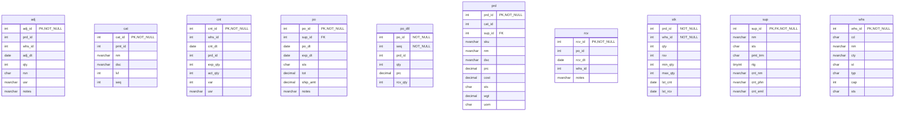
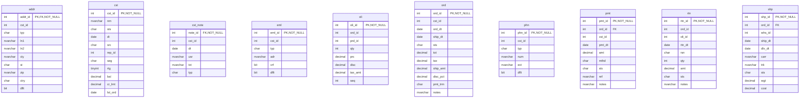

# Database Documentation: LousyDB

**Server**: localhost
**Generated**: 2025-11-09T03:58:50.228Z
**Total Iterations**: 50

## Analysis Summary

- **Status**: converged
- **Iterations**: 50
- **Tokens Used**: 252,435
- **Estimated Cost**: $0.00
- **AI Model**: openai/gpt-oss-120b
- **AI Vendor**: GroqLLM
- **Temperature**: 0.1
- **Convergence**: Reached maximum iteration limit (50)

## Table of Contents

### [inv](#schema-inv) (10 tables)
- [adj](#adj)
- [cat](#cat)
- [cnt](#cnt)
- [po](#po)
- [po_dtl](#po-dtl)
- [prd](#prd)
- [rcv](#rcv)
- [stk](#stk)
- [sup](#sup)
- [whs](#whs)

### [sales](#schema-sales) (10 tables)
- [addr](#addr)
- [cst](#cst)
- [cst_note](#cst-note)
- [eml](#eml)
- [oli](#oli)
- [ord](#ord)
- [phn](#phn)
- [pmt](#pmt)
- [rtn](#rtn)
- [shp](#shp)

## Schema: inv

### Entity Relationship Diagram

### Tables

#### adj

The inv.adj table records inventory adjustments made to products in specific warehouses, capturing the date, quantity change, reason, responsible user and optional notes.

**Row Count**: 300
**Dependency Level**: 0

**Confidence**: 96%

**Columns**:

| Column | Type | Description |
|--------|------|-------------|
| adj_id | int (PK, NOT NULL) | Unique identifier for each inventory adjustment record |
| prd_id | int | Identifier of the product whose inventory is being adjusted |
| whs_id | int | Identifier of the warehouse where the adjustment occurred |
| adj_dt | date | Date the adjustment was recorded |
| qty | int | Quantity change; positive for additions, negative for reductions |
| rsn | char | Reason code for the adjustment (STL=Stolen, EXP=Expired, DAM=Damaged, COR=Correction) |
| usr | nvarchar | Name of the user who performed the adjustment |
| notes | nvarchar | Free‑text comment describing the adjustment context |

#### cat

A hierarchical lookup table that defines inventory categories and sub‑categories used throughout the system. Each row represents a category (cat_id) with an optional parent category (prnt_id), a name (nm), a description (dsc), a level indicator (lvl), and a display order (seq).

**Row Count**: 20
**Dependency Level**: 0

**Confidence**: 96%

**Columns**:

| Column | Type | Description |
|--------|------|-------------|
| cat_id | int (PK, NOT NULL) | Unique identifier for each category record. |
| prnt_id | int | Reference to the parent category's cat_id; null or absent for top‑level categories. |
| nm | nvarchar | Short name of the category (e.g., "Writing", "Printers"). |
| dsc | nvarchar | Longer description providing details about the category. |
| lvl | int | Hierarchy level indicator: 1 for top‑level categories, 2 for sub‑categories. |
| seq | int | Display order or sequence number within its level. |

#### cnt

The table stores inventory count records, capturing the expected and actual quantities of each product at a specific warehouse on a given date, along with the variance and the user who performed the count.

**Row Count**: 250
**Dependency Level**: 0

**Confidence**: 96%

**Columns**:

| Column | Type | Description |
|--------|------|-------------|
| cnt_id | int (PK, NOT NULL) | Primary key for each inventory count entry |
| whs_id | int | Identifier of the warehouse where the count was taken |
| cnt_dt | date | Date on which the inventory count was performed |
| prd_id | int | Identifier of the product being counted |
| exp_qty | int | System‑recorded expected quantity for the product at that warehouse on that date |
| act_qty | int | Physical quantity actually counted during the inventory check |
| var | int | Variance between expected and actual quantities (act_qty - exp_qty) expressed in units |
| usr | nvarchar | Name of the user/employee who performed the count |

#### po

Stores purchase order records, each representing an order placed with a supplier, including order dates, expected delivery, status, total amount, shipping charge, and optional notes.

**Row Count**: 150
**Dependency Level**: 0

**Confidence**: 96%

**Columns**:

| Column | Type | Description |
|--------|------|-------------|
| po_id | int (PK, NOT NULL) | Unique identifier for each purchase order. |
| sup_id | int (FK) | Reference to the supplier from which the order is placed. |
| po_dt | date | Date the purchase order was created. |
| exp_dt | date | Expected delivery date for the order. |
| sts | char | Current status of the purchase order (e.g., X=Cancelled, S=Shipped, R=Received, P=Pending, A=Approved). |
| tot | decimal | Total monetary amount of the purchase order. |
| ship_amt | decimal | Shipping charge applied to the order; 0 for standard shipping, 150 for expedited shipping. |
| notes | nvarchar | Optional free‑text notes about the order, frequently indicating expedited shipping requests. |

#### po_dtl

Stores the line‑item details of purchase orders, linking each PO to a product, the ordered quantity, unit price, and the quantity actually received.

**Row Count**: 750
**Dependency Level**: 0

**Confidence**: 96%

**Columns**:

| Column | Type | Description |
|--------|------|-------------|
| po_id | int (NOT NULL) | Identifier of the purchase order header this line belongs to |
| seq | int (NOT NULL) | Line sequence number within the purchase order |
| prd_id | int | Identifier of the product being ordered |
| qty | int | Quantity ordered for the line item |
| prc | decimal | Unit price of the product for this line item |
| rcv_qty | int | Quantity actually received for the line item |

#### prd

A product master table storing detailed information about each inventory item, including its unique identifier, category, supplier, SKU, name, description, pricing, cost, status, weight and unit of measure.

**Row Count**: 177
**Dependency Level**: 0

**Confidence**: 96%

**Columns**:

| Column | Type | Description |
|--------|------|-------------|
| prd_id | int (PK, NOT NULL) | Unique product identifier (primary key) |
| cat_id | int | Reference to product category (likely foreign key to inv.cat) |
| sup_id | int (FK) | Supplier identifier linking to inv.sup table |
| sku | nvarchar | Stock Keeping Unit code, a unique alphanumeric identifier for the product |
| nm | nvarchar | Product name or title |
| dsc | nvarchar | Short description of the product |
| prc | decimal | Selling price of the product |
| cost | decimal | Acquisition or cost price of the product |
| sts | char | Current status of the product (A=Active, O=Out of stock, D=Discontinued) |
| wgt | decimal | Weight of the product in appropriate units |
| uom | char | Unit of measure for inventory transactions (EA=Each, BX=Box, CS=Case) |

#### rcv

Stores records of goods received against purchase orders, capturing the receipt date, receiving warehouse, and any notes (e.g., partial shipments). Each row represents a receipt event linked to a specific purchase order.

**Row Count**: 120
**Dependency Level**: 0

**Confidence**: 96%

**Columns**:

| Column | Type | Description |
|--------|------|-------------|
| rcv_id | int (PK, NOT NULL) | Primary key uniquely identifying each receipt record. |
| po_id | int | Identifier of the purchase order associated with the receipt, likely a foreign key to inv.po. |
| rcv_dt | date | Date the goods were received into inventory. |
| whs_id | int | Identifier of the warehouse where the receipt was logged, likely referencing inv.whs. |
| notes | nvarchar | Optional free‑text notes about the receipt, commonly indicating partial shipments and backorders. |

#### stk

Stores inventory stock information for each product at each warehouse, including on‑hand quantity, reserved quantity, reorder thresholds, and dates of last count and receipt

**Row Count**: 1120
**Dependency Level**: 0

**Confidence**: 96%

**Columns**:

| Column | Type | Description |
|--------|------|-------------|
| prd_id | int (NOT NULL) | Identifier of the product; links to inv.prd |
| whs_id | int (NOT NULL) | Identifier of the warehouse; links to inv.whs |
| qty | int | Current on‑hand quantity of the product at the warehouse |
| rsv | int | Quantity of the product that is reserved for pending orders |
| min_qty | int | Minimum desired stock level (reorder point) for the product at the warehouse |
| max_qty | int | Maximum allowable stock level (capacity or safety stock ceiling) for the product at the warehouse |
| lst_cnt | date | Date of the most recent physical inventory count for the product at the warehouse |
| lst_rcv | date | Date of the most recent receipt (stock replenishment) for the product at the warehouse |

#### sup

Supplier master table storing each supplier’s core information, including identifier, company name, status, payment terms, rating, and primary contact details.

**Row Count**: 25
**Dependency Level**: 0

**Confidence**: 96%

**Columns**:

| Column | Type | Description |
|--------|------|-------------|
| sup_id | int (PK, FK, NOT NULL) | Surrogate primary key for the supplier record |
| nm | nvarchar | Legal or trade name of the supplier company |
| sts | char | Current status of the supplier (e.g., A=Active, I=Inactive, T=Terminated, S=Suspended) |
| pmt_trm | char | Standard payment terms offered to the supplier (e.g., Net 30, Net 60, COD) |
| rtg | tinyint | Supplier rating on a 1‑5 scale reflecting performance or reliability |
| cnt_nm | nvarchar | Name of the primary contact person for the supplier |
| cnt_phn | nvarchar | Phone number of the primary contact |
| cnt_eml | nvarchar | Email address of the primary contact |

#### whs

Stores master data for each warehouse in the inventory system, including its identifier, location codes, name, city, state, type, capacity and operational status.

**Row Count**: 8
**Dependency Level**: 0

**Confidence**: 96%

**Columns**:

| Column | Type | Description |
|--------|------|-------------|
| whs_id | int (PK, NOT NULL) | Unique integer identifier for the warehouse (primary key). |
| cd | char | Three‑letter location code (often airport code) for the warehouse. |
| nm | nvarchar | Full descriptive name of the warehouse, including city and function. |
| cty | nvarchar | City where the warehouse is located. |
| st | char | Two‑letter state abbreviation for the warehouse location. |
| typ | char | Warehouse type/category (e.g., R=Regional, D=Distribution, M=Manufacturing). |
| cap | int | Maximum storage capacity of the warehouse (units such as square feet or pallets). |
| sts | char | Operational status of the warehouse (A=Active, M=Maintenance/Inactive). |

## Schema: sales

### Entity Relationship Diagram

### Tables

#### addr

Stores customer-specific address records, linking each address to a customer and classifying it by type (shipping, billing, office) with full street details and a default flag.

**Row Count**: 800
**Dependency Level**: 0

**Confidence**: 93%

**Columns**:

| Column | Type | Description |
|--------|------|-------------|
| addr_id | int (PK, FK, NOT NULL) | Unique identifier for the address record, also a foreign key to the master address table sales.addr |
| cst_id | int | Identifier of the customer to which the address belongs, likely a foreign key to sales.cst |
| typ | char | Code indicating the address purpose: S=Shipping, O=Office, B=Billing |
| ln1 | nvarchar | First line of the street address (street number and name) |
| ln2 | nvarchar | Second address line, usually suite or apartment number; optional (75% null) |
| cty | nvarchar | City name of the address |
| st | char | Two‑letter US state abbreviation |
| zip | nvarchar | 5‑digit ZIP code for the address |
| ctry | char | Country code, always 'US' |
| dflt | bit | Boolean flag indicating if this is the customer's default address |

#### cst

This table stores master records for customers, capturing their identity, contact details, status, acquisition source, assigned sales representative, market segment, rating, financial balance, credit limit and the date of their most recent order.

**Row Count**: 500
**Dependency Level**: 0

**Confidence**: 96%

**Columns**:

| Column | Type | Description |
|--------|------|-------------|
| cst_id | int (PK, NOT NULL) | Unique customer identifier (primary key). |
| nm | nvarchar | Customer's legal or trade name. |
| sts | char | Current status of the customer (e.g., A=Active, S=Suspended, I=Inactive, T=Terminated). |
| dt | date | Date the customer record was created or the customer was onboarded. |
| src | char | Acquisition source code (WB=Web, ST=Store, RF=Referral, PH=Phone). |
| rep_id | int | Identifier of the sales representative responsible for the customer. |
| seg | char | Market segment classification (W=Wholesale, R=Retail, E=Enterprise). |
| rtg | tinyint | Customer rating or priority level ranging from 1 (lowest) to 5 (highest). |
| bal | decimal | Current account balance (outstanding amount owed or credit). |
| cr_lmt | decimal | Approved credit limit for the customer. |
| lst_ord | date | Date of the most recent order placed by the customer (nullable). |

#### cst_note

Stores individual customer interaction notes, capturing when (dt), who (usr), what was said (txt) and the type of interaction (typ) for each unique note linked to a specific customer.

**Row Count**: 450
**Dependency Level**: 0

**Confidence**: 94%

**Columns**:

| Column | Type | Description |
|--------|------|-------------|
| note_id | int (FK, NOT NULL) | Primary key of the note record; uniquely identifies each interaction entry. |
| cst_id | int | Identifier of the customer to whom the note pertains. |
| dt | date | Date of the interaction or when the note was recorded. |
| usr | nvarchar | Name of the employee or system user who created the note. |
| txt | nvarchar | Full text describing the interaction or communication with the customer. |
| typ | char | Single‑character code indicating the interaction type: M=Meeting, E=Email, O=Other, C=Call. |

#### eml

Stores email address records for customers, including address type, verification status, and default flag

**Row Count**: 550
**Dependency Level**: 0

**Confidence**: 96%

**Columns**:

| Column | Type | Description |
|--------|------|-------------|
| eml_id | int (PK, NOT NULL) | Unique identifier for each email record |
| cst_id | int | Identifier of the customer to which the email belongs |
| typ | char | Category of the email address (e.g., Work, Personal, Other) |
| adr | nvarchar | The actual email address string |
| vrf | bit | Flag indicating whether the email address has been verified |
| dflt | bit | Flag indicating if this email is the default/primary address for the customer |

#### oli

Stores individual line items for sales orders, capturing which product was ordered, quantity, pricing, discounts, tax, and the line sequence within each order.

**Row Count**: 6998
**Dependency Level**: 0

**Confidence**: 96%

**Columns**:

| Column | Type | Description |
|--------|------|-------------|
| oli_id | int (PK, NOT NULL) | Unique identifier for each order line item (primary key). |
| ord_id | int | Identifier of the sales order to which the line belongs (foreign key to sales.ord). |
| prd_id | int | Identifier of the product being sold (foreign key to inv.prd). |
| qty | int | Quantity of the product ordered on this line. |
| prc | decimal | Unit price of the product before discounts and taxes. |
| disc | decimal | Discount amount applied to this line (may be zero). |
| tax_amt | decimal | Tax amount calculated for this line item. |
| seq | int | Sequence number of the line within the order (line position). |

#### ord

The sales.ord table is the master header for sales orders, storing each order’s identifier, customer reference, order and ship dates, status, total amounts, tax, shipping cost, discount percentage, payment terms, and optional notes. Each order can have up to six line‑item rows in the order‑line table, may have multiple payment records (supporting split or partial payments and refunds), is linked to return records, and has a one‑to‑one relationship with a shipment record.

**Row Count**: 2000
**Dependency Level**: 0

**Confidence**: 99%

**Columns**:

| Column | Type | Description |
|--------|------|-------------|
| ord_id | int (PK, NOT NULL) | Unique identifier for each sales order (order header). |
| cst_id | int | Foreign key reference to the customer who placed the order. |
| ord_dt | date | Date the order was created or entered into the system. |
| ship_dt | date | Date the order was shipped; null for orders not yet shipped (≈40% null). |
| sts | char | Current status of the order (e.g., D=Draft, C=Cancelled, S=Shipped, P=Processed, X=Exception). |
| tot | decimal | Total order amount before tax and shipping. |
| tax | decimal | Tax amount applied to the order. |
| ship_amt | decimal | Flat shipping charge applied to the order (0, 15, or 25). |
| disc_pct | decimal | Discount percentage applied to the order (0% or 10%). |
| pmt_trm | char | Payment terms for the order (Net 30, Net 45, Net 60, or Cash on Delivery). |
| notes | nvarchar | Optional free‑text note; currently only used for "Rush order - expedited shipping" and mostly null. |

#### phn

Stores phone contact information for customers, including multiple numbers per customer with type, optional extension, and a flag indicating the default number.

**Row Count**: 600
**Dependency Level**: 0

**Confidence**: 96%

**Columns**:

| Column | Type | Description |
|--------|------|-------------|
| phn_id | int (PK, NOT NULL) | Unique identifier for each phone record |
| cst_id | int | Identifier of the customer to whom the phone number belongs |
| typ | char | Phone type code (W=Work, M=Mobile, H=Home, F=Fax) |
| num | nvarchar | The phone number value, stored as free‑form text to accommodate various formatting styles |
| ext | nvarchar | Optional telephone extension, applicable mainly to work numbers; nullable for most records |
| dflt | bit | Boolean flag indicating whether this number is the customer's default contact number |

#### pmt

Stores individual payment transactions linked to sales orders, capturing when, how much, and by what method a customer paid, along with status, reference code and optional notes.

**Row Count**: 2200
**Dependency Level**: 0

**Confidence**: 96%

**Columns**:

| Column | Type | Description |
|--------|------|-------------|
| pmt_id | int (PK, NOT NULL) | Unique identifier for each payment record |
| ord_id | int (FK) | Identifier of the order this payment is applied to |
| cst_id | int | Identifier of the customer who made the payment |
| pmt_dt | date | Date the payment was received or recorded |
| amt | decimal | Monetary amount of the payment |
| mthd | char | Payment method code (WR=Wire, CA=Cash, CK=Check, CC=Credit Card) |
| sts | char | Current status of the payment (A=Approved, F=Failed, P=Pending, R=Refunded) |
| ref | nvarchar | System‑generated reference number for the payment |
| notes | nvarchar | Optional free‑text note, commonly "Account credit applied" |

#### rtn

Stores individual product return records linked to orders, capturing return date, reason, quantity, amount, status and notes.

**Row Count**: 150
**Dependency Level**: 0

**Confidence**: 96%

**Columns**:

| Column | Type | Description |
|--------|------|-------------|
| rtn_id | int (PK, NOT NULL) | Unique identifier for each return transaction |
| ord_id | int | Identifier of the original order to which the return belongs |
| oli_id | int | Identifier of the specific order line item being returned |
| rtn_dt | date | Date the return was recorded |
| rsn | char | Reason code for the return (WRG=Wrong item, DOA=Dead on arrival, DMG=Damaged, CHG=Customer changed mind) |
| qty | int | Quantity of items returned |
| amt | decimal | Monetary amount refunded or credited for the return |
| sts | char | Current status of the return process (A=Approved, R=Rejected, P=Pending, C=Completed) |
| notes | nvarchar | Free‑text comment providing additional details about the return |

#### shp

Stores shipment records for customer orders, capturing when items were shipped, delivered, the carrier used, tracking number, weight, cost and status, linking each shipment to an order and a warehouse.

**Row Count**: 1500
**Dependency Level**: 0

**Confidence**: 96%

**Columns**:

| Column | Type | Description |
|--------|------|-------------|
| shp_id | int (PK, NOT NULL) | Unique identifier for each shipment record. |
| ord_id | int (FK) | Identifier of the order that this shipment fulfills. |
| whs_id | int | Warehouse from which the shipment originated. |
| ship_dt | date | Date the items were shipped. |
| dlv_dt | date | Actual delivery date; may be null if not yet delivered. |
| carr | nvarchar | Carrier used for the shipment (e.g., USPS Priority, DHL Express). |
| trk | nvarchar | Tracking number assigned by the carrier. |
| sts | char | Current shipment status (D=Delivered, N=Not shipped, S=Shipped, P=Pending). |
| wgt | decimal | Weight of the shipment (likely in pounds or kilograms). |
| cost | decimal | Shipping cost charged for the shipment. |

---

## Appendix: Iteration Analysis

This section documents the iterative refinement process used to generate the database documentation, highlighting corrections and improvements discovered through backpropagation.

### Summary

- **Total Tables with Refinements**: 20
- **Total Columns with Refinements**: 162
- **Total Refinement Iterations**: 299
- **Refinements Triggered by Backpropagation**: 8

### Tables Refined Through Iteration

#### [adj](#adj)

**Iterations**: 3 | **Trigger**: refinement

**Iteration 1** (initial):

> This table records inventory adjustments made to products at specific warehouses, capturing when the adjustment occurred, the quantity change, the reason for the change, the user who performed it, and any explanatory notes.

*Reasoning*: The column names adj_id, prd_id, whs_id, adj_dt, qty, rsn, usr and notes together describe a typical inventory adjustment log. adj_id is a unique identifier (300 distinct values). prd_id and whs_id have low cardinality and match typical foreign keys to product (inv.prd) and warehouse (inv.whs) tables. adj_dt is a date of the adjustment. qty contains positive and negative integers indicating stock increase or decrease. rsn holds four short codes (EXP, DAM, COR, STL) that correspond to common adjustment reasons (expired, damaged, correction, stolen). usr stores the name of the employee making the entry. notes provides free‑text explanations, matching the adjustment reasons. No foreign key constraints are defined, but the pattern clearly indicates a foundational inventory adjustment table (inv.adj).

---

**Iteration 2** (refinement):

> Inventory adjustments table recording changes to product stock levels per warehouse, including reasons, quantities, dates, and the user who performed the adjustment.

*Reasoning*: The primary key adj_id uniquely identifies each adjustment. Columns prd_id and whs_id correspond to product and warehouse identifiers (matching other tables inv.prd and inv.whs). adj_dt stores the date of the adjustment. qty holds positive or negative numbers indicating stock increase or decrease. rsn contains a short code (STL, EXP, DAM, COR) representing common adjustment reasons such as theft, expiration, damage, or correction. usr records the employee name making the entry. notes provides a free‑text explanation. The lack of foreign key metadata but the distinct low‑cardinality values and enum‑like patterns confirm this purpose.

---

**Iteration 3** (refinement):

> The inv.adj table records inventory adjustments made to products in specific warehouses, capturing the date, quantity change, reason, responsible user and optional notes.

*Reasoning*: Column names adj_id (primary key), prd_id, whs_id, adj_dt, qty, rsn, usr, notes together describe an adjustment transaction. Sample data shows unique adjustment IDs, dates in 2024, positive and negative qty values, reason codes (STL, EXP, DAM, COR) and user names. The presence of product and warehouse IDs implies links to inv.prd and inv.whs even though foreign keys are not declared.

#### [cat](#cat)

**Iterations**: 3 | **Trigger**: refinement

**Iteration 1** (initial):

> A hierarchical lookup table that defines inventory categories and sub‑categories, storing each category's unique ID, optional parent ID, name, description, hierarchy level, and display order.

*Reasoning*: The columns cat_id (unique int) and nm (unique names) indicate a primary identifier for each category. prnt_id repeats only six distinct values, matching a subset of cat_id values, suggesting a self‑referencing foreign key to represent parent categories. lvl contains only 1 or 2, confirming a two‑level hierarchy (top‑level vs sub‑category). seq provides ordering within a parent. The sample names (Writing, Supplies, Storage, etc.) and descriptions (Office supplies, Furniture, etc.) are typical inventory classification data. No external foreign keys are present, matching the note that this is a foundational lookup table, likely the inv.cat table.

---

**Iteration 2** (refinement):

> A hierarchical lookup table that stores inventory categories and sub‑categories, defining each category's unique ID, optional parent category, name, description, hierarchy level, and display order.

*Reasoning*: Column names (cat_id, prnt_id, nm, dsc, lvl, seq) and data patterns indicate a self‑referencing category hierarchy. cat_id is a unique primary key (20 distinct values for 20 rows). prnt_id contains a limited set of values and is nullable, typical for a parent‑category foreign key. lvl only contains 1 or 2, confirming two hierarchy levels. nm and dsc hold distinct, descriptive text for each category. seq provides ordering within a level. No external foreign keys are present, matching the listed tables where inv.cat is a foundational lookup table.

---

**Iteration 3** (refinement):

> A hierarchical lookup table that defines inventory categories and sub‑categories used throughout the system. Each row represents a category (cat_id) with an optional parent category (prnt_id), a name (nm), a description (dsc), a level indicator (lvl), and a display order (seq).

*Reasoning*: The primary key cat_id is unique for all 20 rows, indicating an identifier. The column prnt_id contains a limited set of values and aligns with cat_id values, typical of a self‑referencing foreign key for hierarchy. lvl only has values 1 and 2, confirming two hierarchy levels (parent vs child). nm and dsc contain distinct, meaningful category names and descriptions such as "Writing", "Printers", "Cleaning supplies", matching typical inventory classification. seq provides ordering within each level. The table matches the known name inv.cat from the provided list, confirming it is the inventory categories lookup.

#### [cnt](#cnt)

**Iterations**: 3 | **Trigger**: refinement

**Iteration 1** (initial):

> The table stores periodic inventory count records (stock‑takes) for each product in each warehouse. Each row captures the expected quantity, the actual counted quantity, the resulting variance, the date of the count, and the user who performed it.

*Reasoning*: Column names and types point to an inventory counting process: cnt_id is a unique identifier; whs_id (values 1‑8) matches warehouse IDs; prd_id (200 distinct values) matches product IDs; cnt_dt is a date of the count; exp_qty and act_qty are numeric quantities; var holds small differences (0, 5, -5, -10) indicating variance; usr contains employee names. The lack of declared foreign keys but the presence of IDs that align with known tables (inv.whs, inv.prd) supports this interpretation.

---

**Iteration 2** (refinement):

> The table stores inventory count records, capturing the expected and actual quantities of each product at a specific warehouse on a given date, along with the variance and the user who performed the count.

*Reasoning*: Column names and types point to inventory tracking: cnt_id is a unique identifier, whs_id matches warehouse IDs (1‑8), cnt_dt is the count date, prd_id references product IDs, exp_qty and act_qty hold expected vs actual stock levels, var records the difference (0, ±5, ‑10), and usr records the employee performing the count. The lack of foreign keys but the presence of IDs that match other tables in the schema (inv.whs, inv.prd) confirms this is an inventory counting table, likely the inv.cnt table.

---

**Iteration 3** (refinement):

> The table stores inventory count records, capturing the expected and actual quantities of each product at a specific warehouse on a given date, along with the variance and the user who performed the count.

*Reasoning*: Column names and types point to inventory tracking: cnt_id is a unique identifier, whs_id matches warehouse IDs (1‑8), cnt_dt is the count date, prd_id aligns with product IDs, exp_qty and act_qty represent expected vs. actual stock levels, var holds the difference (0, -5, 5, -10), and usr records the employee performing the count. The lack of foreign keys but the presence of IDs that correspond to known tables (inv.whs, inv.prd) reinforces this interpretation.

#### [po](#po)

**Iterations**: 5 | **Trigger**: refinement

**Iteration 1** (initial):

> This table stores purchase order header records, capturing each order's unique identifier, the supplier it is placed with, order and expected delivery dates, current status, monetary totals, shipping fee, and optional notes such as expedited‑shipping requests.

*Reasoning*: Column names (po_id, sup_id, po_dt, exp_dt, sts, tot, ship_amt, notes) and their data types match a typical purchase‑order header. po_id is unique (150 distinct values) indicating a primary key. sup_id values correspond to supplier identifiers (25 distinct values) and align with the allowed parent table inv.sup. Date columns are clearly order and expected dates. sts contains a small set of single‑character codes (X,S,R,P,A) typical for status enums. tot is a decimal total amount, ship_amt is a binary fee (0 or 150) matching the presence of an "Expedited shipping requested" note that appears in ~32% of rows. No foreign keys are declared, but the naming and value patterns strongly imply relationships to inv.sup and child detail table inv.po_dtl.

---

**Iteration 2** (backpropagation):

> This table stores purchase order header records, capturing each order's unique identifier, the supplier it is placed with, order and expected delivery dates, current status, monetary totals, shipping fee, and optional notes. The notes column can contain expedited‑shipping requests as well as partial‑shipment or backorder information. Each purchase order can have up to seven line‑item detail rows in the child table inv.po_dtl (seq 1‑7) with quantities typically in fixed increments of 100‑400.

*Reasoning*: The analysis of related tables revealed that purchase orders are linked to a detail table that allows up to seven line items and that notes often record partial‑shipment or backorder situations. These details were not reflected in the original description, which only mentioned expedited‑shipping notes. Incorporating the line‑item limit and the broader use of the notes field provides a more accurate and complete picture of the table’s role.

---

**Iteration 3** (refinement):

> This table stores purchase order records for inventory procurement, capturing each order's unique identifier, supplier, order and expected delivery dates, status, total amount, shipping charge, and optional notes (e.g., expedited shipping).

*Reasoning*: The primary key po_id uniquely identifies each row (150 distinct values). The foreign key sup_id points to inv.sup, indicating the supplier of the order. po_dt and exp_dt are dates typical for order and expected receipt. sts contains single‑character status codes (X,S,R,P,A) suggesting order lifecycle states. tot is a monetary total, ship_amt is a flat shipping fee (0 or 150) that aligns with the presence of notes about expedited shipping. All columns together model a purchase order entity used in inventory management.

---

**Iteration 4** (backpropagation):

> The inv.po table stores purchase order records for inventory procurement, including a unique po_id, supplier reference (sup_id), order and expected delivery dates, status codes, total amount, shipping charge, and optional notes. Each purchase order typically comprises multiple line items (average ~5) stored in related tables, and the system supports partial receipt of orders, tracking backorders and incremental shipments as indicated by notes such as 'Partial shipment received - balance on backorder'.

*Reasoning*: New analysis of related tables showed that purchase orders have an average of five line‑item rows and that receipt notes frequently mention partial shipments and backorders. This reveals that inv.po is not only a header record but also participates in a multi‑item, partially‑fulfilled ordering process, which was not captured in the original description. Therefore the description was revised to include these relationships and behaviors.

---

**Iteration 5** (refinement):

> Stores purchase order records, each representing an order placed with a supplier, including order dates, expected delivery, status, total amount, shipping charge, and optional notes.

*Reasoning*: The primary key po_id is unique for 150 rows, indicating each row is a distinct purchase order. sup_id is a foreign key to inv.sup, confirming a supplier relationship. po_dt and exp_dt are dates with 100% uniqueness, typical for order and expected delivery dates. sts contains a small set of single‑character codes (X, S, R, P, A) suggesting order status. tot varies per row, representing the order total. ship_amt only has values 0 or 150, indicating a fixed shipping fee (likely for expedited shipping, matching the frequent note text). The notes column is mostly null but when present contains "Expedited shipping requested", reinforcing the shipping fee interpretation.

#### [po_dtl](#po-dtl)

**Iterations**: 3 | **Trigger**: refinement

**Iteration 1** (initial):

> Stores the line‑item details of purchase orders, linking each order (po_id) to a product (prd_id) with quantity ordered, unit price, and quantity received.

*Reasoning*: Column names po_id, seq, prd_id, qty, prc and rcv_qty match typical purchase‑order‑detail structures. po_id repeats across rows (150 distinct values for 750 rows) indicating a header‑detail relationship. seq values 1‑7 enumerate line positions, confirming a detail table. prd_id is unique per row, acting as part of a composite key. qty and rcv_qty contain limited, repeating values (100‑400) typical for order quantities. prc is unique per row, representing unit price. No foreign keys are declared, but the pattern strongly suggests links to inv.po (header) and inv.prd (product).

---

**Iteration 2** (refinement):

> Stores line‑item details for each purchase order, linking a purchase order (po_id) to a product (prd_id) with ordered quantity, unit price and received quantity.

*Reasoning*: Column po_id is a non‑null integer with 150 distinct values across 750 rows, indicating it groups multiple rows per purchase order. seq is a 1‑7 line sequence, typical for order line numbers. prd_id is a non‑null integer referencing a product. qty and rcv_qty contain a small set of possible values, typical for ordered and received quantities. prc is a decimal price per unit. The column pattern matches the structure of a purchase‑order‑detail table (inv.po_dtl) which would reference inv.po and inv.prd.

---

**Iteration 3** (refinement):

> Stores the line‑item details of purchase orders, linking each PO to a product, the ordered quantity, unit price, and the quantity actually received.

*Reasoning*: Column names po_id, seq, prd_id, qty, prc and rcv_qty together describe a typical purchase‑order‑detail structure. po_id is unique per order (150 distinct values for 750 rows, indicating many lines per order). seq ranges 1‑7, the line sequence within a PO. prd_id is a product key (200 distinct products). qty contains a small set of standard order quantities (100‑400). prc is a unique price per line. rcv_qty records how many units were received, with values both matching and deviating from qty, indicating partial receipts. The pattern matches the inv.po_dtl table in the schema list.

#### [prd](#prd)

**Iterations**: 3 | **Trigger**: refinement

**Iteration 1** (initial):

> Master table that stores detailed information about each product offered by the company, including identifiers, categorization, supplier reference, SKU, name, description, pricing, cost, status, weight and unit of measure.

*Reasoning*: The column names (prd_id, cat_id, sup_id, sku, nm, dsc, prc, cost, sts, wgt, uom) together with sample values clearly map to typical product‑master attributes: a unique product ID, category and supplier IDs, a SKU code, product name and description, selling price and acquisition cost, a status flag (A/O/D), weight and its unit. The high uniqueness of prd_id, sku, nm, and the presence of price‑related columns indicate this table is the central repository for product data used across inventory, purchasing and sales modules.

---

**Iteration 2** (refinement):

> Stores the master product catalog for the inventory system, defining each sellable item with its identifier, category, supplier, SKU, name, description, pricing, cost, status, weight and unit of measure.

*Reasoning*: The primary key prd_id uniquely identifies each row (177 unique values). cat_id links to inv.cat (product categories) and sup_id links to inv.sup (suppliers). Columns sku, nm and dsc contain typical product codes, names and descriptions. prc and cost represent selling price and acquisition cost. sts holds a three‑value status flag (A, O, D) common for Active/Obsolete/Discontinued. wgt and uom capture physical weight and unit of measure (EA, BX, CS). Sample data (e.g., "Steelcase Leap V2", "Apple MacBook Air M2", various SKUs) confirms a product master table.

---

**Iteration 3** (refinement):

> A product master table storing detailed information about each inventory item, including its unique identifier, category, supplier, SKU, name, description, pricing, cost, status, weight and unit of measure.

*Reasoning*: The primary key prd_id is unique for each of the 177 rows, indicating a master record. cat_id values (11 distinct) match typical product categories. sup_id is a foreign key to inv.sup, linking each product to its supplier. sku, nm and dsc contain product codes, names and descriptions. prc and cost hold selling price and acquisition cost. sts (A,O,D) reflects product status (Active, Out of stock, Discontinued). wgt and uom describe physical characteristics. All columns together form a classic product catalog used in inventory and sales processes.

#### [rcv](#rcv)

**Iterations**: 3 | **Trigger**: refinement

**Iteration 1** (initial):

> Stores records of goods received against purchase orders, capturing the receipt identifier, associated purchase order, receipt date, receiving warehouse, and optional notes (e.g., partial shipments and backorders).

*Reasoning*: Column names rcv_id (receipt ID), po_id (purchase order ID), rcv_dt (receipt date), whs_id (warehouse ID) and notes describing partial shipments directly indicate a receiving transaction log. rcv_id and po_id are unique per row, suggesting each receipt is tied to a single PO. whs_id has a limited set of values (1‑8) matching typical warehouse identifiers. The notes column is mostly null and contains a standard message about partial shipments, reinforcing the receipt context. No foreign keys are declared, but the naming aligns with the existing inv.po and inv.whs tables, implying logical relationships.

---

**Iteration 2** (refinement):

> Stores records of inventory receipts, capturing each time items from a purchase order are received into a warehouse, including receipt date, warehouse location, and any notes about partial shipments or backorders.

*Reasoning*: The primary key rcv_id uniquely identifies each receipt. The po_id column matches purchase order identifiers (likely foreign key to inv.po). rcv_dt records the receipt date. whs_id values correspond to warehouse IDs (possible values 1-8, matching inv.whs). The notes column consistently contains the phrase 'Partial shipment received - balance on backorder', indicating that receipts often represent partial deliveries. Together these columns describe a receiving transaction in the inventory domain.

---

**Iteration 3** (refinement):

> Stores records of goods received against purchase orders, capturing the receipt date, receiving warehouse, and any notes (e.g., partial shipments). Each row represents a receipt event linked to a specific purchase order.

*Reasoning*: Column names rcv_id (receipt identifier), po_id (purchase order reference), rcv_dt (receipt date), whs_id (warehouse identifier) and notes describing shipment status directly indicate a receiving transaction. rcv_id and po_id are both unique per row, suggesting each receipt is tied to a distinct PO. whs_id values (1‑8) match typical warehouse lookup tables. Sample notes consistently mention "Partial shipment received - balance on backorder," confirming the table tracks receipt details. No foreign keys are declared, but the naming aligns with the inv.po and inv.whs tables in the schema.

#### [stk](#stk)

**Iterations**: 3 | **Trigger**: refinement

**Iteration 1** (initial):

> Stores current inventory levels and related metrics for each product at each warehouse, including on‑hand quantity, reserved quantity, reorder thresholds, and the dates of the last physical count and last receipt.

*Reasoning*: The composite primary key (prd_id, whs_id) uniquely identifies a product‑warehouse pair. Column names qty (on‑hand), rsv (reserved), min_qty and max_qty (reorder thresholds) are typical inventory stock attributes. lst_cnt and lst_rcv are dates that match inventory count and receipt events. Sample values (e.g., qty values in the thousands, rsv in the hundreds) align with stock quantities. The presence of whs_id with only 8 distinct values suggests a limited set of warehouses, matching the inv.whs lookup table. Although no explicit foreign keys are declared, prd_id and whs_id logically reference inv.prd and inv.whs respectively, indicating this table is the stock ledger for the inventory domain.

---

**Iteration 2** (refinement):

> Stores inventory levels for each product at each warehouse, including on‑hand quantity, reserved quantity, reorder thresholds, and dates of last count and receipt.

*Reasoning*: Column names prd_id and whs_id identify product and warehouse keys. qty and rsv are typical stock and reserved amounts. min_qty and max_qty match reorder point and safety‑stock limits. lst_cnt and lst_rcv are dates of last physical count and last inbound receipt. Sample values (e.g., qty up to 11880, dates in recent months) fit inventory tracking. No foreign keys are declared, but the pattern aligns with an inventory stock table such as inv.stk.

---

**Iteration 3** (refinement):

> Stores inventory stock information for each product at each warehouse, including on‑hand quantity, reserved quantity, reorder thresholds, and dates of last count and receipt

*Reasoning*: Column names prd_id and whs_id suggest foreign keys to product (inv.prd) and warehouse (inv.whs). qty and rsv are typical inventory on‑hand and reserved amounts. min_qty and max_qty match common reorder level fields. lst_cnt and lst_rcv are dates of last physical count and last receipt. Distinct counts (200 product IDs, 8 warehouse IDs) and row count (1120) fit a product‑by‑warehouse matrix. No explicit FK metadata is present, but the pattern aligns with an inventory stock table (likely inv.stk).

#### [sup](#sup)

**Iterations**: 4 | **Trigger**: refinement

**Iteration 1** (initial):

> Master supplier table storing core information about each supplier, including identification, name, operational status, payment terms, rating, and primary contact details.

*Reasoning*: Column sup_id is a unique integer primary key (25 distinct values for 25 rows) indicating a supplier identifier. The nm column contains company names typical of suppliers. sts holds single‑character status codes (A, I, T, S) suggesting active/inactive/etc. pmt_trm stores standard payment term codes (N30, N60, N45, N15, COD). rtg is a numeric rating from 1 to 5. cnt_nm, cnt_phn, and cnt_eml are clearly contact name, phone, and email for the supplier’s representative. No foreign keys are defined, implying this is a foundational lookup table likely referenced by purchase‑order and receiving tables (e.g., inv.po, inv.rcv).

---

**Iteration 2** (backpropagation):

> Master supplier table that stores core information about each supplier—including identification, name, operational status, payment terms, rating, and primary contact details—and serves as the central supplier entity referenced by purchase order (inv.po), receiving (inv.rcv), and inventory stock (inv.stk) tables for downstream transactions.

*Reasoning*: The new insights confirm that sup_id values are used in multiple related tables, establishing a many‑to‑one relationship and explicitly identifying inv.po, inv.rcv, and inv.stk as referencing tables. While the original description captured the table’s core attributes, it did not mention these concrete relationships. Incorporating this information clarifies the table’s role as the master supplier entity within the schema.

---

**Iteration 3** (refinement):

> Stores master data for suppliers, including their unique identifier, company name, status, payment terms, rating, and primary contact details (name, phone, email). Serves as a reference for purchasing and inventory modules.

*Reasoning*: The primary key sup_id is unique for each row, indicating a supplier entity. Column nm contains company names typical of wholesale/distribution businesses. sts holds single‑character status codes (A, T, S, I) suggesting active/inactive/etc. pmt_trm lists payment terms (N30, N60, COD, etc.). rtg is a numeric rating from 1‑5. cnt_nm, cnt_phn, cnt_eml are clearly contact person information. No foreign keys are present, matching the listed inv.sup table as a foundational lookup.

---

**Iteration 4** (refinement):

> Supplier master table storing each supplier’s core information, including identifier, company name, status, payment terms, rating, and primary contact details.

*Reasoning*: The primary key sup_id uniquely identifies 25 rows, typical for a master entity. Column nm contains company names (e.g., "National Supply Partners"), indicating supplier names. sts holds single‑letter status codes (A, T, S, I) common for active/inactive flags. pmt_trm lists payment terms such as N30, N60, COD, confirming financial terms with suppliers. rtg is a numeric rating 1‑5. cnt_nm, cnt_phn, cnt_eml store a contact person’s name, phone and email, all unique per supplier, matching a supplier contact record. No foreign keys are defined, consistent with a foundational lookup table used by purchase‑order and receiving tables (inv.po, inv.rcv, etc.).

#### [whs](#whs)

**Iterations**: 3 | **Trigger**: refinement

**Iteration 1** (initial):

> Stores master data for each warehouse or distribution center used in the inventory system, including its identifier, code, name, location, type, capacity, and operational status.

*Reasoning*: The primary key whs_id uniquely identifies each record (8 distinct values). Columns cd, nm, cty, st contain city and state codes and full names, typical for location data. typ has low cardinality values (R, M, D) indicating warehouse type (e.g., Regional, Main, Distribution). cap holds numeric capacity figures. sts holds status flags (A=Active, M=Maintenance). The table name is likely inv.whs, matching the provided list of tables, confirming it as a foundational lookup for inventory operations.

---

**Iteration 2** (refinement):

> Stores master data for each warehouse in the inventory system, including its identifier, location codes, descriptive name, city, state, type, capacity and operational status.

*Reasoning*: The primary key whs_id uniquely identifies each record (8 distinct values for 8 rows). Columns cd, nm, cty, st contain location information (airport‑style codes, full names, city and state abbreviations) matching known US cities. typ has three distinct single‑letter values (R, M, D) suggesting a categorical warehouse type (e.g., Regional, Manufacturing, Distribution). cap holds large integer values that align with capacity figures. sts is a two‑value flag (A, M) typical for active/inactive status. No foreign keys are present, indicating this is a foundational lookup table, matching the listed inv.whs table name.

---

**Iteration 3** (refinement):

> Stores master data for each warehouse in the inventory system, including its identifier, location codes, name, city, state, type, capacity and operational status.

*Reasoning*: The primary key whs_id uniquely identifies each record (8 distinct values for 8 rows). Columns cd, cty, st contain standard location codes (airport codes, city names, state abbreviations) matching known US warehouse locations. The nm column holds descriptive warehouse names. typ has three distinct single‑letter values (R, M, D) typical for a type/category enum. cap holds large integer values consistent with storage capacity. sts has two values (A, M) indicating active or maintenance status. No foreign keys are present, matching the listed inv.whs table as a foundational lookup table.

#### [addr](#addr)

**Iterations**: 3 | **Trigger**: refinement

**Iteration 1** (initial):

> Stores mailing addresses associated with customers, including address lines, city, state, zip, country, address type (e.g., Shipping, Billing, Other) and a flag indicating the default address for the customer

*Reasoning*: Column names addr_id and cst_id form a composite primary key, indicating each row uniquely identifies an address for a specific customer. The typ column has values S,O,B which map to common address categories (Shipping, Other, Billing). ln1/ln2 hold street address lines, cty, st, zip, ctry store location details, and dflt marks the default address. Sample data shows realistic US street addresses and state abbreviations, confirming an address lookup table in the sales schema. No foreign keys are declared, but the presence of cst_id strongly suggests a relationship to the sales.cst (customer) table.

---

**Iteration 2** (refinement):

> Stores customer-specific address records, linking each address to a customer and indicating its type (shipping, billing, office) and whether it is the default for that customer.

*Reasoning*: The table has a primary key addr_id that also references sales.addr, indicating it extends a master address entity. The presence of cst_id suggests a link to a customer (sales.cst). The typ column with values S, O, B aligns with common address types (Shipping, Office, Billing). ln1, ln2, cty, st, zip, ctry capture full address details, and dflt marks the default address. High uniqueness of addr_id and zip, plus nullable ln2, support this interpretation.

---

**Iteration 3** (refinement):

> Stores customer-specific address records, linking each address to a customer and classifying it by type (shipping, billing, office) with full street details and a default flag.

*Reasoning*: The table has addr_id as PK and FK to sales.addr, indicating it extends a master address entity. cst_id aligns with customers (sales.cst). The typ column contains S,O,B values typical for address purpose codes. ln1/ln2, cty, st, zip, ctry hold standard address fields; ctry is always US. dflt is a bit flag marking the default address for a customer. Sample data (e.g., "651 Main Street", "Suite 409", state codes, ZIPs) supports an address use case.

#### [cst](#cst)

**Iterations**: 5 | **Trigger**: refinement

**Iteration 1** (initial):

> Master table of customers storing their identification, contact name, status, creation date, acquisition source, assigned sales representative, market segment, rating, current balance, credit limit, and date of last order.

*Reasoning*: The primary key cst_id uniquely identifies each row (500 unique values). The column nm contains person or company names, indicating a customer name. sts holds single‑character status codes (A, S, I, T) typical for active/inactive etc. dt is a unique date per row, likely the record creation or registration date. src contains source codes (WB, ST, RF, PH) suggesting acquisition channel. rep_id lists a small set of integers (1‑15) matching sales representative identifiers. seg (W, R, E) and rtg (1‑5) are low‑cardinality categorical fields, typical for market segment and rating. bal and cr_lmt are monetary fields representing current balance and credit limit. lst_ord records the most recent order date, nullable for customers without orders. These columns together form a classic customer master used in sales processes.

---

**Iteration 2** (backpropagation):

> Master customer table storing identification, contact name, status, creation date, acquisition source, assigned sales representative, market segment, rating, current balance, credit limit, and date of last order. The cst_id primary key is referenced by related tables such as sales.addr (multiple addresses per customer), sales.email (multiple email addresses), sales.phone (multiple phone numbers), sales.ord (multiple orders), sales.pay (payment history), and sales.note (single primary note), establishing it as the central entity in the sales domain.

*Reasoning*: The new insights do not contradict the original field‑level description but they reveal that cst_id is the hub for several one‑to‑many and one‑to‑one relationships (addresses, emails, phones, orders, payments, notes). Incorporating these relationships clarifies the table’s role as the primary customer master referenced throughout the sales schema, which was not explicit before.

---

**Iteration 3** (refinement):

> This table stores master records for individual or corporate customers, capturing their identity, contact name, status, registration date, acquisition source, assigned sales representative, market segment, rating, current balance, credit limit and the date of their most recent order.

*Reasoning*: The primary key cst_id uniquely identifies each customer (500 distinct values for 500 rows). The nm column holds the customer name. sts contains single‑character status codes (A, S, I, T) typical for Active/Suspended/Inactive/Terminated. dt is a unique date likely representing the registration or creation date. src lists acquisition channels (Web, Store, Referral, Phone). rep_id references one of 15 sales reps. seg (W,R,E) matches common market segments (Wholesale, Retail, Enterprise). rtg is a 1‑5 rating. bal and cr_lmt are monetary fields for current balance and credit limit. lst_ord records the most recent order date, nullable for customers without orders. No foreign keys are defined, indicating this is a foundational customer master table used by other sales modules.

---

**Iteration 4** (backpropagation):

> This table stores master records for individual or corporate customers, capturing core identity and account attributes such as customer name, status, registration date, acquisition source, assigned sales representative, market segment, rating, current balance, credit limit, and the date of the most recent order. It acts as the primary entity referenced by related tables that hold multiple email addresses and phone numbers per customer, each with type, optional verification, and a default flag indicating the primary contact method.

*Reasoning*: The new insights show that customers have multiple email and phone records stored in separate child tables, each with type and a default flag. This clarifies that the cst table does not contain these contact details but is the parent entity for them, which was not reflected in the original description. Adding this information improves the accuracy of the table’s role within the data model while the core attributes remain unchanged.

---

**Iteration 5** (refinement):

> This table stores master records for customers, capturing their identity, contact details, status, acquisition source, assigned sales representative, market segment, rating, financial balance, credit limit and the date of their most recent order.

*Reasoning*: The primary key cst_id uniquely identifies each row (500 distinct values for 500 rows). The name column (nm) holds customer names. sts contains single‑character status codes (A,S,I,T) typical for active/inactive states. dt holds a unique date per row, likely the customer creation or registration date. src lists acquisition channels (WB, ST, RF, PH) such as Web, Store, Referral, Phone. rep_id references a small set of 15 values, indicating assignment to sales reps. seg has three codes (W,R,E) matching common market segments (Wholesale, Retail, Enterprise). rtg is a 1‑5 rating. bal and cr_lmt are monetary fields for current balance and credit limit. lst_ord is a nullable date of the last order, confirming transactional activity. No foreign keys are defined, so this is a foundational lookup table for customers, likely the sales.cst table referenced by orders, payments, etc.

#### [cst_note](#cst-note)

**Iterations**: 2 | **Trigger**: refinement

**Iteration 1** (initial):

> Stores individual notes or interaction records for customers, capturing when, by whom, and what was communicated, along with a short type code indicating the interaction medium.

*Reasoning*: The columns note_id and cst_id are both unique identifiers, suggesting each row is a distinct note linked to a single customer (cst_id). The dt column records the date of the interaction, usr holds the employee name, txt contains the free‑text description of the contact, and typ is a single‑character code with possible values M, E, O, C that map to common contact types (Meeting, Email, Other, Call). The presence of a customer identifier (cst_id) aligns with the known table sales.cst_note, indicating this table is a child of the sales.cst (customer) table.

---

**Iteration 2** (refinement):

> Stores individual customer interaction notes, capturing when (dt), who (usr), what was said (txt) and the type of interaction (typ) for each unique note linked to a specific customer.

*Reasoning*: The table contains a unique note_id and a unique cst_id, indicating a one‑to‑one relationship between a note and a customer. The dt column holds dates, usr holds employee names, txt holds free‑form interaction text, and typ holds a single‑character code with values M, E, O, C that map to common contact methods (Meeting, Email, Call, Other). The foreign key from note_id to sales.cst_note.cst_id confirms this table is a child of the sales.cst_note entity, extending it with detailed log data.

#### [eml](#eml)

**Iterations**: 2 | **Trigger**: refinement

**Iteration 1** (initial):

> Stores email addresses associated with customers, including the address, its type (work, personal, other), verification status, and whether it is the default email for the customer.

*Reasoning*: The columns eml_id and cst_id form a composite primary key, indicating each row uniquely identifies an email for a specific customer. The adr column contains email strings, typ has three distinct single‑character values (W, P, O) matching common email type codes, and vrf/dflt are boolean flags for verification and default status. The presence of cst_id strongly suggests a link to the sales.cst (customer) table, even though no explicit foreign key is listed.

---

**Iteration 2** (refinement):

> Stores email address records for customers, including address type, verification status, and default flag

*Reasoning*: Column names and sample data indicate email information: eml_id is a unique primary key; cst_id links to a customer (likely sales.cst); typ has values W,P,O suggesting Work, Personal, Other; adr contains email strings; vrf is a boolean indicating if the email has been verified; dflt marks the primary/default email for the customer. No foreign keys are defined, but the pattern matches the sales.eml table listed among possible tables.

#### [oli](#oli)

**Iterations**: 3 | **Trigger**: refinement

**Iteration 1** (initial):

> Stores individual line items for sales orders, capturing which product was ordered, the quantity, pricing, discounts, tax, and the line's position within the order.

*Reasoning*: Column names (oli_id, ord_id, prd_id, qty, prc, disc, tax_amt, seq) directly map to typical order‑line attributes. oli_id is a unique surrogate key (6998 distinct values). ord_id and prd_id each have many distinct values, matching order and product identifiers. qty has only 10 distinct values (1‑10) indicating a quantity enum. seq has exactly six possible values (1‑6), suggesting a maximum of six items per order. Sample monetary values (prc, disc, tax_amt) align with price, discount, and tax amounts. No foreign keys are declared, but the naming convention aligns with sales.ord (order header) and inv.prd (product catalog).

---

**Iteration 2** (backpropagation):

> Stores individual line items for sales orders, capturing which product was ordered, the quantity, pricing, discounts, tax, and the line's position within the order, and serves as the source record that return transactions reference to link each return back to its original order line item.

*Reasoning*: The new insight that oli_id is used by the returns table to reference individual order line items adds a clear parent‑child relationship. While this does not contradict the original description, it expands the table's role: it is not only a detail record for orders but also the authoritative source for return processing. Incorporating this relationship makes the description more complete and accurate.

---

**Iteration 3** (refinement):

> Stores individual line items for sales orders, capturing which product was ordered, quantity, pricing, discounts, tax, and the line sequence within each order.

*Reasoning*: Column names and patterns (oli_id primary key, ord_id linking to an order, prd_id linking to a product, qty, prc, disc, tax_amt, seq) together with sample values (e.g., oli_id unique per row, ord_id 200 unique orders, prd_id 200 distinct products, seq values 1‑6) indicate this table records the details of each product on a sales order.

#### [ord](#ord)

**Iterations**: 4 | **Trigger**: backpropagation

**Iteration 1** (initial):

> Stores sales order header records, capturing each order's identifier, customer, dates, status, financial totals, shipping details, discounts, payment terms, and optional notes.

*Reasoning*: Column names (ord_id, cst_id, ord_dt, ship_dt, sts, tot, tax, ship_amt, disc_pct, pmt_trm, notes) and their data types match typical order header data. ord_id is unique per row, cst_id repeats (476 distinct values for 2000 rows) indicating many orders per customer. sts contains five distinct single‑character codes (D, C, S, P, X) consistent with order lifecycle statuses. pmt_trm values (N30, COD, N60, N45) are common payment terms. ship_amt has only three values (0,15,25) and disc_pct only 0 or 10, typical for shipping fees and discount flags. notes are mostly null except for a repeated "Rush order - expedited shipping" comment, a typical order‑level remark. No foreign keys are declared, but the presence of cst_id strongly suggests a link to the sales.cst customer table.

---

**Iteration 2** (backpropagation):

> Stores sales order header records, capturing each order's identifier, customer, order and ship dates, status, financial totals, shipping amount, discount percentage, payment terms, and optional notes. It acts as the parent for up to six line‑item rows (seq 1‑6), multiple payment records, related return records, and a one‑to‑one shipping record stored in a separate table.

*Reasoning*: The new insights reveal explicit relationships: line‑item details are in a child table (seq 1‑6), payments reference the order, returns are linked to it, and shipping information resides in a separate one‑to‑one table. The original description implied shipping details were stored here, which is inaccurate. Incorporating these relationships clarifies the table’s role as a pure order header and improves accuracy.

---

**Iteration 3** (refinement):

> This table stores the header information for sales orders, capturing each order's identifier, customer reference, dates, status, financial totals, shipping details, discounts, payment terms, and optional notes such as rush‑order flags.

*Reasoning*: Column names and types (ord_id PK, cst_id, ord_dt, ship_dt, sts, tot, tax, ship_amt, disc_pct, pmt_trm, notes) match a typical order‑header structure. The primary key ord_id is unique for all 2,000 rows. cst_id shows 476 distinct values, indicating many‑to‑one relationship to a customer entity. Date columns, status codes (D,C,S,P,X), monetary fields, low‑cardinality enums (ship_amt, disc_pct, pmt_trm) and a notes field with a single repeated value all point to order processing in a sales domain.

---

**Iteration 4** (backpropagation):

> The sales.ord table is the master header for sales orders, storing each order’s identifier, customer reference, order and ship dates, status, total amounts, tax, shipping cost, discount percentage, payment terms, and optional notes. Each order can have up to six line‑item rows in the order‑line table, may have multiple payment records (supporting split or partial payments and refunds), is linked to return records, and has a one‑to‑one relationship with a shipment record.

*Reasoning*: New insights show that ord is linked to line‑item rows (up to six per order), multiple payment rows, return rows, and exactly one shipment row. These relationships were not mentioned in the original description, so the understanding is expanded to reflect its role as a master order header connected to these child tables.

#### [phn](#phn)

**Iterations**: 2 | **Trigger**: refinement

**Iteration 1** (initial):

> Stores phone contact information for customers, including phone number, type (mobile, work, home, fax), optional extension, and a flag indicating the default/primary number for each customer.

*Reasoning*: Column names and data patterns point to phone data: phn_id is a unique identifier, cst_id links to a customer (sales.cst), typ has four distinct single‑letter values matching common phone types (W, M, H, F), num contains phone‑number formatted strings, ext holds short numeric extensions and is mostly null, and dflt is a boolean marking the default contact number. The table has no foreign keys defined here but its naming and column semantics align with the sales.phn table listed among allowed names.

---

**Iteration 2** (refinement):

> Stores phone contact information for customers, including multiple numbers per customer with type, optional extension, and a flag indicating the default number.

*Reasoning*: The primary key phn_id uniquely identifies each row. cst_id matches the customer identifier (likely referencing sales.cst). The typ column has values W,M,H,F which correspond to common phone types (Work, Mobile, Home, Fax). The num column contains phone numbers in various formats, confirming it stores phone numbers. ext holds short numeric extensions and is mostly null, typical for work numbers. dflt is a boolean indicating which number is the default for the customer. No foreign keys are defined, but the pattern matches a child table of sales.cst.

#### [pmt](#pmt)

**Iterations**: 2 | **Trigger**: refinement

**Iteration 1** (initial):

> Stores individual payment transactions made by customers for orders, including amount, date, method, status, and reference information.

*Reasoning*: The table contains a primary key pmt_id, foreign‑key‑like columns ord_id (order) and cst_id (customer), a payment date, amount, method codes (WR, CA, CK, CC), status codes (A, F, P, R), and a reference string prefixed with PMT-. These patterns match a typical payments ledger in a sales system.

---

**Iteration 2** (refinement):

> Stores individual payment transactions linked to sales orders, capturing when, how much, and by what method a customer paid, along with status, reference code and optional notes.

*Reasoning*: The primary key pmt_id uniquely identifies each row (2200 unique values). ord_id is a foreign key to sales.ord, indicating each payment belongs to an order. cst_id links to a customer (likely sales.cst). Columns pmt_dt, amt, mthd, sts, ref, and notes contain typical payment attributes (date, amount, method codes WR/CA/CK/CC, status codes A/F/P/R, system‑generated reference like "PMT-2024-01517"). High cardinality of pmt_id, ref and amt confirms each row is a distinct transaction. Nulls only on ord_id (10%) and notes (90%), matching optional linkage and optional comment field. The table resides in the sales schema (sales.pmt) per the allowed list.

#### [rtn](#rtn)

**Iterations**: 2 | **Trigger**: refinement

**Iteration 1** (initial):

> This table records product returns linked to original sales orders. Each row captures a unique return (rtn_id) for a specific order (ord_id) and line item (oli_id), including the return date, reason, quantity, monetary amount, processing status, and optional notes.

*Reasoning*: The primary‑key columns rtn_id, ord_id and oli_id uniquely identify a return and tie it to an order and its line item. The column names (rtn_dt, rsn, qty, amt, sts, notes) and their sample values (e.g., reasons WRG, DOA, DMG, CHG; statuses A,R,P,C) match typical return‑processing data. The table appears in the provided list as sales.rtn, reinforcing the sales‑returns context.

---

**Iteration 2** (refinement):

> Stores individual product return records linked to orders, capturing return date, reason, quantity, amount, status and notes.

*Reasoning*: Column rtn_id is unique primary key, ord_id and oli_id match order and order‑line identifiers, rtn_dt is a date, rsn contains limited set of reason codes (WRG,DOA,DMG,CHG), qty is small integer, amt is monetary amount, sts holds status codes (A,R,P,C), notes give free‑text explanation. The pattern matches a returns table (sales.rtn) used in sales domain.

#### [shp](#shp)

**Iterations**: 2 | **Trigger**: refinement

**Iteration 1** (initial):

> Stores shipping information for each sales order, linking the order to the warehouse it ships from, the carrier used, tracking number, shipping and delivery dates, status, weight and cost.

*Reasoning*: The columns shp_id, ord_id and whs_id act as identifiers; ord_id matches the order primary key in sales.ord, whs_id matches warehouse IDs in inv.whs. ship_dt and dlv_dt are dates typical for shipping and delivery. carr lists known carriers (USPS, DHL, FedEx, UPS). trk is a unique tracking code. sts contains single‑letter status codes (D, N, S, P). wgt and cost capture weight and shipping cost. The high uniqueness of shp_id and ord_id and the presence of warehouse IDs (only 8 distinct) indicate a shipping detail table for sales.

---

**Iteration 2** (refinement):

> Stores shipment records for customer orders, capturing when items were shipped, delivered, the carrier used, tracking number, weight, cost and status, linking each shipment to an order and a warehouse.

*Reasoning*: The primary key shp_id uniquely identifies each row. ord_id matches order identifiers (unique per row) indicating a one‑to‑one relationship with sales.ord. whs_id values (1‑8) correspond to warehouse identifiers, suggesting a link to inv.whs. ship_dt and dlv_dt are shipping and delivery dates. carr lists known carriers (USPS, DHL, FedEx, UPS). trk is a unique tracking code. sts holds single‑letter status codes (D, N, S, P). wgt and cost capture weight and shipping cost. The column patterns and sample values clearly describe shipping logistics.

### Iteration Process Visualization

The following diagram illustrates the analysis workflow and highlights where corrections were made through backpropagation:

