```mermaid
erDiagram
    adj {
        int adj_id "PK,NOT_NULL"
        int prd_id
        int whs_id
        date adj_dt
        int qty
        char rsn
        nvarchar usr
        nvarchar notes
    }
    cat {
        int cat_id "PK,NOT_NULL"
        int prnt_id
        nvarchar nm
        nvarchar dsc
        int lvl
        int seq
    }
    cnt {
        int cnt_id "PK,NOT_NULL"
        int whs_id
        date cnt_dt
        int prd_id
        int exp_qty
        int act_qty
        int var
        nvarchar usr
    }
    po {
        int po_id "PK,NOT_NULL"
        int sup_id
        date po_dt
        date exp_dt
        char sts
        decimal tot
        decimal ship_amt
        nvarchar notes
    }
    po_dtl {
        int po_id "NOT_NULL"
        int seq "NOT_NULL"
        int prd_id
        int qty
        decimal prc
        int rcv_qty
    }
    prd {
        int prd_id "PK,NOT_NULL"
        int cat_id
        int sup_id "FK"
        nvarchar sku
        nvarchar nm
        nvarchar dsc
        decimal prc
        decimal cost
        char sts
        decimal wgt
        char uom
    }
    rcv {
        int rcv_id "PK,NOT_NULL"
        int po_id
        date rcv_dt
        int whs_id
        nvarchar notes
    }
    stk {
        int prd_id "NOT_NULL"
        int whs_id "NOT_NULL"
        int qty
        int rsv
        int min_qty
        int max_qty
        date lst_cnt
        date lst_rcv
    }
    sup {
        int sup_id "PK,NOT_NULL"
        nvarchar nm
        char sts
        char pmt_trm
        tinyint rtg
        nvarchar cnt_nm
        nvarchar cnt_phn
        nvarchar cnt_eml
    }
    whs {
        int whs_id "PK,NOT_NULL"
        char cd
        nvarchar nm
        nvarchar cty
        char st
        char typ
        int cap
        char sts
    }

```

```mermaid
erDiagram
    addr {
        int addr_id "PK,NOT_NULL"
        int cst_id
        char typ
        nvarchar ln1
        nvarchar ln2
        nvarchar cty
        char st
        nvarchar zip
        char ctry
        bit dflt
    }
    cst {
        int cst_id "PK,NOT_NULL"
        nvarchar nm
        char sts
        date dt
        char src
        int rep_id
        char seg
        tinyint rtg
        decimal bal
        decimal cr_lmt
        date lst_ord
    }
    cst_note {
        int note_id "NOT_NULL"
        int cst_id
        date dt
        nvarchar usr
        nvarchar txt
        char typ
    }
    eml {
        int eml_id "PK,NOT_NULL"
        int cst_id
        char typ
        nvarchar adr
        bit vrf
        bit dflt
    }
    oli {
        int oli_id "PK,NOT_NULL"
        int ord_id
        int prd_id
        int qty
        decimal prc
        decimal disc
        decimal tax_amt
        int seq
    }
    ord {
        int ord_id "PK,NOT_NULL"
        int cst_id
        date ord_dt
        date ship_dt
        char sts
        decimal tot
        decimal tax
        decimal ship_amt
        decimal disc_pct
        char pmt_trm
        nvarchar notes
    }
    phn {
        int phn_id "PK,NOT_NULL"
        int cst_id
        char typ
        nvarchar num
        nvarchar ext
        bit dflt
    }
    pmt {
        int pmt_id "PK,NOT_NULL"
        int ord_id
        int cst_id
        date pmt_dt
        decimal amt
        char mthd
        char sts
        nvarchar ref
        nvarchar notes
    }
    rtn {
        int rtn_id "PK,NOT_NULL"
        int ord_id
        int oli_id
        date rtn_dt
        char rsn
        int qty
        decimal amt
        char sts
        nvarchar notes
    }
    shp {
        int shp_id "PK,NOT_NULL"
        int ord_id
        int whs_id
        date ship_dt
        date dlv_dt
        nvarchar carr
        nvarchar trk
        char sts
        decimal wgt
        decimal cost
    }

```

# Database Documentation: LousyDB

**Server**: localhost
**Generated**: 2025-11-09T04:20:07.712Z
**Total Iterations**: 50

## Analysis Summary

- **Status**: converged
- **Iterations**: 50
- **Tokens Used**: 251,249
- **Estimated Cost**: $0.00
- **AI Model**: openai/gpt-oss-120b
- **AI Vendor**: GroqLLM
- **Temperature**: 0.1
- **Convergence**: Reached maximum iteration limit (50)

## Table of Contents

### [inv](#schema-inv) (10 tables)
- [adj](#adj)
- [cat](#cat)
- [cnt](#cnt)
- [po](#po)
- [po_dtl](#po-dtl)
- [prd](#prd)
- [rcv](#rcv)
- [stk](#stk)
- [sup](#sup)
- [whs](#whs)

### [sales](#schema-sales) (10 tables)
- [addr](#addr)
- [cst](#cst)
- [cst_note](#cst-note)
- [eml](#eml)
- [oli](#oli)
- [ord](#ord)
- [phn](#phn)
- [pmt](#pmt)
- [rtn](#rtn)
- [shp](#shp)

## Schema: inv

### Entity Relationship Diagram

### Tables

#### adj

Stores individual inventory adjustment transactions, recording changes to product stock levels per warehouse, the quantity adjusted, reason for adjustment, date, and the user who performed it.

**Row Count**: 300
**Dependency Level**: 0

**Confidence**: 97%

**Columns**:

| Column | Type | Description |
|--------|------|-------------|
| adj_id | int (PK, NOT NULL) | Primary key uniquely identifying each inventory adjustment record |
| prd_id | int | Foreign key to inv.prd identifying the product whose stock is adjusted |
| whs_id | int | Foreign key to inv.whs indicating the warehouse where the adjustment occurred |
| adj_dt | date | Date of the inventory adjustment |
| qty | int | Quantity change; positive for additions, negative for reductions |
| rsn | char | Reason code for the adjustment (STL=Stolen, EXP=Expired, DAM=Damaged, COR=Correction) |
| usr | nvarchar | Name of the user who performed the adjustment |
| notes | nvarchar | Free‑text notes providing additional context for the adjustment |

#### cat

Stores hierarchical inventory categories, defining each category's unique ID, name, description, level in the hierarchy, parent category reference, and display order

**Row Count**: 20
**Dependency Level**: 0

**Confidence**: 96%

**Columns**:

| Column | Type | Description |
|--------|------|-------------|
| cat_id | int (PK, NOT NULL) | Primary key identifier for each category record |
| prnt_id | int | Foreign key to inv.cat.cat_id indicating the parent category (self‑reference) |
| nm | nvarchar | Category name (e.g., "Writing", "Electronics") |
| dsc | nvarchar | Verbose description of the category |
| lvl | int | Hierarchy level (1 = top‑level, 2 = sub‑category) |
| seq | int | Display sequence/order within its level |

#### cnt

Stores inventory count records per product and warehouse on a specific date, capturing the system‑expected quantity, the physically counted quantity, the resulting variance, and the user who performed the count.

**Row Count**: 250
**Dependency Level**: 0

**Confidence**: 96%

**Columns**:

| Column | Type | Description |
|--------|------|-------------|
| cnt_id | int (PK, NOT NULL) | Surrogate primary key for each inventory count record |
| whs_id | int | Foreign key to inv.whs identifying the warehouse where the count was performed |
| cnt_dt | date | Date on which the inventory count was taken |
| prd_id | int | Foreign key to inv.prd identifying the product being counted |
| exp_qty | int | System‑recorded expected quantity for the product in the warehouse before the physical count |
| act_qty | int | Actual quantity counted during the physical inventory count |
| var | int | Variance between expected and actual quantities (act_qty - exp_qty) |
| usr | nvarchar | Name of the user who performed the count |

#### po

Stores purchase order header information, capturing each PO's unique identifier, supplier, dates, status, total amount, shipping charge and optional notes

**Row Count**: 150
**Dependency Level**: 0

**Confidence**: 93%

**Columns**:

| Column | Type | Description |
|--------|------|-------------|
| po_id | int (PK, NOT NULL) | Primary key of the purchase order record |
| sup_id | int | Foreign key to inv.sup identifying the supplier for the PO |
| po_dt | date | Date the purchase order was created |
| exp_dt | date | Expected delivery date for the purchase order |
| sts | char | Single‑character status code of the PO (e.g., A=Approved, S=Submitted, R=Received, P=Pending, X=Cancelled) |
| tot | decimal | Total monetary amount of the purchase order |
| ship_amt | decimal | Shipping charge applied to the PO (0 if no charge, 150 if charge applies) |
| notes | nvarchar | Optional free‑text notes for the PO, often used for special instructions like expedited shipping |

#### po_dtl

Stores line‑item details for each purchase order, linking a purchase order (inv.po) to the products ordered (inv.prd) with quantities, unit price, and received quantity.

**Row Count**: 750
**Dependency Level**: 0

**Confidence**: 96%

**Columns**:

| Column | Type | Description |
|--------|------|-------------|
| po_id | int (NOT NULL) | Foreign key to inv.po identifying the purchase‑order header for this line |
| seq | int (NOT NULL) | Line sequence number within the purchase order |
| prd_id | int | Foreign key to inv.prd identifying the product being ordered |
| qty | int | Quantity ordered for the product on this line |
| prc | decimal | Unit price of the product for this line (price per unit) |
| rcv_qty | int | Quantity of the product that has been received against this line |

#### prd

Master product table storing detailed information about each inventory item, including identifiers, categorization, supplier, SKU, name, description, pricing, cost, status, weight and unit of measure.

**Row Count**: 177
**Dependency Level**: 0

**Confidence**: 96%

**Columns**:

| Column | Type | Description |
|--------|------|-------------|
| prd_id | int (PK, NOT NULL) | Unique product identifier (primary key) |
| cat_id | int | Foreign key to product category (inv.cat) |
| sup_id | int (FK) | Foreign key to supplier (inv.sup) |
| sku | nvarchar | Stock Keeping Unit code, unique per product |
| nm | nvarchar | Product name or title |
| dsc | nvarchar | Short product description |
| prc | decimal | Retail price of the product |
| cost | decimal | Cost to acquire or produce the product |
| sts | char | Product status flag (A=Active, O=On order, D=Discontinued) |
| wgt | decimal | Weight of the product in appropriate units |
| uom | char | Unit of measure for inventory transactions (EA=Each, BX=Box, CS=Case) |

#### rcv

Stores records of inventory receipts, linking each receipt to its purchase order, receipt date, warehouse, and optional notes about partial shipments.

**Row Count**: 120
**Dependency Level**: 0

**Confidence**: 96%

**Columns**:

| Column | Type | Description |
|--------|------|-------------|
| rcv_id | int (PK, NOT NULL) | Unique identifier for each receipt record |
| po_id | int | Foreign key to inv.po identifying the purchase order being received |
| rcv_dt | date | Date the receipt was recorded |
| whs_id | int | Foreign key to inv.whs indicating the warehouse where the goods were received |
| notes | nvarchar | Free‑text note about the receipt, commonly indicating partial shipment and backorder status |

#### stk

Stores current inventory levels for each product at each warehouse, including on‑hand quantity, reserved quantity, reorder thresholds, and dates of last count and receipt

**Row Count**: 1120
**Dependency Level**: 0

**Confidence**: 96%

**Columns**:

| Column | Type | Description |
|--------|------|-------------|
| prd_id | int (NOT NULL) | Foreign key to inv.prd identifying the product |
| whs_id | int (NOT NULL) | Foreign key to inv.whs identifying the warehouse |
| qty | int | Current on‑hand quantity of the product at the warehouse |
| rsv | int | Quantity of the product reserved for pending orders |
| min_qty | int | Minimum desired stock level (reorder point) for the product at the warehouse |
| max_qty | int | Maximum desired stock level (capacity) for the product at the warehouse |
| lst_cnt | date | Date of the most recent physical inventory count for the product at the warehouse |
| lst_rcv | date | Date of the most recent receipt (stock replenishment) for the product at the warehouse |

#### sup

Stores master information about suppliers, including their unique identifier, name, operational status, payment terms, rating, and primary contact details (name, phone, email). This lookup table supports inventory and purchasing processes by providing supplier reference data.

**Row Count**: 25
**Dependency Level**: 0

**Confidence**: 96%

**Columns**:

| Column | Type | Description |
|--------|------|-------------|
| sup_id | int (PK, NOT NULL) | Unique supplier identifier (primary key) |
| nm | nvarchar | Supplier name |
| sts | char | Supplier status code (e.g., A=Active, T=Terminated, S=Suspended, I=Inactive) |
| pmt_trm | char | Payment terms code (N30, N45, N60, N15, COD) |
| rtg | tinyint | Supplier rating (1‑5 stars) |
| cnt_nm | nvarchar | Primary contact person's name for the supplier |
| cnt_phn | nvarchar | Primary contact phone number |
| cnt_eml | nvarchar | Primary contact email address |

#### whs

Stores master data for each warehouse used in the inventory system, including its identifier, code, full name, location, type, capacity and operational status.

**Row Count**: 8
**Dependency Level**: 0

**Confidence**: 96%

**Columns**:

| Column | Type | Description |
|--------|------|-------------|
| whs_id | int (PK, NOT NULL) | Unique surrogate key for the warehouse record |
| cd | char | Short warehouse code (e.g., SEA, NYC) |
| nm | nvarchar | Full descriptive name of the warehouse |
| cty | nvarchar | City where the warehouse is located |
| st | char | Two‑letter state abbreviation for the warehouse location |
| typ | char | Warehouse type code (R=Regional, M=Main, D=Distribution) |
| cap | int | Storage capacity of the warehouse (units) |
| sts | char | Operational status (A=Active, M=Maintenance) |

## Schema: sales

### Entity Relationship Diagram

### Tables

#### addr

Stores mailing and contact addresses for customers, including address lines, city, state, zip, country, address type (shipping, billing, other) and a flag indicating the default address for each customer.

**Row Count**: 800
**Dependency Level**: 0

**Confidence**: 96%

**Columns**:

| Column | Type | Description |
|--------|------|-------------|
| addr_id | int (PK, NOT NULL) | Unique identifier for each address record |
| cst_id | int | Foreign key to sales.cst identifying the customer that owns the address |
| typ | char | Type of address: S=Shipping, B=Billing, O=Other/Office |
| ln1 | nvarchar | First line of the street address (street number and name) |
| ln2 | nvarchar | Second line of the address, often suite or apartment number; nullable |
| cty | nvarchar | City name for the address |
| st | char | Two‑letter state abbreviation |
| zip | nvarchar | Five‑digit ZIP code |
| ctry | char | Country code, always 'US' |
| dflt | bit | Flag indicating whether this is the customer's default address (true) or an additional address (false) |

#### cst

Stores master records for each customer, including identification, contact name, status, creation date, acquisition source, assigned sales representative, market segment, rating, financial balance, credit limit and date of last order.

**Row Count**: 500
**Dependency Level**: 0

**Confidence**: 96%

**Columns**:

| Column | Type | Description |
|--------|------|-------------|
| cst_id | int (PK, NOT NULL) | Primary key uniquely identifying a customer record |
| nm | nvarchar | Full name of the customer or business entity |
| sts | char | Current status of the customer (e.g., Active, Suspended, Inactive, Terminated) |
| dt | date | Date the customer record was created or became active |
| src | char | Source channel through which the customer was acquired (Web, Store, Referral, Phone) |
| rep_id | int | Identifier of the sales representative assigned to the customer |
| seg | char | Market segment classification (e.g., Wholesale, Retail, Enterprise) |
| rtg | tinyint | Customer rating score from 1 (lowest) to 5 (highest) |
| bal | decimal | Current account balance or outstanding amount for the customer |
| cr_lmt | decimal | Credit limit assigned to the customer |
| lst_ord | date | Date of the most recent order placed by the customer (nullable) |

#### cst_note

Stores individual interaction notes related to customers, capturing when, by whom, and what type of communication occurred.

**Row Count**: 450
**Dependency Level**: 0

**Confidence**: 96%

**Columns**:

| Column | Type | Description |
|--------|------|-------------|
| note_id | int (NOT NULL) | Unique identifier for each note entry |
| cst_id | int | Foreign key to sales.cst identifying the customer the note pertains to |
| dt | date | Date the note was created or the interaction occurred |
| usr | nvarchar | Name of the employee or user who recorded the note |
| txt | nvarchar | Full text of the interaction or note content |
| typ | char | Single‑character code indicating note type (M=Meeting, E=Email, O=Other, C=Call) |

#### eml

Stores email addresses associated with customers, including type, verification status, and a flag indicating the default address for each customer

**Row Count**: 550
**Dependency Level**: 0

**Confidence**: 96%

**Columns**:

| Column | Type | Description |
|--------|------|-------------|
| eml_id | int (PK, NOT NULL) | Unique identifier for each email record |
| cst_id | int | Foreign key to sales.cst linking the email to a specific customer |
| typ | char | Category of the email address (W=Work, P=Personal, O=Other) |
| adr | nvarchar | The email address string |
| vrf | bit | Boolean flag indicating whether the email address has been verified |
| dflt | bit | Boolean flag indicating whether this email is the default for the customer |

#### oli

Stores individual line items for sales orders, capturing product, quantity, pricing, discounts, tax, and the line sequence within each order; also serves as the target for return records, enabling line‑item level return tracking.

**Row Count**: 6998
**Dependency Level**: 0

**Confidence**: 97%

**Columns**:

| Column | Type | Description |
|--------|------|-------------|
| oli_id | int (PK, NOT NULL) | Unique identifier for each order line item. |
| ord_id | int | Foreign key to sales.ord, linking the line item to its parent order. |
| prd_id | int | Foreign key to inv.prd, identifying the product being sold. |
| qty | int | Quantity of the product ordered on this line. |
| prc | decimal | Unit price of the product before discounts and taxes. |
| disc | decimal | Discount amount applied to this line item. |
| tax_amt | decimal | Tax amount calculated for this line item. |
| seq | int | Sequence number of the line within the order (1‑6). |

#### ord

This table stores sales order header information, serving as the central hub that links each order to its line‑item details, payment records, return records, and a single shipment record. It captures the order placed by a customer, order and ship dates, financial totals (subtotal, tax, shipping, discount), status codes, payment terms, and optional notes.

**Row Count**: 2000
**Dependency Level**: 0

**Confidence**: 97%

**Columns**:

| Column | Type | Description |
|--------|------|-------------|
| ord_id | int (PK, NOT NULL) | Unique identifier for the sales order (primary key). |
| cst_id | int | Foreign key to sales.cst identifying the customer who placed the order. |
| ord_dt | date | Date the order was created/placed. |
| ship_dt | date | Date the order was shipped; nullable for orders not yet shipped or without shipment. |
| sts | char | Order status code (e.g., D=Deleted, C=Cancelled, S=Shipped, P=Pending, X=Other). |
| tot | decimal | Order subtotal before tax, discounts and shipping. |
| tax | decimal | Tax amount applied to the order. |
| ship_amt | decimal | Shipping charge for the order (0, 15, or 25). |
| disc_pct | decimal | Discount percentage applied to the order (0 or 10%). |
| pmt_trm | char | Payment terms code (N30=Net 30, COD=Cash on Delivery, N45, N60). |
| notes | nvarchar | Optional free‑text note for the order, often indicating rush or expedited shipping. |

#### phn

Stores phone contact information for customers, including multiple numbers per customer with type, optional extension, and a flag for the default contact number.

**Row Count**: 600
**Dependency Level**: 0

**Confidence**: 96%

**Columns**:

| Column | Type | Description |
|--------|------|-------------|
| phn_id | int (PK, NOT NULL) | Unique identifier for each phone record |
| cst_id | int | Foreign key to sales.cst identifying the customer owning the phone number |
| typ | char | Phone type code (W=Work, M=Mobile, H=Home, F=Fax) |
| num | nvarchar | Phone number value in various display formats |
| ext | nvarchar | Optional phone extension, nullable for most rows |
| dflt | bit | Boolean flag indicating if this is the customer's default phone number |

#### pmt

Stores individual payment transactions made by customers for orders, including amount, date, payment method, status, and reference code.

**Row Count**: 2200
**Dependency Level**: 0

**Confidence**: 96%

**Columns**:

| Column | Type | Description |
|--------|------|-------------|
| pmt_id | int (PK, NOT NULL) | Unique identifier for each payment record. |
| ord_id | int | Foreign key to sales.ord identifying the order associated with the payment. |
| cst_id | int | Foreign key to sales.cst identifying the customer who made the payment. |
| pmt_dt | date | Date the payment was received or processed. |
| amt | decimal | Monetary amount of the payment. |
| mthd | char | Payment method code (WR=Wire, CA=Cash, CK=Check, CC=Credit Card). |
| sts | char | Payment status (A=Approved, F=Failed, P=Pending, R=Reversed). |
| ref | nvarchar | System-generated reference number for the payment (e.g., PMT-2023-00512). |
| notes | nvarchar | Optional free‑text note, primarily used for credit adjustments. |

#### rtn

Stores individual product return records linked to sales orders, capturing return date, reason, quantity, monetary amount, processing status, and free‑form notes for each returned line item.

**Row Count**: 150
**Dependency Level**: 0

**Confidence**: 96%

**Columns**:

| Column | Type | Description |
|--------|------|-------------|
| rtn_id | int (PK, NOT NULL) | Primary key uniquely identifying each return record |
| ord_id | int | Foreign key to sales.ord identifying the order associated with the return |
| oli_id | int | Foreign key to sales.oli identifying the specific order line item being returned |
| rtn_dt | date | Date when the return was processed |
| rsn | char | Reason code for the return (WRG=Wrong item, DOA=Dead on arrival, DMG=Damaged, CHG=Customer changed mind) |
| qty | int | Quantity of items returned |
| amt | decimal | Monetary amount refunded or credited for the return |
| sts | char | Current processing status of the return (A=Approved, R=Rejected, P=Pending, C=Completed) |
| notes | nvarchar | Free‑form text providing additional details about the return issue |

#### shp

Stores individual shipment records for orders, capturing when items were shipped, delivered, carrier details, tracking numbers, status, weight, cost and the warehouse from which they were dispatched.

**Row Count**: 1500
**Dependency Level**: 0

**Confidence**: 96%

**Columns**:

| Column | Type | Description |
|--------|------|-------------|
| shp_id | int (PK, NOT NULL) | Unique identifier for each shipment record. |
| ord_id | int | Foreign key to sales.ord identifying the order that this shipment fulfills. |
| whs_id | int | Foreign key to inv.whs indicating the warehouse from which the shipment originated. |
| ship_dt | date | Date the package was shipped. |
| dlv_dt | date | Date the package was delivered; null when delivery has not occurred. |
| carr | nvarchar | Shipping carrier used for the shipment (e.g., USPS Priority, DHL Express). |
| trk | nvarchar | Tracking number assigned by the carrier. |
| sts | char | Current shipment status code (D=Delivered, N=Not shipped, S=Shipped, P=Pending). |
| wgt | decimal | Weight of the shipped package (likely in pounds or kilograms). |
| cost | decimal | Shipping cost charged for the shipment. |

---

## Appendix: Iteration Analysis

This section documents the iterative refinement process used to generate the database documentation, highlighting corrections and improvements discovered through backpropagation.

### Summary

- **Total Tables with Refinements**: 20
- **Total Columns with Refinements**: 162
- **Total Refinement Iterations**: 299
- **Refinements Triggered by Backpropagation**: 8

### Tables Refined Through Iteration

#### [adj](#adj)

**Iterations**: 3 | **Trigger**: refinement

**Iteration 1** (initial):

> Stores individual inventory adjustment records, capturing changes to product stock levels at specific warehouses, including the quantity change, reason, date, responsible user, and optional notes.

*Reasoning*: Column names like adj_id, prd_id, whs_id, adj_dt, qty, rsn, usr, and notes directly indicate an adjustment (adj) transaction. prd_id and whs_id have low cardinality and match known tables inv.prd and inv.whs, suggesting foreign keys. qty contains both positive and negative integers, typical for stock increases/decreases. rsn values (STL, EXP, DAM, COR) map to common inventory adjustment reasons (stolen, expired, damaged, correction). The presence of a user name and free‑form notes further supports a transactional log of inventory changes.

---

**Iteration 2** (refinement):

> The inv.adj table records inventory adjustments made to products in specific warehouses, capturing when the adjustment occurred, the quantity change, the reason (e.g., expired, damaged, theft, correction), the user who performed it, and optional notes.

*Reasoning*: Column adj_id is a unique primary key, prd_id and whs_id are integer identifiers that match the product and warehouse tables (inv.prd, inv.whs). adj_dt stores the adjustment date. qty holds positive or negative integers indicating stock increase or decrease. rsn contains a small set of codes (STL, EXP, DAM, COR) that describe why the stock changed. usr stores the name of the employee performing the adjustment. notes provides free‑text explanations. The pattern of high cardinality for IDs and low cardinality for rsn, plus the presence of quantity adjustments, points to an inventory adjustment log.

---

**Iteration 3** (refinement):

> Stores individual inventory adjustment transactions, recording changes to product stock levels per warehouse, the quantity adjusted, reason for adjustment, date, and the user who performed it.

*Reasoning*: Column names and data types (adj_id PK, prd_id, whs_id, adj_dt, qty, rsn, usr, notes) match typical inventory adjustment logs. Sample values show product IDs, warehouse IDs (1-8), dates, positive and negative quantities, reason codes (STL, EXP, DAM, COR) and user names. No foreign keys are declared but prd_id and whs_id correspond to existing tables inv.prd and inv.whs, indicating relationships.

#### [cat](#cat)

**Iterations**: 3 | **Trigger**: refinement

**Iteration 1** (initial):

> A hierarchical lookup table that defines inventory categories and sub‑categories for the business, storing each category's identifier, parent relationship, name, description, level in the hierarchy, and display order.

*Reasoning*: The columns cat_id and prnt_id are integer keys with cat_id unique (20 distinct values) indicating a primary identifier, while prnt_id repeats only six values suggesting a parent category reference. The lvl column contains only 1 or 2, confirming a two‑level hierarchy (top‑level and sub‑level). The nm and dsc columns contain distinct, descriptive text values such as "Writing", "Supplies", "Storage" etc., typical for category names and descriptions. The seq column provides ordering within each parent. The pattern matches a classic category lookup table, and the table name in the provided list that fits this purpose is inv.cat.

---

**Iteration 2** (refinement):

> A hierarchical lookup table storing inventory categories and sub‑categories, used to classify products and organize them within the inventory system

*Reasoning*: The primary key cat_id uniquely identifies each row. The prnt_id column contains a limited set of values that correspond to other cat_id values, indicating a self‑referencing parent relationship. The lvl column has values 1 and 2, confirming a two‑level hierarchy (top‑level categories and sub‑categories). The nm column holds distinct category names (e.g., "Writing", "Supplies"), and dsc provides human‑readable descriptions. The seq column supplies an ordering within each parent group. All evidence matches the typical structure of a category lookup table, and the table name aligns with inv.cat in the provided list.

---

**Iteration 3** (refinement):

> Stores hierarchical inventory categories, defining each category's unique ID, name, description, level in the hierarchy, parent category reference, and display order

*Reasoning*: Column names and data indicate a classic category lookup: cat_id is a unique primary key; prnt_id holds parent IDs (self‑reference) with limited distinct values; lvl shows hierarchy depth (1 or 2); seq provides ordering; nm and dsc contain the category name and description. Sample values (e.g., "Writing", "Supplies", "Electronics") match typical inventory categories. No foreign keys to other tables, confirming it is a foundational lookup table, likely inv.cat

#### [cnt](#cnt)

**Iterations**: 3 | **Trigger**: refinement

**Iteration 1** (initial):

> Stores inventory count (stock‑take) records, capturing the expected system quantity versus the physically counted quantity for each product at a specific warehouse on a given date, along with the variance and the user who performed the count.

*Reasoning*: Column names cnt_id, whs_id, cnt_dt, prd_id, exp_qty, act_qty, var, usr together describe a stock‑taking event. whs_id values (1‑8) match typical warehouse identifiers and the distinct count (8) suggests a foreign key to inv.whs. prd_id values (200 distinct) align with product identifiers, indicating a foreign key to inv.prd. cnt_dt is a date of the count. exp_qty and act_qty are numeric quantities, and var holds the difference (possible values 0,-5,5,-10). usr contains employee names who performed the count. No other foreign keys are present, confirming this is a core inventory‑count table.

---

**Iteration 2** (refinement):

> Stores inventory count records (stock‑takes) for each product at a specific warehouse on a given date, capturing the system‑expected quantity, the physically counted quantity, the variance, and the user who performed the count.

*Reasoning*: The primary key cnt_id uniquely identifies each count event. whs_id values (1‑8) match typical warehouse identifiers and align with the inv.whs table. cnt_dt is a date of the count. prd_id values (up to 200) correspond to product identifiers in inv.prd. exp_qty and act_qty are integer quantities, and var shows the difference (limited to -10,0,5,-5) indicating a variance calculation. usr contains the name of the employee who performed the count. No foreign key constraints are defined, but the column semantics and sample data strongly point to an inventory counting purpose within the inventory (inv) schema.

---

**Iteration 3** (refinement):

> Stores inventory count records per product and warehouse on a specific date, capturing the system‑expected quantity, the physically counted quantity, the resulting variance, and the user who performed the count.

*Reasoning*: The primary key cnt_id uniquely identifies each count entry. whs_id has only 8 distinct values and matches typical warehouse identifiers, suggesting a foreign key to inv.whs. cnt_dt is a date of the count. prd_id has 200 distinct values, typical for product IDs, indicating a foreign key to inv.prd. exp_qty and act_qty hold numeric quantities, and var holds small integer differences (0, -5, 5, -10) representing variance. usr contains user names who performed the count. The combination of warehouse, product, and date aligns with an inventory counting process.

#### [po](#po)

**Iterations**: 5 | **Trigger**: refinement

**Iteration 1** (initial):

> Stores purchase order header information, capturing each order placed with a supplier, its dates, status, total amount, shipping charge and optional notes.

*Reasoning*: Column names po_id (unique order ID) and sup_id (supplier ID) together form the primary key, indicating a purchase‑order header. po_dt and exp_dt are order and expected delivery dates. sts holds single‑character status codes (X,S,R,P,A). tot is the order total, ship_amt is a fixed shipping fee (0 or 150). notes is a nullable free‑text field often containing "Expedited shipping requested". sup_id matches the naming convention of the supplier master table inv.sup, suggesting a foreign‑key relationship.

---

**Iteration 2** (backpropagation):

> Stores purchase order header information, capturing each order placed with a supplier, its dates, status, total amount, shipping charge, optional notes, and indicating that orders may be fulfilled in multiple shipments (partial deliveries). The header links to up to seven line‑item records (seq 1‑7) that typically order 100‑400 units each, supporting backorder tracking.

*Reasoning*: The new insights reveal that purchase orders are often split into several deliveries and have up to seven line‑item rows with specific quantity ranges. This usage pattern was not reflected in the original description, which only covered header fields. Adding the partial‑shipment and line‑item context clarifies the table’s role in the ordering workflow.

---

**Iteration 3** (refinement):

> This table stores purchase order header information, capturing each order's unique identifier, supplier, dates, status, total amount, shipping charge, and optional notes.

*Reasoning*: The primary key po_id is unique for all 150 rows, indicating an identifier for each purchase order. The column sup_id aligns with the supplier entity and matches the naming convention of the inv.sup table, suggesting a foreign key. po_dt and exp_dt are distinct dates per row, typical for order and expected delivery dates. sts contains a small set of single‑character codes (X,S,R,P,A) typical for order status enums. tot varies per order and represents the monetary total. ship_amt has only two possible values (0 or 150), consistent with a flat shipping fee flag. notes is largely null with a repeated phrase about expedited shipping, indicating optional free‑form instructions. No explicit foreign keys were detected, but the column patterns strongly point to a purchase‑order header table (inv.po).

---

**Iteration 4** (backpropagation):

> This table stores purchase order header information, capturing each order's unique identifier, supplier, order and expected delivery dates, status, total amount, shipping charge, and optional notes. It acts as the parent record for up to seven line‑item rows that track ordered and received quantities per product, enabling split deliveries and backorder handling. The presence of partial‑shipment notes confirms support for partial shipments.

*Reasoning*: The new insights describe a relationship to line‑item tables (up to 7 items per PO) and indicate that the PO header supports split deliveries and backorders via partial‑shipment notes. These details were not reflected in the original description, so the description is revised to include the parent‑child relationship and the capability for partial shipments.

---

**Iteration 5** (refinement):

> Stores purchase order header information, capturing each PO's unique identifier, supplier, dates, status, total amount, shipping charge and optional notes

*Reasoning*: Column po_id is a unique primary key (150 distinct values). sup_id aligns with supplier identifiers (25 distinct values) and matches the naming convention of a foreign key to inv.sup. po_dt and exp_dt are dates for order and expected delivery. sts holds single‑character status codes (X,S,R,P,A). tot is the monetary total of the order. ship_amt is a fixed shipping fee (0 or 150). notes is a nullable free‑text field used for special instructions such as "Expedited shipping requested". The pattern matches a typical purchase‑order header table, which in the provided list is inv.po.

#### [po_dtl](#po-dtl)

**Iterations**: 3 | **Trigger**: refinement

**Iteration 1** (initial):

> Stores the line‑item details of purchase orders, linking each purchase order (inv.po) to the products ordered (inv.prd) with quantity, unit price and received quantity information.

*Reasoning*: Column names po_id, seq, prd_id, qty, prc and rcv_qty together form a classic purchase‑order‑detail structure. po_id and prd_id are marked as primary keys, indicating they reference parent tables (inv.po and inv.prd). The seq column enumerates line positions (values 1‑7). qty and rcv_qty contain typical order quantities (100‑400) while prc holds a unique price per line. Sample data and distinct‑value counts support this interpretation.

---

**Iteration 2** (refinement):

> Stores line‑item details for purchase orders, linking each PO to the products ordered, the quantity requested, unit price, and the quantity actually received.

*Reasoning*: Column names po_id, seq, prd_id, qty, prc and rcv_qty match typical purchase‑order‑detail patterns. po_id is unique per PO (150 distinct values) and seq ranges 1‑7, indicating line numbers. prd_id aligns with product identifiers (likely foreign key to inv.prd). qty and rcv_qty hold ordered and received quantities; prc holds a unit price. The table has no declared foreign keys but its structure clearly mirrors the child table of inv.po (purchase‑order header).

---

**Iteration 3** (refinement):

> Stores line‑item details for each purchase order, linking a purchase order (inv.po) to the products ordered (inv.prd) with quantities, unit price, and received quantity.

*Reasoning*: Column names po_id, seq, prd_id, qty, prc, rcv_qty together match a typical purchase‑order‑detail structure. po_id is unique per order (150 distinct values for 750 rows) and seq ranges 1‑7, indicating line numbers. prd_id has many distinct values (200) suggesting a product reference. qty and rcv_qty contain typical order/receipt quantities. The table name is likely inv.po_dtl, a child of inv.po, with foreign keys to inv.po and inv.prd.

#### [prd](#prd)

**Iterations**: 4 | **Trigger**: refinement

**Iteration 1** (initial):

> A product master table that stores each product's unique identifier, category, supplier, SKU, name, description, pricing, status, weight, and unit of measure for inventory and sales operations.

*Reasoning*: Column names like prd_id, cat_id, sup_id, sku, nm, dsc, prc, cost, sts, wgt, uom together with sample values (e.g., SKU-0115, product names, prices, status codes A/O/D) clearly indicate a catalog of products. prd_id is unique per row, while cat_id and sup_id have low cardinality and match typical foreign‑key patterns to category and supplier tables. The presence of price and cost columns, weight and unit‑of‑measure, and a status flag further support a product definition table used in inventory/sales contexts.

---

**Iteration 2** (refinement):

> Master list of products stocked in the inventory system, containing identifying codes, categorization, supplier reference, pricing, cost, status, weight and unit of measure for each distinct product.

*Reasoning*: The primary key prd_id is unique for every row (177 rows, 100% unique). Columns cat_id and sup_id have low cardinality (11 and 25 distinct values) typical of foreign keys to category and supplier tables. sku, nm (name) and dsc (description) are textual identifiers for each product. prc and cost hold monetary values, sts holds a single‑character status flag (A, O, D). wgt and uom describe physical weight and unit of measure. Sample values (e.g., "Lenovo ThinkPad X1 Carbon", price 363.99, supplier IDs) align with a product catalog. No declared foreign keys, but the pattern matches the inv.prd table used in inventory domains.

---

**Iteration 3** (backpropagation):

> Master list of products stocked in the inventory system, containing identifying codes, categorization, supplier reference, pricing, cost, status, weight, unit of measure, and expiration or shelf‑life information for each distinct product.

*Reasoning*: The new insight about an EXP reason indicates that the table stores expiration dates or shelf‑life details, which were not mentioned in the original description. Incorporating this attribute provides a more complete picture of the product catalog. The other insights about related tables confirm the table’s role in inventory management but do not contradict the original description.

---

**Iteration 4** (refinement):

> Master product table storing detailed information about each inventory item, including identifiers, categorization, supplier, SKU, name, description, pricing, cost, status, weight and unit of measure.

*Reasoning*: The primary key prd_id is unique for every row (177 distinct values). Columns cat_id and sup_id contain low‑cardinality integer values typical of foreign keys to category (inv.cat) and supplier (inv.sup) tables. SKU, nm and dsc are textual product identifiers, names and descriptions. prc and cost are decimal monetary fields. sts is a single‑character status flag (A=Active, O=On order, D=Discontinued). wgt is a decimal weight and uom indicates unit of measure (EA, BX, CS). The pattern matches a product master used by inventory and sales modules.

#### [rcv](#rcv)

**Iterations**: 3 | **Trigger**: refinement

**Iteration 1** (initial):

> Records each receipt of goods against a purchase order, capturing when and where items were received and any notes about partial shipments.

*Reasoning*: The column names rcv_id, po_id, rcv_dt, whs_id and notes together describe a receiving event. rcv_id is a unique identifier, po_id matches purchase order IDs (inv.po), rcv_dt stores the receipt date, whs_id matches warehouse IDs (inv.whs), and the notes column repeatedly contains the phrase "Partial shipment received - balance on backorder" indicating partial deliveries. The table has no foreign key metadata but the column patterns strongly suggest these relationships.

---

**Iteration 2** (refinement):

> Stores records of goods received against purchase orders, capturing each receipt event, its date, warehouse location, and any notes such as partial shipments.

*Reasoning*: Column names rcv_id (receipt identifier), po_id (matches purchase order id), rcv_dt (receipt date), whs_id (warehouse id), and notes describing partial shipments indicate this table logs receipt of inventory. rcv_id is primary key with 100% uniqueness. whs_id values 1‑8 align with inv.whs lookup. No foreign keys defined but naming conventions point to inv.po and inv.whs as parent tables.

---

**Iteration 3** (refinement):

> Stores records of inventory receipts, linking each receipt to its purchase order, receipt date, warehouse, and optional notes about partial shipments.

*Reasoning*: The primary key rcv_id uniquely identifies each receipt. The column po_id matches the naming convention of purchase order IDs and aligns with the existing inv.po table, suggesting a foreign key. rcv_dt records the date the goods were received. whs_id contains low‑cardinality integer values (1‑8) matching the warehouse identifiers in inv.whs. The notes column consistently contains the text “Partial shipment received - balance on backorder”, indicating the table tracks receipt status, especially partial deliveries.

#### [stk](#stk)

**Iterations**: 3 | **Trigger**: refinement

**Iteration 1** (initial):

> Stores inventory stock information for each product at each warehouse, including current quantity, reserved quantity, reorder thresholds, and the dates of the last physical count and last receipt.

*Reasoning*: The primary key is a composite of prd_id and whs_id, indicating a many‑to‑many relationship between products (inv.prd) and warehouses (inv.whs). Columns qty, rsv, min_qty, max_qty are typical inventory metrics. lst_cnt and lst_rcv are dates, matching inventory count and receipt timestamps. Sample values and distinct counts support these interpretations.

---

**Iteration 2** (refinement):

> Stores inventory levels for each product at each warehouse, including current quantity, reserved quantity, reorder thresholds, and dates of last count and receipt

*Reasoning*: Column names prd_id and whs_id suggest foreign keys to product (inv.prd) and warehouse (inv.whs). qty and rsv are typical on‑hand and reserved stock fields. min_qty and max_qty are classic reorder point and safety‑stock limits. lst_cnt and lst_rcv are dates of the most recent inventory count and receipt, respectively. The high uniqueness of prd_id (200 distinct) and whs_id (8 distinct) matches a many‑to‑many relationship between products and warehouses, confirming this is an inventory stock table.

---

**Iteration 3** (refinement):

> Stores current inventory levels for each product at each warehouse, including on‑hand quantity, reserved quantity, reorder thresholds, and dates of last count and receipt

*Reasoning*: Column names prd_id and whs_id suggest foreign keys to product (inv.prd) and warehouse (inv.whs). qty holds stock on hand, rsv holds reserved stock, min_qty and max_qty are typical reorder point limits, lst_cnt and lst_rcv are dates of last physical count and last receipt. Distinct counts (200 products, 8 warehouses) and row count (1120) match a product‑by‑warehouse matrix. No foreign key constraints are declared but the pattern is clear.

#### [sup](#sup)

**Iterations**: 3 | **Trigger**: refinement

**Iteration 1** (initial):

> Stores master information about suppliers, including their identifier, name, status, payment terms, rating, and primary contact details (name, phone, email). This lookup table supports inventory and purchasing processes by providing supplier reference data.

*Reasoning*: Column sup_id is a unique integer primary key, indicating a supplier identifier. The nm column contains distinct company names typical of suppliers. sts holds single‑character status codes (A,T,S,I) suggesting active/inactive states. pmt_trm lists payment term codes (N30,N60,N45,N15,COD) used in purchasing. rtg is a numeric rating from 1 to 5. cnt_nm, cnt_phn, and cnt_eml contain unique contact person information, matching typical supplier contact fields. No foreign keys are present, confirming it is a foundational lookup table for suppliers (inv.sup).

---

**Iteration 2** (refinement):

> Master table storing supplier (vendor) information, including unique supplier ID, company name, status, payment terms, rating, and primary contact details (name, phone, email). It serves as a reference for purchasing and inventory processes.

*Reasoning*: Column sup_id is a unique integer primary key (25 distinct values for 25 rows). nm contains distinct supplier names. sts holds single‑character status codes (A,T,S,I) suggesting active/inactive etc. pmt_trm stores payment term codes (N30,N60,N45,N15,COD). rtg is a rating from 1‑5. cnt_nm, cnt_phn, cnt_eml are unique contact person details, matching typical supplier contact fields. No foreign keys, matching the pattern of a foundational lookup table such as inv.sup.

---

**Iteration 3** (refinement):

> Stores master information about suppliers, including their unique identifier, name, operational status, payment terms, rating, and primary contact details (name, phone, email). This lookup table supports inventory and purchasing processes by providing supplier reference data.

*Reasoning*: Column sup_id is a unique integer primary key, indicating an entity identifier. The nm column holds distinct supplier names. sts contains single‑character status codes (A,T,S,I) typical for active/inactive flags. pmt_trm lists payment term codes (N30,N45,N60,N15,COD). rtg is a numeric rating from 1 to 5. cnt_nm, cnt_phn, and cnt_eml are unique contact name, phone, and email values, matching typical supplier contact information. No foreign keys are present, confirming it is a foundational lookup table, likely the inv.sup table listed among available tables.

#### [whs](#whs)

**Iterations**: 3 | **Trigger**: refinement

**Iteration 1** (initial):

> Stores master data for each warehouse, including its identifier, code, full name, location (city and state), type, capacity and operational status. Used as a reference for inventory and logistics operations.

*Reasoning*: The primary key whs_id is unique for each row, and the accompanying columns (cd, nm, cty, st) contain location identifiers and descriptive names typical of warehouse records. The typ column with values R, M, D suggests categories such as Regional, Main, Distribution. cap holds numeric capacity figures, and sts with A/M indicates active or maintenance status. No foreign keys imply it is a foundational lookup table, matching the pattern of inv.whs in the provided table list.

---

**Iteration 2** (refinement):

> Lookup table that stores details of each warehouse or distribution center used in the inventory system, including its identifier, code, name, location, type, capacity, and operational status.

*Reasoning*: The primary key whs_id is unique for 8 rows, and the cd column contains short city‑based codes (SEA, NYC, etc.). The nm column holds full warehouse names, while cty and st give city and state. typ has three distinct single‑letter values (R, M, D) suggesting warehouse type (e.g., Regional, Main, Distribution). cap lists numeric capacities, and sts holds status flags (A = Active, M = Maintenance). All columns are unique per row, matching a classic reference/lookup table for warehouses.

---

**Iteration 3** (refinement):

> Stores master data for each warehouse used in the inventory system, including its identifier, code, full name, location, type, capacity and operational status.

*Reasoning*: The primary key whs_id uniquely identifies each record (8 distinct values). Columns cd, nm, cty, st contain city‑specific codes and names (e.g., SEA, Seattle, WA) matching typical warehouse identifiers. typ has low cardinality (R,M,D) indicating warehouse type (Regional, Main, Distribution). cap holds large integer values representing storage capacity. sts is a status flag (A=Active, M=Maintenance). No foreign keys are present, confirming it is a foundational lookup table for warehouses, likely referenced by other inventory tables such as inv.stk or inv.rcv.

#### [addr](#addr)

**Iterations**: 3 | **Trigger**: refinement

**Iteration 1** (initial):

> Stores mailing and contact addresses for customers, allowing multiple address types (shipping, billing, office) per customer and indicating a default address.

*Reasoning*: The table contains an address primary key (addr_id) and a customer identifier (cst_id) that matches the sales.cst table, suggesting a child relationship. Columns typ (S, O, B) map to address types, ln1/ln2, cty, st, zip, ctry hold typical address fields, and dflt flags the default address. No foreign keys are listed, but the presence of cst_id implies a link to sales.cst.

---

**Iteration 2** (refinement):

> Stores individual mailing addresses for customers, including street, city, state, zip, country and address type (shipping, billing, other). Each address is linked to a customer and can be marked as the default for that customer.

*Reasoning*: Column names and sample data indicate address components: ln1, ln2, cty, st, zip, ctry. addr_id is a unique primary key. cst_id matches the customer identifier pattern and is likely a foreign key to sales.cst. typ has three distinct values (S,O,B) typical for address type codes (Shipping, Office/Other, Billing). dflt is a bit flag indicating the default address. No foreign key constraints are listed, but the pattern and table list suggest this is the sales.addr table.

---

**Iteration 3** (refinement):

> Stores mailing and contact addresses for customers, including address lines, city, state, zip, country, address type (shipping, billing, other) and a flag indicating the default address for each customer.

*Reasoning*: Column names and sample values (addr_id primary key, cst_id matching customer IDs, typ with values S/O/B, ln1/ln2 address lines, cty city names, st two‑letter state codes, zip five‑digit codes, ctry always US, dflt bit) match a typical customer address table. The presence of cst_id without foreign key metadata but with many distinct values suggests a link to sales.cst. The dflt flag indicates which address is primary for a customer.

#### [cst](#cst)

**Iterations**: 5 | **Trigger**: refinement

**Iteration 1** (initial):

> Stores master information for each customer in the sales domain, including identification, contact name, status, acquisition source, assigned sales representative, market segment, rating, financial balance, credit limit and the date of the most recent order.

*Reasoning*: Column names and data patterns point to a customer master: cst_id is a unique integer primary key; nm holds person or company names; sts contains single‑letter status codes (A,S,I,T); dt is a unique date likely the account creation date; src has limited codes (WB,ST,RF,PH) matching typical acquisition channels (Web, Store, Referral, Phone); rep_id is a numeric identifier for a sales rep; seg (W,R,E) aligns with market segments (Wholesale, Retail, E‑commerce); rtg is a 1‑5 rating; bal and cr_lmt are monetary fields for balance and credit limit; lst_ord is a nullable date of the last order. The table has no foreign keys, matching the description of a foundational lookup/master table, and matches the listed sales.cst table name.

---

**Iteration 2** (backpropagation):

> Stores master information for each customer in the sales domain, serving as the central hub for customer data. Includes identification, contact name, status, acquisition source, assigned sales representative, market segment, rating, financial balance, credit limit, and the date of the most recent order. The table is linked to multiple related child tables—addresses (with default flag), emails (typed, verified, default), phones (typed, default), interaction notes, orders, and payment records—reflecting one‑to‑many relationships for contact details and transaction history.

*Reasoning*: The new insights reveal that sales.cst is not only a static master record but also the parent of several one‑to‑many relationships (addresses, emails, phones, notes, orders, payments). This expands its role to a central hub for contact and transactional data, which was not captured in the original description. Incorporating these relationships provides a more complete and accurate depiction of the table’s purpose.

---

**Iteration 3** (refinement):

> Stores master information for each customer, including identification, contact name, status, acquisition source, assigned sales representative, market segment, rating, financial balance, credit limit, and date of the most recent order.

*Reasoning*: The primary key cst_id uniquely identifies 500 rows, indicating a master entity. Column names and sample values (nm as personal/company names, sts with single‑letter status codes, src with source codes like WB, ST, RF, PH, seg with segment codes W/R/E, rtg with numeric ratings 1‑5, bal and cr_lmt as monetary amounts, lst_ord as a nullable date) all align with typical customer master data in a sales system. No foreign key constraints are defined, matching the note that this table has no dependencies and serves as a foundational lookup table.

---

**Iteration 4** (backpropagation):

> The sales.cst table is the central customer master, storing core identification and status information (cst_id, name, status, source, sales rep, segment, rating, balance, credit limit, last order date). It serves as the parent entity for multiple related tables that capture detailed contact and transactional data: addresses (with type and default flag), emails (type, verification, default), phones (type, extension, default), notes (interaction history), orders (repeat purchase behavior), and payments (financial tracking). This relationship enables multi‑contact management and comprehensive financial and activity tracking per customer.

*Reasoning*: New insights revealed that several child tables (addresses, emails, phones, notes, orders, payments) reference sales.cst, contradicting the earlier claim of no dependencies. The table’s role is therefore broader: it is not only a static master record but also the hub for multi‑contact and transaction data. Updating the description to reflect these parent‑child relationships provides a more accurate picture of its purpose.

---

**Iteration 5** (refinement):

> Stores master records for each customer, including identification, contact name, status, creation date, acquisition source, assigned sales representative, market segment, rating, financial balance, credit limit and date of last order.

*Reasoning*: Column names and data indicate a customer master: cst_id is a unique identifier; nm holds the customer name; sts holds status codes (A, S, I, T); dt is likely the account creation date; src lists acquisition channels (WB, ST, RF, PH); rep_id references the sales rep handling the customer; seg categorises customers (W,R,E); rtg is a rating 1‑5; bal and cr_lmt are financial fields; lst_ord records the most recent order date. No foreign keys are defined, matching the note that the table has no dependencies, typical for a foundational sales.customer table (sales.cst).

#### [cst_note](#cst-note)

**Iterations**: 2 | **Trigger**: refinement

**Iteration 1** (initial):

> Stores individual notes or interaction records linked to customers, capturing when, by whom, and what was communicated, along with a type code for the interaction.

*Reasoning*: Column names note_id and cst_id suggest a note linked to a customer. cst_id values match typical customer IDs and the table list includes sales.cst as a possible parent. The txt column contains narrative interaction text, usr holds employee names, dt is a date, and typ holds single‑letter codes (M,E,O,C) matching common interaction types (Meeting, Email, Call, Other). All columns are highly unique, fitting a log of discrete customer communications.

---

**Iteration 2** (refinement):

> Stores individual interaction notes related to customers, capturing when, by whom, and what type of communication occurred.

*Reasoning*: Column names and values indicate a note record: note_id is a unique primary key, cst_id matches customer IDs (likely foreign key to sales.cst), dt is the note date, usr contains employee names, txt holds the note text, and typ is a single‑character code (M,E,O,C) representing the communication type (Meeting, Email, Other, Call). The table has no declared foreign keys but its pattern matches the sales.cst_note table listed among known tables.

#### [eml](#eml)

**Iterations**: 2 | **Trigger**: refinement

**Iteration 1** (initial):

> Stores email addresses linked to customers, including type (work, personal, other), verification status, and a flag for the default contact email.

*Reasoning*: Column names and sample data indicate email records: eml_id is a unique identifier, cst_id matches customer IDs (likely foreign key to sales.cst), adr contains email strings, typ has values W/P/O suggesting work/personal/other, vrf is a boolean for verification, and dflt marks the default email. The composite primary key (eml_id, cst_id) and 100% uniqueness support a child table of customers.

---

**Iteration 2** (refinement):

> Stores email addresses associated with customers, including type, verification status, and a flag indicating the default address for each customer

*Reasoning*: Column names and sample data point to email information: eml_id is a unique identifier, cst_id matches the customer identifier pattern and aligns with the sales.cst table, typ has three possible single‑character values (W, P, O) typical for email categories (Work, Personal, Other), adr contains email strings, vrf is a boolean likely indicating verification, and dflt is a boolean marking the default address. No foreign keys are listed, but cst_id clearly references sales.cst, making this a child lookup table for customer emails.

#### [oli](#oli)

**Iterations**: 3 | **Trigger**: backpropagation

**Iteration 1** (initial):

> Stores each line item of a sales order, linking an order to the products purchased with quantity, price, discount, tax and line sequence information.

*Reasoning*: The columns oli_id, ord_id and prd_id form a composite primary key pattern typical for an order‑line table. oli_id is unique per row, ord_id repeats 2000 distinct values (matching the number of orders), and prd_id repeats 200 distinct values (matching a product catalog). Column names (qty, prc, disc, tax_amt, seq) directly describe line‑item attributes. Sample values and low cardinality of seq (1‑6) indicate a line order within each order. The table name is likely sales.oli, matching the provided list of tables.

---

**Iteration 2** (refinement):

> Stores individual line items for sales orders, capturing product, quantity, pricing, discounts, tax, and the line sequence within each order.

*Reasoning*: The primary key oli_id uniquely identifies each row. ord_id matches the pattern of order identifiers and aligns with the sales.ord table. prd_id corresponds to product identifiers found in inv.prd. qty, prc, disc, and tax_amt are typical monetary and quantity fields for an order line. seq values range from 1 to 6, indicating the position of the line within an order. The distinct counts (2000 orders, 200 products, average ~3.5 lines per order) further support this being an order‑line table.

---

**Iteration 3** (backpropagation):

> Stores individual line items for sales orders, capturing product, quantity, pricing, discounts, tax, and the line sequence within each order; also serves as the target for return records, enabling line‑item level return tracking.

*Reasoning*: The new insight that the Returns table references individual order line items confirms the table’s granularity and adds that it is used for return processing, which was not mentioned before, so the description is expanded to reflect this relationship.

#### [ord](#ord)

**Iterations**: 4 | **Trigger**: backpropagation

**Iteration 1** (initial):

> Stores sales order header information, capturing each order's identifier, customer, dates, status, financial totals, shipping details, payment terms, and optional notes.

*Reasoning*: The presence of ord_id (unique order ID) and cst_id (customer ID) with a composite primary key, order and ship dates, status codes, monetary fields (tot, tax, ship_amt, disc_pct), payment terms, and occasional rush-order notes matches typical order header tables in sales systems. cst_id aligns with the listed sales.cst table, indicating a foreign key to customers. The distribution of values (e.g., status enums, payment term enums, low‑cardinality shipping amount and discount) further supports this interpretation.

---

**Iteration 2** (backpropagation):

> Stores sales order header information and serves as the central parent record for related transaction details. It captures each order's identifier, customer, dates, status, financial totals, shipping details, payment terms, and optional notes, while supporting multiple line items (up to six per order), split/partial payments, multiple shipments, and associated return records.

*Reasoning*: The new insights reveal that sales.ord is linked to child tables for line items, payments, shipments, and returns, indicating it functions as a parent order header that can have multiple related records (e.g., several shipments, partial payments, and returns). This expands the original description, which only mentioned header fields, to reflect these relationships and usage patterns.

---

**Iteration 3** (refinement):

> This table stores sales order header information, capturing each order placed by a customer, its dates, financial totals, status, payment terms and optional notes.

*Reasoning*: Column names such as ord_id, cst_id, ord_dt, ship_dt, sts, tot, tax, ship_amt, disc_pct and pmt_trm together describe an order record. ord_id is a unique primary key (2000 distinct values). cst_id links to a customer (matches sales.cst). Dates and nullable ship_dt indicate order and shipping timing. sts contains five status codes (D, C, S, P, X) typical for order lifecycle. Financial columns tot, tax, ship_amt and disc_pct represent subtotal, tax, shipping cost and discount. pmt_trm holds payment term codes (N30, COD, N45, N60). notes is sparsely populated with a common "Rush order - expedited shipping" comment, confirming an order‑level remark field. The lack of foreign‑key metadata but the presence of cst_id suggests this is the sales.ord table, a foundational sales order header.

---

**Iteration 4** (backpropagation):

> This table stores sales order header information, serving as the central hub that links each order to its line‑item details, payment records, return records, and a single shipment record. It captures the order placed by a customer, order and ship dates, financial totals (subtotal, tax, shipping, discount), status codes, payment terms, and optional notes.

*Reasoning*: The new insights confirm that each order is associated with 1‑6 line items, multiple payments, possible returns, and exactly one shipment. While the original description correctly identified the table as an order header, it did not mention the one‑to‑one shipment relationship or the broader role as a hub for related tables. Incorporating these relationships clarifies the table’s purpose and usage within the sales schema.

#### [phn](#phn)

**Iterations**: 2 | **Trigger**: refinement

**Iteration 1** (initial):

> Stores phone contact information for customers, including phone number, type, optional extension, and a flag indicating the default contact number.

*Reasoning*: Column phn_id is a unique identifier (600 distinct values). cst_id matches customer IDs and is likely a foreign key to sales.cst. typ has four distinct single‑character values (W, M, H, F) corresponding to common phone types (Work, Mobile, Home, Fax). num contains phone number strings of length ~12 with various formats, confirming it stores phone numbers. ext is a short string with many nulls, typical for optional phone extensions. dflt is a boolean indicating which number is the default for the customer. No other foreign keys are present, matching the description of a child lookup table for sales.phn.

---

**Iteration 2** (refinement):

> Stores phone contact information for customers, including multiple numbers per customer with type, optional extension, and a flag for the default contact number.

*Reasoning*: Column names and data indicate a phone directory: phn_id is a unique identifier, cst_id matches the customer table (sales.cst) as a foreign key, typ holds single‑letter codes (W, M, H, F) typical for Work/Mobile/Home/Fax, num contains phone number strings in various formats, ext is a short nullable extension, and dflt is a boolean marking the primary number. No foreign key constraints are listed, but the pattern aligns with a child table of sales.cst.

#### [pmt](#pmt)

**Iterations**: 2 | **Trigger**: refinement

**Iteration 1** (initial):

> Stores individual payment transactions made by customers for orders, capturing amount, date, method, status and reference details.

*Reasoning*: Column names pmt_id, ord_id, cst_id, pmt_dt, amt, mthd, sts, ref and notes together describe a payment record. pmt_id is unique primary key. ord_id matches order identifiers (likely foreign key to sales.ord) and is not fully unique, indicating multiple payments per order. cst_id matches customer identifiers (likely foreign key to sales.cst). mthd values WR, CA, CK, CC correspond to payment methods (Wire, Cash, Check, Credit Card). sts values A,F,P,R map to status codes (Approved, Failed, Pending, Refunded). ref is a formatted payment reference. notes is mostly null with a single repeated value indicating optional credit notes.

---

**Iteration 2** (refinement):

> Stores individual payment transactions made by customers for orders, including amount, date, payment method, status, and reference code.

*Reasoning*: Column names (pmt_id, ord_id, cst_id, pmt_dt, amt, mthd, sts, ref) and sample values (e.g., payment methods WR, CA, CK, CC; status codes A, F, P, R) clearly indicate a payments table. The primary key pmt_id is unique for each row. ord_id and cst_id match typical foreign keys to sales.ord (orders) and sales.cst (customers). The reference format PMT-YYYY-##### and occasional note "Account credit applied" further support a financial transaction record.

#### [rtn](#rtn)

**Iterations**: 2 | **Trigger**: refinement

**Iteration 1** (initial):

> Stores individual product return records, linking each return to a specific order and order line item, with details such as return date, reason, quantity, amount, status, and notes.

*Reasoning*: The table contains rtn_id (unique return identifier), ord_id and oli_id which match order and order line item identifiers, a return date (rtn_dt), a short code reason (rsn) with values like WRG, DOA, DMG, CHG, quantity and amount fields, a status flag (sts) and free‑text notes. The combination of high‑cardinality IDs and return‑specific fields indicates a returns transaction table, likely the sales.rtn table referenced in the provided list.

---

**Iteration 2** (refinement):

> Stores individual product return records linked to sales orders, capturing return date, reason, quantity, monetary amount, processing status, and free‑form notes for each returned line item.

*Reasoning*: Column names rtn_id, ord_id, oli_id, rtn_dt, rsn, qty, amt, sts, notes indicate a return transaction. rtn_id is a unique primary key. ord_id and oli_id match the naming convention of sales.ord (order header) and sales.oli (order line item) tables, suggesting foreign keys. rtn_dt is a date of return. rsn contains limited codes (WRG, DOA, DMG, CHG) typical for return reasons. qty and amt represent quantity and monetary value. sts holds status codes (A,R,P,C). notes provides descriptive text. All 150 rows are unique, confirming each row is a distinct return event.

#### [shp](#shp)

**Iterations**: 2 | **Trigger**: refinement

**Iteration 1** (initial):

> Stores detailed shipment records linking orders to the warehouses they are shipped from, including shipping and delivery dates, carrier, tracking number, status, weight and cost.

*Reasoning*: Column names such as shp_id (shipment ID), ord_id (order ID), whs_id (warehouse ID), ship_dt and dlv_dt (shipping and delivery dates), carr (carrier), trk (tracking number), sts (status), wgt (weight) and cost (shipping cost) together describe a shipping transaction. Sample values for carrier match known shipping providers and status codes (D,N,S,P) suggest shipment state. The presence of ord_id and whs_id with low cardinality for whs_id (8 values) indicates foreign keys to sales.ord and inv.whs. The composite primary key (shp_id, ord_id, whs_id) implies each shipment is uniquely identified but linked to an order and a warehouse.

---

**Iteration 2** (refinement):

> Stores individual shipment records for orders, capturing when items were shipped, delivered, carrier details, tracking numbers, status, weight, cost and the warehouse from which they were dispatched.

*Reasoning*: The primary key shp_id uniquely identifies each shipment. ord_id matches the order identifier pattern and aligns with the sales.ord table, indicating a link to a specific order. whs_id values (1-8) correspond to warehouse IDs, matching inv.whs. ship_dt and dlv_dt are dates for shipping and delivery, with dlv_dt often null (undelivered). carr contains carrier names (USPS, DHL, FedEx, UPS). trk holds unique tracking codes. sts holds single‑letter status codes (D,N,S,P). wgt records package weight and cost shows tiered shipping fees. These columns together describe the logistics of order fulfillment.

### Iteration Process Visualization

The following diagram illustrates the analysis workflow and highlights where corrections were made through backpropagation:

