# Database Documentation: AssociationDB

**Server**: localhost
**Generated**: 2025-11-08T17:59:04.609Z
**Total Iterations**: 50

## Analysis Summary

- **Status**: converged
- **Iterations**: 50
- **Tokens Used**: 211,989
- **Estimated Cost**: $0.00
- **AI Model**: openai/gpt-oss-120b
- **AI Vendor**: GroqLLM
- **Temperature**: 0.1
- **Convergence**: Reached maximum iteration limit (50)

## Table of Contents

### [AssociationDemo](#schema-associationdemo) (26 tables)
- [BoardMember](#boardmember)
- [BoardPosition](#boardposition)
- [Campaign](#campaign)
- [CampaignMember](#campaignmember)
- [Certificate](#certificate)
- [Chapter](#chapter)
- [ChapterMembership](#chaptermembership)
- [ChapterOfficer](#chapterofficer)
- [Committee](#committee)
- [CommitteeMembership](#committeemembership)
- [Course](#course)
- [EmailClick](#emailclick)
- [EmailSend](#emailsend)
- [EmailTemplate](#emailtemplate)
- [Enrollment](#enrollment)
- [Event](#event)
- [EventRegistration](#eventregistration)
- [EventSession](#eventsession)
- [Invoice](#invoice)
- [InvoiceLineItem](#invoicelineitem)
- [Member](#member)
- [Membership](#membership)
- [MembershipType](#membershiptype)
- [Organization](#organization)
- [Payment](#payment)
- [Segment](#segment)

## Schema: AssociationDemo

The AssociationDemo schema models an association’s governance, membership, communications, education, events, and financial operations. It includes entities for members, organizations, board and chapter roles, committees, campaigns, courses, enrollments, certificates, events and registrations, invoicing and payments, as well as email templates and tracking tables. The design captures relationships among these domains to support member management, governance, marketing, learning, event administration, and revenue processing.

### Entity Relationship Diagram

```mermaid
erDiagram
    BoardMember {
        uniqueidentifier ID "PK,NOT_NULL"
        uniqueidentifier BoardPositionID "FK,NOT_NULL"
        uniqueidentifier MemberID "FK,NOT_NULL"
        date StartDate "NOT_NULL"
        date EndDate
        bit IsActive "NOT_NULL"
        date ElectionDate
    }
    BoardPosition {
        uniqueidentifier ID "PK,NOT_NULL"
        nvarchar PositionTitle "NOT_NULL"
        int PositionOrder "NOT_NULL"
        nvarchar Description
        int TermLengthYears
        bit IsOfficer "NOT_NULL"
        bit IsActive "NOT_NULL"
    }
    Campaign {
        uniqueidentifier ID "PK,NOT_NULL"
        nvarchar Name "NOT_NULL"
        nvarchar CampaignType "NOT_NULL"
        nvarchar Status "NOT_NULL"
        date StartDate
        date EndDate
        decimal Budget
        decimal ActualCost
        nvarchar TargetAudience
        nvarchar Goals
        nvarchar Description
    }
    CampaignMember {
        uniqueidentifier ID "PK,NOT_NULL"
        uniqueidentifier CampaignID "FK,NOT_NULL"
        uniqueidentifier MemberID "FK,NOT_NULL"
        uniqueidentifier SegmentID "FK"
        datetime AddedDate "NOT_NULL"
        nvarchar Status "NOT_NULL"
        datetime ResponseDate
        decimal ConversionValue
    }
    Certificate {
        uniqueidentifier ID "PK,NOT_NULL"
        uniqueidentifier EnrollmentID "FK,NOT_NULL"
        nvarchar CertificateNumber "NOT_NULL"
        date IssuedDate "NOT_NULL"
        date ExpirationDate
        nvarchar CertificatePDFURL
        nvarchar VerificationCode
    }
    Chapter {
        uniqueidentifier ID "PK,NOT_NULL"
        nvarchar Name "NOT_NULL"
        nvarchar ChapterType "NOT_NULL"
        nvarchar Region
        nvarchar City
        nvarchar State
        nvarchar Country
        date FoundedDate
        nvarchar Description
        nvarchar Website
        nvarchar Email
        bit IsActive "NOT_NULL"
        nvarchar MeetingFrequency
        int MemberCount
    }
    ChapterMembership {
        uniqueidentifier ID "PK,NOT_NULL"
        uniqueidentifier ChapterID "FK,NOT_NULL"
        uniqueidentifier MemberID "FK,NOT_NULL"
        date JoinDate "NOT_NULL"
        nvarchar Status "NOT_NULL"
        nvarchar Role
    }
    ChapterOfficer {
        uniqueidentifier ID "PK,NOT_NULL"
        uniqueidentifier ChapterID "FK,NOT_NULL"
        uniqueidentifier MemberID "FK,NOT_NULL"
        nvarchar Position "NOT_NULL"
        date StartDate "NOT_NULL"
        date EndDate
        bit IsActive "NOT_NULL"
    }
    Committee {
        uniqueidentifier ID "PK,NOT_NULL"
        nvarchar Name "NOT_NULL"
        nvarchar CommitteeType "NOT_NULL"
        nvarchar Purpose
        nvarchar MeetingFrequency
        bit IsActive "NOT_NULL"
        date FormedDate
        date DisbandedDate
        uniqueidentifier ChairMemberID "FK"
        int MaxMembers
    }
    CommitteeMembership {
        uniqueidentifier ID "PK,NOT_NULL"
        uniqueidentifier CommitteeID "FK,NOT_NULL"
        uniqueidentifier MemberID "FK,NOT_NULL"
        nvarchar Role "NOT_NULL"
        date StartDate "NOT_NULL"
        date EndDate
        bit IsActive "NOT_NULL"
        nvarchar AppointedBy
    }
    Course {
        uniqueidentifier ID "PK,NOT_NULL"
        nvarchar Code "NOT_NULL"
        nvarchar Title "NOT_NULL"
        nvarchar Description
        nvarchar Category
        nvarchar Level "NOT_NULL"
        decimal DurationHours
        decimal CEUCredits
        decimal Price
        decimal MemberPrice
        bit IsActive "NOT_NULL"
        date PublishedDate
        nvarchar InstructorName
        uniqueidentifier PrerequisiteCourseID "FK"
        nvarchar ThumbnailURL
        nvarchar LearningObjectives
    }
    EmailClick {
        uniqueidentifier ID "PK,NOT_NULL"
        uniqueidentifier EmailSendID "FK,NOT_NULL"
        datetime ClickDate "NOT_NULL"
        nvarchar URL "NOT_NULL"
        nvarchar LinkName
        nvarchar IPAddress
        nvarchar UserAgent
    }
    EmailSend {
        uniqueidentifier ID "PK,NOT_NULL"
        uniqueidentifier TemplateID "FK"
        uniqueidentifier CampaignID "FK"
        uniqueidentifier MemberID "FK,NOT_NULL"
        nvarchar Subject
        datetime SentDate "NOT_NULL"
        datetime DeliveredDate
        datetime OpenedDate
        int OpenCount
        datetime ClickedDate
        int ClickCount
        datetime BouncedDate
        nvarchar BounceType
        nvarchar BounceReason
        datetime UnsubscribedDate
        datetime SpamReportedDate
        nvarchar Status "NOT_NULL"
        nvarchar ExternalMessageID
    }
    EmailTemplate {
        uniqueidentifier ID "PK,NOT_NULL"
        nvarchar Name "NOT_NULL"
        nvarchar Subject
        nvarchar FromName
        nvarchar FromEmail
        nvarchar ReplyToEmail
        nvarchar HtmlBody
        nvarchar TextBody
        nvarchar Category
        bit IsActive "NOT_NULL"
        nvarchar PreviewText
        nvarchar Tags
    }
    Enrollment {
        uniqueidentifier ID "PK,NOT_NULL"
        uniqueidentifier CourseID "FK,NOT_NULL"
        uniqueidentifier MemberID "FK,NOT_NULL"
        datetime EnrollmentDate "NOT_NULL"
        datetime StartDate
        datetime CompletionDate
        datetime ExpirationDate
        nvarchar Status "NOT_NULL"
        int ProgressPercentage
        datetime LastAccessedDate
        int TimeSpentMinutes
        decimal FinalScore
        decimal PassingScore
        bit Passed
        uniqueidentifier InvoiceID
    }
    Event {
        uniqueidentifier ID "PK,NOT_NULL"
        nvarchar Name "NOT_NULL"
        nvarchar EventType "NOT_NULL"
        datetime StartDate "NOT_NULL"
        datetime EndDate "NOT_NULL"
        nvarchar Timezone
        nvarchar Location
        bit IsVirtual "NOT_NULL"
        nvarchar VirtualPlatform
        nvarchar MeetingURL
        uniqueidentifier ChapterID
        int Capacity
        datetime RegistrationOpenDate
        datetime RegistrationCloseDate
        decimal RegistrationFee
        decimal MemberPrice
        decimal NonMemberPrice
        decimal CEUCredits
        nvarchar Description
        nvarchar Status "NOT_NULL"
    }
    EventRegistration {
        uniqueidentifier ID "PK,NOT_NULL"
        uniqueidentifier EventID "FK,NOT_NULL"
        uniqueidentifier MemberID "FK,NOT_NULL"
        datetime RegistrationDate "NOT_NULL"
        nvarchar RegistrationType
        nvarchar Status "NOT_NULL"
        datetime CheckInTime
        uniqueidentifier InvoiceID
        bit CEUAwarded "NOT_NULL"
        datetime CEUAwardedDate
        datetime CancellationDate
        nvarchar CancellationReason
    }
    EventSession {
        uniqueidentifier ID "PK,NOT_NULL"
        uniqueidentifier EventID "FK,NOT_NULL"
        nvarchar Name "NOT_NULL"
        nvarchar Description
        datetime StartTime "NOT_NULL"
        datetime EndTime "NOT_NULL"
        nvarchar Room
        nvarchar SpeakerName
        nvarchar SessionType
        int Capacity
        decimal CEUCredits
    }
    Invoice {
        uniqueidentifier ID "PK,NOT_NULL"
        nvarchar InvoiceNumber "NOT_NULL"
        uniqueidentifier MemberID "FK,NOT_NULL"
        date InvoiceDate "NOT_NULL"
        date DueDate "NOT_NULL"
        decimal SubTotal "NOT_NULL"
        decimal Tax
        decimal Discount
        decimal Total "NOT_NULL"
        decimal AmountPaid
        decimal Balance "NOT_NULL"
        nvarchar Status "NOT_NULL"
        nvarchar Notes
        nvarchar PaymentTerms
    }
    InvoiceLineItem {
        uniqueidentifier ID "PK,NOT_NULL"
        uniqueidentifier InvoiceID "FK,NOT_NULL"
        nvarchar Description "NOT_NULL"
        nvarchar ItemType "NOT_NULL"
        int Quantity
        decimal UnitPrice "NOT_NULL"
        decimal Amount "NOT_NULL"
        decimal TaxAmount
        nvarchar RelatedEntityType
        uniqueidentifier RelatedEntityID
    }
    Member {
        uniqueidentifier ID "PK,NOT_NULL"
        nvarchar Email "NOT_NULL"
        nvarchar FirstName "NOT_NULL"
        nvarchar LastName "NOT_NULL"
        nvarchar Title
        uniqueidentifier OrganizationID "FK"
        nvarchar Industry
        nvarchar JobFunction
        int YearsInProfession
        date JoinDate "NOT_NULL"
        nvarchar LinkedInURL
        nvarchar Bio
        nvarchar PreferredLanguage
        nvarchar Timezone
        nvarchar Phone
        nvarchar Mobile
        nvarchar City
        nvarchar State
        nvarchar Country
        nvarchar PostalCode
        int EngagementScore
        datetime LastActivityDate
        nvarchar ProfilePhotoURL
    }
    Membership {
        uniqueidentifier ID "PK,NOT_NULL"
        uniqueidentifier MemberID "FK,NOT_NULL"
        uniqueidentifier MembershipTypeID "FK,NOT_NULL"
        nvarchar Status "NOT_NULL"
        date StartDate "NOT_NULL"
        date EndDate "NOT_NULL"
        date RenewalDate
        bit AutoRenew "NOT_NULL"
        date CancellationDate
        nvarchar CancellationReason
    }
    MembershipType {
        uniqueidentifier ID "PK,NOT_NULL"
        nvarchar Name "NOT_NULL"
        nvarchar Description
        decimal AnnualDues "NOT_NULL"
        int RenewalPeriodMonths "NOT_NULL"
        bit IsActive "NOT_NULL"
        bit AllowAutoRenew "NOT_NULL"
        bit RequiresApproval "NOT_NULL"
        nvarchar Benefits
        int DisplayOrder
    }
    Organization {
        uniqueidentifier ID "PK,NOT_NULL"
        nvarchar Name "NOT_NULL"
        nvarchar Industry
        int EmployeeCount
        decimal AnnualRevenue
        decimal MarketCapitalization
        nvarchar TickerSymbol
        nvarchar Exchange
        nvarchar Website
        nvarchar Description
        int YearFounded
        nvarchar City
        nvarchar State
        nvarchar Country
        nvarchar PostalCode
        nvarchar Phone
        nvarchar LogoURL
    }
    Payment {
        uniqueidentifier ID "PK,NOT_NULL"
        uniqueidentifier InvoiceID "FK,NOT_NULL"
        datetime PaymentDate "NOT_NULL"
        decimal Amount "NOT_NULL"
        nvarchar PaymentMethod "NOT_NULL"
        nvarchar TransactionID
        nvarchar Status "NOT_NULL"
        datetime ProcessedDate
        nvarchar FailureReason
        nvarchar Notes
    }
    Segment {
        uniqueidentifier ID "PK,NOT_NULL"
        nvarchar Name "NOT_NULL"
        nvarchar Description
        nvarchar SegmentType
        nvarchar FilterCriteria
        int MemberCount
        datetime LastCalculatedDate
        bit IsActive "NOT_NULL"
    }

    Member ||--o{ BoardMember : "has"
    BoardPosition ||--o{ BoardMember : "has"
    Campaign ||--o{ CampaignMember : "has"
    Segment ||--o{ CampaignMember : "has"
    Member ||--o{ CampaignMember : "has"
    Enrollment ||--o{ Certificate : "has"
    Chapter ||--o{ ChapterMembership : "has"
    Member ||--o{ ChapterMembership : "has"
    Chapter ||--o{ ChapterOfficer : "has"
    Member ||--o{ ChapterOfficer : "has"
    Member ||--o{ Committee : "has"
    Committee ||--o{ CommitteeMembership : "has"
    Member ||--o{ CommitteeMembership : "has"
    Course ||--o{ Course : "has"
    EmailSend ||--o{ EmailClick : "has"
    Campaign ||--o{ EmailSend : "has"
    EmailTemplate ||--o{ EmailSend : "has"
    Member ||--o{ EmailSend : "has"
    Member ||--o{ Enrollment : "has"
    Course ||--o{ Enrollment : "has"
    Member ||--o{ EventRegistration : "has"
    Event ||--o{ EventRegistration : "has"
    Event ||--o{ EventSession : "has"
    Member ||--o{ Invoice : "has"
    Invoice ||--o{ InvoiceLineItem : "has"
    Organization ||--o{ Member : "has"
    MembershipType ||--o{ Membership : "has"
    Member ||--o{ Membership : "has"
    Invoice ||--o{ Payment : "has"
```

### Tables

#### BoardMember

Stores assignments of members to specific board positions, capturing the term start/end dates, election date and active status for each board role within the association.

**Row Count**: 27
**Dependency Level**: 2

**Confidence**: 96%

**Depends On**:
- [AssociationDemo.Member](#member) (via MemberID)
- [AssociationDemo.BoardPosition](#boardposition) (via BoardPositionID)

**Columns**:

| Column | Type | Description |
|--------|------|-------------|
| ID | uniqueidentifier (PK, NOT NULL) | Surrogate primary key for each board‑member assignment record. |
| BoardPositionID | uniqueidentifier (FK, NOT NULL) | Foreign key to the BoardPosition table identifying the specific board role (e.g., President, Treasurer). |
| MemberID | uniqueidentifier (FK, NOT NULL) | Foreign key to the Member table identifying the person holding the board role. |
| StartDate | date (NOT NULL) | Date when the member’s term in the board position began. |
| EndDate | date | Date when the member’s term ended; null when the term is ongoing. |
| IsActive | bit (NOT NULL) | Boolean flag indicating whether the board assignment is currently active. |
| ElectionDate | date | Date on which the member was elected to the board position. |

#### BoardPosition

Stores the defined board positions for an organization, including title, display order, term length, officer status and active flag. It serves as a lookup for assigning members to specific board roles.

**Row Count**: 9
**Dependency Level**: 0

**Confidence**: 93%

**Referenced By**:
- [AssociationDemo.BoardMember](#boardmember)

**Columns**:

| Column | Type | Description |
|--------|------|-------------|
| ID | uniqueidentifier (PK, NOT NULL) | Unique identifier for each board position record. |
| PositionTitle | nvarchar (NOT NULL) | Name of the board position (e.g., President, Treasurer, Director at Large). |
| PositionOrder | int (NOT NULL) | Numeric order used to sort or rank positions, lower numbers appear higher in hierarchy. |
| Description | nvarchar | Optional free‑text description of the role; currently unused (all NULL). |
| TermLengthYears | int | Length of the term for the position in years (usually 2 or 3). |
| IsOfficer | bit (NOT NULL) | Flag indicating whether the position is an officer (executive) role. |
| IsActive | bit (NOT NULL) | Indicates if the position is currently active; all rows are true. |

#### Campaign

Stores details of marketing campaigns, including identifiers, names, types, status, schedule, budget, and descriptive information. It serves as the central entity for campaign management and, through its relationship with the campaign‑member engagement table, tracks individual member participation, outcomes, and conversion values, enabling both aggregate and per‑member analysis.

**Row Count**: 5
**Dependency Level**: 0

**Confidence**: 97%

**Referenced By**:
- [AssociationDemo.CampaignMember](#campaignmember)
- [AssociationDemo.EmailSend](#emailsend)

**Columns**:

| Column | Type | Description |
|--------|------|-------------|
| ID | uniqueidentifier (PK, NOT NULL) | Primary key GUID that uniquely identifies each campaign record. |
| Name | nvarchar (NOT NULL) | Human‑readable title of the campaign. |
| CampaignType | nvarchar (NOT NULL) | Category of the campaign, limited to a predefined set (e.g., Member Engagement, Membership Renewal, Event Promotion, Course Launch). |
| Status | nvarchar (NOT NULL) | Current lifecycle state of the campaign (e.g., Completed, Active). |
| StartDate | date | Date the campaign is scheduled to begin. |
| EndDate | date | Date the campaign is scheduled to finish. |
| Budget | decimal | Planned monetary budget allocated for the campaign. |
| ActualCost | decimal | Actual amount spent; currently null for all rows, indicating cost not yet recorded. |
| TargetAudience | nvarchar | Intended audience segment for the campaign; presently null, likely optional or to be filled later. |
| Goals | nvarchar | Specific objectives or KPIs the campaign aims to achieve; currently null. |
| Description | nvarchar | Longer textual description summarizing the campaign purpose and content. |

#### CampaignMember

Stores each member's engagement record for a specific marketing campaign, optionally linked to a target segment, tracking when the member was added, their current status in the campaign lifecycle, response date and any monetary conversion value.

**Row Count**: 0
**Dependency Level**: 2

**Confidence**: 96%

**Depends On**:
- [AssociationDemo.Campaign](#campaign) (via CampaignID)
- [AssociationDemo.Segment](#segment) (via SegmentID)
- [AssociationDemo.Member](#member) (via MemberID)

**Columns**:

| Column | Type | Description |
|--------|------|-------------|
| ID | uniqueidentifier (PK, NOT NULL) | Surrogate primary key for the engagement record |
| CampaignID | uniqueidentifier (FK, NOT NULL) | Identifier of the campaign the member is associated with |
| MemberID | uniqueidentifier (FK, NOT NULL) | Identifier of the member participating in the campaign |
| SegmentID | uniqueidentifier (FK) | Optional identifier of the segment used to target the member within the campaign |
| AddedDate | datetime (NOT NULL) | Date and time when the member was added to the campaign |
| Status | nvarchar (NOT NULL) | Current status of the member in the campaign lifecycle (Targeted, Sent, Responded, Converted, Opted Out) |
| ResponseDate | datetime | Date and time when the member responded to the campaign (if applicable) |
| ConversionValue | decimal | Monetary value associated with a conversion event for the member |

#### Certificate

Stores digital certificates issued to individuals for a specific enrollment, including unique certificate numbers, issue/expiration dates, PDF location, and a verification code.

**Row Count**: 326
**Dependency Level**: 4

**Confidence**: 94%

**Depends On**:
- [AssociationDemo.Enrollment](#enrollment) (via EnrollmentID)

**Columns**:

| Column | Type | Description |
|--------|------|-------------|
| ID | uniqueidentifier (PK, NOT NULL) | Surrogate primary key for the certificate record |
| EnrollmentID | uniqueidentifier (FK, NOT NULL) | Foreign key linking the certificate to a specific enrollment record |
| CertificateNumber | nvarchar (NOT NULL) | Human‑readable, unique identifier printed on the certificate |
| IssuedDate | date (NOT NULL) | Date the certificate was issued to the enrollee |
| ExpirationDate | date | Optional date when the certificate becomes invalid or needs renewal |
| CertificatePDFURL | nvarchar | URL pointing to the stored PDF version of the certificate |
| VerificationCode | nvarchar | Unique code used to verify the authenticity of the certificate online |

#### Chapter

Stores details of the organization’s technology community chapters, including their identity, name, type, geographic location, founding date, description, activity status, meeting cadence and member count. It serves as the master lookup for chapters that are linked to membership and officer records.

**Row Count**: 15
**Dependency Level**: 0

**Confidence**: 96%

**Referenced By**:
- [AssociationDemo.ChapterMembership](#chaptermembership)
- [AssociationDemo.ChapterOfficer](#chapterofficer)

**Columns**:

| Column | Type | Description |
|--------|------|-------------|
| ID | uniqueidentifier (PK, NOT NULL) | Primary key GUID uniquely identifying each chapter record |
| Name | nvarchar (NOT NULL) | Official name of the chapter (e.g., "Toronto Chapter", "AI & Machine Learning SIG") |
| ChapterType | nvarchar (NOT NULL) | Category of the chapter: either Geographic or Special Interest |
| Region | nvarchar | Broad region classification (e.g., Northeast, West Coast, Canada) |
| City | nvarchar | City where the chapter is based; nullable for non‑geographic chapters |
| State | nvarchar | State or province abbreviation for the chapter’s location; nullable |
| Country | nvarchar | Country of the chapter, defaulting to United States |
| FoundedDate | date | Date the chapter was established |
| Description | nvarchar | Brief narrative describing the chapter’s focus or community |
| Website | nvarchar | Web address for the chapter (currently empty) |
| Email | nvarchar | Contact email for the chapter (currently empty) |
| IsActive | bit (NOT NULL) | Flag indicating whether the chapter is currently active |
| MeetingFrequency | nvarchar | How often the chapter meets (Monthly or Quarterly) |
| MemberCount | int | Number of members in the chapter (currently unknown) |

#### ChapterMembership

Stores the association between members and chapters, recording each member’s enrollment in a specific chapter, the date they joined, their active/inactive status, and role within the chapter.

**Row Count**: 613
**Dependency Level**: 2

**Confidence**: 96%

**Depends On**:
- [AssociationDemo.Chapter](#chapter) (via ChapterID)
- [AssociationDemo.Member](#member) (via MemberID)

**Columns**:

| Column | Type | Description |
|--------|------|-------------|
| ID | uniqueidentifier (PK, NOT NULL) | Surrogate primary key for each membership record |
| ChapterID | uniqueidentifier (FK, NOT NULL) | Foreign key to the Chapter table identifying the chapter the member belongs to |
| MemberID | uniqueidentifier (FK, NOT NULL) | Foreign key to the Member table identifying the member linked to the chapter |
| JoinDate | date (NOT NULL) | Date the member joined the chapter |
| Status | nvarchar (NOT NULL) | Current membership status in the chapter (Active or Inactive) |
| Role | nvarchar | Role of the member within the chapter; currently only ‘Member’ |

#### ChapterOfficer

Stores the assignment of leadership positions (e.g., President, Vice President, Secretary) to members within specific chapters, including the start date and active status of each assignment.

**Row Count**: 45
**Dependency Level**: 2

**Confidence**: 96%

**Depends On**:
- [AssociationDemo.Chapter](#chapter) (via ChapterID)
- [AssociationDemo.Member](#member) (via MemberID)

**Columns**:

| Column | Type | Description |
|--------|------|-------------|
| ID | uniqueidentifier (PK, NOT NULL) | Primary key for each officer‑assignment record; uniquely identifies the row. |
| ChapterID | uniqueidentifier (FK, NOT NULL) | Foreign key to the Chapter table; identifies the chapter where the member holds the position. |
| MemberID | uniqueidentifier (FK, NOT NULL) | Foreign key to the Member table; identifies the member who occupies the leadership role. |
| Position | nvarchar (NOT NULL) | The leadership role held by the member within the chapter (Secretary, President, Vice President). |
| StartDate | date (NOT NULL) | Date when the member began the leadership role. |
| EndDate | date | Date when the leadership role ended; null for currently active assignments. |
| IsActive | bit (NOT NULL) | Flag indicating whether the assignment is currently active; defaults to true. |

#### Committee

Stores information about the various committees within an association, including their identity, type, purpose, meeting schedule, status, formation date, chairperson, and size limits.

**Row Count**: 12
**Dependency Level**: 2

**Confidence**: 96%

**Depends On**:
- [AssociationDemo.Member](#member) (via ChairMemberID)

**Referenced By**:
- [AssociationDemo.CommitteeMembership](#committeemembership)

**Columns**:

| Column | Type | Description |
|--------|------|-------------|
| ID | uniqueidentifier (PK, NOT NULL) | Unique identifier for each committee record |
| Name | nvarchar (NOT NULL) | Descriptive name of the committee or project |
| CommitteeType | nvarchar (NOT NULL) | Classification of the committee (Standing, Ad Hoc, or Task Force) |
| Purpose | nvarchar | Narrative statement of the committee's mission or responsibilities |
| MeetingFrequency | nvarchar | How often the committee meets (Monthly, Quarterly, Bi-Weekly) |
| IsActive | bit (NOT NULL) | Flag indicating whether the committee is currently active |
| FormedDate | date | Date the committee was established |
| DisbandedDate | date | Date the committee was dissolved, if applicable |
| ChairMemberID | uniqueidentifier (FK) | Reference to the Member who serves as the committee chair |
| MaxMembers | int | Maximum allowed number of members in the committee |

#### CommitteeMembership

Stores the assignment of members to committees, capturing each member's role, start date, optional end date, active status and who appointed them. It functions as a junction table linking the Committee and Member entities to model committee membership over time.

**Row Count**: 96
**Dependency Level**: 3

**Confidence**: 96%

**Depends On**:
- [AssociationDemo.Committee](#committee) (via CommitteeID)
- [AssociationDemo.Member](#member) (via MemberID)

**Columns**:

| Column | Type | Description |
|--------|------|-------------|
| ID | uniqueidentifier (PK, NOT NULL) | Surrogate primary key for each committee‑member assignment record |
| CommitteeID | uniqueidentifier (FK, NOT NULL) | Foreign key to the Committee table identifying the committee to which the member is assigned |
| MemberID | uniqueidentifier (FK, NOT NULL) | Foreign key to the Member table identifying the member participating in the committee |
| Role | nvarchar (NOT NULL) | Enum indicating the member's position on the committee (Member, Chair, Vice Chair) |
| StartDate | date (NOT NULL) | Date the member began serving on the committee |
| EndDate | date | Date the member's service on the committee ended; null when still active |
| IsActive | bit (NOT NULL) | Flag indicating whether the assignment is currently active; defaults to true |
| AppointedBy | nvarchar | Optional text indicating who appointed the member to the role; currently unused (all null) |

#### Course

Stores the catalog of training courses offered, including identifiers, codes, titles, descriptions, categorization, difficulty level, duration, credit value, pricing, status, publication date, instructor, and optional prerequisite relationships.

**Row Count**: 60
**Dependency Level**: 4

**Confidence**: 96%

**Depends On**:
- [AssociationDemo.Course](#course) (via PrerequisiteCourseID)

**Referenced By**:
- [AssociationDemo.Course](#course)
- [AssociationDemo.Enrollment](#enrollment)

**Columns**:

| Column | Type | Description |
|--------|------|-------------|
| ID | uniqueidentifier (PK, NOT NULL) | Primary key uniquely identifying each course record. |
| Code | nvarchar (NOT NULL) | Human‑readable short code used to reference the course (e.g., "LDR-203"). |
| Title | nvarchar (NOT NULL) | Full name of the course describing its subject matter. |
| Description | nvarchar | Brief summary of what the course covers. |
| Category | nvarchar | Broad business or technical domain the course belongs to (e.g., Data Science, Cloud). |
| Level | nvarchar (NOT NULL) | Difficulty tier of the course: Beginner, Intermediate, or Advanced. |
| DurationHours | decimal | Total instructional time in hours. |
| CEUCredits | decimal | Continuing Education Units awarded upon completion. |
| Price | decimal | Standard purchase price for non‑member participants. |
| MemberPrice | decimal | Discounted price offered to members or subscribers. |
| IsActive | bit (NOT NULL) | Flag indicating whether the course is currently offered. |
| PublishedDate | date | Date the course was made publicly available. |
| InstructorName | nvarchar | Name of the primary instructor delivering the course. |
| PrerequisiteCourseID | uniqueidentifier (FK) | Reference to another course that must be completed first. |
| ThumbnailURL | nvarchar | Link to an image representing the course (optional). |
| LearningObjectives | nvarchar | Detailed list of skills or outcomes learners will achieve (optional). |

#### EmailClick

Stores individual click events generated when a recipient clicks a link within a sent email, linking each click to the specific EmailSend record for analytics and reporting.

**Row Count**: 1
**Dependency Level**: 3

**Confidence**: 96%

**Depends On**:
- [AssociationDemo.EmailSend](#emailsend) (via EmailSendID)

**Columns**:

| Column | Type | Description |
|--------|------|-------------|
| ID | uniqueidentifier (PK, NOT NULL) | Unique identifier for each click record |
| EmailSendID | uniqueidentifier (FK, NOT NULL) | Reference to the EmailSend record that generated the email containing the clicked link |
| ClickDate | datetime (NOT NULL) | Date and time when the link was clicked |
| URL | nvarchar (NOT NULL) | The destination URL that was clicked |
| LinkName | nvarchar | Human‑readable name of the link as defined in the email template |
| IPAddress | nvarchar | IP address of the user who clicked the link (optional) |
| UserAgent | nvarchar | Browser user‑agent string of the clicking client (optional) |

#### EmailSend

This table records each individual email message that was generated from an email template and sent to a member, capturing the full lifecycle of the send (queued, sent, delivered, opened, clicked, bounced, etc.) for reporting and analytics purposes.

**Row Count**: 1400
**Dependency Level**: 2

**Confidence**: 96%

**Depends On**:
- [AssociationDemo.Campaign](#campaign) (via CampaignID)
- [AssociationDemo.EmailTemplate](#emailtemplate) (via TemplateID)
- [AssociationDemo.Member](#member) (via MemberID)

**Referenced By**:
- [AssociationDemo.EmailClick](#emailclick)

**Columns**:

| Column | Type | Description |
|--------|------|-------------|
| ID | uniqueidentifier (PK, NOT NULL) | Surrogate primary key for the email send record; uniquely identifies each email instance. |
| TemplateID | uniqueidentifier (FK) | FK to the EmailTemplate that defines the content and subject of the email being sent. |
| CampaignID | uniqueidentifier (FK) | Optional FK to a Campaign that may have triggered the email; null for all rows indicates many sends are not tied to a campaign. |
| MemberID | uniqueidentifier (FK, NOT NULL) | FK to the Member who received the email; identifies the recipient. |
| Subject | nvarchar | The subject line of the email as rendered for this send; limited to a small set of template‑derived subjects. |
| SentDate | datetime (NOT NULL) | Timestamp when the system queued/sent the email to the outbound service. |
| DeliveredDate | datetime | Timestamp when the email was confirmed delivered to the recipient's mailbox; null for a few bounces. |
| OpenedDate | datetime | Timestamp of the first open event; null for recipients who never opened. |
| OpenCount | int | Number of times the email was opened; defaults to 0. |
| ClickedDate | datetime | Timestamp of the first click on a link within the email; null for non‑clicks. |
| ClickCount | int | Number of link clicks recorded for the email; defaults to 0. |
| BouncedDate | datetime | Timestamp when the email bounced; always null because bounce handling is captured via Status/BounceType. |
| BounceType | nvarchar | Category of bounce (hard, soft, etc.); not populated in current data set. |
| BounceReason | nvarchar | Textual explanation of bounce; not populated. |
| UnsubscribedDate | datetime | Timestamp when the recipient unsubscribed via this email; not populated in current sample. |
| SpamReportedDate | datetime | Timestamp when the recipient marked the email as spam; not populated. |
| Status | nvarchar (NOT NULL) | Current state of the email send (Sent, Delivered, Opened, Clicked, Bounced, etc.); limited to four observed values. |
| ExternalMessageID | nvarchar | Identifier from the external email service (e.g., SendGrid, MailChimp); not populated in sample. |

#### EmailTemplate

Stores predefined email templates used by the association to compose and send various communications (welcome messages, renewal reminders, newsletters, event invitations). Each record defines the template content, sender details, category, and activation status, enabling consistent messaging across the system.

**Row Count**: 5
**Dependency Level**: 0

**Confidence**: 97%

**Referenced By**:
- [AssociationDemo.EmailSend](#emailsend)

**Columns**:

| Column | Type | Description |
|--------|------|-------------|
| ID | uniqueidentifier (PK, NOT NULL) | Primary key uniquely identifying each email template. |
| Name | nvarchar (NOT NULL) | Human‑readable title of the template (e.g., "Welcome Email - New Members"). |
| Subject | nvarchar | Default email subject line for the template. |
| FromName | nvarchar | Display name shown as the sender of the email. |
| FromEmail | nvarchar | Email address used as the sender address for the template. |
| ReplyToEmail | nvarchar | Optional reply‑to address; currently null for all templates. |
| HtmlBody | nvarchar | HTML version of the email body; currently not populated in the sample. |
| TextBody | nvarchar | Plain‑text version of the email body; currently not populated. |
| Category | nvarchar | Broad classification of the template (Renewal, Welcome, Newsletter, Event). |
| IsActive | bit (NOT NULL) | Flag indicating whether the template is active and can be used for sending. |
| PreviewText | nvarchar | Short preview snippet shown in email clients before opening the message. |
| Tags | nvarchar | Optional free‑form tags for additional categorisation; currently unused. |

#### Enrollment

This table records each member's enrollment and progress in a specific course, capturing enrollment, start, and completion dates, status, progress percentage, scores, and administrative details such as invoicing, and it also serves as the anchor for a one‑to‑one relationship to a certificate, indicating that each enrollment can generate a time‑limited certification upon successful completion.

**Row Count**: 900
**Dependency Level**: 4

**Confidence**: 97%

**Depends On**:
- [AssociationDemo.Member](#member) (via MemberID)
- [AssociationDemo.Course](#course) (via CourseID)

**Referenced By**:
- [AssociationDemo.Certificate](#certificate)

**Columns**:

| Column | Type | Description |
|--------|------|-------------|
| ID | uniqueidentifier (PK, NOT NULL) | Surrogate primary key for each enrollment record |
| CourseID | uniqueidentifier (FK, NOT NULL) | Reference to the course being taken |
| MemberID | uniqueidentifier (FK, NOT NULL) | Reference to the member who is enrolled |
| EnrollmentDate | datetime (NOT NULL) | Date the member officially enrolled in the course |
| StartDate | datetime | Date the member began the course content |
| CompletionDate | datetime | Date the member finished the course (if applicable) |
| ExpirationDate | datetime | Planned expiration of the enrollment or certification (currently unused) |
| Status | nvarchar (NOT NULL) | Current state of the enrollment (Enrolled, In Progress, Completed, etc.) |
| ProgressPercentage | int | Percentage of course content completed |
| LastAccessedDate | datetime | Timestamp of the most recent access to the course material |
| TimeSpentMinutes | int | Total minutes the member spent on the course |
| FinalScore | decimal | Score achieved on the final assessment |
| PassingScore | decimal | Minimum score required to pass the course |
| Passed | bit | Boolean indicating whether the member met the passing score |
| InvoiceID | uniqueidentifier | Reference to an invoice generated for the enrollment (currently null) |

#### Event

Stores information about professional dairy education events and their individual credit‑bearing sessions, including event‑level attributes (name, type, dates, location, virtual access, pricing, overall capacity, status) and session‑level details such as speaker name, session capacity, and CEU credits, supporting continuing‑education and conference management.

**Row Count**: 21
**Dependency Level**: 0

**Confidence**: 97%

**Referenced By**:
- [AssociationDemo.EventRegistration](#eventregistration)
- [AssociationDemo.EventSession](#eventsession)

**Columns**:

| Column | Type | Description |
|--------|------|-------------|
| ID | uniqueidentifier (PK, NOT NULL) | Unique identifier for each event record. |
| Name | nvarchar (NOT NULL) | Descriptive title of the event. |
| EventType | nvarchar (NOT NULL) | Category of the event (Conference, Workshop, Webinar). |
| StartDate | datetime (NOT NULL) | Date and time when the event begins. |
| EndDate | datetime (NOT NULL) | Date and time when the event ends. |
| Timezone | nvarchar | IANA time‑zone identifier for the event's scheduled times. |
| Location | nvarchar | Physical venue or indication that the event is virtual. |
| IsVirtual | bit (NOT NULL) | Boolean flag indicating whether the event is held online. |
| VirtualPlatform | nvarchar | Name of the online platform (Zoom or Teams) when IsVirtual is true. |
| MeetingURL | nvarchar | Direct URL for joining the virtual event. |
| ChapterID | uniqueidentifier | Reference to a chapter or regional group organizing the event (currently null for all rows). |
| Capacity | int | Maximum number of attendees allowed for the event. |
| RegistrationOpenDate | datetime | Date when registration for the event opens. |
| RegistrationCloseDate | datetime | Date when registration for the event closes. |
| RegistrationFee | decimal | Overall fee for registering (currently null for all rows). |
| MemberPrice | decimal | Price for members to attend the event. |
| NonMemberPrice | decimal | Price for non‑members to attend the event. |
| CEUCredits | decimal | Continuing Education Units awarded for attending the event. |
| Description | nvarchar | Long textual summary of the event content and objectives. |
| Status | nvarchar (NOT NULL) | Current lifecycle state of the event (Draft, Published, Registration Open, Completed, etc.). |

#### EventRegistration

This table records each member's registration for an event, tracking when they signed up, the type of registration, attendance status, check‑in time, invoicing, and any CEU award or cancellation details.

**Row Count**: 5567
**Dependency Level**: 2

**Confidence**: 96%

**Depends On**:
- [AssociationDemo.Member](#member) (via MemberID)
- [AssociationDemo.Event](#event) (via EventID)

**Columns**:

| Column | Type | Description |
|--------|------|-------------|
| ID | uniqueidentifier (PK, NOT NULL) | Surrogate primary key for the registration record |
| EventID | uniqueidentifier (FK, NOT NULL) | Foreign key to the Event table identifying which event the member registered for |
| MemberID | uniqueidentifier (FK, NOT NULL) | Foreign key to the Member table identifying the registering member |
| RegistrationDate | datetime (NOT NULL) | Date the member completed the registration |
| RegistrationType | nvarchar | Category of registration, either Standard or Early Bird |
| Status | nvarchar (NOT NULL) | Current status of the registration (Attended, Registered, No Show) |
| CheckInTime | datetime | Timestamp when the member actually checked in to the event (if applicable) |
| InvoiceID | uniqueidentifier | Reference to an invoice generated for the registration (if any) |
| CEUAwarded | bit (NOT NULL) | Flag indicating whether the member earned Continuing Education Units for this event |
| CEUAwardedDate | datetime | Date the CEU was awarded to the member |
| CancellationDate | datetime | Date the registration was cancelled, if applicable |
| CancellationReason | nvarchar | Reason provided for cancellation |

#### EventSession

Stores individual sessions or agenda items that belong to a larger event, capturing details such as title, timing, location, speaker, type, capacity and any CEU credits awarded.

**Row Count**: 0
**Dependency Level**: 1

**Confidence**: 93%

**Depends On**:
- [AssociationDemo.Event](#event) (via EventID)

**Columns**:

| Column | Type | Description |
|--------|------|-------------|
| ID | uniqueidentifier (PK, NOT NULL) | Primary key that uniquely identifies each session record. |
| EventID | uniqueidentifier (FK, NOT NULL) | Foreign key linking the session to its parent event. |
| Name | nvarchar (NOT NULL) | Title or short name of the session. |
| Description | nvarchar | Longer text describing the session content and objectives. |
| StartTime | datetime (NOT NULL) | Scheduled start date and time of the session. |
| EndTime | datetime (NOT NULL) | Scheduled end date and time of the session. |
| Room | nvarchar | Physical or virtual location where the session is held. |
| SpeakerName | nvarchar | Name of the person presenting or leading the session. |
| SessionType | nvarchar | Category of the session (e.g., keynote, workshop, panel). |
| Capacity | int | Maximum number of attendees allowed for the session. |
| CEUCredits | decimal | Number of Continuing Education Units awarded for attending the session. |

#### Invoice

Represents the invoice header for association members, aggregating multiple line‑item records such as event registrations, membership dues, and course enrollments, and storing invoice identifiers, dates, monetary totals, payment status, and a reference to the member; each invoice is linked to a single payment record, indicating full settlement per invoice.

**Row Count**: 6364
**Dependency Level**: 2

**Confidence**: 97%

**Depends On**:
- [AssociationDemo.Member](#member) (via MemberID)

**Referenced By**:
- [AssociationDemo.InvoiceLineItem](#invoicelineitem)
- [AssociationDemo.Payment](#payment)

**Columns**:

| Column | Type | Description |
|--------|------|-------------|
| ID | uniqueidentifier (PK, NOT NULL) | Primary key uniquely identifying each invoice record. |
| InvoiceNumber | nvarchar (NOT NULL) | Human‑readable invoice code used for external reference and communication. |
| MemberID | uniqueidentifier (FK, NOT NULL) | Foreign key linking the invoice to the member (customer) who is billed. |
| InvoiceDate | date (NOT NULL) | Date the invoice was created or issued. |
| DueDate | date (NOT NULL) | Date by which payment for the invoice is expected. |
| SubTotal | decimal (NOT NULL) | Sum of line‑item amounts before tax and discounts. |
| Tax | decimal | Tax amount applied to the SubTotal. |
| Discount | decimal | Discount applied to the invoice; currently always zero. |
| Total | decimal (NOT NULL) | Final amount due after adding tax and subtracting discounts. |
| AmountPaid | decimal | Amount that has been paid toward the invoice. |
| Balance | decimal (NOT NULL) | Remaining amount owed (Total minus AmountPaid). |
| Status | nvarchar (NOT NULL) | Current lifecycle state of the invoice (e.g., Paid, Sent, Overdue). |
| Notes | nvarchar | Optional free‑form text for additional invoice comments. |
| PaymentTerms | nvarchar | Text describing the payment terms (e.g., Net 30), currently unused. |

#### InvoiceLineItem

Stores individual line items for each invoice, detailing what was sold or billed (e.g., event registrations, membership dues, course enrollments), the pricing, tax, and the related business entity that the line item refers to.

**Row Count**: 5973
**Dependency Level**: 3

**Confidence**: 96%

**Depends On**:
- [AssociationDemo.Invoice](#invoice) (via InvoiceID)

**Columns**:

| Column | Type | Description |
|--------|------|-------------|
| ID | uniqueidentifier (PK, NOT NULL) | Unique identifier for the line‑item record. |
| InvoiceID | uniqueidentifier (FK, NOT NULL) | Reference to the parent invoice that this line item belongs to. |
| Description | nvarchar (NOT NULL) | Human‑readable text describing the product or service billed on this line. |
| ItemType | nvarchar (NOT NULL) | Categorical type of the line item (Event Registration, Membership Dues, Course Enrollment, etc.). |
| Quantity | int | Number of units for the line item; always 1 in this system. |
| UnitPrice | decimal (NOT NULL) | Price per single unit before tax. |
| Amount | decimal (NOT NULL) | Total price for the line (UnitPrice × Quantity). |
| TaxAmount | decimal | Tax applied to the line item. |
| RelatedEntityType | nvarchar | Type of the business entity that the line item is linked to (Event, Membership, or Course). |
| RelatedEntityID | uniqueidentifier | Identifier of the specific event, membership record, or course that this line item references. |

#### Member

Stores individual member/contact records linked to an organization, capturing personal and professional details and indicating eligibility for leadership positions such as board members, committee chairs, and chapter roles, supporting association management, communications, event participation, and governance.

**Row Count**: 2000
**Dependency Level**: 1

**Confidence**: 97%

**Depends On**:
- [AssociationDemo.Organization](#organization) (via OrganizationID)

**Referenced By**:
- [AssociationDemo.BoardMember](#boardmember)
- [AssociationDemo.CampaignMember](#campaignmember)
- [AssociationDemo.ChapterMembership](#chaptermembership)
- [AssociationDemo.ChapterOfficer](#chapterofficer)
- [AssociationDemo.Committee](#committee)
- [AssociationDemo.CommitteeMembership](#committeemembership)
- [AssociationDemo.EmailSend](#emailsend)
- [AssociationDemo.Enrollment](#enrollment)
- [AssociationDemo.EventRegistration](#eventregistration)
- [AssociationDemo.Invoice](#invoice)
- [AssociationDemo.Membership](#membership)

**Columns**:

| Column | Type | Description |
|--------|------|-------------|
| ID | uniqueidentifier (PK, NOT NULL) | Unique identifier for each person record. |
| Email | nvarchar (NOT NULL) | Primary contact email address of the person. |
| FirstName | nvarchar (NOT NULL) | Given name of the person. |
| LastName | nvarchar (NOT NULL) | Family name of the person. |
| Title | nvarchar | Job title or role of the person within their organization. |
| OrganizationID | uniqueidentifier (FK) | Reference to the organization the person is associated with. |
| Industry | nvarchar | Industry sector of the person's organization or professional focus. |
| JobFunction | nvarchar | Broad functional area of the person's work (e.g., Design, DevOps). |
| YearsInProfession | int | Number of years the person has worked in their profession. |
| JoinDate | date (NOT NULL) | Date the person joined the association or became a member. |
| LinkedInURL | nvarchar | URL to the person's LinkedIn profile. |
| Bio | nvarchar | Free‑form biography or description of the person. |
| PreferredLanguage | nvarchar | Language preference for communications; defaults to en-US. |
| Timezone | nvarchar | Time zone of the person (currently not populated). |
| Phone | nvarchar | Primary phone number for the person. |
| Mobile | nvarchar | Mobile phone number (currently not populated). |
| City | nvarchar | City of residence or business location. |
| State | nvarchar | State or province abbreviation. |
| Country | nvarchar | Country of the person; defaults to United States. |
| PostalCode | nvarchar | Postal/ZIP code (currently not populated). |
| EngagementScore | int | Numeric score representing member engagement; currently always 0. |
| LastActivityDate | datetime | Timestamp of the last activity performed by the member. |
| ProfilePhotoURL | nvarchar | Link to the member's profile picture. |

#### Membership

Represents an individual member record, linking each member to a MembershipType (tier) via a foreign key. The table stores member‑specific details and status, and inherits tier attributes such as dues and benefits from the MembershipType lookup, while also tracking lifecycle dates (StartDate, EndDate, RenewalDate) and renewal settings.

**Row Count**: 2137
**Dependency Level**: 2

**Confidence**: 94%

**Depends On**:
- [AssociationDemo.MembershipType](#membershiptype) (via MembershipTypeID)
- [AssociationDemo.Member](#member) (via MemberID)

**Columns**:

| Column | Type | Description |
|--------|------|-------------|
| ID | uniqueidentifier (PK, NOT NULL) | Surrogate primary key for the membership record. |
| MemberID | uniqueidentifier (FK, NOT NULL) | Reference to the member who holds this subscription. |
| MembershipTypeID | uniqueidentifier (FK, NOT NULL) | Reference to the membership plan or tier applied to the member. |
| Status | nvarchar (NOT NULL) | Current state of the membership (Active, Lapsed, Cancelled, etc.). |
| StartDate | date (NOT NULL) | Date the membership became effective. |
| EndDate | date (NOT NULL) | Date the membership is scheduled to end or has ended. |
| RenewalDate | date | Date when the membership is due for renewal; null when not applicable. |
| AutoRenew | bit (NOT NULL) | Flag indicating whether the membership should renew automatically. |
| CancellationDate | date | Date the membership was cancelled, if applicable. |
| CancellationReason | nvarchar | Text explaining why the membership was cancelled. |

#### MembershipType

Defines the catalog of membership tiers offered by the organization, including their names, descriptions, annual dues, renewal periods, activation status, auto‑renewal and approval settings, benefit details, and display order for UI presentation.

**Row Count**: 8
**Dependency Level**: 0

**Confidence**: 96%

**Referenced By**:
- [AssociationDemo.Membership](#membership)

**Columns**:

| Column | Type | Description |
|--------|------|-------------|
| ID | uniqueidentifier (PK, NOT NULL) | Surrogate primary key uniquely identifying each membership tier. |
| Name | nvarchar (NOT NULL) | Short label of the membership tier (e.g., Student, Corporate). |
| Description | nvarchar | Longer textual explanation of what the tier entails. |
| AnnualDues | decimal (NOT NULL) | Yearly fee associated with the tier; 0 for complimentary memberships. |
| RenewalPeriodMonths | int (NOT NULL) | Number of months a membership is valid before renewal (default 12, with a 1200‑month option for lifetime). |
| IsActive | bit (NOT NULL) | Flag indicating whether the tier is currently offered. |
| AllowAutoRenew | bit (NOT NULL) | Whether members of this tier may be automatically renewed. |
| RequiresApproval | bit (NOT NULL) | Indicates if enrollment in the tier needs manual approval. |
| Benefits | nvarchar | Detailed list of perks and services included with the tier. |
| DisplayOrder | int | Numeric order used to present tiers in UI lists. |

#### Organization

Stores master records for companies/organizations, primarily in the dairy and food sectors, including identifying, location, industry, financial, and contact information. It functions as a tenant or parent entity in a multi‑tenant design, grouping large numbers of members (e.g., only 11 distinct organizations across 2,000 members), and serves as a foundational entity for related tables such as Member and Contact.

**Row Count**: 200
**Dependency Level**: 0

**Confidence**: 96%

**Referenced By**:
- [AssociationDemo.Member](#member)

**Columns**:

| Column | Type | Description |
|--------|------|-------------|
| ID | uniqueidentifier (PK, NOT NULL) | Unique identifier (GUID) for each company record |
| Name | nvarchar (NOT NULL) | Legal or trade name of the company |
| Industry | nvarchar | Broad industry classification of the company |
| EmployeeCount | int | Number of employees working for the company |
| AnnualRevenue | decimal | Total yearly revenue reported by the company (in local currency) |
| MarketCapitalization | decimal | Total market value of the company's publicly traded shares, when applicable |
| TickerSymbol | nvarchar | Stock ticker symbol for publicly traded companies |
| Exchange | nvarchar | Stock exchange where the ticker is listed |
| Website | nvarchar | Company's public website URL |
| Description | nvarchar | Brief textual description of the company's business or services |
| YearFounded | int | Calendar year the company was established |
| City | nvarchar | City where the company's primary address is located |
| State | nvarchar | State or province abbreviation of the company's address |
| Country | nvarchar | Country of the company's headquarters, default United States |
| PostalCode | nvarchar | Postal/ZIP code of the company's address (currently not populated) |
| Phone | nvarchar | Primary contact phone number for the company |
| LogoURL | nvarchar | URL to the company's logo image (currently not populated) |

#### Payment

This table records individual payment transactions made against invoices. Each row captures when a payment was made, the amount, the method used, the external transaction identifier, and the processing outcome, linking back to the specific invoice it settles.

**Row Count**: 6327
**Dependency Level**: 3

**Confidence**: 96%

**Depends On**:
- [AssociationDemo.Invoice](#invoice) (via InvoiceID)

**Columns**:

| Column | Type | Description |
|--------|------|-------------|
| ID | uniqueidentifier (PK, NOT NULL) | Surrogate primary key for the payment record, generated sequentially to ensure uniqueness. |
| InvoiceID | uniqueidentifier (FK, NOT NULL) | Foreign key linking the payment to the invoice it settles; one‑to‑one relationship as each invoice appears only once here. |
| PaymentDate | datetime (NOT NULL) | Date the payment was initiated or captured from the payer. |
| Amount | decimal (NOT NULL) | Monetary value of the payment, matching the invoice total or partial amount paid. |
| PaymentMethod | nvarchar (NOT NULL) | Enum indicating how the payment was processed (e.g., Credit Card, Stripe, PayPal, ACH). |
| TransactionID | nvarchar | External identifier supplied by the payment processor for reconciliation. |
| Status | nvarchar (NOT NULL) | Current state of the payment – primarily 'Completed' or 'Failed'. |
| ProcessedDate | datetime | Timestamp when the system recorded the payment outcome (often a few minutes after PaymentDate). |
| FailureReason | nvarchar | Textual explanation for a failed payment; currently always null, indicating failures are rare or not captured yet. |
| Notes | nvarchar | Optional free‑form comments about the payment (e.g., manual adjustments). |

#### Segment

Stores definitions of member segments used for targeting, reporting, and campaign management. Each row represents a distinct segment with its name, description, type, and metadata such as activity status and calculated member count.

**Row Count**: 10
**Dependency Level**: 0

**Confidence**: 92%

**Referenced By**:
- [AssociationDemo.CampaignMember](#campaignmember)

**Columns**:

| Column | Type | Description |
|--------|------|-------------|
| ID | uniqueidentifier (PK, NOT NULL) | Unique identifier for each segment; primary key. |
| Name | nvarchar (NOT NULL) | Human‑readable name of the segment (e.g., "Technology Industry"). |
| Description | nvarchar | Longer textual description explaining the segment's criteria. |
| SegmentType | nvarchar | Category or taxonomy of the segment (e.g., Engagement, Industry). |
| FilterCriteria | nvarchar | Stored filter expression or query that defines the segment (currently null). |
| MemberCount | int | Number of members currently belonging to the segment; calculated field. |
| LastCalculatedDate | datetime | Timestamp of the last member‑count calculation (null indicates never calculated). |
| IsActive | bit (NOT NULL) | Flag indicating whether the segment is active and usable in campaigns. |

---

## Appendix: Iteration Analysis

This section documents the iterative refinement process used to generate the database documentation, highlighting corrections and improvements discovered through backpropagation.

### Summary

- **Total Tables with Refinements**: 18
- **Total Columns with Refinements**: 171
- **Total Refinement Iterations**: 197
- **Refinements Triggered by Backpropagation**: 11

### Tables Refined Through Iteration

#### [BoardMember](#boardmember)

**Iterations**: 2 | **Trigger**: refinement

**Iteration 1** (initial):

> Stores the assignments of association members to specific board positions, including term start/end dates, election date and active status, enabling tracking of board composition over time.

*Reasoning*: The table has a primary key ID and two foreign keys: BoardPositionID linking to the BoardPosition lookup (which defines titles and officer roles) and MemberID linking to the Member roster. StartDate, EndDate, and ElectionDate capture the timeline of a board term, while IsActive flags current service. Sample values show dates spanning multiple years and boolean flags, confirming a membership‑to‑position relationship.

---

**Iteration 2** (refinement):

> Stores assignments of members to specific board positions, capturing the term start/end dates, election date and active status for each board role within the association.

*Reasoning*: The table has a primary key ID and two foreign keys: BoardPositionID linking to the BoardPosition lookup (which defines titles such as President, Treasurer) and MemberID linking to the Member entity. The presence of StartDate, EndDate, ElectionDate and an IsActive flag clearly models a time‑bound appointment of a member to a board role. Sample values show multiple members occupying a limited set of positions over different years, confirming a board‑membership relationship.

#### [BoardPosition](#boardposition)

**Iterations**: 2 | **Trigger**: refinement

**Iteration 1** (initial):

> Stores the predefined board positions for an organization, including titles, ordering, term length, officer status and active flag. It serves as a lookup table that defines the roles that can be assigned to board members.

*Reasoning*: Column names such as PositionTitle, PositionOrder, TermLengthYears, IsOfficer and IsActive directly describe board role attributes. Sample values (President, Treasurer, Director at Large #1, etc.) confirm this. The ID column is a GUID primary key, typical for lookup tables. All rows are active and the table is referenced by AssociationDemo.BoardMember, indicating board members link to these positions. No foreign keys point outward, reinforcing its role as a foundational enumeration of board positions.

---

**Iteration 2** (refinement):

> Stores the defined board positions for an organization, including title, display order, term length, officer status and active flag. It serves as a lookup for assigning members to specific board roles.

*Reasoning*: Column names like PositionTitle, PositionOrder, TermLengthYears, IsOfficer and IsActive directly describe board role attributes. Sample values (President, Vice President, Director at Large #1‑5) confirm governance positions. The ID is a GUID primary key. All rows are active, and the table is referenced by AssociationDemo.BoardMember, indicating it provides role definitions for board members.

#### [Campaign](#campaign)

**Iterations**: 3 | **Trigger**: backpropagation

**Iteration 1** (initial):

> This table stores marketing campaign records, capturing each campaign's identity, name, type, status, schedule, budget, and descriptive details. It serves as the central repository for planning and tracking outreach initiatives such as member engagement, event promotion, course launches, and membership renewals.

*Reasoning*: The primary key ID (uniqueidentifier) uniquely identifies each row, confirming a master entity. Column names (Name, CampaignType, Status, StartDate, EndDate, Budget, Description) and their sample values (e.g., "New Member Welcome Series 2024", "Member Engagement", "Completed") clearly describe marketing initiatives. Check constraints on CampaignType and Status define limited enums typical for campaign categorisation and lifecycle. Date columns show start/end windows, and Budget holds allocated funds. Dependent tables (CampaignMember, EmailSend) reference this table, indicating it is the parent for member‑campaign associations and email dispatch logs. Nullable columns (ActualCost, TargetAudience, Goals) are optional fields for post‑execution cost tracking and audience/goal definitions.

---

**Iteration 2** (refinement):

> Stores details of marketing campaigns, including identifiers, names, types, status, schedule, budget, and descriptive information. Serves as the central entity for campaign management and is referenced by campaign‑member and email‑send tables.

*Reasoning*: Column names (Name, CampaignType, Status, StartDate, EndDate, Budget, Description) and sample values (e.g., "Cybersecurity Month Campaign", "Member Engagement", "Completed") clearly indicate a marketing/communication campaign entity. The GUID primary key with 100% uniqueness confirms a unique record per campaign. No foreign keys but other tables reference this one, typical for a master campaign table.

---

**Iteration 3** (backpropagation):

> Stores details of marketing campaigns, including identifiers, names, types, status, schedule, budget, and descriptive information. It serves as the central entity for campaign management and, through its relationship with the campaign‑member engagement table, tracks individual member participation, outcomes, and conversion values, enabling both aggregate and per‑member analysis.

*Reasoning*: The new insight reveals that campaigns are linked to members via an engagement table and are used to record individual member outcomes and conversion values. This extends the original description, which only mentioned that the table is referenced by campaign‑member tables, by specifying that the table supports detailed per‑member tracking rather than just aggregate metrics. Incorporating this nuance provides a more complete understanding of the table's role.

#### [CampaignMember](#campaignmember)

**Iterations**: 2 | **Trigger**: refinement

**Iteration 1** (initial):

> Stores the relationship between a marketing campaign, a member, and an optional segment, tracking the member's engagement status, dates and any conversion value for that campaign participation.

*Reasoning*: The table links CampaignID, MemberID and SegmentID (all foreign keys) indicating a many‑to‑many association. Columns AddedDate, Status, ResponseDate and ConversionValue capture the timeline and outcome of the member's interaction with the campaign, typical of campaign‑member tracking. The Status check constraint lists lifecycle states (Targeted, Sent, Responded, Converted, Opted Out) confirming its purpose for monitoring campaign progress.

---

**Iteration 2** (refinement):

> Stores each member's engagement record for a specific marketing campaign, optionally linked to a target segment, tracking when the member was added, their current status in the campaign lifecycle, response date and any monetary conversion value.

*Reasoning*: The table contains foreign keys to Campaign, Member and optionally Segment, indicating it records a relationship between a member and a campaign (and the segment used for targeting). The Status column enumerates typical campaign stages (Targeted, Sent, Responded, Converted, Opted Out). AddedDate marks when the member entered the campaign, ResponseDate records when a response occurred, and ConversionValue captures the revenue associated with a conversion. These columns together describe a campaign‑member interaction record.

#### [Chapter](#chapter)

**Iterations**: 3 | **Trigger**: refinement

**Iteration 1** (initial):

> Stores information about the various chapters of a professional technology association, including their identity, name, type, geographic location, founding date, description, activity status, meeting frequency, and member count.

*Reasoning*: The table contains a primary key ID, a unique Name for each chapter, and categorical fields like ChapterType (Geographic or Special Interest) and Region/City/State/Country that describe location. Sample values (e.g., "Toronto Chapter", "AI & Machine Learning SIG") show both geographic and interest‑based chapters. FoundedDate records when each chapter was created. Description provides a textual summary of the chapter's focus. IsActive, MeetingFrequency, and MemberCount capture operational status. The table is referenced by ChapterMembership and ChapterOfficer, confirming it represents a core entity (a chapter) in the association's data model.

---

**Iteration 2** (backpropagation):

> Stores information about the various chapters of a professional technology association, including their identity, name, type, geographic location, founding date, description, activity status, meeting frequency, and member count. Each chapter is linked to a formal leadership structure (e.g., President, Vice President, Secretary) captured in the ChapterOfficer table, and supports many members as reflected in the ChapterMembership linking table.

*Reasoning*: The new insights confirm that chapters have a formal leadership hierarchy (President, Vice President, Secretary) recorded in a child table, which was not mentioned in the original description. Adding this detail clarifies the role of the Chapter table within the data model and highlights its relationship to leadership data, making the description more complete.

---

**Iteration 3** (refinement):

> Stores details of the organization’s technology community chapters, including their identity, name, type, geographic location, founding date, description, activity status, meeting cadence and member count. It serves as the master lookup for chapters that are linked to membership and officer records.

*Reasoning*: Column names such as Name, ChapterType, Region, City, State, Country, FoundedDate and Description directly describe a real‑world chapter entity. High uniqueness of ID and Name confirms each row is a distinct chapter. ChapterType values (Geographic, Special Interest) and Region/City/State values map to geographic or interest‑based groupings. IsActive, MeetingFrequency and MemberCount reflect operational attributes. The table is referenced by ChapterMembership and ChapterOfficer, indicating it is a parent entity in the data model.

#### [ChapterMembership](#chaptermembership)

**Iterations**: 2 | **Trigger**: refinement

**Iteration 1** (initial):

> Stores the association between individual members and association chapters, recording each member's enrollment in a specific chapter, the date they joined, their current active/inactive status, and their role within the chapter (currently always 'Member').

*Reasoning*: The table has a PK ID and two FK columns ChapterID and MemberID that reference the Chapter and Member tables respectively, indicating a many‑to‑many linking entity. JoinDate captures when the link was created, Status is constrained to 'Active' or 'Inactive', and Role (currently only 'Member') suggests a possible enumeration of chapter roles. Sample values and distinct counts (15 distinct ChapterIDs, 531 distinct MemberIDs across 613 rows) support the interpretation of a membership‑to‑chapter relationship.

---

**Iteration 2** (refinement):

> Stores the association between members and chapters, recording each member’s enrollment in a specific chapter, the date they joined, their active/inactive status, and role within the chapter.

*Reasoning*: Column ChapterID and MemberID are foreign keys to Chapter and Member tables, indicating a many‑to‑many link. The JoinDate records when the link was created. Status is constrained to Active/Inactive, typical for membership state. Role has a single value “Member”, suggesting the table captures basic membership (potentially extensible). The primary key ID uniquely identifies each membership record. Row count (613) exceeds distinct ChapterIDs (15) and is close to distinct MemberIDs (531), confirming multiple members per chapter.

#### [ChapterOfficer](#chapterofficer)

**Iterations**: 2 | **Trigger**: refinement

**Iteration 1** (initial):

> Stores records of members who hold leadership positions within a specific chapter of the association, including their role, start date, optional end date, and active status.

*Reasoning*: The table links a Member (MemberID) to a Chapter (ChapterID) via foreign keys, and includes a Position column with values like President, Vice President, Secretary, indicating a leadership role. StartDate and nullable EndDate capture the tenure, while IsActive (default true) flags current assignments. The primary key ID uniquely identifies each assignment. These patterns match a chapter‑level board or officer assignment table.

---

**Iteration 2** (refinement):

> Stores the assignment of leadership positions (e.g., President, Vice President, Secretary) to members within specific chapters, including the start date and active status of each assignment.

*Reasoning*: The table contains ID (PK), ChapterID and MemberID (both FK to Chapter and Member tables), a Position column with limited enum values (Secretary, President, Vice President), StartDate and nullable EndDate, and an IsActive flag defaulting to true. This pattern matches a junction/role‑assignment table linking members to chapters for officer roles.

#### [Committee](#committee)

**Iterations**: 2 | **Trigger**: refinement

**Iteration 1** (initial):

> Stores records for the various committees of an association, including their identity, name, type (standing, ad hoc, task force), purpose, meeting cadence, active status, formation date, optional disband date, the member who chairs the committee, and the maximum allowed members.

*Reasoning*: Column names such as Name, CommitteeType, Purpose, MeetingFrequency, FormedDate and ChairMemberID directly describe committee attributes. Sample values (e.g., "Technology Committee", "Task Force", "Monthly") match typical committee data. The primary key ID is a GUID with 100% uniqueness. IsActive defaults to true, indicating current committees. The foreign key ChairMemberID points to the Member table, showing a relationship between a committee and its chair. Low‑cardinality columns (CommitteeType, MeetingFrequency) have check constraints/enumerated values, reinforcing the committee‑focused purpose.

---

**Iteration 2** (refinement):

> Stores information about the various committees within an association, including their identity, type, purpose, meeting schedule, status, formation date, chairperson, and size limits.

*Reasoning*: Column names such as Name, CommitteeType, Purpose, MeetingFrequency, FormedDate, and MaxMembers directly describe committee attributes. The primary key ID is a GUID with 100% uniqueness, confirming each row is a distinct committee. IsActive defaults to true, indicating active committees. ChairMemberID is a foreign key to the Member table, linking a member as the committee chair. Sample values (e.g., "Technology Committee", "Standing", "Monthly") align with typical committee data in nonprofit/association contexts.

#### [EmailTemplate](#emailtemplate)

**Iterations**: 2 | **Trigger**: refinement

**Iteration 1** (initial):

> Stores predefined email templates used by the association for various communications (welcome, renewal reminders, newsletters, event invitations). Each record defines the template's name, subject line, sender details, preview text, category and activation status, serving as a reusable source for generating actual emails.

*Reasoning*: Column names like Name, Subject, FromName, FromEmail, Category and IsActive together with sample values (e.g., "Welcome Email - New Members", "Your membership expires in 60 days", sender emails such as membership@association.org) clearly indicate these rows represent email templates. High uniqueness of ID, Name, Subject confirms each row is a distinct template. The presence of a foreign‑key dependent (AssociationDemo.EmailSend) shows other tables use these templates to send emails. Null HtmlBody/TextBody suggest content may be stored elsewhere or generated dynamically, but the metadata is captured here.

---

**Iteration 2** (refinement):

> Stores predefined email templates used by the association to compose and send various communications (welcome messages, renewal reminders, newsletters, event invitations). Each record defines the template content, sender details, category, and activation status, enabling consistent messaging across the system.

*Reasoning*: Column names such as Name, Subject, FromName, FromEmail, HtmlBody, TextBody, Category and IsActive directly indicate a template for email messages. Sample values (e.g., "Welcome Email - New Members", "Your membership expires in 60 days", categories like "Welcome", "Renewal", "Newsletter", "Event") confirm the purpose. The table is referenced by AssociationDemo.EmailSend, a typical pattern where a send‑log table points to a template. High uniqueness of ID and Name further supports a lookup of distinct templates.

#### [Enrollment](#enrollment)

**Iterations**: 2 | **Trigger**: backpropagation

**Iteration 1** (initial):

> This table records each member's enrollment and progress in a specific course, capturing when they enrolled, started, completed, their status, progress percentage, scores, and related administrative details such as invoicing.

*Reasoning*: The presence of CourseID and MemberID foreign keys links a member to a course, while columns like EnrollmentDate, StartDate, CompletionDate, Status, ProgressPercentage, FinalScore, Passed, and PassingScore describe the lifecycle and outcome of that enrollment. Sample values (e.g., Status values Completed, In Progress, Enrolled; ProgressPercentage ranging 0‑100; FinalScore 70‑100) reinforce that this is a learning‑management enrollment record.

---

**Iteration 2** (backpropagation):

> This table records each member's enrollment and progress in a specific course, capturing enrollment, start, and completion dates, status, progress percentage, scores, and administrative details such as invoicing, and it also serves as the anchor for a one‑to‑one relationship to a certificate, indicating that each enrollment can generate a time‑limited certification upon successful completion.

*Reasoning*: The new insight that each enrollment has at most one associated certificate adds a distinct one‑to‑one relationship not mentioned before. While the original description covered enrollment and progress, it omitted the certification aspect. Including this relationship clarifies that the table not only tracks learning outcomes but also the issuance of certificates, which may be time‑limited, thereby enhancing the understanding of its purpose.

#### [Event](#event)

**Iterations**: 4 | **Trigger**: backpropagation

**Iteration 1** (initial):

> Stores detailed information about individual events, conferences, workshops, webinars and other gatherings related to the cheese industry, including scheduling, location, virtual access details, capacity, registration periods, pricing, CEU credits and current status.

*Reasoning*: The table contains columns typical for an event catalog: Name, EventType, StartDate/EndDate, Location, IsVirtual, VirtualPlatform, MeetingURL, Capacity, registration dates and fees, CEU credits, and a Status field with lifecycle values (Draft, Published, Registration Open, Completed, etc.). Sample values (e.g., "Joint Conference on Sustainable Cheese Production", "Webinar", "Virtual", "Zoom") confirm the focus on event management. The primary key ID is a GUID with 100% uniqueness, indicating each row represents a distinct event. No foreign keys are present, suggesting this is a core lookup table for events.

---

**Iteration 2** (backpropagation):

> Stores detailed information about individual events, conferences, workshops, webinars and other gatherings related to the cheese industry, including scheduling, location, virtual access details, capacity, registration periods, pricing, CEU credits, and current status; events are structured as multi‑session offerings linked to a Session table, which enables room assignments and speaker management for each session.

*Reasoning*: The discovery of a detailed Session table shows that each event can comprise multiple sessions with associated room and speaker data, which was not explicit in the original description. Incorporating this relationship clarifies the event’s role as a parent entity for session‑level details, enhancing the accuracy of the description.

---

**Iteration 3** (refinement):

> Stores detailed information about industry events such as conferences, workshops, webinars and meetings related to cheese production and dairy education, including scheduling, location, virtual access, pricing, capacity and status.

*Reasoning*: The column set (Name, EventType, StartDate, EndDate, Location, IsVirtual, VirtualPlatform, MeetingURL, Capacity, Registration dates, pricing, CEUCredits, Description, Status) directly describes event attributes. Sample values (e.g., "Joint Conference on Sustainable Cheese Production", EventType values like "Conference"/"Workshop"/"Webinar", locations ranging from physical venues to "Virtual") confirm the table records scheduled events. The primary key ID is a GUID with 100% uniqueness, typical for a master entity table. No foreign keys point to other tables, indicating it is a foundational entity.

---

**Iteration 4** (backpropagation):

> Stores information about professional dairy education events and their individual credit‑bearing sessions, including event‑level attributes (name, type, dates, location, virtual access, pricing, overall capacity, status) and session‑level details such as speaker name, session capacity, and CEU credits, supporting continuing‑education and conference management.

*Reasoning*: The related tables revealed columns like SpeakerName, session Capacity and CEUCredits, indicating the Event table captures session‑level data for credit‑bearing sessions. This extends the original view that it only described whole events, so the description must be updated to reflect both event‑wide and session‑specific attributes.

#### [EventSession](#eventsession)

**Iterations**: 2 | **Trigger**: refinement

**Iteration 1** (initial):

> Stores individual sessions or program items that belong to a larger event, capturing details such as title, schedule, location, speaker, capacity and CEU credits.

*Reasoning*: The table has a PK ID and a FK EventID linking to AssociationDemo.Event, indicating a child‑to‑parent relationship. Columns like Name, Description, StartTime, EndTime, Room, SpeakerName, SessionType, Capacity and CEUCredits describe attributes of a single session within an event. The parent table description mentions conferences and workshops, matching the session concept.

---

**Iteration 2** (refinement):

> Stores individual sessions or agenda items that belong to a larger event, capturing details such as title, timing, location, speaker, type, capacity and any CEU credits awarded.

*Reasoning*: The table contains a PK (ID) and a FK (EventID) to the Event table, indicating a child‑to‑parent relationship. Columns like Name, Description, StartTime, EndTime, Room, SpeakerName, SessionType, Capacity and CEUCredits are typical attributes of a conference or workshop session. The parent Event table is described as holding information about industry events, confirming that this table details the constituent sessions of those events.

#### [Invoice](#invoice)

**Iterations**: 2 | **Trigger**: backpropagation

**Iteration 1** (initial):

> Stores individual invoices issued to association members, capturing invoice identifiers, dates, monetary amounts, payment status and related member reference.

*Reasoning*: The table contains an InvoiceNumber, InvoiceDate, DueDate, monetary fields (SubTotal, Tax, Total, AmountPaid, Balance) and a Status column with values like Paid, Sent, Overdue, which are typical of billing records. MemberID is a foreign key to the Member table, indicating each invoice is tied to a member. High uniqueness of ID and InvoiceNumber confirms each row is a distinct invoice.

---

**Iteration 2** (backpropagation):

> Represents the invoice header for association members, aggregating multiple line‑item records such as event registrations, membership dues, and course enrollments, and storing invoice identifiers, dates, monetary totals, payment status, and a reference to the member; each invoice is linked to a single payment record, indicating full settlement per invoice.

*Reasoning*: The new insights reveal that the Invoice table functions as a header that groups diverse line‑item types and that there is a one‑to‑one relationship with a payment record, which were not mentioned in the original description. Incorporating these details provides a more complete understanding of the table’s role and its payment handling.

#### [Member](#member)

**Iterations**: 5 | **Trigger**: backpropagation

**Iteration 1** (initial):

> This table stores individual member or contact records for an association, capturing personal and professional details (name, email, title, job function, industry, experience), their affiliation to an organization, and optional contact/social media information. It serves as the central roster of people who belong to or interact with the association and links to many relationship tables (BoardMember, CampaignMember, etc.).

*Reasoning*: The presence of personal identifiers (ID, Email, FirstName, LastName), professional attributes (Title, Industry, JobFunction, YearsInProfession), and a foreign key OrganizationID linking to the Organization table indicates each row represents a person associated with a company. High uniqueness of Email and ID, JoinDate, and the many dependent tables (BoardMember, CampaignMember, etc.) confirm a member/contact entity used for membership management and CRM activities.

---

**Iteration 2** (backpropagation):

> The AssociationDemo.Member table stores individual member or contact records, capturing personal and professional details (name, email, title, job function, industry, experience) and their affiliation to an organization, with optional contact/social media fields. It serves as the central roster of people who belong to or interact with the association, supports governance roles (board members, committee chairs), allows many‑to‑many membership in chapters, functions as a billable customer for invoicing, and links to a child table that records each member’s time‑bound membership subscriptions (one‑to‑many).

*Reasoning*: The new insights confirm the original understanding but add important functional details: members can hold governance positions, belong to multiple chapters, be invoiced as customers, and have multiple subscription periods. These aspects were not explicitly mentioned before, so the description was updated to reflect them while keeping the core definition unchanged.

---

**Iteration 3** (backpropagation):

> The AssociationDemo.Member table stores individual member or contact records, capturing personal and professional details (name, email, title, job function, industry, experience) and their affiliation to an organization, with optional contact/social media fields. It serves as the central roster of people who belong to or interact with the association, supports governance roles (board members, committee chairs), allows many‑to‑many membership in chapters, functions as a billable customer for invoicing, links to a child table that records each member’s time‑bound membership subscriptions (one‑to‑many), and participates in a many‑to‑many relationship with courses through enrollment records, enabling members to have multiple course enrollments.

*Reasoning*: The new insight reveals that members can have many enrollments, establishing a many‑to‑many link between members and courses via an enrollment table. This relationship was not mentioned in the original description, so the description is updated to reflect the additional functional role of the Member table in course enrollment management. The rest of the original understanding remains accurate.

---

**Iteration 4** (refinement):

> Stores individual member/contact records linked to an organization, capturing personal and professional details used for association management, communications, and event participation.

*Reasoning*: The table contains a primary key ID, personal identifiers (Email, FirstName, LastName), professional attributes (Title, Industry, JobFunction, YearsInProfession, OrganizationID FK), and engagement fields (JoinDate, LinkedInURL, Phone, City, State, Country). The foreign key to AssociationDemo.Organization and the many dependent tables (BoardMember, CampaignMember, ChapterMembership, etc.) indicate this entity represents people who belong to an organization and can assume various roles within the association.

---

**Iteration 5** (backpropagation):

> Stores individual member/contact records linked to an organization, capturing personal and professional details and indicating eligibility for leadership positions such as board members, committee chairs, and chapter roles, supporting association management, communications, event participation, and governance.

*Reasoning*: The new insights reveal that Member records are used not only for regular membership but also to represent individuals who can assume leadership roles (board, committee chair, chapter memberships). This extends the original description, which only mentioned personal/professional details and general association use, by explicitly noting the governance and leadership aspects of the table.

#### [Membership](#membership)

**Iterations**: 2 | **Trigger**: backpropagation

**Iteration 1** (initial):

> Stores each individual member's subscription to a membership plan, tracking the member, the plan type, status, start/end dates, renewal settings and cancellation information.

*Reasoning*: The table links MemberID (FK to Member) with MembershipTypeID (FK to MembershipType), includes Status with enum values (Active, Lapsed, Cancelled), date fields for the membership lifecycle (StartDate, EndDate, RenewalDate) and flags for auto‑renewal. The primary key ID uniquely identifies each subscription record. Sample values and low‑cardinality columns confirm these semantics.

---

**Iteration 2** (backpropagation):

> Represents an individual member record, linking each member to a MembershipType (tier) via a foreign key. The table stores member‑specific details and status, and inherits tier attributes such as dues and benefits from the MembershipType lookup, while also tracking lifecycle dates (StartDate, EndDate, RenewalDate) and renewal settings.

*Reasoning*: The new insight indicates that the Membership table is the primary member entity that references a MembershipType lookup to indicate each member's tier, rather than solely being a subscription linking table. This changes the table's purpose from merely recording a subscription to representing the member itself, inheriting tier attributes. Therefore the description must be updated to reflect its role as a member record with a foreign‑key tier reference.

#### [MembershipType](#membershiptype)

**Iterations**: 2 | **Trigger**: refinement

**Iteration 1** (initial):

> Stores the definitions of membership tiers or plans offered by the organization, including their names, descriptions, pricing, renewal terms, status flags, benefit details, and display ordering.

*Reasoning*: The table contains a GUID primary key (ID) and columns such as Name, Description, AnnualDues, RenewalPeriodMonths, IsActive, AllowAutoRenew, RequiresApproval, Benefits, and DisplayOrder. Sample values (e.g., 'Student', 'Corporate', dues ranging from 0 to 5000, renewal periods of 12 or 1200 months) clearly represent different membership categories. The table is referenced by AssociationDemo.Membership, indicating it is a lookup for member records.

---

**Iteration 2** (refinement):

> Defines the catalog of membership tiers offered by the organization, including their names, descriptions, annual dues, renewal periods, activation status, auto‑renewal and approval settings, benefit details, and display order for UI presentation.

*Reasoning*: The columns (Name, Description, AnnualDues, RenewalPeriodMonths, Benefits, etc.) contain enumerated values such as "Student", "Corporate", and specific benefit texts, indicating a lookup of membership types. The primary key ID is a GUID with 100% uniqueness, typical for a reference table. The table has no foreign keys of its own but is referenced by AssociationDemo.Membership, confirming it serves as a parent lookup for member records. Sample values and distinct‑value counts reinforce that each row represents a distinct membership category.

#### [Organization](#organization)

**Iterations**: 3 | **Trigger**: backpropagation

**Iteration 1** (initial):

> Stores detailed information about companies/organizations, primarily in the dairy and cheese sectors, including identifiers, contact data, financial metrics, and classification attributes. It serves as a master reference for business entities that may be linked to members, transactions, or other operational data.

*Reasoning*: Column names such as Name, Industry, AnnualRevenue, MarketCapitalization, TickerSymbol, Exchange, Website, Description, YearFounded, City, State, Country, Phone indicate a corporate profile. High uniqueness of ID and Name confirms each row is a distinct company. Financial columns (Revenue, MarketCap) and stock‑related fields (TickerSymbol, Exchange) suggest public and private firms. The table is referenced by AssociationDemo.Member, implying members are associated with these companies. Sample values (e.g., "Midwest Dairy Distribution", "Cheese Production") reinforce a focus on dairy/food businesses.

---

**Iteration 2** (refinement):

> Stores master records for companies/organizations, primarily in the dairy and food sectors, including their identifying, location, industry, financial, and contact information. Serves as a foundational entity for related tables such as members or contacts.

*Reasoning*: Column names like Name, Industry, EmployeeCount, AnnualRevenue, MarketCapitalization, TickerSymbol, Exchange, Website, Phone, City, State, Country indicate a company profile. Sample values (e.g., "Midwest Dairy Distribution", "Cheese Production", ticker symbols, financial ranges) reinforce this. The primary key ID is a GUID with 100% uniqueness. No foreign keys point to this table, but it is referenced by AssociationDemo.Member, confirming it as a parent entity. High uniqueness of Name, Website, Phone further supports a distinct business entity per row.

---

**Iteration 3** (backpropagation):

> Stores master records for companies/organizations, primarily in the dairy and food sectors, including identifying, location, industry, financial, and contact information. It functions as a tenant or parent entity in a multi‑tenant design, grouping large numbers of members (e.g., only 11 distinct organizations across 2,000 members), and serves as a foundational entity for related tables such as Member and Contact.

*Reasoning*: The new insight that only 11 distinct OrganizationID values exist across 2,000 members confirms the table's role as a tenant/parent grouping many individuals, highlighting a multi‑tenant architecture. This nuance was not explicit in the original description, so the description is revised to reflect the table's purpose as a tenant entity that aggregates many members.

#### [Segment](#segment)

**Iterations**: 2 | **Trigger**: refinement

**Iteration 1** (initial):

> Defines reusable member segments used for targeting, reporting, and campaign management. Each row stores the name, description, type, and metadata of a segment that groups members by criteria such as geography, industry, membership status, or behavior.

*Reasoning*: The table contains a PK ID, a unique Name and Description describing groups like "West Coast Region" or "Technology Industry". SegmentType lists categories (Industry, Geography, Engagement, etc.) indicating the nature of each segment. FilterCriteria, MemberCount, and LastCalculatedDate are typical fields for a dynamic segment definition but are currently null/zero, suggesting they will hold the filter logic and calculated member totals. The table is referenced by AssociationDemo.CampaignMember, implying campaigns link to these segment definitions. All columns and sample values point to a lookup of member segmentation rather than transactional data.

---

**Iteration 2** (refinement):

> Stores definitions of member segments used for targeting, reporting, and campaign management. Each row represents a distinct segment with its name, description, type, and metadata such as activity status and calculated member count.

*Reasoning*: The table contains a GUID primary key (ID) and columns named Name, Description, SegmentType, FilterCriteria, MemberCount, LastCalculatedDate, and IsActive. Sample values for Name and Description describe logical groupings of members (e.g., "Technology Industry", "New Members - Last 90 Days"). SegmentType lists categories like Engagement and Industry, indicating the segment's classification. The table is referenced by CampaignMember, suggesting segments are used to associate members with campaigns. Null FilterCriteria and zero MemberCount imply the segment criteria are stored elsewhere or calculated on demand.

### Iteration Process Visualization

The following diagram illustrates the analysis workflow and highlights where corrections were made through backpropagation:

```mermaid
sequenceDiagram
    participant User
    participant Analyzer
    participant AI
    participant SemanticCheck

    User->>Analyzer: Start Analysis
    Analyzer->>AI: Analyze Schema

    AI->>Analyzer: Initial description for BoardMember
    Analyzer->>AI: Refine description (iteration 2)
    AI->>Analyzer: Updated description
    AI->>Analyzer: Initial description for BoardPosition
    Analyzer->>AI: Refine description (iteration 2)
    AI->>Analyzer: Updated description
    AI->>Analyzer: Initial description for Campaign
    Analyzer->>AI: Refine description (iteration 2)
    AI->>Analyzer: Updated description
    Note right of Analyzer: Backpropagation triggered
    Analyzer->>SemanticCheck: Compare iterations for Campaign
    SemanticCheck->>Analyzer: Material change detected
    Analyzer->>AI: Refine description (iteration 3)
    AI->>Analyzer: Updated description
    rect rgb(255, 220, 100)
        Note over Analyzer: Campaign refined via backprop
    end
    AI->>Analyzer: Initial description for CampaignMember
    Analyzer->>AI: Refine description (iteration 2)
    AI->>Analyzer: Updated description
    AI->>Analyzer: Initial description for Certificate
    AI->>Analyzer: Initial description for Chapter
    Note right of Analyzer: Backpropagation triggered
    Analyzer->>SemanticCheck: Compare iterations for Chapter
    SemanticCheck->>Analyzer: Material change detected
    Analyzer->>AI: Refine description (iteration 2)
    AI->>Analyzer: Updated description
    rect rgb(255, 220, 100)
        Note over Analyzer: Chapter refined via backprop
    end
    Analyzer->>AI: Refine description (iteration 3)
    AI->>Analyzer: Updated description
    AI->>Analyzer: Initial description for ChapterMembership
    Analyzer->>AI: Refine description (iteration 2)
    AI->>Analyzer: Updated description
    AI->>Analyzer: Initial description for ChapterOfficer
    Analyzer->>AI: Refine description (iteration 2)
    AI->>Analyzer: Updated description
    AI->>Analyzer: Initial description for Committee
    Analyzer->>AI: Refine description (iteration 2)
    AI->>Analyzer: Updated description
    AI->>Analyzer: Initial description for CommitteeMembership
    AI->>Analyzer: Initial description for Course
    AI->>Analyzer: Initial description for EmailClick
    AI->>Analyzer: Initial description for EmailSend
    AI->>Analyzer: Initial description for EmailTemplate
    Analyzer->>AI: Refine description (iteration 2)
    AI->>Analyzer: Updated description
    AI->>Analyzer: Initial description for Enrollment
    Note right of Analyzer: Backpropagation triggered
    Analyzer->>SemanticCheck: Compare iterations for Enrollment
    SemanticCheck->>Analyzer: Material change detected
    Analyzer->>AI: Refine description (iteration 2)
    AI->>Analyzer: Updated description
    rect rgb(255, 220, 100)
        Note over Analyzer: Enrollment refined via backprop
    end
    AI->>Analyzer: Initial description for Event
    Note right of Analyzer: Backpropagation triggered
    Analyzer->>SemanticCheck: Compare iterations for Event
    SemanticCheck->>Analyzer: Material change detected
    Analyzer->>AI: Refine description (iteration 2)
    AI->>Analyzer: Updated description
    rect rgb(255, 220, 100)
        Note over Analyzer: Event refined via backprop
    end
    Analyzer->>AI: Refine description (iteration 3)
    AI->>Analyzer: Updated description
    Note right of Analyzer: Backpropagation triggered
    Analyzer->>SemanticCheck: Compare iterations for Event
    SemanticCheck->>Analyzer: Material change detected
    Analyzer->>AI: Refine description (iteration 4)
    AI->>Analyzer: Updated description
    rect rgb(255, 220, 100)
        Note over Analyzer: Event refined via backprop
    end
    AI->>Analyzer: Initial description for EventRegistration
    AI->>Analyzer: Initial description for EventSession
    Analyzer->>AI: Refine description (iteration 2)
    AI->>Analyzer: Updated description
    AI->>Analyzer: Initial description for Invoice
    Note right of Analyzer: Backpropagation triggered
    Analyzer->>SemanticCheck: Compare iterations for Invoice
    SemanticCheck->>Analyzer: Material change detected
    Analyzer->>AI: Refine description (iteration 2)
    AI->>Analyzer: Updated description
    rect rgb(255, 220, 100)
        Note over Analyzer: Invoice refined via backprop
    end
    AI->>Analyzer: Initial description for InvoiceLineItem
    AI->>Analyzer: Initial description for Member
    Note right of Analyzer: Backpropagation triggered
    Analyzer->>SemanticCheck: Compare iterations for Member
    SemanticCheck->>Analyzer: Material change detected
    Analyzer->>AI: Refine description (iteration 2)
    AI->>Analyzer: Updated description
    rect rgb(255, 220, 100)
        Note over Analyzer: Member refined via backprop
    end
    Note right of Analyzer: Backpropagation triggered
    Analyzer->>SemanticCheck: Compare iterations for Member
    SemanticCheck->>Analyzer: Material change detected
    Analyzer->>AI: Refine description (iteration 3)
    AI->>Analyzer: Updated description
    rect rgb(255, 220, 100)
        Note over Analyzer: Member refined via backprop
    end
    Analyzer->>AI: Refine description (iteration 4)
    AI->>Analyzer: Updated description
    Note right of Analyzer: Backpropagation triggered
    Analyzer->>SemanticCheck: Compare iterations for Member
    SemanticCheck->>Analyzer: Material change detected
    Analyzer->>AI: Refine description (iteration 5)
    AI->>Analyzer: Updated description
    rect rgb(255, 220, 100)
        Note over Analyzer: Member refined via backprop
    end
    AI->>Analyzer: Initial description for Membership
    Note right of Analyzer: Backpropagation triggered
    Analyzer->>SemanticCheck: Compare iterations for Membership
    SemanticCheck->>Analyzer: Material change detected
    Analyzer->>AI: Refine description (iteration 2)
    AI->>Analyzer: Updated description
    rect rgb(255, 220, 100)
        Note over Analyzer: Membership refined via backprop
    end
    AI->>Analyzer: Initial description for MembershipType
    Analyzer->>AI: Refine description (iteration 2)
    AI->>Analyzer: Updated description
    AI->>Analyzer: Initial description for Organization
    Analyzer->>AI: Refine description (iteration 2)
    AI->>Analyzer: Updated description
    Note right of Analyzer: Backpropagation triggered
    Analyzer->>SemanticCheck: Compare iterations for Organization
    SemanticCheck->>Analyzer: Material change detected
    Analyzer->>AI: Refine description (iteration 3)
    AI->>Analyzer: Updated description
    rect rgb(255, 220, 100)
        Note over Analyzer: Organization refined via backprop
    end
    AI->>Analyzer: Initial description for Payment
    AI->>Analyzer: Initial description for Segment
    Analyzer->>AI: Refine description (iteration 2)
    AI->>Analyzer: Updated description

    Analyzer->>User: Analysis Complete
    Note over User,AI: Tables refined: BoardMember, BoardPosition, Campaign, CampaignMember, Chapter, ChapterMembership, ChapterOfficer, Committee, EmailTemplate, Enrollment, Event, EventSession, Invoice, Member, Membership, MembershipType, Organization, Segment
```

