```mermaid
erDiagram
    adj {
        int adj_id "PK,NOT_NULL"
        int prd_id "PK"
        int whs_id "PK"
        date adj_dt
        int qty "PK"
        char rsn
        nvarchar usr
        nvarchar notes
    }
    cat {
        int cat_id "PK,NOT_NULL"
        int prnt_id "PK"
        nvarchar nm
        nvarchar dsc
        int lvl "PK"
        int seq "PK"
    }
    cnt {
        int cnt_id "PK,NOT_NULL"
        int whs_id "PK"
        date cnt_dt
        int prd_id "PK"
        int exp_qty "PK"
        int act_qty "PK"
        int var "PK"
        nvarchar usr
    }
    po {
        int po_id "PK,NOT_NULL"
        int sup_id "PK"
        date po_dt
        date exp_dt
        char sts
        decimal tot
        decimal ship_amt
        nvarchar notes
    }
    po_dtl {
        int po_id "PK,NOT_NULL"
        int seq "PK,NOT_NULL"
        int prd_id "PK"
        int qty "PK"
        decimal prc
        int rcv_qty "PK"
    }
    prd {
        int prd_id "PK,NOT_NULL"
        int cat_id "PK"
        int sup_id "PK"
        nvarchar sku
        nvarchar nm
        nvarchar dsc
        decimal prc
        decimal cost
        char sts
        decimal wgt
        char uom
    }
    rcv {
        int rcv_id "PK,NOT_NULL"
        int po_id "PK"
        date rcv_dt
        int whs_id "PK"
        nvarchar notes
    }
    stk {
        int prd_id "PK,NOT_NULL"
        int whs_id "PK,NOT_NULL"
        int qty "PK"
        int rsv "PK"
        int min_qty "PK"
        int max_qty "PK"
        date lst_cnt
        date lst_rcv
    }
    sup {
        int sup_id "PK,NOT_NULL"
        nvarchar nm
        char sts
        char pmt_trm
        tinyint rtg "PK"
        nvarchar cnt_nm
        nvarchar cnt_phn
        nvarchar cnt_eml
    }
    whs {
        int whs_id "PK,NOT_NULL"
        char cd
        nvarchar nm
        nvarchar cty
        char st
        char typ
        int cap "PK"
        char sts
    }

```

```mermaid
erDiagram
    addr {
        int addr_id "PK,NOT_NULL"
        int cst_id "PK"
        char typ
        nvarchar ln1
        nvarchar ln2 "PK"
        nvarchar cty
        char st
        nvarchar zip
        char ctry
        bit dflt
    }
    cst {
        int cst_id "PK,NOT_NULL"
        nvarchar nm
        char sts
        date dt
        char src
        int rep_id "PK"
        char seg
        tinyint rtg "PK"
        decimal bal
        decimal cr_lmt
        date lst_ord "PK"
    }
    cst_note {
        int note_id "PK,NOT_NULL"
        int cst_id "PK"
        date dt
        nvarchar usr
        nvarchar txt
        char typ
    }
    eml {
        int eml_id "PK,NOT_NULL"
        int cst_id "PK"
        char typ
        nvarchar adr
        bit vrf
        bit dflt
    }
    oli {
        int oli_id "PK,NOT_NULL"
        int ord_id "PK"
        int prd_id "PK"
        int qty "PK"
        decimal prc
        decimal disc
        decimal tax_amt
        int seq "PK"
    }
    ord {
        int ord_id "PK,NOT_NULL"
        int cst_id "PK"
        date ord_dt
        date ship_dt "PK"
        char sts
        decimal tot
        decimal tax
        decimal ship_amt
        decimal disc_pct
        char pmt_trm
        nvarchar notes
    }
    phn {
        int phn_id "PK,NOT_NULL"
        int cst_id "PK"
        char typ
        nvarchar num
        nvarchar ext "PK"
        bit dflt
    }
    pmt {
        int pmt_id "PK,NOT_NULL"
        int ord_id "PK"
        int cst_id "PK"
        date pmt_dt
        decimal amt
        char mthd
        char sts
        nvarchar ref
        nvarchar notes
    }
    rtn {
        int rtn_id "PK,NOT_NULL"
        int ord_id "PK"
        int oli_id "PK"
        date rtn_dt
        char rsn
        int qty "PK"
        decimal amt
        char sts
        nvarchar notes
    }
    shp {
        int shp_id "PK,NOT_NULL"
        int ord_id "PK"
        int whs_id "PK"
        date ship_dt
        date dlv_dt "PK"
        nvarchar carr
        nvarchar trk
        char sts
        decimal wgt
        decimal cost
    }

```

# Database Documentation: LousyDB

**Server**: localhost
**Generated**: 2025-11-09T00:24:31.866Z
**Total Iterations**: 50

## Analysis Summary

- **Status**: converged
- **Iterations**: 50
- **Tokens Used**: 101,291
- **Estimated Cost**: $0.00
- **AI Model**: openai/gpt-oss-120b
- **AI Vendor**: GroqLLM
- **Temperature**: 0.1
- **Convergence**: Reached maximum iteration limit (50)

## Table of Contents

### [inv](#schema-inv) (10 tables)
- [adj](#adj)
- [cat](#cat)
- [cnt](#cnt)
- [po](#po)
- [po_dtl](#po-dtl)
- [prd](#prd)
- [rcv](#rcv)
- [stk](#stk)
- [sup](#sup)
- [whs](#whs)

### [sales](#schema-sales) (10 tables)
- [addr](#addr)
- [cst](#cst)
- [cst_note](#cst-note)
- [eml](#eml)
- [oli](#oli)
- [ord](#ord)
- [phn](#phn)
- [pmt](#pmt)
- [rtn](#rtn)
- [shp](#shp)

## Schema: inv

### Entity Relationship Diagram

### Tables

#### adj

Stores records of inventory adjustments made to products in specific warehouses, capturing the quantity change, reason, date, responsible user and optional notes.

**Row Count**: 300
**Dependency Level**: 0

**Confidence**: 96%

**Columns**:

| Column | Type | Description |
|--------|------|-------------|
| adj_id | int (PK, NOT NULL) | Unique identifier for each inventory adjustment record |
| prd_id | int (PK) | Identifier of the product whose stock is being adjusted |
| whs_id | int (PK) | Identifier of the warehouse where the adjustment occurred |
| adj_dt | date | Date the adjustment was recorded |
| qty | int (PK) | Quantity change applied to the product stock (positive for addition, negative for subtraction) |
| rsn | char | Reason code for the adjustment (EXP=expired, DAM=damaged, COR=correction, STL=theft/stock loss) |
| usr | nvarchar | Name of the user who performed the adjustment |
| notes | nvarchar | Optional free‑text comment providing additional context for the adjustment |

#### cat

A hierarchical lookup table storing product or inventory categories, including each category's unique ID, optional parent category, name, description, hierarchy level, and display order.

**Row Count**: 20
**Dependency Level**: 0

**Confidence**: 96%

**Columns**:

| Column | Type | Description |
|--------|------|-------------|
| cat_id | int (PK, NOT NULL) | Unique identifier for each category record |
| prnt_id | int (PK) | Identifier of the parent category; null for top‑level categories |
| nm | nvarchar | Human‑readable name of the category |
| dsc | nvarchar | Longer description of the category's purpose or contents |
| lvl | int (PK) | Hierarchy level of the category (1 = top level, 2 = sub‑category) |
| seq | int (PK) | Display order of the category within its parent group |

#### cnt

Stores inventory count records capturing expected vs actual quantities for each product in each warehouse on a specific date, along with the user who performed the count.

**Row Count**: 250
**Dependency Level**: 0

**Confidence**: 93%

**Columns**:

| Column | Type | Description |
|--------|------|-------------|
| cnt_id | int (PK, NOT NULL) | Unique identifier for each inventory count transaction |
| whs_id | int (PK) | Identifier of the warehouse where the count was performed |
| cnt_dt | date | Date on which the inventory count took place |
| prd_id | int (PK) | Identifier of the product being counted |
| exp_qty | int (PK) | System‑recorded expected quantity on hand before the count |
| act_qty | int (PK) | Quantity actually counted on the floor |
| var | int (PK) | Variance between actual and expected quantities (act‑exp) |
| usr | nvarchar | Name of the employee who performed the count |

#### po

This table records purchase orders issued to suppliers, capturing the order identifier, supplier reference, order and expected delivery dates, order status, total monetary value, shipping charge (often indicating expedited shipping), and optional notes about shipping requests.

**Row Count**: 150
**Dependency Level**: 0

**Confidence**: 96%

**Columns**:

| Column | Type | Description |
|--------|------|-------------|
| po_id | int (PK, NOT NULL) | Unique identifier for each purchase order |
| sup_id | int (PK) | Identifier of the supplier to which the order is sent |
| po_dt | date | Date the purchase order was created or issued |
| exp_dt | date | Expected delivery or fulfillment date for the order |
| sts | char | Current status of the order (e.g., X=Cancelled, S=Submitted, R=Received, P=Processing, A=Approved) |
| tot | decimal | Total monetary amount of the purchase order |
| ship_amt | decimal | Flat shipping charge applied to the order; 150 indicates expedited shipping, 0 indicates standard |
| notes | nvarchar | Optional free‑text note, primarily used to flag expedited shipping requests |

#### po_dtl

Stores line‑item details for purchase orders, capturing the product, ordered quantity, unit price and received quantity for each line.

**Row Count**: 750
**Dependency Level**: 0

**Confidence**: 93%

**Columns**:

| Column | Type | Description |
|--------|------|-------------|
| po_id | int (PK, NOT NULL) | Identifier of the purchase order to which the line belongs |
| seq | int (PK, NOT NULL) | Sequence number of the line within the purchase order |
| prd_id | int (PK) | Identifier of the product being ordered |
| qty | int (PK) | Quantity ordered for the line item |
| prc | decimal | Unit price of the product at the time of ordering |
| rcv_qty | int (PK) | Quantity actually received for the line item |

#### prd

A product catalog table that stores detailed information about each product offered, including its unique identifier, category, supplier, SKU, name, description, pricing, cost, status, weight, and unit of measure.

**Row Count**: 177
**Dependency Level**: 0

**Confidence**: 93%

**Columns**:

| Column | Type | Description |
|--------|------|-------------|
| prd_id | int (PK, NOT NULL) | Unique product identifier (primary key component). |
| cat_id | int (PK) | Identifier of the product's category (foreign key to a Category lookup table). |
| sup_id | int (PK) | Identifier of the product's supplier (foreign key to a Supplier lookup table). |
| sku | nvarchar | Stock Keeping Unit code used for inventory tracking. |
| nm | nvarchar | Human‑readable product name. |
| dsc | nvarchar | Short description of the product's features. |
| prc | decimal | Selling price of the product to customers. |
| cost | decimal | Cost to acquire or produce the product (used for margin calculations). |
| sts | char | Current status of the product (A=Active, O=Out of stock, D=Discontinued). |
| wgt | decimal | Weight of the product, used for shipping calculations. |
| uom | char | Unit of measure for inventory (EA=Each, BX=Box, CS=Case). |

#### rcv

Stores records of goods received against purchase orders, capturing when and where each receipt occurred and any notes about partial shipments.

**Row Count**: 120
**Dependency Level**: 0

**Confidence**: 92%

**Columns**:

| Column | Type | Description |
|--------|------|-------------|
| rcv_id | int (PK, NOT NULL) | Unique identifier for the receipt transaction |
| po_id | int (PK) | Identifier of the purchase order associated with the receipt |
| rcv_dt | date | Date the goods were received |
| whs_id | int (PK) | Warehouse where the receipt was recorded |
| notes | nvarchar | Optional free‑text notes about the receipt, commonly indicating partial shipments |

#### stk

Stores inventory status for each product at each warehouse, including on‑hand quantity, reserved quantity, safety stock thresholds, and the dates of the most recent physical count and receipt. It supports inventory monitoring and replenishment planning.

**Row Count**: 1120
**Dependency Level**: 0

**Confidence**: 92%

**Columns**:

| Column | Type | Description |
|--------|------|-------------|
| prd_id | int (PK, NOT NULL) | Identifier of the product stored in the inventory, linking to the product master table. |
| whs_id | int (PK, NOT NULL) | Identifier of the warehouse or storage location where the product is stocked. |
| qty | int (PK) | Current on‑hand quantity of the product at the warehouse. |
| rsv | int (PK) | Quantity of the product that is reserved for pending orders or allocations. |
| min_qty | int (PK) | Minimum desired stock level (reorder point) for the product at the warehouse. |
| max_qty | int (PK) | Maximum allowable stock level for the product at the warehouse, used for capacity planning. |
| lst_cnt | date | Date of the most recent physical inventory count for the product at the warehouse. |
| lst_rcv | date | Date of the most recent receipt (replenishment) of the product at the warehouse. |

#### sup

Stores master records for suppliers, including their unique identifier, name, operational status, payment terms, rating, and primary contact details (name, phone, email). This lookup table supports procurement and purchasing processes by providing reference data for supplier management.

**Row Count**: 25
**Dependency Level**: 0

**Confidence**: 96%

**Columns**:

| Column | Type | Description |
|--------|------|-------------|
| sup_id | int (PK, NOT NULL) | Unique identifier for each supplier (primary key). |
| nm | nvarchar | Supplier's legal or trade name. |
| sts | char | Current status of the supplier (e.g., Active, Terminated, Suspended, Inactive). |
| pmt_trm | char | Standard payment terms agreed with the supplier (e.g., Net 30, Net 60, COD). |
| rtg | tinyint (PK) | Supplier rating on a 1‑5 scale, reflecting performance or reliability. |
| cnt_nm | nvarchar | Name of the primary contact person for the supplier. |
| cnt_phn | nvarchar | Phone number of the primary contact. |
| cnt_eml | nvarchar | Email address of the primary contact. |

#### whs

This table stores master data for the company’s warehouses and distribution centers, capturing each facility’s unique identifier, short code, full name, city, state, facility type, storage capacity, and operational status.

**Row Count**: 8
**Dependency Level**: 0

**Confidence**: 96%

**Columns**:

| Column | Type | Description |
|--------|------|-------------|
| whs_id | int (PK, NOT NULL) | Unique integer identifier for each warehouse record |
| cd | char | Three‑letter code representing the warehouse location |
| nm | nvarchar | Full descriptive name of the warehouse or distribution center |
| cty | nvarchar | City where the warehouse is located |
| st | char | Two‑letter state abbreviation for the warehouse location |
| typ | char | Facility type code (e.g., R=Regional, M=Main, D=Distribution) |
| cap | int (PK) | Storage capacity of the warehouse in square feet (or similar unit) |
| sts | char | Operational status of the warehouse (A=Active, M=Maintenance) |

## Schema: sales

### Entity Relationship Diagram

### Tables

#### addr

Stores each customer's mailing and location addresses, including street, suite, city, state, zip and address type, with a flag for the default address for that customer.

**Row Count**: 800
**Dependency Level**: 0

**Confidence**: 93%

**Columns**:

| Column | Type | Description |
|--------|------|-------------|
| addr_id | int (PK, NOT NULL) | Surrogate primary key that uniquely identifies each address record. |
| cst_id | int (PK) | Identifier of the customer to whom the address belongs; links to a Customer entity. |
| typ | char | Code indicating the purpose of the address (e.g., S=Shipping, O=Office, B=Billing). |
| ln1 | nvarchar | First line of the street address (street number and name). |
| ln2 | nvarchar (PK) | Second line of the address, usually suite or apartment number; optional. |
| cty | nvarchar | City name of the address. |
| st | char | Two‑letter US state abbreviation. |
| zip | nvarchar | 5‑digit postal code for the address. |
| ctry | char | Country code; all rows are United States. |
| dflt | bit | Boolean flag indicating whether this address is the default for the customer. |

#### cst

This table stores core customer account information, linking each unique customer (cst_id) to their name, status, acquisition date, source channel, assigned sales representative, market segment, rating, current balance, credit limit, and the date of their most recent order. It serves as a central view for sales and credit management processes.

**Row Count**: 500
**Dependency Level**: 0

**Confidence**: 92%

**Columns**:

| Column | Type | Description |
|--------|------|-------------|
| cst_id | int (PK, NOT NULL) | Unique identifier for each customer record |
| nm | nvarchar | Customer's full name or business name |
| sts | char | Current status of the customer account (e.g., Active, Suspended, Inactive, Terminated) |
| dt | date | Date the customer was created or first acquired |
| src | char | Acquisition source/channel (e.g., Web, Store, Referral, Phone) |
| rep_id | int (PK) | Identifier of the sales representative responsible for the customer |
| seg | char | Market segment classification (e.g., Wholesale, Retail, Enterprise) |
| rtg | tinyint (PK) | Customer rating or score from 1 (lowest) to 5 (highest) |
| bal | decimal | Current monetary balance owed by the customer |
| cr_lmt | decimal | Approved credit limit for the customer |
| lst_ord | date (PK) | Date of the customer's most recent order |

#### cst_note

This table logs individual customer interaction notes, capturing when (dt) and how (typ) a sales or service representative (usr) communicated with a specific customer (cst_id). Each entry is uniquely identified by note_id and stores the note text (txt). It supports tracking and reporting of customer communications within a CRM/Sales system.

**Row Count**: 450
**Dependency Level**: 0

**Confidence**: 92%

**Columns**:

| Column | Type | Description |
|--------|------|-------------|
| note_id | int (PK, NOT NULL) | Unique identifier for each interaction note record |
| cst_id | int (PK) | Identifier of the customer associated with the note (likely foreign key to a Customer table) |
| dt | date | Date of the interaction or when the note was recorded |
| usr | nvarchar | Name of the employee/user who recorded the note |
| txt | nvarchar | Text of the interaction note; limited to a few predefined templates describing the communication |
| typ | char | Single‑character code indicating the type of interaction (M=Meeting, E=Email, O=Other, C=Call) |

#### eml

Stores email addresses associated with customers, including address type, verification status, and default flag

**Row Count**: 550
**Dependency Level**: 0

**Confidence**: 96%

**Columns**:

| Column | Type | Description |
|--------|------|-------------|
| eml_id | int (PK, NOT NULL) | Primary key for the email record, uniquely identifies each email entry |
| cst_id | int (PK) | Identifier of the customer to whom the email belongs, likely a foreign key to a Customers table |
| typ | char | Type of email address (W=Work, P=Personal, O=Other) |
| adr | nvarchar | The actual email address string |
| vrf | bit | Flag indicating whether the email address has been verified |
| dflt | bit | Flag indicating if this email is the default/contact email for the customer |

#### oli

Stores individual line items for customer orders, capturing which product was ordered, quantity, price, discount, tax and line sequence within each order.

**Row Count**: 6998
**Dependency Level**: 0

**Confidence**: 93%

**Columns**:

| Column | Type | Description |
|--------|------|-------------|
| oli_id | int (PK, NOT NULL) | Unique identifier for each order line item record |
| ord_id | int (PK) | Identifier of the parent order to which the line belongs |
| prd_id | int (PK) | Identifier of the product being sold on this line |
| qty | int (PK) | Quantity of the product ordered on this line |
| prc | decimal | Unit price of the product at the time of the order |
| disc | decimal | Discount amount applied to this line (if any) |
| tax_amt | decimal | Tax amount calculated for this line |
| seq | int (PK) | Sequence number of the line within the order (line position) |

#### ord

Stores each sales order's header information, linking a unique order to a customer, capturing order and shipping dates, status, monetary totals, taxes, shipping charges, discounts, payment terms, and optional notes such as rush‑order flags.

**Row Count**: 2000
**Dependency Level**: 0

**Confidence**: 96%

**Columns**:

| Column | Type | Description |
|--------|------|-------------|
| ord_id | int (PK, NOT NULL) | Unique identifier for each order (order primary key). |
| cst_id | int (PK) | Identifier of the customer who placed the order; likely foreign key to a Customer table. |
| ord_dt | date | Date the order was created or entered into the system. |
| ship_dt | date (PK) | Date the order was shipped; nullable because some orders may not have shipped yet. |
| sts | char | Current status of the order, using coded values (D, C, S, P, X). |
| tot | decimal | Total amount of the order before tax, shipping, and discounts. |
| tax | decimal | Tax amount applied to the order. |
| ship_amt | decimal | Shipping charge for the order; limited to 0, 15, or 25. |
| disc_pct | decimal | Discount percentage applied to the order; either 0% or 10%. |
| pmt_trm | char | Payment terms for the order (e.g., Net 30, Net 45, Net 60, Cash on Delivery). |
| notes | nvarchar | Optional free‑text note; currently used only for a rush‑order flag. |

#### phn

Stores phone numbers associated with customers, including type (home, work, mobile, fax), optional extension, and a flag indicating the default contact number.

**Row Count**: 600
**Dependency Level**: 0

**Confidence**: 94%

**Columns**:

| Column | Type | Description |
|--------|------|-------------|
| phn_id | int (PK, NOT NULL) | Surrogate primary key for each phone record |
| cst_id | int (PK) | Identifier of the customer that owns the phone number |
| typ | char | Phone number type – W=Work, M=Mobile, H=Home, F=Fax |
| num | nvarchar | The phone number itself, stored as a string to preserve formatting |
| ext | nvarchar (PK) | Optional telephone extension, nullable for most rows |
| dflt | bit | Flag indicating whether this number is the default contact for the customer |

#### pmt

Stores individual payment transactions linked to orders and customers, capturing amount, date, payment method, status, reference code and optional notes for accounting and reconciliation purposes.

**Row Count**: 2200
**Dependency Level**: 0

**Confidence**: 96%

**Columns**:

| Column | Type | Description |
|--------|------|-------------|
| pmt_id | int (PK, NOT NULL) | Unique identifier for each payment record |
| ord_id | int (PK) | Identifier of the order associated with the payment |
| cst_id | int (PK) | Identifier of the customer who made the payment |
| pmt_dt | date | Date the payment was received or processed |
| amt | decimal | Monetary amount of the payment |
| mthd | char | Payment method code (WR=Wire, CA=Cash, CK=Check, CC=Credit Card) |
| sts | char | Current status of the payment (A=Approved, F=Failed, P=Pending, R=Refunded/Returned) |
| ref | nvarchar | External reference number for the payment, formatted as PMT‑YYYY‑##### |
| notes | nvarchar | Optional free‑text notes; mostly null, currently only contains "Account credit applied" |

#### rtn

This table records product return transactions, linking each return to the original order and specific order line item, capturing when the return occurred, the reason, quantity, refund amount, status, and any explanatory notes.

**Row Count**: 150
**Dependency Level**: 0

**Confidence**: 96%

**Columns**:

| Column | Type | Description |
|--------|------|-------------|
| rtn_id | int (PK, NOT NULL) | Unique identifier for the return transaction |
| ord_id | int (PK) | Identifier of the original order associated with the return |
| oli_id | int (PK) | Identifier of the specific order line item being returned |
| rtn_dt | date | Date the return was recorded or processed |
| rsn | char | Reason code for the return (WRG=Wrong item, DOA=Dead on arrival, DMG=Damaged, CHG=Change of mind) |
| qty | int (PK) | Quantity of items returned for the line item |
| amt | decimal | Monetary amount refunded or credited for the return |
| sts | char | Current processing status of the return (P=Pending, A=Approved, R=Rejected, C=Completed) |
| notes | nvarchar | Free‑text explanation of the return, often mirroring the reason code |

#### shp

This table records shipment details for individual orders, capturing which warehouse shipped the order, when it was shipped and (if known) delivered, the carrier and tracking number used, shipment status, weight and shipping cost.

**Row Count**: 1500
**Dependency Level**: 0

**Confidence**: 92%

**Columns**:

| Column | Type | Description |
|--------|------|-------------|
| shp_id | int (PK, NOT NULL) | Unique identifier for each shipment record |
| ord_id | int (PK) | Identifier of the order that is being shipped |
| whs_id | int (PK) | Warehouse identifier from which the shipment originated |
| ship_dt | date | Date the shipment left the warehouse |
| dlv_dt | date (PK) | Date the shipment was delivered (null when not yet delivered) |
| carr | nvarchar | Carrier used for the shipment (e.g., USPS Priority, DHL Express) |
| trk | nvarchar | Tracking number assigned by the carrier |
| sts | char | Current shipment status code (D=Delivered, N=Not shipped, S=Shipped, P=Pending) |
| wgt | decimal | Weight of the shipment in pounds (or kilograms) |
| cost | decimal | Shipping cost charged for the shipment |

---

## Appendix: Iteration Analysis

This section documents the iterative refinement process used to generate the database documentation, highlighting corrections and improvements discovered through backpropagation.

### Summary

- **Total Tables with Refinements**: 9
- **Total Columns with Refinements**: 68
- **Total Refinement Iterations**: 77
- **Refinements Triggered by Backpropagation**: 0

### Tables Refined Through Iteration

#### [adj](#adj)

**Iterations**: 2 | **Trigger**: refinement

**Iteration 1** (initial):

> This table records inventory adjustments for products in specific warehouses, capturing when, why, how many units were added or removed, and which user performed the change.

*Reasoning*: Column names like adj_id, prd_id, whs_id, adj_dt, qty, rsn, usr and notes together describe a stock adjustment event. adj_id is a unique identifier (300 distinct values). prd_id and whs_id have low cardinality patterns typical of foreign keys to product and warehouse tables. qty ranges from -19 to 50 indicating both increases and decreases. rsn contains a short set of codes (EXP, DAM, COR, STL) matching common adjustment reasons (expired, damaged, correction, stolen). usr is almost unique per row, reflecting the employee who logged the adjustment. notes provide textual explanations of the adjustment. No foreign keys are declared, but the data strongly imply relationships to product, warehouse, and user entities.

---

**Iteration 2** (refinement):

> Stores records of inventory adjustments made to products in specific warehouses, capturing the quantity change, reason, date, responsible user and optional notes.

*Reasoning*: Column names adj_id (adjustment identifier), prd_id (product identifier), whs_id (warehouse identifier), adj_dt (adjustment date), qty (quantity change, includes negative values), rsn (reason codes: EXP, DAM, COR, STL), usr (user performing the adjustment) and notes (free‑text explanations) together describe a stock‑adjustment transaction. Sample values and low‑cardinality enums confirm this interpretation. The high uniqueness of adj_id and the composite of prd_id/whs_id indicate each row is a distinct adjustment event.

#### [cat](#cat)

**Iterations**: 2 | **Trigger**: refinement

**Iteration 1** (initial):

> A lookup table defining hierarchical product categories for office supplies and equipment, including each category's ID, optional parent category, name, description, level in the hierarchy, and display order.

*Reasoning*: The column names (cat_id, prnt_id, nm, dsc, lvl, seq) and their data patterns indicate a self‑referencing hierarchy: cat_id is a unique identifier, prnt_id holds another cat_id (nullable for root categories), lvl contains only 1 or 2 indicating two hierarchy levels, and seq provides ordering. Sample values for nm and dsc list typical office‑supply categories (Writing, Supplies, Storage, etc.), confirming the table stores category metadata for an inventory domain. No foreign keys suggest it is a foundational lookup table.

---

**Iteration 2** (refinement):

> A hierarchical lookup table storing product or inventory categories, including each category's unique ID, optional parent category, name, description, hierarchy level, and display order.

*Reasoning*: The column names (cat_id, prnt_id, nm, dsc, lvl, seq) and data patterns indicate a self‑referencing hierarchy: cat_id is unique (20 distinct values), prnt_id is nullable and repeats (6 distinct values) suggesting parent links; lvl only contains 1 or 2, confirming two‑level depth; seq provides ordering within a parent. The string columns contain typical category names (e.g., "Writing", "Supplies") and descriptive texts, matching a category lookup used in inventory or procurement systems. No foreign keys imply it is a foundational reference table.

#### [cnt](#cnt)

**Iterations**: 2 | **Trigger**: refinement

**Iteration 1** (initial):

> Stores inventory count records for each product in each warehouse, capturing the expected system quantity, the physically counted quantity, the resulting variance, the date of the count, and the user who performed it.

*Reasoning*: Column names and types point to inventory tracking: cnt_id (unique count record ID), whs_id (warehouse identifier with only 8 distinct values), cnt_dt (date of the count), prd_id (product identifier with 200 distinct values), exp_qty (expected quantity), act_qty (actual counted quantity), var (small variance values like -10, -5, 0, 5), usr (name of the user performing the count). The high uniqueness of cnt_id, exp_qty, act_qty and the composite nature of the keys suggest each row represents a single physical inventory count event. No foreign keys are declared, but the patterns imply relationships to Warehouse and Product tables.

---

**Iteration 2** (refinement):

> Stores inventory count records capturing expected vs actual quantities for each product in each warehouse on a specific date, along with the user who performed the count.

*Reasoning*: Column names cnt_id, whs_id, cnt_dt, prd_id, exp_qty, act_qty, var, usr together describe a physical inventory counting event. cnt_id is unique (250 distinct values). whs_id has only 8 distinct values indicating a warehouse identifier. prd_id has 200 distinct values matching product IDs. cnt_dt holds dates within 2024, typical for counting periods. exp_qty and act_qty are quantities with similar ranges; var holds small differences (-10 to 5) representing variance. usr is a user name of the employee. No foreign keys are declared, but the pattern suggests foreign key relationships to Warehouse and Product tables.

#### [po](#po)

**Iterations**: 2 | **Trigger**: refinement

**Iteration 1** (initial):

> This table records purchase orders issued to suppliers, capturing the order identifier, supplier reference, order and expected delivery dates, current status, total order amount, shipping charge (standard or waived), and optional notes such as expedited‑shipping requests.

*Reasoning*: The column names po_id (unique per row) and sup_id (repeated across rows) together form a composite primary key typical of a purchase‑order line header. po_dt and exp_dt are dates spanning a recent fiscal period, matching order and expected delivery dates. sts contains a small set of single‑character codes (X,S,R,P,A) that correspond to order status values. tot holds monetary totals (range 2,000‑16,850). ship_amt is limited to 0 or 150, indicating a flat shipping fee applied only when expedited shipping is requested, which aligns with the notes column that is mostly null but when present contains the text "Expedited shipping requested". The sup_id values range from 1‑25, suggesting a lookup to a Supplier table. All evidence points to a purchase‑order header table used in procurement processes.

---

**Iteration 2** (refinement):

> This table records purchase orders issued to suppliers, capturing the order identifier, supplier reference, order and expected delivery dates, order status, total monetary value, shipping charge (often indicating expedited shipping), and optional notes about shipping requests.

*Reasoning*: Column names like po_id (purchase order ID), sup_id (supplier ID), po_dt (order date) and exp_dt (expected delivery) directly point to a purchasing process. The primary‑key combination of po_id and sup_id suggests each order is uniquely identified and linked to a supplier. The status column (sts) with values X,S,R,P,A reflects typical order lifecycle states. The tot column holds order totals (range $2,000‑$16,850). ship_amt is limited to 0 or 150, matching a flat expedited‑shipping fee, and the notes column (mostly null) only contains "Expedited shipping requested" confirming this interpretation. The distinct‑value counts (25 suppliers, 150 orders) and date ranges further support a purchase‑order log.

#### [po_dtl](#po-dtl)

**Iterations**: 2 | **Trigger**: refinement

**Iteration 1** (initial):

> Stores each line item of a purchase order, capturing which product was ordered, the ordered quantity, unit price, and how many units have been received.

*Reasoning*: Column names po_id, seq, prd_id, qty, prc, rcv_qty strongly suggest a purchase‑order‑lines structure. po_id groups rows by a purchase order, seq (1‑7) is a line sequence, prd_id references a product, qty lists ordered amounts (standard pack sizes), prc is the price, and rcv_qty tracks received quantity. The distinct‑value counts and sample data match typical PO line‑item patterns. No foreign keys are declared, but the naming implies relationships to a PurchaseOrder header and a Product master table.

---

**Iteration 2** (refinement):

> Stores line‑item details for purchase orders, capturing the product, ordered quantity, unit price and received quantity for each line.

*Reasoning*: Column names po_id, seq, prd_id, qty, prc and rcv_qty together match a typical purchase‑order‑lines pattern. po_id repeats 150 times across 750 rows (average 5 lines per order). seq values 1‑7 indicate line position. qty values are a small set of common order quantities. prc varies per product. rcv_qty records how many units were received. No foreign keys are declared, but the data strongly suggests references to a purchase‑order header and a product master.

#### [prd](#prd)

**Iterations**: 2 | **Trigger**: refinement

**Iteration 1** (initial):

> This table is a product master (catalog) storing detailed information about each sellable item, including its unique identifier, category, supplier, SKU, name, description, pricing, cost, status, weight and unit of measure. It serves as the central reference for inventory, pricing and sales operations.

*Reasoning*: The presence of a unique prd_id, SKU and product name (nm) indicates each row represents a distinct product. cat_id and sup_id have low cardinality and typical enum ranges, suggesting foreign keys to Category and Supplier tables. Price (prc) and cost columns, along with status (sts) values A/O/D (Active/Out of stock/Discontinued), weight (wgt) and unit of measure (uom) are typical attributes of a product catalog used in sales and inventory management. Sample values (e.g., "Laptop Stand Aluminum", price 399.99) reinforce a retail product context.

---

**Iteration 2** (refinement):

> A product catalog table that stores detailed information about each product offered, including its unique identifier, category, supplier, SKU, name, description, pricing, cost, status, weight, and unit of measure.

*Reasoning*: The presence of prd_id (unique per row), cat_id and sup_id (low‑cardinality IDs typical of lookup tables), SKU and product name fields, price and cost columns, and status/weight/unit columns indicate this table records product master data. Sample values (e.g., "Laptop Stand Aluminum", price 399.99, weight 0.3, uom "EA") align with typical inventory/sales product records. The composite primary key of prd_id, cat_id, sup_id suggests each product is linked to a category and a supplier.

#### [rcv](#rcv)

**Iterations**: 2 | **Trigger**: refinement

**Iteration 1** (initial):

> This table logs each receipt of goods against purchase orders, capturing when and where items were received and any relevant notes such as partial shipments or backorders.

*Reasoning*: The column names rcv_id (receipt identifier), po_id (purchase order reference), rcv_dt (receipt date), whs_id (warehouse identifier) and the notes field describing "Partial shipment received - balance on backorder" indicate a record of receiving inventory tied to purchase orders. rcv_id and po_id are both unique per row, suggesting a composite key linking a specific receipt to a specific PO. whs_id has low cardinality (1‑8), typical for a warehouse lookup. The date range spans recent months, matching receipt activity. No foreign keys are declared, but the naming strongly implies relationships to a PurchaseOrder table and a Warehouse table.

---

**Iteration 2** (refinement):

> Stores records of goods received against purchase orders, capturing when and where each receipt occurred and any notes about partial shipments.

*Reasoning*: Column names rcv_id (receipt), po_id (purchase order), rcv_dt (receipt date), whs_id (warehouse) and notes indicating partial shipment strongly suggest a receipt‑tracking table. rcv_id, po_id and whs_id are marked primary keys, implying a composite key identifying each receipt event. The low cardinality of whs_id (1‑8) matches a limited set of warehouses. The notes column is mostly null and contains a single repeated message about partial shipments, confirming the table tracks receipt status. No foreign keys are defined, but the semantics point to relationships with PurchaseOrder and Warehouse tables.

#### [stk](#stk)

**Iterations**: 2 | **Trigger**: refinement

**Iteration 1** (initial):

> This table records inventory status for each product at each warehouse, capturing on‑hand quantity, reserved quantity, reorder thresholds (minimum and maximum levels) and the dates of the most recent physical count and receipt. It is used to monitor stock, plan replenishment and track warehouse operations.

*Reasoning*: Column names such as prd_id (product identifier), whs_id (warehouse identifier), qty (on‑hand quantity), rsv (reserved quantity), min_qty and max_qty (reorder thresholds) directly indicate inventory tracking. The date columns lst_cnt (last count) and lst_rcv (last receipt) support stock‑taking and receipt monitoring. Sample values show realistic inventory numbers and recent dates in the last quarter, reinforcing the inventory‑management interpretation. No foreign keys are defined, suggesting this is a core inventory fact table.

---

**Iteration 2** (refinement):

> Stores inventory status for each product at each warehouse, including on‑hand quantity, reserved quantity, safety stock thresholds, and the dates of the most recent physical count and receipt. It supports inventory monitoring and replenishment planning.

*Reasoning*: Column names such as prd_id (product), whs_id (warehouse), qty (quantity on hand), rsv (reserved), min_qty/max_qty (stock thresholds), lst_cnt (last count date) and lst_rcv (last receipt date) directly indicate inventory tracking. The composite primary key of product, warehouse and the quantitative fields ensures a unique record per product‑warehouse combination. Sample values (e.g., qty ranging 60‑12870, min_qty 10‑59, max_qty 200‑1180) match typical stock levels. No foreign keys are declared, but the low‑cardinality whs_id (1‑8) suggests a small set of warehouses, while prd_id (1‑200) points to a product catalog.

#### [sup](#sup)

**Iterations**: 2 | **Trigger**: refinement

**Iteration 1** (initial):

> Stores master information about suppliers/vendors, including a unique supplier ID, supplier name, current status, payment terms, rating, and primary contact details (name, phone, email). This table serves as a reference for procurement and vendor management processes.

*Reasoning*: The column sup_id is a unique integer primary key (25 distinct values for 25 rows) indicating each supplier. The nm column contains distinct supplier names such as "Corporate Furniture Group" and "Global Electronics Inc", confirming a vendor entity. sts holds single‑character status codes (A, T, S, I) typical for active/inactive or other status flags. pmt_trm stores payment term codes (N30, N60, COD, etc.) common in vendor contracts. rtg is a rating from 1‑5, suggesting a quality or performance score. cnt_nm, cnt_phn, and cnt_eml are unique contact name, phone, and email values, providing the primary point of contact for each supplier. No foreign keys are present, indicating this is a foundational lookup table for suppliers.

---

**Iteration 2** (refinement):

> Stores master records for suppliers, including their unique identifier, name, operational status, payment terms, rating, and primary contact details (name, phone, email). This lookup table supports procurement and purchasing processes by providing reference data for supplier management.

*Reasoning*: Column names such as sup_id, nm, sts, pmt_trm, rtg, cnt_nm, cnt_phn, and cnt_eml directly indicate supplier information. sup_id is a unique primary key (25 distinct values for 25 rows). The status column (sts) has limited values (A,T,S,I) typical for active/inactive flags. Payment terms (pmt_trm) contain standard codes (N30, N60, COD). Rating (rtg) ranges 1‑5. Contact fields contain personal names, phone numbers, and email addresses, confirming a contact record for each supplier. No foreign keys suggest this is a foundational lookup table.

### Iteration Process Visualization

The following diagram illustrates the analysis workflow and highlights where corrections were made through backpropagation:

