```mermaid
erDiagram
    adj {
        int adj_id "PK,NOT_NULL"
        int prd_id "PK"
        int whs_id "PK"
        date adj_dt
        int qty
        char rsn
        nvarchar usr
        nvarchar notes
    }
    cat {
        int cat_id "PK,NOT_NULL"
        int prnt_id "PK"
        nvarchar nm
        nvarchar dsc
        int lvl
        int seq
    }
    cnt {
        int cnt_id "PK,NOT_NULL"
        int whs_id "PK"
        date cnt_dt
        int prd_id "PK"
        int exp_qty
        int act_qty
        int var
        nvarchar usr
    }
    po {
        int po_id "PK,NOT_NULL"
        int sup_id "PK"
        date po_dt
        date exp_dt
        char sts
        decimal tot
        decimal ship_amt
        nvarchar notes
    }
    po_dtl {
        int po_id "PK,NOT_NULL"
        int seq "NOT_NULL"
        int prd_id "PK"
        int qty
        decimal prc
        int rcv_qty
    }
    prd {
        int prd_id "PK,NOT_NULL"
        int cat_id "PK"
        int sup_id "PK"
        nvarchar sku
        nvarchar nm
        nvarchar dsc
        decimal prc
        decimal cost
        char sts
        decimal wgt
        char uom
    }
    rcv {
        int rcv_id "PK,NOT_NULL"
        int po_id "PK"
        date rcv_dt
        int whs_id "PK"
        nvarchar notes
    }
    stk {
        int prd_id "PK,NOT_NULL"
        int whs_id "PK,NOT_NULL"
        int qty
        int rsv
        int min_qty
        int max_qty
        date lst_cnt
        date lst_rcv
    }
    sup {
        int sup_id "PK,NOT_NULL"
        nvarchar nm
        char sts
        char pmt_trm
        tinyint rtg
        nvarchar cnt_nm
        nvarchar cnt_phn
        nvarchar cnt_eml
    }
    whs {
        int whs_id "PK,NOT_NULL"
        char cd
        nvarchar nm
        nvarchar cty
        char st
        char typ
        int cap
        char sts
    }

```

```mermaid
erDiagram
    addr {
        int addr_id "PK,NOT_NULL"
        int cst_id "PK"
        char typ
        nvarchar ln1
        nvarchar ln2
        nvarchar cty
        char st
        nvarchar zip
        char ctry
        bit dflt
    }
    cst {
        int cst_id "PK,NOT_NULL"
        nvarchar nm
        char sts
        date dt
        char src
        int rep_id "PK"
        char seg
        tinyint rtg
        decimal bal
        decimal cr_lmt
        date lst_ord
    }
    cst_note {
        int note_id "PK,NOT_NULL"
        int cst_id "PK"
        date dt
        nvarchar usr
        nvarchar txt
        char typ
    }
    eml {
        int eml_id "PK,NOT_NULL"
        int cst_id "PK"
        char typ
        nvarchar adr
        bit vrf
        bit dflt
    }
    oli {
        int oli_id "PK,NOT_NULL"
        int ord_id "PK"
        int prd_id "PK"
        int qty
        decimal prc
        decimal disc
        decimal tax_amt
        int seq
    }
    ord {
        int ord_id "PK,NOT_NULL"
        int cst_id "PK"
        date ord_dt
        date ship_dt
        char sts
        decimal tot
        decimal tax
        decimal ship_amt
        decimal disc_pct
        char pmt_trm
        nvarchar notes
    }
    phn {
        int phn_id "PK,NOT_NULL"
        int cst_id "PK"
        char typ
        nvarchar num
        nvarchar ext
        bit dflt
    }
    pmt {
        int pmt_id "PK,NOT_NULL"
        int ord_id "FK"
        int cst_id "FK"
        date pmt_dt
        decimal amt
        char mthd
        char sts
        nvarchar ref
        nvarchar notes
    }
    rtn {
        int rtn_id "PK,NOT_NULL"
        int ord_id "PK"
        int oli_id "PK"
        date rtn_dt
        char rsn
        int qty
        decimal amt
        char sts
        nvarchar notes
    }
    shp {
        int shp_id "PK,NOT_NULL"
        int ord_id "PK"
        int whs_id "PK"
        date ship_dt
        date dlv_dt
        nvarchar carr
        nvarchar trk
        char sts
        decimal wgt
        decimal cost
    }

```

# Database Documentation: LousyDB

**Server**: localhost
**Generated**: 2025-11-09T04:30:54.321Z
**Total Iterations**: 50

## Analysis Summary

- **Status**: converged
- **Iterations**: 50
- **Tokens Used**: 251,139
- **Estimated Cost**: $0.00
- **AI Model**: openai/gpt-oss-120b
- **AI Vendor**: GroqLLM
- **Temperature**: 0.1
- **Convergence**: Reached maximum iteration limit (50)

## Table of Contents

### [inv](#schema-inv) (10 tables)
- [adj](#adj)
- [cat](#cat)
- [cnt](#cnt)
- [po](#po)
- [po_dtl](#po-dtl)
- [prd](#prd)
- [rcv](#rcv)
- [stk](#stk)
- [sup](#sup)
- [whs](#whs)

### [sales](#schema-sales) (10 tables)
- [addr](#addr)
- [cst](#cst)
- [cst_note](#cst-note)
- [eml](#eml)
- [oli](#oli)
- [ord](#ord)
- [phn](#phn)
- [pmt](#pmt)
- [rtn](#rtn)
- [shp](#shp)

## Schema: inv

### Entity Relationship Diagram

### Tables

#### adj

Stores inventory adjustment records, capturing changes to product stock levels per warehouse, including quantity, reason, date, responsible user and notes.

**Row Count**: 300
**Dependency Level**: 0

**Confidence**: 96%

**Columns**:

| Column | Type | Description |
|--------|------|-------------|
| adj_id | int (PK, NOT NULL) | Unique identifier for each inventory adjustment record |
| prd_id | int (PK) | Foreign key to inv.prd identifying the product being adjusted |
| whs_id | int (PK) | Foreign key to inv.whs indicating the warehouse where the adjustment occurred |
| adj_dt | date | Date the adjustment was recorded |
| qty | int | Quantity change; positive for additions, negative for deductions |
| rsn | char | Reason code for the adjustment (STL=stolen, EXP=expired, DAM=damaged, COR=correction) |
| usr | nvarchar | Name of the user/employee who performed the adjustment |
| notes | nvarchar | Free‑text note describing the adjustment context |

#### cat

Lookup table defining product categories and subcategories for inventory management, supporting a two‑level hierarchy.

**Row Count**: 20
**Dependency Level**: 0

**Confidence**: 96%

**Columns**:

| Column | Type | Description |
|--------|------|-------------|
| cat_id | int (PK, NOT NULL) | Unique identifier for each category record |
| prnt_id | int (PK) | Identifier of the parent category (self‑reference to inv.cat) |
| nm | nvarchar | Name of the category or subcategory |
| dsc | nvarchar | Longer description of the category |
| lvl | int | Hierarchy level of the category (1 = top level, 2 = sub‑category) |
| seq | int | Display order of categories within the same parent |

#### cnt

Stores inventory count (stock‑take) records, capturing the expected system quantity versus the physically counted quantity for each product in each warehouse on a specific date, along with the variance and the user who performed the count.

**Row Count**: 250
**Dependency Level**: 0

**Confidence**: 96%

**Columns**:

| Column | Type | Description |
|--------|------|-------------|
| cnt_id | int (PK, NOT NULL) | Primary key for the inventory count record. |
| whs_id | int (PK) | Foreign key to inv.whs identifying the warehouse where the count was performed. |
| cnt_dt | date | Date of the inventory count (stock‑take). |
| prd_id | int (PK) | Foreign key to inv.prd identifying the product being counted. |
| exp_qty | int | Quantity expected by the system for the product in the warehouse at the time of count. |
| act_qty | int | Quantity actually observed during the physical count. |
| var | int | Variance between expected and actual quantities (act_qty - exp_qty). |
| usr | nvarchar | Name of the user/employee who performed the count. |

#### po

Stores purchase order header information, capturing each order placed with a supplier, its dates, status, total amount, shipping charge, and optional notes.

**Row Count**: 150
**Dependency Level**: 0

**Confidence**: 96%

**Columns**:

| Column | Type | Description |
|--------|------|-------------|
| po_id | int (PK, NOT NULL) | Unique identifier for the purchase order (primary key). |
| sup_id | int (PK) | Foreign key to inv.sup identifying the supplier for the order. |
| po_dt | date | Date the purchase order was created. |
| exp_dt | date | Expected delivery date for the order. |
| sts | char | Current status of the purchase order, using codes X, S, R, P, A. |
| tot | decimal | Total monetary amount of the purchase order. |
| ship_amt | decimal | Shipping charge applied to the order (either 150 or 0). |
| notes | nvarchar | Optional free‑text note, often indicating expedited shipping. |

#### po_dtl

Stores the line‑item details of purchase orders, linking each order (inv.po) to the products ordered (inv.prd) with quantities, unit price and received quantity.

**Row Count**: 750
**Dependency Level**: 0

**Confidence**: 93%

**Columns**:

| Column | Type | Description |
|--------|------|-------------|
| po_id | int (PK, NOT NULL) | Identifier of the purchase order; foreign key to inv.po. |
| seq | int (NOT NULL) | Sequence number of the line item within the purchase order. |
| prd_id | int (PK) | Identifier of the product being ordered; foreign key to inv.prd. |
| qty | int | Quantity ordered for the product on this line. |
| prc | decimal | Unit price of the product at the time of ordering. |
| rcv_qty | int | Quantity of the product actually received for this line item. |

#### prd

Stores detailed information about each product, linking it to its category and supplier, and includes pricing, cost, inventory attributes, and status.

**Row Count**: 177
**Dependency Level**: 0

**Confidence**: 94%

**Columns**:

| Column | Type | Description |
|--------|------|-------------|
| prd_id | int (PK, NOT NULL) | Unique identifier for each product. |
| cat_id | int (PK) | Foreign key to inv.cat identifying the product's category. |
| sup_id | int (PK) | Foreign key to inv.sup identifying the product's supplier. |
| sku | nvarchar | Stock Keeping Unit code used for inventory tracking. |
| nm | nvarchar | Product name or title. |
| dsc | nvarchar | Short description of the product. |
| prc | decimal | Selling price of the product. |
| cost | decimal | Cost to acquire or produce the product. |
| sts | char | Current status of the product (A=Active, O=On order, D=Discontinued). |
| wgt | decimal | Weight of the product. |
| uom | char | Unit of measure for inventory (EA=Each, BX=Box, CS=Case). |

#### rcv

Stores receipt records for purchase orders, capturing when and where items were received and any notes about partial shipments.

**Row Count**: 120
**Dependency Level**: 0

**Confidence**: 96%

**Columns**:

| Column | Type | Description |
|--------|------|-------------|
| rcv_id | int (PK, NOT NULL) | Primary key for the receipt record; uniquely identifies each receipt event. |
| po_id | int (PK) | Foreign key to inv.po; identifies the purchase order that this receipt fulfills. |
| rcv_dt | date | Date the goods were received. |
| whs_id | int (PK) | Foreign key to inv.whs; indicates the warehouse where the items were received. |
| notes | nvarchar | Optional free‑text comment about the receipt, e.g., partial shipment information. |

#### stk

Stores inventory levels for each product at each warehouse, including current quantity, reserved quantity, reorder thresholds, and dates of last count and receipt.

**Row Count**: 1120
**Dependency Level**: 0

**Confidence**: 96%

**Columns**:

| Column | Type | Description |
|--------|------|-------------|
| prd_id | int (PK, NOT NULL) | Foreign key to inv.prd identifying the product. |
| whs_id | int (PK, NOT NULL) | Foreign key to inv.whs identifying the warehouse. |
| qty | int | Current on‑hand quantity of the product at the warehouse. |
| rsv | int | Quantity of the product reserved for pending orders. |
| min_qty | int | Minimum desired stock level (reorder point) for the product at the warehouse. |
| max_qty | int | Maximum stock capacity or target level for the product at the warehouse. |
| lst_cnt | date | Date of the most recent physical inventory count for this product‑warehouse pair. |
| lst_rcv | date | Date of the most recent receipt (stock replenishment) for this product‑warehouse pair. |

#### sup

Stores master information about suppliers, including their unique identifier, name, status, payment terms, rating, and primary contact details (name, phone, email). This lookup table supports inventory and purchasing processes by providing reference data for supplier entities.

**Row Count**: 25
**Dependency Level**: 0

**Confidence**: 96%

**Columns**:

| Column | Type | Description |
|--------|------|-------------|
| sup_id | int (PK, NOT NULL) | Unique identifier for each supplier record |
| nm | nvarchar | Supplier's legal or trade name |
| sts | char | Supplier status code (e.g., A=Active, T=Terminated, S=Suspended, I=Inactive) |
| pmt_trm | char | Payment terms code (N15, N30, N45, N60, COD) |
| rtg | tinyint | Supplier rating on a 1‑5 scale |
| cnt_nm | nvarchar | Primary contact person's full name for the supplier |
| cnt_phn | nvarchar | Primary contact phone number |
| cnt_eml | nvarchar | Primary contact email address |

#### whs

Stores master data for each warehouse used in the inventory system, including its identifier, short code, full name, location, type, capacity and operational status.

**Row Count**: 8
**Dependency Level**: 0

**Confidence**: 96%

**Columns**:

| Column | Type | Description |
|--------|------|-------------|
| whs_id | int (PK, NOT NULL) | Unique identifier for a warehouse record |
| cd | char | Three‑letter warehouse code used for short references |
| nm | nvarchar | Full descriptive name of the warehouse |
| cty | nvarchar | City where the warehouse is located |
| st | char | Two‑letter state abbreviation for the warehouse location |
| typ | char | Warehouse type classification (e.g., R=Regional, M=Main, D=Distribution) |
| cap | int | Maximum capacity of the warehouse (units or square footage) |
| sts | char | Operational status of the warehouse (A=Active, M=Maintenance/Inactive) |

## Schema: sales

### Entity Relationship Diagram

### Tables

#### addr

Stores mailing and location information for customers, linking each address to a customer and indicating its type (e.g., Shipping, Billing, Office) and whether it is the default address for that customer.

**Row Count**: 800
**Dependency Level**: 0

**Confidence**: 96%

**Columns**:

| Column | Type | Description |
|--------|------|-------------|
| addr_id | int (PK, NOT NULL) | Surrogate primary key for each address record |
| cst_id | int (PK) | Foreign key to sales.cst identifying the customer that owns the address |
| typ | char | Address type code (S=Shipping, O=Office, B=Billing) |
| ln1 | nvarchar | First line of the street address |
| ln2 | nvarchar | Second line of the address, often a suite or unit number; nullable |
| cty | nvarchar | City name for the address |
| st | char | Two‑letter state abbreviation |
| zip | nvarchar | Postal code (ZIP) for the address |
| ctry | char | Country code, always 'US' |
| dflt | bit | Flag indicating if this is the customer's default address |

#### cst

A master table storing detailed information about each customer, including identification, name, status, acquisition source, assigned sales representative, market segment, rating, financial balance, credit limit and the date of the most recent order.

**Row Count**: 500
**Dependency Level**: 0

**Confidence**: 96%

**Columns**:

| Column | Type | Description |
|--------|------|-------------|
| cst_id | int (PK, NOT NULL) | Unique identifier for each customer record |
| nm | nvarchar | Full name of the customer (individual or organization) |
| sts | char | Current status of the customer (e.g., A=Active, S=Suspended, I=Inactive, T=Terminated) |
| dt | date | Date the customer was created or registered in the system |
| src | char | Acquisition source of the customer (WB=Web, ST=Store, RF=Referral, PH=Phone) |
| rep_id | int (PK) | Identifier of the sales representative assigned to the customer |
| seg | char | Market segment classification (W=Wholesale, R=Retail, E=Enterprise) |
| rtg | tinyint | Customer rating on a scale of 1 to 5 |
| bal | decimal | Current account balance for the customer |
| cr_lmt | decimal | Credit limit assigned to the customer |
| lst_ord | date | Date of the most recent order placed by the customer (nullable) |

#### cst_note

Stores individual interaction notes linked to customers, capturing when, by whom, and what was communicated during sales‑related contacts.

**Row Count**: 450
**Dependency Level**: 0

**Confidence**: 92%

**Columns**:

| Column | Type | Description |
|--------|------|-------------|
| note_id | int (PK, NOT NULL) | Surrogate primary key uniquely identifying each note record |
| cst_id | int (PK) | Foreign key to sales.cst identifying the customer the note pertains to |
| dt | date | Date the note was created or the interaction occurred |
| usr | nvarchar | Name of the employee/user who recorded the note |
| txt | nvarchar | Full text of the interaction note describing the contact details |
| typ | char | Single‑character code indicating interaction type (M=Meeting, E=Email, O=Other, C=Call) |

#### eml

Stores email addresses associated with customers, including type, verification status, and default flag. Acts as a linking table between customers and their email records.

**Row Count**: 550
**Dependency Level**: 0

**Confidence**: 92%

**Columns**:

| Column | Type | Description |
|--------|------|-------------|
| eml_id | int (PK, NOT NULL) | Unique identifier for the email record |
| cst_id | int (PK) | Identifier of the customer to which the email belongs (foreign key to sales.cst) |
| typ | char | Type of email address – Work (W), Personal (P) or Other (O) |
| adr | nvarchar | The actual email address string |
| vrf | bit | Flag indicating whether the email address has been verified |
| dflt | bit | Flag indicating whether this email is the default contact for the customer |

#### oli

Stores individual line items for sales orders, capturing which product was sold, in what quantity, at what price, with discounts, taxes and line sequence within each order. Each line item can be linked to payments and returns, enabling partial or line‑level payment allocation and return tracking.

**Row Count**: 6998
**Dependency Level**: 0

**Confidence**: 97%

**Columns**:

| Column | Type | Description |
|--------|------|-------------|
| oli_id | int (PK, NOT NULL) | Unique identifier for the order line item (order line item ID) |
| ord_id | int (PK) | Foreign key to sales.ord identifying the parent order |
| prd_id | int (PK) | Foreign key to inv.prd indicating the product sold |
| qty | int | Quantity of the product ordered on this line |
| prc | decimal | Unit price (or line price) of the product before discounts and taxes |
| disc | decimal | Discount amount applied to this line item |
| tax_amt | decimal | Tax amount calculated for this line item |
| seq | int | Sequence number of the line within the order (line order) |

#### ord

This table stores order header information for sales transactions, capturing each order's unique identifier, customer reference, dates, status, monetary totals, shipping details, discounts, payment terms, and optional notes. Each order is linked to a customer (sales.cst) via cst_id and can be referenced by multiple return records and multiple shipment rows, establishing one‑to‑many relationships for returns and shipments.

**Row Count**: 2000
**Dependency Level**: 0

**Confidence**: 98%

**Columns**:

| Column | Type | Description |
|--------|------|-------------|
| ord_id | int (PK, NOT NULL) | Unique identifier for each order (order primary key). |
| cst_id | int (PK) | Identifier of the customer who placed the order; foreign key to sales.cst. |
| ord_dt | date | Date the order was created/placed. |
| ship_dt | date | Date the order was shipped; nullable because many orders are not yet shipped (40% null). |
| sts | char | Current status of the order, using codes D, C, S, P, X. |
| tot | decimal | Total amount of the order before tax and shipping. |
| tax | decimal | Tax amount applied to the order. |
| ship_amt | decimal | Shipping charge applied to the order (0, 15, or 25). |
| disc_pct | decimal | Discount percentage applied to the order (0 or 10). |
| pmt_trm | char | Payment terms for the order (N30, COD, N45, N60). |
| notes | nvarchar | Optional free‑text notes about the order; mostly indicates rush/expedited shipping. |

#### phn

Stores phone contact information for customers, including number, type, optional extension, and a flag indicating the default phone for each customer.

**Row Count**: 600
**Dependency Level**: 0

**Confidence**: 97%

**Columns**:

| Column | Type | Description |
|--------|------|-------------|
| phn_id | int (PK, NOT NULL) | Surrogate primary key uniquely identifying each phone record |
| cst_id | int (PK) | Foreign key to sales.cst identifying the customer that owns the phone number |
| typ | char | Phone type code (W=Work, M=Mobile, H=Home, F=Fax) |
| num | nvarchar | The phone number string, stored in various display formats |
| ext | nvarchar | Optional telephone extension; nullable for most records |
| dflt | bit | Boolean flag indicating whether this number is the customer's default contact number |

#### pmt

Stores individual payment records for sales orders, capturing when a payment was made, its amount, method, status, reference code and optional notes. Each payment links to a specific order line (sales.oli) and indirectly to the customer via the order.

**Row Count**: 2200
**Dependency Level**: 0

**Confidence**: 96%

**Columns**:

| Column | Type | Description |
|--------|------|-------------|
| pmt_id | int (PK, NOT NULL) | Unique identifier for each payment record. |
| ord_id | int (FK) | Foreign key to sales.oli.oli_id linking the payment to a specific order line item. |
| cst_id | int (FK) | Foreign key to sales.ord.cst_id identifying the customer who made the payment. |
| pmt_dt | date | Date the payment was received or processed. |
| amt | decimal | Monetary amount of the payment. |
| mthd | char | Payment method code: WR=Wire, CA=Cash, CK=Check, CC=Credit Card. |
| sts | char | Payment status: A=Approved, F=Failed, P=Pending, R=Refunded. |
| ref | nvarchar | External reference code for the payment, e.g., invoice or transaction number. |
| notes | nvarchar | Optional free‑text notes about the payment; currently used mainly for 'Account credit applied'. |

#### rtn

Stores individual product return records, linking each return to a specific order and order line item, with details on return date, reason, quantity, amount refunded, status, and optional notes.

**Row Count**: 150
**Dependency Level**: 0

**Confidence**: 96%

**Columns**:

| Column | Type | Description |
|--------|------|-------------|
| rtn_id | int (PK, NOT NULL) | Primary key for the return record; uniquely identifies each return transaction. |
| ord_id | int (PK) | Foreign key to sales.ord, indicating the order to which the returned item belongs. |
| oli_id | int (PK) | Foreign key to sales.oli, identifying the specific order line item being returned. |
| rtn_dt | date | Date the return was processed or received. |
| rsn | char | Reason code for the return (WRG=Wrong item, DOA=Dead on Arrival, DMG=Damaged, CHG=Customer changed mind). |
| qty | int | Quantity of items returned for the line item. |
| amt | decimal | Monetary amount refunded or credited for the return. |
| sts | char | Current status of the return (A=Approved, R=Rejected, P=Pending, C=Completed). |
| notes | nvarchar | Free‑text explanation of the return, mirroring the rsn values in more detail. |

#### shp

Stores individual shipment records linking orders to the warehouses that fulfill them, capturing shipping dates, carrier, tracking number, status, weight and cost of each shipment.

**Row Count**: 1500
**Dependency Level**: 0

**Confidence**: 92%

**Columns**:

| Column | Type | Description |
|--------|------|-------------|
| shp_id | int (PK, NOT NULL) | Unique identifier for each shipment record |
| ord_id | int (PK) | Foreign key to sales.ord identifying the order being shipped |
| whs_id | int (PK) | Foreign key to inv.whs indicating the warehouse that dispatched the shipment |
| ship_dt | date | Date the shipment left the warehouse |
| dlv_dt | date | Date the shipment was delivered (nullable) |
| carr | nvarchar | Shipping carrier used for the shipment (e.g., USPS Priority, DHL Express) |
| trk | nvarchar | Tracking number assigned by the carrier |
| sts | char | Shipment status code (D=Delivered, N=Not shipped, S=Shipped, P=Pending) |
| wgt | decimal | Weight of the shipment (units unspecified) |
| cost | decimal | Shipping cost for the shipment (values 15,25,45) |

---

## Appendix: Iteration Analysis

This section documents the iterative refinement process used to generate the database documentation, highlighting corrections and improvements discovered through backpropagation.

### Summary

- **Total Tables with Refinements**: 20
- **Total Columns with Refinements**: 162
- **Total Refinement Iterations**: 286
- **Refinements Triggered by Backpropagation**: 7

### Tables Refined Through Iteration

#### [adj](#adj)

**Iterations**: 3 | **Trigger**: refinement

**Iteration 1** (initial):

> Records inventory adjustments for products in specific warehouses, capturing when, how much, why, and by whom stock levels were changed

*Reasoning*: Column names and types point to an adjustment log: adj_id is a unique identifier; prd_id and whs_id match product and warehouse tables (inv.prd, inv.whs); adj_dt stores the adjustment date; qty holds positive or negative quantity changes; rsn contains a small set of reason codes (STL, EXP, DAM, COR); usr records the employee name; notes provides a textual explanation. The table has no foreign keys defined in metadata but the column patterns clearly indicate FK relationships to inv.prd and inv.whs.

---

**Iteration 2** (refinement):

> Stores inventory adjustment records that capture changes to product quantities in specific warehouses, including the reason, date, user, and notes for each adjustment

*Reasoning*: The table contains adj_id (unique adjustment identifier), prd_id and whs_id which match product and warehouse identifiers (consistent with inv.prd and inv.whs tables), adj_dt (date of adjustment), qty (positive or negative quantity change), rsn (reason codes such as STL, EXP, DAM, COR), usr (name of the employee making the change) and notes describing the adjustment. The combination of high cardinality on adj_id, prd_id and whs_id and the presence of reason codes and quantity adjustments strongly indicates an inventory adjustment log. The table name is likely inv.adj as listed among the database tables.

---

**Iteration 3** (refinement):

> Stores inventory adjustment records, capturing changes to product stock levels per warehouse, including quantity, reason, date, responsible user and notes.

*Reasoning*: Column names adj_id, prd_id, whs_id, adj_dt, qty, rsn, usr, notes together describe a stock adjustment event. adj_id is a unique identifier. prd_id and whs_id are typical foreign keys to product (inv.prd) and warehouse (inv.whs) tables. qty contains positive and negative values indicating stock increase or decrease. rsn has limited values (STL, EXP, DAM, COR) matching common adjustment reasons (stolen, expired, damaged, correction). usr holds employee names, and notes provides free‑text explanations. The table has no declared foreign keys but the pattern matches the inv.adj table in the provided list, placing it in the Inventory domain.

#### [cat](#cat)

**Iterations**: 3 | **Trigger**: refinement

**Iteration 1** (initial):

> A hierarchical lookup table storing inventory category definitions, including each category's unique ID, optional parent category, name, description, hierarchy level, and display order within its parent.

*Reasoning*: Column names and data indicate a category hierarchy: cat_id is a unique identifier (primary key, 100% unique); prnt_id repeats a small set of values and likely references cat_id within the same table (self‑referencing parent); nm and dsc contain descriptive text of categories (e.g., Electronics, Storage); lvl contains only 1 or 2, matching typical top‑level/sub‑level levels; seq provides ordering (1‑6). The table has no external foreign keys, matching the pattern of a foundational lookup table such as inv.cat in the inventory schema.

---

**Iteration 2** (refinement):

> Lookup table that defines a hierarchical list of inventory categories, including each category's unique ID, its parent category, name, description, hierarchy level, and display order.

*Reasoning*: The columns cat_id and prnt_id are integer primary keys where cat_id is unique (20 distinct values) and prnt_id repeats a small set of values (6 distinct), typical of a self‑referencing hierarchy. The column names (cat_id, prnt_id, nm, dsc, lvl, seq) and sample values (e.g., category names like "Electronics", "Supplies", levels 1/2, sequence numbers) clearly indicate a category lookup. The table has no external foreign keys, matching the pattern of a foundational lookup table such as inv.cat.

---

**Iteration 3** (refinement):

> Lookup table defining product categories and subcategories for inventory management, supporting a two‑level hierarchy.

*Reasoning*: Column cat_id is a unique integer serving as the primary key. prnt_id contains a limited set of values and matches cat_id values, indicating a self‑referencing foreign key to the same table (inv.cat) to model parent categories. nm and dsc provide the category name and description. lvl contains values 1 or 2, confirming a two‑level hierarchy (top‑level vs sub‑level). seq orders categories within the same parent. The table has no external foreign keys, matching the description of a foundational lookup table.

#### [cnt](#cnt)

**Iterations**: 3 | **Trigger**: refinement

**Iteration 1** (initial):

> Stores inventory count (stock‑take) records for each product in each warehouse, capturing the expected system quantity, the physically counted quantity, the resulting variance and the user who performed the count.

*Reasoning*: The table contains cnt_id (unique count record identifier), whs_id with values 1‑8 matching warehouse IDs, cnt_dt (date of the count), prd_id (product identifier), exp_qty (expected quantity from system), act_qty (actual counted quantity), var (small variance values such as 0, -5, 5, -10) and usr (name of the employee performing the count). The combination of warehouse, product, date and quantities is typical of an inventory count (stock‑take) table. The column set aligns with the listed table name inv.cnt, and foreign‑key‑like columns reference inv.whs and inv.prd.

---

**Iteration 2** (refinement):

> Inventory count records that capture the expected and actual quantities of each product in each warehouse on a specific count date, along with the variance and the user who performed the count.

*Reasoning*: The table contains cnt_id (likely a count session identifier), whs_id with values 1‑8 (warehouse IDs), prd_id with many distinct values (product IDs), cnt_dt (date of the count), exp_qty (expected quantity from system), act_qty (physically counted quantity), var (small set of variance codes), and usr (name of the user performing the count). The combination of warehouse, product, and date uniquely identifies a count record, which is typical for an inventory counting table. The presence of expected vs actual quantities and a variance column confirms a reconciliation purpose. The column names and sample data align with the inv.cnt table listed among the database tables.

---

**Iteration 3** (refinement):

> Stores inventory count (stock‑take) records, capturing the expected system quantity versus the physically counted quantity for each product in each warehouse on a specific date, along with the variance and the user who performed the count.

*Reasoning*: The column names cnt_id, whs_id, cnt_dt, prd_id, exp_qty, act_qty, var and usr together describe a stock‑take event: cnt_id is a unique identifier, whs_id references a warehouse, cnt_dt is the count date, prd_id references a product, exp_qty is the quantity expected by the system, act_qty is the quantity actually counted, var is the difference (variance) and usr records the employee performing the count. Sample values (e.g., warehouse IDs 1‑8, product IDs up to 200, dates in 2024, small variance values) support this interpretation. The table has no declared foreign keys but the column patterns clearly map to inv.whs and inv.prd.

#### [po](#po)

**Iterations**: 5 | **Trigger**: refinement

**Iteration 1** (initial):

> This table stores purchase order header information, recording each order placed with a supplier, its dates, status, total amount, shipping charge and optional notes.

*Reasoning*: Column names po_id, sup_id, po_dt, exp_dt, sts, tot, ship_amt and notes together describe a purchase order. po_id is unique per row (150 distinct values) indicating a primary key. sup_id has 25 distinct values and matches the supplier entity, suggesting a foreign key to inv.sup. Date columns represent order and expected delivery dates. sts contains a small set of single‑character codes (X,S,R,P,A) typical for order status. tot is a monetary total, ship_amt is either 150 or 0 indicating a flat shipping fee (often applied for expedited shipping). notes is mostly null but when present contains "Expedited shipping requested". No foreign key constraints are defined in the metadata, but the pattern aligns with the inv.po table in the provided list.

---

**Iteration 2** (backpropagation):

> This table stores purchase order header information, recording each order placed with a supplier, its dates, status, total amount, shipping charge and optional notes. Each purchase order can have up to seven line‑item rows (seq 1‑7) in related detail tables and may be received partially, with back‑ordered balances tracked.

*Reasoning*: The new insights reveal that inv.po is linked to line‑item records (up to 7 per order) and that orders can be partially fulfilled, indicating a parent‑child relationship and partial receipt handling. Incorporating these details clarifies the table’s role beyond just header storage.

---

**Iteration 3** (refinement):

> Stores purchase order header records, capturing each order placed with a supplier, its dates, status, total amount, shipping charge, and optional notes.

*Reasoning*: Column names po_id, sup_id, po_dt, exp_dt, sts, tot, ship_amt, and notes strongly indicate a purchase order header. po_id is unique per row, sup_id matches supplier identifiers (likely FK to inv.sup). Date columns represent order and expected delivery dates. sts contains limited status codes (X,S,R,P,A). tot is the order total, ship_amt is a flat shipping fee (0 or 150). Notes are rarely populated and contain a shipping request, typical of PO remarks.

---

**Iteration 4** (backpropagation):

> Stores purchase order header records, capturing each order placed with a supplier, its dates, status, total amount, shipping charge, and optional notes; the PO can have up to seven line‑item details and may be fulfilled in multiple installments, reflecting backorder or split‑delivery scenarios.

*Reasoning*: The new insights reveal that inv.po is linked to a detail table that holds up to seven line items (seq 1‑7) and that notes about partial shipments indicate the order can be split across deliveries. This expands the original view from a simple header to a header that supports multi‑item and partial‑shipment processing, so the description should be updated to reflect these relationships and split‑delivery capability.

---

**Iteration 5** (refinement):

> Stores purchase order header information, capturing each order placed with a supplier, its dates, status, total amount, shipping charge, and optional notes.

*Reasoning*: The primary key po_id uniquely identifies each row (150 rows, 100% unique). sup_id aligns with the supplier entity and matches the naming convention of inv.sup, suggesting a foreign key. po_dt and exp_dt are dates typical for order and expected delivery. sts contains a small set of single‑character codes (X,S,R,P,A) indicating order status. tot is a monetary total, ship_amt is a fixed shipping fee (0 or 150), and notes is a nullable comment often about expedited shipping. These patterns match a purchase order header table, which in the provided list is inv.po.

#### [po_dtl](#po-dtl)

**Iterations**: 3 | **Trigger**: refinement

**Iteration 1** (initial):

> Stores the line‑item details of purchase orders, linking each order (po_id) to a product (prd_id) with the ordered quantity, unit price and the quantity actually received.

*Reasoning*: The presence of po_id, seq, prd_id, qty, prc and rcv_qty strongly matches a purchase‑order‑detail pattern. po_id repeats (150 distinct values) indicating a parent order, seq ranges 1‑7 showing line order, prd_id is unique per line and matches product identifiers, qty and rcv_qty are limited to typical batch sizes, and prc varies per line. These columns together form a composite key (po_id, seq, prd_id) typical of a detail table for inv.po.

---

**Iteration 2** (refinement):

> Stores the line‑item details of purchase orders, linking each order (po_id) to a product (prd_id) with quantity, price and received quantity information.

*Reasoning*: Column names po_id, seq, prd_id, qty, prc and rcv_qty match typical purchase‑order‑detail structures. po_id and prd_id are marked as primary keys, indicating they together uniquely identify a row together with seq. Sample values show multiple seq numbers (1‑7) per po_id and a range of product IDs. qty and rcv_qty contain limited, repeating values typical of ordered/received quantities. The presence of a price column (prc) further points to a transactional line‑item table, likely inv.po_dtl.

---

**Iteration 3** (refinement):

> Stores the line‑item details of purchase orders, linking each order (inv.po) to the products ordered (inv.prd) with quantities, unit price and received quantity.

*Reasoning*: The presence of po_id, seq, prd_id, qty, prc and rcv_qty strongly matches a purchase‑order‑detail pattern. po_id repeats (150 distinct values) while seq ranges 1‑7, indicating multiple lines per order. prd_id is unique per line and aligns with product identifiers. qty and rcv_qty hold typical order quantities, and prc holds a unit price. The table name is not given but the schema list includes inv.po_dtl, which fits this structure.

#### [prd](#prd)

**Iterations**: 3 | **Trigger**: refinement

**Iteration 1** (initial):

> Stores detailed information about each product in the inventory, including identifiers, categorization, supplier, pricing, weight, and descriptive attributes. It serves as the master product catalog for the inventory system.

*Reasoning*: The presence of a unique prd_id, SKU, name (nm), description (dsc), price (prc), cost, weight (wgt) and unit of measure (uom) together with cat_id and sup_id (both matching IDs from known lookup tables inv.cat and inv.sup) indicates this table is the product master. Sample values such as "HON Preside Conference Table" and "HP DeskJet Color Printer" confirm real‑world product records. The high uniqueness of prd_id and SKU and the status flag (sts) further support a catalog purpose.

---

**Iteration 2** (refinement):

> Stores detailed information about each product offered by the company, including identifiers, categorization, supplier, SKU, name, description, pricing, cost, status, weight, and unit of measure.

*Reasoning*: The presence of a product identifier (prd_id), category identifier (cat_id), supplier identifier (sup_id), SKU, product name (nm) and description (dsc) together with pricing (prc, cost) and inventory attributes (wgt, uom) matches a typical product master table. Sample values such as "HP DeskJet Color Printer" and "Dell UltraSharp 27\" Monitor" confirm that rows represent individual sellable items. The distinct counts (prd_id unique per row, cat_id low cardinality, sup_id moderate cardinality) suggest cat_id and sup_id are foreign keys to lookup tables inv.cat and inv.sup. The table has no foreign key dependencies, indicating it is a foundational entity in the inventory schema.

---

**Iteration 3** (refinement):

> Stores detailed information about each product, linking it to its category and supplier, and includes pricing, cost, inventory attributes, and status.

*Reasoning*: The presence of prd_id, cat_id, and sup_id as primary key components, along with SKU, name, description, price, cost, status, weight, and unit of measure, matches a typical product master table. Sample values (e.g., SKU-0105, "HP DeskJet Color Printer", price 899.99) confirm product records. cat_id and sup_id have low distinct counts (11 and 25) indicating foreign keys to category and supplier lookup tables (inv.cat, inv.sup). The table has no foreign key dependencies, suggesting it is a foundational entity in the inventory schema.

#### [rcv](#rcv)

**Iterations**: 3 | **Trigger**: refinement

**Iteration 1** (initial):

> Stores records of inventory receipts for purchase orders, capturing when and where each PO was received and any notes about partial shipments

*Reasoning*: Column names rcv_id (receipt identifier), po_id (purchase order reference), rcv_dt (receipt date), whs_id (warehouse identifier) and notes describing partial shipments match a typical receiving table. Sample values show unique IDs, dates in the near future, warehouse IDs 1-8, and a repeated note about partial shipment, indicating each row represents a receipt event. The table appears in the provided list as inv.rcv, and po_id and whs_id are natural foreign keys to inv.po and inv.whs even though explicit FK metadata is missing.

---

**Iteration 2** (refinement):

> Stores records of goods received against purchase orders, capturing when and where each receipt occurred and any notes about partial shipments

*Reasoning*: Column names rcv_id (receipt identifier), po_id (purchase order reference), rcv_dt (receipt date), whs_id (warehouse identifier) and the note text "Partial shipment received - balance on backorder" all point to a receiving log for purchase orders. Sample values show unique IDs and dates in the near future, and whs_id has a limited set of values matching typical warehouse keys. Although no foreign keys are declared, the naming convention aligns with inv.po and inv.whs tables in the schema, indicating likely relationships.

---

**Iteration 3** (refinement):

> Stores receipt records for purchase orders, capturing when and where items were received and any notes about partial shipments.

*Reasoning*: The table contains rcv_id (unique receipt identifier), po_id (matches purchase order IDs), rcv_dt (receipt date), whs_id (warehouse identifier) and notes indicating partial shipments. The presence of po_id and whs_id suggests foreign keys to inv.po and inv.whs. Sample notes and the pattern of unique receipt dates support a receipt header table.

#### [stk](#stk)

**Iterations**: 3 | **Trigger**: refinement

**Iteration 1** (initial):

> Stores current inventory levels for each product at each warehouse, including on‑hand quantity, reserved quantity, reorder thresholds, and the dates of the last physical count and last receipt.

*Reasoning*: The composite primary key (prd_id, whs_id) uniquely identifies a product‑warehouse pair. Columns qty and rsv are typical inventory quantities (on‑hand and reserved). min_qty and max_qty match common reorder point settings. lst_cnt and lst_rcv are dates, matching last count and last receipt timestamps. Sample values and distinct counts support these interpretations. The table aligns with the naming convention of inv.stk in the provided list.

---

**Iteration 2** (refinement):

> Stores inventory levels for each product at each warehouse, including current stock, reserved stock, reorder thresholds, and the dates of the last count and last receipt.

*Reasoning*: The composite primary key (prd_id, whs_id) indicates a many‑to‑many relationship between products and warehouses. Column names qty, rsv, min_qty, max_qty are typical inventory metrics. lst_cnt and lst_rcv are dates that align with inventory counting and receipt events. Sample values show product IDs (200 distinct) and warehouse IDs (8 distinct), matching the expected cardinalities for product and warehouse lookup tables in the schema.

---

**Iteration 3** (refinement):

> Stores inventory levels for each product at each warehouse, including current quantity, reserved quantity, reorder thresholds, and dates of last count and receipt.

*Reasoning*: The composite primary key (prd_id, whs_id) uniquely identifies a product‑warehouse pair. Columns qty and rsv hold numeric stock figures, while min_qty and max_qty are typical reorder limits. lst_cnt and lst_rcv are dates, matching inventory count and receipt timestamps. Sample values and distinct counts align with typical inventory data. The presence of product and warehouse identifiers suggests foreign keys to inv.prd and inv.whs.

#### [sup](#sup)

**Iterations**: 3 | **Trigger**: refinement

**Iteration 1** (initial):

> Stores master data for suppliers, including their unique identifier, name, status, payment terms, rating, and primary contact details (name, phone, email). Used as a reference for purchasing and inventory processes.

*Reasoning*: The primary key sup_id is unique for each row, indicating an entity identifier. Column nm contains company names typical of suppliers. sts holds single‑character status codes (A, T, S, I). pmt_trm lists common payment terms (N30, N60, etc.). rtg is a numeric rating from 1 to 5. cnt_nm, cnt_phn, and cnt_eml store the main contact person's name, phone, and email, respectively. No foreign keys are present, matching the note that this is a foundational lookup table. The pattern aligns with the inv.sup table listed in the schema.

---

**Iteration 2** (refinement):

> Stores master information about suppliers, including their unique identifier, company name, status, payment terms, rating, and primary contact details (name, phone, email). This lookup table supports inventory and purchasing processes by providing supplier reference data.

*Reasoning*: The primary key sup_id is unique for each row, indicating an entity identifier. Column nm contains company names typical of suppliers. sts holds single‑character status codes (A, T, S, I) suggesting active/inactive etc. pmt_trm lists payment terms (N30, N60, COD) common in supplier contracts. rtg is a rating from 1‑5. cnt_nm, cnt_phn, cnt_eml are clearly contact person name, phone, and email. No foreign keys are present, matching the note that this is a foundational lookup table. The column set aligns with the inv.sup table listed among all database tables.

---

**Iteration 3** (refinement):

> Stores master information about suppliers, including their unique identifier, name, status, payment terms, rating, and primary contact details (name, phone, email). This lookup table supports inventory and purchasing processes by providing reference data for supplier entities.

*Reasoning*: Column sup_id is an integer primary key with 100% uniqueness, indicating a supplier identifier. The nm column contains unique supplier names (e.g., "Express Business Supply"). sts holds single‑character status codes (A,T,S,I) typical for active/inactive flags. pmt_trm stores payment‑term codes (N15,N30,N45,N60,COD) common in procurement. rtg is a tinyint with values 1‑5, suggesting a rating scale. cnt_nm, cnt_phn, and cnt_eml are unique contact name, phone, and email values, matching typical supplier contact information. No foreign keys are present, confirming it is a foundational lookup table.

#### [whs](#whs)

**Iterations**: 3 | **Trigger**: refinement

**Iteration 1** (initial):

> Lookup table of warehouses used in the inventory system, storing each warehouse's identifier, code, name, location, type, capacity and operational status.

*Reasoning*: The primary key whs_id uniquely identifies each record (8 distinct values). Columns cd and nm contain short codes and full names of locations such as 'SEA' and 'Seattle Regional Warehouse'. cty and st hold city and state information. typ has low cardinality values R, M, D suggesting a warehouse type enumeration. cap holds numeric capacity figures. sts contains A/M indicating active or maintenance status. The table has no foreign keys, typical for a foundational lookup table, and matches the naming pattern of inv.whs in the provided list.

---

**Iteration 2** (refinement):

> Master lookup table of warehouse locations and attributes used throughout the inventory system

*Reasoning*: Column names and sample values clearly identify each row as a warehouse: whs_id is a unique integer primary key; cd holds short location codes (SEA, NYC, etc.); nm provides the full warehouse name; cty and st give city and state; typ contains a small set of codes (R,M,D) indicating warehouse type (e.g., Regional, Main, Distribution); cap stores the numeric capacity; sts holds status flags (A=Active, M=Maintenance). No foreign keys are present, confirming it is a foundational reference table that other inventory tables likely join to via whs_id.

---

**Iteration 3** (refinement):

> Stores master data for each warehouse used in the inventory system, including its identifier, short code, full name, location, type, capacity and operational status.

*Reasoning*: Column names and sample values clearly indicate a warehouse entity: whs_id is a unique integer primary key; cd holds three‑letter location codes (e.g., ATL, LAX); nm contains descriptive warehouse names; cty and st give city and state; typ has three distinct single‑letter codes (R,M,D) typical for warehouse type classifications; cap lists numeric capacity figures; sts contains A/M indicating active or maintenance status. No foreign keys are present, confirming it is a foundational lookup table for other inventory tables (e.g., inv.stk, inv.rcv).

#### [addr](#addr)

**Iterations**: 3 | **Trigger**: refinement

**Iteration 1** (initial):

> Stores mailing and contact addresses for customers, allowing multiple address records per customer with type (Shipping, Office, Billing) and a flag for the default address.

*Reasoning*: The table contains addr_id (unique address identifier) and cst_id (likely foreign key to sales.cst). The typ column has values S, O, B suggesting address categories (Shipping, Office, Billing). Address line fields (ln1, ln2), city, state, zip, and country are typical address components. The dflt bit marks the default address for a customer. No foreign key constraints are listed, but the column naming and sample data align with a customer address lookup table commonly used in sales schemas.

---

**Iteration 2** (refinement):

> Stores mailing and contact addresses for customers, including address type (shipping, billing, office), street details, city, state, zip, country, and a flag indicating the default address for each customer.

*Reasoning*: The table contains an address primary key (addr_id) and a customer foreign key (cst_id) linking to sales.cst. The typ column has values S, O, B suggesting Shipping, Office, Billing address types. Columns ln1, ln2, cty, st, zip, ctry represent typical address fields, with ctry fixed to US. The dflt bit marks the default address. High uniqueness of addr_id and cst_id, plus sample data, align with a customer address lookup table commonly named sales.addr.

---

**Iteration 3** (refinement):

> Stores mailing and location information for customers, linking each address to a customer and indicating its type (e.g., Shipping, Billing, Office) and whether it is the default address for that customer.

*Reasoning*: The table contains an address primary key (addr_id) and a customer identifier (cst_id) that together form a composite PK, suggesting a many‑to‑one relationship from addresses to customers. Column names (ln1, ln2, cty, st, zip, ctry) are typical address fields. The 'typ' column has three distinct single‑character values (S, O, B) matching common address categories (Shipping, Office, Billing). The 'dflt' bit marks the default address. Sample data (e.g., "348 Park Boulevard", city names, state abbreviations, US zip codes) confirms address usage. No foreign key metadata is listed, but the presence of cst_id aligns with the known table sales.cst, indicating a FK to that table.

#### [cst](#cst)

**Iterations**: 3 | **Trigger**: refinement

**Iteration 1** (initial):

> Stores master information for each customer, including identification, contact name, status, acquisition source, assigned sales representative, market segment, rating, financial balance, credit limit and date of last order. Serves as the central customer entity for the sales domain.

*Reasoning*: Column names and data types strongly indicate a customer master: cst_id (unique identifier), nm (customer name), sts (status codes A,S,I,T), dt (creation or registration date), src (source of acquisition with values WB,ST,RF,PH), rep_id (sales representative identifier), seg (segment codes W,R,E), rtg (rating 1-5), bal (current balance), cr_lmt (credit limit), lst_ord (date of last order). The table has no foreign keys, matching the listed sales.cst table, and the pattern of fields aligns with typical CRM/customer tables.

---

**Iteration 2** (backpropagation):

> Central customer master table storing core identification and status fields (cst_id, name, status, source, sales rep, segment, rating, balance, credit limit, last order date) and serving as the hub for related multi‑value contact information such as multiple addresses (type and default flag), emails (type and default flag), phones (type and default flag) and interaction notes (communication type, date, author). It is referenced by the orders table, confirming its role as the primary entity for customer‑order relationships in the sales domain.

*Reasoning*: The new insights reveal that sales.cst is linked to several child tables (addresses, emails, phones, notes) that store multiple records per customer, indicating the table supports multi‑contact information and interaction history. While the original description correctly identified it as the central customer entity, it omitted these relationship semantics. Incorporating them provides a more complete picture of the table’s purpose and its role in the data model.

---

**Iteration 3** (refinement):

> A master table storing detailed information about each customer, including identification, name, status, acquisition source, assigned sales representative, market segment, rating, financial balance, credit limit and the date of the most recent order.

*Reasoning*: Column names and data types point to a customer entity: cst_id is a unique integer identifier; nm holds the customer name; sts contains status codes (A,S,I,T); dt appears to be the registration or creation date; src lists acquisition channels (WB,ST,RF,PH); rep_id is a low‑cardinality integer likely referencing a sales rep; seg uses single‑letter segment codes (W,R,E); rtg is a 1‑5 rating; bal and cr_lmt are monetary fields for balance and credit limit; lst_ord records the last order date and is nullable, typical for a customer master. The table matches the naming pattern of the existing sales.cst table, and no foreign keys are defined, indicating it is a foundational lookup table for sales processes.

#### [cst_note](#cst-note)

**Iterations**: 2 | **Trigger**: refinement

**Iteration 1** (initial):

> Stores individual notes or interaction records linked to customers, capturing when, by whom, and what type of communication occurred.

*Reasoning*: The table contains a unique note_id, a cst_id that matches the naming convention of the customer table (sales.cst), a date, user name, note text, and a single‑character type code (M, E, O, C) that aligns with common interaction categories (Meeting, Email, Other, Call). The presence of a primary key on note_id and a likely foreign key on cst_id indicates this is a child table of sales.cst used to log customer‑related communications.

---

**Iteration 2** (refinement):

> Stores individual interaction notes linked to customers, capturing when, by whom, and what was communicated during sales‑related contacts.

*Reasoning*: Column names note_id and cst_id form a composite primary key; cst_id matches the customer identifier used in sales.cst, indicating a foreign key relationship. The dt column records the date of the interaction, usr holds the employee name, txt contains the free‑form note text, and typ is a single‑character code (M,E,O,C) representing the interaction type (Meeting, Email, Other, Call). Sample values and high uniqueness of note_id and cst_id confirm each row is a distinct note for a distinct customer.

#### [eml](#eml)

**Iterations**: 2 | **Trigger**: refinement

**Iteration 1** (initial):

> Stores email addresses associated with customers, including type, verification status, and default flag. Each row uniquely identifies an email record for a specific customer.

*Reasoning*: Column names and sample data indicate email handling: 'adr' contains email strings, 'typ' has values W/P/O likely representing Work/Personal/Other, 'vrf' is a boolean verification flag, and 'dflt' marks the default email. Composite primary key (eml_id, cst_id) suggests each email belongs to a customer identified by cst_id, which matches the 'sales.cst' table in the provided list. High uniqueness of eml_id and cst_id confirms they are identifiers. No explicit foreign keys are listed, but the pattern strongly implies cst_id references sales.cst.

---

**Iteration 2** (refinement):

> Stores email addresses associated with customers, including type, verification status, and default flag. Acts as a linking table between customers and their email records.

*Reasoning*: Column names and sample data indicate email information (adr holds email strings, typ values W/P/O suggest Work/Personal/Other, vrf is a verification flag, dflt marks default). Composite primary key (eml_id, cst_id) shows each row ties a unique email record to a specific customer. cst_id matches IDs in sales.cst, implying a foreign key relationship. The table has no other foreign keys, confirming its role as a junction/lookup table for customer emails.

#### [oli](#oli)

**Iterations**: 4 | **Trigger**: backpropagation

**Iteration 1** (initial):

> This table stores the line‑item details for each sales order, capturing which product was ordered, the quantity, pricing, discounts, tax and the line sequence within the order.

*Reasoning*: The column names (oli_id, ord_id, prd_id, qty, prc, disc, tax_amt, seq) match typical order‑line structures. oli_id, ord_id and prd_id are all unique identifiers (primary key components) and their distinct counts (6998, 2000, 200) align with 6998 line items across 2000 orders for 200 products. qty values are small integers (1‑10). prc, disc and tax_amt are monetary decimals. seq ranges 1‑6, indicating the position of the line within an order. The presence of ord_id suggests a foreign key to sales.ord and prd_id to inv.prd, even though no explicit FK is declared.

---

**Iteration 2** (backpropagation):

> This table stores the line‑item details for each sales order, capturing which product was ordered, the quantity, pricing, discounts, tax and the line sequence within the order. Additionally, individual payments can be linked directly to these line items, indicating that financial transactions may reference specific order‑line records.

*Reasoning*: The new insight that payments can be linked directly to order line items adds a meaningful relationship that was not reflected in the original description. While the core purpose of the table remains the same, acknowledging the payment linkage provides a more complete understanding of how the table is used in the data model.

---

**Iteration 3** (refinement):

> Stores individual line items for sales orders, capturing which product was sold, in what quantity, at what price, with discounts, taxes and line sequence within each order.

*Reasoning*: Column names oli_id, ord_id, prd_id, qty, prc, disc, tax_amt, seq together form a composite primary key (oli_id, ord_id, prd_id). oli_id is unique per row, ord_id repeats across rows (2000 distinct values) indicating an order header table, and prd_id repeats (200 distinct values) indicating a product lookup. qty values range 1-10, typical for order quantities. prc, disc, tax_amt are monetary fields. seq values 1-6 suggest line ordering within an order. The presence of sales.ord and inv.prd in the provided table list points to foreign key relationships to those tables.

---

**Iteration 4** (backpropagation):

> Stores individual line items for sales orders, capturing which product was sold, in what quantity, at what price, with discounts, taxes and line sequence within each order. Each line item can be linked to payments and returns, enabling partial or line‑level payment allocation and return tracking.

*Reasoning*: The new insights reveal that payments are associated with individual order line items and that returns are tracked via the oli_id foreign key. While the original description correctly identified the table as storing detailed line items, it did not mention these line‑level financial relationships. Adding this information clarifies the table’s role in payment allocation and return processing, which enhances the understanding of its purpose without contradicting the original view.

#### [ord](#ord)

**Iterations**: 4 | **Trigger**: backpropagation

**Iteration 1** (initial):

> Stores order header information for sales transactions, capturing each order's identifier, customer, dates, status, financial totals, shipping details, payment terms, and optional notes.

*Reasoning*: The columns ord_id, cst_id, ord_dt, ship_dt, sts, tot, tax, ship_amt, disc_pct, pmt_trm, and notes together represent typical order header data. ord_id is a unique identifier, cst_id matches the customer table (sales.cst). Date fields and status codes (D, C, S, P, X) align with order processing. Financial columns (tot, tax, ship_amt, disc_pct) capture monetary values, while pmt_trm lists common payment terms (COD, N30, N45, N60). The notes column contains a recurring "Rush order - expedited shipping" comment, indicating optional order instructions.

---

**Iteration 2** (backpropagation):

> Stores order header information for sales transactions, capturing each order's identifier, customer (via cst_id foreign key), dates, status, financial totals, shipping details, payment terms, and optional notes. It serves as the parent record for up to six line‑item rows per order and can be linked to multiple shipment records, reflecting a one‑to‑many relationship to shipments.

*Reasoning*: The new insights confirm that sales.ord is the central header table linked to line items (up to six per order) and multiple shipment records (via a composite primary key on shipments). While this does not contradict the original description, it adds important context about its role as a parent entity in the order processing model, which should be reflected in the description.

---

**Iteration 3** (refinement):

> This table stores order header information for sales transactions, capturing each order's unique identifier, customer reference, dates, status, monetary totals, shipping details, discounts, payment terms, and optional notes.

*Reasoning*: Column names like ord_id, cst_id, ord_dt, ship_dt, sts, tot, tax, ship_amt, disc_pct, and pmt_trm directly correspond to typical order‑header attributes. ord_id is unique (2000 distinct values) indicating a primary key. cst_id repeats across rows (476 distinct values) suggesting a foreign key to the customer table (sales.cst). The presence of order and ship dates, status codes (D,C,S,P,X), monetary totals, shipping charges, discount percentages, and payment terms aligns with a sales order header. The notes column is sparsely populated with a repeated "Rush order - expedited shipping" comment, typical of order‑level remarks. No foreign key constraints are listed, but the data patterns strongly imply cst_id references sales.cst.

---

**Iteration 4** (backpropagation):

> This table stores order header information for sales transactions, capturing each order's unique identifier, customer reference, dates, status, monetary totals, shipping details, discounts, payment terms, and optional notes. Each order is linked to a customer (sales.cst) via cst_id and can be referenced by multiple return records and multiple shipment rows, establishing one‑to‑many relationships for returns and shipments.

*Reasoning*: The new insights confirm cst_id as a foreign key and reveal that orders are parent records for return and shipment tables, showing one‑to‑many relationships. While the original description correctly identified the order‑header purpose, it did not mention these child relationships. Incorporating this relationship information provides a more complete understanding of the table’s role in the data model, so a revision is warranted.

#### [phn](#phn)

**Iterations**: 2 | **Trigger**: refinement

**Iteration 1** (initial):

> Stores phone contact information for customers, including multiple numbers per customer with type, optional extension, and a flag indicating the default contact number.

*Reasoning*: Column names phn_id and cst_id suggest identifiers; cst_id matches the sales.cst table (customer). typ values W,M,H,F correspond to Work, Mobile, Home, Fax. num holds formatted phone numbers, ext holds optional extensions (95% nulls), and dflt is a boolean flag for the default phone. The composite primary key (phn_id,cst_id) and high uniqueness support a child table of customers storing many phone records.

---

**Iteration 2** (refinement):

> Stores phone contact information for customers, including number, type, optional extension, and a flag indicating the default phone for each customer.

*Reasoning*: The table has a primary key column phn_id (unique per row) and a cst_id column that matches the customer identifier pattern and is also part of the composite primary key, indicating a relationship to the sales.cst table. The typ column contains four distinct single‑letter codes (W, M, H, F) that correspond to common phone types (Work, Mobile, Home, Fax). The num column holds phone numbers in various formats, ext holds optional extensions (95% null), and dflt is a boolean flag marking the default number for the customer. Sample values and column characteristics all align with a customer phone directory.

#### [pmt](#pmt)

**Iterations**: 2 | **Trigger**: refinement

**Iteration 1** (initial):

> Stores individual payment transactions made by customers for sales orders, capturing amount, date, method, status and reference identifiers.

*Reasoning*: Column names (pmt_id, ord_id, cst_id, pmt_dt, amt, mthd, sts, ref, notes) and data types indicate a payment record. pmt_id is a unique primary key. ord_id links to sales.oli.oli_id (order line item) and cst_id links to sales.ord.cst_id (customer). The payment method codes (WR, CA, CK, CC) and status codes (A, F, P, R) match typical payment processing enums. The ref column follows a "PMT-YYYY-#####" pattern, confirming a payment reference. High cardinality and sample values support this interpretation.

---

**Iteration 2** (refinement):

> Stores individual payment records for sales orders, capturing when a payment was made, its amount, method, status, reference code and optional notes. Each payment links to a specific order line (sales.oli) and indirectly to the customer via the order.

*Reasoning*: The primary key pmt_id uniquely identifies each row. ord_id is a foreign key to sales.oli, indicating a payment is tied to an order line item. cst_id references sales.ord.cst_id, confirming the customer associated with the order. Columns pmt_dt, amt, mthd, sts, and ref are typical attributes of a payment transaction. The limited distinct values for mthd (WR, CA, CK, CC) and sts (A, F, P, R) match common payment method and status enums. The ref column follows a 'PMT-YYYY-XXXXX' pattern, a typical payment reference code. Notes are mostly null, with a single repeated value indicating occasional credit adjustments.

#### [rtn](#rtn)

**Iterations**: 2 | **Trigger**: refinement

**Iteration 1** (initial):

> Stores individual line‑item details of product returns linked to sales orders. Each row represents a returned quantity of a specific order line, with reason, amount, status and optional notes.

*Reasoning*: The columns rtn_id, ord_id and oli_id together form a composite primary key, typical for a child table linking a return header (rtn_id) to an order (ord_id) and its line item (oli_id). rtn_dt is a return date, rsn contains limited codes (WRG, DOA, DMG, CHG) matching common return reasons, qty and amt capture the quantity and monetary value returned, sts holds status codes (A,R,P,C) and notes give textual explanations. The presence of sales.* tables in the provided list and the naming pattern (rtn, ord, oli) indicate this is part of the sales domain.

---

**Iteration 2** (refinement):

> Stores individual product return records, linking each return to a specific order and order line item, with details on return date, reason, quantity, amount refunded, status, and optional notes.

*Reasoning*: The table contains a unique return identifier (rtn_id) and foreign‑key‑like columns ord_id and oli_id that match order and order‑line identifiers. The presence of rtn_dt (return date), rsn (reason codes such as WRG, DOA, DMG, CHG), qty, amt, sts (status codes A,R,P,C) and free‑text notes describing return circumstances all point to a sales return transaction log. The column patterns (high uniqueness for IDs, low cardinality for rsn, sts, notes) support this interpretation.

#### [shp](#shp)

**Iterations**: 2 | **Trigger**: refinement

**Iteration 1** (initial):

> Stores individual shipment records linking orders to the warehouse they were shipped from, including shipping and delivery dates, carrier, tracking number, status, weight and cost.

*Reasoning*: Column names such as shp_id, ord_id, whs_id, ship_dt, dlv_dt, carr, trk, sts, wgt and cost together describe a shipping transaction. ord_id matches the primary key of sales.ord (order) and whs_id matches inv.whs (warehouse) indicating foreign keys. Carrier values (USPS Priority, DHL Express, FedEx Ground, UPS Next Day) and status codes (D,N,S,P) are typical for shipment tracking. The high uniqueness of shp_id and trk confirms each row is a distinct shipment. Nulls in dlv_dt reflect shipments not yet delivered.

---

**Iteration 2** (refinement):

> Stores individual shipment records linking orders to the warehouses that fulfill them, capturing shipping dates, carrier, tracking number, status, weight and cost of each shipment.

*Reasoning*: Column names shp_id (shipment id), ord_id (order id), whs_id (warehouse id) and ship_dt/dlv_dt indicate a logistics record. The carrier (carr) and tracking number (trk) are typical shipping details. Status codes (sts) and weight/cost further describe each shipment. The distinct low‑cardinality values for whs_id (1‑8) match warehouse identifiers (inv.whs). The ord_id values align with order identifiers (sales.ord). No foreign keys are declared but the patterns strongly suggest these relationships.

### Iteration Process Visualization

The following diagram illustrates the analysis workflow and highlights where corrections were made through backpropagation:

