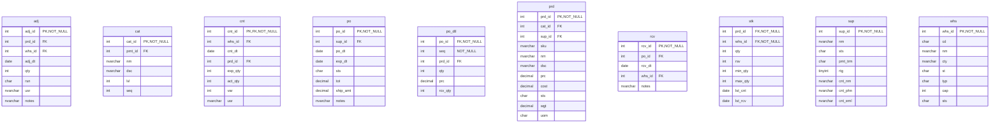

# Database Documentation: LousyDB

**Server**: localhost
**Generated**: 2025-11-09T04:37:57.749Z
**Total Iterations**: 50

## Analysis Summary

- **Status**: converged
- **Iterations**: 50
- **Tokens Used**: 251,920
- **Estimated Cost**: $0.00
- **AI Model**: openai/gpt-oss-120b
- **AI Vendor**: GroqLLM
- **Temperature**: 0.1
- **Convergence**: Reached maximum iteration limit (50)

## Table of Contents

### [inv](#schema-inv) (10 tables)
- [adj](#adj)
- [cat](#cat)
- [cnt](#cnt)
- [po](#po)
- [po_dtl](#po-dtl)
- [prd](#prd)
- [rcv](#rcv)
- [stk](#stk)
- [sup](#sup)
- [whs](#whs)

### [sales](#schema-sales) (10 tables)
- [addr](#addr)
- [cst](#cst)
- [cst_note](#cst-note)
- [eml](#eml)
- [oli](#oli)
- [ord](#ord)
- [phn](#phn)
- [pmt](#pmt)
- [rtn](#rtn)
- [shp](#shp)

## Schema: inv

### Entity Relationship Diagram

### Tables

#### adj

The inv.adj table records inventory adjustments, capturing each change in stock quantity for a specific product at a particular warehouse, the date of the adjustment, the reason, the user who performed it, and optional notes.

**Row Count**: 300
**Dependency Level**: 0

**Confidence**: 96%

**Columns**:

| Column | Type | Description |
|--------|------|-------------|
| adj_id | int (PK, NOT NULL) | Surrogate primary key uniquely identifying each inventory adjustment record |
| prd_id | int (FK) | Reference to the product whose inventory is being adjusted |
| whs_id | int (FK) | Reference to the warehouse where the adjustment occurred |
| adj_dt | date | Date the adjustment was recorded |
| qty | int | Quantity change; positive values increase stock, negative values decrease stock |
| rsn | char | Reason code for the adjustment (STL=stolen, EXP=expired, DAM=damaged, COR=correction) |
| usr | nvarchar | Name of the user/employee who performed the adjustment |
| notes | nvarchar | Optional free‑text comment providing additional context for the adjustment |

#### cat

A hierarchical lookup table for inventory categories, storing each category's identifier, optional parent category, name, description, level in the hierarchy, and display order

**Row Count**: 20
**Dependency Level**: 0

**Confidence**: 96%

**Columns**:

| Column | Type | Description |
|--------|------|-------------|
| cat_id | int (PK, NOT NULL) | Unique identifier for each category |
| prnt_id | int (FK) | Identifier of the parent category (null for top‑level categories) |
| nm | nvarchar | Short name of the category |
| dsc | nvarchar | Longer description of the category |
| lvl | int | Depth level of the category in the hierarchy (1=root, 2=child) |
| seq | int | Display order of the category within its level |

#### cnt

Stores the line‑item results of physical inventory counts, linking each count session to a specific warehouse, product, date and the user who performed the count, and recording expected vs actual quantities and the resulting variance.

**Row Count**: 250
**Dependency Level**: 0

**Confidence**: 94%

**Columns**:

| Column | Type | Description |
|--------|------|-------------|
| cnt_id | int (PK, FK, NOT NULL) | Identifier of the inventory count session (header) this row belongs to |
| whs_id | int (FK) | Warehouse where the count was performed |
| cnt_dt | date | Date on which the physical count took place |
| prd_id | int (FK) | Product being counted |
| exp_qty | int | System‑recorded (expected) quantity for the product in the warehouse at cnt_dt |
| act_qty | int | Physically counted quantity observed by the user |
| var | int | Variance between expected and actual quantities (act_qty - exp_qty) expressed as a small integer offset |
| usr | nvarchar | Name of the employee who performed the count |

#### po

This table (inv.po) stores purchase order records, capturing each order placed with a supplier, including order and expected delivery dates, status, total amount, shipping charge, and optional notes.

**Row Count**: 150
**Dependency Level**: 0

**Confidence**: 96%

**Columns**:

| Column | Type | Description |
|--------|------|-------------|
| po_id | int (PK, NOT NULL) | Unique identifier for each purchase order (primary key). |
| sup_id | int (FK) | Identifier of the supplier for the order, linking to the supplier master table. |
| po_dt | date | Date the purchase order was created/issued. |
| exp_dt | date | Expected delivery date for the order. |
| sts | char | Current status of the purchase order, using single‑letter codes (e.g., X, S, R, P, A). |
| tot | decimal | Total monetary amount of the purchase order before shipping. |
| ship_amt | decimal | Shipping charge applied to the order; either 150 (charged) or 0 (free). |
| notes | nvarchar | Optional free‑text note, commonly used for expedited shipping requests. |

#### po_dtl

This table stores the line‑item details of each purchase order, linking a purchase order (inv.po) to the specific products (inv.prd) being ordered, with quantities, unit price, and received quantity for each line.

**Row Count**: 750
**Dependency Level**: 0

**Confidence**: 96%

**Columns**:

| Column | Type | Description |
|--------|------|-------------|
| po_id | int (FK, NOT NULL) | Identifier of the purchase order this line belongs to; links to inv.po.po_id |
| seq | int (NOT NULL) | Sequential line number of the item within the purchase order |
| prd_id | int (FK) | Identifier of the product being ordered; links to inv.prd.prd_id |
| qty | int | Quantity of the product ordered on this line |
| prc | decimal | Unit price of the product at the time of ordering |
| rcv_qty | int | Quantity of the product actually received for this line |

#### prd

Stores detailed information about each product offered by the company, including identifiers, categorization, supplier, pricing, weight, unit of measure and status.

**Row Count**: 177
**Dependency Level**: 0

**Confidence**: 96%

**Columns**:

| Column | Type | Description |
|--------|------|-------------|
| prd_id | int (PK, NOT NULL) | Unique identifier for each product (primary key). |
| cat_id | int (FK) | Reference to the product's category in inv.cat. |
| sup_id | int (FK) | Reference to the supplier that provides the product in inv.sup. |
| sku | nvarchar | Stock Keeping Unit code used for inventory tracking. |
| nm | nvarchar | Product name or title. |
| dsc | nvarchar | Short description or marketing copy for the product. |
| prc | decimal | Retail selling price of the product. |
| cost | decimal | Acquisition or cost price of the product for the company. |
| sts | char | Current status of the product: A=Active, O=Obsolete, D=Discontinued. |
| wgt | decimal | Weight of the product, measured in the unit implied by uom. |
| uom | char | Unit of measure for inventory transactions (EA=Each, BX=Box, CS=Case). |

#### rcv

Stores each receipt of goods against a purchase order, recording when and where the items were received and any notes about partial shipments

**Row Count**: 120
**Dependency Level**: 0

**Confidence**: 96%

**Columns**:

| Column | Type | Description |
|--------|------|-------------|
| rcv_id | int (PK, NOT NULL) | Unique identifier for each receipt record |
| po_id | int (FK) | Identifier of the purchase order being received |
| rcv_dt | date | Date the goods were received into inventory |
| whs_id | int (FK) | Warehouse where the goods were received |
| notes | nvarchar | Free‑text comment about the receipt, commonly indicating partial shipment and backorder status |

#### stk

Stores inventory levels for each product at each warehouse, including on‑hand quantity, reserved quantity, reorder thresholds, and dates of last physical count and last receipt

**Row Count**: 1120
**Dependency Level**: 0

**Confidence**: 96%

**Columns**:

| Column | Type | Description |
|--------|------|-------------|
| prd_id | int (FK, NOT NULL) | Identifier of the product stored in inv.prd |
| whs_id | int (FK, NOT NULL) | Identifier of the warehouse stored in inv.whs |
| qty | int | Current on‑hand quantity of the product at the warehouse |
| rsv | int | Quantity of the product that is reserved for pending orders |
| min_qty | int | Minimum desired stock level (reorder point) for this product‑warehouse pair |
| max_qty | int | Maximum desired stock level (upper safety stock) for this product‑warehouse pair |
| lst_cnt | date | Date of the most recent physical inventory count for this product at this warehouse |
| lst_rcv | date | Date of the most recent receipt (stock inbound) for this product at this warehouse |

#### sup

Stores master information about suppliers, including their unique identifier, name, status, payment terms, rating, and primary contact details (name, phone, email). Serves as a foundational lookup for purchasing and inventory processes.

**Row Count**: 25
**Dependency Level**: 0

**Confidence**: 96%

**Columns**:

| Column | Type | Description |
|--------|------|-------------|
| sup_id | int (PK, NOT NULL) | Unique identifier for each supplier (primary key). |
| nm | nvarchar | Legal or trade name of the supplier company. |
| sts | char | Current status of the supplier (e.g., A=Active, I=Inactive, S=Suspended, T=Terminated). |
| pmt_trm | char | Standard payment terms offered by the supplier (e.g., N30 = Net 30 days, COD = Cash on Delivery). |
| rtg | tinyint | Supplier rating on a scale of 1 (lowest) to 5 (highest). |
| cnt_nm | nvarchar | Name of the primary contact person at the supplier. |
| cnt_phn | nvarchar | Phone number of the primary contact. |
| cnt_eml | nvarchar | Email address of the primary contact. |

#### whs

Stores master data for each warehouse or distribution center used in the inventory system, including its identifier, code, name, location, type, capacity and operational status.

**Row Count**: 8
**Dependency Level**: 0

**Confidence**: 97%

**Columns**:

| Column | Type | Description |
|--------|------|-------------|
| whs_id | int (PK, NOT NULL) | Primary key uniquely identifying each warehouse. |
| cd | char | Short alphanumeric code for the warehouse (e.g., ATL, LAX). |
| nm | nvarchar | Full descriptive name of the warehouse or distribution center. |
| cty | nvarchar | City where the warehouse is located. |
| st | char | Two‑letter state abbreviation for the warehouse location. |
| typ | char | Warehouse type: R = Regional hub, M = Main distribution, D = Drop‑ship location. |
| cap | int | Maximum storage capacity of the warehouse (units). |
| sts | char | Operational status: A = Active, M = Maintenance/Closed. |

## Schema: sales

### Entity Relationship Diagram

### Tables

#### addr

Stores mailing and contact addresses for customers, including address lines, city, state, zip, country and address type (e.g., shipping, billing, office). Each row is a unique address linked to a customer record.

**Row Count**: 800
**Dependency Level**: 0

**Confidence**: 96%

**Columns**:

| Column | Type | Description |
|--------|------|-------------|
| addr_id | int (PK, NOT NULL) | Surrogate primary key for the address record; uniquely identifies each address row. |
| cst_id | int (FK) | Foreign key to sales.cst; identifies the customer to which the address belongs. |
| typ | char | Code indicating the purpose of the address: S=Shipping, O=Office, B=Billing. |
| ln1 | nvarchar | First line of the street address (street number and name). |
| ln2 | nvarchar | Optional second line of the address, often a suite or apartment number; nullable for many rows. |
| cty | nvarchar | City name of the address. |
| st | char | Two‑letter US state abbreviation where the address is located. |
| zip | nvarchar | Five‑digit US postal code for the address. |
| ctry | char | Country code; always 'US' indicating all addresses are US based. |
| dflt | bit | Flag indicating whether this address is the customer's default (true) or not (false). |

#### cst

Stores master customer records for the sales domain, capturing each customer's identity, contact name, status, acquisition source, assigned sales representative, market segment, rating, financial balance, credit limit, and date of last order. Related one‑to‑many tables store multiple addresses (shipping, billing, office), emails (with a default flag), phone numbers (typed and defaultable), and interaction notes, linking each customer to its contact details and history.

**Row Count**: 500
**Dependency Level**: 0

**Confidence**: 97%

**Columns**:

| Column | Type | Description |
|--------|------|-------------|
| cst_id | int (PK, NOT NULL) | Unique customer identifier (primary key) |
| nm | nvarchar | Customer name or business name |
| sts | char | Current status of the customer (e.g., A=Active, S=Suspended, I=Inactive, T=Terminated) |
| dt | date | Date the customer record was created or became active |
| src | char | Acquisition source/channel (WB=Web, ST=Store, RF=Referral, PH=Phone) |
| rep_id | int (PK) | Identifier of the sales representative assigned to the customer |
| seg | char | Market segment classification (W=Wholesale, R=Retail, E=Enterprise) |
| rtg | tinyint | Customer rating score from 1 (lowest) to 5 (highest) |
| bal | decimal | Current account balance (amount owed or credit) |
| cr_lmt | decimal | Approved credit limit for the customer |
| lst_ord | date | Date of the most recent order placed by the customer (nullable) |

#### cst_note

Stores individual notes or interaction records linked to customers, capturing when, by whom, and what was communicated during sales‑related contacts

**Row Count**: 450
**Dependency Level**: 0

**Confidence**: 96%

**Columns**:

| Column | Type | Description |
|--------|------|-------------|
| note_id | int (PK, NOT NULL) | Unique identifier for each customer note entry |
| cst_id | int (FK) | Identifier of the customer to which the note pertains |
| dt | date | Date the note was created or logged |
| usr | nvarchar | Name of the employee or user who recorded the note |
| txt | nvarchar | Full text of the interaction note describing the contact content |
| typ | char | Single‑character code indicating interaction type (M=Meeting, E=Email, O=Other, C=Call) |

#### eml

Stores email addresses associated with customers, including type, verification status, and a flag indicating the default (primary) email for each customer.

**Row Count**: 550
**Dependency Level**: 0

**Confidence**: 96%

**Columns**:

| Column | Type | Description |
|--------|------|-------------|
| eml_id | int (PK, NOT NULL) | Unique identifier for each email record. |
| cst_id | int (FK) | Identifier of the customer to whom the email belongs. |
| typ | char | Category of the email address (e.g., Work, Personal, Other). |
| adr | nvarchar | The email address string. |
| vrf | bit | Indicates whether the email address has been verified. |
| dflt | bit | Marks the email as the default/primary address for the customer. |

#### oli

Stores individual line items for each sales order, capturing the product sold, quantity, unit price, discount, tax amount, and line sequence, and serves as the reference point for return records that link to specific line items for return processing.

**Row Count**: 6998
**Dependency Level**: 0

**Confidence**: 97%

**Columns**:

| Column | Type | Description |
|--------|------|-------------|
| oli_id | int (PK, NOT NULL) | Unique identifier for the order line item (primary key). |
| ord_id | int (FK) | Identifier of the parent sales order this line belongs to. |
| prd_id | int (FK) | Identifier of the product being sold on this line. |
| qty | int | Quantity of the product ordered on this line. |
| prc | decimal | Unit price of the product at the time of the order (before discount). |
| disc | decimal | Discount amount applied to this line (may be zero). |
| tax_amt | decimal | Tax amount calculated for this line. |
| seq | int | Sequence number of the line within the order (1‑6). |

#### ord

Stores header information for sales orders placed by customers, linking to up to six line‑item records, multiple payment records (supporting split or installment payments), possible return records, and a single shipment record; includes dates, status, monetary totals, payment terms and optional notes.

**Row Count**: 2000
**Dependency Level**: 0

**Confidence**: 97%

**Columns**:

| Column | Type | Description |
|--------|------|-------------|
| ord_id | int (PK, NOT NULL) | Unique identifier for each order (order header). |
| cst_id | int (FK) | Identifier of the customer who placed the order. |
| ord_dt | date | Date the order was created/placed. |
| ship_dt | date | Date the order was shipped; may be null for unshipped orders. |
| sts | char | Current status of the order (e.g., D=Draft, C=Cancelled, S=Shipped, P=Pending, X=Other). |
| tot | decimal | Total amount of the order before tax and discounts. |
| tax | decimal | Tax amount applied to the order. |
| ship_amt | decimal | Shipping charge applied; limited to 0, 15, or 25. |
| disc_pct | decimal | Discount percentage applied to the order (0 or 10%). |
| pmt_trm | char | Payment terms for the order (COD, Net 30, Net 45, Net 60). |
| notes | nvarchar | Optional free‑text note, often indicating rush or expedited shipping. |

#### phn

Stores phone contact information for customers, including multiple numbers per customer with type, extension, and a default flag

**Row Count**: 600
**Dependency Level**: 0

**Confidence**: 96%

**Columns**:

| Column | Type | Description |
|--------|------|-------------|
| phn_id | int (PK, NOT NULL) | Unique identifier for each phone record |
| cst_id | int (FK) | Identifier of the customer that owns the phone number |
| typ | char | Category of phone number (W=Work, M=Mobile, H=Home, F=Fax) |
| num | nvarchar | The phone number itself, stored as formatted string |
| ext | nvarchar | Phone extension number, optional (95% null) |
| dflt | bit | Flag indicating if this is the customer's default/primary phone number |

#### pmt

The table stores individual payment records for customer orders, capturing when a payment was made, its amount, method, status, and reference code. It links each payment to a specific order and customer.

**Row Count**: 2200
**Dependency Level**: 0

**Confidence**: 96%

**Columns**:

| Column | Type | Description |
|--------|------|-------------|
| pmt_id | int (PK, NOT NULL) | Unique identifier for each payment record. |
| ord_id | int (FK) | Identifier of the order that this payment is applied to. |
| cst_id | int (FK) | Identifier of the customer who made the payment. |
| pmt_dt | date | Date the payment was received or recorded. |
| amt | decimal | Monetary amount of the payment. |
| mthd | char | Payment method code (WR=Wire, CA=Cash, CK=Check, CC=Credit Card). |
| sts | char | Current status of the payment (A=Approved, F=Failed, P=Pending, R=Refunded/Returned). |
| ref | nvarchar | External reference code for the payment, typically generated by the accounting system. |
| notes | nvarchar | Optional free‑text notes about the payment; most rows are null, with the only repeated value being 'Account credit applied'. |

#### rtn

Stores individual product return records linked to specific order line items, capturing return date, reason, quantity, refund amount, status and optional notes.

**Row Count**: 150
**Dependency Level**: 0

**Confidence**: 96%

**Columns**:

| Column | Type | Description |
|--------|------|-------------|
| rtn_id | int (PK, NOT NULL) | Unique identifier for each return transaction |
| ord_id | int (FK) | Identifier of the original order to which the return belongs |
| oli_id | int (FK) | Identifier of the specific order line item being returned |
| rtn_dt | date | Date when the return was processed |
| rsn | char | Reason code for the return (WRG=Wrong item, DOA=Dead on arrival, DMG=Damaged, CHG=Customer changed mind) |
| qty | int | Quantity of items returned |
| amt | decimal | Monetary amount refunded for the return |
| sts | char | Current status of the return (A=Approved, R=Received, P=Processing, C=Closed) |
| notes | nvarchar | Free‑text explanation of the return reason |

#### shp

The table stores shipment records for individual sales orders, capturing when and where items were shipped, the carrier and tracking information, delivery date, weight, cost and the originating warehouse.

**Row Count**: 1500
**Dependency Level**: 0

**Confidence**: 96%

**Columns**:

| Column | Type | Description |
|--------|------|-------------|
| shp_id | int (PK, NOT NULL) | Surrogate primary key uniquely identifying each shipment record. |
| ord_id | int (FK) | Identifier of the sales order that this shipment fulfills. |
| whs_id | int (FK) | Identifier of the warehouse from which the shipment originated. |
| ship_dt | date | Date the shipment left the warehouse. |
| dlv_dt | date | Date the shipment was delivered to the customer; may be null if not yet delivered. |
| carr | nvarchar | Shipping carrier used for the delivery (e.g., USPS Priority, DHL Express). |
| trk | nvarchar | Tracking number assigned by the carrier to trace the shipment. |
| sts | char | Current status of the shipment (D=Delivered, N=Not shipped, S=Shipped, P=Pending). |
| wgt | decimal | Weight of the shipment (likely in pounds or kilograms). |
| cost | decimal | Shipping cost charged for the shipment. |

---

## Appendix: Iteration Analysis

This section documents the iterative refinement process used to generate the database documentation, highlighting corrections and improvements discovered through backpropagation.

### Summary

- **Total Tables with Refinements**: 20
- **Total Columns with Refinements**: 162
- **Total Refinement Iterations**: 269
- **Refinements Triggered by Backpropagation**: 10

### Tables Refined Through Iteration

#### [adj](#adj)

**Iterations**: 3 | **Trigger**: refinement

**Iteration 1** (initial):

> Stores individual inventory adjustment records, capturing changes to product quantities in specific warehouses along with the reason, date, user and notes for each adjustment

*Reasoning*: Column names adj_id, prd_id, whs_id, adj_dt, qty, rsn, usr and notes together describe a transaction that modifies inventory levels. adj_id is a unique identifier (primary key). prd_id and whs_id have low cardinality and match typical foreign keys to product (inv.prd) and warehouse (inv.whs) tables. adj_dt is a date of the adjustment. qty contains positive and negative integers indicating quantity added or removed. rsn contains a short code set (STL,EXP,DAM,COR) representing common adjustment reasons. usr records the employee performing the adjustment and notes provides a free‑text explanation. The pattern matches an inventory adjustment (adj) table in an inventory management system.

---

**Iteration 2** (refinement):

> The inv.adj table records inventory adjustments made to products in specific warehouses, capturing when the adjustment occurred, the quantity change, the reason for the change, the user who performed it, and optional notes.

*Reasoning*: Column names and types (adj_id PK, prd_id FK to inv.prd, whs_id FK to inv.whs, adj_dt date, qty signed integer, rsn with limited values STL/EXP/DAM/COR, usr as user name, notes with explanatory text) together indicate a log of stock adjustments. The foreign‑key links to product and warehouse tables confirm it is part of the inventory module. Sample data (negative and positive qty, reasons like DAM, EXP) reinforce this interpretation.

---

**Iteration 3** (refinement):

> The inv.adj table records inventory adjustments, capturing each change in stock quantity for a specific product at a particular warehouse, the date of the adjustment, the reason, the user who performed it, and optional notes.

*Reasoning*: Column names and types point to an adjustment log: adj_id is a unique identifier (primary key); prd_id and whs_id are foreign keys to inv.prd and inv.whs, linking each adjustment to a product and warehouse. adj_dt stores the adjustment date. qty holds positive or negative numbers indicating stock increase or decrease. rsn contains short codes (STL, EXP, DAM, COR) that map to common adjustment reasons (stolen, expired, damaged, corrected). usr records the employee name making the entry, and notes provides a free‑text explanation. The 300 rows, each with a unique date and ID, reinforce a transactional log purpose.

#### [cat](#cat)

**Iterations**: 4 | **Trigger**: refinement

**Iteration 1** (initial):

> A hierarchical lookup table that defines inventory categories, their parent‑child relationships, names, descriptions, hierarchy level and display order.

*Reasoning*: The table has a unique cat_id (primary key) and a prnt_id that repeats only six values, indicating a self‑referencing parent category. The nm and dsc columns contain descriptive names and explanations of typical inventory groups (Writing, Electronics, etc.). lvl contains only 1 or 2, matching top‑level vs sub‑level categories. seq provides ordering within a parent. The pattern matches the purpose of the inv.cat table listed among the available tables.

---

**Iteration 2** (backpropagation):

> A hierarchical lookup table that defines inventory categories, their parent‑child relationships, names, descriptions, hierarchy level and display order, and is used to group products (at least 11 distinct categories, values 2‑15) for reporting and pricing purposes.

*Reasoning*: The new insight reveals that the categories are actively used to group products for reporting and pricing and that there are at least 11 distinct category values (2‑15). This extends the original understanding of the table’s purpose beyond merely defining a hierarchy, so the description is revised to reflect its functional role in reporting and pricing.

---

**Iteration 3** (refinement):

> inv.cat stores the hierarchical list of inventory categories used to classify products and assets in the inventory system.

*Reasoning*: The primary key cat_id is unique for each row, prnt_id is a foreign key back to inv.cat.cat_id indicating a parent category, and columns nm and dsc contain human‑readable names and descriptions of categories. lvl shows the depth level (1 or 2) and seq provides ordering within a level. Sample values (e.g., Writing, Electronics, Furniture) are typical inventory categories, confirming the table's purpose as a category lookup.

---

**Iteration 4** (refinement):

> A hierarchical lookup table for inventory categories, storing each category's identifier, optional parent category, name, description, level in the hierarchy, and display order

*Reasoning*: The primary key cat_id is unique for each of the 20 rows, indicating a distinct category. The column prnt_id is a foreign key to inv.cat.cat_id, showing a self‑referencing hierarchy. The name (nm) and description (dsc) columns contain typical category labels (e.g., "Writing", "Electronics"). The lvl column has values 1 and 2, confirming two hierarchy levels (root and sub‑category). The seq column provides ordering within each level. All evidence points to a category reference table used by the inventory module.

#### [cnt](#cnt)

**Iterations**: 4 | **Trigger**: refinement

**Iteration 1** (initial):

> Stores inventory count details per product and warehouse on a specific date, recording expected quantity, actual quantity, variance and the user who performed the count.

*Reasoning*: Column names cnt_id, whs_id, prd_id, cnt_dt, exp_qty, act_qty, var and usr together describe a physical inventory counting event. cnt_id is a unique identifier for a count session, whs_id matches warehouse identifiers (values 1‑8), prd_id matches product identifiers (200 distinct values), cnt_dt is the count date, exp_qty and act_qty are numeric quantities, var is a small set of variance codes (0, -5, 5, -10) and usr stores the name of the employee who performed the count. The presence of foreign‑key‑like columns (whs_id, prd_id, cnt_id) and the fact that the table has no declared foreign keys but references tables listed in the schema (inv.whs, inv.prd, inv.cnt) support this interpretation.

---

**Iteration 2** (backpropagation):

> Stores inventory count line items for each product and warehouse on a specific date, linked to a count‑session header via the cnt_id foreign key. Records the expected quantity, actual quantity, variance code, and the user who performed the count for each detail line.

*Reasoning*: The new insight reveals that cnt_id is not a primary key but a foreign key to a separate count‑session header table (inv.cnt). This clarifies that the table functions as a detail/line‑item table rather than the sole count‑session record, requiring the description to emphasize the relationship to the header table while retaining the original column meanings.

---

**Iteration 3** (refinement):

> Stores detailed inventory count records, capturing the expected and actual quantity of each product in a specific warehouse on a given count date, along with the variance and the user who performed the count.

*Reasoning*: The table contains cnt_id (FK to inv.cnt), whs_id (FK to inv.whs), cnt_dt (date of count), prd_id (FK to inv.prd), expected quantity (exp_qty), actual quantity (act_qty), variance (var) and the user name (usr). The high uniqueness of cnt_id, whs_id, prd_id and cnt_dt indicates each row represents a distinct count line item. The presence of expected vs actual quantities and a small set of variance values (0, -5, 5, -10) confirms it tracks inventory discrepancies. The foreign keys link to count header, warehouse, and product tables, typical of an inventory counting detail table.

---

**Iteration 4** (refinement):

> Stores the line‑item results of physical inventory counts, linking each count session to a specific warehouse, product, date and the user who performed the count, and recording expected vs actual quantities and the resulting variance.

*Reasoning*: The primary key cnt_id references inv.cnt (a count header), while whs_id and prd_id reference inv.whs and inv.prd respectively, indicating a child/detail table. Columns exp_qty (expected quantity) and act_qty (actual quantity) together with var (variance) are typical of inventory reconciliation. cnt_dt provides the date of the count, and usr records the employee performing it. Sample values (e.g., exp_qty 97, act_qty 273, var 0 or -5) match this pattern.

#### [po](#po)

**Iterations**: 5 | **Trigger**: refinement

**Iteration 1** (initial):

> Purchase order header table that records each purchase order placed with a supplier, including dates, status, total amount, shipping charge and optional notes.

*Reasoning*: The column names po_id (purchase order identifier), sup_id (supplier identifier), po_dt (order date), exp_dt (expected delivery date), sts (status code), tot (order total), ship_amt (shipping amount) and notes clearly describe a purchase order. po_id is unique per row, indicating a primary key. sup_id matches the naming convention of supplier keys in the existing inv.sup table, suggesting a foreign key relationship. The status codes (X,S,R,P,A) are typical order status enums. The presence of shipping amount and notes about expedited shipping further supports a purchase‑order context.

---

**Iteration 2** (backpropagation):

> Purchase order header table that records each purchase order placed with a supplier, including dates, status, total amount, shipping charge, optional notes, and supports partial receipt of items (backorder handling) with up to seven line items tracking ordered versus received quantities per product.

*Reasoning*: The new insights reveal that inv.po is used in conjunction with line‑item tables that allow up to seven items per order and track ordered vs received quantities, indicating the PO can be partially received and supports backorder handling. This nuance was not captured in the original description, so the description is updated to reflect these capabilities.

---

**Iteration 3** (refinement):

> Stores purchase order records, each representing an order placed with a supplier, including order and expected delivery dates, status, total amount, shipping cost, and optional notes.

*Reasoning*: The primary key po_id uniquely identifies each row (150 rows, 100% unique). The sup_id column is a foreign key to inv.sup, indicating the supplier for the order. po_dt and exp_dt are dates typical for order and expected receipt. sts contains single‑character status codes (X, S, R, P, A). tot is the order total, ship_amt is a fixed shipping charge (0 or 150), and notes contain a repeated comment about expedited shipping. All these elements match a purchase‑order entity in an inventory/procurement system.

---

**Iteration 4** (backpropagation):

> Stores purchase order records, each representing an order placed with a supplier. A purchase order can contain up to seven line‑item rows (seq 1‑7) in a related detail table and is often created in standard quantity increments (100‑400). Orders may be partially fulfilled, as indicated by notes about partial shipments. The table includes order and expected delivery dates, status codes, total amount, shipping cost, and optional notes.

*Reasoning*: The new insights reveal that the PO is linked to a child table that holds up to seven line items and that orders are frequently placed in standard quantity increments. Additionally, receipt data shows partial fulfillment. These details were not reflected in the original description, so the description is revised to mention the line‑item limit, quantity pattern, and partial shipment capability while retaining the original fields.

---

**Iteration 5** (refinement):

> This table (inv.po) stores purchase order records, capturing each order placed with a supplier, including order and expected delivery dates, status, total amount, shipping charge, and optional notes.

*Reasoning*: Column names such as po_id, sup_id, po_dt, exp_dt, sts, tot, ship_amt, and notes directly indicate purchase order data. po_id is a unique primary key (150 distinct values for 150 rows). sup_id is a foreign key to inv.sup, linking each order to a supplier. Dates are unique per row, reflecting individual order timestamps. sts contains a small set of single‑character codes (X,S,R,P,A) typical for order status enums. tot varies per order, ship_amt is either 150 or 0 indicating a flat shipping fee applied conditionally. notes is largely NULL with a repeated value about expedited shipping, showing an optional comment field.

#### [po_dtl](#po-dtl)

**Iterations**: 3 | **Trigger**: refinement

**Iteration 1** (initial):

> Stores purchase order line items, linking each purchase order (po_id) to a product (prd_id) with ordered quantity, unit price, received quantity, and line sequence.

*Reasoning*: Column po_id matches purchase order identifiers and is a primary key; seq provides line order (values 1‑7); prd_id aligns with product identifiers in inv.prd; qty and rcv_qty hold ordered and received quantities (discrete set of typical order sizes); prc is a decimal price per unit. The combination of po_id, seq, and prd_id uniquely identifies each line, indicating a detail table for inv.po. Sample values and distinct counts support this interpretation.

---

**Iteration 2** (refinement):

> This table stores the line‑item details for each purchase order, linking a purchase order (po_id) to the specific product ordered (prd_id) along with the ordered quantity, unit price, line sequence, and the quantity actually received.

*Reasoning*: The presence of po_id (FK to inv.po) and prd_id (FK to inv.prd) identifies the table as a child of the purchase‑order and product tables. The seq column with values 1‑7 indicates the line order within a PO. qty holds typical order quantities (100‑400) and prc holds the unit price. rcv_qty records how many units were received, matching typical inventory receipt tracking. Sample values and 100% uniqueness for identifiers reinforce this interpretation.

---

**Iteration 3** (refinement):

> This table stores the line‑item details of each purchase order, linking a purchase order (inv.po) to the specific products (inv.prd) being ordered, with quantities, unit price, and received quantity for each line.

*Reasoning*: Column names po_id, seq, prd_id, qty, prc, and rcv_qty together describe a typical purchase‑order‑detail structure. po_id is a foreign key to inv.po, confirming the parent purchase order. prd_id references inv.prd, indicating the product ordered. seq holds sequential line numbers (1‑7 in samples). qty lists the ordered quantity (common values 100‑400). prc is a decimal price per unit. rcv_qty records how many units were actually received, often differing from qty, which matches typical PO receipt tracking. Sample values and distinct‑value counts support these interpretations.

#### [prd](#prd)

**Iterations**: 4 | **Trigger**: refinement

**Iteration 1** (initial):

> A product master table storing detailed information about each inventory item, including identifiers, categorization, supplier, pricing, weight, unit of measure and status.

*Reasoning*: The presence of a unique primary key (prd_id), SKU, product name (nm) and description (dsc) together with pricing (prc, cost), weight (wgt) and unit of measure (uom) clearly identify this as a product catalog. Columns cat_id and sup_id match typical foreign‑key patterns to category (inv.cat) and supplier (inv.sup) tables. Sample values (e.g., "IKEA BEKANT Desk", "Blue Yeti Microphone") are concrete product names, confirming the purpose.

---

**Iteration 2** (refinement):

> Stores master data for each product sold or stocked, including identifiers, categorization, supplier, SKU, name, description, pricing, cost, status, weight and unit of measure.

*Reasoning*: The primary key prd_id uniquely identifies each row (177 distinct values). cat_id and sup_id are foreign keys to inv.cat and inv.sup, indicating product categorization and supplier linkage. sku, nm and dsc contain typical product codes, names and descriptions. prc and cost represent selling price and acquisition cost. sts holds single‑character status codes (A, O, D) common for Active/Out‑of‑stock/Discontinued. wgt and uom capture physical weight and unit of measure. All columns together form a classic product master table in an inventory/sales system.

---

**Iteration 3** (backpropagation):

> Stores master data for each product sold or stocked, including identifiers, categorization, supplier, SKU, name, description, pricing, cost, status, weight, unit of measure, and the baseline stock quantity. It acts as the product master, while inventory adjustments (damage, expiration, theft, etc.) are recorded in inv.adj, which reference inv.prd to reconcile quantity changes across multiple warehouses.

*Reasoning*: The new insights indicate that inv.prd not only holds static product attributes but also tracks a baseline stock level that is adjusted via inv.adj records. This adds a quantitative inventory dimension and clarifies its role in multi‑warehouse stock management, which was not captured in the original description.

---

**Iteration 4** (refinement):

> Stores detailed information about each product offered by the company, including identifiers, categorization, supplier, pricing, weight, unit of measure and status.

*Reasoning*: The primary key prd_id uniquely identifies 177 rows, typical for a product master. Columns cat_id and sup_id are foreign keys to inv.cat and inv.sup, indicating product categorization and supplier linkage. SKU, name (nm) and description (dsc) are classic product attributes. Price (prc), cost, status (sts), weight (wgt) and unit of measure (uom) are standard inventory/commerce fields. Sample values (e.g., "IKEA BEKANT Desk", "Blue Yeti Microphone") confirm the table holds product catalog data.

#### [rcv](#rcv)

**Iterations**: 3 | **Trigger**: refinement

**Iteration 1** (initial):

> Stores records of goods received against purchase orders, capturing receipt details such as receipt ID, associated purchase order, receipt date, warehouse location, and optional notes about partial shipments.

*Reasoning*: The column names rcv_id (receipt), po_id (purchase order), rcv_dt (receipt date), whs_id (warehouse) and the note indicating "Partial shipment received - balance on backorder" together point to a receiving table. Sample values for po_id match typical purchase order IDs. whs_id has only eight distinct values (1‑8) matching warehouse identifiers from inv.whs. The table appears in the provided list as inv.rcv, confirming its role in inventory receiving.

---

**Iteration 2** (refinement):

> Stores each receipt of goods against a purchase order, recording when and where items were received and any remarks (e.g., partial shipment). It serves as the inventory receipt log linking purchase orders to warehouses.

*Reasoning*: The primary key rcv_id uniquely identifies each receipt. po_id is a foreign key to inv.po, indicating the receipt belongs to a purchase order. whs_id references inv.whs, showing the warehouse location. rcv_dt contains distinct dates for each receipt, confirming a transactional log. The notes column consistently contains "Partial shipment received - balance on backorder", revealing the table tracks partial deliveries. All columns together describe a receipt event in the inventory process.

---

**Iteration 3** (refinement):

> Stores each receipt of goods against a purchase order, recording when and where the items were received and any notes about partial shipments

*Reasoning*: The table contains a primary key rcv_id, a foreign key po_id to inv.po (purchase orders), a receipt date rcv_dt, a foreign key whs_id to inv.whs (warehouses), and a notes column that mostly contains 'Partial shipment received - balance on backorder'. This pattern matches a receiving (goods receipt) record in an inventory system

#### [stk](#stk)

**Iterations**: 3 | **Trigger**: refinement

**Iteration 1** (initial):

> Stores the current inventory status for each product at each warehouse, including on‑hand quantity, reserved quantity, reorder thresholds, and dates of the last physical count and last receipt.

*Reasoning*: Column names prd_id and whs_id form a composite primary key and match product and warehouse identifiers found in inv.prd and inv.whs. qty and rsv are typical on‑hand and reserved stock figures. min_qty and max_qty represent reorder or safety‑stock limits. lst_cnt and lst_rcv are dates of the most recent inventory count and receipt, respectively. Sample values and distinct‑value counts (200 products, 8 warehouses, 1120 rows) align with a many‑to‑many stock table.

---

**Iteration 2** (refinement):

> Stores the inventory levels for each product at each warehouse, including current quantity, reserved quantity, reorder thresholds, and the dates of the last physical count and last receipt.

*Reasoning*: The table contains prd_id and whs_id foreign keys to inv.prd and inv.whs, indicating a product‑warehouse relationship. qty and rsv are typical stock and reservation counts. min_qty and max_qty are classic reorder thresholds. lst_cnt and lst_rcv are dates of last count and last receipt, common in inventory tracking. Row count (1120) matches a many‑to‑many product‑warehouse matrix (200 products × 8 warehouses ≈ 1600 possible combos, many present).

---

**Iteration 3** (refinement):

> Stores inventory levels for each product at each warehouse, including on‑hand quantity, reserved quantity, reorder thresholds, and dates of last physical count and last receipt

*Reasoning*: Column names prd_id and whs_id are foreign keys to inv.prd and inv.whs, indicating a many‑to‑many relationship between products and warehouses. qty and rsv are typical stock and reservation amounts. min_qty and max_qty represent reorder thresholds per location. lst_cnt and lst_rcv are dates of the most recent inventory count and receipt, respectively. Sample values (e.g., qty values in the thousands, dates in late 2024) match typical inventory data. The table aligns with the purpose of inv.stk in the schema list.

#### [sup](#sup)

**Iterations**: 4 | **Trigger**: refinement

**Iteration 1** (initial):

> This table stores master information about suppliers/vendors that provide goods or services to the company, including their identifiers, names, status, payment terms, rating, and primary contact details.

*Reasoning*: Column names and sample data clearly indicate a supplier entity: sup_id is a unique integer primary key; nm contains company names; sts holds single‑letter status codes (A,T,S,I); pmt_trm lists common payment terms (N30, N60, COD); rtg is a 1‑5 rating; cnt_nm, cnt_phn, cnt_eml hold the contact person's name, phone and email. No foreign keys are present, matching the listed inv.sup table which is a foundational lookup in the inventory schema.

---

**Iteration 2** (refinement):

> The table stores master data for suppliers, including their unique identifier, company name, status, payment terms, rating, and primary contact details (name, phone, email). It serves as a reference for procurement and inventory processes.

*Reasoning*: Column names and sample values clearly indicate supplier information: sup_id is a unique primary key; nm contains company names; sts holds single‑letter status codes; pmt_trm lists common payment terms (N30, N60, COD, etc.); rtg is a numeric rating (1‑5); cnt_nm, cnt_phn, and cnt_eml provide the main contact person's name, phone, and email. The table has no foreign keys, matching the description of a foundational lookup table (inv.sup) in the provided list.

---

**Iteration 3** (backpropagation):

> The sup table stores master data for suppliers, including a unique identifier, company name, status, payment terms, rating, and primary contact details (name, phone, email). It is a parent lookup table referenced by purchase‑order and product tables, confirming at least 25 active suppliers in the system.

*Reasoning*: The new insights show that sup_id is referenced by the purchase‑order table (25 distinct values) and by a product‑supplier relationship, confirming the table’s role as a parent entity for sourcing and procurement. This relationship detail and the count of active suppliers extend the original description, so the description is revised to reflect these usage patterns.

---

**Iteration 4** (refinement):

> Stores master information about suppliers, including their unique identifier, name, status, payment terms, rating, and primary contact details (name, phone, email). Serves as a foundational lookup for purchasing and inventory processes.

*Reasoning*: Column names and sample data clearly indicate supplier-centric information: sup_id is a unique primary key; nm contains company names; sts holds single‑letter status codes; pmt_trm lists common payment terms (N30, N60, COD); rtg is a 1‑5 rating; cnt_nm, cnt_phn, cnt_eml store the main contact's name, phone and email. The table has no foreign keys, matching the description of a lookup/parent table such as inv.sup in the provided list.

#### [whs](#whs)

**Iterations**: 2 | **Trigger**: refinement

**Iteration 1** (initial):

> Stores master data for each warehouse or distribution center in the inventory system, including its identifier, location, type, capacity and operational status.

*Reasoning*: The primary key whs_id uniquely identifies 8 rows, and columns cd, nm, cty, st describe warehouse codes, names, cities and states. typ values (R, M, D) indicate warehouse type (e.g., Regional, Main, Distribution). cap holds numeric capacity figures, and sts (A, M) reflects active or maintenance status. No foreign keys are present, matching the description of a foundational lookup table such as inv.whs.

---

**Iteration 2** (refinement):

> Stores master data for each warehouse or distribution center used in the inventory system, including its identifier, code, name, location, type, capacity and operational status.

*Reasoning*: Column names (whs_id, cd, nm, cty, st, typ, cap, sts) and sample values (city names, state abbreviations, capacity numbers) clearly describe physical warehouse locations. The table has no foreign keys, matching the listed inv.whs lookup table, indicating it is a foundational inventory entity.

#### [addr](#addr)

**Iterations**: 2 | **Trigger**: refinement

**Iteration 1** (initial):

> Stores mailing and shipping addresses for customers, including address lines, city, state, zip, country, type (e.g., shipping, billing, office) and a flag indicating the default address for each customer.

*Reasoning*: Column names and sample data point to typical address fields (addr_id, ln1, ln2, cty, st, zip, ctry). The presence of cst_id links each address to a customer. The typ column contains values S, O, B suggesting address categories (Shipping, Office, Billing). The dflt bit marks the default address. No foreign key constraints are defined, but the pattern matches a customer address lookup table in the sales schema.

---

**Iteration 2** (refinement):

> Stores mailing and contact addresses for customers, including address lines, city, state, zip, country and address type (e.g., shipping, billing, office). Each row is a unique address linked to a customer record.

*Reasoning*: Column names and sample data point to address information: ln1/ln2 are street lines, cty is city, st is state abbreviation, zip is five‑digit US zip, ctry is always 'US'. The typ column has values S, O, B which commonly denote Shipping, Office, Billing address types. addr_id is a unique primary key, while cst_id repeats (476 distinct values for 800 rows) indicating a many‑to‑one link to a customer entity. The presence of a customer identifier (cst_id) matches the sales.cst table in the provided list, suggesting a foreign key relationship. The dflt bit marks the default address for a customer. All evidence aligns with a customer address lookup table.

#### [cst](#cst)

**Iterations**: 3 | **Trigger**: backpropagation

**Iteration 1** (initial):

> Master customer table that stores one record per customer with identification, name, status, creation date, acquisition source, assigned sales representative, market segment, rating, current balance, credit limit, and date of last order.

*Reasoning*: The primary key cst_id uniquely identifies each row (500 unique values). The column nm contains personal or company names, indicating a customer entity. sts holds single‑character status codes (A, S, I, T) typical for active/inactive/etc. dt appears to be the record creation or registration date. src values (WB, ST, RF, PH) suggest acquisition source (Web, Store, Referral, Phone). rep_id is a numeric identifier likely linking to a sales representative. seg (W, R, E) aligns with market segments (Wholesale, Retail, Enterprise). rtg is a rating 1‑5. bal and cr_lmt are monetary fields for balance and credit limit. lst_ord records the most recent order date, common in customer master tables. The table name is not provided but matches the pattern of sales.cst in the given list.

---

**Iteration 2** (refinement):

> Stores master customer records for the sales domain, capturing each customer's identity, contact name, status, acquisition source, assigned sales representative, market segment, rating, financial balance, credit limit, and date of last order.

*Reasoning*: Column names and data types strongly indicate a customer master table: cst_id is a unique identifier; nm holds the customer name; sts uses single‑letter status codes (A=Active, S=Suspended, I=Inactive, T=Terminated); dt appears to be the record creation or registration date; src lists acquisition channels (WB, ST, RF, PH); rep_id likely references the sales rep handling the account; seg categorises customers (W, R, E); rtg is a 1‑5 rating; bal and cr_lmt are financial fields; lst_ord records the most recent order date, nullable for inactive customers. The table matches the naming convention of sales.cst in the provided list, and no foreign keys to other listed tables are evident.

---

**Iteration 3** (backpropagation):

> Stores master customer records for the sales domain, capturing each customer's identity, contact name, status, acquisition source, assigned sales representative, market segment, rating, financial balance, credit limit, and date of last order. Related one‑to‑many tables store multiple addresses (shipping, billing, office), emails (with a default flag), phone numbers (typed and defaultable), and interaction notes, linking each customer to its contact details and history.

*Reasoning*: The new insights reveal that sales.cst is the central hub for customer master data, while address, email, phone, and note information are kept in separate child tables. This clarifies the one‑to‑many relationships and adds important context about where contact details and interaction history are stored, which was not reflected in the original description. Updating the description to mention these related tables provides a more complete picture of the table's role.

#### [cst_note](#cst-note)

**Iterations**: 2 | **Trigger**: refinement

**Iteration 1** (initial):

> Stores individual notes or communications related to customers, capturing when, by whom, the content and type of each interaction.

*Reasoning*: Column names note_id, cst_id, dt, usr, txt, typ together with sample values (customer IDs, dates, user names, note text, type codes M/E/O/C) indicate a log of customer communications. The presence of cst_id as a primary key and its uniqueness suggests a foreign key to the sales.cst table (customer). The table name likely corresponds to sales.cst_note from the provided list.

---

**Iteration 2** (refinement):

> Stores individual notes or interaction records linked to customers, capturing when, by whom, and what was communicated during sales‑related contacts

*Reasoning*: Column names note_id (PK), cst_id (FK to sales.cst), dt (date), usr (employee name), txt (note text), typ (single‑letter interaction type) together describe a customer‑note entity; sample values confirm meeting, email, follow‑up content; foreign key points to sales.cst, indicating a sales domain table

#### [eml](#eml)

**Iterations**: 2 | **Trigger**: refinement

**Iteration 1** (initial):

> Stores each customer's email address with its type, verification status, and default flag, linking emails to customers in the sales domain

*Reasoning*: Column names and sample data show eml_id as a unique email record identifier, cst_id matching customer IDs (likely referencing sales.cst), typ containing single‑character codes (W,P,O) typical for email type (Work, Personal, Other), adr holding email strings, vrf as a boolean verification flag, and dflt as a boolean indicating the default email for the customer. The composite uniqueness and presence of a customer foreign key suggest this is the sales.eml lookup table for customer contact information.

---

**Iteration 2** (refinement):

> Stores email addresses associated with customers, including type, verification status, and a flag indicating the default (primary) email for each customer.

*Reasoning*: The table has a primary key eml_id, a foreign key cst_id referencing sales.cst, a typ column with values W,P,O suggesting email type (Work, Personal, Other), an adr column containing email address strings, and boolean flags vrf (verified) and dflt (default). Sample data shows realistic email addresses and flags. This matches the purpose of the sales.eml table listed among available tables.

#### [oli](#oli)

**Iterations**: 3 | **Trigger**: backpropagation

**Iteration 1** (initial):

> Stores individual line items for each sales order, capturing the product, quantity, price, discount, tax, and line sequence within the order.

*Reasoning*: The column names (oli_id, ord_id, prd_id, qty, prc, disc, tax_amt, seq) and their data patterns match a typical order‑line item table. oli_id is a unique identifier for each line. ord_id links to a sales order, prd_id to a product, qty is a small integer (1‑10), prc, disc and tax_amt are monetary values, and seq ranges 1‑6 indicating the line position. The presence of primary keys on oli_id, ord_id, and prd_id suggests composite uniqueness and foreign‑key relationships to sales.ord and inv.prd.

---

**Iteration 2** (refinement):

> Stores individual line items for each sales order, capturing the product sold, quantity, unit price, discount, tax amount, and the line sequence within the order.

*Reasoning*: The primary key oli_id uniquely identifies each row (6998 distinct values). ord_id links to sales.ord indicating the order to which the line belongs. prd_id links to inv.prd indicating the product being sold. qty, prc, disc, tax_amt are typical monetary and quantity fields for a sales line. seq ranges 1‑6, showing the position of the line within an order. The combination of these columns matches the classic order‑line‑items pattern in a sales domain.

---

**Iteration 3** (backpropagation):

> Stores individual line items for each sales order, capturing the product sold, quantity, unit price, discount, tax amount, and line sequence, and serves as the reference point for return records that link to specific line items for return processing.

*Reasoning*: The new insight that return records reference specific line items adds a functional role for the table beyond merely recording sales details. This indicates the table is also used to track and process returns at the line‑item level, which was not reflected in the original description. Incorporating this relationship clarifies its importance in the returns workflow, so the description is revised to include this aspect.

#### [ord](#ord)

**Iterations**: 4 | **Trigger**: backpropagation

**Iteration 1** (initial):

> The table stores individual sales orders, capturing order identifiers, customer references, dates, status, financial totals, taxes, shipping costs, discounts, payment terms, and optional notes about expedited handling.

*Reasoning*: Column names like ord_id, cst_id, ord_dt, ship_dt, sts, tot, tax, ship_amt, disc_pct, and pmt_trm directly correspond to typical order data. ord_id is unique, indicating a primary key for each order. cst_id matches the customer identifier pattern and aligns with the sales.cst table in the provided list, suggesting a foreign key. The status codes (D, C, S, P, X) and payment terms (N30, COD, N60, N45) are typical order enums. Shipping amount and discount percent have very low cardinality, confirming they are categorical fields. The notes column is mostly null but contains a specific phrase about rush orders, indicating optional order-level comments.

---

**Iteration 2** (backpropagation):

> The sales.ord table stores order header information—including order ID, customer ID, order and ship dates, status, totals, taxes, shipping amount, discount percent, payment terms, and optional notes—while also serving as the parent entity for related child records such as up to six line‑item rows (sales.oli), multiple payment entries, return records, and one‑to‑many shipment records, reflecting the full lifecycle of a sales order.

*Reasoning*: The new insights reveal that each order is linked to line‑item (oli) rows, can have multiple payments, may generate return records, and can produce one or more shipments. These relationships were not mentioned in the original description, so the description must be expanded to capture the order’s role as a hub for these related tables.

---

**Iteration 3** (refinement):

> Stores header information for sales orders placed by customers, including dates, status, amounts, payment terms and optional notes.

*Reasoning*: The primary key ord_id uniquely identifies each order. cst_id is a foreign key to sales.cst, indicating the customer placing the order. ord_dt and ship_dt capture order and shipping dates. sts contains single‑letter status codes (D, C, S, P, X) typical for order lifecycle. tot, tax, ship_amt and disc_pct represent monetary totals, tax, shipping cost (0,15,25) and discount percentage (0 or 10). pmt_trm holds payment terms (COD, N30, N45, N60). notes is sparsely populated with a repeated "Rush order - expedited shipping" comment, showing optional free‑text remarks.

---

**Iteration 4** (backpropagation):

> Stores header information for sales orders placed by customers, linking to up to six line‑item records, multiple payment records (supporting split or installment payments), possible return records, and a single shipment record; includes dates, status, monetary totals, payment terms and optional notes.

*Reasoning*: The new insights reveal concrete relationships: each order can have up to six line‑item rows, multiple payment entries, one shipment record, and multiple return records. While the original description correctly identified the table as a header, it omitted these important usage patterns. Incorporating them clarifies the table’s role as the central order entity that connects to line items, payments, returns, and shipments, which is essential for understanding its purpose in the schema.

#### [phn](#phn)

**Iterations**: 2 | **Trigger**: refinement

**Iteration 1** (initial):

> Stores phone contact information for customers, including the phone number, type (e.g., mobile, work), optional extension, and a flag indicating the default/primary number for each customer.

*Reasoning*: The table contains a primary key column phn_id and a cst_id column that matches the customer identifier pattern in sales.cst. The typ column holds single‑character codes (W, M, H, F) typical for phone type enums. The num column stores formatted telephone numbers, ext stores optional short extensions (many nulls), and dflt is a boolean marking the default contact number. Sample values and distinct‑value counts confirm these interpretations.

---

**Iteration 2** (refinement):

> Stores phone contact information for customers, including multiple numbers per customer with type, extension, and a default flag

*Reasoning*: Column names and data types indicate phone data: 'num' holds phone numbers, 'ext' holds extensions, 'typ' has values W,M,H,F (likely Work, Mobile, Home, Fax). 'phn_id' is a unique primary key. 'cst_id' is a foreign key to sales.cst, linking numbers to customers. 'dflt' marks the primary/default number. Sample values and high uniqueness support this interpretation.

#### [pmt](#pmt)

**Iterations**: 2 | **Trigger**: refinement

**Iteration 1** (initial):

> This table stores individual payment transactions made by customers for sales orders, capturing the payment amount, date, method, status, reference code and optional notes.

*Reasoning*: Column names pmt_id, ord_id, cst_id, pmt_dt, amt, mthd, sts, ref and notes together describe a payment record. pmt_id is unique (primary key). ord_id and cst_id match typical foreign keys to sales.ord (order) and sales.cst (customer). Sample values for mthd (WR, CA, CK, CC) correspond to payment methods (wire, cash, check, credit card). sts values (A,F,P,R) map to status codes (approved, failed, pending, refunded). The ref column follows a "PMT-YYYY-XXXXX" pattern typical for payment references. Notes are mostly "Account credit applied", indicating a special case note. The table appears in the provided list as sales.pmt, confirming its role in the Sales domain.

---

**Iteration 2** (refinement):

> The table stores individual payment records for customer orders, capturing when a payment was made, its amount, method, status, and reference code. It links each payment to a specific order and customer.

*Reasoning*: Column names (pmt_id, ord_id, cst_id, pmt_dt, amt, mthd, sts, ref) and data types (int primary key, foreign keys to sales.ord and sales.cst, date, decimal, char codes) indicate a payment transaction log. Sample values for mthd (WR, CA, CK, CC) match common payment methods (wire, cash, check, credit card). Status codes (A, F, P, R) align with typical payment statuses (Approved, Failed, Pending, Reversed). The foreign key relationships confirm linkage to orders and customers.

#### [rtn](#rtn)

**Iterations**: 2 | **Trigger**: refinement

**Iteration 1** (initial):

> This table stores individual product return records for sales transactions, linking each return to the original order and specific order line item, and capturing return date, reason, quantity, monetary amount, status, and optional notes.

*Reasoning*: Column names rtn_id, ord_id, oli_id, rtn_dt, rsn, qty, amt, sts, and notes together describe a return event. The primary‑key columns (rtn_id, ord_id, oli_id) are all unique, indicating each row represents a distinct return tied to a unique order and line item. The rsn column contains limited values (WRG, DOA, DMG, CHG) typical of return reasons. The sts column (A,R,P,C) matches common status codes (Approved, Rejected, Pending, Completed). Sample data (dates in 2024, monetary amounts, quantities 1‑5) aligns with typical return processing. The table name is absent but the list of possible tables includes sales.rtn, which fits this pattern, and the foreign‑key candidates ord_id and oli_id correspond to sales.ord and sales.oli respectively.

---

**Iteration 2** (refinement):

> Stores individual product return records linked to specific order line items, capturing return date, reason, quantity, refund amount, status and optional notes.

*Reasoning*: Column rtn_id is a unique primary key. ord_id and oli_id are foreign keys to sales.ord and sales.oli, indicating each return is tied to an order and its line item. rtn_dt is a date of return. rsn contains limited codes (WRG, DOA, DMG, CHG) matching typical return reasons (wrong item, dead on arrival, damaged, changed mind). qty ranges 1‑5, reflecting quantity returned. amt is monetary amount. sts holds status codes (A,R,P,C) typical for return processing. notes provide textual explanations matching rsn values. All evidence points to a sales return transaction table.

#### [shp](#shp)

**Iterations**: 2 | **Trigger**: refinement

**Iteration 1** (initial):

> This table stores shipment records for orders, capturing which warehouse shipped the order, shipping and delivery dates, carrier, tracking number, status, weight and shipping cost.

*Reasoning*: Column names such as shp_id (shipment ID), ord_id (order ID), whs_id (warehouse ID), ship_dt, dlv_dt, carr (carrier), trk (tracking), sts (status), wgt (weight) and cost clearly describe shipping information. shp_id and ord_id are unique per row, indicating each shipment is linked to a single order. whs_id has only 8 distinct values, matching a typical warehouse lookup. Carrier values (USPS Priority, DHL Express, FedEx Ground, UPS Next Day) and status codes (D,N,S,P) are enumerations. The presence of nullable dlv_dt aligns with deliveries that may not yet have occurred. Sample data reinforces these interpretations.

---

**Iteration 2** (refinement):

> The table stores shipment records for individual sales orders, capturing when and where items were shipped, the carrier and tracking information, delivery date, weight, cost and the originating warehouse.

*Reasoning*: Column names (shp_id, ord_id, whs_id, ship_dt, dlv_dt, carr, trk, sts, wgt, cost) together with data types and sample values clearly describe shipping details. shp_id is a unique primary key. ord_id is a foreign key to sales.ord, linking each shipment to a specific order. whs_id references inv.whs, indicating the warehouse that dispatched the shipment. ship_dt and dlv_dt are dates for shipping and delivery (dlv_dt is often null, reflecting undelivered shipments). carr contains carrier names (USPS, DHL, FedEx, UPS). trk holds unique tracking numbers. sts holds single‑letter status codes (D,N,S,P). wgt and cost are numeric values for weight and shipping cost.

### Iteration Process Visualization

The following diagram illustrates the analysis workflow and highlights where corrections were made through backpropagation:

