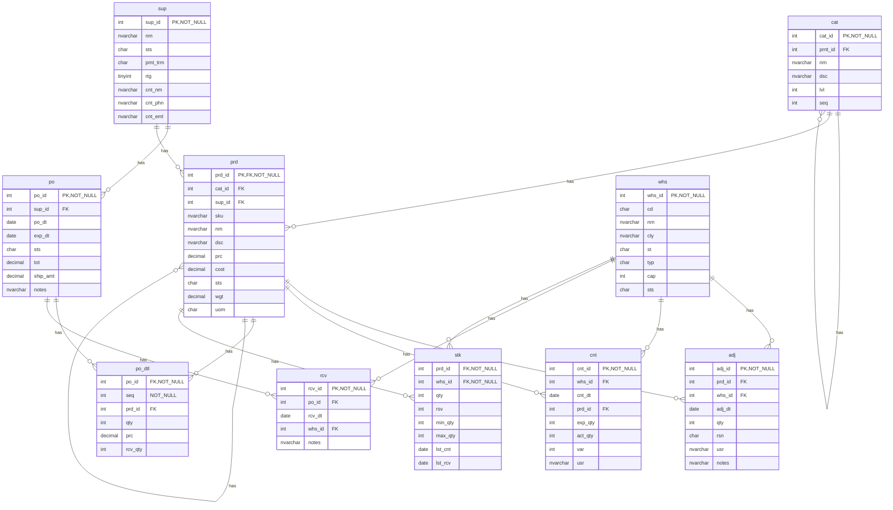
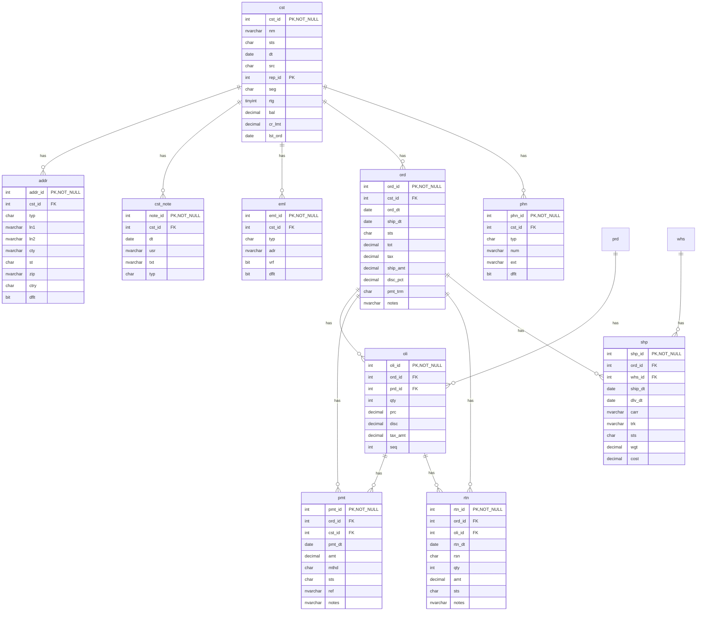

# Database Documentation: LousyDB

**Server**: localhost
**Generated**: 2025-11-09T04:48:51.469Z
**Total Iterations**: 33

## Analysis Summary

- **Status**: converged
- **Iterations**: 33
- **Tokens Used**: 251,683
- **Estimated Cost**: $0.00
- **AI Model**: openai/gpt-oss-120b
- **AI Vendor**: GroqLLM
- **Temperature**: 0.1
- **Convergence**: No changes in last 2 iterations (stability achieved); All tables meet confidence threshold (0.85)

## Table of Contents

### [inv](#schema-inv) (10 tables)
- [adj](#adj)
- [cat](#cat)
- [cnt](#cnt)
- [po](#po)
- [po_dtl](#po-dtl)
- [prd](#prd)
- [rcv](#rcv)
- [stk](#stk)
- [sup](#sup)
- [whs](#whs)

### [sales](#schema-sales) (10 tables)
- [addr](#addr)
- [cst](#cst)
- [cst_note](#cst-note)
- [eml](#eml)
- [oli](#oli)
- [ord](#ord)
- [phn](#phn)
- [pmt](#pmt)
- [rtn](#rtn)
- [shp](#shp)

## Schema: inv

### Entity Relationship Diagram

### Tables

#### adj

The inv.adj table records inventory adjustments, capturing changes to product quantities at specific warehouses on given dates, along with the reason, user responsible, and optional notes.

**Row Count**: 300
**Dependency Level**: 0

**Confidence**: 96%

**Depends On**:
- [inv.prd](#prd) (via prd_id)
- [inv.whs](#whs) (via whs_id)

**Columns**:

| Column | Type | Description |
|--------|------|-------------|
| adj_id | int (PK, NOT NULL) | Surrogate primary key for each inventory adjustment record |
| prd_id | int (FK) | Identifier of the product whose inventory is being adjusted |
| whs_id | int (FK) | Identifier of the warehouse where the adjustment occurs |
| adj_dt | date | Date the adjustment was recorded |
| qty | int | Quantity change; positive for additions, negative for deductions |
| rsn | char | Reason code for the adjustment (STL=stolen, EXP=expired, DAM=damaged, COR=correction) |
| usr | nvarchar | Name of the user who performed the adjustment |
| notes | nvarchar | Free‑text comment describing the adjustment context |

#### cat

inv.cat stores inventory categories and sub‑categories in a two‑level hierarchy, defining each category's name, description, level, parent relationship, and display order.

**Row Count**: 20
**Dependency Level**: 0

**Confidence**: 97%

**Depends On**:
- [inv.cat](#cat) (via prnt_id)

**Referenced By**:
- [inv.cat](#cat)
- [inv.prd](#prd)

**Columns**:

| Column | Type | Description |
|--------|------|-------------|
| cat_id | int (PK, NOT NULL) | Unique identifier for each category or sub‑category. |
| prnt_id | int (FK) | Reference to the parent category's cat_id; null for top‑level categories. |
| nm | nvarchar | Human‑readable name of the category (e.g., "Writing", "Printers"). |
| dsc | nvarchar | Longer description of the category's purpose or contents. |
| lvl | int | Hierarchy level: 1 for root categories, 2 for sub‑categories. |
| seq | int | Display order of categories within the same parent. |

#### cnt

Stores physical inventory count records, capturing the expected system quantity versus the actual counted quantity for each product in each warehouse on a specific date, along with the variance and the user who performed the count.

**Row Count**: 250
**Dependency Level**: 0

**Confidence**: 96%

**Depends On**:
- [inv.whs](#whs) (via whs_id)
- [inv.prd](#prd) (via prd_id)

**Columns**:

| Column | Type | Description |
|--------|------|-------------|
| cnt_id | int (PK, NOT NULL) | Unique identifier for each inventory count record |
| whs_id | int (FK) | Reference to the warehouse where the count was performed |
| cnt_dt | date | Date on which the inventory count took place |
| prd_id | int (FK) | Reference to the product being counted |
| exp_qty | int | System‑recorded expected quantity for the product in the warehouse at count time |
| act_qty | int | Quantity actually counted by the user |
| var | int | Difference between actual and expected quantities (variance) |
| usr | nvarchar | Name of the user who performed the count |

#### po

This table stores purchase order header information, capturing each PO's unique identifier, supplier, order and expected delivery dates, status, total amount, shipping charge and optional notes.

**Row Count**: 150
**Dependency Level**: 0

**Confidence**: 96%

**Depends On**:
- [inv.sup](#sup) (via sup_id)

**Referenced By**:
- [inv.po_dtl](#po-dtl)
- [inv.rcv](#rcv)

**Columns**:

| Column | Type | Description |
|--------|------|-------------|
| po_id | int (PK, NOT NULL) | Unique purchase order identifier (primary key). |
| sup_id | int (FK) | Identifier of the supplier who issued the purchase order. |
| po_dt | date | Date the purchase order was created/issued. |
| exp_dt | date | Expected delivery or receipt date for the order. |
| sts | char | Current status of the purchase order (e.g., A=Approved, P=Pending, R=Received, S=Shipped, X=Cancelled). |
| tot | decimal | Total monetary value of the purchase order before shipping. |
| ship_amt | decimal | Flat shipping charge applied to the order (150) or none (0). |
| notes | nvarchar | Optional free‑text note, currently used only for 'Expedited shipping requested'. |

#### po_dtl

Stores the line‑item details for each purchase order, linking a purchase order (inv.po) to the specific product (inv.prd) being ordered, the quantity ordered, unit price, and the quantity actually received.

**Row Count**: 750
**Dependency Level**: 0

**Confidence**: 96%

**Depends On**:
- [inv.po](#po) (via po_id)
- [inv.prd](#prd) (via prd_id)

**Columns**:

| Column | Type | Description |
|--------|------|-------------|
| po_id | int (FK, NOT NULL) | Identifier of the purchase order this line belongs to; links to inv.po.po_id |
| seq | int (NOT NULL) | Sequential line number within the purchase order, defining the order of items |
| prd_id | int (FK) | Identifier of the product being ordered; links to inv.prd.prd_id |
| qty | int | Quantity of the product ordered on this line |
| prc | decimal | Unit price of the product for this line (price at time of order) |
| rcv_qty | int | Quantity of the product that has been received against this line |

#### prd

The inv.prd table is the master product catalog. It stores one row per distinct product (SKU) with its identifiers, classification, supplier, descriptive details, pricing, cost, status, weight and unit of measure, enabling inventory, purchasing and sales processes to reference a single source of product information.

**Row Count**: 177
**Dependency Level**: 0

**Confidence**: 96%

**Depends On**:
- [inv.prd](#prd) (via prd_id)
- [inv.cat](#cat) (via cat_id)
- [inv.sup](#sup) (via sup_id)

**Referenced By**:
- [inv.adj](#adj)
- [inv.cnt](#cnt)
- [inv.po_dtl](#po-dtl)
- [inv.prd](#prd)
- [inv.stk](#stk)
- [sales.oli](#oli)

**Columns**:

| Column | Type | Description |
|--------|------|-------------|
| prd_id | int (PK, FK, NOT NULL) | Unique surrogate key for each product record; primary identifier used throughout the system |
| cat_id | int (FK) | Foreign key to inv.cat identifying the product's category |
| sup_id | int (FK) | Foreign key to inv.sup identifying the product's supplier |
| sku | nvarchar | Stock Keeping Unit code, a human‑readable unique product identifier |
| nm | nvarchar | Product name, often including variant information |
| dsc | nvarchar | Short description or marketing copy for the product |
| prc | decimal | Retail selling price of the product |
| cost | decimal | Internal cost or purchase price of the product |
| sts | char | Current status of the product (A=Active, O=Obsolete, D=Discontinued) |
| wgt | decimal | Weight of the product in its base unit of measure |
| uom | char | Unit of measure for inventory transactions (EA=Each, BX=Box, CS=Case) |

#### rcv

inv.rcv stores each receipt of inventory items linked to a purchase order, recording when the goods arrived, which warehouse received them, and any remarks such as partial shipments or backorders.

**Row Count**: 120
**Dependency Level**: 0

**Confidence**: 96%

**Depends On**:
- [inv.po](#po) (via po_id)
- [inv.whs](#whs) (via whs_id)

**Columns**:

| Column | Type | Description |
|--------|------|-------------|
| rcv_id | int (PK, NOT NULL) | Unique identifier for each receipt record |
| po_id | int (FK) | Identifier of the purchase order that the receipt fulfills |
| rcv_dt | date | Date the goods were received in the warehouse |
| whs_id | int (FK) | Warehouse where the items were received |
| notes | nvarchar | Free‑text comment about the receipt, commonly indicating a partial shipment and remaining backorder |

#### stk

Stores the current inventory status for each product at each warehouse, including on‑hand quantity, reserved quantity, reorder thresholds, and the dates of the last physical count and last receipt.

**Row Count**: 1120
**Dependency Level**: 0

**Confidence**: 96%

**Depends On**:
- [inv.prd](#prd) (via prd_id)
- [inv.whs](#whs) (via whs_id)

**Columns**:

| Column | Type | Description |
|--------|------|-------------|
| prd_id | int (FK, NOT NULL) | Identifier of the product (SKU) stored in inv.prd. |
| whs_id | int (FK, NOT NULL) | Identifier of the warehouse where the product is stocked, referencing inv.whs. |
| qty | int | Current on‑hand quantity of the product at the warehouse. |
| rsv | int | Quantity of the product that is reserved for pending orders. |
| min_qty | int | Minimum desired stock level (reorder point) for the product at the warehouse. |
| max_qty | int | Maximum allowed stock level for the product at the warehouse. |
| lst_cnt | date | Date of the most recent physical inventory count for this product‑warehouse pair. |
| lst_rcv | date | Date of the most recent receipt (incoming shipment) of this product at the warehouse. |

#### sup

Master table storing supplier information, including identification, name, status, payment terms, rating, and primary contact details for each supplier.

**Row Count**: 25
**Dependency Level**: 0

**Confidence**: 96%

**Referenced By**:
- [inv.po](#po)
- [inv.prd](#prd)

**Columns**:

| Column | Type | Description |
|--------|------|-------------|
| sup_id | int (PK, NOT NULL) | Unique identifier for each supplier (primary key). |
| nm | nvarchar | Legal or trade name of the supplier. |
| sts | char | Current status of the supplier (e.g., Active, Terminated, Suspended, Inactive). |
| pmt_trm | char | Standard payment terms offered by the supplier (Net 30, Net 60, Net 45, Net 15, Cash on Delivery). |
| rtg | tinyint | Internal rating of the supplier on a scale of 1 (lowest) to 5 (highest). |
| cnt_nm | nvarchar | Name of the primary contact person at the supplier. |
| cnt_phn | nvarchar | Phone number of the primary contact. |
| cnt_eml | nvarchar | Email address of the primary contact. |

#### whs

A lookup table that stores master information about each warehouse used in the inventory and shipping processes, including its unique identifier, short code, full name, location (city and state), type, capacity, and operational status.

**Row Count**: 8
**Dependency Level**: 0

**Confidence**: 96%

**Referenced By**:
- [inv.adj](#adj)
- [inv.cnt](#cnt)
- [inv.rcv](#rcv)
- [inv.stk](#stk)
- [sales.shp](#shp)

**Columns**:

| Column | Type | Description |
|--------|------|-------------|
| whs_id | int (PK, NOT NULL) | Unique identifier for each warehouse record |
| cd | char | Short alphanumeric code for the warehouse (e.g., SEA, NYC) |
| nm | nvarchar | Full descriptive name of the warehouse location |
| cty | nvarchar | City where the warehouse is located |
| st | char | Two‑letter state abbreviation for the warehouse location |
| typ | char | Warehouse type code (R=Regional, M=Manufacturing, D=Distribution) |
| cap | int | Maximum capacity of the warehouse (e.g., square footage or unit volume) |
| sts | char | Operational status of the warehouse (A=Active, M=Maintenance) |

## Schema: sales

### Entity Relationship Diagram

### Tables

#### addr

Stores individual address records for customers, including street lines, city, state, zip, country, address type (shipping, office, billing) and a default flag indicating the primary address for the customer.

**Row Count**: 800
**Dependency Level**: 0

**Confidence**: 97%

**Depends On**:
- [sales.cst](#cst) (via cst_id)

**Columns**:

| Column | Type | Description |
|--------|------|-------------|
| addr_id | int (PK, NOT NULL) | Surrogate primary key for the address record |
| cst_id | int (FK) | Foreign key linking the address to a customer in sales.cst |
| typ | char | Address type code: S=Shipping, O=Office, B=Billing |
| ln1 | nvarchar | First line of the street address (e.g., street number and name) |
| ln2 | nvarchar | Second address line, usually suite or unit number; optional |
| cty | nvarchar | City name of the address |
| st | char | Two‑letter US state abbreviation |
| zip | nvarchar | 5‑digit ZIP code |
| ctry | char | Country code, always 'US' |
| dflt | bit | Flag indicating whether this address is the default for the customer |

#### cst

Central customer master table for the sales domain that stores core customer attributes (ID, name, status, acquisition source, sales rep, market segment, rating, balance, credit limit, last order date) and serves as the primary entity referenced by related tables for multiple addresses, emails, phone numbers, notes, and orders, enabling one‑to‑many relationships for contact details and interaction history.

**Row Count**: 500
**Dependency Level**: 0

**Confidence**: 97%

**Referenced By**:
- [sales.addr](#addr)
- [sales.cst_note](#cst-note)
- [sales.eml](#eml)
- [sales.ord](#ord)
- [sales.phn](#phn)

**Columns**:

| Column | Type | Description |
|--------|------|-------------|
| cst_id | int (PK, NOT NULL) | Unique identifier for each customer (primary key). |
| nm | nvarchar | Customer name, typically a company or individual name. |
| sts | char | Current status of the customer (e.g., A=Active, I=Inactive, S=Suspended, T=Terminated). |
| dt | date | Date the customer record was created or the customer was onboarded. |
| src | char | Acquisition source of the customer (WB=Web, ST=Store, RF=Referral, PH=Phone). |
| rep_id | int (PK) | Identifier of the sales representative assigned to the customer. |
| seg | char | Market segment classification (W=Wholesale, R=Retail, E=E‑commerce). |
| rtg | tinyint | Customer rating on a scale of 1 (lowest) to 5 (highest). |
| bal | decimal | Current monetary balance owed by the customer. |
| cr_lmt | decimal | Credit limit assigned to the customer. |
| lst_ord | date | Date of the most recent order placed by the customer (nullable). |

#### cst_note

Stores individual notes or interaction records for each customer, capturing when, by whom, and what was communicated, along with a short type code indicating the communication channel.

**Row Count**: 450
**Dependency Level**: 0

**Confidence**: 97%

**Depends On**:
- [sales.cst](#cst) (via cst_id)

**Columns**:

| Column | Type | Description |
|--------|------|-------------|
| note_id | int (PK, NOT NULL) | Unique identifier for each customer note record. |
| cst_id | int (FK) | Identifier of the customer to which the note pertains. |
| dt | date | Date when the note was created or the interaction occurred. |
| usr | nvarchar | Name of the sales employee or user who recorded the note. |
| txt | nvarchar | Full text description of the interaction or note content. |
| typ | char | Single‑character code indicating the communication type (M=Meeting, E=Email, O=Phone/Other, C=Call). |

#### eml

Stores email address records for customers, including address, type, verification status, and default flag

**Row Count**: 550
**Dependency Level**: 0

**Confidence**: 96%

**Depends On**:
- [sales.cst](#cst) (via cst_id)

**Columns**:

| Column | Type | Description |
|--------|------|-------------|
| eml_id | int (PK, NOT NULL) | Unique identifier for each email record |
| cst_id | int (FK) | Identifier of the customer that owns the email address |
| typ | char | Category of the email address (e.g., Work, Personal, Other) |
| adr | nvarchar | The actual email address string |
| vrf | bit | Flag indicating whether the email address has been verified |
| dflt | bit | Flag indicating whether this email is the default/contact email for the customer |

#### oli

Stores individual line items for each sales order, capturing product, quantity, price, discount, tax, and line sequence, and acts as the reference point for payment and return processing, enabling partial payments and item‑specific returns.

**Row Count**: 6998
**Dependency Level**: 0

**Confidence**: 97%

**Depends On**:
- [sales.ord](#ord) (via ord_id)
- [inv.prd](#prd) (via prd_id)

**Referenced By**:
- [sales.pmt](#pmt)
- [sales.rtn](#rtn)

**Columns**:

| Column | Type | Description |
|--------|------|-------------|
| oli_id | int (PK, NOT NULL) | Unique identifier for the order line item. |
| ord_id | int (FK) | Identifier of the parent sales order to which this line belongs. |
| prd_id | int (FK) | Identifier of the product being sold on this line. |
| qty | int | Quantity of the product ordered on this line. |
| prc | decimal | Unit price of the product at the time of the order. |
| disc | decimal | Discount amount applied to this line (if any). |
| tax_amt | decimal | Tax amount calculated for this line. |
| seq | int | Sequence number of the line within the order (line position). |

#### ord

The sales.ord table stores individual sales orders, each linked to a single customer. It records order and shipping dates, a four‑value shipping status code (D,N,S,P), financial totals (subtotal, tax, shipping amount, discount percent, payment terms, notes) and uses tiered shipping cost values (15, 25, 45). An order can have up to six line‑item rows in the child sales.oli table, confirming a business rule limiting line items per order. Payments are captured at the customer level and may exist without a direct order reference, while returns are tied back to the originating order.

**Row Count**: 2000
**Dependency Level**: 0

**Confidence**: 97%

**Depends On**:
- [sales.cst](#cst) (via cst_id)

**Referenced By**:
- [sales.oli](#oli)
- [sales.pmt](#pmt)
- [sales.rtn](#rtn)
- [sales.shp](#shp)

**Columns**:

| Column | Type | Description |
|--------|------|-------------|
| ord_id | int (PK, NOT NULL) | Unique identifier for each sales order. |
| cst_id | int (FK) | Identifier of the customer who placed the order. |
| ord_dt | date | Date the order was created. |
| ship_dt | date | Date the order was shipped; may be null for unshipped orders. |
| sts | char | Current status of the order (e.g., D=Draft, C=Cancelled, S=Shipped, P=Pending, X=Closed). |
| tot | decimal | Total monetary amount of the order before tax and discounts. |
| tax | decimal | Tax amount applied to the order. |
| ship_amt | decimal | Shipping charge for the order (0, 15, or 25). |
| disc_pct | decimal | Discount percentage applied to the order (0 or 10%). |
| pmt_trm | char | Payment terms for the order (e.g., N30 = Net 30 days, COD = Cash on Delivery). |
| notes | nvarchar | Optional free‑text notes about the order; currently only used for rush‑order indication. |

#### phn

Stores phone contact information for customers, including number, type, optional extension, and a flag indicating the default phone for each customer.

**Row Count**: 600
**Dependency Level**: 0

**Confidence**: 98%

**Depends On**:
- [sales.cst](#cst) (via cst_id)

**Columns**:

| Column | Type | Description |
|--------|------|-------------|
| phn_id | int (PK, NOT NULL) | Unique identifier for each phone record |
| cst_id | int (FK) | Identifier of the customer to which the phone belongs |
| typ | char | Type of phone (e.g., Work, Mobile, Home, Fax) |
| num | nvarchar | The phone number value |
| ext | nvarchar | Phone extension, optional |
| dflt | bit | Flag indicating whether this phone is the default for the customer |

#### pmt

The table stores individual payment records for sales, capturing when a payment was made, its amount, payment method, status, reference code, and optional notes. Each payment is uniquely identified and can be linked to a specific order line item (sales.oli) and to the customer who made the payment (sales.ord).

**Row Count**: 2200
**Dependency Level**: 0

**Confidence**: 97%

**Depends On**:
- [sales.oli](#oli) (via ord_id)
- [sales.ord](#ord) (via cst_id)

**Columns**:

| Column | Type | Description |
|--------|------|-------------|
| pmt_id | int (PK, NOT NULL) | Unique identifier for each payment record. |
| ord_id | int (FK) | Identifier of the order line item (sales.oli) that the payment is associated with; nullable for payments not tied to a specific line. |
| cst_id | int (FK) | Identifier of the customer (sales.ord) who made the payment. |
| pmt_dt | date | Date the payment was received or recorded. |
| amt | decimal | Monetary amount of the payment. |
| mthd | char | Payment method code (WR=Wire, CA=Cash, CK=Check, CC=Credit Card). |
| sts | char | Current status of the payment (A=Approved, F=Failed, P=Pending, R=Refunded). |
| ref | nvarchar | External reference number or code for the payment, e.g., 'PMT-2023-01246'. |
| notes | nvarchar | Optional free‑text notes about the payment; frequently indicates account credit usage. |

#### rtn

The table stores individual product return records, linking each return to a specific sales order and its line item, and capturing return date, reason, quantity, monetary amount, status, and optional notes.

**Row Count**: 150
**Dependency Level**: 0

**Confidence**: 96%

**Depends On**:
- [sales.ord](#ord) (via ord_id)
- [sales.oli](#oli) (via oli_id)

**Columns**:

| Column | Type | Description |
|--------|------|-------------|
| rtn_id | int (PK, NOT NULL) | Unique identifier for each return record. |
| ord_id | int (FK) | Identifier of the sales order to which the return belongs. |
| oli_id | int (FK) | Identifier of the specific order line item being returned. |
| rtn_dt | date | Date when the return was processed. |
| rsn | char | Reason code for the return (e.g., Wrong item, Dead on Arrival, Damaged, Customer changed mind). |
| qty | int | Quantity of items returned for the line item. |
| amt | decimal | Monetary amount associated with the returned quantity. |
| sts | char | Current processing status of the return (e.g., Approved, Rejected, Pending, Completed). |
| notes | nvarchar | Free‑text note elaborating on the return reason. |

#### shp

The table stores individual shipment records for sales orders, capturing when each order was shipped, delivery dates, carrier information, tracking numbers, shipment status, weight, and shipping cost. It links each shipment to its originating order and the warehouse that dispatched it.

**Row Count**: 1500
**Dependency Level**: 0

**Confidence**: 96%

**Depends On**:
- [sales.ord](#ord) (via ord_id)
- [inv.whs](#whs) (via whs_id)

**Columns**:

| Column | Type | Description |
|--------|------|-------------|
| shp_id | int (PK, NOT NULL) | Unique identifier for each shipment record. |
| ord_id | int (FK) | Reference to the sales order that is being shipped. |
| whs_id | int (FK) | Identifier of the warehouse from which the shipment originated. |
| ship_dt | date | Date the shipment left the warehouse. |
| dlv_dt | date | Actual delivery date of the shipment; may be null if not yet delivered. |
| carr | nvarchar | Carrier used for the shipment (e.g., USPS Priority, DHL Express). |
| trk | nvarchar | Tracking number assigned by the carrier. |
| sts | char | Current shipment status code: D=Delivered, N=Not shipped, S=Shipped, P=Pending. |
| wgt | decimal | Weight of the shipment (likely in pounds or kilograms). |
| cost | decimal | Shipping cost charged for the shipment. |

---

## Appendix: Iteration Analysis

This section documents the iterative refinement process used to generate the database documentation, highlighting corrections and improvements discovered through backpropagation.

### Summary

- **Total Tables with Refinements**: 20
- **Total Columns with Refinements**: 162
- **Total Refinement Iterations**: 258
- **Refinements Triggered by Backpropagation**: 8

### Tables Refined Through Iteration

#### [adj](#adj)

**Iterations**: 3 | **Trigger**: refinement

**Iteration 1** (initial):

> The inv.adj table records inventory adjustments made to products at specific warehouses, capturing when the adjustment occurred, the quantity change, the reason for the adjustment, the user who performed it, and any explanatory notes.

*Reasoning*: Column names and data types point to an adjustment log: adj_id (unique identifier), prd_id (product reference), whs_id (warehouse reference), adj_dt (date of adjustment), qty (positive or negative quantity), rsn (reason codes like STL, EXP, DAM, COR), usr (user name), and notes (free‑text explanation). Sample values for prd_id and whs_id match typical product and warehouse IDs, and the reason codes align with common inventory adjustment reasons (stock loss, expiration, damage, correction). The high uniqueness of adj_id and adj_dt indicates each row is a distinct adjustment event. The table has no declared foreign keys, but the column patterns strongly suggest foreign key relationships to inv.prd and inv.whs.

---

**Iteration 2** (refinement):

> The inv.adj table records inventory adjustments, capturing changes to product quantities in specific warehouses along with the reason, date, user and notes for each adjustment.

*Reasoning*: Column names (adj_id, prd_id, whs_id, adj_dt, qty, rsn, usr, notes) together with foreign keys to inv.prd and inv.whs indicate a log of stock changes. The qty column contains positive and negative values, typical for additions and subtractions. The rsn column has limited values (STL, EXP, DAM, COR) that map to common adjustment reasons (stolen, expired, damaged, correction). The high uniqueness of adj_id and adj_dt confirms each row is a distinct adjustment event.

---

**Iteration 3** (refinement):

> The inv.adj table records inventory adjustments, capturing changes to product quantities at specific warehouses on given dates, along with the reason, user responsible, and optional notes.

*Reasoning*: Column names (adj_id, prd_id, whs_id, adj_dt, qty, rsn, usr, notes) together with data types and sample values indicate a log of stock adjustments. adj_id is a unique primary key. prd_id and whs_id are foreign keys to inv.prd and inv.whs, tying each adjustment to a product and a warehouse. adj_dt holds the adjustment date. qty contains both positive and negative integers, reflecting additions or subtractions of stock. rsn holds a short code (STL, EXP, DAM, COR) that matches typical adjustment reasons (stolen, expired, damaged, correction). usr stores the name of the employee making the entry, and notes provides a free‑text explanation. The 100% uniqueness of adj_id and adj_dt, plus the limited set of rsn values, reinforce the interpretation as an audit‑style adjustment log.

#### [cat](#cat)

**Iterations**: 4 | **Trigger**: refinement

**Iteration 1** (initial):

> A lookup table that stores inventory categories and sub‑categories, providing a hierarchical classification for products

*Reasoning*: The table has a unique identifier column cat_id (PK) with 20 distinct values, a name (nm) and description (dsc) for each category, a level column (lvl) with values 1 or 2 indicating top‑level or sub‑level, a parent identifier (prnt_id) that repeats only six distinct values and matches other cat_id values, and a sequence column (seq) to order categories within a parent. These patterns match a typical category hierarchy used in the inventory schema (inv.cat).

---

**Iteration 2** (refinement):

> Stores inventory categories and sub‑categories in a hierarchical structure for the inventory system

*Reasoning*: Column names cat_id (primary key), prnt_id (foreign key to inv.cat.cat_id), nm (name), dsc (description), lvl (level indicator) and seq (ordering) together with sample values (e.g., top‑level categories like "Writing", sub‑categories like "Cleaning") and the foreign‑key relationship to inv.cat indicate this table defines the category taxonomy used to classify products in the inventory module

---

**Iteration 3** (backpropagation):

> Stores inventory categories and sub‑categories in a two‑level hierarchical structure, with lvl 1 rows as root categories and lvl 2 rows as their sub‑categories. The seq column defines the ordering of sibling categories under each parent. Products reference a single category, establishing a one‑to‑many relationship from categories to products.

*Reasoning*: The new insights specify that the hierarchy is limited to two levels (root and sub‑categories) and that the seq column controls sibling ordering—details not captured in the original description. Additionally, the product table’s single‑category reference confirms a one‑to‑many link from categories to products, clarifying the table’s role in classifying inventory items. These clarifications enhance the accuracy and completeness of the description, so a revision is warranted.

---

**Iteration 4** (refinement):

> inv.cat stores inventory categories and sub‑categories in a two‑level hierarchy, defining each category's name, description, level, parent relationship, and display order.

*Reasoning*: The table has a primary key cat_id, a foreign key prnt_id that references inv.cat.cat_id, and columns nm (name) and dsc (description) with unique values for each category. The lvl column contains only 1 or 2, indicating root (level 1) and child (level 2) categories. The seq column provides ordering among siblings. The relationship list confirms it references inv.cat, matching a typical hierarchical category structure used by inventory (inv) modules.

#### [cnt](#cnt)

**Iterations**: 3 | **Trigger**: refinement

**Iteration 1** (initial):

> Stores inventory count records that capture the expected (theoretical) and actual on‑hand quantities of each product in each warehouse on a specific date, along with the variance and the user who performed the count.

*Reasoning*: Column names cnt_id (count record identifier), whs_id (warehouse identifier), cnt_dt (count date), prd_id (product identifier), exp_qty (expected quantity), act_qty (actual quantity), var (variance) and usr (user name) together describe a physical inventory counting process. The high cardinality of cnt_id, prd_id and dates, plus the limited distinct values for whs_id (1‑8) match typical warehouse IDs. Sample values for exp_qty/act_qty are numeric stock levels. The presence of product and warehouse identifiers suggests foreign keys to inv.prd and inv.whs.

---

**Iteration 2** (refinement):

> Stores individual inventory count transactions, recording the expected system quantity versus the physically counted quantity for a specific product at a specific warehouse on a given date, along with the variance and the user who performed the count.

*Reasoning*: The primary key cnt_id uniquely identifies each count record. whs_id and prd_id are foreign keys to inv.whs and inv.prd, indicating the count is tied to a warehouse and a product. cnt_dt is a date field, showing when the count occurred. exp_qty and act_qty hold numeric quantities, and var holds the difference (often small values like 0, -5, 5, -10). usr is a string with user names, suggesting who performed the count. The pattern of one row per product‑warehouse‑date aligns with typical inventory cycle‑count or physical‑count tables.

---

**Iteration 3** (refinement):

> Stores physical inventory count records, capturing the expected system quantity versus the actual counted quantity for each product in each warehouse on a specific date, along with the variance and the user who performed the count.

*Reasoning*: The primary key cnt_id uniquely identifies each count event. whs_id and prd_id are foreign keys to inv.whs and inv.prd, indicating the count is tied to a specific warehouse and product. cnt_dt is a date of the count. exp_qty and act_qty represent expected and actual quantities, while var (limited to -10,-5,0,5) records the variance. usr stores the name of the employee performing the count. High uniqueness of cnt_id, exp_qty, act_qty and the presence of variance values support a physical inventory reconciliation purpose.

#### [po](#po)

**Iterations**: 5 | **Trigger**: refinement

**Iteration 1** (initial):

> Purchase order header table that records each purchase order placed with a supplier, including order and expected dates, status, total amount, shipping charge, and optional notes

*Reasoning*: Column names po_id (unique order identifier) and sup_id (supplier identifier) together form the primary key, typical of a purchase‑order header. po_dt and exp_dt are dates for order placement and expected delivery. sts holds single‑character status codes (X,S,R,P,A). tot is the monetary total, ship_amt is a fixed shipping fee (150 or 0), and notes contains occasional free‑text such as "Expedited shipping requested". The presence of sup_id strongly suggests a foreign key to the supplier table (inv.sup). No other foreign keys are evident.

---

**Iteration 2** (backpropagation):

> Purchase order header table that records each purchase order placed with a supplier, including order and expected dates, status, total amount, shipping charge, optional notes, and serves as the parent for up to seven line‑item rows (seq 1‑7) allowing split or partial shipments.

*Reasoning*: The new insights reveal that the table is linked to line‑item rows via a seq column limited to values 1‑7 and that orders may be fulfilled over multiple receipt entries, indicating support for split deliveries. This adds important context about child‑table relationships and shipment handling that were not captured in the original description, so the description is revised to reflect these capabilities.

---

**Iteration 3** (refinement):

> The table stores purchase order master records (inv.po). Each row represents a single purchase order placed with a supplier, capturing order dates, expected delivery, status, total amount, shipping charge, and optional notes.

*Reasoning*: Column names (po_id, sup_id, po_dt, exp_dt, sts, tot, ship_amt, notes) and their data types match typical purchase order attributes. po_id is a unique primary key. sup_id is a foreign key to inv.sup, indicating the supplier. Dates correspond to order and expected delivery. sts contains a small set of status codes (X, S, R, P, A). tot is a monetary total, ship_amt is a flat shipping fee (0 or 150). The table is referenced by inv.po_dtl (order line items) and inv.rcv (receipts), confirming it is a purchase order header.

---

**Iteration 4** (backpropagation):

> The inv.po table stores purchase order master records. Each row represents a single purchase order placed with a supplier, capturing order date, expected delivery, status, total amount, shipping charge, and optional notes. A purchase order can contain up to seven line‑item entries (seq 1‑7) in inv.po_dtl, and it may be fulfilled through multiple receipt entries in inv.rcv, allowing partial shipments and backorder handling.

*Reasoning*: The new insights reveal that purchase orders are limited to a maximum of seven line items and can be satisfied by multiple receipt records, indicating partial shipments and backorder support. These details extend the original description, which did not mention the line‑item limit or multi‑shipment capability, so the description is revised to incorporate them.

---

**Iteration 5** (refinement):

> This table stores purchase order header information, capturing each PO's unique identifier, supplier, order and expected delivery dates, status, total amount, shipping charge and optional notes.

*Reasoning*: The primary key po_id uniquely identifies each row (150 distinct values). sup_id is a foreign key to inv.sup, indicating the supplier for the PO. po_dt and exp_dt are dates for order and expected receipt. sts holds single‑character status codes (X,S,R,P,A). tot is the monetary total of the order, ship_amt is a fixed shipping fee (150 or 0), and notes contains an optional comment about expedited shipping. The table is referenced by inv.po_dtl (order line items) and inv.rcv (receiving records), confirming it is a purchase‑order header.

#### [po_dtl](#po-dtl)

**Iterations**: 3 | **Trigger**: refinement

**Iteration 1** (initial):

> Stores line‑item details for each purchase order, linking a purchase order (po_id) to the products ordered (prd_id) with quantity, price, and received quantity information.

*Reasoning*: Column names po_id, seq, prd_id, qty, prc and rcv_qty match typical purchase‑order‑detail structures. po_id and prd_id are marked as primary keys and have 100% unique values, indicating they are identifiers linking to parent tables. seq values range 1‑7, suggesting line numbers within an order. qty and rcv_qty contain a small set of discrete values, typical for ordered and received quantities. The price column (prc) is decimal with many unique values, representing unit price per line.

---

**Iteration 2** (refinement):

> Stores each line item of a purchase order, linking a purchase order (inv.po) to a product (inv.prd) with ordered quantity, unit price, and received quantity

*Reasoning*: Columns po_id and prd_id are foreign keys to inv.po and inv.prd respectively, indicating a child‑detail relationship. seq provides the line order (values 1‑7). qty holds ordered amounts (standard batch sizes). prc records the unit price at order time. rcv_qty tracks how many units have been received. The pattern matches a typical purchase‑order‑detail table.

---

**Iteration 3** (refinement):

> Stores the line‑item details for each purchase order, linking a purchase order (inv.po) to the specific product (inv.prd) being ordered, the quantity ordered, unit price, and the quantity actually received.

*Reasoning*: The table contains po_id (FK to inv.po), seq (line sequence number), prd_id (FK to inv.prd), qty (ordered quantity), prc (unit price), and rcv_qty (received quantity). The presence of a foreign key to inv.po and inv.prd, together with a sequential line number, matches the typical structure of a purchase‑order‑detail table. Sample values show distinct po_id values (150 unique PO headers) and seq values ranging 1‑7, confirming multiple lines per PO. Qty and rcv_qty have limited distinct values, indicating standard order/receipt quantities. The price column varies per line, consistent with line‑item pricing.

#### [prd](#prd)

**Iterations**: 3 | **Trigger**: refinement

**Iteration 1** (initial):

> Stores detailed information about each product offered, including identifiers, categorization, supplier, SKU, name, description, pricing, cost, status, weight and unit of measure.

*Reasoning*: Column prd_id is a unique integer and typical primary key for a product master. cat_id and sup_id have low distinct counts (11 and 25) matching typical lookup tables inv.cat (categories) and inv.sup (suppliers). sku, nm, dsc provide product codes, names and descriptions. prc and cost are monetary values. sts is a single‑character status flag (A=Active, O=On‑order, D=Discontinued). wgt and uom give physical weight and unit. The table is referenced by inv.adj, inv.cnt, inv.po_dtl, indicating it is a core product entity. Hence it is a product master table in an inventory/sales system.

---

**Iteration 2** (refinement):

> Stores a distinct product record for each SKU, including its category, supplier, name, description, pricing, cost, status, weight and unit of measure. Serves as the master product catalog used by inventory, purchasing and sales processes.

*Reasoning*: Column names (sku, nm, dsc, prc, cost, sts, wgt, uom) and sample values clearly describe product attributes. prd_id is a unique primary key. cat_id and sup_id link to inv.cat and inv.sup, indicating categorization and supplier association. High uniqueness of sku, nm and prd_id confirms each row represents a single product. The table is referenced by many inventory and sales tables, typical for a product master.

---

**Iteration 3** (refinement):

> The inv.prd table is the master product catalog. It stores one row per distinct product (SKU) with its identifiers, classification, supplier, descriptive details, pricing, cost, status, weight and unit of measure, enabling inventory, purchasing and sales processes to reference a single source of product information.

*Reasoning*: Column names such as prd_id, sku, nm (name), dsc (description), prc (price), cost, sts (status), wgt (weight) and uom (unit of measure) directly describe product attributes. prd_id is unique and primary, sku is also unique, confirming a product identifier. cat_id and sup_id are foreign keys to inv.cat and inv.sup, indicating each product belongs to a category and has a supplier. Sample values (e.g., "Apple MacBook Air M2 - Variant 2", price 1949.99) match typical product records. The table is referenced by many inventory and sales tables, confirming its role as the central product definition.

#### [rcv](#rcv)

**Iterations**: 3 | **Trigger**: refinement

**Iteration 1** (initial):

> Stores records of inventory receipts against purchase orders, capturing when and where items were received and any partial‑shipment notes.

*Reasoning*: Column names rcv_id (receipt ID), po_id (purchase order ID), rcv_dt (receipt date), whs_id (warehouse ID) and notes directly describe a receipt event. Sample dates are recent, notes repeatedly state "Partial shipment received - balance on backorder" indicating receipt of partial PO quantities. Distinct counts show each ID is unique, typical for primary keys. The presence of po_id and whs_id aligns with foreign‑key candidates to inv.po and inv.whs respectively.

---

**Iteration 2** (refinement):

> The inv.rcv table records individual receipt events of goods against purchase orders, capturing when items arrived, at which warehouse, and any notes about partial shipments or backorders.

*Reasoning*: Column rcv_id is a unique primary key (100% unique), indicating each row is a distinct receipt record. po_id is a foreign key to inv.po, linking each receipt to a specific purchase order. rcv_dt stores the receipt date, confirming the event timing. whs_id references inv.whs, identifying the warehouse where the goods were received. The notes column, mostly null, contains the text "Partial shipment received - balance on backorder" when a receipt represents a partial delivery, indicating the business process of handling backordered items. The combination of these columns and their relationships points to a receipt/receiving log in an inventory system.

---

**Iteration 3** (refinement):

> inv.rcv stores each receipt of inventory items linked to a purchase order, recording when the goods arrived, which warehouse received them, and any remarks such as partial shipments or backorders.

*Reasoning*: The primary key rcv_id uniquely identifies each receipt. The po_id column is a foreign key to inv.po, indicating the receipt is tied to a purchase order. The rcv_dt column holds dates of receipt. The whs_id column references inv.whs, showing the warehouse location. The notes column consistently contains the phrase "Partial shipment received - balance on backorder", implying the table tracks partial deliveries. All 120 rows are unique, matching typical receipt transaction logs.

#### [stk](#stk)

**Iterations**: 3 | **Trigger**: refinement

**Iteration 1** (initial):

> Stores the current inventory status of each product at each warehouse, including on‑hand quantity, reserved quantity, safety stock limits, and the dates of the last physical count and last receipt.

*Reasoning*: The composite primary key (prd_id, whs_id) indicates a many‑to‑many relationship between products and warehouses. Columns qty, rsv, min_qty, max_qty are typical inventory metrics. lst_cnt and lst_rcv are dates tracking the most recent count and receipt. Sample values (e.g., qty up to 11760, min_qty around 10‑55, max_qty up to 1160) match stock level data. The presence of distinct low‑cardinality whs_id values (8) suggests a lookup table of warehouses, while prd_id has 200 distinct values, matching a product catalog.

---

**Iteration 2** (refinement):

> Stores inventory levels for each product at each warehouse, including current on‑hand quantity, reserved quantity, reorder thresholds, and dates of the last physical count and last receipt.

*Reasoning*: The table contains prd_id and whs_id, both foreign keys to inv.prd and inv.whs, indicating a many‑to‑many relationship between products and warehouses. Columns qty, rsv, min_qty, max_qty are typical inventory metrics (on‑hand, reserved, minimum and maximum stock levels). lst_cnt and lst_rcv are dates, matching common fields for last count and last receipt. Sample values (e.g., qty up to 11760, min_qty around 10‑55, max_qty up to 1160) align with stock quantities. High distinct counts (100% unique) for each column suggest each row is a unique product‑warehouse record.

---

**Iteration 3** (refinement):

> Stores the current inventory status for each product at each warehouse, including on‑hand quantity, reserved quantity, reorder thresholds, and the dates of the last physical count and last receipt.

*Reasoning*: The table contains prd_id and whs_id, both foreign keys to inv.prd and inv.whs, indicating a many‑to‑many relationship between products and warehouses. qty and rsv hold numeric stock levels, while min_qty and max_qty are typical reorder thresholds. lst_cnt and lst_rcv are dates that match inventory counting and receipt events. Sample values (e.g., qty up to 11760, min_qty around 10‑55, max_qty up to 1160) align with stock management data.

#### [sup](#sup)

**Iterations**: 2 | **Trigger**: refinement

**Iteration 1** (initial):

> This table stores master records for suppliers/vendors that provide goods and services to the organization. Each row defines a unique supplier with its name, status, payment terms, rating, and primary contact details, serving as a reference for purchase orders and product sourcing.

*Reasoning*: The primary key sup_id uniquely identifies each supplier (25 distinct values for 25 rows). The column nm contains company names, confirming a vendor entity. sts holds single‑character status codes (A,T,S,I) typical for active/inactive flags. pmt_trm lists standard payment terms (N30,N60,N45,N15,COD). rtg is a 1‑5 rating, suggesting an internal quality score. cnt_nm, cnt_phn, and cnt_eml store the main contact person's name, phone, and email, respectively. The table is referenced by inv.po (purchase orders) and inv.prd (products), indicating it is a foundational lookup for supplier information.

---

**Iteration 2** (refinement):

> Master table storing supplier information, including identification, name, status, payment terms, rating, and primary contact details for each supplier.

*Reasoning*: Column sup_id is a unique integer primary key, indicating a master entity. The nm column holds supplier names. sts contains single‑character status codes (A,T,S,I) typical for active/inactive/etc. pmt_trm lists payment terms (N30,N60,N45,N15,COD). rtg is a 1‑5 rating. cnt_nm, cnt_phn, cnt_eml store the main contact person's name, phone, and email. The table is referenced by inv.po and inv.prd, confirming it represents suppliers used in purchase orders and product sourcing. No foreign key columns are present, so it is a foundational lookup table.

#### [whs](#whs)

**Iterations**: 2 | **Trigger**: refinement

**Iteration 1** (initial):

> Stores master data for each warehouse used in the inventory system, including its identifier, short code, full name, location, type, capacity and operational status.

*Reasoning*: The table contains a primary key column whs_id and descriptive columns such as cd (city/airport codes like SEA, NYC), nm (full warehouse names), cty and st (city and state), typ (single‑letter codes R, M, D suggesting warehouse type), cap (numeric capacity) and sts (status A/M). The table is referenced by several inventory tables (inv.adj, inv.cnt, inv.rcv, inv.stk) and has no foreign key dependencies, indicating it is a foundational lookup table, matching the inv.whs table listed in the schema.

---

**Iteration 2** (refinement):

> A lookup table that stores master information about each warehouse used in the inventory and shipping processes, including its unique identifier, short code, full name, location (city and state), type, capacity, and operational status.

*Reasoning*: The primary key column whs_id is unique for each row and is referenced by multiple inventory and sales tables (inv.adj, inv.cnt, inv.rcv, inv.stk, sales.shp), indicating it is a central entity. Columns cd and nm contain short codes and descriptive names of locations such as "SEA" and "Seattle Regional Warehouse", confirming the rows represent physical warehouse sites. cty and st hold city and state values matching US locations. typ has three distinct single‑letter values (R, M, D) typical of an enum describing warehouse type. cap holds large integer values that look like capacity figures. sts is a two‑value status flag (A, M) likely indicating active or maintenance mode. No foreign‑key columns are present, reinforcing its role as a foundational lookup table.

#### [addr](#addr)

**Iterations**: 2 | **Trigger**: refinement

**Iteration 1** (initial):

> Stores mailing and location information for customers, including street lines, city, state, zip, country, address type (e.g., Shipping, Office, Billing) and a flag indicating the default address for the customer.

*Reasoning*: Column names addr_id and cst_id form a composite primary key, indicating each row uniquely identifies an address belonging to a specific customer. The typ column has three distinct values (S,O,B) matching common address categories. ln1/ln2 hold street address lines, cty, st, zip, ctry store city/state/zip/country. The dflt bit marks the primary address. Sample data (e.g., "466 Main Street", "Los Angeles", "MA", zip codes) aligns with typical US address records. The presence of cst_id suggests a foreign key to sales.cst, confirming this is a customer address lookup table.

---

**Iteration 2** (refinement):

> Stores individual address records for customers, including street lines, city, state, zip, country, address type (shipping, office, billing) and a default flag indicating the primary address for the customer.

*Reasoning*: The primary key addr_id uniquely identifies each row (800 distinct values). cst_id is a foreign key to sales.cst, linking each address to a customer. The typ column has three distinct values (S,O,B) matching common address categories (Shipping, Office, Billing). ln1 and ln2 contain typical street address data, with ln2 often holding suite numbers and many nulls, indicating optional secondary line. cty, st, zip, and ctry hold standard location fields; ctry is always 'US'. The dflt bit marks the default address for a customer. The relationship to sales.cst and the address‑specific fields together show the table’s purpose as a customer address repository within the Sales domain.

#### [cst](#cst)

**Iterations**: 4 | **Trigger**: backpropagation

**Iteration 1** (initial):

> Master table storing customer information for the sales domain, including identification, contact name, status, acquisition source, assigned sales representative, market segment, rating, financial balance, credit limit, and date of last order.

*Reasoning*: The primary key cst_id uniquely identifies each row (500 unique values). The column nm contains personal or company names typical for customers. sts holds single‑letter status codes (A, S, I, T) suggesting active/inactive/etc. dt appears to be a creation or registration date (unique per customer). src values (WB, ST, RF, PH) match typical lead source codes (Web, Store, Referral, Phone). rep_id is a numeric identifier likely referencing a sales representative (though no FK table is listed). seg (W,R,E) aligns with market segments (Wholesale, Retail, Enterprise). rtg is a 1‑5 rating. bal and cr_lmt are financial fields (balance and credit limit). lst_ord records the most recent order date, nullable for customers without orders. The table is referenced by sales.addr, indicating address records link to customers. All evidence points to a customer master table, matching the listed sales.cst table.

---

**Iteration 2** (backpropagation):

> Master table storing customer information for the sales domain, including identification, contact name, status, acquisition source, assigned sales representative, market segment, rating, financial balance, credit limit, and date of last order. It also serves as a hub for related address, email, phone, and note records, supporting multiple addresses (shipping, office, billing) with a default flag, multiple email addresses with a primary flag, multiple phone numbers distinguished by type with a default flag, and multiple notes for tracking communications and follow‑ups.

*Reasoning*: The new insights reveal one‑to‑many relationships (addresses, emails, phones, notes) and default/primary flags that were not mentioned in the original description. While the core customer attributes remain the same, acknowledging these related tables clarifies the table’s role as a central entity for various contact methods and communications, necessitating an updated description.

---

**Iteration 3** (refinement):

> Stores master customer information for the sales domain, including identification, name, status, acquisition source, assigned sales representative, market segment, rating, financial balance, credit limit, and date of last order.

*Reasoning*: Column names and data types (cst_id primary key, nm name, sts status codes, dt registration date, src source codes, rep_id sales rep identifier, seg segment codes, rtg rating, bal balance, cr_lmt credit limit, lst_ord last order date) match typical customer master tables. The table is referenced by several sales-related tables (addr, cst_note, eml, ord, phn) indicating it is the central customer entity. Sample values (e.g., company-like names, status A/I, source codes WB/ST/RF/PH) support this interpretation.

---

**Iteration 4** (backpropagation):

> Central customer master table for the sales domain that stores core customer attributes (ID, name, status, acquisition source, sales rep, market segment, rating, balance, credit limit, last order date) and serves as the primary entity referenced by related tables for multiple addresses, emails, phone numbers, notes, and orders, enabling one‑to‑many relationships for contact details and interaction history.

*Reasoning*: The analysis of child tables (address, email, phone, cst_note, ord) reveals that sales.cst is not only a repository of static customer attributes but also the hub for multiple related records such as various address types, verified email contacts, phone numbers, detailed notes, and multiple orders per customer. This expands the original description, which only listed core fields, by explicitly noting the one‑to‑many relationships and the role of cst in supporting comprehensive customer contact and activity data.

#### [cst_note](#cst-note)

**Iterations**: 2 | **Trigger**: refinement

**Iteration 1** (initial):

> Stores individual interaction notes linked to customers, capturing the date, author, content, and type of each communication for sales follow‑up and relationship management

*Reasoning*: Column names note_id and cst_id form a composite primary key, with cst_id matching the customer identifier used in sales.cst. The dt column holds the note date, usr stores the employee name, txt contains the note text, and typ is a single‑character code (M,E,O,C) representing the communication channel (Meeting, Email, Call, Other). Sample values and high uniqueness confirm each row is a distinct note tied to a specific customer, typical of a customer‑notes table in the sales schema.

---

**Iteration 2** (refinement):

> Stores individual notes or interaction records for each customer, capturing when, by whom, and what was communicated, along with a short type code indicating the communication channel.

*Reasoning*: The primary key note_id uniquely identifies each entry. cst_id is a foreign key to sales.cst, linking notes to a specific customer. dt records the date of the interaction. usr contains the name of the employee who made the note. txt holds the free‑form description of the interaction, and typ is a single‑character code (M, E, O, C) that aligns with meeting, email, phone/other, and call types observed in the sample values. All columns together model a customer‑contact log, a common component of a sales CRM.

#### [eml](#eml)

**Iterations**: 2 | **Trigger**: refinement

**Iteration 1** (initial):

> Stores email addresses linked to customers, including address type, verification status, and a flag indicating the default (primary) email for each customer.

*Reasoning*: Column names and sample data show eml_id as a unique email record ID, cst_id matching customer IDs, adr containing email strings, typ with values W/P/O indicating work/personal/other, vrf as a verification boolean, and dflt as a default‑email boolean. The high uniqueness of eml_id and cst_id, plus the presence of a customer identifier, strongly suggest this is the sales.eml table that references sales.cst.

---

**Iteration 2** (refinement):

> Stores email address records for customers, including address, type, verification status, and default flag

*Reasoning*: Column eml_id is a unique primary key; cst_id is a foreign key to sales.cst indicating the email belongs to a customer; typ has three distinct single‑character values (W,P,O) suggesting email type (Work, Personal, Other); adr contains email‑style strings; vrf is a boolean likely indicating if the address has been verified; dflt is a boolean likely marking the default contact email for the customer. The relationship to sales.cst confirms this is part of the sales domain email management.

#### [oli](#oli)

**Iterations**: 4 | **Trigger**: backpropagation

**Iteration 1** (initial):

> Stores individual line items for sales orders, recording the product, quantity, unit price, discount, tax amount, and the line sequence within the order.

*Reasoning*: The table contains oli_id (unique line item ID), ord_id (order identifier), prd_id (product identifier), qty, prc (price), disc (discount), tax_amt, and seq (line sequence). The presence of ord_id and prd_id strongly suggests foreign keys to sales.ord and inv.prd respectively. Sample values and distinct counts (oli_id 6998 unique, ord_id 2000 unique, prd_id 200 unique) match typical order‑line relationships. The seq column only has values 1‑6, indicating a limited number of lines per order.

---

**Iteration 2** (backpropagation):

> Stores individual line items for sales orders, recording the product, quantity, unit price, discount, tax amount, and the line sequence within the order. Each line item can be linked to payment records, enabling payment tracking at the line‑item level.

*Reasoning*: The new insights confirm the one‑to‑many relationship with sales.ord and additionally reveal that payments are associated with sales.oli, indicating a granular billing model where each line item may have its own payment record. This extends the original description, which did not mention payment linkage, so the description is revised to reflect this capability.

---

**Iteration 3** (refinement):

> Stores individual line items for each sales order, capturing product, quantity, price, discount, tax, and line sequence within the order.

*Reasoning*: The primary key oli_id uniquely identifies each row. ord_id links to sales.ord, indicating the order this line belongs to. prd_id links to inv.prd, identifying the product sold. qty, prc, disc, tax_amt and seq are typical attributes of an order line item (quantity, unit price, discount amount, tax amount, and line order). Sample values and distinct counts support these interpretations.

---

**Iteration 4** (backpropagation):

> Stores individual line items for each sales order, capturing product, quantity, price, discount, tax, and line sequence, and acts as the reference point for payment and return processing, enabling partial payments and item‑specific returns.

*Reasoning*: The new insights reveal that sales.oli is optionally linked to payment records and that returns reference specific line items. This extends the table's role beyond merely storing order details to supporting partial payment settlement and precise return tracking, so the description should be updated to reflect these relationships.

#### [ord](#ord)

**Iterations**: 3 | **Trigger**: backpropagation

**Iteration 1** (initial):

> This table stores sales orders, capturing each order's unique identifier, customer, dates, status, monetary totals, shipping details, discounts, payment terms and optional notes.

*Reasoning*: Column names like ord_id, cst_id, ord_dt, ship_dt, sts, tot, tax, ship_amt, disc_pct, pmt_trm clearly map to typical order attributes. ord_id is unique (2000 distinct values) indicating a primary key. cst_id repeats across rows (476 distinct) and matches the customer entity in sales.cst, suggesting a foreign key. The presence of a shipping date (nullable 40%) and status codes (D,C,S,P,X) aligns with order processing. The table is referenced by sales.oli, which likely stores order line items, confirming its role as the parent order table. Sample values and low‑cardinality enums (ship_amt, disc_pct, pmt_trm) further support the order‑centric purpose.

---

**Iteration 2** (refinement):

> The table stores individual sales orders, capturing when each order was placed, its shipping details, status, financial totals, taxes, shipping charges, discounts, payment terms, and optional notes. Each order is linked to a single customer.

*Reasoning*: Column names like ord_id, ord_dt, ship_dt, sts, tot, tax, ship_amt, disc_pct, and pmt_trm are typical for an order header. ord_id is a unique primary key. cst_id is a foreign key to sales.cst, confirming the order belongs to a customer. The presence of dependent tables (sales.oli, sales.pmt, sales.rtn, sales.shp) indicates this is the order master table. Sample values and distinct counts support these interpretations.

---

**Iteration 3** (backpropagation):

> The sales.ord table stores individual sales orders, each linked to a single customer. It records order and shipping dates, a four‑value shipping status code (D,N,S,P), financial totals (subtotal, tax, shipping amount, discount percent, payment terms, notes) and uses tiered shipping cost values (15, 25, 45). An order can have up to six line‑item rows in the child sales.oli table, confirming a business rule limiting line items per order. Payments are captured at the customer level and may exist without a direct order reference, while returns are tied back to the originating order.

*Reasoning*: The new insights add concrete details that were not in the original description: a limit of six line items per order (seq column), specific shipping status codes, and tiered shipping cost categories. They also clarify that payments can be recorded independently of an order and that returns are order‑level. These points enhance the understanding of the table’s role and constraints, so the description was updated to reflect them.

#### [phn](#phn)

**Iterations**: 2 | **Trigger**: refinement

**Iteration 1** (initial):

> Stores phone contact information for customers, including number, type, extension and default flag

*Reasoning*: Column names phn_id and cst_id suggest a phone record linked to a customer; typ values W,M,H,F match common phone type codes; num contains phone‑number strings; ext is short numeric and mostly null, typical for extensions; dflt is a bit indicating default phone. The table name aligns with sales.phn in the provided list, and cst_id likely references sales.cst

---

**Iteration 2** (refinement):

> Stores phone contact information for customers, including number, type, optional extension, and a flag indicating the default phone for each customer.

*Reasoning*: The primary key phn_id uniquely identifies each phone record. cst_id is a foreign key to sales.cst, linking phones to customers. The typ column has values W, M, H, F which correspond to common phone types (Work, Mobile, Home, Fax). The num column contains phone numbers in various formats, ext holds optional extensions (many nulls), and dflt is a boolean marking the default phone for a customer. These patterns together indicate a customer phone directory table.

#### [pmt](#pmt)

**Iterations**: 2 | **Trigger**: refinement

**Iteration 1** (initial):

> This table (sales.pmt) records individual payment transactions made by customers for orders. Each row captures the payment identifier, associated order line, customer, date, amount, payment method, status, reference code and optional notes, enabling tracking of financial receipts and reconciliation.

*Reasoning*: Column names like pmt_id, ord_id, cst_id, pmt_dt, amt, mthd, sts, ref clearly indicate payment data. pmt_id is a unique primary key (2200 distinct values). ord_id is a foreign key to sales.oli (order line items), confirming the payment is tied to a specific line. cst_id links to sales.ord (customer), showing who paid. The date, amount, method (WR, CA, CK, CC) and status (A,F,P,R) match typical payment attributes. The ref column follows a "PMT-YYYY-#####" pattern, a payment reference code. notes is mostly null and contains a single repeated value, indicating optional annotation (e.g., credit applied).

---

**Iteration 2** (refinement):

> The table stores individual payment records for sales, capturing when a payment was made, its amount, payment method, status, reference code, and optional notes. Each payment is uniquely identified and can be linked to a specific order line item (sales.oli) and to the customer who made the payment (sales.ord).

*Reasoning*: Column names like pmt_id, pmt_dt, amt, mthd, sts, and ref clearly indicate payment details. The primary key pmt_id is unique for each row. Foreign keys ord_id → sales.oli.oli_id and cst_id → sales.ord.cst_id connect payments to order line items and customers. Sample values (e.g., payment methods WR, CA, CK, CC and statuses A, F, P, R) match typical payment processing enums. The notes column mostly contains 'Account credit applied', suggesting occasional credit adjustments.

#### [rtn](#rtn)

**Iterations**: 2 | **Trigger**: refinement

**Iteration 1** (initial):

> The table stores individual product return records for sales orders, capturing which order line item was returned, when, why, the quantity and monetary amount, current status, and any free‑form notes.

*Reasoning*: Column names rtn_id, ord_id, oli_id, rtn_dt, rsn, qty, amt, sts, and notes together describe a return transaction. The presence of order‑related IDs (ord_id, oli_id) and a return date (rtn_dt) indicate linkage to sales orders. The rsn column contains limited values (WRG, DOA, DMG, CHG) that map to typical return reasons. qty and amt represent the quantity returned and refund amount. sts holds status codes (A, R, P, C). Sample data and 100% uniqueness of the three ID columns support a composite primary key for each return line.

---

**Iteration 2** (refinement):

> The table stores individual product return records, linking each return to a specific sales order and its line item, and capturing return date, reason, quantity, monetary amount, status, and optional notes.

*Reasoning*: The primary key rtn_id uniquely identifies each return. ord_id and oli_id are foreign keys to sales.ord and sales.oli, indicating a return is tied to a specific order and line item. rtn_dt holds the return date. rsn contains a small set of codes (WRG, DOA, DMG, CHG) typical for return reasons. qty and amt record the quantity returned and its monetary value. sts holds status codes (A, R, P, C) common for processing stages. notes provides free‑text explanations matching the reason codes. All columns together describe a return transaction in the sales domain.

#### [shp](#shp)

**Iterations**: 2 | **Trigger**: refinement

**Iteration 1** (initial):

> This table (sales.shp) stores shipment records for customer orders, capturing which order was shipped, from which warehouse, on what dates, via which carrier, tracking number, status, weight and shipping cost.

*Reasoning*: Column names like shp_id, ord_id, whs_id, ship_dt, dlv_dt, carr, trk, sts, wgt and cost directly describe shipping information. shp_id and ord_id are both unique identifiers, indicating a one‑to‑one link between a shipment and an order. whs_id has only 8 distinct values matching typical warehouse identifiers. Carrier values are limited to four known carriers and cost to three tiers, typical of shipping cost tables. The presence of ship and delivery dates, tracking numbers and status codes confirms the table records the logistics of order fulfillment.

---

**Iteration 2** (refinement):

> The table stores individual shipment records for sales orders, capturing when each order was shipped, delivery dates, carrier information, tracking numbers, shipment status, weight, and shipping cost. It links each shipment to its originating order and the warehouse that dispatched it.

*Reasoning*: Column names (shp_id, ship_dt, dlv_dt, carr, trk, sts, wgt, cost) and their data types indicate a shipping entity. The primary key shp_id is unique per row. ord_id and whs_id are foreign keys to sales.ord and inv.whs respectively, confirming the table records shipments of orders from specific warehouses. Sample values (carrier names, tracking codes, status codes D/N/S/P) align with typical logistics data.

### Iteration Process Visualization

The following diagram illustrates the analysis workflow and highlights where corrections were made through backpropagation:

```mermaid
sequenceDiagram
    participant User
    participant Analyzer
    participant AI
    participant SemanticCheck

    User->>Analyzer: Start Analysis
    Analyzer->>AI: Analyze Schema

    AI->>Analyzer: Initial description for adj
    Analyzer->>AI: Refine description (iteration 2)
    AI->>Analyzer: Updated description
    Analyzer->>AI: Refine description (iteration 3)
    AI->>Analyzer: Updated description
    AI->>Analyzer: Initial description for cat
    Analyzer->>AI: Refine description (iteration 2)
    AI->>Analyzer: Updated description
    Note right of Analyzer: Backpropagation triggered
    Analyzer->>SemanticCheck: Compare iterations for cat
    SemanticCheck->>Analyzer: Material change detected
    Analyzer->>AI: Refine description (iteration 3)
    AI->>Analyzer: Updated description
    rect rgb(255, 220, 100)
        Note over Analyzer: cat refined via backprop
    end
    Analyzer->>AI: Refine description (iteration 4)
    AI->>Analyzer: Updated description
    AI->>Analyzer: Initial description for cnt
    Analyzer->>AI: Refine description (iteration 2)
    AI->>Analyzer: Updated description
    Analyzer->>AI: Refine description (iteration 3)
    AI->>Analyzer: Updated description
    AI->>Analyzer: Initial description for po
    Note right of Analyzer: Backpropagation triggered
    Analyzer->>SemanticCheck: Compare iterations for po
    SemanticCheck->>Analyzer: Material change detected
    Analyzer->>AI: Refine description (iteration 2)
    AI->>Analyzer: Updated description
    rect rgb(255, 220, 100)
        Note over Analyzer: po refined via backprop
    end
    Analyzer->>AI: Refine description (iteration 3)
    AI->>Analyzer: Updated description
    Note right of Analyzer: Backpropagation triggered
    Analyzer->>SemanticCheck: Compare iterations for po
    SemanticCheck->>Analyzer: Material change detected
    Analyzer->>AI: Refine description (iteration 4)
    AI->>Analyzer: Updated description
    rect rgb(255, 220, 100)
        Note over Analyzer: po refined via backprop
    end
    Analyzer->>AI: Refine description (iteration 5)
    AI->>Analyzer: Updated description
    AI->>Analyzer: Initial description for po_dtl
    Analyzer->>AI: Refine description (iteration 2)
    AI->>Analyzer: Updated description
    Analyzer->>AI: Refine description (iteration 3)
    AI->>Analyzer: Updated description
    AI->>Analyzer: Initial description for prd
    Analyzer->>AI: Refine description (iteration 2)
    AI->>Analyzer: Updated description
    Analyzer->>AI: Refine description (iteration 3)
    AI->>Analyzer: Updated description
    AI->>Analyzer: Initial description for rcv
    Analyzer->>AI: Refine description (iteration 2)
    AI->>Analyzer: Updated description
    Analyzer->>AI: Refine description (iteration 3)
    AI->>Analyzer: Updated description
    AI->>Analyzer: Initial description for stk
    Analyzer->>AI: Refine description (iteration 2)
    AI->>Analyzer: Updated description
    Analyzer->>AI: Refine description (iteration 3)
    AI->>Analyzer: Updated description
    AI->>Analyzer: Initial description for sup
    Analyzer->>AI: Refine description (iteration 2)
    AI->>Analyzer: Updated description
    AI->>Analyzer: Initial description for whs
    Analyzer->>AI: Refine description (iteration 2)
    AI->>Analyzer: Updated description
    AI->>Analyzer: Initial description for addr
    Analyzer->>AI: Refine description (iteration 2)
    AI->>Analyzer: Updated description
    AI->>Analyzer: Initial description for cst
    Note right of Analyzer: Backpropagation triggered
    Analyzer->>SemanticCheck: Compare iterations for cst
    SemanticCheck->>Analyzer: Material change detected
    Analyzer->>AI: Refine description (iteration 2)
    AI->>Analyzer: Updated description
    rect rgb(255, 220, 100)
        Note over Analyzer: cst refined via backprop
    end
    Analyzer->>AI: Refine description (iteration 3)
    AI->>Analyzer: Updated description
    Note right of Analyzer: Backpropagation triggered
    Analyzer->>SemanticCheck: Compare iterations for cst
    SemanticCheck->>Analyzer: Material change detected
    Analyzer->>AI: Refine description (iteration 4)
    AI->>Analyzer: Updated description
    rect rgb(255, 220, 100)
        Note over Analyzer: cst refined via backprop
    end
    AI->>Analyzer: Initial description for cst_note
    Analyzer->>AI: Refine description (iteration 2)
    AI->>Analyzer: Updated description
    AI->>Analyzer: Initial description for eml
    Analyzer->>AI: Refine description (iteration 2)
    AI->>Analyzer: Updated description
    AI->>Analyzer: Initial description for oli
    Note right of Analyzer: Backpropagation triggered
    Analyzer->>SemanticCheck: Compare iterations for oli
    SemanticCheck->>Analyzer: Material change detected
    Analyzer->>AI: Refine description (iteration 2)
    AI->>Analyzer: Updated description
    rect rgb(255, 220, 100)
        Note over Analyzer: oli refined via backprop
    end
    Analyzer->>AI: Refine description (iteration 3)
    AI->>Analyzer: Updated description
    Note right of Analyzer: Backpropagation triggered
    Analyzer->>SemanticCheck: Compare iterations for oli
    SemanticCheck->>Analyzer: Material change detected
    Analyzer->>AI: Refine description (iteration 4)
    AI->>Analyzer: Updated description
    rect rgb(255, 220, 100)
        Note over Analyzer: oli refined via backprop
    end
    AI->>Analyzer: Initial description for ord
    Analyzer->>AI: Refine description (iteration 2)
    AI->>Analyzer: Updated description
    Note right of Analyzer: Backpropagation triggered
    Analyzer->>SemanticCheck: Compare iterations for ord
    SemanticCheck->>Analyzer: Material change detected
    Analyzer->>AI: Refine description (iteration 3)
    AI->>Analyzer: Updated description
    rect rgb(255, 220, 100)
        Note over Analyzer: ord refined via backprop
    end
    AI->>Analyzer: Initial description for phn
    Analyzer->>AI: Refine description (iteration 2)
    AI->>Analyzer: Updated description
    AI->>Analyzer: Initial description for pmt
    Analyzer->>AI: Refine description (iteration 2)
    AI->>Analyzer: Updated description
    AI->>Analyzer: Initial description for rtn
    Analyzer->>AI: Refine description (iteration 2)
    AI->>Analyzer: Updated description
    AI->>Analyzer: Initial description for shp
    Analyzer->>AI: Refine description (iteration 2)
    AI->>Analyzer: Updated description

    Analyzer->>User: Analysis Complete
    Note over User,AI: Tables refined: adj, cat, cnt, po, po_dtl, prd, rcv, stk, sup, whs, addr, cst, cst_note, eml, oli, ord, phn, pmt, rtn, shp
```

