# Database Documentation: AssociationDB

**Server**: localhost
**Generated**: 2025-11-09T05:00:29.512Z
**Total Iterations**: 50

## Analysis Summary

- **Status**: converged
- **Iterations**: 50
- **Tokens Used**: 250,773
- **Estimated Cost**: $0.00
- **AI Model**: openai/gpt-oss-120b
- **AI Vendor**: GroqLLM
- **Temperature**: 0.1
- **Convergence**: Reached maximum iteration limit (50)

## Table of Contents

### [AssociationDemo](#schema-associationdemo) (26 tables)
- [BoardMember](#boardmember)
- [BoardPosition](#boardposition)
- [Campaign](#campaign)
- [CampaignMember](#campaignmember)
- [Certificate](#certificate)
- [Chapter](#chapter)
- [ChapterMembership](#chaptermembership)
- [ChapterOfficer](#chapterofficer)
- [Committee](#committee)
- [CommitteeMembership](#committeemembership)
- [Course](#course)
- [EmailClick](#emailclick)
- [EmailSend](#emailsend)
- [EmailTemplate](#emailtemplate)
- [Enrollment](#enrollment)
- [Event](#event)
- [EventRegistration](#eventregistration)
- [EventSession](#eventsession)
- [Invoice](#invoice)
- [InvoiceLineItem](#invoicelineitem)
- [Member](#member)
- [Membership](#membership)
- [MembershipType](#membershiptype)
- [Organization](#organization)
- [Payment](#payment)
- [Segment](#segment)

## Schema: AssociationDemo

### Entity Relationship Diagram

```mermaid
erDiagram
    BoardMember {
        uniqueidentifier ID "PK,NOT_NULL"
        uniqueidentifier BoardPositionID "FK,NOT_NULL"
        uniqueidentifier MemberID "FK,NOT_NULL"
        date StartDate "NOT_NULL"
        date EndDate
        bit IsActive "NOT_NULL"
        date ElectionDate
    }
    BoardPosition {
        uniqueidentifier ID "PK,NOT_NULL"
        nvarchar PositionTitle "NOT_NULL"
        int PositionOrder "NOT_NULL"
        nvarchar Description
        int TermLengthYears
        bit IsOfficer "NOT_NULL"
        bit IsActive "NOT_NULL"
    }
    Campaign {
        uniqueidentifier ID "PK,NOT_NULL"
        nvarchar Name "NOT_NULL"
        nvarchar CampaignType "NOT_NULL"
        nvarchar Status "NOT_NULL"
        date StartDate
        date EndDate
        decimal Budget
        decimal ActualCost
        nvarchar TargetAudience
        nvarchar Goals
        nvarchar Description
    }
    CampaignMember {
        uniqueidentifier ID "PK,NOT_NULL"
        uniqueidentifier CampaignID "FK,NOT_NULL"
        uniqueidentifier MemberID "FK,NOT_NULL"
        uniqueidentifier SegmentID "FK"
        datetime AddedDate "NOT_NULL"
        nvarchar Status "NOT_NULL"
        datetime ResponseDate
        decimal ConversionValue
    }
    Certificate {
        uniqueidentifier ID "PK,NOT_NULL"
        uniqueidentifier EnrollmentID "FK,NOT_NULL"
        nvarchar CertificateNumber "NOT_NULL"
        date IssuedDate "NOT_NULL"
        date ExpirationDate
        nvarchar CertificatePDFURL
        nvarchar VerificationCode
    }
    Chapter {
        uniqueidentifier ID "PK,NOT_NULL"
        nvarchar Name "NOT_NULL"
        nvarchar ChapterType "NOT_NULL"
        nvarchar Region
        nvarchar City
        nvarchar State
        nvarchar Country
        date FoundedDate
        nvarchar Description
        nvarchar Website
        nvarchar Email
        bit IsActive "NOT_NULL"
        nvarchar MeetingFrequency
        int MemberCount
    }
    ChapterMembership {
        uniqueidentifier ID "PK,NOT_NULL"
        uniqueidentifier ChapterID "FK,NOT_NULL"
        uniqueidentifier MemberID "FK,NOT_NULL"
        date JoinDate "NOT_NULL"
        nvarchar Status "NOT_NULL"
        nvarchar Role
    }
    ChapterOfficer {
        uniqueidentifier ID "PK,NOT_NULL"
        uniqueidentifier ChapterID "FK,NOT_NULL"
        uniqueidentifier MemberID "FK,NOT_NULL"
        nvarchar Position "NOT_NULL"
        date StartDate "NOT_NULL"
        date EndDate
        bit IsActive "NOT_NULL"
    }
    Committee {
        uniqueidentifier ID "PK,NOT_NULL"
        nvarchar Name "NOT_NULL"
        nvarchar CommitteeType "NOT_NULL"
        nvarchar Purpose
        nvarchar MeetingFrequency
        bit IsActive "NOT_NULL"
        date FormedDate
        date DisbandedDate
        uniqueidentifier ChairMemberID "FK"
        int MaxMembers
    }
    CommitteeMembership {
        uniqueidentifier ID "PK,NOT_NULL"
        uniqueidentifier CommitteeID "FK,NOT_NULL"
        uniqueidentifier MemberID "FK,NOT_NULL"
        nvarchar Role "NOT_NULL"
        date StartDate "NOT_NULL"
        date EndDate
        bit IsActive "NOT_NULL"
        nvarchar AppointedBy
    }
    Course {
        uniqueidentifier ID "PK,NOT_NULL"
        nvarchar Code "NOT_NULL"
        nvarchar Title "NOT_NULL"
        nvarchar Description
        nvarchar Category
        nvarchar Level "NOT_NULL"
        decimal DurationHours
        decimal CEUCredits
        decimal Price
        decimal MemberPrice
        bit IsActive "NOT_NULL"
        date PublishedDate
        nvarchar InstructorName
        uniqueidentifier PrerequisiteCourseID "FK"
        nvarchar ThumbnailURL
        nvarchar LearningObjectives
    }
    EmailClick {
        uniqueidentifier ID "PK,NOT_NULL"
        uniqueidentifier EmailSendID "FK,NOT_NULL"
        datetime ClickDate "NOT_NULL"
        nvarchar URL "NOT_NULL"
        nvarchar LinkName
        nvarchar IPAddress
        nvarchar UserAgent
    }
    EmailSend {
        uniqueidentifier ID "PK,NOT_NULL"
        uniqueidentifier TemplateID "FK"
        uniqueidentifier CampaignID "FK"
        uniqueidentifier MemberID "FK,NOT_NULL"
        nvarchar Subject
        datetime SentDate "NOT_NULL"
        datetime DeliveredDate
        datetime OpenedDate
        int OpenCount
        datetime ClickedDate
        int ClickCount
        datetime BouncedDate
        nvarchar BounceType
        nvarchar BounceReason
        datetime UnsubscribedDate
        datetime SpamReportedDate
        nvarchar Status "NOT_NULL"
        nvarchar ExternalMessageID
    }
    EmailTemplate {
        uniqueidentifier ID "PK,NOT_NULL"
        nvarchar Name "NOT_NULL"
        nvarchar Subject
        nvarchar FromName
        nvarchar FromEmail
        nvarchar ReplyToEmail
        nvarchar HtmlBody
        nvarchar TextBody
        nvarchar Category
        bit IsActive "NOT_NULL"
        nvarchar PreviewText
        nvarchar Tags
    }
    Enrollment {
        uniqueidentifier ID "PK,NOT_NULL"
        uniqueidentifier CourseID "FK,NOT_NULL"
        uniqueidentifier MemberID "FK,NOT_NULL"
        datetime EnrollmentDate "NOT_NULL"
        datetime StartDate
        datetime CompletionDate
        datetime ExpirationDate
        nvarchar Status "NOT_NULL"
        int ProgressPercentage
        datetime LastAccessedDate
        int TimeSpentMinutes
        decimal FinalScore
        decimal PassingScore
        bit Passed
        uniqueidentifier InvoiceID
    }
    Event {
        uniqueidentifier ID "PK,NOT_NULL"
        nvarchar Name "NOT_NULL"
        nvarchar EventType "NOT_NULL"
        datetime StartDate "NOT_NULL"
        datetime EndDate "NOT_NULL"
        nvarchar Timezone
        nvarchar Location
        bit IsVirtual "NOT_NULL"
        nvarchar VirtualPlatform
        nvarchar MeetingURL
        uniqueidentifier ChapterID
        int Capacity
        datetime RegistrationOpenDate
        datetime RegistrationCloseDate
        decimal RegistrationFee
        decimal MemberPrice
        decimal NonMemberPrice
        decimal CEUCredits
        nvarchar Description
        nvarchar Status "NOT_NULL"
    }
    EventRegistration {
        uniqueidentifier ID "PK,NOT_NULL"
        uniqueidentifier EventID "FK,NOT_NULL"
        uniqueidentifier MemberID "FK,NOT_NULL"
        datetime RegistrationDate "NOT_NULL"
        nvarchar RegistrationType
        nvarchar Status "NOT_NULL"
        datetime CheckInTime
        uniqueidentifier InvoiceID
        bit CEUAwarded "NOT_NULL"
        datetime CEUAwardedDate
        datetime CancellationDate
        nvarchar CancellationReason
    }
    EventSession {
        uniqueidentifier ID "PK,NOT_NULL"
        uniqueidentifier EventID "FK,NOT_NULL"
        nvarchar Name "NOT_NULL"
        nvarchar Description
        datetime StartTime "NOT_NULL"
        datetime EndTime "NOT_NULL"
        nvarchar Room
        nvarchar SpeakerName
        nvarchar SessionType
        int Capacity
        decimal CEUCredits
    }
    Invoice {
        uniqueidentifier ID "PK,NOT_NULL"
        nvarchar InvoiceNumber "NOT_NULL"
        uniqueidentifier MemberID "FK,NOT_NULL"
        date InvoiceDate "NOT_NULL"
        date DueDate "NOT_NULL"
        decimal SubTotal "NOT_NULL"
        decimal Tax
        decimal Discount
        decimal Total "NOT_NULL"
        decimal AmountPaid
        decimal Balance "NOT_NULL"
        nvarchar Status "NOT_NULL"
        nvarchar Notes
        nvarchar PaymentTerms
    }
    InvoiceLineItem {
        uniqueidentifier ID "PK,NOT_NULL"
        uniqueidentifier InvoiceID "FK,NOT_NULL"
        nvarchar Description "NOT_NULL"
        nvarchar ItemType "NOT_NULL"
        int Quantity
        decimal UnitPrice "NOT_NULL"
        decimal Amount "NOT_NULL"
        decimal TaxAmount
        nvarchar RelatedEntityType
        uniqueidentifier RelatedEntityID
    }
    Member {
        uniqueidentifier ID "PK,NOT_NULL"
        nvarchar Email "NOT_NULL"
        nvarchar FirstName "NOT_NULL"
        nvarchar LastName "NOT_NULL"
        nvarchar Title
        uniqueidentifier OrganizationID "FK"
        nvarchar Industry
        nvarchar JobFunction
        int YearsInProfession
        date JoinDate "NOT_NULL"
        nvarchar LinkedInURL
        nvarchar Bio
        nvarchar PreferredLanguage
        nvarchar Timezone
        nvarchar Phone
        nvarchar Mobile
        nvarchar City
        nvarchar State
        nvarchar Country
        nvarchar PostalCode
        int EngagementScore
        datetime LastActivityDate
        nvarchar ProfilePhotoURL
    }
    Membership {
        uniqueidentifier ID "PK,NOT_NULL"
        uniqueidentifier MemberID "FK,NOT_NULL"
        uniqueidentifier MembershipTypeID "FK,NOT_NULL"
        nvarchar Status "NOT_NULL"
        date StartDate "NOT_NULL"
        date EndDate "NOT_NULL"
        date RenewalDate
        bit AutoRenew "NOT_NULL"
        date CancellationDate
        nvarchar CancellationReason
    }
    MembershipType {
        uniqueidentifier ID "PK,NOT_NULL"
        nvarchar Name "NOT_NULL"
        nvarchar Description
        decimal AnnualDues "NOT_NULL"
        int RenewalPeriodMonths "NOT_NULL"
        bit IsActive "NOT_NULL"
        bit AllowAutoRenew "NOT_NULL"
        bit RequiresApproval "NOT_NULL"
        nvarchar Benefits
        int DisplayOrder
    }
    Organization {
        uniqueidentifier ID "PK,NOT_NULL"
        nvarchar Name "NOT_NULL"
        nvarchar Industry
        int EmployeeCount
        decimal AnnualRevenue
        decimal MarketCapitalization
        nvarchar TickerSymbol
        nvarchar Exchange
        nvarchar Website
        nvarchar Description
        int YearFounded
        nvarchar City
        nvarchar State
        nvarchar Country
        nvarchar PostalCode
        nvarchar Phone
        nvarchar LogoURL
    }
    Payment {
        uniqueidentifier ID "PK,NOT_NULL"
        uniqueidentifier InvoiceID "FK,NOT_NULL"
        datetime PaymentDate "NOT_NULL"
        decimal Amount "NOT_NULL"
        nvarchar PaymentMethod "NOT_NULL"
        nvarchar TransactionID
        nvarchar Status "NOT_NULL"
        datetime ProcessedDate
        nvarchar FailureReason
        nvarchar Notes
    }
    Segment {
        uniqueidentifier ID "PK,NOT_NULL"
        nvarchar Name "NOT_NULL"
        nvarchar Description
        nvarchar SegmentType
        nvarchar FilterCriteria
        int MemberCount
        datetime LastCalculatedDate
        bit IsActive "NOT_NULL"
    }

    Member ||--o{ BoardMember : "has"
    BoardPosition ||--o{ BoardMember : "has"
    Campaign ||--o{ CampaignMember : "has"
    Segment ||--o{ CampaignMember : "has"
    Member ||--o{ CampaignMember : "has"
    Enrollment ||--o{ Certificate : "has"
    Chapter ||--o{ ChapterMembership : "has"
    Member ||--o{ ChapterMembership : "has"
    Chapter ||--o{ ChapterOfficer : "has"
    Member ||--o{ ChapterOfficer : "has"
    Member ||--o{ Committee : "has"
    Committee ||--o{ CommitteeMembership : "has"
    Member ||--o{ CommitteeMembership : "has"
    Course ||--o{ Course : "has"
    EmailSend ||--o{ EmailClick : "has"
    Campaign ||--o{ EmailSend : "has"
    EmailTemplate ||--o{ EmailSend : "has"
    Member ||--o{ EmailSend : "has"
    Member ||--o{ Enrollment : "has"
    Course ||--o{ Enrollment : "has"
    Member ||--o{ EventRegistration : "has"
    Event ||--o{ EventRegistration : "has"
    Event ||--o{ EventSession : "has"
    Member ||--o{ Invoice : "has"
    Invoice ||--o{ InvoiceLineItem : "has"
    Organization ||--o{ Member : "has"
    MembershipType ||--o{ Membership : "has"
    Member ||--o{ Membership : "has"
    Invoice ||--o{ Payment : "has"
```

### Tables

#### BoardMember

Stores the assignment of association members to specific board positions, including the term start and end dates, election date, and active status.

**Row Count**: 27
**Dependency Level**: 2

**Confidence**: 96%

**Depends On**:
- [AssociationDemo.Member](#member) (via MemberID)
- [AssociationDemo.BoardPosition](#boardposition) (via BoardPositionID)

**Columns**:

| Column | Type | Description |
|--------|------|-------------|
| ID | uniqueidentifier (PK, NOT NULL) | Primary key uniquely identifying each board‑member assignment record. |
| BoardPositionID | uniqueidentifier (FK, NOT NULL) | References the specific board position held (e.g., President, Treasurer). |
| MemberID | uniqueidentifier (FK, NOT NULL) | References the member who occupies the board position. |
| StartDate | date (NOT NULL) | Date the member’s term in the board position began. |
| EndDate | date | Date the member’s term ended or is expected to end; null when the term is ongoing. |
| IsActive | bit (NOT NULL) | Flag indicating whether the board membership is currently active. |
| ElectionDate | date | Date the member was elected to the board position. |

#### BoardPosition

Stores the predefined board positions for an association, including title, display order, term length, officer status, and active flag. Serves as a lookup for assigning members to board roles.

**Row Count**: 9
**Dependency Level**: 0

**Confidence**: 96%

**Referenced By**:
- [AssociationDemo.BoardMember](#boardmember)

**Columns**:

| Column | Type | Description |
|--------|------|-------------|
| ID | uniqueidentifier (PK, NOT NULL) | Primary key GUID uniquely identifying each board position record. |
| PositionTitle | nvarchar (NOT NULL) | The official name of the board role (e.g., President, Treasurer, Director at Large #3). |
| PositionOrder | int (NOT NULL) | Numeric order used to sort or rank positions for display or hierarchy. |
| Description | nvarchar | Optional free‑text description of the role; currently unused (all NULL). |
| TermLengthYears | int | Number of years a person serves in this position (2 or 3 years). |
| IsOfficer | bit (NOT NULL) | Flag indicating whether the position is considered an officer (executive) role. |
| IsActive | bit (NOT NULL) | Flag indicating if the position is currently active; all rows are true. |

#### Campaign

Stores details of marketing campaigns run by the organization, including identifiers, names, types, status, schedule, budget, and descriptive information.

**Row Count**: 5
**Dependency Level**: 0

**Confidence**: 96%

**Referenced By**:
- [AssociationDemo.CampaignMember](#campaignmember)
- [AssociationDemo.EmailSend](#emailsend)

**Columns**:

| Column | Type | Description |
|--------|------|-------------|
| ID | uniqueidentifier (PK, NOT NULL) | Unique identifier for each campaign record. |
| Name | nvarchar (NOT NULL) | Human‑readable title of the campaign. |
| CampaignType | nvarchar (NOT NULL) | Category of the campaign, such as Member Engagement, Membership Renewal, Event Promotion, or Course Launch. |
| Status | nvarchar (NOT NULL) | Current lifecycle state of the campaign (e.g., Completed, Active). |
| StartDate | date | Date when the campaign is scheduled to begin. |
| EndDate | date | Date when the campaign is scheduled to end. |
| Budget | decimal | Planned monetary budget allocated to the campaign. |
| ActualCost | decimal | Actual amount spent; currently null for all rows. |
| TargetAudience | nvarchar | Intended audience segment for the campaign; currently empty. |
| Goals | nvarchar | Specific objectives the campaign aims to achieve; currently empty. |
| Description | nvarchar | Brief narrative describing the purpose and content of the campaign. |

#### CampaignMember

Stores the association between a marketing campaign and a member (optionally within a segment), tracking the member's status in the campaign, dates of addition and response, and any conversion value generated.

**Row Count**: 0
**Dependency Level**: 2

**Confidence**: 96%

**Depends On**:
- [AssociationDemo.Campaign](#campaign) (via CampaignID)
- [AssociationDemo.Segment](#segment) (via SegmentID)
- [AssociationDemo.Member](#member) (via MemberID)

**Columns**:

| Column | Type | Description |
|--------|------|-------------|
| ID | uniqueidentifier (PK, NOT NULL) | Primary key GUID that uniquely identifies each campaign‑member link record |
| CampaignID | uniqueidentifier (FK, NOT NULL) | FK to AssociationDemo.Campaign identifying the campaign involved |
| MemberID | uniqueidentifier (FK, NOT NULL) | FK to AssociationDemo.Member identifying the member participating in the campaign |
| SegmentID | uniqueidentifier (FK) | Optional FK to AssociationDemo.Segment indicating the segment used for targeting this member in the campaign |
| AddedDate | datetime (NOT NULL) | Timestamp when the member was added to the campaign (record creation) |
| Status | nvarchar (NOT NULL) | Current status of the member within the campaign lifecycle (Targeted, Sent, Responded, Converted, Opted Out) |
| ResponseDate | datetime | Timestamp when the member responded to the campaign, if applicable |
| ConversionValue | decimal | Monetary value of any conversion attributed to the member for this campaign |

#### Certificate

Stores certificates issued for individual enrollments, including a unique certificate number, issue/expiration dates, a link to the PDF, and a verification code.

**Row Count**: 326
**Dependency Level**: 4

**Confidence**: 96%

**Depends On**:
- [AssociationDemo.Enrollment](#enrollment) (via EnrollmentID)

**Columns**:

| Column | Type | Description |
|--------|------|-------------|
| ID | uniqueidentifier (PK, NOT NULL) | Primary key GUID that uniquely identifies each certificate record. |
| EnrollmentID | uniqueidentifier (FK, NOT NULL) | Foreign key GUID linking the certificate to a specific enrollment record. |
| CertificateNumber | nvarchar (NOT NULL) | Human‑readable unique certificate identifier, formatted like "CERT-YYYY-000###". |
| IssuedDate | date (NOT NULL) | Date the certificate was issued to the enrollee. |
| ExpirationDate | date | Optional date when the certificate expires; many rows are null indicating most certificates do not expire. |
| CertificatePDFURL | nvarchar | URL pointing to the stored PDF version of the certificate. |
| VerificationCode | nvarchar | Unique code used to verify the authenticity of the certificate, often displayed on the PDF. |

#### Chapter

Stores information about individual chapters or special interest groups within the AssociationDemo organization, including their identity, name, type, geographic location, founding date, description, activity status, meeting frequency and member count.

**Row Count**: 15
**Dependency Level**: 0

**Confidence**: 97%

**Referenced By**:
- [AssociationDemo.ChapterMembership](#chaptermembership)
- [AssociationDemo.ChapterOfficer](#chapterofficer)

**Columns**:

| Column | Type | Description |
|--------|------|-------------|
| ID | uniqueidentifier (PK, NOT NULL) | Unique identifier for each chapter record |
| Name | nvarchar (NOT NULL) | Human‑readable name of the chapter or SIG |
| ChapterType | nvarchar (NOT NULL) | Category of the chapter: Geographic, Special Interest, or Industry |
| Region | nvarchar | Broad region classification (e.g., National, Northeast, Canada) |
| City | nvarchar | City where the chapter is based (nullable) |
| State | nvarchar | State or province abbreviation for the chapter location (nullable) |
| Country | nvarchar | Country of the chapter, defaulting to United States |
| FoundedDate | date | Date the chapter was established |
| Description | nvarchar | Brief textual description of the chapter's focus or audience |
| Website | nvarchar | Web address for the chapter (currently null for all rows) |
| Email | nvarchar | Contact email for the chapter (currently null for all rows) |
| IsActive | bit (NOT NULL) | Flag indicating whether the chapter is currently active |
| MeetingFrequency | nvarchar | How often the chapter meets (Monthly or Quarterly) |
| MemberCount | int | Number of members in the chapter (currently unknown) |

#### ChapterMembership

Stores the association between members and chapters, recording each member's enrollment in a specific chapter, when they joined, their active status, and role within the chapter.

**Row Count**: 613
**Dependency Level**: 2

**Confidence**: 96%

**Depends On**:
- [AssociationDemo.Chapter](#chapter) (via ChapterID)
- [AssociationDemo.Member](#member) (via MemberID)

**Columns**:

| Column | Type | Description |
|--------|------|-------------|
| ID | uniqueidentifier (PK, NOT NULL) | Surrogate primary key for each chapter‑membership record |
| ChapterID | uniqueidentifier (FK, NOT NULL) | Identifier of the chapter to which the member belongs |
| MemberID | uniqueidentifier (FK, NOT NULL) | Identifier of the member who is part of the chapter |
| JoinDate | date (NOT NULL) | Date the member joined the chapter |
| Status | nvarchar (NOT NULL) | Current membership status within the chapter (Active or Inactive) |
| Role | nvarchar | Role of the member within the chapter; currently always 'Member' |

#### ChapterOfficer

Stores records of officers appointed to specific chapters, linking a member to a chapter with a designated leadership position and tenure information.

**Row Count**: 45
**Dependency Level**: 2

**Confidence**: 96%

**Depends On**:
- [AssociationDemo.Chapter](#chapter) (via ChapterID)
- [AssociationDemo.Member](#member) (via MemberID)

**Columns**:

| Column | Type | Description |
|--------|------|-------------|
| ID | uniqueidentifier (PK, NOT NULL) | Surrogate primary key for each chapter officer assignment record. |
| ChapterID | uniqueidentifier (FK, NOT NULL) | Identifier of the chapter to which the officer is assigned. |
| MemberID | uniqueidentifier (FK, NOT NULL) | Identifier of the member serving as the officer. |
| Position | nvarchar (NOT NULL) | The role held by the member within the chapter (e.g., President, Vice President, Secretary). |
| StartDate | date (NOT NULL) | Date when the officer's term began. |
| EndDate | date | Date when the officer's term ended; null when the term is ongoing. |
| IsActive | bit (NOT NULL) | Flag indicating whether the officer assignment is currently active. |

#### Committee

Stores information about the various committees within an association, including their unique identifier, name, type (standing, ad hoc, task force), purpose, meeting frequency, active status, formation and disband dates, the member who chairs the committee, and the maximum allowed members.

**Row Count**: 12
**Dependency Level**: 2

**Confidence**: 96%

**Depends On**:
- [AssociationDemo.Member](#member) (via ChairMemberID)

**Referenced By**:
- [AssociationDemo.CommitteeMembership](#committeemembership)

**Columns**:

| Column | Type | Description |
|--------|------|-------------|
| ID | uniqueidentifier (PK, NOT NULL) | Primary key GUID that uniquely identifies each committee record. |
| Name | nvarchar (NOT NULL) | Descriptive name of the committee (e.g., "Technology Committee"). |
| CommitteeType | nvarchar (NOT NULL) | Category of the committee: Standing, Ad Hoc, or Task Force. |
| Purpose | nvarchar | Narrative statement of the committee's mission or responsibilities. |
| MeetingFrequency | nvarchar | How often the committee meets (Monthly, Quarterly, Bi-Weekly). |
| IsActive | bit (NOT NULL) | Flag indicating whether the committee is currently active (true). |
| FormedDate | date | Date the committee was officially created. |
| DisbandedDate | date | Date the committee was dissolved, if applicable; null when still active. |
| ChairMemberID | uniqueidentifier (FK) | Foreign key to AssociationDemo.Member identifying the member who serves as chair of the committee. |
| MaxMembers | int | Maximum number of members allowed in the committee. |

#### CommitteeMembership

Stores the association between members and committees, recording each member's participation in a specific committee, their role (e.g., Chair, Vice Chair, Member), the period of service, active status, and who appointed them.

**Row Count**: 96
**Dependency Level**: 3

**Confidence**: 97%

**Depends On**:
- [AssociationDemo.Committee](#committee) (via CommitteeID)
- [AssociationDemo.Member](#member) (via MemberID)

**Columns**:

| Column | Type | Description |
|--------|------|-------------|
| ID | uniqueidentifier (PK, NOT NULL) | Surrogate primary key for each committee‑membership record |
| CommitteeID | uniqueidentifier (FK, NOT NULL) | Identifier of the committee to which the member is assigned |
| MemberID | uniqueidentifier (FK, NOT NULL) | Identifier of the member holding the committee position |
| Role | nvarchar (NOT NULL) | The role the member holds on the committee (Member, Chair, Vice Chair) |
| StartDate | date (NOT NULL) | Date the member began serving on the committee |
| EndDate | date | Date the member's service on the committee ended (null for ongoing) |
| IsActive | bit (NOT NULL) | Flag indicating whether the membership is currently active |
| AppointedBy | nvarchar | Name or identifier of the person who appointed the member to the role (optional) |

#### Course

Stores the catalog of training courses offered, including their identifiers, titles, descriptions, categories, difficulty levels, duration, credit values, pricing, publication details, instructor information, and optional prerequisite relationships.

**Row Count**: 60
**Dependency Level**: 4

**Confidence**: 96%

**Depends On**:
- [AssociationDemo.Course](#course) (via PrerequisiteCourseID)

**Referenced By**:
- [AssociationDemo.Course](#course)
- [AssociationDemo.Enrollment](#enrollment)

**Columns**:

| Column | Type | Description |
|--------|------|-------------|
| ID | uniqueidentifier (PK, NOT NULL) | Primary key uniquely identifying each course record. |
| Code | nvarchar (NOT NULL) | Human‑readable short code for the course, often used in catalogs and enrollment systems. |
| Title | nvarchar (NOT NULL) | Full name of the course, describing its main topic. |
| Description | nvarchar | Brief summary of the course content and objectives. |
| Category | nvarchar | Broad business or technical domain the course belongs to. |
| Level | nvarchar (NOT NULL) | Intended difficulty or expertise level for participants. |
| DurationHours | decimal | Total instructional time for the course, expressed in hours. |
| CEUCredits | decimal | Continuing Education Units awarded upon completion. |
| Price | decimal | Standard purchase price for non‑members. |
| MemberPrice | decimal | Discounted price offered to members. |
| IsActive | bit (NOT NULL) | Flag indicating whether the course is currently offered. |
| PublishedDate | date | Date the course was made publicly available. |
| InstructorName | nvarchar | Name of the primary instructor or presenter for the course. |
| PrerequisiteCourseID | uniqueidentifier (FK) | Optional reference to another course that must be completed first. |
| ThumbnailURL | nvarchar | Link to an image representing the course. |
| LearningObjectives | nvarchar | Detailed list of skills or knowledge participants will acquire. |

#### EmailClick

Stores a record for each individual link click that occurred within a sent email, capturing when the click happened, which URL was clicked, the link's display name, and optional technical details such as IP address and user agent. It links each click back to the originating email via EmailSendID.

**Row Count**: 1
**Dependency Level**: 3

**Confidence**: 96%

**Depends On**:
- [AssociationDemo.EmailSend](#emailsend) (via EmailSendID)

**Columns**:

| Column | Type | Description |
|--------|------|-------------|
| ID | uniqueidentifier (PK, NOT NULL) | Unique identifier for the click event record |
| EmailSendID | uniqueidentifier (FK, NOT NULL) | Reference to the email message that generated the click |
| ClickDate | datetime (NOT NULL) | Date and time when the link was clicked |
| URL | nvarchar (NOT NULL) | The full URL that was clicked by the recipient |
| LinkName | nvarchar | Human‑readable name of the link as defined in the email template |
| IPAddress | nvarchar | IP address of the user at click time (optional) |
| UserAgent | nvarchar | Browser/device user‑agent string of the clicker (optional) |

#### EmailSend

Stores a record for each email message sent to a member as part of a marketing campaign, linking the send to a specific email template, campaign, and member and tracking delivery, open, click, bounce and unsubscribe events.

**Row Count**: 1400
**Dependency Level**: 2

**Confidence**: 96%

**Depends On**:
- [AssociationDemo.Campaign](#campaign) (via CampaignID)
- [AssociationDemo.EmailTemplate](#emailtemplate) (via TemplateID)
- [AssociationDemo.Member](#member) (via MemberID)

**Referenced By**:
- [AssociationDemo.EmailClick](#emailclick)

**Columns**:

| Column | Type | Description |
|--------|------|-------------|
| ID | uniqueidentifier (PK, NOT NULL) | Primary key uniquely identifying each email send record |
| TemplateID | uniqueidentifier (FK) | Reference to the email template used for this send |
| CampaignID | uniqueidentifier (FK) | Optional reference to the campaign that triggered the send |
| MemberID | uniqueidentifier (FK, NOT NULL) | Reference to the member who received the email |
| Subject | nvarchar | Subject line of the email, typically derived from the template |
| SentDate | datetime (NOT NULL) | Date and time the email was queued/sent |
| DeliveredDate | datetime | Timestamp when the email was successfully delivered to the recipient's server |
| OpenedDate | datetime | Timestamp of the first open event for the email |
| OpenCount | int | Number of times the email was opened |
| ClickedDate | datetime | Timestamp of the first click on a link within the email |
| ClickCount | int | Number of link clicks recorded for the email |
| BouncedDate | datetime | Timestamp when the email bounced back |
| BounceType | nvarchar | Category of bounce (e.g., hard, soft) |
| BounceReason | nvarchar | Detailed reason for the bounce |
| UnsubscribedDate | datetime | Timestamp when the recipient unsubscribed via this email |
| SpamReportedDate | datetime | Timestamp when the email was reported as spam |
| Status | nvarchar (NOT NULL) | Current processing state of the email (e.g., Sent, Delivered, Opened, Clicked, Bounced) |
| ExternalMessageID | nvarchar | Identifier from the external email service provider |

#### EmailTemplate

Stores predefined email templates used for sending communications such as welcome messages, renewal reminders, newsletters, and event invitations.

**Row Count**: 5
**Dependency Level**: 0

**Confidence**: 97%

**Referenced By**:
- [AssociationDemo.EmailSend](#emailsend)

**Columns**:

| Column | Type | Description |
|--------|------|-------------|
| ID | uniqueidentifier (PK, NOT NULL) | Unique identifier for each email template (GUID). |
| Name | nvarchar (NOT NULL) | Human‑readable name of the template (e.g., "Welcome Email - New Members"). |
| Subject | nvarchar | Default email subject line for the template, often containing placeholders. |
| FromName | nvarchar | Display name shown in the From field when the email is sent. |
| FromEmail | nvarchar | Email address used in the From field for the template. |
| ReplyToEmail | nvarchar | Optional reply‑to address; currently null for all templates. |
| HtmlBody | nvarchar | HTML version of the email body; currently null (not captured in sample). |
| TextBody | nvarchar | Plain‑text version of the email body; currently null. |
| Category | nvarchar | Broad classification of the template (Renewal, Welcome, Newsletter, Event). |
| IsActive | bit (NOT NULL) | Flag indicating whether the template is active and can be used for sending. |
| PreviewText | nvarchar | Short preview snippet shown in email clients, often used as pre‑header text. |
| Tags | nvarchar | Optional free‑form tags for additional categorisation; currently null. |

#### Enrollment

Stores each member's enrollment in a specific course, tracking enrollment dates, progress, completion status, scores, and related metadata, and serves as the basis for awarding a certificate upon successful completion.

**Row Count**: 900
**Dependency Level**: 4

**Confidence**: 97%

**Depends On**:
- [AssociationDemo.Member](#member) (via MemberID)
- [AssociationDemo.Course](#course) (via CourseID)

**Referenced By**:
- [AssociationDemo.Certificate](#certificate)

**Columns**:

| Column | Type | Description |
|--------|------|-------------|
| ID | uniqueidentifier (PK, NOT NULL) | Surrogate primary key for the enrollment record |
| CourseID | uniqueidentifier (FK, NOT NULL) | Identifier of the course the member is enrolled in |
| MemberID | uniqueidentifier (FK, NOT NULL) | Identifier of the member who is enrolled |
| EnrollmentDate | datetime (NOT NULL) | Date the member officially enrolled in the course |
| StartDate | datetime | Date the member began the course content (may differ from enrollment) |
| CompletionDate | datetime | Date the member completed the course; null if not finished |
| ExpirationDate | datetime | Planned expiration of the enrollment (currently unused) |
| Status | nvarchar (NOT NULL) | Current state of the enrollment (Enrolled, In Progress, Completed) |
| ProgressPercentage | int | Percentage of course content completed (0‑100) |
| LastAccessedDate | datetime | Timestamp of the last time the member accessed the course (currently unused) |
| TimeSpentMinutes | int | Total minutes spent on the course (currently always 0) |
| FinalScore | decimal | Score achieved on the course assessment; null if not assessed |
| PassingScore | decimal | Minimum score required to pass the course (fixed at 70) |
| Passed | bit | Boolean flag indicating whether FinalScore meets or exceeds PassingScore |
| InvoiceID | uniqueidentifier | Reference to the invoice for the course purchase (currently null) |

#### Event

Stores detailed information about industry events such as conferences, workshops, webinars and meetings related to cheese production and business. Events are structured as multi‑session programs, with each session having a type and potentially awarding CEU credits, and the table captures scheduling, location, virtual access, pricing, overall capacity and status.

**Row Count**: 21
**Dependency Level**: 0

**Confidence**: 97%

**Referenced By**:
- [AssociationDemo.EventRegistration](#eventregistration)
- [AssociationDemo.EventSession](#eventsession)

**Columns**:

| Column | Type | Description |
|--------|------|-------------|
| ID | uniqueidentifier (PK, NOT NULL) | Primary key GUID uniquely identifying each event record |
| Name | nvarchar (NOT NULL) | Descriptive title of the event |
| EventType | nvarchar (NOT NULL) | Category of the event (Conference, Workshop, Webinar) |
| StartDate | datetime (NOT NULL) | Date and time when the event begins |
| EndDate | datetime (NOT NULL) | Date and time when the event ends |
| Timezone | nvarchar | IANA timezone identifier for the event's scheduled time |
| Location | nvarchar | Physical venue or indication of virtual attendance |
| IsVirtual | bit (NOT NULL) | Flag indicating whether the event is held online |
| VirtualPlatform | nvarchar | Name of the online platform used when IsVirtual is true (Zoom or Teams) |
| MeetingURL | nvarchar | Link to join the virtual meeting when applicable |
| ChapterID | uniqueidentifier | Identifier of the chapter organizing the event (currently null for all rows) |
| Capacity | int | Maximum number of attendees allowed for the event |
| RegistrationOpenDate | datetime | Date when registration for the event opens |
| RegistrationCloseDate | datetime | Date when registration for the event closes |
| RegistrationFee | decimal | Fee charged for registration (currently null for all rows) |
| MemberPrice | decimal | Price for members to attend the event |
| NonMemberPrice | decimal | Price for non‑members to attend the event |
| CEUCredits | decimal | Continuing Education Units awarded for attending the event |
| Description | nvarchar | Long text describing the event's content and objectives |
| Status | nvarchar (NOT NULL) | Current lifecycle state of the event (Draft, Published, Registration Open, Completed, etc.) |

#### EventRegistration

Stores each member's registration for a specific event, capturing when they registered, registration type, attendance status, check‑in time, CEU award, and any cancellation details.

**Row Count**: 5567
**Dependency Level**: 2

**Confidence**: 96%

**Depends On**:
- [AssociationDemo.Member](#member) (via MemberID)
- [AssociationDemo.Event](#event) (via EventID)

**Columns**:

| Column | Type | Description |
|--------|------|-------------|
| ID | uniqueidentifier (PK, NOT NULL) | Primary key for the registration record, uniquely identifies each row. |
| EventID | uniqueidentifier (FK, NOT NULL) | Identifier of the event being registered for; links to AssociationDemo.Event. |
| MemberID | uniqueidentifier (FK, NOT NULL) | Identifier of the member who registered; links to AssociationDemo.Member. |
| RegistrationDate | datetime (NOT NULL) | Date the member registered for the event. |
| RegistrationType | nvarchar | Type of registration, e.g., Standard or Early Bird. |
| Status | nvarchar (NOT NULL) | Current registration status: Attended, Registered, or No Show. |
| CheckInTime | datetime | Timestamp when the member checked in to the event (if attended). |
| InvoiceID | uniqueidentifier | Reference to the invoice generated for the registration (currently null for all rows). |
| CEUAwarded | bit (NOT NULL) | Indicates whether the member earned Continuing Education Units for this event. |
| CEUAwardedDate | datetime | Date the CEU was awarded (null when not awarded). |
| CancellationDate | datetime | Date the registration was cancelled, if applicable. |
| CancellationReason | nvarchar | Reason provided for cancellation, if any. |

#### EventSession

Stores individual sessions or program items that belong to a specific event, including scheduling, location, speaker, type, capacity and CEU credit information.

**Row Count**: 0
**Dependency Level**: 1

**Confidence**: 96%

**Depends On**:
- [AssociationDemo.Event](#event) (via EventID)

**Columns**:

| Column | Type | Description |
|--------|------|-------------|
| ID | uniqueidentifier (PK, NOT NULL) | Unique identifier for the session record |
| EventID | uniqueidentifier (FK, NOT NULL) | Identifier of the parent event to which this session belongs |
| Name | nvarchar (NOT NULL) | Title or name of the session |
| Description | nvarchar | Detailed description of the session content |
| StartTime | datetime (NOT NULL) | Scheduled start date and time of the session |
| EndTime | datetime (NOT NULL) | Scheduled end date and time of the session |
| Room | nvarchar | Physical or virtual location where the session is held |
| SpeakerName | nvarchar | Name of the person presenting or leading the session |
| SessionType | nvarchar | Category or format of the session (e.g., workshop, keynote, panel) |
| Capacity | int | Maximum number of attendees allowed for the session |
| CEUCredits | decimal | Continuing Education Units awarded for attending the session |

#### Invoice

Stores each invoice issued to a member, capturing identifiers, dates, aggregated monetary totals from its line‑item details, and supporting multiple payment records for partial or varied payment methods, along with status and notes.

**Row Count**: 6364
**Dependency Level**: 2

**Confidence**: 97%

**Depends On**:
- [AssociationDemo.Member](#member) (via MemberID)

**Referenced By**:
- [AssociationDemo.InvoiceLineItem](#invoicelineitem)
- [AssociationDemo.Payment](#payment)

**Columns**:

| Column | Type | Description |
|--------|------|-------------|
| ID | uniqueidentifier (PK, NOT NULL) | Surrogate primary key for the invoice record, generated sequentially to ensure uniqueness. |
| InvoiceNumber | nvarchar (NOT NULL) | Human‑readable unique invoice code, used for reference and communication with the member. |
| MemberID | uniqueidentifier (FK, NOT NULL) | Identifier of the member to whom the invoice is issued. |
| InvoiceDate | date (NOT NULL) | Date the invoice was created or issued. |
| DueDate | date (NOT NULL) | Date by which payment is expected. |
| SubTotal | decimal (NOT NULL) | Base amount before tax and discounts. |
| Tax | decimal | Tax amount applied to the SubTotal. |
| Discount | decimal | Discount applied to the invoice (always 0 in current data). |
| Total | decimal (NOT NULL) | Final amount due (SubTotal + Tax – Discount). |
| AmountPaid | decimal | Total amount the member has paid toward this invoice. |
| Balance | decimal (NOT NULL) | Remaining amount owed (Total – AmountPaid). |
| Status | nvarchar (NOT NULL) | Current processing state of the invoice (Paid, Sent, Overdue, etc.). |
| Notes | nvarchar | Optional free‑form text for additional information about the invoice. |
| PaymentTerms | nvarchar | Optional description of payment terms (e.g., Net 30). |

#### InvoiceLineItem

Stores individual line items for each invoice, detailing the product or service sold, its type, price, tax, and the related entity (event, membership, or course) that the line item represents.

**Row Count**: 5973
**Dependency Level**: 3

**Confidence**: 96%

**Depends On**:
- [AssociationDemo.Invoice](#invoice) (via InvoiceID)

**Columns**:

| Column | Type | Description |
|--------|------|-------------|
| ID | uniqueidentifier (PK, NOT NULL) | Unique identifier for the invoice line item. |
| InvoiceID | uniqueidentifier (FK, NOT NULL) | Identifier of the parent invoice to which this line item belongs. |
| Description | nvarchar (NOT NULL) | Human‑readable description of the product or service represented by the line item. |
| ItemType | nvarchar (NOT NULL) | Category of the line item (e.g., Event Registration, Membership Dues, Course Enrollment). |
| Quantity | int | Number of units for the line item; always 1 in this dataset. |
| UnitPrice | decimal (NOT NULL) | Price per single unit before tax. |
| Amount | decimal (NOT NULL) | Total price for the line item (Quantity × UnitPrice). |
| TaxAmount | decimal | Tax applied to the line item. |
| RelatedEntityType | nvarchar | Type of the business entity linked to this line item (Event, Membership, or Course). |
| RelatedEntityID | uniqueidentifier | Identifier of the specific Event, Membership, or Course that this line item references. |

#### Member

Stores individual member records for an association, capturing personal contact details, professional information, and affiliation to an organization

**Row Count**: 2000
**Dependency Level**: 1

**Confidence**: 96%

**Depends On**:
- [AssociationDemo.Organization](#organization) (via OrganizationID)

**Referenced By**:
- [AssociationDemo.BoardMember](#boardmember)
- [AssociationDemo.CampaignMember](#campaignmember)
- [AssociationDemo.ChapterMembership](#chaptermembership)
- [AssociationDemo.ChapterOfficer](#chapterofficer)
- [AssociationDemo.Committee](#committee)
- [AssociationDemo.CommitteeMembership](#committeemembership)
- [AssociationDemo.EmailSend](#emailsend)
- [AssociationDemo.Enrollment](#enrollment)
- [AssociationDemo.EventRegistration](#eventregistration)
- [AssociationDemo.Invoice](#invoice)
- [AssociationDemo.Membership](#membership)

**Columns**:

| Column | Type | Description |
|--------|------|-------------|
| ID | uniqueidentifier (PK, NOT NULL) | Unique identifier for the member record |
| Email | nvarchar (NOT NULL) | Member's email address, used as primary contact and login identifier |
| FirstName | nvarchar (NOT NULL) | Member's given name |
| LastName | nvarchar (NOT NULL) | Member's family name |
| Title | nvarchar | Member's professional title or role within their organization |
| OrganizationID | uniqueidentifier (FK) | Reference to the organization the member belongs to |
| Industry | nvarchar | Industry sector of the member's organization or personal focus |
| JobFunction | nvarchar | Broad functional area of the member's work (e.g., leadership, product) |
| YearsInProfession | int | Number of years the member has worked in their profession |
| JoinDate | date (NOT NULL) | Date the member joined the association |
| LinkedInURL | nvarchar | URL to the member's LinkedIn profile (optional) |
| Bio | nvarchar | Free‑form biography or description of the member (currently empty) |
| PreferredLanguage | nvarchar | Member's preferred language for communications |
| Timezone | nvarchar | Member's time zone (currently not populated) |
| Phone | nvarchar | Member's landline or office phone number (optional) |
| Mobile | nvarchar | Member's mobile phone number (currently empty) |
| City | nvarchar | City of the member's address or primary location |
| State | nvarchar | State, province or region of the member's address |
| Country | nvarchar | Country of the member's address |
| PostalCode | nvarchar | Postal/ZIP code of the member's address (currently empty) |
| EngagementScore | int | Numeric score representing member engagement (currently zero for all) |
| LastActivityDate | datetime | Timestamp of the member's most recent activity (currently empty) |
| ProfilePhotoURL | nvarchar | URL to the member's profile picture (currently empty) |

#### Membership

Stores each member's active or historical membership record, linking a Member to a specific MembershipType and tracking the period, status, renewal settings and any cancellation details.

**Row Count**: 2137
**Dependency Level**: 2

**Confidence**: 96%

**Depends On**:
- [AssociationDemo.MembershipType](#membershiptype) (via MembershipTypeID)
- [AssociationDemo.Member](#member) (via MemberID)

**Columns**:

| Column | Type | Description |
|--------|------|-------------|
| ID | uniqueidentifier (PK, NOT NULL) | Surrogate primary key for the membership record; uniquely identifies each row. |
| MemberID | uniqueidentifier (FK, NOT NULL) | Identifier of the member who holds this membership; links to AssociationDemo.Member.ID. |
| MembershipTypeID | uniqueidentifier (FK, NOT NULL) | Identifier of the membership tier or category; links to AssociationDemo.MembershipType.ID. |
| Status | nvarchar (NOT NULL) | Current state of the membership (Active, Lapsed, Cancelled, etc.). |
| StartDate | date (NOT NULL) | Date the membership became effective. |
| EndDate | date (NOT NULL) | Date the membership is scheduled to end or actually ended. |
| RenewalDate | date | Date when the membership is set to renew; null for non‑renewing or not yet due. |
| AutoRenew | bit (NOT NULL) | Flag indicating whether the membership should automatically renew at RenewalDate. |
| CancellationDate | date | Date the membership was cancelled, if applicable. |
| CancellationReason | nvarchar | Text explaining why the membership was cancelled. |

#### MembershipType

Stores the predefined membership categories offered by the association, including their names, descriptions, pricing, renewal terms, status flags, and associated benefits. It serves as a lookup table for assigning a specific membership type to individual member records.

**Row Count**: 8
**Dependency Level**: 0

**Confidence**: 96%

**Referenced By**:
- [AssociationDemo.Membership](#membership)

**Columns**:

| Column | Type | Description |
|--------|------|-------------|
| ID | uniqueidentifier (PK, NOT NULL) | Primary key GUID that uniquely identifies each membership type record. |
| Name | nvarchar (NOT NULL) | Short label of the membership tier (e.g., Student, Corporate). |
| Description | nvarchar | Longer textual explanation of what the membership tier includes and its eligibility criteria. |
| AnnualDues | decimal (NOT NULL) | Yearly fee (or total fee for lifetime) associated with the membership tier, stored as decimal. |
| RenewalPeriodMonths | int (NOT NULL) | Number of months a membership is valid before renewal; 12 for annual, 1200 for lifetime. |
| IsActive | bit (NOT NULL) | Flag indicating whether the membership tier is currently offered (true). |
| AllowAutoRenew | bit (NOT NULL) | Indicates if the tier can be automatically renewed without manual intervention. |
| RequiresApproval | bit (NOT NULL) | Specifies whether enrollment in the tier requires manual approval by the association. |
| Benefits | nvarchar | Detailed list of benefits provided to members of this tier. |
| DisplayOrder | int | Integer used to order the tiers when presented in UI lists. |

#### Organization

Stores detailed information about companies or organizations, acting as a master reference entity that can optionally be linked to members. The table provides corporate attributes (name, industry, size, financials, market data, contact, location) and is referenced by AssociationDemo.Member, though only a small subset of organizations (11 distinct IDs) are actually used and about 30% of members have no organization, indicating the affiliation is optional.

**Row Count**: 200
**Dependency Level**: 0

**Confidence**: 97%

**Referenced By**:
- [AssociationDemo.Member](#member)

**Columns**:

| Column | Type | Description |
|--------|------|-------------|
| ID | uniqueidentifier (PK, NOT NULL) | Unique identifier (GUID) for each organization record. |
| Name | nvarchar (NOT NULL) | Legal or trade name of the organization. |
| Industry | nvarchar | Industry sector or category the organization operates in. |
| EmployeeCount | int | Total number of employees working for the organization. |
| AnnualRevenue | decimal | Total revenue generated by the organization in a fiscal year (currency unspecified). |
| MarketCapitalization | decimal | Market value of the organization’s outstanding shares, when publicly traded. |
| TickerSymbol | nvarchar | Stock ticker symbol for publicly traded organizations. |
| Exchange | nvarchar | Stock exchange where the ticker is listed (e.g., NYSE, NASDAQ). |
| Website | nvarchar | Primary public website URL for the organization. |
| Description | nvarchar | Brief textual description of the organization’s business or products. |
| YearFounded | int | Calendar year the organization was founded. |
| City | nvarchar | City where the organization’s headquarters or primary location is situated. |
| State | nvarchar | State or province abbreviation for the organization’s location. |
| Country | nvarchar | Country of the organization’s primary location; defaults to United States. |
| PostalCode | nvarchar | Postal/ZIP code for the organization’s address (currently missing). |
| Phone | nvarchar | Contact telephone number for the organization. |
| LogoURL | nvarchar | URL to the organization’s logo image (currently missing). |

#### Payment

Stores individual payment transactions made against invoices, capturing when the payment was made, amount, method, processing details, and status.

**Row Count**: 6327
**Dependency Level**: 3

**Confidence**: 96%

**Depends On**:
- [AssociationDemo.Invoice](#invoice) (via InvoiceID)

**Columns**:

| Column | Type | Description |
|--------|------|-------------|
| ID | uniqueidentifier (PK, NOT NULL) | Unique identifier for each payment record. |
| InvoiceID | uniqueidentifier (FK, NOT NULL) | Reference to the invoice that this payment is applied to. |
| PaymentDate | datetime (NOT NULL) | Date the payment was initiated or scheduled. |
| Amount | decimal (NOT NULL) | Monetary amount of the payment. |
| PaymentMethod | nvarchar (NOT NULL) | Method used to process the payment (e.g., Stripe, Credit Card, ACH, PayPal). |
| TransactionID | nvarchar | External transaction identifier returned by the payment processor. |
| Status | nvarchar (NOT NULL) | Current processing status of the payment (Completed or Failed). |
| ProcessedDate | datetime | Timestamp when the payment was actually processed in the system. |
| FailureReason | nvarchar | Reason for a failed payment, if applicable. |
| Notes | nvarchar | Optional free‑form comments about the payment. |

#### Segment

Stores definitions of member segments used for targeting, reporting, and analysis within the association. Each row represents a distinct segment (e.g., geographic region, industry, membership status) with its name, description, type, filter logic, member count, and activity flag.

**Row Count**: 10
**Dependency Level**: 0

**Confidence**: 96%

**Referenced By**:
- [AssociationDemo.CampaignMember](#campaignmember)

**Columns**:

| Column | Type | Description |
|--------|------|-------------|
| ID | uniqueidentifier (PK, NOT NULL) | Primary key GUID uniquely identifying each segment record. |
| Name | nvarchar (NOT NULL) | Human‑readable name of the segment (e.g., "West Coast Region"). |
| Description | nvarchar | Longer description explaining the segment's criteria or purpose. |
| SegmentType | nvarchar | Category of the segment such as Geography, Industry, Membership Status, etc. |
| FilterCriteria | nvarchar | Stored filter expression or query that defines the segment membership; currently null for all rows. |
| MemberCount | int | Number of members currently belonging to the segment (currently 0 for all rows). |
| LastCalculatedDate | datetime | Timestamp of the last time MemberCount was refreshed. |
| IsActive | bit (NOT NULL) | Flag indicating whether the segment is active and can be used in campaigns. |

---

## Appendix: Iteration Analysis

This section documents the iterative refinement process used to generate the database documentation, highlighting corrections and improvements discovered through backpropagation.

### Summary

- **Total Tables with Refinements**: 18
- **Total Columns with Refinements**: 172
- **Total Refinement Iterations**: 198
- **Refinements Triggered by Backpropagation**: 10

### Tables Refined Through Iteration

#### [BoardMember](#boardmember)

**Iterations**: 2 | **Trigger**: refinement

**Iteration 1** (initial):

> This table stores the assignments of association members to specific board positions, capturing when each member started and (optionally) ended their term, the election date for the position, and whether the assignment is currently active.

*Reasoning*: The presence of BoardPositionID and MemberID columns, both marked as foreign keys to AssociationDemo.BoardPosition and AssociationDemo.Member respectively, indicates a linking (junction) table between members and board roles. The StartDate, EndDate, and ElectionDate columns provide temporal context for each board tenure, while IsActive flags the current status. The primary key ID uniquely identifies each assignment record. Sample values show GUIDs for IDs and dates spanning multiple years, consistent with board term tracking.

---

**Iteration 2** (refinement):

> Stores the assignment of association members to specific board positions, including the term start and end dates, election date, and active status.

*Reasoning*: Column names BoardPositionID and MemberID are foreign keys to AssociationDemo.BoardPosition and AssociationDemo.Member respectively, indicating a link between a member and a board role. The ID column is a uniqueidentifier primary key for each assignment. StartDate, EndDate, ElectionDate capture the term timeline, while IsActive flags the current status. Sample values show dates spanning multiple years and boolean flags, confirming a historical record of board memberships.

#### [BoardPosition](#boardposition)

**Iterations**: 2 | **Trigger**: refinement

**Iteration 1** (initial):

> Stores the list of possible board positions within an organization, defining each role's title, display order, term length, officer status, and active flag.

*Reasoning*: The table contains columns named PositionTitle, PositionOrder, TermLengthYears, IsOfficer, and IsActive with values like President, Vice President, Director at Large #1, etc. The primary key ID is a GUID, typical for lookup tables. No foreign keys originate from this table, but it is referenced by AssociationDemo.BoardMember, indicating it defines roles for board members.

---

**Iteration 2** (refinement):

> Stores the predefined board positions for an association, including title, display order, term length, officer status, and active flag. Serves as a lookup for assigning members to board roles.

*Reasoning*: Column names like PositionTitle, PositionOrder, TermLengthYears, IsOfficer and IsActive together describe characteristics of a board role. Sample values (President, Treasurer, Director at Large #1, etc.) confirm this. The table has a primary key ID and no foreign keys, indicating it is a reference/lookup table. It is referenced by AssociationDemo.BoardMember, which likely assigns members to these positions.

#### [Campaign](#campaign)

**Iterations**: 2 | **Trigger**: refinement

**Iteration 1** (initial):

> Stores details of marketing and member engagement campaigns run by the organization, including identifiers, names, types, status, schedule, budget, and descriptive information.

*Reasoning*: Column names such as Name, CampaignType, Status, StartDate, EndDate, Budget, Description directly describe campaign attributes. Sample values (e.g., "New Member Welcome Series 2024", "Member Engagement", "Completed") confirm this purpose. The primary key ID is a GUID with unique values. No foreign key columns are present, indicating this is a standalone lookup/definition table referenced by other tables (CampaignMember, EmailSend).

---

**Iteration 2** (refinement):

> Stores details of marketing campaigns run by the organization, including identifiers, names, types, status, schedule, budget, and descriptive information.

*Reasoning*: The table contains columns typical for a campaign entity: ID (GUID primary key), Name, CampaignType (enum of marketing activities), Status (enum of lifecycle states), StartDate/EndDate, Budget, and Description. Sample values such as "New Member Welcome Series 2024" and "Annual Conference Promotion" confirm a marketing/communication purpose. No foreign keys are present, and other tables (CampaignMember, EmailSend) reference this table, indicating it is a parent entity for member participation and email execution.

#### [CampaignMember](#campaignmember)

**Iterations**: 2 | **Trigger**: refinement

**Iteration 1** (initial):

> Stores the relationship between a marketing campaign and individual members (and optionally a segment), tracking when a member was added to a campaign, their engagement status, response date and any conversion value generated.

*Reasoning*: The table contains CampaignID, MemberID and optional SegmentID foreign keys to AssociationDemo.Campaign, AssociationDemo.Member and AssociationDemo.Segment respectively. Columns AddedDate, Status (with enum values Opted Out, Converted, Responded, Sent, Targeted), ResponseDate and ConversionValue describe the member's participation and outcome in the campaign, which is typical of a campaign‑member linking table. The primary key ID uniquely identifies each record.

---

**Iteration 2** (refinement):

> Stores the association between a marketing campaign and a member (optionally within a segment), tracking the member's status in the campaign, dates of addition and response, and any conversion value generated.

*Reasoning*: The table contains foreign keys to AssociationDemo.Campaign, AssociationDemo.Member, and AssociationDemo.Segment, indicating it links these entities. The Status column has a check constraint with values typical of campaign lifecycle stages (Targeted, Sent, Responded, Converted, Opted Out). AddedDate, ResponseDate, and ConversionValue further support tracking of campaign participation and outcomes. The primary key ID uniquely identifies each link record.

#### [Chapter](#chapter)

**Iterations**: 2 | **Trigger**: refinement

**Iteration 1** (initial):

> Stores information about individual chapters or special interest groups within an organization, including their identity, name, type, geographic details, founding date, description, activity status, meeting frequency and member count.

*Reasoning*: Column names such as Name, ChapterType, Region, City, State, Country, FoundedDate and Description directly describe attributes of a chapter. The primary key ID is a GUID with a sequential default, typical for lookup tables. Sample values (e.g., "Toronto Chapter", "AI & Machine Learning SIG") show both geographic and special‑interest chapters. ChapterType is constrained to 'Industry', 'Special Interest' or 'Geographic', confirming the categorization. IsActive defaults to true, MeetingFrequency contains 'Monthly'/'Quarterly', and MemberCount is currently null, indicating optional tracking of size. No foreign‑key columns are present, and the table is referenced by ChapterMembership and ChapterOfficer, confirming it is a parent entity for memberships and officers.

---

**Iteration 2** (refinement):

> Stores information about individual chapters or special interest groups within the AssociationDemo organization, including their identity, name, type, geographic location, founding date, description, activity status, meeting frequency and member count.

*Reasoning*: Column names such as Name, ChapterType, Region, City, State, Country, FoundedDate and Description directly describe a community group. The primary key ID is a GUID with 100% uniqueness. ChapterType is constrained to 'Industry','Special Interest','Geographic' indicating classification of chapters. Sample values (e.g., "Toronto Chapter", "AI & Machine Learning SIG") show both geographic chapters and SIGs. IsActive defaults to true, MeetingFrequency has enum values Monthly/Quarterly, and MemberCount is currently null. The table is referenced by ChapterMembership and ChapterOfficer, confirming it is a parent entity for memberships and officer assignments. No foreign key columns are present, so it is a foundational lookup table.

#### [ChapterMembership](#chaptermembership)

**Iterations**: 2 | **Trigger**: refinement

**Iteration 1** (initial):

> This table stores the membership records that link individual members to specific chapters (or sub‑groups) within the association, capturing when each member joined the chapter and their current status/role in that chapter.

*Reasoning*: The table contains a primary key ID, two foreign keys ChapterID and MemberID that reference AssociationDemo.Chapter and AssociationDemo.Member respectively, a JoinDate indicating when the link was created, a Status column limited to 'Active' or 'Inactive', and a Role column that only contains the value 'Member'. The high cardinality of MemberID (86.6% unique) and low cardinality of ChapterID (15 distinct values) show a many‑to‑one relationship from members to chapters, i.e., a classic membership/join table.

---

**Iteration 2** (refinement):

> Stores the association between members and chapters, recording each member's enrollment in a specific chapter, when they joined, their active status, and role within the chapter.

*Reasoning*: The table contains an ID primary key, ChapterID and MemberID columns that are foreign keys to AssociationDemo.Chapter and AssociationDemo.Member respectively, indicating a many‑to‑many linking entity. JoinDate captures when the membership started, Status is limited to 'Active' or 'Inactive', and Role currently only holds 'Member'. Sample values and distinct‑value counts support this interpretation.

#### [ChapterOfficer](#chapterofficer)

**Iterations**: 2 | **Trigger**: refinement

**Iteration 1** (initial):

> Stores records of chapter officers, linking a member to a specific leadership position within a chapter and tracking the term dates and active status.

*Reasoning*: The table contains ChapterID (FK to AssociationDemo.Chapter) and MemberID (FK to AssociationDemo.Member), a Position column with values President, Vice President, Secretary, and StartDate/EndDate fields typical for term tracking. The primary key ID uniquely identifies each officer assignment. IsActive defaults to true, indicating current officers. These patterns match a ChapterOfficer entity.

---

**Iteration 2** (refinement):

> Stores records of officers appointed to specific chapters, linking a member to a chapter with a designated leadership position and tenure information.

*Reasoning*: The table contains ChapterID (FK to AssociationDemo.Chapter) and MemberID (FK to AssociationDemo.Member), a Position column with values like President, Vice President, Secretary, and StartDate/EndDate fields indicating the term of office. The primary key ID uniquely identifies each officer assignment. All evidence points to a chapter officer assignment entity.

#### [Committee](#committee)

**Iterations**: 3 | **Trigger**: refinement

**Iteration 1** (initial):

> Stores records for each committee, task force, or standing group within an association, including its identity, classification, purpose, meeting cadence, status, formation date, leadership, and size limits.

*Reasoning*: Column names such as Name, CommitteeType, Purpose, MeetingFrequency, IsActive, FormedDate, DisbandedDate, ChairMemberID and MaxMembers directly describe attributes of a committee. The GUID primary key (ID) and unique values confirm each row is a distinct committee. Sample values (e.g., "Technology Committee", "Task Force") and enum constraints on CommitteeType and MeetingFrequency reinforce this. The foreign key ChairMemberID points to AssociationDemo.Member, indicating a member chairs the committee. All 12 rows are unique, matching the expected number of committees in the demo dataset.

---

**Iteration 2** (backpropagation):

> Stores records for each committee, task force, or standing group within an association, capturing its identity, classification, purpose, meeting cadence, status, formation and disband dates, leadership (ChairMemberID), and size limits. Member participation is managed through the related CommitteeMembership table, establishing a many‑to‑many relationship between committees and members.

*Reasoning*: The new insight shows that committee members are not stored directly in this table but are linked via CommitteeMembership, confirming a many‑to‑many relationship with the Member table. Adding this detail clarifies the table’s role as metadata only and enhances the original description without contradicting it.

---

**Iteration 3** (refinement):

> Stores information about the various committees within an association, including their unique identifier, name, type (standing, ad hoc, task force), purpose, meeting frequency, active status, formation and disband dates, the member who chairs the committee, and the maximum allowed members.

*Reasoning*: Column names such as Name, CommitteeType, Purpose, MeetingFrequency, IsActive, FormedDate, DisbandedDate, ChairMemberID and MaxMembers directly describe committee attributes. The ID column is a GUID primary key with 100% uniqueness, typical for entity identifiers. Sample values for Name (e.g., "Technology Committee", "Executive Committee") and CommitteeType ("Standing", "Ad Hoc", "Task Force") confirm the table represents committees. The foreign key ChairMemberID points to AssociationDemo.Member, indicating a member can be assigned as chair. All other columns are non‑nullable or have defaults consistent with committee metadata.

#### [EmailSend](#emailsend)

**Iterations**: 3 | **Trigger**: refinement

**Iteration 1** (initial):

> Stores a record for each email sent to a member, capturing which template and (optional) campaign was used, timestamps for sending, delivery, opens and clicks, bounce and unsubscribe information, and the current status of the message.

*Reasoning*: The table contains an ID primary key, foreign keys to EmailTemplate, Campaign and Member, a Subject field matching template subjects, SentDate and delivery/open/click timestamps, counts, and a Status column with values like Delivered, Opened, Clicked, Bounced. The relationships to AssociationDemo.EmailTemplate, AssociationDemo.Campaign and AssociationDemo.Member confirm it tracks individual email send events.

---

**Iteration 2** (backpropagation):

> Stores a record for each email sent to a member, linking to the EmailTemplate, optional Campaign, and Member, and serving as the parent for EmailClick records that capture detailed per‑link engagement. It records the subject, timestamps for sending, delivery, opens and clicks, click counts, bounce and unsubscribe information, and the current status of the message, enabling granular email campaign performance analysis.

*Reasoning*: The new insight about the EmailClick table shows that EmailSend is not only logging send events but also acts as the parent entity for individual link‑click records. This relationship was not mentioned in the original description, so the description is updated to reflect the per‑link engagement tracking capability provided by the EmailClick child table.

---

**Iteration 3** (refinement):

> Stores a record for each email message sent to a member as part of a marketing campaign, linking the send to a specific email template, campaign, and member and tracking delivery, open, click, bounce and unsubscribe events.

*Reasoning*: Column names (SentDate, DeliveredDate, OpenedDate, ClickedDate, Status) and their data types indicate email lifecycle tracking. Foreign keys to AssociationDemo.Campaign, AssociationDemo.EmailTemplate and AssociationDemo.Member show the record ties a campaign, a template and a recipient together. Sample values for Subject match known template subjects. High uniqueness of ID and many distinct MemberIDs confirm one row per send.

#### [EmailTemplate](#emailtemplate)

**Iterations**: 2 | **Trigger**: refinement

**Iteration 1** (initial):

> Stores predefined email templates used by the system for sending various communications (welcome, renewal reminders, newsletters, event invitations). Each record defines the template's content, metadata and activation status.

*Reasoning*: Column names such as Name, Subject, FromName, FromEmail, HtmlBody, TextBody, Category, PreviewText and IsActive directly describe email template attributes. Sample values (e.g., "Welcome Email - New Members", "Your membership expires in 60 days", categories like "Renewal", "Welcome") confirm the purpose. The table is referenced by AssociationDemo.EmailSend, indicating it supplies content for outgoing emails. No foreign keys are present, typical for a lookup/definition table.

---

**Iteration 2** (refinement):

> Stores predefined email templates used for sending communications such as welcome messages, renewal reminders, newsletters, and event invitations.

*Reasoning*: Column names (Name, Subject, FromName, FromEmail, Category, PreviewText) and sample values (e.g., "Welcome Email - New Members", "Your membership expires in 60 days", categories like Renewal, Welcome) clearly indicate this table defines reusable email content. The primary key ID uniquely identifies each template. IsActive flag shows whether a template is currently usable. The table is referenced by AssociationDemo.EmailSend, confirming it supplies template data for actual email sends.

#### [Enrollment](#enrollment)

**Iterations**: 2 | **Trigger**: backpropagation

**Iteration 1** (initial):

> Stores each member's enrollment in a specific course, tracking enrollment dates, progress, completion status, scores and related metadata for the learning management process.

*Reasoning*: The table contains ID (PK), CourseID and MemberID (both FK to AssociationDemo.Course and AssociationDemo.Member), dates for enrollment/start/completion, a Status enum (Completed, In Progress, Enrolled), progress percentage, final score, passing score and a Passed flag. Sample values and constraints match typical course enrollment tracking. Relationships confirm it depends on Member and Course tables. Null/unused columns (ExpirationDate, LastAccessedDate, TimeSpentMinutes, InvoiceID) are placeholders for future extensions.

---

**Iteration 2** (backpropagation):

> Stores each member's enrollment in a specific course, tracking enrollment dates, progress, completion status, scores, and related metadata, and serves as the basis for awarding a certificate upon successful completion.

*Reasoning*: The new insight that each enrollment can have at most one associated certificate adds a meaningful dimension: enrollment is not only for tracking progress but also for qualifying the member for a certification. This relationship was not reflected in the original description, so the description is revised to include the certificate aspect.

#### [Event](#event)

**Iterations**: 4 | **Trigger**: backpropagation

**Iteration 1** (initial):

> Stores detailed information about professional events such as conferences, workshops, webinars, and meetings related to the cheese industry, including scheduling, location, virtual settings, capacity, registration windows, pricing, CEU credits, and current status.

*Reasoning*: The table contains columns typical for an event catalog: Name, EventType, StartDate/EndDate, Location, IsVirtual, VirtualPlatform, MeetingURL, Capacity, registration dates, pricing tiers, CEUCredits, and Status. Sample values (e.g., "Joint Conference on Sustainable Cheese Production", "Conference", "Virtual", "Zoom") confirm the focus on cheese‑related professional gatherings. No foreign key constraints are defined, and ChapterID is entirely null, indicating no enforced relationship despite a possible logical link to a Chapter table.

---

**Iteration 2** (backpropagation):

> Stores detailed information about professional cheese‑industry events such as conferences, workshops, webinars, and meetings, and defines each event as a collection of one or more EventSession records that specify individual sessions with their own speaker, location, capacity, schedule, and CEU credits, while still including overall event scheduling, virtual settings, registration windows, pricing tiers, and status.

*Reasoning*: The new insight that an EventSession table exists shows that each event can be broken into multiple sessions, each with its own speaker, location, capacity and CEU credits. This hierarchical structure was not captured in the original description, so the description is updated to reflect that events are multi‑session entities.

---

**Iteration 3** (refinement):

> Stores detailed information about industry events such as conferences, workshops, webinars and meetings related to cheese production and business, including scheduling, location, virtual access, pricing, capacity and status.

*Reasoning*: Column names like Name, EventType, StartDate, EndDate, Location, IsVirtual, VirtualPlatform, MeetingURL, Capacity, Registration dates, pricing fields and CEUCredits clearly describe an event entity. Sample values (e.g., "Conference", "Workshop", "Webinar", various city venues, virtual platforms) support this. The table is referenced by EventRegistration and EventSession, typical child tables for an event master record. No foreign keys are present, indicating it is a primary lookup/definition table.

---

**Iteration 4** (backpropagation):

> Stores detailed information about industry events such as conferences, workshops, webinars and meetings related to cheese production and business. Events are structured as multi‑session programs, with each session having a type and potentially awarding CEU credits, and the table captures scheduling, location, virtual access, pricing, overall capacity and status.

*Reasoning*: The analysis of related tables revealed child records (EventSession) that include SessionType and CEUCredits, indicating that events are composed of multiple sessions and may provide continuing education credits. This extends the original description, which did not mention the multi‑session nature or CEU credits, so the description was updated to reflect these aspects.

#### [EventSession](#eventsession)

**Iterations**: 2 | **Trigger**: refinement

**Iteration 1** (initial):

> Stores individual sessions or program items that belong to a professional event, capturing details such as session name, description, schedule, location, speaker, type, capacity and CEU credits.

*Reasoning*: The table contains columns typical for a conference or workshop agenda (Name, Description, StartTime, EndTime, Room, SpeakerName, SessionType, Capacity, CEUCredits) and has a foreign key EventID that points to AssociationDemo.Event, indicating each row represents a session within an event.

---

**Iteration 2** (refinement):

> Stores individual sessions or program items that belong to a specific event, including scheduling, location, speaker, type, capacity and CEU credit information.

*Reasoning*: The table contains columns such as Name, Description, StartTime, EndTime, Room, SpeakerName, SessionType, Capacity and CEUCredits which together describe a single session within a larger event. The EventID column is a foreign key to AssociationDemo.Event, confirming the child‑parent relationship. The primary key ID uniquely identifies each session. All column names and data types align with typical event‑session data.

#### [Invoice](#invoice)

**Iterations**: 2 | **Trigger**: backpropagation

**Iteration 1** (initial):

> Stores each invoice issued to a member of the association, capturing invoice identifiers, dates, monetary amounts, payment status and related notes.

*Reasoning*: Column names like InvoiceNumber, InvoiceDate, DueDate, SubTotal, Tax, Discount, Total, AmountPaid, Balance and Status directly describe billing data. MemberID is a foreign key to AssociationDemo.Member, indicating the invoice is tied to a member. The primary key ID uniquely identifies each invoice. Sample values (e.g., "INV-2025-004388", dates ranging 2019‑2026, monetary ranges) match typical invoice records. The Status column has a check constraint with values Paid, Sent, Overdue, confirming billing lifecycle tracking.

---

**Iteration 2** (backpropagation):

> Stores each invoice issued to a member, capturing identifiers, dates, aggregated monetary totals from its line‑item details, and supporting multiple payment records for partial or varied payment methods, along with status and notes.

*Reasoning*: The analysis of related tables revealed that the Invoice table’s monetary fields are calculated from child line‑item records and that an invoice can have several associated payment entries, indicating support for partial payments and multiple payment methods. These relationships extend the original description, which only mentioned amounts and status, so the description was updated to reflect aggregation from line items and the multi‑payment capability.

#### [Member](#member)

**Iterations**: 4 | **Trigger**: refinement

**Iteration 1** (initial):

> Stores individual member records for an association, capturing personal, professional, and contact information and linking each member to the organization they belong to.

*Reasoning*: The columns include personal identifiers (ID, Email, FirstName, LastName), professional details (Title, Industry, JobFunction, YearsInProfession), contact data (Phone, LinkedInURL, City, State, Country), and a foreign key OrganizationID referencing the Organization table. The table is referenced by many association‑related tables (BoardMember, CampaignMember, ChapterMembership, etc.), indicating it represents members of the association.

---

**Iteration 2** (backpropagation):

> Stores individual member records for an association, capturing personal, professional, and contact information, linking each member to their organization, and serving as the central entity for membership periods, governance roles (board positions, committee chairs), chapter affiliations, event registrations, and invoicing.

*Reasoning*: The new insights reveal that Member records are used in many-to-many relationships for board roles, chapter memberships, and leadership positions, and are referenced by tables handling event registrations, invoices, and time‑bound membership records. This expands the table's purpose beyond basic personal data to being the core entity for governance, billing, and participation functions, so the description needed to be updated to reflect these broader responsibilities.

---

**Iteration 3** (backpropagation):

> Stores individual member records for an association, capturing personal, professional, and contact information, linking each member to their organization, and serving as the central entity for membership periods, governance roles (board positions, committee chairs), chapter affiliations, event registrations, invoicing, and as the primary participant in the learning platform enrollment system.

*Reasoning*: The new insight that the enrollment table contains a high number of distinct MemberIDs confirms that members are the main users of the learning platform, a usage not explicitly covered in the original description. Adding this clarifies the Member table's role in supporting the learning platform alongside its existing governance, billing, and participation functions.

---

**Iteration 4** (refinement):

> Stores individual member records for an association, capturing personal contact details, professional information, and affiliation to an organization

*Reasoning*: Column names like Email, FirstName, LastName, Title, YearsInProfession, JoinDate and OrganizationID together describe a person who is a member of an association. The primary key ID is unique. OrganizationID is a foreign key to AssociationDemo.Organization, confirming membership affiliation. Sample values (emails, names, titles, LinkedIn URLs) match typical member profiles. The table is referenced by many other association‑related tables (BoardMember, CampaignMember, etc.) which further indicates it is the core Member entity.

#### [MembershipType](#membershiptype)

**Iterations**: 2 | **Trigger**: refinement

**Iteration 1** (initial):

> Lookup table defining the various membership categories offered by the association, including their names, descriptions, fees, renewal rules, status flags, benefits, and display order.

*Reasoning*: Column names such as Name, Description, AnnualDues, RenewalPeriodMonths, IsActive, AllowAutoRenew, RequiresApproval, Benefits and DisplayOrder together describe characteristics of a membership offering. Sample values (e.g., "Student", "Lifetime Member", fees ranging 0‑5000, renewal periods 12 or 1200 months) confirm these are predefined membership types. The primary key ID is a GUID with 100% uniqueness, typical for a lookup entity. The table is referenced by AssociationDemo.Membership, indicating Membership rows point to a record here as their type.

---

**Iteration 2** (refinement):

> Stores the predefined membership categories offered by the association, including their names, descriptions, pricing, renewal terms, status flags, and associated benefits. It serves as a lookup table for assigning a specific membership type to individual member records.

*Reasoning*: Column names such as Name, Description, AnnualDues, RenewalPeriodMonths, IsActive, AllowAutoRenew, RequiresApproval, Benefits, and DisplayOrder clearly define characteristics of a membership offering. The ID column is a GUID primary key with unique values, typical for a lookup entity. Sample values (e.g., "Student", "Corporate", "Lifetime Member") and benefit texts describe distinct membership tiers. The table has no foreign keys but is referenced by AssociationDemo.Membership, confirming its role as a parent lookup for member records.

#### [Organization](#organization)

**Iterations**: 4 | **Trigger**: backpropagation

**Iteration 1** (initial):

> Stores detailed information about companies or organizations, including identifiers, contact data, financial metrics, industry classification, and location. Used as a master reference for entities that members or other records relate to.

*Reasoning*: Column names such as Name, Industry, AnnualRevenue, MarketCapitalization, TickerSymbol, Exchange, Website, Description, YearFounded, City, State, Country, Phone clearly describe corporate attributes. High uniqueness of ID and Name indicates a primary entity table. The table is referenced by AssociationDemo.Member, confirming it serves as a parent organization record. Sample values (e.g., dairy companies, ticker symbols) support this interpretation.

---

**Iteration 2** (backpropagation):

> Stores detailed information about companies or organizations, serving as a tenant/parent entity in a multi‑organization membership model. It includes identifiers, contact data, financial metrics, industry classification, and location, and acts as the master reference that members are linked to.

*Reasoning*: The new insight clarifies that Organization is not only a master reference but specifically functions as a tenant/parent entity for members, supporting a multi‑organization membership architecture. This adds a meaningful nuance to its role, so the description is updated to reflect the tenant/parent relationship and the multi‑organization context.

---

**Iteration 3** (refinement):

> Stores detailed information about companies or organizations, including identifiers, name, industry, size metrics, financial data, market data, contact details, and location. Serves as a master reference for entities that can have members (e.g., AssociationDemo.Member).

*Reasoning*: Column names such as Name, Industry, EmployeeCount, AnnualRevenue, MarketCapitalization, TickerSymbol, Exchange, Website, Description, YearFounded, City, State, Country, Phone clearly describe corporate attributes. Sample values include dairy companies and publicly traded firms with ticker symbols and exchanges, confirming the table represents business entities. The primary key ID is a GUID with 100% uniqueness. No foreign key columns are present, and the table is referenced by AssociationDemo.Member, indicating it is a parent/lookup table for members.

---

**Iteration 4** (backpropagation):

> Stores detailed information about companies or organizations, acting as a master reference entity that can optionally be linked to members. The table provides corporate attributes (name, industry, size, financials, market data, contact, location) and is referenced by AssociationDemo.Member, though only a small subset of organizations (11 distinct IDs) are actually used and about 30% of members have no organization, indicating the affiliation is optional.

*Reasoning*: The new insight from the Member table shows that the relationship to Organization is not mandatory—approximately 30% of members lack an organization—and that only a limited number of organizations (11 distinct IDs) are referenced. This refines the original understanding by highlighting the optional nature of the affiliation and the limited usage scope, which warrants updating the description to reflect these usage patterns.

#### [Segment](#segment)

**Iterations**: 2 | **Trigger**: refinement

**Iteration 1** (initial):

> Stores definitions of member segments used for targeting, reporting, and campaign activities within the association. Each row defines a named group of members (e.g., geographic, industry, status) with metadata such as description, type, filter criteria, member count, and active flag.

*Reasoning*: Column names (Name, Description, SegmentType, FilterCriteria) and sample values (e.g., "West Coast Region", "Technology Industry", "Membership Status") clearly indicate the table defines logical groupings of members. The primary key ID is a GUID with 100% uniqueness. MemberCount and LastCalculatedDate are typical for pre‑computed segment sizes. IsActive defaults to true, showing segments can be enabled/disabled. The table is referenced by AssociationDemo.CampaignMember, confirming its role in campaign targeting. No foreign keys originate from this table.

---

**Iteration 2** (refinement):

> Stores definitions of member segments used for targeting, reporting, and analysis within the association. Each row represents a distinct segment (e.g., geographic region, industry, membership status) with its name, description, type, filter logic, member count, and activity flag.

*Reasoning*: The table contains columns typical of a segment definition: Name, Description, SegmentType (categorizing the segment), FilterCriteria (the query logic, currently null), MemberCount, and IsActive. Sample values such as "West Coast Region", "Technology Industry", "New Members - Last 90 Days" and SegmentType values like "Geography", "Industry", "Membership Status" confirm it defines groups of members. It is referenced by AssociationDemo.CampaignMember, indicating segments are used to associate members with campaigns. No foreign key columns are present, matching the note that the table has no dependencies.

### Iteration Process Visualization

The following diagram illustrates the analysis workflow and highlights where corrections were made through backpropagation:

```mermaid
sequenceDiagram
    participant User
    participant Analyzer
    participant AI
    participant SemanticCheck

    User->>Analyzer: Start Analysis
    Analyzer->>AI: Analyze Schema

    AI->>Analyzer: Initial description for BoardMember
    Analyzer->>AI: Refine description (iteration 2)
    AI->>Analyzer: Updated description
    AI->>Analyzer: Initial description for BoardPosition
    Analyzer->>AI: Refine description (iteration 2)
    AI->>Analyzer: Updated description
    AI->>Analyzer: Initial description for Campaign
    Analyzer->>AI: Refine description (iteration 2)
    AI->>Analyzer: Updated description
    AI->>Analyzer: Initial description for CampaignMember
    Analyzer->>AI: Refine description (iteration 2)
    AI->>Analyzer: Updated description
    AI->>Analyzer: Initial description for Certificate
    AI->>Analyzer: Initial description for Chapter
    Analyzer->>AI: Refine description (iteration 2)
    AI->>Analyzer: Updated description
    AI->>Analyzer: Initial description for ChapterMembership
    Analyzer->>AI: Refine description (iteration 2)
    AI->>Analyzer: Updated description
    AI->>Analyzer: Initial description for ChapterOfficer
    Analyzer->>AI: Refine description (iteration 2)
    AI->>Analyzer: Updated description
    AI->>Analyzer: Initial description for Committee
    Note right of Analyzer: Backpropagation triggered
    Analyzer->>SemanticCheck: Compare iterations for Committee
    SemanticCheck->>Analyzer: Material change detected
    Analyzer->>AI: Refine description (iteration 2)
    AI->>Analyzer: Updated description
    rect rgb(255, 220, 100)
        Note over Analyzer: Committee refined via backprop
    end
    Analyzer->>AI: Refine description (iteration 3)
    AI->>Analyzer: Updated description
    AI->>Analyzer: Initial description for CommitteeMembership
    AI->>Analyzer: Initial description for Course
    AI->>Analyzer: Initial description for EmailClick
    AI->>Analyzer: Initial description for EmailSend
    Note right of Analyzer: Backpropagation triggered
    Analyzer->>SemanticCheck: Compare iterations for EmailSend
    SemanticCheck->>Analyzer: Material change detected
    Analyzer->>AI: Refine description (iteration 2)
    AI->>Analyzer: Updated description
    rect rgb(255, 220, 100)
        Note over Analyzer: EmailSend refined via backprop
    end
    Analyzer->>AI: Refine description (iteration 3)
    AI->>Analyzer: Updated description
    AI->>Analyzer: Initial description for EmailTemplate
    Analyzer->>AI: Refine description (iteration 2)
    AI->>Analyzer: Updated description
    AI->>Analyzer: Initial description for Enrollment
    Note right of Analyzer: Backpropagation triggered
    Analyzer->>SemanticCheck: Compare iterations for Enrollment
    SemanticCheck->>Analyzer: Material change detected
    Analyzer->>AI: Refine description (iteration 2)
    AI->>Analyzer: Updated description
    rect rgb(255, 220, 100)
        Note over Analyzer: Enrollment refined via backprop
    end
    AI->>Analyzer: Initial description for Event
    Note right of Analyzer: Backpropagation triggered
    Analyzer->>SemanticCheck: Compare iterations for Event
    SemanticCheck->>Analyzer: Material change detected
    Analyzer->>AI: Refine description (iteration 2)
    AI->>Analyzer: Updated description
    rect rgb(255, 220, 100)
        Note over Analyzer: Event refined via backprop
    end
    Analyzer->>AI: Refine description (iteration 3)
    AI->>Analyzer: Updated description
    Note right of Analyzer: Backpropagation triggered
    Analyzer->>SemanticCheck: Compare iterations for Event
    SemanticCheck->>Analyzer: Material change detected
    Analyzer->>AI: Refine description (iteration 4)
    AI->>Analyzer: Updated description
    rect rgb(255, 220, 100)
        Note over Analyzer: Event refined via backprop
    end
    AI->>Analyzer: Initial description for EventRegistration
    AI->>Analyzer: Initial description for EventSession
    Analyzer->>AI: Refine description (iteration 2)
    AI->>Analyzer: Updated description
    AI->>Analyzer: Initial description for Invoice
    Note right of Analyzer: Backpropagation triggered
    Analyzer->>SemanticCheck: Compare iterations for Invoice
    SemanticCheck->>Analyzer: Material change detected
    Analyzer->>AI: Refine description (iteration 2)
    AI->>Analyzer: Updated description
    rect rgb(255, 220, 100)
        Note over Analyzer: Invoice refined via backprop
    end
    AI->>Analyzer: Initial description for InvoiceLineItem
    AI->>Analyzer: Initial description for Member
    Note right of Analyzer: Backpropagation triggered
    Analyzer->>SemanticCheck: Compare iterations for Member
    SemanticCheck->>Analyzer: Material change detected
    Analyzer->>AI: Refine description (iteration 2)
    AI->>Analyzer: Updated description
    rect rgb(255, 220, 100)
        Note over Analyzer: Member refined via backprop
    end
    Note right of Analyzer: Backpropagation triggered
    Analyzer->>SemanticCheck: Compare iterations for Member
    SemanticCheck->>Analyzer: Material change detected
    Analyzer->>AI: Refine description (iteration 3)
    AI->>Analyzer: Updated description
    rect rgb(255, 220, 100)
        Note over Analyzer: Member refined via backprop
    end
    Analyzer->>AI: Refine description (iteration 4)
    AI->>Analyzer: Updated description
    AI->>Analyzer: Initial description for Membership
    AI->>Analyzer: Initial description for MembershipType
    Analyzer->>AI: Refine description (iteration 2)
    AI->>Analyzer: Updated description
    AI->>Analyzer: Initial description for Organization
    Note right of Analyzer: Backpropagation triggered
    Analyzer->>SemanticCheck: Compare iterations for Organization
    SemanticCheck->>Analyzer: Material change detected
    Analyzer->>AI: Refine description (iteration 2)
    AI->>Analyzer: Updated description
    rect rgb(255, 220, 100)
        Note over Analyzer: Organization refined via backprop
    end
    Analyzer->>AI: Refine description (iteration 3)
    AI->>Analyzer: Updated description
    Note right of Analyzer: Backpropagation triggered
    Analyzer->>SemanticCheck: Compare iterations for Organization
    SemanticCheck->>Analyzer: Material change detected
    Analyzer->>AI: Refine description (iteration 4)
    AI->>Analyzer: Updated description
    rect rgb(255, 220, 100)
        Note over Analyzer: Organization refined via backprop
    end
    AI->>Analyzer: Initial description for Payment
    AI->>Analyzer: Initial description for Segment
    Analyzer->>AI: Refine description (iteration 2)
    AI->>Analyzer: Updated description

    Analyzer->>User: Analysis Complete
    Note over User,AI: Tables refined: BoardMember, BoardPosition, Campaign, CampaignMember, Chapter, ChapterMembership, ChapterOfficer, Committee, EmailSend, EmailTemplate, Enrollment, Event, EventSession, Invoice, Member, MembershipType, Organization, Segment
```

