```mermaid
erDiagram
    adj {
        int adj_id "PK,NOT_NULL"
        int prd_id "PK"
        int whs_id "PK"
        date adj_dt
        int qty "PK"
        char rsn
        nvarchar usr
        nvarchar notes
    }
    cat {
        int cat_id "PK,NOT_NULL"
        int prnt_id "PK"
        nvarchar nm
        nvarchar dsc
        int lvl "PK"
        int seq "PK"
    }
    cnt {
        int cnt_id "PK,NOT_NULL"
        int whs_id "PK"
        date cnt_dt
        int prd_id "PK"
        int exp_qty "PK"
        int act_qty "PK"
        int var "PK"
        nvarchar usr
    }
    po {
        int po_id "PK,NOT_NULL"
        int sup_id "PK"
        date po_dt
        date exp_dt
        char sts
        decimal tot
        decimal ship_amt
        nvarchar notes
    }
    po_dtl {
        int po_id "PK,NOT_NULL"
        int seq "PK,NOT_NULL"
        int prd_id "PK"
        int qty "PK"
        decimal prc
        int rcv_qty "PK"
    }
    prd {
        int prd_id "PK,NOT_NULL"
        int cat_id "PK"
        int sup_id "PK"
        nvarchar sku
        nvarchar nm
        nvarchar dsc
        decimal prc
        decimal cost
        char sts
        decimal wgt
        char uom
    }
    rcv {
        int rcv_id "PK,NOT_NULL"
        int po_id "PK"
        date rcv_dt
        int whs_id "PK"
        nvarchar notes
    }
    stk {
        int prd_id "PK,NOT_NULL"
        int whs_id "PK,NOT_NULL"
        int qty "PK"
        int rsv "PK"
        int min_qty "PK"
        int max_qty "PK"
        date lst_cnt
        date lst_rcv
    }
    sup {
        int sup_id "PK,NOT_NULL"
        nvarchar nm
        char sts
        char pmt_trm
        tinyint rtg "PK"
        nvarchar cnt_nm
        nvarchar cnt_phn
        nvarchar cnt_eml
    }
    whs {
        int whs_id "PK,NOT_NULL"
        char cd
        nvarchar nm
        nvarchar cty
        char st
        char typ
        int cap "PK"
        char sts
    }

```

```mermaid
erDiagram
    addr {
        int addr_id "PK,NOT_NULL"
        int cst_id "PK"
        char typ
        nvarchar ln1
        nvarchar ln2 "PK"
        nvarchar cty
        char st
        nvarchar zip
        char ctry
        bit dflt
    }
    cst {
        int cst_id "PK,NOT_NULL"
        nvarchar nm
        char sts
        date dt
        char src
        int rep_id "PK"
        char seg
        tinyint rtg "PK"
        decimal bal
        decimal cr_lmt
        date lst_ord "PK"
    }
    cst_note {
        int note_id "PK,NOT_NULL"
        int cst_id "PK"
        date dt
        nvarchar usr
        nvarchar txt
        char typ
    }
    eml {
        int eml_id "PK,NOT_NULL"
        int cst_id "PK"
        char typ
        nvarchar adr
        bit vrf
        bit dflt
    }
    oli {
        int oli_id "PK,NOT_NULL"
        int ord_id "PK"
        int prd_id "PK"
        int qty "PK"
        decimal prc
        decimal disc
        decimal tax_amt
        int seq "PK"
    }
    ord {
        int ord_id "PK,NOT_NULL"
        int cst_id "PK"
        date ord_dt
        date ship_dt "PK"
        char sts
        decimal tot
        decimal tax
        decimal ship_amt
        decimal disc_pct
        char pmt_trm
        nvarchar notes
    }
    phn {
        int phn_id "PK,NOT_NULL"
        int cst_id "PK"
        char typ
        nvarchar num
        nvarchar ext "PK"
        bit dflt
    }
    pmt {
        int pmt_id "PK,NOT_NULL"
        int ord_id "PK"
        int cst_id "PK"
        date pmt_dt
        decimal amt
        char mthd
        char sts
        nvarchar ref
        nvarchar notes
    }
    rtn {
        int rtn_id "PK,NOT_NULL"
        int ord_id "PK"
        int oli_id "PK"
        date rtn_dt
        char rsn
        int qty "PK"
        decimal amt
        char sts
        nvarchar notes
    }
    shp {
        int shp_id "PK,NOT_NULL"
        int ord_id "PK"
        int whs_id "PK"
        date ship_dt
        date dlv_dt "PK"
        nvarchar carr
        nvarchar trk
        char sts
        decimal wgt
        decimal cost
    }

```

# Database Documentation: LousyDB

**Server**: localhost
**Generated**: 2025-11-09T00:27:31.037Z
**Total Iterations**: 50

## Analysis Summary

- **Status**: converged
- **Iterations**: 50
- **Tokens Used**: 100,937
- **Estimated Cost**: $0.00
- **AI Model**: openai/gpt-oss-120b
- **AI Vendor**: GroqLLM
- **Temperature**: 0.1
- **Convergence**: Reached maximum iteration limit (50)

## Table of Contents

### [inv](#schema-inv) (10 tables)
- [adj](#adj)
- [cat](#cat)
- [cnt](#cnt)
- [po](#po)
- [po_dtl](#po-dtl)
- [prd](#prd)
- [rcv](#rcv)
- [stk](#stk)
- [sup](#sup)
- [whs](#whs)

### [sales](#schema-sales) (10 tables)
- [addr](#addr)
- [cst](#cst)
- [cst_note](#cst-note)
- [eml](#eml)
- [oli](#oli)
- [ord](#ord)
- [phn](#phn)
- [pmt](#pmt)
- [rtn](#rtn)
- [shp](#shp)

## Schema: inv

### Entity Relationship Diagram

### Tables

#### adj

This table logs inventory adjustments for products across warehouses, capturing when, where, how many units were added or removed, the reason for the change, the user who performed it, and any explanatory notes.

**Row Count**: 300
**Dependency Level**: 0

**Confidence**: 96%

**Columns**:

| Column | Type | Description |
|--------|------|-------------|
| adj_id | int (PK, NOT NULL) | Unique identifier for each inventory adjustment record |
| prd_id | int (PK) | Identifier of the product whose inventory is being adjusted |
| whs_id | int (PK) | Identifier of the warehouse where the adjustment occurred |
| adj_dt | date | Date the inventory adjustment was recorded |
| qty | int (PK) | Quantity change; positive adds stock, negative removes stock |
| rsn | char | Reason code for the adjustment (e.g., STL=stolen, EXP=expired, DAM=damaged, COR=correction) |
| usr | nvarchar | Name of the user/employee who performed the adjustment |
| notes | nvarchar | Free‑text description providing additional context for the adjustment |

#### cat

A hierarchical lookup table that defines office‑related product categories and sub‑categories, storing each category's identifier, optional parent category, name, description, hierarchy level, and display order.

**Row Count**: 20
**Dependency Level**: 0

**Confidence**: 92%

**Columns**:

| Column | Type | Description |
|--------|------|-------------|
| cat_id | int (PK, NOT NULL) | Unique identifier for each category record |
| prnt_id | int (PK) | Identifier of the parent category; null for top‑level categories |
| nm | nvarchar | Short name of the category (e.g., "Paper", "Electronics") |
| dsc | nvarchar | Longer description of the category purpose or contents |
| lvl | int (PK) | Hierarchy depth: 1 for top‑level, 2 for sub‑level categories |
| seq | int (PK) | Display order of categories within the same level |

#### cnt

This table records inventory count (stock‑take) events. Each row captures a single product's expected versus actual quantity on a specific date, at a particular warehouse, performed by a user. It is used to track stock discrepancies and support inventory reconciliation.

**Row Count**: 250
**Dependency Level**: 0

**Confidence**: 93%

**Columns**:

| Column | Type | Description |
|--------|------|-------------|
| cnt_id | int (PK, NOT NULL) | Unique identifier for the inventory count record |
| whs_id | int (PK) | Identifier of the warehouse where the count was performed |
| cnt_dt | date | Date on which the inventory count took place |
| prd_id | int (PK) | Identifier of the product being counted |
| exp_qty | int (PK) | System‑recorded expected quantity for the product at the time of count |
| act_qty | int (PK) | Actual quantity counted by the user |
| var | int (PK) | Variance between actual and expected quantities (act‑exp) |
| usr | nvarchar | Name of the user who performed the count |

#### po

This table stores purchase order header records, capturing each order placed with a supplier, its dates, status, total amount, shipping charge and optional notes.

**Row Count**: 150
**Dependency Level**: 0

**Confidence**: 94%

**Columns**:

| Column | Type | Description |
|--------|------|-------------|
| po_id | int (PK, NOT NULL) | Unique purchase order identifier (primary key). |
| sup_id | int (PK) | Identifier of the supplier for the order (likely foreign key to a Supplier table). |
| po_dt | date | Date the purchase order was created/issued. |
| exp_dt | date | Expected delivery date for the order. |
| sts | char | Current status of the purchase order, using codes X, S, R, P, A. |
| tot | decimal | Total monetary value of the purchase order. |
| ship_amt | decimal | Flat shipping charge applied to the order (0 or 150). |
| notes | nvarchar | Optional free‑text notes; most rows are null, non‑null rows contain 'Expedited shipping requested'. |

#### po_dtl

Stores line‑item details for purchase orders, linking each PO (po_id) to a product (prd_id) with the ordered quantity, unit price and the quantity received.

**Row Count**: 750
**Dependency Level**: 0

**Confidence**: 93%

**Columns**:

| Column | Type | Description |
|--------|------|-------------|
| po_id | int (PK, NOT NULL) | Identifier of the purchase order this line belongs to |
| seq | int (PK, NOT NULL) | Line sequence number within the purchase order |
| prd_id | int (PK) | Identifier of the product being ordered |
| qty | int (PK) | Quantity ordered for the product |
| prc | decimal | Unit price of the product at the time of ordering |
| rcv_qty | int (PK) | Quantity of the product that has been received against the order line |

#### prd

A product master table that stores detailed information about each item sold, including its unique identifier, category, supplier, SKU, name, description, pricing, cost, status, weight and unit of measure.

**Row Count**: 177
**Dependency Level**: 0

**Confidence**: 96%

**Columns**:

| Column | Type | Description |
|--------|------|-------------|
| prd_id | int (PK, NOT NULL) | Unique product identifier (primary key) |
| cat_id | int (PK) | Identifier of the product's category (foreign key to a Category lookup table) |
| sup_id | int (PK) | Identifier of the product's supplier (foreign key to a Supplier lookup table) |
| sku | nvarchar | Stock Keeping Unit code, a unique alphanumeric identifier used for inventory tracking |
| nm | nvarchar | Product name or title, often including variant information |
| dsc | nvarchar | Short description or feature summary of the product |
| prc | decimal | Retail selling price of the product |
| cost | decimal | Cost to acquire or produce the product (used for margin calculations) |
| sts | char | Current status of the product: A=Active, O=Out of stock, D=Discontinued |
| wgt | decimal | Weight of the product, used for shipping calculations |
| uom | char | Unit of measure for inventory (EA=Each, BX=Box, CS=Case) |

#### rcv

This table records the receipt of goods against purchase orders, capturing when and where each shipment was received and any related notes (e.g., partial shipments). Each row represents a single receipt event linking a purchase order to a warehouse on a specific date.

**Row Count**: 120
**Dependency Level**: 0

**Confidence**: 92%

**Columns**:

| Column | Type | Description |
|--------|------|-------------|
| rcv_id | int (PK, NOT NULL) | Unique identifier for each receipt transaction |
| po_id | int (PK) | Identifier of the purchase order associated with the receipt |
| rcv_dt | date | Date the goods were received at the warehouse |
| whs_id | int (PK) | Identifier of the warehouse where the receipt occurred |
| notes | nvarchar | Optional free‑text comments about the receipt, often indicating partial shipments |

#### stk

This table records the inventory status of each product at each warehouse, capturing on‑hand quantity, reserved quantity, reorder thresholds, and the dates of the last physical count and last receipt.

**Row Count**: 1120
**Dependency Level**: 0

**Confidence**: 96%

**Columns**:

| Column | Type | Description |
|--------|------|-------------|
| prd_id | int (PK, NOT NULL) | Identifier of the product (stock keeping unit) for which inventory is tracked |
| whs_id | int (PK, NOT NULL) | Identifier of the warehouse or storage location holding the product |
| qty | int (PK) | Current on‑hand quantity of the product at the warehouse |
| rsv | int (PK) | Quantity of the product that is reserved or allocated to orders but not yet shipped |
| min_qty | int (PK) | Minimum desired stock level (reorder point) for the product at the warehouse |
| max_qty | int (PK) | Maximum desired stock level (upper safety stock) for the product at the warehouse |
| lst_cnt | date | Date of the most recent physical inventory count for the product at the warehouse |
| lst_rcv | date | Date of the most recent receipt (incoming shipment) of the product at the warehouse |

#### sup

This table is a Supplier master list that stores core information about each supplier, including a unique supplier ID, supplier name, operational status, payment terms, rating, and primary contact details (name, phone, email). It supports procurement and vendor management processes by providing a reference for supplier selection, evaluation, and communication.

**Row Count**: 25
**Dependency Level**: 0

**Confidence**: 96%

**Columns**:

| Column | Type | Description |
|--------|------|-------------|
| sup_id | int (PK, NOT NULL) | Unique identifier for each supplier (primary key). |
| nm | nvarchar | Legal or trade name of the supplier company. |
| sts | char | Current status of the supplier (e.g., Active, Terminated, Suspended, Inactive). |
| pmt_trm | char | Agreed payment terms for the supplier (e.g., Net 30, Net 60, COD). |
| rtg | tinyint (PK) | Supplier rating on a scale of 1 to 5, used for evaluation. |
| cnt_nm | nvarchar | Name of the primary contact person at the supplier. |
| cnt_phn | nvarchar | Phone number of the primary contact. |
| cnt_eml | nvarchar | Email address of the primary contact. |

#### whs

A reference table that defines each warehouse or distribution center in the company's logistics network, including its identifier, location, type, capacity and operational status.

**Row Count**: 8
**Dependency Level**: 0

**Confidence**: 96%

**Columns**:

| Column | Type | Description |
|--------|------|-------------|
| whs_id | int (PK, NOT NULL) | Surrogate primary key for the warehouse record. |
| cd | char | Short alphanumeric code identifying the warehouse (e.g., SEA, NYC). |
| nm | nvarchar | Full descriptive name of the warehouse or distribution center. |
| cty | nvarchar | City where the warehouse is located. |
| st | char | Two‑letter state abbreviation for the warehouse location. |
| typ | char | Warehouse type: R = Regional hub, M = Main distribution, D = Depot. |
| cap | int (PK) | Maximum storage capacity of the warehouse (units). |
| sts | char | Operational status: A = Active, M = Maintenance/Closed. |

## Schema: sales

### Entity Relationship Diagram

### Tables

#### addr

Stores mailing and location information for customers, including multiple address records per customer with type (shipping, billing, office) and a default flag to indicate the primary address.

**Row Count**: 800
**Dependency Level**: 0

**Confidence**: 96%

**Columns**:

| Column | Type | Description |
|--------|------|-------------|
| addr_id | int (PK, NOT NULL) | Unique identifier for each address record |
| cst_id | int (PK) | Identifier of the customer to whom the address belongs |
| typ | char | Type of address: S=Shipping, O=Office, B=Billing |
| ln1 | nvarchar | First line of the street address (street number and name) |
| ln2 | nvarchar (PK) | Second line of the address, usually suite or apartment number; optional |
| cty | nvarchar | City name of the address |
| st | char | Two‑letter state abbreviation |
| zip | nvarchar | Postal code (ZIP) for the address |
| ctry | char | Country code, always US |
| dflt | bit | Flag indicating whether this address is the customer's default address |

#### cst

Stores master information for each customer, including identification, name, status, creation date, acquisition source, assigned sales representative, market segment, rating, current balance, credit limit, and the date of the most recent order.

**Row Count**: 500
**Dependency Level**: 0

**Confidence**: 93%

**Columns**:

| Column | Type | Description |
|--------|------|-------------|
| cst_id | int (PK, NOT NULL) | Unique identifier for each customer (primary key). |
| nm | nvarchar | Customer name, which may be an individual or a company. |
| sts | char | Current status of the customer (e.g., Active, Suspended, Inactive, Terminated). |
| dt | date | Date the customer record was created or the customer was onboarded. |
| src | char | Source channel through which the customer was acquired (Web, Store, Referral, Phone). |
| rep_id | int (PK) | Identifier of the sales representative assigned to the customer. |
| seg | char | Market segment classification (Wholesale, Retail, Enterprise). |
| rtg | tinyint (PK) | Customer rating on a scale of 1 to 5, used for prioritization. |
| bal | decimal | Current monetary balance owed by the customer. |
| cr_lmt | decimal | Maximum credit limit approved for the customer. |
| lst_ord | date (PK) | Date of the most recent order placed by the customer (nullable). |

#### cst_note

A log of customer interaction notes, recording each contact event (meeting, email, call, etc.) between a sales/ service representative and a specific customer on a given date.

**Row Count**: 450
**Dependency Level**: 0

**Confidence**: 88%

**Columns**:

| Column | Type | Description |
|--------|------|-------------|
| note_id | int (PK, NOT NULL) | Primary key for the note entry; uniquely identifies each interaction record. |
| cst_id | int (PK) | Identifier of the customer associated with the note; likely a foreign key to a Customers table. |
| dt | date | Date of the interaction or when the note was recorded. |
| usr | nvarchar | Name of the employee or user who created the note. |
| txt | nvarchar | Free‑form text describing the content of the interaction (meeting summary, email details, etc.). |
| typ | char | Single‑character code indicating the interaction type: M=Meeting, E=Email, O=Other, C=Call/Contact. |

#### eml

Stores email addresses associated with customers, including type (work, personal, other), verification status, and default flag. Acts as a linking table between customers and their multiple email records.

**Row Count**: 550
**Dependency Level**: 0

**Confidence**: 92%

**Columns**:

| Column | Type | Description |
|--------|------|-------------|
| eml_id | int (PK, NOT NULL) | Unique identifier for each email record |
| cst_id | int (PK) | Identifier of the customer to whom the email belongs |
| typ | char | Category of the email address (W=Work, P=Personal, O=Other) |
| adr | nvarchar | The actual email address string |
| vrf | bit | Flag indicating whether the email address has been verified |
| dflt | bit | Flag indicating if this email is the default/primary address for the customer |

#### oli

This table stores the line‑item details for each sales order, capturing which product was sold, the quantity, price, discount, tax and the line sequence within the order.

**Row Count**: 6998
**Dependency Level**: 0

**Confidence**: 96%

**Columns**:

| Column | Type | Description |
|--------|------|-------------|
| oli_id | int (PK, NOT NULL) | Unique identifier for each order line item (order line item ID). |
| ord_id | int (PK) | Identifier of the parent order to which this line belongs (order ID). |
| prd_id | int (PK) | Identifier of the product being sold on this line (product ID). |
| qty | int (PK) | Quantity of the product ordered on this line. |
| prc | decimal | Unit price of the product at the time of the order (price). |
| disc | decimal | Discount amount applied to this line (discount). |
| tax_amt | decimal | Tax amount calculated for this line (tax amount). |
| seq | int (PK) | Sequence number of the line within the order (line order). |

#### ord

This table records individual sales orders, capturing the order identifier, customer reference, dates, status, monetary totals, shipping details, payment terms, and optional notes.

**Row Count**: 2000
**Dependency Level**: 0

**Confidence**: 93%

**Columns**:

| Column | Type | Description |
|--------|------|-------------|
| ord_id | int (PK, NOT NULL) | Primary key for the order; uniquely identifies each sales transaction. |
| cst_id | int (PK) | Identifier of the customer who placed the order; links to a customer entity. |
| ord_dt | date | Date when the order was created or placed. |
| ship_dt | date (PK) | Date when the order was shipped; may be null for pending or unshipped orders. |
| sts | char | Current status of the order, using a single‑character code (e.g., D=Deleted, C=Cancelled, S=Shipped, P=Pending, X=Exception). |
| tot | decimal | Total monetary amount of the order before tax and discounts. |
| tax | decimal | Tax amount applied to the order. |
| ship_amt | decimal | Shipping charge for the order; limited to 0, 15, or 25. |
| disc_pct | decimal | Discount percentage applied to the order; either 0% or 10%. |
| pmt_trm | char | Payment terms code (e.g., N30 = Net 30 days, N45 = Net 45 days, N60 = Net 60 days, COD = Cash on Delivery). |
| notes | nvarchar | Optional free‑text field for special instructions; currently only contains a standard 'Rush order - expedited shipping' note. |

#### phn

Stores phone contact information for customers, including phone number, type (home, work, mobile, fax), optional extension, and a flag indicating the default contact number.

**Row Count**: 600
**Dependency Level**: 0

**Confidence**: 94%

**Columns**:

| Column | Type | Description |
|--------|------|-------------|
| phn_id | int (PK, NOT NULL) | Unique identifier for each phone record |
| cst_id | int (PK) | Identifier of the customer to whom the phone belongs |
| typ | char | Phone type code (W=Work, M=Mobile, H=Home, F=Fax) |
| num | nvarchar | The phone number string |
| ext | nvarchar (PK) | Phone extension number, applicable mainly to work phones |
| dflt | bit | Flag indicating if this is the customer's default phone number |

#### pmt

Stores individual payment transactions linked to orders and customers, capturing when a payment was made, the amount, payment method, status, reference code and optional notes.

**Row Count**: 2200
**Dependency Level**: 0

**Confidence**: 96%

**Columns**:

| Column | Type | Description |
|--------|------|-------------|
| pmt_id | int (PK, NOT NULL) | Unique identifier for each payment record |
| ord_id | int (PK) | Identifier of the order associated with the payment (may be null) |
| cst_id | int (PK) | Identifier of the customer who made the payment |
| pmt_dt | date | Date the payment was received or processed |
| amt | decimal | Monetary amount of the payment |
| mthd | char | Payment method code (WR=Wire, CA=Cash, CK=Check, CC=Credit Card) |
| sts | char | Current status of the payment (A=Approved, F=Failed, P=Pending, R=Refunded) |
| ref | nvarchar | External reference number for the payment, formatted as PMT‑YYYY‑##### |
| notes | nvarchar | Optional free‑text note, predominantly "Account credit applied" |

#### rtn

This table records product return transactions linked to original orders. Each row captures a unique return (rtn_id) together with the associated order (ord_id) and specific order line item (oli_id), the return date, reason, quantity, monetary amount, processing status, and optional notes describing the return circumstance.

**Row Count**: 150
**Dependency Level**: 0

**Confidence**: 96%

**Columns**:

| Column | Type | Description |
|--------|------|-------------|
| rtn_id | int (PK, NOT NULL) | Primary identifier for the return record |
| ord_id | int (PK) | Identifier of the original order associated with the return |
| oli_id | int (PK) | Identifier of the specific order line item being returned |
| rtn_dt | date | Date the return was processed or received |
| rsn | char | Reason code for the return (WRG=Wrong item, DOA=Dead on Arrival, DMG=Damaged, CHG=Customer changed mind) |
| qty | int (PK) | Quantity of items returned for the line item |
| amt | decimal | Monetary amount refunded or credited for the return |
| sts | char | Current processing status of the return (A=Approved, R=Rejected, P=Pending, C=Completed) |
| notes | nvarchar | Free‑text explanation or comment about the return |

#### shp

This table records individual shipment events for orders, capturing which warehouse shipped the order, when it was shipped and (optionally) delivered, the carrier and tracking number used, shipment status, weight and shipping cost.

**Row Count**: 1500
**Dependency Level**: 0

**Confidence**: 96%

**Columns**:

| Column | Type | Description |
|--------|------|-------------|
| shp_id | int (PK, NOT NULL) | Unique identifier for each shipment record |
| ord_id | int (PK) | Identifier of the order that is being shipped |
| whs_id | int (PK) | Warehouse code where the shipment originated |
| ship_dt | date | Date the shipment left the warehouse |
| dlv_dt | date (PK) | Date the shipment was delivered (nullable) |
| carr | nvarchar | Shipping carrier used for the shipment |
| trk | nvarchar | Carrier‑provided tracking number for the shipment |
| sts | char | Current status of the shipment (D=Delivered, N=Not shipped, S=Shipped, P=Pending) |
| wgt | decimal | Weight of the shipment (units likely pounds or kilograms) |
| cost | decimal | Shipping cost tier applied to the shipment |

---

## Appendix: Iteration Analysis

This section documents the iterative refinement process used to generate the database documentation, highlighting corrections and improvements discovered through backpropagation.

### Summary

- **Total Tables with Refinements**: 10
- **Total Columns with Refinements**: 76
- **Total Refinement Iterations**: 86
- **Refinements Triggered by Backpropagation**: 0

### Tables Refined Through Iteration

#### [adj](#adj)

**Iterations**: 2 | **Trigger**: refinement

**Iteration 1** (initial):

> This table records inventory adjustments made to products in various warehouses, capturing when the adjustment occurred, the quantity change, the reason for the change, and the user who performed it.

*Reasoning*: Column names such as adj_id, prd_id, whs_id, adj_dt, qty, rsn, usr and notes directly indicate an adjustment (adj) record for a product (prd) in a warehouse (whs). The qty column contains both positive and negative values, typical for stock increases/decreases. The rsn column has low‑cardinality values (STL, EXP, DAM, COR) that map to common adjustment reasons (stolen, expired, damaged, correction). The usr column is highly unique, matching individual user names, and notes provide textual explanations of the adjustment. No foreign keys are declared, but the distinct ranges (prd_id 1‑200, whs_id 1‑8) imply reference tables for products and warehouses.

---

**Iteration 2** (refinement):

> This table logs inventory adjustments for products across warehouses, capturing when, where, how many units were added or removed, the reason for the change, the user who performed it, and any explanatory notes.

*Reasoning*: The presence of an adjustment identifier (adj_id) as a unique primary key, a product identifier (prd_id) and warehouse identifier (whs_id) indicates a transaction on stock. The adjustment date (adj_dt) and quantity (qty) show when and how many units changed; qty includes negative values, confirming removals. The reason column (rsn) has a small set of codes (STL, EXP, DAM, COR) typical for inventory reasons (stolen, expired, damaged, correction). The user column (usr) stores the employee name who made the entry, and notes provide descriptive text. No foreign keys are declared, but the column patterns clearly point to an inventory adjustment log.

#### [cat](#cat)

**Iterations**: 2 | **Trigger**: refinement

**Iteration 1** (initial):

> A lookup table defining a two‑level hierarchy of office‑supply categories, where each record represents a distinct category (cat_id) with optional parent category (prnt_id), a name, description, level indicator, and display order.

*Reasoning*: The column names (cat_id, prnt_id, nm, dsc, lvl, seq) and their data patterns indicate a hierarchical classification: cat_id is unique (20 rows), prnt_id repeats (6 distinct values, 30% null) suggesting parent links; lvl contains only 1 or 2, confirming two‑level depth; nm and dsc contain descriptive text of office‑related items (e.g., "Paper", "Electronics"); seq provides ordering within a level. No foreign keys imply it is a foundational reference table.

---

**Iteration 2** (refinement):

> A hierarchical lookup table that defines office‑related product categories and sub‑categories, storing each category's identifier, optional parent category, name, description, hierarchy level, and display order.

*Reasoning*: The column names (cat_id, prnt_id, nm, dsc, lvl, seq) and their data patterns indicate a self‑referencing hierarchy: cat_id is unique (primary key), prnt_id repeats a few values and is nullable, representing the parent category. The name (nm) and description (dsc) contain distinct, human‑readable category labels such as "Paper", "Electronics", "Furniture". lvl contains only 1 or 2, confirming two‑level depth (top‑level vs sub‑level). seq holds values 1‑6, likely used to order categories within the same level. No foreign keys suggest this is a foundational reference table.

#### [cnt](#cnt)

**Iterations**: 2 | **Trigger**: refinement

**Iteration 1** (initial):

> Records of inventory counts performed in warehouses, capturing the expected system quantity, the actual counted quantity, the resulting variance, the date of the count, and the employee who performed it.

*Reasoning*: Column names and data types point to inventory tracking: whs_id (warehouse), prd_id (product), cnt_dt (count date), exp_qty (expected quantity), act_qty (actual quantity), var (variance between expected and actual), usr (user performing the count). cnt_id is a unique identifier for each count record. The low‑cardinality var values (0, -5, 5, -10) match typical small adjustments. Sample values and ranges (e.g., 8 distinct warehouses, 200 distinct products) support this interpretation. No foreign keys are declared, but the columns clearly reference other entities.

---

**Iteration 2** (refinement):

> This table records inventory count (stock‑take) events. Each row captures a single product's expected versus actual quantity on a specific date, at a particular warehouse, performed by a user. It is used to track stock discrepancies and support inventory reconciliation.

*Reasoning*: Column names and data types point to inventory tracking: cnt_id (unique count record), whs_id (warehouse ID, low cardinality 1‑8), cnt_dt (date of count), prd_id (product ID, high cardinality), exp_qty and act_qty (expected vs actual quantities), var (small set of variance values), usr (user performing the count). The primary‑key combination of all columns and the uniqueness of cnt_id reinforce that each row is a distinct count entry. No foreign keys are declared, but whs_id and prd_id clearly reference Warehouse and Product tables, respectively.

#### [po](#po)

**Iterations**: 2 | **Trigger**: refinement

**Iteration 1** (initial):

> Stores purchase order records placed with suppliers, capturing order dates, expected delivery, status, total amount, shipping charge and optional notes.

*Reasoning*: The primary key consists of po_id (unique order identifier) and sup_id (supplier identifier). Column names po_dt and exp_dt correspond to order and expected dates. sts contains limited status codes (X,S,R,P,A). tot is a monetary total, ship_amt is a fixed shipping fee (0 or 150). notes is mostly null with a single repeated comment about expedited shipping, indicating optional free‑text. The pattern matches a procurement/purchase‑order table.

---

**Iteration 2** (refinement):

> This table stores purchase order header records, capturing each order placed with a supplier, its dates, status, total amount, shipping charge and optional notes.

*Reasoning*: Column names po_id, sup_id, po_dt, exp_dt, sts, tot, ship_amt and notes together describe a typical purchase order. po_id is a unique identifier (150 distinct values for 150 rows). sup_id repeats (25 distinct values) indicating a link to a supplier entity. po_dt and exp_dt are order and expected delivery dates. sts holds a small set of status codes (X,S,R,P,A). tot varies widely, representing the order total. ship_amt is binary (0 or 150) suggesting a flat shipping fee. notes are mostly null, with the only non‑null value being 'Expedited shipping requested', a typical PO comment. No foreign keys are declared, but the pattern strongly implies sup_id references a Supplier table.

#### [po_dtl](#po-dtl)

**Iterations**: 2 | **Trigger**: refinement

**Iteration 1** (initial):

> Stores line‑item details for purchase orders, linking each PO to the product ordered, the ordered quantity, unit price and the quantity received.

*Reasoning*: Column names po_id, seq, prd_id, qty, prc and rcv_qty match typical purchase‑order line‑item fields. po_id has 150 distinct values for 750 rows, indicating many lines per order. seq ranges 1‑7, the line sequence within an order. prd_id references a product catalog (200 distinct values). qty and rcv_qty have low cardinality sets of common order quantities, typical of ordered/received amounts. prc is a decimal price. No foreign keys are declared, but the naming suggests relationships to a PurchaseOrders table and a Products table.

---

**Iteration 2** (refinement):

> Stores line‑item details for purchase orders, linking each PO (po_id) to a product (prd_id) with the ordered quantity, unit price and the quantity received.

*Reasoning*: Column names po_id, seq, prd_id, qty, prc and rcv_qty match typical purchase‑order line‑item schema. po_id has 150 distinct values across 750 rows, indicating multiple rows per order. seq ranges 1‑7, the usual line sequence. prd_id references products. qty and rcv_qty show low cardinality sets of common order/receipt quantities. prc is a decimal price. No foreign keys are declared, but the pattern strongly suggests a child table of a purchase‑order header and a product master.

#### [prd](#prd)

**Iterations**: 2 | **Trigger**: refinement

**Iteration 1** (initial):

> A product master table that stores detailed information about each item sold or stocked, including identifiers, categorization, supplier reference, SKU, name, description, pricing, cost, status, weight and unit of measure.

*Reasoning*: The table contains a unique product identifier (prd_id) with 100% uniqueness, a SKU also unique, and a product name (nm) unique per row, indicating each row represents a distinct product. cat_id and sup_id have low cardinality and likely reference category and supplier lookup tables. Sample values such as "Paper Mate Mechanical Pencils" and "WD 4TB External Hard Drive" are typical product names. Price (prc) and cost columns with realistic monetary ranges support a sales/inventory context. sts values A,O,D suggest status flags (Active, Out of stock, Discontinued). wgt and uom describe physical handling. No foreign keys are defined, but the pattern matches a foundational product catalog.

---

**Iteration 2** (refinement):

> A product master table that stores detailed information about each item sold, including its unique identifier, category, supplier, SKU, name, description, pricing, cost, status, weight and unit of measure.

*Reasoning*: The column names (prd_id, cat_id, sup_id, sku, nm, dsc, prc, cost, sts, wgt, uom) directly map to typical product attributes. prd_id is unique (177 distinct values) indicating a primary product key. cat_id and sup_id have low cardinality, matching typical category and supplier lookup tables. sku and nm are unique strings, confirming they identify individual products. Price and cost ranges are realistic for retail items. sts values A/O/D suggest status flags (Active, Out‑of‑stock, Discontinued). uom values EA/BX/CS are common units of measure. No foreign keys are defined, but the patterns imply relationships to Category and Supplier tables.

#### [rcv](#rcv)

**Iterations**: 2 | **Trigger**: refinement

**Iteration 1** (initial):

> Stores records of goods received against purchase orders, capturing when and where each receipt occurred and any relevant notes about partial shipments.

*Reasoning*: Column names rcv_id (receipt identifier), po_id (purchase order identifier), rcv_dt (receipt date), whs_id (warehouse identifier) and notes indicating partial shipment suggest the table logs receipt events for purchase orders. The high uniqueness of rcv_id, po_id and the date range confirm each row is a distinct receipt. whs_id has only 8 distinct values, typical for a limited set of warehouse locations. Notes are mostly null, but when present describe a partial shipment scenario, reinforcing the receipt context.

---

**Iteration 2** (refinement):

> This table records the receipt of goods against purchase orders, capturing when and where each shipment was received and any related notes (e.g., partial shipments). Each row represents a single receipt event linking a purchase order to a warehouse on a specific date.

*Reasoning*: The column names rcv_id (receipt ID), po_id (purchase order ID), rcv_dt (receipt date), and whs_id (warehouse ID) together describe a receiving transaction. The notes column frequently contains "Partial shipment received - balance on backorder," confirming the table tracks inbound shipments. High uniqueness of rcv_id and po_id (120 distinct values each) indicates they are identifiers. whs_id has low cardinality (1‑8), typical for a warehouse lookup. No foreign keys are defined, but the data patterns imply relationships to PurchaseOrder and Warehouse tables.

#### [stk](#stk)

**Iterations**: 2 | **Trigger**: refinement

**Iteration 1** (initial):

> Stores inventory status for each product at each warehouse, tracking on‑hand quantity, reserved quantity, reorder thresholds, and the dates of the last physical count and last receipt.

*Reasoning*: Column names such as prd_id (product), whs_id (warehouse), qty (quantity on hand), rsv (reserved), min_qty and max_qty (reorder limits) together with their data types and value ranges indicate a stock‑level record per product‑warehouse pair. The low cardinality of whs_id (8 distinct values) matches typical warehouse counts, while prd_id has 200 distinct products. Date columns lst_cnt and lst_rcv record inventory count and receipt dates, confirming an inventory‑tracking purpose.

---

**Iteration 2** (refinement):

> This table records the inventory status of each product at each warehouse, capturing on‑hand quantity, reserved quantity, reorder thresholds, and the dates of the last physical count and last receipt.

*Reasoning*: Column names such as prd_id (product identifier) and whs_id (warehouse identifier) together form a natural composite key, indicating a per‑product‑per‑warehouse record. qty holds the current on‑hand stock, rsv the quantity already allocated or reserved, min_qty and max_qty define reorder points and safety stock levels. lst_cnt and lst_rcv are dates of the most recent inventory count and receipt, respectively. Sample values (e.g., qty ranging 60‑12870, min_qty 10‑59, max_qty 200‑1180) and low cardinality of whs_id (8 distinct warehouses) support an inventory‑tracking purpose. No foreign keys are defined, suggesting this is a core inventory fact table.

#### [sup](#sup)

**Iterations**: 2 | **Trigger**: refinement

**Iteration 1** (initial):

> This table is a Supplier master list that stores core information about each supplier/vendor, including a unique identifier, company name, operational status, payment terms, rating, and primary contact details (name, phone, email). It supports procurement and vendor management processes by providing a reference for supplier selection, evaluation, and communication.

*Reasoning*: Column names and data types strongly indicate a supplier entity: sup_id (unique integer primary key), nm (supplier/company name), sts (status codes A,T,S,I typical for Active/Terminated/Suspended/Inactive), pmt_trm (payment terms such as N30, COD), rtg (rating 1‑5), cnt_nm/cnt_phn/cnt_eml (contact person name, phone, email). All columns have 100% uniqueness for identifiers and contact info, confirming they represent distinct suppliers. No foreign keys suggest this is a foundational lookup table for procurement.

---

**Iteration 2** (refinement):

> This table is a Supplier master list that stores core information about each supplier, including a unique supplier ID, supplier name, operational status, payment terms, rating, and primary contact details (name, phone, email). It supports procurement and vendor management processes by providing a reference for supplier selection, evaluation, and communication.

*Reasoning*: Column names and sample values clearly indicate a supplier entity: sup_id is a unique integer primary key; nm contains distinct business names; sts holds status codes (A,T,S,I) typical for active/inactive states; pmt_trm lists payment terms like N30, COD; rtg is a 1‑5 rating; cnt_nm, cnt_phn, cnt_eml are contact person details. No foreign keys suggest this is a foundational lookup table for suppliers.

#### [whs](#whs)

**Iterations**: 2 | **Trigger**: refinement

**Iteration 1** (initial):

> This table stores master data for company warehouses, including a unique warehouse identifier, short code, full name, location (city and state), warehouse type, storage capacity, and operational status. It serves as a reference for logistics and inventory management processes.

*Reasoning*: Column names (whs_id, cd, nm, cty, st, typ, cap, sts) and sample values clearly indicate warehouse‑related information: numeric IDs, three‑letter location codes, descriptive names, city/state pairs, type codes (R=Regional, M=Manufacturing, D=Distribution), capacity figures, and status flags (A=Active, M=Maintenance). All columns are unique or low‑cardinality enums, typical of a lookup/master table with no foreign keys.

---

**Iteration 2** (refinement):

> A reference table that defines each warehouse or distribution center in the company's logistics network, including its identifier, location, type, capacity and operational status.

*Reasoning*: The columns whs_id, cd, nm, cty, st uniquely identify 8 records, each representing a distinct warehouse (e.g., Seattle Regional Warehouse, New York Regional Hub). The presence of city and state fields, a capacity integer, and a type code (R, M, D) indicates operational characteristics. The status column (A, M) suggests active/inactive flags. No foreign keys imply this is a foundational lookup table for other logistics or inventory tables.

### Iteration Process Visualization

The following diagram illustrates the analysis workflow and highlights where corrections were made through backpropagation:

