```mermaid
erDiagram
    adj {
        int adj_id "PK,NOT_NULL"
        int prd_id "PK"
        int whs_id "PK"
        date adj_dt
        int qty "PK"
        char rsn
        nvarchar usr
        nvarchar notes
    }
    cat {
        int cat_id "PK,NOT_NULL"
        int prnt_id "PK"
        nvarchar nm
        nvarchar dsc
        int lvl "PK"
        int seq "PK"
    }
    cnt {
        int cnt_id "PK,NOT_NULL"
        int whs_id "PK"
        date cnt_dt
        int prd_id "PK"
        int exp_qty "PK"
        int act_qty "PK"
        int var "PK"
        nvarchar usr
    }
    po {
        int po_id "PK,NOT_NULL"
        int sup_id "PK"
        date po_dt
        date exp_dt
        char sts
        decimal tot
        decimal ship_amt
        nvarchar notes
    }
    po_dtl {
        int po_id "PK,NOT_NULL"
        int seq "PK,NOT_NULL"
        int prd_id "PK"
        int qty "PK"
        decimal prc
        int rcv_qty "PK"
    }
    prd {
        int prd_id "PK,NOT_NULL"
        int cat_id "PK"
        int sup_id "PK"
        nvarchar sku
        nvarchar nm
        nvarchar dsc
        decimal prc
        decimal cost
        char sts
        decimal wgt
        char uom
    }
    rcv {
        int rcv_id "PK,NOT_NULL"
        int po_id "PK"
        date rcv_dt
        int whs_id "PK"
        nvarchar notes
    }
    stk {
        int prd_id "PK,NOT_NULL"
        int whs_id "PK,NOT_NULL"
        int qty "PK"
        int rsv "PK"
        int min_qty "PK"
        int max_qty "PK"
        date lst_cnt
        date lst_rcv
    }
    sup {
        int sup_id "PK,NOT_NULL"
        nvarchar nm
        char sts
        char pmt_trm
        tinyint rtg "PK"
        nvarchar cnt_nm
        nvarchar cnt_phn
        nvarchar cnt_eml
    }
    whs {
        int whs_id "PK,NOT_NULL"
        char cd
        nvarchar nm
        nvarchar cty
        char st
        char typ
        int cap "PK"
        char sts
    }

```

```mermaid
erDiagram
    addr {
        int addr_id "PK,NOT_NULL"
        int cst_id "PK"
        char typ
        nvarchar ln1
        nvarchar ln2 "PK"
        nvarchar cty
        char st
        nvarchar zip
        char ctry
        bit dflt
    }
    cst {
        int cst_id "PK,NOT_NULL"
        nvarchar nm
        char sts
        date dt
        char src
        int rep_id "PK"
        char seg
        tinyint rtg "PK"
        decimal bal
        decimal cr_lmt
        date lst_ord "PK"
    }
    cst_note {
        int note_id "PK,NOT_NULL"
        int cst_id "PK"
        date dt
        nvarchar usr
        nvarchar txt
        char typ
    }
    eml {
        int eml_id "PK,NOT_NULL"
        int cst_id "PK"
        char typ
        nvarchar adr
        bit vrf
        bit dflt
    }
    oli {
        int oli_id "PK,NOT_NULL"
        int ord_id "PK"
        int prd_id "PK"
        int qty "PK"
        decimal prc
        decimal disc
        decimal tax_amt
        int seq "PK"
    }
    ord {
        int ord_id "PK,NOT_NULL"
        int cst_id "PK"
        date ord_dt
        date ship_dt "PK"
        char sts
        decimal tot
        decimal tax
        decimal ship_amt
        decimal disc_pct
        char pmt_trm
        nvarchar notes
    }
    phn {
        int phn_id "PK,NOT_NULL"
        int cst_id "PK"
        char typ
        nvarchar num
        nvarchar ext "PK"
        bit dflt
    }
    pmt {
        int pmt_id "PK,NOT_NULL"
        int ord_id "PK"
        int cst_id "PK"
        date pmt_dt
        decimal amt
        char mthd
        char sts
        nvarchar ref
        nvarchar notes
    }
    rtn {
        int rtn_id "PK,NOT_NULL"
        int ord_id "PK"
        int oli_id "PK"
        date rtn_dt
        char rsn
        int qty "PK"
        decimal amt
        char sts
        nvarchar notes
    }
    shp {
        int shp_id "PK,NOT_NULL"
        int ord_id "PK"
        int whs_id "PK"
        date ship_dt
        date dlv_dt "PK"
        nvarchar carr
        nvarchar trk
        char sts
        decimal wgt
        decimal cost
    }

```

# Database Documentation: LousyDB

**Server**: localhost
**Generated**: 2025-11-09T00:29:27.779Z
**Total Iterations**: 50

## Analysis Summary

- **Status**: converged
- **Iterations**: 50
- **Tokens Used**: 101,987
- **Estimated Cost**: $0.00
- **AI Model**: openai/gpt-oss-120b
- **AI Vendor**: GroqLLM
- **Temperature**: 0.1
- **Convergence**: Reached maximum iteration limit (50)

## Table of Contents

### [inv](#schema-inv) (10 tables)
- [adj](#adj)
- [cat](#cat)
- [cnt](#cnt)
- [po](#po)
- [po_dtl](#po-dtl)
- [prd](#prd)
- [rcv](#rcv)
- [stk](#stk)
- [sup](#sup)
- [whs](#whs)

### [sales](#schema-sales) (10 tables)
- [addr](#addr)
- [cst](#cst)
- [cst_note](#cst-note)
- [eml](#eml)
- [oli](#oli)
- [ord](#ord)
- [phn](#phn)
- [pmt](#pmt)
- [rtn](#rtn)
- [shp](#shp)

## Schema: inv

### Entity Relationship Diagram

### Tables

#### adj

This table records inventory adjustments, capturing each change in stock levels for a specific product at a particular warehouse, including the date, quantity change, reason, responsible user, and optional notes.

**Row Count**: 300
**Dependency Level**: 0

**Confidence**: 96%

**Columns**:

| Column | Type | Description |
|--------|------|-------------|
| adj_id | int (PK, NOT NULL) | Surrogate primary key uniquely identifying each inventory adjustment record |
| prd_id | int (PK) | Identifier of the product whose inventory is being adjusted (likely FK to a product master table) |
| whs_id | int (PK) | Identifier of the warehouse where the adjustment took place (likely FK to a warehouse table) |
| adj_dt | date | Date the inventory adjustment was recorded |
| qty | int (PK) | Quantity change; positive values add stock, negative values remove stock |
| rsn | char | Reason code for the adjustment (STL=Stolen, EXP=Expired, DAM=Damaged, COR=Correction) |
| usr | nvarchar | User who performed the adjustment, stored as free‑text name |
| notes | nvarchar | Optional free‑text comment providing additional context for the adjustment |

#### cat

A hierarchical lookup table that defines office‑supply categories and sub‑categories, providing a unique ID, optional parent ID, name, description, hierarchy level and display order for each category.

**Row Count**: 20
**Dependency Level**: 0

**Confidence**: 96%

**Columns**:

| Column | Type | Description |
|--------|------|-------------|
| cat_id | int (PK, NOT NULL) | Primary key that uniquely identifies each category record |
| prnt_id | int (PK) | Optional reference to the cat_id of the parent category, enabling a two‑level hierarchy |
| nm | nvarchar | Human‑readable name of the category or sub‑category |
| dsc | nvarchar | Longer description providing details about the category |
| lvl | int (PK) | Hierarchy depth indicator (1 = top‑level, 2 = sub‑category) |
| seq | int (PK) | Display order of categories within the same level |

#### cnt

This table records periodic inventory counts for products in each warehouse, capturing the expected stock level, the actual counted quantity, the variance, the date of the count and the user who performed it.

**Row Count**: 250
**Dependency Level**: 0

**Confidence**: 93%

**Columns**:

| Column | Type | Description |
|--------|------|-------------|
| cnt_id | int (PK, NOT NULL) | Surrogate primary key for each inventory‑count record |
| whs_id | int (PK) | Identifier of the warehouse where the count was performed |
| cnt_dt | date | Date on which the inventory count was taken |
| prd_id | int (PK) | Identifier of the product being counted |
| exp_qty | int (PK) | System‑calculated or expected quantity for the product in that warehouse on the count date |
| act_qty | int (PK) | Physical quantity actually counted by the user |
| var | int (PK) | Variance between expected and actual quantities (act_qty‑exp_qty) |
| usr | nvarchar | Name of the employee who performed the inventory count |

#### po

This table stores purchase order records issued to suppliers, capturing the order identifier, supplier reference, order and expected delivery dates, status, monetary totals, shipping charges, and optional notes such as expedited shipping requests.

**Row Count**: 150
**Dependency Level**: 0

**Confidence**: 93%

**Columns**:

| Column | Type | Description |
|--------|------|-------------|
| po_id | int (PK, NOT NULL) | Unique purchase order identifier (primary key). |
| sup_id | int (PK) | Identifier of the supplier to which the order is sent. |
| po_dt | date | Date the purchase order was created/issued. |
| exp_dt | date | Expected delivery or fulfillment date for the order. |
| sts | char | Current status of the purchase order (e.g., Pending, Approved, Shipped, Received, Cancelled). |
| tot | decimal | Total monetary value of the purchase order. |
| ship_amt | decimal | Flat shipping charge applied to the order (150) or none (0). |
| notes | nvarchar | Optional free‑text notes; most commonly 'Expedited shipping requested'. |

#### po_dtl

Stores individual line items of purchase orders, capturing the product, ordered quantity, unit price, and quantity received for each line within a purchase order.

**Row Count**: 750
**Dependency Level**: 0

**Confidence**: 96%

**Columns**:

| Column | Type | Description |
|--------|------|-------------|
| po_id | int (PK, NOT NULL) | Identifier of the purchase order to which the line belongs |
| seq | int (PK, NOT NULL) | Sequence number of the line within the purchase order |
| prd_id | int (PK) | Identifier of the product being ordered |
| qty | int (PK) | Quantity of the product ordered on this line |
| prc | decimal | Unit price of the product for this line |
| rcv_qty | int (PK) | Quantity of the product that has been received against the order line |

#### prd

A product catalog table that stores detailed information about each product offered by the company, including identifiers, categorization, supplier reference, SKU, name, description, pricing, cost, status, weight and unit of measure.

**Row Count**: 177
**Dependency Level**: 0

**Confidence**: 96%

**Columns**:

| Column | Type | Description |
|--------|------|-------------|
| prd_id | int (PK, NOT NULL) | Unique product identifier (primary key). |
| cat_id | int (PK) | Category identifier linking the product to a product category lookup table. |
| sup_id | int (PK) | Supplier identifier linking the product to a supplier lookup table. |
| sku | nvarchar | Stock Keeping Unit code, a unique external product code. |
| nm | nvarchar | Product name or title as displayed to customers. |
| dsc | nvarchar | Brief textual description of the product. |
| prc | decimal | Retail selling price of the product. |
| cost | decimal | Acquisition or cost price of the product for the company. |
| sts | char | Product status flag (A=Active, O=Out of stock, D=Discontinued). |
| wgt | decimal | Weight of the product, used for shipping calculations. |
| uom | char | Unit of measure for inventory counting (EA=Each, BX=Box, CS=Case). |

#### rcv

Stores records of goods received against purchase orders, capturing when and where each receipt occurred and any related notes such as partial shipments.

**Row Count**: 120
**Dependency Level**: 0

**Confidence**: 88%

**Columns**:

| Column | Type | Description |
|--------|------|-------------|
| rcv_id | int (PK, NOT NULL) | Unique identifier for each receipt event |
| po_id | int (PK) | Identifier of the purchase order being received |
| rcv_dt | date | Date the goods were received |
| whs_id | int (PK) | Warehouse where the receipt was recorded |
| notes | nvarchar | Optional free‑text notes about the receipt, often indicating partial shipment |

#### stk

Stores inventory levels for each product at each warehouse, including on‑hand quantity, reserved quantity, reorder thresholds, and dates of the last stock count and last receipt

**Row Count**: 1120
**Dependency Level**: 0

**Confidence**: 94%

**Columns**:

| Column | Type | Description |
|--------|------|-------------|
| prd_id | int (PK, NOT NULL) | Unique identifier for a product |
| whs_id | int (PK, NOT NULL) | Identifier for a warehouse or storage location |
| qty | int (PK) | Current on‑hand quantity of the product at the warehouse |
| rsv | int (PK) | Quantity of the product that is reserved for pending orders |
| min_qty | int (PK) | Minimum desired stock level (reorder point) for the product at the warehouse |
| max_qty | int (PK) | Maximum allowable stock level (capacity) for the product at the warehouse |
| lst_cnt | date | Date of the most recent physical inventory count for this product‑warehouse pair |
| lst_rcv | date | Date of the most recent receipt (inbound shipment) for this product at the warehouse |

#### sup

Stores master records for suppliers/vendors, including their identifying information, status, payment terms, rating, and primary contact details.

**Row Count**: 25
**Dependency Level**: 0

**Confidence**: 96%

**Columns**:

| Column | Type | Description |
|--------|------|-------------|
| sup_id | int (PK, NOT NULL) | Unique identifier for each supplier record |
| nm | nvarchar | Legal or trade name of the supplier |
| sts | char | Current status of the supplier (e.g., Active, Terminated, Suspended, Inactive) |
| pmt_trm | char | Standard payment terms code for the supplier (Net 30, Net 60, Net 45, Net 15, Cash on Delivery) |
| rtg | tinyint (PK) | Performance rating of the supplier on a 1‑5 scale |
| cnt_nm | nvarchar | Name of the primary contact person at the supplier |
| cnt_phn | nvarchar | Phone number of the primary contact |
| cnt_eml | nvarchar | Email address of the primary contact |

#### whs

Stores master data for company warehouses, including unique identifiers, location codes, full names, city, state, warehouse type, storage capacity, and operational status.

**Row Count**: 8
**Dependency Level**: 0

**Confidence**: 96%

**Columns**:

| Column | Type | Description |
|--------|------|-------------|
| whs_id | int (PK, NOT NULL) | Unique integer identifier for each warehouse record |
| cd | char | Short alphanumeric code representing the warehouse location |
| nm | nvarchar | Full descriptive name of the warehouse |
| cty | nvarchar | City where the warehouse is located |
| st | char | Two‑letter state abbreviation for the warehouse location |
| typ | char | Warehouse type/category (e.g., Regional, Main, Distribution) |
| cap | int (PK) | Storage capacity of the warehouse in square feet or units |
| sts | char | Current operational status of the warehouse (A=Active, M=Maintenance) |

## Schema: sales

### Entity Relationship Diagram

### Tables

#### addr

Stores mailing and contact addresses for customers, including address lines, city, state, zip, country, address type (shipping, billing, office) and a flag indicating the default address for each customer.

**Row Count**: 800
**Dependency Level**: 0

**Confidence**: 92%

**Columns**:

| Column | Type | Description |
|--------|------|-------------|
| addr_id | int (PK, NOT NULL) | Surrogate primary key for each address record |
| cst_id | int (PK) | Identifier of the customer to whom the address belongs |
| typ | char | Type of address – S=Shipping, O=Office, B=Billing |
| ln1 | nvarchar | First line of the street address |
| ln2 | nvarchar (PK) | Second address line, usually suite or apartment number; optional |
| cty | nvarchar | City of the address |
| st | char | Two‑letter state abbreviation |
| zip | nvarchar | Postal code (ZIP) for the address |
| ctry | char | Country code, fixed to US |
| dflt | bit | Flag indicating whether this is the customer's default address |

#### cst

Stores master information for each customer, including identification, contact name, status, acquisition date, source channel, assigned sales representative, market segment, rating, current balance, credit limit, and most recent order date. It serves as a central reference for sales and credit management processes.

**Row Count**: 500
**Dependency Level**: 0

**Confidence**: 92%

**Columns**:

| Column | Type | Description |
|--------|------|-------------|
| cst_id | int (PK, NOT NULL) | Unique customer identifier |
| nm | nvarchar | Customer name (individual or organization) |
| sts | char | Current status of the customer (e.g., Active, Suspended, Inactive, Terminated) |
| dt | date | Date the customer was created or onboarded |
| src | char | Acquisition source/channel (Web, Store, Referral, Phone) |
| rep_id | int (PK) | Identifier of the sales representative assigned to the customer |
| seg | char | Market segment classification (Wholesale, Retail, Enterprise) |
| rtg | tinyint (PK) | Customer rating or score from 1 (lowest) to 5 (highest) |
| bal | decimal | Current account balance owed by the customer |
| cr_lmt | decimal | Approved credit limit for the customer |
| lst_ord | date (PK) | Date of the most recent order placed by the customer |

#### cst_note

Stores one‑to‑one interaction notes for each customer, capturing the date, employee, note text and interaction type (meeting, email, call, etc.). It serves as a log of the most recent contact or comment per customer.

**Row Count**: 450
**Dependency Level**: 0

**Confidence**: 92%

**Columns**:

| Column | Type | Description |
|--------|------|-------------|
| note_id | int (PK, NOT NULL) | Unique identifier for the note record |
| cst_id | int (PK) | Identifier of the customer the note pertains to |
| dt | date | Date of the interaction or when the note was recorded |
| usr | nvarchar | Name of the employee/user who created the note |
| txt | nvarchar | Full text of the interaction note or comment |
| typ | char | Code for interaction type (M=Meeting, E=Email, O=Other, C=Call) |

#### eml

Stores each customer's email addresses, including the address, its type (work, personal, other), verification status, and whether it is the default contact email for the customer.

**Row Count**: 550
**Dependency Level**: 0

**Confidence**: 94%

**Columns**:

| Column | Type | Description |
|--------|------|-------------|
| eml_id | int (PK, NOT NULL) | Unique identifier for each email record |
| cst_id | int (PK) | Identifier of the customer to whom the email belongs |
| typ | char | Category of the email address (W=Work, P=Personal, O=Other) |
| adr | nvarchar | The email address string for the customer |
| vrf | bit | Flag indicating whether the email address has been verified |
| dflt | bit | Flag indicating whether this email is the customer's default contact address |

#### oli

This table stores individual line items for customer orders, capturing which product was ordered, the quantity, price, discount, tax amount and the line sequence within each order. Each row represents a single product occurrence on a specific order.

**Row Count**: 6998
**Dependency Level**: 0

**Confidence**: 93%

**Columns**:

| Column | Type | Description |
|--------|------|-------------|
| oli_id | int (PK, NOT NULL) | Surrogate primary key uniquely identifying each order line item record. |
| ord_id | int (PK) | Identifier of the parent order to which this line belongs. |
| prd_id | int (PK) | Identifier of the product being sold on this line. |
| qty | int (PK) | Quantity of the product ordered on this line (1‑10). |
| prc | decimal | Unit price of the product at the time of the order (decimal). |
| disc | decimal | Discount amount applied to this line (decimal), may be zero. |
| tax_amt | decimal | Tax amount calculated for this line (decimal). |
| seq | int (PK) | Sequence number of the line within the order (1‑6). |

#### ord

This table stores individual sales orders placed by customers, capturing order identifiers, customer references, order and shipping dates, order status, monetary totals (including tax, shipping cost, and discounts), payment terms, and optional notes such as expedited shipping requests.

**Row Count**: 2000
**Dependency Level**: 0

**Confidence**: 96%

**Columns**:

| Column | Type | Description |
|--------|------|-------------|
| ord_id | int (PK, NOT NULL) | Unique identifier for each order record |
| cst_id | int (PK) | Identifier of the customer who placed the order |
| ord_dt | date | Date the order was created or placed |
| ship_dt | date (PK) | Date the order was shipped; nullable when not yet shipped |
| sts | char | Current status of the order (e.g., D=Delivered, C=Cancelled, S=Shipped, P=Pending, X=Exception) |
| tot | decimal | Total monetary amount of the order before tax and shipping |
| tax | decimal | Tax amount applied to the order |
| ship_amt | decimal | Shipping charge for the order (0, 15, or 25) |
| disc_pct | decimal | Discount percentage applied to the order (0 % or 10 %) |
| pmt_trm | char | Payment terms code (N30 = Net 30 days, N45 = Net 45, N60 = Net 60, COD = Cash on Delivery) |
| notes | nvarchar | Optional free‑text note, primarily used for rush‑order flag |

#### phn

Stores each customer's phone contact information, including a unique phone record ID, the associated customer ID, phone type (work, mobile, home, fax), the phone number, optional extension, and a flag indicating if it is the default number for that customer.

**Row Count**: 600
**Dependency Level**: 0

**Confidence**: 96%

**Columns**:

| Column | Type | Description |
|--------|------|-------------|
| phn_id | int (PK, NOT NULL) | Primary key for the phone record; uniquely identifies each phone entry. |
| cst_id | int (PK) | Identifier of the customer to whom the phone belongs; links to the Customer table. |
| typ | char | Phone type code: W=Work, M=Mobile, H=Home, F=Fax. |
| num | nvarchar | The phone number string, stored in various formats (e.g., '(517) 517-0417'). |
| ext | nvarchar (PK) | Optional telephone extension, applicable mainly to work numbers; nullable for most records. |
| dflt | bit | Boolean flag indicating whether this phone is the default contact number for the customer. |

#### pmt

Stores individual payment transactions linked to orders and customers, capturing when a payment was made, the amount, payment method, status, reference code and optional notes about the transaction.

**Row Count**: 2200
**Dependency Level**: 0

**Confidence**: 96%

**Columns**:

| Column | Type | Description |
|--------|------|-------------|
| pmt_id | int (PK, NOT NULL) | Unique identifier for each payment record |
| ord_id | int (PK) | Identifier of the order associated with the payment |
| cst_id | int (PK) | Identifier of the customer who made the payment |
| pmt_dt | date | Date the payment was received or processed |
| amt | decimal | Monetary amount of the payment |
| mthd | char | Payment method code (e.g., Wire, Cash, Check, Credit Card) |
| sts | char | Current status of the payment (e.g., Approved, Failed, Pending, Reversed) |
| ref | nvarchar | External reference number for the payment, formatted as PMT‑YYYY‑##### |
| notes | nvarchar | Optional free‑text note about the payment; mostly null, used for credit‑apply notes |

#### rtn

This table records customer product returns, linking each return to the original order and specific order line item, and captures return date, reason, quantity, refund amount, status, and optional notes.

**Row Count**: 150
**Dependency Level**: 0

**Confidence**: 97%

**Columns**:

| Column | Type | Description |
|--------|------|-------------|
| rtn_id | int (PK, NOT NULL) | Unique identifier for each return transaction |
| ord_id | int (PK) | Identifier of the original order associated with the return |
| oli_id | int (PK) | Identifier of the specific order line item being returned |
| rtn_dt | date | Date the return was processed or received |
| rsn | char | Reason code for the return (WRG=Wrong item, DOA=Dead on arrival, DMG=Damaged, CHG=Changed mind) |
| qty | int (PK) | Quantity of items returned for the line item |
| amt | decimal | Monetary amount refunded or credited for the return |
| sts | char | Current processing status of the return (P=Pending, A=Approved, R=Rejected, C=Completed) |
| notes | nvarchar | Free‑text comments providing additional details about the return |

#### shp

This table records shipment details for individual orders, capturing which warehouse dispatched the order, when it was shipped and (optionally) delivered, the carrier used, tracking number, shipment status, weight and shipping cost.

**Row Count**: 1500
**Dependency Level**: 0

**Confidence**: 93%

**Columns**:

| Column | Type | Description |
|--------|------|-------------|
| shp_id | int (PK, NOT NULL) | Unique identifier for each shipment record |
| ord_id | int (PK) | Identifier of the order that is being shipped |
| whs_id | int (PK) | Identifier of the warehouse that dispatched the shipment |
| ship_dt | date | Date the shipment left the warehouse |
| dlv_dt | date (PK) | Date the shipment was delivered (nullable) |
| carr | nvarchar | Carrier used for the shipment (e.g., USPS Priority, DHL Express) |
| trk | nvarchar | Tracking number assigned by the carrier |
| sts | char | Current shipment status code (D=Delivered, N=Not shipped, S=Shipped, P=Pending) |
| wgt | decimal | Weight of the shipment in pounds (or kilograms) |
| cost | decimal | Shipping cost charged for the shipment |

---

## Appendix: Iteration Analysis

This section documents the iterative refinement process used to generate the database documentation, highlighting corrections and improvements discovered through backpropagation.

### Summary

- **Total Tables with Refinements**: 10
- **Total Columns with Refinements**: 76
- **Total Refinement Iterations**: 86
- **Refinements Triggered by Backpropagation**: 0

### Tables Refined Through Iteration

#### [adj](#adj)

**Iterations**: 2 | **Trigger**: refinement

**Iteration 1** (initial):

> Stores records of inventory adjustments made to products in warehouses, capturing the quantity change, date, reason, responsible user and optional notes.

*Reasoning*: Column names adj_id, prd_id, whs_id, adj_dt, qty, rsn, usr, notes together indicate a log of inventory adjustments. qty ranges from -19 to 50 showing both decreases and increases. rsn values (STL, EXP, DAM, COR) are typical inventory adjustment reasons (shrinkage, expiration, damage, correction). whs_id has only 8 distinct values, typical for warehouse identifiers. prd_id has 200 distinct values, matching product identifiers. adj_dt spans 2024, indicating recent adjustments. usr is almost unique per row, reflecting the user who performed each adjustment. notes correspond to the rsn values, reinforcing the purpose.

---

**Iteration 2** (refinement):

> This table records inventory adjustments, capturing each change in stock levels for a specific product at a particular warehouse, including the date, quantity change, reason, responsible user, and optional notes.

*Reasoning*: Column names (adj_id, prd_id, whs_id, adj_dt, qty, rsn, usr, notes) and data patterns indicate a stock adjustment log. adj_id is a unique surrogate key (300 distinct values). prd_id and whs_id have low cardinality consistent with foreign keys to product and warehouse tables. qty ranges from -19 to 50, typical for inventory increments/decrements. rsn contains a small set of codes (STL, EXP, DAM, COR) representing reasons such as Stolen, Expired, Damaged, Correction. usr is highly unique, matching user identifiers. notes contain explanatory text about the adjustment. No foreign keys are declared, but the column semantics imply relationships to product, warehouse, and user entities.

#### [cat](#cat)

**Iterations**: 2 | **Trigger**: refinement

**Iteration 1** (initial):

> A lookup table that defines hierarchical categories for office supplies and equipment, including each category's unique ID, optional parent category, name, description, hierarchy level, and display order.

*Reasoning*: The columns cat_id (unique IDs 1‑20), prnt_id (nullable IDs referencing other cat_id values), lvl (values 1 or 2) and seq (1‑6) together model a tree structure. The nm and dsc columns contain descriptive names and longer descriptions of items such as "Computers", "Furniture", "Cleaning" etc., which are typical product categories in an office inventory system. The lack of foreign keys and the presence of a parent‑child relationship indicate this is a foundational category lookup table.

---

**Iteration 2** (refinement):

> A hierarchical lookup table that defines office‑supply categories and sub‑categories, providing a unique ID, optional parent ID, name, description, hierarchy level and display order for each category.

*Reasoning*: Column names (cat_id, prnt_id, nm, dsc, lvl, seq) and data patterns indicate a self‑referencing hierarchy: cat_id is unique, prnt_id repeats a few values and is nullable (top‑level categories), lvl contains only 1 or 2 (level depth), seq orders items within a level, and the string values list typical office‑supply categories (e.g., Chairs, Computers, Cleaning). No foreign keys suggest this is a foundational reference table for other product or inventory tables.

#### [cnt](#cnt)

**Iterations**: 2 | **Trigger**: refinement

**Iteration 1** (initial):

> This table records periodic inventory count events, capturing the expected stock level versus the actual counted quantity for each product at each warehouse on a specific date, along with the user who performed the count and the resulting variance.

*Reasoning*: Column names like cnt_id, whs_id, cnt_dt, prd_id, exp_qty, act_qty, var, and usr together describe a stock‑taking record. cnt_id is a unique surrogate key (250 distinct values). whs_id has only 8 distinct values, indicating a small set of warehouses. cnt_dt shows dates throughout 2024, confirming periodic counts. prd_id has 200 distinct values, matching a product catalog. exp_qty and act_qty are numeric quantities with similar ranges, and var contains only a few discrete values (-10,-5,0,5) representing the difference between expected and actual. usr is a near‑unique user name, indicating who performed each count. No foreign keys are declared, but the patterns strongly suggest references to Warehouse and Product tables.

---

**Iteration 2** (refinement):

> This table records periodic inventory counts for products in each warehouse, capturing the expected stock level, the actual counted quantity, the variance, the date of the count and the user who performed it.

*Reasoning*: Column names and data types point to an inventory‑counting process: cnt_id is a unique row identifier; whs_id (1‑8) is a warehouse identifier; prd_id (1‑200) is a product identifier; cnt_dt stores the count date; exp_qty and act_qty hold expected and actual quantities; var stores the difference (e.g., -5,0,5,-10); usr records the employee who performed the count. The lack of foreign keys suggests this is a fact table that references master tables for warehouses and products.

#### [po](#po)

**Iterations**: 2 | **Trigger**: refinement

**Iteration 1** (initial):

> This table stores purchase order records, each linking a unique purchase order (po_id) to a supplier (sup_id) with details such as order date, expected delivery date, status, total amount, shipping charge and optional notes about expedited shipping.

*Reasoning*: The primary key po_id is unique (150 rows) indicating each row is a distinct purchase order. sup_id repeats (25 distinct values) and matches typical supplier identifiers. Column names po_dt and exp_dt are dates consistent with order and expected delivery dates. sts holds a small set of single‑character codes (X,S,R,P,A) typical for order status. tot is a monetary total, ship_amt is a flat shipping fee (0 or 150). notes is largely null but when present contains the phrase "Expedited shipping requested", confirming a shipping‑related comment field. No foreign keys are declared, but the pattern strongly suggests a purchase‑order‑to‑supplier relationship.

---

**Iteration 2** (refinement):

> This table stores purchase order records issued to suppliers, capturing the order identifier, supplier reference, order and expected delivery dates, status, monetary totals, shipping charges, and optional notes such as expedited shipping requests.

*Reasoning*: Column names like po_id, sup_id, po_dt, exp_dt, tot and ship_amt clearly point to a purchase‑order context. po_id is unique (150 distinct values for 150 rows) indicating a primary key. sup_id has 25 distinct values, typical of a foreign key to a Supplier master. Dates are unique per row, matching order and expected delivery dates. sts holds a small set of single‑character codes (X,S,R,P,A) typical for order status. tot varies widely, representing the order total. ship_amt is a binary flag (0 or 150) suggesting a flat shipping fee. notes is almost always null except for a repeated phrase about expedited shipping, confirming optional free‑text remarks. No foreign‑key constraints are defined, but the pattern strongly implies a procurement/purchasing table.

#### [po_dtl](#po-dtl)

**Iterations**: 2 | **Trigger**: refinement

**Iteration 1** (initial):

> Stores each line item of a purchase order, linking a purchase order (po_id) to a product (prd_id) with the ordered quantity, unit price, and the quantity actually received.

*Reasoning*: Column names po_id, seq, prd_id, qty, prc, rcv_qty strongly suggest purchase‑order line details. po_id has 150 distinct values across 750 rows, indicating multiple rows per order. seq contains values 1‑7, typical line sequence numbers. prd_id ranges 1‑200, matching a product catalog. qty and rcv_qty have low cardinality with typical order quantities (100‑400). prc is a decimal price. No foreign keys are declared, but the pattern implies parent tables for purchase orders and products.

---

**Iteration 2** (refinement):

> Stores individual line items of purchase orders, capturing the product, ordered quantity, unit price, and quantity received for each line within a purchase order.

*Reasoning*: Column names po_id (purchase order identifier), seq (line sequence), prd_id (product identifier), qty (ordered quantity), prc (unit price), and rcv_qty (received quantity) together describe order line details. Distinct counts show multiple lines per po_id (150 PO IDs across 750 rows, avg 5 lines). Low‑cardinality qty and rcv_qty suggest standard order quantities. Sample values align with typical procurement data.

#### [prd](#prd)

**Iterations**: 2 | **Trigger**: refinement

**Iteration 1** (initial):

> Product master table storing detailed information about each product offered, including identifiers, categorization, supplier, SKU, name, description, pricing, cost, status, weight and unit of measure.

*Reasoning*: Column names such as prd_id, cat_id, sup_id, sku, nm, dsc, prc, cost, sts, wgt, uom together with sample values (e.g., SKU-0083, "AmazonBasics Office Chair", price ranges 6.99‑3249.99, status values A/O/D) indicate a catalog of sellable items. High uniqueness of prd_id, sku and nm confirms each row is a distinct product. Low‑cardinality cat_id (11 values) and sup_id (25 values) suggest foreign‑key look‑ups to Category and Supplier tables. The presence of price, cost and weight supports inventory/sales usage.

---

**Iteration 2** (refinement):

> A product catalog table that stores detailed information about each product offered by the company, including identifiers, categorization, supplier reference, SKU, name, description, pricing, cost, status, weight and unit of measure.

*Reasoning*: The presence of a unique primary key (prd_id) together with cat_id and sup_id suggests classification and supplier linkage. sku and nm are unique identifiers and product names. dsc provides a short description. prc and cost hold selling price and acquisition cost. sts (A=Active, O=Out of stock, D=Discontinued) indicates product lifecycle. wgt and uom describe physical handling. Sample values (e.g., "AmazonBasics Office Chair", price ranges 6.99‑3249.99) confirm a retail product inventory purpose.

#### [rcv](#rcv)

**Iterations**: 2 | **Trigger**: refinement

**Iteration 1** (initial):

> Stores records of goods received against purchase orders, capturing the receipt identifier, associated purchase order, receipt date, receiving warehouse, and any notes such as partial shipments.

*Reasoning*: The columns rcv_id and po_id are both unique identifiers (120 distinct values) indicating each row represents a distinct receipt and purchase order. rcv_dt is a date ranging from Sep 2024 to Jan 2025, typical for receipt timestamps. whs_id has only 8 distinct values (1‑8), matching typical warehouse identifiers. The notes column is mostly null and when present contains the phrase "Partial shipment received - balance on backorder", a common comment on receipt records. Together these suggest a receipt‑tracking table in a supply‑chain/inventory context.

---

**Iteration 2** (refinement):

> Stores records of goods received against purchase orders, capturing when and where each receipt occurred and any related notes such as partial shipments.

*Reasoning*: The table contains a unique receipt identifier (rcv_id) and a purchase order identifier (po_id), both unique per row, indicating a link between a receipt event and a specific PO. The receipt date (rcv_dt) provides the timing, while whs_id (only 8 distinct values) denotes the warehouse location, typical of an inventory receipt table. The notes column is mostly null but contains a standard message about partial shipments, confirming the table tracks receipt status. No foreign keys are declared, but the column names strongly suggest relationships to PurchaseOrders and Warehouses tables.

#### [stk](#stk)

**Iterations**: 2 | **Trigger**: refinement

**Iteration 1** (initial):

> Stores inventory status for each product at each warehouse, including on‑hand quantity, reserved quantity, reorder thresholds, and the dates of the last physical count and last receipt.

*Reasoning*: Column names such as prd_id (product), whs_id (warehouse), qty (quantity on hand), rsv (reserved), min_qty and max_qty (reorder thresholds) together with date fields lst_cnt (last count) and lst_rcv (last received) indicate a stock‑level tracking table. The low cardinality of whs_id (8 distinct values) matches typical warehouse identifiers, while prd_id has 200 distinct products. Sample values for qty range from 60 to 12,870, consistent with inventory counts. No foreign keys are defined, suggesting this is a core lookup/summary table.

---

**Iteration 2** (refinement):

> Stores inventory levels for each product at each warehouse, including on‑hand quantity, reserved quantity, reorder thresholds, and dates of the last stock count and last receipt

*Reasoning*: Column names like prd_id (product), whs_id (warehouse), qty (quantity on hand), rsv (reserved), min_qty/max_qty (reorder thresholds) and date fields lst_cnt (last count) and lst_rcv (last received) together describe stock status per location. The integer ranges (qty up to 12,870, min/max within typical inventory bounds) and low‑cardinality IDs (200 products, 8 warehouses) support an inventory‑tracking table. No foreign keys are defined, indicating it is a core lookup/transaction table.

#### [sup](#sup)

**Iterations**: 2 | **Trigger**: refinement

**Iteration 1** (initial):

> This table stores master records for suppliers/vendors, including their unique identifier, company name, status, payment terms, rating, and primary contact details (name, phone, email). It serves as a reference for procurement and purchasing processes.

*Reasoning*: Column sup_id is a unique integer primary key (25 distinct values for 25 rows) indicating a supplier identifier. Column nm contains distinct company names typical of vendors. sts holds low‑cardinality single‑character codes (A,T,S,I) suggesting supplier status (e.g., Active, Terminated). pmt_trm lists payment term codes (N30, N60, COD) used in purchasing. rtg is a 1‑5 rating, a common supplier evaluation metric. cnt_nm, cnt_phn, cnt_eml are unique contact name, phone, and email values, matching typical supplier contact information. No foreign keys are present, confirming it is a foundational lookup table for suppliers.

---

**Iteration 2** (refinement):

> Stores master records for suppliers/vendors, including their identifying information, status, payment terms, rating, and primary contact details.

*Reasoning*: Column names like sup_id, nm (name), sts (status), pmt_trm (payment terms), rtg (rating), cnt_nm/ cnt_phn/ cnt_eml (contact name/phone/email) together describe a supplier entity. sup_id and rtg are primary keys, indicating unique identifiers and a rating enum (1‑5). sts has low cardinality (A,T,S,I) typical for status codes. pmt_trm values (N30,N60,N45,N15,COD) match common payment term codes. Sample data shows company names and contact info, confirming a supplier master table.

#### [whs](#whs)

**Iterations**: 2 | **Trigger**: refinement

**Iteration 1** (initial):

> Stores master data for company warehouses and distribution centers, including identifiers, location details, type, capacity and operational status.

*Reasoning*: Column names and values (whs_id, cd, nm, cty, st) clearly identify physical sites; typ values (R,M,D) match typical warehouse categories (Regional, Main, Distribution); cap holds storage capacity; sts (A,M) indicates active or maintenance. All identifiers are unique, no foreign keys, confirming a lookup/definition table.

---

**Iteration 2** (refinement):

> Stores master data for company warehouses, including unique identifiers, location codes, full names, city, state, warehouse type, storage capacity, and operational status.

*Reasoning*: Column whs_id and cap are unique primary keys indicating each row represents a distinct warehouse. Codes (cd) and names (nm) are unique and correspond to city/state pairs. Low‑cardinality columns typ (R,M,D) and sts (A,M) suggest categorical enums for warehouse type (e.g., Regional, Main, Distribution) and status (Active, Maintenance). Sample values (Seattle, NYC, etc.) and capacity figures confirm a logistics/warehouse context. No foreign keys imply a foundational lookup table.

### Iteration Process Visualization

The following diagram illustrates the analysis workflow and highlights where corrections were made through backpropagation:

