# Database Documentation: AssociationDB

**Server**: localhost
**Generated**: 2025-11-08T20:40:13.040Z
**Total Iterations**: 37

## Analysis Summary

- **Status**: converged
- **Iterations**: 37
- **Tokens Used**: 848,853
- **Estimated Cost**: $0.00
- **AI Model**: openai/gpt-oss-120b
- **AI Vendor**: GroqLLM
- **Temperature**: 0.1
- **Convergence**: No changes in last 2 iterations (stability achieved); All tables meet confidence threshold (0.85)

## Table of Contents

### [AssociationDemo](#schema-associationdemo) (26 tables)
- [BoardMember](#boardmember)
- [BoardPosition](#boardposition)
- [Campaign](#campaign)
- [CampaignMember](#campaignmember)
- [Certificate](#certificate)
- [Chapter](#chapter)
- [ChapterMembership](#chaptermembership)
- [ChapterOfficer](#chapterofficer)
- [Committee](#committee)
- [CommitteeMembership](#committeemembership)
- [Course](#course)
- [EmailClick](#emailclick)
- [EmailSend](#emailsend)
- [EmailTemplate](#emailtemplate)
- [Enrollment](#enrollment)
- [Event](#event)
- [EventRegistration](#eventregistration)
- [EventSession](#eventsession)
- [Invoice](#invoice)
- [InvoiceLineItem](#invoicelineitem)
- [Member](#member)
- [Membership](#membership)
- [MembershipType](#membershiptype)
- [Organization](#organization)
- [Payment](#payment)
- [Segment](#segment)

## Schema: AssociationDemo

Add a foreign key EventSessionID to EventRegistration (or create a linking table) to capture session‑level registrations.

### Entity Relationship Diagram

```mermaid
erDiagram
    BoardMember {
        uniqueidentifier ID "PK,NOT_NULL"
        uniqueidentifier BoardPositionID "FK,NOT_NULL"
        uniqueidentifier MemberID "FK,NOT_NULL"
        date StartDate "NOT_NULL"
        date EndDate
        bit IsActive "NOT_NULL"
        date ElectionDate
    }
    BoardPosition {
        uniqueidentifier ID "PK,NOT_NULL"
        nvarchar PositionTitle "NOT_NULL"
        int PositionOrder "NOT_NULL"
        nvarchar Description
        int TermLengthYears
        bit IsOfficer "NOT_NULL"
        bit IsActive "NOT_NULL"
    }
    Campaign {
        uniqueidentifier ID "PK,NOT_NULL"
        nvarchar Name "NOT_NULL"
        nvarchar CampaignType "NOT_NULL"
        nvarchar Status "NOT_NULL"
        date StartDate
        date EndDate
        decimal Budget
        decimal ActualCost
        nvarchar TargetAudience
        nvarchar Goals
        nvarchar Description
    }
    CampaignMember {
        uniqueidentifier ID "PK,NOT_NULL"
        uniqueidentifier CampaignID "FK,NOT_NULL"
        uniqueidentifier MemberID "FK,NOT_NULL"
        uniqueidentifier SegmentID "FK"
        datetime AddedDate "NOT_NULL"
        nvarchar Status "NOT_NULL"
        datetime ResponseDate
        decimal ConversionValue
    }
    Certificate {
        uniqueidentifier ID "PK,NOT_NULL"
        uniqueidentifier EnrollmentID "FK,NOT_NULL"
        nvarchar CertificateNumber "NOT_NULL"
        date IssuedDate "NOT_NULL"
        date ExpirationDate
        nvarchar CertificatePDFURL
        nvarchar VerificationCode
    }
    Chapter {
        uniqueidentifier ID "PK,NOT_NULL"
        nvarchar Name "NOT_NULL"
        nvarchar ChapterType "NOT_NULL"
        nvarchar Region
        nvarchar City
        nvarchar State
        nvarchar Country
        date FoundedDate
        nvarchar Description
        nvarchar Website
        nvarchar Email
        bit IsActive "NOT_NULL"
        nvarchar MeetingFrequency
        int MemberCount
    }
    ChapterMembership {
        uniqueidentifier ID "PK,NOT_NULL"
        uniqueidentifier ChapterID "FK,NOT_NULL"
        uniqueidentifier MemberID "FK,NOT_NULL"
        date JoinDate "NOT_NULL"
        nvarchar Status "NOT_NULL"
        nvarchar Role
    }
    ChapterOfficer {
        uniqueidentifier ID "PK,NOT_NULL"
        uniqueidentifier ChapterID "FK,NOT_NULL"
        uniqueidentifier MemberID "FK,NOT_NULL"
        nvarchar Position "NOT_NULL"
        date StartDate "NOT_NULL"
        date EndDate
        bit IsActive "NOT_NULL"
    }
    Committee {
        uniqueidentifier ID "PK,NOT_NULL"
        nvarchar Name "NOT_NULL"
        nvarchar CommitteeType "NOT_NULL"
        nvarchar Purpose
        nvarchar MeetingFrequency
        bit IsActive "NOT_NULL"
        date FormedDate
        date DisbandedDate
        uniqueidentifier ChairMemberID "FK"
        int MaxMembers
    }
    CommitteeMembership {
        uniqueidentifier ID "PK,NOT_NULL"
        uniqueidentifier CommitteeID "FK,NOT_NULL"
        uniqueidentifier MemberID "FK,NOT_NULL"
        nvarchar Role "NOT_NULL"
        date StartDate "NOT_NULL"
        date EndDate
        bit IsActive "NOT_NULL"
        nvarchar AppointedBy
    }
    Course {
        uniqueidentifier ID "PK,NOT_NULL"
        nvarchar Code "NOT_NULL"
        nvarchar Title "NOT_NULL"
        nvarchar Description
        nvarchar Category
        nvarchar Level "NOT_NULL"
        decimal DurationHours
        decimal CEUCredits
        decimal Price
        decimal MemberPrice
        bit IsActive "NOT_NULL"
        date PublishedDate
        nvarchar InstructorName
        uniqueidentifier PrerequisiteCourseID "FK"
        nvarchar ThumbnailURL
        nvarchar LearningObjectives
    }
    EmailClick {
        uniqueidentifier ID "PK,NOT_NULL"
        uniqueidentifier EmailSendID "FK,NOT_NULL"
        datetime ClickDate "NOT_NULL"
        nvarchar URL "NOT_NULL"
        nvarchar LinkName
        nvarchar IPAddress
        nvarchar UserAgent
    }
    EmailSend {
        uniqueidentifier ID "PK,NOT_NULL"
        uniqueidentifier TemplateID "FK"
        uniqueidentifier CampaignID "FK"
        uniqueidentifier MemberID "FK,NOT_NULL"
        nvarchar Subject
        datetime SentDate "NOT_NULL"
        datetime DeliveredDate
        datetime OpenedDate
        int OpenCount
        datetime ClickedDate
        int ClickCount
        datetime BouncedDate
        nvarchar BounceType
        nvarchar BounceReason
        datetime UnsubscribedDate
        datetime SpamReportedDate
        nvarchar Status "NOT_NULL"
        nvarchar ExternalMessageID
    }
    EmailTemplate {
        uniqueidentifier ID "PK,NOT_NULL"
        nvarchar Name "NOT_NULL"
        nvarchar Subject
        nvarchar FromName
        nvarchar FromEmail
        nvarchar ReplyToEmail
        nvarchar HtmlBody
        nvarchar TextBody
        nvarchar Category
        bit IsActive "NOT_NULL"
        nvarchar PreviewText
        nvarchar Tags
    }
    Enrollment {
        uniqueidentifier ID "PK,NOT_NULL"
        uniqueidentifier CourseID "FK,NOT_NULL"
        uniqueidentifier MemberID "FK,NOT_NULL"
        datetime EnrollmentDate "NOT_NULL"
        datetime StartDate
        datetime CompletionDate
        datetime ExpirationDate
        nvarchar Status "NOT_NULL"
        int ProgressPercentage
        datetime LastAccessedDate
        int TimeSpentMinutes
        decimal FinalScore
        decimal PassingScore
        bit Passed
        uniqueidentifier InvoiceID
    }
    Event {
        uniqueidentifier ID "PK,NOT_NULL"
        nvarchar Name "NOT_NULL"
        nvarchar EventType "NOT_NULL"
        datetime StartDate "NOT_NULL"
        datetime EndDate "NOT_NULL"
        nvarchar Timezone
        nvarchar Location
        bit IsVirtual "NOT_NULL"
        nvarchar VirtualPlatform
        nvarchar MeetingURL
        uniqueidentifier ChapterID
        int Capacity
        datetime RegistrationOpenDate
        datetime RegistrationCloseDate
        decimal RegistrationFee
        decimal MemberPrice
        decimal NonMemberPrice
        decimal CEUCredits
        nvarchar Description
        nvarchar Status "NOT_NULL"
    }
    EventRegistration {
        uniqueidentifier ID "PK,NOT_NULL"
        uniqueidentifier EventID "FK,NOT_NULL"
        uniqueidentifier MemberID "FK,NOT_NULL"
        datetime RegistrationDate "NOT_NULL"
        nvarchar RegistrationType
        nvarchar Status "NOT_NULL"
        datetime CheckInTime
        uniqueidentifier InvoiceID
        bit CEUAwarded "NOT_NULL"
        datetime CEUAwardedDate
        datetime CancellationDate
        nvarchar CancellationReason
    }
    EventSession {
        uniqueidentifier ID "PK,NOT_NULL"
        uniqueidentifier EventID "FK,NOT_NULL"
        nvarchar Name "NOT_NULL"
        nvarchar Description
        datetime StartTime "NOT_NULL"
        datetime EndTime "NOT_NULL"
        nvarchar Room
        nvarchar SpeakerName
        nvarchar SessionType
        int Capacity
        decimal CEUCredits
    }
    Invoice {
        uniqueidentifier ID "PK,NOT_NULL"
        nvarchar InvoiceNumber "NOT_NULL"
        uniqueidentifier MemberID "FK,NOT_NULL"
        date InvoiceDate "NOT_NULL"
        date DueDate "NOT_NULL"
        decimal SubTotal "NOT_NULL"
        decimal Tax
        decimal Discount
        decimal Total "NOT_NULL"
        decimal AmountPaid
        decimal Balance "NOT_NULL"
        nvarchar Status "NOT_NULL"
        nvarchar Notes
        nvarchar PaymentTerms
    }
    InvoiceLineItem {
        uniqueidentifier ID "PK,NOT_NULL"
        uniqueidentifier InvoiceID "FK,NOT_NULL"
        nvarchar Description "NOT_NULL"
        nvarchar ItemType "NOT_NULL"
        int Quantity
        decimal UnitPrice "NOT_NULL"
        decimal Amount "NOT_NULL"
        decimal TaxAmount
        nvarchar RelatedEntityType
        uniqueidentifier RelatedEntityID
    }
    Member {
        uniqueidentifier ID "PK,NOT_NULL"
        nvarchar Email "NOT_NULL"
        nvarchar FirstName "NOT_NULL"
        nvarchar LastName "NOT_NULL"
        nvarchar Title
        uniqueidentifier OrganizationID "FK"
        nvarchar Industry
        nvarchar JobFunction
        int YearsInProfession
        date JoinDate "NOT_NULL"
        nvarchar LinkedInURL
        nvarchar Bio
        nvarchar PreferredLanguage
        nvarchar Timezone
        nvarchar Phone
        nvarchar Mobile
        nvarchar City
        nvarchar State
        nvarchar Country
        nvarchar PostalCode
        int EngagementScore
        datetime LastActivityDate
        nvarchar ProfilePhotoURL
    }
    Membership {
        uniqueidentifier ID "PK,NOT_NULL"
        uniqueidentifier MemberID "FK,NOT_NULL"
        uniqueidentifier MembershipTypeID "FK,NOT_NULL"
        nvarchar Status "NOT_NULL"
        date StartDate "NOT_NULL"
        date EndDate "NOT_NULL"
        date RenewalDate
        bit AutoRenew "NOT_NULL"
        date CancellationDate
        nvarchar CancellationReason
    }
    MembershipType {
        uniqueidentifier ID "PK,NOT_NULL"
        nvarchar Name "NOT_NULL"
        nvarchar Description
        decimal AnnualDues "NOT_NULL"
        int RenewalPeriodMonths "NOT_NULL"
        bit IsActive "NOT_NULL"
        bit AllowAutoRenew "NOT_NULL"
        bit RequiresApproval "NOT_NULL"
        nvarchar Benefits
        int DisplayOrder
    }
    Organization {
        uniqueidentifier ID "PK,NOT_NULL"
        nvarchar Name "NOT_NULL"
        nvarchar Industry
        int EmployeeCount
        decimal AnnualRevenue
        decimal MarketCapitalization
        nvarchar TickerSymbol
        nvarchar Exchange
        nvarchar Website
        nvarchar Description
        int YearFounded
        nvarchar City
        nvarchar State
        nvarchar Country
        nvarchar PostalCode
        nvarchar Phone
        nvarchar LogoURL
    }
    Payment {
        uniqueidentifier ID "PK,NOT_NULL"
        uniqueidentifier InvoiceID "FK,NOT_NULL"
        datetime PaymentDate "NOT_NULL"
        decimal Amount "NOT_NULL"
        nvarchar PaymentMethod "NOT_NULL"
        nvarchar TransactionID
        nvarchar Status "NOT_NULL"
        datetime ProcessedDate
        nvarchar FailureReason
        nvarchar Notes
    }
    Segment {
        uniqueidentifier ID "PK,NOT_NULL"
        nvarchar Name "NOT_NULL"
        nvarchar Description
        nvarchar SegmentType
        nvarchar FilterCriteria
        int MemberCount
        datetime LastCalculatedDate
        bit IsActive "NOT_NULL"
    }

    Member ||--o{ BoardMember : "has"
    BoardPosition ||--o{ BoardMember : "has"
    Campaign ||--o{ CampaignMember : "has"
    Segment ||--o{ CampaignMember : "has"
    Member ||--o{ CampaignMember : "has"
    Enrollment ||--o{ Certificate : "has"
    Chapter ||--o{ ChapterMembership : "has"
    Member ||--o{ ChapterMembership : "has"
    Chapter ||--o{ ChapterOfficer : "has"
    Member ||--o{ ChapterOfficer : "has"
    Member ||--o{ Committee : "has"
    Committee ||--o{ CommitteeMembership : "has"
    Member ||--o{ CommitteeMembership : "has"
    Course ||--o{ Course : "has"
    EmailSend ||--o{ EmailClick : "has"
    Campaign ||--o{ EmailSend : "has"
    EmailTemplate ||--o{ EmailSend : "has"
    Member ||--o{ EmailSend : "has"
    Member ||--o{ Enrollment : "has"
    Course ||--o{ Enrollment : "has"
    Member ||--o{ EventRegistration : "has"
    Event ||--o{ EventRegistration : "has"
    Event ||--o{ EventSession : "has"
    Member ||--o{ Invoice : "has"
    Invoice ||--o{ InvoiceLineItem : "has"
    Organization ||--o{ Member : "has"
    MembershipType ||--o{ Membership : "has"
    Member ||--o{ Membership : "has"
    Invoice ||--o{ Payment : "has"
```

### Tables

#### BoardMember

Stores the assignment of members to specific board positions, including term dates, election date and active status, effectively representing a board membership roster for an association.

**Row Count**: 27
**Dependency Level**: 2

**Confidence**: 96%

**Depends On**:
- [AssociationDemo.Member](#member) (via MemberID)
- [AssociationDemo.BoardPosition](#boardposition) (via BoardPositionID)

**Columns**:

| Column | Type | Description |
|--------|------|-------------|
| ID | uniqueidentifier (PK, NOT NULL) | Surrogate primary key for the board‑member assignment record |
| BoardPositionID | uniqueidentifier (FK, NOT NULL) | Reference to the specific board role (e.g., President, Treasurer) the member occupies |
| MemberID | uniqueidentifier (FK, NOT NULL) | Reference to the member who holds the board position |
| StartDate | date (NOT NULL) | Date the member’s term in the board position begins |
| EndDate | date | Date the member’s term ends; null when the term is ongoing |
| IsActive | bit (NOT NULL) | Flag indicating whether the board assignment is currently active |
| ElectionDate | date | Date the member was elected to the board position, may differ from start date |

#### BoardPosition

Stores the predefined board positions for an organization, including title, display order, term length, officer status and active flag. Used as a lookup for assigning members to board roles.

**Row Count**: 9
**Dependency Level**: 0

**Confidence**: 97%

**Referenced By**:
- [AssociationDemo.BoardMember](#boardmember)

**Columns**:

| Column | Type | Description |
|--------|------|-------------|
| ID | uniqueidentifier (PK, NOT NULL) | Primary key GUID uniquely identifying each board position record. |
| PositionTitle | nvarchar (NOT NULL) | Name of the board position (e.g., President, Treasurer, Director at Large #3). |
| PositionOrder | int (NOT NULL) | Numeric order used for sorting or hierarchy of positions, with 1 being highest priority. |
| Description | nvarchar | Optional free‑text description of the position; currently unused (all NULL). |
| TermLengthYears | int | Length of the term for the position in years (typically 2 or 3). |
| IsOfficer | bit (NOT NULL) | Flag indicating whether the position is an officer (executive) role. |
| IsActive | bit (NOT NULL) | Indicates if the position is currently active; all rows are true. |

#### Campaign

Stores information about marketing/email campaigns, including identifiers, names, types, status, schedule, budget, description, and tracks monetary outcomes via conversion values. It serves as the central definition for campaigns linked to members, but email send records often have a null CampaignID, indicating that some sends are ad‑hoc or template‑driven and not directly tied to a formal campaign.

**Row Count**: 5
**Dependency Level**: 0

**Confidence**: 97%

**Referenced By**:
- [AssociationDemo.CampaignMember](#campaignmember)
- [AssociationDemo.EmailSend](#emailsend)

**Columns**:

| Column | Type | Description |
|--------|------|-------------|
| ID | uniqueidentifier (PK, NOT NULL) | Unique identifier (GUID) for each campaign record |
| Name | nvarchar (NOT NULL) | Descriptive title of the campaign |
| CampaignType | nvarchar (NOT NULL) | Category of the campaign (e.g., Member Engagement, Membership Renewal, Event Promotion, Course Launch) |
| Status | nvarchar (NOT NULL) | Current lifecycle state of the campaign (e.g., Completed, Active) |
| StartDate | date | Date the campaign is scheduled to begin |
| EndDate | date | Date the campaign is scheduled to end |
| Budget | decimal | Planned monetary budget for the campaign |
| ActualCost | decimal | Actual amount spent; currently null for all rows |
| TargetAudience | nvarchar | Intended audience segment for the campaign; optional |
| Goals | nvarchar | Specific objectives or KPIs for the campaign; optional |
| Description | nvarchar | Free‑text description of the campaign purpose and content |

#### CampaignMember

Stores each member's participation record in a marketing campaign, optionally linked to a specific segment, tracking when they were added, their current status (e.g., Sent, Responded, Converted), response date and any monetary conversion value.

**Row Count**: 0
**Dependency Level**: 2

**Confidence**: 93%

**Depends On**:
- [AssociationDemo.Campaign](#campaign) (via CampaignID)
- [AssociationDemo.Segment](#segment) (via SegmentID)
- [AssociationDemo.Member](#member) (via MemberID)

**Columns**:

| Column | Type | Description |
|--------|------|-------------|
| ID | uniqueidentifier (PK, NOT NULL) | Surrogate primary key for the participation record |
| CampaignID | uniqueidentifier (FK, NOT NULL) | Identifier of the campaign the member is associated with |
| MemberID | uniqueidentifier (FK, NOT NULL) | Identifier of the member participating in the campaign |
| SegmentID | uniqueidentifier (FK) | Optional identifier of the segment used to target the member within the campaign |
| AddedDate | datetime (NOT NULL) | Date and time the member was added to the campaign |
| Status | nvarchar (NOT NULL) | Current status of the member in the campaign lifecycle |
| ResponseDate | datetime | Date and time the member responded to the campaign, if applicable |
| ConversionValue | decimal | Monetary value attributed to a conversion event for the member |

#### Certificate

Stores digital certificates issued to individuals or entities that have enrolled in a program, capturing the certificate identifier, issue/expiration dates, a link to the PDF, and a verification code.

**Row Count**: 326
**Dependency Level**: 4

**Confidence**: 94%

**Depends On**:
- [AssociationDemo.Enrollment](#enrollment) (via EnrollmentID)

**Columns**:

| Column | Type | Description |
|--------|------|-------------|
| ID | uniqueidentifier (PK, NOT NULL) | Surrogate primary key uniquely identifying each certificate record. |
| EnrollmentID | uniqueidentifier (FK, NOT NULL) | Foreign key to the Enrollment table, indicating which enrollment the certificate belongs to. |
| CertificateNumber | nvarchar (NOT NULL) | Human‑readable, unique certificate identifier (e.g., CERT-2025-000253). |
| IssuedDate | date (NOT NULL) | Date the certificate was issued to the enrollee. |
| ExpirationDate | date | Optional date when the certificate expires; null for non‑expiring certificates. |
| CertificatePDFURL | nvarchar | URL pointing to the stored PDF version of the certificate. |
| VerificationCode | nvarchar | Unique code used to verify the authenticity of the certificate online. |

#### Chapter

Represents the chapters of a professional technology association, serving as grouping entities for many members (members can belong to multiple chapters) and supporting internal governance with multiple officer assignments. Includes identity, name, type (geographic or special‑interest), location details, founding date, description, activity status, meeting frequency, and member count.

**Row Count**: 15
**Dependency Level**: 0

**Confidence**: 97%

**Referenced By**:
- [AssociationDemo.ChapterMembership](#chaptermembership)
- [AssociationDemo.ChapterOfficer](#chapterofficer)

**Columns**:

| Column | Type | Description |
|--------|------|-------------|
| ID | uniqueidentifier (PK, NOT NULL) | Unique identifier for each chapter record |
| Name | nvarchar (NOT NULL) | Official name of the chapter (e.g., "Toronto Chapter" or "AI & Machine Learning SIG") |
| ChapterType | nvarchar (NOT NULL) | Category of the chapter: either geographic or special‑interest |
| Region | nvarchar | Broad region classification (e.g., National, Northeast, Canada) |
| City | nvarchar | City where the chapter is based (nullable for non‑geographic chapters) |
| State | nvarchar | State or province abbreviation for the chapter location (nullable) |
| Country | nvarchar | Country of the chapter, defaulting to United States |
| FoundedDate | date | Date the chapter was established |
| Description | nvarchar | Brief textual description of the chapter's focus or community |
| Website | nvarchar | Web address for the chapter (currently empty) |
| Email | nvarchar | Contact email for the chapter (currently empty) |
| IsActive | bit (NOT NULL) | Flag indicating whether the chapter is currently active |
| MeetingFrequency | nvarchar | How often the chapter meets (Monthly or Quarterly) |
| MemberCount | int | Number of members in the chapter (currently unknown) |

#### ChapterMembership

Stores the association between members and chapters, recording each member's enrollment in a specific chapter, the date they joined, their active/inactive status, and role within the chapter.

**Row Count**: 613
**Dependency Level**: 2

**Confidence**: 96%

**Depends On**:
- [AssociationDemo.Chapter](#chapter) (via ChapterID)
- [AssociationDemo.Member](#member) (via MemberID)

**Columns**:

| Column | Type | Description |
|--------|------|-------------|
| ID | uniqueidentifier (PK, NOT NULL) | Primary key uniquely identifying each membership record |
| ChapterID | uniqueidentifier (FK, NOT NULL) | Identifier of the chapter to which the member belongs |
| MemberID | uniqueidentifier (FK, NOT NULL) | Identifier of the member participating in the chapter |
| JoinDate | date (NOT NULL) | Date the member joined the chapter |
| Status | nvarchar (NOT NULL) | Current membership status in the chapter (Active or Inactive) |
| Role | nvarchar | Role of the member within the chapter; presently only 'Member' |

#### ChapterOfficer

Stores the assignment of members to leadership positions within association chapters, recording which member holds which officer role (President, Vice President, Secretary), the chapter they serve, and the period of service.

**Row Count**: 45
**Dependency Level**: 2

**Confidence**: 96%

**Depends On**:
- [AssociationDemo.Chapter](#chapter) (via ChapterID)
- [AssociationDemo.Member](#member) (via MemberID)

**Columns**:

| Column | Type | Description |
|--------|------|-------------|
| ID | uniqueidentifier (PK, NOT NULL) | Surrogate primary key for each officer assignment record |
| ChapterID | uniqueidentifier (FK, NOT NULL) | Foreign key to the Chapter table identifying the chapter where the role is held |
| MemberID | uniqueidentifier (FK, NOT NULL) | Foreign key to the Member table identifying the member occupying the role |
| Position | nvarchar (NOT NULL) | The officer title held by the member within the chapter (President, Vice President, Secretary) |
| StartDate | date (NOT NULL) | Date when the member began serving in the specified position |
| EndDate | date | Date when the member's term ended; null when the term is ongoing |
| IsActive | bit (NOT NULL) | Flag indicating whether the assignment is currently active (default true) |

#### Committee

Stores records for the various committees of an association, capturing each committee's identity, type, purpose, meeting schedule, active status, formation and disband dates, chairperson (linked to a member), and size limits.

**Row Count**: 12
**Dependency Level**: 2

**Confidence**: 97%

**Depends On**:
- [AssociationDemo.Member](#member) (via ChairMemberID)

**Referenced By**:
- [AssociationDemo.CommitteeMembership](#committeemembership)

**Columns**:

| Column | Type | Description |
|--------|------|-------------|
| ID | uniqueidentifier (PK, NOT NULL) | Unique identifier for each committee record. |
| Name | nvarchar (NOT NULL) | Descriptive name of the committee or task force. |
| CommitteeType | nvarchar (NOT NULL) | Category of the committee: Standing, Ad Hoc, or Task Force. |
| Purpose | nvarchar | Narrative statement of the committee's mission or responsibility. |
| MeetingFrequency | nvarchar | How often the committee meets (Monthly, Quarterly, Bi-Weekly). |
| IsActive | bit (NOT NULL) | Indicates whether the committee is currently active (true). |
| FormedDate | date | Date the committee was officially created. |
| DisbandedDate | date | Date the committee was dissolved, if applicable; null when still active. |
| ChairMemberID | uniqueidentifier (FK) | Reference to the Member who serves as the committee chair. |
| MaxMembers | int | Maximum allowed number of members in the committee. |

#### CommitteeMembership

Stores the association of members to committees, recording each member's role, start date, optional end date, and active status within a committee.

**Row Count**: 96
**Dependency Level**: 3

**Confidence**: 97%

**Depends On**:
- [AssociationDemo.Committee](#committee) (via CommitteeID)
- [AssociationDemo.Member](#member) (via MemberID)

**Columns**:

| Column | Type | Description |
|--------|------|-------------|
| ID | uniqueidentifier (PK, NOT NULL) | Unique identifier for each committee membership record. |
| CommitteeID | uniqueidentifier (FK, NOT NULL) | Reference to the committee to which the member belongs. |
| MemberID | uniqueidentifier (FK, NOT NULL) | Reference to the member assigned to the committee. |
| Role | nvarchar (NOT NULL) | The position the member holds within the committee (Member, Chair, Vice Chair). |
| StartDate | date (NOT NULL) | Date when the member's committee assignment began. |
| EndDate | date | Date when the member's committee assignment ended; null for ongoing assignments. |
| IsActive | bit (NOT NULL) | Flag indicating whether the membership is currently active. |
| AppointedBy | nvarchar | Name or identifier of the person who appointed the member to the committee; currently unused. |

#### Course

Stores detailed information about training courses offered, including identifiers, codes, titles, descriptions, categorization, difficulty level, duration, credit value, pricing, activation status, publication date, instructor, prerequisite relationships, and media assets.

**Row Count**: 60
**Dependency Level**: 4

**Confidence**: 96%

**Depends On**:
- [AssociationDemo.Course](#course) (via PrerequisiteCourseID)

**Referenced By**:
- [AssociationDemo.Course](#course)
- [AssociationDemo.Enrollment](#enrollment)

**Columns**:

| Column | Type | Description |
|--------|------|-------------|
| ID | uniqueidentifier (PK, NOT NULL) | Unique identifier for each course record |
| Code | nvarchar (NOT NULL) | Short alphanumeric code used to reference the course internally and externally |
| Title | nvarchar (NOT NULL) | Human‑readable name of the course |
| Description | nvarchar | Brief summary of the course content |
| Category | nvarchar | Broad business or technical domain the course belongs to |
| Level | nvarchar (NOT NULL) | Intended difficulty or expertise level of the course |
| DurationHours | decimal | Total instructional time in hours |
| CEUCredits | decimal | Continuing Education Units awarded upon completion |
| Price | decimal | Standard purchase price for non‑members |
| MemberPrice | decimal | Discounted price for members or subscribers |
| IsActive | bit (NOT NULL) | Flag indicating whether the course is currently offered |
| PublishedDate | date | Date the course was made available in the catalog |
| InstructorName | nvarchar | Name of the primary instructor or presenter for the course |
| PrerequisiteCourseID | uniqueidentifier (FK) | Reference to another course that must be completed first |
| ThumbnailURL | nvarchar | Link to an image representing the course |
| LearningObjectives | nvarchar | Detailed list of skills or outcomes learners will achieve |

#### EmailClick

Stores a single record for each link click generated from a sent email, capturing when the click occurred, which email it belongs to, the target URL, optional link label, and (when available) the visitor's IP address and browser user‑agent. This enables detailed email engagement analytics.

**Row Count**: 1
**Dependency Level**: 3

**Confidence**: 96%

**Depends On**:
- [AssociationDemo.EmailSend](#emailsend) (via EmailSendID)

**Columns**:

| Column | Type | Description |
|--------|------|-------------|
| ID | uniqueidentifier (PK, NOT NULL) | Unique identifier for the click record (primary key). |
| EmailSendID | uniqueidentifier (FK, NOT NULL) | Reference to the EmailSend record that generated the email containing the clicked link. |
| ClickDate | datetime (NOT NULL) | Timestamp when the recipient clicked the link. |
| URL | nvarchar (NOT NULL) | The destination URL that was clicked. |
| LinkName | nvarchar | Optional display name or label of the clicked link (e.g., "View Events"). |
| IPAddress | nvarchar | IP address of the user at click time (optional). |
| UserAgent | nvarchar | Browser user‑agent string of the user at click time (optional). |

#### EmailSend

This table records each individual email message that was sent to a member using a specific email template, tracking its lifecycle (sent, delivered, opened, clicked, bounced, etc.) for marketing and member communications analysis.

**Row Count**: 1400
**Dependency Level**: 2

**Confidence**: 96%

**Depends On**:
- [AssociationDemo.Campaign](#campaign) (via CampaignID)
- [AssociationDemo.EmailTemplate](#emailtemplate) (via TemplateID)
- [AssociationDemo.Member](#member) (via MemberID)

**Referenced By**:
- [AssociationDemo.EmailClick](#emailclick)

**Columns**:

| Column | Type | Description |
|--------|------|-------------|
| ID | uniqueidentifier (PK, NOT NULL) | Unique identifier for each email send record |
| TemplateID | uniqueidentifier (FK) | Reference to the email template used for this send |
| CampaignID | uniqueidentifier (FK) | Optional link to the marketing campaign that triggered the send |
| MemberID | uniqueidentifier (FK, NOT NULL) | Reference to the member (recipient) of the email |
| Subject | nvarchar | Subject line of the email that was sent |
| SentDate | datetime (NOT NULL) | Timestamp when the email was queued/sent to the mail system |
| DeliveredDate | datetime | Timestamp when the email was reported as delivered to the recipient's mailbox |
| OpenedDate | datetime | Timestamp of the first open event recorded for the email |
| OpenCount | int | Number of times the email was opened |
| ClickedDate | datetime | Timestamp of the first click on a link within the email |
| ClickCount | int | Number of link clicks recorded for the email |
| BouncedDate | datetime | Timestamp when the email bounced back to the sender |
| BounceType | nvarchar | Category of bounce (e.g., hard, soft) |
| BounceReason | nvarchar | Human‑readable explanation for the bounce |
| UnsubscribedDate | datetime | Timestamp when the recipient unsubscribed as a result of this email |
| SpamReportedDate | datetime | Timestamp when the recipient marked the email as spam |
| Status | nvarchar (NOT NULL) | Current processing state of the email (e.g., Sent, Delivered, Opened, Clicked, Bounced) |
| ExternalMessageID | nvarchar | Identifier assigned by the external email service provider (e.g., SendGrid, MailChimp) |

#### EmailTemplate

Stores predefined email templates used by the association for various communications such as welcome messages, renewal reminders, newsletters and event invitations.

**Row Count**: 5
**Dependency Level**: 0

**Confidence**: 96%

**Referenced By**:
- [AssociationDemo.EmailSend](#emailsend)

**Columns**:

| Column | Type | Description |
|--------|------|-------------|
| ID | uniqueidentifier (PK, NOT NULL) | Unique identifier for each email template |
| Name | nvarchar (NOT NULL) | Human‑readable name of the template, used to select the appropriate email content. |
| Subject | nvarchar | Subject line that will appear in the email when the template is used. |
| FromName | nvarchar | Display name of the sender shown in the email's From field. |
| FromEmail | nvarchar | Email address used in the From header for the template. |
| ReplyToEmail | nvarchar | Optional address where replies should be directed; currently unused (all NULL). |
| HtmlBody | nvarchar | HTML version of the email body; currently NULL, possibly stored elsewhere or generated at send time. |
| TextBody | nvarchar | Plain‑text version of the email body; also NULL for same reason as HtmlBody. |
| Category | nvarchar | Broad classification of the template (Renewal, Welcome, Newsletter, Event). |
| IsActive | bit (NOT NULL) | Flag indicating whether the template is currently usable for sending emails. |
| PreviewText | nvarchar | Short preview snippet shown in email clients before opening the message. |
| Tags | nvarchar | Optional free‑form tags for additional categorisation; currently unused (NULL). |

#### Enrollment

Stores each enrollment of a member in a training course or program, tracking enrollment, start and completion dates, progress, scores, status, billing details, and linking to a certificate record that is issued when the enrollment meets certification criteria.

**Row Count**: 900
**Dependency Level**: 4

**Confidence**: 97%

**Depends On**:
- [AssociationDemo.Member](#member) (via MemberID)
- [AssociationDemo.Course](#course) (via CourseID)

**Referenced By**:
- [AssociationDemo.Certificate](#certificate)

**Columns**:

| Column | Type | Description |
|--------|------|-------------|
| ID | uniqueidentifier (PK, NOT NULL) | Primary key uniquely identifying each enrollment record. |
| CourseID | uniqueidentifier (FK, NOT NULL) | Foreign key to the Course table identifying which course is being taken. |
| MemberID | uniqueidentifier (FK, NOT NULL) | Foreign key to the Member table identifying the participant. |
| EnrollmentDate | datetime (NOT NULL) | Date the member officially enrolled in the course. |
| StartDate | datetime | Date the member began the course (may differ from enrollment). |
| CompletionDate | datetime | Date the member finished the course; null when not yet completed. |
| ExpirationDate | datetime | Planned expiration of the enrollment or certification; currently unused. |
| Status | nvarchar (NOT NULL) | Current lifecycle state of the enrollment (Enrolled, In Progress, Completed, etc.). |
| ProgressPercentage | int | Numeric progress of the course from 0 to 100. |
| LastAccessedDate | datetime | Timestamp of the last time the member accessed the course material. |
| TimeSpentMinutes | int | Total minutes the member has spent on the course; currently always 0. |
| FinalScore | decimal | Score the member achieved on the final assessment, if any. |
| PassingScore | decimal | Minimum score required to pass the course (fixed at 70). |
| Passed | bit | Boolean indicating whether the member met or exceeded the passing score. |
| InvoiceID | uniqueidentifier | Reference to the invoice generated for this enrollment; currently null. |

#### Event

Stores detailed information about a limited set of recurring industry events, conferences, webinars, and workshops focused on professional development in the cheese industry, including scheduling, location, virtual access details, capacity, registration periods, early‑bird and standard pricing, CEU credits, session types, and status, with each event supporting multiple registrations and CEU awards.

**Row Count**: 21
**Dependency Level**: 0

**Confidence**: 97%

**Referenced By**:
- [AssociationDemo.EventRegistration](#eventregistration)
- [AssociationDemo.EventSession](#eventsession)

**Columns**:

| Column | Type | Description |
|--------|------|-------------|
| ID | uniqueidentifier (PK, NOT NULL) | Primary key uniquely identifying each event record. |
| Name | nvarchar (NOT NULL) | Descriptive title of the event. |
| EventType | nvarchar (NOT NULL) | Category of the event (Webinar, Conference, Workshop). |
| StartDate | datetime (NOT NULL) | Date and time when the event begins. |
| EndDate | datetime (NOT NULL) | Date and time when the event ends. |
| Timezone | nvarchar | IANA timezone identifier for the event's scheduled times. |
| Location | nvarchar | Physical venue or indication of virtual attendance. |
| IsVirtual | bit (NOT NULL) | Flag indicating whether the event is conducted virtually. |
| VirtualPlatform | nvarchar | Name of the online platform used when IsVirtual is true (e.g., Zoom, Teams). |
| MeetingURL | nvarchar | Direct URL for participants to join the virtual event. |
| ChapterID | uniqueidentifier | Optional reference to a regional chapter; currently null for all rows. |
| Capacity | int | Maximum number of attendees allowed for the event. |
| RegistrationOpenDate | datetime | Date when registration for the event opens. |
| RegistrationCloseDate | datetime | Date when registration for the event closes. |
| RegistrationFee | decimal | Overall fee required to register; currently null for all rows. |
| MemberPrice | decimal | Registration price for members of the organization. |
| NonMemberPrice | decimal | Registration price for non‑members. |
| CEUCredits | decimal | Continuing Education Units awarded for attending the event. |
| Description | nvarchar | Long-form narrative describing the event's content and objectives. |
| Status | nvarchar (NOT NULL) | Current lifecycle state of the event (Draft, Published, Registration Open, Completed, etc.). |

#### EventRegistration

Stores each member's registration for a specific event, capturing when they registered, the type of registration (Standard or Early Bird), current status (Registered, Attended, No Show, etc.), check‑in time, invoicing reference, CEU award flag and dates, as well as cancellation details. It links members to events and supports reporting on attendance, billing, and continuing‑education credits.

**Row Count**: 5567
**Dependency Level**: 2

**Confidence**: 96%

**Depends On**:
- [AssociationDemo.Member](#member) (via MemberID)
- [AssociationDemo.Event](#event) (via EventID)

**Columns**:

| Column | Type | Description |
|--------|------|-------------|
| ID | uniqueidentifier (PK, NOT NULL) | Surrogate primary key for the registration record |
| EventID | uniqueidentifier (FK, NOT NULL) | Identifier of the event being registered for |
| MemberID | uniqueidentifier (FK, NOT NULL) | Identifier of the member who registered |
| RegistrationDate | datetime (NOT NULL) | Date the member signed up for the event |
| RegistrationType | nvarchar | Category of registration pricing (Standard or Early Bird) |
| Status | nvarchar (NOT NULL) | Current registration status (Registered, Attended, No Show, etc.) |
| CheckInTime | datetime | Timestamp when the member actually checked in to the event |
| InvoiceID | uniqueidentifier | Reference to the invoice generated for this registration (currently null) |
| CEUAwarded | bit (NOT NULL) | Flag indicating whether the member earned a CEU credit for this event |
| CEUAwardedDate | datetime | Date the CEU credit was awarded |
| CancellationDate | datetime | Date the registration was cancelled, if applicable |
| CancellationReason | nvarchar | Reason provided for cancellation |

#### EventSession

Stores detailed information about individual sessions or program items that belong to a larger event, including scheduling, location, speaker, capacity, and continuing education credits.

**Row Count**: 0
**Dependency Level**: 1

**Confidence**: 94%

**Depends On**:
- [AssociationDemo.Event](#event) (via EventID)

**Columns**:

| Column | Type | Description |
|--------|------|-------------|
| ID | uniqueidentifier (PK, NOT NULL) | Unique identifier for each session record. |
| EventID | uniqueidentifier (FK, NOT NULL) | Reference to the parent event that the session belongs to. |
| Name | nvarchar (NOT NULL) | Title or short name of the session. |
| Description | nvarchar | Longer textual description of the session content. |
| StartTime | datetime (NOT NULL) | Scheduled start date and time of the session. |
| EndTime | datetime (NOT NULL) | Scheduled end date and time of the session. |
| Room | nvarchar | Physical or virtual location where the session takes place. |
| SpeakerName | nvarchar | Name of the person presenting or leading the session. |
| SessionType | nvarchar | Category of the session (e.g., keynote, workshop, panel). |
| Capacity | int | Maximum number of attendees allowed for the session. |
| CEUCredits | decimal | Number of Continuing Education Units awarded for attending the session. |

#### Invoice

Stores individual invoices issued to members, capturing invoice identifiers, dates, monetary amounts, payment status and related member reference.

**Row Count**: 6364
**Dependency Level**: 2

**Confidence**: 96%

**Depends On**:
- [AssociationDemo.Member](#member) (via MemberID)

**Referenced By**:
- [AssociationDemo.InvoiceLineItem](#invoicelineitem)
- [AssociationDemo.Payment](#payment)

**Columns**:

| Column | Type | Description |
|--------|------|-------------|
| ID | uniqueidentifier (PK, NOT NULL) | Primary key GUID uniquely identifying each invoice record. |
| InvoiceNumber | nvarchar (NOT NULL) | Human‑readable, unique invoice code used for external reference. |
| MemberID | uniqueidentifier (FK, NOT NULL) | Foreign key linking the invoice to the member (customer) who is billed. |
| InvoiceDate | date (NOT NULL) | Date the invoice was created or issued. |
| DueDate | date (NOT NULL) | Date by which payment is expected. |
| SubTotal | decimal (NOT NULL) | Sum of line‑item amounts before tax and discounts. |
| Tax | decimal | Tax amount applied to the subtotal. |
| Discount | decimal | Discount applied to the invoice; currently always zero. |
| Total | decimal (NOT NULL) | Final amount due (SubTotal + Tax – Discount). |
| AmountPaid | decimal | Amount that has been paid toward the invoice. |
| Balance | decimal (NOT NULL) | Remaining amount owed (Total – AmountPaid). |
| Status | nvarchar (NOT NULL) | Current state of the invoice (Paid, Sent, Overdue, etc.). |
| Notes | nvarchar | Optional free‑form text for additional invoice comments. |
| PaymentTerms | nvarchar | Text describing payment terms (e.g., Net 30); currently unused. |

#### InvoiceLineItem

Stores individual line items for each invoice, detailing what was sold or billed (event registrations, course enrollments, membership dues, etc.), the price, tax and a link to the underlying business entity.

**Row Count**: 5973
**Dependency Level**: 3

**Confidence**: 96%

**Depends On**:
- [AssociationDemo.Invoice](#invoice) (via InvoiceID)

**Columns**:

| Column | Type | Description |
|--------|------|-------------|
| ID | uniqueidentifier (PK, NOT NULL) | Surrogate primary key for the line‑item record |
| InvoiceID | uniqueidentifier (FK, NOT NULL) | Foreign key linking the line item to its parent invoice |
| Description | nvarchar (NOT NULL) | Human‑readable text describing the product or service billed |
| ItemType | nvarchar (NOT NULL) | Category of the billed item (Event Registration, Course Enrollment, Membership Dues) |
| Quantity | int | Number of units for the line item (always 1) |
| UnitPrice | decimal (NOT NULL) | Price per single unit before tax |
| Amount | decimal (NOT NULL) | Total price for the line (UnitPrice × Quantity) |
| TaxAmount | decimal | Tax applied to the line item |
| RelatedEntityType | nvarchar | Type of the underlying business entity the line refers to (Event, Membership, Course) |
| RelatedEntityID | uniqueidentifier | Identifier of the specific Event, Membership or Course record linked to this line |

#### Member

Stores individual contact records linked to organizations, serving as the central member entity that captures personal, professional, and communication details. Members may hold leadership or board roles, act as billable customers for invoicing, participate in event registrations, and can have multiple concurrent or historic subscription records, supporting membership, CRM, governance, and financial processes.

**Row Count**: 2000
**Dependency Level**: 1

**Confidence**: 98%

**Depends On**:
- [AssociationDemo.Organization](#organization) (via OrganizationID)

**Referenced By**:
- [AssociationDemo.BoardMember](#boardmember)
- [AssociationDemo.CampaignMember](#campaignmember)
- [AssociationDemo.ChapterMembership](#chaptermembership)
- [AssociationDemo.ChapterOfficer](#chapterofficer)
- [AssociationDemo.Committee](#committee)
- [AssociationDemo.CommitteeMembership](#committeemembership)
- [AssociationDemo.EmailSend](#emailsend)
- [AssociationDemo.Enrollment](#enrollment)
- [AssociationDemo.EventRegistration](#eventregistration)
- [AssociationDemo.Invoice](#invoice)
- [AssociationDemo.Membership](#membership)

**Columns**:

| Column | Type | Description |
|--------|------|-------------|
| ID | uniqueidentifier (PK, NOT NULL) | System‑generated unique identifier for the person record |
| Email | nvarchar (NOT NULL) | Primary business email address of the individual, used as a unique contact key |
| FirstName | nvarchar (NOT NULL) | Given name of the individual |
| LastName | nvarchar (NOT NULL) | Family name of the individual |
| Title | nvarchar | Current job title or role within the organization |
| OrganizationID | uniqueidentifier (FK) | Reference to the organization the person is affiliated with |
| Industry | nvarchar | Industry sector of the individual's organization or personal focus |
| JobFunction | nvarchar | Broad functional area of the individual's work (e.g., DevOps, Data Science) |
| YearsInProfession | int | Number of years the individual has worked in their field |
| JoinDate | date (NOT NULL) | Date the individual was added to the system or joined the organization |
| LinkedInURL | nvarchar | URL to the person's LinkedIn profile (optional) |
| Bio | nvarchar | Free‑form biography or description (currently empty) |
| PreferredLanguage | nvarchar | Locale/language preference for communications |
| Timezone | nvarchar | Time zone identifier for the individual (currently missing) |
| Phone | nvarchar | Primary business phone number (optional) |
| Mobile | nvarchar | Mobile phone number (currently missing) |
| City | nvarchar | City of residence or work location |
| State | nvarchar | State or province abbreviation |
| Country | nvarchar | Country of the individual, default United States |
| PostalCode | nvarchar | Postal/ZIP code (currently missing) |
| EngagementScore | int | Numeric score representing engagement level (currently all zero) |
| LastActivityDate | datetime | Timestamp of the most recent activity by the individual (currently missing) |
| ProfilePhotoURL | nvarchar | Link to the individual's profile picture (currently missing) |

#### Membership

Stores each member's subscription to a specific membership plan, including start/end dates, status, renewal settings and cancellation details. It links a Member to a MembershipType and tracks the lifecycle of that membership.

**Row Count**: 2137
**Dependency Level**: 2

**Confidence**: 96%

**Depends On**:
- [AssociationDemo.MembershipType](#membershiptype) (via MembershipTypeID)
- [AssociationDemo.Member](#member) (via MemberID)

**Columns**:

| Column | Type | Description |
|--------|------|-------------|
| ID | uniqueidentifier (PK, NOT NULL) | Primary key of the membership record, uniquely identifying each subscription instance. |
| MemberID | uniqueidentifier (FK, NOT NULL) | Reference to the Member who holds this subscription. |
| MembershipTypeID | uniqueidentifier (FK, NOT NULL) | Reference to the MembershipType (plan) assigned to the member. |
| Status | nvarchar (NOT NULL) | Current state of the subscription (Active, Lapsed, Cancelled). |
| StartDate | date (NOT NULL) | Date the membership became effective. |
| EndDate | date (NOT NULL) | Date the membership is scheduled to end or has ended. |
| RenewalDate | date | Date the next renewal is expected or was processed; nullable for non‑renewing or pending renewals. |
| AutoRenew | bit (NOT NULL) | Flag indicating whether the membership should renew automatically at EndDate. |
| CancellationDate | date | Date the membership was cancelled, if applicable. |
| CancellationReason | nvarchar | Text explaining why a membership was cancelled, if applicable. |

#### MembershipType

Stores the definitions of the various membership plans offered by the organization, including their names, descriptions, annual dues, renewal periods, status flags, benefit details, and display ordering. It serves as a lookup for assigning a specific plan to individual members.

**Row Count**: 8
**Dependency Level**: 0

**Confidence**: 96%

**Referenced By**:
- [AssociationDemo.Membership](#membership)

**Columns**:

| Column | Type | Description |
|--------|------|-------------|
| ID | uniqueidentifier (PK, NOT NULL) | Primary key GUID uniquely identifying each membership plan record. |
| Name | nvarchar (NOT NULL) | Short label of the membership plan (e.g., Student, Corporate). |
| Description | nvarchar | Longer textual explanation of what the plan includes and who it targets. |
| AnnualDues | decimal (NOT NULL) | Yearly fee associated with the plan; 0 for complimentary plans. |
| RenewalPeriodMonths | int (NOT NULL) | Number of months a membership is valid before renewal; 12 for annual, 1200 for lifetime. |
| IsActive | bit (NOT NULL) | Indicates whether the plan is currently offered (always true in sample). |
| AllowAutoRenew | bit (NOT NULL) | Specifies if the plan can be automatically renewed at the end of its period. |
| RequiresApproval | bit (NOT NULL) | Whether enrollment in the plan needs manual approval (e.g., honorary or corporate). |
| Benefits | nvarchar | Detailed list of benefits provided to members of this plan. |
| DisplayOrder | int | Numeric order used to present plans in UI lists (1‑8). |

#### Organization

A master table that stores detailed information about companies or organizations—including identifiers, names, industry classification, financial metrics, market data, contact details, and location—and serves as the tenant or parent entity in a multi‑tenant membership/CRM system. It is referenced by the Member table, where most members share the same OrganizationID (indicating tenancy), while a portion of members have null OrganizationID, supporting unaffiliated contacts.

**Row Count**: 200
**Dependency Level**: 0

**Confidence**: 97%

**Referenced By**:
- [AssociationDemo.Member](#member)

**Columns**:

| Column | Type | Description |
|--------|------|-------------|
| ID | uniqueidentifier (PK, NOT NULL) | Primary key GUID uniquely identifying each company record. |
| Name | nvarchar (NOT NULL) | Legal or trade name of the company. |
| Industry | nvarchar | Broad industry category the company operates in. |
| EmployeeCount | int | Total number of employees working for the company. |
| AnnualRevenue | decimal | Fiscal year revenue reported by the company (currency unspecified). |
| MarketCapitalization | decimal | Total market value of the company's outstanding shares (for publicly traded firms). |
| TickerSymbol | nvarchar | Stock ticker symbol used on a public exchange. |
| Exchange | nvarchar | Stock exchange where the ticker is listed (NYSE or NASDAQ). |
| Website | nvarchar | Company's public website URL. |
| Description | nvarchar | Brief textual description of the company's business or mission. |
| YearFounded | int | Calendar year the company was established. |
| City | nvarchar | City where the company's headquarters or primary address is located. |
| State | nvarchar | State or province abbreviation for the company's address. |
| Country | nvarchar | Country of the company's primary location. |
| PostalCode | nvarchar | Postal/ZIP code for the company's address (currently not populated). |
| Phone | nvarchar | Primary contact phone number for the company. |
| LogoURL | nvarchar | Link to the company's logo image (currently empty). |

#### Payment

Stores individual payment records for invoices, capturing when a payment was made, how much, the method used, transaction reference, processing details and final status.

**Row Count**: 6327
**Dependency Level**: 3

**Confidence**: 96%

**Depends On**:
- [AssociationDemo.Invoice](#invoice) (via InvoiceID)

**Columns**:

| Column | Type | Description |
|--------|------|-------------|
| ID | uniqueidentifier (PK, NOT NULL) | Surrogate primary key for the payment record, generated sequentially. |
| InvoiceID | uniqueidentifier (FK, NOT NULL) | Foreign key linking the payment to its corresponding invoice. |
| PaymentDate | datetime (NOT NULL) | Date when the payment was initiated or received. |
| Amount | decimal (NOT NULL) | Monetary amount of the payment. |
| PaymentMethod | nvarchar (NOT NULL) | Method used to process the payment (e.g., Credit Card, Stripe, ACH, PayPal). |
| TransactionID | nvarchar | External processor's transaction identifier, prefixed with 'TXN-'. |
| Status | nvarchar (NOT NULL) | Current outcome of the payment attempt (Completed or Failed). |
| ProcessedDate | datetime | Timestamp when the payment was processed in the system (often a few minutes after PaymentDate). |
| FailureReason | nvarchar | Textual reason for a failed payment, populated only when Status = 'Failed'. |
| Notes | nvarchar | Optional free‑form comments about the payment. |

#### Segment

Stores definitions of member segments used for marketing and engagement purposes, including their names, descriptions, categorization, and runtime metadata such as member count and calculation date.

**Row Count**: 10
**Dependency Level**: 0

**Confidence**: 93%

**Referenced By**:
- [AssociationDemo.CampaignMember](#campaignmember)

**Columns**:

| Column | Type | Description |
|--------|------|-------------|
| ID | uniqueidentifier (PK, NOT NULL) | Unique identifier for each segment definition |
| Name | nvarchar (NOT NULL) | Human‑readable name of the segment |
| Description | nvarchar | Detailed explanation of the segment's criteria or purpose |
| SegmentType | nvarchar | Broad category of the segment such as Industry, Engagement, Geography, etc. |
| FilterCriteria | nvarchar | Placeholder for the query or rule that defines the segment members |
| MemberCount | int | Number of members currently belonging to the segment |
| LastCalculatedDate | datetime | Timestamp of the most recent member count calculation |
| IsActive | bit (NOT NULL) | Flag indicating whether the segment is active and usable |

---

## Appendix: Iteration Analysis

This section documents the iterative refinement process used to generate the database documentation, highlighting corrections and improvements discovered through backpropagation.

### Summary

- **Total Tables with Refinements**: 20
- **Total Columns with Refinements**: 210
- **Total Refinement Iterations**: 241
- **Refinements Triggered by Backpropagation**: 12

### Tables Refined Through Iteration

#### [BoardMember](#boardmember)

**Iterations**: 2 | **Trigger**: refinement

**Iteration 1** (initial):

> Stores the assignment of association members to specific board positions, including term start/end dates, election date and active status.

*Reasoning*: The table has a primary key ID, foreign keys BoardPositionID (to BoardPosition) and MemberID (to Member), dates for StartDate, EndDate, ElectionDate and an IsActive flag. Sample values show members linked to positions over multiple years, indicating it tracks board memberships.

---

**Iteration 2** (refinement):

> Stores the assignment of members to specific board positions, including term dates, election date and active status, effectively representing a board membership roster for an association.

*Reasoning*: Column names (BoardPositionID, MemberID, StartDate, EndDate, ElectionDate, IsActive) together with foreign keys to Member and BoardPosition tables indicate each row records a member holding a particular board role for a defined period. The primary key ID uniquely identifies each assignment. Sample dates span multiple years, and IsActive defaults to true, matching typical board term tracking.

#### [BoardPosition](#boardposition)

**Iterations**: 2 | **Trigger**: refinement

**Iteration 1** (initial):

> This table stores the predefined board positions (e.g., President, Vice President, Treasurer, Directors at Large) used by the organization to classify board members. It acts as a lookup/enum table that defines each role’s title, display order, term length, officer status, and active flag.

*Reasoning*: The column names (PositionTitle, PositionOrder, TermLengthYears, IsOfficer, IsActive) together with sample values (President, Treasurer, Director at Large #1, etc.) clearly describe board roles. The primary key ID is a GUID with 100% uniqueness, typical for a lookup table. The table has no foreign keys of its own but is referenced by AssociationDemo.BoardMember, confirming it is the parent of a BoardMember relationship. All rows are active (IsActive true) and the term lengths are 2‑3 years, matching typical board term conventions.

---

**Iteration 2** (refinement):

> Stores the predefined board positions for an organization, including title, display order, term length, officer status and active flag. Used as a lookup for assigning members to board roles.

*Reasoning*: Column names like PositionTitle, PositionOrder, TermLengthYears, IsOfficer and IsActive directly describe board role attributes. All rows have unique GUID IDs and unique titles, confirming a lookup table. The table is referenced by AssociationDemo.BoardMember, indicating members are linked to these positions. Sample values (President, Treasurer, Director at Large #1, etc.) reinforce the board context.

#### [Campaign](#campaign)

**Iterations**: 3 | **Trigger**: backpropagation

**Iteration 1** (initial):

> Stores details of marketing campaigns, including their identifiers, names, type, status, schedule, budget, and descriptive information. Serves as the primary entity for linking campaign members and email sends.

*Reasoning*: Column names like Name, CampaignType, Status, StartDate, EndDate, Budget, and Description directly describe campaign attributes. Sample values (e.g., "Cybersecurity Month Campaign", "Course Launch", "Completed") match typical marketing initiatives. The table is referenced by CampaignMember and EmailSend, indicating it is a parent entity for campaign execution data. No foreign keys imply it is a foundational lookup table for campaigns.

---

**Iteration 2** (refinement):

> Stores information about marketing/email campaigns run by the organization, including identifiers, names, types, status, schedule, budget, and descriptive details. It serves as the central definition for campaigns that are linked to members and email send records.

*Reasoning*: Column names such as Name, CampaignType, Status, StartDate, EndDate, Budget, and Description directly describe campaign attributes. Sample values (e.g., "Cybersecurity Month Campaign", "Course Launch", dates spanning 2023‑2025, budgets up to 35000) confirm a marketing initiative context. The primary key ID is a GUID with 100% uniqueness, typical for entity tables. Relationships show other tables (CampaignMember, EmailSend) reference this table, indicating it is the parent entity for campaign participation and email execution.

---

**Iteration 3** (backpropagation):

> Stores information about marketing/email campaigns, including identifiers, names, types, status, schedule, budget, description, and tracks monetary outcomes via conversion values. It serves as the central definition for campaigns linked to members, but email send records often have a null CampaignID, indicating that some sends are ad‑hoc or template‑driven and not directly tied to a formal campaign.

*Reasoning*: The child table’s ConversionValue column shows that campaigns are evaluated for revenue, extending the original focus beyond just budget and descriptive details. Additionally, the observation that CampaignID is frequently null in related email‑send records suggests that the link between campaigns and email sends is optional or not yet utilized, contradicting the earlier implication of a consistent direct relationship. These points require updating the description to reflect revenue tracking and the optional nature of email‑send linkage.

#### [CampaignMember](#campaignmember)

**Iterations**: 2 | **Trigger**: refinement

**Iteration 1** (initial):

> Stores the relationship between a marketing campaign and individual members (optionally within a segment), tracking when the member was added, their engagement status, response date and any conversion value generated.

*Reasoning*: The table contains foreign keys to Campaign, Member and optional Segment, indicating it links these entities. Columns AddedDate, Status (enum of campaign stages), ResponseDate and ConversionValue capture the member's interaction with the campaign. The primary key ID is a sequential GUID, typical for a junction table.

---

**Iteration 2** (refinement):

> Stores each member's participation record in a marketing campaign, optionally linked to a specific segment, tracking when they were added, their current status (e.g., Sent, Responded, Converted), response date and any monetary conversion value.

*Reasoning*: The table has foreign keys to Campaign, Member and optionally Segment, indicating it links those entities. The Status column is constrained to typical campaign lifecycle values (Opted Out, Converted, Responded, Sent, Targeted). AddedDate records when the member entered the campaign, ResponseDate captures when a response occurred, and ConversionValue stores the monetary value of a conversion. The primary key ID is a sequential GUID, confirming each row is a unique participation record.

#### [Chapter](#chapter)

**Iterations**: 3 | **Trigger**: backpropagation

**Iteration 1** (initial):

> Stores information about the various chapters of a professional technology association, including their identity, name, type (geographic or special‑interest), location, founding date, description, activity status and meeting cadence. It serves as a lookup/registry for chapters that are linked to membership and officer records.

*Reasoning*: Column names such as Name, ChapterType, Region, City, State, Country, FoundedDate and Description directly describe a chapter entity. The primary key ID is a GUID with 100% uniqueness. ChapterType has a check constraint limiting values to Industry, Special Interest or Geographic, confirming categorical chapter classification. Location columns contain city/state/country values matching real US/Canadian cities. IsActive defaults to true, MeetingFrequency holds enum values (Monthly, Quarterly). The table is referenced by ChapterMembership and ChapterOfficer, indicating it is a parent entity for membership and officer data. All columns together model a chapter of an association.

---

**Iteration 2** (refinement):

> Stores information about the various chapters of a professional technology association, including their identity, name, type (geographic or special‑interest), location details, founding date, description, activity status, meeting frequency and member count.

*Reasoning*: Column names such as Name, ChapterType, Region, City, State, Country, FoundedDate and Description directly describe a chapter entity. The primary key ID is a GUID with 100% uniqueness. Sample values (e.g., "Toronto Chapter", "AI & Machine Learning SIG") show both geographic and special‑interest chapters. The check constraint on ChapterType limits values to Industry categories, confirming an enumeration. Relationships indicate other tables (ChapterMembership, ChapterOfficer) reference this table, typical for a parent lookup of chapters. Nullability of City/State and default Country suggest some chapters are virtual or not tied to a specific location. IsActive is always true, indicating active chapters only. MeetingFrequency values (Monthly, Quarterly) describe how often chapters meet. MemberCount is currently null, likely to be populated later.

---

**Iteration 3** (backpropagation):

> Represents the chapters of a professional technology association, serving as grouping entities for many members (members can belong to multiple chapters) and supporting internal governance with multiple officer assignments. Includes identity, name, type (geographic or special‑interest), location details, founding date, description, activity status, meeting frequency, and member count.

*Reasoning*: The analysis of related tables showed that each chapter aggregates a large number of members and that members may belong to several chapters, confirming a many‑to‑many relationship. It also revealed multiple officer records per chapter, indicating a governance hierarchy. These details extend the original description, which mentioned member count and relationships but did not explicitly note the many‑to‑many membership or multiple officers, so the description was revised to reflect these clarified roles.

#### [ChapterMembership](#chaptermembership)

**Iterations**: 2 | **Trigger**: refinement

**Iteration 1** (initial):

> Stores the association between individual members and the chapters they belong to, recording each member's enrollment in a specific chapter, the date they joined, their current active/inactive status, and their role within the chapter (currently always 'Member').

*Reasoning*: The table contains foreign keys to Chapter (ChapterID) and Member (MemberID), indicating a many‑to‑many link between those entities. The JoinDate column captures when the link was created, while Status is constrained to 'Active' or 'Inactive', typical for membership state tracking. The Role column, though currently only 'Member', suggests a placeholder for future role types. The primary key ID uniquely identifies each membership record. Sample values and distinct‑value counts support this interpretation.

---

**Iteration 2** (refinement):

> Stores the association between members and chapters, recording each member's enrollment in a specific chapter, the date they joined, their active/inactive status, and role within the chapter.

*Reasoning*: The table contains ChapterID (FK to Chapter) and MemberID (FK to Member), indicating a many‑to‑many link. JoinDate captures when the link was created, Status is limited to Active/Inactive, and Role is currently fixed to 'Member'. The primary key ID uniquely identifies each membership record. Sample values and distinct counts support this interpretation.

#### [ChapterOfficer](#chapterofficer)

**Iterations**: 2 | **Trigger**: refinement

**Iteration 1** (initial):

> Stores the leadership assignments (officer roles) for each association chapter, linking a member to a chapter with a specific position and tenure.

*Reasoning*: The table contains ChapterID (FK to Chapter) and MemberID (FK to Member), a Position column with enum values like President, Secretary, Vice President, and StartDate/EndDate fields indicating the term of the role. IsActive defaults to true, matching active officer records. High uniqueness of ID and MemberID confirms each row is a distinct assignment.

---

**Iteration 2** (refinement):

> Stores the assignment of members to leadership positions within association chapters, recording which member holds which officer role (President, Vice President, Secretary), the chapter they serve, and the period of service.

*Reasoning*: The table links ChapterID (FK to Chapter) and MemberID (FK to Member) with a Position column limited to three titles, and includes StartDate and optional EndDate. The primary key ID uniquely identifies each assignment. IsActive defaults to true, indicating current assignments. This pattern matches a junction table for chapter officer roles.

#### [Committee](#committee)

**Iterations**: 3 | **Trigger**: refinement

**Iteration 1** (initial):

> Stores information about the various committees within an association, including their identity, type, purpose, meeting schedule, status, formation date, chairperson, and size limits. It enables governance and activity tracking of standing, ad‑hoc, and task‑force groups.

*Reasoning*: Column names like Name, CommitteeType, Purpose, MeetingFrequency, FormedDate, ChairMemberID and MaxMembers directly describe committee attributes. The enum values (Standing, Ad Hoc, Task Force) and meeting frequencies (Monthly, Quarterly, Bi‑Weekly) match typical committee classifications. The foreign key ChairMemberID points to the Member table, indicating a member leads each committee. All rows have unique IDs and names, confirming each row represents a distinct committee entity.

---

**Iteration 2** (backpropagation):

> The Committee table stores core information about each association committee—its ID, name, type (standing, ad‑hoc, task‑force), purpose, meeting frequency, formation date, status, and member limits—while leadership roles (Chair and Vice Chair) are linked through a separate association table rather than being stored directly.

*Reasoning*: The new insight shows that both Chair and Vice Chair positions are managed via a linking table, not a single ChairMemberID column. This adds a Vice Chair role and clarifies that leadership is tracked through related member records, so the description must be updated to reflect that relationship.

---

**Iteration 3** (refinement):

> Stores records for the various committees of an association, capturing each committee's identity, type, purpose, meeting schedule, active status, formation and disband dates, chairperson (linked to a member), and size limits.

*Reasoning*: Column names like Name, CommitteeType, Purpose, MeetingFrequency, IsActive, FormedDate, DisbandedDate directly describe committee attributes. Sample values (e.g., "Technology Committee", "Standing", "Monthly") confirm this. The primary key ID is a GUID with 100% uniqueness. ChairMemberID is a foreign key to the Member table, indicating the committee chair is a member. MaxMembers holds small integer limits, typical for committee size. All evidence points to a committee metadata table.

#### [CommitteeMembership](#committeemembership)

**Iterations**: 2 | **Trigger**: refinement

**Iteration 1** (initial):

> Stores the assignments of members to committees, capturing each member's role, start date, optional end date, and active status within a specific committee.

*Reasoning*: The table contains foreign keys to Committee (CommitteeID) and Member (MemberID), a Role column with values like Member, Chair, Vice Chair, and date fields for the tenure of the assignment. The primary key ID uniquely identifies each membership record. The IsActive flag defaults to true, indicating current memberships. These patterns clearly model a many‑to‑many relationship between members and committees with role and temporal attributes.

---

**Iteration 2** (refinement):

> Stores the association of members to committees, recording each member's role, start date, optional end date, and active status within a committee.

*Reasoning*: The table contains CommitteeID and MemberID foreign keys to Committee and Member tables, respectively. The Role column enumerates positions such as Chair, Vice Chair, and Member, while StartDate marks when the assignment began. EndDate is nullable, indicating a possible termination date. IsActive defaults to true, confirming current active memberships. The primary key ID uniquely identifies each membership record. These patterns clearly model committee membership assignments.

#### [EmailSend](#emailsend)

**Iterations**: 2 | **Trigger**: refinement

**Iteration 1** (initial):

> Stores a record of each email sent to a member using a specific email template, tracking delivery, opens, clicks and status for marketing communications.

*Reasoning*: The table contains an ID primary key, foreign keys to EmailTemplate, Campaign (always null) and Member, a Subject field matching template subjects, timestamps for Sent, Delivered, Opened and Clicked events, counters for opens and clicks, and a Status column with values like Delivered, Opened, Clicked, Bounced. These columns together represent the lifecycle of an individual email send. The relationships to EmailTemplate and Member confirm it logs per‑member email sends for marketing campaigns.

---

**Iteration 2** (refinement):

> This table records each individual email message that was sent to a member using a specific email template, tracking its lifecycle (sent, delivered, opened, clicked, bounced, etc.) for marketing and member communications analysis.

*Reasoning*: The presence of ID as a primary key, foreign keys to EmailTemplate, Campaign (mostly null) and Member, along with columns like Subject, SentDate, DeliveredDate, OpenedDate, ClickedDate, OpenCount, ClickCount, BouncedDate, Status, and ExternalMessageID clearly model an email send event. Sample values (e.g., "Sample Subject for Welcome Email - New Members", status values Delivered/Opened/Clicked/Bounced) confirm this purpose.

#### [EmailTemplate](#emailtemplate)

**Iterations**: 2 | **Trigger**: refinement

**Iteration 1** (initial):

> Stores predefined email templates used by the association for automated communications such as welcome messages, renewal reminders, newsletters, and event invitations. Each record defines the template's name, subject line, sender details, preview text, category, and activation status, serving as a lookup for the EmailSend process.

*Reasoning*: Column names (Name, Subject, FromName, FromEmail, Category, IsActive, PreviewText) and sample values (e.g., "Welcome Email - New Members", "Your membership expires in 30 days", categories like Renewal, Welcome) clearly indicate a library of email content. High uniqueness of ID, Name, Subject confirms each row is a distinct template. The table is referenced by AssociationDemo.EmailSend, showing it supplies data for actual email dispatches. Null bodies suggest content is stored elsewhere or generated dynamically, but the metadata needed for sending is captured here.

---

**Iteration 2** (refinement):

> Stores predefined email templates used by the association for various communications such as welcome messages, renewal reminders, newsletters and event invitations.

*Reasoning*: Column names (Name, Subject, FromName, FromEmail, Category, PreviewText) and sample values (e.g., "Welcome Email - New Members", "Your membership expires in 30 days", categories like Renewal, Welcome, Newsletter, Event) clearly indicate the table defines email content. The primary key ID uniquely identifies each template. IsActive flag shows whether a template is currently usable. Null HtmlBody/TextBody suggest the actual body content is stored elsewhere or generated at send time. The table is referenced by AssociationDemo.EmailSend, confirming it is a source of template data for sending emails.

#### [Enrollment](#enrollment)

**Iterations**: 2 | **Trigger**: backpropagation

**Iteration 1** (initial):

> Stores each enrollment of a member in a training course, tracking when they enrolled, started, completed, their progress, scores, status and related billing information.

*Reasoning*: The table links MemberID (FK to Member) and CourseID (FK to Course), contains dates typical for enrollment lifecycle (EnrollmentDate, StartDate, CompletionDate), status enums (Enrolled, In Progress, Completed, etc.), progress metrics (ProgressPercentage, FinalScore, Passed) and an InvoiceID for billing. High uniqueness of ID and many distinct MemberIDs (81%) indicate a transactional record of members taking courses.

---

**Iteration 2** (backpropagation):

> Stores each enrollment of a member in a training course or program, tracking enrollment, start and completion dates, progress, scores, status, billing details, and linking to a certificate record that is issued when the enrollment meets certification criteria.

*Reasoning*: The discovery of a certificate table linked to Enrollment shows that enrollments are not only transactional records but also the basis for earning certifications. This extends the original description, which omitted any reference to credentialing. Adding the certificate relationship clarifies the purpose of the table and aligns it with the broader learning/credentialing workflow.

#### [Event](#event)

**Iterations**: 5 | **Trigger**: backpropagation

**Iteration 1** (initial):

> Stores detailed information about cheese‑industry events such as conferences, workshops, webinars and chapter meetings, including scheduling, location, virtual access details, capacity, pricing and status.

*Reasoning*: Column names (EventType, StartDate, EndDate, Location, IsVirtual, VirtualPlatform, MeetingURL) and sample values (e.g., "Webinar", "Conference", venue names, Zoom URLs) clearly indicate an events catalog. Uniqueidentifier ID with sequential default, unique Name, and date ranges confirm each row represents a distinct event. Pricing columns (MemberPrice, NonMemberPrice), capacity and registration dates further support event‑registration management. No foreign keys but dependent tables (EventRegistration, EventSession) show it is a parent entity.

---

**Iteration 2** (backpropagation):

> Stores detailed information about cheese‑industry events such as conferences, workshops, webinars and chapter meetings, which are organized as multi‑session programs with multiple sessions, speakers, rooms, and CEU credit allocations. Includes scheduling, location, virtual access details, capacity, pricing, and status.

*Reasoning*: The related session table shows that each event consists of multiple sessions that have their own speakers, room assignments, and continuing‑education credit information. This extends the original view of events as single‑day or single‑session items, so the description should reflect the composite, multi‑session nature of the events.

---

**Iteration 3** (refinement):

> Stores detailed information about industry events, conferences, webinars, and workshops related to cheese production, marketing, and education, including scheduling, location, virtual access details, capacity, registration periods, pricing, and status.

*Reasoning*: The column set (Name, EventType, StartDate, EndDate, Location, IsVirtual, VirtualPlatform, MeetingURL, Capacity, Registration dates, pricing, CEU credits, and Status) together describe scheduled events. Sample values reference cheese industry topics and venues, and the EventType check constraint limits to typical event categories. The presence of virtual platform fields and a virtual flag confirms support for both in‑person and online events. No foreign keys indicate this is a primary entity in the schema.

---

**Iteration 4** (backpropagation):

> Stores detailed information about industry events, conferences, webinars, and workshops focused on professional development in the cheese industry, including scheduling, location, virtual access details, capacity, registration periods, pricing, CEU credits, session types, and status.

*Reasoning*: The related child table includes CEUCredits and SessionType, indicating that events are educational conferences that award continuing education units and emphasize professional development. While the original description mentioned education, it did not explicitly note CEU credits or the professional development focus. Incorporating these details provides a more precise and complete understanding of the table's purpose.

---

**Iteration 5** (backpropagation):

> Stores detailed information about a limited set of recurring industry events, conferences, webinars, and workshops focused on professional development in the cheese industry, including scheduling, location, virtual access details, capacity, registration periods, early‑bird and standard pricing, CEU credits, session types, and status, with each event supporting multiple registrations and CEU awards.

*Reasoning*: The new insight reveals that only 19 distinct EventIDs exist, indicating the organization runs a small, recurring catalog of events rather than a large, ever‑changing list. This adds the nuance of recurring events and the presence of early‑bird pricing, which were not explicitly captured in the original description. Incorporating these details provides a more accurate picture of the table’s usage patterns.

#### [EventSession](#eventsession)

**Iterations**: 2 | **Trigger**: refinement

**Iteration 1** (initial):

> Stores individual sessions or program items that belong to a larger event, capturing details such as title, schedule, location, speaker, type, capacity and CEU credits.

*Reasoning*: The presence of a primary key ID and a foreign key EventID linking to AssociationDemo.Event indicates a child‑to‑parent relationship. Columns like Name, Description, StartTime, EndTime, Room, SpeakerName, SessionType, Capacity and CEUCredits are typical attributes of a conference or training session. The parent table description mentions cheese‑industry events, confirming that this table models the constituent sessions of those events.

---

**Iteration 2** (refinement):

> Stores detailed information about individual sessions or program items that belong to a larger event, including scheduling, location, speaker, capacity, and continuing education credits.

*Reasoning*: The table has a primary key ID and a foreign key EventID pointing to the Event table, indicating a child‑to‑parent relationship. Columns such as Name, Description, StartTime, EndTime, Room, SpeakerName, SessionType, Capacity, and CEUCredits describe attributes typical of a conference or workshop session. The parent Event table is described as containing industry events, confirming that this table captures the constituent sessions of those events.

#### [Invoice](#invoice)

**Iterations**: 3 | **Trigger**: refinement

**Iteration 1** (initial):

> Stores each invoice issued to association members, capturing invoice identifiers, dates, monetary amounts, payment status and related member reference.

*Reasoning*: Column names like InvoiceNumber, InvoiceDate, DueDate, SubTotal, Tax, Total, AmountPaid, Balance and Status directly describe billing data. The primary key ID is a GUID with a sequential default, typical for transaction tables. MemberID is a foreign key to the Member table, indicating each invoice belongs to a member. Distinct counts (InvoiceNumber 100% unique, MemberID 31% unique) show many invoices per member. Sample values (e.g., "INV-2025-005136", dates ranging 2019‑2026, monetary ranges 95‑2700) align with typical invoicing. Status column is constrained to values like Paid, Sent, Overdue, confirming billing lifecycle. Null‑only columns (Notes, PaymentTerms) are optional free‑text fields. Relationships to InvoiceLineItem and Payment further confirm this is a billing header table.

---

**Iteration 2** (backpropagation):

> Represents the invoice header for association members, aggregating multiple line‑item charges such as event registrations, course enrollments, and membership dues. It stores invoice identifiers, dates, subtotal, tax, total, payment status, and a reference to the member, and is typically settled by a single payment record.

*Reasoning*: The related tables revealed that each invoice links to multiple line‑item rows with an ItemType/RelatedEntityType enum, indicating the invoice consolidates various charge types. Additionally, the one‑to‑one relationship with the Payment table shows invoices are usually paid in a single transaction. These details extend the original description, which only mentioned basic billing fields, so the description was updated to reflect the header role and the nature of its relationships.

---

**Iteration 3** (refinement):

> Stores individual invoices issued to members, capturing invoice identifiers, dates, monetary amounts, payment status and related member reference.

*Reasoning*: The table contains an InvoiceNumber (unique), dates (InvoiceDate, DueDate), monetary fields (SubTotal, Tax, Discount, Total, AmountPaid, Balance) and a Status enum (Paid, Sent, Overdue). MemberID is a foreign key to the Member table, indicating each invoice belongs to a member. High uniqueness of ID and InvoiceNumber, and the presence of typical billing columns, point to an invoicing/billing purpose.

#### [Member](#member)

**Iterations**: 5 | **Trigger**: backpropagation

**Iteration 1** (initial):

> Stores individual contact/person records (members) with personal, professional, and contact details, linked to an organization. Used to manage a CRM/association membership roster and support engagement tracking.

*Reasoning*: The table contains personal identifiers (ID, Email, FirstName, LastName), professional attributes (Title, Industry, JobFunction, YearsInProfession, OrganizationID), and contact channels (Phone, LinkedInURL, City, State, Country). The foreign key to Organization shows each person belongs to a company. High uniqueness of Email and ID, plus JoinDate and EngagementScore fields, indicate a membership or lead management purpose.

---

**Iteration 2** (backpropagation):

> Stores individual contact/person records (members) with personal, professional, and contact details, linked to an organization. In addition to regular membership, the table also represents board officers, committee chairs, and other leadership roles. It supports multiple concurrent or sequential membership records per person, connects to invoicing for billing and to campaign interaction tables for ROI and engagement analysis, making it a central hub for CRM, membership management, leadership tracking, and financial engagement reporting.

*Reasoning*: The new insights reveal that Member records are used for leadership positions (board officers, committee chairs), are linked to invoices (multiple transactions per member), and support multiple membership rows per MemberID, indicating concurrent or sequential memberships. Additionally, campaign interaction data is attached, enabling ROI analysis. These aspects were not captured in the original description, so the description must be expanded to reflect leadership role tracking, multiple memberships, and financial/campaign linkages.

---

**Iteration 3** (backpropagation):

> Stores individual contact/person records (members) with personal, professional, and contact details, linked to an organization. Supports leadership roles (board officers, committee chairs), multiple concurrent or sequential memberships, invoicing for billing, and campaign interaction for ROI analysis. Additionally, it serves as a learner profile within the learning‑management context, tracking training enrollments and participation across many members.

*Reasoning*: The new insight reveals that Member records are heavily used for training enrollment, indicating the table functions as a learner profile in a learning‑management system. This aspect was not captured in the original description, which focused on CRM, leadership, and financial links. Adding the learning‑management role clarifies the table’s broader usage.

---

**Iteration 4** (refinement):

> Stores individual contact/member records associated with organizations, capturing personal, professional, and communication details for use in membership, CRM, and engagement contexts.

*Reasoning*: Column names like Email, FirstName, LastName, Title, JobFunction, YearsInProfession, JoinDate, LinkedInURL, Phone, City, State, Country indicate a person entity. The primary key ID is unique. OrganizationID is a foreign key to an Organization table, showing each person belongs to a company or association. High uniqueness of Email (1999/2000) and ID confirms each row is a distinct individual. Dependent tables (BoardMember, CampaignMember, etc.) reference this table, typical of a member/contact hub.

---

**Iteration 5** (backpropagation):

> Stores individual contact records linked to organizations, serving as the central member entity that captures personal, professional, and communication details. Members may hold leadership or board roles, act as billable customers for invoicing, participate in event registrations, and can have multiple concurrent or historic subscription records, supporting membership, CRM, governance, and financial processes.

*Reasoning*: The new insights reveal that members are not only generic contacts but also hold leadership positions (board assignments), are used as customers for invoicing, participate in registrations, and can have multiple subscription records. While the original description covered basic personal and membership aspects, it omitted these governance, billing, and subscription dimensions. Incorporating them provides a fuller picture of the table’s role, so a revision is warranted.

#### [Membership](#membership)

**Iterations**: 2 | **Trigger**: refinement

**Iteration 1** (initial):

> Stores each membership record linking a member to a specific membership type, including its lifecycle dates, status, renewal settings and cancellation information.

*Reasoning*: Column names (MemberID, MembershipTypeID, StartDate, EndDate, Status, AutoRenew) together with foreign keys to Member and MembershipType tables indicate this table tracks individual members' subscriptions. Sample values show typical dates and status values (Active, Lapsed, Cancelled). The primary key ID is a sequential GUID, confirming each row is a unique membership instance. Low‑cardinality columns (Status, AutoRenew) act as enums. The high count of distinct MemberIDs (2000) versus total rows (2137) shows some members have more than one record, consistent with renewals or multiple tier memberships.

---

**Iteration 2** (refinement):

> Stores each member's subscription to a specific membership plan, including start/end dates, status, renewal settings and cancellation details. It links a Member to a MembershipType and tracks the lifecycle of that membership.

*Reasoning*: Column names (MemberID, MembershipTypeID, StartDate, EndDate, Status, AutoRenew, RenewalDate, CancellationDate/Reason) and their data types (GUIDs for IDs, dates for periods, bit for AutoRenew) indicate a subscription record. The foreign keys to Member and MembershipType confirm it is a junction between a person and a plan. Sample values show typical statuses (Active) and dates spanning several years, matching a membership lifecycle.

#### [MembershipType](#membershiptype)

**Iterations**: 2 | **Trigger**: refinement

**Iteration 1** (initial):

> This table defines the catalog of membership tiers offered by an organization, including their names, descriptions, fees, renewal terms, activation status, renewal options, approval requirements, associated benefits, and display ordering.

*Reasoning*: Column names such as Name, Description, AnnualDues, RenewalPeriodMonths, IsActive, AllowAutoRenew, RequiresApproval, Benefits and DisplayOrder together describe characteristics of a membership type. Sample values (e.g., "Student", "Corporate", fees ranging from 0 to 5000, renewal periods of 12 or 1200 months) confirm that each row represents a distinct membership tier. The primary key ID uniquely identifies each tier. The table has no foreign keys of its own but is referenced by AssociationDemo.Membership, indicating it serves as a lookup for member records.

---

**Iteration 2** (refinement):

> Stores the definitions of the various membership plans offered by the organization, including their names, descriptions, annual dues, renewal periods, status flags, benefit details, and display ordering. It serves as a lookup for assigning a specific plan to individual members.

*Reasoning*: Column names such as Name, Description, AnnualDues, RenewalPeriodMonths, IsActive, AllowAutoRenew, RequiresApproval, Benefits, and DisplayOrder directly describe attributes of a membership offering. Sample values (e.g., "Student", "Corporate", dues ranging from 0 to 5000, renewal periods of 12 months or 1200 months for lifetime) confirm these are plan definitions. The ID column is a GUID primary key with unique values, typical for a lookup table. The table has no foreign keys of its own but is referenced by AssociationDemo.Membership, indicating it is a parent lookup for member records.

#### [Organization](#organization)

**Iterations**: 3 | **Trigger**: backpropagation

**Iteration 1** (initial):

> A master list of companies/organizations, storing key identifying, financial, industry, and contact information for each entity. It serves as a reference lookup for other tables (e.g., members) that need to associate people or transactions with a specific company.

*Reasoning*: Column names such as Name, Industry, EmployeeCount, AnnualRevenue, MarketCapitalization, TickerSymbol, Exchange, Website, Description, YearFounded, City, State, Country, Phone clearly describe corporate attributes. Sample values include real‑world company names (e.g., "Cold Chain Dairy", "ServiceNow, Inc.") and ticker symbols (e.g., "MSFT", "NVDA"). The primary key ID is a GUID with 100% uniqueness. High uniqueness of Name and Website confirms each row represents a distinct organization. Null‑heavy columns (MarketCapitalization, TickerSymbol, Exchange) indicate optional public‑company data. The table is referenced by AssociationDemo.Member, confirming it is a parent entity for member records.

---

**Iteration 2** (refinement):

> A master table that stores detailed information about companies or organizations, including their identifiers, names, industry classification, financial metrics, market data, contact details, and location. It serves as a reference for linking other entities (e.g., members, contacts) to the companies they belong to.

*Reasoning*: The column set (ID, Name, Industry, EmployeeCount, AnnualRevenue, MarketCapitalization, TickerSymbol, Exchange, Website, Description, YearFounded, City, State, Country, Phone) matches typical company profile data. Sample values such as "Cold Chain Dairy", ticker symbols (e.g., "MSFT"), and market caps confirm financial and public‑company attributes. High uniqueness of ID and Name indicates each row represents a distinct organization. The table has no foreign keys of its own but is referenced by AssociationDemo.Member, implying it is a parent entity for members.

---

**Iteration 3** (backpropagation):

> A master table that stores detailed information about companies or organizations—including identifiers, names, industry classification, financial metrics, market data, contact details, and location—and serves as the tenant or parent entity in a multi‑tenant membership/CRM system. It is referenced by the Member table, where most members share the same OrganizationID (indicating tenancy), while a portion of members have null OrganizationID, supporting unaffiliated contacts.

*Reasoning*: The new insight that OrganizationID exhibits a strong many‑to‑one relationship with members reveals the table functions as a tenant/parent entity for a multi‑tenant system, which extends the original description beyond a simple reference table. Additionally, the 30% nulls in Member.OrganizationID indicate the system also handles contacts not linked to any organization. Incorporating these points clarifies the table’s role and usage patterns, warranting an updated description.

#### [Segment](#segment)

**Iterations**: 2 | **Trigger**: refinement

**Iteration 1** (initial):

> Stores definitions of member segments used for targeting, reporting, and campaign management. Each row represents a distinct segment (e.g., geographic, industry, engagement) with its name, description, type, and runtime metadata such as member count and last calculation date.

*Reasoning*: The table contains a GUID primary key (ID) and columns named Name, Description, SegmentType, FilterCriteria, MemberCount, LastCalculatedDate, and IsActive. Sample values (e.g., "West Coast Region", "Technology Industry", "Leadership Track") are clearly segment names, while SegmentType lists categories like Industry, Engagement, Geography. MemberCount and LastCalculatedDate are typical runtime fields for a computed segment. The table is referenced by AssociationDemo.CampaignMember, indicating it is used to link members to campaigns via segments. All columns together point to a lookup/definition table for member segmentation rather than transactional data.

---

**Iteration 2** (refinement):

> Stores definitions of member segments used for marketing and engagement purposes, including their names, descriptions, categorization, and runtime metadata such as member count and calculation date.

*Reasoning*: The table contains a GUID primary key (ID) and columns like Name, Description, SegmentType, FilterCriteria, MemberCount, LastCalculatedDate, and IsActive. Sample values (e.g., "West Coast Region", "Technology Industry", "Active Members") and SegmentType values (Industry, Engagement, Behavior, etc.) indicate each row defines a logical grouping of members. The table is referenced by AssociationDemo.CampaignMember, suggesting campaigns target members via these segment definitions. Null FilterCriteria and zero MemberCount imply the segment logic is stored elsewhere and calculated on demand.

### Iteration Process Visualization

The following diagram illustrates the analysis workflow and highlights where corrections were made through backpropagation:

```mermaid
sequenceDiagram
    participant User
    participant Analyzer
    participant AI
    participant SemanticCheck

    User->>Analyzer: Start Analysis
    Analyzer->>AI: Analyze Schema

    AI->>Analyzer: Initial description for BoardMember
    Analyzer->>AI: Refine description (iteration 2)
    AI->>Analyzer: Updated description
    AI->>Analyzer: Initial description for BoardPosition
    Analyzer->>AI: Refine description (iteration 2)
    AI->>Analyzer: Updated description
    AI->>Analyzer: Initial description for Campaign
    Analyzer->>AI: Refine description (iteration 2)
    AI->>Analyzer: Updated description
    Note right of Analyzer: Backpropagation triggered
    Analyzer->>SemanticCheck: Compare iterations for Campaign
    SemanticCheck->>Analyzer: Material change detected
    Analyzer->>AI: Refine description (iteration 3)
    AI->>Analyzer: Updated description
    rect rgb(255, 220, 100)
        Note over Analyzer: Campaign refined via backprop
    end
    AI->>Analyzer: Initial description for CampaignMember
    Analyzer->>AI: Refine description (iteration 2)
    AI->>Analyzer: Updated description
    AI->>Analyzer: Initial description for Certificate
    AI->>Analyzer: Initial description for Chapter
    Analyzer->>AI: Refine description (iteration 2)
    AI->>Analyzer: Updated description
    Note right of Analyzer: Backpropagation triggered
    Analyzer->>SemanticCheck: Compare iterations for Chapter
    SemanticCheck->>Analyzer: Material change detected
    Analyzer->>AI: Refine description (iteration 3)
    AI->>Analyzer: Updated description
    rect rgb(255, 220, 100)
        Note over Analyzer: Chapter refined via backprop
    end
    AI->>Analyzer: Initial description for ChapterMembership
    Analyzer->>AI: Refine description (iteration 2)
    AI->>Analyzer: Updated description
    AI->>Analyzer: Initial description for ChapterOfficer
    Analyzer->>AI: Refine description (iteration 2)
    AI->>Analyzer: Updated description
    AI->>Analyzer: Initial description for Committee
    Note right of Analyzer: Backpropagation triggered
    Analyzer->>SemanticCheck: Compare iterations for Committee
    SemanticCheck->>Analyzer: Material change detected
    Analyzer->>AI: Refine description (iteration 2)
    AI->>Analyzer: Updated description
    rect rgb(255, 220, 100)
        Note over Analyzer: Committee refined via backprop
    end
    Analyzer->>AI: Refine description (iteration 3)
    AI->>Analyzer: Updated description
    AI->>Analyzer: Initial description for CommitteeMembership
    Analyzer->>AI: Refine description (iteration 2)
    AI->>Analyzer: Updated description
    AI->>Analyzer: Initial description for Course
    AI->>Analyzer: Initial description for EmailClick
    AI->>Analyzer: Initial description for EmailSend
    Analyzer->>AI: Refine description (iteration 2)
    AI->>Analyzer: Updated description
    AI->>Analyzer: Initial description for EmailTemplate
    Analyzer->>AI: Refine description (iteration 2)
    AI->>Analyzer: Updated description
    AI->>Analyzer: Initial description for Enrollment
    Note right of Analyzer: Backpropagation triggered
    Analyzer->>SemanticCheck: Compare iterations for Enrollment
    SemanticCheck->>Analyzer: Material change detected
    Analyzer->>AI: Refine description (iteration 2)
    AI->>Analyzer: Updated description
    rect rgb(255, 220, 100)
        Note over Analyzer: Enrollment refined via backprop
    end
    AI->>Analyzer: Initial description for Event
    Note right of Analyzer: Backpropagation triggered
    Analyzer->>SemanticCheck: Compare iterations for Event
    SemanticCheck->>Analyzer: Material change detected
    Analyzer->>AI: Refine description (iteration 2)
    AI->>Analyzer: Updated description
    rect rgb(255, 220, 100)
        Note over Analyzer: Event refined via backprop
    end
    Analyzer->>AI: Refine description (iteration 3)
    AI->>Analyzer: Updated description
    Note right of Analyzer: Backpropagation triggered
    Analyzer->>SemanticCheck: Compare iterations for Event
    SemanticCheck->>Analyzer: Material change detected
    Analyzer->>AI: Refine description (iteration 4)
    AI->>Analyzer: Updated description
    rect rgb(255, 220, 100)
        Note over Analyzer: Event refined via backprop
    end
    Note right of Analyzer: Backpropagation triggered
    Analyzer->>SemanticCheck: Compare iterations for Event
    SemanticCheck->>Analyzer: Material change detected
    Analyzer->>AI: Refine description (iteration 5)
    AI->>Analyzer: Updated description
    rect rgb(255, 220, 100)
        Note over Analyzer: Event refined via backprop
    end
    AI->>Analyzer: Initial description for EventRegistration
    AI->>Analyzer: Initial description for EventSession
    Analyzer->>AI: Refine description (iteration 2)
    AI->>Analyzer: Updated description
    AI->>Analyzer: Initial description for Invoice
    Note right of Analyzer: Backpropagation triggered
    Analyzer->>SemanticCheck: Compare iterations for Invoice
    SemanticCheck->>Analyzer: Material change detected
    Analyzer->>AI: Refine description (iteration 2)
    AI->>Analyzer: Updated description
    rect rgb(255, 220, 100)
        Note over Analyzer: Invoice refined via backprop
    end
    Analyzer->>AI: Refine description (iteration 3)
    AI->>Analyzer: Updated description
    AI->>Analyzer: Initial description for InvoiceLineItem
    AI->>Analyzer: Initial description for Member
    Note right of Analyzer: Backpropagation triggered
    Analyzer->>SemanticCheck: Compare iterations for Member
    SemanticCheck->>Analyzer: Material change detected
    Analyzer->>AI: Refine description (iteration 2)
    AI->>Analyzer: Updated description
    rect rgb(255, 220, 100)
        Note over Analyzer: Member refined via backprop
    end
    Note right of Analyzer: Backpropagation triggered
    Analyzer->>SemanticCheck: Compare iterations for Member
    SemanticCheck->>Analyzer: Material change detected
    Analyzer->>AI: Refine description (iteration 3)
    AI->>Analyzer: Updated description
    rect rgb(255, 220, 100)
        Note over Analyzer: Member refined via backprop
    end
    Analyzer->>AI: Refine description (iteration 4)
    AI->>Analyzer: Updated description
    Note right of Analyzer: Backpropagation triggered
    Analyzer->>SemanticCheck: Compare iterations for Member
    SemanticCheck->>Analyzer: Material change detected
    Analyzer->>AI: Refine description (iteration 5)
    AI->>Analyzer: Updated description
    rect rgb(255, 220, 100)
        Note over Analyzer: Member refined via backprop
    end
    AI->>Analyzer: Initial description for Membership
    Analyzer->>AI: Refine description (iteration 2)
    AI->>Analyzer: Updated description
    AI->>Analyzer: Initial description for MembershipType
    Analyzer->>AI: Refine description (iteration 2)
    AI->>Analyzer: Updated description
    AI->>Analyzer: Initial description for Organization
    Analyzer->>AI: Refine description (iteration 2)
    AI->>Analyzer: Updated description
    Note right of Analyzer: Backpropagation triggered
    Analyzer->>SemanticCheck: Compare iterations for Organization
    SemanticCheck->>Analyzer: Material change detected
    Analyzer->>AI: Refine description (iteration 3)
    AI->>Analyzer: Updated description
    rect rgb(255, 220, 100)
        Note over Analyzer: Organization refined via backprop
    end
    AI->>Analyzer: Initial description for Payment
    AI->>Analyzer: Initial description for Segment
    Analyzer->>AI: Refine description (iteration 2)
    AI->>Analyzer: Updated description

    Analyzer->>User: Analysis Complete
    Note over User,AI: Tables refined: BoardMember, BoardPosition, Campaign, CampaignMember, Chapter, ChapterMembership, ChapterOfficer, Committee, CommitteeMembership, EmailSend, EmailTemplate, Enrollment, Event, EventSession, Invoice, Member, Membership, MembershipType, Organization, Segment
```

