```mermaid
erDiagram
    adj {
        int adj_id "PK,NOT_NULL"
        int prd_id "PK"
        int whs_id "PK"
        date adj_dt
        int qty "PK"
        char rsn
        nvarchar usr
        nvarchar notes
    }
    cat {
        int cat_id "PK,NOT_NULL"
        int prnt_id "PK"
        nvarchar nm
        nvarchar dsc
        int lvl "PK"
        int seq "PK"
    }
    cnt {
        int cnt_id "PK,NOT_NULL"
        int whs_id "PK"
        date cnt_dt
        int prd_id "PK"
        int exp_qty "PK"
        int act_qty "PK"
        int var "PK"
        nvarchar usr
    }
    po {
        int po_id "PK,NOT_NULL"
        int sup_id "PK"
        date po_dt
        date exp_dt
        char sts
        decimal tot
        decimal ship_amt
        nvarchar notes
    }
    po_dtl {
        int po_id "PK,NOT_NULL"
        int seq "PK,NOT_NULL"
        int prd_id "PK"
        int qty "PK"
        decimal prc
        int rcv_qty "PK"
    }
    prd {
        int prd_id "PK,NOT_NULL"
        int cat_id "PK"
        int sup_id "PK"
        nvarchar sku
        nvarchar nm
        nvarchar dsc
        decimal prc
        decimal cost
        char sts
        decimal wgt
        char uom
    }
    rcv {
        int rcv_id "PK,NOT_NULL"
        int po_id "PK"
        date rcv_dt
        int whs_id "PK"
        nvarchar notes
    }
    stk {
        int prd_id "PK,NOT_NULL"
        int whs_id "PK,NOT_NULL"
        int qty "PK"
        int rsv "PK"
        int min_qty "PK"
        int max_qty "PK"
        date lst_cnt
        date lst_rcv
    }
    sup {
        int sup_id "PK,NOT_NULL"
        nvarchar nm
        char sts
        char pmt_trm
        tinyint rtg "PK"
        nvarchar cnt_nm
        nvarchar cnt_phn
        nvarchar cnt_eml
    }
    whs {
        int whs_id "PK,NOT_NULL"
        char cd
        nvarchar nm
        nvarchar cty
        char st
        char typ
        int cap "PK"
        char sts
    }

```

```mermaid
erDiagram
    addr {
        int addr_id "PK,NOT_NULL"
        int cst_id "PK"
        char typ
        nvarchar ln1
        nvarchar ln2 "PK"
        nvarchar cty
        char st
        nvarchar zip
        char ctry
        bit dflt
    }
    cst {
        int cst_id "PK,NOT_NULL"
        nvarchar nm
        char sts
        date dt
        char src
        int rep_id "PK"
        char seg
        tinyint rtg "PK"
        decimal bal
        decimal cr_lmt
        date lst_ord "PK"
    }
    cst_note {
        int note_id "PK,NOT_NULL"
        int cst_id "PK"
        date dt
        nvarchar usr
        nvarchar txt
        char typ
    }
    eml {
        int eml_id "PK,NOT_NULL"
        int cst_id "PK"
        char typ
        nvarchar adr
        bit vrf
        bit dflt
    }
    oli {
        int oli_id "PK,NOT_NULL"
        int ord_id "PK"
        int prd_id "PK"
        int qty "PK"
        decimal prc
        decimal disc
        decimal tax_amt
        int seq "PK"
    }
    ord {
        int ord_id "PK,NOT_NULL"
        int cst_id "PK"
        date ord_dt
        date ship_dt "PK"
        char sts
        decimal tot
        decimal tax
        decimal ship_amt
        decimal disc_pct
        char pmt_trm
        nvarchar notes
    }
    phn {
        int phn_id "PK,NOT_NULL"
        int cst_id "PK"
        char typ
        nvarchar num
        nvarchar ext "PK"
        bit dflt
    }
    pmt {
        int pmt_id "PK,NOT_NULL"
        int ord_id "PK"
        int cst_id "PK"
        date pmt_dt
        decimal amt
        char mthd
        char sts
        nvarchar ref
        nvarchar notes
    }
    rtn {
        int rtn_id "PK,NOT_NULL"
        int ord_id "PK"
        int oli_id "PK"
        date rtn_dt
        char rsn
        int qty "PK"
        decimal amt
        char sts
        nvarchar notes
    }
    shp {
        int shp_id "PK,NOT_NULL"
        int ord_id "PK"
        int whs_id "PK"
        date ship_dt
        date dlv_dt "PK"
        nvarchar carr
        nvarchar trk
        char sts
        decimal wgt
        decimal cost
    }

```

# Database Documentation: LousyDB

**Server**: localhost
**Generated**: 2025-11-09T01:55:35.893Z
**Total Iterations**: 50

## Analysis Summary

- **Status**: converged
- **Iterations**: 50
- **Tokens Used**: 100,766
- **Estimated Cost**: $0.00
- **AI Model**: openai/gpt-oss-120b
- **AI Vendor**: GroqLLM
- **Temperature**: 0.1
- **Convergence**: Reached maximum iteration limit (50)

## Table of Contents

### [inv](#schema-inv) (10 tables)
- [adj](#adj)
- [cat](#cat)
- [cnt](#cnt)
- [po](#po)
- [po_dtl](#po-dtl)
- [prd](#prd)
- [rcv](#rcv)
- [stk](#stk)
- [sup](#sup)
- [whs](#whs)

### [sales](#schema-sales) (10 tables)
- [addr](#addr)
- [cst](#cst)
- [cst_note](#cst-note)
- [eml](#eml)
- [oli](#oli)
- [ord](#ord)
- [phn](#phn)
- [pmt](#pmt)
- [rtn](#rtn)
- [shp](#shp)

## Schema: inv

### Entity Relationship Diagram

### Tables

#### adj

This table records inventory adjustments, capturing when, where, and why stock levels for specific products were changed, along with the responsible user and optional notes.

**Row Count**: 300
**Dependency Level**: 0

**Confidence**: 96%

**Columns**:

| Column | Type | Description |
|--------|------|-------------|
| adj_id | int (PK, NOT NULL) | Unique identifier for each inventory adjustment record |
| prd_id | int (PK) | Identifier of the product whose inventory is being adjusted |
| whs_id | int (PK) | Identifier of the warehouse where the adjustment took place |
| adj_dt | date | Date the inventory adjustment was recorded |
| qty | int (PK) | Quantity change applied to the product stock (positive for addition, negative for subtraction) |
| rsn | char | Reason code for the adjustment (e.g., STL=stock transfer, EXP=expired, DAM=damaged, COR=correction) |
| usr | nvarchar | User who performed the adjustment |
| notes | nvarchar | Free‑form text providing additional context for the adjustment |

#### cat

Stores hierarchical categories for office supplies and equipment, defining each category's ID, optional parent category, name, description, hierarchy level, and display order.

**Row Count**: 20
**Dependency Level**: 0

**Confidence**: 96%

**Columns**:

| Column | Type | Description |
|--------|------|-------------|
| cat_id | int (PK, NOT NULL) | Primary key that uniquely identifies each category |
| prnt_id | int (PK) | Optional reference to the parent category's cat_id, enabling a hierarchy |
| nm | nvarchar | Human‑readable name of the category |
| dsc | nvarchar | Longer description of the category's contents |
| lvl | int (PK) | Hierarchy level (1 = top level, 2 = sub‑category) |
| seq | int (PK) | Display order of categories within the same level |

#### cnt

Stores inventory count records, capturing expected vs actual quantities of products per warehouse on specific dates, along with the user who performed the count.

**Row Count**: 250
**Dependency Level**: 0

**Confidence**: 92%

**Columns**:

| Column | Type | Description |
|--------|------|-------------|
| cnt_id | int (PK, NOT NULL) | Unique identifier for each inventory count entry |
| whs_id | int (PK) | Identifier of the warehouse where the count was taken |
| cnt_dt | date | Date on which the inventory count was performed |
| prd_id | int (PK) | Identifier of the product being counted |
| exp_qty | int (PK) | System‑recorded expected quantity for the product at that warehouse and date |
| act_qty | int (PK) | Actual quantity observed during the physical count |
| var | int (PK) | Variance between expected and actual quantities (act‑exp) |
| usr | nvarchar | Name of the employee who performed the count |

#### po

This table stores purchase order records, capturing each order placed with a supplier, including order dates, expected delivery dates, status, total amount, shipping charges, and optional notes such as expedited shipping requests.

**Row Count**: 150
**Dependency Level**: 0

**Confidence**: 96%

**Columns**:

| Column | Type | Description |
|--------|------|-------------|
| po_id | int (PK, NOT NULL) | Unique purchase‑order identifier for each record |
| sup_id | int (PK) | Identifier of the supplier to which the order is sent |
| po_dt | date | Date the purchase order was created/issued |
| exp_dt | date | Expected delivery or receipt date for the order |
| sts | char | Current status of the purchase order (e.g., X=Cancelled, S=Submitted, R=Received, P=Pending, A=Approved) |
| tot | decimal | Total monetary amount of the purchase order |
| ship_amt | decimal | Shipping charge applied to the order (150 for expedited shipping, 0 otherwise) |
| notes | nvarchar | Optional free‑text notes; most rows are null, non‑null rows contain "Expedited shipping requested" |

#### po_dtl

This table stores the line‑item details of purchase orders, capturing which product is ordered on each purchase order, the sequence of the line, the quantity ordered, the unit price, and the quantity actually received.

**Row Count**: 750
**Dependency Level**: 0

**Confidence**: 88%

**Columns**:

| Column | Type | Description |
|--------|------|-------------|
| po_id | int (PK, NOT NULL) | Identifier of the purchase order to which the line belongs |
| seq | int (PK, NOT NULL) | Sequence number of the line within the purchase order |
| prd_id | int (PK) | Identifier of the product being ordered |
| qty | int (PK) | Quantity ordered for the product on this line |
| prc | decimal | Unit price of the product for this line |
| rcv_qty | int (PK) | Quantity of the product actually received against the order line |

#### prd

A product master table that stores detailed information about each item sold, including identifiers, categorization, supplier, SKU, name, description, pricing, cost, status, weight and unit of measure.

**Row Count**: 177
**Dependency Level**: 0

**Confidence**: 96%

**Columns**:

| Column | Type | Description |
|--------|------|-------------|
| prd_id | int (PK, NOT NULL) | Unique product identifier (primary key). |
| cat_id | int (PK) | Foreign key to a product category lookup table. |
| sup_id | int (PK) | Foreign key to a supplier (vendor) lookup table. |
| sku | nvarchar | Stock Keeping Unit code used for inventory tracking. |
| nm | nvarchar | Product name or title. |
| dsc | nvarchar | Short product description or marketing copy. |
| prc | decimal | Retail selling price of the product. |
| cost | decimal | Cost to acquire or produce the product. |
| sts | char | Product status flag (e.g., A=Active, O=Out of stock, D=Discontinued). |
| wgt | decimal | Weight of the product, used for shipping calculations. |
| uom | char | Unit of measure for inventory (EA=Each, BX=Box, CS=Case). |

#### rcv

Stores records of goods received against purchase orders, capturing which warehouse received the items, the receipt date, and any notes such as partial shipments.

**Row Count**: 120
**Dependency Level**: 0

**Confidence**: 94%

**Columns**:

| Column | Type | Description |
|--------|------|-------------|
| rcv_id | int (PK, NOT NULL) | Unique identifier for each receipt transaction |
| po_id | int (PK) | Identifier of the purchase order associated with the receipt |
| rcv_dt | date | Date the goods were received in the warehouse |
| whs_id | int (PK) | Identifier of the warehouse where the receipt was recorded |
| notes | nvarchar | Optional free‑text comments about the receipt, commonly indicating partial shipments |

#### stk

Stores inventory status for each product at each warehouse, including on‑hand quantity, reserved quantity, reorder thresholds, and dates of the last physical count and last receipt.

**Row Count**: 1120
**Dependency Level**: 0

**Confidence**: 96%

**Columns**:

| Column | Type | Description |
|--------|------|-------------|
| prd_id | int (PK, NOT NULL) | Identifier of the product stored in the inventory; links to the product master table. |
| whs_id | int (PK, NOT NULL) | Identifier of the warehouse/location where the product is stocked; links to a warehouse master table. |
| qty | int (PK) | Current on‑hand quantity of the product at the given warehouse. |
| rsv | int (PK) | Quantity of the product that is reserved for pending orders and not available for new sales. |
| min_qty | int (PK) | Minimum desired stock level (reorder point) for the product at this warehouse. |
| max_qty | int (PK) | Maximum allowable stock level (capacity) for the product at this warehouse. |
| lst_cnt | date | Date of the most recent physical inventory count for this product‑warehouse pair. |
| lst_rcv | date | Date when the product was last received into this warehouse. |

#### sup

Master table storing supplier (vendor) information for the organization, including identification, name, status, payment terms, rating, and primary contact details used in procurement and accounts payable processes.

**Row Count**: 25
**Dependency Level**: 0

**Confidence**: 96%

**Columns**:

| Column | Type | Description |
|--------|------|-------------|
| sup_id | int (PK, NOT NULL) | Unique identifier for each supplier record |
| nm | nvarchar | Legal or trade name of the supplier |
| sts | char | Current status of the supplier (e.g., Active, Inactive, Suspended, Pending) |
| pmt_trm | char | Standard payment terms offered by the supplier (e.g., Net 30, Net 60, COD) |
| rtg | tinyint (PK) | Supplier rating or score (1‑5) used for evaluating performance |
| cnt_nm | nvarchar | Name of the primary contact person at the supplier |
| cnt_phn | nvarchar | Phone number of the primary contact |
| cnt_eml | nvarchar | Email address of the primary contact |

#### whs

A reference table that defines each warehouse or distribution center in the company's logistics network, including its identifier, code, name, location, type, capacity, and operational status.

**Row Count**: 8
**Dependency Level**: 0

**Confidence**: 96%

**Columns**:

| Column | Type | Description |
|--------|------|-------------|
| whs_id | int (PK, NOT NULL) | Unique numeric identifier for each warehouse or distribution center. |
| cd | char | Short alphanumeric code representing the facility, usually derived from the city name. |
| nm | nvarchar | Full descriptive name of the warehouse or distribution center. |
| cty | nvarchar | City where the facility is located. |
| st | char | Two‑letter state abbreviation for the facility's location. |
| typ | char | Category of the facility: R = Regional hub, M = Main hub, D = Distribution center. |
| cap | int (PK) | Maximum storage capacity of the facility, expressed in units (e.g., square feet or pallets). |
| sts | char | Operational status of the facility: A = Active, M = Maintenance/Closed. |

## Schema: sales

### Entity Relationship Diagram

### Tables

#### addr

Stores mailing and location information for customers, including multiple address lines, city, state, ZIP, country, address type (e.g., shipping, billing, office) and a flag indicating the default address for each customer.

**Row Count**: 800
**Dependency Level**: 0

**Confidence**: 96%

**Columns**:

| Column | Type | Description |
|--------|------|-------------|
| addr_id | int (PK, NOT NULL) | Unique identifier for each address record |
| cst_id | int (PK) | Identifier of the customer to which the address belongs |
| typ | char | Type of address – likely Shipping (S), Billing (B), or Office (O) |
| ln1 | nvarchar | First line of the street address (street number and name) |
| ln2 | nvarchar (PK) | Second address line, usually suite or apartment number; optional |
| cty | nvarchar | City name of the address |
| st | char | Two‑letter US state abbreviation |
| zip | nvarchar | 5‑digit ZIP code for the address |
| ctry | char | Country code, always US |
| dflt | bit | Boolean flag indicating whether this is the customer's default address |

#### cst

This table is a Customer master record that captures each customer’s identity, contact name, status, acquisition date, acquisition source, assigned sales representative, market segment, rating, current balance, credit limit, and the date of their most recent order. It serves as a central reference for sales and credit management processes.

**Row Count**: 500
**Dependency Level**: 0

**Confidence**: 93%

**Columns**:

| Column | Type | Description |
|--------|------|-------------|
| cst_id | int (PK, NOT NULL) | Unique identifier for each customer record |
| nm | nvarchar | Customer or contact name |
| sts | char | Current status of the customer (e.g., Active, Suspended, Inactive, Terminated) |
| dt | date | Date the customer was created or first recorded in the system |
| src | char | Acquisition source of the customer (e.g., Web, Store, Referral, Phone) |
| rep_id | int (PK) | Identifier of the sales representative assigned to the customer |
| seg | char | Market segment classification (e.g., Wholesale, Retail, Enterprise) |
| rtg | tinyint (PK) | Customer rating or score from 1 (lowest) to 5 (highest) |
| bal | decimal | Current monetary balance owed by the customer |
| cr_lmt | decimal | Approved credit limit for the customer |
| lst_ord | date (PK) | Date of the most recent order placed by the customer (nullable) |

#### cst_note

A table that records interaction notes for individual customers, capturing when the note was made, who recorded it, the content of the communication and its type (meeting, email, call, etc.). It serves as a CRM log to track customer‑facing activities.

**Row Count**: 450
**Dependency Level**: 0

**Confidence**: 93%

**Columns**:

| Column | Type | Description |
|--------|------|-------------|
| note_id | int (PK, NOT NULL) | Primary key for the note record; uniquely identifies each interaction entry. |
| cst_id | int (PK) | Identifier of the customer the note pertains to; likely a foreign key to a Customer table. |
| dt | date | Date of the interaction or when the note was recorded. |
| usr | nvarchar | Name of the employee or system user who created the note. |
| txt | nvarchar | Free‑form text describing the interaction (meeting summary, email content, follow‑up details). |
| typ | char | Single‑character code indicating the interaction type: M=Meeting, E=Email, O=Other, C=Call. |

#### eml

Stores each customer's email addresses, including type, verification status, and default flag, linking emails to customers.

**Row Count**: 550
**Dependency Level**: 0

**Confidence**: 93%

**Columns**:

| Column | Type | Description |
|--------|------|-------------|
| eml_id | int (PK, NOT NULL) | Surrogate primary key for each email record |
| cst_id | int (PK) | Identifier of the customer to which the email belongs |
| typ | char | Category of the email address (W=Work, P=Personal, O=Other) |
| adr | nvarchar | The email address string |
| vrf | bit | Flag indicating whether the email address has been verified |
| dflt | bit | Flag indicating if this email is the default/primary address for the customer |

#### oli

Stores each line item of a customer order, capturing the product, quantity, price, discount, tax and line sequence within the order.

**Row Count**: 6998
**Dependency Level**: 0

**Confidence**: 96%

**Columns**:

| Column | Type | Description |
|--------|------|-------------|
| oli_id | int (PK, NOT NULL) | Unique identifier for the order line item |
| ord_id | int (PK) | Identifier of the parent order (foreign key) |
| prd_id | int (PK) | Identifier of the product being sold (foreign key) |
| qty | int (PK) | Quantity of the product ordered on this line |
| prc | decimal | Unit price of the product before discounts |
| disc | decimal | Discount amount applied to this line |
| tax_amt | decimal | Tax amount calculated for this line |
| seq | int (PK) | Line sequence number within the order |

#### ord

Stores sales order header information, capturing each order's identifier, customer, dates, status, financial totals, shipping costs, discounts, payment terms, and optional notes.

**Row Count**: 2000
**Dependency Level**: 0

**Confidence**: 96%

**Columns**:

| Column | Type | Description |
|--------|------|-------------|
| ord_id | int (PK, NOT NULL) | Unique identifier for each order (order primary key). |
| cst_id | int (PK) | Identifier of the customer who placed the order. |
| ord_dt | date | Date the order was created or entered into the system. |
| ship_dt | date (PK) | Date the order was shipped; may be null for pending orders. |
| sts | char | Current status of the order (e.g., D=Deleted, C=Completed, S=Shipped, P=Pending, X=Cancelled). |
| tot | decimal | Total amount of the order before tax and shipping. |
| tax | decimal | Tax amount applied to the order. |
| ship_amt | decimal | Shipping charge for the order (0, 15, or 25). |
| disc_pct | decimal | Discount percentage applied to the order (0 or 10%). |
| pmt_trm | char | Payment terms for the order (e.g., Net 30, Net 45, Net 60, Cash on Delivery). |
| notes | nvarchar | Optional free‑form comment about the order, often used for special handling instructions. |

#### phn

Stores contact phone information for customers, including phone number, type, optional extension, and a flag indicating the default number for each customer.

**Row Count**: 600
**Dependency Level**: 0

**Confidence**: 93%

**Columns**:

| Column | Type | Description |
|--------|------|-------------|
| phn_id | int (PK, NOT NULL) | Surrogate primary key uniquely identifying each phone record |
| cst_id | int (PK) | Identifier of the customer to whom the phone belongs (foreign key to a Customer table) |
| typ | char | Phone type code: W=Work, M=Mobile, H=Home, F=Fax |
| num | nvarchar | The phone number string, stored as free‑form text (digits with optional formatting) |
| ext | nvarchar (PK) | Phone extension number, applicable mainly to work phones; optional (95% null) |
| dflt | bit | Boolean flag indicating whether this phone is the default contact for the customer |

#### pmt

This table records individual payment transactions made by customers for orders, capturing the payment amount, date, method, status, reference code and optional notes.

**Row Count**: 2200
**Dependency Level**: 0

**Confidence**: 96%

**Columns**:

| Column | Type | Description |
|--------|------|-------------|
| pmt_id | int (PK, NOT NULL) | Unique identifier for each payment record |
| ord_id | int (PK) | Identifier of the order associated with the payment |
| cst_id | int (PK) | Identifier of the customer who made the payment |
| pmt_dt | date | Date the payment was received or processed |
| amt | decimal | Monetary amount of the payment |
| mthd | char | Payment method code (e.g., WR=Wire, CA=Cash, CK=Check, CC=Credit Card) |
| sts | char | Current status of the payment (A=Approved, F=Failed, P=Pending, R=Reversed) |
| ref | nvarchar | External reference number for the payment, formatted as PMT‑YYYY‑##### |
| notes | nvarchar | Optional free‑text note, primarily used for credit applications |

#### rtn

Records of product returns, linking each return to the original order and line item, and capturing return date, reason, quantity, refund amount, status, and optional notes.

**Row Count**: 150
**Dependency Level**: 0

**Confidence**: 96%

**Columns**:

| Column | Type | Description |
|--------|------|-------------|
| rtn_id | int (PK, NOT NULL) | Unique identifier for each return transaction. |
| ord_id | int (PK) | Identifier of the original order associated with the return. |
| oli_id | int (PK) | Identifier of the specific order line item being returned. |
| rtn_dt | date | Date the return was recorded or processed. |
| rsn | char | Reason code for the return (e.g., Wrong item, Dead on Arrival, Damaged, Changed mind). |
| qty | int (PK) | Quantity of items returned for the line item. |
| amt | decimal | Monetary amount refunded for the returned items. |
| sts | char | Current status of the return process (A=Approved, R=Rejected, P=Pending, C=Closed). |
| notes | nvarchar | Optional free‑text comment providing additional detail about the return. |

#### shp

This table records shipment information for individual orders, linking each order to a specific shipment, warehouse, carrier, tracking number, dates, weight and shipping cost.

**Row Count**: 1500
**Dependency Level**: 0

**Confidence**: 96%

**Columns**:

| Column | Type | Description |
|--------|------|-------------|
| shp_id | int (PK, NOT NULL) | Unique identifier for each shipment record |
| ord_id | int (PK) | Identifier of the order that is being shipped |
| whs_id | int (PK) | Identifier of the warehouse from which the shipment originated |
| ship_dt | date | Date the shipment left the warehouse |
| dlv_dt | date (PK) | Date the shipment was delivered (nullable) |
| carr | nvarchar | Carrier used for the shipment (e.g., USPS, DHL, FedEx, UPS) |
| trk | nvarchar | Tracking number assigned by the carrier |
| sts | char | Current status of the shipment (D=Delivered, N=In Transit, S=Shipped, P=Pending) |
| wgt | decimal | Weight of the shipment in pounds (or kilograms) |
| cost | decimal | Shipping cost charged for the shipment |

---

## Appendix: Iteration Analysis

This section documents the iterative refinement process used to generate the database documentation, highlighting corrections and improvements discovered through backpropagation.

### Summary

- **Total Tables with Refinements**: 9
- **Total Columns with Refinements**: 68
- **Total Refinement Iterations**: 77
- **Refinements Triggered by Backpropagation**: 0

### Tables Refined Through Iteration

#### [adj](#adj)

**Iterations**: 2 | **Trigger**: refinement

**Iteration 1** (initial):

> The table records inventory adjustments made to products in each warehouse, capturing when, why, how many units were added or removed, and who performed the change.

*Reasoning*: Column names adj_id, prd_id, whs_id, adj_dt, qty, rsn, usr, and notes together describe a stock adjustment event. adj_id is a unique identifier (300 distinct values). prd_id links to a product (200 distinct values). whs_id has low cardinality (8 warehouses). adj_dt is unique per row, indicating the date of each adjustment. qty ranges from -19 to 50, typical for inventory increase/decrease. rsn contains limited values (STL, EXP, DAM, COR) matching common adjustment reasons (stock, expiration, damage, correction). usr is a user name, and notes provide free‑text explanations. No foreign keys are declared, but the pattern strongly matches an inventory adjustment log.

---

**Iteration 2** (refinement):

> This table records inventory adjustments, capturing when, where, and why stock levels for specific products were changed, along with the responsible user and optional notes.

*Reasoning*: Column names like adj_id, prd_id, whs_id, adj_dt, qty, rsn, usr, and notes directly indicate an adjustment (adj) record for products (prd) in warehouses (whs). The primary‑key combination and 100% unique adj_id and adj_dt confirm each row is a distinct adjustment event. qty ranges from negative to positive values, typical for inventory adds/removals. rsn has low cardinality with values STL, EXP, DAM, COR, matching common adjustment reasons (stock transfer, expiration, damage, correction). usr is highly unique, representing the employee making the entry. notes contain explanatory text about the adjustment. No foreign keys are declared, but the patterns strongly suggest references to product, warehouse, and user master tables.

#### [cat](#cat)

**Iterations**: 2 | **Trigger**: refinement

**Iteration 1** (initial):

> A lookup table that defines the hierarchical categories of office‑supply items, including each category's unique ID, optional parent category, name, description, hierarchy level and display order.

*Reasoning*: The cat_id column is a unique integer primary key (20 distinct values for 20 rows). The prnt_id column contains a subset of cat_id values and is nullable, indicating a self‑referencing parent relationship. The lvl column has only two values (1 and 2), confirming a two‑level hierarchy (top‑level and sub‑level). The nm column lists recognizable category names (Writing, Supplies, Storage, etc.) and dsc provides human‑readable descriptions of those categories. The seq column holds values 1‑6, typical for ordering items within the same level. Together these patterns show the table stores category metadata for an inventory of office supplies.

---

**Iteration 2** (refinement):

> Stores hierarchical categories for office supplies and equipment, defining each category's ID, optional parent category, name, description, hierarchy level, and display order.

*Reasoning*: Column names cat_id, prnt_id, lvl, seq together with sample values show a typical category lookup table. cat_id is unique (20 distinct values). prnt_id references other cat_id values (nullable) indicating parent‑child relationship. lvl has values 1 and 2, confirming two‑level hierarchy. nm and dsc contain readable category names and descriptions such as "Writing" and "Pens, pencils, and markers". seq provides ordering within a level. No foreign keys suggest it is a foundational lookup table.

#### [cnt](#cnt)

**Iterations**: 2 | **Trigger**: refinement

**Iteration 1** (initial):

> Stores inventory count records, capturing the expected and actual quantities of products at specific warehouses on given dates, along with the variance and the user who performed the count.

*Reasoning*: Column names like cnt_id (count identifier), whs_id (warehouse), cnt_dt (count date), prd_id (product), exp_qty (expected quantity), act_qty (actual quantity), var (variance) and usr (user) directly indicate a stock‑taking or inventory reconciliation purpose. cnt_id is unique (250 distinct values). whs_id has low cardinality (1‑8) suggesting a warehouse lookup. prd_id has many distinct values (1‑200) matching a product catalog. The variance column contains only -10,-5,0,5, typical of a small difference between expected and actual counts. Sample data aligns with dates in 2024 and quantities between 50‑300, reinforcing an inventory context.

---

**Iteration 2** (refinement):

> Stores inventory count records, capturing expected vs actual quantities of products per warehouse on specific dates, along with the user who performed the count.

*Reasoning*: Column names cnt_id, whs_id, cnt_dt, prd_id, exp_qty, act_qty, var, usr together describe a physical inventory counting process. whs_id has only 8 distinct values suggesting a warehouse lookup. prd_id has 200 distinct values matching a product catalog. cnt_dt spans a half‑year range, indicating periodic counts. exp_qty and act_qty are numeric quantities with similar ranges, and var holds small differences (‑10 to 5). usr is a near‑unique user name, likely the employee who performed the count. No foreign keys are declared, but the patterns imply references to Warehouse and Product tables.

#### [po](#po)

**Iterations**: 2 | **Trigger**: refinement

**Iteration 1** (initial):

> This table stores purchase order header records, capturing each order placed with a supplier, its dates, status, total amount, shipping charge and optional notes.

*Reasoning*: Column names po_id (unique order identifier) and sup_id (supplier identifier) form a composite primary key, indicating each row represents a specific purchase order for a supplier. po_dt and exp_dt are dates for order and expected delivery. sts holds a small set of status codes (X,S,R,P,A). tot is the monetary total, ship_amt is a fixed shipping fee (0 or 150). notes is largely null but contains a repeated comment about expedited shipping, confirming a procurement context. The lack of foreign key constraints suggests the table is a core transactional entity in a purchasing module.

---

**Iteration 2** (refinement):

> This table stores purchase order records, capturing each order placed with a supplier, including order dates, expected delivery dates, status, total amount, shipping charges, and optional notes such as expedited shipping requests.

*Reasoning*: Column names like po_id, sup_id, po_dt, exp_dt, sts, tot, ship_amt clearly point to a purchase‑order context. po_id is a unique identifier (150 distinct values for 150 rows). sup_id repeats (25 distinct values) indicating a many‑to‑one link to a supplier entity. po_dt and exp_dt are dates with realistic order and expected‑delivery ranges. sts holds a small set of status codes (X,S,R,P,A). tot varies widely, representing the order total. ship_amt is binary (150 or 0) matching a shipping fee, and notes are mostly null but contain the phrase "Expedited shipping requested". The lack of declared foreign keys suggests the schema is simple, but the data patterns imply a supplier relationship.

#### [po_dtl](#po-dtl)

**Iterations**: 2 | **Trigger**: refinement

**Iteration 1** (initial):

> Stores line‑item details for purchase orders, linking each order (po_id) to the products ordered, their sequence in the order, ordered quantity, unit price and quantity received.

*Reasoning*: Column names po_id, seq, prd_id, qty, prc and rcv_qty together form a typical purchase‑order line table. po_id repeats 150 distinct values across 750 rows (average 5 lines per order) and seq ranges 1‑7, indicating line position. prd_id references a product catalog. qty and rcv_qty have low cardinality with typical batch sizes (100‑400). prc is a decimal price. No foreign keys are declared but the naming and patterns strongly suggest foreign‑key relationships to a PurchaseOrders header table and a Products table.

---

**Iteration 2** (refinement):

> This table stores the line‑item details of purchase orders, capturing which product is ordered on each purchase order, the sequence of the line, the quantity ordered, the unit price, and the quantity actually received.

*Reasoning*: Column names such as po_id (purchase order ID), seq (line sequence), prd_id (product ID), qty (ordered quantity), prc (price) and rcv_qty (received quantity) directly indicate an order‑line structure. Sample values show typical PO IDs (1‑150), line numbers 1‑7, product IDs up to 200, ordered quantities limited to a small set of standard batch sizes (100‑400) and received quantities matching those ranges. The composite primary‑key across all columns reinforces that each row uniquely identifies a specific product line on a specific purchase order. No foreign‑key constraints are declared, but the naming suggests logical links to a purchase‑order header table and a product master table.

#### [prd](#prd)

**Iterations**: 2 | **Trigger**: refinement

**Iteration 1** (initial):

> A product master table that stores detailed information about each item sold, including identifiers, categorization, supplier, SKU, name, description, pricing, cost, status, weight and unit of measure.

*Reasoning*: Column names such as prd_id, cat_id, sup_id, sku, nm (name), dsc (description), prc (price), cost, sts (status), wgt (weight) and uom (unit of measure) together with sample values (e.g., SKU-0105, "HP OfficeJet Pro 9015e", price range $6.99‑$3249.99, status codes A/O/D) clearly indicate a catalog of sellable products. The primary‑key composite (prd_id,cat_id,sup_id) and the 100% unique values for prd_id, sku and nm reinforce that each row represents a distinct product. Low‑cardinality columns cat_id, sup_id, sts and uom suggest lookup/enumeration tables (categories, suppliers, status, unit types).

---

**Iteration 2** (refinement):

> A product master table that stores detailed information about each item sold, including identifiers, categorization, supplier, SKU, name, description, pricing, cost, status, weight and unit of measure.

*Reasoning*: The columns prd_id, sku and nm are all 100% unique, indicating a primary product identifier and a human‑readable name. cat_id and sup_id have low cardinality (11 and 25 distinct values) typical of category and supplier lookup keys. The presence of price (prc), cost, weight (wgt) and unit of measure (uom) together with a status flag (sts) matches a classic product catalog used in sales/inventory systems. Sample values such as "HP OfficeJet Pro 9015e", "SanDisk 1TB External SSD" and SKU codes further confirm the table represents sellable goods.

#### [rcv](#rcv)

**Iterations**: 2 | **Trigger**: refinement

**Iteration 1** (initial):

> Stores records of goods received against purchase orders, capturing when and where each receipt occurred and any relevant notes such as partial shipments.

*Reasoning*: The column names rcv_id (receipt identifier), po_id (purchase order identifier), rcv_dt (receipt date), whs_id (warehouse identifier) and the notes field describing "Partial shipment received - balance on backorder" indicate a receipt‑tracking table. rcv_id and po_id are both unique per row, suggesting each receipt is linked to a single purchase order. whs_id has low cardinality (1‑8), typical for a warehouse lookup. The date range spans recent months, matching receipt activity. No foreign keys are declared, but the naming strongly implies references to a purchase order table and a warehouse table.

---

**Iteration 2** (refinement):

> Stores records of goods received against purchase orders, capturing which warehouse received the items, the receipt date, and any notes such as partial shipments.

*Reasoning*: Column names rcv_id (receipt identifier), po_id (purchase order identifier), whs_id (warehouse identifier), and rcv_dt (receipt date) together indicate a receiving log. The notes column consistently contains "Partial shipment received - balance on backorder", confirming the table tracks receipt details. High uniqueness of rcv_id, po_id, and whs_id suggests a composite primary key linking a receipt to a specific purchase order and warehouse. Date range spans recent months, matching operational receipt dates.

#### [stk](#stk)

**Iterations**: 2 | **Trigger**: refinement

**Iteration 1** (initial):

> Stores inventory levels for each product at each warehouse, including on‑hand quantity, reserved quantity, reorder thresholds, and dates of last physical count and last receipt.

*Reasoning*: Column names prd_id (product identifier) and whs_id (warehouse identifier) together with qty (on‑hand quantity), rsv (reserved quantity), min_qty and max_qty (reorder thresholds) indicate stock tracking. whs_id has only 8 distinct values, typical of a small set of warehouses. Date columns lst_cnt and lst_rcv record the most recent count and receipt dates, confirming an inventory‑control purpose. The composite primary key across prd_id, whs_id, qty, rsv, min_qty, max_qty suggests each row uniquely identifies a product‑warehouse stock record.

---

**Iteration 2** (refinement):

> Stores inventory status for each product at each warehouse, including on‑hand quantity, reserved quantity, reorder thresholds, and dates of the last physical count and last receipt.

*Reasoning*: Column names such as prd_id (product), whs_id (warehouse), qty, rsv (reserved), min_qty, max_qty, lst_cnt (last count) and lst_rcv (last received) together with their data types and value ranges clearly describe stock levels per product‑warehouse pair. The low cardinality of whs_id (8 values) matches typical warehouse counts, while prd_id has 200 distinct values indicating a product catalog. Date columns show recent inventory activities, reinforcing the inventory‑tracking purpose.

#### [sup](#sup)

**Iterations**: 2 | **Trigger**: refinement

**Iteration 1** (initial):

> This table stores master records for suppliers/vendors, capturing each supplier's unique identifier, name, operational status, payment terms, rating, and primary contact details (name, phone, email). It serves as a reference for procurement and purchasing processes.

*Reasoning*: Column names and data types indicate a supplier entity: sup_id (unique int primary key), nm (supplier name), sts (status codes A,T,S,I), pmt_trm (payment terms like N30, COD), rtg (rating 1‑5), cnt_nm/ cnt_phn/ cnt_eml (contact person information). Sample values (e.g., "ProOffice Distributors", "N30", "5") reinforce this interpretation. No foreign keys suggest it is a foundational lookup table.

---

**Iteration 2** (refinement):

> Master table storing supplier (vendor) information for the organization, including identification, name, status, payment terms, rating, and primary contact details used in procurement and accounts payable processes.

*Reasoning*: Column names such as sup_id (supplier identifier), nm (supplier name), sts (status), pmt_trm (payment terms), rtg (rating) and contact fields (cnt_nm, cnt_phn, cnt_eml) together with sample values (e.g., "ProOffice Distributors", payment terms like N30, COD, status codes A,T,S,I) indicate this table catalogs external suppliers. High uniqueness of sup_id and name confirms they are primary keys. No foreign keys suggest it is a foundational lookup table.

### Iteration Process Visualization

The following diagram illustrates the analysis workflow and highlights where corrections were made through backpropagation:

