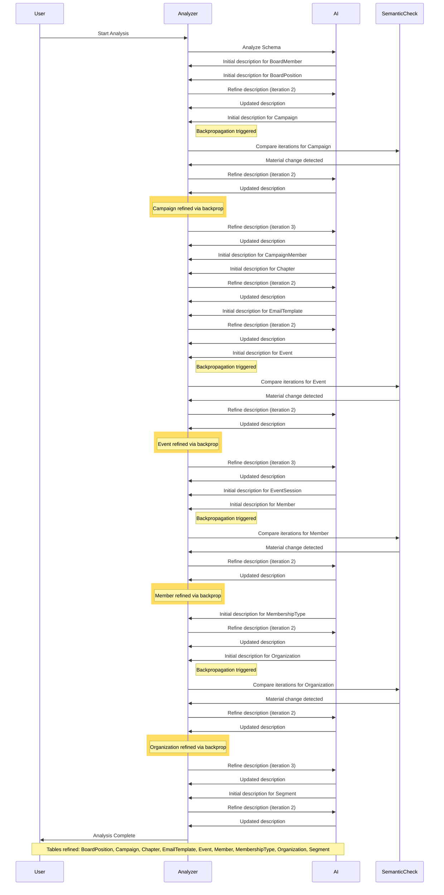

# Database Documentation: AssociationDB

**Server**: localhost
**Generated**: 2025-11-08T21:28:44.987Z
**Total Iterations**: 9

## Analysis Summary

- **Status**: converged
- **Iterations**: 5
- **Tokens Used**: 50,759
- **Estimated Cost**: $0.00
- **AI Model**: openai/gpt-oss-120b
- **AI Vendor**: GroqLLM
- **Temperature**: 0.1
- **Convergence**: No changes in last 2 iterations (stability achieved); All tables meet confidence threshold (0.85)

## Table of Contents

### [AssociationDemo](#schema-associationdemo) (26 tables)
- [BoardMember](#boardmember)
- [BoardPosition](#boardposition)
- [Campaign](#campaign)
- [CampaignMember](#campaignmember)
- [Certificate](#certificate)
- [Chapter](#chapter)
- [ChapterMembership](#chaptermembership)
- [ChapterOfficer](#chapterofficer)
- [Committee](#committee)
- [CommitteeMembership](#committeemembership)
- [Course](#course)
- [EmailClick](#emailclick)
- [EmailSend](#emailsend)
- [EmailTemplate](#emailtemplate)
- [Enrollment](#enrollment)
- [Event](#event)
- [EventRegistration](#eventregistration)
- [EventSession](#eventsession)
- [Invoice](#invoice)
- [InvoiceLineItem](#invoicelineitem)
- [Member](#member)
- [Membership](#membership)
- [MembershipType](#membershiptype)
- [Organization](#organization)
- [Payment](#payment)
- [Segment](#segment)

## Schema: AssociationDemo

### Entity Relationship Diagram

```mermaid
erDiagram
    BoardMember {
        uniqueidentifier ID "PK,NOT_NULL"
        uniqueidentifier BoardPositionID "FK,NOT_NULL"
        uniqueidentifier MemberID "FK,NOT_NULL"
        date StartDate "NOT_NULL"
        date EndDate
        bit IsActive "NOT_NULL"
        date ElectionDate
    }
    BoardPosition {
        uniqueidentifier ID "PK,NOT_NULL"
        nvarchar PositionTitle "NOT_NULL"
        int PositionOrder "NOT_NULL"
        nvarchar Description
        int TermLengthYears
        bit IsOfficer "NOT_NULL"
        bit IsActive "NOT_NULL"
    }
    Campaign {
        uniqueidentifier ID "PK,NOT_NULL"
        nvarchar Name "NOT_NULL"
        nvarchar CampaignType "NOT_NULL"
        nvarchar Status "NOT_NULL"
        date StartDate
        date EndDate
        decimal Budget
        decimal ActualCost
        nvarchar TargetAudience
        nvarchar Goals
        nvarchar Description
    }
    CampaignMember {
        uniqueidentifier ID "PK,NOT_NULL"
        uniqueidentifier CampaignID "FK,NOT_NULL"
        uniqueidentifier MemberID "FK,NOT_NULL"
        uniqueidentifier SegmentID "FK"
        datetime AddedDate "NOT_NULL"
        nvarchar Status "NOT_NULL"
        datetime ResponseDate
        decimal ConversionValue
    }
    Certificate {
        uniqueidentifier ID "PK,NOT_NULL"
        uniqueidentifier EnrollmentID "FK,NOT_NULL"
        nvarchar CertificateNumber "NOT_NULL"
        date IssuedDate "NOT_NULL"
        date ExpirationDate
        nvarchar CertificatePDFURL
        nvarchar VerificationCode
    }
    Chapter {
        uniqueidentifier ID "PK,NOT_NULL"
        nvarchar Name "NOT_NULL"
        nvarchar ChapterType "NOT_NULL"
        nvarchar Region
        nvarchar City
        nvarchar State
        nvarchar Country
        date FoundedDate
        nvarchar Description
        nvarchar Website
        nvarchar Email
        bit IsActive "NOT_NULL"
        nvarchar MeetingFrequency
        int MemberCount
    }
    ChapterMembership {
        uniqueidentifier ID "PK,NOT_NULL"
        uniqueidentifier ChapterID "FK,NOT_NULL"
        uniqueidentifier MemberID "FK,NOT_NULL"
        date JoinDate "NOT_NULL"
        nvarchar Status "NOT_NULL"
        nvarchar Role
    }
    ChapterOfficer {
        uniqueidentifier ID "PK,NOT_NULL"
        uniqueidentifier ChapterID "FK,NOT_NULL"
        uniqueidentifier MemberID "FK,NOT_NULL"
        nvarchar Position "NOT_NULL"
        date StartDate "NOT_NULL"
        date EndDate
        bit IsActive "NOT_NULL"
    }
    Committee {
        uniqueidentifier ID "PK,NOT_NULL"
        nvarchar Name "NOT_NULL"
        nvarchar CommitteeType "NOT_NULL"
        nvarchar Purpose
        nvarchar MeetingFrequency
        bit IsActive "NOT_NULL"
        date FormedDate
        date DisbandedDate
        uniqueidentifier ChairMemberID "FK"
        int MaxMembers
    }
    CommitteeMembership {
        uniqueidentifier ID "PK,NOT_NULL"
        uniqueidentifier CommitteeID "FK,NOT_NULL"
        uniqueidentifier MemberID "FK,NOT_NULL"
        nvarchar Role "NOT_NULL"
        date StartDate "NOT_NULL"
        date EndDate
        bit IsActive "NOT_NULL"
        nvarchar AppointedBy
    }
    Course {
        uniqueidentifier ID "PK,NOT_NULL"
        nvarchar Code "NOT_NULL"
        nvarchar Title "NOT_NULL"
        nvarchar Description
        nvarchar Category
        nvarchar Level "NOT_NULL"
        decimal DurationHours
        decimal CEUCredits
        decimal Price
        decimal MemberPrice
        bit IsActive "NOT_NULL"
        date PublishedDate
        nvarchar InstructorName
        uniqueidentifier PrerequisiteCourseID "FK"
        nvarchar ThumbnailURL
        nvarchar LearningObjectives
    }
    EmailClick {
        uniqueidentifier ID "PK,NOT_NULL"
        uniqueidentifier EmailSendID "FK,NOT_NULL"
        datetime ClickDate "NOT_NULL"
        nvarchar URL "NOT_NULL"
        nvarchar LinkName
        nvarchar IPAddress
        nvarchar UserAgent
    }
    EmailSend {
        uniqueidentifier ID "PK,NOT_NULL"
        uniqueidentifier TemplateID "FK"
        uniqueidentifier CampaignID "FK"
        uniqueidentifier MemberID "FK,NOT_NULL"
        nvarchar Subject
        datetime SentDate "NOT_NULL"
        datetime DeliveredDate
        datetime OpenedDate
        int OpenCount
        datetime ClickedDate
        int ClickCount
        datetime BouncedDate
        nvarchar BounceType
        nvarchar BounceReason
        datetime UnsubscribedDate
        datetime SpamReportedDate
        nvarchar Status "NOT_NULL"
        nvarchar ExternalMessageID
    }
    EmailTemplate {
        uniqueidentifier ID "PK,NOT_NULL"
        nvarchar Name "NOT_NULL"
        nvarchar Subject
        nvarchar FromName
        nvarchar FromEmail
        nvarchar ReplyToEmail
        nvarchar HtmlBody
        nvarchar TextBody
        nvarchar Category
        bit IsActive "NOT_NULL"
        nvarchar PreviewText
        nvarchar Tags
    }
    Enrollment {
        uniqueidentifier ID "PK,NOT_NULL"
        uniqueidentifier CourseID "FK,NOT_NULL"
        uniqueidentifier MemberID "FK,NOT_NULL"
        datetime EnrollmentDate "NOT_NULL"
        datetime StartDate
        datetime CompletionDate
        datetime ExpirationDate
        nvarchar Status "NOT_NULL"
        int ProgressPercentage
        datetime LastAccessedDate
        int TimeSpentMinutes
        decimal FinalScore
        decimal PassingScore
        bit Passed
        uniqueidentifier InvoiceID
    }
    Event {
        uniqueidentifier ID "PK,NOT_NULL"
        nvarchar Name "NOT_NULL"
        nvarchar EventType "NOT_NULL"
        datetime StartDate "NOT_NULL"
        datetime EndDate "NOT_NULL"
        nvarchar Timezone
        nvarchar Location
        bit IsVirtual "NOT_NULL"
        nvarchar VirtualPlatform
        nvarchar MeetingURL
        uniqueidentifier ChapterID
        int Capacity
        datetime RegistrationOpenDate
        datetime RegistrationCloseDate
        decimal RegistrationFee
        decimal MemberPrice
        decimal NonMemberPrice
        decimal CEUCredits
        nvarchar Description
        nvarchar Status "NOT_NULL"
    }
    EventRegistration {
        uniqueidentifier ID "PK,NOT_NULL"
        uniqueidentifier EventID "FK,NOT_NULL"
        uniqueidentifier MemberID "FK,NOT_NULL"
        datetime RegistrationDate "NOT_NULL"
        nvarchar RegistrationType
        nvarchar Status "NOT_NULL"
        datetime CheckInTime
        uniqueidentifier InvoiceID
        bit CEUAwarded "NOT_NULL"
        datetime CEUAwardedDate
        datetime CancellationDate
        nvarchar CancellationReason
    }
    EventSession {
        uniqueidentifier ID "PK,NOT_NULL"
        uniqueidentifier EventID "FK,NOT_NULL"
        nvarchar Name "NOT_NULL"
        nvarchar Description
        datetime StartTime "NOT_NULL"
        datetime EndTime "NOT_NULL"
        nvarchar Room
        nvarchar SpeakerName
        nvarchar SessionType
        int Capacity
        decimal CEUCredits
    }
    Invoice {
        uniqueidentifier ID "PK,NOT_NULL"
        nvarchar InvoiceNumber "NOT_NULL"
        uniqueidentifier MemberID "FK,NOT_NULL"
        date InvoiceDate "NOT_NULL"
        date DueDate "NOT_NULL"
        decimal SubTotal "NOT_NULL"
        decimal Tax
        decimal Discount
        decimal Total "NOT_NULL"
        decimal AmountPaid
        decimal Balance "NOT_NULL"
        nvarchar Status "NOT_NULL"
        nvarchar Notes
        nvarchar PaymentTerms
    }
    InvoiceLineItem {
        uniqueidentifier ID "PK,NOT_NULL"
        uniqueidentifier InvoiceID "FK,NOT_NULL"
        nvarchar Description "NOT_NULL"
        nvarchar ItemType "NOT_NULL"
        int Quantity
        decimal UnitPrice "NOT_NULL"
        decimal Amount "NOT_NULL"
        decimal TaxAmount
        nvarchar RelatedEntityType
        uniqueidentifier RelatedEntityID
    }
    Member {
        uniqueidentifier ID "PK,NOT_NULL"
        nvarchar Email "NOT_NULL"
        nvarchar FirstName "NOT_NULL"
        nvarchar LastName "NOT_NULL"
        nvarchar Title
        uniqueidentifier OrganizationID "FK"
        nvarchar Industry
        nvarchar JobFunction
        int YearsInProfession
        date JoinDate "NOT_NULL"
        nvarchar LinkedInURL
        nvarchar Bio
        nvarchar PreferredLanguage
        nvarchar Timezone
        nvarchar Phone
        nvarchar Mobile
        nvarchar City
        nvarchar State
        nvarchar Country
        nvarchar PostalCode
        int EngagementScore
        datetime LastActivityDate
        nvarchar ProfilePhotoURL
    }
    Membership {
        uniqueidentifier ID "PK,NOT_NULL"
        uniqueidentifier MemberID "FK,NOT_NULL"
        uniqueidentifier MembershipTypeID "FK,NOT_NULL"
        nvarchar Status "NOT_NULL"
        date StartDate "NOT_NULL"
        date EndDate "NOT_NULL"
        date RenewalDate
        bit AutoRenew "NOT_NULL"
        date CancellationDate
        nvarchar CancellationReason
    }
    MembershipType {
        uniqueidentifier ID "PK,NOT_NULL"
        nvarchar Name "NOT_NULL"
        nvarchar Description
        decimal AnnualDues "NOT_NULL"
        int RenewalPeriodMonths "NOT_NULL"
        bit IsActive "NOT_NULL"
        bit AllowAutoRenew "NOT_NULL"
        bit RequiresApproval "NOT_NULL"
        nvarchar Benefits
        int DisplayOrder
    }
    Organization {
        uniqueidentifier ID "PK,NOT_NULL"
        nvarchar Name "NOT_NULL"
        nvarchar Industry
        int EmployeeCount
        decimal AnnualRevenue
        decimal MarketCapitalization
        nvarchar TickerSymbol
        nvarchar Exchange
        nvarchar Website
        nvarchar Description
        int YearFounded
        nvarchar City
        nvarchar State
        nvarchar Country
        nvarchar PostalCode
        nvarchar Phone
        nvarchar LogoURL
    }
    Payment {
        uniqueidentifier ID "PK,NOT_NULL"
        uniqueidentifier InvoiceID "FK,NOT_NULL"
        datetime PaymentDate "NOT_NULL"
        decimal Amount "NOT_NULL"
        nvarchar PaymentMethod "NOT_NULL"
        nvarchar TransactionID
        nvarchar Status "NOT_NULL"
        datetime ProcessedDate
        nvarchar FailureReason
        nvarchar Notes
    }
    Segment {
        uniqueidentifier ID "PK,NOT_NULL"
        nvarchar Name "NOT_NULL"
        nvarchar Description
        nvarchar SegmentType
        nvarchar FilterCriteria
        int MemberCount
        datetime LastCalculatedDate
        bit IsActive "NOT_NULL"
    }

    Member ||--o{ BoardMember : "has"
    BoardPosition ||--o{ BoardMember : "has"
    Campaign ||--o{ CampaignMember : "has"
    Segment ||--o{ CampaignMember : "has"
    Member ||--o{ CampaignMember : "has"
    Enrollment ||--o{ Certificate : "has"
    Chapter ||--o{ ChapterMembership : "has"
    Member ||--o{ ChapterMembership : "has"
    Chapter ||--o{ ChapterOfficer : "has"
    Member ||--o{ ChapterOfficer : "has"
    Member ||--o{ Committee : "has"
    Committee ||--o{ CommitteeMembership : "has"
    Member ||--o{ CommitteeMembership : "has"
    Course ||--o{ Course : "has"
    EmailSend ||--o{ EmailClick : "has"
    Campaign ||--o{ EmailSend : "has"
    EmailTemplate ||--o{ EmailSend : "has"
    Member ||--o{ EmailSend : "has"
    Member ||--o{ Enrollment : "has"
    Course ||--o{ Enrollment : "has"
    Member ||--o{ EventRegistration : "has"
    Event ||--o{ EventRegistration : "has"
    Event ||--o{ EventSession : "has"
    Member ||--o{ Invoice : "has"
    Invoice ||--o{ InvoiceLineItem : "has"
    Organization ||--o{ Member : "has"
    MembershipType ||--o{ Membership : "has"
    Member ||--o{ Membership : "has"
    Invoice ||--o{ Payment : "has"
```

### Tables

#### BoardMember

Stores assignments of members to board positions, capturing the term start and end dates, election date, and active status for each board role held by a member.

**Row Count**: 27
**Dependency Level**: 2

**Confidence**: 96%

**Depends On**:
- [AssociationDemo.Member](#member) (via MemberID)
- [AssociationDemo.BoardPosition](#boardposition) (via BoardPositionID)

**Columns**:

| Column | Type | Description |
|--------|------|-------------|
| ID | uniqueidentifier (PK, NOT NULL) | Unique identifier for each board‑position assignment record. |
| BoardPositionID | uniqueidentifier (FK, NOT NULL) | Reference to the specific board position (e.g., President, Treasurer) from the BoardPosition lookup table. |
| MemberID | uniqueidentifier (FK, NOT NULL) | Reference to the member who holds the board position, linking to the Member table. |
| StartDate | date (NOT NULL) | Date when the member began serving in the board position. |
| EndDate | date | Date when the member's term in the board position ended; null when the term is ongoing. |
| IsActive | bit (NOT NULL) | Flag indicating whether the board assignment is currently active. |
| ElectionDate | date | Date on which the member was elected to the board position. |

#### BoardPosition

This table stores the defined board positions for an organization, including titles, hierarchical order, term length, and flags indicating officer status and active status. It serves as a lookup for assigning members to specific leadership roles.

**Row Count**: 9
**Dependency Level**: 0

**Confidence**: 94%

**Referenced By**:
- [AssociationDemo.BoardMember](#boardmember)

**Columns**:

| Column | Type | Description |
|--------|------|-------------|
| ID | uniqueidentifier (PK, NOT NULL) | Unique identifier (GUID) for each board position record. |
| PositionTitle | nvarchar (NOT NULL) | The official title of the board position (e.g., President, Treasurer, Director at Large #3). |
| PositionOrder | int (NOT NULL) | Numeric order used to sort or rank positions, with 1 being highest priority. |
| Description | nvarchar | Optional free‑text description of the role’s responsibilities. |
| TermLengthYears | int | Number of years a person serves in this position (2 or 3 years). |
| IsOfficer | bit (NOT NULL) | Flag indicating whether the position is an executive officer (true) or a non‑officer director (false). |
| IsActive | bit (NOT NULL) | Indicates if the position is currently active in the organization (always true in sample). |

#### Campaign

Stores details of marketing campaigns run by the organization, including identifiers, names, type, status, schedule, budget, and descriptive information. It serves as the central reference for campaign planning, tracking, and reporting.

**Row Count**: 5
**Dependency Level**: 0

**Confidence**: 96%

**Referenced By**:
- [AssociationDemo.CampaignMember](#campaignmember)
- [AssociationDemo.EmailSend](#emailsend)

**Columns**:

| Column | Type | Description |
|--------|------|-------------|
| ID | uniqueidentifier (PK, NOT NULL) | Unique identifier for each campaign record |
| Name | nvarchar (NOT NULL) | Human‑readable title of the campaign |
| CampaignType | nvarchar (NOT NULL) | Category of the campaign (e.g., Member Engagement, Course Launch) |
| Status | nvarchar (NOT NULL) | Current lifecycle state of the campaign (Active, Completed, etc.) |
| StartDate | date | Date the campaign is scheduled to begin |
| EndDate | date | Date the campaign is scheduled to end |
| Budget | decimal | Planned monetary allocation for the campaign |
| ActualCost | decimal | Actual amount spent; currently null for all rows |
| TargetAudience | nvarchar | Intended audience segment for the campaign; currently unspecified |
| Goals | nvarchar | Specific objectives the campaign aims to achieve; currently unspecified |
| Description | nvarchar | Brief narrative describing the campaign purpose and content |

#### CampaignMember

Stores the relationship between a marketing campaign and individual members (optionally within a specific segment), tracking each member's participation status, dates of addition and response, and any monetary conversion value associated with the campaign.

**Row Count**: 0
**Dependency Level**: 2

**Confidence**: 96%

**Depends On**:
- [AssociationDemo.Campaign](#campaign) (via CampaignID)
- [AssociationDemo.Segment](#segment) (via SegmentID)
- [AssociationDemo.Member](#member) (via MemberID)

**Columns**:

| Column | Type | Description |
|--------|------|-------------|
| ID | uniqueidentifier (PK, NOT NULL) | Surrogate primary key for the campaign‑member record, generated sequentially to ensure uniqueness. |
| CampaignID | uniqueidentifier (FK, NOT NULL) | Foreign key to the Campaign table identifying the specific marketing campaign. |
| MemberID | uniqueidentifier (FK, NOT NULL) | Foreign key to the Member table identifying the individual member participating in the campaign. |
| SegmentID | uniqueidentifier (FK) | Optional foreign key to the Segment table, indicating the member segment used for targeting within the campaign. |
| AddedDate | datetime (NOT NULL) | Timestamp when the member was added to the campaign (or when the campaign started targeting the member). |
| Status | nvarchar (NOT NULL) | Current status of the member within the campaign lifecycle (Targeted, Sent, Responded, Converted, Opted Out). |
| ResponseDate | datetime | Date and time when the member responded to the campaign (e.g., opened email, clicked link). Null if no response. |
| ConversionValue | decimal | Monetary value attributed to the member's conversion resulting from the campaign; null if no conversion. |

#### Certificate

**Row Count**: 326
**Dependency Level**: 4

**Depends On**:
- [AssociationDemo.Enrollment](#enrollment) (via EnrollmentID)

**Columns**:

| Column | Type | Description |
|--------|------|-------------|
| ID | uniqueidentifier (PK, NOT NULL) |  |
| EnrollmentID | uniqueidentifier (FK, NOT NULL) |  |
| CertificateNumber | nvarchar (NOT NULL) |  |
| IssuedDate | date (NOT NULL) |  |
| ExpirationDate | date |  |
| CertificatePDFURL | nvarchar |  |
| VerificationCode | nvarchar |  |

#### Chapter

Stores the definition and attributes of organizational chapters for a professional association, including their unique identifier, name, type (geographic or special‑interest), location details, founding date, description, activity status, meeting cadence and member count.

**Row Count**: 15
**Dependency Level**: 0

**Confidence**: 97%

**Referenced By**:
- [AssociationDemo.ChapterMembership](#chaptermembership)
- [AssociationDemo.ChapterOfficer](#chapterofficer)

**Columns**:

| Column | Type | Description |
|--------|------|-------------|
| ID | uniqueidentifier (PK, NOT NULL) | Primary key GUID uniquely identifying each chapter record. |
| Name | nvarchar (NOT NULL) | Human‑readable name of the chapter, often including the focus or location. |
| ChapterType | nvarchar (NOT NULL) | Categorizes the chapter as either Geographic or Special Interest (or Industry, though not present in data). |
| Region | nvarchar | Broad geographic region the chapter belongs to (e.g., West Coast, Midwest, Canada). |
| City | nvarchar | City where the chapter is based, when applicable. |
| State | nvarchar | State or province abbreviation for the chapter's location. |
| Country | nvarchar | Country of the chapter, defaulting to United States; includes Canada for Canadian chapters. |
| FoundedDate | date | Date the chapter was established. |
| Description | nvarchar | Brief narrative describing the chapter's focus or community. |
| Website | nvarchar | URL of the chapter's website (currently null for all rows). |
| Email | nvarchar | Contact email address for the chapter (currently null). |
| IsActive | bit (NOT NULL) | Flag indicating whether the chapter is currently active; defaults to true. |
| MeetingFrequency | nvarchar | How often the chapter meets, either Monthly or Quarterly. |
| MemberCount | int | Number of members in the chapter (currently unknown, all null). |

#### ChapterMembership

**Row Count**: 613
**Dependency Level**: 2

**Depends On**:
- [AssociationDemo.Chapter](#chapter) (via ChapterID)
- [AssociationDemo.Member](#member) (via MemberID)

**Columns**:

| Column | Type | Description |
|--------|------|-------------|
| ID | uniqueidentifier (PK, NOT NULL) |  |
| ChapterID | uniqueidentifier (FK, NOT NULL) |  |
| MemberID | uniqueidentifier (FK, NOT NULL) |  |
| JoinDate | date (NOT NULL) |  |
| Status | nvarchar (NOT NULL) |  |
| Role | nvarchar |  |

#### ChapterOfficer

**Row Count**: 45
**Dependency Level**: 2

**Depends On**:
- [AssociationDemo.Chapter](#chapter) (via ChapterID)
- [AssociationDemo.Member](#member) (via MemberID)

**Columns**:

| Column | Type | Description |
|--------|------|-------------|
| ID | uniqueidentifier (PK, NOT NULL) |  |
| ChapterID | uniqueidentifier (FK, NOT NULL) |  |
| MemberID | uniqueidentifier (FK, NOT NULL) |  |
| Position | nvarchar (NOT NULL) |  |
| StartDate | date (NOT NULL) |  |
| EndDate | date |  |
| IsActive | bit (NOT NULL) |  |

#### Committee

**Row Count**: 12
**Dependency Level**: 2

**Depends On**:
- [AssociationDemo.Member](#member) (via ChairMemberID)

**Referenced By**:
- [AssociationDemo.CommitteeMembership](#committeemembership)

**Columns**:

| Column | Type | Description |
|--------|------|-------------|
| ID | uniqueidentifier (PK, NOT NULL) |  |
| Name | nvarchar (NOT NULL) |  |
| CommitteeType | nvarchar (NOT NULL) |  |
| Purpose | nvarchar |  |
| MeetingFrequency | nvarchar |  |
| IsActive | bit (NOT NULL) |  |
| FormedDate | date |  |
| DisbandedDate | date |  |
| ChairMemberID | uniqueidentifier (FK) |  |
| MaxMembers | int |  |

#### CommitteeMembership

**Row Count**: 96
**Dependency Level**: 3

**Depends On**:
- [AssociationDemo.Committee](#committee) (via CommitteeID)
- [AssociationDemo.Member](#member) (via MemberID)

**Columns**:

| Column | Type | Description |
|--------|------|-------------|
| ID | uniqueidentifier (PK, NOT NULL) |  |
| CommitteeID | uniqueidentifier (FK, NOT NULL) |  |
| MemberID | uniqueidentifier (FK, NOT NULL) |  |
| Role | nvarchar (NOT NULL) |  |
| StartDate | date (NOT NULL) |  |
| EndDate | date |  |
| IsActive | bit (NOT NULL) |  |
| AppointedBy | nvarchar |  |

#### Course

**Row Count**: 60
**Dependency Level**: 4

**Depends On**:
- [AssociationDemo.Course](#course) (via PrerequisiteCourseID)

**Referenced By**:
- [AssociationDemo.Course](#course)
- [AssociationDemo.Enrollment](#enrollment)

**Columns**:

| Column | Type | Description |
|--------|------|-------------|
| ID | uniqueidentifier (PK, NOT NULL) |  |
| Code | nvarchar (NOT NULL) |  |
| Title | nvarchar (NOT NULL) |  |
| Description | nvarchar |  |
| Category | nvarchar |  |
| Level | nvarchar (NOT NULL) |  |
| DurationHours | decimal |  |
| CEUCredits | decimal |  |
| Price | decimal |  |
| MemberPrice | decimal |  |
| IsActive | bit (NOT NULL) |  |
| PublishedDate | date |  |
| InstructorName | nvarchar |  |
| PrerequisiteCourseID | uniqueidentifier (FK) |  |
| ThumbnailURL | nvarchar |  |
| LearningObjectives | nvarchar |  |

#### EmailClick

**Row Count**: 1
**Dependency Level**: 3

**Depends On**:
- [AssociationDemo.EmailSend](#emailsend) (via EmailSendID)

**Columns**:

| Column | Type | Description |
|--------|------|-------------|
| ID | uniqueidentifier (PK, NOT NULL) |  |
| EmailSendID | uniqueidentifier (FK, NOT NULL) |  |
| ClickDate | datetime (NOT NULL) |  |
| URL | nvarchar (NOT NULL) |  |
| LinkName | nvarchar |  |
| IPAddress | nvarchar |  |
| UserAgent | nvarchar |  |

#### EmailSend

**Row Count**: 1400
**Dependency Level**: 2

**Depends On**:
- [AssociationDemo.Campaign](#campaign) (via CampaignID)
- [AssociationDemo.EmailTemplate](#emailtemplate) (via TemplateID)
- [AssociationDemo.Member](#member) (via MemberID)

**Referenced By**:
- [AssociationDemo.EmailClick](#emailclick)

**Columns**:

| Column | Type | Description |
|--------|------|-------------|
| ID | uniqueidentifier (PK, NOT NULL) |  |
| TemplateID | uniqueidentifier (FK) |  |
| CampaignID | uniqueidentifier (FK) |  |
| MemberID | uniqueidentifier (FK, NOT NULL) |  |
| Subject | nvarchar |  |
| SentDate | datetime (NOT NULL) |  |
| DeliveredDate | datetime |  |
| OpenedDate | datetime |  |
| OpenCount | int |  |
| ClickedDate | datetime |  |
| ClickCount | int |  |
| BouncedDate | datetime |  |
| BounceType | nvarchar |  |
| BounceReason | nvarchar |  |
| UnsubscribedDate | datetime |  |
| SpamReportedDate | datetime |  |
| Status | nvarchar (NOT NULL) |  |
| ExternalMessageID | nvarchar |  |

#### EmailTemplate

Stores predefined email templates used by the association for various communications (welcome, renewal reminders, newsletters, event invitations). Each row defines the template's identity, subject line, sender details, category, preview text and activation status.

**Row Count**: 5
**Dependency Level**: 0

**Confidence**: 96%

**Referenced By**:
- [AssociationDemo.EmailSend](#emailsend)

**Columns**:

| Column | Type | Description |
|--------|------|-------------|
| ID | uniqueidentifier (PK, NOT NULL) | Unique identifier for each email template (primary key). |
| Name | nvarchar (NOT NULL) | Human‑readable name of the template, used to select a template in the UI or code. |
| Subject | nvarchar | Subject line of the email, may contain placeholders like [MONTH] or [EVENT_NAME]. |
| FromName | nvarchar | Display name shown as the sender of the email; limited to a few known teams. |
| FromEmail | nvarchar | Email address used as the sender; varies by team/function. |
| ReplyToEmail | nvarchar | Optional reply‑to address; currently null for all templates. |
| HtmlBody | nvarchar | HTML version of the email body; presently null, possibly stored elsewhere or to be filled later. |
| TextBody | nvarchar | Plain‑text version of the email body; also null for now. |
| Category | nvarchar | Broad classification of the template (Renewal, Welcome, Newsletter, Event). |
| IsActive | bit (NOT NULL) | Flag indicating whether the template is active and can be used for sending. |
| PreviewText | nvarchar | Short preview snippet shown in email clients, summarizing the content. |
| Tags | nvarchar | Placeholder for future tagging or categorisation; currently unused. |

#### Enrollment

**Row Count**: 900
**Dependency Level**: 4

**Depends On**:
- [AssociationDemo.Member](#member) (via MemberID)
- [AssociationDemo.Course](#course) (via CourseID)

**Referenced By**:
- [AssociationDemo.Certificate](#certificate)

**Columns**:

| Column | Type | Description |
|--------|------|-------------|
| ID | uniqueidentifier (PK, NOT NULL) |  |
| CourseID | uniqueidentifier (FK, NOT NULL) |  |
| MemberID | uniqueidentifier (FK, NOT NULL) |  |
| EnrollmentDate | datetime (NOT NULL) |  |
| StartDate | datetime |  |
| CompletionDate | datetime |  |
| ExpirationDate | datetime |  |
| Status | nvarchar (NOT NULL) |  |
| ProgressPercentage | int |  |
| LastAccessedDate | datetime |  |
| TimeSpentMinutes | int |  |
| FinalScore | decimal |  |
| PassingScore | decimal |  |
| Passed | bit |  |
| InvoiceID | uniqueidentifier |  |

#### Event

This table stores detailed information about scheduled events such as conferences, workshops, webinars and other gatherings related to the cheese industry. Each row represents a single event with its identity, timing, location (physical or virtual), capacity, pricing, accreditation credits and current status.

**Row Count**: 21
**Dependency Level**: 0

**Confidence**: 96%

**Referenced By**:
- [AssociationDemo.EventRegistration](#eventregistration)
- [AssociationDemo.EventSession](#eventsession)

**Columns**:

| Column | Type | Description |
|--------|------|-------------|
| ID | uniqueidentifier (PK, NOT NULL) | Primary key uniquely identifying each event record |
| Name | nvarchar (NOT NULL) | Descriptive title of the event |
| EventType | nvarchar (NOT NULL) | Category of the event (e.g., Workshop, Conference, Webinar) |
| StartDate | datetime (NOT NULL) | Date and time when the event begins |
| EndDate | datetime (NOT NULL) | Date and time when the event ends |
| Timezone | nvarchar | IANA time‑zone identifier for the event’s scheduled times |
| Location | nvarchar | Physical venue or 'Virtual' indicator where the event is held |
| IsVirtual | bit (NOT NULL) | Boolean flag indicating if the event is held online |
| VirtualPlatform | nvarchar | Name of the online platform used when IsVirtual is true (e.g., Zoom, Teams) |
| MeetingURL | nvarchar | Link to join the virtual event session |
| ChapterID | uniqueidentifier | Optional reference to a chapter or regional group organizing the event |
| Capacity | int | Maximum number of participants allowed for the event |
| RegistrationOpenDate | datetime | Date when attendees can start registering |
| RegistrationCloseDate | datetime | Date when registration ends |
| RegistrationFee | decimal | General registration fee (currently unused, all null) |
| MemberPrice | decimal | Fee charged to members for attending the event |
| NonMemberPrice | decimal | Fee charged to non‑members for attending the event |
| CEUCredits | decimal | Continuing Education Units awarded for attending the event |
| Description | nvarchar | Long text describing the event’s content and objectives |
| Status | nvarchar (NOT NULL) | Current lifecycle state of the event (e.g., Draft, Published, Registration Open, Completed) |

#### EventRegistration

**Row Count**: 5567
**Dependency Level**: 2

**Depends On**:
- [AssociationDemo.Member](#member) (via MemberID)
- [AssociationDemo.Event](#event) (via EventID)

**Columns**:

| Column | Type | Description |
|--------|------|-------------|
| ID | uniqueidentifier (PK, NOT NULL) |  |
| EventID | uniqueidentifier (FK, NOT NULL) |  |
| MemberID | uniqueidentifier (FK, NOT NULL) |  |
| RegistrationDate | datetime (NOT NULL) |  |
| RegistrationType | nvarchar |  |
| Status | nvarchar (NOT NULL) |  |
| CheckInTime | datetime |  |
| InvoiceID | uniqueidentifier |  |
| CEUAwarded | bit (NOT NULL) |  |
| CEUAwardedDate | datetime |  |
| CancellationDate | datetime |  |
| CancellationReason | nvarchar |  |

#### EventSession

Stores individual sessions or program items that belong to a larger event (e.g., conference, workshop, webinar). Each row defines a scheduled session with its name, description, time window, location, speaker, type, capacity and CEU credit information, linked to the parent Event record.

**Row Count**: 0
**Dependency Level**: 1

**Confidence**: 96%

**Depends On**:
- [AssociationDemo.Event](#event) (via EventID)

**Columns**:

| Column | Type | Description |
|--------|------|-------------|
| ID | uniqueidentifier (PK, NOT NULL) | Unique identifier for the session record |
| EventID | uniqueidentifier (FK, NOT NULL) | Reference to the parent event that this session belongs to |
| Name | nvarchar (NOT NULL) | Title or short name of the session |
| Description | nvarchar | Longer textual description of the session content |
| StartTime | datetime (NOT NULL) | Scheduled start date and time of the session |
| EndTime | datetime (NOT NULL) | Scheduled end date and time of the session |
| Room | nvarchar | Physical or virtual location where the session is held |
| SpeakerName | nvarchar | Name of the person presenting or leading the session |
| SessionType | nvarchar | Category or format of the session (e.g., workshop, keynote, panel) |
| Capacity | int | Maximum number of attendees allowed for the session |
| CEUCredits | decimal | Continuing Education Units awarded for attending the session |

#### Invoice

**Row Count**: 6364
**Dependency Level**: 2

**Depends On**:
- [AssociationDemo.Member](#member) (via MemberID)

**Referenced By**:
- [AssociationDemo.InvoiceLineItem](#invoicelineitem)
- [AssociationDemo.Payment](#payment)

**Columns**:

| Column | Type | Description |
|--------|------|-------------|
| ID | uniqueidentifier (PK, NOT NULL) |  |
| InvoiceNumber | nvarchar (NOT NULL) |  |
| MemberID | uniqueidentifier (FK, NOT NULL) |  |
| InvoiceDate | date (NOT NULL) |  |
| DueDate | date (NOT NULL) |  |
| SubTotal | decimal (NOT NULL) |  |
| Tax | decimal |  |
| Discount | decimal |  |
| Total | decimal (NOT NULL) |  |
| AmountPaid | decimal |  |
| Balance | decimal (NOT NULL) |  |
| Status | nvarchar (NOT NULL) |  |
| Notes | nvarchar |  |
| PaymentTerms | nvarchar |  |

#### InvoiceLineItem

**Row Count**: 5973
**Dependency Level**: 3

**Depends On**:
- [AssociationDemo.Invoice](#invoice) (via InvoiceID)

**Columns**:

| Column | Type | Description |
|--------|------|-------------|
| ID | uniqueidentifier (PK, NOT NULL) |  |
| InvoiceID | uniqueidentifier (FK, NOT NULL) |  |
| Description | nvarchar (NOT NULL) |  |
| ItemType | nvarchar (NOT NULL) |  |
| Quantity | int |  |
| UnitPrice | decimal (NOT NULL) |  |
| Amount | decimal (NOT NULL) |  |
| TaxAmount | decimal |  |
| RelatedEntityType | nvarchar |  |
| RelatedEntityID | uniqueidentifier |  |

#### Member

Stores individual contact/member records linked to an organization, capturing personal, professional, and engagement details, and also representing individuals who may hold leadership or board positions within the organization.

**Row Count**: 2000
**Dependency Level**: 1

**Confidence**: 96%

**Depends On**:
- [AssociationDemo.Organization](#organization) (via OrganizationID)

**Referenced By**:
- [AssociationDemo.BoardMember](#boardmember)
- [AssociationDemo.CampaignMember](#campaignmember)
- [AssociationDemo.ChapterMembership](#chaptermembership)
- [AssociationDemo.ChapterOfficer](#chapterofficer)
- [AssociationDemo.Committee](#committee)
- [AssociationDemo.CommitteeMembership](#committeemembership)
- [AssociationDemo.EmailSend](#emailsend)
- [AssociationDemo.Enrollment](#enrollment)
- [AssociationDemo.EventRegistration](#eventregistration)
- [AssociationDemo.Invoice](#invoice)
- [AssociationDemo.Membership](#membership)

**Columns**:

| Column | Type | Description |
|--------|------|-------------|
| ID | uniqueidentifier (PK, NOT NULL) | Primary key GUID uniquely identifying each contact record. |
| Email | nvarchar (NOT NULL) | Contact's email address, used as a unique communication identifier. |
| FirstName | nvarchar (NOT NULL) | Contact's given name. |
| LastName | nvarchar (NOT NULL) | Contact's family name. |
| Title | nvarchar | Professional title or role of the contact within their organization. |
| OrganizationID | uniqueidentifier (FK) | Foreign key linking the contact to its parent organization record. |
| Industry | nvarchar | Industry sector of the contact's organization or work focus. |
| JobFunction | nvarchar | Broad functional area of the contact's work (e.g., Development, QA). |
| YearsInProfession | int | Number of years the contact has worked in their profession. |
| JoinDate | date (NOT NULL) | Date the contact was added to the system or joined the organization. |
| LinkedInURL | nvarchar | URL to the contact's LinkedIn profile, when available. |
| Bio | nvarchar | Free‑text biography of the contact (currently empty). |
| PreferredLanguage | nvarchar | Language locale preferred by the contact, defaulting to en-US. |
| Timezone | nvarchar | Time zone identifier for the contact (currently empty). |
| Phone | nvarchar | Primary phone number for the contact, when provided. |
| Mobile | nvarchar | Mobile phone number for the contact (currently empty). |
| City | nvarchar | City of the contact's address or location. |
| State | nvarchar | State or province abbreviation for the contact's location. |
| Country | nvarchar | Country of the contact, defaulting to United States. |
| PostalCode | nvarchar | Postal/ZIP code for the contact (currently empty). |
| EngagementScore | int | Numeric score representing the contact's engagement level; currently always 0. |
| LastActivityDate | datetime | Timestamp of the contact's most recent activity (currently empty). |
| ProfilePhotoURL | nvarchar | URL to the contact's profile picture (currently empty). |

#### Membership

**Row Count**: 2137
**Dependency Level**: 2

**Depends On**:
- [AssociationDemo.MembershipType](#membershiptype) (via MembershipTypeID)
- [AssociationDemo.Member](#member) (via MemberID)

**Columns**:

| Column | Type | Description |
|--------|------|-------------|
| ID | uniqueidentifier (PK, NOT NULL) |  |
| MemberID | uniqueidentifier (FK, NOT NULL) |  |
| MembershipTypeID | uniqueidentifier (FK, NOT NULL) |  |
| Status | nvarchar (NOT NULL) |  |
| StartDate | date (NOT NULL) |  |
| EndDate | date (NOT NULL) |  |
| RenewalDate | date |  |
| AutoRenew | bit (NOT NULL) |  |
| CancellationDate | date |  |
| CancellationReason | nvarchar |  |

#### MembershipType

Stores the definitions of the various membership tiers offered by the organization, including their names, descriptions, annual dues, renewal periods, status flags, renewal/approval settings, benefit details, and display ordering.

**Row Count**: 8
**Dependency Level**: 0

**Confidence**: 97%

**Referenced By**:
- [AssociationDemo.Membership](#membership)

**Columns**:

| Column | Type | Description |
|--------|------|-------------|
| ID | uniqueidentifier (PK, NOT NULL) | Unique identifier for the membership tier (primary key). |
| Name | nvarchar (NOT NULL) | Short label of the membership tier (e.g., Student, Corporate). |
| Description | nvarchar | Longer textual description of what the tier provides and its eligibility criteria. |
| AnnualDues | decimal (NOT NULL) | Yearly fee associated with the tier, expressed as a decimal amount. |
| RenewalPeriodMonths | int (NOT NULL) | Number of months a membership lasts before renewal; 12 for standard annual, 1200 for lifetime. |
| IsActive | bit (NOT NULL) | Indicates whether the tier is currently offered (true). |
| AllowAutoRenew | bit (NOT NULL) | Specifies if members in this tier may have their membership auto‑renewed. |
| RequiresApproval | bit (NOT NULL) | Indicates whether enrollment in the tier needs manual approval. |
| Benefits | nvarchar | Detailed list of benefits granted to members of this tier. |
| DisplayOrder | int | Numeric order used to present tiers in UI lists. |

#### Organization

A master list of companies/organizations with their identifying details, financial metrics, and contact information. It serves as a reference for other tables (e.g., members, transactions) to link business entities to their attributes.

**Row Count**: 200
**Dependency Level**: 0

**Confidence**: 96%

**Referenced By**:
- [AssociationDemo.Member](#member)

**Columns**:

| Column | Type | Description |
|--------|------|-------------|
| ID | uniqueidentifier (PK, NOT NULL) | Surrogate primary key uniquely identifying each company record. |
| Name | nvarchar (NOT NULL) | Legal or trade name of the company. |
| Industry | nvarchar | Business sector or industry classification of the company. |
| EmployeeCount | int | Total number of employees working for the company. |
| AnnualRevenue | decimal | Total revenue generated by the company in a fiscal year (currency unspecified). |
| MarketCapitalization | decimal | Total market value of the company's outstanding shares (for publicly‑traded firms). |
| TickerSymbol | nvarchar | Stock ticker symbol used on a securities exchange. |
| Exchange | nvarchar | Securities exchange where the ticker is listed (e.g., NYSE, NASDAQ). |
| Website | nvarchar | Public URL of the company's website. |
| Description | nvarchar | Brief textual description of the company's business or focus. |
| YearFounded | int | Calendar year the company was established. |
| City | nvarchar | City where the company's headquarters or primary address is located. |
| State | nvarchar | Two‑letter state or province code for the company's address. |
| Country | nvarchar | Country of the company's primary location. |
| PostalCode | nvarchar | Postal/ZIP code of the company's address (currently not populated). |
| Phone | nvarchar | Primary contact telephone number for the company. |
| LogoURL | nvarchar | Link to the company's logo image (currently empty). |

#### Payment

**Row Count**: 6327
**Dependency Level**: 3

**Depends On**:
- [AssociationDemo.Invoice](#invoice) (via InvoiceID)

**Columns**:

| Column | Type | Description |
|--------|------|-------------|
| ID | uniqueidentifier (PK, NOT NULL) |  |
| InvoiceID | uniqueidentifier (FK, NOT NULL) |  |
| PaymentDate | datetime (NOT NULL) |  |
| Amount | decimal (NOT NULL) |  |
| PaymentMethod | nvarchar (NOT NULL) |  |
| TransactionID | nvarchar |  |
| Status | nvarchar (NOT NULL) |  |
| ProcessedDate | datetime |  |
| FailureReason | nvarchar |  |
| Notes | nvarchar |  |

#### Segment

Stores definitions of member segments used for targeting and reporting, including segment name, description, type, filter criteria, member count, and activation status.

**Row Count**: 10
**Dependency Level**: 0

**Confidence**: 96%

**Referenced By**:
- [AssociationDemo.CampaignMember](#campaignmember)

**Columns**:

| Column | Type | Description |
|--------|------|-------------|
| ID | uniqueidentifier (PK, NOT NULL) | Unique identifier for each segment record. |
| Name | nvarchar (NOT NULL) | Human‑readable name of the segment. |
| Description | nvarchar | Detailed explanation of the segment's criteria. |
| SegmentType | nvarchar | Category or taxonomy of the segment (e.g., Industry, Geography, Engagement). |
| FilterCriteria | nvarchar | Serialized filter expression used to compute segment membership (currently null). |
| MemberCount | int | Number of members currently belonging to the segment. |
| LastCalculatedDate | datetime | Timestamp of the most recent member count calculation. |
| IsActive | bit (NOT NULL) | Flag indicating whether the segment is active and usable in campaigns. |

---

## Appendix: Iteration Analysis

This section documents the iterative refinement process used to generate the database documentation, highlighting corrections and improvements discovered through backpropagation.

### Summary

- **Total Tables with Refinements**: 9
- **Total Columns with Refinements**: 99
- **Total Refinement Iterations**: 111
- **Refinements Triggered by Backpropagation**: 4

### Tables Refined Through Iteration

#### [BoardPosition](#boardposition)

**Iterations**: 2 | **Trigger**: refinement

**Iteration 1** (initial):

> Lookup table that defines the distinct board positions within an organization, including their titles, display order, term length, and whether they are officer roles.

*Reasoning*: The columns PositionTitle, PositionOrder, TermLengthYears, IsOfficer and IsActive together describe characteristics of board roles. Sample values (President, Treasurer, Director at Large #1, etc.) and the IsOfficer flag differentiate executive officers from regular directors. The table is referenced by AssociationDemo.BoardMember, indicating it is used to assign members to these positions. The primary key ID uniquely identifies each role.

---

**Iteration 2** (refinement):

> This table stores the defined board positions for an organization, including titles, hierarchical order, term length, and flags indicating officer status and active status. It serves as a lookup for assigning members to specific leadership roles.

*Reasoning*: Column names such as PositionTitle, PositionOrder, TermLengthYears, IsOfficer, and IsActive directly describe board role attributes. Sample values include President, Treasurer, Director at Large #1, etc., confirming a leadership position list. The primary key ID uniquely identifies each role. The table is referenced by AssociationDemo.BoardMember, indicating BoardMember rows link to these positions. All rows are active, and Description is currently unused, typical for a lookup table.

#### [Campaign](#campaign)

**Iterations**: 3 | **Trigger**: refinement

**Iteration 1** (initial):

> This table stores the definition and scheduling details of marketing campaigns run by the organization, including their unique identifier, name, type, status, start/end dates, budget, and descriptive information. It serves as the central repository for campaign planning and tracking, enabling other tables (e.g., CampaignMember, EmailSend) to reference specific campaigns for execution and reporting.

*Reasoning*: The column names (Name, CampaignType, Status, StartDate, EndDate, Budget, Description) directly describe attributes of a marketing campaign. Sample values such as "New Member Welcome Series 2024" and "Cybersecurity Month Campaign" confirm a focus on promotional activities. The primary key ID is a GUID with 100% uniqueness, typical for a master entity. The table has no foreign key dependencies but is referenced by CampaignMember and EmailSend, indicating it is a parent entity for campaign‑related actions. The presence of nullable columns (ActualCost, TargetAudience, Goals) suggests they are optional details that may be filled after execution.

---

**Iteration 2** (backpropagation):

> This table stores the definition, scheduling, and targeting details of marketing campaigns, including a SegmentID foreign key that links each campaign to a specific member segment, enabling segmentation‑driven targeting. It includes a unique identifier, name, type, status, start/end dates, budget, and descriptive information. It serves as the central repository for campaign planning and tracking, allowing other tables (e.g., CampaignMember, EmailSend) to reference specific campaigns for execution and reporting.

*Reasoning*: The new insight reveals a SegmentID foreign key, indicating campaigns can be scoped to particular member segments. This adds a meaningful targeting dimension that was not captured in the original description, so the description was revised to reflect segmentation‑driven targeting while retaining the original attributes and relationships.

---

**Iteration 3** (refinement):

> Stores details of marketing campaigns run by the organization, including identifiers, names, type, status, schedule, budget, and descriptive information. It serves as the central reference for campaign planning, tracking, and reporting.

*Reasoning*: Column names like Name, CampaignType, Status, StartDate, EndDate, Budget, and Description directly describe campaign attributes. Sample values (e.g., "Cloud Certification Launch", "Event Promotion", dates spanning 2023‑2025, budgets up to 35000) match typical marketing initiatives. Check constraints on CampaignType and Status define allowed enums, confirming categorical campaign metadata. The primary key ID is a GUID with 100% uniqueness. No foreign keys indicate it is a foundational lookup table, while dependent tables (CampaignMember, EmailSend) reference it, reinforcing its role as the master campaign entity.

#### [Chapter](#chapter)

**Iterations**: 2 | **Trigger**: refinement

**Iteration 1** (initial):

> Stores details of the various chapters of a technology professional association, including their identifiers, names, type (geographic or special‑interest), location, founding date, description, activity status, meeting cadence and member count.

*Reasoning*: Column names such as Name, ChapterType, Region, City, State, Country, FoundedDate and Description directly describe chapter attributes. The primary key ID is a GUID with 100% uniqueness, confirming a lookup entity. Sample values (e.g., "Toronto Chapter", "Women in Technology Leadership", "Geographic") show real‑world chapter names and categories. The check constraint on ChapterType limits values to Industry, Special Interest, or Geographic, reinforcing classification. IsActive defaults to true, MeetingFrequency holds enum values (Monthly, Quarterly). The table is referenced by ChapterMembership and ChapterOfficer, indicating it is a parent entity for membership and officer data. Nulls in Website and Email suggest optional contact fields. All evidence points to a chapter directory for an association.

---

**Iteration 2** (refinement):

> Stores the definition and attributes of organizational chapters for a professional association, including their unique identifier, name, type (geographic or special‑interest), location details, founding date, description, activity status, meeting cadence and member count.

*Reasoning*: Column names such as Name, ChapterType, Region, City, State, Country, FoundedDate and Description directly describe chapter characteristics. Sample values (e.g., "Toronto Chapter", "Women in Technology Leadership", "Geographic", "Seattle", "WA") confirm the table lists distinct chapters. The primary key ID is a GUID with 100% uniqueness. IsActive defaults to true, MeetingFrequency is limited to Monthly/Quarterly, and ChapterType is constrained to three enum values, all typical of a lookup/definition table. The table is referenced by ChapterMembership and ChapterOfficer, indicating it is a parent entity for membership and officer assignments.

#### [EmailTemplate](#emailtemplate)

**Iterations**: 2 | **Trigger**: refinement

**Iteration 1** (initial):

> Stores predefined email templates used by the system to send various communications (welcome, renewal reminders, newsletters, event invitations) to members.

*Reasoning*: The columns include Name, Subject, FromName, FromEmail, PreviewText, Category and sample values that correspond to typical email content. The table is referenced by EmailSend, indicating it provides the body and metadata for outgoing emails. High uniqueness of ID and Name confirms each row is a distinct template. Null HtmlBody/TextBody suggest the actual content is stored elsewhere or generated dynamically.

---

**Iteration 2** (refinement):

> Stores predefined email templates used by the association for various communications (welcome, renewal reminders, newsletters, event invitations). Each row defines the template's identity, subject line, sender details, category, preview text and activation status.

*Reasoning*: Column names (Name, Subject, FromName, FromEmail, Category, PreviewText) and sample values (e.g., "Welcome Email - New Members", "Your membership expires in 60 days", "Technology Leadership Association") clearly indicate these rows represent email message templates. The GUID primary key (ID) with 100% uniqueness confirms a lookup table. The IsActive flag and Category enum further classify templates. The table is referenced by AssociationDemo.EmailSend, showing it supplies content for actual email sends. Null HtmlBody/TextBody suggest content may be stored elsewhere or not yet populated.

#### [Event](#event)

**Iterations**: 3 | **Trigger**: refinement

**Iteration 1** (initial):

> Stores detailed information about industry events such as conferences, workshops, webinars and meetings related to artisan cheese, including scheduling, location, capacity, registration windows, pricing, virtual details and current status.

*Reasoning*: Column names like Name, EventType, StartDate, EndDate, Location, IsVirtual, VirtualPlatform, MeetingURL, Capacity, RegistrationOpenDate, RegistrationCloseDate, MemberPrice, NonMemberPrice, CEUCredits and Status directly describe event attributes. Sample values (e.g., "Workshop", "Conference", venue names, URLs, pricing) confirm this. The primary key ID is a GUID with 100% uniqueness, typical for a master entity table. No foreign keys point to other tables, indicating it is a foundational lookup for events. Relationships show other tables (EventRegistration, EventSession) depend on it, reinforcing its role as the core event definition.

---

**Iteration 2** (backpropagation):

> Represents a master record for industry events (conferences, workshops, webinars, meetings) related to artisan cheese, capturing overall event attributes such as name, type, dates, location, virtual details, capacity, registration windows, pricing, CEU credits and status, and serving as a parent entity for multiple associated sessions that define individual tracks, speakers, session‑specific capacities and CEU credits.

*Reasoning*: The discovery of a detailed Session table shows that each Event can be broken down into multiple scheduled sessions with their own speakers, capacities and CEU credits, indicating that events are multi‑track or multi‑session programs rather than single‑session meetings. This adds a hierarchical dimension to the Event table’s purpose, so the description was expanded to reflect its role as a parent entity for sessions while retaining the original attribute coverage.

---

**Iteration 3** (refinement):

> This table stores detailed information about scheduled events such as conferences, workshops, webinars and other gatherings related to the cheese industry. Each row represents a single event with its identity, timing, location (physical or virtual), capacity, pricing, accreditation credits and current status.

*Reasoning*: Column names like Name, EventType, StartDate, EndDate, Location, IsVirtual, VirtualPlatform and MeetingURL directly describe event attributes. The presence of pricing columns (MemberPrice, NonMemberPrice), capacity, CEUCredits and registration dates indicates the table is used to manage event registration and accreditation. Sample values (e.g., "Workshop", "Conference", "Webinar", venue names, Zoom URLs) confirm the real‑world entity is an event. No foreign keys point to other tables, suggesting this is a primary event catalog.

#### [Member](#member)

**Iterations**: 2 | **Trigger**: backpropagation

**Iteration 1** (initial):

> Stores individual contact/member records linked to an organization, capturing personal, professional, and engagement details for use in CRM/association management.

*Reasoning*: The table contains personal identifiers (ID, Email, FirstName, LastName), professional attributes (Title, Industry, JobFunction, YearsInProfession, OrganizationID), and engagement fields (JoinDate, EngagementScore, LastActivityDate). The foreign key to AssociationDemo.Organization ties each person to a company, and many dependent tables (BoardMember, CampaignMember, etc.) reference this table, indicating it represents members or contacts within an organization.

---

**Iteration 2** (backpropagation):

> Stores individual contact/member records linked to an organization, capturing personal, professional, and engagement details, and also representing individuals who may hold leadership or board positions within the organization.

*Reasoning*: The new insight that a linking table assigns members to board positions reveals that members are not only contacts but can also serve in leadership roles. This extends the original understanding, which described members solely as contact/engagement records, so the description is updated to reflect the leadership/board aspect.

#### [MembershipType](#membershiptype)

**Iterations**: 2 | **Trigger**: refinement

**Iteration 1** (initial):

> Stores the definitions of the various membership categories offered by the organization, including their names, descriptions, fees, renewal terms, status flags, benefits, and display ordering.

*Reasoning*: Column names such as Name, Description, AnnualDues, RenewalPeriodMonths, IsActive, AllowAutoRenew, RequiresApproval, Benefits and DisplayOrder directly describe attributes of a membership type. Sample values (e.g., "Student", "Corporate", dues ranging from 0 to 5000, renewal periods of 12 months or 1200 months for lifetime) confirm that each row represents a distinct membership tier. The primary key ID is a GUID with 100% uniqueness, typical for a lookup table. No foreign keys point to this table, but it is referenced by AssociationDemo.Membership, indicating it is a parent lookup for member records.

---

**Iteration 2** (refinement):

> Stores the definitions of the various membership tiers offered by the organization, including their names, descriptions, annual dues, renewal periods, status flags, renewal/approval settings, benefit details, and display ordering.

*Reasoning*: Column names such as Name, Description, AnnualDues, RenewalPeriodMonths, IsActive, AllowAutoRenew, RequiresApproval, Benefits and DisplayOrder directly describe attributes of a membership type. Sample values (e.g., "Student", "Corporate", dues ranging from 0 to 5000, renewal periods of 12 months or 1200 months for lifetime) confirm that each row represents a distinct membership category. The primary key ID is a GUID with 100% uniqueness, typical for a lookup table. The table has no foreign keys of its own but is referenced by AssociationDemo.Membership, indicating it is a parent lookup for member records.

#### [Organization](#organization)

**Iterations**: 3 | **Trigger**: refinement

**Iteration 1** (initial):

> Stores master records for companies/organizations, including their identifying information, industry classification, financial metrics, and contact details. Serves as a reference entity for linking members, accounts, or transactions to a specific business entity.

*Reasoning*: The table contains a GUID primary key (ID) and a unique Name, typical of a master entity. Columns such as Industry, EmployeeCount, AnnualRevenue, MarketCapitalization, TickerSymbol, and Exchange describe financial and market characteristics of a company. Contact fields (Website, Phone, City, State, Country) and descriptive text further confirm it represents real-world business entities. The high uniqueness of most columns and the presence of nulls on market‑related fields indicate optional financial data for private firms. The relationship note shows AssociationDemo.Member references this table, implying members are linked to companies.

---

**Iteration 2** (backpropagation):

> Stores master records for companies/organizations, serving as a tenant or parent entity in a multi‑tenant, association‑centric model. It holds identifying, industry, financial, and contact information, and is used to link many members, accounts, or transactions to a specific business entity.

*Reasoning*: The analysis of related tables showed that only 11 distinct OrganizationIDs are associated with 2000 contacts, indicating that each organization functions as a tenant/parent for many members. This clarifies the table’s role as a multi‑tenant parent entity, extending the original description which only mentioned it as a reference entity.

---

**Iteration 3** (refinement):

> A master list of companies/organizations with their identifying details, financial metrics, and contact information. It serves as a reference for other tables (e.g., members, transactions) to link business entities to their attributes.

*Reasoning*: The table contains a GUID primary key (ID) and a unique Name, typical of a master entity. Columns such as Industry, EmployeeCount, AnnualRevenue, MarketCapitalization, TickerSymbol, and Exchange describe financial and market characteristics of publicly‑traded or private firms. Website, Description, YearFounded, City, State, Country, Phone, and LogoURL provide contact and branding data. The high uniqueness of most columns and the presence of null‑heavy market‑cap, ticker, and exchange fields indicate optional public‑company data. The table is referenced by AssociationDemo.Member, confirming it is a parent lookup for other entities.

#### [Segment](#segment)

**Iterations**: 2 | **Trigger**: refinement

**Iteration 1** (initial):

> This table stores predefined member segments used for targeting in marketing or membership campaigns. Each row defines a segment with a unique identifier, name, description, type, optional filter criteria, member count, calculation timestamp, and active flag.

*Reasoning*: Column names like Name, Description, SegmentType, FilterCriteria, MemberCount and IsActive together describe a logical grouping of members. Sample values (e.g., "West Coast Region", "Technology Industry", "New Members - Last 90 Days") are typical segment names. SegmentType enumerates categories such as Geography, Industry, Engagement, confirming a classification purpose. The primary key ID is a GUID with 100% uniqueness. The table is referenced by AssociationDemo.CampaignMember, indicating it is used to link members (or campaigns) to these segments. Null FilterCriteria and MemberCount of 0 suggest the segments are defined but not yet materialized.

---

**Iteration 2** (refinement):

> Stores definitions of member segments used for targeting and reporting, including segment name, description, type, filter criteria, member count, and activation status.

*Reasoning*: The columns Name, Description, SegmentType, FilterCriteria, MemberCount and IsActive together describe a logical grouping of members (a segment). Sample values such as "New Members - Last 90 Days" and segment types like "Engagement" or "Industry" confirm this. The table is referenced by AssociationDemo.CampaignMember, indicating it is used to link members to campaigns via these segment definitions. The primary key ID uniquely identifies each segment.

### Iteration Process Visualization

The following diagram illustrates the analysis workflow and highlights where corrections were made through backpropagation:

