```mermaid
erDiagram
    addr {
        int addr_id "PK,NOT_NULL"
        int cst_id "PK"
        char typ
        nvarchar ln1
        nvarchar ln2 "PK"
        nvarchar cty
        char st
        nvarchar zip
        char ctry
        bit dflt
    }
    cst {
        int cst_id "PK,NOT_NULL"
        nvarchar nm
        char sts
        date dt
        char src
        int rep_id "PK"
        char seg
        tinyint rtg "PK"
        decimal bal
        decimal cr_lmt
        date lst_ord "PK"
    }
    cst_note {
        int note_id "PK,NOT_NULL"
        int cst_id "PK"
        date dt
        nvarchar usr
        nvarchar txt
        char typ
    }
    eml {
        int eml_id "PK,NOT_NULL"
        int cst_id "PK"
        char typ
        nvarchar adr
        bit vrf
        bit dflt
    }
    oli {
        int oli_id "PK,NOT_NULL"
        int ord_id "PK"
        int prd_id "PK"
        int qty "PK"
        decimal prc
        decimal disc
        decimal tax_amt
        int seq "PK"
    }
    ord {
        int ord_id "PK,NOT_NULL"
        int cst_id "PK"
        date ord_dt
        date ship_dt "PK"
        char sts
        decimal tot
        decimal tax
        decimal ship_amt
        decimal disc_pct
        char pmt_trm
        nvarchar notes
    }
    phn {
        int phn_id "PK,NOT_NULL"
        int cst_id "PK"
        char typ
        nvarchar num
        nvarchar ext "PK"
        bit dflt
    }
    pmt {
        int pmt_id "PK,NOT_NULL"
        int ord_id "PK"
        int cst_id "PK"
        date pmt_dt
        decimal amt
        char mthd
        char sts
        nvarchar ref
        nvarchar notes
    }
    rtn {
        int rtn_id "PK,NOT_NULL"
        int ord_id "PK"
        int oli_id "PK"
        date rtn_dt
        char rsn
        int qty "PK"
        decimal amt
        char sts
        nvarchar notes
    }
    shp {
        int shp_id "PK,NOT_NULL"
        int ord_id "PK"
        int whs_id "PK"
        date ship_dt
        date dlv_dt "PK"
        nvarchar carr
        nvarchar trk
        char sts
        decimal wgt
        decimal cost
    }

```

# Database Documentation: LousyDB

**Server**: localhost
**Generated**: 2025-11-09T02:58:22.023Z
**Total Iterations**: 50

## Analysis Summary

- **Status**: converged
- **Iterations**: 50
- **Tokens Used**: 107,530
- **Estimated Cost**: $0.00
- **AI Model**: openai/gpt-oss-120b
- **AI Vendor**: GroqLLM
- **Temperature**: 0.1
- **Convergence**: Reached maximum iteration limit (50)

## Table of Contents

### [inv](#schema-inv) (10 tables)
- [adj](#adj)
- [cat](#cat)
- [cnt](#cnt)
- [po](#po)
- [po_dtl](#po-dtl)
- [prd](#prd)
- [rcv](#rcv)
- [stk](#stk)
- [sup](#sup)
- [whs](#whs)

### [sales](#schema-sales) (10 tables)
- [addr](#addr)
- [cst](#cst)
- [cst_note](#cst-note)
- [eml](#eml)
- [oli](#oli)
- [ord](#ord)
- [phn](#phn)
- [pmt](#pmt)
- [rtn](#rtn)
- [shp](#shp)

## Schema: inv

### Entity Relationship Diagram

### Tables

#### adj

Records inventory adjustments for individual products at specific warehouses, capturing the quantity change, reason, date, user responsible and optional notes.

**Row Count**: 300
**Dependency Level**: 0

**Confidence**: 96%

**Columns**:

| Column | Type | Description |
|--------|------|-------------|
| adj_id | int (PK, NOT NULL) | Primary key uniquely identifying each inventory adjustment record. |
| prd_id | int | Identifier of the product whose inventory is being adjusted. |
| whs_id | int | Identifier of the warehouse where the adjustment took place. |
| adj_dt | date | Date (and time) when the adjustment was recorded. |
| qty | int (PK) | Quantity change applied to the product stock (positive for addition, negative for subtraction). |
| rsn | char | Reason code for the adjustment: STL (stolen), EXP (expired), DAM (damaged), COR (correction). |
| usr | nvarchar | Name of the user/employee who performed the adjustment. |
| notes | nvarchar | Free‑text comment describing the adjustment context. |

#### cat

A hierarchical lookup table that defines office‑supply categories and sub‑categories, including each category's unique ID, parent ID, name, description, hierarchy level and display order.

**Row Count**: 20
**Dependency Level**: 0

**Confidence**: 96%

**Columns**:

| Column | Type | Description |
|--------|------|-------------|
| cat_id | int (PK, NOT NULL) | Primary key that uniquely identifies each category record. |
| prnt_id | int | Identifier of the parent category; links a sub‑category to its top‑level category. |
| nm | nvarchar | Human‑readable name of the category or sub‑category. |
| dsc | nvarchar | Longer description of the category, providing more detail about the items it contains. |
| lvl | int (PK) | Hierarchy level of the record (1 = top‑level category, 2 = sub‑category). |
| seq | int (PK) | Display order of the category within its parent grouping. |

#### cnt

Stores inventory count records for each product in each warehouse on a specific date, capturing the expected quantity, the actual counted quantity, the variance, and the user who performed the count.

**Row Count**: 250
**Dependency Level**: 0

**Confidence**: 96%

**Columns**:

| Column | Type | Description |
|--------|------|-------------|
| cnt_id | int (NOT NULL) | Unique identifier for the inventory count record |
| whs_id | int | Identifier of the warehouse where the count was performed |
| cnt_dt | date | Date on which the inventory count was taken |
| prd_id | int | Identifier of the product being counted |
| exp_qty | int (PK) | Quantity expected to be on hand according to system records |
| act_qty | int (PK) | Quantity actually observed during the count |
| var | int (PK) | Difference between actual and expected quantity (variance) |
| usr | nvarchar | Name of the user who performed the count |

#### po

Stores purchase order records, each linking a unique order (po_id) to a supplier (sup_id) with order date, expected delivery date, status, total amount, shipping charge and optional notes such as expedited shipping.

**Row Count**: 150
**Dependency Level**: 0

**Confidence**: 92%

**Columns**:

| Column | Type | Description |
|--------|------|-------------|
| po_id | int (NOT NULL) | Unique identifier for each purchase order. |
| sup_id | int | Identifier of the supplier for the purchase order. |
| po_dt | date | Date the purchase order was created. |
| exp_dt | date | Expected delivery date for the order. |
| sts | char | Current status of the purchase order (e.g., X=Cancelled, P=Pending, A=Approved, S=Shipped, R=Received). |
| tot | decimal | Total monetary amount of the purchase order. |
| ship_amt | decimal | Shipping charge applied to the order (either 0 or a flat fee of 150). |
| notes | nvarchar | Optional free‑text notes; most commonly indicates expedited shipping request. |

#### po_dtl

This table stores the line‑item details of purchase orders. Each row represents a specific product ordered on a purchase order, including the order line sequence, the quantity ordered, the unit price, and the quantity actually received.

**Row Count**: 750
**Dependency Level**: 0

**Confidence**: 96%

**Columns**:

| Column | Type | Description |
|--------|------|-------------|
| po_id | int (NOT NULL) | Identifier of the purchase order to which the line belongs; links to the master purchase‑order table. |
| seq | int (PK, NOT NULL) | Sequence number of the line within the purchase order (1‑7). |
| prd_id | int | Identifier of the product being ordered; links to the product catalog. |
| qty | int (PK) | Quantity ordered for the product on this line. |
| prc | decimal | Unit price of the product at the time of ordering (decimal). |
| rcv_qty | int (PK) | Quantity of the product that has been received against the order line. |

#### prd

A product catalog table storing detailed information about each product offered for sale, including identifiers, categorization, supplier reference, SKU, name, description, pricing, cost, status, weight and unit of measure.

**Row Count**: 177
**Dependency Level**: 0

**Confidence**: 96%

**Columns**:

| Column | Type | Description |
|--------|------|-------------|
| prd_id | int (NOT NULL) | Unique identifier for each product (primary key). |
| cat_id | int | Identifier for the product's category, likely referencing a Category lookup table. |
| sup_id | int | Identifier for the product's supplier, likely referencing a Supplier lookup table. |
| sku | nvarchar | Stock Keeping Unit code uniquely identifying the product in inventory systems. |
| nm | nvarchar | Product name, often including variant information. |
| dsc | nvarchar | Brief product description or marketing copy. |
| prc | decimal | Selling price of the product to customers. |
| cost | decimal | Acquisition or cost price of the product for the business. |
| sts | char | Current status of the product: A=Active, O=Out of stock, D=Discontinued. |
| wgt | decimal | Weight of the product, used for shipping calculations. |
| uom | char | Unit of measure for inventory transactions (EA=Each, BX=Box, CS=Case). |

#### rcv

This table records each receipt of goods against purchase orders, capturing when and where items were received and any partial‑shipment notes. Each row represents a unique receipt event linking a purchase order to a warehouse on a specific date.

**Row Count**: 120
**Dependency Level**: 0

**Confidence**: 93%

**Columns**:

| Column | Type | Description |
|--------|------|-------------|
| rcv_id | int (PK, NOT NULL) | Surrogate primary key that uniquely identifies each receipt record. |
| po_id | int | Identifier of the purchase order associated with the receipt. |
| rcv_dt | date | Date on which the goods were received at the warehouse. |
| whs_id | int | Identifier of the warehouse where the receipt occurred; low cardinality (8) suggests a fixed set of warehouse locations. |
| notes | nvarchar | Optional free‑text comment, currently used to flag partial shipments that are back‑ordered. |

#### stk

Stores the inventory status of each product at each warehouse, including current on‑hand quantity, reserved quantity, safety stock thresholds, and the dates of the last physical count and last receipt.

**Row Count**: 1120
**Dependency Level**: 0

**Confidence**: 92%

**Columns**:

| Column | Type | Description |
|--------|------|-------------|
| prd_id | int (NOT NULL) | Identifier of the product (foreign key to the product master table). |
| whs_id | int (NOT NULL) | Identifier of the warehouse or storage location (foreign key to the warehouse table). |
| qty | int (PK) | Current on‑hand quantity of the product at the warehouse. |
| rsv | int (PK) | Quantity of the product that is reserved for pending orders. |
| min_qty | int (PK) | Configured minimum stock level (reorder point) for the product at the warehouse. |
| max_qty | int (PK) | Configured maximum stock level (capacity or target) for the product at the warehouse. |
| lst_cnt | date | Date of the most recent physical inventory count for this product‑warehouse pair. |
| lst_rcv | date | Date of the most recent receipt (stock arrival) for this product‑warehouse pair. |

#### sup

**Row Count**: 25
**Dependency Level**: 0

**Columns**:

| Column | Type | Description |
|--------|------|-------------|
| sup_id | int (PK, NOT NULL) |  |
| nm | nvarchar |  |
| sts | char |  |
| pmt_trm | char |  |
| rtg | tinyint (PK) |  |
| cnt_nm | nvarchar |  |
| cnt_phn | nvarchar |  |
| cnt_eml | nvarchar |  |

#### whs

**Row Count**: 8
**Dependency Level**: 0

**Columns**:

| Column | Type | Description |
|--------|------|-------------|
| whs_id | int (PK, NOT NULL) |  |
| cd | char |  |
| nm | nvarchar |  |
| cty | nvarchar |  |
| st | char |  |
| typ | char |  |
| cap | int (PK) |  |
| sts | char |  |

## Schema: sales

### Entity Relationship Diagram

### Tables

#### addr

**Row Count**: 800
**Dependency Level**: 0

**Columns**:

| Column | Type | Description |
|--------|------|-------------|
| addr_id | int (PK, NOT NULL) |  |
| cst_id | int (PK) |  |
| typ | char |  |
| ln1 | nvarchar |  |
| ln2 | nvarchar (PK) |  |
| cty | nvarchar |  |
| st | char |  |
| zip | nvarchar |  |
| ctry | char |  |
| dflt | bit |  |

#### cst

**Row Count**: 500
**Dependency Level**: 0

**Columns**:

| Column | Type | Description |
|--------|------|-------------|
| cst_id | int (PK, NOT NULL) |  |
| nm | nvarchar |  |
| sts | char |  |
| dt | date |  |
| src | char |  |
| rep_id | int (PK) |  |
| seg | char |  |
| rtg | tinyint (PK) |  |
| bal | decimal |  |
| cr_lmt | decimal |  |
| lst_ord | date (PK) |  |

#### cst_note

**Row Count**: 450
**Dependency Level**: 0

**Columns**:

| Column | Type | Description |
|--------|------|-------------|
| note_id | int (PK, NOT NULL) |  |
| cst_id | int (PK) |  |
| dt | date |  |
| usr | nvarchar |  |
| txt | nvarchar |  |
| typ | char |  |

#### eml

**Row Count**: 550
**Dependency Level**: 0

**Columns**:

| Column | Type | Description |
|--------|------|-------------|
| eml_id | int (PK, NOT NULL) |  |
| cst_id | int (PK) |  |
| typ | char |  |
| adr | nvarchar |  |
| vrf | bit |  |
| dflt | bit |  |

#### oli

**Row Count**: 6998
**Dependency Level**: 0

**Columns**:

| Column | Type | Description |
|--------|------|-------------|
| oli_id | int (PK, NOT NULL) |  |
| ord_id | int (PK) |  |
| prd_id | int (PK) |  |
| qty | int (PK) |  |
| prc | decimal |  |
| disc | decimal |  |
| tax_amt | decimal |  |
| seq | int (PK) |  |

#### ord

**Row Count**: 2000
**Dependency Level**: 0

**Columns**:

| Column | Type | Description |
|--------|------|-------------|
| ord_id | int (PK, NOT NULL) |  |
| cst_id | int (PK) |  |
| ord_dt | date |  |
| ship_dt | date (PK) |  |
| sts | char |  |
| tot | decimal |  |
| tax | decimal |  |
| ship_amt | decimal |  |
| disc_pct | decimal |  |
| pmt_trm | char |  |
| notes | nvarchar |  |

#### phn

**Row Count**: 600
**Dependency Level**: 0

**Columns**:

| Column | Type | Description |
|--------|------|-------------|
| phn_id | int (PK, NOT NULL) |  |
| cst_id | int (PK) |  |
| typ | char |  |
| num | nvarchar |  |
| ext | nvarchar (PK) |  |
| dflt | bit |  |

#### pmt

**Row Count**: 2200
**Dependency Level**: 0

**Columns**:

| Column | Type | Description |
|--------|------|-------------|
| pmt_id | int (PK, NOT NULL) |  |
| ord_id | int (PK) |  |
| cst_id | int (PK) |  |
| pmt_dt | date |  |
| amt | decimal |  |
| mthd | char |  |
| sts | char |  |
| ref | nvarchar |  |
| notes | nvarchar |  |

#### rtn

**Row Count**: 150
**Dependency Level**: 0

**Columns**:

| Column | Type | Description |
|--------|------|-------------|
| rtn_id | int (PK, NOT NULL) |  |
| ord_id | int (PK) |  |
| oli_id | int (PK) |  |
| rtn_dt | date |  |
| rsn | char |  |
| qty | int (PK) |  |
| amt | decimal |  |
| sts | char |  |
| notes | nvarchar |  |

#### shp

**Row Count**: 1500
**Dependency Level**: 0

**Columns**:

| Column | Type | Description |
|--------|------|-------------|
| shp_id | int (PK, NOT NULL) |  |
| ord_id | int (PK) |  |
| whs_id | int (PK) |  |
| ship_dt | date |  |
| dlv_dt | date (PK) |  |
| carr | nvarchar |  |
| trk | nvarchar |  |
| sts | char |  |
| wgt | decimal |  |
| cost | decimal |  |

---

## Appendix: Iteration Analysis

This section documents the iterative refinement process used to generate the database documentation, highlighting corrections and improvements discovered through backpropagation.

No iterative refinements were needed - all descriptions were accepted on first analysis.
