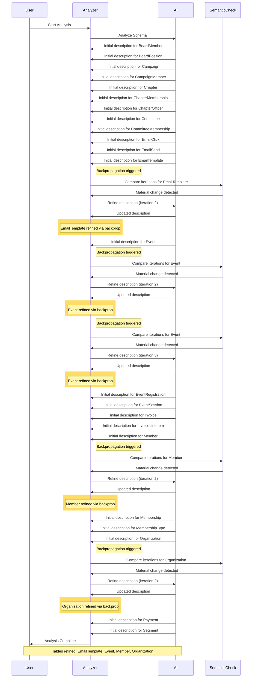

# Database Documentation: AssociationDB

**Server**: localhost
**Generated**: 2025-11-08T21:48:54.512Z
**Total Iterations**: 50

## Analysis Summary

- **Status**: converged
- **Iterations**: 50
- **Tokens Used**: 103,412
- **Estimated Cost**: $0.00
- **AI Model**: openai/gpt-oss-120b
- **AI Vendor**: GroqLLM
- **Temperature**: 0.1
- **Convergence**: Reached maximum iteration limit (50)

## Table of Contents

### [AssociationDemo](#schema-associationdemo) (26 tables)
- [BoardMember](#boardmember)
- [BoardPosition](#boardposition)
- [Campaign](#campaign)
- [CampaignMember](#campaignmember)
- [Certificate](#certificate)
- [Chapter](#chapter)
- [ChapterMembership](#chaptermembership)
- [ChapterOfficer](#chapterofficer)
- [Committee](#committee)
- [CommitteeMembership](#committeemembership)
- [Course](#course)
- [EmailClick](#emailclick)
- [EmailSend](#emailsend)
- [EmailTemplate](#emailtemplate)
- [Enrollment](#enrollment)
- [Event](#event)
- [EventRegistration](#eventregistration)
- [EventSession](#eventsession)
- [Invoice](#invoice)
- [InvoiceLineItem](#invoicelineitem)
- [Member](#member)
- [Membership](#membership)
- [MembershipType](#membershiptype)
- [Organization](#organization)
- [Payment](#payment)
- [Segment](#segment)

## Schema: AssociationDemo

### Entity Relationship Diagram

```mermaid
erDiagram
    BoardMember {
        uniqueidentifier ID "PK,NOT_NULL"
        uniqueidentifier BoardPositionID "FK,NOT_NULL"
        uniqueidentifier MemberID "FK,NOT_NULL"
        date StartDate "NOT_NULL"
        date EndDate
        bit IsActive "NOT_NULL"
        date ElectionDate
    }
    BoardPosition {
        uniqueidentifier ID "PK,NOT_NULL"
        nvarchar PositionTitle "NOT_NULL"
        int PositionOrder "NOT_NULL"
        nvarchar Description
        int TermLengthYears
        bit IsOfficer "NOT_NULL"
        bit IsActive "NOT_NULL"
    }
    Campaign {
        uniqueidentifier ID "PK,NOT_NULL"
        nvarchar Name "NOT_NULL"
        nvarchar CampaignType "NOT_NULL"
        nvarchar Status "NOT_NULL"
        date StartDate
        date EndDate
        decimal Budget
        decimal ActualCost
        nvarchar TargetAudience
        nvarchar Goals
        nvarchar Description
    }
    CampaignMember {
        uniqueidentifier ID "PK,NOT_NULL"
        uniqueidentifier CampaignID "FK,NOT_NULL"
        uniqueidentifier MemberID "FK,NOT_NULL"
        uniqueidentifier SegmentID "FK"
        datetime AddedDate "NOT_NULL"
        nvarchar Status "NOT_NULL"
        datetime ResponseDate
        decimal ConversionValue
    }
    Certificate {
        uniqueidentifier ID "PK,NOT_NULL"
        uniqueidentifier EnrollmentID "FK,NOT_NULL"
        nvarchar CertificateNumber "NOT_NULL"
        date IssuedDate "NOT_NULL"
        date ExpirationDate
        nvarchar CertificatePDFURL
        nvarchar VerificationCode
    }
    Chapter {
        uniqueidentifier ID "PK,NOT_NULL"
        nvarchar Name "NOT_NULL"
        nvarchar ChapterType "NOT_NULL"
        nvarchar Region
        nvarchar City
        nvarchar State
        nvarchar Country
        date FoundedDate
        nvarchar Description
        nvarchar Website
        nvarchar Email
        bit IsActive "NOT_NULL"
        nvarchar MeetingFrequency
        int MemberCount
    }
    ChapterMembership {
        uniqueidentifier ID "PK,NOT_NULL"
        uniqueidentifier ChapterID "FK,NOT_NULL"
        uniqueidentifier MemberID "FK,NOT_NULL"
        date JoinDate "NOT_NULL"
        nvarchar Status "NOT_NULL"
        nvarchar Role
    }
    ChapterOfficer {
        uniqueidentifier ID "PK,NOT_NULL"
        uniqueidentifier ChapterID "FK,NOT_NULL"
        uniqueidentifier MemberID "FK,NOT_NULL"
        nvarchar Position "NOT_NULL"
        date StartDate "NOT_NULL"
        date EndDate
        bit IsActive "NOT_NULL"
    }
    Committee {
        uniqueidentifier ID "PK,NOT_NULL"
        nvarchar Name "NOT_NULL"
        nvarchar CommitteeType "NOT_NULL"
        nvarchar Purpose
        nvarchar MeetingFrequency
        bit IsActive "NOT_NULL"
        date FormedDate
        date DisbandedDate
        uniqueidentifier ChairMemberID "FK"
        int MaxMembers
    }
    CommitteeMembership {
        uniqueidentifier ID "PK,NOT_NULL"
        uniqueidentifier CommitteeID "FK,NOT_NULL"
        uniqueidentifier MemberID "FK,NOT_NULL"
        nvarchar Role "NOT_NULL"
        date StartDate "NOT_NULL"
        date EndDate
        bit IsActive "NOT_NULL"
        nvarchar AppointedBy
    }
    Course {
        uniqueidentifier ID "PK,NOT_NULL"
        nvarchar Code "NOT_NULL"
        nvarchar Title "NOT_NULL"
        nvarchar Description
        nvarchar Category
        nvarchar Level "NOT_NULL"
        decimal DurationHours
        decimal CEUCredits
        decimal Price
        decimal MemberPrice
        bit IsActive "NOT_NULL"
        date PublishedDate
        nvarchar InstructorName
        uniqueidentifier PrerequisiteCourseID "FK"
        nvarchar ThumbnailURL
        nvarchar LearningObjectives
    }
    EmailClick {
        uniqueidentifier ID "PK,NOT_NULL"
        uniqueidentifier EmailSendID "FK,NOT_NULL"
        datetime ClickDate "NOT_NULL"
        nvarchar URL "NOT_NULL"
        nvarchar LinkName
        nvarchar IPAddress
        nvarchar UserAgent
    }
    EmailSend {
        uniqueidentifier ID "PK,NOT_NULL"
        uniqueidentifier TemplateID "FK"
        uniqueidentifier CampaignID "FK"
        uniqueidentifier MemberID "FK,NOT_NULL"
        nvarchar Subject
        datetime SentDate "NOT_NULL"
        datetime DeliveredDate
        datetime OpenedDate
        int OpenCount
        datetime ClickedDate
        int ClickCount
        datetime BouncedDate
        nvarchar BounceType
        nvarchar BounceReason
        datetime UnsubscribedDate
        datetime SpamReportedDate
        nvarchar Status "NOT_NULL"
        nvarchar ExternalMessageID
    }
    EmailTemplate {
        uniqueidentifier ID "PK,NOT_NULL"
        nvarchar Name "NOT_NULL"
        nvarchar Subject
        nvarchar FromName
        nvarchar FromEmail
        nvarchar ReplyToEmail
        nvarchar HtmlBody
        nvarchar TextBody
        nvarchar Category
        bit IsActive "NOT_NULL"
        nvarchar PreviewText
        nvarchar Tags
    }
    Enrollment {
        uniqueidentifier ID "PK,NOT_NULL"
        uniqueidentifier CourseID "FK,NOT_NULL"
        uniqueidentifier MemberID "FK,NOT_NULL"
        datetime EnrollmentDate "NOT_NULL"
        datetime StartDate
        datetime CompletionDate
        datetime ExpirationDate
        nvarchar Status "NOT_NULL"
        int ProgressPercentage
        datetime LastAccessedDate
        int TimeSpentMinutes
        decimal FinalScore
        decimal PassingScore
        bit Passed
        uniqueidentifier InvoiceID
    }
    Event {
        uniqueidentifier ID "PK,NOT_NULL"
        nvarchar Name "NOT_NULL"
        nvarchar EventType "NOT_NULL"
        datetime StartDate "NOT_NULL"
        datetime EndDate "NOT_NULL"
        nvarchar Timezone
        nvarchar Location
        bit IsVirtual "NOT_NULL"
        nvarchar VirtualPlatform
        nvarchar MeetingURL
        uniqueidentifier ChapterID
        int Capacity
        datetime RegistrationOpenDate
        datetime RegistrationCloseDate
        decimal RegistrationFee
        decimal MemberPrice
        decimal NonMemberPrice
        decimal CEUCredits
        nvarchar Description
        nvarchar Status "NOT_NULL"
    }
    EventRegistration {
        uniqueidentifier ID "PK,NOT_NULL"
        uniqueidentifier EventID "FK,NOT_NULL"
        uniqueidentifier MemberID "FK,NOT_NULL"
        datetime RegistrationDate "NOT_NULL"
        nvarchar RegistrationType
        nvarchar Status "NOT_NULL"
        datetime CheckInTime
        uniqueidentifier InvoiceID
        bit CEUAwarded "NOT_NULL"
        datetime CEUAwardedDate
        datetime CancellationDate
        nvarchar CancellationReason
    }
    EventSession {
        uniqueidentifier ID "PK,NOT_NULL"
        uniqueidentifier EventID "FK,NOT_NULL"
        nvarchar Name "NOT_NULL"
        nvarchar Description
        datetime StartTime "NOT_NULL"
        datetime EndTime "NOT_NULL"
        nvarchar Room
        nvarchar SpeakerName
        nvarchar SessionType
        int Capacity
        decimal CEUCredits
    }
    Invoice {
        uniqueidentifier ID "PK,NOT_NULL"
        nvarchar InvoiceNumber "NOT_NULL"
        uniqueidentifier MemberID "FK,NOT_NULL"
        date InvoiceDate "NOT_NULL"
        date DueDate "NOT_NULL"
        decimal SubTotal "NOT_NULL"
        decimal Tax
        decimal Discount
        decimal Total "NOT_NULL"
        decimal AmountPaid
        decimal Balance "NOT_NULL"
        nvarchar Status "NOT_NULL"
        nvarchar Notes
        nvarchar PaymentTerms
    }
    InvoiceLineItem {
        uniqueidentifier ID "PK,NOT_NULL"
        uniqueidentifier InvoiceID "FK,NOT_NULL"
        nvarchar Description "NOT_NULL"
        nvarchar ItemType "NOT_NULL"
        int Quantity
        decimal UnitPrice "NOT_NULL"
        decimal Amount "NOT_NULL"
        decimal TaxAmount
        nvarchar RelatedEntityType
        uniqueidentifier RelatedEntityID
    }
    Member {
        uniqueidentifier ID "PK,NOT_NULL"
        nvarchar Email "NOT_NULL"
        nvarchar FirstName "NOT_NULL"
        nvarchar LastName "NOT_NULL"
        nvarchar Title
        uniqueidentifier OrganizationID "FK"
        nvarchar Industry
        nvarchar JobFunction
        int YearsInProfession
        date JoinDate "NOT_NULL"
        nvarchar LinkedInURL
        nvarchar Bio
        nvarchar PreferredLanguage
        nvarchar Timezone
        nvarchar Phone
        nvarchar Mobile
        nvarchar City
        nvarchar State
        nvarchar Country
        nvarchar PostalCode
        int EngagementScore
        datetime LastActivityDate
        nvarchar ProfilePhotoURL
    }
    Membership {
        uniqueidentifier ID "PK,NOT_NULL"
        uniqueidentifier MemberID "FK,NOT_NULL"
        uniqueidentifier MembershipTypeID "FK,NOT_NULL"
        nvarchar Status "NOT_NULL"
        date StartDate "NOT_NULL"
        date EndDate "NOT_NULL"
        date RenewalDate
        bit AutoRenew "NOT_NULL"
        date CancellationDate
        nvarchar CancellationReason
    }
    MembershipType {
        uniqueidentifier ID "PK,NOT_NULL"
        nvarchar Name "NOT_NULL"
        nvarchar Description
        decimal AnnualDues "NOT_NULL"
        int RenewalPeriodMonths "NOT_NULL"
        bit IsActive "NOT_NULL"
        bit AllowAutoRenew "NOT_NULL"
        bit RequiresApproval "NOT_NULL"
        nvarchar Benefits
        int DisplayOrder
    }
    Organization {
        uniqueidentifier ID "PK,NOT_NULL"
        nvarchar Name "NOT_NULL"
        nvarchar Industry
        int EmployeeCount
        decimal AnnualRevenue
        decimal MarketCapitalization
        nvarchar TickerSymbol
        nvarchar Exchange
        nvarchar Website
        nvarchar Description
        int YearFounded
        nvarchar City
        nvarchar State
        nvarchar Country
        nvarchar PostalCode
        nvarchar Phone
        nvarchar LogoURL
    }
    Payment {
        uniqueidentifier ID "PK,NOT_NULL"
        uniqueidentifier InvoiceID "FK,NOT_NULL"
        datetime PaymentDate "NOT_NULL"
        decimal Amount "NOT_NULL"
        nvarchar PaymentMethod "NOT_NULL"
        nvarchar TransactionID
        nvarchar Status "NOT_NULL"
        datetime ProcessedDate
        nvarchar FailureReason
        nvarchar Notes
    }
    Segment {
        uniqueidentifier ID "PK,NOT_NULL"
        nvarchar Name "NOT_NULL"
        nvarchar Description
        nvarchar SegmentType
        nvarchar FilterCriteria
        int MemberCount
        datetime LastCalculatedDate
        bit IsActive "NOT_NULL"
    }

    Member ||--o{ BoardMember : "has"
    BoardPosition ||--o{ BoardMember : "has"
    Campaign ||--o{ CampaignMember : "has"
    Segment ||--o{ CampaignMember : "has"
    Member ||--o{ CampaignMember : "has"
    Enrollment ||--o{ Certificate : "has"
    Chapter ||--o{ ChapterMembership : "has"
    Member ||--o{ ChapterMembership : "has"
    Chapter ||--o{ ChapterOfficer : "has"
    Member ||--o{ ChapterOfficer : "has"
    Member ||--o{ Committee : "has"
    Committee ||--o{ CommitteeMembership : "has"
    Member ||--o{ CommitteeMembership : "has"
    Course ||--o{ Course : "has"
    EmailSend ||--o{ EmailClick : "has"
    Campaign ||--o{ EmailSend : "has"
    EmailTemplate ||--o{ EmailSend : "has"
    Member ||--o{ EmailSend : "has"
    Member ||--o{ Enrollment : "has"
    Course ||--o{ Enrollment : "has"
    Member ||--o{ EventRegistration : "has"
    Event ||--o{ EventRegistration : "has"
    Event ||--o{ EventSession : "has"
    Member ||--o{ Invoice : "has"
    Invoice ||--o{ InvoiceLineItem : "has"
    Organization ||--o{ Member : "has"
    MembershipType ||--o{ Membership : "has"
    Member ||--o{ Membership : "has"
    Invoice ||--o{ Payment : "has"
```

### Tables

#### BoardMember

Stores each assignment of a member to a specific board position, including the term start/end dates, election date and active status. It links members to board positions to track governance roles over time.

**Row Count**: 27
**Dependency Level**: 2

**Confidence**: 96%

**Depends On**:
- [AssociationDemo.Member](#member) (via MemberID)
- [AssociationDemo.BoardPosition](#boardposition) (via BoardPositionID)

**Columns**:

| Column | Type | Description |
|--------|------|-------------|
| ID | uniqueidentifier (PK, NOT NULL) | Surrogate primary key for each board‑member record, generated sequentially. |
| BoardPositionID | uniqueidentifier (FK, NOT NULL) | Reference to the specific board position (e.g., President, Treasurer) held by the member. |
| MemberID | uniqueidentifier (FK, NOT NULL) | Reference to the member who occupies the board position. |
| StartDate | date (NOT NULL) | Date when the member’s term in the board position began. |
| EndDate | date | Date when the member’s term ended or is expected to end; nullable for ongoing terms. |
| IsActive | bit (NOT NULL) | Flag indicating whether the board assignment is currently active. |
| ElectionDate | date | Date the member was elected to the board position, often preceding the start date. |

#### BoardPosition

A lookup table that defines the possible board positions within an organization, including their titles, display order, term length, officer status, and activation flag.

**Row Count**: 9
**Dependency Level**: 0

**Confidence**: 96%

**Referenced By**:
- [AssociationDemo.BoardMember](#boardmember)

**Columns**:

| Column | Type | Description |
|--------|------|-------------|
| ID | uniqueidentifier (PK, NOT NULL) | Unique identifier for each board position record. |
| PositionTitle | nvarchar (NOT NULL) | Human‑readable name of the board position (e.g., President, Treasurer, Director at Large #3). |
| PositionOrder | int (NOT NULL) | Numeric order used to sort or rank positions, with 1 being highest priority. |
| Description | nvarchar | Optional free‑text description of the role; currently unused. |
| TermLengthYears | int | Standard length of a term for the position, expressed in years (2 or 3). |
| IsOfficer | bit (NOT NULL) | Flag indicating whether the position is considered an officer of the board. |
| IsActive | bit (NOT NULL) | Indicates if the position is currently active and assignable. |

#### Campaign

Stores master records for marketing campaigns, capturing their identity, schedule, budget, type, status and descriptive details. Used to plan, track and report on promotional activities such as member welcomes, cybersecurity awareness, course launches, event promotions and membership renewals.

**Row Count**: 5
**Dependency Level**: 0

**Confidence**: 96%

**Referenced By**:
- [AssociationDemo.CampaignMember](#campaignmember)
- [AssociationDemo.EmailSend](#emailsend)

**Columns**:

| Column | Type | Description |
|--------|------|-------------|
| ID | uniqueidentifier (PK, NOT NULL) | Unique identifier for each campaign record |
| Name | nvarchar (NOT NULL) | Human‑readable title of the campaign |
| CampaignType | nvarchar (NOT NULL) | Category of the campaign (e.g., Member Engagement, Membership Renewal, Event Promotion, Course Launch) |
| Status | nvarchar (NOT NULL) | Current lifecycle state of the campaign (Active, Completed, etc.) |
| StartDate | date | Date the campaign is scheduled to begin |
| EndDate | date | Date the campaign is scheduled to end |
| Budget | decimal | Planned monetary allocation for the campaign |
| ActualCost | decimal | Actual expenditure incurred; may be populated after campaign completion |
| TargetAudience | nvarchar | Intended audience segment for the campaign (optional) |
| Goals | nvarchar | Specific objectives or KPIs for the campaign (optional) |
| Description | nvarchar | Longer textual description of the campaign purpose and content |

#### CampaignMember

Stores the association of individual members with specific marketing campaigns (and optionally a segment), tracking the member's status in the campaign lifecycle, dates of addition, response, and any conversion value generated.

**Row Count**: 0
**Dependency Level**: 2

**Confidence**: 92%

**Depends On**:
- [AssociationDemo.Campaign](#campaign) (via CampaignID)
- [AssociationDemo.Segment](#segment) (via SegmentID)
- [AssociationDemo.Member](#member) (via MemberID)

**Columns**:

| Column | Type | Description |
|--------|------|-------------|
| ID | uniqueidentifier (PK, NOT NULL) | Surrogate primary key for each campaign‑member record, generated sequentially to ensure uniqueness. |
| CampaignID | uniqueidentifier (FK, NOT NULL) | Identifier of the marketing campaign to which the member is linked. |
| MemberID | uniqueidentifier (FK, NOT NULL) | Identifier of the member (contact/lead) participating in the campaign. |
| SegmentID | uniqueidentifier (FK) | Optional identifier of the segment that qualified the member for this campaign targeting. |
| AddedDate | datetime (NOT NULL) | Timestamp when the member was added to the campaign (or segment assignment). |
| Status | nvarchar (NOT NULL) | Current state of the member within the campaign workflow (e.g., Targeted, Sent, Responded, Converted, Opted Out). |
| ResponseDate | datetime | Date and time when the member responded to the campaign (e.g., opened, clicked, replied). |
| ConversionValue | decimal | Monetary value attributed to the member's conversion (e.g., sale amount, donation). |

#### Certificate

**Row Count**: 326
**Dependency Level**: 4

**Depends On**:
- [AssociationDemo.Enrollment](#enrollment) (via EnrollmentID)

**Columns**:

| Column | Type | Description |
|--------|------|-------------|
| ID | uniqueidentifier (PK, NOT NULL) |  |
| EnrollmentID | uniqueidentifier (FK, NOT NULL) |  |
| CertificateNumber | nvarchar (NOT NULL) |  |
| IssuedDate | date (NOT NULL) |  |
| ExpirationDate | date |  |
| CertificatePDFURL | nvarchar |  |
| VerificationCode | nvarchar |  |

#### Chapter

Stores the definition and metadata of organizational chapters (e.g., geographic or special‑interest groups) within a professional association, including their identifiers, names, type, location, founding date, description, activity status, meeting cadence and member count.

**Row Count**: 15
**Dependency Level**: 0

**Confidence**: 93%

**Referenced By**:
- [AssociationDemo.ChapterMembership](#chaptermembership)
- [AssociationDemo.ChapterOfficer](#chapterofficer)

**Columns**:

| Column | Type | Description |
|--------|------|-------------|
| ID | uniqueidentifier (PK, NOT NULL) | Unique identifier for each chapter record. |
| Name | nvarchar (NOT NULL) | Human‑readable name of the chapter, often including the focus area or location. |
| ChapterType | nvarchar (NOT NULL) | Classifies the chapter as either Geographic or Special Interest. |
| Region | nvarchar | Broad geographic region the chapter belongs to (e.g., West Coast, Midwest). |
| City | nvarchar | Specific city where the chapter is based, when applicable. |
| State | nvarchar | State or province abbreviation for the city location. |
| Country | nvarchar | Country of the chapter, defaulting to United States. |
| FoundedDate | date | Date the chapter was officially established. |
| Description | nvarchar | Brief narrative describing the chapter's focus or audience. |
| Website | nvarchar | URL for the chapter's public website (currently empty). |
| Email | nvarchar | Contact email address for the chapter (currently empty). |
| IsActive | bit (NOT NULL) | Flag indicating whether the chapter is currently active. |
| MeetingFrequency | nvarchar | How often the chapter meets (Monthly or Quarterly). |
| MemberCount | int | Number of members in the chapter (currently unknown). |

#### ChapterMembership

Stores the membership relationship between individual members and organizational chapters, recording when a member joined a chapter, their active/inactive status, and role within the chapter.

**Row Count**: 613
**Dependency Level**: 2

**Confidence**: 96%

**Depends On**:
- [AssociationDemo.Chapter](#chapter) (via ChapterID)
- [AssociationDemo.Member](#member) (via MemberID)

**Columns**:

| Column | Type | Description |
|--------|------|-------------|
| ID | uniqueidentifier (PK, NOT NULL) | Surrogate primary key for each membership record, generated sequentially to ensure uniqueness. |
| ChapterID | uniqueidentifier (FK, NOT NULL) | Foreign key linking the record to a specific chapter in the Chapter table. |
| MemberID | uniqueidentifier (FK, NOT NULL) | Foreign key linking the record to a specific member in the Member table. |
| JoinDate | date (NOT NULL) | The date the member joined the chapter. |
| Status | nvarchar (NOT NULL) | Indicates whether the member’s chapter affiliation is currently active or inactive. |
| Role | nvarchar | The role of the member within the chapter; currently only 'Member' is stored. |

#### ChapterOfficer

Stores assignments of members to leadership positions within association chapters, tracking their role, tenure and active status.

**Row Count**: 45
**Dependency Level**: 2

**Confidence**: 96%

**Depends On**:
- [AssociationDemo.Chapter](#chapter) (via ChapterID)
- [AssociationDemo.Member](#member) (via MemberID)

**Columns**:

| Column | Type | Description |
|--------|------|-------------|
| ID | uniqueidentifier (PK, NOT NULL) | Primary key uniquely identifying each leadership assignment record. |
| ChapterID | uniqueidentifier (FK, NOT NULL) | Foreign key referencing the Chapter the role belongs to. |
| MemberID | uniqueidentifier (FK, NOT NULL) | Foreign key referencing the Member who holds the role. |
| Position | nvarchar (NOT NULL) | The title of the leadership role (President, Vice President, Secretary). |
| StartDate | date (NOT NULL) | Date when the member began the leadership role. |
| EndDate | date | Date when the leadership role ended; null for active assignments. |
| IsActive | bit (NOT NULL) | Flag indicating whether the assignment is currently active (default true). |

#### Committee

Stores information about the various committees within an association, including their identity, name, type (standing, ad hoc, task force), purpose, meeting cadence, active status, formation and disband dates, the member who chairs the committee, and the maximum allowed members.

**Row Count**: 12
**Dependency Level**: 2

**Confidence**: 97%

**Depends On**:
- [AssociationDemo.Member](#member) (via ChairMemberID)

**Referenced By**:
- [AssociationDemo.CommitteeMembership](#committeemembership)

**Columns**:

| Column | Type | Description |
|--------|------|-------------|
| ID | uniqueidentifier (PK, NOT NULL) | Primary key uniquely identifying each committee record. |
| Name | nvarchar (NOT NULL) | The official name of the committee (e.g., Finance Committee). |
| CommitteeType | nvarchar (NOT NULL) | Categorizes the committee as Standing, Ad Hoc, or Task Force. |
| Purpose | nvarchar | Narrative statement of the committee's mission or responsibility. |
| MeetingFrequency | nvarchar | How often the committee meets (Monthly, Quarterly, Bi-Weekly). |
| IsActive | bit (NOT NULL) | Flag indicating whether the committee is currently active. |
| FormedDate | date | Date the committee was officially created. |
| DisbandedDate | date | Date the committee was dissolved, if applicable; null for active committees. |
| ChairMemberID | uniqueidentifier (FK) | Reference to the Member who serves as the committee chair. |
| MaxMembers | int | Maximum number of members allowed in the committee. |

#### CommitteeMembership

Stores the assignments of members to committees, capturing each member's role, appointment dates, and active status within a committee governance structure.

**Row Count**: 96
**Dependency Level**: 3

**Confidence**: 96%

**Depends On**:
- [AssociationDemo.Committee](#committee) (via CommitteeID)
- [AssociationDemo.Member](#member) (via MemberID)

**Columns**:

| Column | Type | Description |
|--------|------|-------------|
| ID | uniqueidentifier (PK, NOT NULL) | Unique identifier for each committee‑member assignment record. |
| CommitteeID | uniqueidentifier (FK, NOT NULL) | Reference to the committee to which the member is assigned. |
| MemberID | uniqueidentifier (FK, NOT NULL) | Reference to the member who holds the assignment. |
| Role | nvarchar (NOT NULL) | The position the member holds on the committee (Member, Chair, or Vice Chair). |
| StartDate | date (NOT NULL) | Date when the member's appointment to the committee began. |
| EndDate | date | Date when the member's appointment ended; currently null for all rows, indicating ongoing terms or not yet recorded. |
| IsActive | bit (NOT NULL) | Flag indicating whether the assignment is currently active; defaults to true. |
| AppointedBy | nvarchar | Name or identifier of the person who appointed the member; currently unused (all null). |

#### Course

**Row Count**: 60
**Dependency Level**: 4

**Depends On**:
- [AssociationDemo.Course](#course) (via PrerequisiteCourseID)

**Referenced By**:
- [AssociationDemo.Course](#course)
- [AssociationDemo.Enrollment](#enrollment)

**Columns**:

| Column | Type | Description |
|--------|------|-------------|
| ID | uniqueidentifier (PK, NOT NULL) |  |
| Code | nvarchar (NOT NULL) |  |
| Title | nvarchar (NOT NULL) |  |
| Description | nvarchar |  |
| Category | nvarchar |  |
| Level | nvarchar (NOT NULL) |  |
| DurationHours | decimal |  |
| CEUCredits | decimal |  |
| Price | decimal |  |
| MemberPrice | decimal |  |
| IsActive | bit (NOT NULL) |  |
| PublishedDate | date |  |
| InstructorName | nvarchar |  |
| PrerequisiteCourseID | uniqueidentifier (FK) |  |
| ThumbnailURL | nvarchar |  |
| LearningObjectives | nvarchar |  |

#### EmailClick

Stores a single record for each link click that occurs within an email message sent to a member, capturing when the click happened, which email it belongs to, the URL and optional link name, and (when available) the visitor's IP address and browser user‑agent for analytics.

**Row Count**: 1
**Dependency Level**: 3

**Confidence**: 96%

**Depends On**:
- [AssociationDemo.EmailSend](#emailsend) (via EmailSendID)

**Columns**:

| Column | Type | Description |
|--------|------|-------------|
| ID | uniqueidentifier (PK, NOT NULL) | Unique identifier for the click record (primary key). |
| EmailSendID | uniqueidentifier (FK, NOT NULL) | Reference to the EmailSend record whose email contained the clicked link. |
| ClickDate | datetime (NOT NULL) | Date and time when the link was clicked. |
| URL | nvarchar (NOT NULL) | The full URL that was clicked by the recipient. |
| LinkName | nvarchar | Human‑readable name of the link (e.g., button or anchor text). |
| IPAddress | nvarchar | IP address of the user who clicked the link (optional). |
| UserAgent | nvarchar | Browser user‑agent string of the clicking device (optional). |

#### EmailSend

Stores a log of each email message sent to members, capturing which template and (optional) campaign was used, when it was sent, delivery status, opens, clicks, bounces and other engagement metrics.

**Row Count**: 1400
**Dependency Level**: 2

**Confidence**: 96%

**Depends On**:
- [AssociationDemo.Campaign](#campaign) (via CampaignID)
- [AssociationDemo.EmailTemplate](#emailtemplate) (via TemplateID)
- [AssociationDemo.Member](#member) (via MemberID)

**Referenced By**:
- [AssociationDemo.EmailClick](#emailclick)

**Columns**:

| Column | Type | Description |
|--------|------|-------------|
| ID | uniqueidentifier (PK, NOT NULL) | Unique identifier for each email send record |
| TemplateID | uniqueidentifier (FK) | Reference to the email template used for this send |
| CampaignID | uniqueidentifier (FK) | Optional reference to the marketing campaign associated with the send |
| MemberID | uniqueidentifier (FK, NOT NULL) | Reference to the member (recipient) of the email |
| Subject | nvarchar | Subject line of the email, derived from the template |
| SentDate | datetime (NOT NULL) | Timestamp when the email was queued/sent |
| DeliveredDate | datetime | Timestamp when the email was marked as delivered to the recipient's server |
| OpenedDate | datetime | Timestamp of the first open event |
| OpenCount | int | Number of times the email was opened |
| ClickedDate | datetime | Timestamp of the first click on a link within the email |
| ClickCount | int | Number of link clicks recorded for the email |
| BouncedDate | datetime | Timestamp when the email bounced |
| BounceType | nvarchar | Category of bounce (hard, soft, etc.) |
| BounceReason | nvarchar | Textual reason for the bounce |
| UnsubscribedDate | datetime | Timestamp when the recipient unsubscribed via this email |
| SpamReportedDate | datetime | Timestamp when the email was reported as spam |
| Status | nvarchar (NOT NULL) | Current state of the email (Sent, Delivered, Opened, Clicked, Bounced, etc.) |
| ExternalMessageID | nvarchar | Identifier from the external email service provider |

#### EmailTemplate

Stores a small, fixed catalog of predefined email templates (approximately five) used by the association for member communications such as welcome messages, renewal reminders, newsletters, and event invitations. Each template has a fixed subject line, indicating a controlled set of campaign communications.

**Row Count**: 5
**Dependency Level**: 0

**Confidence**: 97%

**Referenced By**:
- [AssociationDemo.EmailSend](#emailsend)

**Columns**:

| Column | Type | Description |
|--------|------|-------------|
| ID | uniqueidentifier (PK, NOT NULL) | Primary key GUID uniquely identifying each email template. |
| Name | nvarchar (NOT NULL) | Human‑readable name of the template, used to select the appropriate email content. |
| Subject | nvarchar | Subject line of the email when this template is used. |
| FromName | nvarchar | Display name shown in the From field of the email. |
| FromEmail | nvarchar | Email address used in the From header for the template. |
| ReplyToEmail | nvarchar | Optional reply‑to address; currently unused (all null). |
| HtmlBody | nvarchar | HTML version of the email body; not populated in this table (all null). |
| TextBody | nvarchar | Plain‑text version of the email body; also null. |
| Category | nvarchar | Broad classification of the template (Renewal, Welcome, Newsletter, Event). |
| IsActive | bit (NOT NULL) | Flag indicating whether the template is currently active and can be used for sending. |
| PreviewText | nvarchar | Short preview snippet shown in email clients before opening the message. |
| Tags | nvarchar | Optional tag list for additional categorisation; currently unused (all null). |

#### Enrollment

**Row Count**: 900
**Dependency Level**: 4

**Depends On**:
- [AssociationDemo.Member](#member) (via MemberID)
- [AssociationDemo.Course](#course) (via CourseID)

**Referenced By**:
- [AssociationDemo.Certificate](#certificate)

**Columns**:

| Column | Type | Description |
|--------|------|-------------|
| ID | uniqueidentifier (PK, NOT NULL) |  |
| CourseID | uniqueidentifier (FK, NOT NULL) |  |
| MemberID | uniqueidentifier (FK, NOT NULL) |  |
| EnrollmentDate | datetime (NOT NULL) |  |
| StartDate | datetime |  |
| CompletionDate | datetime |  |
| ExpirationDate | datetime |  |
| Status | nvarchar (NOT NULL) |  |
| ProgressPercentage | int |  |
| LastAccessedDate | datetime |  |
| TimeSpentMinutes | int |  |
| FinalScore | decimal |  |
| PassingScore | decimal |  |
| Passed | bit |  |
| InvoiceID | uniqueidentifier |  |

#### Event

The AssociationDemo.Event table stores detailed information about industry events such as conferences, webinars, workshops, and chapter meetings, and serves as the parent entity for one‑to‑many Session records. Each event row captures overall event attributes—name, type, start/end dates, location (physical or virtual), capacity, pricing tiers (e.g., Standard and Early‑Bird), registration windows, CEU credit definitions and awards (CEUAwarded fields), and status—while related Session rows define the individual timed program items, speakers, rooms, and session‑specific CEU credits. This structure indicates that events are multi‑session conferences or training programs rather than single‑session gatherings.

**Row Count**: 21
**Dependency Level**: 0

**Confidence**: 99%

**Referenced By**:
- [AssociationDemo.EventRegistration](#eventregistration)
- [AssociationDemo.EventSession](#eventsession)

**Columns**:

| Column | Type | Description |
|--------|------|-------------|
| ID | uniqueidentifier (PK, NOT NULL) | Primary key uniquely identifying each event record |
| Name | nvarchar (NOT NULL) | Descriptive title of the event |
| EventType | nvarchar (NOT NULL) | Category of the event (Webinar, Conference, Workshop) |
| StartDate | datetime (NOT NULL) | Date and time when the event begins |
| EndDate | datetime (NOT NULL) | Date and time when the event ends |
| Timezone | nvarchar | IANA time‑zone identifier for the event's scheduled time |
| Location | nvarchar | Physical venue or "Virtual" indicator where the event is held |
| IsVirtual | bit (NOT NULL) | Flag indicating whether the event is held online |
| VirtualPlatform | nvarchar | Name of the online platform used when IsVirtual is true (e.g., Zoom, Teams) |
| MeetingURL | nvarchar | Link to join the virtual event |
| ChapterID | uniqueidentifier | Optional reference to a chapter or regional group organizing the event |
| Capacity | int | Maximum number of attendees allowed |
| RegistrationOpenDate | datetime | Date when attendees can start registering |
| RegistrationCloseDate | datetime | Date when registration ends |
| RegistrationFee | decimal | Overall fee for registering (currently null for all rows) |
| MemberPrice | decimal | Price for members to attend the event |
| NonMemberPrice | decimal | Price for non‑members to attend the event |
| CEUCredits | decimal | Continuing Education Units awarded for attending the event |
| Description | nvarchar | Long textual summary of the event content |
| Status | nvarchar (NOT NULL) | Current lifecycle state of the event (Draft, Published, Registration Open, Completed, etc.) |

#### EventRegistration

Stores each member's registration for a specific event, tracking when they signed up, the type of registration, current status, check‑in time, invoicing, CEU award and any cancellation details. It functions as the junction between members and events to manage attendance and related administrative data.

**Row Count**: 5567
**Dependency Level**: 2

**Confidence**: 96%

**Depends On**:
- [AssociationDemo.Member](#member) (via MemberID)
- [AssociationDemo.Event](#event) (via EventID)

**Columns**:

| Column | Type | Description |
|--------|------|-------------|
| ID | uniqueidentifier (PK, NOT NULL) | Surrogate primary key for each registration record |
| EventID | uniqueidentifier (FK, NOT NULL) | Foreign key to the Event table identifying which event the member registered for |
| MemberID | uniqueidentifier (FK, NOT NULL) | Foreign key to the Member table identifying the registering member |
| RegistrationDate | datetime (NOT NULL) | Date the member signed up for the event |
| RegistrationType | nvarchar | Category of registration pricing, either Standard or Early Bird |
| Status | nvarchar (NOT NULL) | Current registration status: Attended, Registered, or No Show |
| CheckInTime | datetime | Timestamp when the member actually checked in to the event (if applicable) |
| InvoiceID | uniqueidentifier | Reference to an invoice generated for the registration (currently unused) |
| CEUAwarded | bit (NOT NULL) | Flag indicating whether the member earned Continuing Education Units for this event |
| CEUAwardedDate | datetime | Date the CEU was awarded to the member |
| CancellationDate | datetime | Date the registration was cancelled, if applicable |
| CancellationReason | nvarchar | Textual reason for cancellation, if any |

#### EventSession

Stores individual sessions or program items that belong to a larger event, capturing details such as title, timing, location, speaker, type, capacity and any continuing‑education credits awarded.

**Row Count**: 0
**Dependency Level**: 1

**Confidence**: 96%

**Depends On**:
- [AssociationDemo.Event](#event) (via EventID)

**Columns**:

| Column | Type | Description |
|--------|------|-------------|
| ID | uniqueidentifier (PK, NOT NULL) | Surrogate primary key uniquely identifying each session record. |
| EventID | uniqueidentifier (FK, NOT NULL) | Foreign key linking the session to its parent event. |
| Name | nvarchar (NOT NULL) | Title or short name of the session. |
| Description | nvarchar | Longer textual description of the session content. |
| StartTime | datetime (NOT NULL) | Date and time when the session begins. |
| EndTime | datetime (NOT NULL) | Date and time when the session ends. |
| Room | nvarchar | Physical room name or virtual link where the session is held. |
| SpeakerName | nvarchar | Name of the presenter or speaker for the session. |
| SessionType | nvarchar | Category of the session (e.g., keynote, workshop, panel). |
| Capacity | int | Maximum number of attendees allowed for the session. |
| CEUCredits | decimal | Number of continuing‑education units awarded for attending the session. |

#### Invoice

Stores individual invoices issued to members, capturing billing details such as invoice number, dates, amounts, payment status and related member reference.

**Row Count**: 6364
**Dependency Level**: 2

**Confidence**: 96%

**Depends On**:
- [AssociationDemo.Member](#member) (via MemberID)

**Referenced By**:
- [AssociationDemo.InvoiceLineItem](#invoicelineitem)
- [AssociationDemo.Payment](#payment)

**Columns**:

| Column | Type | Description |
|--------|------|-------------|
| ID | uniqueidentifier (PK, NOT NULL) | Surrogate primary key for the invoice record. |
| InvoiceNumber | nvarchar (NOT NULL) | Human‑readable, unique invoice identifier used in communications and tracking. |
| MemberID | uniqueidentifier (FK, NOT NULL) | Reference to the Member who is billed by this invoice. |
| InvoiceDate | date (NOT NULL) | Date the invoice was created or issued. |
| DueDate | date (NOT NULL) | Date by which payment is expected. |
| SubTotal | decimal (NOT NULL) | Sum of line‑item amounts before tax and discounts. |
| Tax | decimal | Tax amount applied to the subtotal. |
| Discount | decimal | Discount applied to the invoice; currently always zero. |
| Total | decimal (NOT NULL) | Final amount due after adding tax and subtracting discounts. |
| AmountPaid | decimal | Total amount that has been paid toward the invoice. |
| Balance | decimal (NOT NULL) | Remaining amount owed (Total – AmountPaid). |
| Status | nvarchar (NOT NULL) | Current lifecycle state of the invoice (e.g., Paid, Sent, Overdue). |
| Notes | nvarchar | Optional free‑form text for additional invoice comments. |
| PaymentTerms | nvarchar | Text describing the payment terms (e.g., Net 30). |

#### InvoiceLineItem

This table stores the line‑item details for each invoice, capturing what was sold or billed (events, memberships, courses, donations, merchandise), the quantity, pricing, tax and links to the specific entity the item relates to.

**Row Count**: 5973
**Dependency Level**: 3

**Confidence**: 94%

**Depends On**:
- [AssociationDemo.Invoice](#invoice) (via InvoiceID)

**Columns**:

| Column | Type | Description |
|--------|------|-------------|
| ID | uniqueidentifier (PK, NOT NULL) | Surrogate primary key for each line‑item record, generated sequentially to guarantee uniqueness. |
| InvoiceID | uniqueidentifier (FK, NOT NULL) | Foreign key linking the line‑item to its parent invoice record. |
| Description | nvarchar (NOT NULL) | Human‑readable text describing the billed item (e.g., event name, membership type). |
| ItemType | nvarchar (NOT NULL) | Enum indicating the category of the line‑item (Event Registration, Membership Dues, Course Enrollment, etc.). |
| Quantity | int | Number of units for the line‑item; always 1 in this dataset, reflecting single registrations or dues per line. |
| UnitPrice | decimal (NOT NULL) | Price per single unit before tax. |
| Amount | decimal (NOT NULL) | Total line amount before tax (Quantity × UnitPrice). Here equals UnitPrice because Quantity is 1. |
| TaxAmount | decimal | Tax applied to the line‑item amount. |
| RelatedEntityType | nvarchar | Enum that identifies the type of entity the line‑item is associated with (Event, Membership, Course). |
| RelatedEntityID | uniqueidentifier | Identifier of the specific event, membership record, or course that the line‑item refers to. |

#### Member

The Member table is the central registry of individual persons associated with organizations and the association. It stores personal and professional attributes (name, email, title, job function, industry, location, social links) and relationship metadata (organization affiliation, join date, engagement score). Beyond standard CRM contact data, it supports governance roles (board positions, committee chairs), multiple concurrent or sequential membership records, many‑to‑many chapter affiliations, event attendance tracking, and billing/invoicing of members. It serves as the primary entity for communications, event participation, and financial transactions within the association.

**Row Count**: 2000
**Dependency Level**: 1

**Confidence**: 98%

**Depends On**:
- [AssociationDemo.Organization](#organization) (via OrganizationID)

**Referenced By**:
- [AssociationDemo.BoardMember](#boardmember)
- [AssociationDemo.CampaignMember](#campaignmember)
- [AssociationDemo.ChapterMembership](#chaptermembership)
- [AssociationDemo.ChapterOfficer](#chapterofficer)
- [AssociationDemo.Committee](#committee)
- [AssociationDemo.CommitteeMembership](#committeemembership)
- [AssociationDemo.EmailSend](#emailsend)
- [AssociationDemo.Enrollment](#enrollment)
- [AssociationDemo.EventRegistration](#eventregistration)
- [AssociationDemo.Invoice](#invoice)
- [AssociationDemo.Membership](#membership)

**Columns**:

| Column | Type | Description |
|--------|------|-------------|
| ID | uniqueidentifier (PK, NOT NULL) | System‑generated unique identifier for the person record |
| Email | nvarchar (NOT NULL) | Primary contact email address of the individual; serves as a unique business identifier |
| FirstName | nvarchar (NOT NULL) | Given name of the individual |
| LastName | nvarchar (NOT NULL) | Family name of the individual |
| Title | nvarchar | Professional title or role within the organization (e.g., Business Analyst, VP of Engineering) |
| OrganizationID | uniqueidentifier (FK) | Foreign key linking the person to the parent Organization record (the company or tenant they belong to) |
| Industry | nvarchar | Industry sector of the individual's organization or professional focus |
| JobFunction | nvarchar | Broad functional area of the individual's work (e.g., Design, Software Development) |
| YearsInProfession | int | Number of years the individual has worked in their profession |
| JoinDate | date (NOT NULL) | Date the individual was added to the system or joined the organization/association |
| LinkedInURL | nvarchar | URL to the individual's LinkedIn profile (optional) |
| Bio | nvarchar | Free‑form biography or description of the individual (currently empty) |
| PreferredLanguage | nvarchar | Locale/language preference for communications; default 'en-US' |
| Timezone | nvarchar | Time zone identifier for the individual (currently not populated) |
| Phone | nvarchar | Work or primary phone number (optional) |
| Mobile | nvarchar | Mobile phone number (optional, currently empty) |
| City | nvarchar | City of residence or work location |
| State | nvarchar | State, province or region abbreviation |
| Country | nvarchar | Country of the individual; defaults to United States |
| PostalCode | nvarchar | Postal/ZIP code (currently not populated) |
| EngagementScore | int | Numeric score representing the individual's engagement level; currently all zero |
| LastActivityDate | datetime | Timestamp of the individual's most recent activity in the system (currently empty) |
| ProfilePhotoURL | nvarchar | Link to the individual's profile picture (currently empty) |

#### Membership

Stores each member's active or historical membership record, linking a Member to a MembershipType with start/end dates, status, renewal settings and cancellation information.

**Row Count**: 2137
**Dependency Level**: 2

**Confidence**: 96%

**Depends On**:
- [AssociationDemo.MembershipType](#membershiptype) (via MembershipTypeID)
- [AssociationDemo.Member](#member) (via MemberID)

**Columns**:

| Column | Type | Description |
|--------|------|-------------|
| ID | uniqueidentifier (PK, NOT NULL) | Unique identifier for the membership record. |
| MemberID | uniqueidentifier (FK, NOT NULL) | Reference to the member who holds the membership. |
| MembershipTypeID | uniqueidentifier (FK, NOT NULL) | Reference to the type/tier of membership (e.g., Basic, Premium). |
| Status | nvarchar (NOT NULL) | Current state of the membership (Active, Lapsed, Cancelled). |
| StartDate | date (NOT NULL) | Date the membership began. |
| EndDate | date (NOT NULL) | Date the membership is scheduled to end or actually ended. |
| RenewalDate | date | Date when the membership is due for renewal; null when not applicable. |
| AutoRenew | bit (NOT NULL) | Flag indicating whether the membership should renew automatically. |
| CancellationDate | date | Date the membership was cancelled, if applicable. |
| CancellationReason | nvarchar | Text describing why the membership was cancelled. |

#### MembershipType

Stores the definitions of membership tiers offered by the organization, including their names, descriptions, annual dues, renewal periods, status flags, renewal options, approval requirements, benefit details, and display ordering.

**Row Count**: 8
**Dependency Level**: 0

**Confidence**: 96%

**Referenced By**:
- [AssociationDemo.Membership](#membership)

**Columns**:

| Column | Type | Description |
|--------|------|-------------|
| ID | uniqueidentifier (PK, NOT NULL) | Unique identifier for each membership tier |
| Name | nvarchar (NOT NULL) | Short label of the membership tier (e.g., Student, Corporate) |
| Description | nvarchar | Longer textual explanation of what the tier provides |
| AnnualDues | decimal (NOT NULL) | Yearly fee associated with the tier (0 for complimentary) |
| RenewalPeriodMonths | int (NOT NULL) | Number of months a membership is valid before renewal (12 for annual, 1200 for lifetime) |
| IsActive | bit (NOT NULL) | Indicates whether the tier is currently offered |
| AllowAutoRenew | bit (NOT NULL) | Whether members of this tier can have their membership auto‑renewed |
| RequiresApproval | bit (NOT NULL) | Specifies if enrollment in the tier needs manual approval |
| Benefits | nvarchar | Detailed list of benefits included with the tier |
| DisplayOrder | int | Numeric order used to present tiers in UI lists |

#### Organization

A master list of business entities (companies/organizations) that also serves as the tenant or company master in a multi‑tenant CRM/association system. Each organization groups many related records such as contacts, members, and transactions, providing a central reference for linking people and activities to a specific tenant. The table includes a GUID primary key (ID), unique Name, Industry, financial metrics (EmployeeCount, AnnualRevenue, MarketCapitalization), market data (TickerSymbol, Exchange), and contact fields (Website, Phone, City, State, Country).

**Row Count**: 200
**Dependency Level**: 0

**Confidence**: 96%

**Referenced By**:
- [AssociationDemo.Member](#member)

**Columns**:

| Column | Type | Description |
|--------|------|-------------|
| ID | uniqueidentifier (PK, NOT NULL) | Surrogate primary key for the organization record. |
| Name | nvarchar (NOT NULL) | Legal or trade name of the organization. |
| Industry | nvarchar | Broad business sector classification of the organization. |
| EmployeeCount | int | Number of employees working for the organization. |
| AnnualRevenue | decimal | Total revenue generated by the organization in a fiscal year. |
| MarketCapitalization | decimal | Total market value of the organization’s publicly traded shares. |
| TickerSymbol | nvarchar | Stock ticker symbol when the organization is publicly listed. |
| Exchange | nvarchar | Stock exchange where the ticker is listed. |
| Website | nvarchar | Public website URL of the organization. |
| Description | nvarchar | Brief textual description of the organization’s business or mission. |
| YearFounded | int | Calendar year the organization was established. |
| City | nvarchar | City where the organization’s primary address is located. |
| State | nvarchar | State or province abbreviation for the primary address. |
| Country | nvarchar | Country of the organization’s primary address. |
| PostalCode | nvarchar | Postal/ZIP code of the organization’s address (currently not populated). |
| Phone | nvarchar | Primary contact phone number for the organization. |
| LogoURL | nvarchar | Link to the organization’s logo image (currently empty). |

#### Payment

Stores individual payment transactions linked to invoices, capturing when a payment was made, how much, the method used, transaction reference, processing details and status.

**Row Count**: 6327
**Dependency Level**: 3

**Confidence**: 96%

**Depends On**:
- [AssociationDemo.Invoice](#invoice) (via InvoiceID)

**Columns**:

| Column | Type | Description |
|--------|------|-------------|
| ID | uniqueidentifier (PK, NOT NULL) | Unique identifier for each payment record. |
| InvoiceID | uniqueidentifier (FK, NOT NULL) | Reference to the invoice that this payment satisfies. |
| PaymentDate | datetime (NOT NULL) | Date when the payment was received from the customer. |
| Amount | decimal (NOT NULL) | Monetary amount paid in the transaction. |
| PaymentMethod | nvarchar (NOT NULL) | Channel used to collect the payment (e.g., Stripe, Credit Card, ACH, PayPal). |
| TransactionID | nvarchar | External transaction reference supplied by the payment processor. |
| Status | nvarchar (NOT NULL) | Current outcome of the payment attempt (Completed or Failed). |
| ProcessedDate | datetime | Timestamp when the payment was recorded/processed in the system. |
| FailureReason | nvarchar | Reason for a failed payment, if applicable. |
| Notes | nvarchar | Optional free‑form comments about the payment. |

#### Segment

This table stores definitions of member segments used for targeting and reporting within a membership/marketing system. Each row defines a unique segment (e.g., "Technology Industry" or "New Members - Last 90 Days") with its name, description, type, and status, and serves as a lookup for campaigns and other analytics.

**Row Count**: 10
**Dependency Level**: 0

**Confidence**: 96%

**Referenced By**:
- [AssociationDemo.CampaignMember](#campaignmember)

**Columns**:

| Column | Type | Description |
|--------|------|-------------|
| ID | uniqueidentifier (PK, NOT NULL) | Primary key GUID uniquely identifying each segment definition. |
| Name | nvarchar (NOT NULL) | Human‑readable name of the segment (e.g., "Technology Industry"). |
| Description | nvarchar | Longer textual description of the segment criteria. |
| SegmentType | nvarchar | Category or taxonomy of the segment (e.g., Industry, Geography, Engagement). |
| FilterCriteria | nvarchar | Placeholder for a future filter expression that defines the segment logic; currently null for all rows. |
| MemberCount | int | Stored count of members that belong to the segment; currently zero, likely to be calculated later. |
| LastCalculatedDate | datetime | Timestamp of the last time MemberCount was refreshed; currently null. |
| IsActive | bit (NOT NULL) | Flag indicating whether the segment is active and should be used in targeting. |

---

## Appendix: Iteration Analysis

This section documents the iterative refinement process used to generate the database documentation, highlighting corrections and improvements discovered through backpropagation.

### Summary

- **Total Tables with Refinements**: 4
- **Total Columns with Refinements**: 0
- **Total Refinement Iterations**: 5
- **Refinements Triggered by Backpropagation**: 5

### Tables Refined Through Iteration

#### [EmailTemplate](#emailtemplate)

**Iterations**: 2 | **Trigger**: backpropagation

**Iteration 1** (initial):

> Stores predefined email templates used by the association for various member communications such as welcome messages, renewal reminders, newsletters, and event invitations.

*Reasoning*: Column names (Name, Subject, FromName, FromEmail, Category, PreviewText) and sample values clearly reference email content and categories. High uniqueness of ID, Name, Subject indicates each row is a distinct template. IsActive flag shows enable/disable status. Null HtmlBody/TextBody suggest body content may be stored elsewhere or generated dynamically. The table is referenced by AssociationDemo.EmailSend, confirming it supplies template data for actual email sends.

---

**Iteration 2** (backpropagation):

> Stores a small, fixed catalog of predefined email templates (approximately five) used by the association for member communications such as welcome messages, renewal reminders, newsletters, and event invitations. Each template has a fixed subject line, indicating a controlled set of campaign communications.

*Reasoning*: The new insight shows that the table contains only about five distinct TemplateIDs and that each template has a fixed subject line. This refines the original understanding by highlighting that the table is not a large, dynamic collection but a limited, controlled set of templates for specific campaigns. Incorporating this detail makes the description more precise.

#### [Event](#event)

**Iterations**: 3 | **Trigger**: backpropagation

**Iteration 1** (initial):

> This table stores detailed information about industry events such as conferences, webinars, workshops and chapter meetings related to cheese production, marketing and safety. Each row represents a single scheduled event with its timing, location (physical or virtual), capacity, pricing, registration windows, and status.

*Reasoning*: Column names like Name, EventType, StartDate, EndDate, Location, IsVirtual, VirtualPlatform and MeetingURL directly describe event attributes. Sample values (e.g., "Alpine Swiss Cheese Symposium 2025", "Webinar", dates spanning 2024‑2026, locations such as "Colorado Convention Center, Denver, CO" and virtual platforms "Zoom") confirm the table records scheduled events. The presence of pricing columns (MemberPrice, NonMemberPrice), capacity, registration dates and CEUCredits indicates the events are billable and may provide continuing‑education credits. The Status column with values like "Completed" and "Registration Open" tracks the lifecycle of each event. No foreign keys point to other tables, so this is a primary entity in the schema.

---

**Iteration 2** (backpropagation):

> The AssociationDemo.Event table stores detailed information about industry events such as conferences, webinars, workshops, and chapter meetings, and serves as the parent entity for one‑to‑many Session records. Each event row captures overall event attributes—name, type, start/end dates, location (physical or virtual), capacity, pricing, registration windows, CEU credits, and status—while related Session rows define the individual timed program items, speakers, rooms, and session‑specific CEU credits. This structure indicates that events are multi‑session conferences or training programs rather than single‑session gatherings.

*Reasoning*: Analysis of related tables revealed a Session table linked to Event, showing that each event can contain multiple sessions with their own speakers, rooms, and CEU credits. This relationship clarifies that Event represents a multi‑session program, which was not explicit in the original description. Therefore the description was revised to include the parent‑child relationship and the multi‑session nature of events.

---

**Iteration 3** (backpropagation):

> The AssociationDemo.Event table stores detailed information about industry events such as conferences, webinars, workshops, and chapter meetings, and serves as the parent entity for one‑to‑many Session records. Each event row captures overall event attributes—name, type, start/end dates, location (physical or virtual), capacity, pricing tiers (e.g., Standard and Early‑Bird), registration windows, CEU credit definitions and awards (CEUAwarded fields), and status—while related Session rows define the individual timed program items, speakers, rooms, and session‑specific CEU credits. This structure indicates that events are multi‑session conferences or training programs rather than single‑session gatherings.

*Reasoning*: The new insight revealed CEUAwarded fields and explicit pricing tiers (Standard/Early‑Bird) in the Event table. While the original description already mentioned CEU credits and pricing, it did not specify that the table defines CEU award fields or distinct pricing tiers. Adding these details clarifies the table’s role in managing CEU credit definitions and tiered pricing, enhancing the accuracy of the description.

#### [Member](#member)

**Iterations**: 2 | **Trigger**: backpropagation

**Iteration 1** (initial):

> This table stores individual contact/person records (often called members or leads) associated with organizations. Each row captures personal details (name, email, title, job function, industry, location, social links) and relationship metadata (organization affiliation, join date, engagement score) used for CRM/association management and outreach activities.

*Reasoning*: Column names like Email, FirstName, LastName, Title, JobFunction, Industry, YearsInProfession, JoinDate, LinkedInURL, Phone, City, State, Country clearly describe personal and professional attributes. The primary key ID is a GUID with 100% uniqueness. OrganizationID is a foreign key to an Organization table, indicating each person belongs to a company/tenant. High uniqueness of Email (1999 unique) and ID confirms each row is a distinct individual. Low‑cardinality columns (Industry, JobFunction, PreferredLanguage, Country) act as enums. Null‑heavy columns (LinkedInURL, Phone, Bio, Timezone, Mobile, PostalCode, LastActivityDate, ProfilePhotoURL) are optional profile fields. The table is referenced by many association‑related child tables (BoardMember, CampaignMember, etc.), reinforcing its role as a central person/member entity.

---

**Iteration 2** (backpropagation):

> The Member table is the central registry of individual persons associated with organizations and the association. It stores personal and professional attributes (name, email, title, job function, industry, location, social links) and relationship metadata (organization affiliation, join date, engagement score). Beyond standard CRM contact data, it supports governance roles (board positions, committee chairs), multiple concurrent or sequential membership records, many‑to‑many chapter affiliations, event attendance tracking, and billing/invoicing of members. It serves as the primary entity for communications, event participation, and financial transactions within the association.

*Reasoning*: The new insights reveal that members are not only contacts but also hold governance roles, can belong to multiple chapters, have multiple membership records, attend events, and receive invoices. These usage patterns extend the table's purpose beyond a simple contact list, requiring the description to mention governance, many‑to‑many relationships, billing, and event participation. Incorporating these details makes the description more accurate and comprehensive.

#### [Organization](#organization)

**Iterations**: 2 | **Trigger**: backpropagation

**Iteration 1** (initial):

> A master list of business entities (companies/organizations) with their identifying, financial, and contact information. It serves as a reference for other tables (e.g., members, transactions) to link people or activities to a specific organization.

*Reasoning*: The columns include a GUID primary key (ID), unique Name, Industry, financial metrics (EmployeeCount, AnnualRevenue, MarketCapitalization), market data (TickerSymbol, Exchange), and contact fields (Website, Phone, City, State, Country). Sample values are real‑world company names and ticker symbols, and the table is referenced by AssociationDemo.Member, indicating it is a lookup for organizations. High uniqueness of ID and Name, plus many nullable market‑related fields, matches a typical Company/Organization master table.

---

**Iteration 2** (backpropagation):

> A master list of business entities (companies/organizations) that also serves as the tenant or company master in a multi‑tenant CRM/association system. Each organization groups many related records such as contacts, members, and transactions, providing a central reference for linking people and activities to a specific tenant. The table includes a GUID primary key (ID), unique Name, Industry, financial metrics (EmployeeCount, AnnualRevenue, MarketCapitalization), market data (TickerSymbol, Exchange), and contact fields (Website, Phone, City, State, Country).

*Reasoning*: The new insight shows that only 11 distinct OrganizationIDs cover 2000 contacts, indicating a multi‑tenant design where the Organization table is the primary entity for grouping contacts. This adds a specific tenant‑master role that was not explicit in the original description, so the description is revised to reflect that usage while retaining the original details about its fields and reference purpose.

### Iteration Process Visualization

The following diagram illustrates the analysis workflow and highlights where corrections were made through backpropagation:

