```mermaid
erDiagram
    adj {
        int adj_id "NOT_NULL"
        int prd_id
        int whs_id
        date adj_dt
        int qty
        char rsn
        nvarchar usr
        nvarchar notes
    }
    cat {
        int cat_id "NOT_NULL"
        int prnt_id
        nvarchar nm
        nvarchar dsc
        int lvl
        int seq
    }
    cnt {
        int cnt_id "PK,NOT_NULL"
        int whs_id
        date cnt_dt
        int prd_id
        int exp_qty
        int act_qty
        int var
        nvarchar usr
    }
    po {
        int po_id "PK,NOT_NULL"
        int sup_id
        date po_dt
        date exp_dt
        char sts
        decimal tot
        decimal ship_amt
        nvarchar notes
    }
    po_dtl {
        int po_id "NOT_NULL"
        int seq "NOT_NULL"
        int prd_id
        int qty
        decimal prc
        int rcv_qty
    }
    prd {
        int prd_id "PK,NOT_NULL"
        int cat_id
        int sup_id
        nvarchar sku
        nvarchar nm
        nvarchar dsc
        decimal prc
        decimal cost
        char sts
        decimal wgt
        char uom
    }
    rcv {
        int rcv_id "NOT_NULL"
        int po_id
        date rcv_dt
        int whs_id "PK"
        nvarchar notes
    }
    stk {
        int prd_id "NOT_NULL"
        int whs_id "NOT_NULL"
        int qty
        int rsv
        int min_qty
        int max_qty
        date lst_cnt
        date lst_rcv
    }
    sup {
        int sup_id "PK,NOT_NULL"
        nvarchar nm
        char sts
        char pmt_trm
        tinyint rtg
        nvarchar cnt_nm
        nvarchar cnt_phn
        nvarchar cnt_eml
    }
    whs {
        int whs_id "PK,NOT_NULL"
        char cd
        nvarchar nm
        nvarchar cty
        char st
        char typ
        int cap
        char sts
    }

```

# Database Documentation: LousyDB

**Server**: localhost
**Generated**: 2025-11-09T03:05:32.933Z
**Total Iterations**: 50

## Analysis Summary

- **Status**: converged
- **Iterations**: 50
- **Tokens Used**: 107,108
- **Estimated Cost**: $0.00
- **AI Model**: openai/gpt-oss-120b
- **AI Vendor**: GroqLLM
- **Temperature**: 0.1
- **Convergence**: Reached maximum iteration limit (50)

## Table of Contents

### [inv](#schema-inv) (10 tables)
- [adj](#adj)
- [cat](#cat)
- [cnt](#cnt)
- [po](#po)
- [po_dtl](#po-dtl)
- [prd](#prd)
- [rcv](#rcv)
- [stk](#stk)
- [sup](#sup)
- [whs](#whs)

### [sales](#schema-sales) (10 tables)
- [addr](#addr)
- [cst](#cst)
- [cst_note](#cst-note)
- [eml](#eml)
- [oli](#oli)
- [ord](#ord)
- [phn](#phn)
- [pmt](#pmt)
- [rtn](#rtn)
- [shp](#shp)

## Schema: inv

### Entity Relationship Diagram

### Tables

#### adj

This table records inventory adjustments for products across warehouses. Each row captures a single adjustment event identified by adj_id, specifying the product (prd_id), warehouse (whs_id), date (adj_dt), quantity change (qty), reason code (rsn), the user who performed it (usr) and an explanatory note (notes). It supports tracking stock increases/decreases due to damage, expiration, theft, or corrective actions.

**Row Count**: 300
**Dependency Level**: 0

**Confidence**: 96%

**Columns**:

| Column | Type | Description |
|--------|------|-------------|
| adj_id | int (NOT NULL) | Surrogate primary key for each inventory adjustment record |
| prd_id | int | Identifier of the product being adjusted, likely a foreign key to a product master table |
| whs_id | int | Identifier of the warehouse where the adjustment occurred, likely a foreign key to a warehouse table |
| adj_dt | date | Date (and time) when the adjustment was recorded |
| qty | int | Quantity change; positive values add stock, negative values remove stock |
| rsn | char | Reason code for the adjustment: STL (stolen), EXP (expired), DAM (damaged), COR (correction) |
| usr | nvarchar | Name of the employee/user who performed the adjustment |
| notes | nvarchar | Free‑text description providing additional context for the adjustment |

#### cat

A hierarchical lookup table that defines office‑related product categories and sub‑categories, storing each category's unique ID, its parent category ID, name, description, hierarchy level, and display order.

**Row Count**: 20
**Dependency Level**: 0

**Confidence**: 92%

**Columns**:

| Column | Type | Description |
|--------|------|-------------|
| cat_id | int (NOT NULL) | Unique identifier for each category record |
| prnt_id | int | Identifier of the parent category; links to cat_id of a higher‑level category |
| nm | nvarchar | Short name of the category (e.g., "PPE", "Paper") |
| dsc | nvarchar | Longer textual description of the category's contents |
| lvl | int | Hierarchy level of the category (1 = top‑level, 2 = sub‑category) |
| seq | int | Display order of the category within its parent grouping |

#### cnt

Stores inventory count records for each product in each warehouse on a specific date, capturing the expected system quantity, the actual counted quantity, the variance, and the user who performed the count.

**Row Count**: 250
**Dependency Level**: 0

**Confidence**: 96%

**Columns**:

| Column | Type | Description |
|--------|------|-------------|
| cnt_id | int (PK, NOT NULL) | Primary key uniquely identifying each inventory count record. |
| whs_id | int | Identifier of the warehouse where the count was performed. |
| cnt_dt | date | Date of the inventory count. |
| prd_id | int | Identifier of the product being counted. |
| exp_qty | int | System‑recorded expected quantity for the product in the warehouse on the count date. |
| act_qty | int | Actual quantity physically counted by the user. |
| var | int | Variance between expected and actual quantities (exp_qty - act_qty). |
| usr | nvarchar | Name of the user who performed the inventory count. |

#### po

Stores purchase order records, each representing an order placed with a supplier, including order dates, expected delivery, status, total amount, shipping charge, and optional notes.

**Row Count**: 150
**Dependency Level**: 0

**Confidence**: 93%

**Columns**:

| Column | Type | Description |
|--------|------|-------------|
| po_id | int (PK, NOT NULL) | Unique purchase order identifier. |
| sup_id | int | Identifier of the supplier for the order. |
| po_dt | date | Date the purchase order was created. |
| exp_dt | date | Expected delivery date for the order. |
| sts | char | Current status of the purchase order (e.g., X=Cancelled, S=Shipped, R=Received, P=Pending, A=Approved). |
| tot | decimal | Total monetary amount of the purchase order. |
| ship_amt | decimal | Shipping charge applied to the order (150 when shipping is required, 0 otherwise). |
| notes | nvarchar | Optional free‑text notes; most rows are null, non‑null rows contain 'Expedited shipping requested'. |

#### po_dtl

This table stores the line‑item details of purchase orders. Each row represents a product purchased on a specific purchase order, including the ordered quantity, unit price, and the quantity actually received.

**Row Count**: 750
**Dependency Level**: 0

**Confidence**: 96%

**Columns**:

| Column | Type | Description |
|--------|------|-------------|
| po_id | int (NOT NULL) | Identifier of the purchase order (header). Used to group multiple line items belonging to the same order. |
| seq | int (NOT NULL) | Line sequence number within the purchase order, indicating the position of the item on the order. |
| prd_id | int | Identifier of the product being purchased; likely a foreign key to a product/master table. |
| qty | int | Quantity ordered for the product on this line. Values are limited to common pack sizes (100‑400). |
| prc | decimal | Unit price of the product at the time of ordering. |
| rcv_qty | int | Quantity of the product that has been received against the order line. May differ from qty if partially received. |

#### prd

A product catalog table that stores detailed information about each sellable item, including its unique identifier, category, supplier, SKU, name, description, pricing, cost, status, weight and unit of measure.

**Row Count**: 177
**Dependency Level**: 0

**Confidence**: 96%

**Columns**:

| Column | Type | Description |
|--------|------|-------------|
| prd_id | int (PK, NOT NULL) | Unique product identifier (primary key). |
| cat_id | int | Identifier of the product's category (foreign key to a Category lookup table). |
| sup_id | int | Identifier of the product's supplier (foreign key to a Supplier lookup table). |
| sku | nvarchar | Stock Keeping Unit code, a human‑readable product code. |
| nm | nvarchar | Product name, often including model and variant information. |
| dsc | nvarchar | Short textual description of the product's features or purpose. |
| prc | decimal | Retail selling price of the product. |
| cost | decimal | Internal cost or purchase price of the product. |
| sts | char | Current status of the product: A=Active, O=On Hold, D=Discontinued. |
| wgt | decimal | Weight of the product in the unit specified by uom. |
| uom | char | Unit of measure for the weight (EA=Each, BX=Box, CS=Case). |

#### rcv

This table records individual receipt events for purchase orders, capturing when (rcv_dt) and where (whs_id) items were received and linking each receipt to its unique receipt ID (rcv_id) and the originating purchase order ID (po_id). The notes column documents that the receipt represents a partial shipment with the remaining quantity on backorder.

**Row Count**: 120
**Dependency Level**: 0

**Confidence**: 92%

**Columns**:

| Column | Type | Description |
|--------|------|-------------|
| rcv_id | int (NOT NULL) | Primary key for the receipt record; uniquely identifies each goods‑receipt event. |
| po_id | int | Identifier of the purchase order that the receipt fulfills; links the receipt to the original order. |
| rcv_dt | date | Date on which the goods were received at the warehouse. |
| whs_id | int (PK) | Warehouse code where the receipt was logged; low cardinality (1‑8) suggests a predefined list of warehouse locations. |
| notes | nvarchar | Free‑text comment about the receipt; in this data set it consistently notes a partial shipment with remaining items on backorder. |

#### stk

Stores inventory information for each product at each warehouse, including current on‑hand quantity, reserved quantity, safety stock thresholds, and the dates of the last physical count and last receipt.

**Row Count**: 1120
**Dependency Level**: 0

**Confidence**: 96%

**Columns**:

| Column | Type | Description |
|--------|------|-------------|
| prd_id | int (NOT NULL) | Identifier of the product. Part of the composite primary key linking to the product master table. |
| whs_id | int (NOT NULL) | Identifier of the warehouse or storage location. Part of the composite primary key linking to the warehouse master table. |
| qty | int | Current on‑hand quantity of the product in the warehouse. |
| rsv | int | Quantity of the product that is reserved for pending orders or allocations. |
| min_qty | int | Minimum desired stock level (reorder point) for the product at the warehouse. |
| max_qty | int | Maximum allowable stock level for the product at the warehouse. |
| lst_cnt | date | Date of the most recent physical inventory count for this product‑warehouse pair. |
| lst_rcv | date | Date of the most recent receipt (stock replenishment) for this product‑warehouse pair. |

#### sup

**Row Count**: 25
**Dependency Level**: 0

**Columns**:

| Column | Type | Description |
|--------|------|-------------|
| sup_id | int (PK, NOT NULL) |  |
| nm | nvarchar |  |
| sts | char |  |
| pmt_trm | char |  |
| rtg | tinyint |  |
| cnt_nm | nvarchar |  |
| cnt_phn | nvarchar |  |
| cnt_eml | nvarchar |  |

#### whs

**Row Count**: 8
**Dependency Level**: 0

**Columns**:

| Column | Type | Description |
|--------|------|-------------|
| whs_id | int (PK, NOT NULL) |  |
| cd | char |  |
| nm | nvarchar |  |
| cty | nvarchar |  |
| st | char |  |
| typ | char |  |
| cap | int |  |
| sts | char |  |

## Schema: sales

### Entity Relationship Diagram

### Tables

#### addr

**Row Count**: 800
**Dependency Level**: 0

**Columns**:

| Column | Type | Description |
|--------|------|-------------|
| addr_id | int (PK, NOT NULL) |  |
| cst_id | int (PK) |  |
| typ | char |  |
| ln1 | nvarchar |  |
| ln2 | nvarchar (PK) |  |
| cty | nvarchar |  |
| st | char |  |
| zip | nvarchar |  |
| ctry | char |  |
| dflt | bit |  |

#### cst

**Row Count**: 500
**Dependency Level**: 0

**Columns**:

| Column | Type | Description |
|--------|------|-------------|
| cst_id | int (PK, NOT NULL) |  |
| nm | nvarchar |  |
| sts | char |  |
| dt | date |  |
| src | char |  |
| rep_id | int (PK) |  |
| seg | char |  |
| rtg | tinyint |  |
| bal | decimal |  |
| cr_lmt | decimal |  |
| lst_ord | date (PK) |  |

#### cst_note

**Row Count**: 450
**Dependency Level**: 0

**Columns**:

| Column | Type | Description |
|--------|------|-------------|
| note_id | int (PK, NOT NULL) |  |
| cst_id | int (PK) |  |
| dt | date |  |
| usr | nvarchar |  |
| txt | nvarchar |  |
| typ | char |  |

#### eml

**Row Count**: 550
**Dependency Level**: 0

**Columns**:

| Column | Type | Description |
|--------|------|-------------|
| eml_id | int (PK, NOT NULL) |  |
| cst_id | int (PK) |  |
| typ | char |  |
| adr | nvarchar |  |
| vrf | bit |  |
| dflt | bit |  |

#### oli

**Row Count**: 6998
**Dependency Level**: 0

**Columns**:

| Column | Type | Description |
|--------|------|-------------|
| oli_id | int (PK, NOT NULL) |  |
| ord_id | int (PK) |  |
| prd_id | int (PK) |  |
| qty | int |  |
| prc | decimal |  |
| disc | decimal |  |
| tax_amt | decimal |  |
| seq | int |  |

#### ord

**Row Count**: 2000
**Dependency Level**: 0

**Columns**:

| Column | Type | Description |
|--------|------|-------------|
| ord_id | int (PK, NOT NULL) |  |
| cst_id | int (PK) |  |
| ord_dt | date |  |
| ship_dt | date (PK) |  |
| sts | char |  |
| tot | decimal |  |
| tax | decimal |  |
| ship_amt | decimal |  |
| disc_pct | decimal |  |
| pmt_trm | char |  |
| notes | nvarchar |  |

#### phn

**Row Count**: 600
**Dependency Level**: 0

**Columns**:

| Column | Type | Description |
|--------|------|-------------|
| phn_id | int (PK, NOT NULL) |  |
| cst_id | int (PK) |  |
| typ | char |  |
| num | nvarchar |  |
| ext | nvarchar (PK) |  |
| dflt | bit |  |

#### pmt

**Row Count**: 2200
**Dependency Level**: 0

**Columns**:

| Column | Type | Description |
|--------|------|-------------|
| pmt_id | int (PK, NOT NULL) |  |
| ord_id | int (PK) |  |
| cst_id | int (PK) |  |
| pmt_dt | date |  |
| amt | decimal |  |
| mthd | char |  |
| sts | char |  |
| ref | nvarchar |  |
| notes | nvarchar |  |

#### rtn

**Row Count**: 150
**Dependency Level**: 0

**Columns**:

| Column | Type | Description |
|--------|------|-------------|
| rtn_id | int (PK, NOT NULL) |  |
| ord_id | int (PK) |  |
| oli_id | int (PK) |  |
| rtn_dt | date |  |
| rsn | char |  |
| qty | int |  |
| amt | decimal |  |
| sts | char |  |
| notes | nvarchar |  |

#### shp

**Row Count**: 1500
**Dependency Level**: 0

**Columns**:

| Column | Type | Description |
|--------|------|-------------|
| shp_id | int (PK, NOT NULL) |  |
| ord_id | int (PK) |  |
| whs_id | int (PK) |  |
| ship_dt | date |  |
| dlv_dt | date (PK) |  |
| carr | nvarchar |  |
| trk | nvarchar |  |
| sts | char |  |
| wgt | decimal |  |
| cost | decimal |  |

---

## Appendix: Iteration Analysis

This section documents the iterative refinement process used to generate the database documentation, highlighting corrections and improvements discovered through backpropagation.

No iterative refinements were needed - all descriptions were accepted on first analysis.
