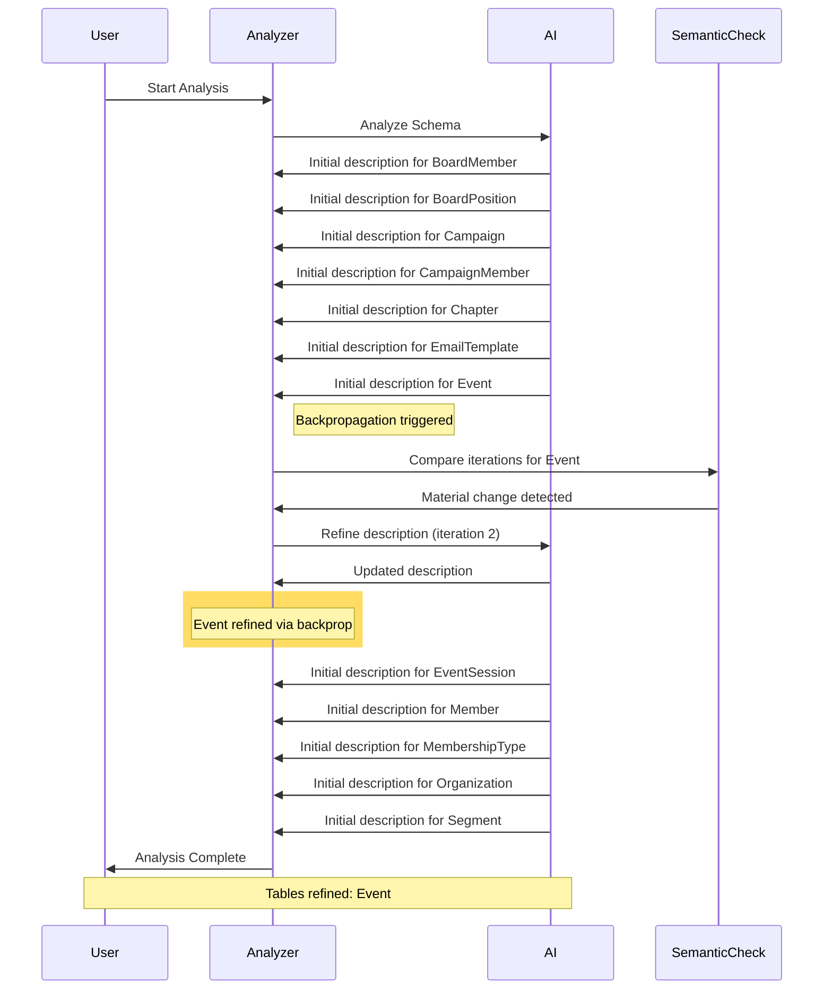

# Database Documentation: AssociationDB

**Server**: localhost
**Generated**: 2025-11-08T22:37:29.762Z
**Total Iterations**: 50

## Analysis Summary

- **Status**: converged
- **Iterations**: 50
- **Tokens Used**: 50,954
- **Estimated Cost**: $0.00
- **AI Model**: openai/gpt-oss-120b
- **AI Vendor**: GroqLLM
- **Temperature**: 0.1
- **Convergence**: Reached maximum iteration limit (50)

## Table of Contents

### [AssociationDemo](#schema-associationdemo) (26 tables)
- [BoardMember](#boardmember)
- [BoardPosition](#boardposition)
- [Campaign](#campaign)
- [CampaignMember](#campaignmember)
- [Certificate](#certificate)
- [Chapter](#chapter)
- [ChapterMembership](#chaptermembership)
- [ChapterOfficer](#chapterofficer)
- [Committee](#committee)
- [CommitteeMembership](#committeemembership)
- [Course](#course)
- [EmailClick](#emailclick)
- [EmailSend](#emailsend)
- [EmailTemplate](#emailtemplate)
- [Enrollment](#enrollment)
- [Event](#event)
- [EventRegistration](#eventregistration)
- [EventSession](#eventsession)
- [Invoice](#invoice)
- [InvoiceLineItem](#invoicelineitem)
- [Member](#member)
- [Membership](#membership)
- [MembershipType](#membershiptype)
- [Organization](#organization)
- [Payment](#payment)
- [Segment](#segment)

## Schema: AssociationDemo

### Entity Relationship Diagram

```mermaid
erDiagram
    BoardMember {
        uniqueidentifier ID "PK,NOT_NULL"
        uniqueidentifier BoardPositionID "FK,NOT_NULL"
        uniqueidentifier MemberID "FK,NOT_NULL"
        date StartDate "NOT_NULL"
        date EndDate
        bit IsActive "NOT_NULL"
        date ElectionDate
    }
    BoardPosition {
        uniqueidentifier ID "PK,NOT_NULL"
        nvarchar PositionTitle "NOT_NULL"
        int PositionOrder "NOT_NULL"
        nvarchar Description
        int TermLengthYears
        bit IsOfficer "NOT_NULL"
        bit IsActive "NOT_NULL"
    }
    Campaign {
        uniqueidentifier ID "PK,NOT_NULL"
        nvarchar Name "NOT_NULL"
        nvarchar CampaignType "NOT_NULL"
        nvarchar Status "NOT_NULL"
        date StartDate
        date EndDate
        decimal Budget
        decimal ActualCost
        nvarchar TargetAudience
        nvarchar Goals
        nvarchar Description
    }
    CampaignMember {
        uniqueidentifier ID "PK,NOT_NULL"
        uniqueidentifier CampaignID "FK,NOT_NULL"
        uniqueidentifier MemberID "FK,NOT_NULL"
        uniqueidentifier SegmentID "FK"
        datetime AddedDate "NOT_NULL"
        nvarchar Status "NOT_NULL"
        datetime ResponseDate
        decimal ConversionValue
    }
    Certificate {
        uniqueidentifier ID "PK,NOT_NULL"
        uniqueidentifier EnrollmentID "FK,NOT_NULL"
        nvarchar CertificateNumber "NOT_NULL"
        date IssuedDate "NOT_NULL"
        date ExpirationDate
        nvarchar CertificatePDFURL
        nvarchar VerificationCode
    }
    Chapter {
        uniqueidentifier ID "PK,NOT_NULL"
        nvarchar Name "NOT_NULL"
        nvarchar ChapterType "NOT_NULL"
        nvarchar Region
        nvarchar City
        nvarchar State
        nvarchar Country
        date FoundedDate
        nvarchar Description
        nvarchar Website
        nvarchar Email
        bit IsActive "NOT_NULL"
        nvarchar MeetingFrequency
        int MemberCount
    }
    ChapterMembership {
        uniqueidentifier ID "PK,NOT_NULL"
        uniqueidentifier ChapterID "FK,NOT_NULL"
        uniqueidentifier MemberID "FK,NOT_NULL"
        date JoinDate "NOT_NULL"
        nvarchar Status "NOT_NULL"
        nvarchar Role
    }
    ChapterOfficer {
        uniqueidentifier ID "PK,NOT_NULL"
        uniqueidentifier ChapterID "FK,NOT_NULL"
        uniqueidentifier MemberID "FK,NOT_NULL"
        nvarchar Position "NOT_NULL"
        date StartDate "NOT_NULL"
        date EndDate
        bit IsActive "NOT_NULL"
    }
    Committee {
        uniqueidentifier ID "PK,NOT_NULL"
        nvarchar Name "NOT_NULL"
        nvarchar CommitteeType "NOT_NULL"
        nvarchar Purpose
        nvarchar MeetingFrequency
        bit IsActive "NOT_NULL"
        date FormedDate
        date DisbandedDate
        uniqueidentifier ChairMemberID "FK"
        int MaxMembers
    }
    CommitteeMembership {
        uniqueidentifier ID "PK,NOT_NULL"
        uniqueidentifier CommitteeID "FK,NOT_NULL"
        uniqueidentifier MemberID "FK,NOT_NULL"
        nvarchar Role "NOT_NULL"
        date StartDate "NOT_NULL"
        date EndDate
        bit IsActive "NOT_NULL"
        nvarchar AppointedBy
    }
    Course {
        uniqueidentifier ID "PK,NOT_NULL"
        nvarchar Code "NOT_NULL"
        nvarchar Title "NOT_NULL"
        nvarchar Description
        nvarchar Category
        nvarchar Level "NOT_NULL"
        decimal DurationHours
        decimal CEUCredits
        decimal Price
        decimal MemberPrice
        bit IsActive "NOT_NULL"
        date PublishedDate
        nvarchar InstructorName
        uniqueidentifier PrerequisiteCourseID "FK"
        nvarchar ThumbnailURL
        nvarchar LearningObjectives
    }
    EmailClick {
        uniqueidentifier ID "PK,NOT_NULL"
        uniqueidentifier EmailSendID "FK,NOT_NULL"
        datetime ClickDate "NOT_NULL"
        nvarchar URL "NOT_NULL"
        nvarchar LinkName
        nvarchar IPAddress
        nvarchar UserAgent
    }
    EmailSend {
        uniqueidentifier ID "PK,NOT_NULL"
        uniqueidentifier TemplateID "FK"
        uniqueidentifier CampaignID "FK"
        uniqueidentifier MemberID "FK,NOT_NULL"
        nvarchar Subject
        datetime SentDate "NOT_NULL"
        datetime DeliveredDate
        datetime OpenedDate
        int OpenCount
        datetime ClickedDate
        int ClickCount
        datetime BouncedDate
        nvarchar BounceType
        nvarchar BounceReason
        datetime UnsubscribedDate
        datetime SpamReportedDate
        nvarchar Status "NOT_NULL"
        nvarchar ExternalMessageID
    }
    EmailTemplate {
        uniqueidentifier ID "PK,NOT_NULL"
        nvarchar Name "NOT_NULL"
        nvarchar Subject
        nvarchar FromName
        nvarchar FromEmail
        nvarchar ReplyToEmail
        nvarchar HtmlBody
        nvarchar TextBody
        nvarchar Category
        bit IsActive "NOT_NULL"
        nvarchar PreviewText
        nvarchar Tags
    }
    Enrollment {
        uniqueidentifier ID "PK,NOT_NULL"
        uniqueidentifier CourseID "FK,NOT_NULL"
        uniqueidentifier MemberID "FK,NOT_NULL"
        datetime EnrollmentDate "NOT_NULL"
        datetime StartDate
        datetime CompletionDate
        datetime ExpirationDate
        nvarchar Status "NOT_NULL"
        int ProgressPercentage
        datetime LastAccessedDate
        int TimeSpentMinutes
        decimal FinalScore
        decimal PassingScore
        bit Passed
        uniqueidentifier InvoiceID
    }
    Event {
        uniqueidentifier ID "PK,NOT_NULL"
        nvarchar Name "NOT_NULL"
        nvarchar EventType "NOT_NULL"
        datetime StartDate "NOT_NULL"
        datetime EndDate "NOT_NULL"
        nvarchar Timezone
        nvarchar Location
        bit IsVirtual "NOT_NULL"
        nvarchar VirtualPlatform
        nvarchar MeetingURL
        uniqueidentifier ChapterID
        int Capacity
        datetime RegistrationOpenDate
        datetime RegistrationCloseDate
        decimal RegistrationFee
        decimal MemberPrice
        decimal NonMemberPrice
        decimal CEUCredits
        nvarchar Description
        nvarchar Status "NOT_NULL"
    }
    EventRegistration {
        uniqueidentifier ID "PK,NOT_NULL"
        uniqueidentifier EventID "FK,NOT_NULL"
        uniqueidentifier MemberID "FK,NOT_NULL"
        datetime RegistrationDate "NOT_NULL"
        nvarchar RegistrationType
        nvarchar Status "NOT_NULL"
        datetime CheckInTime
        uniqueidentifier InvoiceID
        bit CEUAwarded "NOT_NULL"
        datetime CEUAwardedDate
        datetime CancellationDate
        nvarchar CancellationReason
    }
    EventSession {
        uniqueidentifier ID "PK,NOT_NULL"
        uniqueidentifier EventID "FK,NOT_NULL"
        nvarchar Name "NOT_NULL"
        nvarchar Description
        datetime StartTime "NOT_NULL"
        datetime EndTime "NOT_NULL"
        nvarchar Room
        nvarchar SpeakerName
        nvarchar SessionType
        int Capacity
        decimal CEUCredits
    }
    Invoice {
        uniqueidentifier ID "PK,NOT_NULL"
        nvarchar InvoiceNumber "NOT_NULL"
        uniqueidentifier MemberID "FK,NOT_NULL"
        date InvoiceDate "NOT_NULL"
        date DueDate "NOT_NULL"
        decimal SubTotal "NOT_NULL"
        decimal Tax
        decimal Discount
        decimal Total "NOT_NULL"
        decimal AmountPaid
        decimal Balance "NOT_NULL"
        nvarchar Status "NOT_NULL"
        nvarchar Notes
        nvarchar PaymentTerms
    }
    InvoiceLineItem {
        uniqueidentifier ID "PK,NOT_NULL"
        uniqueidentifier InvoiceID "FK,NOT_NULL"
        nvarchar Description "NOT_NULL"
        nvarchar ItemType "NOT_NULL"
        int Quantity
        decimal UnitPrice "NOT_NULL"
        decimal Amount "NOT_NULL"
        decimal TaxAmount
        nvarchar RelatedEntityType
        uniqueidentifier RelatedEntityID
    }
    Member {
        uniqueidentifier ID "PK,NOT_NULL"
        nvarchar Email "NOT_NULL"
        nvarchar FirstName "NOT_NULL"
        nvarchar LastName "NOT_NULL"
        nvarchar Title
        uniqueidentifier OrganizationID "FK"
        nvarchar Industry
        nvarchar JobFunction
        int YearsInProfession
        date JoinDate "NOT_NULL"
        nvarchar LinkedInURL
        nvarchar Bio
        nvarchar PreferredLanguage
        nvarchar Timezone
        nvarchar Phone
        nvarchar Mobile
        nvarchar City
        nvarchar State
        nvarchar Country
        nvarchar PostalCode
        int EngagementScore
        datetime LastActivityDate
        nvarchar ProfilePhotoURL
    }
    Membership {
        uniqueidentifier ID "PK,NOT_NULL"
        uniqueidentifier MemberID "FK,NOT_NULL"
        uniqueidentifier MembershipTypeID "FK,NOT_NULL"
        nvarchar Status "NOT_NULL"
        date StartDate "NOT_NULL"
        date EndDate "NOT_NULL"
        date RenewalDate
        bit AutoRenew "NOT_NULL"
        date CancellationDate
        nvarchar CancellationReason
    }
    MembershipType {
        uniqueidentifier ID "PK,NOT_NULL"
        nvarchar Name "NOT_NULL"
        nvarchar Description
        decimal AnnualDues "NOT_NULL"
        int RenewalPeriodMonths "NOT_NULL"
        bit IsActive "NOT_NULL"
        bit AllowAutoRenew "NOT_NULL"
        bit RequiresApproval "NOT_NULL"
        nvarchar Benefits
        int DisplayOrder
    }
    Organization {
        uniqueidentifier ID "PK,NOT_NULL"
        nvarchar Name "NOT_NULL"
        nvarchar Industry
        int EmployeeCount
        decimal AnnualRevenue
        decimal MarketCapitalization
        nvarchar TickerSymbol
        nvarchar Exchange
        nvarchar Website
        nvarchar Description
        int YearFounded
        nvarchar City
        nvarchar State
        nvarchar Country
        nvarchar PostalCode
        nvarchar Phone
        nvarchar LogoURL
    }
    Payment {
        uniqueidentifier ID "PK,NOT_NULL"
        uniqueidentifier InvoiceID "FK,NOT_NULL"
        datetime PaymentDate "NOT_NULL"
        decimal Amount "NOT_NULL"
        nvarchar PaymentMethod "NOT_NULL"
        nvarchar TransactionID
        nvarchar Status "NOT_NULL"
        datetime ProcessedDate
        nvarchar FailureReason
        nvarchar Notes
    }
    Segment {
        uniqueidentifier ID "PK,NOT_NULL"
        nvarchar Name "NOT_NULL"
        nvarchar Description
        nvarchar SegmentType
        nvarchar FilterCriteria
        int MemberCount
        datetime LastCalculatedDate
        bit IsActive "NOT_NULL"
    }

    Member ||--o{ BoardMember : "has"
    BoardPosition ||--o{ BoardMember : "has"
    Campaign ||--o{ CampaignMember : "has"
    Segment ||--o{ CampaignMember : "has"
    Member ||--o{ CampaignMember : "has"
    Enrollment ||--o{ Certificate : "has"
    Chapter ||--o{ ChapterMembership : "has"
    Member ||--o{ ChapterMembership : "has"
    Chapter ||--o{ ChapterOfficer : "has"
    Member ||--o{ ChapterOfficer : "has"
    Member ||--o{ Committee : "has"
    Committee ||--o{ CommitteeMembership : "has"
    Member ||--o{ CommitteeMembership : "has"
    Course ||--o{ Course : "has"
    EmailSend ||--o{ EmailClick : "has"
    Campaign ||--o{ EmailSend : "has"
    EmailTemplate ||--o{ EmailSend : "has"
    Member ||--o{ EmailSend : "has"
    Member ||--o{ Enrollment : "has"
    Course ||--o{ Enrollment : "has"
    Member ||--o{ EventRegistration : "has"
    Event ||--o{ EventRegistration : "has"
    Event ||--o{ EventSession : "has"
    Member ||--o{ Invoice : "has"
    Invoice ||--o{ InvoiceLineItem : "has"
    Organization ||--o{ Member : "has"
    MembershipType ||--o{ Membership : "has"
    Member ||--o{ Membership : "has"
    Invoice ||--o{ Payment : "has"
```

### Tables

#### BoardMember

Stores the assignment of association members to specific board positions, including term start/end dates, election date and active status, enabling tracking of board composition over time.

**Row Count**: 27
**Dependency Level**: 2

**Confidence**: 96%

**Depends On**:
- [AssociationDemo.Member](#member) (via MemberID)
- [AssociationDemo.BoardPosition](#boardposition) (via BoardPositionID)

**Columns**:

| Column | Type | Description |
|--------|------|-------------|
| ID | uniqueidentifier (PK, NOT NULL) | Surrogate primary key uniquely identifying each board‑member assignment record |
| BoardPositionID | uniqueidentifier (FK, NOT NULL) |  |
| MemberID | uniqueidentifier (FK, NOT NULL) |  |
| StartDate | date (NOT NULL) |  |
| EndDate | date |  |
| IsActive | bit (NOT NULL) |  |
| ElectionDate | date |  |

#### BoardPosition

Stores the definition of board positions within an organization, including title, display order, term length, officer status, and active flag. Used as a lookup for assigning members to specific board roles.

**Row Count**: 9
**Dependency Level**: 0

**Confidence**: 96%

**Referenced By**:
- [AssociationDemo.BoardMember](#boardmember)

**Columns**:

| Column | Type | Description |
|--------|------|-------------|
| ID | uniqueidentifier (PK, NOT NULL) | Primary key GUID uniquely identifying each board position record. |
| PositionTitle | nvarchar (NOT NULL) | Human‑readable name of the board position (e.g., President, Director at Large #3). |
| PositionOrder | int (NOT NULL) | Numeric order used to sort or rank positions for display or hierarchy. |
| Description | nvarchar | Optional free‑text description of the position; currently unused. |
| TermLengthYears | int | Length of the elected term for the position, expressed in years (2 or 3). |
| IsOfficer | bit (NOT NULL) | Flag indicating whether the position is an officer (executive) role. |
| IsActive | bit (NOT NULL) | Indicates if the position is currently active in the organization; all rows are true. |

#### Campaign

Stores definitions of marketing campaigns, including their identifiers, names, type, status, schedule, budget, and descriptive details. It serves as the central reference for campaign execution and tracking within the system.

**Row Count**: 5
**Dependency Level**: 0

**Confidence**: 96%

**Referenced By**:
- [AssociationDemo.CampaignMember](#campaignmember)
- [AssociationDemo.EmailSend](#emailsend)

**Columns**:

| Column | Type | Description |
|--------|------|-------------|
| ID | uniqueidentifier (PK, NOT NULL) | Unique identifier for each campaign record |
| Name | nvarchar (NOT NULL) | Human‑readable title of the campaign |
| CampaignType | nvarchar (NOT NULL) | Category of the campaign (e.g., Member Engagement, Membership Renewal, Event Promotion, Course Launch) |
| Status | nvarchar (NOT NULL) | Current lifecycle state of the campaign (e.g., Completed, Active) |
| StartDate | date | Date when the campaign is scheduled to begin |
| EndDate | date | Date when the campaign is scheduled to end |
| Budget | decimal | Planned monetary allocation for the campaign |
| ActualCost | decimal | Actual expenditure incurred; currently null for all rows |
| TargetAudience | nvarchar | Intended audience segment for the campaign; currently null |
| Goals | nvarchar | Specific objectives the campaign aims to achieve; currently null |
| Description | nvarchar | Detailed narrative of the campaign purpose and content |

#### CampaignMember

Stores a record for each member's interaction with a marketing campaign (optionally within a specific segment), tracking when the member was added to the campaign, current status, response date and any monetary conversion value.

**Row Count**: 0
**Dependency Level**: 2

**Confidence**: 93%

**Depends On**:
- [AssociationDemo.Campaign](#campaign) (via CampaignID)
- [AssociationDemo.Segment](#segment) (via SegmentID)
- [AssociationDemo.Member](#member) (via MemberID)

**Columns**:

| Column | Type | Description |
|--------|------|-------------|
| ID | uniqueidentifier (PK, NOT NULL) | Primary key for the interaction record, uniquely identifies each row. |
| CampaignID | uniqueidentifier (FK, NOT NULL) | Identifier of the campaign to which the member is linked. |
| MemberID | uniqueidentifier (FK, NOT NULL) | Identifier of the member participating in the campaign. |
| SegmentID | uniqueidentifier (FK) | Optional identifier of the segment used for targeting this member within the campaign. |
| AddedDate | datetime (NOT NULL) | Timestamp when the member was added to the campaign (or segment). |
| Status | nvarchar (NOT NULL) | Current state of the member in the campaign lifecycle (Targeted, Sent, Responded, Converted, Opted Out). |
| ResponseDate | datetime | Date the member responded to the campaign (e.g., opened, clicked, or replied). |
| ConversionValue | decimal | Monetary value attributed to the member's conversion (e.g., purchase amount). |

#### Certificate

**Row Count**: 326
**Dependency Level**: 4

**Depends On**:
- [AssociationDemo.Enrollment](#enrollment) (via EnrollmentID)

**Columns**:

| Column | Type | Description |
|--------|------|-------------|
| ID | uniqueidentifier (PK, NOT NULL) |  |
| EnrollmentID | uniqueidentifier (FK, NOT NULL) |  |
| CertificateNumber | nvarchar (NOT NULL) |  |
| IssuedDate | date (NOT NULL) |  |
| ExpirationDate | date |  |
| CertificatePDFURL | nvarchar |  |
| VerificationCode | nvarchar |  |

#### Chapter

Stores information about the various chapters of a professional association, including their identifiers, names, type (geographic or special interest), location details, founding dates, descriptions, activity status, meeting frequency, and member count.

**Row Count**: 15
**Dependency Level**: 0

**Confidence**: 96%

**Referenced By**:
- [AssociationDemo.ChapterMembership](#chaptermembership)
- [AssociationDemo.ChapterOfficer](#chapterofficer)

**Columns**:

| Column | Type | Description |
|--------|------|-------------|
| ID | uniqueidentifier (PK, NOT NULL) | Unique identifier for each chapter, generated sequentially. |
| Name | nvarchar (NOT NULL) | Human‑readable name of the chapter (e.g., "Toronto Chapter"). |
| ChapterType | nvarchar (NOT NULL) | Classifies the chapter as either Geographic or Special Interest. |
| Region | nvarchar | Broad geographic region where the chapter operates (e.g., "West Coast", "Canada"). |
| City | nvarchar | Specific city of the chapter when applicable. |
| State | nvarchar | State or province abbreviation for the chapter's location. |
| Country | nvarchar | Country of the chapter, defaulting to United States. |
| FoundedDate | date | Date the chapter was established. |
| Description | nvarchar | Brief narrative describing the chapter's focus or community. |
| Website | nvarchar | URL for the chapter's website (currently missing). |
| Email | nvarchar | Contact email address for the chapter (currently missing). |
| IsActive | bit (NOT NULL) | Flag indicating whether the chapter is currently active. |
| MeetingFrequency | nvarchar | How often the chapter meets (Monthly or Quarterly). |
| MemberCount | int | Number of members in the chapter (currently unknown). |

#### ChapterMembership

**Row Count**: 613
**Dependency Level**: 2

**Depends On**:
- [AssociationDemo.Chapter](#chapter) (via ChapterID)
- [AssociationDemo.Member](#member) (via MemberID)

**Columns**:

| Column | Type | Description |
|--------|------|-------------|
| ID | uniqueidentifier (PK, NOT NULL) |  |
| ChapterID | uniqueidentifier (FK, NOT NULL) |  |
| MemberID | uniqueidentifier (FK, NOT NULL) |  |
| JoinDate | date (NOT NULL) |  |
| Status | nvarchar (NOT NULL) |  |
| Role | nvarchar |  |

#### ChapterOfficer

**Row Count**: 45
**Dependency Level**: 2

**Depends On**:
- [AssociationDemo.Chapter](#chapter) (via ChapterID)
- [AssociationDemo.Member](#member) (via MemberID)

**Columns**:

| Column | Type | Description |
|--------|------|-------------|
| ID | uniqueidentifier (PK, NOT NULL) |  |
| ChapterID | uniqueidentifier (FK, NOT NULL) |  |
| MemberID | uniqueidentifier (FK, NOT NULL) |  |
| Position | nvarchar (NOT NULL) |  |
| StartDate | date (NOT NULL) |  |
| EndDate | date |  |
| IsActive | bit (NOT NULL) |  |

#### Committee

**Row Count**: 12
**Dependency Level**: 2

**Depends On**:
- [AssociationDemo.Member](#member) (via ChairMemberID)

**Referenced By**:
- [AssociationDemo.CommitteeMembership](#committeemembership)

**Columns**:

| Column | Type | Description |
|--------|------|-------------|
| ID | uniqueidentifier (PK, NOT NULL) |  |
| Name | nvarchar (NOT NULL) |  |
| CommitteeType | nvarchar (NOT NULL) |  |
| Purpose | nvarchar |  |
| MeetingFrequency | nvarchar |  |
| IsActive | bit (NOT NULL) |  |
| FormedDate | date |  |
| DisbandedDate | date |  |
| ChairMemberID | uniqueidentifier (FK) |  |
| MaxMembers | int |  |

#### CommitteeMembership

**Row Count**: 96
**Dependency Level**: 3

**Depends On**:
- [AssociationDemo.Committee](#committee) (via CommitteeID)
- [AssociationDemo.Member](#member) (via MemberID)

**Columns**:

| Column | Type | Description |
|--------|------|-------------|
| ID | uniqueidentifier (PK, NOT NULL) |  |
| CommitteeID | uniqueidentifier (FK, NOT NULL) |  |
| MemberID | uniqueidentifier (FK, NOT NULL) |  |
| Role | nvarchar (NOT NULL) |  |
| StartDate | date (NOT NULL) |  |
| EndDate | date |  |
| IsActive | bit (NOT NULL) |  |
| AppointedBy | nvarchar |  |

#### Course

**Row Count**: 60
**Dependency Level**: 4

**Depends On**:
- [AssociationDemo.Course](#course) (via PrerequisiteCourseID)

**Referenced By**:
- [AssociationDemo.Course](#course)
- [AssociationDemo.Enrollment](#enrollment)

**Columns**:

| Column | Type | Description |
|--------|------|-------------|
| ID | uniqueidentifier (PK, NOT NULL) |  |
| Code | nvarchar (NOT NULL) |  |
| Title | nvarchar (NOT NULL) |  |
| Description | nvarchar |  |
| Category | nvarchar |  |
| Level | nvarchar (NOT NULL) |  |
| DurationHours | decimal |  |
| CEUCredits | decimal |  |
| Price | decimal |  |
| MemberPrice | decimal |  |
| IsActive | bit (NOT NULL) |  |
| PublishedDate | date |  |
| InstructorName | nvarchar |  |
| PrerequisiteCourseID | uniqueidentifier (FK) |  |
| ThumbnailURL | nvarchar |  |
| LearningObjectives | nvarchar |  |

#### EmailClick

**Row Count**: 1
**Dependency Level**: 3

**Depends On**:
- [AssociationDemo.EmailSend](#emailsend) (via EmailSendID)

**Columns**:

| Column | Type | Description |
|--------|------|-------------|
| ID | uniqueidentifier (PK, NOT NULL) |  |
| EmailSendID | uniqueidentifier (FK, NOT NULL) |  |
| ClickDate | datetime (NOT NULL) |  |
| URL | nvarchar (NOT NULL) |  |
| LinkName | nvarchar |  |
| IPAddress | nvarchar |  |
| UserAgent | nvarchar |  |

#### EmailSend

**Row Count**: 1400
**Dependency Level**: 2

**Depends On**:
- [AssociationDemo.Campaign](#campaign) (via CampaignID)
- [AssociationDemo.EmailTemplate](#emailtemplate) (via TemplateID)
- [AssociationDemo.Member](#member) (via MemberID)

**Referenced By**:
- [AssociationDemo.EmailClick](#emailclick)

**Columns**:

| Column | Type | Description |
|--------|------|-------------|
| ID | uniqueidentifier (PK, NOT NULL) |  |
| TemplateID | uniqueidentifier (FK) |  |
| CampaignID | uniqueidentifier (FK) |  |
| MemberID | uniqueidentifier (FK, NOT NULL) |  |
| Subject | nvarchar |  |
| SentDate | datetime (NOT NULL) |  |
| DeliveredDate | datetime |  |
| OpenedDate | datetime |  |
| OpenCount | int |  |
| ClickedDate | datetime |  |
| ClickCount | int |  |
| BouncedDate | datetime |  |
| BounceType | nvarchar |  |
| BounceReason | nvarchar |  |
| UnsubscribedDate | datetime |  |
| SpamReportedDate | datetime |  |
| Status | nvarchar (NOT NULL) |  |
| ExternalMessageID | nvarchar |  |

#### EmailTemplate

Stores predefined email templates used by the association for various communications (welcome, renewal reminders, newsletters, event invitations). Each record defines the template's identity, content metadata, sender details, category, and activation status, enabling consistent email generation across the system.

**Row Count**: 5
**Dependency Level**: 0

**Confidence**: 96%

**Referenced By**:
- [AssociationDemo.EmailSend](#emailsend)

**Columns**:

| Column | Type | Description |
|--------|------|-------------|
| ID | uniqueidentifier (PK, NOT NULL) | Unique identifier for each email template (primary key). |
| Name | nvarchar (NOT NULL) | Human‑readable name of the template, used to select a template in the UI or code. |
| Subject | nvarchar | Default subject line for the email when this template is used. |
| FromName | nvarchar | Display name shown as the sender of the email. |
| FromEmail | nvarchar | Email address used as the sender address for the template. |
| ReplyToEmail | nvarchar | Optional reply‑to address; currently null for all templates. |
| HtmlBody | nvarchar | HTML version of the email body; currently empty/null, possibly stored elsewhere or to be filled later. |
| TextBody | nvarchar | Plain‑text version of the email body; also null for now. |
| Category | nvarchar | Enum indicating the type of communication (Renewal, Welcome, Newsletter, Event). |
| IsActive | bit (NOT NULL) | Flag indicating whether the template is active and can be used for sending. |
| PreviewText | nvarchar | Short preview snippet shown in email clients before opening the message. |
| Tags | nvarchar | Optional tagging field for additional classification; currently unused (null). |

#### Enrollment

**Row Count**: 900
**Dependency Level**: 4

**Depends On**:
- [AssociationDemo.Member](#member) (via MemberID)
- [AssociationDemo.Course](#course) (via CourseID)

**Referenced By**:
- [AssociationDemo.Certificate](#certificate)

**Columns**:

| Column | Type | Description |
|--------|------|-------------|
| ID | uniqueidentifier (PK, NOT NULL) |  |
| CourseID | uniqueidentifier (FK, NOT NULL) |  |
| MemberID | uniqueidentifier (FK, NOT NULL) |  |
| EnrollmentDate | datetime (NOT NULL) |  |
| StartDate | datetime |  |
| CompletionDate | datetime |  |
| ExpirationDate | datetime |  |
| Status | nvarchar (NOT NULL) |  |
| ProgressPercentage | int |  |
| LastAccessedDate | datetime |  |
| TimeSpentMinutes | int |  |
| FinalScore | decimal |  |
| PassingScore | decimal |  |
| Passed | bit |  |
| InvoiceID | uniqueidentifier |  |

#### Event

Represents industry events (conferences, webinars, workshops, etc.) related to cheese production and business, storing overall event details such as type, dates, location, virtual access, registration windows, pricing, CEU credits, and status, while also serving as the parent entity for multiple EventSession records that define the event’s agenda—each session includes its own speaker, room, start/end times, capacity, and CEU allocation.

**Row Count**: 21
**Dependency Level**: 0

**Confidence**: 97%

**Referenced By**:
- [AssociationDemo.EventRegistration](#eventregistration)
- [AssociationDemo.EventSession](#eventsession)

**Columns**:

| Column | Type | Description |
|--------|------|-------------|
| ID | uniqueidentifier (PK, NOT NULL) | Unique identifier for each event record. |
| Name | nvarchar (NOT NULL) | Descriptive title of the event. |
| EventType | nvarchar (NOT NULL) | Category of the event (Conference, Webinar, Workshop). |
| StartDate | datetime (NOT NULL) | Date and time when the event begins. |
| EndDate | datetime (NOT NULL) | Date and time when the event ends. |
| Timezone | nvarchar | IANA timezone identifier for the event's scheduled times. |
| Location | nvarchar | Physical venue or indication that the event is virtual. |
| IsVirtual | bit (NOT NULL) | Flag indicating whether the event is held online. |
| VirtualPlatform | nvarchar | Online platform used for virtual events (Zoom or Teams). |
| MeetingURL | nvarchar | Link to join the virtual meeting. |
| ChapterID | uniqueidentifier | Identifier of the association chapter hosting the event (currently null for all rows). |
| Capacity | int | Maximum number of attendees allowed. |
| RegistrationOpenDate | datetime | Date when registration for the event opens. |
| RegistrationCloseDate | datetime | Date when registration for the event closes. |
| RegistrationFee | decimal | Overall fee required to register (currently null for all rows). |
| MemberPrice | decimal | Registration price for members of the association. |
| NonMemberPrice | decimal | Registration price for non‑members. |
| CEUCredits | decimal | Continuing Education Units awarded for attending the event. |
| Description | nvarchar | Full narrative describing the event content and objectives. |
| Status | nvarchar (NOT NULL) | Current lifecycle state of the event (Draft, Published, Registration Open, Completed, etc.). |

#### EventRegistration

**Row Count**: 5567
**Dependency Level**: 2

**Depends On**:
- [AssociationDemo.Member](#member) (via MemberID)
- [AssociationDemo.Event](#event) (via EventID)

**Columns**:

| Column | Type | Description |
|--------|------|-------------|
| ID | uniqueidentifier (PK, NOT NULL) |  |
| EventID | uniqueidentifier (FK, NOT NULL) |  |
| MemberID | uniqueidentifier (FK, NOT NULL) |  |
| RegistrationDate | datetime (NOT NULL) |  |
| RegistrationType | nvarchar |  |
| Status | nvarchar (NOT NULL) |  |
| CheckInTime | datetime |  |
| InvoiceID | uniqueidentifier |  |
| CEUAwarded | bit (NOT NULL) |  |
| CEUAwardedDate | datetime |  |
| CancellationDate | datetime |  |
| CancellationReason | nvarchar |  |

#### EventSession

Stores individual sessions or program items that belong to a larger event, capturing details such as title, description, schedule, location, speaker, type, capacity and CEU credits.

**Row Count**: 0
**Dependency Level**: 1

**Confidence**: 93%

**Depends On**:
- [AssociationDemo.Event](#event) (via EventID)

**Columns**:

| Column | Type | Description |
|--------|------|-------------|
| ID | uniqueidentifier (PK, NOT NULL) | Unique identifier for the session record. |
| EventID | uniqueidentifier (FK, NOT NULL) | Reference to the parent event to which the session belongs. |
| Name | nvarchar (NOT NULL) | Title or short name of the session. |
| Description | nvarchar | Longer textual description of the session content. |
| StartTime | datetime (NOT NULL) | Date and time when the session begins. |
| EndTime | datetime (NOT NULL) | Date and time when the session ends. |
| Room | nvarchar | Physical or virtual location where the session is held. |
| SpeakerName | nvarchar | Name of the person presenting or leading the session. |
| SessionType | nvarchar | Category of the session (e.g., workshop, lecture, panel). |
| Capacity | int | Maximum number of attendees allowed for the session. |
| CEUCredits | decimal | Continuing Education Units awarded for attending the session. |

#### Invoice

**Row Count**: 6364
**Dependency Level**: 2

**Depends On**:
- [AssociationDemo.Member](#member) (via MemberID)

**Referenced By**:
- [AssociationDemo.InvoiceLineItem](#invoicelineitem)
- [AssociationDemo.Payment](#payment)

**Columns**:

| Column | Type | Description |
|--------|------|-------------|
| ID | uniqueidentifier (PK, NOT NULL) |  |
| InvoiceNumber | nvarchar (NOT NULL) |  |
| MemberID | uniqueidentifier (FK, NOT NULL) |  |
| InvoiceDate | date (NOT NULL) |  |
| DueDate | date (NOT NULL) |  |
| SubTotal | decimal (NOT NULL) |  |
| Tax | decimal |  |
| Discount | decimal |  |
| Total | decimal (NOT NULL) |  |
| AmountPaid | decimal |  |
| Balance | decimal (NOT NULL) |  |
| Status | nvarchar (NOT NULL) |  |
| Notes | nvarchar |  |
| PaymentTerms | nvarchar |  |

#### InvoiceLineItem

**Row Count**: 5973
**Dependency Level**: 3

**Depends On**:
- [AssociationDemo.Invoice](#invoice) (via InvoiceID)

**Columns**:

| Column | Type | Description |
|--------|------|-------------|
| ID | uniqueidentifier (PK, NOT NULL) |  |
| InvoiceID | uniqueidentifier (FK, NOT NULL) |  |
| Description | nvarchar (NOT NULL) |  |
| ItemType | nvarchar (NOT NULL) |  |
| Quantity | int |  |
| UnitPrice | decimal (NOT NULL) |  |
| Amount | decimal (NOT NULL) |  |
| TaxAmount | decimal |  |
| RelatedEntityType | nvarchar |  |
| RelatedEntityID | uniqueidentifier |  |

#### Member

Stores individual member or contact records for an association, capturing personal, professional, and contact details and linking each person to their employer organization when applicable.

**Row Count**: 2000
**Dependency Level**: 1

**Confidence**: 92%

**Depends On**:
- [AssociationDemo.Organization](#organization) (via OrganizationID)

**Referenced By**:
- [AssociationDemo.BoardMember](#boardmember)
- [AssociationDemo.CampaignMember](#campaignmember)
- [AssociationDemo.ChapterMembership](#chaptermembership)
- [AssociationDemo.ChapterOfficer](#chapterofficer)
- [AssociationDemo.Committee](#committee)
- [AssociationDemo.CommitteeMembership](#committeemembership)
- [AssociationDemo.EmailSend](#emailsend)
- [AssociationDemo.Enrollment](#enrollment)
- [AssociationDemo.EventRegistration](#eventregistration)
- [AssociationDemo.Invoice](#invoice)
- [AssociationDemo.Membership](#membership)

**Columns**:

| Column | Type | Description |
|--------|------|-------------|
| ID | uniqueidentifier (PK, NOT NULL) | Primary key uniquely identifying each member record |
| Email | nvarchar (NOT NULL) | Member's email address, used as a unique contact identifier |
| FirstName | nvarchar (NOT NULL) | Member's given name |
| LastName | nvarchar (NOT NULL) | Member's family name |
| Title | nvarchar | Professional title or role of the member within their organization |
| OrganizationID | uniqueidentifier (FK) | Reference to the employer or affiliated organization |
| Industry | nvarchar | Industry sector of the member's organization or work focus |
| JobFunction | nvarchar | Broad functional area of the member's work (e.g., Leadership, Design) |
| YearsInProfession | int | Number of years the member has worked in their profession |
| JoinDate | date (NOT NULL) | Date the member joined the association or was added to the system |
| LinkedInURL | nvarchar | URL to the member's LinkedIn profile (optional) |
| Bio | nvarchar | Free‑form biography or description of the member (currently empty) |
| PreferredLanguage | nvarchar | Member's preferred language for communications |
| Timezone | nvarchar | Member's time zone (currently not populated) |
| Phone | nvarchar | Primary phone number for the member (optional) |
| Mobile | nvarchar | Mobile phone number (currently not populated) |
| City | nvarchar | City of the member's address or location |
| State | nvarchar | State, province, or region code of the member's location |
| Country | nvarchar | Country of the member, defaulting to United States |
| PostalCode | nvarchar | Postal or ZIP code (currently not populated) |
| EngagementScore | int | Numeric score representing member engagement (currently zero) |
| LastActivityDate | datetime | Timestamp of the member's most recent activity (currently null) |
| ProfilePhotoURL | nvarchar | Link to the member's profile picture (currently null) |

#### Membership

**Row Count**: 2137
**Dependency Level**: 2

**Depends On**:
- [AssociationDemo.MembershipType](#membershiptype) (via MembershipTypeID)
- [AssociationDemo.Member](#member) (via MemberID)

**Columns**:

| Column | Type | Description |
|--------|------|-------------|
| ID | uniqueidentifier (PK, NOT NULL) |  |
| MemberID | uniqueidentifier (FK, NOT NULL) |  |
| MembershipTypeID | uniqueidentifier (FK, NOT NULL) |  |
| Status | nvarchar (NOT NULL) |  |
| StartDate | date (NOT NULL) |  |
| EndDate | date (NOT NULL) |  |
| RenewalDate | date |  |
| AutoRenew | bit (NOT NULL) |  |
| CancellationDate | date |  |
| CancellationReason | nvarchar |  |

#### MembershipType

This table defines the various membership tiers offered by the organization, including their names, descriptions, fees, renewal terms, eligibility rules, benefits, and display ordering. It serves as a lookup for member records to classify each member’s subscription type.

**Row Count**: 8
**Dependency Level**: 0

**Confidence**: 96%

**Referenced By**:
- [AssociationDemo.Membership](#membership)

**Columns**:

| Column | Type | Description |
|--------|------|-------------|
| ID | uniqueidentifier (PK, NOT NULL) | Unique identifier (GUID) for the membership tier |
| Name | nvarchar (NOT NULL) | Short label of the membership tier (e.g., Student, Corporate) |
| Description | nvarchar | Longer textual explanation of what the tier entails |
| AnnualDues | decimal (NOT NULL) | Yearly fee charged for the tier (0 for free or lifetime) |
| RenewalPeriodMonths | int (NOT NULL) | Number of months the membership is valid before renewal (12 for annual, 1200 for lifetime) |
| IsActive | bit (NOT NULL) | Flag indicating whether the tier is currently offered |
| AllowAutoRenew | bit (NOT NULL) | Whether members of this tier can be automatically renewed |
| RequiresApproval | bit (NOT NULL) | Whether enrollment in this tier requires manual approval |
| Benefits | nvarchar | Detailed list of benefits provided to members of this tier |
| DisplayOrder | int | Numeric order used to present tiers in UI lists |

#### Organization

Stores detailed information about companies or organizations, including identifiers, names, industry classification, financial metrics, contact details, and location data. Serves as a master reference for entities that other tables (e.g., members, contacts) relate to.

**Row Count**: 200
**Dependency Level**: 0

**Confidence**: 93%

**Referenced By**:
- [AssociationDemo.Member](#member)

**Columns**:

| Column | Type | Description |
|--------|------|-------------|
| ID | uniqueidentifier (PK, NOT NULL) | Surrogate primary key uniquely identifying each company record. |
| Name | nvarchar (NOT NULL) | Legal or trade name of the company. |
| Industry | nvarchar | Broad sector or market segment the company operates in. |
| EmployeeCount | int | Number of employees working for the company. |
| AnnualRevenue | decimal | Total revenue generated by the company in a fiscal year. |
| MarketCapitalization | decimal | Total market value of the company's publicly traded shares. |
| TickerSymbol | nvarchar | Stock ticker symbol used on a securities exchange. |
| Exchange | nvarchar | Securities exchange where the company's stock is listed. |
| Website | nvarchar | Public-facing website URL of the company. |
| Description | nvarchar | Brief textual description of the company's products, services, or mission. |
| YearFounded | int | Calendar year the company was established. |
| City | nvarchar | City where the company's primary address is located. |
| State | nvarchar | State or province abbreviation for the company's address. |
| Country | nvarchar | Country of the company's headquarters. |
| PostalCode | nvarchar | Postal/ZIP code for the company's address (currently not populated). |
| Phone | nvarchar | Primary contact phone number for the company. |
| LogoURL | nvarchar | URL to the company's logo image (currently not populated). |

#### Payment

**Row Count**: 6327
**Dependency Level**: 3

**Depends On**:
- [AssociationDemo.Invoice](#invoice) (via InvoiceID)

**Columns**:

| Column | Type | Description |
|--------|------|-------------|
| ID | uniqueidentifier (PK, NOT NULL) |  |
| InvoiceID | uniqueidentifier (FK, NOT NULL) |  |
| PaymentDate | datetime (NOT NULL) |  |
| Amount | decimal (NOT NULL) |  |
| PaymentMethod | nvarchar (NOT NULL) |  |
| TransactionID | nvarchar |  |
| Status | nvarchar (NOT NULL) |  |
| ProcessedDate | datetime |  |
| FailureReason | nvarchar |  |
| Notes | nvarchar |  |

#### Segment

Stores definitions of member segments used for targeting and reporting within the association's membership system. Each row defines a named segment, its description, category, and metadata such as activity status and calculated member count.

**Row Count**: 10
**Dependency Level**: 0

**Confidence**: 96%

**Referenced By**:
- [AssociationDemo.CampaignMember](#campaignmember)

**Columns**:

| Column | Type | Description |
|--------|------|-------------|
| ID | uniqueidentifier (PK, NOT NULL) | Primary key GUID that uniquely identifies each segment definition. |
| Name | nvarchar (NOT NULL) | Human‑readable name of the segment (e.g., "West Coast Region"). |
| Description | nvarchar | Longer textual description explaining the criteria or purpose of the segment. |
| SegmentType | nvarchar | Category or taxonomy of the segment (e.g., Industry, Geography, Engagement). |
| FilterCriteria | nvarchar | Placeholder for a stored filter expression that defines the segment logic; currently null for all rows. |
| MemberCount | int | Number of members currently belonging to the segment; presently zero because counts have not been calculated. |
| LastCalculatedDate | datetime | Timestamp of the last time MemberCount was refreshed; null indicates no calculation performed yet. |
| IsActive | bit (NOT NULL) | Flag indicating whether the segment is active and can be used in campaigns; defaults to true. |

---

## Appendix: Iteration Analysis

This section documents the iterative refinement process used to generate the database documentation, highlighting corrections and improvements discovered through backpropagation.

### Summary

- **Total Tables with Refinements**: 1
- **Total Columns with Refinements**: 0
- **Total Refinement Iterations**: 1
- **Refinements Triggered by Backpropagation**: 1

### Tables Refined Through Iteration

#### [Event](#event)

**Iterations**: 2 | **Trigger**: backpropagation

**Iteration 1** (initial):

> Stores detailed information about industry events (conferences, webinars, workshops, etc.) related to cheese production and business, including scheduling, location, virtual access, registration windows, pricing, CEU credits, and current status.

*Reasoning*: Column names such as EventType, StartDate, EndDate, Location, IsVirtual, VirtualPlatform, MeetingURL, Capacity, RegistrationOpenDate, RegistrationCloseDate, MemberPrice, NonMemberPrice, CEUCredits and sample values (e.g., 'Conference', 'Webinar', specific cheese‑related event names, venue addresses, Zoom/Teams URLs) clearly indicate the table records events. The presence of a primary key ID, status enum, and relationships where EventRegistration and EventSession reference this table further support its role as the central Events entity.

---

**Iteration 2** (backpropagation):

> Represents industry events (conferences, webinars, workshops, etc.) related to cheese production and business, storing overall event details such as type, dates, location, virtual access, registration windows, pricing, CEU credits, and status, while also serving as the parent entity for multiple EventSession records that define the event’s agenda—each session includes its own speaker, room, start/end times, capacity, and CEU allocation.

*Reasoning*: The discovery of an EventSession table shows that an event is not a single occurrence but a collection of scheduled sessions with individual speakers, rooms, capacities and CEU credits. This hierarchical, agenda‑driven structure was not reflected in the original description, so the description was expanded to capture the parent‑child relationship and the detailed session attributes.

### Iteration Process Visualization

The following diagram illustrates the analysis workflow and highlights where corrections were made through backpropagation:

