```mermaid
erDiagram
    adj {
        int adj_id "FK,NOT_NULL"
        int prd_id
        int whs_id
        date adj_dt
        int qty
        char rsn
        nvarchar usr
        nvarchar notes
    }
    cat {
        int cat_id "NOT_NULL"
        int prnt_id
        nvarchar nm
        nvarchar dsc
        int lvl
        int seq
    }
    cnt {
        int cnt_id "NOT_NULL"
        int whs_id
        date cnt_dt
        int prd_id
        int exp_qty
        int act_qty
        int var
        nvarchar usr
    }
    po {
        int po_id "NOT_NULL"
        int sup_id "FK"
        date po_dt
        date exp_dt
        char sts
        decimal tot
        decimal ship_amt
        nvarchar notes
    }
    po_dtl {
        int po_id "NOT_NULL"
        int seq "NOT_NULL"
        int prd_id
        int qty
        decimal prc
        int rcv_qty
    }
    prd {
        int prd_id "PK,NOT_NULL"
        int cat_id
        int sup_id "FK"
        nvarchar sku
        nvarchar nm
        nvarchar dsc
        decimal prc
        decimal cost
        char sts
        decimal wgt
        char uom
    }
    rcv {
        int rcv_id "NOT_NULL"
        int po_id
        date rcv_dt
        int whs_id
        nvarchar notes
    }
    stk {
        int prd_id "NOT_NULL"
        int whs_id "NOT_NULL"
        int qty
        int rsv
        int min_qty
        int max_qty
        date lst_cnt
        date lst_rcv
    }
    sup {
        int sup_id "PK,NOT_NULL"
        nvarchar nm
        char sts
        char pmt_trm
        tinyint rtg
        nvarchar cnt_nm
        nvarchar cnt_phn
        nvarchar cnt_eml
    }
    whs {
        int whs_id "PK,NOT_NULL"
        char cd
        nvarchar nm
        nvarchar cty
        char st
        char typ
        int cap
        char sts
    }

```

# Database Documentation: LousyDB

**Server**: localhost
**Generated**: 2025-11-09T03:10:18.235Z
**Total Iterations**: 50

## Analysis Summary

- **Status**: converged
- **Iterations**: 50
- **Tokens Used**: 106,968
- **Estimated Cost**: $0.00
- **AI Model**: openai/gpt-oss-120b
- **AI Vendor**: GroqLLM
- **Temperature**: 0.1
- **Convergence**: Reached maximum iteration limit (50)

## Table of Contents

### [inv](#schema-inv) (10 tables)
- [adj](#adj)
- [cat](#cat)
- [cnt](#cnt)
- [po](#po)
- [po_dtl](#po-dtl)
- [prd](#prd)
- [rcv](#rcv)
- [stk](#stk)
- [sup](#sup)
- [whs](#whs)

### [sales](#schema-sales) (10 tables)
- [addr](#addr)
- [cst](#cst)
- [cst_note](#cst-note)
- [eml](#eml)
- [oli](#oli)
- [ord](#ord)
- [phn](#phn)
- [pmt](#pmt)
- [rtn](#rtn)
- [shp](#shp)

## Schema: inv

### Entity Relationship Diagram

### Tables

#### adj

This table records individual inventory adjustments. Each row captures a change in quantity for a specific product at a particular warehouse, the date of the adjustment, the reason (stock‑take, expiration, damage, correction), the user who performed it, and optional notes.

**Row Count**: 300
**Dependency Level**: 0

**Confidence**: 96%

**Columns**:

| Column | Type | Description |
|--------|------|-------------|
| adj_id | int (FK, NOT NULL) | Primary key for the adjustment record; uniquely identifies each inventory change event. |
| prd_id | int | Identifier of the product whose inventory is being adjusted; likely references a product catalog table. |
| whs_id | int | Identifier of the warehouse/location where the adjustment took place; likely references a warehouse table. |
| adj_dt | date | Date (and time) when the adjustment was recorded. |
| qty | int | Quantity change; positive values add stock, negative values remove stock. |
| rsn | char | Reason code for the adjustment: STL (stock‑take), EXP (expired), DAM (damaged), COR (correction). |
| usr | nvarchar | Name of the user/employee who performed the adjustment. |
| notes | nvarchar | Free‑text comment describing the adjustment; often repeats standard messages about expiration, damage, shrinkage, or count correction. |

#### cat

A hierarchical lookup table that defines office‑related product categories and sub‑categories. Each row represents a distinct category (cat_id) with its name, description, level in the hierarchy, optional parent category (prnt_id), and a sequence order for display.

**Row Count**: 20
**Dependency Level**: 0

**Confidence**: 92%

**Columns**:

| Column | Type | Description |
|--------|------|-------------|
| cat_id | int (NOT NULL) | Unique identifier for each category record |
| prnt_id | int | Identifier of the parent category (self‑reference to cat_id) establishing hierarchy |
| nm | nvarchar | Short name of the category (e.g., "Writing", "Printers") |
| dsc | nvarchar | Longer description of the category providing more detail |
| lvl | int | Hierarchy level of the category (1 = top level, 2 = sub‑category) |
| seq | int | Display order of the category within its parent group |

#### cnt

This table stores inventory count records for products in warehouses. Each row captures a single count event identified by cnt_id, the warehouse (whs_id) where the count took place, the date of the count (cnt_dt), the product counted (prd_id), the system‑expected quantity (exp_qty), the physically counted quantity (act_qty), the variance between expected and actual (var) and the user who performed the count (usr). It is used to reconcile stock levels, detect shrinkage, and support inventory audit processes.

**Row Count**: 250
**Dependency Level**: 0

**Confidence**: 96%

**Columns**:

| Column | Type | Description |
|--------|------|-------------|
| cnt_id | int (NOT NULL) | Surrogate primary key for each inventory count record |
| whs_id | int | Identifier of the warehouse where the count was performed |
| cnt_dt | date | Date on which the inventory count was taken |
| prd_id | int | Identifier of the product being counted |
| exp_qty | int | System‑calculated expected quantity for the product in that warehouse on that date |
| act_qty | int | Physical quantity actually counted by the user |
| var | int | Variance between expected and actual quantities (exp_qty‑act_qty) expressed as a small integer offset |
| usr | nvarchar | Name of the employee who performed the count |

#### po

Stores purchase order header records linking each order (po_id) to a supplier (sup_id) with order date, expected delivery date, status, total amount, shipping charge and optional expedited shipping note.

**Row Count**: 150
**Dependency Level**: 0

**Confidence**: 96%

**Columns**:

| Column | Type | Description |
|--------|------|-------------|
| po_id | int (NOT NULL) | Unique identifier for each purchase order. |
| sup_id | int (FK) | Identifier of the supplier for the purchase order. |
| po_dt | date | Date the purchase order was created. |
| exp_dt | date | Expected delivery or expiration date for the order. |
| sts | char | Current status of the purchase order (e.g., Pending, Approved, Shipped, Received, Cancelled). |
| tot | decimal | Total monetary amount of the purchase order. |
| ship_amt | decimal | Flat shipping charge applied to the order (150 when expedited, 0 otherwise). |
| notes | nvarchar | Optional free‑text note, currently used only for "Expedited shipping requested". |

#### po_dtl

Stores the line‑item details of purchase orders, linking each order (po_id) to a product (prd_id) with the ordered quantity, unit price and the quantity actually received.

**Row Count**: 750
**Dependency Level**: 0

**Confidence**: 93%

**Columns**:

| Column | Type | Description |
|--------|------|-------------|
| po_id | int (NOT NULL) | Identifier of the purchase order to which the line belongs. |
| seq | int (NOT NULL) | Sequence number of the line item within the purchase order (1‑7). |
| prd_id | int | Identifier of the product being ordered. |
| qty | int | Quantity ordered for the product on this line. |
| prc | decimal | Unit price of the product at the time of ordering. |
| rcv_qty | int | Quantity of the product that has been received against the order line. |

#### prd

This table is a product master catalog that stores detailed information about each sellable item, including its unique identifier, category, supplier, SKU, name, description, pricing, cost, status, weight and unit of measure.

**Row Count**: 177
**Dependency Level**: 0

**Confidence**: 96%

**Columns**:

| Column | Type | Description |
|--------|------|-------------|
| prd_id | int (PK, NOT NULL) | Primary key that uniquely identifies each product record |
| cat_id | int | Identifier of the product's category (e.g., electronics, office supplies) |
| sup_id | int (FK) | Identifier of the supplier that provides the product |
| sku | nvarchar | Stock Keeping Unit code used for inventory tracking |
| nm | nvarchar | Human‑readable product name |
| dsc | nvarchar | Short textual description of the product's features |
| prc | decimal | Retail selling price of the product |
| cost | decimal | Internal cost or purchase price of the product |
| sts | char | Current status of the product (A=Active, O=Out of stock, D=Discontinued) |
| wgt | decimal | Weight of the product in its base unit |
| uom | char | Unit of measure for inventory (EA=Each, BX=Box, CS=Case) |

#### rcv

This table records individual receipt events of purchase orders at specific warehouses, capturing when (rcv_dt) each receipt occurred, which purchase order (po_id) it relates to, the unique receipt identifier (rcv_id), the warehouse location (whs_id), and any notes—most commonly indicating a partial shipment with remaining items on backorder.

**Row Count**: 120
**Dependency Level**: 0

**Confidence**: 92%

**Columns**:

| Column | Type | Description |
|--------|------|-------------|
| rcv_id | int (NOT NULL) | Unique identifier for each receipt transaction |
| po_id | int | Identifier of the purchase order associated with the receipt |
| rcv_dt | date | Date the goods were received at the warehouse |
| whs_id | int | Identifier of the warehouse where the receipt occurred |
| notes | nvarchar | Free‑text comment about the receipt, currently indicating a partial shipment with remaining items on backorder |

#### stk

Stores the inventory status of each product at each warehouse, including on‑hand quantity, reserved quantity, reorder thresholds, and the dates of the last physical count and last receipt.

**Row Count**: 1120
**Dependency Level**: 0

**Confidence**: 93%

**Columns**:

| Column | Type | Description |
|--------|------|-------------|
| prd_id | int (NOT NULL) | Identifier of the product; likely a foreign key to a Product master table. |
| whs_id | int (NOT NULL) | Identifier of the warehouse/location; likely a foreign key to a Warehouse master table. |
| qty | int | Current on‑hand quantity of the product at the warehouse. |
| rsv | int | Quantity of the product that is reserved for pending orders. |
| min_qty | int | Minimum stock level threshold; used to trigger reorder alerts. |
| max_qty | int | Maximum desired stock level; used for inventory planning. |
| lst_cnt | date | Date of the most recent physical inventory count for this product‑warehouse pair. |
| lst_rcv | date | Date of the most recent receipt (stock replenishment) for this product‑warehouse pair. |

#### sup

**Row Count**: 25
**Dependency Level**: 0

**Columns**:

| Column | Type | Description |
|--------|------|-------------|
| sup_id | int (PK, NOT NULL) |  |
| nm | nvarchar |  |
| sts | char |  |
| pmt_trm | char |  |
| rtg | tinyint |  |
| cnt_nm | nvarchar |  |
| cnt_phn | nvarchar |  |
| cnt_eml | nvarchar |  |

#### whs

**Row Count**: 8
**Dependency Level**: 0

**Columns**:

| Column | Type | Description |
|--------|------|-------------|
| whs_id | int (PK, NOT NULL) |  |
| cd | char |  |
| nm | nvarchar |  |
| cty | nvarchar |  |
| st | char |  |
| typ | char |  |
| cap | int |  |
| sts | char |  |

## Schema: sales

### Entity Relationship Diagram

### Tables

#### addr

**Row Count**: 800
**Dependency Level**: 0

**Columns**:

| Column | Type | Description |
|--------|------|-------------|
| addr_id | int (PK, NOT NULL) |  |
| cst_id | int (PK) |  |
| typ | char |  |
| ln1 | nvarchar |  |
| ln2 | nvarchar (PK) |  |
| cty | nvarchar |  |
| st | char |  |
| zip | nvarchar |  |
| ctry | char |  |
| dflt | bit |  |

#### cst

**Row Count**: 500
**Dependency Level**: 0

**Columns**:

| Column | Type | Description |
|--------|------|-------------|
| cst_id | int (PK, NOT NULL) |  |
| nm | nvarchar |  |
| sts | char |  |
| dt | date |  |
| src | char |  |
| rep_id | int (PK) |  |
| seg | char |  |
| rtg | tinyint |  |
| bal | decimal |  |
| cr_lmt | decimal |  |
| lst_ord | date (PK) |  |

#### cst_note

**Row Count**: 450
**Dependency Level**: 0

**Columns**:

| Column | Type | Description |
|--------|------|-------------|
| note_id | int (PK, NOT NULL) |  |
| cst_id | int (PK) |  |
| dt | date |  |
| usr | nvarchar |  |
| txt | nvarchar |  |
| typ | char |  |

#### eml

**Row Count**: 550
**Dependency Level**: 0

**Columns**:

| Column | Type | Description |
|--------|------|-------------|
| eml_id | int (PK, NOT NULL) |  |
| cst_id | int (PK) |  |
| typ | char |  |
| adr | nvarchar |  |
| vrf | bit |  |
| dflt | bit |  |

#### oli

**Row Count**: 6998
**Dependency Level**: 0

**Columns**:

| Column | Type | Description |
|--------|------|-------------|
| oli_id | int (PK, NOT NULL) |  |
| ord_id | int (PK) |  |
| prd_id | int (PK) |  |
| qty | int |  |
| prc | decimal |  |
| disc | decimal |  |
| tax_amt | decimal |  |
| seq | int |  |

#### ord

**Row Count**: 2000
**Dependency Level**: 0

**Columns**:

| Column | Type | Description |
|--------|------|-------------|
| ord_id | int (PK, NOT NULL) |  |
| cst_id | int (PK) |  |
| ord_dt | date |  |
| ship_dt | date (PK) |  |
| sts | char |  |
| tot | decimal |  |
| tax | decimal |  |
| ship_amt | decimal |  |
| disc_pct | decimal |  |
| pmt_trm | char |  |
| notes | nvarchar |  |

#### phn

**Row Count**: 600
**Dependency Level**: 0

**Columns**:

| Column | Type | Description |
|--------|------|-------------|
| phn_id | int (PK, NOT NULL) |  |
| cst_id | int (PK) |  |
| typ | char |  |
| num | nvarchar |  |
| ext | nvarchar (PK) |  |
| dflt | bit |  |

#### pmt

**Row Count**: 2200
**Dependency Level**: 0

**Columns**:

| Column | Type | Description |
|--------|------|-------------|
| pmt_id | int (PK, NOT NULL) |  |
| ord_id | int (PK) |  |
| cst_id | int (PK) |  |
| pmt_dt | date |  |
| amt | decimal |  |
| mthd | char |  |
| sts | char |  |
| ref | nvarchar |  |
| notes | nvarchar |  |

#### rtn

**Row Count**: 150
**Dependency Level**: 0

**Columns**:

| Column | Type | Description |
|--------|------|-------------|
| rtn_id | int (PK, NOT NULL) |  |
| ord_id | int (PK) |  |
| oli_id | int (PK) |  |
| rtn_dt | date |  |
| rsn | char |  |
| qty | int |  |
| amt | decimal |  |
| sts | char |  |
| notes | nvarchar |  |

#### shp

**Row Count**: 1500
**Dependency Level**: 0

**Columns**:

| Column | Type | Description |
|--------|------|-------------|
| shp_id | int (PK, NOT NULL) |  |
| ord_id | int (PK) |  |
| whs_id | int (PK) |  |
| ship_dt | date |  |
| dlv_dt | date (PK) |  |
| carr | nvarchar |  |
| trk | nvarchar |  |
| sts | char |  |
| wgt | decimal |  |
| cost | decimal |  |

---

## Appendix: Iteration Analysis

This section documents the iterative refinement process used to generate the database documentation, highlighting corrections and improvements discovered through backpropagation.

No iterative refinements were needed - all descriptions were accepted on first analysis.
