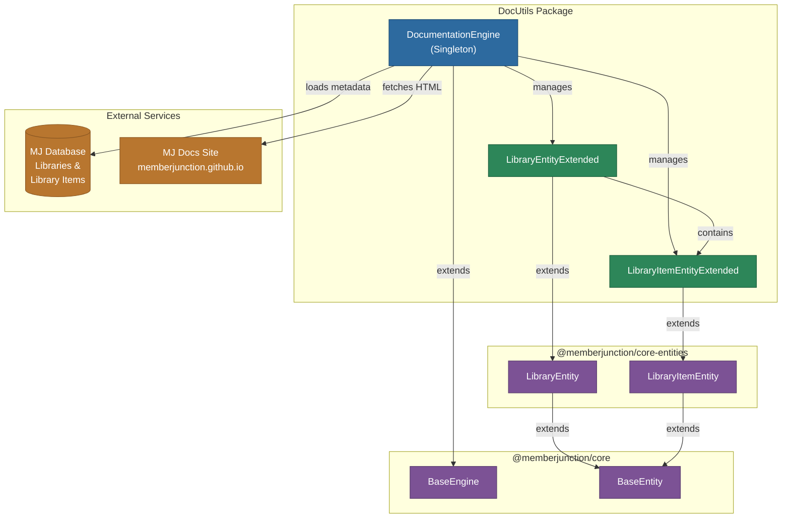
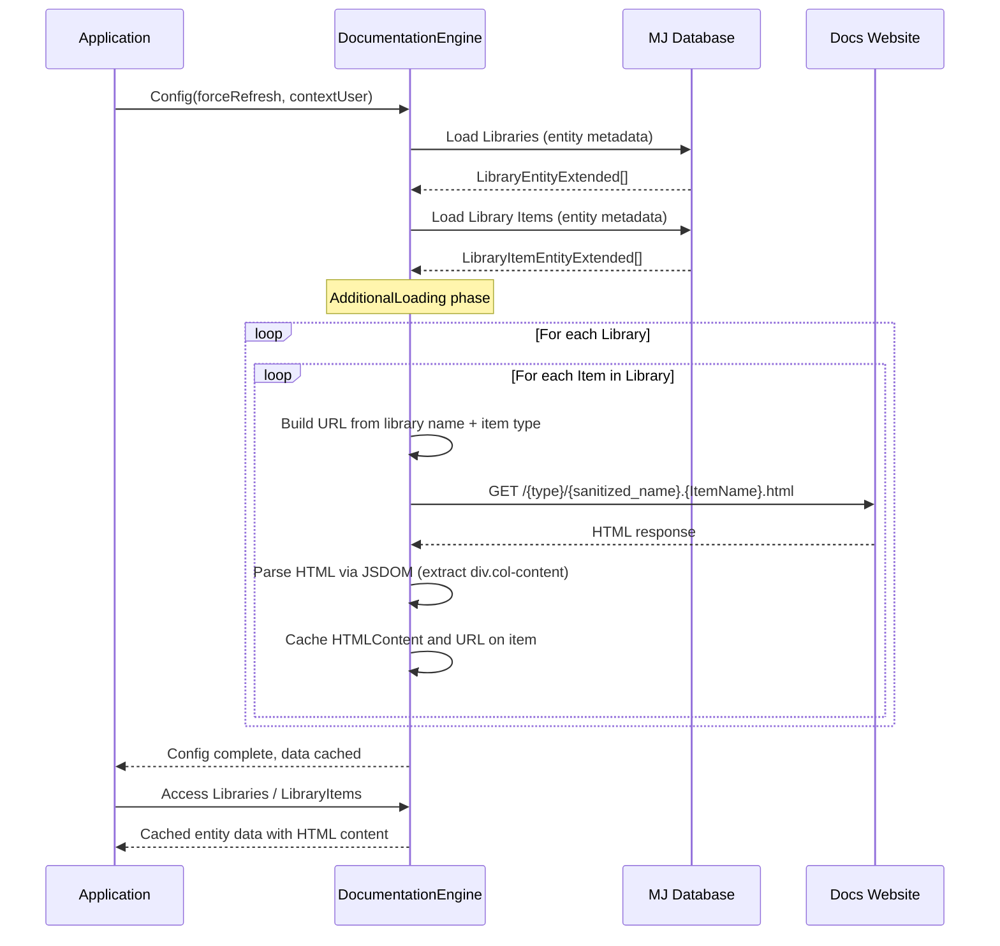
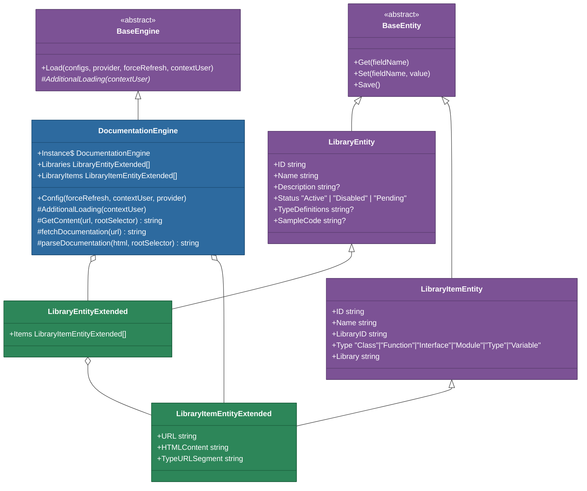
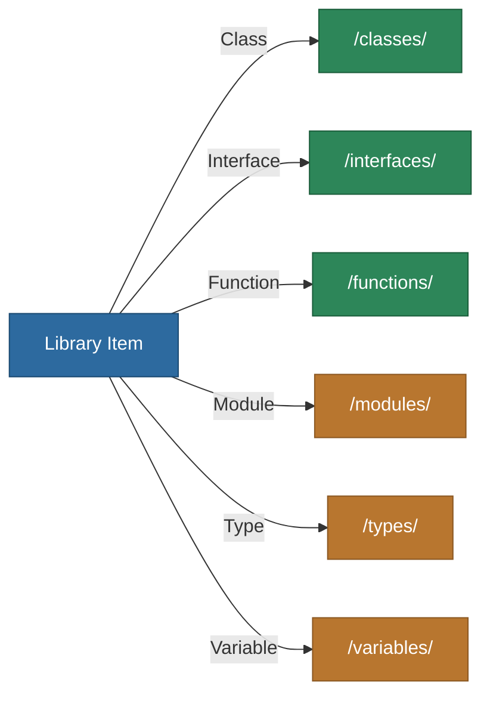

# @memberjunction/doc-utils

A TypeScript library for dynamically retrieving, parsing, and caching MemberJunction library documentation from the official documentation website. Designed to support AI models, code generation tools, and other documentation-driven features that need structured access to MJ library metadata.

## Overview

The `@memberjunction/doc-utils` package provides a singleton `DocumentationEngine` that loads library and library item metadata from the MemberJunction entity system, then fetches the corresponding HTML documentation pages from the official MJ documentation site ([https://memberjunction.github.io/MJ/](https://memberjunction.github.io/MJ/)). Parsed content is cached in memory for efficient repeated access.

This package is particularly useful for:

- Feeding structured library documentation to AI models for context-aware code generation
- Building developer tools that reference MJ API documentation
- Providing searchable documentation indexes for MJ packages and their exported items

## Architecture



## Data Flow

The engine follows a two-phase loading process: first it loads entity metadata from the database, then it fetches and parses HTML documentation for each library item.



## Class Hierarchy



## Installation

```bash
npm install @memberjunction/doc-utils
```

## Dependencies

**MemberJunction packages:**

| Package | Purpose |
|---------|---------|
| `@memberjunction/core` | Base engine class, metadata provider, user context |
| `@memberjunction/core-entities` | `LibraryEntity` and `LibraryItemEntity` base classes |
| `@memberjunction/global` | `@RegisterClass` decorator for entity registration |

**External packages:**

| Package | Purpose |
|---------|---------|
| `axios` | HTTP requests to the documentation website |
| `jsdom` | HTML parsing and DOM manipulation for content extraction |

## Usage

### Initializing the Engine

The `DocumentationEngine` uses the singleton pattern. Call `Config()` once to load metadata and documentation content before accessing data.

```typescript
import { DocumentationEngine } from '@memberjunction/doc-utils';
import { UserInfo } from '@memberjunction/core';

// Get the singleton instance
const docEngine = DocumentationEngine.Instance;

// Server-side: pass contextUser for proper data isolation
const contextUser: UserInfo = /* from your authentication context */;
await docEngine.Config(false, contextUser);

// Client-side: contextUser is optional
await docEngine.Config();
```

### Accessing Libraries and Items

After configuration, libraries and their items are available through cached properties.

```typescript
const docEngine = DocumentationEngine.Instance;

// Get all libraries
const libraries = docEngine.Libraries;
console.log(`Loaded ${libraries.length} libraries`);

// Find a specific library
const coreLib = libraries.find(lib => lib.Name === '@memberjunction/core');
if (coreLib) {
    console.log(`${coreLib.Name} (${coreLib.Status})`);
    console.log(`Items: ${coreLib.Items.length}`);

    // Iterate through items in the library
    for (const item of coreLib.Items) {
        console.log(`  ${item.Type}: ${item.Name}`);
        console.log(`  URL: ${item.URL}`);
        console.log(`  Content length: ${item.HTMLContent.length} chars`);
    }
}
```

### Accessing All Library Items

The flat `LibraryItems` array provides access to all items across all libraries.

```typescript
const docEngine = DocumentationEngine.Instance;

// Get all library items regardless of library
const allItems = docEngine.LibraryItems;

// Filter by type
const allClasses = allItems.filter(item => item.Type === 'Class');
const allInterfaces = allItems.filter(item => item.Type === 'Interface');

// Find a specific item by name and library
const baseEntity = allItems.find(
    item => item.Name === 'BaseEntity' && item.Library === '@memberjunction/core'
);

if (baseEntity) {
    console.log(`Documentation URL: ${baseEntity.URL}`);
    console.log(`HTML Content: ${baseEntity.HTMLContent}`);
}
```

### Force Refreshing Documentation

Pass `true` to `Config()` to reload all metadata from the database and re-fetch documentation content.

```typescript
const docEngine = DocumentationEngine.Instance;

// Force a complete reload
await docEngine.Config(true);
```

## API Reference

### DocumentationEngine

The primary class providing access to MJ library documentation. Extends `BaseEngine` and uses the singleton pattern.

| Member | Type | Description |
|--------|------|-------------|
| `Instance` (static) | `DocumentationEngine` | Returns the singleton instance |
| `Libraries` | `LibraryEntityExtended[]` | All loaded libraries with their items |
| `LibraryItems` | `LibraryItemEntityExtended[]` | Flat list of all library items across all libraries |
| `Config(forceRefresh?, contextUser?, provider?)` | `Promise<void>` | Initializes the engine: loads metadata, fetches and parses documentation |

### LibraryEntityExtended

Extended entity class for libraries. Registered via `@RegisterClass(BaseEntity, "Libraries")`.

| Member | Type | Description |
|--------|------|-------------|
| `ID` | `string` | Unique identifier |
| `Name` | `string` | Library package name (e.g., `@memberjunction/core`) |
| `Description` | `string \| null` | Human-readable description |
| `Status` | `'Active' \| 'Disabled' \| 'Pending'` | Library availability status |
| `TypeDefinitions` | `string \| null` | Type/function definitions for reference by humans and AI |
| `SampleCode` | `string \| null` | Usage examples for the library |
| `Items` | `LibraryItemEntityExtended[]` | All items belonging to this library |

### LibraryItemEntityExtended

Extended entity class for individual library items (classes, interfaces, functions, etc.). Registered via `@RegisterClass(BaseEntity, "Library Items")`.

| Member | Type | Description |
|--------|------|-------------|
| `ID` | `string` | Unique identifier |
| `Name` | `string` | Item name (e.g., `BaseEntity`, `RunView`) |
| `LibraryID` | `string` | Foreign key to the parent library |
| `Library` | `string` | Denormalized library name from the view |
| `Type` | `'Class' \| 'Function' \| 'Interface' \| 'Module' \| 'Type' \| 'Variable'` | The kind of exported item |
| `URL` | `string` | Generated documentation URL for this item |
| `HTMLContent` | `string` | Parsed HTML content from the documentation page |
| `TypeURLSegment` | `string` (getter) | URL path segment derived from `Type` (e.g., `classes`, `interfaces`) |

### URL Generation

Documentation URLs are constructed automatically using the pattern:

```
https://memberjunction.github.io/MJ/{typeSegment}/{sanitizedLibraryName}.{ItemName}.html
```

Where:
- `{typeSegment}` is the pluralized, lowercase item type (`classes`, `interfaces`, `functions`, `modules`, `types`, `variables`)
- `{sanitizedLibraryName}` is the library name with `@`, `.`, `/`, and `\` characters replaced by `_`
- `{ItemName}` is the exact name of the exported item

For example, `BaseEntity` (a Class) in `@memberjunction/core` resolves to:
```
https://memberjunction.github.io/MJ/classes/_memberjunction_core.BaseEntity.html
```

## URL Routing by Item Type



## Integration with MemberJunction

This package integrates with the broader MemberJunction ecosystem through several mechanisms:

- **Entity System**: Uses `@RegisterClass` to register `LibraryEntityExtended` and `LibraryItemEntityExtended` as entity subclasses, ensuring the MJ class factory returns the extended types when loading Libraries and Library Items.
- **BaseEngine Pattern**: Extends `BaseEngine` with the `Config()` / `AdditionalLoading()` lifecycle, allowing consistent initialization and caching across all MJ engine classes.
- **User Context**: Supports `contextUser` for proper data isolation and security when running on the server side.
- **Metadata Provider**: Accepts an optional `IMetadataProvider` for environments with custom metadata access patterns.

## Build

```bash
# Build the package
cd packages/DocUtils
npm run build

# Development mode with file watching
npm start
```

## Source Files

| File | Description |
|------|-------------|
| `src/index.ts` | Public API surface -- re-exports from `Engine.ts` |
| `src/Engine.ts` | Core implementation: `DocumentationEngine`, `LibraryEntityExtended`, `LibraryItemEntityExtended` |

## Notes

- Documentation is fetched from [https://memberjunction.github.io/MJ/](https://memberjunction.github.io/MJ/) using `axios` HTTP GET requests.
- HTML content is parsed with `jsdom`, extracting the inner HTML of the `div.col-content` element from each page.
- All fetched content is cached in memory after the initial `Config()` call. Subsequent calls to `Config()` without `forceRefresh=true` return immediately.
- Library names containing special characters (`@`, `.`, `/`, `\`) are sanitized by replacing them with underscores for URL compatibility.
- If a documentation page cannot be fetched (network error, 404, etc.), the `HTMLContent` for that item is set to an error or placeholder string rather than throwing an exception.
