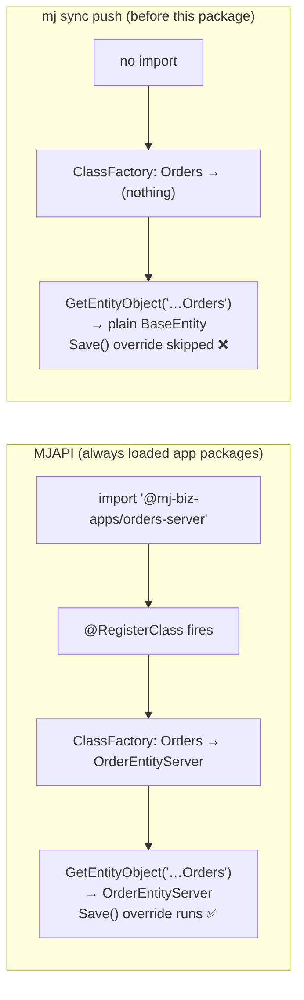
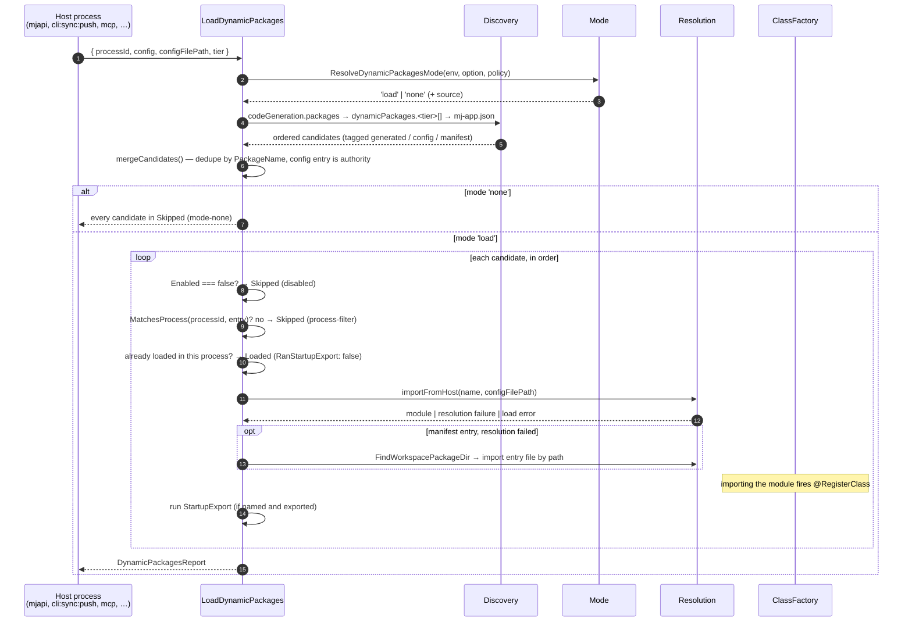
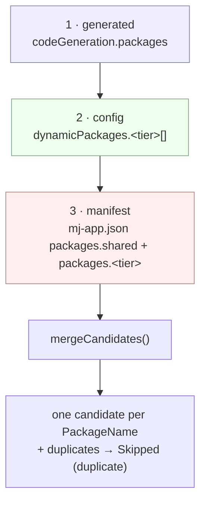
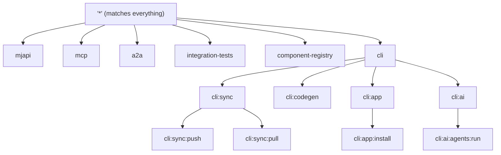
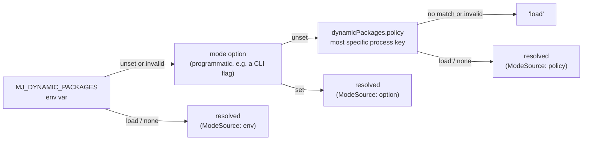
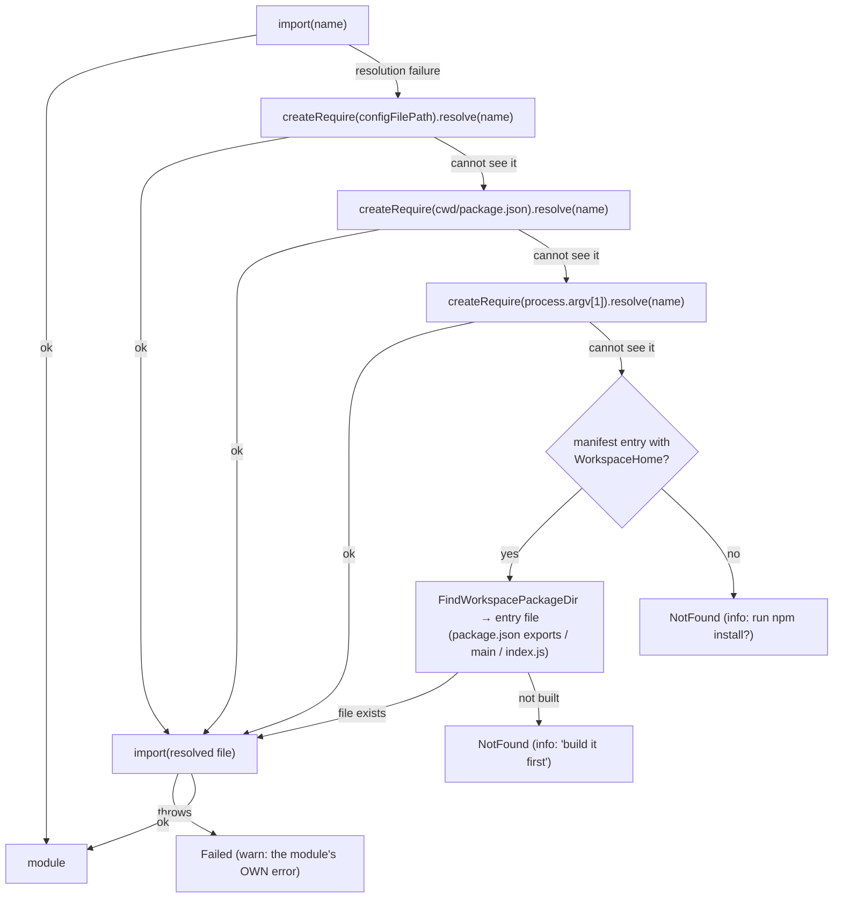

# @memberjunction/dynamic-packages

Process-agnostic loader for packages whose names are only known at runtime:

- Open App server / client packages recorded in `mj.config.cjs` `dynamicPackages.server[]` /
  `dynamicPackages.client[]` by `mj app install`
- a host's own generated packages under `codeGeneration.packages`
- the packages of the Open App whose repository a process is standing in (`mj-app.json`)

Importing one of these packages fires its `@RegisterClass` decorators, so `Metadata.GetEntityObject`
returns the app's entity subclass (validation, `Save()` overrides, lifecycle hooks) instead of a
generic `BaseEntity`. MJAPI has always done this at boot. Every other MJ process — the `mj` CLI
(`sync push`, `app …`, `test`, …), the MCP and A2A servers, the integration-test bootstrap, an ad-hoc
script — needs exactly the same behaviour, and this package is where it lives so each host is one call.

The repo-wide story (why it exists, how a downstream app and an MJ install configure it, how to add
it to a new host) is in [`guides/DYNAMIC_PACKAGE_LOADING_GUIDE.md`](../../guides/DYNAMIC_PACKAGE_LOADING_GUIDE.md).
This README is the package reference.

## Contents

1. [The problem in one picture](#the-problem-in-one-picture)
2. [Usage](#usage)
3. [How a call proceeds](#how-a-call-proceeds)
4. [Discovery sources and merge rules](#discovery-sources-and-merge-rules)
5. [Process IDs](#process-ids)
6. [Scoping entries per process](#scoping-entries-per-process)
7. [Mode: turning it off](#mode-turning-it-off)
8. [Nested hosts](#nested-hosts)
9. [Running inside an Open App repository](#running-inside-an-open-app-repository)
10. [Resolution: how a package is found](#resolution-how-a-package-is-found)
11. [Loading twice in one process](#loading-twice-in-one-process)
12. [The report](#the-report)
13. [Loggers](#loggers)
14. [Contract for `StartupExport`](#contract-for-startupexport)
15. [API](#api)
16. [Testing a host against it](#testing-a-host-against-it)

## The problem in one picture

`MJGlobal.ClassFactory` is a registry keyed by `(baseClass, key)`. `@RegisterClass(BaseEntity, 'MJ_BizApps_Orders: Orders')`
registers a subclass under that key **as a side effect of importing the module that declares it**.
Nothing else ever puts it there. So a process that has not imported the app's package gets the fallback:



The fallback is silent: the push reports success, the row is written, and the app's validation and
lifecycle logic simply never ran (MemberJunction/MJ#4199). The loader closes that gap for every process
by making "import whatever the configuration names" a single call with one set of rules.

## Usage

```ts
import { LoadDynamicPackages, DiscoverMJConfig } from '@memberjunction/dynamic-packages';

// 1. Discover the RAW mj.config.cjs (Zod-parsed configs usually strip `dynamicPackages`).
const { config, configFilePath } = DiscoverMJConfig();

// 2. Load — BEFORE any database provider is set up, exactly where MJAPI does it.
const report = await LoadDynamicPackages({ processId: 'mcp', config, configFilePath });

report.Loaded;    // [{ Entry, Source, Module, RanStartupExport }]
report.Skipped;   // disabled / process-filter / mode-none / duplicate
report.NotFound;  // not resolvable from any anchor (expected before `npm install`)
report.Failed;    // resolved but threw while loading — its own error, never masked
```

Call it **after** the host's own class-registration manifest (`@memberjunction/server-bootstrap`,
`@memberjunction/server-bootstrap-lite`) has been imported: the ClassFactory's load-order priority
means the app's registrations land last and win. Call it **before** the provider is created: a
`StartupExport` may rely on nothing but the ClassFactory.

The package has one runtime dependency (`cosmiconfig`) and no MJ dependencies, so it can be the first
MJ-shaped thing a process imports.

## How a call proceeds



Two properties of that loop are deliberate and worth knowing:

- **Filters run before the cache check.** An entry that is disabled or out of scope stays skipped
  even when an earlier call in the same process loaded the package. The cache is not a bypass.
- **Order is priority.** `@RegisterClass` uses load-order priority — the last registration for a key
  wins — so discovery is arranged generic-to-specific (see next section).

## Discovery sources and merge rules

Three sources, always in this order:

| # | Source | Comes from | `Source` tag | Why this position |
|---|---|---|---|---|
| 1 | Generated packages | `codeGeneration.packages.{entities,actions,graphqlResolvers}.name` (server tier) / `{entities,actions,angularForms}` (client tier) | `generated` | The host's own schema subclasses — the most generic layer |
| 2 | Installed Open Apps | `dynamicPackages.server[]` / `dynamicPackages.client[]`, written by `mj app install` | `config` | Apps layered on the host |
| 3 | The app you are standing in | `mj-app.json` next to the config (or `appManifestDir`): `packages.shared` then `packages.<tier>` | `manifest` | The most local definition overrides everything |



`mergeCandidates` collapses entries that name the same package:

- The **`config` entry is the operator's authority**. It carries `Enabled` (what `mj app disable`
  writes) and the `Processes` / `ExcludeProcesses` scoping, so when an `mj-app.json` beside the
  config names a package the config also names, the config entry decides whether and where it loads.
- The **manifest's on-disk location is kept as the resolution fallback** (`WorkspaceHome`), so a
  package the host cannot `require.resolve` still loads from the workspace.
- Every later duplicate is returned separately and lands in `report.Skipped` with `Reason: 'duplicate'`.

Manifest discovery reads `mj-app.json` from the config file's directory by default; pass
`appManifestDir` to point elsewhere, or `discoverAppManifest: false` to skip it. `includeGeneratedPackages: false`
skips source 1.

## Process IDs

Every host names itself with a lowercase, colon-separated ID. IDs are hierarchical: a pattern matches
an ID when it equals the ID or names one of its ancestor **segments**.



| Pattern | Matches | Does not match |
|---|---|---|
| `cli` | `cli`, `cli:sync:push`, `cli:codegen` | `mjapi` |
| `cli:sync` | `cli:sync`, `cli:sync:push` | `cli:syncother`, `cli:migrate` |
| `cli:sync:push` | `cli:sync:push` only | `cli:sync:pull` |
| `*` | everything | — |

`CliProcessId('sync push')` and `CliProcessId('sync:push')` both build `cli:sync:push` from an oclif
command ID. `NormalizeProcessId` trims, lowercases and collapses whitespace around the separators.
`ProcessIdMatches`, `MatchesProcess` and `ResolveMostSpecific` are the three matching primitives, all
exported for hosts that need to evaluate scoping themselves.

## Scoping entries per process

`dynamicPackages.server[]` stays the single source of truth that `mj app install` writes. Two optional,
hand-authored fields scope an entry:

```js
dynamicPackages: {
  server: [
    // written by `mj app install` — no Processes = loads wherever the server tier loads
    { PackageName: '@mj-biz-apps/orders-server', StartupExport: 'LoadBizAppsOrdersServer', AppName: 'mj-bizapps-orders', Enabled: true },
    // only when the CLI runs any `mj sync` command
    { PackageName: '@acme/demo-seed-server', StartupExport: 'LoadDemoSeed', Processes: ['cli:sync'] },
    // everywhere except CodeGen
    { PackageName: '@acme/audit-server', StartupExport: 'LoadAudit', ExcludeProcesses: ['cli:codegen'] },
  ],
  // optional per-process on/off switch; the most specific key wins
  policy: { 'cli:codegen': 'none' },
}
```

`Processes` is evaluated first (omitted or empty means everywhere the tier loads), then
`ExcludeProcesses`. An entry that fails either lands in `report.Skipped` with `Reason: 'process-filter'`.

Scoping only applies to processes that run the loader. The `mj` CLI's *light* commands — `mj migrate`
(and `migrate create` / `migrate convert`), `mj install`, `mj clean`, `mj bundle`, `mj doctor`,
`mj version`, `help` and the `usage` pages — skip the class-registration manifest for instant
startup and never load app packages, so a `Processes: ['cli:migrate']` entry or a `cli:migrate`
policy key has no effect: migrations never run app entity subclasses in any mode.

## Mode: turning it off

Mode is resolved once per call, highest precedence first:



`MJ_DYNAMIC_PACKAGES=none` (also `off`, `skip`, `false`, `0`; the positive spellings `on`, `true`,
`1`, `full` mean `load`) disables loading for a single invocation. The `mj` CLI exposes it as the
global `--no-app-packages` flag. An invalid value never crashes a process: it is reported on the warn
path (`Ignoring invalid …`) and precedence falls through to the next source.

Mode `none` skips every dynamic package: the installed Open App packages *and* the host's own
`codeGeneration.packages` (generated entities/actions/resolvers), so a host that relies on the latter
loses its custom entity subclasses too for that run. MJ core's own server subclasses still register
through the host's manifest, so a "raw" run is raw for app and host entities only — which is why the
CLI flag is not called `--raw`.

## Nested hosts

Some MJ processes host other MJ processes: `mj ai agents run` imports `@memberjunction/ai-cli`, and
`mj test …` imports `@memberjunction/testing-cli`, each of which has its own provider bootstrap that
calls the loader. Without coordination the inner host would evaluate scoping under its standalone
identity (`ai-cli`, `testing-cli`) a moment after the outer host evaluated it under `cli:ai:agents:run`,
and an entry the operator excluded from `cli` would load anyway.

```mermaid
sequenceDiagram
    participant U as operator
    participant CLI as mj (prerun hook)
    participant ENV as process.env
    participant AI as @memberjunction/ai-cli bootstrap

    U->>CLI: mj ai agents run …
    CLI->>CLI: LoadDynamicPackages({ processId: 'cli:ai:agents:run' })
    CLI->>ENV: MJ_DYNAMIC_PACKAGES_PROCESS = 'cli:ai:agents:run'
    CLI->>AI: import + run command
    AI->>ENV: EffectiveProcessId('ai-cli') → 'cli:ai:agents:run'
    AI->>AI: LoadDynamicPackages({ processId: 'cli:ai:agents:run' })
    Note over AI: same scoping decisions as the outer host;<br/>already-loaded packages come back cached, startup export not re-run
```

The outer host publishes its ID through `DYNAMIC_PACKAGES_PROCESS_ENV_VAR` (`MJ_DYNAMIC_PACKAGES_PROCESS`);
the inner host reads it with `EffectiveProcessId(hostDefault)`, which falls back to `hostDefault` when
the variable is unset (the standalone `mj-ai` case). The mode env var propagates the same way, since it
is plain `process.env`.

## Running inside an Open App repository

When `mj-app.json` sits next to the config (or in `appManifestDir`), the loader also imports that
app's `packages.shared` libraries and its `packages.server` / `packages.client` bootstrap packages,
running each `startupExport`. Under pnpm's strict layout nothing at the repo root can
`require.resolve` a workspace member, so the loader finds the package under `code.sourceDirectory`
(default `packages/`) and imports it by path. A member that exists but has not been built yet (its
entry file is missing) is reported as **not found**, with the file the build is expected to produce,
on the info path — the expected state before the app's own build, not an error.

Dependency apps are **not** walked from the manifest: installed ones are already in the host's
`dynamicPackages`, and dev-linked ones ride the workspace's env-supplied entries.

## Resolution: how a package is found

A bare `import(name)` resolves from *this* package, which cannot declare packages whose names come from
configuration. npm's hoisted layout lets that work by accident; pnpm's strict layout does not, because
the packages are declared by (and linked into) the **host** application. `importFromHost` therefore
tries the bare import first and then retries from each host anchor:



Resolution and evaluation are kept apart on purpose: an anchor that cannot *see* the package means
"try the next anchor", but once an anchor resolves it, anything that fails while loading (a missing
transitive dependency, a throw in top-level code) is the module's own problem and surfaces as-is —
never masked by the original "cannot find package" error. `isOwnResolutionFailure` checks that the
quoted subject of the error is *this* package name, so a missing transitive dependency is reported as
`Failed`, not `NotFound`.

`resolvePackageJsonFromHost` uses the same anchors to find a package's `package.json` (for hosts that
read `memberjunction.serverExtensions` off it), tolerating an exports map that omits `./package.json`
by resolving the main entry and walking up.

## Loading twice in one process

The loader remembers what it has loaded, on a `globalThis` symbol store rather than a module variable,
so two physical copies of this package (two dist paths under pnpm, a bundled and an unbundled copy)
still agree. A second call in the same process gets the cached module back in `Loaded` so it can still
read `RESOLVER_PATHS` / `MJ_SERVER_EXTENSIONS`, but the `StartupExport` is not run again
(`RanStartupExport: false`). ESM already caches the module; this only prevents the double hook.
`ResetLoadedDynamicPackages()` clears the store — a test seam, not something a host calls.

## The report

`LoadDynamicPackages` never throws for a package problem (it throws only for a missing `processId`).
Everything it decided is in the returned `DynamicPackagesReport`:

| Field | Meaning |
|---|---|
| `ProcessId`, `Tier` | Normalized inputs |
| `Mode`, `ModeSource` | What was resolved and from where (`env` / `option` / `policy` / `default`) |
| `Loaded[]` | `{ Entry, Source, WorkspaceHome?, Module, RanStartupExport }` — `Module` is the namespace object hosts read conventions off |
| `Skipped[]` | `{ …, Reason }` with `disabled`, `process-filter`, `mode-none`, or `duplicate` |
| `NotFound[]` | No anchor could resolve it, or an unbuilt workspace member — logged on the info path |
| `Failed[]` | `{ …, Error }` — resolved but threw while loading; logged on the warn path |

A named `StartupExport` that the module does not export is a real misconfiguration (renamed export,
stale config) and is warned about; the package still counts as `Loaded` with `RanStartupExport: false`.

## Loggers

| Logger | Use when |
|---|---|
| `ConsoleDynamicPackagesLogger` (default) | Plain console, the way MJAPI has always logged boot |
| `StderrDynamicPackagesLogger` | Stdout is a machine-readable envelope (`--format=json`, `--output=json`) — progress and warnings go to stderr, verbose detail is dropped |
| `SilentDynamicPackagesLogger` | The host reads the report and renders it itself |

Any object with `info(message)` and `warn(message, error?)` (and optionally `verbose(message)`)
satisfies `DynamicPackagesLogger`; the `mj` CLI passes one that routes through its own output.

## Contract for `StartupExport`

The loader runs before any database provider exists. A startup export registers classes and returns —
it may be sync or async, and it must not touch a provider, exactly the contract MJAPI has always
imposed. It runs at most once per process for a given package.

## API

| Export | Purpose |
|---|---|
| `LoadDynamicPackages(options)` | The loader. Never throws for a package problem; returns a `DynamicPackagesReport`. |
| `DiscoverMJConfig(searchFrom?, { searchStrategy })` | cosmiconfig discovery of the raw `mj.config.cjs` + its path. `searchStrategy` defaults to `'global'` (walk up to the home directory, what MJAPI / the CLI / CodeGen do); pass `'none'` when the host's own config loader only looks in the working directory, so the packages come from the same file the database settings came from. |
| `mergeCandidates(candidates)` | The dedupe rule described above, exported for hosts that assemble their own candidate lists. |
| `ResetLoadedDynamicPackages()` | Test seam: forget what has been loaded. |
| `ConsoleDynamicPackagesLogger`, `StderrDynamicPackagesLogger`, `SilentDynamicPackagesLogger` | Ready-made loggers. |
| `importFromHost`, `resolvePackageJsonFromHost`, `isResolutionFailure` | Host-anchored resolution (moved here from `@memberjunction/server-bootstrap`). |
| `CliProcessId`, `NormalizeProcessId`, `ProcessIdMatches`, `MatchesProcess`, `ResolveMostSpecific`, `ANY_PROCESS` | Process-ID utilities. |
| `EffectiveProcessId`, `DYNAMIC_PACKAGES_PROCESS_ENV_VAR` | Nested-host identity propagation. |
| `ResolveDynamicPackagesMode`, `DYNAMIC_PACKAGES_MODE_ENV_VAR` | Mode precedence. |
| `DiscoverGeneratedPackages`, `DiscoverAppManifestPackages`, `FindWorkspacePackageDir`, `ReadDynamicPackagesConfig`, `GENERATED_PACKAGE_TYPES_BY_TIER`, `APP_MANIFEST_FILE_NAME` | Discovery primitives. |

Every option and report field is documented inline in `src/types.ts`.

## Testing a host against it

Unit tests for the loader itself live in `src/__tests__/` and cover discovery, matching, mode
precedence, host-anchored resolution and the loader loop with stubbed imports.

The proof that a package **not statically imported anywhere** really registers into the calling
process's ClassFactory lives with the first host that needed it: `packages/MJCLI/src/__tests__/dynamic-packages.registration.test.ts`
loads a committed miniature Open App (`fixtures/fixture-open-app`, an `mj-app.json` plus plain-ESM
entities and server packages) through both the `mj-app.json` path and a `dynamicPackages.server[]`
entry resolved through a throwaway host `node_modules`, then asserts on `MJGlobal.Instance.ClassFactory.GetRegistration(BaseEntity, …)`.
Copy that shape to prove the same thing for a new host.
