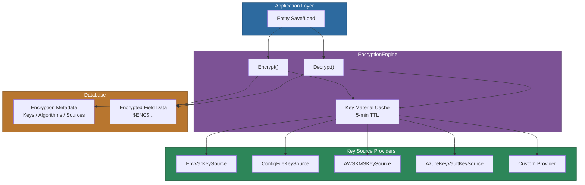
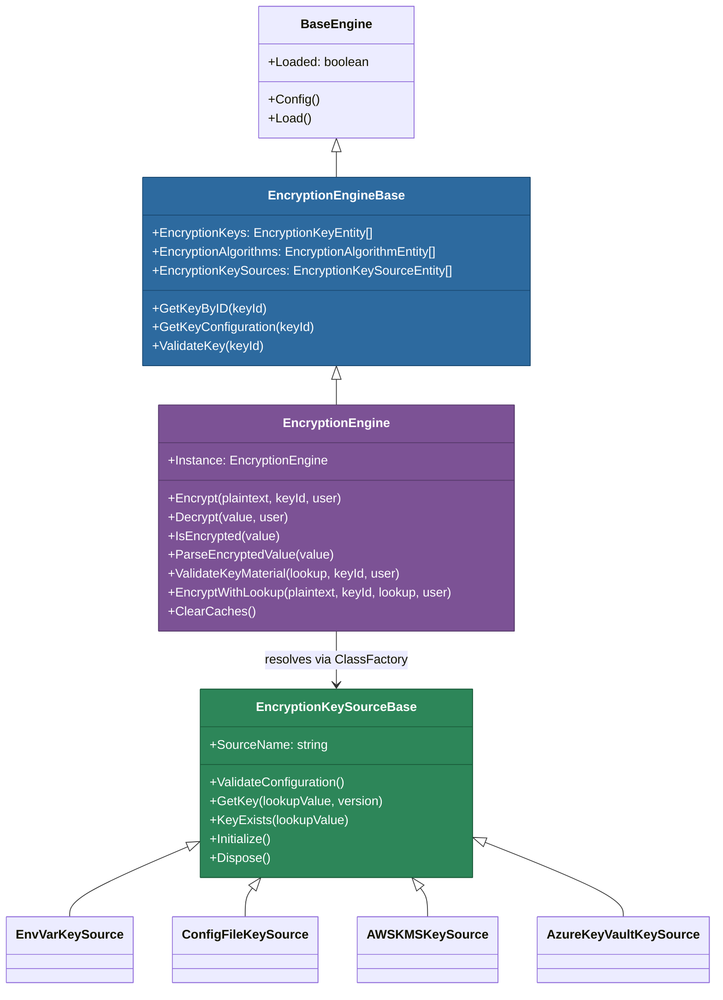
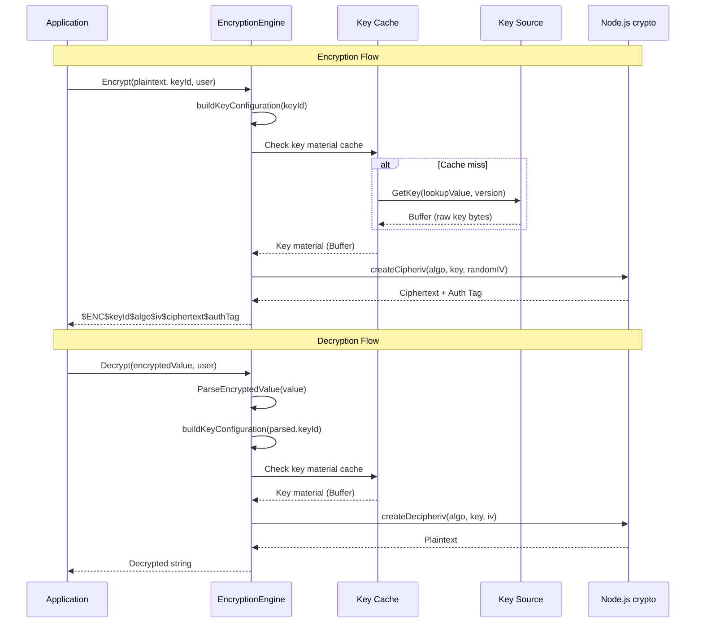
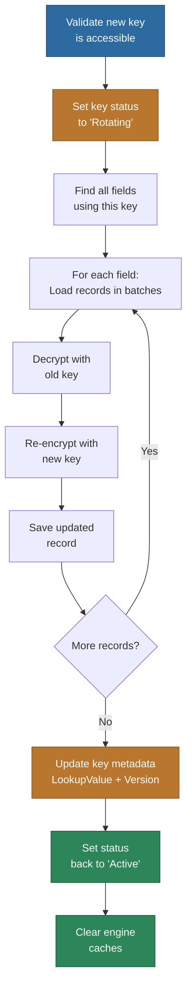

# @memberjunction/encryption

Server-side field-level encryption engine for MemberJunction with pluggable key sources. This package provides transparent encrypt-on-save and decrypt-on-load operations for entity fields, configurable entirely through database metadata. It supports AES-256-GCM authenticated encryption, multiple key source backends (environment variables, configuration files, AWS KMS, Azure Key Vault), and full key rotation with transactional safety.

## Installation

```bash
npm install @memberjunction/encryption
```

For cloud key management, install the optional provider dependencies:

```bash
# AWS KMS support
npm install @aws-sdk/client-kms

# Azure Key Vault support
npm install @azure/keyvault-secrets @azure/identity
```

## Overview

The encryption package sits between MemberJunction's entity system and the database, intercepting save and load operations on fields marked for encryption. When a field has `Encrypt = true` in its EntityField metadata, the engine automatically encrypts the value before writing to the database and decrypts it when reading, providing application-level transparency.

The system is designed around three database-driven configuration entities -- Encryption Keys, Encryption Algorithms, and Encryption Key Sources -- which together define *what* key material to use, *which* algorithm to apply, and *where* to retrieve the raw key bytes from. This metadata-driven approach means encryption can be enabled or disabled on individual fields without code changes.



## Key Features

- **AES-256-GCM Encryption** -- Industry-standard authenticated encryption (AEAD) that prevents both eavesdropping and tampering
- **Pluggable Key Sources** -- Environment variables, config files, AWS KMS, Azure Key Vault, or custom providers via the ClassFactory pattern
- **Declarative Configuration** -- Enable encryption on any entity field via database metadata without code changes
- **Transparent Operation** -- Automatic encryption on save and decryption on load
- **Key Rotation Support** -- Full re-encryption with transactional safety, batch processing, and progress tracking
- **Secure Defaults** -- API responses hide encrypted fields by default; plaintext must be explicitly opted into
- **Self-Describing Format** -- Encrypted values embed the key ID, algorithm, IV, ciphertext, and auth tag for algorithm-agnostic decryption
- **Multi-Level Caching** -- Key configurations and key material are cached with configurable TTL for performance

## Quick Start

### 1. Set Up an Encryption Key

Generate a 256-bit (32-byte) encryption key:

```bash
openssl rand -base64 32
```

Store it in an environment variable:

```bash
export MJ_ENCRYPTION_KEY_PII=your-base64-key-here
```

### 2. Register the Key in the Database

After running the encryption migration, register your key:

```sql
INSERT INTO [${flyway:defaultSchema}].[EncryptionKey] (
    ID, Name, Description, EncryptionKeySourceID, EncryptionAlgorithmID,
    KeyLookupValue, KeyVersion, Marker, IsActive, Status, ActivatedAt
)
VALUES (
    NEWID(),
    'PII Master Key',
    'Encryption key for personally identifiable information',
    '38A961D2-022B-49C2-919F-1825A0E9C6F9',  -- EnvVarKeySource
    'B2E88E95-D09B-4DA6-B0AE-511B21B70952',  -- AES-256-GCM
    'MJ_ENCRYPTION_KEY_PII',
    '1',
    '$ENC$',
    1,
    'Active',
    SYSDATETIMEOFFSET()
);
```

### 3. Enable Encryption on Entity Fields

Update EntityField metadata to enable encryption:

```sql
UPDATE [${flyway:defaultSchema}].[EntityField]
SET Encrypt = 1,
    EncryptionKeyID = 'your-key-id-here',
    AllowDecryptInAPI = 0,  -- Secure default: don't send plaintext to clients
    SendEncryptedValue = 0  -- Secure default: send null instead of ciphertext
WHERE Entity = 'Contacts'
  AND Name IN ('SSN', 'TaxID', 'BankAccountNumber');
```

### 4. Encrypt Existing Data

After enabling encryption on a field, run the action to encrypt existing plaintext data:

```typescript
import { EnableFieldEncryptionAction } from '@memberjunction/encryption';

const action = new EnableFieldEncryptionAction();
const result = await action.Run({
    Params: [
        { Name: 'EntityFieldID', Value: 'field-uuid-here' },
        { Name: 'BatchSize', Value: 100 }
    ],
    ContextUser: currentUser
});
```

## Architecture

### Class Hierarchy



The `EncryptionEngineBase` (defined in `@memberjunction/core-entities`) provides metadata caching for encryption keys, algorithms, and key sources. It works in both client and server contexts. The `EncryptionEngine` in this package extends it with actual cryptographic operations using Node.js `crypto`, making it server-side only.

### Encrypted Value Format

Encrypted values are stored as self-describing strings that embed everything needed for decryption:

```
$ENC$<keyId>$<algorithm>$<iv>$<ciphertext>$<authTag>
```

For example:

```
$ENC$550e8400-e29b-41d4-a716-446655440000$AES-256-GCM$Base64IV$Base64Ciphertext$Base64AuthTag
```

This format enables:
- Quick detection of encrypted values via the `$ENC$` marker
- Identification of which key was used (for multi-key environments)
- Algorithm-agnostic decryption
- Key rotation without format changes

### Encryption and Decryption Flow



## API Response Behavior

The encryption system provides secure-by-default API responses controlled by two EntityField flags:

| AllowDecryptInAPI | SendEncryptedValue | API Response |
|---|---|---|
| `true` | N/A | Decrypted plaintext |
| `false` | `true` | Encrypted ciphertext (`$ENC$...`) |
| `false` | `false` | `NULL` (most secure, **default**) |

## Key Source Providers

### Environment Variable (Default)

The simplest option -- store keys in environment variables. Best for development and containerized deployments with secret injection.

```bash
# Generate a 256-bit key
openssl rand -base64 32

# Set in environment
export MJ_ENCRYPTION_KEY_PII=your-base64-key-here
```

**Database configuration:**
- **EncryptionKeySourceID**: `38A961D2-022B-49C2-919F-1825A0E9C6F9`
- **KeyLookupValue**: Environment variable name (e.g., `MJ_ENCRYPTION_KEY_PII`)

For versioned keys (during rotation), the provider appends `_V{version}` to the variable name (e.g., `MJ_ENCRYPTION_KEY_PII_V2` for version 2).

### Configuration File

Store keys in `mj.config.cjs` (not recommended for production):

```javascript
module.exports = {
    encryptionKeys: {
        pii_master_key: 'base64-encoded-key-here'
    }
};
```

**Database configuration:**
- **EncryptionKeySourceID**: `CBF9632D-EF05-42E2-82F6-5BAC79FAA565`
- **KeyLookupValue**: Key name in config (e.g., `pii_master_key`)

Uses cosmiconfig to locate configuration files in standard locations (`mj.config.cjs`, `mj.config.js`, `.mjrc.json`, `.mjrc.yaml`).

### AWS KMS

Uses AWS Key Management Service with envelope encryption. The raw key is encrypted by a KMS Customer Master Key (CMK) and decrypted at runtime.

**Setup:**

1. Create a symmetric CMK in AWS KMS
2. Generate a data key:
   ```bash
   aws kms generate-data-key \
     --key-id alias/your-cmk-alias \
     --key-spec AES_256 \
     --query 'CiphertextBlob' \
     --output text
   ```
3. Store the output (base64 CiphertextBlob) as the KeyLookupValue

**Authentication:** Uses the standard AWS credential chain (environment variables, IAM role, shared credentials file).

**Database configuration:**
- **EncryptionKeySourceID**: `D8E4F521-3A7B-4C9E-8F12-6B5A4C3D2E1F`
- **KeyLookupValue**: Base64-encoded CiphertextBlob from GenerateDataKey

### Azure Key Vault

Retrieves keys from Azure Key Vault secrets.

**Setup:**

1. Create an Azure Key Vault
2. Create a secret containing your base64-encoded key:
   ```bash
   KEY=$(openssl rand -base64 32)
   az keyvault secret set \
     --vault-name your-vault-name \
     --name mj-encryption-key \
     --value "$KEY"
   ```

**Authentication:** Uses DefaultAzureCredential (Managed Identity, service principal, or Azure CLI).

**Database configuration:**
- **EncryptionKeySourceID**: `A2B3C4D5-E6F7-8901-2345-6789ABCDEF01`
- **KeyLookupValue**: Full secret URL or just the secret name (if `AZURE_KEYVAULT_URL` is set)

```bash
# With AZURE_KEYVAULT_URL set, use short names:
export AZURE_KEYVAULT_URL=https://your-vault.vault.azure.net
# Then KeyLookupValue can be: mj-encryption-key
```

### Custom Provider

Extend `EncryptionKeySourceBase` to integrate any key management system:

```typescript
import { RegisterClass } from '@memberjunction/global';
import { EncryptionKeySourceBase } from '@memberjunction/encryption';

@RegisterClass(EncryptionKeySourceBase, 'HashiCorpVaultKeySource')
export class HashiCorpVaultKeySource extends EncryptionKeySourceBase {
    get SourceName(): string { return 'HashiCorp Vault'; }

    ValidateConfiguration(): boolean {
        return !!process.env.VAULT_ADDR && !!process.env.VAULT_TOKEN;
    }

    async GetKey(lookupValue: string): Promise<Buffer> {
        // Implement vault API call to retrieve secret
        // Return the key as a Buffer
    }

    async KeyExists(lookupValue: string): Promise<boolean> {
        // Check if secret exists at path
    }
}
```

The provider lifecycle is: **Construction** -> **Initialize()** (async setup) -> **GetKey()/KeyExists()** (per-operation) -> **Dispose()** (cleanup).

## Programmatic API

### EncryptionEngine

The `EncryptionEngine` is a singleton accessed via `EncryptionEngine.Instance`:

```typescript
import { EncryptionEngine } from '@memberjunction/encryption';

const engine = EncryptionEngine.Instance;

// Encrypt a value
const encrypted = await engine.Encrypt(
    'sensitive-data',
    encryptionKeyId,
    contextUser
);

// Decrypt a value (non-encrypted values pass through unchanged)
const decrypted = await engine.Decrypt(encrypted, contextUser);

// Check if a value is encrypted
if (engine.IsEncrypted(someValue)) {
    const parts = engine.ParseEncryptedValue(someValue);
    console.log(`Encrypted with key: ${parts.keyId}`);
}

// Clear caches (after key rotation or config changes)
engine.ClearCaches();
```

### Key Rotation

Rotate keys without downtime using the `RotateEncryptionKeyAction`:

```typescript
import { RotateEncryptionKeyAction } from '@memberjunction/encryption';

// 1. Deploy new key to environment
// export MJ_ENCRYPTION_KEY_PII_V2=new-base64-key-here

// 2. Run rotation
const action = new RotateEncryptionKeyAction();
const result = await action.Run({
    Params: [
        { Name: 'EncryptionKeyID', Value: 'existing-key-uuid' },
        { Name: 'NewKeyLookupValue', Value: 'MJ_ENCRYPTION_KEY_PII_V2' },
        { Name: 'BatchSize', Value: 100 }
    ],
    ContextUser: currentUser
});

// 3. After rotation completes, update environment to use new key
```

The rotation process:



## API Reference

### EncryptionEngine

| Method | Description |
|--------|-------------|
| `Instance` | Static property returning the singleton instance |
| `Config(forceRefresh?, contextUser?, provider?)` | Loads encryption metadata from the database |
| `Encrypt(plaintext, encryptionKeyId, contextUser?)` | Encrypts a value using the specified key |
| `Decrypt(value, contextUser?)` | Decrypts an encrypted value; passes through non-encrypted values |
| `IsEncrypted(value, marker?)` | Checks if a value is encrypted (synchronous) |
| `ParseEncryptedValue(value)` | Parses an encrypted string into its component parts |
| `ValidateKeyMaterial(lookupValue, keyId, contextUser?)` | Validates that key material is accessible and the correct length |
| `EncryptWithLookup(plaintext, keyId, lookupValue, contextUser?)` | Encrypts using a specific key lookup value (used during rotation) |
| `ClearCaches()` | Clears the key material cache |
| `ClearAllCaches()` | Clears all caches including base class metadata |

### EncryptionKeySourceBase

| Member | Description |
|--------|-------------|
| `SourceName` | Abstract property returning the human-readable source name |
| `ValidateConfiguration()` | Abstract method to validate source configuration |
| `GetKey(lookupValue, keyVersion?)` | Abstract method to retrieve raw key bytes |
| `KeyExists(lookupValue)` | Abstract method to check if a key exists |
| `Initialize()` | Virtual async method for one-time setup (default: no-op) |
| `Dispose()` | Virtual async method for cleanup (default: no-op) |

### Interfaces

| Interface | Description |
|-----------|-------------|
| `EncryptedValueParts` | Parsed components of an encrypted value string (marker, keyId, algorithm, iv, ciphertext, authTag) |
| `KeyConfiguration` | Complete runtime key configuration (key ID, version, marker, algorithm details, source details) |
| `EncryptionKeySourceConfig` | Configuration passed to key source providers (lookupValue, additionalConfig) |
| `RotateKeyParams` / `RotateKeyResult` | Parameters and results for key rotation operations |
| `EnableFieldEncryptionParams` / `EnableFieldEncryptionResult` | Parameters and results for field encryption operations |

### Actions

| Action | Registered Name | Description |
|--------|----------------|-------------|
| `EnableFieldEncryptionAction` | `Enable Field Encryption` | Encrypts existing plaintext data on a newly-encrypted field |
| `RotateEncryptionKeyAction` | `Rotate Encryption Key` | Re-encrypts all data from an old key to a new key |

## Database Schema

The encryption infrastructure uses three metadata entities plus extensions to EntityField:

**MJ: Encryption Key Sources** -- Where keys are stored (env vars, config files, vaults)

**MJ: Encryption Algorithms** -- Available algorithms (AES-256-GCM, etc.) with Node.js crypto identifiers

**MJ: Encryption Keys** -- Configured keys linking a source and algorithm together

**EntityField extensions:**
- `Encrypt` -- Enable encryption for this field
- `EncryptionKeyID` -- Which key to use
- `AllowDecryptInAPI` -- Whether to return plaintext in API responses
- `SendEncryptedValue` -- Whether to return ciphertext when decryption is not allowed

## Performance

- Key configurations are cached via `BaseEngine` with auto-refresh on entity changes
- Key material is cached with a 5-minute TTL
- Encryption and decryption use Node.js native `crypto` module (hardware-accelerated where available)
- Batch processing for key rotation and initial encryption (configurable batch size)
- Lazy loading -- the encryption engine is only activated when needed
- Cloud providers (AWS KMS, Azure Key Vault) use lazy SDK loading to avoid import cost when not used

## Security Considerations

1. **Key Management**
   - Never store keys in the database -- use environment variables or secure vault services
   - Rotate keys regularly (recommended: annually)
   - Generate keys with `openssl rand -base64 32`

2. **Authenticated Encryption**
   - AES-256-GCM provides both confidentiality and integrity
   - Auth tag prevents tampering with ciphertext
   - Random IVs for each encryption operation prevent pattern analysis

3. **API Security**
   - Default: encrypted fields return `null` to API clients
   - Explicitly enable `AllowDecryptInAPI` only when needed
   - Use `SendEncryptedValue` for client-side decryption scenarios

4. **Key Rotation**
   - Plan for rotation before key compromise
   - Test rotation in a staging environment first
   - Monitor rotation progress for large datasets
   - Keep old keys accessible until rotation completes
   - Key status is set to `Rotating` during the operation for visibility

## Troubleshooting

### "Encryption key not found"
- Verify the key exists in the `MJ: Encryption Keys` table
- Check that `IsActive = 1` and `Status = 'Active'`
- Ensure the referenced algorithm and source are also active

### "Key length mismatch"
- Ensure your key is exactly 32 bytes (256 bits) for AES-256
- Generate with: `openssl rand -base64 32`
- The base64 string should be approximately 44 characters

### "Failed to decrypt" / Auth tag mismatch
- The key may have been rotated -- check `KeyVersion`
- The data may be corrupted
- Auth tag mismatch indicates the data was tampered with or the wrong key was used

### API returns null for encrypted fields
- Check the `AllowDecryptInAPI` flag on the EntityField
- The default is `false` for security
- Set to `true` if API clients need plaintext

## Dependencies

This package depends on:
- [@memberjunction/global](../MJGlobal/README.md) -- Class registration and the `ENCRYPTION_MARKER` constant
- [@memberjunction/core](../MJCore/README.md) -- `BaseEngine`, `RunView`, `Metadata`, `UserInfo`
- [@memberjunction/core-entities](../MJCoreEntities/README.md) -- `EncryptionEngineBase` and encryption entity types
- [@memberjunction/credentials](../Credentials/Engine/README.md) -- Credential management
- [@memberjunction/actions-base](../Actions/Base/README.md) -- `RunActionParams` and `ActionResultSimple` for action definitions

Optional (for cloud key sources):
- `@aws-sdk/client-kms` -- AWS KMS integration
- `@azure/keyvault-secrets` + `@azure/identity` -- Azure Key Vault integration

## License

ISC
