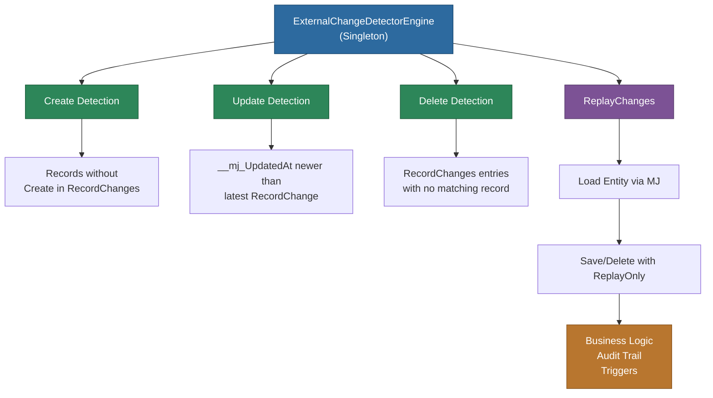

# @memberjunction/external-change-detection

Detects and reconciles changes made to MemberJunction entities by external systems, third-party integrations, or direct database modifications that bypass the MemberJunction application layer.

## Overview

The `@memberjunction/external-change-detection` package detects when records have been modified outside of MemberJunction, generates detailed change reports with field-level differences, and can replay those changes through the MemberJunction entity system to trigger all business logic, validations, and audit tracking.



## Key Features

- Detect external changes to entity records (creates, updates, and deletes)
- Compare current state with previous snapshots stored in RecordChanges
- Generate detailed change reports with field-level differences
- Support for composite primary keys
- Configurable change detection with parallel processing
- Ability to replay/apply detected changes through MemberJunction
- Built-in optimization for batch loading records
- Track change replay runs for audit purposes

## Installation

```bash
npm install @memberjunction/external-change-detection
```

## Dependencies

This package relies on the following MemberJunction packages:
- `@memberjunction/core` - Core MemberJunction functionality
- `@memberjunction/core-entities` - Entity definitions
- `@memberjunction/global` - Global utilities
- `@memberjunction/sqlserver-dataprovider` - SQL Server data provider

## Basic Usage

```typescript
import { ExternalChangeDetectorEngine } from '@memberjunction/external-change-detection';
import { Metadata } from '@memberjunction/core';

async function detectAndReplayChanges() {
  // Get the engine instance
  const detector = ExternalChangeDetectorEngine.Instance;
  
  // Configure the engine (loads eligible entities)
  await detector.Config();
  
  // Get a specific entity
  const md = new Metadata();
  const entityInfo = md.Entities.find(e => e.Name === 'Customer');
  
  // Detect changes for the entity
  const result = await detector.DetectChangesForEntity(entityInfo);
  
  if (result.Success) {
    console.log(`Detected ${result.Changes.length} changes`);
    
    // Replay the changes if any were found
    if (result.Changes.length > 0) {
      const replaySuccess = await detector.ReplayChanges(result.Changes);
      console.log(`Replay ${replaySuccess ? 'succeeded' : 'failed'}`);
    }
  }
}
```

## API Documentation

### ExternalChangeDetectorEngine

The main class for detecting and replaying external changes. This is a singleton that extends BaseEngine.

#### Configuration

```typescript
// Configure the engine - this loads eligible entities
await ExternalChangeDetectorEngine.Instance.Config();
```

#### Properties

- `EligibleEntities`: EntityInfo[] - List of entities eligible for change detection
- `IneligibleEntities`: string[] - List of entity names to exclude from detection

#### Methods

##### DetectChangesForEntity

Detects changes for a single entity.

```typescript
const result = await detector.DetectChangesForEntity(entityInfo);
```

Returns a `ChangeDetectionResult` with:
- `Success`: boolean
- `ErrorMessage`: string (if failed)
- `Changes`: ChangeDetectionItem[]

##### DetectChangesForEntities

Detects changes for multiple entities in parallel.

```typescript
const entities = [entity1, entity2, entity3];
const result = await detector.DetectChangesForEntities(entities);
```

##### DetectChangesForAllEligibleEntities

Detects changes for all eligible entities.

```typescript
const result = await detector.DetectChangesForAllEligibleEntities();
```

##### ReplayChanges

Replays detected changes through MemberJunction to trigger all business logic.

```typescript
const success = await detector.ReplayChanges(changes, batchSize);
```

Parameters:
- `changes`: ChangeDetectionItem[] - Changes to replay
- `batchSize`: number (optional, default: 20) - Number of concurrent replays

### Data Types

#### ChangeDetectionItem

Represents a single detected change:

```typescript
class ChangeDetectionItem {
  Entity: EntityInfo;              // The entity that changed
  PrimaryKey: CompositeKey;        // Primary key of the record
  Type: 'Create' | 'Update' | 'Delete';  // Type of change
  ChangedAt: Date;                 // When the change occurred
  Changes: FieldChange[];          // Field-level changes (for updates)
  LatestRecord?: BaseEntity;       // Current record data (for creates/updates)
  LegacyKey?: boolean;             // For backward compatibility
  LegacyKeyValue?: string;         // Legacy single-value key
}
```

#### FieldChange

Represents a change to a single field:

```typescript
class FieldChange {
  FieldName: string;
  OldValue: any;
  NewValue: any;
}
```

#### ChangeDetectionResult

Result of a change detection operation:

```typescript
class ChangeDetectionResult {
  Success: boolean;
  ErrorMessage?: string;
  Changes: ChangeDetectionItem[];
}
```

## Eligible Entities

For an entity to be eligible for external change detection:

1. The entity must have `TrackRecordChanges` property set to 1
2. The entity must have the special `__mj_UpdatedAt` and `__mj_CreatedAt` fields (automatically added by CodeGen)
3. The entity must not be in the `IneligibleEntities` list

The eligible entities are determined by the database view `vwEntitiesWithExternalChangeTracking`.

## How It Works

### Change Detection Process

1. **Create Detection**: Finds records in the entity table that don't have a corresponding 'Create' entry in RecordChanges
2. **Update Detection**: Compares `__mj_UpdatedAt` timestamps between entity records and their latest RecordChanges entry
3. **Delete Detection**: Finds RecordChanges entries where the corresponding entity record no longer exists

### Change Replay Process

1. Creates a new RecordChangeReplayRun to track the replay session
2. For each change:
   - Creates a new RecordChange record with status 'Pending'
   - Loads the entity using MemberJunction's entity system
   - Calls Save() or Delete() with the `ReplayOnly` option
   - Updates the RecordChange status to 'Complete' or 'Error'
3. Updates the RecordChangeReplayRun status when finished

## Examples

### Detect Changes for Specific Entities

```typescript
const detector = ExternalChangeDetectorEngine.Instance;
await detector.Config();

// Get specific entities
const md = new Metadata();
const customerEntity = md.Entities.find(e => e.Name === 'Customer');
const orderEntity = md.Entities.find(e => e.Name === 'Order');

// Detect changes for both entities
const result = await detector.DetectChangesForEntities([customerEntity, orderEntity]);

console.log(`Found ${result.Changes.length} total changes`);
```

### Process Changes with Error Handling

```typescript
const detector = ExternalChangeDetectorEngine.Instance;
await detector.Config();

const result = await detector.DetectChangesForAllEligibleEntities();

if (result.Success && result.Changes.length > 0) {
  console.log(`Processing ${result.Changes.length} changes...`);
  
  // Group changes by entity for reporting
  const changesByEntity = result.Changes.reduce((acc, change) => {
    const entityName = change.Entity.Name;
    if (!acc[entityName]) acc[entityName] = [];
    acc[entityName].push(change);
    return acc;
  }, {});
  
  // Log summary
  Object.entries(changesByEntity).forEach(([entityName, changes]) => {
    console.log(`${entityName}: ${changes.length} changes`);
  });
  
  // Replay with smaller batch size for critical entities
  const success = await detector.ReplayChanges(result.Changes, 10);
  
  if (!success) {
    console.error('Some changes failed to replay');
  }
}
```

### Scheduled Change Detection Job

```typescript
import { ExternalChangeDetectorEngine } from '@memberjunction/external-change-detection';
import { UserInfo } from '@memberjunction/core';

async function runScheduledChangeDetection(contextUser: UserInfo) {
  const detector = ExternalChangeDetectorEngine.Instance;
  
  try {
    // Configure with specific user context
    await detector.Config(false, contextUser);
    
    // Detect all changes
    const detectResult = await detector.DetectChangesForAllEligibleEntities();
    
    if (!detectResult.Success) {
      throw new Error(`Detection failed: ${detectResult.ErrorMessage}`);
    }
    
    console.log(`Detection complete: ${detectResult.Changes.length} changes found`);
    
    // Replay changes if any were found
    if (detectResult.Changes.length > 0) {
      const replaySuccess = await detector.ReplayChanges(detectResult.Changes);
      
      if (!replaySuccess) {
        console.error('Some changes failed during replay');
        // Could implement retry logic or notifications here
      }
    }
  } catch (error) {
    console.error('Change detection job failed:', error);
    // Implement alerting/logging as needed
  }
}
```

## Performance Considerations

1. **Batch Processing**: The engine processes multiple entities in parallel and loads records in batches
2. **Efficient Queries**: Uses optimized SQL queries with proper joins and filters
3. **Composite Key Support**: Handles both simple and composite primary keys efficiently
4. **Configurable Batch Size**: Adjust the replay batch size based on your system's capacity

### Best Practices

- Run change detection during off-peak hours
- Monitor the RecordChangeReplayRuns table for failed runs
- Set appropriate batch sizes for replay based on your data volume
- Consider entity-specific scheduling for high-volume entities
- Implement proper error handling and alerting

## Database Requirements

This package requires the following database objects:
- `__mj.vwEntitiesWithExternalChangeTracking` - View listing eligible entities
- `__mj.vwRecordChanges` - View of record change history
- `__mj.RecordChange` - Table storing change records
- `__mj.RecordChangeReplayRun` - Table tracking replay runs

## License

ISC