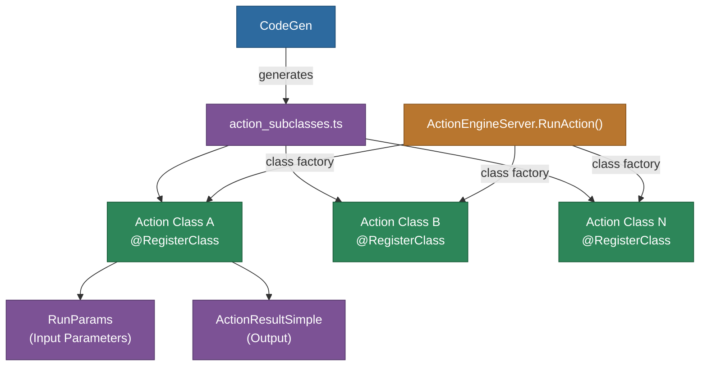

# @memberjunction/generated-actions

CodeGen-produced action subclasses for MemberJunction. Contains auto-generated TypeScript classes that implement database-defined actions with `@RegisterClass` decorators for automatic discovery and execution.

## Overview

This package is **entirely generated by MemberJunction CodeGen** and should never be manually edited. It contains a `BaseAction` subclass for every action defined in the MemberJunction database, each decorated with `@RegisterClass` so the MemberJunction action system can discover and execute them.



## Installation

```bash
npm install @memberjunction/generated-actions
```

## What Gets Generated

For each action defined in the database, CodeGen produces:

- **TypeScript class** extending `BaseAction` with `@RegisterClass` decorator
- **`InternalRunAction()` method** implementing the action's database-defined logic
- **Parameter extraction** from `RunActionParams` with proper typing
- **Child action invocation** for actions composed of sub-actions
- **Result objects** using `ActionResultSimple` with success/failure semantics

## Important Notes

- **Do not manually edit** -- All code is regenerated by CodeGen and manual changes will be overwritten
- **Import for side effects** -- Simply importing this package triggers all `@RegisterClass` decorators
- **Server-side only** -- Actions execute on the server within `ActionEngineServer`
- For custom action implementations, create them in separate packages (e.g., `@memberjunction/core-actions`)

## How It Works

When this package is imported, each action class's `@RegisterClass(BaseAction, 'Action Name')` decorator registers the class with MemberJunction's class factory. When code later calls `ActionEngineServer.RunAction()`, the factory locates the appropriate subclass and invokes its `InternalRunAction()` method.

## Dependencies

| Package | Purpose |
|---------|---------|
| `@memberjunction/core` | Metadata, RunView, RunQuery |
| `@memberjunction/global` | RegisterClass decorator, MJGlobal |
| `@memberjunction/actions-base` | ActionResultSimple, RunActionParams, ActionParam |
| `@memberjunction/actions` | BaseAction, ActionEngineServer |

## License

ISC
