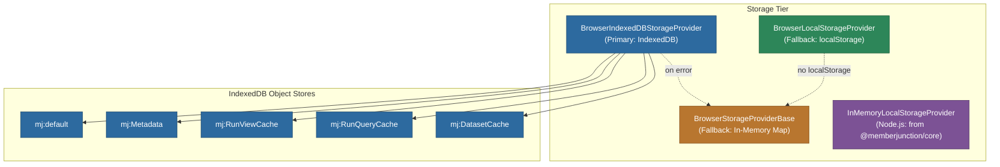
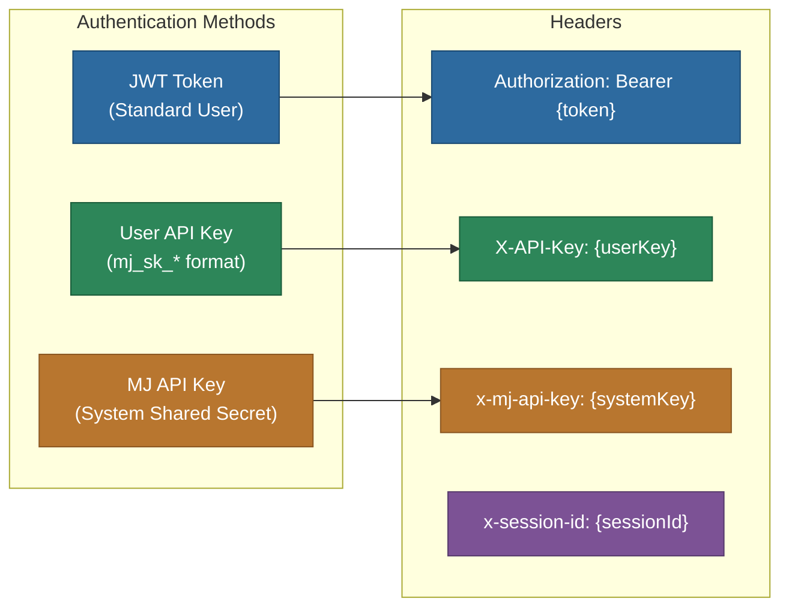

# @memberjunction/graphql-dataprovider

A comprehensive GraphQL client data provider for MemberJunction that serves as the primary data access layer for connecting client and server applications to MemberJunction APIs. It implements the full suite of MemberJunction provider interfaces (entity data, metadata, views, reports, queries) over GraphQL, and includes specialized sub-clients for AI operations, actions, file storage, encryption, testing, version history, and component registries.

## Architecture Overview

```mermaid
graph TB
    subgraph Client Application
        App["Application Code"]
    end

    subgraph GraphQLDataProvider Package
        GDP["GraphQLDataProvider<br/>(Core Provider)"]
        Config["GraphQLProviderConfigData"]
        Setup["setupGraphQLClient()"]
        TG["GraphQLTransactionGroup"]
        FM["FieldMapper"]
        SP["Storage Providers"]

        subgraph Sub-Clients
            AI["GraphQLAIClient"]
            AC["GraphQLActionClient"]
            EC["GraphQLEncryptionClient"]
            FSC["GraphQLFileStorageClient"]
            TC["GraphQLTestingClient"]
            VHC["GraphQLVersionHistoryClient"]
            CRC["GraphQLComponentRegistryClient"]
        end

        subgraph System Client
            SC["GraphQLSystemUserClient"]
        end
    end

    subgraph MJAPI Server
        GQL["GraphQL Endpoint"]
        WS["WebSocket Endpoint"]
    end

    App --> Setup
    Setup --> GDP
    App --> GDP
    App --> SC
    GDP --> AI
    GDP --> AC
    GDP --> EC
    GDP --> FSC
    GDP --> TC
    GDP --> VHC
    GDP --> CRC
    GDP --> TG
    GDP --> FM
    GDP --> SP
    Config --> GDP
    GDP --> GQL
    GDP --> WS
    SC --> GQL

    style GDP fill:#2d6a9f,stroke:#1a4971,color:#fff
    style Config fill:#7c5295,stroke:#563a6b,color:#fff
    style Setup fill:#7c5295,stroke:#563a6b,color:#fff
    style AI fill:#2d8659,stroke:#1a5c3a,color:#fff
    style AC fill:#2d8659,stroke:#1a5c3a,color:#fff
    style EC fill:#2d8659,stroke:#1a5c3a,color:#fff
    style FSC fill:#2d8659,stroke:#1a5c3a,color:#fff
    style TC fill:#2d8659,stroke:#1a5c3a,color:#fff
    style VHC fill:#2d8659,stroke:#1a5c3a,color:#fff
    style CRC fill:#2d8659,stroke:#1a5c3a,color:#fff
    style SC fill:#b8762f,stroke:#8a5722,color:#fff
    style TG fill:#7c5295,stroke:#563a6b,color:#fff
    style FM fill:#7c5295,stroke:#563a6b,color:#fff
    style SP fill:#7c5295,stroke:#563a6b,color:#fff
    style GQL fill:#2d6a9f,stroke:#1a4971,color:#fff
    style WS fill:#2d6a9f,stroke:#1a4971,color:#fff
```



## Installation

```bash
npm install @memberjunction/graphql-dataprovider
```

## Key Features

- **Complete Entity Operations** -- CRUD operations for all MemberJunction entities with full type safety
- **View, Report, and Query Execution** -- Run database views, reports, and custom queries with parameters, pagination, and aggregation support
- **Batch Operations** -- Execute multiple views or queries in a single network roundtrip via `RunViews` / `RunQueries`
- **Cache-Aware Fetching** -- Smart cache validation with `RunViewsWithCacheCheck` and `RunQueriesWithCacheCheck` for differential data updates
- **Transaction Support** -- Execute complex multi-entity operations atomically with variable binding between transactions
- **Action Execution** -- Execute standalone and entity-scoped actions through GraphQL
- **AI Operations** -- Run stored AI prompts, simple ad-hoc prompts, AI agents, and generate text embeddings
- **WebSocket Subscriptions** -- Real-time push status updates via GraphQL subscriptions
- **Offline Caching** -- IndexedDB-based caching with in-memory fallback for browser environments
- **Authentication** -- JWT tokens, user API keys (`mj_sk_*`), and system-level MJ API keys
- **Field Mapping** -- Automatic bidirectional mapping of MemberJunction system fields (`__mj_CreatedAt` to/from `_mj__CreatedAt`)
- **Session Management** -- Persistent session IDs with automatic IndexedDB storage per server URL
- **System User Client** -- Specialized server-to-server client for API key authentication, data sync, roles/users sync, and query management
- **File Storage** -- List, upload, download, move, copy, delete, and search files across storage accounts
- **Encryption** -- API key creation and revocation with server-side cryptographic hashing
- **Testing** -- Run tests and test suites with real-time progress callbacks
- **Version History** -- Create version labels with server-side snapshot capture and dependency traversal
- **Component Registry** -- Fetch, search, and manage component specifications from external registries
- **Duplicate Detection** -- Find potential duplicate records and merge them with transaction scope support
- **Dual Module Format** -- Ships as both ESM (`.mjs`) and CommonJS (`.cjs`) with full TypeScript declarations

## Data Flow

```mermaid
sequenceDiagram
    participant App as Application
    participant GDP as GraphQLDataProvider
    participant FM as FieldMapper
    participant GQL as GraphQL Client
    participant WS as WebSocket Client
    participant API as MJAPI Server

    App->>GDP: setupGraphQLClient(config)
    GDP->>GQL: Create HTTP client with JWT + headers
    GDP->>WS: Create WebSocket client (subscriptions)
    GDP->>API: Load metadata (entities, fields, roles)
    API-->>GDP: Metadata response
    GDP-->>App: Configured provider

    Note over App,API: Entity Operations
    App->>GDP: SaveEntity(data, entityName)
    GDP->>FM: Map __mj_ fields to _mj__
    FM-->>GDP: Mapped data
    GDP->>GQL: Mutation with mapped fields
    GQL->>API: GraphQL request
    API-->>GQL: Response
    GQL-->>GDP: Raw result
    GDP->>FM: Reverse-map _mj__ fields
    FM-->>GDP: Original field names
    GDP-->>App: Entity result

    Note over App,API: Real-time Updates
    App->>GDP: PushStatusUpdates(sessionId)
    GDP->>WS: Subscribe to status channel
    WS->>API: WebSocket subscription
    API-->>WS: Status update message
    WS-->>GDP: Push notification
    GDP-->>App: Observable stream

    style App fill:#2d6a9f,stroke:#1a4971,color:#fff
    style GDP fill:#2d8659,stroke:#1a5c3a,color:#fff
    style FM fill:#7c5295,stroke:#563a6b,color:#fff
    style GQL fill:#b8762f,stroke:#8a5722,color:#fff
    style WS fill:#b8762f,stroke:#8a5722,color:#fff
    style API fill:#2d6a9f,stroke:#1a4971,color:#fff
```

## Quick Start

### Setting Up the GraphQL Client

```typescript
import { setupGraphQLClient, GraphQLProviderConfigData } from '@memberjunction/graphql-dataprovider';

const config = new GraphQLProviderConfigData(
  'your-jwt-token',                     // JWT token for authentication
  'https://api.example.com/graphql',     // GraphQL HTTP endpoint
  'wss://api.example.com/graphql',       // GraphQL WebSocket endpoint
  async () => {                          // Token refresh function
    const newToken = await refreshAuthToken();
    return newToken;
  },
  '__mj',                                // MJ Core schema name (default)
  ['schema1', 'schema2'],                // Include only these schemas (optional)
  ['excluded_schema'],                   // Exclude these schemas (optional)
  'mj-api-key',                          // System API key for server-to-server (optional)
  'mj_sk_user_key'                       // User API key (optional)
);

// Setup creates the provider, loads metadata, and fires the LoggedIn event
const dataProvider = await setupGraphQLClient(config);
```

### Working with Entities

```typescript
import { Metadata, RunView } from '@memberjunction/core';

const md = new Metadata();

// Load a single entity by primary key
const user = await md.GetEntityObject<UserEntity>('Users');
await user.Load({ ID: userId });

// Save changes
user.Email = 'newemail@example.com';
const saveResult = await user.Save();

// Create a new entity
const newUser = await md.GetEntityObject<UserEntity>('Users');
newUser.NewRecord();
newUser.FirstName = 'Jane';
newUser.LastName = 'Doe';
await newUser.Save();

// Delete an entity
await user.Delete();
```

### Executing Views

```typescript
import { RunView, RunViewParams } from '@memberjunction/core';

const rv = new RunView();

// Execute a single view
const result = await rv.RunView<UserEntity>({
  EntityName: 'Users',
  ExtraFilter: "Status = 'Active'",
  OrderBy: 'LastName, FirstName',
  Fields: ['ID', 'FirstName', 'LastName', 'Email'],
  MaxRows: 50,
  ResultType: 'entity_object'
});

if (result.Success) {
  for (const user of result.Results) {
    console.log(user.FirstName, user.LastName);
  }
}

// Execute multiple views in a single network roundtrip
const [users, orders] = await rv.RunViews([
  { EntityName: 'Users', ExtraFilter: "Status = 'Active'", ResultType: 'simple' },
  { EntityName: 'Orders', ExtraFilter: "OrderDate >= '2024-01-01'", ResultType: 'simple' }
]);
```

### Using Transactions

```typescript
import { GraphQLDataProvider } from '@memberjunction/graphql-dataprovider';
import { Metadata } from '@memberjunction/core';

const md = new Metadata();
const provider = GraphQLDataProvider.Instance;

// Create a transaction group for atomic multi-entity operations
const transaction = provider.CreateTransactionGroup();

// Create parent entity
const order = await md.GetEntityObject<OrderEntity>('Orders');
order.NewRecord();
order.Set('CustomerID', customerId);
order.Set('Status', 'New');
const orderTx = transaction.AddTransaction(order);

// Create child entity with variable binding to parent's ID
const item = await md.GetEntityObject<OrderItemEntity>('Order Items');
item.NewRecord();
item.Set('ProductID', productId);
item.Set('Quantity', 2);
const itemTx = transaction.AddTransaction(item);

// Bind the child's OrderID to the parent's generated ID
transaction.AddVariable('orderID', 'ID', 'FieldValue', order, item, 'OrderID');

// Execute all as a single atomic operation
const results = await transaction.Submit();
```

## Sub-Clients

### AI Client

The `GraphQLAIClient` is lazily initialized via `GraphQLDataProvider.AI` and provides AI prompt execution, agent interaction, simple prompts, and embedding generation.

```typescript
const provider = GraphQLDataProvider.Instance;

// Run a stored AI prompt
const promptResult = await provider.AI.RunAIPrompt({
  promptId: 'prompt-uuid',
  data: { context: 'relevant data' },
  temperature: 0.7,
  topP: 0.9,
  responseFormat: 'json'
});

// Execute a simple ad-hoc prompt (no stored prompt needed)
const simpleResult = await provider.AI.ExecuteSimplePrompt({
  systemPrompt: 'You are a helpful data analyst',
  messages: [
    { message: 'Summarize the key trends', role: 'user' }
  ],
  modelPower: 'medium',
  responseFormat: 'json'
});

// Generate text embeddings
const embedResult = await provider.AI.EmbedText({
  textToEmbed: ['Hello world', 'How are you?'],
  modelSize: 'small'
});
console.log('Dimensions:', embedResult.vectorDimensions);

// Run an AI agent with progress tracking
const agentResult = await provider.AI.RunAIAgent({
  agent: agentEntity,
  conversationMessages: messages,
  data: { location: 'New York' },
  onProgress: (progress) => {
    console.log(`${progress.currentStep}: ${progress.message}`);
  }
});
```

### Action Client

```typescript
import { GraphQLActionClient } from '@memberjunction/graphql-dataprovider';

const actionClient = new GraphQLActionClient(provider);

// Run a standalone action
const result = await actionClient.RunAction('action-uuid', [
  { Name: 'parameter1', Value: 'value1', Type: 'Input' }
]);

// Run an entity action on a specific record
const entityResult = await actionClient.RunEntityAction({
  EntityAction: entityAction,
  InvocationType: { Name: 'SingleRecord' },
  EntityObject: entityObject,
  ContextUser: currentUser
});
```

### File Storage Client

```typescript
import { GraphQLFileStorageClient } from '@memberjunction/graphql-dataprovider';

const storageClient = new GraphQLFileStorageClient(provider);

// List objects in a directory
const objects = await storageClient.ListObjects(accountId, 'documents/');

// Get a pre-authenticated upload URL
const upload = await storageClient.CreatePreAuthUploadUrl(
  accountId, 'documents/report.pdf', 'application/pdf'
);
await fetch(upload.uploadUrl, { method: 'PUT', body: fileContent });

// Get a pre-authenticated download URL
const downloadUrl = await storageClient.CreatePreAuthDownloadUrl(
  accountId, 'documents/report.pdf'
);

// Search across multiple storage accounts
const searchResults = await storageClient.SearchFiles(
  [accountId1, accountId2],
  'quarterly report',
  { maxResultsPerAccount: 10, fileTypes: ['pdf', 'docx'], searchContent: true }
);
```

### Encryption Client

```typescript
import { GraphQLEncryptionClient } from '@memberjunction/graphql-dataprovider';

const encryptionClient = new GraphQLEncryptionClient(provider);

// Create an API key (raw key shown once only)
const keyResult = await encryptionClient.CreateAPIKey({
  Label: 'My Integration Key',
  Description: 'Used for external service access',
  ExpiresAt: new Date('2026-12-31'),
  ScopeIDs: ['scope-id-1']
});
if (keyResult.Success) {
  console.log('Save this key:', keyResult.RawKey); // Cannot be recovered
}

// Revoke an API key
await encryptionClient.RevokeAPIKey('key-uuid');
```

### Testing Client

```typescript
import { GraphQLTestingClient } from '@memberjunction/graphql-dataprovider';

const testingClient = new GraphQLTestingClient(provider);

// Run a single test with progress tracking
const testResult = await testingClient.RunTest({
  testId: 'test-uuid',
  verbose: true,
  environment: 'staging',
  onProgress: (progress) => {
    console.log(`${progress.currentStep}: ${progress.message} (${progress.percentage}%)`);
  }
});

// Run a test suite
const suiteResult = await testingClient.RunTestSuite({
  suiteId: 'suite-uuid',
  parallel: true,
  sequenceStart: 1,
  sequenceEnd: 10
});
```

### Version History Client

```typescript
import { GraphQLVersionHistoryClient } from '@memberjunction/graphql-dataprovider';

const vhClient = new GraphQLVersionHistoryClient(provider);

const result = await vhClient.CreateLabel({
  Name: 'Before Refactor',
  Scope: 'Record',
  EntityName: 'AI Prompts',
  RecordKeys: [{ Key: 'ID', Value: recordId }],
  IncludeDependencies: true,
  MaxDepth: 3,
  OnProgress: (progress) => {
    console.log(`${progress.Step}: ${progress.Message} (${progress.Percentage}%)`);
  }
});
```

### Component Registry Client

```typescript
import { GraphQLComponentRegistryClient } from '@memberjunction/graphql-dataprovider';

const registryClient = new GraphQLComponentRegistryClient(provider);

// Fetch a specific component
const component = await registryClient.GetRegistryComponent({
  registryName: 'MJ',
  namespace: 'core/ui',
  name: 'DataGrid',
  version: '1.0.0'
});

// Search for components
const searchResult = await registryClient.SearchRegistryComponents({
  query: 'dashboard',
  type: 'dashboard',
  tags: ['analytics'],
  limit: 20
});

// Resolve dependency tree
const deps = await registryClient.ResolveComponentDependencies('registry-id', 'component-id');
```

### System User Client

The `GraphQLSystemUserClient` is designed exclusively for server-to-server communication using MJ API keys (shared secrets). It bypasses the full metadata loading of the standard provider and supports parallel use alongside the regular client.

```typescript
import { GraphQLSystemUserClient } from '@memberjunction/graphql-dataprovider';

const systemClient = new GraphQLSystemUserClient(
  'https://api.example.com/graphql',
  '',                // No JWT needed for system user
  'session-id',
  'mj-api-key'       // Shared secret key
);

// Execute read-only SQL queries
const data = await systemClient.GetData(
  ['SELECT * FROM Users WHERE Active = 1'],
  'short-lived-access-token'
);

// Run views as system user
const viewResult = await systemClient.RunDynamicView({
  EntityName: 'Users',
  ExtraFilter: "Status = 'Active'",
  MaxRows: 100
});

// Sync roles and users to a remote server
await systemClient.SyncRolesAndUsers({
  Roles: [{ ID: '1', Name: 'Admin', Description: 'Administrator' }],
  Users: [{
    ID: '1', Name: 'john.doe', Email: 'john@example.com',
    Type: 'User', FirstName: 'John', LastName: 'Doe',
    Roles: [{ ID: '1', Name: 'Admin', Description: 'Administrator' }]
  }]
});

// Sync data records (create, update, delete)
await systemClient.SyncData([{
  EntityName: 'Companies',
  Type: SyncDataAction.CreateOrUpdate,
  AlternateKey: { KeyValuePairs: [{ FieldName: 'Name', Value: 'Acme Inc' }] },
  RecordJSON: JSON.stringify({ Name: 'Acme Inc', Status: 'Active' })
}]);

// Create/update/delete queries as system user
const queryResult = await systemClient.CreateQuery({
  Name: 'Active Users Report',
  CategoryPath: 'Reports/Users',
  SQL: 'SELECT * FROM Users WHERE Active = 1',
  Status: 'Approved'
});

// AI operations as system user
const promptResult = await systemClient.RunAIPrompt({
  promptId: 'prompt-uuid',
  data: { context: 'system data' }
});
```

## Storage Providers

The package includes a tiered local storage system for metadata caching and session persistence.



- **`BrowserIndexedDBStorageProvider`** -- Primary storage in browser environments. Uses IndexedDB with dedicated object stores per category (`mj:Metadata`, `mj:RunViewCache`, etc.). Falls back to in-memory storage on error.
- **`BrowserLocalStorageProvider`** -- Uses `localStorage` with key prefixing (`[mj]:[category]:[key]`). Falls back to in-memory storage when `localStorage` is unavailable.
- **`BrowserStorageProviderBase`** -- Pure in-memory storage using nested `Map` structures. Used as the ultimate fallback.
- **`InMemoryLocalStorageProvider`** -- From `@memberjunction/core`, used in Node.js environments where browser APIs are not available.

## Field Mapping

The `FieldMapper` class handles bidirectional mapping of MemberJunction system fields between client and server naming conventions. GraphQL does not allow field names starting with double underscores, so the provider automatically translates them.

| Client Field Name | Server (GraphQL) Field Name |
|---|---|
| `__mj_CreatedAt` | `_mj__CreatedAt` |
| `__mj_UpdatedAt` | `_mj__UpdatedAt` |
| `__mj_DeletedAt` | `_mj__DeletedAt` |

```typescript
import { FieldMapper } from '@memberjunction/graphql-dataprovider';

const mapper = new FieldMapper();

// Forward mapping (client -> server)
mapper.MapFieldName('__mj_CreatedAt');  // Returns '_mj__CreatedAt'

// Reverse mapping (server -> client)
mapper.ReverseMapFieldName('_mj__CreatedAt');  // Returns '__mj_CreatedAt'

// Map all fields in an object (mutates in place)
const obj = { __mj_CreatedAt: '2024-01-01', Name: 'Test' };
mapper.MapFields(obj);
// Result: { _mj__CreatedAt: '2024-01-01', Name: 'Test' }
```

## Authentication Modes



| Mode | Header | Use Case |
|---|---|---|
| **JWT Token** | `Authorization: Bearer {token}` | Standard browser/client authentication with automatic refresh |
| **User API Key** | `X-API-Key: mj_sk_...` | Automated access on behalf of a specific user without OAuth |
| **MJ API Key** | `x-mj-api-key: {key}` | Server-to-server system-level communication (never use in browsers) |
| **Session ID** | `x-session-id: {uuid}` | Sent with every request for session tracking and WebSocket correlation |

## Exported Classes and Types

| Export | Description |
|---|---|
| `GraphQLDataProvider` | Core provider implementing `IEntityDataProvider`, `IMetadataProvider`, `IRunViewProvider`, `IRunReportProvider` |
| `GraphQLProviderConfigData` | Configuration class with JWT, URLs, refresh function, schema filters, and API keys |
| `setupGraphQLClient()` | Helper function that creates, configures, and initializes the provider in a single call |
| `GraphQLTransactionGroup` | Manages atomic multi-entity transactions with variable binding |
| `FieldMapper` | Bidirectional system field name mapping between client and server |
| `GraphQLAIClient` | AI prompt execution, agent interaction, simple prompts, and embedding generation |
| `GraphQLActionClient` | Standalone action and entity action execution |
| `GraphQLEncryptionClient` | API key creation with server-side cryptographic hashing and revocation |
| `GraphQLFileStorageClient` | File storage operations: list, upload, download, move, copy, delete, and search |
| `GraphQLTestingClient` | Test and test suite execution with real-time progress callbacks |
| `GraphQLVersionHistoryClient` | Version label creation with server-side snapshot capture |
| `GraphQLComponentRegistryClient` | Component registry fetching, searching, dependency resolution, and feedback |
| `GraphQLSystemUserClient` | Server-to-server client using API keys for data sync, views, queries, AI, and roles |
| `BrowserIndexedDBStorageProvider` | IndexedDB-based storage with category-specific object stores |
| `BrowserStorageProviderBase` | In-memory fallback storage using nested `Map` structures |
| Sync types | `SyncRolesAndUsersResult`, `RoleInput`, `UserInput`, `RolesAndUsersInput`, `SyncDataAction`, `ActionItemInput`, `SyncDataResult`, `ActionItemOutput` |
| AI types | `RunAIPromptParams`, `RunAIPromptResult`, `ExecuteSimplePromptParams`, `SimplePromptResult`, `EmbedTextParams`, `EmbedTextResult` |
| Testing types | `RunTestParams`, `RunTestResult`, `RunTestSuiteParams`, `RunTestSuiteResult`, `TestExecutionProgress` |
| Registry types | `GetRegistryComponentParams`, `SearchRegistryComponentsParams`, `RegistryComponentSearchResult`, `ComponentDependencyTree`, `ComponentSpecWithHash` |
| Version types | `CreateVersionLabelParams`, `CreateVersionLabelProgress`, `CreateVersionLabelResult` |
| Encryption types | `CreateAPIKeyParams`, `CreateAPIKeyResult`, `RevokeAPIKeyResult` |
| System client types | `GetDataOutput`, `SimpleRemoteEntityOutput`, `RunViewByNameSystemUserInput`, `RunViewByIDSystemUserInput`, `RunDynamicViewSystemUserInput`, `RunViewSystemUserInput`, `RunViewSystemUserResult`, `RunQuerySystemUserResult`, `CreateQueryInput`, `CreateQueryResult`, `UpdateQueryInput`, `UpdateQueryResult`, `DeleteQueryResult` |

## Dependencies

| Package | Purpose |
|---|---|
| `@memberjunction/core` | Core MemberJunction framework: entities, metadata, views, reports, queries, providers |
| `@memberjunction/core-entities` | Generated entity type definitions and extended entity classes |
| `@memberjunction/global` | Global utilities: `MJGlobal`, `SafeJSONParse`, `RegisterClass` |
| `@memberjunction/actions-base` | Action system base classes: `ActionParam`, `ActionResult`, `EntityActionInvocationParams` |
| `@memberjunction/ai-core-plus` | AI types: `ExecuteAgentParams`, `ExecuteAgentResult` |
| `@memberjunction/interactive-component-types` | `ComponentSpec` type for component registry operations |
| `graphql` | GraphQL language parsing and tag template literal (`gql`) |
| `graphql-request` | Lightweight GraphQL HTTP client with header management |
| `graphql-ws` | GraphQL WebSocket client for subscriptions and real-time push updates |
| `@tempfix/idb` | IndexedDB wrapper for typed, promise-based IndexedDB access |
| `rxjs` | Reactive extensions for WebSocket subscription observables |
| `uuid` | UUID v4 generation for session IDs |

## Build

```bash
# Type-check and build with pkgroll (outputs ESM + CJS + TypeScript declarations)
npm run build

# Build with inline source maps and no minification (debugging)
npm run build-debug
```

The package uses `pkgroll` for bundling and produces:
- `dist/index.mjs` -- ES module
- `dist/index.cjs` -- CommonJS module
- `dist/index.d.mts` / `dist/index.d.cts` -- TypeScript declaration files
- Source maps for full debugging support

## Requirements

- Node.js 18+
- Modern browser with IndexedDB and WebSocket support (for browser usage)
- MemberJunction GraphQL API endpoint (MJAPI server)
- Valid JWT token, user API key, or MJ API key for authentication

## License

ISC
